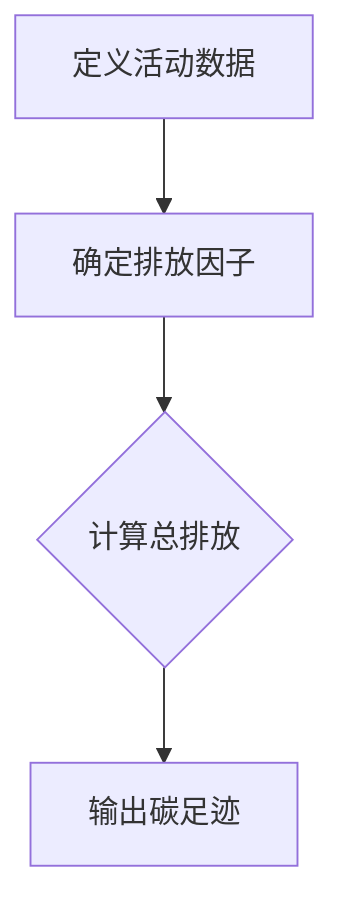
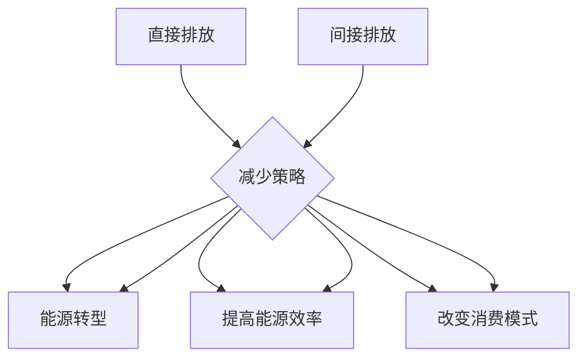
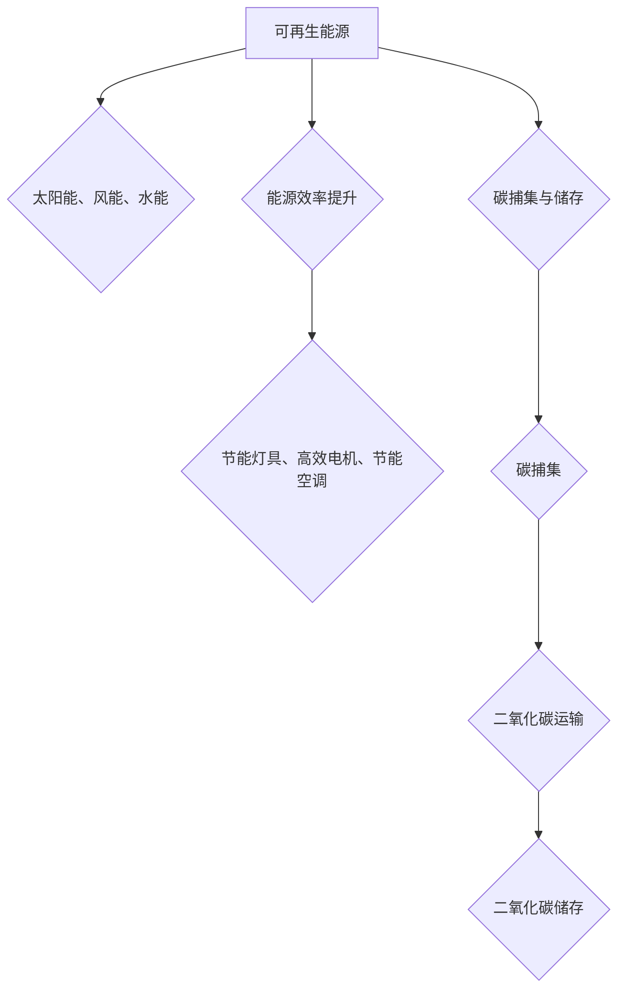
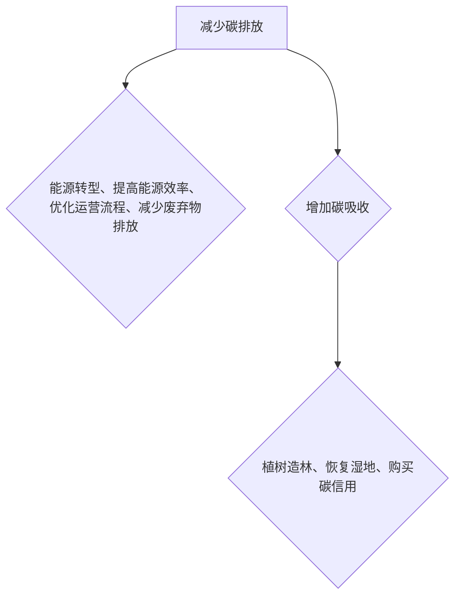
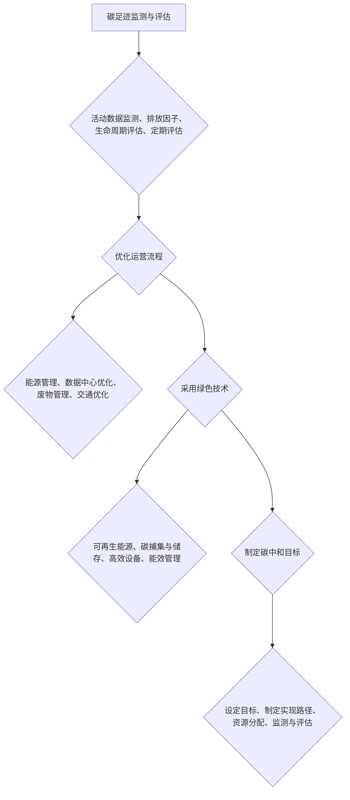

                 

## 第1章 背景介绍

### 1.1 问题背景

#### 1.1.1 碳足迹的概念

碳足迹是指个人、组织或国家在一定时间内产生的温室气体排放总量，通常以二氧化碳（CO₂）当量来衡量。这个概念不仅涵盖了直接排放的二氧化碳，还包括其他温室气体，如甲烷（CH₄）和氧化亚氮（N₂O）。碳足迹已成为衡量环境和气候影响的重要指标，因为它能够帮助我们了解人类活动对地球生态系统的影响。

在过去的几十年中，全球碳足迹持续增加，主要原因是工业化和现代化进程中能源消耗的快速增长。特别是信息技术（IT）行业，作为一个高能耗的行业，其碳足迹问题尤为突出。数据中心、服务器、网络设备和用户终端等设备在运行过程中消耗大量的电力，从而导致碳排放的增加。

#### 1.1.2 碳足迹的重要性

碳足迹的影响不仅局限于气候变化。它还影响到生态平衡和人类健康。高浓度的温室气体会导致全球气温上升，极端天气事件增多，海平面上升，影响农业生产和生态系统。此外，空气中的二氧化碳和其他污染物还会导致呼吸系统疾病和心血管疾病的发病率上升。

降低碳足迹对减缓气候变化至关重要。通过减少温室气体排放，我们可以降低全球气温上升的速度，从而减少极端天气事件的发生频率和强度。同时，降低碳足迹还可以提高资源利用效率，降低能源成本，促进可持续发展。

### 1.2 问题描述

IT组织在运营过程中产生大量的碳排放，这对环境和气候产生了负面影响。因此，关注碳足迹管理成为IT组织面临的重要问题。碳足迹管理涉及多个方面：

1. **能源消耗**：数据中心、服务器和网络设备等设备在运行过程中消耗大量电力，导致碳排放增加。
2. **设备运维**：设备老化和维护不当会导致能源效率降低，从而增加碳排放。
3. **数据处理**：数据中心的能耗主要来源于数据存储和处理，这需要大量的电力支持。

### 1.3 问题解决

为了解决IT组织的碳足迹问题，可以采取以下措施：

1. **碳排放监测**：通过监测能源消耗和碳排放数据，了解组织的碳排放状况。
2. **优化运营流程**：通过优化数据中心能源管理和网络通信，降低能耗。
3. **采用绿色技术**：使用可再生能源和高效能源设备，减少碳排放。
4. **制定碳足迹管理策略**：设定碳中和目标，制定实现路径，并持续改进。

### 1.4 边界与外延

碳足迹管理范围包括IT设备、数据中心、网络通信和软件开发等。此外，跨行业合作、政策法规和行业标准也是碳足迹管理的重要方面。例如，IT组织可以与能源供应商合作，采用可再生能源，同时遵循国家和国际的政策法规，积极参与碳排放交易市场。

### 1.5 概念结构与核心要素组成

#### 核心概念

- **碳足迹**：个人、组织或国家在一定时间内产生的温室气体排放总量。
- **碳排放**：释放到大气中的二氧化碳和其他温室气体。
- **绿色技术**：减少能源消耗和碳排放的技术和方法。
- **碳中和**：通过减少碳排放和增加碳吸收实现净零碳排放。

#### 核心要素

- **能源消耗**：设备运行过程中消耗的电力。
- **设备运维**：设备老化和维护对能源消耗的影响。
- **数据处理**：数据存储和处理过程中的能耗。
- **政策法规**：国家和国际的政策法规对碳足迹管理的影响。
- **行业标准**：IT行业的碳足迹管理标准。

通过以上分析，我们可以看到，IT组织关注碳足迹的重要性不仅体现在对环境的保护上，还关系到企业的社会责任和商业竞争力。接下来，我们将深入探讨碳足迹管理的核心概念和联系，为后续章节的详细分析打下基础。

## 第2章 核心概念与联系

### 2.1 碳足迹的定义与特点

#### 2.1.1 碳足迹的定义

碳足迹是指个人、组织或国家在一定时间内产生的温室气体排放总量，通常以二氧化碳（CO₂）当量来衡量。它是一个量化的指标，用来衡量人类活动对环境的影响，尤其是气候变化的影响。

#### 2.1.2 碳足迹的特点

1. **综合性**：碳足迹涵盖了多个方面，包括能源消耗、交通运输、工业生产等。这意味着，要全面管理碳足迹，需要从多个角度出发，考虑不同活动对碳排放的影响。
2. **动态性**：碳排放数据会随时间、技术和政策变化而变化。例如，随着可再生能源技术的发展，碳足迹可能会逐渐减少。同时，政策法规的更新和执行也会对碳排放产生影响。
3. **量化性**：碳足迹以千克或吨为单位表示，这使得我们可以通过数据来具体了解碳排放的规模和影响。这种量化性有助于我们制定有效的减排策略。

### 2.2 碳排放的定义与类型

#### 2.2.1 碳排放的定义

碳排放是指释放到大气中的二氧化碳和其他温室气体。这些气体能够吸收和重新辐射地球表面的长波辐射，导致全球气候变暖。碳排放的来源包括工业生产、交通运输、能源消耗等。

#### 2.2.2 碳排放的类型

1. **直接排放**：直接排放是指在生产过程中直接释放的二氧化碳和其他温室气体。例如，汽车尾气排放、工业生产排放等。
2. **间接排放**：间接排放是指通过其他活动产生的二氧化碳和其他温室气体。例如，电力和热力的生产和消费过程中产生的二氧化碳。

#### 2.2.3 碳排放的影响

1. **气候变化**：碳排放是导致全球气候变暖的主要原因之一。高浓度的温室气体会导致全球气温上升，极端天气事件增多，海平面上升等。
2. **生态系统影响**：碳排放不仅影响气候变化，还会对生态系统产生负面影响。例如，二氧化碳溶解在海水中会导致海洋酸化，影响海洋生物的生存。
3. **人类健康**：空气中的二氧化碳和其他污染物会导致呼吸系统疾病和心血管疾病的发病率上升。

### 2.3 绿色技术的定义与应用

#### 2.3.1 绿色技术的定义

绿色技术是指减少能源消耗和碳排放的技术和方法。这些技术旨在提高能源利用效率，减少温室气体排放，从而降低对环境的影响。

#### 2.3.2 绿色技术的应用

1. **可再生能源**：例如，太阳能、风能、水能等。这些能源不产生温室气体排放，能够替代化石燃料，降低碳排放。
2. **能源效率提升**：例如，节能灯具、高效电机、高效空调等。这些设备能够提高能源利用效率，减少能源消耗，从而降低碳排放。
3. **碳捕集与储存**：例如，碳捕集与储存（CCS）技术。这种技术能够捕捉和储存工业生产过程中产生的二氧化碳，防止其排放到大气中。

### 2.4 碳中和的定义与实现途径

#### 2.4.1 碳中和的定义

碳中和是指通过减少碳排放和增加碳吸收实现净零碳排放。这意味着，组织或国家的碳排放量将被其碳吸收量所抵消，从而实现净零排放。

#### 2.4.2 碳中和对IT组织的意义

1. **环保责任**：碳中和是履行社会责任的重要举措。通过减少碳排放，IT组织可以降低对环境的负面影响，保护地球生态系统。
2. **商业机会**：碳中和可以带来商业机会。随着绿色技术和可再生能源的不断发展，IT组织可以通过投资绿色技术、参与碳交易市场等获得经济利益。

#### 2.4.3 实现碳中和的途径

1. **减少碳排放**：通过采用绿色技术、优化运营流程、使用可再生能源等手段，减少碳排放。
2. **增加碳吸收**：通过种植树木、恢复湿地、建设碳汇等手段，增加碳吸收。

### 2.5 碳足迹管理策略

#### 2.5.1 碳足迹监测与评估

碳足迹监测与评估是碳足迹管理的基础。通过监测和评估，组织可以了解其碳排放状况，发现潜在的问题和改进机会。

#### 2.5.2 优化运营流程

优化运营流程是减少碳排放的重要手段。通过改进设备管理、优化数据处理流程、提升能源利用效率等，可以显著降低碳排放。

#### 2.5.3 采用绿色技术

采用绿色技术是降低碳排放的有效途径。通过使用可再生能源、提高能源效率、实施碳捕集与储存技术等，可以减少温室气体排放。

#### 2.5.4 制定碳中和目标

制定碳中和目标是实现碳足迹管理的长期目标。通过设定明确的目标和实现路径，组织可以系统地推进碳中和工作。

通过以上分析，我们可以看到，碳足迹管理是一个复杂但至关重要的任务。IT组织需要关注碳足迹的重要性，采取有效的管理策略，以实现环保和商业目标。接下来，我们将详细探讨碳足迹管理的策略和方法，为IT组织提供具体的操作指南。

### 2.1 碳足迹的定义与特点

碳足迹（Carbon Footprint）作为一个衡量温室气体排放的指标，具有以下几个核心定义和特点：

#### 2.1.1 碳足迹的定义

碳足迹是指个人、组织或国家在一定时间内直接或间接排放到大气中的二氧化碳（CO₂）和其他温室气体（如甲烷（CH₄）、氧化亚氮（N₂O）等）的总和。它通常以二氧化碳当量（CO₂-eq）来表示，这是因为不同温室气体的全球变暖潜力（GWP，Global Warming Potential）不同。因此，将不同温室气体转换为二氧化碳当量，可以使碳足迹的比较更加直观和统一。

#### 2.1.2 碳足迹的特点

1. **综合性**：碳足迹涵盖了广泛的领域，包括能源消耗、交通运输、工业生产、农业活动、废物处理等。这意味着，一个组织的碳足迹不仅受到其自身活动的影响，还受到其供应链、客户使用产品或服务后的行为等因素的间接影响。

2. **动态性**：碳足迹不是静态的，它会随着时间、技术进步、政策变化以及个人或组织行为的变化而变化。例如，随着可再生能源技术的普及，越来越多的组织开始使用太阳能和风能，这会显著减少其碳足迹。

3. **量化性**：碳足迹可以量化，通常以吨（t）或千克（kg）为单位。这种量化性使得组织能够通过数据分析和比较来评估其碳足迹的大小，并制定相应的减排策略。

为了更清晰地理解碳足迹的定义和特点，我们可以通过以下表格来对比不同温室气体的全球变暖潜力（GWP）：

| 温室气体 | GWP（100年） |  
| ------- | -------------- |  
| 二氧化碳（CO₂） | 1 |  
| 甲烷（CH₄） | 25-86 |  
| 氧化亚氮（N₂O） | 298 |  
| 氟氯化碳（CFC-12） | 21000 |

由于甲烷和氧化亚氮的GWP远高于二氧化碳，因此即使在排放量较小的情况下，它们对气候变化的贡献也很大。例如，根据联合国环境规划署（UNEP）的数据，甲烷的全球变暖潜力是二氧化碳的25-86倍。

#### 2.1.3 碳足迹的衡量方法

衡量碳足迹的方法主要包括以下几种：

1. **生命周期评估（Life Cycle Assessment, LCA）**：LCA是一种系统方法，用于评估一个产品或服务在其整个生命周期中的碳足迹。这包括原材料的开采、制造、运输、使用和处置等各个环节。
   
2. **活动数据监测**：通过监测和记录组织的日常活动数据，如能源消耗、交通运输、废物排放等，可以计算其碳足迹。

3. **基于模型的估算**：使用现有的碳足迹估算模型和工具，根据输入的数据进行计算。这些模型通常考虑多种因素，如能源消耗、排放因子和活动数据。

为了更直观地展示碳足迹的构成，我们可以使用Mermaid流程图来表示一个简单的碳足迹计算过程：

在上面的流程图中，首先需要定义组织的活动数据，然后确定相应的排放因子，最后通过计算得出总排放量，即碳足迹。

通过上述分析，我们可以看到，碳足迹是一个多维度、动态变化且量化的指标。理解其定义和特点，对于组织制定有效的碳足迹管理策略至关重要。接下来，我们将进一步探讨碳排放的定义和类型，以及如何通过绿色技术和碳中和来实现碳足迹的减少。

### 2.2 碳排放的定义与类型

#### 2.2.1 碳排放的定义

碳排放（Carbon Emissions）是指将二氧化碳（CO₂）和其他温室气体（如甲烷（CH₄）、氧化亚氮（N₂O）等）排放到大气中的过程。这些温室气体能够吸收和重新辐射地球表面的长波辐射，导致全球气候变暖。碳排放的来源多种多样，包括工业生产、能源消耗、交通运输、农业活动等。

碳排放是衡量温室气体排放量和评估气候变化风险的重要指标。通过监测和减少碳排放，我们可以减缓全球气候变暖的趋势，保护地球生态系统。

#### 2.2.2 碳排放的类型

碳排放可以分为以下几种主要类型：

1. **直接排放**：直接排放（Direct Emissions）是指在生产过程中直接释放的二氧化碳和其他温室气体。这些排放通常与具体活动紧密相关，如工厂生产、汽车行驶等。直接排放可以通过活动数据直接测量和计算。

   例如，一辆汽车在行驶过程中会直接排放二氧化碳，其排放量可以通过车辆的平均油耗和燃油的碳排放因子计算得出。

2. **间接排放**：间接排放（Indirect Emissions）是指通过其他活动产生的二氧化碳和其他温室气体。这些排放与具体活动之间没有直接的联系，但通过对整个能源供应、原材料采购和供应链的管理，可以间接影响碳排放。

   例如，一个家庭使用电灯和电器，虽然这些设备的直接排放来自电力生产，但家庭用电的间接排放与电网的发电方式（如化石燃料发电或可再生能源发电）密切相关。

#### 2.2.3 碳排放的影响

碳排放对环境和社会的影响是多方面的，主要包括以下几个方面：

1. **气候变化**：高浓度的温室气体导致全球气温上升，极端天气事件（如热浪、暴雨、干旱等）的频率和强度增加。气候变化对农业生产、水资源管理、生态系统和人类健康都带来了巨大的挑战。

2. **生态系统影响**：碳排放不仅影响气候变化，还会对生态系统产生负面影响。例如，海洋酸化是由溶解在海水中的二氧化碳引起的，这会对珊瑚礁和海洋生物的生存产生威胁。

3. **人类健康**：空气中的二氧化碳和其他污染物（如一氧化碳、氮氧化物等）会导致呼吸系统疾病和心血管疾病的发病率上升。长期暴露在高污染的环境中，还会增加患癌症的风险。

#### 2.2.4 碳排放的减少策略

减少碳排放是应对气候变化和环境保护的重要措施。以下是一些有效的碳排放减少策略：

1. **能源转型**：推动能源结构向低碳或无碳方向转型，增加可再生能源（如太阳能、风能、水能）的使用，减少对化石燃料的依赖。

2. **提高能源效率**：通过采用高效的能源设备和工艺，减少能源消耗。例如，使用节能灯具、高效电机、节能空调等。

3. **碳捕集与储存（CCS）**：通过捕集和储存工业生产过程中产生的二氧化碳，防止其排放到大气中。CCS技术是减缓碳排放的重要手段，尤其是在高碳排放的行业，如钢铁、水泥和电力行业。

4. **改变消费模式**：鼓励消费者选择低碳产品和服务，减少浪费，提高资源利用效率。例如，鼓励使用公共交通工具、骑自行车或步行，减少私家车使用。

为了更直观地展示碳排放的类型和减少策略，我们可以使用Mermaid流程图来表示：

在上面的流程图中，我们可以看到直接排放和间接排放都需要通过多种策略来减少。能源转型、提高能源效率和改变消费模式是关键策略，而CCS技术则是针对直接排放的重要手段。

通过上述分析，我们可以看到，碳排放对环境和人类健康的影响是深远的。理解碳排放的类型和减少策略，对于IT组织和其他企业制定有效的碳足迹管理策略至关重要。接下来，我们将进一步探讨绿色技术的定义和应用，以及如何通过这些技术减少碳排放。

### 2.3 绿色技术的定义与应用

#### 2.3.1 绿色技术的定义

绿色技术（Green Technology）是指旨在减少能源消耗和碳排放、保护环境、促进可持续发展的技术。这些技术通过创新和改进现有工艺，提高资源利用效率，减少污染物排放，从而实现环境、经济和社会效益的统一。

绿色技术不仅包括可再生能源的开发和利用，如太阳能、风能、水能等，还涵盖了能源效率的提升，如节能设备、智能电网、高效电机等，以及减少污染和废弃物的排放，如碳捕集与储存（CCS）技术、废物回收与再利用等。

#### 2.3.2 绿色技术的应用

1. **可再生能源**：可再生能源技术是绿色技术的核心，通过利用自然界的能量，如太阳能、风能、水能等，生产清洁的电力和热能。这些能源不仅减少了对化石燃料的依赖，降低了碳排放，还提高了能源的自主性和稳定性。

   - **太阳能**：太阳能通过光伏板将太阳光直接转化为电能，广泛应用于家庭、商业和工业领域。太阳能系统具有无污染、安装便捷、运行成本低等优点。
   - **风能**：风能通过风力涡轮机将风能转化为电能，适用于大规模发电。风能资源丰富，尤其在一些风力资源丰富的地区，如沿海和山区。
   - **水能**：水能通过水力发电站将水的势能转化为电能，是世界上最成熟的可再生能源技术之一。水能发电具有运行成本低、发电稳定等优点。

2. **能源效率提升**：提高能源效率是减少碳排放的有效途径。通过采用高效的能源设备和工艺，可以显著降低能源消耗。

   - **节能灯具**：LED灯具相比传统白炽灯和荧光灯，具有更高的光效和更长的使用寿命，能够大幅降低照明能耗。
   - **高效电机**：高效电机采用先进的电机设计和控制系统，能够提高能效，减少能源浪费。
   - **节能空调**：节能空调系统采用高效的制冷技术和智能控制系统，能够提高制冷效果，降低能耗。

3. **碳捕集与储存（CCS）**：碳捕集与储存技术通过捕集工业生产过程中产生的二氧化碳，防止其排放到大气中，并将其储存于地下或其他安全地点。这种技术对于减少高碳排放行业（如钢铁、水泥、电力等）的碳排放具有重要意义。

   - **碳捕集**：通过化学吸收、物理吸附和膜分离等技术，从烟气中捕集二氧化碳。
   - **二氧化碳运输**：将捕集的二氧化碳运输到储存地点，通常采用高压气体输送或液化运输。
   - **二氧化碳储存**：将二氧化碳注入地下地层，如油层、天然气田或盐矿层，通过物理、化学和地质作用将其稳定储存。

为了更直观地展示绿色技术的应用，我们可以使用Mermaid流程图来表示：

在上面的流程图中，绿色技术的应用涵盖了可再生能源、能源效率提升和碳捕集与储存三个方面。通过这些技术的综合应用，可以显著减少碳排放，促进可持续发展。

通过上述分析，我们可以看到，绿色技术为减少碳排放提供了多种途径和解决方案。IT组织和其他企业可以积极采用这些技术，通过绿色转型实现碳足迹的减少，为环境保护和可持续发展做出贡献。

### 2.4 碳中和的定义与实现途径

#### 2.4.1 碳中和的定义

碳中和（Carbon Neutrality）是指通过减少碳排放和增加碳吸收，实现净零碳排放的状态。这意味着，组织或国家的总碳排放量将被其碳吸收量所抵消，从而实现碳排放与吸收的平衡，达到零净排放。

碳中和的目标是通过多种措施减少温室气体的排放，并利用碳吸收手段来中和剩余的排放量。实现碳中和不仅有助于减缓气候变化，还可以提高组织的环保形象和可持续发展能力。

#### 2.4.2 碳中和对IT组织的意义

对于IT组织来说，实现碳中和具有重要意义：

1. **环保责任**：作为高能耗行业，IT组织在减少碳排放方面负有重要责任。实现碳中和是履行社会责任、推动可持续发展的重要举措。

2. **品牌形象**：随着社会对环保问题的关注不断增加，实现碳中和可以提升组织的品牌形象，增强公众和客户的信任。

3. **商业机会**：碳中和可以带动绿色技术的创新和应用，为组织带来新的商业机会。例如，投资可再生能源、参与碳交易市场等。

4. **成本优化**：通过优化能源消耗和运营流程，实现碳中和可以帮助组织降低能源成本，提高资源利用效率。

#### 2.4.3 实现碳中和的途径

实现碳中和需要从多个方面入手，包括减少碳排放和增加碳吸收。以下是一些具体的实现途径：

1. **减少碳排放**：

   - **能源转型**：逐步减少对化石燃料的依赖，增加可再生能源的使用，如太阳能、风能、水能等。

   - **提高能源效率**：采用高效能源设备和技术，如高效服务器、节能灯具、高效空调等，减少能源消耗。

   - **优化运营流程**：改进数据中心和设备的运维管理，减少能源浪费。例如，通过虚拟化和云计算技术提高资源利用率。

   - **减少废弃物排放**：减少数据中心和设备废弃物的产生，推进废物回收和再利用。

2. **增加碳吸收**：

   - **植树造林**：通过种植树木和其他植物，增加碳吸收。树木在生长过程中会吸收二氧化碳，并将其固定在生物质中。

   - **恢复湿地**：湿地是重要的碳汇，通过恢复和重建湿地，可以增加碳吸收。

   - **购买碳信用**：参与碳交易市场，购买碳信用（Carbon Credits），用于抵消无法立即减少的碳排放。

为了更好地理解碳中和的实现途径，我们可以使用Mermaid流程图来表示：

在上面的流程图中，实现碳中和需要通过多种途径减少碳排放和增加碳吸收。通过这些综合措施，IT组织可以实现碳中和目标，为环境保护和可持续发展做出贡献。

通过上述分析，我们可以看到，碳中和不仅是应对气候变化的重要手段，也是IT组织履行社会责任和提升竞争力的重要途径。接下来，我们将进一步探讨碳足迹管理的策略和方法，为IT组织提供具体的实施指南。

### 2.5 碳足迹管理策略

#### 2.5.1 碳足迹监测与评估

碳足迹监测与评估是碳足迹管理的基础。只有准确了解组织的碳排放情况，才能制定有效的减排策略。

1. **活动数据监测**：通过监测组织的日常活动数据，如能源消耗、交通运输、废物排放等，可以计算其碳足迹。这些数据可以通过传感器、能源管理系统和交通监控系统等获取。

2. **排放因子**：确定活动数据对应的排放因子，这些因子通常来源于政府机构、科研机构和国际标准组织。排放因子用于将活动数据转换为碳排放量。

3. **生命周期评估**：通过生命周期评估（LCA），可以全面了解产品或服务在其整个生命周期中的碳足迹。这包括原材料的开采、制造、运输、使用和处置等各个环节。

4. **定期评估**：定期对组织的碳足迹进行评估，了解减排措施的效果，并根据评估结果调整策略。

#### 2.5.2 优化运营流程

优化运营流程是减少碳排放的重要手段。以下是一些具体的优化措施：

1. **能源管理**：采用节能设备和技术，如高效服务器、节能灯具、智能空调等，提高能源利用效率。

2. **数据中心优化**：通过虚拟化技术、云服务和自动化管理，提高数据中心的资源利用率，减少能耗。

3. **废物管理**：减少废弃物产生，推进废物回收和再利用。例如，通过使用可回收材料、推广循环利用等。

4. **交通优化**：鼓励员工使用公共交通工具、骑自行车或步行，减少私家车使用。同时，优化物流和运输路线，减少交通排放。

#### 2.5.3 采用绿色技术

采用绿色技术是实现碳足迹减少的关键。以下是一些绿色技术的应用：

1. **可再生能源**：使用太阳能、风能、水能等可再生能源，减少对化石燃料的依赖。例如，在数据中心安装太阳能板、风力发电机等。

2. **碳捕集与储存**：采用碳捕集与储存（CCS）技术，捕捉和储存工业生产过程中产生的二氧化碳，防止其排放到大气中。这尤其适用于高碳排放行业，如钢铁、水泥和电力行业。

3. **高效设备**：采用高效能源设备，如高效电机、节能空调等，提高能源利用效率，减少能耗。

4. **能效管理**：通过智能能源管理系统，实时监控和优化能源使用，降低能耗。

#### 2.5.4 制定碳中和目标

制定碳中和目标是实现碳足迹管理的长期目标。以下是一些具体步骤：

1. **设定目标**：根据组织的碳排放数据和业务需求，设定短期和长期的碳中和目标。例如，设定在2030年前实现碳中和的目标。

2. **制定实现路径**：制定详细的实现路径和行动计划，包括具体的技术措施、运营流程优化和绿色技术的应用。

3. **资源分配**：确保实现碳中和目标的资源投入，包括资金、人力和技术支持。

4. **监测与评估**：定期监测和评估碳中和目标的实现情况，根据评估结果调整计划和策略。

为了更直观地展示碳足迹管理策略，我们可以使用Mermaid流程图来表示：

在上面的流程图中，碳足迹管理策略涵盖了监测与评估、优化运营流程、采用绿色技术和制定碳中和目标四个方面。通过这些综合措施，IT组织可以实现碳足迹的减少和碳中和目标。

通过上述分析，我们可以看到，碳足迹管理是一个复杂但重要的任务。IT组织需要采取全面的策略，通过监测与评估、优化运营流程、采用绿色技术和制定碳中和目标，实现碳足迹的减少和碳中和。接下来，我们将进一步探讨政策法规与行业标准在碳足迹管理中的作用。

### 4.1 政策法规

#### 4.1.1 国际政策法规

在全球范围内，多个国际组织和多个国家已经制定了针对碳排放和气候变化的政策法规，以推动减排和可持续发展。

1. **巴黎协定**：2015年，联合国气候变化框架公约（UNFCCC）的195个成员国达成了一项全球性协议——巴黎协定。该协定旨在将全球平均气温较工业化前水平上升幅度控制在2摄氏度以内，并努力将气温上升限制在1.5摄氏度以内。巴黎协定还要求各国提交国家自主贡献（NDCs），即各国承诺的减排目标和措施。

2. **联合国环境规划署（UNEP）**：UNEP提供了多种政策和框架，以支持各国减少温室气体排放和适应气候变化。例如，《联合国环境规划署关于汞的水俣公约》和《联合国环境规划署关于减少甲烷排放的蒙特利尔议定书》等。

3. **欧盟排放交易体系（EU ETS）**：欧盟排放交易体系是世界上第一个全面的碳排放交易体系，通过允许企业和国家之间买卖碳排放配额，促进减排。该体系覆盖了欧洲联盟内的大多数工业部门，包括能源、钢铁、水泥、造纸和航空等。

#### 4.1.2 国内政策法规

各国政府也根据国际协定和本国的实际情况，制定了各自的气候政策和法规。

1. **中国碳排放权交易市场**：中国于2011年开始试点碳排放权交易市场，并于2021年全面启动。该市场旨在通过市场化手段控制碳排放总量，推动企业减排。中国计划到2030年前实现碳达峰，并争取在2060年前实现碳中和。

2. **中国节能减排法规**：中国政府制定了一系列节能减排法规，如《清洁生产促进法》、《节约能源法》和《碳排放管理条例》等，以规范企业的能源消耗和碳排放行为。

3. **美国清洁电力计划**：美国环境保护署（EPA）推出的清洁电力计划旨在减少电力部门温室气体排放，通过逐步淘汰煤电，鼓励可再生能源和天然气发电。

4. **印度国家气候变化行动计划**：印度政府制定了《国家气候变化行动计划》，目标是提高能源效率和可再生能源使用，减少碳排放。

#### 4.1.3 政策法规对IT组织的影响

政策法规对IT组织的影响主要体现在以下几个方面：

1. **合规要求**：IT组织必须遵守相关的碳排放和能源消耗法规，如碳排放配额限制、能效标准和废物处理规范等。

2. **成本变化**：随着碳交易市场的建立和完善，碳排放的成本可能会增加。IT组织需要考虑这些成本变化对业务运营和预算的影响。

3. **技术投资**：政策法规可能会鼓励或要求IT组织投资于绿色技术和节能减排措施，如可再生能源使用、能源管理系统和碳捕集与储存技术。

4. **品牌形象**：遵守严格的环保法规和主动采取减排措施，有助于提升IT组织的品牌形象，增强市场竞争力。

总之，政策法规为碳足迹管理提供了重要的指导和框架，对IT组织制定减排策略和实现碳中和目标具有重要影响。接下来，我们将探讨IT行业碳足迹管理的具体标准。

### 4.2 行业标准

在IT领域，多个国际和国内标准组织为碳足迹管理提供了具体的指导和框架，以帮助组织制定和实施有效的碳足迹管理策略。

#### 4.2.1 ISO 14064标准

ISO 14064标准是国际标准化组织（ISO）制定的一套标准，旨在指导组织和机构如何监测、报告和验证其温室气体排放。ISO 14064标准分为三个部分：

1. **ISO 14064-1**：提供温室气体排放监测和报告的通用框架，包括定义、原则、要求和指南。
   
2. **ISO 14064-2**：提供组织量化和报告直接和间接温室气体排放的具体指南。

3. **ISO 14064-3**：提供组织验证温室气体排放报告的指南，确保报告的准确性和完整性。

ISO 14064标准为IT组织提供了一个系统化的方法来监测和管理其碳足迹，帮助它们实现合规和持续改进。

#### 4.2.2 PAS 2060标准

PAS 2060是英国标准协会（BSI）制定的一项标准，用于定义和实现组织的碳中和。该标准提供了以下步骤：

1. **确定组织的碳足迹**：通过生命周期评估和活动数据监测，确定组织的温室气体排放。

2. **制定碳中和计划**：设定碳中和目标和实现路径，包括减少排放、增加碳吸收和购买碳信用等。

3. **报告和验证**：向利益相关者报告碳中和进展，并接受第三方验证。

PAS 2060适用于所有希望实现碳中和的组织，包括IT行业。它为IT组织提供了一个全面的框架，以实现碳中和并提高其环境绩效。

#### 4.2.3 IT行业碳足迹管理标准

除了ISO和PAS标准，IT行业自身也制定了一些针对碳足迹管理的标准和指南：

1. **绿色IT倡议**：绿色IT倡议（Green IT Initiative）是由信息技术行业可持续性协会（The IT Sustainability Consortium，ITSC）发起的，旨在通过改进IT产品和服务的环境影响，推动整个行业的可持续发展。

2. **电子设备环境标准（EPEAT）**：EPEAT是一种评估和认证电子设备环境性能的国际标准，涵盖了电子设备的设计、制造、使用和处置等方面。EPEAT标准包括一系列环境指标，如能源效率、材料选择、废物管理、回收等。

3. **绿色数据中心标准**：多个组织制定了针对绿色数据中心的标准，如美国绿色建筑委员会（USGBC）的LEED数据中心认证，以及欧盟的EUDC标准。这些标准旨在通过优化能源管理、提高能效和采用可再生能源，减少数据中心的碳足迹。

这些行业标准为IT组织提供了一个具体的操作指南，帮助它们在实现碳足迹管理目标方面保持领先地位。通过遵循这些标准，IT组织不仅可以提高其环保形象，还可以降低运营成本，增强市场竞争力。

总之，行业标准在IT组织碳足迹管理中发挥着重要作用。通过遵循这些标准，IT组织可以确保其碳足迹管理策略的科学性和有效性，从而实现可持续发展目标。接下来，我们将进一步探讨碳足迹管理实践中的具体措施和案例。

## 第3章 碳足迹管理策略

### 3.1 碳足迹监测与评估

碳足迹监测与评估是碳足迹管理的首要步骤，旨在准确了解组织的碳排放状况，为后续的减排措施提供数据支持。以下是碳足迹监测与评估的关键步骤和方法：

#### 3.1.1 监测的重要性

监测是碳足迹管理的基础，有助于组织识别碳排放的来源和热点，评估现有减排措施的效果，并为制定进一步的减排策略提供依据。有效的监测系统可以实时收集和分析能源消耗、碳排放和其他环境数据，确保组织能够及时采取行动应对环境问题。

#### 3.1.2 评估的方法

1. **生命周期评估（LCA）**：LCA是一种系统方法，用于评估产品或服务在其整个生命周期中的碳排放。这包括原材料的开采、制造、运输、使用和处置等各个环节。通过LCA，组织可以全面了解其活动的碳足迹，并识别潜在的减排机会。

2. **活动数据监测**：活动数据监测是通过记录和收集组织的日常运营数据，如能源消耗、用水量、废物产生量等，来计算其碳足迹。这些数据可以通过传感器、能源管理系统和废物监控系统等获取。活动数据监测应覆盖组织的所有关键活动，确保数据的全面性和准确性。

3. **排放因子**：排放因子是用于将活动数据转换为碳排放量的系数。这些因子通常来源于政府机构、科研机构和国际标准组织。常见的排放因子包括能源消耗排放因子、交通排放因子和废物处理排放因子等。选择合适的排放因子是确保监测数据准确性的关键。

4. **定期评估**：定期对组织的碳足迹进行评估，可以监测减排措施的效果，并根据评估结果调整策略。例如，每年或每季度进行一次全面的碳排放评估，分析能源消耗、碳排放和其他环境指标的变化趋势。

#### 3.1.3 监测与评估的实施

1. **制定监测计划**：组织应制定详细的监测计划，明确监测范围、监测频率、监测方法和数据收集流程。监测计划应考虑组织的具体情况和需求，确保数据的全面性和准确性。

2. **数据收集与处理**：通过传感器、能源管理系统和废物监控系统等设备，实时收集和处理环境数据。数据收集后，应进行清洗、整理和分析，确保数据的准确性和可靠性。

3. **报告与共享**：定期生成碳足迹报告，向内部和外部利益相关者报告监测结果和评估结论。报告应包括数据来源、计算方法、排放因子、减排措施等详细信息，以便利益相关者了解组织的碳足迹管理状况。

通过有效的碳足迹监测与评估，组织可以准确了解其碳排放状况，发现潜在的问题和改进机会，为后续的减排措施提供数据支持。接下来，我们将探讨如何通过优化运营流程来减少碳排放。

### 3.2 优化运营流程

优化运营流程是减少碳排放的重要手段，通过对能源消耗、设备运维、数据处理等环节的优化，可以显著降低组织的碳足迹。以下是优化运营流程的关键步骤和方法：

#### 3.2.1 优化数据中心能源管理

数据中心是IT组织最大的能源消耗者之一，因此优化数据中心能源管理是减少碳排放的关键。以下是一些具体的优化措施：

1. **采用高效设备**：选择能效比高的服务器、存储设备和冷却系统，以降低能源消耗。例如，使用最新的高效数据中心服务器，其能效比传统服务器提高20%以上。

2. **虚拟化技术**：通过虚拟化技术，将多个物理服务器虚拟化为多个虚拟服务器，提高资源利用率，减少能源消耗。虚拟化技术可以将物理服务器的利用率提高30%-50%，从而减少能源需求。

3. **自动化管理**：采用自动化管理工具，如智能监控系统，实时监控数据中心的能源消耗和设备状态。通过自动化管理，可以及时调整设备运行状态，优化能源使用，降低能耗。

4. **优化冷却系统**：优化数据中心的冷却系统，采用高效冷却技术，如液体冷却、空气冷却和热回收系统等，降低冷却能耗。例如，通过采用液体冷却系统，可以将冷却能耗降低30%。

5. **绿色能源使用**：使用可再生能源，如太阳能和风能，为数据中心提供电力。通过使用可再生能源，可以显著减少碳排放。

#### 3.2.2 优化设备运维

设备运维对碳排放有显著影响，通过以下措施可以优化设备运维，减少碳排放：

1. **设备升级与淘汰**：定期评估设备的性能和能耗，对老旧、低效的设备进行升级或淘汰，采用更高效的新设备。

2. **设备维护**：定期维护设备，确保其运行在最佳状态，减少能源浪费。例如，通过定期检查和清洁空调系统，可以保持其高效运行，降低能耗。

3. **设备闲置管理**：优化设备闲置管理，减少不必要的设备运行。例如，通过合理安排设备的维护和检修时间，避免设备在非高峰时段的闲置运行。

#### 3.2.3 优化数据处理流程

数据处理是数据中心能源消耗的主要来源之一，通过以下措施可以优化数据处理流程，减少碳排放：

1. **数据压缩与优化**：采用数据压缩技术，减少数据传输和存储的能耗。通过优化数据处理算法，减少不必要的计算和存储需求，降低能耗。

2. **数据存储优化**：采用高效的数据存储方案，如分布式存储和云计算，提高数据存储的能效。通过优化存储策略，减少数据的冗余存储和重复处理。

3. **数据处理自动化**：采用自动化数据处理工具，如自动化调度和负载均衡，优化数据处理流程，提高能效。

通过优化运营流程，IT组织可以显著减少碳排放，实现可持续发展目标。接下来，我们将探讨采用绿色技术来减少碳排放的方法。

### 3.3 采用绿色技术

采用绿色技术是实现碳足迹减少的重要途径。绿色技术包括可再生能源的使用、能源效率的提升和碳捕集与储存（CCS）技术等。以下是如何通过这些绿色技术来减少IT组织碳排放的具体方法：

#### 3.3.1 可再生能源的使用

可再生能源如太阳能、风能和水能等，可以替代传统的化石燃料，减少碳排放。以下是IT组织如何采用可再生能源的步骤：

1. **太阳能**：在数据中心和其他设施安装太阳能板，利用太阳能发电。太阳能系统可以安装在屋顶或地面，通过将太阳光转化为电能，为IT设备提供清洁能源。

   - **案例**：微软在其数据中心安装了大规模的太阳能设施，每年减少超过10万吨的二氧化碳排放。

2. **风能**：利用风能发电，为数据中心和其他设施提供电力。风能可以通过风力发电机安装在山区、沿海或其他风力资源丰富的地区。

   - **案例**：谷歌在多个国家和地区投资建设了风能发电项目，为其全球数据中心提供绿色电力。

3. **水能**：利用水能发电，为数据中心和其他设施提供电力。水能可以通过水力发电站实现，将水的势能转化为电能。

   - **案例**：苹果公司在其数据中心使用水力发电，利用加利福尼亚州丰富的水资源来减少碳排放。

#### 3.3.2 能源效率的提升

通过提高能源效率，可以减少能源消耗，从而减少碳排放。以下是IT组织如何提升能源效率的步骤：

1. **高效设备**：采用高效服务器、存储设备和冷却系统，减少能源消耗。例如，使用最新的高效数据中心服务器，其能效比传统服务器提高20%以上。

2. **虚拟化技术**：通过虚拟化技术，提高服务器和存储设备的利用率，减少能源消耗。虚拟化技术可以将多个物理服务器虚拟化为多个虚拟服务器，从而提高资源利用率。

3. **智能管理**：采用智能监控系统，实时监控数据中心的能源消耗和设备状态，优化能源使用。例如，通过自动化调度和负载均衡，可以优化设备的运行状态，减少不必要的能源浪费。

4. **冷却优化**：采用高效冷却系统，如液体冷却和热回收系统，降低冷却能耗。通过优化冷却系统，可以减少数据中心的能源消耗。

#### 3.3.3 碳捕集与储存（CCS）

碳捕集与储存（CCS）技术是减少工业和能源行业碳排放的关键技术。以下是IT组织如何采用CCS技术的步骤：

1. **碳捕集**：通过化学吸收、物理吸附和膜分离等技术，从工业生产过程中捕集二氧化碳。

2. **运输**：将捕集的二氧化碳运输到储存地点。运输方式包括高压气体输送、液化运输和管道运输。

3. **储存**：将二氧化碳储存于地下地质层，如油层、天然气田或盐矿层。通过地质层的物理、化学和生物作用，将二氧化碳稳定储存。

   - **案例**：挪威的Sleipner二氧化碳储存项目，每年捕集并储存超过100万吨的二氧化碳。

通过采用绿色技术，IT组织可以显著减少碳排放，实现可持续发展目标。绿色技术不仅有助于减少对环境的负面影响，还可以提升组织的环保形象和竞争力。接下来，我们将探讨如何制定碳中和目标。

### 3.4 制定碳中和目标

碳中和目标是IT组织实现碳足迹减少和环境保护的重要手段。制定碳中和目标需要组织明确短期和长期目标，并制定详细的实现路径。以下是制定碳中和目标的关键步骤：

#### 3.4.1 设定短期目标

短期目标通常设定为几年内（如1-5年）实现的具体碳减排目标。这些目标应基于组织的当前碳排放水平和业务需求，以确保目标的可实现性。以下是一些步骤：

1. **评估当前碳排放水平**：通过碳足迹监测和评估，了解组织的当前碳排放情况，包括能源消耗、设备运维、数据处理等环节的碳排放。

2. **确定减排潜力**：分析组织的碳排放数据，识别减排机会和潜在改进领域。例如，通过采用绿色技术、优化运营流程、提高能源效率等，可以显著减少碳排放。

3. **设定减排目标**：根据减排潜力，设定短期碳减排目标。这些目标应具体、可衡量，如“在未来三年内将碳排放减少20%”。

4. **制定行动计划**：为实现短期目标，制定详细的行动计划，包括具体的措施、责任分配和时间表。行动计划应确保目标的实现，并在执行过程中进行监控和调整。

#### 3.4.2 设定长期目标

长期目标通常设定为几年或几十年内（如5-20年）实现的碳中和目标。长期目标应考虑组织的可持续发展战略和环境法规要求。以下是一些步骤：

1. **设定碳中和愿景**：明确组织在未来实现碳中和的愿景，如“在未来20年内实现全面碳中和”。

2. **分析长期减排路径**：评估组织在实现碳中和过程中可能面临的挑战和机遇，制定长期减排路径。例如，通过逐步淘汰化石燃料、增加可再生能源使用、推广碳捕集与储存技术等。

3. **设定长期目标**：根据长期减排路径，设定具体的碳中和目标。这些目标应与组织的愿景一致，如“在未来10年内将碳排放减少50%”。

4. **制定长期行动计划**：为实现长期目标，制定详细的长期行动计划，包括具体的措施、责任分配和时间表。长期行动计划应确保目标的实现，并在执行过程中进行监控和调整。

#### 3.4.3 碳中和目标的设定方法

1. **基于数据的目标设定**：通过分析组织的碳排放数据，确定当前的碳排放水平和减排潜力，从而设定具体的目标。

2. **科学目标设定方法**：采用科学的目标设定方法，如基准目标设定、情景分析和基于模型的预测等，确保目标的科学性和可实现性。

3. **利益相关者参与**：邀请内部和外部利益相关者参与目标设定过程，如员工、客户、投资者和监管机构等。利益相关者的参与可以确保目标的广泛支持和可行性。

通过制定短期和长期碳中和目标，IT组织可以明确减排方向，制定详细的行动计划，并确保目标的实现。接下来，我们将探讨如何实施这些目标，包括碳排放减少和碳吸收计划的实施步骤。

### 3.4.4 碳中和计划的实施

实现碳中和目标需要组织在碳排放减少和碳吸收方面采取一系列综合措施。以下是碳中和计划实施的关键步骤：

#### 3.4.4.1 碳排放减少

1. **实施减排措施**：
   - **能源转型**：逐步减少对化石燃料的依赖，增加可再生能源的使用，如太阳能、风能、水能等。
   - **能源效率提升**：采用高效能源设备和技术，如节能灯具、高效电机、高效冷却系统等，提高能源利用效率。
   - **优化数据中心**：通过虚拟化技术、云服务和自动化管理，提高数据中心的资源利用率，减少能耗。
   - **废物管理**：减少废弃物产生，推进废物回收和再利用，如使用可回收材料、推行循环利用等。

2. **监控与调整**：
   - **定期评估**：定期评估减排措施的效果，根据评估结果调整策略和措施。
   - **数据监测**：持续监测碳排放数据，确保减排措施的有效性。

3. **透明报告**：
   - **公开报告**：向内部和外部利益相关者报告碳中和进展，提高透明度和责任感。

#### 3.4.4.2 碳吸收

1. **增加碳吸收**：
   - **植树造林**：通过种植树木和其他植物，增加碳吸收。树木在生长过程中会吸收二氧化碳，并将其固定在生物质中。
   - **恢复湿地**：恢复和重建湿地，增加碳吸收。湿地是重要的碳汇，通过恢复湿地，可以提高碳吸收能力。
   - **购买碳信用**：参与碳交易市场，购买碳信用（Carbon Credits），用于抵消无法立即减少的碳排放。

2. **管理碳吸收**：
   - **监测碳吸收量**：通过科学方法监测和评估碳吸收的效果，确保碳吸收目标的实现。
   - **持续改进**：根据碳吸收监测结果，不断优化和改进碳吸收措施，提高碳吸收效率。

通过实施碳排放减少和碳吸收计划，IT组织可以逐步实现碳中和目标，为环境保护和可持续发展做出贡献。接下来，我们将进一步探讨如何将碳足迹管理策略应用于实际项目中，包括案例研究和经验分享。

### 3.5 实际应用：案例研究和经验分享

#### 3.5.1 案例研究

为了更好地理解碳足迹管理策略的实际应用，以下介绍两个IT组织在碳足迹管理方面的成功案例。

1. **案例一：谷歌的碳中和策略**

谷歌是全球最大的搜索引擎公司之一，其在碳足迹管理方面做出了显著的努力。以下是谷歌实现碳中和的几个关键步骤：

- **可再生能源的使用**：谷歌在全球范围内投资建设了多个太阳能和风能发电项目，为其数据中心和办公室提供清洁能源。到2020年，谷歌实现了其全球运营范围的100%可再生能源供电。
- **数据中心优化**：谷歌通过采用高效设备、虚拟化技术和自动化管理，优化其数据中心能源管理。此外，谷歌还在数据中心部署了先进的冷却系统，如直接空气冷却和冷水冷却，以减少能源消耗。
- **碳补偿**：谷歌通过购买碳信用和进行碳补偿项目，抵消其无法立即减少的碳排放。例如，谷歌投资于巴西的森林保护项目，通过减少森林砍伐来减少碳排放。

通过上述措施，谷歌成功地实现了其碳中和目标，并在全球范围内树立了绿色企业的榜样。

2. **案例二：微软的绿色技术投资**

微软作为全球领先的技术公司，也在碳足迹管理方面取得了显著的成果。以下是微软的主要策略：

- **绿色能源投资**：微软在全球范围内投资建设了多个风能和太阳能发电项目，为其数据中心和办公楼提供绿色电力。例如，微软在澳大利亚和新西兰投资了多个大型太阳能发电项目。
- **碳捕集与储存（CCS）**：微软与多个研究机构和合作伙伴合作，推进碳捕集与储存技术的研究和开发。微软还在其数据中心部署了初步的碳捕集设施，以减少碳排放。
- **循环经济**：微软推行循环经济理念，通过使用可回收材料、减少废物产生和推进产品回收计划，实现资源的可持续利用。

通过这些措施，微软不仅实现了其碳中和目标，还在推动绿色技术发展和循环经济方面发挥了积极作用。

#### 3.5.2 经验分享

从上述案例中，我们可以总结出以下成功经验和教训：

1. **长期规划**：碳中和目标的实现需要长期的规划和持续的努力。企业应制定明确的碳中和愿景和路线图，并确保目标的可实现性和可量化性。
2. **技术创新**：绿色技术的应用是实现碳中和的关键。企业应积极投资于可再生能源、能源效率和碳捕集与储存等绿色技术，以减少碳排放。
3. **合作伙伴关系**：与其他企业和组织建立合作伙伴关系，共同推进碳足迹管理。例如，通过参与碳交易市场、合作开发绿色技术等，可以实现资源共享和协同减排。
4. **透明度和沟通**：向利益相关者公开碳中和计划和进展，增强透明度和责任感。通过定期报告和公开讨论，可以增强利益相关者的信任和支持。

通过分享这些成功经验和教训，IT组织可以更好地理解和实施碳足迹管理策略，为实现碳中和目标做出贡献。接下来，我们将进一步探讨如何通过最佳实践来优化碳足迹管理。

### 3.6 最佳实践

为了更好地实施碳足迹管理策略，以下是一些最佳实践和建议：

#### 3.6.1 数据中心优化

1. **高效设备选择**：选择能效比高的服务器、存储设备和冷却系统，以降低能源消耗。例如，使用最新的高效数据中心服务器，其能效比传统服务器提高20%以上。
2. **虚拟化技术**：通过虚拟化技术，将多个物理服务器虚拟化为多个虚拟服务器，提高资源利用率，减少能源需求。
3. **自动化管理**：采用自动化管理工具，如智能监控系统，实时监控数据中心的能源消耗和设备状态，优化能源使用。
4. **冷却系统优化**：采用高效的冷却系统，如液体冷却、空气冷却和热回收系统等，降低冷却能耗。

#### 3.6.2 能源效率提升

1. **高效设备**：采用高效能源设备，如节能灯具、高效电机和高效空调等，提高能源利用效率。
2. **优化流程**：通过优化业务流程，减少不必要的能源消耗。例如，优化数据处理流程，减少计算和存储的能耗。
3. **智能能源管理**：采用智能能源管理系统，实时监控和优化能源使用，降低能耗。

#### 3.6.3 绿色技术投资

1. **可再生能源**：投资建设太阳能、风能和水电等可再生能源项目，为组织提供清洁能源。
2. **碳捕集与储存**：推进碳捕集与储存技术的研究和应用，减少工业和能源行业的碳排放。
3. **废物回收**：推进废物回收和再利用，减少废物产生和碳排放。

#### 3.6.4 持续改进

1. **定期评估**：定期评估碳足迹管理策略的效果，根据评估结果调整策略和措施。
2. **员工培训**：加强员工环保意识培训，提高员工的环保意识和参与度。
3. **持续创新**：鼓励技术创新，探索新的绿色技术和减排方法，不断提升碳足迹管理的效率和效果。

通过以上最佳实践，IT组织可以更有效地实施碳足迹管理策略，实现碳中和目标，为环境保护和可持续发展做出贡献。

### 3.7 小结

在本章中，我们探讨了碳足迹管理策略的各个方面，从监测与评估、优化运营流程、采用绿色技术到制定碳中和目标和实际应用。通过分析成功案例和最佳实践，我们看到了IT组织在碳足迹管理方面的努力和成果。

实现碳中和不仅是对环境责任的履行，也是提升企业品牌形象、增强市场竞争力的关键。通过持续改进和采用新技术，IT组织可以在碳足迹管理方面取得更大的进展。

展望未来，随着绿色技术和可再生能源的发展，以及政策法规的不断完善，IT组织有望实现更高的碳足迹管理效率和效果。通过共同努力，我们相信IT组织可以成为实现可持续发展的引领者，为保护地球环境做出更大贡献。

## 第4章 碳足迹管理策略的综合分析与优化

### 4.1 综合分析

在本章节中，我们将对前述的碳足迹管理策略进行综合分析，探讨这些策略在现实中的应用情况、优势和挑战，并提出进一步的优化建议。

#### 4.1.1 实际应用情况

通过前文的案例研究和最佳实践，我们可以看到，IT组织在碳足迹管理方面已经取得了显著的成效。例如，谷歌和微软等全球领先的技术公司通过投资可再生能源、优化数据中心管理、采用绿色技术和实施碳补偿项目，实现了其碳中和目标。这些案例表明，碳足迹管理策略在现实中有较强的可操作性和可行性。

#### 4.1.2 优势

1. **环保效益**：碳足迹管理策略有助于减少温室气体排放，缓解气候变化问题，保护地球生态系统。
2. **成本效益**：通过优化能源管理和采用高效设备，组织可以降低能源成本，提高运营效率。
3. **品牌形象**：积极的碳足迹管理策略可以提升企业的社会责任感和品牌形象，增强公众和客户的信任。
4. **合规性**：遵守国家和国际的环保法规，可以确保组织在法律和监管方面的合规性，减少潜在的法律风险。

#### 4.1.3 挑战

1. **技术投资**：绿色技术和可再生能源的投资需要较大的资金投入，对中小型企业可能构成挑战。
2. **数据准确性**：碳足迹监测和评估需要准确的数据支持，数据收集和处理过程中可能存在误差和不确定性。
3. **政策法规变化**：政策和法规的变化可能影响组织的碳足迹管理策略，需要及时调整和适应。
4. **市场不确定性**：碳交易市场的不确定性可能影响组织的碳足迹管理策略，如碳信用价格的波动等。

#### 4.1.4 优化建议

1. **提高数据准确性**：通过引入先进的数据采集和监控技术，确保数据的准确性和完整性，为碳足迹管理提供可靠的数据支持。
2. **加强政策法规研究**：密切关注国家和国际的环保政策法规，及时调整碳足迹管理策略，确保合规性。
3. **促进技术合作**：与其他企业和研究机构合作，共同推动绿色技术和可再生能源的发展，降低技术投资风险。
4. **建立碳足迹管理标准**：制定行业标准和最佳实践，为组织提供统一的碳足迹管理框架，提高管理的系统性和效率。

### 4.2 优化碳足迹管理策略

为了更有效地实施碳足迹管理策略，以下是一些具体的优化建议：

#### 4.2.1 提高数据准确性

1. **数据采集系统**：引入先进的数据采集系统，如智能传感器和物联网设备，实时监控能源消耗、碳排放和其他环境指标。
2. **数据整合与分析**：建立统一的数据整合与分析平台，将来自不同来源的数据进行整合和分析，提高数据利用效率。
3. **第三方验证**：定期邀请第三方机构对碳足迹数据进行验证，确保数据的准确性和可靠性。

#### 4.2.2 加强政策法规研究

1. **政策法规数据库**：建立政策法规数据库，实时更新国家和国际的环保政策法规，为组织提供合规依据。
2. **合规性评估**：定期进行合规性评估，确保组织的碳足迹管理策略符合最新的政策法规要求。
3. **法规培训**：加强员工对政策法规的了解，提高合规意识和操作能力。

#### 4.2.3 促进技术合作

1. **合作研发**：与其他企业和研究机构合作，共同研发绿色技术和可再生能源解决方案，降低技术投资风险。
2. **资源共享**：通过共享资源和知识，提高技术合作的效果，共同推进碳足迹管理技术的发展。
3. **技术创新基金**：设立技术创新基金，支持绿色技术和可再生能源的研究和开发，鼓励创新和突破。

#### 4.2.4 建立行业标准和最佳实践

1. **制定行业标准**：结合国际标准和本行业特点，制定适合的碳足迹管理行业标准，为组织提供统一的管理框架。
2. **推广最佳实践**：分享和推广成功的碳足迹管理案例和最佳实践，促进行业内的经验交流和知识共享。
3. **培训与认证**：提供碳足迹管理培训，建立认证体系，提高组织在碳足迹管理方面的专业水平和能力。

通过上述优化措施，IT组织可以更加有效地实施碳足迹管理策略，实现碳中和目标，为环境保护和可持续发展做出更大的贡献。

### 4.3 未来展望

随着全球气候变化问题的日益严重，碳足迹管理已成为企业和组织的重要任务。未来，碳足迹管理的发展将呈现出以下趋势：

1. **技术进步**：随着绿色技术和可再生能源的不断发展，碳足迹管理的技术手段将更加先进和高效，如人工智能和区块链技术的应用。
2. **政策支持**：国家和国际的环保政策将更加严格和全面，为碳足迹管理提供有力的政策支持。
3. **市场成熟**：碳交易市场和绿色金融的成熟，将为碳足迹管理提供更多的商业机会和资金支持。
4. **国际合作**：全球范围内的合作和协调将进一步加强，推动碳足迹管理的全球化和标准化。

展望未来，IT组织应积极应对碳足迹管理的挑战，抓住机遇，通过技术创新、政策合规和合作共享，实现碳足迹的持续减少和碳中和目标。通过共同努力，我们有望实现一个更加绿色、可持续和繁荣的未来。

### 4.4 小结

在本章中，我们通过对碳足迹管理策略的综合分析和优化建议，深入探讨了如何在现实环境中有效实施碳足迹管理。我们总结了碳足迹管理的优势、挑战以及具体的优化措施，并展望了未来碳足迹管理的发展趋势。

实现碳足迹管理不仅是对环境责任的履行，也是提升企业品牌形象和竞争力的关键。通过持续改进和采用新技术，IT组织可以不断提升碳足迹管理的效率和效果，为实现碳中和目标做出贡献。

未来，随着技术进步和政策支持，碳足迹管理将在全球范围内得到更广泛的关注和应用。IT组织应积极应对挑战，抓住机遇，通过技术创新、政策合规和合作共享，推动碳足迹管理的持续发展。

总之，碳足迹管理是一个长期而复杂的任务，但通过有效的策略和持续的努力，我们有望实现可持续发展的目标，为地球环境做出积极贡献。

### 附录：参考文献与拓展阅读

为了帮助读者进一步了解碳足迹管理的相关理论和实践，以下列出了一些重要的参考文献和拓展阅读资源：

#### 参考文献

1. Intergovernmental Panel on Climate Change (IPCC). (2014). *Climate Change 2014: Synthesis Report. Contribution of Working Groups I, II and III to the Fifth Assessment Report of the Intergovernmental Panel on Climate Change.*
2. European Environment Agency. (2019). *Climate Change, Environment and Health in Europe – 2019 Monitoring and Assessment Report.*
3. United Nations Framework Convention on Climate Change (UNFCCC). (2015). *Paris Agreement.*
4. International Organization for Standardization (ISO). (2018). *ISO 14064-1:2018, Greenhouse gases -- Specification with guidance at national and organizational levels for quantification and reporting.*
5. British Standard Institution (BSI). (2014). *PAS 2060:2019, Carbon neutrality.*

#### 拓展阅读

1. "The Business Case for Carbon Neutrality" by PricewaterhouseCoopers (PwC), accessed at [https://www.pwc.com/gx/en/climate-change/publications/carbon-neutrality-business-case.html](https://www.pwc.com/gx/en/climate-change/publications/carbon-neutrality-business-case.html)
2. "IT Carbon Footprint Management" by the International Institute for Sustainable Development (IISD), accessed at [https://www.iisd.org/topic/corporate-carbon-footprint-management/](https://www.iisd.org/topic/corporate-carbon-footprint-management/)
3. "Green IT: A Practical Guide to Implementing IT Sustainability" by the Global e-Sustainability Initiative (GeSI), accessed at [https://www.gesis.org/publications/publications/green-it-practical-guide-to-implementing-it-sustainability/](https://www.gesis.org/publications/publications/green-it-practical-guide-to-implementing-it-sustainability/)
4. "Carbon Footprint Measurement and Management" by Carbon Trust, accessed at [https://www.carbontrust.com/knowledge-center/carbon-footprint-measurement-and-management/](https://www.carbontrust.com/knowledge-center/carbon-footprint-measurement-and-management/)
5. "The Role of Renewable Energy in IT Carbon Footprint Reduction" by the International Renewable Energy Agency (IRENA), accessed at [https://www.irena.org/publications/2020/Jul/The-Role-of-Renewable-Energy-in-IT-Carbon-Footprint-Reduction](https://www.irena.org/publications/2020/Jul/The-Role-of-Renewable-Energy-in-IT-Carbon-Footprint-Reduction)

通过阅读上述文献和拓展阅读资源，读者可以进一步深入了解碳足迹管理的理论依据、实践方法以及未来发展动态，为实施有效的碳足迹管理策略提供有力支持。

