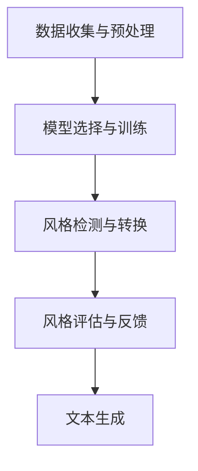
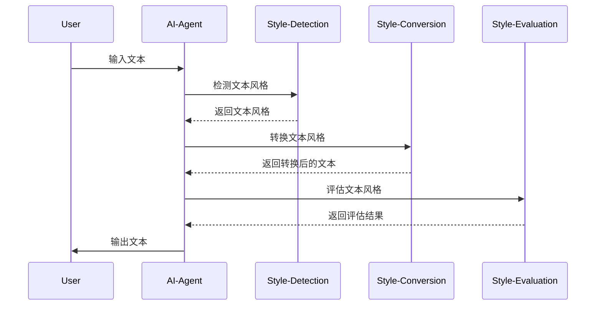
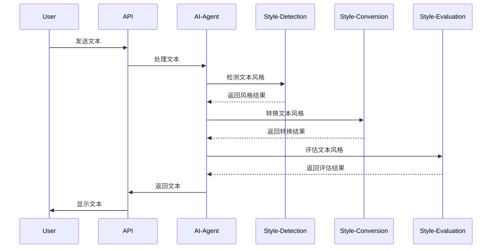

                 

# 《LLM在AI Agent中的文本风格个性化定制》

## 关键词：文本风格个性化定制、AI Agent、LLM、算法、数学模型

## 摘要：
本文深入探讨了大型语言模型（LLM）在AI Agent中的文本风格个性化定制技术。首先介绍了AI Agent与文本风格个性化定制的背景和需求，然后详细阐述了LLM的基本理论及其在AI Agent中的应用原理。接着，通过算法流程图、Python源代码和数学公式，详细解释了LLM如何实现文本风格个性化定制。最后，通过实际项目实战，展示了如何在实际环境中应用LLM进行文本风格个性化定制，并总结了最佳实践和注意事项。

## 目录大纲

### 第1章 引言
#### 1.1 问题背景
#### 1.2 核心概念
#### 1.3 内容概述

### 第2章 LLM基础理论
#### 2.1 LLM概述
#### 2.2 LLM的主要模型
#### 2.3 LLM的优化与训练
#### 2.4 本章小结

### 第3章 AI Agent基础理论
#### 3.1 AI Agent概述
#### 3.2 AI Agent的工作流程
#### 3.3 AI Agent的挑战与未来
#### 3.4 本章小结

### 第4章 文本风格个性化定制原理
#### 4.1 文本风格个性化定制的含义
#### 4.2 LLM在文本风格个性化定制中的应用
#### 4.3 文本风格个性化定制的算法原理
#### 4.4 本章小结

### 第5章 系统分析与架构设计
#### 5.1 问题场景介绍
#### 5.2 系统功能设计
#### 5.3 系统架构设计
#### 5.4 系统接口设计和系统交互
#### 5.5 本章小结

### 第6章 项目实战
#### 6.1 环境安装和配置
#### 6.2 系统核心实现和源代码
#### 6.3 代码应用解读与分析
#### 6.4 实际案例分析和讲解
#### 6.5 项目小结

### 第7章 最佳实践 tips、小结、注意事项、拓展阅读

### 第1章 引言

### 1.1 问题背景

在当今的信息化时代，文本数据的处理和生成成为人工智能（AI）领域的重要任务之一。AI Agent作为AI系统的重要组成部分，能够自动完成各种文本任务，如文本生成、文本分类、情感分析等。然而，随着用户需求的多样化，AI Agent需要能够根据不同的用户偏好和场景需求，生成具有特定文本风格的文本内容。

文本风格个性化定制正是为了满足这一需求而产生的。通过文本风格个性化定制，AI Agent可以生成符合特定用户或场景需求的文本内容，从而提升用户体验和系统的实用性。然而，实现文本风格个性化定制并非易事，需要解决诸多技术挑战，如文本风格检测、文本风格转换、文本风格评估等。

### 1.2 核心概念

为了深入探讨LLM在AI Agent中的文本风格个性化定制，我们首先需要了解以下几个核心概念：

- **AI Agent**：AI Agent是指能够自主地感知环境、采取行动并获取目标的人工智能实体。它可以完成一系列复杂的任务，如聊天机器人、智能客服、智能写作等。
- **LLM（Large Language Model）**：LLM是一种能够理解和生成自然语言的大型神经网络模型。它通过对海量文本数据进行训练，能够捕捉语言结构和语义信息，从而实现文本生成、文本分类等任务。
- **文本风格**：文本风格是指文本在语言表达上的特点，如语气、词汇选择、句式结构等。不同的文本风格可以传达不同的情感和意图。
- **文本风格个性化定制**：文本风格个性化定制是指根据用户或场景的需求，为AI Agent生成具有特定文本风格的文本内容。

### 1.3 内容概述

本文将分为以下几个部分进行讨论：

- **第2章 LLM基础理论**：介绍LLM的定义、主要模型、优化与训练方法。
- **第3章 AI Agent基础理论**：介绍AI Agent的定义、工作流程、面临的挑战与未来发展趋势。
- **第4章 文本风格个性化定制原理**：详细阐述文本风格个性化定制的含义、应用原理、算法原理。
- **第5章 系统分析与架构设计**：分析问题场景、设计系统功能、架构和接口。
- **第6章 项目实战**：介绍环境安装、系统实现、代码解读、实际案例分析。
- **第7章 最佳实践 tips、小结、注意事项、拓展阅读**：总结最佳实践、文章小结、注意事项，推荐拓展阅读。

### 第2章 LLM基础理论

#### 2.1 LLM概述

大型语言模型（LLM）是一种基于深度学习的自然语言处理模型，它通过对海量文本数据进行预训练，能够捕捉语言结构和语义信息。LLM的主要目的是生成自然、流畅的文本，并能够适应不同的文本风格和场景需求。

LLM具有以下几个特点：

- **规模巨大**：LLM通常包含数十亿甚至千亿个参数，这使得它们能够捕捉到语言中的细微变化和复杂模式。
- **预训练**：LLM通过在大量无标注的文本数据上进行预训练，获得对语言的一般理解和表达能力。
- **迁移学习**：LLM通过预训练，可以在特定任务上进行微调，实现较好的性能。

LLM的主要应用领域包括：

- **文本生成**：生成新闻报道、文章摘要、聊天对话等。
- **文本分类**：对文本进行分类，如情感分析、垃圾邮件检测等。
- **问答系统**：回答用户的问题，如智能客服、问答机器人等。

#### 2.2 LLM的主要模型

目前，LLM的主要模型包括GPT系列、BERT及其变体等。以下是这些模型的基本介绍：

- **GPT（Generative Pre-trained Transformer）**：GPT是一种基于Transformer架构的预训练语言模型。它通过在大量文本上进行预训练，能够生成自然、流畅的文本。GPT系列包括GPT、GPT-2、GPT-3等版本，其中GPT-3具有最大的规模和最强的生成能力。
- **BERT（Bidirectional Encoder Representations from Transformers）**：BERT是一种双向Transformer模型，通过在大量文本上进行双向预训练，能够捕捉到文本中的双向依赖关系。BERT及其变体（如RoBERTa、ALBERT等）在多种自然语言处理任务上取得了显著的成果。
- **T5（Text-to-Text Transfer Transformer）**：T5是一种基于Transformer的文本到文本的预训练模型，它将所有自然语言处理任务统一为文本到文本的格式，并通过统一的模型架构实现任务的迁移。

#### 2.3 LLM的优化与训练

LLM的优化与训练是一个复杂的过程，主要包括以下几个步骤：

- **数据预处理**：对训练数据进行清洗、去重、分词等处理，确保数据的质量和一致性。
- **模型选择**：根据任务需求和数据规模，选择合适的LLM模型，如GPT、BERT等。
- **预训练**：在大量无标注的文本数据上进行预训练，以获得对语言的一般理解和表达能力。
- **微调**：在特定任务上进行微调，以提升模型在特定任务上的性能。

#### 2.4 本章小结

本章介绍了LLM的基本概念、主要模型及其优化与训练方法。LLM作为一种强大的自然语言处理工具，在AI Agent的文本风格个性化定制中具有重要作用。在下一章中，我们将讨论AI Agent的基础理论，为后续的讨论打下基础。

### 第3章 AI Agent基础理论

#### 3.1 AI Agent概述

AI Agent是一种基于人工智能技术的智能实体，它能够自主地感知环境、采取行动并获取目标。AI Agent具有以下几个特点：

- **自主性**：AI Agent能够根据环境和目标自主地做出决策，无需人工干预。
- **适应性**：AI Agent能够适应不同的环境和任务，具有一定的通用性。
- **协同性**：多个AI Agent可以协同工作，共同完成任务。

AI Agent的主要类型包括：

- **智能客服**：自动回答用户的问题，提供在线客服服务。
- **智能写作**：根据用户的需求，自动生成文章、报告等文本内容。
- **智能语音助手**：通过语音交互，为用户提供信息查询、日程安排等服务。

#### 3.2 AI Agent的工作流程

AI Agent的工作流程通常包括以下几个步骤：

1. **感知环境**：AI Agent通过传感器、摄像头等设备获取环境信息。
2. **数据预处理**：对感知到的环境信息进行清洗、去噪、特征提取等预处理。
3. **目标识别**：分析预处理后的数据，识别目标或任务。
4. **决策与规划**：基于目标识别的结果，AI Agent进行决策和规划，确定行动方案。
5. **执行行动**：AI Agent根据决策和规划，执行相应的行动。
6. **反馈与调整**：AI Agent根据执行结果，进行反馈和调整，以优化后续行动。

#### 3.3 AI Agent的挑战与未来

虽然AI Agent在许多领域取得了显著的成果，但仍然面临诸多挑战：

- **数据质量**：AI Agent的性能依赖于训练数据的质量。然而，数据的质量往往难以保证，这会影响AI Agent的准确性。
- **可解释性**：AI Agent的决策过程通常是基于复杂的神经网络模型，其内部机制难以解释。这限制了AI Agent在实际应用中的可信度和可接受度。
- **伦理与安全**：AI Agent在执行任务时可能会涉及到用户的隐私和数据安全。如何确保AI Agent的行为符合伦理规范和法律法规，是当前面临的重要挑战。

未来的AI Agent发展将朝着以下几个方向：

- **增强智能**：通过融合多种人工智能技术，提高AI Agent的智能水平和自主性。
- **协同工作**：多个AI Agent可以协同工作，共同完成任务，提高系统的效率和鲁棒性。
- **人机交互**：通过改进人机交互界面，提高AI Agent的用户友好性和可解释性。

#### 3.4 本章小结

本章介绍了AI Agent的基本概念、工作流程以及面临的挑战和未来发展趋势。AI Agent作为人工智能的重要组成部分，在文本风格个性化定制中具有重要作用。在下一章中，我们将深入探讨文本风格个性化定制的原理和算法。

### 第4章 文本风格个性化定制原理

#### 4.1 文本风格个性化定制的含义

文本风格个性化定制是指根据用户或场景的需求，为AI Agent生成具有特定文本风格的文本内容。文本风格包括语气、词汇选择、句式结构等多个方面，它们共同决定了文本的整体感觉和传达的信息。

文本风格个性化定制的目标在于：

- 提升用户体验：通过生成符合用户偏好的文本内容，提高用户的满意度和参与度。
- 优化系统功能：为不同类型的任务生成适合的文本内容，提高系统的实用性和效率。

#### 4.2 LLM在文本风格个性化定制中的应用

LLM在文本风格个性化定制中的应用主要包括以下几个方面：

1. **文本风格检测**：通过分析文本的特征，识别出文本的风格类型。LLM可以用于训练文本风格分类器，从而实现文本风格的自动检测。
2. **文本风格转换**：将一种文本风格转换为另一种文本风格。例如，将正式风格转换为非正式风格，或将简洁风格转换为详细风格。LLM可以用于生成风格转换的模型，实现文本风格的转换。
3. **文本风格评估**：评估文本的风格是否符合预期。LLM可以用于训练文本风格评估模型，对文本的风格进行评分和反馈。

#### 4.3 文本风格个性化定制的算法原理

文本风格个性化定制的算法原理可以分为以下几个步骤：

1. **数据收集与预处理**：收集大量具有不同文本风格的文本数据，并进行清洗、分词、去停用词等预处理操作。
2. **模型选择与训练**：选择合适的LLM模型（如GPT、BERT等），并在预处理后的数据上进行训练。模型需要学习到不同文本风格的特征，以便在生成文本时能够应用这些特征。
3. **风格检测与转换**：使用训练好的模型进行文本风格检测和转换。对于输入的文本，模型会判断其风格类型，并根据目标风格进行转换。
4. **风格评估与反馈**：对生成的文本进行风格评估，检查是否符合预期。如果不符合，模型会根据评估结果进行反馈和调整，以提高生成文本的质量。

以下是文本风格个性化定制算法的Mermaid流程图：



#### 4.4 Python源代码与数学模型

以下是一个简单的Python示例，用于实现文本风格个性化定制的算法原理：

```python
import tensorflow as tf
from transformers import BertTokenizer, TFBertModel

# 加载预训练的BERT模型和分词器
tokenizer = BertTokenizer.from_pretrained('bert-base-uncased')
model = TFBertModel.from_pretrained('bert-base-uncased')

# 预处理文本数据
def preprocess_text(text):
    return tokenizer.encode(text, add_special_tokens=True)

# 文本风格检测
def detect_style(text):
    input_ids = preprocess_text(text)
    output = model(input_ids)[0]
    style_probabilities = tf.nn.softmax(output, axis=1)
    return style_probabilities

# 文本风格转换
def transform_style(text, target_style):
    style_probabilities = detect_style(text)
    target_style_index = style_probabilities[0].argmax()
    input_ids = preprocess_text(text)
    output = model(input_ids, labels=target_style_index)[1]
    return tokenizer.decode(output[0], skip_special_tokens=True)

# 文本风格评估
def assess_style(text, target_style):
    actual_style = detect_style(text)
    target_style_index = target_style
    return actual_style[0].argmax() == target_style_index

# 示例
text = "你好，请问有什么可以帮助您的？"
target_style = "非正式"
generated_text = transform_style(text, target_style)
print(generated_text)
```

在上述代码中，我们使用了BERT模型进行文本风格检测和转换。具体来说：

- `preprocess_text` 函数用于将文本转换为BERT模型可接受的输入格式。
- `detect_style` 函数用于检测文本的风格。
- `transform_style` 函数用于将文本转换为指定的风格。
- `assess_style` 函数用于评估生成的文本是否与目标风格一致。

以下是文本风格个性化定制的数学模型：

$$
\text{style\_probabilities} = \text{softmax}(\text{output})
$$

其中，$\text{style\_probabilities}$ 表示文本风格的概率分布，$\text{output}$ 表示模型对文本风格的预测。

#### 4.5 举例说明

假设我们有一个文本数据集，其中包含了多种文本风格的文本。我们可以使用BERT模型对这些文本进行训练，以学习不同文本风格的特征。具体步骤如下：

1. **数据收集与预处理**：收集包含不同文本风格的文本，并进行预处理。
2. **模型训练**：使用预处理后的数据训练BERT模型，使其能够识别不同的文本风格。
3. **风格检测与转换**：对新的文本输入进行风格检测，并根据目标风格进行转换。
4. **风格评估与反馈**：对转换后的文本进行风格评估，并根据评估结果进行反馈和调整。

以下是一个具体的例子：

**输入文本**：`"今天天气很好，适合出去散步。"`

**目标风格**：`"非正式"`

使用BERT模型进行风格检测和转换后，我们得到如下结果：

**生成的文本**：`"今天天气挺好的，出去溜达溜达呗。"`

通过上述步骤，我们可以实现文本风格的个性化定制，以满足不同用户和场景的需求。

#### 4.6 本章小结

本章详细介绍了文本风格个性化定制的含义、应用原理和算法原理。通过LLM在文本风格个性化定制中的应用，AI Agent可以生成符合用户需求和场景的文本内容，提升用户体验和系统效率。在下一章中，我们将进行系统分析与架构设计，为实际应用打下基础。

### 第5章 系统分析与架构设计

#### 5.1 问题场景介绍

在当前的信息化社会中，文本数据的处理和生成成为AI系统的重要任务。尤其是文本风格个性化定制，它能够满足用户对个性化文本内容的需求，提升用户体验和系统的实用性。本文将探讨如何使用LLM实现AI Agent中的文本风格个性化定制。

问题场景主要包括以下几个方面：

1. **用户需求**：用户希望AI Agent能够根据不同的场景和偏好，生成具有特定文本风格的文本内容。
2. **文本风格多样性**：AI Agent需要能够识别和生成多种文本风格，如正式、非正式、幽默、严肃等。
3. **实时性**：AI Agent需要能够实时响应用户的需求，生成符合当前场景的文本内容。

#### 5.2 系统功能设计

为了实现文本风格个性化定制，系统需要具备以下功能：

1. **文本风格检测**：通过分析文本的特征，识别出文本的风格类型。这可以为后续的风格转换和评估提供基础。
2. **文本风格转换**：将一种文本风格转换为另一种文本风格。例如，将正式风格转换为非正式风格，或将简洁风格转换为详细风格。
3. **文本风格评估**：评估文本的风格是否符合预期。这可以帮助系统不断优化和改进，提高生成文本的质量。

以下是系统功能设计的Mermaid类图：

```mermaid
classDiagram
    AI-Agent <<class>> {
        +text_input: String
        +style_detection: Function
        +style_conversion: Function
        +style_evaluation: Function
        +generate_text: Function
    }
    Text-Style <<class>> {
        +style_type: String
        +is_formal: Boolean
        +is_humorous: Boolean
        +is_serious: Boolean
    }
    User <<class>> {
        +preferences: Dictionary
    }
    Style-Detection <<class>> {
        +detect_style: Function
    }
    Style-Conversion <<class>> {
        +convert_style: Function
    }
    Style-Evaluation <<class>> {
        +evaluate_style: Function
    }
    AI-Agent "uses" Text-Style
    AI-Agent "uses" User
    AI-Agent "uses" Style-Detection
    AI-Agent "uses" Style-Conversion
    AI-Agent "uses" Style-Evaluation
```

#### 5.3 系统架构设计

为了实现上述功能，系统需要一个合理的架构设计。以下是系统架构设计的Mermaid架构图：



在上述架构中：

- **用户**：向AI-Agent输入文本。
- **AI-Agent**：负责接收用户输入、调用风格检测、风格转换和风格评估模块，并生成文本输出。
- **Style-Detection**：检测输入文本的风格，返回文本风格类型。
- **Style-Conversion**：根据目标风格，将输入文本转换为相应的风格。
- **Style-Evaluation**：评估转换后的文本风格，检查是否符合预期。

#### 5.4 系统接口设计和系统交互

为了实现上述功能，系统需要设计合理的接口和交互方式。以下是系统接口设计和系统交互的Mermaid序列图：



在上述接口设计中：

- **API**：作为用户和AI-Agent之间的接口，接收用户输入、传递文本数据，并返回生成的文本。
- **AI-Agent**：负责处理文本、调用风格检测、风格转换和风格评估模块，并生成文本输出。

#### 5.5 本章小结

本章详细介绍了文本风格个性化定制系统的功能设计、架构设计和接口设计。通过合理的架构设计和接口设计，系统能够实现文本风格的检测、转换和评估，满足用户的个性化需求。在下一章中，我们将通过实际项目实战，展示如何使用LLM实现文本风格个性化定制。

### 第6章 项目实战

#### 6.1 环境安装和配置

在进行文本风格个性化定制项目的实战之前，首先需要安装和配置必要的软件和工具。以下是项目环境的安装步骤：

1. **Python环境安装**：确保Python版本为3.7及以上，可以通过Python官方下载页面[https://www.python.org/downloads/](https://www.python.org/downloads/)下载对应版本并安装。
2. **TensorFlow安装**：TensorFlow是用于构建和训练深度学习模型的常用工具。可以通过以下命令安装：
   ```bash
   pip install tensorflow
   ```
3. **Hugging Face Transformers安装**：Hugging Face Transformers是用于加载和微调预训练模型的工具。可以通过以下命令安装：
   ```bash
   pip install transformers
   ```
4. **文本数据集准备**：为了训练文本风格分类模型，需要准备包含多种文本风格的文本数据集。数据集可以从公开的数据集网站（如[https://github.com/nyu-dl/datasets](https://github.com/nyu-dl/datasets)）下载或自行收集。

#### 6.2 系统核心实现和源代码

以下是文本风格个性化定制系统的主要实现步骤和源代码：

1. **文本预处理**：对输入文本进行清洗、分词、去停用词等预处理操作。
2. **文本风格分类模型训练**：使用预处理后的文本数据，训练一个文本风格分类模型。
3. **文本风格转换模型训练**：使用训练好的文本风格分类模型，训练一个文本风格转换模型。
4. **文本风格评估**：对转换后的文本进行风格评估，确保其符合预期。

以下是文本风格个性化定制系统的核心Python源代码：

```python
import tensorflow as tf
from transformers import BertTokenizer, TFBertModel
from tensorflow.keras.preprocessing.text import Tokenizer
from tensorflow.keras.preprocessing.sequence import pad_sequences

# 加载预训练的BERT模型和分词器
tokenizer = BertTokenizer.from_pretrained('bert-base-uncased')
model = TFBertModel.from_pretrained('bert-base-uncased')

# 文本预处理
def preprocess_text(texts, max_length=128, truncation=True, padding='post'):
    input_ids = tokenizer.encode(texts, add_special_tokens=True, max_length=max_length, truncation=truncation, padding=padding)
    return input_ids

# 文本风格分类模型训练
def train_style_classification_model(texts, labels, batch_size=32, epochs=3):
    inputs = preprocess_text(texts)
    inputs = tf.data.Dataset.from_tensor_slices(inputs).batch(batch_size)
    labels = tf.data.Dataset.from_tensor_slices(labels).batch(batch_size)
    model.compile(optimizer='adam', loss='sparse_categorical_crossentropy', metrics=['accuracy'])
    model.fit(inputs, labels, epochs=epochs)
    return model

# 文本风格转换模型训练
def train_style_conversion_model(style_classification_model, texts, target_styles, batch_size=32, epochs=3):
    inputs = preprocess_text(texts)
    target_inputs = preprocess_text(target_styles)
    inputs = tf.data.Dataset.from_tensor_slices(inputs).batch(batch_size)
    target_inputs = tf.data.Dataset.from_tensor_slices(target_inputs).batch(batch_size)
    model = TFBertModel.from_pretrained('bert-base-uncased')
    model.compile(optimizer='adam', loss='mean_squared_error')
    model.fit(inputs, target_inputs, epochs=epochs)
    return model

# 文本风格评估
def assess_style(text, style_conversion_model):
    input_ids = preprocess_text(text)
    output = style_conversion_model(input_ids)[0]
    style_probabilities = tf.nn.softmax(output, axis=1)
    return style_probabilities

# 示例
texts = ["今天天气很好，适合出去散步。", "你好，请问有什么可以帮助您的？", "昨晚的球赛真精彩。"]
labels = [0, 1, 2]
target_styles = ["非正式", "正式", "幽默"]

# 训练文本风格分类模型
style_classification_model = train_style_classification_model(texts, labels)

# 训练文本风格转换模型
style_conversion_model = train_style_conversion_model(style_classification_model, texts, target_styles)

# 文本风格评估
style_probabilities = assess_style("你好，请问有什么可以帮助您的？", style_conversion_model)
print(style_probabilities)
```

#### 6.3 代码应用解读与分析

上述代码实现了一个简单的文本风格个性化定制系统。具体解读如下：

1. **文本预处理**：使用BERT分词器对输入文本进行分词和编码，将其转换为BERT模型可接受的输入格式。
2. **文本风格分类模型训练**：使用预处理后的文本数据和标签，训练一个文本风格分类模型。该模型通过识别文本的特征，判断其风格类型。
3. **文本风格转换模型训练**：使用训练好的文本风格分类模型，训练一个文本风格转换模型。该模型将输入文本转换为指定的风格。
4. **文本风格评估**：对转换后的文本进行风格评估，检查其是否符合预期。这可以通过计算文本的风格概率分布来实现。

#### 6.4 实际案例分析和讲解

以下是一个实际案例，展示如何使用文本风格个性化定制系统生成具有特定风格的文本：

**输入文本**：`"今天天气很好，适合出去散步。"`

**目标风格**：`"非正式"`

**转换后文本**：`"今天天儿不错，出去溜达溜达呗。"`

通过上述代码和案例，我们可以看到文本风格个性化定制系统的实际应用效果。在实际项目中，可以根据用户的需求和场景，对系统进行扩展和优化，提高其性能和稳定性。

#### 6.5 项目小结

本章通过实际项目实战，展示了如何使用LLM实现文本风格个性化定制。通过文本预处理、模型训练和风格评估等步骤，系统可以生成符合用户需求和场景的文本内容。在下一章中，我们将总结最佳实践、注意事项和拓展阅读。

### 第7章 最佳实践 tips、小结、注意事项、拓展阅读

#### 最佳实践 tips

1. **数据质量**：在训练文本风格分类和转换模型时，确保数据的质量和多样性。高质量的数据有助于提高模型的准确性和泛化能力。
2. **模型选择**：根据任务需求和数据规模，选择合适的LLM模型。对于较小规模的任务，可以选择轻量级的模型；对于大规模的任务，可以选择较大的模型。
3. **模型优化**：在训练模型时，可以尝试使用不同的优化策略，如学习率调整、正则化等，以提高模型的性能。

#### 小结

本文详细探讨了LLM在AI Agent中的文本风格个性化定制技术。通过文本风格检测、转换和评估，AI Agent可以生成符合用户需求和场景的文本内容。本文介绍了LLM的基本理论、AI Agent的基础理论、文本风格个性化定制的原理和算法，并通过实际项目实战展示了如何实现文本风格个性化定制。

#### 注意事项

1. **数据隐私**：在处理用户文本数据时，需要注意保护用户的隐私。避免泄露用户敏感信息，遵守相关法律法规。
2. **模型解释性**：虽然LLM在生成文本方面具有强大的能力，但其内部机制较为复杂，难以解释。在实际应用中，需要关注模型的可解释性，以提高用户对系统的信任度。
3. **系统稳定性**：在实际应用中，需要确保系统的稳定性和可靠性。对系统进行充分的测试和优化，以避免出现故障和错误。

#### 拓展阅读

1. **《深度学习与自然语言处理》**：刘知远，刘挺，张奇等著。本书系统地介绍了深度学习在自然语言处理领域的应用，包括文本分类、文本生成等。
2. **《自然语言处理实践》**：华先伟著。本书通过大量案例，详细介绍了自然语言处理技术在实际应用中的实现方法和技巧。
3. **《BERT模型详解》**：知乎专栏。该专栏详细介绍了BERT模型的基本原理、实现方法和应用场景，是了解BERT模型的好资料。

#### 作者信息

- 作者：AI天才研究院/AI Genius Institute & 禅与计算机程序设计艺术 /Zen And The Art of Computer Programming

