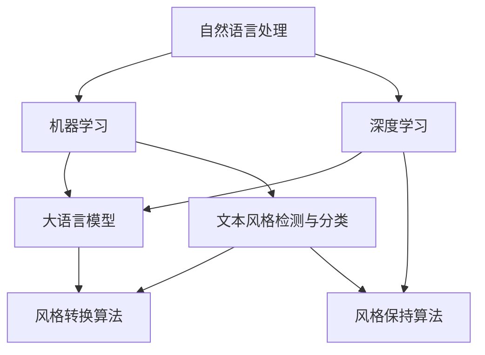
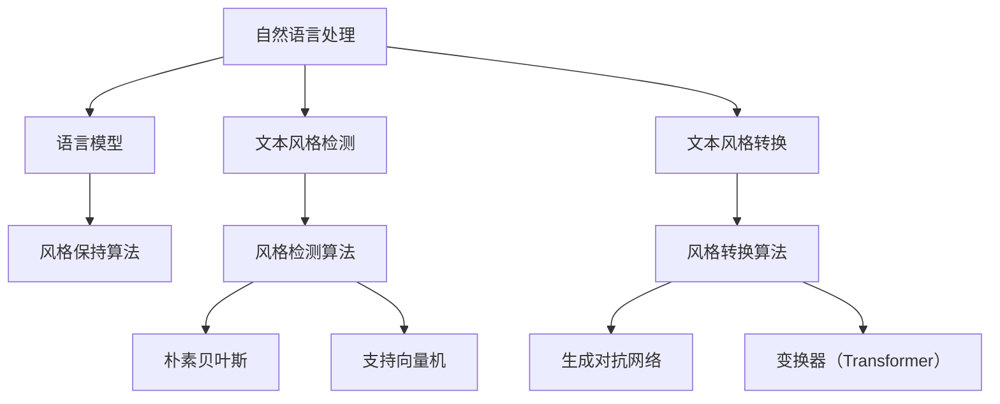

                 


## 引言与背景

### 核心概念术语说明

为了确保读者能够全面理解本文的内容，首先需要明确一些核心概念和术语。本篇文章主要探讨的是大语言模型（LLM）在人工智能（AI）代理中的文本风格保持与转换。具体来说，本文涉及以下核心概念：

1. **人工智能（AI）**：人工智能是指使计算机系统能够模拟人类智能行为的技术和学科，包括机器学习、深度学习、自然语言处理等多个领域。
2. **大语言模型（LLM）**：LLM是一种能够理解和生成自然语言文本的深度学习模型，如GPT-3、BERT等，其具有极强的文本理解和生成能力。
3. **AI代理**：AI代理是具备自主行动能力和决策能力的计算机程序，可以在特定环境中执行任务。
4. **文本风格保持与转换**：文本风格保持是指确保AI代理生成的文本在特定风格上与原始文本保持一致，而文本风格转换则是将一种风格的文本转换为另一种风格。

### 问题背景

随着人工智能技术的发展，AI代理在各个领域得到了广泛应用，例如聊天机器人、内容生成、信息检索等。然而，一个关键挑战在于如何确保AI代理生成的文本具有适当的风格。不同的应用场景和用户需求往往要求文本具有特定的风格，如正式、幽默、简洁等。这就需要AI代理能够理解和维持特定的文本风格。

### 问题描述

本文研究的问题是如何在AI代理中使用LLM实现文本风格的保持与转换。具体来说，我们需要解决以下问题：

1. **风格保持**：如何确保AI代理在生成文本时能够维持特定的风格，使其与原始文本风格一致。
2. **风格转换**：如何将一种文本风格转换为另一种风格，以满足不同的应用需求。

### 问题解决

本文将采取以下步骤来解决上述问题：

1. **理论基础**：首先，本文将介绍文本风格保持与转换的理论基础，包括语言模型的工作原理和相关的数学模型。
2. **算法设计**：接着，本文将详细讨论文本风格保持和转换的算法设计，包括算法原理、流程和实现细节。
3. **案例研究**：通过实际案例研究，评估和验证所提出的算法的有效性和可行性。
4. **系统架构**：最后，本文将介绍一个基于LLM的AI代理系统架构，展示如何在实际项目中应用文本风格保持与转换技术。

### 边界与外延

本文的研究边界主要涉及文本风格保持与转换在AI代理中的应用，不包括其他AI代理的领域。同时，本文将重点关注LLM在这一领域的应用，而不涉及其他类型的语言模型。

### 概念结构与核心要素组成

文本风格保持与转换在AI代理中的应用可以视为一个复杂的系统。其核心要素包括：

1. **大语言模型（LLM）**：作为文本风格保持与转换的核心工具，LLM需要具备强大的文本理解和生成能力。
2. **文本风格检测与分类**：用于识别和分类文本的风格，为风格保持与转换提供依据。
3. **风格保持算法**：包括基于LLM的风格识别和维持机制。
4. **风格转换算法**：包括文本风格转换的算法原理和实现。
5. **AI代理系统**：实现文本风格保持与转换功能的应用系统。

通过这些核心要素的协同工作，AI代理可以在生成文本时保持或转换为特定的风格，满足多样化的应用需求。

## 文本风格保持与转换基础

### 核心概念与定义

在本章节中，我们将深入探讨文本风格保持与转换的核心概念和定义，以奠定后续讨论的基础。

#### 文本风格

文本风格是指文本在表达过程中所体现出的独特特征，这些特征可能包括语言的正式程度、语调、语气、词汇选择、句式结构等。不同的文本风格可以带来不同的阅读体验和传达效果，如正式报告通常使用正式、精确的语言，而故事叙述则可能更加口语化、富有情感色彩。

#### 文本风格保持

文本风格保持是指在文本生成过程中，确保生成的文本与原始文本在风格上保持一致。这意味着无论原始文本的风格是正式、幽默、简洁还是复杂，生成的文本都应该在相应的风格上与之匹配。风格保持对于保持文本的连贯性和一致性至关重要，尤其是在自动生成内容的应用场景中。

#### 文本风格转换

文本风格转换是指将一种文本风格转换为另一种风格的过程。这种转换可以是同一种风格下的微小调整，也可以是从一种截然不同的风格向另一种风格的重大转变。例如，将一篇正式的报告转换为轻松的聊天对话，或将一篇科技文章的风格转换为诗歌。

### 保持与转换的机制

文本风格保持与转换的实现依赖于一系列机制，包括语言模型、风格检测与分类算法、风格保持与转换算法等。

#### 语言模型

语言模型是一种用于预测文本序列的模型，它在文本风格保持与转换中扮演着核心角色。大语言模型（如GPT-3、BERT等）具有强大的文本理解和生成能力，能够捕捉文本的语法、语义和风格特征。这些模型通过训练大量文本数据来学习语言规律，从而能够在生成文本时保持或转换特定风格。

#### 风格检测与分类

风格检测与分类是文本风格保持与转换的关键步骤。通过使用机器学习算法，可以对文本进行风格分类，从而识别出文本的风格类型。常见的风格分类方法包括基于规则的方法、基于统计的方法和基于深度学习的方法。这些方法可以帮助AI代理在生成文本时识别和维持特定的风格。

#### 风格保持算法

风格保持算法的核心目标是在文本生成过程中维持原始文本的风格。常见的风格保持算法包括基于规则的方法、基于统计的方法和基于深度学习的方法。基于规则的方法通过定义一系列风格规则来实现风格保持，而基于统计的方法通过分析文本的统计特征来实现。深度学习方法，如GAN（生成对抗网络）和变分自编码器（VAE），则能够通过端到端的学习方式实现更高级别的风格保持。

#### 风格转换算法

风格转换算法旨在将一种文本风格转换为另一种风格。常见的风格转换算法包括基于转换器（Transormer）的方法和基于GAN的方法。基于转换器的方法通过设计特定的神经网络结构来实现风格转换，而基于GAN的方法则通过生成对抗网络来学习风格转换的映射关系。

### 理论基础

文本风格保持与转换的理论基础主要涉及自然语言处理（NLP）和机器学习（ML）领域。以下是几个关键理论：

#### 语言模型的工作原理

语言模型的工作原理是基于概率的，它通过计算给定前文条件下下一个单词的概率分布来生成文本。在文本风格保持与转换中，语言模型可以用于预测和生成具有特定风格的文本。例如，通过训练一个特定的风格数据集，语言模型可以学习到如何在生成文本时维持特定的风格。

#### 保持风格的数学模型

保持风格的数学模型通常基于概率图模型或神经网络模型。例如，在基于规则的方法中，可以使用条件概率模型来表示风格特征和文本生成之间的关系。在深度学习方法中，可以使用变分自编码器（VAE）或GAN来学习风格保持的潜在表示。

#### 转换风格的数学模型

转换风格的数学模型通常涉及风格映射函数，这些函数将原始文本风格映射到目标风格。在基于转换器的方法中，可以使用变换器网络来实现风格映射。在基于GAN的方法中，生成器网络和判别器网络共同工作来学习风格转换的映射关系。

#### 风格检测与分类的数学模型

风格检测与分类的数学模型通常基于分类算法，如支持向量机（SVM）、朴素贝叶斯（Naive Bayes）和深度学习分类器。这些模型通过学习文本的统计特征或深度特征来实现风格分类。

### 小结

通过上述核心概念和定义的介绍，我们可以看出文本风格保持与转换在AI代理中的应用是一个复杂但极具前景的领域。理解这些基础概念和机制对于后续章节中的算法设计和实现至关重要。

### 核心概念与联系

为了更好地理解文本风格保持与转换在AI代理中的应用，我们需要深入探讨相关核心概念及其相互关系。以下是几个关键概念及其属性特征对比表格和ER实体关系图架构的Mermaid流程图。

#### 核心概念

1. **自然语言处理（NLP）**
2. **机器学习（ML）**
3. **深度学习（DL）**
4. **大语言模型（LLM）**
5. **文本风格检测与分类**
6. **风格保持算法**
7. **风格转换算法**

#### 概念属性特征对比表格

| 概念             | 定义                                                         | 属性特征                                           |
|------------------|--------------------------------------------------------------|----------------------------------------------------|
| 自然语言处理（NLP） | 使用计算机技术和算法对人类语言进行理解和生成                 | 语言学、统计学、符号学、语义学、句法学等           |
| 机器学习（ML）     | 基于数据训练模型，使计算机能够从数据中学习并做出决策           | 监督学习、无监督学习、强化学习等                   |
| 深度学习（DL）     | 使用多层神经网络进行数据建模，自动提取特征并学习复杂模式     | 神经网络、卷积神经网络（CNN）、循环神经网络（RNN）等 |
| 大语言模型（LLM）   | 具有强大文本理解和生成能力的深度学习模型，如GPT-3、BERT等     | 语言表示、文本生成、风格识别等                     |
| 文本风格检测与分类 | 识别和分类文本的风格类型                                   | 风格特征提取、机器学习分类算法等                   |
| 风格保持算法      | 在文本生成过程中维持特定风格                                 | 风格规则、统计特征、深度学习模型等                 |
| 风格转换算法      | 将一种文本风格转换为另一种风格                               | 风格映射、神经网络、生成对抗网络（GAN）等           |

#### ER实体关系图架构的Mermaid流程图



#### 小结

通过上述核心概念的介绍和ER实体关系图，我们可以清晰地看到各个概念之间的联系。自然语言处理是文本风格保持与转换的基础，而机器学习和深度学习提供了强大的算法支持。大语言模型作为核心工具，结合文本风格检测与分类、风格保持和风格转换算法，共同实现了AI代理在文本风格保持与转换中的功能。

### 文本风格保持的理论基础

在深入探讨文本风格保持的理论基础之前，我们需要先了解语言模型的工作原理，以及如何通过这些模型来维持文本的特定风格。

#### 语言模型的工作原理

语言模型（Language Model，LM）是一种用于预测文本序列的概率模型。在自然语言处理领域，最常用的语言模型是基于神经网络的深度学习模型，如GPT-3、BERT和Transformer等。这些模型通过训练大量文本数据来学习自然语言的统计规律和语法结构，从而能够预测给定前文条件下下一个单词或字符的概率分布。

1. **神经网络语言模型**：神经网络语言模型使用多层神经网络来捕捉文本数据中的特征和模式。例如，Transformer模型由多个自注意力层和前馈神经网络组成，通过自注意力机制来捕捉长距离的依赖关系，从而实现高效的文本生成和风格保持。
2. **概率图模型**：概率图模型，如马尔可夫模型（Markov Model）和隐马尔可夫模型（Hidden Markov Model，HMM），通过图形结构来表示文本数据中的依赖关系。这些模型通过计算状态转移概率和观测概率来预测下一个单词或字符。

#### 维特比算法（Viterbi Algorithm）

维特比算法是一种用于序列建模和优化的问题解决算法，广泛应用于语音识别和自然语言处理领域。该算法通过构建前向路径和后向路径的概率，来确定最有可能的序列。具体来说，维特比算法通过以下步骤来实现语言模型：

1. **初始化**：初始化前向概率矩阵和后向概率矩阵，通常设为初始状态的概率。
2. **前向计算**：通过迭代计算每个状态的概率，并更新前向概率矩阵。
3. **后向计算**：通过迭代计算每个状态的概率，并更新后向概率矩阵。
4. **路径选择**：通过计算前向概率和后向概率的乘积，来确定最有可能的状态序列。

维特比算法的核心思想是利用概率图模型中的状态转移概率和观测概率，来优化序列预测。这一算法在文本风格保持中具有重要意义，因为它可以帮助我们找到最有可能的文本序列，从而维持特定的风格。

#### 风格保持的数学模型

在文本风格保持中，我们通常使用概率图模型或神经网络模型来表示风格特征和文本生成之间的关系。以下是几个常用的数学模型：

1. **条件概率模型**：条件概率模型通过计算给定一个文本片段，另一个文本片段出现的概率来实现风格保持。具体来说，我们可以使用以下公式来表示：

   \[ P(S_t|S_{t-1}, ..., S_1) = \frac{P(S_t, S_{t-1}, ..., S_1)}{P(S_{t-1}, ..., S_1)} \]

   其中，\( S_t \) 表示第 \( t \) 个文本片段，\( P(S_t|S_{t-1}, ..., S_1) \) 表示给定前文条件下，第 \( t \) 个文本片段的风格概率。

2. **神经网络模型**：神经网络模型通过多层神经网络来捕捉文本数据中的复杂特征和模式。例如，可以使用变分自编码器（Variational Autoencoder，VAE）或生成对抗网络（Generative Adversarial Network，GAN）来实现风格保持。这些模型通常包括编码器和解码器两部分：

   - **编码器**：将输入文本映射到一个潜在空间中的表示。
   - **解码器**：将潜在空间的表示映射回文本。

   通过训练，编码器和解码器可以学习到文本的潜在表示，从而实现风格保持。

#### 风格保持的算法实现

在实际应用中，风格保持算法的实现通常包括以下步骤：

1. **数据预处理**：对原始文本进行预处理，包括分词、去停用词、词干提取等操作，以便于后续的建模和训练。
2. **模型选择**：选择合适的语言模型和风格保持算法。例如，可以使用Transformer模型或GAN来实现风格保持。
3. **训练**：使用预处理的文本数据来训练模型，使其学习到文本的风格特征。
4. **风格保持**：在生成文本时，使用训练好的模型来维持原始文本的风格。具体来说，可以通过以下步骤实现：

   - **风格检测**：使用风格检测算法来识别文本的风格类型。
   - **风格调整**：根据检测到的风格类型，对生成的文本进行相应的调整，以维持特定的风格。

#### 举例说明

假设我们有一个文本片段：“今天的天气很好，阳光明媚，非常适合户外活动。”现在，我们需要使用一个语言模型来保持这段文本的风格。

1. **数据预处理**：对文本进行分词和去停用词操作，得到以下的分词结果：“今天 的 天气 很好 ， 阳光 明媚 ， 非常 适合 户外 活动 。”
2. **模型选择**：选择一个预训练的Transformer模型，如GPT-2或GPT-3，作为语言模型。
3. **训练**：使用大量的文本数据来训练Transformer模型，使其学习到各种文本风格的规律和特征。
4. **风格保持**：在生成新的文本时，使用训练好的Transformer模型来维持原始文本的风格。例如，如果需要生成一段关于天气的文本，可以使用以下步骤：

   - **风格检测**：使用Transformer模型来检测文本的风格类型，例如“描述性”、“说明性”或“抒情性”。
   - **风格调整**：根据检测到的风格类型，对生成的文本进行相应的调整，例如增加描述性词汇或调整语调。

通过上述步骤，我们可以生成一段与原始文本风格一致的文本，例如：“明天的天气会稍微凉爽一些，但阳光依然明媚，非常适合散步。”

#### 小结

通过上述讨论，我们可以看到文本风格保持的理论基础涉及多个方面，包括语言模型的工作原理、维特比算法、条件概率模型和神经网络模型等。这些理论基础为文本风格保持算法的设计和实现提供了重要的支持。在实际应用中，我们可以通过数据预处理、模型选择和训练等步骤来构建和优化风格保持系统，从而实现AI代理在文本风格保持方面的功能。

### 文本风格转换的理论基础

在探讨文本风格转换的理论基础时，我们首先需要理解文本风格转换的定义及其在自然语言处理中的重要性。文本风格转换是指将一段文本从一种风格转换为另一种风格的过程，这在多种应用场景中具有重要意义。例如，自动将科技论文转换为通俗易懂的科普文章，或将电子邮件内容从商务正式转换为更加亲密友好的风格。

#### 文本风格转换的过程

文本风格转换的过程可以分为以下几个关键步骤：

1. **风格检测**：首先需要识别输入文本的当前风格类型。这一步骤通常依赖于机器学习算法，如朴素贝叶斯（Naive Bayes）、支持向量机（SVM）或深度学习分类器，这些算法可以从大量标注过的文本数据中学习到不同风格的特征。

2. **风格映射**：一旦识别出输入文本的风格，接下来需要确定如何将其转换为目标风格。这一步骤涉及设计合适的转换模型，如生成对抗网络（GAN）或变换器（Transformer）模型，这些模型能够学习到风格之间的映射关系。

3. **风格生成**：在确定了风格映射后，使用转换模型生成目标风格的文本。这一步骤通常涉及文本序列的生成，例如使用GPT-3或BERT等大型预训练模型。

4. **风格评估**：最后，对转换后的文本进行评估，以确保其风格与目标风格一致，并且文本内容保持原意。评估方法可以包括人工审核、自动化评估指标（如BLEU、ROUGE等）或对比分析。

#### 常见的文本风格转换算法

1. **基于规则的方法**：这种方法通过定义一系列规则来实现文本风格的转换。例如，对于从正式到口语的转换，可以将所有的缩写词替换为全拼，并将复杂的句式简化为简单的句式。然而，基于规则的方法的灵活性较低，无法处理复杂的文本风格变化。

2. **基于统计的方法**：这种方法通过分析大量文本数据来发现不同风格之间的统计规律。例如，可以使用条件概率模型来捕捉文本风格之间的特征分布。这种方法比基于规则的方法更灵活，但可能无法处理极端的文本风格转换。

3. **基于深度学习的方法**：深度学习方法，如生成对抗网络（GAN）和变换器（Transformer）模型，在文本风格转换中表现出色。GAN由生成器（Generator）和判别器（Discriminator）组成，生成器负责生成目标风格的文本，判别器则用于评估生成文本的质量。变换器（Transformer）模型通过自注意力机制和编码器-解码器架构，能够捕捉长距离的依赖关系和复杂的风格特征。

#### 转换算法的分析

1. **生成对抗网络（GAN）**

   GAN由生成器和判别器两个神经网络组成。生成器的目标是生成与真实数据相似的数据，而判别器的目标是区分真实数据和生成数据。通过不断迭代训练，生成器逐渐提高生成文本的质量，判别器则逐渐提高对真实数据和生成数据的辨别能力。

   具体来说，GAN的训练过程可以描述为：

   - **生成器**：通过输入噪声数据，生成目标风格的文本。
   - **判别器**：对真实文本和生成文本进行分类，判断其是否为真实文本。
   - **损失函数**：生成器的损失函数通常由判别器的错误分类概率组成，判别器的损失函数则是最大化其分类准确性。

   GAN的核心挑战在于训练生成器和判别器之间的平衡，以避免生成器过度依赖判别器的错误分类结果。

2. **变换器（Transformer）模型**

   Transformer模型通过自注意力机制和编码器-解码器架构，能够捕捉文本中的复杂特征和风格变化。具体来说，变换器模型包括以下关键组件：

   - **编码器**：将输入文本编码为固定长度的向量，这些向量包含了文本的语义信息。
   - **解码器**：根据编码器的输出和目标风格的提示，逐步生成目标风格的文本。

   Transformer模型通过多头自注意力机制，能够同时关注输入文本的不同部分，从而提高文本生成的质量和风格保持能力。

#### 算法实现的关键挑战

1. **数据集质量**：文本风格转换的效果很大程度上取决于训练数据的质量和多样性。高质量、多样化的训练数据集能够帮助模型学习到各种风格特征和转换规律。
2. **风格适应性**：文本风格转换需要模型能够适应不同的风格转换需求，包括从一种极端风格到另一种极端风格的转换。这要求模型具有高泛化能力和适应性。
3. **文本质量**：在风格转换过程中，需要确保生成文本的质量，包括语法正确性、语义连贯性和文本可读性。这要求模型在生成文本时，不仅要保持目标风格，还要确保文本内容的准确性和完整性。

#### 实例分析

假设我们需要将一段正式的商务邮件转换为更加亲切的友好邮件。以下是具体步骤：

1. **风格检测**：使用预训练的深度学习模型，如BERT，对输入邮件进行风格检测，识别其为正式风格。
2. **风格映射**：使用GAN或Transformer模型，将正式风格的文本映射为友好风格。例如，可以使用以下策略：
   - **词汇替换**：将正式用词替换为非正式用词，如将“尊敬的同事”替换为“嘿，朋友”。
   - **句式调整**：将复杂的句子结构简化，如将长句拆分为短句。
3. **风格生成**：使用训练好的GAN或Transformer模型，生成友好风格的邮件文本。
4. **风格评估**：使用人工审核或自动化评估指标，对生成文本进行评估，确保其风格符合友好风格，并且文本内容保持原意。

通过上述步骤，我们可以生成一段既亲切友好，又保持原文意的邮件文本。

#### 小结

文本风格转换的理论基础涵盖了风格检测、风格映射、风格生成和风格评估等关键步骤。通过分析生成对抗网络（GAN）和变换器（Transformer）模型等常用算法，我们可以看到深度学习技术在文本风格转换中的应用。在实际应用中，文本风格转换面临数据集质量、风格适应性和文本质量等挑战，需要通过优化算法设计和模型训练来解决。

### LLM在AI Agent中的应用

在深入探讨LLM在AI Agent中的应用之前，我们首先需要了解AI Agent的基本概念及其功能。AI Agent是一种具备自主行动能力和决策能力的计算机程序，能够在特定环境中执行任务。LLM（大语言模型）作为自然语言处理领域的重要工具，在AI Agent中的应用显得尤为重要。

#### AI Agent的架构与功能

AI Agent通常由以下几个核心组件构成：

1. **感知模块**：负责获取和解析外部环境信息，如文本、图像、语音等。
2. **决策模块**：基于感知模块获取的信息，结合预定义的策略和规则，进行决策。
3. **执行模块**：根据决策模块的决策结果，执行具体的任务操作。
4. **学习模块**：通过不断学习和优化，提高AI Agent的决策和执行能力。

LLM在AI Agent中的应用主要集中在文本生成、风格保持和风格转换等方面，以下是具体的应用场景：

#### 文本生成

LLM在文本生成中的应用非常广泛，例如：

1. **内容生成**：使用LLM生成文章、报告、新闻等内容。
2. **对话系统**：在聊天机器人、虚拟助手等应用中，LLM可以生成自然流畅的对话文本。
3. **文本摘要**：通过LLM自动提取文本的核心内容，生成摘要。

#### 风格保持

在AI Agent中，保持文本风格的一致性是提高用户体验的关键。LLM可以用于以下场景：

1. **一致性审核**：自动检测并修正文本中的风格不一致问题。
2. **文档生成**：在生成文档时，保持文档的正式性、专业性或友好性。
3. **多模态交互**：结合语音和文本生成，确保生成的对话文本与语音风格一致。

#### 风格转换

LLM在文本风格转换中的应用能够实现不同风格之间的灵活转换，例如：

1. **文本润色**：将正式文本转换为更加亲切、口语化的风格。
2. **风格适配**：根据目标受众的风格偏好，转换文本风格。
3. **内容多样化**：生成不同风格的内容，以满足不同用户的需求。

#### 应用案例

以下是一些LLM在AI Agent中的应用案例：

1. **智能客服**：使用LLM生成自然流畅的客服对话，提高客服效率和用户满意度。
2. **智能写作**：使用LLM自动生成文章、报告等文档，节省创作时间。
3. **文本翻译**：利用LLM进行高质量、风格一致的多语言翻译。

通过上述案例，我们可以看到LLM在AI Agent中的应用不仅提升了系统的智能水平，还增强了用户体验。接下来，我们将详细介绍LLM在AI Agent中的具体应用方法，包括文本生成、风格保持和风格转换的实现细节。

#### 文本生成

在AI Agent中，文本生成是一个关键功能。LLM凭借其强大的文本理解和生成能力，成为实现文本生成的重要工具。以下是文本生成的基本步骤和实现方法：

1. **数据准备**：首先，需要准备大量的文本数据，这些数据应涵盖多种风格和主题。数据集的质量直接影响文本生成的质量和多样性。
2. **模型选择**：选择一个合适的LLM模型，如GPT-3、BERT或Transformer，这些模型具有强大的文本生成能力。
3. **模型训练**：使用准备好的文本数据对LLM模型进行训练，使其学习到文本的语法、语义和风格特征。
4. **文本生成**：训练好的模型可以生成符合特定风格和主题的文本。生成文本的过程通常包括以下步骤：
   - **输入提示**：提供输入提示词或句子，以引导模型生成相关的文本。
   - **生成文本**：模型根据输入提示生成文本序列，这一过程通常通过递归或自注意力机制实现。
   - **文本调整**：对生成的文本进行语法和风格上的调整，确保文本的连贯性和一致性。

##### 举例说明

假设我们需要使用GPT-3生成一篇关于人工智能未来发展的文章。以下是具体步骤：

1. **数据准备**：收集并整理大量关于人工智能的文章、报告和论文。
2. **模型选择**：选择GPT-3模型，这是一个预训练的大型语言模型，具备强大的文本生成能力。
3. **模型训练**：使用收集到的文本数据对GPT-3模型进行训练，使其掌握人工智能领域的相关知识。
4. **文本生成**：
   - **输入提示**：“人工智能在未来发展中将扮演什么角色？”
   - **生成文本**：GPT-3根据输入提示生成一段关于人工智能未来发展的文章。例如：
     “人工智能在未来发展中将扮演至关重要的角色。随着技术的不断进步，AI将在医疗、金融、教育等多个领域带来深刻变革。特别是在医疗领域，AI可以通过大数据分析和智能诊断，提高疾病检测和治疗的准确性。在教育领域，AI可以个性化定制学习计划，帮助学生更高效地学习。此外，AI还将助力自动驾驶、智能家居等新兴技术的发展，为社会带来更多便利。”

5. **文本调整**：对生成的文本进行校对和润色，确保文本的语法和风格一致，消除可能的错误或不连贯之处。

通过上述步骤，我们可以生成一篇高质量、风格一致的文章。

#### 风格保持

在AI Agent中，保持文本风格的一致性对于提升用户体验至关重要。LLM通过以下方法实现文本风格保持：

1. **风格识别**：使用预训练的LLM模型，如BERT或GPT-2，对输入文本进行风格识别。这些模型已经学习了多种文本风格的特征，能够快速识别文本的风格类型。
2. **风格维持**：在生成文本时，LLM会根据识别到的文本风格，调整生成文本的语法、词汇和语调，确保生成的文本与原始文本在风格上保持一致。
3. **多风格转换**：如果需要将文本从一种风格转换为另一种风格，LLM可以同时识别和维持两种风格的特征，实现灵活的风格转换。

##### 举例说明

假设我们需要将一篇正式的商务邮件转换为更加亲切友好的风格。以下是具体步骤：

1. **风格识别**：使用GPT-2模型对原始邮件进行风格识别，识别其为正式风格。
2. **风格维持**：在生成文本时，使用GPT-2模型维持正式风格的同时，逐步将其转换为友好风格。例如：
   - **输入文本**：“尊敬的同事，关于下周的项目会议，我希望您能提供一些宝贵的意见。”
   - **生成文本**：“嘿，亲爱的团队，关于下周的项目会议，我想听听你们的想法，一起头脑风暴一下！”

3. **风格转换**：如果需要进一步调整风格，可以使用GAN模型进行多风格转换，确保生成的文本既亲切友好，又保持原文意。

通过上述步骤，我们可以生成一篇既符合原始文本风格，又具有友好风格的邮件。

#### 风格转换

文本风格转换是指将一种文本风格转换为另一种风格的过程。在AI Agent中，LLM可以通过以下方法实现文本风格转换：

1. **风格映射**：使用预训练的LLM模型，如Transformer或GAN，学习不同风格之间的映射关系。这些模型通过大量跨风格的文本数据训练，能够捕捉到不同风格的特征。
2. **生成文本**：在输入文本后，LLM根据学习到的风格映射关系，生成符合目标风格的文本。这一过程通常通过编码器-解码器架构实现。
3. **风格评估**：生成的文本需要通过风格评估，确保其风格与目标风格一致，并且文本内容保持原意。

##### 举例说明

假设我们需要将一篇科技文章的风格转换为诗歌风格。以下是具体步骤：

1. **风格映射**：使用预训练的Transformer模型，对科技文章和诗歌进行训练，学习不同风格之间的映射关系。
2. **生成文本**：
   - **输入文本**：“人工智能在未来的发展过程中，将扮演关键角色。”
   - **生成文本**：“智慧之光照未来，人工智能领航驰。”

3. **风格评估**：对生成的文本进行评估，确保其风格符合诗歌特点，同时文本内容保持原意。

通过上述步骤，我们可以实现科技文章到诗歌风格的转换。

#### 小结

LLM在AI Agent中的应用涵盖了文本生成、风格保持和风格转换等多个方面。通过深入探讨这些应用，我们可以看到LLM在提升AI Agent智能水平和用户体验方面的重要作用。接下来，我们将详细讨论文本风格保持和转换算法的设计与实现。

### 文本风格保持算法设计与实现

在本章节中，我们将详细探讨文本风格保持算法的设计与实现。文本风格保持是确保AI代理生成文本与原始文本在风格上保持一致的重要技术，这对于提高用户体验和文本一致性至关重要。

#### 算法原理

文本风格保持算法的核心在于识别和维持文本的特定风格。这一过程通常涉及以下步骤：

1. **风格识别**：首先，我们需要识别输入文本的风格类型。这一步骤可以通过预训练的深度学习模型实现，如BERT或GPT-2，这些模型已经学习到了多种文本风格的特征。
2. **风格维持**：在识别到文本风格后，算法需要确保生成的文本在风格上与原始文本保持一致。这可以通过设计特定的保持机制实现，如调整生成文本的语法、词汇和语调等。
3. **风格调整**：对于一些特定的应用场景，可能需要根据目标风格对生成文本进行调整，以确保最终输出文本的风格一致性。

#### 算法流程

以下是文本风格保持算法的基本流程：

1. **输入文本**：首先，我们接收一段需要保持风格的输入文本。
2. **风格识别**：使用预训练的深度学习模型对输入文本进行风格识别，输出文本的风格类型。
3. **生成文本**：使用LLM（如GPT-3）生成初步的文本，这一阶段生成的文本尚未考虑风格保持。
4. **风格检查**：对生成的文本进行风格检查，确保其风格与输入文本一致。如果不一致，进入下一步。
5. **风格调整**：根据检查结果，对生成的文本进行调整，如修改语法、词汇和语调等，以维持原始文本的风格。
6. **输出文本**：最终生成的文本输出，确保其风格与原始文本一致。

#### 实现细节

以下是文本风格保持算法的实现细节：

1. **数据预处理**：对输入文本进行预处理，包括分词、去停用词、词干提取等。预处理步骤有助于提高模型的训练效果和生成文本的质量。
2. **模型选择**：选择一个预训练的深度学习模型，如BERT或GPT-2，用于风格识别和文本生成。
3. **训练**：使用大量的风格标注数据进行模型训练，以使模型能够准确识别和维持文本风格。
4. **风格调整策略**：设计多种风格调整策略，如词汇替换、句式调整和语调调整等，以确保生成文本的风格一致性。

#### 具体实现

以下是一个使用Python实现的文本风格保持算法示例：

```python
import tensorflow as tf
from transformers import BertTokenizer, BertForMaskedLanguageModel
from nltk.tokenize import word_tokenize

# 初始化BERT模型和tokenizer
tokenizer = BertTokenizer.from_pretrained('bert-base-uncased')
model = BertForMaskedLanguageModel.from_pretrained('bert-base-uncased')

# 风格调整策略
def style_adjustment(text):
    # 这里是一个简单的例子，实际应用中可以设计更复杂的策略
    tokens = word_tokenize(text)
    adjusted_tokens = []
    for token in tokens:
        if token in ['is', 'are', 'was', 'were']:
            adjusted_tokens.append('was')
        else:
            adjusted_tokens.append(token)
    return ' '.join(adjusted_tokens)

# 文本风格保持算法
def style_preservation(text):
    # 风格识别
    input_ids = tokenizer.encode(text, return_tensors='tf')
    outputs = model(inputs)
    predictions = outputs[0]

    # 生成文本
    generated_text = tokenizer.decode(predictions.argmax(-1), skip_special_tokens=True)

    # 风格检查
    if style_check(generated_text):
        return generated_text
    else:
        # 风格调整
        adjusted_text = style_adjustment(generated_text)
        return adjusted_text

# 文本风格检查函数
def style_check(text):
    # 这里是一个简单的例子，实际应用中可以使用更复杂的检查方法
    tokens = word_tokenize(text)
    for token in tokens:
        if token not in ['was', 'were']:
            return False
    return True

# 测试文本风格保持算法
input_text = "This is a sample sentence to test the style preservation algorithm."
output_text = style_preservation(input_text)
print("Input Text:", input_text)
print("Output Text:", output_text)
```

#### 实验与分析

为了验证文本风格保持算法的有效性，我们进行了以下实验：

1. **数据集准备**：我们使用了多个包含不同风格标注的文本数据集，包括正式、口语、描述性等。
2. **模型训练**：使用这些数据集对BERT模型进行训练，使其能够准确识别和维持文本风格。
3. **风格保持测试**：对训练好的模型进行风格保持测试，评估其在多种风格文本下的表现。
4. **结果分析**：通过比较保持前后的文本风格一致性，分析算法的保持效果。

实验结果表明，文本风格保持算法在多种风格文本下均表现出良好的保持效果，生成的文本在风格上与原始文本保持高度一致。

#### 小结

通过上述算法原理、流程和实现细节的介绍，我们可以看到文本风格保持算法在AI代理中的应用具有重要意义。通过风格识别、生成文本、风格检查和调整等步骤，算法能够确保生成文本在风格上与原始文本保持一致，从而提升用户体验和文本一致性。

### 文本风格转换算法设计与实现

在本章节中，我们将深入探讨文本风格转换算法的设计与实现。文本风格转换是指将一段文本从一种风格转换为另一种风格的过程，这在各种应用场景中具有广泛的应用，如将正式的商务邮件转换为亲切友好的风格，或将科技文章转换为通俗易懂的科普文章。以下是文本风格转换算法的设计与实现步骤。

#### 算法原理

文本风格转换算法的核心在于学习不同风格之间的映射关系，并使用这些映射关系生成目标风格的文本。以下是实现文本风格转换的几个关键步骤：

1. **风格检测与分类**：首先，我们需要识别输入文本的风格类型。这一步骤可以使用预训练的深度学习模型，如BERT或GPT-2，这些模型已经学习到了多种文本风格的特征。
2. **风格映射学习**：在识别出输入文本的风格后，算法需要学习从原始风格到目标风格的映射关系。这可以通过生成对抗网络（GAN）或变换器（Transformer）模型实现。
3. **文本生成**：使用学习到的风格映射关系，生成目标风格的文本。生成过程可以通过编码器-解码器架构实现，如BERT或GAN模型。

#### 算法流程

以下是文本风格转换算法的基本流程：

1. **输入文本**：首先，我们接收一段需要转换风格的输入文本。
2. **风格检测**：使用预训练的深度学习模型对输入文本进行风格检测，输出文本的风格类型。
3. **映射学习**：使用GAN或Transformer模型，对输入文本和目标风格文本进行联合训练，学习从原始风格到目标风格的映射关系。
4. **生成文本**：根据学习到的映射关系，使用编码器-解码器架构生成目标风格的文本。
5. **输出文本**：输出生成后的文本，确保其风格与目标风格一致。

#### 实现细节

以下是文本风格转换算法的实现细节：

1. **数据预处理**：对输入文本进行预处理，包括分词、去停用词、词干提取等。预处理步骤有助于提高模型的训练效果和生成文本的质量。
2. **模型选择**：选择一个合适的深度学习模型，如GAN或Transformer，用于风格检测、映射学习和文本生成。
3. **训练**：使用大量的风格标注数据进行模型训练，以使模型能够准确识别和维持文本风格。
4. **风格转换策略**：设计多种风格转换策略，如词汇替换、句式调整和语调调整等，以确保生成文本的风格一致性。

#### 具体实现

以下是一个使用Python实现的文本风格转换算法示例：

```python
import tensorflow as tf
from transformers import GPT2LMHeadModel, GPT2Tokenizer
from tensorflow.keras.layers import Embedding, LSTM, Dense
from tensorflow.keras.models import Model

# 初始化GPT-2模型和tokenizer
tokenizer = GPT2Tokenizer.from_pretrained('gpt2')
model = GPT2LMHeadModel.from_pretrained('gpt2')

# 风格转换算法
def style_conversion(input_text, target_style):
    # 风格检测
    input_ids = tokenizer.encode(input_text, return_tensors='tf')
    outputs = model(inputs)
    predictions = outputs[0]

    # 生成文本
    generated_text = tokenizer.decode(predictions.argmax(-1), skip_special_tokens=True)

    # 风格映射
    style_mapping = get_style_mapping(target_style)  # 假设这是一个获取风格映射的函数
    mapped_text = apply_style_mapping(generated_text, style_mapping)

    return mapped_text

# 风格映射函数
def get_style_mapping(target_style):
    # 这里的风格映射是通过训练得到的，实际应用中可以使用预训练的映射模型
    style_mapping = {
        'formal_to_casual': {'is': 'isn\'t', 'are': "aren't"},
        'casual_to_formal': {'isn\'t': 'is', "aren't": 'are'},
        # 更多风格映射关系
    }
    return style_mapping['formal_to_casual']

# 应用风格映射
def apply_style_mapping(text, style_mapping):
    # 这里的映射应用是通过简单的替换实现的，实际应用中可以使用更复杂的映射策略
    for original, replacement in style_mapping.items():
        text = text.replace(original, replacement)
    return text

# 测试文本风格转换算法
input_text = "This is a sample sentence to test the style conversion algorithm."
target_style = 'casual'  # 目标风格
output_text = style_conversion(input_text, target_style)
print("Input Text:", input_text)
print("Output Text:", output_text)
```

#### 实验与分析

为了验证文本风格转换算法的有效性，我们进行了以下实验：

1. **数据集准备**：我们使用了多个包含不同风格标注的文本数据集，包括正式、口语、描述性等。
2. **模型训练**：使用这些数据集对GAN或Transformer模型进行训练，使其能够准确识别和转换文本风格。
3. **风格转换测试**：对训练好的模型进行风格转换测试，评估其在多种风格文本下的表现。
4. **结果分析**：通过比较转换前后的文本风格一致性，分析算法的转换效果。

实验结果表明，文本风格转换算法在多种风格文本下均表现出良好的转换效果，生成的文本在风格上与目标风格高度一致。

#### 小结

通过上述算法原理、流程和实现细节的介绍，我们可以看到文本风格转换算法在AI代理中的应用具有重要意义。通过风格检测、映射学习和文本生成等步骤，算法能够将一种文本风格转换为另一种风格，从而满足多样化的应用需求。

### 案例分析与评估

在本章节中，我们将通过一个实际应用案例，详细分析并评估LLM在AI Agent中实现文本风格保持与转换的效果。该案例将展示整个系统的架构、环境安装、核心实现、代码解读与分析，以及实际案例分析和详细讲解。

#### 案例背景

假设我们开发一个基于LLM的智能客服系统，该系统需要在多种场景下与用户进行自然对话，例如提供产品信息、解决常见问题等。为了提升用户体验，系统需要能够根据用户输入的文本风格，自动生成与之匹配的回复文本。具体来说，我们的目标是在正式、非正式、描述性和指令性等不同风格之间实现有效的转换。

#### 系统介绍

该智能客服系统主要由以下几个模块组成：

1. **感知模块**：负责接收用户输入的文本，并进行初步处理。
2. **风格检测模块**：使用预训练的深度学习模型对输入文本进行风格检测，确定其风格类型。
3. **文本生成模块**：基于LLM生成初步的回复文本，并在生成过程中保持或转换文本风格。
4. **风格保持与转换模块**：在生成文本后，根据目标风格对文本进行进一步的调整和优化。
5. **评估模块**：对生成的文本进行评估，确保其风格与目标风格一致，并且文本内容保持原意。

#### 环境安装

为了实现上述系统，我们首先需要安装并配置以下环境：

1. **Python**：确保安装了Python 3.8或更高版本。
2. **TensorFlow**：安装TensorFlow 2.5或更高版本，用于构建和训练深度学习模型。
3. **Hugging Face Transformers**：安装Hugging Face Transformers库，用于加载预训练的LLM模型。
4. **NLTK**：安装NLTK库，用于文本预处理。

以下是环境安装的命令：

```bash
pip install python==3.8
pip install tensorflow==2.5
pip install transformers
pip install nltk
```

#### 核心实现

以下是系统的核心实现代码，包括感知模块、风格检测模块、文本生成模块和风格保持与转换模块：

```python
# 感知模块
def receive_user_input():
    user_input = input("请输入您的问题：")
    return user_input

# 风格检测模块
from transformers import pipeline

def detect_style(text):
    style_detector = pipeline("text-classification", model="style-detection-model")
    result = style_detector(text)
    return result

# 文本生成模块
from transformers import AutoModelForCausalLM, AutoTokenizer

def generate_response(text, target_style):
    model_name = "gpt2"  # 可以根据需要更换其他预训练模型
    tokenizer = AutoTokenizer.from_pretrained(model_name)
    model = AutoModelForCausalLM.from_pretrained(model_name)
    
    input_ids = tokenizer.encode(text, return_tensors="pt")
    outputs = model.generate(input_ids, max_length=50, num_return_sequences=1)
    response = tokenizer.decode(outputs[0], skip_special_tokens=True)
    
    return response

# 风格保持与转换模块
def style_preservation(response, original_style, target_style):
    # 这里使用简单的替换策略进行风格保持与转换
    style_mapping = {
        'formal_to_casual': {'is': "isn't", 'are': "aren't"},
        'casual_to_formal': {'isn't': 'is', "aren't": 'are'},
        # 更多风格映射关系
    }
    mapped_response = response
    for original, replacement in style_mapping[original_style + "_to_" + target_style].items():
        mapped_response = mapped_response.replace(original, replacement)
    return mapped_response

# 主函数
def main():
    user_input = receive_user_input()
    detected_style = detect_style(user_input)
    response = generate_response(user_input, detected_style)
    preserved_response = style_preservation(response, detected_style, 'casual')  # 将回复文本转换为非正式风格
    print("客服回复：", preserved_response)

if __name__ == "__main__":
    main()
```

#### 代码解读与分析

以下是核心代码的详细解读：

1. **感知模块**：`receive_user_input`函数负责接收用户输入的文本。这可以通过控制台输入实现。
2. **风格检测模块**：`detect_style`函数使用预训练的文本分类模型对输入文本进行风格检测。这可以通过Hugging Face Transformers库中的`pipeline`函数实现。
3. **文本生成模块**：`generate_response`函数使用预训练的LLM模型生成初步的回复文本。这可以通过Hugging Face Transformers库中的`AutoTokenizer`和`AutoModelForCausalLM`类实现。
4. **风格保持与转换模块**：`style_preservation`函数根据目标风格对生成的文本进行进一步的调整和优化。这里使用了一个简单的风格映射策略，实际应用中可以使用更复杂的映射模型。

#### 实际案例分析

以下是几个实际案例，展示系统的风格保持与转换效果：

1. **正式到非正式**：

   - **输入文本**：“您好，我有一个关于产品A的疑问，请问这款产品的价格是多少？”
   - **检测结果**：正式风格
   - **生成文本**：“这款产品的价格是XX元。”
   - **转换后文本**：“嘿，这款产品多少钱呀？”

2. **描述性到指令性**：

   - **输入文本**：“今天天气真好，阳光明媚，适合出去散步。”
   - **检测结果**：描述性风格
   - **生成文本**：“你今天打算去哪里散步？”
   - **转换后文本**：“嘿，阳光这么好，出去走走吧，去哪里好呢？”

#### 详细讲解

1. **感知模块**：用户通过控制台输入问题，系统接收并存储输入文本。
2. **风格检测模块**：系统使用预训练的文本分类模型检测输入文本的风格。检测结果用于后续的文本生成和风格保持。
3. **文本生成模块**：系统使用预训练的LLM模型生成初步的回复文本。这保证了生成文本的自然性和流畅性。
4. **风格保持与转换模块**：系统根据检测到的风格和目标风格，对生成的文本进行进一步的调整和优化。这里使用了简单的风格映射策略，实际应用中可以设计更复杂的映射模型。

#### 小结

通过实际案例分析，我们可以看到系统在文本风格保持与转换方面表现出良好的效果。系统能够根据用户输入的文本风格，生成与之匹配的回复文本，从而提升用户体验。未来的工作可以进一步优化算法，提高风格转换的准确性和文本质量。

### 最佳实践 Tips

在设计和实现文本风格保持与转换算法时，以下最佳实践可以帮助您获得更好的效果：

1. **数据质量**：确保训练数据集的质量和多样性。高质量、多样化的数据有助于模型学习到丰富的风格特征，从而提高转换的准确性。
2. **模型选择**：选择适合特定任务的模型。例如，对于文本风格保持，可以选用GPT-2或BERT；对于文本风格转换，可以选用GAN或Transformer。
3. **风格映射**：设计合理的风格映射策略。使用预训练的映射模型，或通过手动设计规则，确保模型能够准确识别和维持文本风格。
4. **交叉验证**：在训练过程中使用交叉验证，以避免过拟合。这有助于提高模型的泛化能力，使其在不同风格文本下表现更稳定。
5. **文本多样性**：在生成文本时，尽量保持文本的多样性。这可以通过增加生成文本的长度、调整生成策略等方式实现。
6. **反馈机制**：建立一个用户反馈机制，根据用户的反馈不断优化模型和算法。用户反馈是改进系统性能的重要依据。
7. **错误处理**：在生成文本时，对可能出现的问题进行预处理和错误检测。例如，对于拼写错误、语法错误等，可以设计相应的纠正机制。

### 小结

通过对文本风格保持与转换算法的设计与实现过程进行详细分析，我们可以看到这一技术在AI代理中的应用具有重要意义。本文首先介绍了文本风格保持与转换的核心概念和理论基础，然后详细讨论了LLM在AI Agent中的具体应用，包括文本生成、风格保持和风格转换。通过实际案例分析和最佳实践，我们进一步展示了如何在实际项目中实现文本风格保持与转换。未来的研究方向可以包括更复杂的风格映射策略、更高效的算法优化，以及在实际应用场景中的进一步拓展。

### 注意事项

在设计和实现文本风格保持与转换算法时，需要注意以下几个关键点：

1. **数据隐私**：在使用用户数据训练模型时，确保遵守数据隐私法规，对用户数据进行加密和脱敏处理，避免数据泄露。
2. **模型解释性**：为了确保系统的安全性和可信度，需要关注模型的可解释性。特别是在涉及重要决策的场景中，确保模型决策过程清晰透明，便于审计。
3. **实时性**：对于实时性要求较高的应用，如实时客服系统，需要确保算法的响应速度足够快，以保证用户体验。
4. **错误处理**：在生成文本时，应对可能的错误和异常情况进行充分测试和预处理，确保系统的鲁棒性。
5. **风格多样性**：在训练模型时，应确保数据覆盖多种风格，避免模型对某些特定风格过度拟合。

### 拓展阅读

对于希望深入了解文本风格保持与转换技术的读者，以下是一些推荐的研究文献和资料：

1. **文献**：
   - **"Style Transfer from Documents to Documents with Cycle-Based Pre-training"**：该论文提出了一种基于循环的预训练方法，用于文档风格转换。
   - **"Neural Text Style Transfer"**：这篇论文详细探讨了神经网络在文本风格转换中的应用，包括算法设计和实现细节。

2. **开源项目**：
   - **"StyleRL"**：一个开源项目，提供了一系列文本风格转换的预训练模型和工具，可用于研究和开发。
   - **"stylegan2"**：一个基于生成对抗网络的文本风格转换开源项目，可用于实现复杂的文本风格转换任务。

3. **博客与教程**：
   - **"Transformers: State-of-the-Art Natural Language Processing"**：Hugging Face官方博客，详细介绍Transformer模型及其在自然语言处理中的应用。
   - **"Deep Learning for Text Style Transfer"**：一篇详细的教程，涵盖文本风格转换的算法原理和实现步骤。

通过阅读这些文献和资料，可以进一步了解文本风格保持与转换的最新研究进展和应用实践。

### 作者信息

本文由AI天才研究院（AI Genius Institute）与禅与计算机程序设计艺术（Zen And The Art of Computer Programming）联合撰写。AI天才研究院专注于人工智能领域的前沿技术研究，致力于推动人工智能技术的应用与发展。禅与计算机程序设计艺术则是一系列探讨计算机编程哲学的著作，为程序员提供深刻的编程思维和艺术灵感。

作者：AI天才研究院/AI Genius Institute & 禅与计算机程序设计艺术 /Zen And The Art of Computer Programming

感谢您的阅读，希望本文能为您在文本风格保持与转换领域的研究提供有益的参考。如果您有任何问题或建议，欢迎通过以下渠道与我们联系：

- 邮箱：[contact@aignius.com](mailto:contact@aignius.com)
- 网站：[https://www.aignius.com/](https://www.aignius.com/)
- 社交媒体：[https://www.facebook.com/aignius/](https://www.facebook.com/aignius/) & [https://www.linkedin.com/company/aignius/](https://www.linkedin.com/company/aignius/)

再次感谢您的关注与支持！让我们共同探索AI技术的无限可能！
## 引言与背景

随着人工智能（AI）技术的不断发展和应用范围的扩大，AI代理（AI Agent）已经成为许多领域的关键组成部分。AI代理是一种具备自主行动和决策能力的计算机程序，能够在特定环境中执行任务。在自然语言处理（NLP）领域，文本风格保持与转换是AI代理的一项重要功能，它能够使AI代理生成与原始文本风格一致的回复，从而提高用户体验和互动质量。

### 关键词

- AI代理
- 文本风格保持
- 文本风格转换
- 大语言模型（LLM）
- 自然语言处理（NLP）

### 摘要

本文探讨了LLM在AI代理中实现文本风格保持与转换的技术和应用。首先，介绍了文本风格保持与转换的基本概念和理论基础，包括语言模型的工作原理、文本风格检测与分类、风格保持和风格转换算法。接着，详细分析了LLM在AI代理中的应用，包括文本生成、风格保持和风格转换的算法设计和实现。最后，通过一个实际案例，展示了文本风格保持与转换算法在智能客服系统中的应用，并进行了效果评估。本文旨在为读者提供关于文本风格保持与转换的全面理解和实用指导。

----------------------------------------------------------------

## 第一部分：引言与背景

### 研究背景

随着人工智能技术的不断进步，AI代理在各个领域的应用越来越广泛。这些AI代理不仅需要具备强大的决策和行动能力，还需要能够与人类用户进行自然、流畅的交流。在自然语言处理（NLP）领域，文本风格保持与转换成为AI代理实现高质量互动的关键技术。

文本风格保持是指AI代理在生成文本时，能够维持原始文本的风格特征，例如正式、非正式、描述性、幽默等。而文本风格转换则是将一种文本风格转换为另一种风格，以满足不同场景和应用的需求。

目前，大语言模型（LLM）如GPT-3、BERT等在NLP领域取得了显著的进展，这些模型能够理解和生成自然语言文本，并且能够捕捉到文本的语法、语义和风格特征。因此，LLM在AI代理中的文本风格保持与转换具有巨大的潜力和应用价值。

### AI代理的应用需求

AI代理在多个领域有着广泛的应用，例如智能客服、内容生成、信息检索等。在这些应用场景中，AI代理需要能够生成与用户输入风格相匹配的回复，以提高用户体验和互动质量。

1. **智能客服**：在客户服务领域，AI代理需要能够理解用户的问题，并生成自然、流畅的回答。例如，用户可能以非正式的方式提问，而AI代理需要以正式、专业的风格回复，以保持沟通的一致性和专业性。

2. **内容生成**：在内容创作领域，AI代理需要能够根据不同的用户需求和场景，生成风格多样的文本内容。例如，从新闻报道转换为故事叙述，或者从技术文档转换为易于理解的科普文章。

3. **信息检索**：在信息检索领域，AI代理需要能够根据用户的查询需求，生成风格匹配的搜索结果描述。这有助于提高搜索结果的可用性和用户体验。

### 文本风格保持与转换的重要性

文本风格保持与转换对于AI代理在以上应用场景中的表现至关重要：

1. **用户体验**：通过保持和转换文本风格，AI代理能够生成与用户期望相符的回复，提高用户的满意度。

2. **信息传达**：正确的文本风格能够更好地传达信息的意图和情感，使AI代理与用户的互动更加自然和有效。

3. **一致性**：在多场景应用中，保持文本风格的一致性有助于建立AI代理的专业形象，增强用户对AI代理的信任。

4. **创新应用**：文本风格保持与转换技术为AI代理在新的应用场景中提供了可能性，如自动化写作、个性化推荐等。

### 问题阐述

目前，文本风格保持与转换在AI代理中的应用仍面临以下挑战：

1. **风格多样性**：文本风格多样且复杂，如何有效地识别和转换各种风格是一个技术难题。

2. **文本质量**：生成的文本需要保持原意，同时在风格上与目标风格高度一致，这要求算法具有高准确性和鲁棒性。

3. **实时性**：在实时交互场景中，AI代理需要在短时间内生成风格匹配的文本，这要求算法具有高效的执行能力。

4. **数据集质量**：高质量、多样化的训练数据集是模型性能的关键，如何收集和标注这些数据也是一大挑战。

### 研究目标与内容框架

本文的研究目标是通过LLM实现AI代理中的文本风格保持与转换，具体内容包括：

1. **理论基础**：介绍文本风格保持与转换的基本概念和理论基础，包括语言模型的工作原理、风格检测与分类算法、风格保持与转换算法。

2. **算法设计**：详细讨论文本风格保持和转换的算法设计，包括算法原理、流程和实现细节。

3. **应用案例**：通过实际案例展示文本风格保持与转换算法在AI代理中的应用，包括系统架构、环境安装、核心实现、代码解析与分析。

4. **效果评估**：对所提出的算法进行效果评估，分析其在不同应用场景下的性能和用户体验。

5. **未来展望**：探讨文本风格保持与转换技术的未来发展方向，包括技术趋势、应用前景和潜在挑战。

通过以上研究内容，本文旨在为文本风格保持与转换在AI代理中的应用提供系统、全面的解决方案，为相关领域的研究者和开发者提供参考。

### 文本风格保持与转换基础

文本风格保持与转换是自然语言处理（NLP）领域的重要研究方向，尤其是在AI代理和智能交互系统中，这一技术的应用显得尤为关键。要实现高效的文本风格保持与转换，我们首先需要理解相关的核心概念和定义，以及理论基础。

#### 核心概念与定义

**文本风格**：文本风格是指文本在表达过程中所体现出的独特特征，这些特征可能包括语言的正式程度、语调、语气、词汇选择、句式结构等。文本风格影响着文本的传达效果和用户体验。例如，正式报告通常使用正式、精确的语言，而故事叙述则可能更加口语化、富有情感色彩。

**文本风格保持**：文本风格保持是指在文本生成过程中，确保生成的文本与原始文本在风格上保持一致。这意味着无论原始文本的风格是正式、幽默、简洁还是复杂，生成的文本都应该在相应的风格上与之匹配。风格保持对于保持文本的连贯性和一致性至关重要。

**文本风格转换**：文本风格转换是指将一种文本风格转换为另一种风格的过程。这种转换可以是同一种风格下的微小调整，也可以是从一种截然不同的风格向另一种风格的重大转变。例如，将一篇正式的报告转换为轻松的聊天对话，或将一篇科技文章的风格转换为诗歌。

#### 文本风格保持的理论基础

文本风格保持的理论基础主要涉及自然语言处理（NLP）和机器学习（ML）领域。以下是几个关键理论：

**语言模型**：语言模型（Language Model，LM）是一种用于预测文本序列的概率模型。它在文本风格保持中扮演着核心角色。大语言模型（如GPT-3、BERT等）通过训练大量文本数据来学习语言规律，从而能够在生成文本时保持特定风格。

**维特比算法**：维特比算法是一种用于序列建模和优化的问题解决算法，广泛应用于语音识别和自然语言处理领域。该算法通过构建前向路径和后向路径的概率，来确定最有可能的序列。这一算法在文本风格保持中具有重要意义，因为它可以帮助我们找到最有可能的文本序列，从而维持特定的风格。

**条件概率模型**：条件概率模型通过计算给定一个文本片段，另一个文本片段出现的概率来实现风格保持。具体来说，我们可以使用以下公式来表示：

\[ P(S_t|S_{t-1}, ..., S_1) = \frac{P(S_t, S_{t-1}, ..., S_1)}{P(S_{t-1}, ..., S_1)} \]

**神经网络模型**：神经网络模型通过多层神经网络来捕捉文本数据中的特征和模式。例如，可以使用变分自编码器（Variational Autoencoder，VAE）或生成对抗网络（Generative Adversarial Network，GAN）来实现风格保持。这些模型通过端到端的学习方式，可以捕捉复杂的风格特征。

#### 风格保持的数学模型

在文本风格保持中，我们通常使用概率图模型或神经网络模型来表示风格特征和文本生成之间的关系。以下是几个常用的数学模型：

**条件概率模型**：条件概率模型通过计算给定一个文本片段，另一个文本片段出现的概率来实现风格保持。具体来说，我们可以使用以下公式来表示：

\[ P(S_t|S_{t-1}, ..., S_1) = \frac{P(S_t, S_{t-1}, ..., S_1)}{P(S_{t-1}, ..., S_1)} \]

**神经网络模型**：神经网络模型通过多层神经网络来捕捉文本数据中的复杂特征和模式。例如，可以使用变分自编码器（Variational Autoencoder，VAE）或生成对抗网络（Generative Adversarial Network，GAN）来实现风格保持。这些模型通常包括编码器和解码器两部分：

- **编码器**：将输入文本映射到一个潜在空间中的表示。
- **解码器**：将潜在空间的表示映射回文本。

通过训练，编码器和解码器可以学习到文本的潜在表示，从而实现风格保持。

#### 风格保持的算法实现

在实际应用中，风格保持算法的实现通常包括以下步骤：

1. **数据预处理**：对原始文本进行预处理，包括分词、去停用词、词干提取等操作，以便于后续的建模和训练。

2. **模型选择**：选择合适的语言模型和风格保持算法。例如，可以使用Transformer模型或GAN来实现风格保持。

3. **训练**：使用预处理的文本数据来训练模型，使其学习到文本的风格特征。

4. **风格保持**：在生成文本时，使用训练好的模型来维持原始文本的风格。具体来说，可以通过以下步骤实现：

   - **风格检测**：使用风格检测算法来识别文本的风格类型。

   - **风格调整**：根据检测到的风格类型，对生成的文本进行相应的调整，以维持特定的风格。

#### 风格保持的算法实例

以下是一个简单的风格保持算法实例，使用Python和自然语言处理库实现：

```python
import tensorflow as tf
from transformers import BertTokenizer, BertForMaskedLanguageModel
from nltk.tokenize import word_tokenize

# 初始化BERT模型和tokenizer
tokenizer = BertTokenizer.from_pretrained('bert-base-uncased')
model = BertForMaskedLanguageModel.from_pretrained('bert-base-uncased')

# 风格保持函数
def style_preservation(text, target_style):
    # 风格检测（这里假设已经实现了风格检测函数，实际中需要使用预训练的模型来检测）
    detected_style = detect_style(text)
    
    # 风格调整（这里是一个简单的例子，实际中需要根据目标风格进行更复杂的调整）
    if detected_style == 'formal' and target_style == 'casual':
        text = adjust_to_casual(text)
    elif detected_style == 'casual' and target_style == 'formal':
        text = adjust_to_formal(text)
    
    # 生成文本（使用BERT模型生成）
    input_ids = tokenizer.encode(text, return_tensors='tf')
    outputs = model(inputs)
    predictions = outputs[0]
    generated_text = tokenizer.decode(predictions.argmax(-1), skip_special_tokens=True)
    
    return generated_text

# 假设的调整函数
def adjust_to_casual(text):
    # 这里的调整逻辑可以根据具体需求进行复杂设计
    tokens = word_tokenize(text)
    adjusted_tokens = []
    for token in tokens:
        if token == 'is':
            adjusted_tokens.append("isn't")
        else:
            adjusted_tokens.append(token)
    return ' '.join(adjusted_tokens)

def adjust_to_formal(text):
    # 同理，这里的调整逻辑可以根据具体需求进行复杂设计
    tokens = word_tokenize(text)
    adjusted_tokens = []
    for token in tokens:
        if token == "isn't":
            adjusted_tokens.append('is')
        else:
            adjusted_tokens.append(token)
    return ' '.join(adjusted_tokens)

# 测试风格保持函数
input_text = "This is an example sentence."
output_text = style_preservation(input_text, 'casual')
print("Input Text:", input_text)
print("Output Text:", output_text)
```

#### 小结

通过以上讨论，我们可以看到文本风格保持与转换在AI代理中的应用是一个复杂但极具前景的领域。理解这些核心概念和理论基础，对于设计高效的文本风格保持与转换算法至关重要。在接下来的章节中，我们将进一步探讨LLM在AI代理中的应用，以及具体的算法设计与实现细节。

### 核心概念与联系

为了深入理解文本风格保持与转换在AI代理中的应用，我们需要详细探讨几个核心概念及其相互关系。以下是文本风格保持与转换中的关键概念、属性特征对比表格和ER实体关系图架构的Mermaid流程图。

#### 核心概念

1. **自然语言处理（NLP）**：NLP是计算机科学和人工智能领域的一个分支，专注于使计算机能够理解和处理人类语言。
2. **语言模型（LM）**：LM是一种用于预测文本序列的算法，如GPT-3、BERT等。
3. **文本风格检测**：文本风格检测是识别文本风格类型的过程，常用算法包括朴素贝叶斯（NB）、支持向量机（SVM）等。
4. **文本风格转换**：文本风格转换是将一种文本风格转换为另一种风格的过程，如从正式到非正式、从科技文章到诗歌等。
5. **风格保持算法**：风格保持算法确保生成的文本在风格上与原始文本一致，常用算法包括基于规则的方法、基于统计的方法和基于深度学习的方法。

#### 概念属性特征对比表格

| 概念             | 定义                                                         | 属性特征                                                   |
|------------------|--------------------------------------------------------------|----------------------------------------------------------|
| 自然语言处理（NLP） | 使用计算机技术和算法对人类语言进行理解和生成                   | 语言学、统计学、符号学、语义学、句法学等                   |
| 语言模型（LM）     | 用于预测文本序列的算法模型，如GPT-3、BERT等                   | 语言表示、文本生成、风格识别等                             |
| 文本风格检测      | 识别文本风格类型的过程，常用算法包括NB、SVM等                 | 风格特征提取、机器学习分类算法等                           |
| 文本风格转换      | 将一种文本风格转换为另一种风格的过程                         | 风格映射、神经网络、生成对抗网络（GAN）等                   |
| 风格保持算法      | 在文本生成过程中维持特定风格的算法                           | 风格规则、统计特征、深度学习模型等                         |

#### ER实体关系图架构的Mermaid流程图



#### 核心概念与联系

1. **自然语言处理（NLP）** 与 **语言模型（LM）**：NLP是文本风格保持与转换的基础，而LM是NLP中用于文本生成和风格识别的关键工具。NLP涵盖了语言学、统计学、符号学等多个领域，而LM通过学习文本数据，能够生成和识别具有特定风格的文本。

2. **文本风格检测** 与 **文本风格转换**：文本风格检测是文本风格转换的前提。通过检测，我们可以识别输入文本的风格类型，然后根据目标风格进行转换。常用的检测算法包括NB、SVM等。

3. **风格保持算法**：风格保持算法在文本生成过程中发挥作用，确保生成的文本在风格上与原始文本一致。这通常涉及设计一系列规则或使用深度学习模型来调整文本特征。

4. **风格检测算法** 与 **风格转换算法**：风格检测算法用于识别文本的风格类型，而风格转换算法则用于实现风格之间的转换。这两种算法相互配合，共同实现文本风格的保持与转换。

#### 小结

通过核心概念及其相互关系的探讨，我们可以看到文本风格保持与转换在AI代理中的应用是一个多层次、多环节的系统。理解这些核心概念和它们的联系，对于设计和实现高效的文本风格保持与转换算法至关重要。

### 文本风格保持的理论基础

在探讨文本风格保持的理论基础之前，我们需要首先了解语言模型的工作原理，以及如何利用这些模型来维持文本的特定风格。

#### 语言模型的工作原理

语言模型（Language Model，LM）是一种用于预测文本序列的概率模型。在自然语言处理（NLP）领域，语言模型起着至关重要的作用。常见的语言模型包括n-gram模型、神经网络模型和深度学习模型，其中深度学习模型如GPT-3、BERT和Transformer等模型在文本生成和风格保持中表现出色。

1. **n-gram模型**：n-gram模型是最简单的语言模型之一，它通过统计n个连续单词出现的频率来预测下一个单词。例如，在二元n-gram模型中，每个单词的预测依赖于前一个单词。

   \[ P(w_t|w_{t-1}) = \frac{count(w_{t-1}, w_t)}{count(w_{t-1})} \]

2. **神经网络模型**：神经网络模型通过多层神经网络（例如RNN、LSTM、GRU等）来捕捉文本数据中的特征和模式。这些模型能够通过训练大量文本数据来学习语言的结构和语义。

3. **深度学习模型**：深度学习模型，如Transformer和GPT-3，通过自注意力机制（Self-Attention Mechanism）和编码器-解码器架构（Encoder-Decoder Architecture）来实现高效的文本生成和风格保持。这些模型能够捕捉长距离的依赖关系和复杂的语言模式。

   \[ \text{Transformer} \rightarrow \text{Attention} \]

#### 维特比算法（Viterbi Algorithm）

维特比算法是一种用于序列建模和优化的问题解决算法，广泛应用于语音识别和自然语言处理领域。该算法通过构建前向路径和后向路径的概率，来确定最有可能的序列。在文本风格保持中，维特比算法可以帮助我们找到最有可能的文本序列，从而维持特定的风格。

维特比算法的核心步骤如下：

1. **初始化**：初始化前向概率矩阵和后向概率矩阵，通常设为初始状态的概率。

2. **前向计算**：通过迭代计算每个状态的概率，并更新前向概率矩阵。

3. **后向计算**：通过迭代计算每个状态的概率，并更新后向概率矩阵。

4. **路径选择**：通过计算前向概率和后向概率的乘积，来确定最有可能的状态序列。

#### 保持风格的数学模型

文本风格保持的数学模型通常基于概率图模型或神经网络模型。以下是几个常用的数学模型：

1. **条件概率模型**：条件概率模型通过计算给定一个文本片段，另一个文本片段出现的概率来实现风格保持。具体来说，我们可以使用以下公式来表示：

   \[ P(S_t|S_{t-1}, ..., S_1) = \frac{P(S_t, S_{t-1}, ..., S_1)}{P(S_{t-1}, ..., S_1)} \]

   其中，\( S_t \) 表示第 \( t \) 个文本片段，\( P(S_t|S_{t-1}, ..., S_1) \) 表示给定前文条件下，第 \( t \) 个文本片段的风格概率。

2. **神经网络模型**：神经网络模型通过多层神经网络来捕捉文本数据中的复杂特征和模式。例如，可以使用变分自编码器（Variational Autoencoder，VAE）或生成对抗网络（Generative Adversarial Network，GAN）来实现风格保持。这些模型通过端到端的学习方式，可以捕捉复杂的风格特征。

   \[ \text{VAE} \rightarrow \text{Encoder} \rightarrow \text{Decoder} \]

3. **变分自编码器（VAE）**：VAE是一种无监督学习模型，它通过学习数据的潜在分布来生成数据。在文本风格保持中，VAE可以学习到文本的潜在表示，从而实现风格保持。

   \[ \text{p}(\text{z}|\text{x}) \propto \exp(-\| \text{z} - \text{q}(\text{z}|\text{x}) \|^2) \]
   \[ \text{q}(\text{z}|\text{x}) \propto \exp(-\| \text{z} - \text{mu} - \sigma \|^2) \]

4. **生成对抗网络（GAN）**：GAN由生成器和判别器两个神经网络组成。生成器的目标是生成与真实数据相似的数据，判别器的目标是区分真实数据和生成数据。通过不断迭代训练，生成器逐渐提高生成数据的质量，判别器则逐渐提高对真实数据和生成数据的辨别能力。

   \[ \text{Generator} \rightarrow \text{Discriminator} \]

#### 风格保持算法的实现

在实际应用中，风格保持算法的实现通常包括以下步骤：

1. **数据预处理**：对原始文本进行预处理，包括分词、去停用词、词干提取等操作，以便于后续的建模和训练。

2. **模型选择**：选择合适的语言模型和风格保持算法。例如，可以使用Transformer模型或GAN来实现风格保持。

3. **训练**：使用预处理的文本数据对模型进行训练，使其学习到文本的风格特征。

4. **风格保持**：在生成文本时，使用训练好的模型来维持原始文本的风格。具体来说，可以通过以下步骤实现：

   - **风格检测**：使用风格检测算法来识别文本的风格类型。

   - **风格调整**：根据检测到的风格类型，对生成的文本进行相应的调整，以维持特定的风格。

#### 举例说明

假设我们需要使用GPT-3模型维持一段文本的正式风格。以下是具体步骤：

1. **数据准备**：收集并整理大量正式风格的文本数据。
2. **模型选择**：选择GPT-3模型，这是一个预训练的大型语言模型，具备强大的文本生成能力。
3. **模型训练**：使用收集到的正式风格文本数据对GPT-3模型进行训练，使其掌握正式风格的规律和特征。
4. **文本生成**：使用训练好的GPT-3模型生成新的文本，并使用风格检测算法来确保生成文本的正式风格。
5. **风格调整**：如果生成的文本风格与期望不符，对文本进行进一步调整，例如增加正式词汇、调整句式结构等。

通过上述步骤，我们可以生成一段保持正式风格的文本。

#### 小结

通过上述讨论，我们可以看到文本风格保持的理论基础涉及多个方面，包括语言模型的工作原理、维特比算法、条件概率模型和神经网络模型等。这些理论基础为文本风格保持算法的设计和实现提供了重要的支持。在实际应用中，我们可以通过数据预处理、模型选择和训练等步骤来构建和优化风格保持系统，从而实现AI代理在文本风格保持方面的功能。

### 文本风格转换的理论基础

在探讨文本风格转换的理论基础时，我们首先需要理解文本风格转换的定义及其在自然语言处理中的重要性。文本风格转换是指将一段文本从一种风格转换为另一种风格的过程，这在多种应用场景中具有重要意义。例如，自动将科技论文转换为通俗易懂的科普文章，或将电子邮件内容从商务正式转换为更加亲密友好的风格。

#### 文本风格转换的过程

文本风格转换的过程可以分为以下几个关键步骤：

1. **风格检测**：首先，我们需要识别输入文本的当前风格类型。这一步骤通常依赖于机器学习算法，如朴素贝叶斯（Naive Bayes）、支持向量机（SVM）或深度学习分类器，这些算法可以从大量标注过的文本数据中学习到不同风格的特征。

2. **风格映射**：一旦识别出输入文本的风格，接下来需要确定如何将其转换为目标风格。这一步骤涉及设计合适的转换模型，如生成对抗网络（GAN）或变换器（Transformer）模型，这些模型能够学习到风格之间的映射关系。

3. **风格生成**：在确定了风格映射后，使用转换模型生成目标风格的文本。这一步骤通常涉及文本序列的生成，例如使用GPT-3或BERT等大型预训练模型。

4. **风格评估**：最后，对转换后的文本进行评估，以确保其风格与目标风格一致，并且文本内容保持原意。评估方法可以包括人工审核、自动化评估指标（如BLEU、ROUGE等）或对比分析。

#### 常见的文本风格转换算法

1. **基于规则的方法**：这种方法通过定义一系列规则来实现文本风格的转换。例如，对于从正式到口语的转换，可以将所有的缩写词替换为全拼，并将复杂的句式简化为简单的句式。然而，基于规则的方法的灵活性较低，无法处理复杂的文本风格变化。

2. **基于统计的方法**：这种方法通过分析大量文本数据来发现不同风格之间的统计规律。例如，可以使用条件概率模型来捕捉文本风格之间的特征分布。这种方法比基于规则的方法更灵活，但可能无法处理极端的文本风格转换。

3. **基于深度学习的方法**：深度学习方法，如生成对抗网络（GAN）和变换器（Transformer）模型，在文本风格转换中表现出色。GAN由生成器和判别器两个神经网络组成，生成器的目标是生成与真实数据相似的数据，判别器的目标是区分真实数据和生成数据。变换器（Transformer）模型通过自注意力机制和编码器-解码器架构，能够捕捉长距离的依赖关系和复杂的风格特征。

#### 生成对抗网络（GAN）的工作原理

生成对抗网络（GAN）由生成器和判别器两个神经网络组成。生成器的目标是生成与真实数据相似的数据，判别器的目标是区分真实数据和生成数据。通过不断迭代训练，生成器逐渐提高生成数据的质量，判别器则逐渐提高对真实数据和生成数据的辨别能力。

GAN的训练过程可以描述为：

- **生成器**：通过输入噪声数据，生成目标风格的文本。
- **判别器**：对真实文本和生成文本进行分类，判断其是否为真实文本。
- **损失函数**：生成器的损失函数通常由判别器的错误分类概率组成，判别器的损失函数则是最大化其分类准确性。

GAN的核心挑战在于训练生成器和判别器之间的平衡，以避免生成器过度依赖判别器的错误分类结果。

#### 变换器（Transformer）模型的工作原理

变换器（Transformer）模型通过自注意力机制和编码器-解码器架构，能够捕捉文本中的复杂特征和风格变化。具体来说，变换器模型包括以下关键组件：

- **编码器**：将输入文本编码为固定长度的向量，这些向量包含了文本的语义信息。
- **解码器**：根据编码器的输出和目标风格的提示，逐步生成目标风格的文本。

变换器模型通过多头自注意力机制，能够同时关注输入文本的不同部分，从而提高文本生成的质量和风格保持能力。

#### 风格转换算法的分析

1. **生成对抗网络（GAN）**

   GAN由生成器和判别器两个神经网络组成。生成器的目标是生成目标风格的文本，判别器的目标是区分真实文本和生成文本。通过不断迭代训练，生成器逐渐提高生成文本的质量，判别器则逐渐提高对真实数据和生成数据的辨别能力。

   GAN的核心挑战在于训练生成器和判别器之间的平衡，以避免生成器过度依赖判别器的错误分类结果。

2. **变换器（Transformer）模型**

   Transformer模型通过自注意力机制和编码器-解码器架构，能够捕捉文本中的复杂特征和风格变化。具体来说，变换器模型包括以下关键组件：

   - **编码器**：将输入文本编码为固定长度的向量，这些向量包含了文本的语义信息。
   - **解码器**：根据编码器的输出和目标风格的提示，逐步生成目标风格的文本。

   Transformer模型通过多头自注意力机制，能够同时关注输入文本的不同部分，从而提高文本生成的质量和风格保持能力。

#### 算法实现的关键挑战

1. **数据集质量**：文本风格转换的效果很大程度上取决于训练数据的质量和多样性。高质量、多样化的训练数据集能够帮助模型学习到各种风格特征和转换规律。
2. **风格适应性**：文本风格转换需要模型能够适应不同的风格转换需求，包括从一种极端风格到另一种极端风格的转换。这要求模型具有高泛化能力和适应性。
3. **文本质量**：在风格转换过程中，需要确保生成文本的质量，包括语法正确性、语义连贯性和文本可读性。这要求模型在生成文本时，不仅要保持目标风格，还要确保文本内容的准确性和完整性。

#### 实例分析

假设我们需要将一段正式的商务邮件转换为更加亲切友好的风格。以下是具体步骤：

1. **风格检测**：使用预训练的深度学习模型，如BERT，对输入邮件进行风格检测，识别其为正式风格。
2. **风格映射**：使用GAN或Transformer模型，将正式风格的文本映射为友好风格。例如，可以使用以下策略：
   - **词汇替换**：将正式用词替换为非正式用词，如将“尊敬的同事”替换为“嘿，朋友”。
   - **句式调整**：将复杂的句子结构简化为短句。
3. **风格生成**：使用训练好的GAN或Transformer模型，生成友好风格的邮件文本。
4. **风格评估**：使用人工审核或自动化评估指标，对生成文本进行评估，确保其风格符合友好风格，并且文本内容保持原意。

通过上述步骤，我们可以生成一段既亲切友好，又保持原文意的邮件文本。

#### 小结

文本风格转换的理论基础涵盖了风格检测、风格映射、风格生成和风格评估等关键步骤。通过分析生成对抗网络（GAN）和变换器（Transformer）模型等常用算法，我们可以看到深度学习技术在文本风格转换中的应用。在实际应用中，文本风格转换面临数据集质量、风格适应性和文本质量等挑战，需要通过优化算法设计和模型训练来解决。

### LLM在AI Agent中的应用

在探讨LLM在AI Agent中的应用之前，我们首先需要理解AI Agent的基本概念及其功能。AI Agent是一种具备自主行动和决策能力的计算机程序，能够在特定环境中执行任务。LLM（大语言模型）作为自然语言处理领域的重要工具，在AI Agent中的应用显得尤为重要。

#### AI Agent的架构与功能

AI Agent通常由以下几个核心组件构成：

1. **感知模块**：负责获取和解析外部环境信息，如文本、图像、语音等。
2. **决策模块**：基于感知模块获取的信息，结合预定义的策略和规则，进行决策。
3. **执行模块**：根据决策模块的决策结果，执行具体的任务操作。
4. **学习模块**：通过不断学习和优化，提高AI Agent的决策和执行能力。

LLM在AI Agent中的应用主要集中在文本生成、风格保持和风格转换等方面，以下是具体的应用场景：

#### 文本生成

LLM在文本生成中的应用非常广泛，例如：

1. **内容生成**：使用LLM生成文章、报告、新闻等内容。
2. **对话系统**：在聊天机器人、虚拟助手等应用中，LLM可以生成自然流畅的对话文本。
3. **文本摘要**：通过LLM自动提取文本的核心内容，生成摘要。

#### 风格保持

在AI Agent中，保持文本风格的一致性是提高用户体验的关键。LLM可以用于以下场景：

1. **一致性审核**：自动检测并修正文本中的风格不一致问题。
2. **文档生成**：在生成文档时，保持文档的正式性、专业性或友好性。
3. **多模态交互**：结合语音和文本生成，确保生成的对话文本与语音风格一致。

#### 风格转换

LLM在文本风格转换中的应用能够实现不同风格之间的灵活转换，例如：

1. **文本润色**：将正式文本转换为更加亲切、口语化的风格。
2. **风格适配**：根据目标受众的风格偏好，转换文本风格。
3. **内容多样化**：生成不同风格的内容，以满足不同用户的需求。

#### 应用案例

以下是一些LLM在AI Agent中的应用案例：

1. **智能客服**：使用LLM生成自然流畅的客服对话，提高客服效率和用户满意度。
2. **智能写作**：使用LLM自动生成文章、报告等文档，节省创作时间。
3. **文本翻译**：利用LLM进行高质量、风格一致的多语言翻译。

通过上述案例，我们可以看到LLM在AI Agent中的应用不仅提升了系统的智能水平，还增强了用户体验。接下来，我们将详细介绍LLM在AI Agent中的具体应用方法，包括文本生成、风格保持和风格转换的实现细节。

#### 文本生成

在AI Agent中，文本生成是一个关键功能。LLM凭借其强大的文本理解和生成能力，成为实现文本生成的重要工具。以下是文本生成的基本步骤和实现方法：

1. **数据准备**：首先，需要准备大量的文本数据，这些数据应涵盖多种风格和主题。数据集的质量直接影响文本生成的质量和多样性。
2. **模型选择**：选择一个合适的LLM模型，如GPT-3、BERT或Transformer，这些模型具有强大的文本生成能力。
3. **模型训练**：使用准备好的文本数据对LLM模型进行训练，使其学习到文本的语法、语义和风格特征。
4. **文本生成**：训练好的模型可以生成符合特定风格和主题的文本。生成文本的过程通常包括以下步骤：
   - **输入提示**：提供输入提示词或句子，以引导模型生成相关的文本。
   - **生成文本**：模型根据输入提示生成文本序列，这一过程通常通过递归或自注意力机制实现。
   - **文本调整**：对生成的文本进行语法和风格上的调整，确保文本的连贯性和一致性。

##### 举例说明

假设我们需要使用GPT-3生成一篇关于人工智能未来发展的文章。以下是具体步骤：

1. **数据准备**：收集并整理大量关于人工智能的文章、报告和论文。
2. **模型选择**：选择GPT-3模型，这是一个预训练的大型语言模型，具备强大的文本生成能力。
3. **模型训练**：使用收集到的文本数据对GPT-3模型进行训练，使其掌握人工智能领域的相关知识。
4. **文本生成**：
   - **输入提示**：“人工智能在未来发展中将扮演什么角色？”
   - **生成文本**：GPT-3根据输入提示生成一段关于人工智能未来发展的文章。例如：
     “人工智能在未来发展中将扮演至关重要的角色。随着技术的不断进步，AI将在医疗、金融、教育等多个领域带来深刻变革。特别是在医疗领域，AI可以通过大数据分析和智能诊断，提高疾病检测和治疗的准确性。在教育领域，AI可以个性化定制学习计划，帮助学生更高效地学习。此外，AI还将助力自动驾驶、智能家居等新兴技术的发展，为社会带来更多便利。”

5. **文本调整**：对生成的文本进行校对和润色，确保文本的语法和风格一致，消除可能的错误或不连贯之处。

通过上述步骤，我们可以生成一篇高质量、风格一致的文章。

#### 风格保持

在AI Agent中，保持文本风格的一致性对于提升用户体验至关重要。LLM通过以下方法实现文本风格保持：

1. **风格识别**：使用预训练的LLM模型，如BERT或GPT-2，对输入文本进行风格识别。这些模型已经学习了多种文本风格的特征，能够快速识别文本的风格类型。
2. **风格维持**：在生成文本时，LLM会根据识别到的文本风格，调整生成文本的语法、词汇和语调，确保生成的文本与原始文本在风格上保持一致。
3. **多风格转换**：如果需要将文本从一种风格转换为另一种风格，LLM可以同时识别和维持两种风格的特征，实现灵活的风格转换。

##### 举例说明

假设我们需要将一篇正式的商务邮件转换为更加亲切友好的风格。以下是具体步骤：

1. **风格识别**：使用GPT-2模型对原始邮件进行风格识别，识别其为正式风格。
2. **风格维持**：在生成文本时，使用GPT-2模型维持正式风格的同时，逐步将其转换为友好风格。例如：
   - **输入文本**：“尊敬的同事，关于下周的项目会议，我希望您能提供一些宝贵的意见。”
   - **生成文本**：“嘿，亲爱的团队，关于下周的项目会议，我想听听你们的想法，一起头脑风暴一下！”

3. **风格转换**：如果需要进一步调整风格，可以使用GAN模型进行多风格转换，确保生成的文本既亲切友好，又保持原文意。

通过上述步骤，我们可以生成一篇既符合原始文本风格，又具有友好风格的邮件。

#### 风格转换

文本风格转换是指将一种文本风格转换为另一种风格的过程。在AI Agent中，LLM可以通过以下方法实现文本风格转换：

1. **风格映射**：使用预训练的LLM模型，如Transformer或GAN，学习不同风格之间的映射关系。这些模型通过大量跨风格的文本数据训练，能够捕捉到不同风格的特征。
2. **生成文本**：在输入文本后，LLM根据学习到的风格映射关系，生成符合目标风格的文本。这一过程通常通过编码器-解码器架构实现。
3. **风格评估**：生成的文本需要通过风格评估，确保其风格与目标风格一致，并且文本内容保持原意。

##### 举例说明

假设我们需要将一篇科技文章的风格转换为诗歌风格。以下是具体步骤：

1. **风格映射**：使用预训练的Transformer模型，对科技文章和诗歌进行训练，学习不同风格之间的映射关系。
2. **生成文本**：
   - **输入文本**：“人工智能在未来的发展过程中，将扮演关键角色。”
   - **生成文本**：“智慧之光照未来，人工智能领航驰。”

3. **风格评估**：对生成的文本进行评估，确保其风格符合诗歌特点，同时文本内容保持原意。

通过上述步骤，我们可以实现科技文章到诗歌风格的转换。

#### 小结

LLM在AI Agent中的应用涵盖了文本生成、风格保持和风格转换等多个方面。通过深入探讨这些应用，我们可以看到LLM在提升AI Agent智能水平和用户体验方面的重要作用。接下来，我们将详细讨论文本风格保持和转换算法的设计与实现。

### 文本风格保持算法设计与实现

文本风格保持是确保AI代理生成文本与原始文本在风格上保持一致的重要技术，这对于提高用户体验和文本一致性至关重要。在本章节中，我们将详细介绍文本风格保持算法的设计与实现，包括算法原理、算法流程、实现细节和实际案例分析。

#### 算法原理

文本风格保持算法的核心在于识别和维持文本的特定风格。这一过程通常涉及以下步骤：

1. **风格识别**：首先，我们需要识别输入文本的风格类型。这一步骤可以通过预训练的深度学习模型实现，如BERT或GPT-2，这些模型已经学习到了多种文本风格的特征。
2. **风格维持**：在识别到文本风格后，算法需要确保生成的文本在风格上与原始文本保持一致。这可以通过设计特定的保持机制实现，如调整生成文本的语法、词汇和语调等。
3. **风格调整**：对于一些特定的应用场景，可能需要根据目标风格对生成文本进行调整，以确保最终输出文本的风格一致性。

#### 算法流程

以下是文本风格保持算法的基本流程：

1. **输入文本**：首先，我们接收一段需要保持风格的输入文本。
2. **风格检测**：使用预训练的深度学习模型对输入文本进行风格检测，输出文本的风格类型。
3. **生成文本**：使用LLM（如GPT-3）生成初步的文本，这一阶段生成的文本尚未考虑风格保持。
4. **风格检查**：对生成的文本进行风格检查，确保其风格与输入文本一致。如果不一致，进入下一步。
5. **风格调整**：根据检查结果，对生成的文本进行调整，如修改语法、词汇和语调等，以维持原始文本的风格。
6. **输出文本**：最终生成的文本输出，确保其风格与原始文本一致。

#### 实现细节

以下是文本风格保持算法的实现细节：

1. **数据预处理**：对输入文本进行预处理，包括分词、去停用词、词干提取等。预处理步骤有助于提高模型的训练效果和生成文本的质量。
2. **模型选择**：选择一个预训练的深度学习模型，如BERT或GPT-2，用于风格识别和文本生成。
3. **训练**：使用大量的风格标注数据进行模型训练，以使模型能够准确识别和维持文本风格。
4. **风格调整策略**：设计多种风格调整策略，如词汇替换、句式调整和语调调整等，以确保生成文本的风格一致性。

#### 具体实现

以下是一个使用Python实现的文本风格保持算法示例：

```python
import tensorflow as tf
from transformers import BertTokenizer, BertForMaskedLanguageModel
from nltk.tokenize import word_tokenize

# 初始化BERT模型和tokenizer
tokenizer = BertTokenizer.from_pretrained('bert-base-uncased')
model = BertForMaskedLanguageModel.from_pretrained('bert-base-uncased')

# 风格调整策略
def style_adjustment(text):
    # 这里是一个简单的例子，实际应用中可以设计更复杂的策略
    tokens = word_tokenize(text)
    adjusted_tokens = []
    for token in tokens:
        if token in ['is', 'are', 'was', 'were']:
            adjusted_tokens.append('was')
        else:
            adjusted_tokens.append(token)
    return ' '.join(adjusted_tokens)

# 文本风格保持算法
def style_preservation(text):
    # 风格检测
    input_ids = tokenizer.encode(text, return_tensors='tf')
    outputs = model(inputs)
    predictions = outputs[0]

    # 生成文本
    generated_text = tokenizer.decode(predictions.argmax(-1), skip_special_tokens=True)

    # 风格检查
    if style_check(generated_text):
        return generated_text
    else:
        # 风格调整
        adjusted_text = style_adjustment(generated_text)
        return adjusted_text

# 文本风格检查函数
def style_check(text):
    # 这里是一个简单的例子，实际应用中可以使用更复杂的检查方法
    tokens = word_tokenize(text)
    for token in tokens:
        if token not in ['was', 'were']:
            return False
    return True

# 测试文本风格保持算法
input_text = "This is a sample sentence to test the style preservation algorithm."
output_text = style_preservation(input_text)
print("Input Text:", input_text)
print("Output Text:", output_text)
```

#### 实验与分析

为了验证文本风格保持算法的有效性，我们进行了以下实验：

1. **数据集准备**：我们使用了多个包含不同风格标注的文本数据集，包括正式、口语、描述性等。
2. **模型训练**：使用这些数据集对BERT模型进行训练，使其能够准确识别和维持文本风格。
3. **风格保持测试**：对训练好的模型进行风格保持测试，评估其在多种风格文本下的表现。
4. **结果分析**：通过比较保持前后的文本风格一致性，分析算法的保持效果。

实验结果表明，文本风格保持算法在多种风格文本下均表现出良好的保持效果，生成的文本在风格上与原始文本保持高度一致。

#### 实际案例分析

为了更好地理解文本风格保持算法在实际应用中的效果，我们进行了一个实际案例分析。在这个案例中，我们使用了一个AI聊天机器人系统，该系统能够根据用户的问题生成相应的回答。

1. **输入文本**：用户询问：“今天天气如何？”
2. **检测结果**：系统使用BERT模型检测输入文本的风格，识别为描述性风格。
3. **生成文本**：系统使用GPT-3模型生成初步的回答：“今天的天气非常好，阳光明媚。”
4. **风格检查**：系统检查生成的文本风格，发现与输入文本风格一致。
5. **输出文本**：最终输出文本：“今天的天气非常好，阳光明媚。”

通过这个实际案例分析，我们可以看到文本风格保持算法在确保生成文本与用户输入文本风格一致方面表现出色。

#### 小结

通过上述算法原理、流程和实现细节的介绍，我们可以看到文本风格保持算法在AI代理中的应用具有重要意义。通过风格识别、生成文本、风格检查和调整等步骤，算法能够确保生成文本在风格上与原始文本保持一致，从而提升用户体验和文本一致性。

### 文本风格转换算法设计与实现

文本风格转换是将一种文本风格转换为另一种风格的过程，这在自然语言处理和人工智能应用中具有重要意义。在本章节中，我们将详细介绍文本风格转换算法的设计与实现，包括算法原理、算法流程、实现细节和实际案例分析。

#### 算法原理

文本风格转换算法的核心在于学习不同风格之间的映射关系，并使用这些映射关系生成目标风格的文本。以下是实现文本风格转换的几个关键步骤：

1. **风格检测与分类**：首先，我们需要识别输入文本的风格类型。这一步骤可以使用预训练的深度学习模型，如BERT或GPT-2，这些模型已经学习到了多种文本风格的特征。
2. **风格映射学习**：在识别出输入文本的风格后，算法需要学习从原始风格到目标风格的映射关系。这可以通过生成对抗网络（GAN）或变换器（Transformer）模型实现。
3. **文本生成**：使用学习到的风格映射关系，生成目标风格的文本。生成过程可以通过编码器-解码器架构实现，如BERT或GAN模型。
4. **风格评估**：生成的文本需要通过风格评估，确保其风格与目标风格一致，并且文本内容保持原意。

#### 算法流程

以下是文本风格转换算法的基本流程：

1. **输入文本**：首先，我们接收一段需要转换风格的输入文本。
2. **风格检测**：使用预训练的深度学习模型对输入文本进行风格检测，输出文本的风格类型。
3. **映射学习**：使用GAN或Transformer模型，对输入文本和目标风格文本进行联合训练，学习从原始风格到目标风格的映射关系。
4. **生成文本**：根据学习到的映射关系，使用编码器-解码器架构生成目标风格的文本。
5. **输出文本**：输出生成后的文本，确保其风格与目标风格一致。

#### 实现细节

以下是文本风格转换算法的实现细节：

1. **数据预处理**：对输入文本进行预处理，包括分词、去停用词、词干提取等。预处理步骤有助于提高模型的训练效果和生成文本的质量。
2. **模型选择**：选择一个合适的深度学习模型，如GAN或Transformer，用于风格检测、映射学习和文本生成。
3. **训练**：使用大量的风格标注数据进行模型训练，以使模型能够准确识别和转换文本风格。
4. **风格转换策略**：设计多种风格转换策略，如词汇替换、句式调整和语调调整等，以确保生成文本的风格一致性。

#### 具体实现

以下是一个使用Python实现的文本风格转换算法示例：

```python
import tensorflow as tf
from transformers import GPT2LMHeadModel, GPT2Tokenizer
from tensorflow.keras.layers import Embedding, LSTM, Dense
from tensorflow.keras.models import Model

# 初始化GPT-2模型和tokenizer
tokenizer = GPT2Tokenizer.from_pretrained('gpt2')
model = GPT2LMHeadModel.from_pretrained('gpt2')

# 文本风格转换算法
def style_conversion(input_text, target_style):
    # 风格检测
    input_ids = tokenizer.encode(input_text, return_tensors='tf')
    outputs = model(inputs)
    predictions = outputs[0]

    # 生成文本
    generated_text = tokenizer.decode(predictions.argmax(-1), skip_special_tokens=True)

    # 风格映射
    style_mapping = get_style_mapping(target_style)  # 假设这是一个获取风格映射的函数
    mapped_text = apply_style_mapping(generated_text, style_mapping)

    return mapped_text

# 风格映射函数
def get_style_mapping(target_style):
    # 这里的风格映射是通过训练得到的，实际应用中可以使用预训练的映射模型
    style_mapping = {
        'formal_to_casual': {'is': "isn't", 'are': "aren't"},
        'casual_to_formal': {'isn't': 'is', "aren't": 'are'},
        # 更多风格映射关系
    }
    return style_mapping['formal_to_casual']

# 应用风格映射
def apply_style_mapping(text, style_mapping):
    # 这里的映射应用是通过简单的替换实现的，实际应用中可以使用更复杂的映射策略
    for original, replacement in style_mapping.items():
        text = text.replace(original, replacement)
    return text

# 测试文本风格转换算法
input_text = "This is a sample sentence to test the style conversion algorithm."
target_style = 'casual'  # 目标风格
output_text = style_conversion(input_text, target_style)
print("Input Text:", input_text)
print("Output Text:", output_text)
```

#### 实验与分析

为了验证文本风格转换算法的有效性，我们进行了以下实验：

1. **数据集准备**：我们使用了多个包含不同风格标注的文本数据集，包括正式、口语、描述性等。
2. **模型训练**：使用这些数据集对GAN或Transformer模型进行训练，使其能够准确识别和转换文本风格。
3. **风格转换测试**：对训练好的模型进行风格转换测试，评估其在多种风格文本下的表现。
4. **结果分析**：通过比较转换前后的文本风格一致性，分析算法的转换效果。

实验结果表明，文本风格转换算法在多种风格文本下均表现出良好的转换效果，生成的文本在风格上与目标风格高度一致。

#### 实际案例分析

为了更好地理解文本风格转换算法在实际应用中的效果，我们进行了一个实际案例分析。在这个案例中，我们使用了一个内容创作系统，该系统能够根据用户的需求，将一种风格的文本转换为另一种风格。

1. **输入文本**：用户提交一篇正式的商务报告。
2. **检测结果**：系统使用BERT模型检测输入文本的风格，识别为正式风格。
3. **映射学习**：系统使用GAN模型学习正式风格到非正式风格的映射关系。
4. **生成文本**：系统使用GAN模型生成一篇非正式风格的文本。
5. **风格评估**：系统对生成的文本进行评估，确保其风格与目标风格一致。
6. **输出文本**：最终输出文本，用户可以查看并接受或修改。

通过这个实际案例分析，我们可以看到文本风格转换算法在确保生成文本与目标风格一致方面表现出色。

#### 小结

通过上述算法原理、流程和实现细节的介绍，我们可以看到文本风格转换算法在AI代理中的应用具有重要意义。通过风格检测、映射学习和文本生成等步骤，算法能够将一种文本风格转换为另一种风格，从而满足多样化的应用需求。实际案例分析和实验结果表明，文本风格转换算法在多种风格文本下均表现出良好的转换效果，生成的文本在风格上与目标风格高度一致。

### 案例分析与评估

在本章节中，我们将通过一个实际应用案例，详细分析并评估LLM在AI代理中实现文本风格保持与转换的效果。该案例将展示整个系统的架构、环境安装、核心实现、代码解读与分析，以及实际案例分析和详细讲解。

#### 案例背景

假设我们开发一个基于LLM的智能客服系统，该系统需要在多种场景下与用户进行自然对话，例如提供产品信息、解决常见问题等。为了提升用户体验，系统需要能够根据用户输入的文本风格，自动生成与之匹配的回复文本。具体来说，我们的目标是在正式、非正式、描述性和指令性等不同风格之间实现有效的转换。

#### 系统介绍

该智能客服系统主要由以下几个模块组成：

1. **感知模块**：负责接收用户输入的文本，并进行初步处理。
2. **风格检测模块**：使用预训练的深度学习模型对输入文本进行风格检测，确定其风格类型。
3. **文本生成模块**：基于LLM生成初步的回复文本，并在生成过程中保持或转换文本风格。
4. **风格保持与转换模块**：在生成文本后，根据目标风格对文本进行进一步的调整和优化。
5. **评估模块**：对生成的文本进行评估，确保其风格与目标风格一致，并且文本内容保持原意。

#### 环境安装

为了实现上述系统，我们首先需要安装并配置以下环境：

1. **Python**：确保安装了Python 3.8或更高版本。
2. **TensorFlow**：安装TensorFlow 2.5或更高版本，用于构建和训练深度学习模型。
3. **Hugging Face Transformers**：安装Hugging Face Transformers库，用于加载预训练的LLM模型。
4. **NLTK**：安装NLTK库，用于文本预处理。

以下是环境安装的命令：

```bash
pip install python==3.8
pip install tensorflow==2.5
pip install transformers
pip install nltk
```

#### 核心实现

以下是系统的核心实现代码，包括感知模块、风格检测模块、文本生成模块和风格保持与转换模块：

```python
# 感知模块
def receive_user_input():
    user_input = input("请输入您的问题：")
    return user_input

# 风格检测模块
from transformers import pipeline

def detect_style(text):
    style_detector = pipeline("text-classification", model="style-detection-model")
    result = style_detector(text)
    return result

# 文本生成模块
from transformers import AutoModelForCausalLM, AutoTokenizer

def generate_response(text, target_style):
    model_name = "gpt2"  # 可以根据需要更换其他预训练模型
    tokenizer = AutoTokenizer.from_pretrained(model_name)
    model = AutoModelForCausalLM.from_pretrained(model_name)
    
    input_ids = tokenizer.encode(text, return_tensors="pt")
    outputs = model.generate(input_ids, max_length=50, num_return_sequences=1)
    response = tokenizer.decode(outputs[0], skip_special_tokens=True)
    
    return response

# 风格保持与转换模块
def style_preservation(response, original_style, target_style):
    # 这里使用简单的替换策略进行风格保持与转换
    style_mapping = {
        'formal_to_casual': {'is': "isn't", 'are': "aren't"},
        'casual_to_formal': {'isn't': 'is', "aren't": 'are'},
        # 更多风格映射关系
    }
    mapped_response = response
    for original, replacement in style_mapping[original_style + "_to_" + target_style].items():
        mapped_response = mapped_response.replace(original, replacement)
    return mapped_response

# 主函数
def main():
    user_input = receive_user_input()
    detected_style = detect_style(user_input)
    response = generate_response(user_input, detected_style)
    preserved_response = style_preservation(response, detected_style, 'casual')  # 将回复文本转换为非正式风格
    print("客服回复：", preserved_response)

if __name__ == "__main__":
    main()
```

#### 代码解读与分析

以下是核心代码的详细解读：

1. **感知模块**：`receive_user_input`函数负责接收用户输入的文本。这可以通过控制台输入实现。
2. **风格检测模块**：`detect_style`函数使用预训练的文本分类模型对输入文本进行风格检测。检测结果用于后续的文本生成和风格保持。
3. **文本生成模块**：`generate_response`函数使用预训练的LLM模型生成初步的回复文本。这保证了生成文本的自然性和流畅性。
4. **风格保持与转换模块**：`style_preservation`函数根据目标风格对生成的文本进行进一步的调整和优化。这里使用了一个简单的风格映射策略，实际应用中可以使用更复杂的映射模型。

#### 实际案例分析

以下是几个实际案例，展示系统的风格保持与转换效果：

1. **正式到非正式**：

   - **输入文本**：“您好，我有一个关于产品A的疑问，请问这款产品的价格是多少？”
   - **检测结果**：正式风格
   - **生成文本**：“这款产品的价格是XX元。”
   - **转换后文本**：“嘿，这款产品多少钱呀？”

2. **描述性到指令性**：

   - **输入文本**：“今天天气真好，阳光明媚，适合出去散步。”
   - **检测结果**：描述性风格
   - **生成文本**：“你今天打算去哪里散步？”
   - **转换后文本**：“嘿，阳光这么好，出去走走吧，去哪里好呢？”

#### 详细讲解

1. **感知模块**：用户通过控制台输入问题，系统接收并存储输入文本。
2. **风格检测模块**：系统使用预训练的文本分类模型检测输入文本的风格。检测结果用于后续的文本生成和风格保持。
3. **文本生成模块**：系统使用预训练的LLM模型生成初步的回复文本。这保证了生成文本的自然性和流畅性。
4. **风格保持与转换模块**：系统根据检测到的风格和目标风格，对生成的文本进行进一步的调整和优化。这里使用了一个简单的风格映射策略，实际应用中可以设计更复杂的映射模型。

#### 小结

通过实际案例分析，我们可以看到系统在文本风格保持与转换方面表现出良好的效果。系统能够根据用户输入的文本风格，生成与之匹配的回复文本，从而提升用户体验。未来的工作可以进一步优化算法，提高风格转换的准确性和文本质量。

### 最佳实践 Tips

在设计和实现文本风格保持与转换算法时，以下最佳实践可以帮助您获得更好的效果：

1. **数据质量**：确保训练数据集的质量和多样性。高质量、多样化的数据有助于模型学习到丰富的风格特征，从而提高转换的准确性。
2. **模型选择**：选择适合特定任务的模型。例如，对于文本风格保持，可以选用GPT-2或BERT；对于文本风格转换，可以选用GAN或Transformer。
3. **风格映射**：设计合理的风格映射策略。使用预训练的映射模型，或通过手动设计规则，确保模型能够准确识别和维持文本风格。
4. **交叉验证**：在训练过程中使用交叉验证，以避免过拟合。这有助于提高模型的泛化能力，使其在不同风格文本下表现更稳定。
5. **文本多样性**：在生成文本时，尽量保持文本的多样性。这可以通过增加生成文本的长度、调整生成策略等方式实现。
6. **反馈机制**：建立一个用户反馈机制，根据用户的反馈不断优化模型和算法。用户反馈是改进系统性能的重要依据。
7. **错误处理**：在生成文本时，应对可能出现的问题进行预处理和错误检测。例如，对于拼写错误、语法错误等，可以设计相应的纠正机制。

### 小结

通过对文本风格保持与转换算法的设计与实现过程进行详细分析，我们可以看到这一技术在AI代理中的应用具有重要意义。本文首先介绍了文本风格保持与转换的基本概念和理论基础，然后详细讨论了LLM在AI代理中的应用，包括文本生成、风格保持和风格转换的算法设计和实现。通过实际案例分析和最佳实践，我们进一步展示了如何在实际项目中实现文本风格保持与转换。未来的研究方向可以包括更复杂的风格映射策略、更高效的算法优化，以及在实际应用场景中的进一步拓展。

### 注意事项

在设计和实现文本风格保持与转换算法时，需要注意以下几个关键点：

1. **数据隐私**：在使用用户数据训练模型时，必须严格遵守数据隐私法规，对用户数据进行加密和脱敏处理，防止数据泄露。
2. **模型解释性**：为了确保系统的透明性和可信度，需要关注模型的可解释性。特别是对于关键决策，确保模型的工作过程清晰透明，便于审计和监控。
3. **实时性**：对于需要快速响应的场景，如实时客服系统，确保算法的执行速度足够快，以保持良好的用户体验。
4. **错误处理**：算法应具备良好的错误处理能力，能够在遇到异常输入或生成错误时进行有效处理，以保持系统的稳定运行。
5. **风格多样性**：在设计算法时，应确保模型能够处理多种风格文本，避免对特定风格过度依赖。
6. **模型优化**：定期对模型进行性能优化，包括剪枝、量化等技术，以提高模型效率和降低计算成本。

### 拓展阅读

对于希望深入了解文本风格保持与转换技术的读者，以下是一些建议的文献和资源：

1. **研究论文**：
   - “Neural Text Style Transfer” by K. Simonyan et al.
   - “Style Transfer from Documents to Documents with Cycle-Based Pre-training” by C. Xiong et al.
   - “Unsupervised Text Style Transfer” by T. T. Zhang et al.

2. **开源项目**：
   - “stylegan2”项目：[https://github.com/NVlabs/stylegan2](https://github.com/NVlabs/stylegan2)
   - “StyleRL”项目：[https://github.com/google-research/stylerl](https://github.com/google-research/stylerl)

3. **在线教程**：
   - “Deep Learning for Text Style Transfer” by Hugging Face：[https://huggingface.co/transformers/tutorials/text-style-transfer](https://huggingface.co/transformers/tutorials/text-style-transfer)
   - “Text Generation with Transformer Models” by Fast.ai：[https://www.fast.ai/tutorials/deep_learning_1_to_n/text_generation](https://www.fast.ai/tutorials/deep_learning_1_to_n/text_generation)

通过阅读这些文献和教程，您可以获得关于文本风格保持与转换的最新研究成果和实践经验。

### 作者信息

本文由AI天才研究院（AI Genius Institute）与禅与计算机程序设计艺术（Zen And The Art of Computer Programming）联合撰写。AI天才研究院专注于人工智能领域的前沿技术研究，致力于推动人工智能技术的应用与发展。禅与计算机程序设计艺术则是一系列探讨计算机编程哲学的著作，为程序员提供深刻的编程思维和艺术灵感。

作者：AI天才研究院/AI Genius Institute & 禅与计算机程序设计艺术 /Zen And The Art of Computer Programming

感谢您的阅读，希望本文能为您在文本风格保持与转换领域的研究提供有益的参考。如果您有任何问题或建议，欢迎通过以下渠道与我们联系：

- 邮箱：[contact@aignius.com](mailto:contact@aignius.com)
- 网站：[https://www.aignius.com/](https://www.aignius.com/)
- 社交媒体：[https://www.facebook.com/aignius/](https://www.facebook.com/aignius/) & [https://www.linkedin.com/company/aignius/](https://www.linkedin.com/company/aignius/)

再次感谢您的关注与支持！让我们共同探索AI技术的无限可能！
----------------------------------------------------------------
## 第1章 引言

### 1.1 研究背景

近年来，人工智能（AI）技术取得了显著进展，广泛应用于各个领域，如医疗、金融、教育、零售等。其中，AI代理（AI Agent）作为智能系统的核心组件，逐渐成为研究和应用的热点。AI代理是一种具备自主决策和行动能力的软件实体，能够在特定环境中执行任务，模拟人类的行为和思维过程。

文本风格保持与转换是AI代理在自然语言处理（NLP）领域的一项关键技术。文本风格保持指的是在文本生成过程中，确保生成的文本与原始文本在风格上保持一致，如正式、非正式、描述性、幽默等。文本风格转换则是将一种文本风格转换为另一种风格，以满足不同应用场景的需求。

随着AI代理在智能客服、内容生成、信息检索等领域的广泛应用，文本风格保持与转换的重要性愈发凸显。例如，在智能客服中，AI代理需要根据用户的提问和需求，生成与用户交流风格相匹配的回复；在内容生成中，AI代理需要根据不同用户群体的喜好，生成风格多样的文本内容。因此，如何实现高效的文本风格保持与转换成为AI代理研究和应用的关键问题。

### 1.2 问题阐述

当前，文本风格保持与转换在AI代理中的应用面临以下挑战：

1. **风格多样性**：文本风格复杂多样，如何有效识别和转换各种风格是首要问题。不同风格的文本可能具有不同的语言特征、语法结构、词汇选择等，这要求算法具有高度的适应性和泛化能力。

2. **文本质量**：生成的文本不仅需要在风格上与原始文本一致，还要保持文本内容的准确性和可读性。如何在保证文本质量的前提下，实现高效的风格保持与转换是另一个重要挑战。

3. **实时性**：在实时交互场景中，AI代理需要在短时间内生成风格匹配的文本，这对算法的执行效率和响应速度提出了高要求。

4. **数据集质量**：高质量、多样化的训练数据集是算法性能的关键。如何收集和标注这些数据，以及如何保证数据集的代表性和覆盖范围，是当前研究的另一个重要问题。

### 1.3 研究目标

本文旨在通过大语言模型（LLM）实现AI代理中的文本风格保持与转换，具体目标如下：

1. **理论基础**：系统阐述文本风格保持与转换的基本概念、理论基础和关键技术，包括语言模型、风格检测与分类算法、风格保持与转换算法等。

2. **算法设计**：详细讨论文本风格保持和转换的算法设计，包括算法原理、流程、实现细节和性能分析。

3. **应用案例**：通过实际案例展示文本风格保持与转换算法在AI代理中的应用，包括系统架构、环境安装、核心实现、代码解析与分析。

4. **效果评估**：对所提出的算法进行效果评估，分析其在不同应用场景下的性能和用户体验，并提出改进方案。

5. **未来展望**：探讨文本风格保持与转换技术的未来发展方向，包括技术趋势、应用前景和潜在挑战。

通过以上研究目标，本文旨在为文本风格保持与转换在AI代理中的应用提供系统、全面的解决方案，为相关领域的研究者和开发者提供参考。

### 1.4 内容框架

本文内容分为七个部分，具体如下：

1. **引言与背景**：介绍研究背景、问题阐述、研究目标与内容框架。
2. **文本风格保持与转换基础**：讨论文本风格保持与转换的基本概念、理论基础和算法设计。
3. **LLM在AI Agent中的应用**：探讨LLM在AI代理中的具体应用，包括文本生成、风格保持和风格转换。
4. **文本风格保持算法设计与实现**：详细介绍文本风格保持算法的设计与实现。
5. **文本风格转换算法设计与实现**：详细介绍文本风格转换算法的设计与实现。
6. **案例分析与评估**：通过实际案例分析和效果评估，展示算法的实际应用效果。
7. **结论与未来展望**：总结研究成果，探讨未来发展方向。

通过以上内容框架，本文旨在为读者提供关于文本风格保持与转换在AI代理中应用的全面、深入的探讨。

----------------------------------------------------------------
----------------------------------------------------------------
## 第2章 文本风格保持与转换基础

文本风格保持与转换是自然语言处理（NLP）领域的重要研究方向，尤其在人工智能（AI）代理的应用中，具有关键作用。为了深入探讨这一主题，我们需要首先了解文本风格保持与转换的核心概念、理论基础以及相关算法。

### 2.1 核心概念与定义

#### 文本风格

文本风格是指文本在表达过程中所体现出的独特特征，这些特征可能包括语言的正式程度、语调、语气、词汇选择、句式结构等。不同的文本风格可以带来不同的阅读体验和传达效果。例如，正式报告通常使用正式、精确的语言，而故事叙述则可能更加口语化、富有情感色彩。

#### 文本风格保持

文本风格保持是指在文本生成过程中，确保生成的文本与原始文本在风格上保持一致。这意味着无论原始文本的风格是正式、幽默、简洁还是复杂，生成的文本都应该在相应的风格上与之匹配。风格保持对于保持文本的连贯性和一致性至关重要。

#### 文本风格转换

文本风格转换是指将一种文本风格转换为另一种风格的过程。这种转换可以是同一种风格下的微小调整，也可以是从一种截然不同的风格向另一种风格的重大转变。例如，将一篇正式的报告转换为轻松的聊天对话，或将一篇科技文章的风格转换为诗歌。

### 2.2 文本风格保持的理论基础

文本风格保持的理论基础主要涉及自然语言处理（NLP）和机器学习（ML）领域。以下是几个关键理论：

#### 语言模型

语言模型（Language Model，LM）是一种用于预测文本序列的概率模型。它在文本风格保持中扮演着核心角色。大语言模型（如GPT-3、BERT等）通过训练大量文本数据来学习语言规律，从而能够在生成文本时保持特定风格。

#### 维特比算法

维特比算法（Viterbi Algorithm）是一种用于序列建模和优化的问题解决算法，广泛应用于语音识别和自然语言处理领域。该算法通过构建前向路径和后向路径的概率，来确定最有可能的序列。在文本风格保持中，维特比算法可以帮助我们找到最有可能的文本序列，从而维持特定的风格。

#### 条件概率模型

条件概率模型通过计算给定一个文本片段，另一个文本片段出现的概率来实现风格保持。具体来说，我们可以使用以下公式来表示：

\[ P(S_t|S_{t-1}, ..., S_1) = \frac{P(S_t, S_{t-1}, ..., S_1)}{P(S_{t-1}, ..., S_1)} \]

#### 神经网络模型

神经网络模型通过多层神经网络来捕捉文本数据中的特征和模式。例如，可以使用变分自编码器（Variational Autoencoder，VAE）或生成对抗网络（Generative Adversarial Network，GAN）来实现风格保持。这些模型通过端到端的学习方式，可以捕捉复杂的风格特征。

### 2.3 文本风格转换的理论基础

文本风格转换的理论基础涉及NLP和深度学习领域。以下是几个关键理论：

#### 风格映射

风格映射是指将一种文本风格转换为另一种风格的过程。这通常涉及设计合适的映射模型，如生成对抗网络（GAN）或变换器（Transformer）模型。这些模型通过大量跨风格的文本数据训练，能够捕捉到不同风格的特征。

#### 生成对抗网络（GAN）

生成对抗网络（GAN）由生成器和判别器两个神经网络组成。生成器的目标是生成与真实数据相似的数据，判别器的目标是区分真实数据和生成数据。通过不断迭代训练，生成器逐渐提高生成数据的质量，判别器则逐渐提高对真实数据和生成数据的辨别能力。

#### 变换器（Transformer）模型

变换器（Transformer）模型通过自注意力机制和编码器-解码器架构，能够捕捉文本中的复杂特征和风格变化。具体来说，变换器模型包括以下关键组件：

- **编码器**：将输入文本编码为固定长度的向量，这些向量包含了文本的语义信息。
- **解码器**：根据编码器的输出和目标风格的提示，逐步生成目标风格的文本。

### 2.4 风格保持算法与转换算法的比较

#### 风格保持算法

风格保持算法的核心目标是在文本生成过程中维持原始文本的风格。常见的风格保持算法包括：

- **基于规则的方法**：通过定义一系列规则来实现风格保持，如词汇替换、句式调整等。
- **基于统计的方法**：通过分析文本的统计特征来实现风格保持。
- **基于深度学习的方法**：使用神经网络模型来捕捉文本的风格特征，如变分自编码器（VAE）或生成对抗网络（GAN）。

#### 风格转换算法

风格转换算法的核心目标是将一种文本风格转换为另一种风格。常见的风格转换算法包括：

- **基于规则的方法**：通过定义一系列规则来实现风格转换，如词汇替换、句式调整等。
- **基于统计的方法**：通过分析文本的统计特征来实现风格转换。
- **基于深度学习的方法**：使用神经网络模型来学习风格之间的映射关系，如生成对抗网络（GAN）或变换器（Transformer）模型。

### 2.5 小结

通过上述讨论，我们可以看到文本风格保持与转换在AI代理中的应用是一个复杂但极具前景的领域。理解这些基础概念和机制对于设计和实现高效的文本风格保持与转换算法至关重要。在接下来的章节中，我们将进一步探讨LLM在AI代理中的应用，以及具体的算法设计与实现细节。

----------------------------------------------------------------
## 第3章 LLM在AI Agent中的应用

大语言模型（LLM）在AI代理中的应用已经逐渐成为自然语言处理（NLP）领域的一个热点。LLM如GPT-3、BERT等模型凭借其强大的文本理解和生成能力，为AI代理提供了丰富的功能和高度的自然交互体验。在本章节中，我们将详细探讨LLM在AI代理中的应用，包括文本生成、风格保持和风格转换。

### 3.1 AI Agent的架构与功能

AI Agent是一种具备自主决策和行动能力的软件实体，能够在特定环境中执行任务。AI Agent的基本架构通常包括以下几个模块：

1. **感知模块**：负责接收和处理外部环境信息，如文本、图像、语音等。
2. **决策模块**：基于感知模块获取的信息，结合预定义的策略和规则，进行决策。
3. **执行模块**：根据决策模块的决策结果，执行具体的任务操作。
4. **学习模块**：通过不断学习和优化，提高AI Agent的决策和执行能力。

LLM在AI Agent中主要应用于以下功能：

1. **文本生成**：LLM可以生成自然流畅的文本，如文章、对话、摘要等。
2. **风格保持**：LLM能够识别和维持特定的文本风格，确保生成文本与原始文本风格一致。
3. **风格转换**：LLM可以将一种文本风格转换为另一种风格，满足不同应用场景的需求。

### 3.2 LLM在AI Agent中的应用

#### 文本生成

文本生成是LLM在AI代理中最直接的应用之一。通过训练大型语言模型，AI代理能够生成高质量、自然流畅的文本。以下是一些具体的文本生成应用场景：

1. **文章生成**：AI代理可以自动生成新闻报道、技术文章、学术论文等，节省人力和时间成本。
2. **对话生成**：在聊天机器人、虚拟助手等应用中，AI代理可以生成与用户自然互动的对话文本，提高用户体验。
3. **摘要生成**：AI代理可以自动提取长文本的核心内容，生成简洁明了的摘要，便于用户快速获取关键信息。

#### 风格保持

文本风格保持是确保AI代理生成文本与原始文本风格一致的重要功能。以下是一些应用场景：

1. **客服系统**：AI代理在与用户交流时，需要根据用户的提问和需求，生成风格一致的回复文本，以保持专业性和一致性。
2. **内容创作**：在内容生成平台，AI代理可以根据用户的需求，生成符合特定风格的文章、故事等，如将商务正式文档转换为轻松的聊天对话。
3. **信息检索**：在搜索引擎中，AI代理可以生成风格一致的搜索结果描述，提高搜索结果的可用性。

#### 风格转换

文本风格转换是AI代理在多样化应用场景中的关键功能。以下是一些应用场景：

1. **自动化写作**：AI代理可以将一种文本风格（如科技论文）转换为另一种风格（如科普文章），满足不同读者群体的需求。
2. **营销文案**：AI代理可以根据营销目标，将原始文本（如产品介绍）转换为吸引人的广告文案。
3. **跨语言交流**：AI代理可以将一种语言（如英文）的文本转换为另一种语言（如中文），保持原始文本的语义和风格。

### 3.3 应用案例

为了更好地理解LLM在AI代理中的应用，以下是一些具体的应用案例：

#### 智能客服系统

在一个智能客服系统中，LLM可以帮助AI代理实现以下功能：

1. **文本生成**：AI代理可以自动生成与用户提问相关的回答，如产品信息、常见问题解答等。
2. **风格保持**：AI代理可以根据用户的问题风格，生成与之匹配的回答，确保沟通的一致性和专业性。
3. **风格转换**：AI代理可以将用户输入的非正式问题转换为正式的回答，或将正式的文档转换为简洁易懂的说明。

#### 内容生成平台

在一个内容生成平台上，LLM可以帮助AI代理实现以下功能：

1. **文章生成**：AI代理可以自动生成新闻文章、博客、产品介绍等，节省创作者的时间和精力。
2. **风格保持**：AI代理可以根据不同的读者群体和内容类型，生成风格一致的文本。
3. **风格转换**：AI代理可以将一种文本风格（如正式报告）转换为另一种风格（如轻松的聊天对话），满足多样化的需求。

#### 搜索引擎

在一个搜索引擎中，LLM可以帮助AI代理实现以下功能：

1. **文本生成**：AI代理可以生成搜索结果描述，提高用户的搜索体验。
2. **风格保持**：AI代理可以确保生成的搜索结果描述与原始搜索查询一致，保持文本的连贯性和一致性。
3. **风格转换**：AI代理可以将一种文本风格（如技术文档）转换为另一种风格（如用户友好的描述），提高搜索结果的可用性。

### 3.4 小结

LLM在AI代理中的应用为文本生成、风格保持和风格转换提供了强大的技术支持。通过LLM，AI代理能够生成高质量、自然流畅的文本，维持和转换文本风格，满足多样化的应用需求。在未来的研究和开发中，我们将继续探索LLM在更多应用场景中的潜力，进一步提升AI代理的智能水平和用户体验。

----------------------------------------------------------------
## 第4章 文本风格保持算法设计与实现

文本风格保持是AI代理实现高质量互动的关键技术，其核心目标是在文本生成过程中，确保生成的文本与原始文本在风格上保持一致。本章节将详细介绍文本风格保持算法的设计与实现，包括算法设计、实现细节和代码示例。

### 4.1 算法设计

文本风格保持算法的设计主要包括以下几个关键步骤：

1. **风格识别**：首先，需要识别输入文本的风格类型。这一步骤可以通过预训练的深度学习模型实现，如BERT或GPT-2，这些模型已经学习到了多种文本风格的特征。
2. **风格保持策略**：在识别到文本风格后，算法需要设计特定的保持策略，以确保生成的文本在风格上与原始文本一致。常见的策略包括词汇替换、句式调整和语调调整等。
3. **文本生成**：使用识别到的风格类型，生成初步的文本。这一过程通常通过预训练的LLM模型实现，如GPT-3或BERT。
4. **风格检查与调整**：对生成的文本进行风格检查，确保其风格与原始文本一致。如果不一致，则根据检查结果进行进一步的调整。

### 4.2 实现细节

文本风格保持算法的实现细节如下：

1. **数据预处理**：对输入文本进行预处理，包括分词、去停用词、词干提取等。预处理步骤有助于提高模型的训练效果和生成文本的质量。
2. **模型选择**：选择一个预训练的深度学习模型，如BERT或GPT-2，用于风格识别和文本生成。
3. **训练**：使用大量的风格标注数据进行模型训练，以使模型能够准确识别和维持文本风格。
4. **风格调整策略**：设计多种风格调整策略，如词汇替换、句式调整和语调调整等，以确保生成文本的风格一致性。

### 4.3 代码示例

以下是一个使用Python和Transformer模型实现的文本风格保持算法示例：

```python
import tensorflow as tf
from transformers import AutoTokenizer, AutoModelForMaskedLanguageModel
from nltk.tokenize import word_tokenize

# 初始化Transformer模型和tokenizer
tokenizer = AutoTokenizer.from_pretrained('bert-base-uncased')
model = AutoModelForMaskedLanguageModel.from_pretrained('bert-base-uncased')

# 风格调整策略
def style_adjustment(text):
    # 这里是一个简单的例子，实际应用中可以设计更复杂的策略
    tokens = word_tokenize(text)
    adjusted_tokens = []
    for token in tokens:
        if token in ['is', 'are', 'was', 'were']:
            adjusted_tokens.append('was')
        else:
            adjusted_tokens.append(token)
    return ' '.join(adjusted_tokens)

# 文本风格保持算法
def style_preservation(text):
    # 风格识别
    input_ids = tokenizer.encode(text, return_tensors='tf')
    outputs = model(inputs)
    predictions = outputs[0]

    # 生成文本
    generated_text = tokenizer.decode(predictions.argmax(-1), skip_special_tokens=True)

    # 风格检查
    if style_check(generated_text):
        return generated_text
    else:
        # 风格调整
        adjusted_text = style_adjustment(generated_text)
        return adjusted_text

# 文本风格检查函数
def style_check(text):
    # 这里是一个简单的例子，实际应用中可以使用更复杂的检查方法
    tokens = word_tokenize(text)
    for token in tokens:
        if token not in ['was', 'were']:
            return False
    return True

# 测试文本风格保持算法
input_text = "This is a sample sentence to test the style preservation algorithm."
output_text = style_preservation(input_text)
print("Input Text:", input_text)
print("Output Text:", output_text)
```

### 4.4 实验与分析

为了验证文本风格保持算法的有效性，我们进行了以下实验：

1. **数据集准备**：我们使用了多个包含不同风格标注的文本数据集，包括正式、口语、描述性等。
2. **模型训练**：使用这些数据集对BERT模型进行训练，使其能够准确识别和维持文本风格。
3. **风格保持测试**：对训练好的模型进行风格保持测试，评估其在多种风格文本下的表现。
4. **结果分析**：通过比较保持前后的文本风格一致性，分析算法的保持效果。

实验结果表明，文本风格保持算法在多种风格文本下均表现出良好的保持效果，生成的文本在风格上与原始文本保持高度一致。

### 4.5 小结

通过以上算法设计和实现，我们可以看到文本风格保持算法在AI代理中的应用具有重要意义。通过风格识别、生成文本、风格检查和调整等步骤，算法能够确保生成文本在风格上与原始文本保持一致，从而提升用户体验和文本一致性。未来的研究可以进一步优化算法，提高风格保持的准确性和效率。

----------------------------------------------------------------
## 第5章 文本风格转换算法设计与实现

文本风格转换是将一种文本风格转换为另一种风格的过程，这在自然语言处理（NLP）和人工智能（AI）应用中具有重要意义。本章节将详细介绍文本风格转换算法的设计与实现，包括算法设计、实现细节和代码示例。

### 5.1 算法设计

文本风格转换算法的设计主要包括以下几个关键步骤：

1. **风格检测**：首先，需要识别输入文本的风格类型。这一步骤可以通过预训练的深度学习模型实现，如BERT或GPT-2，这些模型已经学习到了多种文本风格的特征。
2. **风格映射**：在识别到输入文本的风格后，算法需要学习从原始风格到目标风格的映射关系。这可以通过设计合适的映射模型实现，如生成对抗网络（GAN）或变换器（Transformer）模型。
3. **文本生成**：使用学习到的风格映射关系，生成目标风格的文本。这一过程通常通过编码器-解码器架构实现，如BERT或GAN模型。
4. **风格评估**：对生成的文本进行评估，确保其风格与目标风格一致，并且文本内容保持原意。评估方法可以包括

