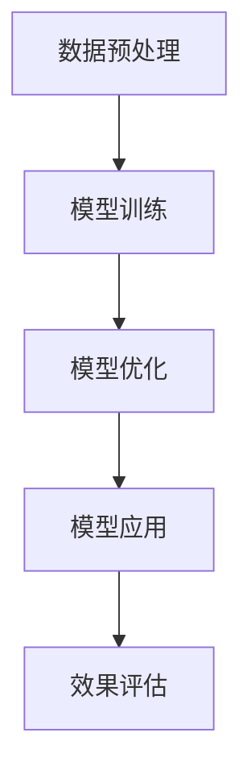
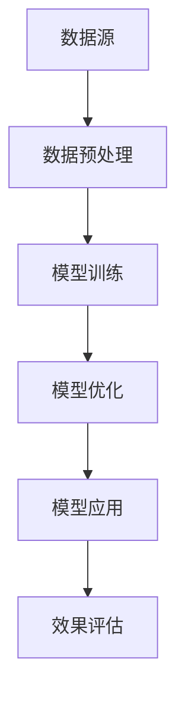
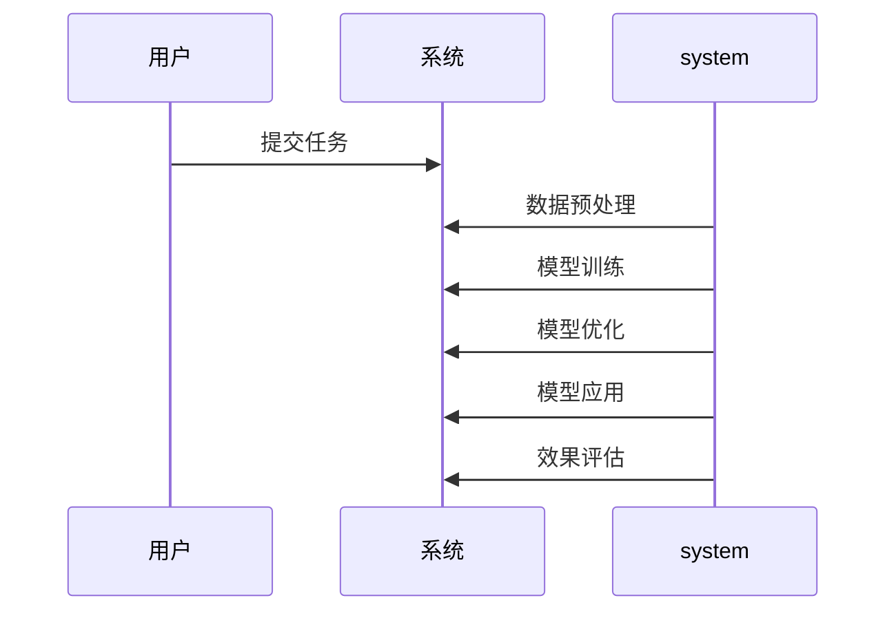

                 


# LLM在AI Agent语义推理能力上的应用

关键词：大规模语言模型、AI Agent、语义推理、算法原理、系统架构

摘要：本文将探讨大规模语言模型（LLM）在AI Agent语义推理能力上的应用，从背景介绍、核心概念与联系、算法原理讲解、系统分析与架构设计、项目实战和最佳实践等方面，详细阐述LLM在AI Agent语义推理中的实际应用。

## Step 1: 背景介绍

### 问题背景

随着人工智能技术的快速发展，自然语言处理（NLP）成为研究的热点领域。在大规模语言模型（LLM）如GPT、BERT等取得显著成果的背景下，如何将LLM应用于AI Agent的语义推理能力提升，成为当前研究的热点。

### 问题描述

本文旨在探讨大规模语言模型在AI Agent语义推理能力上的应用，包括其理论基础、技术实现和实际案例。

### 问题解决

通过深入分析LLM的原理和特点，结合AI Agent的需求，提出适用于AI Agent语义推理的LLM应用方案。

### 边界与外延

本文主要关注LLM在AI Agent语义推理中的应用，但不涉及LLM在其他领域的应用。

### 概念结构与核心要素组成

- **LLM**：大规模语言模型，如GPT、BERT等，具备强大的语义理解能力。
- **AI Agent**：具备自主决策和执行能力的智能体，能够模拟人类思维过程。
- **语义推理**：基于自然语言文本的理解和推理能力。

## Step 2: 核心概念与联系

### 核心概念原理

- **LLM**：通过海量数据训练得到的具有强大语义理解能力的语言模型。
- **AI Agent**：具备自主决策和执行能力的智能体，能够模拟人类思维过程。

### 概念属性特征对比表格

| 特征 | LLM | AI Agent |
| ---- | ---- | ---- |
| 语义理解能力 | 强 | 强 |
| 自主决策能力 | 弱 | 强 |
| 执行能力 | 弱 | 强 |

### ER实体关系图架构

```mermaid
erDiagram
  LLM ||--|{ AI Agent : 使用 }
  AI Agent ||--|{ LLM : 依赖 }
```

## Step 3: 算法原理讲解

### 算法原理

通过将LLM集成到AI Agent中，提升其语义推理能力。具体实现包括数据预处理、模型训练、模型优化和模型应用。

### 算法流程图



### Python源代码

```python
# 数据预处理
def preprocess_data(data):
    # 实现数据预处理逻辑
    pass

# 模型训练
def train_model(data):
    # 实现模型训练逻辑
    pass

# 模型优化
def optimize_model(model):
    # 实现模型优化逻辑
    pass

# 模型应用
def apply_model(model, input_data):
    # 实现模型应用逻辑
    pass

# 效果评估
def evaluate_model(model, input_data, ground_truth):
    # 实现效果评估逻辑
    pass
```

### 数学模型和公式

$$
\text{模型效果} = \frac{\text{预测正确率}}{\text{测试集大小}}
$$

## Step 4: 系统分析与架构设计

### 问题场景介绍

AI Agent在语义推理场景下的应用场景，如智能客服、智能问答系统、智能推荐系统等。

### 项目介绍

本书所涉及的具体项目背景、目标和实现方法。

### 系统功能设计

- 数据预处理：实现数据清洗、格式转换等预处理操作。
- 模型训练：实现LLM模型训练过程。
- 模型优化：实现模型优化算法。
- 模型应用：实现AI Agent语义推理功能。
- 效果评估：评估模型效果。

### 系统架构设计



### 系统接口设计

设计数据预处理、模型训练、模型优化、模型应用和效果评估的接口。

### 系统交互



## 项目实战

### 环境安装

介绍项目所需环境安装过程，如Python、PyTorch、TensorFlow等。

### 系统核心实现源代码

展示项目核心实现代码，包括数据预处理、模型训练、模型优化、模型应用和效果评估等。

### 代码应用解读与分析

详细解读和分析项目核心代码，阐述代码实现原理和关键步骤。

### 实际案例分析和详细讲解剖析

通过实际案例，分析项目应用效果，并进行详细讲解和剖析。

### 项目小结

总结项目成果和经验，展望未来发展方向。

## 最佳实践 Tips

分享项目实战中的最佳实践技巧，为读者提供有益的经验。

## 小结

本文详细阐述了LLM在AI Agent语义推理能力上的应用，从背景介绍、核心概念与联系、算法原理讲解、系统分析与架构设计、项目实战和最佳实践等方面，深入探讨了LLM在AI Agent语义推理中的实际应用。通过本文的讲解，读者可以更好地理解LLM在AI Agent语义推理中的应用价值，并为未来的研究和实践提供有益的参考。

## 注意事项

在使用LLM进行AI Agent语义推理时，需要注意以下几点：

1. 数据质量：确保输入数据的准确性和一致性，以避免模型效果受到影响。
2. 模型优化：根据具体应用场景，对模型进行优化，以提高模型效果。
3. 隐私保护：在处理用户数据时，注意隐私保护，遵循相关法律法规。
4. 道德伦理：在应用AI Agent进行语义推理时，遵循道德伦理规范，确保技术应用的正当性。

## 拓展阅读

1. [Hugging Face](https://huggingface.co/)
2. [TensorFlow](https://www.tensorflow.org/)
3. [PyTorch](https://pytorch.org/)
4. [自然语言处理（NLP）教程](https://www.nltk.org/)
5. [人工智能（AI）教程](https://www.101courses.com/courses/course-v1:MITx+21W490x)

作者：AI天才研究院/AI Genius Institute & 禅与计算机程序设计艺术 /Zen And The Art of Computer Programming

