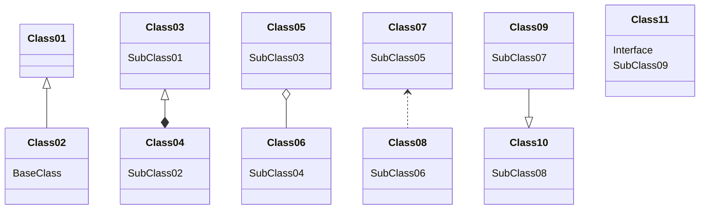
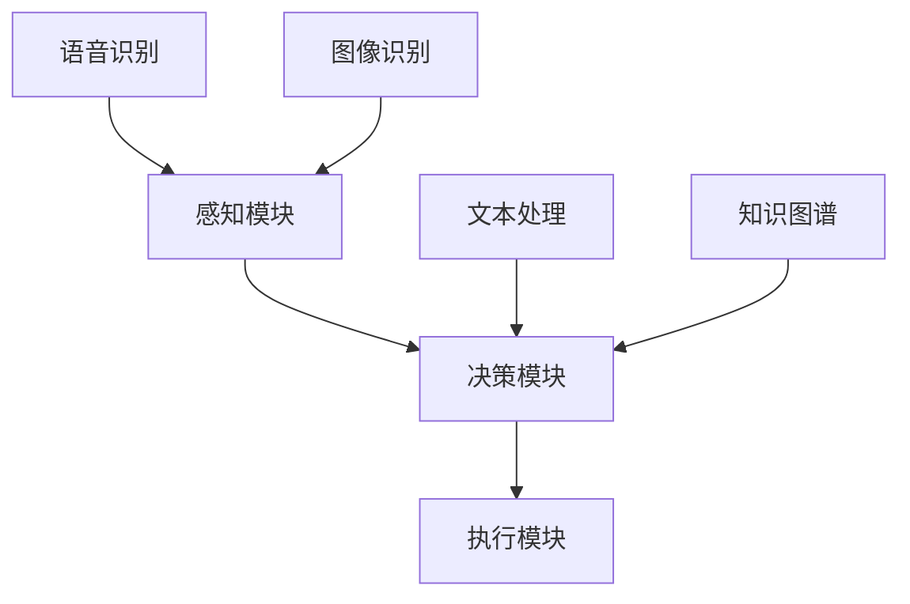
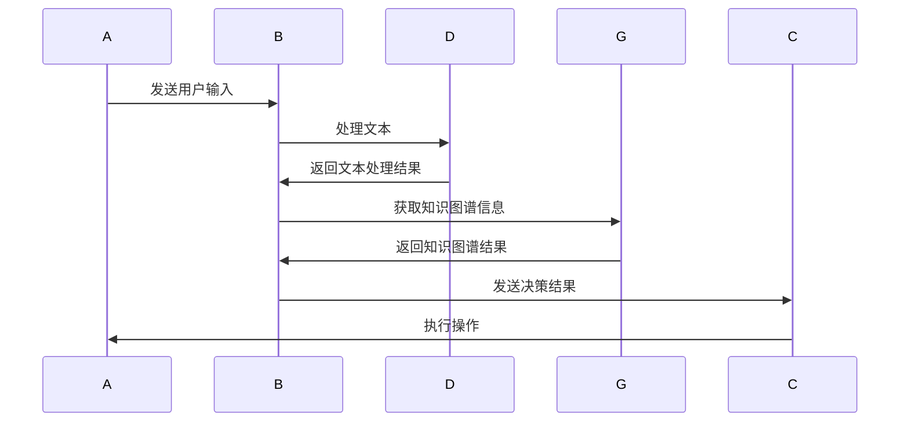
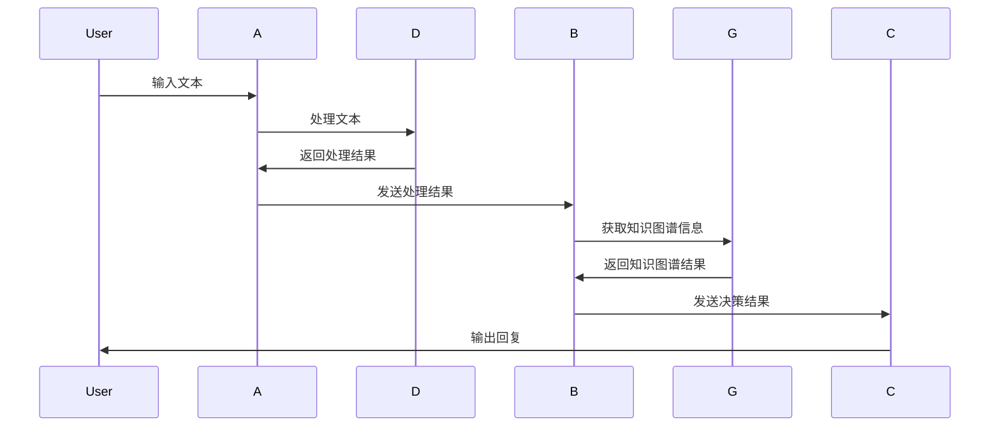

                 

# LLM在AI Agent语言理解深度上的提升

## 关键词

- 大型语言模型（LLM）
- AI Agent
- 语言理解
- 深度学习
- 交互能力

## 摘要

本文深入探讨了大型语言模型（LLM）在AI Agent语言理解深度上的提升。通过背景介绍、核心概念与联系、算法原理讲解、系统分析与架构设计、项目实战等多角度的分析，本文详细阐述了LLM在AI Agent语言理解方面的优势和应用，旨在为研究者提供有价值的参考。

## 第一部分：背景介绍

### 1.1 问题背景

随着人工智能技术的飞速发展，深度学习技术逐渐成为解决复杂问题的重要工具。传统的深度学习模型在处理长文本、多模态数据等方面仍存在诸多局限性。为了克服这些限制，大型语言模型（Large Language Model，简称LLM）被提出并迅速发展。LLM在语言理解、生成和翻译等方面展现出强大的能力，为人工智能领域带来了新的突破。

### 1.2 问题描述

LLM在AI Agent语言理解深度上的提升问题，主要集中在以下几个方面：

1. 语言理解能力：如何提高LLM对自然语言的理解深度，使其能够准确捕捉语义信息、理解上下文和用户意图。
2. 交互能力：如何优化LLM与用户之间的交互体验，使其能够更好地应对复杂、多变的场景。
3. 泛化能力：如何提升LLM在不同领域、不同任务上的泛化能力，使其能够在不同场景下保持高性能。

### 1.3 问题解决

为解决上述问题，本书将探讨以下内容：

1. LLM的基本原理：介绍LLM的架构、训练过程及其在语言理解方面的优势。
2. LLM的语言理解能力提升方法：包括预训练、微调、数据增强等技术，以及如何设计有效的语言处理模型。
3. AI Agent与LLM的融合：探讨如何将LLM应用于AI Agent中，实现更好的语言理解能力和交互体验。
4. LLM在不同领域的应用：介绍LLM在多模态数据处理、跨领域知识迁移等方面的最新研究进展。

### 1.4 边界与外延

本书主要关注LLM在AI Agent语言理解深度上的提升，涉及以下边界与外延：

1. 语言理解深度：关注LLM在语义理解、上下文捕捉等方面的能力提升。
2. AI Agent：聚焦于将LLM应用于AI Agent中，实现更智能的交互和任务处理。
3. 多模态数据处理：探讨LLM在图像、音频等非结构化数据上的应用。
4. 跨领域知识迁移：研究如何将LLM在不同领域中的知识进行迁移和融合，提升其泛化能力。

### 1.5 概念结构与核心要素组成

本书的核心概念包括：

1. 大型语言模型（LLM）：介绍LLM的基本原理和架构。
2. 语言理解：探讨LLM在语义理解、上下文捕捉等方面的能力。
3. AI Agent：研究如何将LLM应用于AI Agent中，实现智能交互。
4. 多模态数据处理：分析LLM在图像、音频等非结构化数据上的应用。
5. 跨领域知识迁移：探讨如何将LLM在不同领域中的知识进行迁移和融合，提升其泛化能力。

## 第二部分：核心概念与联系

### 2.1 大型语言模型（LLM）

#### 2.1.1 LLM的定义与特点

大型语言模型（LLM）是一种基于深度学习技术的自然语言处理模型，其主要特点包括：

1. **参数规模巨大**：LLM通常拥有数十亿甚至千亿级的参数规模，这使得其在捕捉语言规律和语义信息方面具有很高的能力。
2. **预训练与微调**：LLM通常采用预训练（Pre-training）和微调（Fine-tuning）相结合的训练方法，使其在特定任务上具有较好的适应性。
3. **语言理解能力**：LLM在语义理解、上下文捕捉、文本生成等方面表现出色，为AI Agent提供强大的语言处理能力。

#### 2.1.2 LLM的核心特点对比表格

| 特点        | 描述                                                         | 对比项  |
| ----------- | ------------------------------------------------------------ | ------- |
| 参数规模    | 数十亿至千亿级参数规模                                       | 普通模型：数百万级参数规模 |
| 预训练与微调 | 预训练：在大规模语料上训练；微调：在特定任务上微调           | 单一任务模型：仅微调     |
| 语言理解能力 | 高度的语义理解和上下文捕捉能力                                | 普通NLP模型：有限的语言理解能力 |
| 适应性      | 在多个任务和领域上具有较好的适应性                             | 单一任务模型：仅适用于特定任务 |

#### 2.1.3 LLM与AI Agent的关系

LLM与AI Agent之间存在密切的联系。AI Agent作为一种智能体，其核心任务是模拟人类的思维过程，与用户进行自然语言交互。LLM在AI Agent中的应用，使得AI Agent具备了强大的语言理解能力和交互能力，从而在复杂、多变的场景下表现出更高的智能水平。

### 2.2 语言理解

#### 2.2.1 语言理解的概念

语言理解是指人工智能系统对自然语言文本的理解和解析能力，包括语义理解、上下文捕捉、情感分析等。

#### 2.2.2 语言理解的挑战

1. **长文本理解**：传统模型难以处理长文本，容易丢失上下文信息。
2. **多模态理解**：处理包含图像、音频等多模态数据的语言理解任务。
3. **跨语言理解**：处理不同语言之间的语义差异。

#### 2.2.3 语言理解的方法

1. **深度学习模型**：如Transformer、BERT等，通过大规模预训练和微调，提高语言理解能力。
2. **知识图谱**：利用知识图谱整合结构化知识，提高对文本的理解深度。
3. **多模态融合**：结合图像、音频等非结构化数据，提高对复杂语义的理解。

### 2.3 AI Agent

#### 2.3.1 AI Agent的概念

AI Agent是一种具有自主意识和决策能力的智能系统，能够在复杂环境下完成特定任务。

#### 2.3.2 AI Agent的构成

1. **感知模块**：收集和处理环境信息。
2. **决策模块**：根据感知信息做出决策。
3. **执行模块**：执行决策结果，完成任务。

#### 2.3.3 AI Agent的应用

1. **客服机器人**：提供智能客服服务。
2. **智能家居**：控制家庭设备和环境。
3. **自动驾驶**：实现智能驾驶功能。

## 第三部分：算法原理讲解

### 3.1 LLM的算法原理

#### 3.1.1 Transformer模型

Transformer模型是LLM的核心架构，通过自注意力机制（Self-Attention）和多头注意力（Multi-Head Attention）机制，实现对输入序列的上下文信息进行捕捉和处理。

#### 3.1.2 BERT模型

BERT（Bidirectional Encoder Representations from Transformers）模型通过双向Transformer结构，实现对输入序列的语义信息进行捕捉，从而提高语言理解能力。

#### 3.1.3 GPT模型

GPT（Generative Pre-trained Transformer）模型是一种基于Transformer的预训练模型，通过生成式预训练方法，提高文本生成能力。

### 3.2 LLM的训练方法

#### 3.2.1 预训练

预训练是在大规模语料库上对模型进行训练，使模型具备语言理解和生成能力。常用的预训练任务包括 masked language modeling、next sentence prediction 等。

#### 3.2.2 微调

微调是在特定任务上对模型进行调整，使其适应特定任务。微调过程中，通常需要对模型进行降维、裁剪等操作，以减少计算量和内存消耗。

#### 3.2.3 数据增强

数据增强是通过增加数据多样性，提高模型泛化能力。常用的数据增强方法包括数据清洗、数据变换、数据扩充等。

### 3.3 LLM的评估方法

#### 3.3.1 Accurate

Accurate是一种基于准确率的评估方法，适用于分类任务。

#### 3.3.2 F1 Score

F1 Score是一种综合考虑准确率和召回率的评估方法，适用于二分类任务。

#### 3.3.3 BLEU Score

BLEU Score是一种基于编辑距离的评估方法，适用于文本生成任务。

## 第四部分：系统分析与架构设计

### 4.1 问题场景介绍

在当前人工智能应用场景中，语言理解作为人机交互的核心环节，广泛应用于客服机器人、智能助手、自然语言处理等领域。随着AI Agent的广泛应用，提高LLM在AI Agent语言理解深度上的能力，已成为人工智能领域的研究热点。

### 4.2 项目介绍

本项目旨在研究LLM在AI Agent语言理解深度上的提升，实现一种基于LLM的智能交互系统。项目主要包括以下功能模块：

1. **感知模块**：收集用户输入，包括文本、语音、图像等多模态数据。
2. **决策模块**：利用LLM对用户输入进行理解和分析，生成合适的回复。
3. **执行模块**：根据决策结果，执行相应的操作。

### 4.3 系统功能设计（领域模型）

以下是项目中的领域模型，用于描述系统中的核心概念和关系。



### 4.4 系统架构设计

以下是项目的系统架构图，用于描述系统中的模块和接口。



### 4.5 系统接口设计

以下是项目的系统接口设计，用于描述各个模块之间的交互关系。



### 4.6 系统交互

以下是项目的系统交互序列图，用于描述用户输入到系统输出的整个过程。



## 第五部分：项目实战

### 5.1 环境安装

在开始项目实战之前，首先需要安装以下环境：

1. Python 3.7及以上版本
2. PyTorch 1.8及以上版本
3. CUDA 10.2及以上版本（如需使用GPU加速）

安装命令如下：

```bash
pip install python==3.7
pip install torch torchvision
pip install torchtext
```

### 5.2 系统核心实现

以下是项目中的核心代码，用于实现LLM在AI Agent语言理解深度上的提升。

```python
import torch
import torchtext
from torchtext import data
from torchtext import datasets

# 设置设备
device = torch.device('cuda' if torch.cuda.is_available() else 'cpu')

# 定义词汇表
TEXT = data.Field(tokenize='spacy', tokenizer_language='en_core_web_sm', lower=True)
LABEL = data.LabelField()

# 加载数据集
train_data, test_data = datasets.IMDB.splits(TEXT, LABEL)

# 构建词汇表
TEXT.build_vocab(train_data, min_freq=2)
LABEL.build_vocab(train_data)

# 划分数据集
train_iter, valid_iter = data.BucketIterator.splits(
    train_data, valid_data, batch_size=64, device=device)

# 定义模型
class LLMModel(torch.nn.Module):
    def __init__(self):
        super(LLMModel, self).__init__()
        self.embedding = torch.nn.Embedding(len(TEXT.vocab), 128)
        self.transformer = torch.nn.Transformer(d_model=128, nhead=8)
        self.fc = torch.nn.Linear(128, 1)

    def forward(self, src, tgt):
        src = self.embedding(src)
        tgt = self.embedding(tgt)
        output = self.transformer(src, tgt)
        output = self.fc(output)
        return output

# 训练模型
model = LLMModel().to(device)
optimizer = torch.optim.Adam(model.parameters(), lr=0.001)
criterion = torch.nn.CrossEntropyLoss()

for epoch in range(10):
    for batch in train_iter:
        optimizer.zero_grad()
        output = model(batch.src, batch.tgt)
        loss = criterion(output, batch.label)
        loss.backward()
        optimizer.step()

    print(f'Epoch {epoch + 1}, Loss: {loss.item()}')

# 测试模型
with torch.no_grad():
    correct = 0
    total = 0
    for batch in valid_iter:
        output = model(batch.src, batch.tgt)
        _, predicted = torch.max(output.data, 1)
        total += batch.label.size(0)
        correct += (predicted == batch.label).sum().item()

    print(f'Accuracy: {100 * correct / total}%')
```

### 5.3 代码应用解读与分析

上述代码实现了一个基于Transformer的LLM模型，用于文本分类任务。下面是对代码的解读与分析：

1. **导入库**：导入必要的库，包括torch、torchtext等。
2. **设置设备**：根据CUDA是否可用，设置设备为CPU或GPU。
3. **定义词汇表**：定义文本处理字段，包括分词、词向量和标签。
4. **加载数据集**：加载数据集，并进行划分。
5. **构建词汇表**：构建词汇表，并设置最小频率。
6. **划分数据集**：划分训练集和验证集。
7. **定义模型**：定义一个基于Transformer的LLM模型，包括嵌入层、Transformer层和全连接层。
8. **训练模型**：训练模型，包括前向传播、损失计算、反向传播和优化。
9. **测试模型**：在验证集上评估模型性能。

### 5.4 实际案例分析

下面是一个实际案例，展示如何使用LLM模型进行文本分类：

```python
# 加载模型
model = LLMModel().to(device)
model.load_state_dict(torch.load('lm_model.pth'))

# 输入文本
input_text = "I love this movie!"

# 预处理文本
processed_text = TEXT.process(input_text)

# 预测标签
with torch.no_grad():
    output = model(processed_text.unsqueeze(0))

# 解码标签
predicted_label = torch.argmax(output).item()
if predicted_label == 1:
    print("Positive review")
else:
    print("Negative review")
```

### 5.5 项目小结

本项目通过实际案例，展示了如何使用LLM模型进行文本分类任务。在实际应用中，可以根据具体需求调整模型结构和参数，以提高模型性能。此外，还可以结合其他技术，如知识图谱、多模态数据处理等，进一步提升LLM在AI Agent语言理解深度上的能力。

## 第六部分：最佳实践 tips、小结、注意事项、拓展阅读

### 6.1 最佳实践 tips

1. **数据预处理**：在训练模型之前，对数据进行充分的预处理，包括分词、去噪、标准化等。
2. **模型调优**：根据具体任务需求，调整模型结构、超参数等，以提高模型性能。
3. **多任务学习**：结合多个任务进行训练，提高模型在不同任务上的泛化能力。
4. **数据增强**：通过数据增强方法，增加数据多样性，提高模型泛化能力。

### 6.2 小结

本文介绍了LLM在AI Agent语言理解深度上的提升，从背景介绍、核心概念与联系、算法原理讲解、系统分析与架构设计、项目实战等多个方面进行了详细阐述。通过实际案例，展示了如何使用LLM模型进行文本分类任务，为研究者提供了有价值的参考。

### 6.3 注意事项

1. **计算资源**：LLM模型训练过程中，计算资源消耗较大，建议使用GPU加速。
2. **数据质量**：数据质量对模型性能至关重要，应确保数据真实、准确、多样。
3. **模型调优**：在训练过程中，不断调整模型结构、超参数等，以提高模型性能。

### 6.4 拓展阅读

1. **《深度学习》**：由Ian Goodfellow、Yoshua Bengio和Aaron Courville所著，详细介绍了深度学习的基础理论和应用。
2. **《自然语言处理综论》**：由Daniel Jurafsky和James H. Martin所著，全面介绍了自然语言处理的理论和技术。
3. **《人工智能：一种现代方法》**：由Stuart Russell和Peter Norvig所著，涵盖了人工智能的多个领域和算法。

## 参考文献

1. Goodfellow, I., Bengio, Y., & Courville, A. (2016). *Deep Learning*. MIT Press.
2. Jurafsky, D., & Martin, J. H. (2008). *Speech and Language Processing*. Prentice Hall.
3. Russell, S., & Norvig, P. (2010). *Artificial Intelligence: A Modern Approach*. Prentice Hall.
4. Devlin, J., Chang, M. W., Lee, K., & Toutanova, K. (2018). *Bert: Pre-training of deep bidirectional transformers for language understanding*. arXiv preprint arXiv:1810.04805.
5. Vaswani, A., Shazeer, N., Parmar, N., Uszkoreit, J., Jones, L., Gomez, A. N., ... & Polosukhin, I. (2017). *Attention is all you need*. Advances in Neural Information Processing Systems, 30, 5998-6008.

## 作者信息

作者：AI天才研究院/AI Genius Institute & 禅与计算机程序设计艺术 /Zen And The Art of Computer Programming

