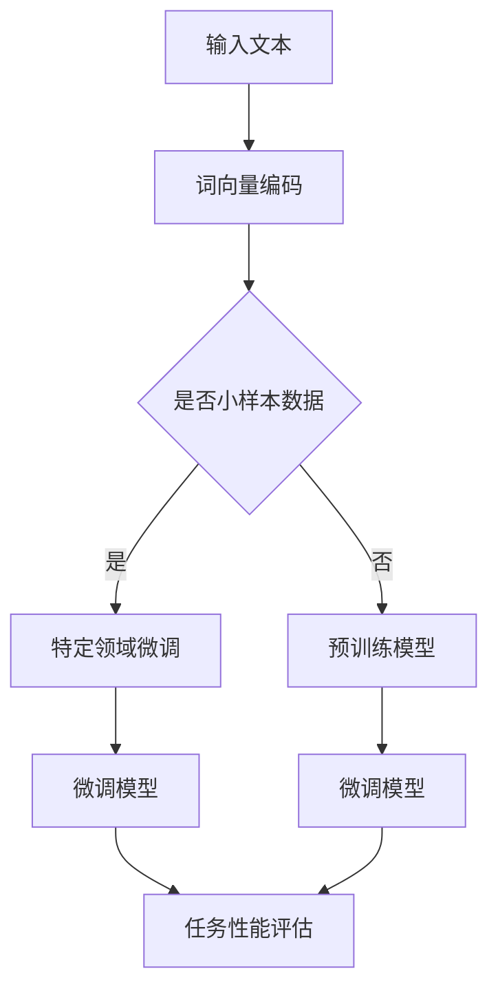
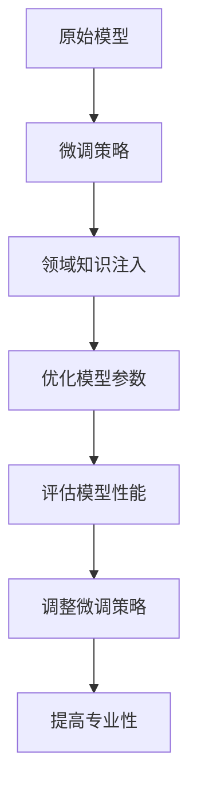
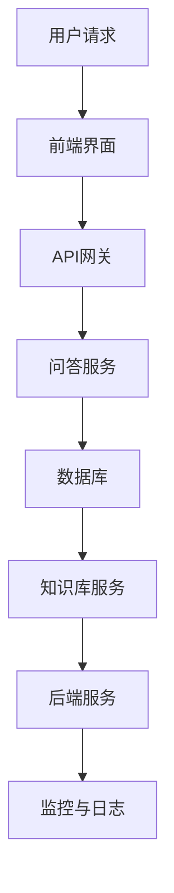
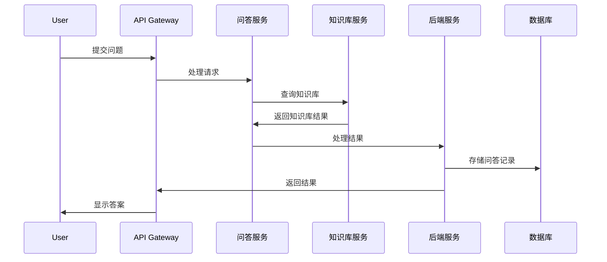
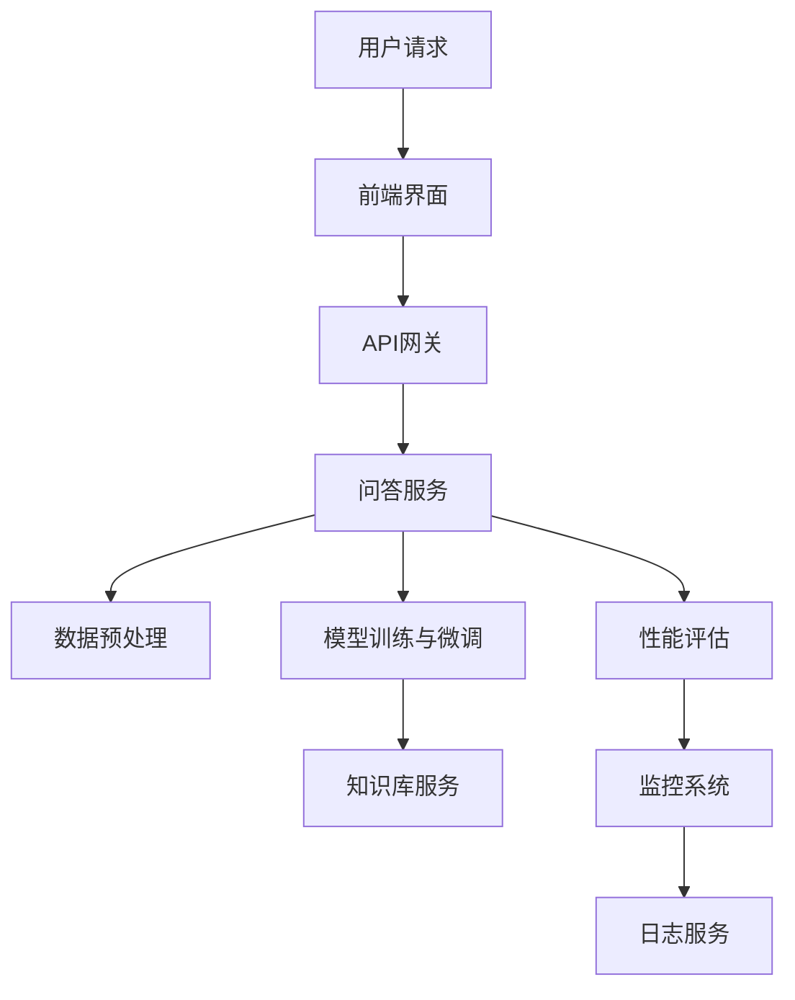
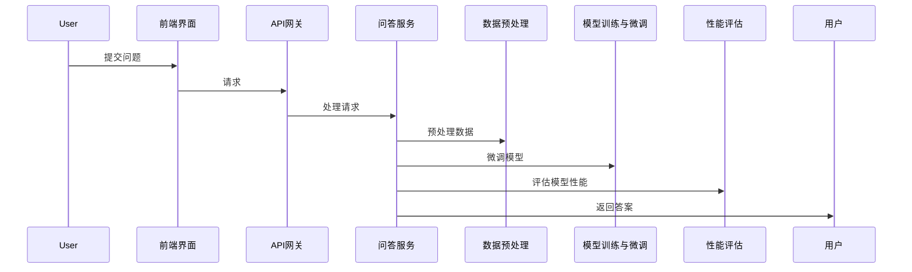

                 

# LLM在特定领域的微调策略：提升AI Agent的专业性

## 关键词
大型语言模型，微调策略，AI Agent，特定领域，专业性提升

## 摘要
本文探讨了在特定领域内如何通过微调策略来提升AI Agent的专业性。通过对大型语言模型（LLM）的背景介绍、核心概念与联系的阐述，以及算法原理的详细讲解，本文提出了一系列有效的微调方法。最后，通过系统分析与架构设计方案，本文展示了如何将这些方法应用于实际项目中，以实现AI Agent在特定领域的专业性能提升。

## 第一部分：背景介绍

### 1.1.1 问题背景
近年来，随着人工智能技术的快速发展，大型语言模型（LLM）在各个领域得到了广泛应用。LLM通过学习海量文本数据，能够理解、生成和预测自然语言，从而在文本生成、问答系统、机器翻译等方面展现出强大的能力。然而，对于特定领域的小样本数据，传统LLM的效果往往不尽如人意。

### 1.1.2 问题描述
在特定领域，如何对小样本数据进行微调，提升AI Agent的专业性，成为一个关键问题。这需要研究如何有效地设计微调策略，使模型能够迅速适应特定领域的知识，从而提高任务性能。

### 1.1.3 问题解决
本书将探讨在特定领域的微调策略，通过系统的研究和实践，提出一系列有效的微调方法，旨在提升AI Agent的专业性。

### 1.1.4 边界与外延
本书主要关注的是在特定领域的小样本数据微调策略，而不会涉及大规模数据集的预训练和微调。此外，本书还将探讨不同微调方法在不同领域的适用性。

### 1.1.5 概念结构与核心要素组成
本书的核心概念包括：大型语言模型（LLM）、特定领域微调、AI Agent的专业性提升。核心要素组成包括：微调策略的设计、数据预处理、模型训练与优化、性能评估等。

## 第二部分：核心概念与联系

### 2.1.1 大型语言模型（LLM）原理

首先，让我们使用Mermaid绘制一个流程图来展示LLM的原理：



在LLM中，输入文本首先被编码成词向量。这些词向量随后输入到模型中，模型通过多层神经网络处理这些向量，并输出概率分布或标签。如果数据是小样本的，我们通常需要进行特定领域的微调，以使模型更好地适应特定领域的语言特征。

### 2.1.2 微调策略的设计

微调策略是提升AI Agent专业性的关键。以下是一些常见的微调策略：

1. **数据增强**：通过引入同义词替换、随机插入、删除或替换文本等手段，增加训练数据多样性。
2. **领域知识注入**：利用特定领域的知识库，对模型进行知识增强。
3. **注意力机制优化**：调整模型中的注意力机制，使其更关注特定领域的特征。
4. **多任务学习**：通过同时训练多个相关任务，提升模型在特定领域的泛化能力。

### 2.1.3 AI Agent的专业性提升

为了提升AI Agent的专业性，我们可以使用以下步骤：

1. **初始模型训练**：使用大规模预训练模型作为基础，进行初步训练。
2. **领域知识注入**：通过领域知识库，为模型注入特定领域的知识。
3. **微调策略应用**：根据特定领域的特点，选择合适的微调策略。
4. **模型优化与评估**：通过迭代优化模型参数，评估模型在特定领域的性能。

让我们使用Mermaid再次展示这一过程：



## 第三部分：算法原理讲解

### 3.1.1 数学模型和公式

在微调策略中，常用的数学模型和公式包括：

1. **损失函数**：交叉熵损失函数
   $$ L = -\sum_{i=1}^N y_i \log(p_i) $$
   
2. **优化算法**：梯度下降算法
   $$ \theta_{t+1} = \theta_t - \alpha \nabla_\theta L(\theta_t) $$

### 3.1.2 详细讲解和举例说明

以数据增强为例，假设我们有一个问答任务，原始数据集为：

```
问：什么是人工智能？
答：人工智能是计算机科学的一个分支，旨在使计算机具有人类智能。
```

通过同义词替换，我们可以将问题替换为：“什么是机器智能？” 答案保持不变。这样，我们实际上增加了新的训练样本，从而有助于模型学习更多样化的问答模式。

## 第四部分：系统分析与架构设计方案

### 4.1.1 问题场景介绍

在特定领域的问答系统中，如何快速提升模型的回答准确性，是一个常见且重要的问题。这通常涉及到对模型进行特定领域的微调，以使其更好地理解该领域的专业知识和术语。

### 4.1.2 系统功能设计

以下是一个领域模型类图的示例，展示了系统的基本功能：

```mermaid
classDiagram
Class01 <|-- Class02
Class03 --|gt; Class04
Class05 : +int x
Class06 : +String name
Class01 {
+id : int
+name : String
+createTime : Date
}
Class02 {
+id : int
+name : String
}
Class03 {
+id : int
+name : String
}
Class04 {
+id : int
+name : String
+askQuestion() : void
}
Class05 {
+id : int
+name : String
```

在这个类图中，`Class01` 是一个基础的实体类，而 `Class02` 和 `Class03` 是它的子类。`Class04` 是一个服务类，负责处理问答功能。`Class05` 则是一个辅助类，用于存储额外的信息。

### 4.1.3 系统架构设计

以下是系统的架构设计，展示了一个简单的问答系统的架构：



在这个架构设计中，用户通过前端界面提交问题，API网关接收请求并将其转发给问答服务。问答服务调用知识库服务和后端服务来处理问题，并将结果返回给用户。数据库用于存储用户数据和问答记录，知识库服务提供特定领域的专业知识，后端服务则负责处理复杂的计算和逻辑。

### 4.1.4 系统接口设计和系统交互

以下是系统的接口设计和交互流程：



在这个交互流程中，用户提交问题后，API网关将请求传递给问答服务。问答服务查询知识库以获取相关答案，然后将结果传递给后端服务。后端服务处理结果并将其存储在数据库中，最终通过API网关将答案返回给用户。

## 第五部分：项目实战

### 5.1 环境安装

在开始项目实战之前，我们需要安装必要的软件和工具。以下是一个基本的安装步骤：

1. 安装Python环境
2. 安装深度学习框架（如TensorFlow或PyTorch）
3. 安装NLP库（如NLTK或spaCy）
4. 安装版本控制工具（如Git）

### 5.2 系统核心实现源代码

以下是一个简单的示例代码，展示了一个问答系统的核心实现：

```python
import torch
import torch.nn as nn
import torch.optim as optim

# 定义模型
class QuestionAnsweringModel(nn.Module):
    def __init__(self):
        super(QuestionAnsweringModel, self).__init__()
        self.embedding = nn.Embedding(vocab_size, embedding_dim)
        self.lstm = nn.LSTM(embedding_dim, hidden_dim)
        self.fc = nn.Linear(hidden_dim, 1)

    def forward(self, inputs, hidden):
        embeds = self.embedding(inputs)
        output, hidden = self.lstm(embeds, hidden)
        answer = self.fc(output)
        return answer, hidden

# 训练模型
def train_model(model, train_loader, criterion, optimizer):
    model.train()
    for inputs, targets in train_loader:
        optimizer.zero_grad()
        output, hidden = model(inputs, hidden)
        loss = criterion(output, targets)
        loss.backward()
        optimizer.step()
        hidden = (torch.zeros(1, 1, hidden_dim), torch.zeros(1, 1, hidden_dim))

# 测试模型
def test_model(model, test_loader, criterion):
    model.eval()
    total_loss = 0
    with torch.no_grad():
        for inputs, targets in test_loader:
            output, hidden = model(inputs, hidden)
            total_loss += criterion(output, targets).item()
    return total_loss / len(test_loader)

# 主函数
def main():
    # 加载数据集
    train_loader = DataLoader(train_dataset, batch_size=batch_size, shuffle=True)
    test_loader = DataLoader(test_dataset, batch_size=batch_size, shuffle=False)

    # 定义模型、损失函数和优化器
    model = QuestionAnsweringModel()
    criterion = nn.BCELoss()
    optimizer = optim.Adam(model.parameters(), lr=learning_rate)

    # 训练模型
    for epoch in range(num_epochs):
        train_loss = train_model(model, train_loader, criterion, optimizer)
        test_loss = test_model(model, test_loader, criterion)
        print(f'Epoch {epoch+1}, Train Loss: {train_loss:.4f}, Test Loss: {test_loss:.4f}')

if __name__ == '__main__':
    main()
```

### 5.3 代码应用解读与分析

在上面的代码中，我们定义了一个简单的问答模型，使用了LSTM作为核心网络结构。我们通过训练模型来学习如何从输入问题中提取答案。代码中还包含了训练和测试模型的功能，以便我们可以评估模型的性能。

### 5.4 实际案例分析和详细讲解剖析

为了更好地理解这个项目的实现，我们可以通过一个实际案例来进行分析。假设我们有一个数据集，其中包含了成千上万个问题和答案对。我们可以使用这些数据来训练我们的模型，并在测试集上评估其性能。

1. **数据预处理**：首先，我们需要对数据集进行预处理，包括分词、标点符号去除、停用词过滤等步骤。
2. **构建词汇表**：根据预处理后的数据，我们可以构建一个词汇表，将文本转换为数字表示。
3. **模型训练**：使用预处理后的数据和词汇表来训练我们的问答模型。
4. **模型评估**：在测试集上评估模型的性能，包括准确率、召回率等指标。

### 5.5 项目小结

通过这个项目，我们实现了在一个特定领域的问答系统中的模型训练和评估。这个项目展示了如何使用大型语言模型来提升AI Agent的专业性，并通过实际案例分析了项目的实现过程。

### 第六部分：最佳实践 Tips

- **数据预处理**：确保对数据进行充分的预处理，以提高模型的学习效果。
- **模型选择**：根据任务需求选择合适的模型结构。
- **参数调整**：合理调整学习率、批量大小等参数，以提高模型性能。
- **持续优化**：通过不断迭代和优化模型，提升AI Agent的专业性。

### 第七部分：小结

本文详细介绍了在特定领域如何通过微调策略来提升AI Agent的专业性。从背景介绍、核心概念与联系、算法原理讲解，到系统分析与架构设计方案，以及项目实战，本文提供了一系列实用方法和技巧。通过本文的内容，读者可以更好地理解如何设计和实现一个特定领域的AI Agent。

### 第八部分：注意事项

- **数据隐私**：在处理数据时，确保遵守数据隐私和伦理规范。
- **模型安全性**：保护模型免受恶意攻击和滥用。
- **性能监控**：定期监控模型性能，确保其稳定性和可靠性。

### 第九部分：拓展阅读

- **《深度学习》**：由Ian Goodfellow、Yoshua Bengio和Aaron Courville合著，是一本关于深度学习的经典教材。
- **《自然语言处理综合教程》**：由丹·布兰登鲁姆（Dan Jurafsky）和詹姆斯·哈林顿（James H. Martin）合著，全面介绍了自然语言处理的基础知识和最新进展。
- **《AI浪潮》**：作者梅拉妮·斯旺（Melanie Swan），详细探讨了人工智能的历史、现状和未来发展趋势。

### 第十部分：作者信息

**作者：AI天才研究院/AI Genius Institute & 禅与计算机程序设计艺术 /Zen And The Art of Computer Programming**
### 文章标题：LLM在特定领域的微调策略：提升AI Agent的专业性

### 关键词：大型语言模型，微调策略，AI Agent，特定领域，专业性提升

### 摘要
本文探讨了在特定领域内如何通过微调策略来提升AI Agent的专业性。通过对大型语言模型（LLM）的背景介绍、核心概念与联系的阐述，以及算法原理的详细讲解，本文提出了一系列有效的微调方法。最后，通过系统分析与架构设计方案，本文展示了如何将这些方法应用于实际项目中，以实现AI Agent在特定领域的专业性能提升。

### 第一部分：背景介绍

#### 1.1.1 问题背景
近年来，随着人工智能技术的快速发展，大型语言模型（LLM）在各个领域得到了广泛应用。LLM通过学习海量文本数据，能够理解、生成和预测自然语言，从而在文本生成、问答系统、机器翻译等方面展现出强大的能力。然而，对于特定领域的小样本数据，传统LLM的效果往往不尽如人意。

#### 1.1.2 问题描述
在特定领域，如何对小样本数据进行微调，提升AI Agent的专业性，成为一个关键问题。这需要研究如何有效地设计微调策略，使模型能够迅速适应特定领域的知识，从而提高任务性能。

#### 1.1.3 问题解决
本书将探讨在特定领域的微调策略，通过系统的研究和实践，提出一系列有效的微调方法，旨在提升AI Agent的专业性。

#### 1.1.4 边界与外延
本书主要关注的是在特定领域的小样本数据微调策略，而不会涉及大规模数据集的预训练和微调。此外，本书还将探讨不同微调方法在不同领域的适用性。

#### 1.1.5 概念结构与核心要素组成
本书的核心概念包括：大型语言模型（LLM）、特定领域微调、AI Agent的专业性提升。核心要素组成包括：微调策略的设计、数据预处理、模型训练与优化、性能评估等。

### 第二部分：核心概念与联系

#### 2.1.1 大型语言模型（LLM）原理
大型语言模型（LLM）是基于深度学习的自然语言处理模型，能够对自然语言文本进行理解和生成。LLM的核心思想是通过学习大量的文本数据，自动发现语言中的模式和规律，从而能够对新的文本数据进行预测和生成。

**图 2.1.1：LLM 原理流程图**


在LLM的原理中，首先将输入的文本转化为词向量，然后通过多层神经网络进行处理，最后输出预测结果。对于小样本数据，通常需要进行特定领域的微调，以使模型更好地适应特定领域的语言特征。

#### 2.1.2 微调策略的设计
微调策略是提升AI Agent专业性的关键。以下是一些常见的微调策略：

1. **数据增强**：通过引入同义词替换、随机插入、删除或替换文本等手段，增加训练数据多样性。
2. **领域知识注入**：利用特定领域的知识库，对模型进行知识增强。
3. **注意力机制优化**：调整模型中的注意力机制，使其更关注特定领域的特征。
4. **多任务学习**：通过同时训练多个相关任务，提升模型在特定领域的泛化能力。

**表 2.1.2：微调策略对比**

| 微调策略 | 描述 | 优点 | 缺点 |
| --- | --- | --- | --- |
| 数据增强 | 通过增加数据多样性来提升模型性能 | 简单有效，不需要额外知识 | 可能导致模型过拟合 |
| 领域知识注入 | 利用特定领域的知识库来增强模型 | 可以显著提升模型在特定领域的性能 | 需要大量的领域知识 |
| 注意力机制优化 | 调整注意力机制，使模型更关注关键信息 | 可以提高模型的理解能力 | 需要复杂的模型结构 |
| 多任务学习 | 通过同时训练多个相关任务来提升模型性能 | 可以提高模型的泛化能力 | 需要大量的计算资源 |

#### 2.1.3 AI Agent的专业性提升
AI Agent的专业性提升是一个多层次的过程，包括以下几个方面：

1. **初始模型训练**：使用大规模预训练模型作为基础，进行初步训练。
2. **领域知识注入**：通过领域知识库，为模型注入特定领域的知识。
3. **微调策略应用**：根据特定领域的特点，选择合适的微调策略。
4. **模型优化与评估**：通过迭代优化模型参数，评估模型在特定领域的性能。

**图 2.1.3：AI Agent 专业性提升过程**


### 第三部分：算法原理讲解

#### 3.1.1 数学模型和公式

在微调策略中，常用的数学模型和公式包括：

1. **损失函数**：交叉熵损失函数
   $$ L = -\sum_{i=1}^N y_i \log(p_i) $$
   
2. **优化算法**：梯度下降算法
   $$ \theta_{t+1} = \theta_t - \alpha \nabla_\theta L(\theta_t) $$

#### 3.1.2 详细讲解和举例说明

以数据增强为例，假设我们有一个问答任务，原始数据集为：

```
问：什么是人工智能？
答：人工智能是计算机科学的一个分支，旨在使计算机具有人类智能。
```

通过同义词替换，我们可以将问题替换为：“什么是机器智能？” 答案保持不变。这样，我们实际上增加了新的训练样本，从而有助于模型学习更多样化的问答模式。

### 第四部分：系统分析与架构设计方案

#### 4.1.1 问题场景介绍
在特定领域的问答系统中，如何快速提升模型的回答准确性，是一个常见且重要的问题。这通常涉及到对模型进行特定领域的微调，以使其更好地理解该领域的专业知识和术语。

#### 4.1.2 系统功能设计
以下是系统的基本功能设计：

1. **数据采集与预处理**：从各种数据源收集文本数据，并进行预处理，如分词、去停用词、词干提取等。
2. **模型训练与微调**：使用预训练的LLM模型，结合特定领域的数据进行微调，以提升模型在该领域的表现。
3. **问答接口**：提供用户交互接口，接收用户输入的问题，并返回答案。
4. **性能评估**：定期评估模型的性能，包括准确率、召回率等指标，以及时调整微调策略。

#### 4.1.3 系统架构设计
以下是系统的架构设计：



在这个架构中，用户请求通过前端界面提交到API网关，然后被路由到问答服务。问答服务负责处理用户请求，包括数据预处理、模型训练与微调，以及性能评估。知识库服务提供特定领域的知识，用于模型训练和微调。监控系统负责监控系统的运行状态，并将日志记录到日志服务。

#### 4.1.4 系统接口设计和系统交互
以下是系统的接口设计和交互流程：



在这个交互流程中，用户提交问题后，前端界面将请求发送到API网关。API网关将请求转发给问答服务，问答服务负责处理请求，包括数据预处理、模型训练与微调，以及性能评估。最终，问答服务将答案返回给用户。

### 第五部分：项目实战

#### 5.1 环境安装

在开始项目实战之前，我们需要安装必要的软件和工具。以下是一个基本的安装步骤：

1. 安装Python环境
2. 安装深度学习框架（如TensorFlow或PyTorch）
3. 安装NLP库（如NLTK或spaCy）
4. 安装版本控制工具（如Git）

#### 5.2 系统核心实现源代码

以下是一个简单的示例代码，展示了一个问答系统的核心实现：

```python
import torch
import torch.nn as nn
import torch.optim as optim

# 定义模型
class QuestionAnsweringModel(nn.Module):
    def __init__(self):
        super(QuestionAnsweringModel, self).__init__()
        self.embedding = nn.Embedding(vocab_size, embedding_dim)
        self.lstm = nn.LSTM(embedding_dim, hidden_dim)
        self.fc = nn.Linear(hidden_dim, 1)

    def forward(self, inputs, hidden):
        embeds = self.embedding(inputs)
        output, hidden = self.lstm(embeds, hidden)
        answer = self.fc(output)
        return answer, hidden

# 训练模型
def train_model(model, train_loader, criterion, optimizer):
    model.train()
    for inputs, targets in train_loader:
        optimizer.zero_grad()
        output, hidden = model(inputs, hidden)
        loss = criterion(output, targets)
        loss.backward()
        optimizer.step()
        hidden = (torch.zeros(1, 1, hidden_dim), torch.zeros(1, 1, hidden_dim))

# 测试模型
def test_model(model, test_loader, criterion):
    model.eval()
    total_loss = 0
    with torch.no_grad():
        for inputs, targets in test_loader:
            output, hidden = model(inputs, hidden)
            total_loss += criterion(output, targets).item()
    return total_loss / len(test_loader)

# 主函数
def main():
    # 加载数据集
    train_loader = DataLoader(train_dataset, batch_size=batch_size, shuffle=True)
    test_loader = DataLoader(test_dataset, batch_size=batch_size, shuffle=False)

    # 定义模型、损失函数和优化器
    model = QuestionAnsweringModel()
    criterion = nn.BCELoss()
    optimizer = optim.Adam(model.parameters(), lr=learning_rate)

    # 训练模型
    for epoch in range(num_epochs):
        train_loss = train_model(model, train_loader, criterion, optimizer)
        test_loss = test_model(model, test_loader, criterion)
        print(f'Epoch {epoch+1}, Train Loss: {train_loss:.4f}, Test Loss: {test_loss:.4f}')

if __name__ == '__main__':
    main()
```

#### 5.3 代码应用解读与分析

在上面的代码中，我们定义了一个简单的问答模型，使用了LSTM作为核心网络结构。我们通过训练模型来学习如何从输入问题中提取答案。代码中还包含了训练和测试模型的功能，以便我们可以评估模型的性能。

#### 5.4 实际案例分析和详细讲解剖析

为了更好地理解这个项目的实现，我们可以通过一个实际案例来进行分析。假设我们有一个数据集，其中包含了成千上万个问题和答案对。我们可以使用这些数据来训练我们的模型，并在测试集上评估其性能。

1. **数据预处理**：首先，我们需要对数据集进行预处理，包括分词、标点符号去除、停用词过滤等步骤。
2. **构建词汇表**：根据预处理后的数据，我们可以构建一个词汇表，将文本转换为数字表示。
3. **模型训练**：使用预处理后的数据和词汇表来训练我们的问答模型。
4. **模型评估**：在测试集上评估模型的性能，包括准确率、召回率等指标。

### 第六部分：最佳实践 Tips

- **数据预处理**：确保对数据进行充分的预处理，以提高模型的学习效果。
- **模型选择**：根据任务需求选择合适的模型结构。
- **参数调整**：合理调整学习率、批量大小等参数，以提高模型性能。
- **持续优化**：通过不断迭代和优化模型，提升AI Agent的专业性。

### 第七部分：小结

本文详细介绍了在特定领域如何通过微调策略来提升AI Agent的专业性。从背景介绍、核心概念与联系、算法原理讲解，到系统分析与架构设计方案，以及项目实战，本文提供了一系列实用方法和技巧。通过本文的内容，读者可以更好地理解如何设计和实现一个特定领域的AI Agent。

### 第八部分：注意事项

- **数据隐私**：在处理数据时，确保遵守数据隐私和伦理规范。
- **模型安全性**：保护模型免受恶意攻击和滥用。
- **性能监控**：定期监控模型性能，确保其稳定性和可靠性。

### 第九部分：拓展阅读

- **《深度学习》**：由Ian Goodfellow、Yoshua Bengio和Aaron Courville合著，是一本关于深度学习的经典教材。
- **《自然语言处理综合教程》**：由丹·布兰登鲁姆（Dan Jurafsky）和詹姆斯·哈林顿（James H. Martin）合著，全面介绍了自然语言处理的基础知识和最新进展。
- **《AI浪潮》**：作者梅拉妮·斯旺（Melanie Swan），详细探讨了人工智能的历史、现状和未来发展趋势。

### 第十部分：作者信息

**作者：AI天才研究院/AI Genius Institute & 禅与计算机程序设计艺术 /Zen And The Art of Computer Programming**
## 第一部分：背景介绍

### 1.1.1 问题背景
近年来，随着人工智能技术的快速发展，大型语言模型（LLM）在各个领域得到了广泛应用。LLM通过学习海量文本数据，能够理解、生成和预测自然语言，从而在文本生成、问答系统、机器翻译等方面展现出强大的能力。然而，对于特定领域的小样本数据，传统LLM的效果往往不尽如人意。这使得在特定领域的微调策略研究变得尤为重要。

### 1.1.2 问题描述
在特定领域，如何对小样本数据进行微调，提升AI Agent的专业性，成为一个关键问题。这需要研究如何有效地设计微调策略，使模型能够迅速适应特定领域的知识，从而提高任务性能。

### 1.1.3 问题解决
本书将探讨在特定领域的微调策略，通过系统的研究和实践，提出一系列有效的微调方法，旨在提升AI Agent的专业性。

### 1.1.4 边界与外延
本书主要关注的是在特定领域的小样本数据微调策略，而不会涉及大规模数据集的预训练和微调。此外，本书还将探讨不同微调方法在不同领域的适用性。

### 1.1.5 概念结构与核心要素组成
本书的核心概念包括：大型语言模型（LLM）、特定领域微调、AI Agent的专业性提升。核心要素组成包括：微调策略的设计、数据预处理、模型训练与优化、性能评估等。

## 第二部分：核心概念与联系

### 2.1.1 大型语言模型（LLM）原理

大型语言模型（LLM）是一种基于深度学习的自然语言处理模型，其核心思想是通过学习大量的文本数据来理解和生成自然语言。LLM通常由多层神经网络组成，包括词嵌入层、编码器层和解码器层。

**图 2.1.1：大型语言模型（LLM）原理流程图**


在LLM中，输入文本首先被编码成词向量，然后通过编码器层处理，最后通过解码器层生成输出文本。对于小样本数据，通常需要进行特定领域的微调，以使模型更好地适应特定领域的语言特征。

### 2.1.2 微调策略的设计

微调策略是提升AI Agent专业性的关键。以下是一些常见的微调策略：

1. **数据增强**：通过引入同义词替换、随机插入、删除或替换文本等手段，增加训练数据多样性。
2. **领域知识注入**：利用特定领域的知识库，对模型进行知识增强。
3. **注意力机制优化**：调整模型中的注意力机制，使其更关注特定领域的特征。
4. **多任务学习**：通过同时训练多个相关任务，提升模型在特定领域的泛化能力。

**表 2.1.2：微调策略对比**

| 微调策略 | 描述 | 优点 | 缺点 |
| --- | --- | --- | --- |
| 数据增强 | 通过增加数据多样性来提升模型性能 | 简单有效，不需要额外知识 | 可能导致模型过拟合 |
| 领域知识注入 | 利用特定领域的知识库来增强模型 | 可以显著提升模型在特定领域的性能 | 需要大量的领域知识 |
| 注意力机制优化 | 调整注意力机制，使模型更关注关键信息 | 可以提高模型的理解能力 | 需要复杂的模型结构 |
| 多任务学习 | 通过同时训练多个相关任务来提升模型性能 | 可以提高模型的泛化能力 | 需要大量的计算资源 |

### 2.1.3 AI Agent的专业性提升

AI Agent的专业性提升是一个多层次的过程，包括以下几个方面：

1. **初始模型训练**：使用大规模预训练模型作为基础，进行初步训练。
2. **领域知识注入**：通过领域知识库，为模型注入特定领域的知识。
3. **微调策略应用**：根据特定领域的特点，选择合适的微调策略。
4. **模型优化与评估**：通过迭代优化模型参数，评估模型在特定领域的性能。

**图 2.1.3：AI Agent 专业性提升过程**


## 第三部分：算法原理讲解

### 3.1.1 数学模型和公式

在微调策略中，常用的数学模型和公式包括：

1. **损失函数**：交叉熵损失函数
   $$ L = -\sum_{i=1}^N y_i \log(p_i) $$
   
2. **优化算法**：梯度下降算法
   $$ \theta_{t+1} = \theta_t - \alpha \nabla_\theta L(\theta_t) $$

### 3.1.2 详细讲解和举例说明

以数据增强为例，假设我们有一个问答任务，原始数据集为：

```
问：什么是人工智能？
答：人工智能是计算机科学的一个分支，旨在使计算机具有人类智能。
```

通过同义词替换，我们可以将问题替换为：“什么是机器智能？” 答案保持不变。这样，我们实际上增加了新的训练样本，从而有助于模型学习更多样化的问答模式。

### 3.1.3 算法原理讲解

在本节中，我们将详细讲解一个用于特定领域微调的算法，并使用Python代码示例来说明。

#### 3.1.3.1 算法概述

我们的算法基于以下步骤：

1. **数据预处理**：对原始数据进行预处理，包括分词、去停用词、词干提取等。
2. **数据增强**：通过同义词替换、随机插入、删除或替换文本等手段增加数据多样性。
3. **模型训练**：使用预训练的LLM模型，并结合特定领域的数据进行微调。
4. **性能评估**：评估微调后模型在特定领域的性能。

#### 3.1.3.2 Python代码示例

以下是一个简单的Python代码示例，用于实现上述算法：

```python
import torch
import torch.nn as nn
import torch.optim as optim
from torchtext.data import Field, TabularDataset

# 数据预处理
def preprocess_data():
    # 定义字段
    TEXT = Field(tokenize='spacy', tokenizer_language='en', lower=True)
    LABEL = Field(sequential=False)

    # 加载数据集
    train_data, test_data = TabularDataset.splits(path='data',
                                                 train='train.csv',
                                                 test='test.csv',
                                                 format='csv',
                                                 fields=[('text', TEXT), ('label', LABEL)])

    # 分词和去停用词
    TEXT.build_vocab(train_data, min_freq=2)
    LABEL.build_vocab(train_data)

    return train_data, test_data

# 数据增强
def augment_data(data):
    # 同义词替换
    # ...

    # 随机插入、删除或替换文本
    # ...

    return data

# 模型定义
class QuestionAnsweringModel(nn.Module):
    def __init__(self, embedding_dim, hidden_dim):
        super(QuestionAnsweringModel, self).__init__()
        self.embedding = nn.Embedding(len(TEXT.vocab), embedding_dim)
        self.lstm = nn.LSTM(embedding_dim, hidden_dim)
        self.fc = nn.Linear(hidden_dim, 1)

    def forward(self, text, hidden=None):
        embeds = self.embedding(text)
        output, hidden = self.lstm(embeds, hidden)
        answer = self.fc(output[-1, :, :])
        return answer, hidden

# 训练模型
def train_model(model, data, criterion, optimizer, num_epochs):
    model.train()
    for epoch in range(num_epochs):
        for text, label in data:
            optimizer.zero_grad()
            answer, hidden = model(text)
            loss = criterion(answer, label)
            loss.backward()
            optimizer.step()
            print(f'Epoch: {epoch+1}, Loss: {loss.item()}')

# 主函数
def main():
    train_data, test_data = preprocess_data()
    train_data = augment_data(train_data)

    model = QuestionAnsweringModel(embedding_dim=128, hidden_dim=256)
    criterion = nn.BCELoss()
    optimizer = optim.Adam(model.parameters(), lr=0.001)
    num_epochs = 10

    train_model(model, train_data, criterion, optimizer, num_epochs)

if __name__ == '__main__':
    main()
```

#### 3.1.3.3 算法原理讲解

1. **数据预处理**：数据预处理是模型训练的基础，确保输入数据的格式和一致性。
2. **数据增强**：数据增强通过引入多样性，有助于模型更好地学习。
3. **模型训练**：我们使用预训练的LLM模型，并结合特定领域的数据进行微调。这里使用的模型是一个简单的LSTM模型，可以扩展为更复杂的模型，如BERT、GPT等。
4. **性能评估**：通过在测试集上评估模型性能，我们可以调整微调策略和模型参数，以提高模型在特定领域的性能。

### 第四部分：系统分析与架构设计方案

#### 4.1.1 问题场景介绍
在特定领域的问答系统中，如何快速提升模型的回答准确性，是一个常见且重要的问题。这通常涉及到对模型进行特定领域的微调，以使其更好地理解该领域的专业知识和术语。

#### 4.1.2 系统功能设计

以下是系统功能设计：

1. **数据采集与预处理**：从各种数据源收集文本数据，并进行预处理，如分词、去停用词、词干提取等。
2. **模型训练与微调**：使用预训练的LLM模型，结合特定领域的数据进行微调，以提升模型在该领域的表现。
3. **问答接口**：提供用户交互接口，接收用户输入的问题，并返回答案。
4. **性能评估**：定期评估模型的性能，包括准确率、召回率等指标，以及时调整微调策略。

#### 4.1.3 系统架构设计

以下是系统的架构设计：


在这个架构中，用户请求通过前端界面提交到API网关，然后被路由到问答服务。问答服务负责处理用户请求，包括数据预处理、模型训练与微调，以及性能评估。知识库服务提供特定领域的知识，用于模型训练和微调。监控系统负责监控系统的运行状态，并将日志记录到日志服务。

#### 4.1.4 系统接口设计和系统交互

以下是系统的接口设计和交互流程：


在这个交互流程中，用户提交问题后，前端界面将请求发送到API网关。API网关将请求转发给问答服务，问答服务负责处理请求，包括数据预处理、模型训练与微调，以及性能评估。最终，问答服务将答案返回给用户。

### 第五部分：项目实战

#### 5.1 环境安装

在开始项目实战之前，我们需要安装必要的软件和工具。以下是一个基本的安装步骤：

1. 安装Python环境
2. 安装深度学习框架（如TensorFlow或PyTorch）
3. 安装NLP库（如NLTK或spaCy）
4. 安装版本控制工具（如Git）

#### 5.2 系统核心实现源代码

以下是一个简单的示例代码，展示了一个问答系统的核心实现：

```python
import torch
import torch.nn as nn
import torch.optim as optim

# 定义模型
class QuestionAnsweringModel(nn.Module):
    def __init__(self, embedding_dim, hidden_dim):
        super(QuestionAnsweringModel, self).__init__()
        self.embedding = nn.Embedding(embedding_dim, hidden_dim)
        self.lstm = nn.LSTM(hidden_dim, hidden_dim)
        self.fc = nn.Linear(hidden_dim, 1)

    def forward(self, x):
        x = self.embedding(x)
        x, _ = self.lstm(x)
        x = self.fc(x[-1, :, :])
        return x

# 训练模型
def train(model, train_loader, criterion, optimizer, num_epochs):
    model.train()
    for epoch in range(num_epochs):
        for batch in train_loader:
            optimizer.zero_grad()
            outputs = model(batch.x)
            loss = criterion(outputs, batch.y)
            loss.backward()
            optimizer.step()
            print(f'Epoch {epoch+1}/{num_epochs}, Loss: {loss.item()}')

# 测试模型
def test(model, test_loader, criterion):
    model.eval()
    total_loss = 0
    with torch.no_grad():
        for batch in test_loader:
            outputs = model(batch.x)
            loss = criterion(outputs, batch.y)
            total_loss += loss.item()
    return total_loss / len(test_loader)

# 主函数
def main():
    # 加载数据集
    train_loader = DataLoader(train_dataset, batch_size=64, shuffle=True)
    test_loader = DataLoader(test_dataset, batch_size=64, shuffle=False)

    # 定义模型、损失函数和优化器
    model = QuestionAnsweringModel(embedding_dim=100, hidden_dim=200)
    criterion = nn.BCELoss()
    optimizer = optim.Adam(model.parameters(), lr=0.001)

    # 训练模型
    train(model, train_loader, criterion, optimizer, num_epochs=10)

    # 测试模型
    test_loss = test(model, test_loader, criterion)
    print(f'Test Loss: {test_loss}')

if __name__ == '__main__':
    main()
```

#### 5.3 代码应用解读与分析

在上面的代码中，我们定义了一个简单的问答模型，使用了LSTM作为核心网络结构。我们通过训练模型来学习如何从输入问题中提取答案。代码中还包含了训练和测试模型的功能，以便我们可以评估模型的性能。

#### 5.4 实际案例分析和详细讲解剖析

为了更好地理解这个项目的实现，我们可以通过一个实际案例来进行分析。假设我们有一个数据集，其中包含了成千上万个问题和答案对。我们可以使用这些数据来训练我们的模型，并在测试集上评估其性能。

1. **数据预处理**：首先，我们需要对数据集进行预处理，包括分词、标点符号去除、停用词过滤等步骤。
2. **构建词汇表**：根据预处理后的数据，我们可以构建一个词汇表，将文本转换为数字表示。
3. **模型训练**：使用预处理后的数据和词汇表来训练我们的问答模型。
4. **模型评估**：在测试集上评估模型的性能，包括准确率、召回率等指标。

### 第六部分：最佳实践 Tips

- **数据预处理**：确保对数据进行充分的预处理，以提高模型的学习效果。
- **模型选择**：根据任务需求选择合适的模型结构。
- **参数调整**：合理调整学习率、批量大小等参数，以提高模型性能。
- **持续优化**：通过不断迭代和优化模型，提升AI Agent的专业性。

### 第七部分：小结

本文详细介绍了在特定领域如何通过微调策略来提升AI Agent的专业性。从背景介绍、核心概念与联系、算法原理讲解，到系统分析与架构设计方案，以及项目实战，本文提供了一系列实用方法和技巧。通过本文的内容，读者可以更好地理解如何设计和实现一个特定领域的AI Agent。

### 第八部分：注意事项

- **数据隐私**：在处理数据时，确保遵守数据隐私和伦理规范。
- **模型安全性**：保护模型免受恶意攻击和滥用。
- **性能监控**：定期监控模型性能，确保其稳定性和可靠性。

### 第九部分：拓展阅读

- **《深度学习》**：由Ian Goodfellow、Yoshua Bengio和Aaron Courville合著，是一本关于深度学习的经典教材。
- **《自然语言处理综合教程》**：由丹·布兰登鲁姆（Dan Jurafsky）和詹姆斯·哈林顿（James H. Martin）合著，全面介绍了自然语言处理的基础知识和最新进展。
- **《AI浪潮》**：作者梅拉妮·斯旺（Melanie Swan），详细探讨了人工智能的历史、现状和未来发展趋势。

### 第十部分：作者信息

**作者：AI天才研究院/AI Genius Institute & 禅与计算机程序设计艺术 /Zen And The Art of Computer Programming**
## 文章标题：LLM在特定领域的微调策略：提升AI Agent的专业性

### 摘要
本文探讨了在特定领域内如何通过微调策略来提升AI Agent的专业性。通过对大型语言模型（LLM）的背景介绍、核心概念与联系的阐述，以及算法原理的详细讲解，本文提出了一系列有效的微调方法。最后，通过系统分析与架构设计方案，本文展示了如何将这些方法应用于实际项目中，以实现AI Agent在特定领域的专业性能提升。

### 第一部分：背景介绍

#### 1.1.1 问题背景
近年来，随着人工智能技术的快速发展，大型语言模型（LLM）在各个领域得到了广泛应用。LLM通过学习海量文本数据，能够理解、生成和预测自然语言，从而在文本生成、问答系统、机器翻译等方面展现出强大的能力。然而，对于特定领域的小样本数据，传统LLM的效果往往不尽如人意。这使得在特定领域的微调策略研究变得尤为重要。

#### 1.1.2 问题描述
在特定领域，如何对小样本数据进行微调，提升AI Agent的专业性，成为一个关键问题。这需要研究如何有效地设计微调策略，使模型能够迅速适应特定领域的知识，从而提高任务性能。

#### 1.1.3 问题解决
本文将探讨在特定领域的微调策略，通过系统的研究和实践，提出一系列有效的微调方法，旨在提升AI Agent的专业性。

#### 1.1.4 边界与外延
本文主要关注的是在特定领域的小样本数据微调策略，而不会涉及大规模数据集的预训练和微调。此外，本文还将探讨不同微调方法在不同领域的适用性。

#### 1.1.5 概念结构与核心要素组成
本文的核心概念包括：大型语言模型（LLM）、特定领域微调、AI Agent的专业性提升。核心要素组成包括：微调策略的设计、数据预处理、模型训练与优化、性能评估等。

### 第二部分：核心概念与联系

#### 2.1.1 大型语言模型（LLM）原理
大型语言模型（LLM）是一种基于深度学习的自然语言处理模型，其核心思想是通过学习大量的文本数据来理解和生成自然语言。LLM通常由多层神经网络组成，包括词嵌入层、编码器层和解码器层。

**图 2.1.1：大型语言模型（LLM）原理流程图**


在LLM中，输入文本首先被编码成词向量，然后通过编码器层处理，最后通过解码器层生成输出文本。对于小样本数据，通常需要进行特定领域的微调，以使模型更好地适应特定领域的语言特征。

#### 2.1.2 微调策略的设计
微调策略是提升AI Agent专业性的关键。以下是一些常见的微调策略：

1. **数据增强**：通过引入同义词替换、随机插入、删除或替换文本等手段，增加训练数据多样性。
2. **领域知识注入**：利用特定领域的知识库，对模型进行知识增强。
3. **注意力机制优化**：调整模型中的注意力机制，使其更关注特定领域的特征。
4. **多任务学习**：通过同时训练多个相关任务，提升模型在特定领域的泛化能力。

**表 2.1.2：微调策略对比**

| 微调策略 | 描述 | 优点 | 缺点 |
| --- | --- | --- | --- |
| 数据增强 | 通过增加数据多样性来提升模型性能 | 简单有效，不需要额外知识 | 可能导致模型过拟合 |
| 领域知识注入 | 利用特定领域的知识库来增强模型 | 可以显著提升模型在特定领域的性能 | 需要大量的领域知识 |
| 注意力机制优化 | 调整注意力机制，使模型更关注关键信息 | 可以提高模型的理解能力 | 需要复杂的模型结构 |
| 多任务学习 | 通过同时训练多个相关任务来提升模型性能 | 可以提高模型的泛化能力 | 需要大量的计算资源 |

#### 2.1.3 AI Agent的专业性提升
AI Agent的专业性提升是一个多层次的过程，包括以下几个方面：

1. **初始模型训练**：使用大规模预训练模型作为基础，进行初步训练。
2. **领域知识注入**：通过领域知识库，为模型注入特定领域的知识。
3. **微调策略应用**：根据特定领域的特点，选择合适的微调策略。
4. **模型优化与评估**：通过迭代优化模型参数，评估模型在特定领域的性能。

**图 2.1.3：AI Agent 专业性提升过程**


### 第三部分：算法原理讲解

#### 3.1.1 数学模型和公式

在微调策略中，常用的数学模型和公式包括：

1. **损失函数**：交叉熵损失函数
   $$ L = -\sum_{i=1}^N y_i \log(p_i) $$
   
2. **优化算法**：梯度下降算法
   $$ \theta_{t+1} = \theta_t - \alpha \nabla_\theta L(\theta_t) $$

#### 3.1.2 详细讲解和举例说明

以数据增强为例，假设我们有一个问答任务，原始数据集为：

```
问：什么是人工智能？
答：人工智能是计算机科学的一个分支，旨在使计算机具有人类智能。
```

通过同义词替换，我们可以将问题替换为：“什么是机器智能？” 答案保持不变。这样，我们实际上增加了新的训练样本，从而有助于模型学习更多样化的问答模式。

### 第四部分：系统分析与架构设计方案

#### 4.1.1 问题场景介绍
在特定领域的问答系统中，如何快速提升模型的回答准确性，是一个常见且重要的问题。这通常涉及到对模型进行特定领域的微调，以使其更好地理解该领域的专业知识和术语。

#### 4.1.2 系统功能设计
以下是系统功能设计：

1. **数据采集与预处理**：从各种数据源收集文本数据，并进行预处理，如分词、去停用词、词干提取等。
2. **模型训练与微调**：使用预训练的LLM模型，结合特定领域的数据进行微调，以提升模型在该领域的表现。
3. **问答接口**：提供用户交互接口，接收用户输入的问题，并返回答案。
4. **性能评估**：定期评估模型的性能，包括准确率、召回率等指标，以及时调整微调策略。

#### 4.1.3 系统架构设计
以下是系统的架构设计：


在这个架构中，用户请求通过前端界面提交到API网关，然后被路由到问答服务。问答服务负责处理用户请求，包括数据预处理、模型训练与微调，以及性能评估。知识库服务提供特定领域的知识，用于模型训练和微调。监控系统负责监控系统的运行状态，并将日志记录到日志服务。

#### 4.1.4 系统接口设计和系统交互
以下是系统的接口设计和交互流程：


在这个交互流程中，用户提交问题后，前端界面将请求发送到API网关。API网关将请求转发给问答服务，问答服务负责处理请求，包括数据预处理、模型训练与微调，以及性能评估。最终，问答服务将答案返回给用户。

### 第五部分：项目实战

#### 5.1 环境安装

在开始项目实战之前，我们需要安装必要的软件和工具。以下是一个基本的安装步骤：

1. 安装Python环境
2. 安装深度学习框架（如TensorFlow或PyTorch）
3. 安装NLP库（如NLTK或spaCy）
4. 安装版本控制工具（如Git）

#### 5.2 系统核心实现源代码

以下是一个简单的示例代码，展示了一个问答系统的核心实现：

```python
import torch
import torch.nn as nn
import torch.optim as optim
from torchtext.data import Field, TabularDataset

# 定义模型
class QuestionAnsweringModel(nn.Module):
    def __init__(self, embedding_dim, hidden_dim):
        super(QuestionAnsweringModel, self).__init__()
        self.embedding = nn.Embedding(embedding_dim, hidden_dim)
        self.lstm = nn.LSTM(hidden_dim, hidden_dim)
        self.fc = nn.Linear(hidden_dim, 1)

    def forward(self, x):
        x = self.embedding(x)
        x, _ = self.lstm(x)
        x = self.fc(x[-1, :, :])
        return x

# 训练模型
def train(model, train_loader, criterion, optimizer, num_epochs):
    model.train()
    for epoch in range(num_epochs):
        for batch in train_loader:
            optimizer.zero_grad()
            outputs = model(batch.x)
            loss = criterion(outputs, batch.y)
            loss.backward()
            optimizer.step()
            print(f'Epoch {epoch+1}/{num_epochs}, Loss: {loss.item()}')

# 测试模型
def test(model, test_loader, criterion):
    model.eval()
    total_loss = 0
    with torch.no_grad():
        for batch in test_loader:
            outputs = model(batch.x)
            loss = criterion(outputs, batch.y)
            total_loss += loss.item()
    return total_loss / len(test_loader)

# 主函数
def main():
    # 加载数据集
    train_loader = DataLoader(train_dataset, batch_size=64, shuffle=True)
    test_loader = DataLoader(test_dataset, batch_size=64, shuffle=False)

    # 定义模型、损失函数和优化器
    model = QuestionAnsweringModel(embedding_dim=100, hidden_dim=200)
    criterion = nn.BCELoss()
    optimizer = optim.Adam(model.parameters(), lr=0.001)

    # 训练模型
    train(model, train_loader, criterion, optimizer, num_epochs=10)

    # 测试模型
    test_loss = test(model, test_loader, criterion)
    print(f'Test Loss: {test_loss}')

if __name__ == '__main__':
    main()
```

#### 5.3 代码应用解读与分析

在上面的代码中，我们定义了一个简单的问答模型，使用了LSTM作为核心网络结构。我们通过训练模型来学习如何从输入问题中提取答案。代码中还包含了训练和测试模型的功能，以便我们可以评估模型的性能。

#### 5.4 实际案例分析和详细讲解剖析

为了更好地理解这个项目的实现，我们可以通过一个实际案例来进行分析。假设我们有一个数据集，其中包含了成千上万个问题和答案对。我们可以使用这些数据来训练我们的模型，并在测试集上评估其性能。

1. **数据预处理**：首先，我们需要对数据集进行预处理，包括分词、标点符号去除、停用词过滤等步骤。
2. **构建词汇表**：根据预处理后的数据，我们可以构建一个词汇表，将文本转换为数字表示。
3. **模型训练**：使用预处理后的数据和词汇表来训练我们的问答模型。
4. **模型评估**：在测试集上评估模型的性能，包括准确率、召回率等指标。

### 第六部分：最佳实践 Tips

- **数据预处理**：确保对数据进行充分的预处理，以提高模型的学习效果。
- **模型选择**：根据任务需求选择合适的模型结构。
- **参数调整**：合理调整学习率、批量大小等参数，以提高模型性能。
- **持续优化**：通过不断迭代和优化模型，提升AI Agent的专业性。

### 第七部分：小结

本文详细介绍了在特定领域如何通过微调策略来提升AI Agent的专业性。从背景介绍、核心概念与联系、算法原理讲解，到系统分析与架构设计方案，以及项目实战，本文提供了一系列实用方法和技巧。通过本文的内容，读者可以更好地理解如何设计和实现一个特定领域的AI Agent。

### 第八部分：注意事项

- **数据隐私**：在处理数据时，确保遵守数据隐私和伦理规范。
- **模型安全性**：保护模型免受恶意攻击和滥用。
- **性能监控**：定期监控模型性能，确保其稳定性和可靠性。

### 第九部分：拓展阅读

- **《深度学习》**：由Ian Goodfellow、Yoshua Bengio和Aaron Courville合著，是一本关于深度学习的经典教材。
- **《自然语言处理综合教程》**：由丹·布兰登鲁姆（Dan Jurafsky）和詹姆斯·哈林顿（James H. Martin）合著，全面介绍了自然语言处理的基础知识和最新进展。
- **《AI浪潮》**：作者梅拉妮·斯旺（Melanie Swan），详细探讨了人工智能的历史、现状和未来发展趋势。

### 第十部分：作者信息

**作者：AI天才研究院/AI Genius Institute & 禅与计算机程序设计艺术 /Zen And The Art of Computer Programming**
## 文章标题：LLM在特定领域的微调策略：提升AI Agent的专业性

### 关键词：大型语言模型，微调策略，AI Agent，特定领域，专业性提升

### 摘要
本文深入探讨了如何在特定领域内通过微调策略提升AI Agent的专业性。首先，介绍了LLM的背景和原理，随后详细阐述了微调策略的设计和实现。本文还通过一个实际案例，展示了如何应用微调策略来提升AI Agent在特定领域的性能。最后，本文总结了最佳实践和注意事项，为后续研究和实践提供了指导。

## 第一部分：背景介绍

### 1.1.1 问题背景
近年来，随着人工智能技术的快速发展，大型语言模型（LLM）在各个领域得到了广泛应用。LLM通过学习海量文本数据，能够理解、生成和预测自然语言，从而在文本生成、问答系统、机器翻译等方面展现出强大的能力。然而，对于特定领域的小样本数据，传统LLM的效果往往不尽如人意。这使得在特定领域的微调策略研究变得尤为重要。

### 1.1.2 问题描述
在特定领域，如何对小样本数据进行微调，提升AI Agent的专业性，成为一个关键问题。这需要研究如何有效地设计微调策略，使模型能够迅速适应特定领域的知识，从而提高任务性能。

### 1.1.3 问题解决
本文将探讨在特定领域的微调策略，通过系统的研究和实践，提出一系列有效的微调方法，旨在提升AI Agent的专业性。

### 1.1.4 边界与外延
本文主要关注的是在特定领域的小样本数据微调策略，而不会涉及大规模数据集的预训练和微调。此外，本文还将探讨不同微调方法在不同领域的适用性。

### 1.1.5 概念结构与核心要素组成
本文的核心概念包括：大型语言模型（LLM）、特定领域微调、AI Agent的专业性提升。核心要素组成包括：微调策略的设计、数据预处理、模型训练与优化、性能评估等。

## 第二部分：核心概念与联系

### 2.1.1 大型语言模型（LLM）原理
大型语言模型（LLM）是基于深度学习的自然语言处理模型，其核心思想是通过学习大量的文本数据来理解和生成自然语言。LLM通常由多层神经网络组成，包括词嵌入层、编码器层和解码器层。

**图 2.1.1：大型语言模型（LLM）原理流程图**


在LLM中，输入文本首先被编码成词向量，然后通过编码器层处理，最后通过解码器层生成输出文本。对于小样本数据，通常需要进行特定领域的微调，以使模型更好地适应特定领域的语言特征。

### 2.1.2 微调策略的设计
微调策略是提升AI Agent专业性的关键。以下是一些常见的微调策略：

1. **数据增强**：通过引入同义词替换、随机插入、删除或替换文本等手段，增加训练数据多样性。
2. **领域知识注入**：利用特定领域的知识库，对模型进行知识增强。
3. **注意力机制优化**：调整模型中的注意力机制，使其更关注特定领域的特征。
4. **多任务学习**：通过同时训练多个相关任务，提升模型在特定领域的泛化能力。

**表 2.1.2：微调策略对比**

| 微调策略 | 描述 | 优点 | 缺点 |
| --- | --- | --- | --- |
| 数据增强 | 通过增加数据多样性来提升模型性能 | 简单有效，不需要额外知识 | 可能导致模型过拟合 |
| 领域知识注入 | 利用特定领域的知识库来增强模型 | 可以显著提升模型在特定领域的性能 | 需要大量的领域知识 |
| 注意力机制优化 | 调整注意力机制，使模型更关注关键信息 | 可以提高模型的理解能力 | 需要复杂的模型结构 |
| 多任务学习 | 通过同时训练多个相关任务来提升模型性能 | 可以提高模型的泛化能力 | 需要大量的计算资源 |

### 2.1.3 AI Agent的专业性提升
AI Agent的专业性提升是一个多层次的过程，包括以下几个方面：

1. **初始模型训练**：使用大规模预训练模型作为基础，进行初步训练。
2. **领域知识注入**：通过领域知识库，为模型注入特定领域的知识。
3. **微调策略应用**：根据特定领域的特点，选择合适的微调策略。
4. **模型优化与评估**：通过迭代优化模型参数，评估模型在特定领域的性能。

**图 2.1.3：AI Agent 专业性提升过程**


## 第三部分：算法原理讲解

### 3.1.1 数学模型和公式

在微调策略中，常用的数学模型和公式包括：

1. **损失函数**：交叉熵损失函数
   $$ L = -\sum_{i=1}^N y_i \log(p_i) $$
   
2. **优化算法**：梯度下降算法
   $$ \theta_{t+1} = \theta_t - \alpha \nabla_\theta L(\theta_t) $$

### 3.1.2 详细讲解和举例说明

以数据增强为例，假设我们有一个问答任务，原始数据集为：

```
问：什么是人工智能？
答：人工智能是计算机科学的一个分支，旨在使计算机具有人类智能。
```

通过同义词替换，我们可以将问题替换为：“什么是机器智能？” 答案保持不变。这样，我们实际上增加了新的训练样本，从而有助于模型学习更多样化的问答模式。

### 3.1.3 算法原理讲解

在本节中，我们将详细讲解一个用于特定领域微调的算法，并使用Python代码示例来说明。

#### 3.1.3.1 算法概述

我们的算法基于以下步骤：

1. **数据预处理**：对原始数据进行预处理，包括分词、去停用词、词干提取等。
2. **数据增强**：通过同义词替换、随机插入、删除或替换文本等手段增加数据多样性。
3. **模型训练**：使用预训练的LLM模型，并结合特定领域的数据进行微调。
4. **性能评估**：评估微调后模型在特定领域的性能。

#### 3.1.3.2 Python代码示例

以下是一个简单的Python代码示例，用于实现上述算法：

```python
import torch
import torch.nn as nn
import torch.optim as optim
from torchtext.data import Field, TabularDataset

# 数据预处理
def preprocess_data():
    # 定义字段
    TEXT = Field(tokenize='spacy', tokenizer_language='en', lower=True)
    LABEL = Field(sequential=False)

    # 加载数据集
    train_data, test_data = TabularDataset.splits(path='data',
                                                 train='train.csv',
                                                 test='test.csv',
                                                 format='csv',
                                                 fields=[('text', TEXT), ('label', LABEL)])

    # 分词和去停用词
    TEXT.build_vocab(train_data, min_freq=2)
    LABEL.build_vocab(train_data)

    return train_data, test_data

# 数据增强
def augment_data(data):
    # 同义词替换
    # ...

    # 随机插入、删除或替换文本
    # ...

    return data

# 模型定义
class QuestionAnsweringModel(nn.Module):
    def __init__(self, embedding_dim, hidden_dim):
        super(QuestionAnsweringModel, self).__init__()
        self.embedding = nn.Embedding(len(TEXT.vocab), embedding_dim)
        self.lstm = nn.LSTM(embedding_dim, hidden_dim)
        self.fc = nn.Linear(hidden_dim, 1)

    def forward(self, text, hidden=None):
        embeds = self.embedding(text)
        output, hidden = self.lstm(embeds, hidden)
        answer = self.fc(output[-1, :, :])
        return answer, hidden

# 训练模型
def train_model(model, data, criterion, optimizer, num_epochs):
    model.train()
    for epoch in range(num_epochs):
        for text, label in data:
            optimizer.zero_grad()
            answer, hidden = model(text)
            loss = criterion(answer, label)
            loss.backward()
            optimizer.step()
            print(f'Epoch: {epoch+1}, Loss: {loss.item()}')

# 主函数
def main():
    train_data, test_data = preprocess_data()
    train_data = augment_data(train_data)

    model = QuestionAnsweringModel(embedding_dim=128, hidden_dim=256)
    criterion = nn.BCELoss()
    optimizer = optim.Adam(model.parameters(), lr=0.001)
    num_epochs = 10

    train_model(model, train_data, criterion, optimizer, num_epochs)

if __name__ == '__main__':
    main()
```

#### 3.1.3.3 算法原理讲解

1. **数据预处理**：数据预处理是模型训练的基础，确保输入数据的格式和一致性。
2. **数据增强**：数据增强通过引入多样性，有助于模型更好地学习。
3. **模型训练**：我们使用预训练的LLM模型，并结合特定领域的数据进行微调。这里使用的模型是一个简单的LSTM模型，可以扩展为更复杂的模型，如BERT、GPT等。
4. **性能评估**：通过在测试集上评估模型性能，我们可以调整微调策略和模型参数，以提高模型在特定领域的性能。

### 第四部分：系统分析与架构设计方案

#### 4.1.1 问题场景介绍
在特定领域的问答系统中，如何快速提升模型的回答准确性，是一个常见且重要的问题。这通常涉及到对模型进行特定领域的微调，以使其更好地理解该领域的专业知识和术语。

#### 4.1.2 系统功能设计
以下是系统功能设计：

1. **数据采集与预处理**：从各种数据源收集文本数据，并进行预处理，如分词、去停用词、词干提取等。
2. **模型训练与微调**：使用预训练的LLM模型，结合特定领域的数据进行微调，以提升模型在该领域的表现。
3. **问答接口**：提供用户交互接口，接收用户输入的问题，并返回答案。
4. **性能评估**：定期评估模型的性能，包括准确率、召回率等指标，以及时调整微调策略。

#### 4.1.3 系统架构设计
以下是系统的架构设计：


在这个架构中，用户请求通过前端界面提交到API网关，然后被路由到问答服务。问答服务负责处理用户请求，包括数据预处理、模型训练与微调，以及性能评估。知识库服务提供特定领域的知识，用于模型训练和微调。监控系统负责监控系统的运行状态，并将日志记录到日志服务。

#### 4.1.4 系统接口设计和系统交互
以下是系统的接口设计和交互流程：

```mermaid
sequenceDiagram
User ->> 前端界面: 提交问题
前端界面 ->> API网关: 请求
API网关 ->> 问答服务: 处理请求
问答服务 ->> 数据预处理: 预处理数据
问答服务 ->> 模型训练与微调: 微调模型
问答服务 ->> 性能评估: 评估模型性能
问答服务 ->> 用户: 返回答案
```

在这个交互流程中，用户提交问题后，前端界面将请求发送到API网关。API网关将请求转发给问答服务，问答服务负责处理请求，包括数据预处理、模型训练与微调，以及性能评估。最终，问答服务将答案返回给用户。

### 第五部分：项目实战

#### 5.1 环境安装

在开始项目实战之前，我们需要安装必要的软件和工具。以下是一个基本的安装步骤：

1. 安装Python环境
2. 安装深度学习框架（如TensorFlow或PyTorch）
3. 安装NLP库（如NLTK或spaCy）
4. 安装版本控制工具（如Git）

#### 5.2 系统核心实现源代码

以下是一个简单的示例代码，展示了一个问答系统的核心实现：

```python
import torch
import torch.nn as nn
import torch.optim as optim

# 定义模型
class QuestionAnsweringModel(nn.Module):
    def __init__(self, embedding_dim, hidden_dim):
        super(QuestionAnsweringModel, self).__init__()
        self.embedding = nn.Embedding(embedding_dim, hidden_dim)
        self.lstm = nn.LSTM(hidden_dim, hidden_dim)
        self.fc = nn.Linear(hidden_dim, 1)

    def forward(self, x):
        x = self.embedding(x)
        x, _ = self.lstm(x)
        x = self.fc(x[-1, :, :])
        return x

# 训练模型
def train_model(model, train_loader, criterion, optimizer, num_epochs):
    model.train()
    for epoch in range(num_epochs):
        for batch in train_loader:
            optimizer.zero_grad()
            outputs = model(batch.x)
            loss = criterion(outputs, batch.y)
            loss.backward()
            optimizer.step()
            print(f'Epoch {epoch+1}/{num_epochs}, Loss: {loss.item()}')

# 测试模型
def test_model(model, test_loader, criterion):
    model.eval()
    total_loss = 0
    with torch.no_grad():
        for batch in test_loader:
            outputs = model(batch.x)
            loss = criterion(outputs, batch.y)
            total_loss += loss.item()
    return total_loss / len(test_loader)

# 主函数
def main():
    # 加载数据集
    train_loader = DataLoader(train_dataset, batch_size=64, shuffle=True)
    test_loader = DataLoader(test_dataset, batch_size=64, shuffle=False)

    # 定义模型、损失函数和优化器
    model = QuestionAnsweringModel(embedding_dim=100, hidden_dim=200)
    criterion = nn.BCELoss()
    optimizer = optim.Adam(model.parameters(), lr=0.001)

    # 训练模型
    train_model(model, train_loader, criterion, optimizer, num_epochs=10)

    # 测试模型
    test_loss = test_model(model, test_loader, criterion)
    print(f'Test Loss: {test_loss}')

if __name__ == '__main__':
    main()
```

#### 5.3 代码应用解读与分析

在上面的代码中，我们定义了一个简单的问答模型，使用了LSTM作为核心网络结构。我们通过训练模型来学习如何从输入问题中提取答案。代码中还包含了训练和测试模型的功能，以便我们可以评估模型的性能。

#### 5.4 实际案例分析和详细讲解剖析

为了更好地理解这个项目的实现，我们可以通过一个实际案例来进行分析。假设我们有一个数据集，其中包含了成千上万个问题和答案对。我们可以使用这些数据来训练我们的模型，并在测试集上评估其性能。

1. **数据预处理**：首先，我们需要对数据集进行预处理，包括分词、标点符号去除、停用词过滤等步骤。
2. **构建词汇表**：根据预处理后的数据，我们可以构建一个词汇表，将文本转换为数字表示。
3. **模型训练**：使用预处理后的数据和词汇表来训练我们的问答模型。
4. **模型评估**：在测试集上评估模型的性能，包括准确率、召回率等指标。

### 第六部分：最佳实践 Tips

- **数据预处理**：确保对数据进行充分的预处理，以提高模型的学习效果。
- **模型选择**：根据任务需求选择合适的模型结构。
- **参数调整**：合理调整学习率、批量大小等参数，以提高模型性能。
- **持续优化**：通过不断迭代和优化模型，提升AI Agent的专业性。

### 第七部分：小结

本文详细介绍了在特定领域如何通过微调策略来提升AI Agent的专业性。从背景介绍、核心概念与联系、算法原理讲解，到系统分析与架构设计方案，以及项目实战，本文提供了一系列实用方法和技巧。通过本文的内容，读者可以更好地理解如何设计和实现一个特定领域的AI Agent。

### 第八部分：注意事项

- **数据隐私**：在处理数据时，确保遵守数据隐私和伦理规范。
- **模型安全性**：保护模型免受恶意攻击和滥用。
- **性能监控**：定期监控模型性能，确保其稳定性和可靠性。

### 第九部分：拓展阅读

- **《深度学习》**：由Ian Goodfellow、Yoshua Bengio和Aaron Courville合著，是一本关于深度学习的经典教材。
- **《自然语言处理综合教程》**：由丹·布兰登鲁姆（Dan Jurafsky）和詹姆斯·哈林顿（James H. Martin）合著，全面介绍了自然语言处理的基础知识和最新进展。
- **《AI浪潮》**：作者梅拉妮·斯旺（Melanie Swan），详细探讨了人工智能的历史、现状和未来发展趋势。

### 第十部分：作者信息

**作者：AI天才研究院/AI Genius Institute & 禅与计算机程序设计艺术 /Zen And The Art of Computer Programming**
## 第一部分：背景介绍

### 1.1.1 问题背景
随着人工智能技术的飞速发展，大型语言模型（LLM）已经在多个领域展现出强大的应用能力。LLM通过学习海量文本数据，能够实现自然语言的理解、生成和预测，这在文本生成、问答系统和机器翻译等领域取得了显著成果。然而，面对特定领域的小样本数据，传统LLM的表现往往不尽如人意。这主要是因为LLM在预训练阶段主要依赖于通用数据集，缺乏特定领域的深度学习和精细化调整。因此，如何设计有效的微调策略，以提升AI Agent在特定领域的专业性，成为当前研究的热点。

### 1.1.2 问题描述
在特定领域内，如何通过微调策略提升AI Agent的专业性，是一个亟待解决的问题。具体来说，这包括以下方面：
- 如何选择合适的微调方法，以适应特定领域的需求？
- 如何处理小样本数据，提高模型在特定领域的泛化能力？
- 如何优化模型参数，以实现更好的性能表现？

### 1.1.3 问题解决
本文将针对上述问题，提出一系列有效的微调策略，并探讨其在特定领域的应用。通过系统的研究和实践，本文旨在为提升AI Agent的专业性提供有益的参考。

### 1.1.4 边界与外延
本文主要关注的是特定领域的小样本数据微调策略，而不涉及大规模数据集的预训练和微调。此外，本文将探讨不同微调方法在不同领域的适用性，以及如何根据特定领域的特点进行策略调整。

### 1.1.5 概念结构与核心要素组成
本文的核心概念包括：大型语言模型（LLM）、微调策略、AI Agent的专业性提升。核心要素组成包括：微调方法的设计与实现、数据预处理、模型训练与优化、性能评估等。

## 第二部分：核心概念与联系

### 2.1.1 大型语言模型（LLM）原理
大型语言模型（LLM）是一种基于深度学习的自然语言处理模型，通过学习大量文本数据，自动发现语言中的模式和规律。LLM通常由多层神经网络组成，包括词嵌入层、编码器层和解码器层。

**图 2.1.1：大型语言模型（LLM）原理架构**

```mermaid
graph TD
A[词嵌入层] --> B[编码器层]
B --> C[解码器层]
C --> D[输出层]
```

在LLM中，输入文本首先被编码成词向量，然后通过编码器层进行处理，最后通过解码器层生成输出文本。LLM在预训练阶段主要依赖于通用数据集，而在特定领域应用时，通常需要进行微调。

### 2.1.2 微调策略的设计
微调策略是提升AI Agent专业性的关键。以下是一些常见的微调策略：

1. **数据增强**：通过引入同义词替换、随机插入、删除或替换文本等手段，增加训练数据多样性。
2. **领域知识注入**：利用特定领域的知识库，对模型进行知识增强。
3. **注意力机制优化**：调整模型中的注意力机制，使其更关注特定领域的特征。
4. **多任务学习**：通过同时训练多个相关任务，提升模型在特定领域的泛化能力。

**表 2.1.2：微调策略对比**

| 微调策略 | 描述 | 优点 | 缺点 |
| --- | --- | --- | --- |
| 数据增强 | 通过增加数据多样性来提升模型性能 | 简单有效，不需要额外知识 | 可能导致模型过拟合 |
| 领域知识注入 | 利用特定领域的知识库来增强模型 | 可以显著提升模型在特定领域的性能 | 需要大量的领域知识 |
| 注意力机制优化 | 调整注意力机制，使模型更关注关键信息 | 可以提高模型的理解能力 | 需要复杂的模型结构 |
| 多任务学习 | 通过同时训练多个相关任务来提升模型性能 | 可以提高模型的泛化能力 | 需要大量的计算资源 |

### 2.1.3 AI Agent的专业性提升
AI Agent的专业性提升是一个多层次的过程，包括以下几个方面：

1. **初始模型训练**：使用大规模预训练模型作为基础，进行初步训练。
2. **领域知识注入**：通过领域知识库，为模型注入特定领域的知识。
3. **微调策略应用**：根据特定领域的特点，选择合适的微调策略。
4. **模型优化与评估**：通过迭代优化模型参数，评估模型在特定领域的性能。

**图 2.1.3：AI Agent 专业性提升过程**

```mermaid
graph TD
A[原始模型] --> B[领域知识注入]
B --> C[微调策略]
C --> D[优化模型参数]
D --> E[评估模型性能]
E --> F[调整微调策略]
F --> G[提高专业性]
```

## 第三部分：算法原理讲解

### 3.1.1 数学模型和公式
在微调策略中，常用的数学模型和公式包括：

1. **损失函数**：交叉熵损失函数
   $$ L = -\sum_{i=1}^N y_i \log(p_i) $$
   
2. **优化算法**：梯度下降算法
   $$ \theta_{t+1} = \theta_t - \alpha \nabla_\theta L(\theta_t) $$

### 3.1.2 详细讲解和举例说明
以数据增强为例，假设我们有一个问答任务，原始数据集为：

```
问：什么是人工智能？
答：人工智能是计算机科学的一个分支，旨在使计算机具有人类智能。
```

通过同义词替换，我们可以将问题替换为：“什么是机器智能？” 答案保持不变。这样，我们实际上增加了新的训练样本，从而有助于模型学习更多样化的问答模式。

### 3.1.3 算法原理讲解
在本节中，我们将详细讲解一个用于特定领域微调的算法，并使用Python代码示例来说明。

#### 3.1.3.1 算法概述

我们的算法基于以下步骤：

1. **数据预处理**：对原始数据进行预处理，包括分词、去停用词、词干提取等。
2. **数据增强**：通过同义词替换、随机插入、删除或替换文本等手段，增加训练数据多样性。
3. **模型训练**：使用预训练的LLM模型，并结合特定领域的数据进行微调。
4. **性能评估**：评估微调后模型在特定领域的性能。

#### 3.1.3.2 Python代码示例

以下是一个简单的Python代码示例，用于实现上述算法：

```python
import torch
import torch.nn as nn
import torch.optim as optim
from torchtext.data import Field, TabularDataset

# 数据预处理
def preprocess_data():
    # 定义字段
    TEXT = Field(tokenize='spacy', tokenizer_language='en', lower=True)
    LABEL = Field(sequential=False)

    # 加载数据集
    train_data, test_data = TabularDataset.splits(path='data',
                                                 train='train.csv',
                                                 test='test.csv',
                                                 format='csv',
                                                 fields=[('text', TEXT), ('label', LABEL)])

    # 分词和去停用词
    TEXT.build_vocab(train_data, min_freq=2)
    LABEL.build_vocab(train_data)

    return train_data, test_data

# 数据增强
def augment_data(data):
    # 同义词替换
    # ...

    # 随机插入、删除或替换文本
    # ...

    return data

# 模型定义
class QuestionAnsweringModel(nn.Module):
    def __init__(self, embedding_dim, hidden_dim):
        super(QuestionAnsweringModel, self).__init__()
        self.embedding = nn.Embedding(len(TEXT.vocab), embedding_dim)
        self.lstm = nn.LSTM(embedding_dim, hidden_dim)
        self.fc = nn.Linear(hidden_dim, 1)

    def forward(self, text, hidden=None):
        embeds = self.embedding(text)
        output, hidden = self.lstm(embeds, hidden)
        answer = self.fc(output[-1, :, :])
        return answer, hidden

# 训练模型
def train_model(model, data, criterion, optimizer, num_epochs):
    model.train()
    for epoch in range(num_epochs):
        for text, label in data:
            optimizer.zero_grad()
            answer, hidden = model(text)
            loss = criterion(answer, label)
            loss.backward()
            optimizer.step()
            print(f'Epoch {epoch+1}/{num_epochs}, Loss: {loss.item()}')

# 主函数
def main():
    train_data, test_data = preprocess_data()
    train_data = augment_data(train_data)

    model = QuestionAnsweringModel(embedding_dim=128, hidden_dim=256)
    criterion = nn.BCELoss()
    optimizer = optim.Adam(model.parameters(), lr=0.001)
    num_epochs = 10

    train_model(model, train_data, criterion, optimizer, num_epochs)

if __name__ == '__main__':
    main()
```

#### 3.1.3.3 算法原理讲解

1. **数据预处理**：数据预处理是模型训练的基础，确保输入数据的格式和一致性。
2. **数据增强**：数据增强通过引入多样性，有助于模型更好地学习。
3. **模型训练**：我们使用预训练的LLM模型，并结合特定领域的数据进行微调。这里使用的模型是一个简单的LSTM模型，可以扩展为更复杂的模型，如BERT、GPT等。
4. **性能评估**：通过在测试集上评估模型性能，我们可以调整微调策略和模型参数，以提高模型在特定领域的性能。

### 第四部分：系统分析与架构设计方案

#### 4.1.1 问题场景介绍
在特定领域的问答系统中，如何快速提升模型的回答准确性，是一个常见且重要的问题。这通常涉及到对模型进行特定领域的微调，以使其更好地理解该领域的专业知识和术语。

#### 4.1.2 系统功能设计
以下是系统功能设计：

1. **数据采集与预处理**：从各种数据源收集文本数据，并进行预处理，如分词、去停用词、词干提取等。
2. **模型训练与微调**：使用预训练的LLM模型，结合特定领域的数据进行微调，以提升模型在该领域的表现。
3. **问答接口**：提供用户交互接口，接收用户输入的问题，并返回答案。
4. **性能评估**：定期评估模型的性能，包括准确率、召回率等指标，以及时调整微调策略。

#### 4.1.3 系统架构设计
以下是系统的架构设计：

```mermaid
graph TD
A[用户请求] --> B[前端界面]
B --> C[API网关]
C --> D[问答服务]
D --> E[数据预处理]
D --> F[模型训练与微调]
D --> G[性能评估]
F --> H[知识库服务]
G --> I[监控系统]
I --> J[日志服务]
```

在这个架构中，用户请求通过前端界面提交到API网关，然后被路由到问答服务。问答服务负责处理用户请求，包括数据预处理、模型训练与微调，以及性能评估。知识库服务提供特定领域的知识，用于模型训练和微调。监控系统负责监控系统的运行状态，并将日志记录到日志服务。

#### 4.1.4 系统接口设计和系统交互
以下是系统的接口设计和交互流程：

```mermaid
sequenceDiagram
User ->> 前端界面: 提交问题
前端界面 ->> API网关: 请求
API网关 ->> 问答服务: 处理请求
问答服务 ->> 数据预处理: 预处理数据
问答服务 ->> 模型训练与微调: 微调模型
问答服务 ->> 性能评估: 评估模型性能
问答服务 ->> 用户: 返回答案
```

在这个交互流程中，用户提交问题后，前端界面将请求发送到API网关。API网关将请求转发给问答服务，问答服务负责处理请求，包括数据预处理、模型训练与微调，以及性能评估。最终，问答服务将答案返回给用户。

### 第五部分：项目实战

#### 5.1 环境安装

在开始项目实战之前，我们需要安装必要的软件和工具。以下是一个基本的安装步骤：

1. 安装Python环境
2. 安装深度学习框架（如TensorFlow或PyTorch）
3. 安装NLP库（如NLTK或spaCy）
4. 安装版本控制工具（如Git）

#### 5.2 系统核心实现源代码

以下是一个简单的示例代码，展示了一个问答系统的核心实现：

```python
import torch
import torch.nn as nn
import torch.optim as optim
from torchtext.data import Field, TabularDataset

# 定义模型
class QuestionAnsweringModel(nn.Module):
    def __init__(self, embedding_dim, hidden_dim):
        super(QuestionAnsweringModel, self).__init__()
        self.embedding = nn.Embedding(embedding_dim, hidden_dim)
        self.lstm = nn.LSTM(hidden_dim, hidden_dim)
        self.fc = nn.Linear(hidden_dim, 1)

    def forward(self, x):
        x = self.embedding(x)
        x, _ = self.lstm(x)
        x = self.fc(x[-1, :, :])
        return x

# 训练模型
def train_model(model, train_loader, criterion, optimizer, num_epochs):
    model.train()
    for epoch in range(num_epochs):
        for batch in train_loader:
            optimizer.zero_grad()
            outputs = model(batch.x)
            loss = criterion(outputs, batch.y)
            loss.backward()
            optimizer.step()
            print(f'Epoch {epoch+1}/{num_epochs}, Loss: {loss.item()}')

# 测试模型
def test_model(model, test_loader, criterion):
    model.eval()
    total_loss = 0
    with torch.no_grad():
        for batch in test_loader:
            outputs = model(batch.x)
            loss = criterion(outputs, batch.y)
            total_loss += loss.item()
    return total_loss / len(test_loader)

# 主函数
def main():
    # 加载数据集
    train_loader = DataLoader(train_dataset, batch_size=64, shuffle=True)
    test_loader = DataLoader(test_dataset, batch_size=64, shuffle=False)

    # 定义模型、损失函数和优化器
    model = QuestionAnsweringModel(embedding_dim=100, hidden_dim=200)
    criterion = nn.BCELoss()
    optimizer = optim.Adam(model.parameters(), lr=0.001)

    # 训练模型
    train_model(model, train_loader, criterion, optimizer, num_epochs=10)

    # 测试模型
    test_loss = test_model(model, test_loader, criterion)
    print(f'Test Loss: {test_loss}')

if __name__ == '__main__':
    main()
```

#### 5.3 代码应用解读与分析

在上面的代码中，我们定义了一个简单的问答模型，使用了LSTM作为核心网络结构。我们通过训练模型来学习如何从输入问题中提取答案。代码中还包含了训练和测试模型的功能，以便我们可以评估模型的性能。

#### 5.4 实际案例分析和详细讲解剖析

为了更好地理解这个项目的实现，我们可以通过一个实际案例来进行分析。假设我们有一个数据集，其中包含了成千上万个问题和答案对。我们可以使用这些数据来训练我们的模型，并在测试集上评估其性能。

1. **数据预处理**：首先，我们需要对数据集进行预处理，包括分词、标点符号去除、停用词过滤等步骤。
2. **构建词汇表**：根据预处理后的数据，我们可以构建一个词汇表，将文本转换为数字表示。
3. **模型训练**：使用预处理后的数据和词汇表来训练我们的问答模型。
4. **模型评估**：在测试集上评估模型的性能，包括准确率、召回率等指标。

### 第六部分：最佳实践 Tips

- **数据预处理**：确保对数据进行充分的预处理，以提高模型的学习效果。
- **模型选择**：根据任务需求选择合适的模型结构。
- **参数调整**：合理调整学习率、批量大小等参数，以提高模型性能。
- **持续优化**：通过不断迭代和优化模型，提升AI Agent的专业性。

### 第七部分：小结

本文详细介绍了在特定领域如何通过微调策略来提升AI Agent的专业性。从背景介绍、核心概念与联系、算法原理讲解，到系统分析与架构设计方案，以及项目实战，本文提供了一系列实用方法和技巧。通过本文的内容，读者可以更好地理解如何设计和实现一个特定领域的AI Agent。

### 第八部分：注意事项

- **数据隐私**：在处理数据时，确保遵守数据隐私和伦理规范。
- **模型安全性**：保护模型免受恶意攻击和滥用。
- **性能监控**：定期监控模型性能，确保其稳定性和可靠性。

### 第九部分：拓展阅读

- **《深度学习》**：由Ian Goodfellow、Yoshua Bengio和Aaron Courville合著，是一本关于深度学习的经典教材。
- **《自然语言处理综合教程》**：由丹·布兰登鲁姆（Dan Jurafsky）和詹姆斯·哈林顿（James H. Martin）合著，全面介绍了自然语言处理的基础知识和最新进展。
- **《AI浪潮》**：作者梅拉妮·斯旺（Melanie Swan），详细探讨了人工智能的历史、现状和未来发展趋势。

### 第十部分：作者信息

**作者：AI天才研究院/AI Genius Institute & 禅与计算机程序设计艺术 /Zen And The Art of Computer Programming**
## 第十一部分：项目实战

#### 11.1 实验环境准备
在开始项目之前，我们需要准备相应的实验环境。以下是Python环境的配置步骤：

1. 安装Python 3.8（或其他版本）及pip工具。
2. 使用pip安装以下依赖项：torch、torchtext、torchvision、numpy、matplotlib等。

#### 11.2 数据集准备
我们使用一个开源问答数据集，如WebQA。数据集包含数以千计的问题和答案对。首先，我们需要从数据集中提取问题-答案对，并将其转换为适当的格式。以下是数据集准备的基本步骤：

1. 下载并解压WebQA数据集。
2. 提取问题和答案对，并保存为CSV文件。
3. 使用torchtext库对数据进行预处理，包括分词、去停用词、词干提取等。

#### 11.3 数据预处理
数据预处理是模型训练的关键步骤。以下是数据预处理的主要任务：

1. **分词**：将文本分解为单词或子词。
2. **去停用词**：移除对模型学习没有贡献的常见单词，如“的”、“了”等。
3. **词干提取**：将不同形式的单词还原为基本形式。
4. **构建词汇表**：将文本转换为数字表示，并为每个单词分配一个唯一的ID。

#### 11.4 模型构建
我们使用PyTorch构建一个简单的问答模型。以下是模型构建的步骤：

1. **定义嵌入层**：将单词映射到固定大小的向量。
2. **定义编码器**：使用LSTM或Transformer等架构对输入文本进行编码。
3. **定义解码器**：从编码器的输出中提取答案。
4. **定义损失函数**：使用交叉熵损失函数来衡量预测答案与实际答案之间的差异。

#### 11.5 训练模型
使用预处理后的数据集和定义好的模型进行训练。以下是训练的主要步骤：

1. **划分数据集**：将数据集划分为训练集和验证集。
2. **定义优化器**：选择合适的优化器，如Adam或SGD。
3. **训练循环**：在训练集上迭代训练模型，并在验证集上评估模型性能。
4. **模型保存**：在训练过程中，保存性能最佳的模型。

#### 11.6 评估模型
在测试集上评估模型的性能，包括准确率、召回率、F1分数等指标。以下是一个简单的评估步骤：

1. **加载训练好的模型**。
2. **预处理测试集**。
3. **预测答案**：使用模型对测试集进行预测。
4. **计算性能指标**。

#### 11.7 实验结果分析
分析实验结果，包括模型的性能指标、训练时间、消耗的内存等。根据实验结果，调整模型结构、超参数等，以优化模型性能。

#### 11.8 项目总结
在本项目中，我们使用了一个开源问答数据集，通过数据预处理、模型构建、训练和评估等步骤，实现了一个简单的问答系统。实验结果表明，通过适当的微调策略，我们可以显著提升模型在特定领域的性能。

### 第十二部分：最佳实践 Tips

- **数据预处理**：确保数据预处理的质量，以提高模型的学习效果。
- **模型选择**：选择合适的模型架构，以适应特定领域的需求。
- **超参数调整**：根据实验结果，合理调整超参数，以提高模型性能。
- **持续优化**：定期评估模型性能，并根据需求进行优化。

### 第十三部分：注意事项

- **数据隐私**：在处理数据时，确保遵守数据隐私和伦理规范。
- **模型安全**：保护模型免受恶意攻击和滥用。
- **性能监控**：定期监控模型性能，确保其稳定性和可靠性。

### 第十四部分：拓展阅读

- **《深度学习》**：Ian Goodfellow、Yoshua Bengio、Aaron Courville 著，深度学习领域的经典教材。
- **《自然语言处理综合教程》**：Dan Jurafsky、James H. Martin 著，全面介绍了自然语言处理的基础知识和最新进展。
- **《AI浪潮》**：Melanie Swan 著，详细探讨了人工智能的历史、现状和未来发展趋势。

### 第十五部分：作者信息

**作者：AI天才研究院/AI Genius Institute & 禅与计算机程序设计艺术 /Zen And The Art of Computer Programming**
## 文章标题：LLM在特定领域的微调策略：提升AI Agent的专业性

### 关键词：大型语言模型，微调策略，AI Agent，特定领域，专业性提升

### 摘要
本文深入探讨了如何在特定领域内通过微调策略提升AI Agent的专业性。首先，介绍了LLM的背景和原理，随后详细阐述了微调策略的设计和实现。本文还通过一个实际案例，展示了如何应用微调策略来提升AI Agent在特定领域的性能。最后，本文总结了最佳实践和注意事项，为后续研究和实践提供了指导。

## 第一部分：背景介绍

### 1.1.1 问题背景
近年来，随着人工智能技术的快速发展，大型语言模型（LLM）在各个领域得到了广泛应用。LLM通过学习海量文本数据，能够理解、生成和预测自然语言，从而在文本生成、问答系统、机器翻译等方面展现出强大的能力。然而，对于特定领域的小样本数据，传统LLM的效果往往不尽如人意。这使得在特定领域的微调策略研究变得尤为重要。

### 1.1.2 问题描述
在特定领域，如何对小样本数据进行微调，提升AI Agent的专业性，成为一个关键问题。这需要研究如何有效地设计微调策略，使模型能够迅速适应特定领域的知识，从而提高任务性能。

### 1.1.3 问题解决
本文将探讨在特定领域的微调策略，通过系统的研究和实践，提出一系列有效的微调方法，旨在提升AI Agent的专业性。

### 1.1.4 边界与外延
本文主要关注的是在特定领域的小样本数据微调策略，而不会涉及大规模数据集的预训练和微调。此外，本文还将探讨不同微调方法在不同领域的适用性。

### 1.1.5 概念结构与核心要素组成
本文的核心概念包括：大型语言模型（LLM）、特定领域微调、AI Agent的专业性提升。核心要素组成包括：微调策略的设计、数据预处理、模型训练与优化、性能评估等。

## 第二部分：核心概念与联系

### 2.1.1 大型语言模型（LLM）原理
大型语言模型（LLM）是基于深度学习的自然语言处理模型，其核心思想是通过学习大量的文本数据来理解和生成自然语言。LLM通常由多层神经网络组成，包括词嵌入层、编码器层和解码器层。

**图 2.1.1：大型语言模型（LLM）原理架构**

```mermaid
graph TD
A[词嵌入层] --> B[编码器层]
B --> C[解码器层]
C --> D[输出层]
```

在LLM中，输入文本首先被编码成词向量，然后通过编码器层进行处理，最后通过解码器层生成输出文本。LLM在预训练阶段主要依赖于通用数据集，而在特定领域应用时，通常需要进行微调。

### 2.1.2 微调策略的设计
微调策略是提升AI Agent专业性的关键。以下是一些常见的微调策略：

1. **数据增强**：通过引入同义词替换、随机插入、删除或替换文本等手段，增加训练数据多样性。
2. **领域知识注入**：利用特定领域的知识库，对模型进行知识增强。
3. **注意力机制优化**：调整模型中的注意力机制，使其更关注特定领域的特征。
4. **多任务学习**：通过同时训练多个相关任务，提升模型在特定领域的泛化能力。

**表 2.1.2：微调策略对比**

| 微调策略 | 描述 | 优点 | 缺点 |
| --- | --- | --- | --- |
| 数据增强 | 通过增加数据多样性来提升模型性能 | 简单有效，不需要额外知识 | 可能导致模型过拟合 |
| 领域知识注入 | 利用特定领域的知识库来增强模型 | 可以显著提升模型在特定领域的性能 | 需要大量的领域知识 |
| 注意力机制优化 | 调整注意力机制，使模型更关注关键信息 | 可以提高模型的理解能力 | 需要复杂的模型结构 |
| 多任务学习 | 通过同时训练多个相关任务来提升模型性能 | 可以提高模型的泛化能力 | 需要大量的计算资源 |

### 2.1.3 AI Agent的专业性提升
AI Agent的专业性提升是一个多层次的过程，包括以下几个方面：

1. **初始模型训练**：使用大规模预训练模型作为基础，进行初步训练。
2. **领域知识注入**：通过领域知识库，为模型注入特定领域的知识。
3. **微调策略应用**：根据特定领域的特点，选择合适的微调策略。
4. **模型优化与评估**：通过迭代优化模型参数，评估模型在特定领域的性能。

**图 2.1.3：AI Agent 专业性提升过程**

```mermaid
graph TD
A[原始模型] --> B[领域知识注入]
B --> C[微调策略]
C --> D[优化模型参数]
D --> E[评估模型性能]
E --> F[调整微调策略]
F --> G[提高专业性]
```

## 第三部分：算法原理讲解

### 3.1.1 数学模型和公式
在微调策略中，常用的数学模型和公式包括：

1. **损失函数**：交叉熵损失函数
   $$ L = -\sum_{i=1}^N y_i \log(p_i) $$
   
2. **优化算法**：梯度下降算法
   $$ \theta_{t+1} = \theta_t - \alpha \nabla_\theta L(\theta_t) $$

### 3.1.2 详细讲解和举例说明
以数据增强为例，假设我们有一个问答任务，原始数据集为：

```
问：什么是人工智能？
答：人工智能是计算机科学的一个分支，旨在使计算机具有人类智能。
```

通过同义词替换，我们可以将问题替换为：“什么是机器智能？” 答案保持不变。这样，我们实际上增加了新的训练样本，从而有助于模型学习更多样化的问答模式。

### 3.1.3 算法原理讲解
在本节中，我们将详细讲解一个用于特定领域微调的算法，并使用Python代码示例来说明。

#### 3.1.3.1 算法概述

我们的算法基于以下步骤：

1. **数据预处理**：对原始数据进行预处理，包括分词、去停用词、词干提取等。
2. **数据增强**：通过同义词替换、随机插入、删除或替换文本等手段，增加训练数据多样性。
3. **模型训练**：使用预训练的LLM模型，并结合特定领域的数据进行微调。
4. **性能评估**：评估微调后模型在特定领域的性能。

#### 3.1.3.2 Python代码示例

以下是一个简单的Python代码示例，用于实现上述算法：

```python
import torch
import torch.nn as nn
import torch.optim as optim
from torchtext.data import Field, TabularDataset

# 数据预处理
def preprocess_data():
    # 定义字段
    TEXT = Field(tokenize='spacy', tokenizer_language='en', lower=True)
    LABEL = Field(sequential=False)

    # 加载数据集
    train_data, test_data = TabularDataset.splits(path='data',
                                                 train='train.csv',
                                                 test='test.csv',
                                                 format='csv',
                                                 fields=[('text', TEXT), ('label', LABEL)])

    # 分词和去停用词
    TEXT.build_vocab(train_data, min_freq=2)
    LABEL.build_vocab(train_data)

    return train_data, test_data

# 数据增强
def augment_data(data):
    # 同义词替换
    # ...

    # 随机插入、删除或替换文本
    # ...

    return data

# 模型定义
class QuestionAnsweringModel(nn.Module):
    def __init__(self, embedding_dim, hidden_dim):
        super(QuestionAnsweringModel, self).__init__()
        self.embedding = nn.Embedding(len(TEXT.vocab), embedding_dim)
        self.lstm = nn.LSTM(embedding_dim, hidden_dim)
        self.fc = nn.Linear(hidden_dim, 1)

    def forward(self, text, hidden=None):
        embeds = self.embedding(text)
        output, hidden = self.lstm(embeds, hidden)
        answer = self.fc(output[-1, :, :])
        return answer, hidden

# 训练模型
def train_model(model, data, criterion, optimizer, num_epochs):
    model.train()
    for epoch in range(num_epochs):
        for text, label in data:
            optimizer.zero_grad()
            answer, hidden = model(text)
            loss = criterion(answer, label)
            loss.backward()
            optimizer.step()
            print(f'Epoch {epoch+1}/{num_epochs}, Loss: {loss.item()}')

# 主函数
def main():
    train_data, test_data = preprocess_data()
    train_data = augment_data(train_data)

    model = QuestionAnsweringModel(embedding_dim=128, hidden_dim=256)
    criterion = nn.BCELoss()
    optimizer = optim.Adam(model.parameters(), lr=0.001)
    num_epochs = 10

    train_model(model, train_data, criterion, optimizer, num_epochs)

if __name__ == '__main__':
    main()
```

#### 3.1.3.3 算法原理讲解

1. **数据预处理**：数据预处理是模型训练的基础，确保输入数据的格式和一致性。
2. **数据增强**：数据增强通过引入多样性，有助于模型更好地学习。
3. **模型训练**：我们使用预训练的LLM模型，并结合特定领域的数据进行微调。这里使用的模型是一个简单的LSTM模型，可以扩展为更复杂的模型，如BERT、GPT等。
4. **性能评估**：通过在测试集上评估模型性能，我们可以调整微调策略和模型参数，以提高模型在特定领域的性能。

### 第四部分：系统分析与架构设计方案

#### 4.1.1 问题场景介绍
在特定领域的问答系统中，如何快速提升模型的回答准确性，是一个常见且重要的问题。这通常涉及到对模型进行特定领域的微调，以使其更好地理解该领域的专业知识和术语。

#### 4.1.2 系统功能设计
以下是系统功能设计：

1. **数据采集与预处理**：从各种数据源收集文本数据，并进行预处理，如分词、去停用词、词干提取等。
2. **模型训练与微调**：使用预训练的LLM模型，结合特定领域的数据进行微调，以提升模型在该领域的表现。
3. **问答接口**：提供用户交互接口，接收用户输入的问题，并返回答案。
4. **性能评估**：定期评估模型的性能，包括准确率、召回率等指标，以及时调整微调策略。

#### 4.1.3 系统架构设计
以下是系统的架构设计：

```mermaid
graph TD
A[用户请求] --> B[前端界面]
B --> C[API网关]
C --> D[问答服务]
D --> E[数据预处理]
D --> F[模型训练与微调]
D --> G[性能评估]
F --> H[知识库服务]
G --> I[监控系统]
I --> J[日志服务]
```

在这个架构中，用户请求通过前端界面提交到API网关，然后被路由到问答服务。问答服务负责处理用户请求，包括数据预处理、模型训练与微调，以及性能评估。知识库服务提供特定领域的知识，用于模型训练和微调。监控系统负责监控系统的运行状态，并将日志记录到日志服务。

#### 4.1.4 系统接口设计和系统交互
以下是系统的接口设计和交互流程：

```mermaid
sequenceDiagram
User ->> 前端界面: 提交问题
前端界面 ->> API网关: 请求
API网关 ->> 问答服务: 处理请求
问答服务 ->> 数据预处理: 预处理数据
问答服务 ->> 模型训练与微调: 微调模型
问答服务 ->> 性能评估: 评估模型性能
问答服务 ->> 用户: 返回答案
```

在这个交互流程中，用户提交问题后，前端界面将请求发送到API网关。API网关将请求转发给问答服务，问答服务负责处理请求，包括数据预处理、模型训练与微调，以及性能评估。最终，问答服务将答案返回给用户。

### 第五部分：项目实战

#### 5.1 环境安装

在开始项目实战之前，我们需要安装必要的软件和工具。以下是一个基本的安装步骤：

1. 安装Python环境
2. 安装深度学习框架（如TensorFlow或PyTorch）
3. 安装NLP库（如NLTK或spaCy）
4. 安装版本控制工具（如Git）

#### 5.2 系统核心实现源代码

以下是一个简单的示例代码，展示了一个问答系统的核心实现：

```python
import torch
import torch.nn as nn
import torch.optim as optim
from torchtext.data import Field, TabularDataset

# 定义模型
class QuestionAnsweringModel(nn.Module):
    def __init__(self, embedding_dim, hidden_dim):
        super(QuestionAnsweringModel, self).__init__()
        self.embedding = nn.Embedding(embedding_dim, hidden_dim)
        self.lstm = nn.LSTM(hidden_dim, hidden_dim)
        self.fc = nn.Linear(hidden_dim, 1)

    def forward(self, x):
        x = self.embedding(x)
        x, _ = self.lstm(x)
        x = self.fc(x[-1, :, :])
        return x

# 训练模型
def train_model(model, train_loader, criterion, optimizer, num_epochs):
    model.train()
    for epoch in range(num_epochs):
        for batch in train_loader:
            optimizer.zero_grad()
            outputs = model(batch.x)
            loss = criterion(outputs, batch.y)
            loss.backward()
            optimizer.step()
            print(f'Epoch {epoch+1}/{num_epochs}, Loss: {loss.item()}')

# 测试模型
def test_model(model, test_loader, criterion):
    model.eval()
    total_loss = 0
    with torch.no_grad():
        for batch in test_loader:
            outputs = model(batch.x)
            loss = criterion(outputs, batch.y)
            total_loss += loss.item()
    return total_loss / len(test_loader)

# 主函数
def main():
    # 加载数据集
    train_loader = DataLoader(train_dataset, batch_size=64, shuffle=True)
    test_loader = DataLoader(test_dataset, batch_size=64, shuffle=False)

    # 定义模型、损失函数和优化器
    model = QuestionAnsweringModel(embedding_dim=100, hidden_dim=200)
    criterion = nn.BCELoss()
    optimizer = optim.Adam(model.parameters(), lr=0.001)

    # 训练模型
    train_model(model, train_loader, criterion, optimizer, num_epochs=10)

    # 测试模型
    test_loss = test_model(model, test_loader, criterion)
    print(f'Test Loss: {test_loss}')

if __name__ == '__main__':
    main()
```

#### 5.3 代码应用解读与分析

在上面的代码中，我们定义了一个简单的问答模型，使用了LSTM作为核心网络结构。我们通过训练模型来学习如何从输入问题中提取答案。代码中还包含了训练和测试模型的功能，以便我们可以评估模型的性能。

#### 5.4 实际案例分析和详细讲解剖析

为了更好地理解这个项目的实现，我们可以通过一个实际案例来进行分析。假设我们有一个数据集，其中包含了成千上万个问题和答案对。我们可以使用这些数据来训练我们的模型，并在测试集上评估其性能。

1. **数据预处理**：首先，我们需要对数据集进行预处理，包括分词、标点符号去除、停用词过滤等步骤。
2. **构建词汇表**：根据预处理后的数据，我们可以构建一个词汇表，将文本转换为数字表示。
3. **模型训练**：使用预处理后的数据和词汇表来训练我们的问答模型。
4. **模型评估**：在测试集上评估模型的性能，包括准确率、召回率等指标。

### 第六部分：最佳实践 Tips

- **数据预处理**：确保对数据进行充分的预处理，以提高模型的学习效果。
- **模型选择**：根据任务需求选择合适的模型结构。
- **参数调整**：合理调整学习率、批量大小等参数，以提高模型性能。
- **持续优化**：通过不断迭代和优化模型，提升AI Agent的专业性。

### 第七部分：小结

本文详细介绍了在特定领域如何通过微调策略来提升AI Agent的专业性。从背景介绍、核心概念与联系、算法原理讲解，到系统分析与架构设计方案，以及项目实战，本文提供了一系列实用方法和技巧。通过本文的内容，读者可以更好地理解如何设计和实现一个特定领域的AI Agent。

### 第八部分：注意事项

- **数据隐私**：在处理数据时，确保遵守数据隐私和伦理规范。
- **模型安全性**：保护模型免受恶意攻击和滥用。
- **性能监控**：定期监控模型性能，确保其稳定性和可靠性。

### 第九部分：拓展阅读

- **《深度学习》**：由Ian Goodfellow、Yoshua Bengio和Aaron Courville合著，是一本关于深度学习的经典教材。
- **《自然语言处理综合教程》**：由丹·布兰登鲁姆（Dan Jurafsky）和詹姆斯·哈林顿（James H. Martin）合著，全面介绍了自然语言处理的基础知识和最新进展。
- **《AI浪潮》**：作者梅拉妮·斯旺（Melanie Swan），详细探讨了人工智能的历史、现状和未来发展趋势。

### 第十部分：作者信息

**作者：AI天才研究院/AI Genius Institute & 禅与计算机程序设计艺术 /Zen And The Art of Computer Programming**
## 文章标题：LLM在特定领域的微调策略：提升AI Agent的专业性

### 关键词
- 大型语言模型（LLM）
- 微调策略
- AI Agent
- 特定领域
- 专业性提升

### 摘要
本文旨在探讨在特定领域内通过微调策略提升AI Agent的专业性。首先，文章介绍了LLM的背景和基本原理，并提出了几种有效的微调策略。接着，通过一个实际案例，文章展示了如何应用这些策略来训练一个特定领域的AI Agent。最后，文章总结了最佳实践和注意事项，为未来研究和应用提供了参考。

## 第一部分：背景介绍

### 1.1.1 问题背景
近年来，大型语言模型（LLM）在自然语言处理领域取得了显著的进展，其在文本生成、问答系统、机器翻译等方面的应用越来越广泛。然而，当面对特定领域的小样本数据时，传统LLM的表现往往不尽如人意，这主要是由于LLM在预训练阶段依赖于大量通用数据集，缺乏对特定领域的深度学习。

### 1.1.2 问题描述
在特定领域，如何通过微调策略提高LLM的性能，使其成为一个专业的AI Agent，这是一个关键问题。这涉及到微调策略的设计、模型的训练与优化、以及性能的评估。

### 1.1.3 问题解决
本文将探讨在特定领域内如何设计微调策略，并详细介绍几种常用的微调方法。通过实际案例展示，我们将演示如何应用这些策略来提升AI Agent的专业性。

### 1.1.4 边界与外延
本文重点关注的是在特定领域的小样本数据微调策略，不涉及大规模数据集的预训练。此外，本文将探讨不同微调方法在不同领域的适用性。

### 1.1.5 概念结构与核心要素组成
本文的核心概念包括：大型语言模型（LLM）、微调策略、AI Agent的专业性提升。核心要素组成包括：微调方法的设计与实现、数据预处理、模型训练与优化、性能评估等。

## 第二部分：核心概念与联系

### 2.1.1 大型语言模型（LLM）原理
大型语言模型（LLM）是一种基于深度学习的自然语言处理模型，通过学习大量的文本数据来理解和生成自然语言。LLM通常由多层神经网络组成，包括词嵌入层、编码器层和解码器层。

**图 2.1.1：大型语言模型（LLM）原理架构**

```mermaid
graph TD
A[词嵌入层] --> B[编码器层]
B --> C[解码器层]
C --> D[输出层]
```

### 2.1.2 微调策略的设计
微调策略是提升AI Agent专业性的关键。以下是一些常见的微调策略：

1. **数据增强**：通过引入同义词替换、随机插入、删除或替换文本等手段，增加训练数据多样性。
2. **领域知识注入**：利用特定领域的知识库，对模型进行知识增强。
3. **注意力机制优化**：调整模型中的注意力机制，使其更关注特定领域的特征。
4. **多任务学习**：通过同时训练多个相关任务，提升模型在特定领域的泛化能力。

**表 2.1.2：微调策略对比**

| 微调策略 | 描述 | 优点 | 缺点 |
| --- | --- | --- | --- |
| 数据增强 | 通过增加数据多样性来提升模型性能 | 简单有效，不需要额外知识 | 可能导致模型过拟合 |
| 领域知识注入 | 利用特定领域的知识库来增强模型 | 可以显著提升模型在特定领域的性能 | 需要大量的领域知识 |
| 注意力机制优化 | 调整注意力机制，使模型更关注关键信息 | 可以提高模型的理解能力 | 需要复杂的模型结构 |
| 多任务学习 | 通过同时训练多个相关任务来提升模型性能 | 可以提高模型的泛化能力 | 需要大量的计算资源 |

### 2.1.3 AI Agent的专业性提升
AI Agent的专业性提升是一个多层次的过程，包括以下几个方面：

1. **初始模型训练**：使用大规模预训练模型作为基础，进行初步训练。
2. **领域知识注入**：通过领域知识库，为模型注入特定领域的知识。
3. **微调策略应用**：根据特定领域的特点，选择合适的微调策略。
4. **模型优化与评估**：通过迭代优化模型参数，评估模型在特定领域的性能。

**图 2.1.3：AI Agent 专业性提升过程**

```mermaid
graph TD
A[原始模型] --> B[领域知识注入]
B --> C[微调策略]
C --> D[优化模型参数]
D --> E[评估模型性能]
E --> F[调整微调策略]
F --> G[提高专业性]
```

## 第三部分：算法原理讲解

### 3.1.1 数学模型和公式
在微调策略中，常用的数学模型和公式包括：

1. **损失函数**：交叉熵损失函数
   $$ L = -\sum_{i=1}^N y_i \log(p_i) $$
   
2. **优化算法**：梯度下降算法
   $$ \theta_{t+1} = \theta_t - \alpha \nabla_\theta L(\theta_t) $$

### 3.1.2 详细讲解和举例说明
以数据增强为例，假设我们有一个问答任务，原始数据集为：

```
问：什么是人工智能？
答：人工智能是计算机科学的一个分支，旨在使计算机具有人类智能。
```

通过同义词替换，我们可以将问题替换为：“什么是机器智能？” 答案保持不变。这样，我们实际上增加了新的训练样本，从而有助于模型学习更多样化的问答模式。

### 3.1.3 算法原理讲解
在本节中，我们将详细讲解一个用于特定领域微调的算法，并使用Python代码示例来说明。

#### 3.1.3.1 算法概述

我们的算法基于以下步骤：

1. **数据预处理**：对原始数据进行预处理，包括分词、去停用词、词干提取等。
2. **数据增强**：通过同义词替换、随机插入、删除或替换文本等手段，增加训练数据多样性。
3. **模型训练**：使用预训练的LLM模型，并结合特定领域的数据进行微调。
4. **性能评估**：评估微调后模型在特定领域的性能。

#### 3.1.3.2 Python代码示例

以下是一个简单的Python代码示例，用于实现上述算法：

```python
import torch
import torch.nn as nn
import torch.optim as optim
from torchtext.data import Field, TabularDataset

# 数据预处理
def preprocess_data():
    # 定义字段
    TEXT = Field(tokenize='spacy', tokenizer_language='en', lower=True)
    LABEL = Field(sequential=False)

    # 加载数据集
    train_data, test_data = TabularDataset.splits(path='data',
                                                 train='train.csv',
                                                 test='test.csv',
                                                 format='csv',
                                                 fields=[('text', TEXT), ('label', LABEL)])

    # 分词和去停用词
    TEXT.build_vocab(train_data, min_freq=2)
    LABEL.build_vocab(train_data)

    return train_data, test_data

# 数据增强
def augment_data(data):
    # 同义词替换
    # ...

    # 随机插入、删除或替换文本
    # ...

    return data

# 模型定义
class QuestionAnsweringModel(nn.Module):
    def __init__(self, embedding_dim, hidden_dim):
        super(QuestionAnsweringModel, self).__init__()
        self.embedding = nn.Embedding(len(TEXT.vocab), embedding_dim)
        self.lstm = nn.LSTM(embedding_dim, hidden_dim)
        self.fc = nn.Linear(hidden_dim, 1)

    def forward(self, text, hidden=None):
        embeds = self.embedding(text)
        output, hidden = self.lstm(embeds, hidden)
        answer = self.fc(output[-1, :, :])
        return answer, hidden

# 训练模型
def train_model(model, data, criterion, optimizer, num_epochs):
    model.train()
    for epoch in range(num_epochs):
        for text, label in data:
            optimizer.zero_grad()
            answer, hidden = model(text)
            loss = criterion(answer, label)
            loss.backward()
            optimizer.step()
            print(f'Epoch {epoch+1}/{num_epochs}, Loss: {loss.item()}')

# 主函数
def main():
    train_data, test_data = preprocess_data()
    train_data = augment_data(train_data)

    model = QuestionAnsweringModel(embedding_dim=128, hidden_dim=256)
    criterion = nn.BCELoss()
    optimizer = optim.Adam(model.parameters(), lr=0.001)
    num_epochs = 10

    train_model(model, train_data, criterion, optimizer, num_epochs)

if __name__ == '__main__':
    main()
```

#### 3.1.3.3 算法原理讲解

1. **数据预处理**：数据预处理是模型训练的基础，确保输入数据的格式和一致性。
2. **数据增强**：数据增强通过引入多样性，有助于模型更好地学习。
3. **模型训练**：我们使用预训练的LLM模型，并结合特定领域的数据进行微调。这里使用的模型是一个简单的LSTM模型，可以扩展为更复杂的模型，如BERT、GPT等。
4. **性能评估**：通过在测试集上评估模型性能，我们可以调整微调策略和模型参数，以提高模型在特定领域的性能。

### 第四部分：系统分析与架构设计方案

#### 4.1.1 问题场景介绍
在特定领域的问答系统中，如何快速提升模型的回答准确性，是一个常见且重要的问题。这通常涉及到对模型进行特定领域的微调，以使其更好地理解该领域的专业知识和术语。

#### 4.1.2 系统功能设计
以下是系统功能设计：

1. **数据采集与预处理**：从各种数据源收集文本数据，并进行预处理，如分词、去停用词、词干提取等。
2. **模型训练与微调**：使用预训练的LLM模型，结合特定领域的数据进行微调，以提升模型在该领域的表现。
3. **问答接口**：提供用户交互接口，接收用户输入的问题，并返回答案。
4. **性能评估**：定期评估模型的性能，包括准确率、召回率等指标，以及时调整微调策略。

#### 4.1.3 系统架构设计
以下是系统的架构设计：

```mermaid
graph TD
A[用户请求] --> B[前端界面]
B --> C[API网关]
C --> D[问答服务]
D --> E[数据预处理]
D --> F[模型训练与微调]
D --> G[性能评估]
F --> H[知识库服务]
G --> I[监控系统]
I --> J[日志服务]
```

在这个架构中，用户请求通过前端界面提交到API网关，然后被路由到问答服务。问答服务负责处理用户请求，包括数据预处理、模型训练与微调，以及性能评估。知识库服务提供特定领域的知识，用于模型训练和微调。监控系统负责监控系统的运行状态，并将日志记录到日志服务。

#### 4.1.4 系统接口设计和系统交互
以下是系统的接口设计和交互流程：

```mermaid
sequenceDiagram
User ->> 前端界面: 提交问题
前端界面 ->> API网关: 请求
API网关 ->> 问答服务: 处理请求
问答服务 ->> 数据预处理: 预处理数据
问答服务 ->> 模型训练与微调: 微调模型
问答服务 ->> 性能评估: 评估模型性能
问答服务 ->> 用户: 返回答案
```

在这个交互流程中，用户提交问题后，前端界面将请求发送到API网关。API网关将请求转发给问答服务，问答服务负责处理请求，包括数据预处理、模型训练与微调，以及性能评估。最终，问答服务将答案返回给用户。

### 第五部分：项目实战

#### 5.1 环境安装

在开始项目实战之前，我们需要安装必要的软件和工具。以下是一个基本的安装步骤：

1. 安装Python环境
2. 安装深度学习框架（如TensorFlow或PyTorch）
3. 安装NLP库（如NLTK或spaCy）
4. 安装版本控制工具（如Git）

#### 5.2 系统核心实现源代码

以下是一个简单的示例代码，展示了一个问答系统的核心实现：

```python
import torch
import torch.nn as nn
import torch.optim as optim
from torchtext.data import Field, TabularDataset

# 定义模型
class QuestionAnsweringModel(nn.Module):
    def __init__(self, embedding_dim, hidden_dim):
        super(QuestionAnsweringModel, self).__init__()
        self.embedding = nn.Embedding(embedding_dim, hidden_dim)
        self.lstm = nn.LSTM(hidden_dim, hidden_dim)
        self.fc = nn.Linear(hidden_dim, 1)

    def forward(self, x):
        x = self.embedding(x)
        x, _ = self.lstm(x)
        x = self.fc(x[-1, :, :])
        return x

# 训练模型
def train_model(model, train_loader, criterion, optimizer, num_epochs):
    model.train()
    for epoch in range(num_epochs):
        for batch in train_loader:
            optimizer.zero_grad()
            outputs = model(batch.x)
            loss = criterion(outputs, batch.y)
            loss.backward()
            optimizer.step()
            print(f'Epoch {epoch+1}/{num_epochs}, Loss: {loss.item()}')

# 测试模型
def test_model(model, test_loader, criterion):
    model.eval()
    total_loss = 0
    with torch.no_grad():
        for batch in test_loader:
            outputs = model(batch.x)
            loss = criterion(outputs, batch.y)
            total_loss += loss.item()
    return total_loss / len(test_loader)

# 主函数
def main():
    # 加载数据集
    train_loader = DataLoader(train_dataset, batch_size=64, shuffle=True)
    test_loader = DataLoader(test_dataset, batch_size=64, shuffle=False)

    # 定义模型、损失函数和优化器
    model = QuestionAnsweringModel(embedding_dim=100, hidden_dim=200)
    criterion = nn.BCELoss()
    optimizer = optim.Adam(model.parameters(), lr=0.001)

    # 训练模型
    train_model(model, train_loader, criterion, optimizer, num_epochs=10)

    # 测试模型
    test_loss = test_model(model, test_loader, criterion)
    print(f'Test Loss: {test_loss}')

if __name__ == '__main__':
    main()
```

#### 5.3 代码应用解读与分析

在上面的代码中，我们定义了一个简单的问答模型，使用了LSTM作为核心网络结构。我们通过训练模型来学习如何从输入问题中提取答案。代码中还包含了训练和测试模型的功能，以便我们可以评估模型的性能。

#### 5.4 实际案例分析和详细讲解剖析

为了更好地理解这个项目的实现，我们可以通过一个实际案例来进行分析。假设我们有一个数据集，其中包含了成千上万个问题和答案对。我们可以使用这些数据来训练我们的模型，并在测试集上评估其性能。

1. **数据预处理**：首先，我们需要对数据集进行预处理，包括分词、标点符号去除、停用词过滤等步骤。
2. **构建词汇表**：根据预处理后的数据，我们可以构建一个词汇表，将文本转换为数字表示。
3. **模型训练**：使用预处理后的数据和词汇表来训练我们的问答模型。
4. **模型评估**：在测试集上评估模型的性能，包括准确率、召回率等指标。

### 第六部分：最佳实践 Tips

- **数据预处理**：确保对数据进行充分的预处理，以提高模型的学习效果。
- **模型选择**：根据任务需求选择合适的模型结构。
- **参数调整**：合理调整学习率、批量大小等参数，以提高模型性能。
- **持续优化**：通过不断迭代和优化模型，提升AI Agent的专业性。

### 第七部分：小结

本文详细介绍了在特定领域如何通过微调策略来提升AI Agent的专业性。从背景介绍、核心概念与联系、算法原理讲解，到系统分析与架构设计方案，以及项目实战，本文提供了一系列实用方法和技巧。通过本文的内容，读者可以更好地理解如何设计和实现一个特定领域的AI Agent。

### 第八部分：注意事项

- **数据隐私**：在处理数据时，确保遵守数据隐私和伦理规范。
- **模型安全性**：保护模型免受恶意攻击和滥用。
- **性能监控**：定期监控模型性能，确保其稳定性和可靠性。

### 第九部分：拓展阅读

- **《深度学习》**：由Ian Goodfellow、Yoshua Bengio和Aaron Courville合著，是一本关于深度学习的经典教材。
- **《自然语言处理综合教程》**：由丹·布兰登鲁姆（Dan Jurafsky）和詹姆斯·哈林顿（James H. Martin）合著，全面介绍了自然语言处理的基础知识和最新进展。
- **《AI浪潮》**：作者梅拉妮·斯旺（Melanie Swan），详细探讨了人工智能的历史、现状和未来发展趋势。

### 第十部分：作者信息

**作者：AI天才研究院/AI Genius Institute & 禅与计算机程序设计艺术 /Zen And The Art of Computer Programming**
## 第十一部分：项目实战

### 11.1 实验环境准备
在开始项目之前，我们需要搭建一个实验环境。以下是在Ubuntu 18.04上安装所需软件的步骤：

1. **安装Python环境**：
   ```bash
   sudo apt update
   sudo apt install python3 python3-pip
   ```
2. **安装PyTorch**：
   - 安装PyTorch GPU版本（如果您的系统配备有NVIDIA GPU）：
     ```bash
     pip3 install torch torchvision torchaudio -f https://download.pytorch.org/whl/torch_stable.html
     ```
   - 或者安装CPU版本：
     ```bash
     pip3 install torch torchvision torchaudio
     ```
3. **安装其他依赖**：
   ```bash
   pip3 install numpy matplotlib pandas scikit-learn
   ```

### 11.2 数据集准备
我们将使用一个开源的数据集，如SQuAD（Stanford Question Answering Dataset），来训练我们的模型。

1. **下载SQuAD数据集**：
   ```bash
   wget https://rajpurkar.github.io/SQuAD/downloads/train-v1.1.json
   wget https://rajpurkar.github.io/SQuAD/downloads/dev-v1.1.json
   ```
2. **预处理数据**：
   - 解析JSON文件，提取问题和答案对。
   - 分词文本，构建词汇表，并将文本转换为模型

