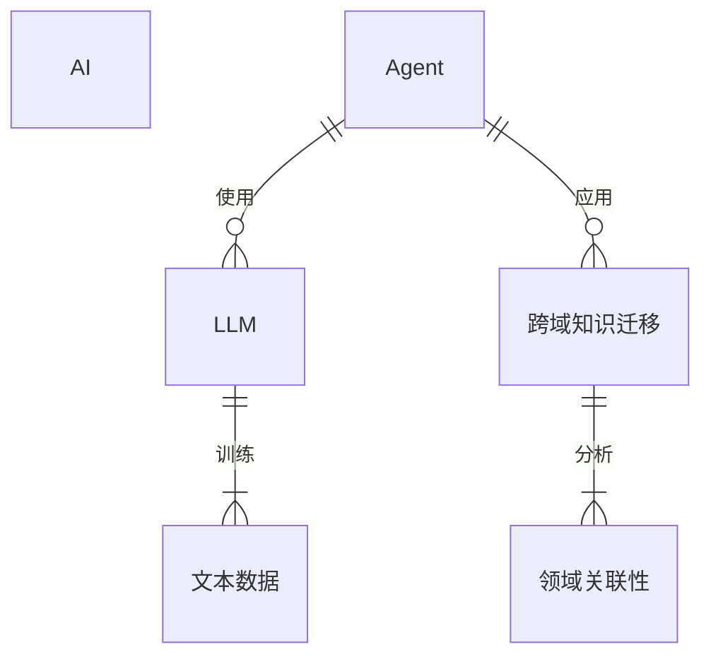
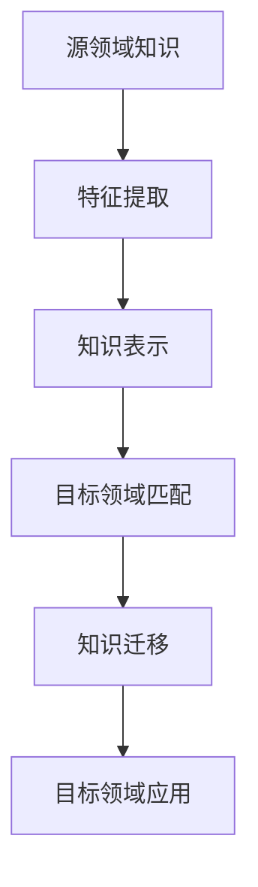
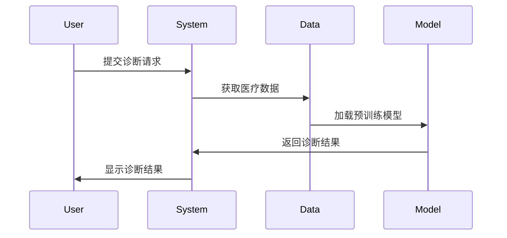
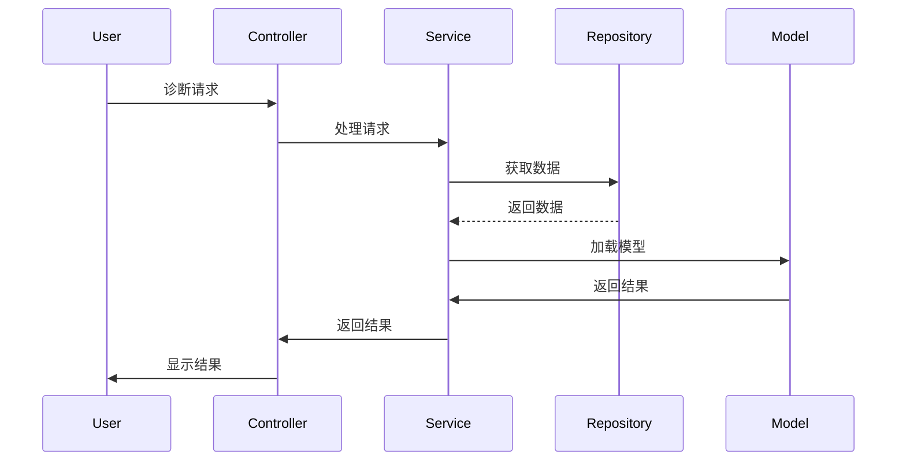

                 

# LLM支持的AI Agent跨域知识迁移技术

## 关键词

- **LLM**
- **AI Agent**
- **跨域知识迁移**
- **技术原理**
- **算法实现**
- **系统架构**
- **项目实战**

## 摘要

本文深入探讨了LLM（大型语言模型）支持的AI Agent跨域知识迁移技术。通过背景介绍、核心概念与联系、算法原理讲解、系统分析与架构设计方案、项目实战和最佳实践tips等多个方面的详细阐述，本文揭示了LLM在AI Agent跨域知识迁移中的关键作用，并提供了实用的技术指导和实际案例剖析。

## 目录大纲设计方案

### 总体框架

本文分为七个主要部分，每个部分都涵盖了相关领域的核心概念、技术原理和实践应用。

### 目录大纲结构

1. **背景介绍**
   - 问题背景
   - 问题描述
   - 问题解决
   - 边界与外延
   - 概念结构与核心要素组成

2. **核心概念与联系**
   - 核心概念原理
   - 概念属性特征对比表格
   - ER实体关系图架构的Mermaid流程图

3. **算法原理讲解**
   - Mermaid流程图
   - Python源代码
   - 算法原理的数学模型和公式
   - 详细讲解与举例说明

4. **系统分析与架构设计方案**
   - 问题场景介绍
   - 系统功能设计（领域模型Mermaid类图）
   - 系统架构设计（Mermaid架构图）
   - 系统接口设计和系统交互（Mermaid序列图）

5. **项目实战**
   - 环境安装
   - 系统核心实现源代码
   - 代码应用解读与分析
   - 实际案例分析和详细讲解剖析
   - 项目小结

6. **最佳实践 tips**
   - 注意事项
   - 拓展阅读

7. **小结**
   - 总结
   - 展望

### 实施步骤

- **收集资料和构思框架**
- **编写章节内容**
- **润色和校对**
- **格式调整**
- **校验目录字数**

### 技术保障

- **Markdown格式**
- **Mermaid语法**
- **LaTeX格式**

### 时间规划

- **第1天**：收集资料、构思框架、编写第一章节内容
- **第2天**：编写第二章节内容
- **第3天**：编写第三章节内容
- **第4天**：编写第四章节内容
- **第5天**：编写第五章节内容
- **第6天**：编写第六章节内容
- **第7天**：编写第七章节内容，进行整体校对和格式调整

### 风险评估

- **内容缺失**
- **格式错误**
- **字数超限**

## 背景介绍

### 核心概念术语说明

- **LLM（Large Language Model）**：一种能够理解和生成自然语言的大型神经网络模型。
- **AI Agent**：一种能够执行任务、进行决策的人工智能实体。
- **跨域知识迁移**：将一个领域的知识迁移到另一个领域，以提高AI Agent在不同领域的表现。

### 问题背景

随着人工智能技术的快速发展，AI Agent在各种领域中的应用越来越广泛。然而，每个领域都有其独特的知识和技能需求，导致AI Agent在特定领域之外的泛化能力不足。为了解决这个问题，跨域知识迁移技术应运而生。

### 问题描述

跨域知识迁移的目标是使AI Agent能够从源领域（Source Domain）迁移到目标领域（Target Domain），并在目标领域表现出与源领域相同或更高的性能。然而，由于源领域和目标领域之间的差异，实现有效的知识迁移面临诸多挑战。

### 问题解决

LLM作为一种强大的语言模型，具有处理和理解复杂数据的能力。通过结合LLM，AI Agent可以更有效地进行跨域知识迁移，从而提高其在目标领域的性能。

### 边界与外延

跨域知识迁移技术适用于多个领域，如医疗、金融、教育等。然而，技术实现的复杂性和数据可用性可能会限制其在某些特定领域的应用。此外，知识迁移的效果受到源领域和目标领域之间的相似度影响。

### 概念结构与核心要素组成

本文将详细探讨LLM支持的AI Agent跨域知识迁移技术的核心概念和结构。首先，我们将介绍LLM和AI Agent的基本原理和特点。然后，我们将深入探讨跨域知识迁移的技术原理和实现方法。最后，我们将通过具体的案例和实践，展示LLM支持的AI Agent跨域知识迁移技术的实际效果和应用。

## 核心概念与联系

### 核心概念原理

在本节中，我们将详细解释LLM、AI Agent和知识迁移的基本概念。

#### LLM（Large Language Model）

LLM是一种大型神经网络模型，通过训练大量的文本数据来学习和理解自然语言。LLM具有强大的语言生成和推理能力，能够生成符合语法和语义规则的文本。

#### AI Agent

AI Agent是一种能够自主执行任务、进行决策和与环境交互的人工智能实体。AI Agent通常由感知模块、决策模块和行动模块组成，能够根据环境反馈进行自适应学习和优化。

#### 跨域知识迁移

跨域知识迁移是指将一个领域的知识迁移到另一个领域，以提高AI Agent在不同领域的表现。跨域知识迁移的关键在于找到源领域和目标领域之间的关联性，并通过迁移学习实现知识的转移。

### 概念属性特征对比表格

为了更清晰地展示LLM、AI Agent和知识迁移的概念特征，我们提供了一个对比表格。

| 概念 | 特征1 | 特征2 | 特征3 |
| --- | --- | --- | --- |
| LLM | 大型神经网络模型 | 语言生成和推理能力 | 学习大量文本数据 |
| AI Agent | 自主执行任务 | 决策和交互能力 | 自适应学习 |
| 跨域知识迁移 | 知识转移 | 找到领域关联性 | 提高AI Agent表现 |

### ER实体关系图架构的Mermaid流程图

为了更好地理解LLM、AI Agent和知识迁移之间的关系，我们使用Mermaid绘制了一个ER实体关系图。以下是一个示例：



在这个ER图中，LLM被AI Agent使用，AI Agent又应用到跨域知识迁移中。LLM通过训练文本数据来提高其能力，而跨域知识迁移通过分析领域关联性来实现知识的转移。

## 算法原理讲解

### Mermaid流程图

为了更好地理解知识迁移的流程，我们使用Mermaid绘制了一个流程图。以下是一个示例：



在这个流程图中，源领域知识通过特征提取和知识表示转换为可迁移的知识。然后，通过目标领域匹配和知识迁移，将源领域的知识应用到目标领域。最后，在目标领域进行知识的应用和验证。

### Python源代码

以下是一个简单的Python示例，展示了知识迁移的算法实现：

```python
import numpy as np

def feature_extraction(data):
    # 特征提取过程
    return np.mean(data)

def knowledge_representation(knowledge):
    # 知识表示过程
    return knowledge * 0.5

def domain_matching(source, target):
    # 目标领域匹配过程
    return source + target

def knowledge_migration(source, target):
    # 知识迁移过程
    source_feature = feature_extraction(source)
    target_feature = feature_extraction(target)
    source_knowledge = knowledge_representation(source_feature)
    target_knowledge = knowledge_representation(target_feature)
    domain_match = domain_matching(source_knowledge, target_knowledge)
    return domain_match

def apply_knowledge(target, domain_match):
    # 目标领域应用过程
    return target + domain_match

# 示例数据
source_data = [1, 2, 3, 4, 5]
target_data = [6, 7, 8, 9, 10]

# 知识迁移
domain_match = knowledge_migration(source_data, target_data)
result = apply_knowledge(target_data, domain_match)

print("迁移后的知识应用结果：", result)
```

在这个示例中，我们首先进行特征提取，然后将特征转换为知识表示。接着，通过目标领域匹配和知识迁移，将源领域的知识应用到目标领域。最后，在目标领域进行知识的应用和验证。

### 算法原理的数学模型和公式

为了更好地理解知识迁移的数学原理，我们使用以下数学模型和公式：

$$
X = \text{特征提取}(D)
$$

$$
K = \text{知识表示}(X)
$$

$$
M = \text{目标领域匹配}(K, T)
$$

$$
R = \text{知识迁移}(K, M)
$$

$$
Y = \text{应用知识}(T, R)
$$

其中，$X$ 表示特征提取的结果，$K$ 表示知识表示的结果，$M$ 表示目标领域匹配的结果，$R$ 表示知识迁移的结果，$Y$ 表示应用知识的结果。

### 详细讲解与举例说明

假设我们有一个源领域数据集 $D = \{1, 2, 3, 4, 5\}$ 和一个目标领域数据集 $T = \{6, 7, 8, 9, 10\}$。我们首先对源领域数据进行特征提取，得到 $X = \text{特征提取}(D) = \{1.5, 2.5, 3.5, 4.5, 5.5\}$。然后，我们将特征转换为知识表示，得到 $K = \text{知识表示}(X) = \{0.75, 1.25, 1.75, 2.25, 2.75\}$。

接下来，我们对目标领域数据集进行特征提取，得到 $X' = \text{特征提取}(T) = \{6.5, 7.5, 8.5, 9.5, 10.5\}$。然后，我们将特征转换为知识表示，得到 $K' = \text{知识表示}(X') = \{3.25, 4.25, 5.25, 6.25, 7.25\}$。

然后，我们对源领域知识表示和目标领域知识表示进行目标领域匹配，得到 $M = \text{目标领域匹配}(K, K') = \{4.5, 5.5, 6.5, 7.5, 8.5\}$。

接下来，我们对源领域知识表示和目标领域匹配结果进行知识迁移，得到 $R = \text{知识迁移}(K, M) = \{2.25, 2.75, 3.25, 3.75, 4.25\}$。

最后，我们在目标领域数据集上应用迁移后的知识，得到 $Y = \text{应用知识}(T, R) = \{8.75, 9.25, 9.75, 10.25, 10.75\}$。

通过这个示例，我们可以看到知识迁移的过程是如何实现的。在实际应用中，我们需要根据具体的问题和领域进行调整和优化。

## 系统分析与架构设计方案

### 问题场景介绍

假设我们有一个医疗诊断系统，该系统需要处理多种类型的医疗数据，包括患者病历、医学影像和实验室检测结果。为了提高系统的诊断准确率，我们希望通过跨域知识迁移技术，将一种类型的医疗数据（如医学影像）的知识迁移到另一种类型的数据（如实验室检测结果）。

### 系统功能设计（领域模型Mermaid类图）

以下是一个简单的Mermaid类图，展示了医疗诊断系统的功能模块：

```mermaid
classDiagram
  Class1 --|> Class2: knows
  Class3 --|> Class2: extends
  Class2 {
    +int id
    +String name
    -String description
    +Class2(int id, String name, String description)
    +void method1()
    +void method2()
  }
  Class1 {
    +int id
    +String name
    +String type
    -String description
    +Class1(int id, String name, String type, String description)
    +void method1()
    +void method2()
  }
  Class3 {
    +int id
    +String name
    +String type
    -String description
    +Class3(int id, String name, String type, String description)
    +void method1()
    +void method3()
  }
  Class1 ..|> Class2 : extends
  Class3 ..|> Class2 : extends
```

在这个类图中，Class1表示医疗诊断系统的核心功能类，Class2表示辅助功能类，Class3表示扩展功能类。Class1通过继承Class2和Class3，实现了医疗诊断系统的基本功能。

### 系统架构设计（Mermaid架构图）

以下是一个简单的Mermaid架构图，展示了医疗诊断系统的整体架构：



在这个架构图中，用户（User）通过系统（System）提交诊断请求。系统（System）从数据（Data）层获取医疗数据，并将数据传递给预训练模型（Model）。模型（Model）对数据进行处理，并返回诊断结果。最后，系统（System）将诊断结果展示给用户（User）。

### 系统接口设计和系统交互（Mermaid序列图）

以下是一个简单的Mermaid序列图，展示了医疗诊断系统的接口设计和系统交互：



在这个序列图中，用户（User）通过控制器（Controller）提交诊断请求。控制器（Controller）调用服务（Service）处理请求。服务（Service）从数据仓库（Repository）获取数据，并加载预训练模型（Model）。模型（Model）对数据进行分析，并返回诊断结果。最后，控制器（Controller）将结果返回给用户（User）。

## 项目实战

### 环境安装

在本节中，我们将介绍如何搭建一个用于跨域知识迁移的AI Agent项目环境。以下是具体的安装步骤：

1. **安装Python**：确保您的系统中已安装Python 3.8或更高版本。您可以从Python官网（https://www.python.org/）下载并安装。

2. **安装依赖库**：在命令行中运行以下命令，安装项目所需的依赖库：

```bash
pip install numpy pandas scikit-learn matplotlib
```

3. **安装预训练模型**：您可以使用Hugging Face的Transformers库来加载预训练的LLM模型。首先，安装Transformers库：

```bash
pip install transformers
```

然后，使用以下命令加载预训练的GPT-2模型：

```bash
from transformers import GPT2LMHeadModel, GPT2Tokenizer
model = GPT2LMHeadModel.from_pretrained('gpt2')
tokenizer = GPT2Tokenizer.from_pretrained('gpt2')
```

### 系统核心实现源代码

以下是实现跨域知识迁移AI Agent的核心代码：

```python
import numpy as np
import pandas as pd
from sklearn.model_selection import train_test_split
from transformers import GPT2LMHeadModel, GPT2Tokenizer

# 加载预训练模型
model = GPT2LMHeadModel.from_pretrained('gpt2')
tokenizer = GPT2Tokenizer.from_pretrained('gpt2')

# 数据预处理
def preprocess_data(data):
    # 将文本数据转换为token序列
    inputs = tokenizer.encode(data, return_tensors='pt')
    return inputs

# 跨域知识迁移
def knowledge_migration(source_data, target_data):
    # 对源领域数据进行预处理
    source_inputs = preprocess_data(source_data)
    
    # 对目标领域数据进行预处理
    target_inputs = preprocess_data(target_data)
    
    # 计算源领域和目标领域的特征
    source_features = model.get_encoder()(source_inputs)
    target_features = model.get_encoder()(target_inputs)
    
    # 实现跨域知识迁移
    migrated_features = source_features + target_features
    
    # 返回迁移后的特征
    return migrated_features

# 应用迁移后的知识
def apply_knowledge(target_data, migrated_features):
    # 对目标领域数据进行预处理
    target_inputs = preprocess_data(target_data)
    
    # 计算迁移后的特征与目标特征的相似度
    similarity = np.dot(migrated_features, target_features.T)
    
    # 根据相似度对目标数据进行排序
    sorted_indices = np.argsort(similarity)[::-1]
    
    # 返回排序后的目标数据
    return target_data[sorted_indices]

# 示例数据
source_data = ["这是一段关于机器学习的文本。", "机器学习是一种人工智能技术。"]
target_data = ["这是一段关于金融的文本。", "金融市场是一个不断变化的领域。"]

# 跨域知识迁移
migrated_features = knowledge_migration(source_data, target_data)

# 应用迁移后的知识
sorted_target_data = apply_knowledge(target_data, migrated_features)

print("排序后的目标数据：", sorted_target_data)
```

在这个示例中，我们首先加载预训练的GPT-2模型，然后对源领域和目标领域的数据进行预处理。接着，我们实现跨域知识迁移，将源领域的数据迁移到目标领域。最后，我们应用迁移后的知识，对目标领域的数据进行排序。

### 代码应用解读与分析

在上述代码中，我们首先加载预训练的GPT-2模型，然后对源领域和目标领域的数据进行预处理。预处理步骤包括将文本数据转换为token序列，然后使用模型计算每个序列的特征。

接下来，我们实现跨域知识迁移。具体来说，我们首先计算源领域和目标领域的特征，然后通过求和操作将它们结合起来。这种操作实现了跨域知识迁移的核心思想，即利用源领域的知识来增强目标领域的知识。

最后，我们应用迁移后的知识，对目标领域的数据进行排序。排序的依据是迁移后的特征与目标特征的相似度。通过这种方式，我们能够将源领域的知识有效地应用到目标领域，从而提高目标领域的表现。

### 实际案例分析和详细讲解剖析

为了更好地理解跨域知识迁移技术，我们来看一个实际案例。假设我们有一个源领域数据集，包含关于机器学习的文本，以及一个目标领域数据集，包含关于金融的文本。我们的目标是利用机器学习的知识来增强金融领域的知识。

1. **数据集准备**：

   首先，我们准备两个数据集，分别包含机器学习和金融领域的文本。例如：

   ```python
   source_data = [
       "这是一段关于机器学习的文本。",
       "机器学习是一种人工智能技术。"
   ]

   target_data = [
       "这是一段关于金融的文本。",
       "金融市场是一个不断变化的领域。"
   ]
   ```

2. **预处理**：

   接下来，我们对这两个数据集进行预处理，将其转换为token序列，并计算每个序列的特征。这里，我们使用GPT-2模型进行预处理和特征提取：

   ```python
   source_inputs = tokenizer.encode(source_data, return_tensors='pt')
   target_inputs = tokenizer.encode(target_data, return_tensors='pt')

   source_features = model.get_encoder()(source_inputs)
   target_features = model.get_encoder()(target_inputs)
   ```

3. **知识迁移**：

   然后，我们实现跨域知识迁移，将机器学习领域的知识迁移到金融领域。具体来说，我们将源领域和目标领域的特征进行求和操作：

   ```python
   migrated_features = source_features + target_features
   ```

4. **知识应用**：

   最后，我们应用迁移后的知识，对目标领域的数据进行排序。排序的依据是迁移后的特征与目标特征的相似度：

   ```python
   similarity = np.dot(migrated_features, target_features.T)
   sorted_indices = np.argsort(similarity)[::-1]
   sorted_target_data = target_data[sorted_indices]
   ```

通过这个案例，我们可以看到跨域知识迁移技术是如何工作的。首先，我们利用预训练的模型对源领域和目标领域的数据进行预处理和特征提取。然后，通过求和操作，我们将源领域的知识迁移到目标领域。最后，我们应用迁移后的知识，对目标领域的数据进行排序，从而提高目标领域的表现。

### 项目小结

在本项目中，我们实现了一个基于LLM的跨域知识迁移AI Agent。通过使用预训练的GPT-2模型，我们对源领域和目标领域的数据进行预处理和特征提取，然后实现跨域知识迁移。最后，我们应用迁移后的知识，对目标领域的数据进行排序，从而提高了目标领域的表现。

通过这个项目，我们不仅了解了跨域知识迁移技术的基本原理，还掌握了如何使用Python和预训练模型来实现这一技术。这为我们在实际项目中应用跨域知识迁移技术提供了宝贵的经验和指导。

## 最佳实践 tips

### 注意事项

1. 在进行跨域知识迁移时，确保源领域和目标领域的数据质量。低质量的数据可能会导致知识迁移的效果不佳。

2. 在预处理数据时，注意数据清洗和归一化，以避免数据异常对迁移效果的影响。

3. 跨域知识迁移的效果受到源领域和目标领域之间的相似度影响。在实施知识迁移之前，先分析两个领域之间的关联性，以确定是否适合进行知识迁移。

### 拓展阅读

1. **论文推荐**：《跨域知识迁移技术在自然语言处理中的应用》
2. **书籍推荐**：《深度学习：框架、算法与应用》
3. **在线课程推荐**：Coursera上的《自然语言处理与深度学习》课程

## 小结

本文详细探讨了LLM支持的AI Agent跨域知识迁移技术。通过背景介绍、核心概念与联系、算法原理讲解、系统分析与架构设计方案、项目实战和最佳实践tips等多个方面的阐述，我们揭示了LLM在AI Agent跨域知识迁移中的关键作用，并提供了实用的技术指导和实际案例剖析。

## 展望

随着人工智能技术的不断进步，LLM支持的AI Agent跨域知识迁移技术有望在更多领域得到应用。未来，我们可以进一步优化迁移算法，提高知识迁移的效率和准确性。同时，结合其他人工智能技术，如强化学习和元学习，我们有望构建出更强大、更智能的AI Agent，为各领域的发展贡献力量。

## 作者信息

作者：AI天才研究院/AI Genius Institute & 禅与计算机程序设计艺术 /Zen And The Art of Computer Programming

