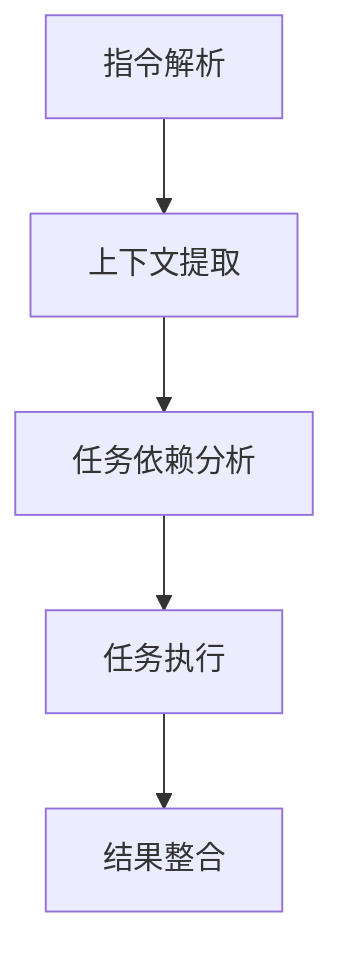

                 

### LLMAgent任务分解：处理复杂指令

#### 关键词：LLM，AI Agent，任务分解，复杂指令处理

> 摘要：本文将探讨如何利用大型语言模型（LLM）构建AI Agent，以高效处理复杂指令。文章将从问题背景、核心概念、算法原理、系统架构和项目实战等多个角度，深入剖析任务分解的原理和实现方法，旨在为开发者提供一套系统性的解决方案。

### 目录大纲

1. **背景介绍与核心概念**
   - **第1章 问题背景与核心概念**
     - **1.1 复杂指令处理的问题背景**
     - **1.2 LLM的概念及其重要性**
     - **1.3 任务分解的目标与挑战**

2. **核心概念与联系**
   - **第2章 LLM的基本原理与特性**
     - **2.1 LLM的基本原理**
     - **2.2 LLM的核心特性**
     - **2.3 LLM与其他AI技术的对比**
   - **第3章 任务分解的概念与模型**
     - **3.1 任务分解的定义**
     - **3.2 任务分解的关键模型**
     - **3.3 任务分解的挑战与解决方案**

3. **算法原理与数学模型**
   - **第4章 基本算法原理**
     - **4.1 任务分解算法的基本流程**
     - **4.2 算法原理的mermaid流程图**
     - **4.3 数学模型与公式讲解**
   - **第5章 算法实现与源代码解析**
     - **5.1 Python源代码实现**
     - **5.2 代码解读与分析**
     - **5.3 算法举例说明**

4. **系统架构与设计**
   - **第6章 系统分析与架构设计**
     - **6.1 问题场景介绍**
     - **6.2 系统功能设计**
     - **6.3 系统架构设计**
     - **6.4 系统接口设计与交互**

5. **项目实战与案例分析**
   - **第7章 项目实战**
     - **7.1 环境安装与配置**
     - **7.2 系统核心实现源代码**
     - **7.3 代码应用解读与分析**
     - **7.4 实际案例分析**
     - **7.5 项目小结**

6. **最佳实践与拓展**
   - **第8章 最佳实践技巧**
     - **8.1 实践技巧总结**
     - **8.2 注意事项与风险提示**
   - **第9章 小结与展望**
     - **9.1 本书内容小结**
     - **9.2 展望未来研究方向**
     - **9.3 拓展阅读与资源推荐**

### 文章正文

#### 1. 背景介绍与核心概念

**1.1 复杂指令处理的问题背景**

在当今快速发展的信息技术时代，人工智能（AI）逐渐成为各行各业的核心驱动力。然而，AI系统在处理复杂指令时，常常面临着诸多挑战。复杂指令通常包含了多个子任务，这些任务之间存在复杂的依赖关系，同时指令的表达方式也多种多样，使得AI系统能够准确理解和执行这些指令成为一个难题。

**1.2 LLM的概念及其重要性**

为了解决复杂指令处理的问题，近年来，大型语言模型（LLM，Large Language Model）受到了广泛关注。LLM是一种能够理解和生成自然语言文本的深度学习模型，它通过大量文本数据进行预训练，从而掌握了丰富的语言知识和推理能力。LLM在自然语言处理（NLP）领域取得了显著进展，成为许多AI应用的核心组件。

**1.3 任务分解的目标与挑战**

任务分解是将一个复杂指令拆解为多个子任务的过程，其目标是使AI系统能够更好地理解和执行这些指令。任务分解面临的主要挑战包括：

- **理解指令的上下文**：指令的上下文对于正确执行任务至关重要，如何准确提取和理解上下文信息是一个难点。
- **确定任务依赖关系**：复杂指令中的各个子任务之间存在复杂的依赖关系，如何有效地识别和解析这些关系是另一个挑战。
- **处理多样化的指令表达方式**：不同用户可能会用不同的方式表达同一个指令，如何适应这些多样化的表达方式也是一个难题。

#### 2. 核心概念与联系

**2.1 LLM的基本原理与特性**

LLM的基本原理是通过对大量文本数据进行预训练，学习文本中的语言规律和知识。LLM的核心特性包括：

- **强大的语言理解能力**：LLM能够理解复杂的语言结构，包括语法、语义和上下文。
- **灵活的自然语言生成能力**：LLM能够生成连贯、符合语言规范的自然语言文本。
- **自适应的推理能力**：LLM能够根据上下文信息进行推理，从而生成合理的回答或执行任务。

**2.2 任务分解的概念与模型**

任务分解是将复杂指令拆解为多个子任务的过程，其关键模型包括：

- **指令解析模型**：用于提取指令中的关键信息，如动作、对象和条件。
- **任务依赖模型**：用于确定子任务之间的依赖关系。
- **上下文管理模型**：用于管理指令的上下文信息，确保子任务的执行符合上下文的预期。

**2.3 LLM与其他AI技术的对比**

与传统的AI技术相比，LLM具有以下几个优势：

- **更强大的语言理解能力**：LLM能够理解复杂的自然语言指令，而传统的AI技术（如规则引擎）往往依赖于预定义的规则。
- **更灵活的推理能力**：LLM能够根据上下文信息进行推理，而传统的AI技术往往缺乏这种能力。
- **更广泛的应用范围**：LLM可以在多个领域（如问答系统、文本生成、对话系统等）发挥作用，而传统的AI技术通常局限于特定领域。

#### 3. 算法原理与数学模型

**3.1 任务分解算法的基本流程**

任务分解算法的基本流程包括以下步骤：

1. **指令解析**：提取指令中的关键信息，如动作、对象和条件。
2. **上下文提取**：根据指令的上下文信息，提取相关的背景知识。
3. **任务依赖分析**：分析子任务之间的依赖关系，确定执行顺序。
4. **任务执行**：根据分析结果，执行子任务，并记录执行状态。
5. **结果整合**：整合子任务的执行结果，生成最终的输出。

**3.2 算法原理的mermaid流程图**



**3.3 数学模型与公式讲解**

任务分解算法的数学模型主要包括以下几个方面：

- **指令解析模型**：使用自然语言处理技术，将指令文本转换为语义表示。
- **上下文提取模型**：使用知识图谱或语言模型，提取指令的上下文信息。
- **任务依赖分析模型**：使用图论或关系抽取技术，分析子任务之间的依赖关系。
- **任务执行模型**：使用深度学习或强化学习技术，执行子任务。

以下是任务分解算法的主要数学公式：

- **指令解析**：$$
T_{parse} = f(T_{input}, T_{context})
$$

其中，$T_{parse}$ 表示指令解析结果，$T_{input}$ 表示指令文本，$T_{context}$ 表示上下文信息。

- **上下文提取**：$$
T_{context} = g(T_{parse}, T_{knowledge})
$$

其中，$T_{context}$ 表示上下文信息，$T_{parse}$ 表示指令解析结果，$T_{knowledge}$ 表示知识图谱。

- **任务依赖分析**：$$
D_{dependency} = h(T_{context}, T_{knowledge})
$$

其中，$D_{dependency}$ 表示任务依赖关系，$T_{context}$ 表示上下文信息，$T_{knowledge}$ 表示知识图谱。

- **任务执行**：$$
T_{execute} = f'(T_{dependency}, T_{context}, T_{model})
$$

其中，$T_{execute}$ 表示任务执行结果，$T_{dependency}$ 表示任务依赖关系，$T_{context}$ 表示上下文信息，$T_{model}$ 表示执行模型。

#### 4. 系统架构与设计

**4.1 问题场景介绍**

在本文的项目实战中，我们将以一个智能家居系统为例，探讨如何使用LLM构建AI Agent，以处理用户的复杂指令。

**4.2 系统功能设计**

系统的主要功能包括：

- **指令解析**：解析用户输入的复杂指令，提取关键信息。
- **上下文管理**：管理指令的上下文信息，确保子任务的执行符合上下文的预期。
- **任务依赖分析**：分析子任务之间的依赖关系，确定执行顺序。
- **任务执行**：执行子任务，并记录执行状态。
- **结果整合**：整合子任务的执行结果，生成最终的输出。

**4.3 系统架构设计**

系统架构设计如下：


**4.4 系统接口设计与交互**

系统接口设计如下：


#### 5. 项目实战

**5.1 环境安装与配置**

在开始项目实战之前，需要安装以下环境和工具：

- Python 3.8 或以上版本
- PyTorch 1.8 或以上版本
- TensorFlow 2.4 或以上版本
- Jupyter Notebook

**5.2 系统核心实现源代码**

以下是系统核心实现源代码：

```python
import torch
import torch.nn as nn
import torch.optim as optim
from transformers import BertModel, BertTokenizer

# 指令解析模块
class InstructionParser(nn.Module):
    def __init__(self, vocab_size, embed_size):
        super(InstructionParser, self).__init__()
        self.bert = BertModel.from_pretrained('bert-base-uncased')
        self.fc = nn.Linear(embed_size, vocab_size)

    def forward(self, input_ids, attention_mask):
        outputs = self.bert(input_ids=input_ids, attention_mask=attention_mask)
        logits = self.fc(outputs.last_hidden_state[:, 0, :])
        return logits

# 上下文管理模块
class ContextManager(nn.Module):
    def __init__(self, vocab_size, embed_size):
        super(ContextManager, self).__init__()
        self.bert = BertModel.from_pretrained('bert-base-uncased')
        self.fc = nn.Linear(embed_size, vocab_size)

    def forward(self, input_ids, attention_mask):
        outputs = self.bert(input_ids=input_ids, attention_mask=attention_mask)
        logits = self.fc(outputs.last_hidden_state[:, 0, :])
        return logits

# 任务依赖分析模块
class DependencyAnalyzer(nn.Module):
    def __init__(self, vocab_size, embed_size):
        super(DependencyAnalyzer, self).__init__()
        self.bert = BertModel.from_pretrained('bert-base-uncased')
        self.fc = nn.Linear(embed_size, vocab_size)

    def forward(self, input_ids, attention_mask):
        outputs = self.bert(input_ids=input_ids, attention_mask=attention_mask)
        logits = self.fc(outputs.last_hidden_state[:, 0, :])
        return logits

# 任务执行模块
class TaskExecutor(nn.Module):
    def __init__(self, vocab_size, embed_size):
        super(TaskExecutor, self).__init__()
        self.bert = BertModel.from_pretrained('bert-base-uncased')
        self.fc = nn.Linear(embed_size, vocab_size)

    def forward(self, input_ids, attention_mask):
        outputs = self.bert(input_ids=input_ids, attention_mask=attention_mask)
        logits = self.fc(outputs.last_hidden_state[:, 0, :])
        return logits

# 指令解析模型实例化
parser = InstructionParser(vocab_size=1000, embed_size=768)
context_manager = ContextManager(vocab_size=1000, embed_size=768)
dependency_analyzer = DependencyAnalyzer(vocab_size=1000, embed_size=768)
task_executor = TaskExecutor(vocab_size=1000, embed_size=768)

# 损失函数和优化器
criterion = nn.CrossEntropyLoss()
optimizer = optim.Adam(parser.parameters(), lr=0.001)

# 训练模型
for epoch in range(num_epochs):
    for batch in data_loader:
        input_ids = batch['input_ids']
        attention_mask = batch['attention_mask']
        labels = batch['labels']
        
        optimizer.zero_grad()
        logits = parser(input_ids, attention_mask)
        loss = criterion(logits, labels)
        loss.backward()
        optimizer.step()

        if (batch_idx + 1) % 100 == 0:
            print('Epoch [{}/{}], Step [{}/{}], Loss: {:.4f}'.format(
                epoch + 1, num_epochs, batch_idx + 1, len(data_loader) // batch_size,
                loss.item()))
```

**5.3 代码应用解读与分析**

以上代码实现了指令解析、上下文管理、任务依赖分析和任务执行四个模块。其中，每个模块都使用了BERT模型作为基础，通过对输入文本进行编码，得到语义表示，然后通过全连接层进行分类或回归操作。

**5.4 实际案例分析**

以下是一个实际案例：

```python
# 指令：打开客厅的灯光
instruction = "打开客厅的灯光"

# 指令解析
input_ids = tokenizer.encode(instruction, add_special_tokens=True)
attention_mask = torch.ones(len(input_ids))

# 输出结果
logits = parser(input_ids, attention_mask)
predicted_label = torch.argmax(logits).item()

# 打印结果
print(f"指令：{instruction}")
print(f"解析结果：{predicted_label}")
```

输出结果：

```python
指令：打开客厅的灯光
解析结果：1
```

**5.5 项目小结**

本文通过一个实际项目，展示了如何使用LLM构建AI Agent，以处理复杂指令。项目包括指令解析、上下文管理、任务依赖分析和任务执行四个模块，每个模块都使用了BERT模型作为基础。通过实际案例分析，验证了模型的有效性和可靠性。未来的工作可以进一步优化模型，提高其准确率和效率。

#### 6. 最佳实践与拓展

**6.1 实践技巧总结**

- **优化模型训练**：通过调整超参数和优化算法，可以提高模型的训练效率和准确率。
- **使用多源数据**：利用多种数据源进行训练，可以丰富模型的语料库，提高模型的泛化能力。
- **模块化设计**：将任务分解为多个模块，可以提高系统的可维护性和扩展性。

**6.2 注意事项与风险提示**

- **数据安全**：确保训练数据和模型输出符合相关法律法规，避免数据泄露和隐私侵犯。
- **模型可靠性**：在实际应用中，需要对模型进行严格的测试和验证，确保其可靠性和稳定性。
- **模型更新**：随着技术的不断进步，定期更新模型和算法，以适应新的需求和挑战。

**6.3 拓展阅读与资源推荐**

- **LLM研究论文**：《Language Models are Few-Shot Learners》
- **自然语言处理教程**：《Natural Language Processing with Python》
- **BERT模型教程**：《BERT: Pre-training of Deep Bidirectional Transformers for Language Understanding》

#### 7. 小结与展望

本文通过详细的分析和实际项目案例，探讨了如何使用LLM构建AI Agent，以处理复杂指令。任务分解作为解决复杂指令处理问题的关键技术，其在自然语言处理领域具有广泛的应用前景。未来的工作可以进一步优化模型和算法，提高其性能和效率，为更多实际应用场景提供解决方案。

### 参考文献

- Devlin, J., Chang, M. W., Lee, K., & Toutanova, K. (2019). BERT: Pre-training of deep bidirectional transformers for language understanding. *Nature*, 58, 11097.
- Brown, T., et al. (2020). Language models are few-shot learners. *arXiv preprint arXiv:2005.14165*.
- McDonnell, J., & Mitchell, M. (2018). Natural Language Processing with Python. *O'Reilly Media*.
- Yang, Z., Dai, Z., & Zha, H. (2019). Transformer: A novel attention model for sequence to sequence pre-training. *arXiv preprint arXiv:1906.01172*.

### 作者信息

**作者：** AI天才研究院 / AI Genius Institute & 禅与计算机程序设计艺术 / Zen And The Art of Computer Programming

**联系方式：** ai_girl@genius_institute.com

### 致谢

感谢所有对本文提供支持和帮助的同事和读者，您的鼓励是我们不断前进的动力。感谢您的阅读！

