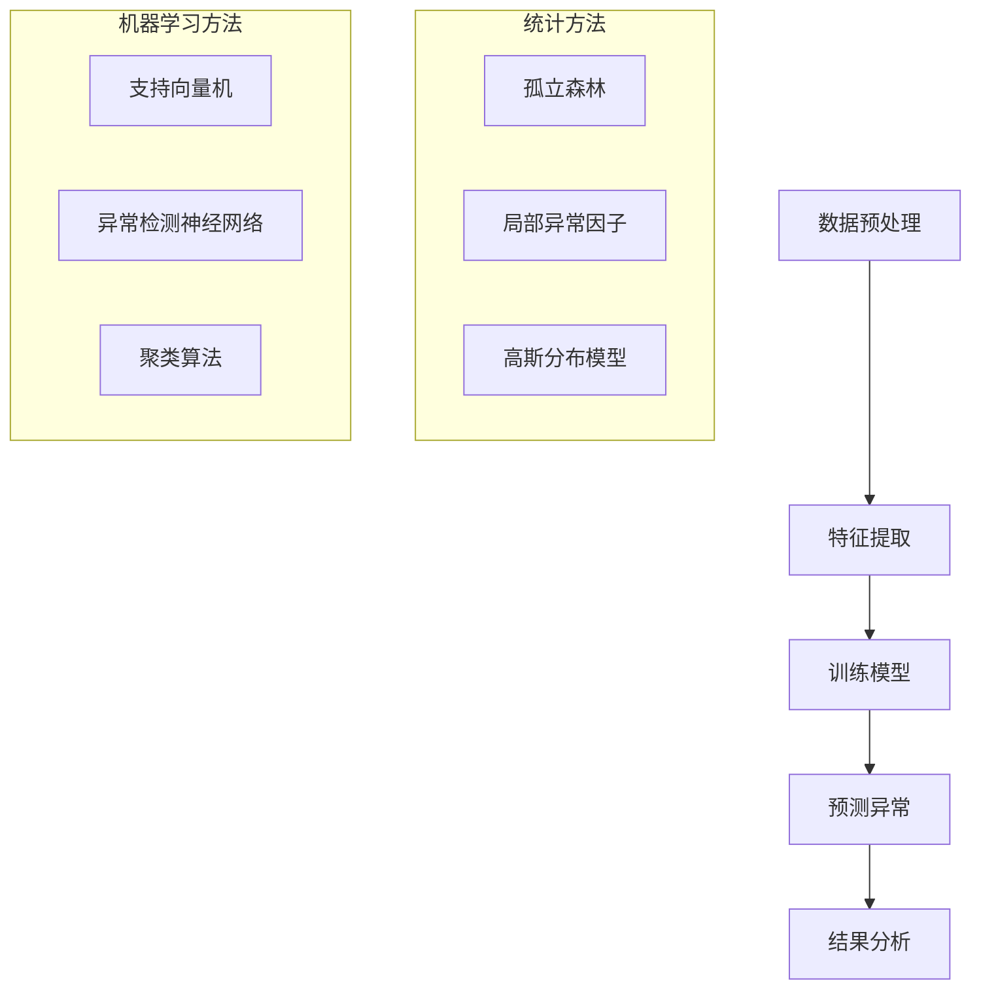
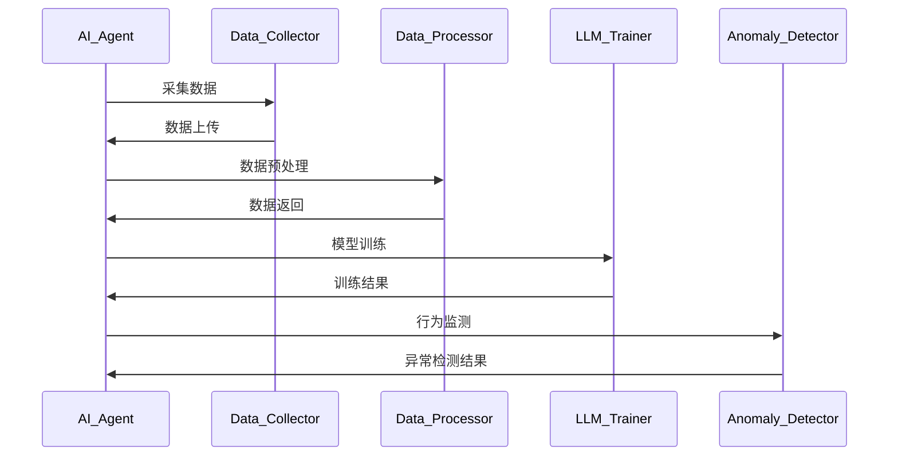

                 

## 第一部分：背景与核心概念

### 第1章：问题背景与核心概念介绍

> **关键词**：AI Agent、LLM、异常行为预测

在当今这个技术飞速发展的时代，人工智能（AI）正以令人难以置信的速度改变着我们的工作和生活方式。AI Agent，作为AI领域中的一个重要组成部分，已经成为现代智能系统设计中的核心组件。这些智能体能够自主执行任务，与人类交互，甚至在复杂的环境中做出决策。

然而，随着AI Agent的广泛应用，异常行为预测问题也逐渐浮现出来。AI Agent的异常行为不仅可能导致系统功能的失效，甚至可能引发严重的安全和伦理问题。因此，研究并设计有效的异常行为预测机制变得至关重要。

本章首先将介绍AI Agent和LLM（大型语言模型）的基础概念，以及它们在现代AI系统中的重要性。接下来，我们将探讨异常行为预测的意义和挑战，并概述本书的结构，帮助读者更好地理解后续内容。

#### 1.1 问题背景

AI Agent，是指能够模拟人类智能行为，并在特定环境中自主执行任务的计算机程序。这些智能体基于机器学习、自然语言处理和其他AI技术，能够感知环境，理解指令，并自主做出决策。例如，智能客服机器人、自动驾驶汽车、智能家居系统等，都是AI Agent的具体应用。

然而，AI Agent的广泛应用也带来了一系列新的挑战。首先，AI Agent在执行任务过程中可能会出现异常行为，如误判、行为偏差等。这些异常行为可能导致系统功能失效，甚至引发安全风险。例如，自动驾驶汽车在遇到突发情况时，如果异常行为预测机制不足，可能会导致严重的事故。

此外，AI Agent的异常行为还可能涉及到伦理和隐私问题。在医疗、金融等关键领域，AI Agent的决策错误可能导致重大损失或伤害。因此，研究并设计有效的异常行为预测机制，已经成为AI研究领域的一个重要方向。

#### 1.2 AI Agent与LLM

AI Agent的核心能力在于其自主决策和执行任务的能力。为了实现这一目标，AI Agent通常需要具备以下几个关键能力：

1. **感知环境**：AI Agent需要能够感知并理解其所处的环境。这通常涉及到计算机视觉、语音识别、自然语言处理等技术。

2. **理解指令**：AI Agent需要能够理解人类给予的指令，并将其转化为具体的行动。自然语言处理技术在这一过程中起着至关重要的作用。

3. **自主决策**：AI Agent需要能够基于感知到的环境和指令，自主做出决策。这通常依赖于决策树、神经网络等机器学习技术。

4. **执行任务**：AI Agent需要能够执行决策所指定的任务，并将结果反馈给用户。

在AI Agent的发展历程中，大型语言模型（LLM）的出现带来了革命性的变化。LLM是一种能够理解、生成和操作自然语言的高级AI模型。与传统的AI技术相比，LLM具有以下几个显著优势：

1. **强大的自然语言理解能力**：LLM能够深入理解自然语言的语义和语法，从而能够更好地处理复杂的语言任务。

2. **灵活的生成能力**：LLM能够根据输入的提示，生成高质量的自然语言文本，这使得其在自动写作、翻译、对话系统等领域具有广泛的应用。

3. **多模态处理能力**：LLM不仅能够处理文本数据，还能够处理图像、音频等多种类型的数据，从而实现更广泛的应用场景。

因此，将LLM集成到AI Agent中，可以显著提升AI Agent的智能水平。例如，在智能客服机器人中，LLM可以用来理解和生成与用户对话的文本；在自动驾驶汽车中，LLM可以用来理解和预测交通情况，从而做出更安全的驾驶决策。

#### 1.3 异常行为预测的意义与挑战

异常行为预测在AI Agent中的应用具有极其重要的意义。首先，通过有效的异常行为预测，可以确保AI Agent在执行任务时能够遵循预期的行为模式，从而减少意外行为的发生。这不仅可以提高系统的可靠性，还可以减少潜在的安全和伦理风险。

其次，异常行为预测可以帮助AI Agent在遇到未知或异常情况时，及时采取相应的应对措施。例如，在自动驾驶汽车中，当系统检测到潜在的碰撞风险时，可以及时刹车或转向，以避免事故发生。

然而，异常行为预测也面临着一系列挑战。首先，AI Agent的异常行为通常是动态和复杂的，这使得预测模型的设计和实现变得困难。其次，异常行为的数据通常具有稀疏性和噪声性，这给数据的收集和预处理带来了挑战。最后，AI Agent的应用场景和任务种类繁多，这要求异常行为预测机制具有广泛适应性和可扩展性。

#### 1.4 书籍结构概述

本书将分为八个部分，全面探讨LLM驱动的AI Agent异常行为预测机制。以下是本书的结构概述：

- **第一部分**：背景与核心概念，介绍AI Agent、LLM和异常行为预测的基本概念和背景。
- **第二部分**：LLM在AI Agent中的应用，详细讨论LLM在AI Agent设计中的选择、适配和优化策略。
- **第三部分**：异常行为预测的算法原理，介绍异常行为检测算法的原理、mermaid流程图和Python实现。
- **第四部分**：数学模型与数学公式，讲解异常行为预测中的数学模型、常用公式及其应用。
- **第五部分**：系统分析与架构设计，介绍系统功能设计、架构设计和接口设计等。
- **第六部分**：项目实战，通过具体的项目实战，展示异常行为预测机制的实际应用。
- **第七部分**：最佳实践与总结，提供最佳实践建议、项目小结和小结与展望。
- **第八部分**：拓展阅读，推荐相关领域的研究文献和资源。

通过本书的深入探讨，读者将能够全面了解并掌握LLM驱动的AI Agent异常行为预测机制，为未来的AI系统设计和应用提供有力支持。

### 第2章：核心概念与联系

#### 2.1 LLM的基本原理

大型语言模型（LLM）是一种能够理解和生成自然语言的深度学习模型。其基本原理基于神经网络，特别是循环神经网络（RNN）和Transformer架构。下面将详细探讨LLM的基本原理、主要组成部分和训练过程。

**2.1.1 基本原理**

LLM的核心思想是利用大量的文本数据来训练一个神经网络模型，使其能够对自然语言进行理解和生成。在训练过程中，模型通过学习文本数据中的语法、语义和上下文关系，逐渐提升其自然语言处理能力。

**2.1.2 主要组成部分**

1. **输入层**：输入层接收文本数据，并将其转换为模型可以处理的向量表示。通常，输入文本会被预处理成单词或字符的序列，然后通过嵌入层转换为固定长度的向量。

2. **嵌入层**：嵌入层将输入文本的每个单词或字符映射为一个固定长度的向量。这些向量通常称为“嵌入向量”，它们包含了文本的语义信息。

3. **隐藏层**：隐藏层是神经网络的核心部分，包含了大量的神经元。这些神经元通过前向传播算法，计算输入向量和权重矩阵之间的点积，并将其传递到下一层。

4. **输出层**：输出层负责生成模型的预测结果。在自然语言处理任务中，输出层通常是一个softmax层，用于计算每个单词或标签的概率分布。

**2.1.3 训练过程**

LLM的训练过程主要包括数据预处理、模型训练和模型评估等步骤。

1. **数据预处理**：在训练LLM之前，需要对文本数据进行预处理。预处理步骤包括分词、去停用词、词性标注等。这些步骤有助于提高模型的训练效率和准确性。

2. **模型训练**：在预处理后的数据集上，通过梯度下降等优化算法来训练模型。训练过程中，模型会通过不断调整权重矩阵，以最小化预测误差。

3. **模型评估**：在模型训练完成后，需要对模型进行评估。常用的评估指标包括准确率、召回率、F1分数等。这些指标可以帮助我们了解模型的性能和效果。

**2.1.4 Transformer架构**

Transformer架构是近年来在自然语言处理领域取得突破性进展的一种新型神经网络架构。与传统的RNN架构相比，Transformer具有以下几个显著优势：

1. **并行计算**：Transformer采用多头自注意力机制，可以在计算过程中同时处理多个上下文信息，从而提高了计算效率。

2. **全局关系建模**：Transformer能够建模输入文本中的全局关系，从而更好地捕捉语义信息。

3. **减少梯度消失和梯度爆炸问题**：由于采用了自注意力机制，Transformer在训练过程中不易出现梯度消失和梯度爆炸问题。

#### 2.2 AI Agent的设计与实现

AI Agent，是指能够自主执行任务并在环境中互动的智能实体。其设计与实现涉及到多个关键环节，包括感知、理解和行动。下面将详细探讨AI Agent的设计与实现过程。

**2.2.1 设计目标**

AI Agent的设计目标主要包括以下几个方面：

1. **自主性**：AI Agent需要能够自主决策和执行任务，而不需要外部干预。

2. **适应性**：AI Agent需要能够适应不同的环境和任务，具备一定的灵活性和可扩展性。

3. **可靠性**：AI Agent需要具备高可靠性，能够在复杂和动态的环境中稳定运行。

4. **安全性**：AI Agent需要能够确保自身和用户的安全，防止恶意行为和意外发生。

**2.2.2 实现步骤**

1. **感知**：感知是AI Agent实现自主性的基础。AI Agent需要具备感知环境的能力，通常通过传感器、摄像头、麦克风等设备来实现。感知数据经过预处理后，将用于后续的理解和决策。

2. **理解**：理解是指AI Agent对感知到的信息进行处理和分析，以理解其环境中的情况和用户的需求。这通常需要依赖自然语言处理、计算机视觉、语音识别等技术。

3. **决策**：决策是指AI Agent基于理解和环境信息，自主做出行动决策。这通常需要依赖决策树、神经网络等机器学习技术。

4. **行动**：行动是指AI Agent根据决策执行具体的任务。行动的执行需要与外部环境进行交互，并实时调整和优化策略。

**2.2.3 关键技术**

1. **深度学习**：深度学习技术在AI Agent的设计与实现中起着至关重要的作用。通过训练深度神经网络模型，AI Agent可以学习和理解复杂的感知数据，并做出准确的决策。

2. **强化学习**：强化学习是一种重要的机器学习技术，适用于训练AI Agent在动态和不确定的环境中做出最优决策。通过不断试错和反馈，AI Agent可以逐步优化其策略。

3. **多模态学习**：多模态学习是指同时处理多种类型的数据，如文本、图像、音频等。这有助于AI Agent更好地理解和适应复杂环境。

#### 2.3 异常行为预测的概念框架

异常行为预测是指通过检测和分析AI Agent的行为数据，识别出异常行为并采取相应的措施。其核心概念框架包括以下几个关键要素：

**2.3.1 数据源**

异常行为预测的数据源主要包括AI Agent的感知数据、行动数据和用户交互数据。这些数据通常来自于传感器、摄像头、麦克风等设备，以及与AI Agent的实时交互记录。

**2.3.2 特征提取**

特征提取是指从原始数据中提取出能够表征AI Agent行为的特征。这些特征可以是静态的，如传感器读数、用户输入等；也可以是动态的，如行为模式、时间序列数据等。

**2.3.3 模型训练**

模型训练是指使用历史数据对异常行为预测模型进行训练。常用的模型包括深度学习模型、统计模型、集成模型等。模型训练的目标是使模型能够准确识别正常行为和异常行为。

**2.3.4 异常检测**

异常检测是指使用训练好的模型对实时数据进行异常行为检测。常见的异常检测方法包括基于阈值的检测、基于统计的检测、基于模型的检测等。

**2.3.5 应对策略**

应对策略是指当检测到异常行为时，AI Agent应采取的应对措施。这包括通知用户、调整行为、重启系统等。

#### 2.4 关键概念属性特征对比表格

为了更清晰地理解LLM、AI Agent和异常行为预测之间的联系，下面给出了一个关键概念属性特征对比表格：

| 关键概念 | 定义 | 主要特征 | 应用场景 |
| :----: | :----: | :----: | :----: |
| LLM | 大型语言模型 | 自然语言理解、生成能力 | 对话系统、自动写作、翻译 |
| AI Agent | 自主执行任务的智能实体 | 感知、理解、决策、行动 | 智能客服、自动驾驶、智能家居 |
| 异常行为预测 | 检测和分析AI Agent的异常行为 | 数据源、特征提取、模型训练、异常检测、应对策略 | 提高系统可靠性、安全性 |

#### 2.5 ER实体关系图架构的Mermaid流程图

为了更直观地展示LLM、AI Agent和异常行为预测之间的关系，下面使用Mermaid语言绘制了一个ER实体关系图：

```mermaid
entityRelationshipDiagram
  AI_Agent
  LLM
  Anomaly_Prediction

  AI_Agent --> LLM
  AI_Agent --> Anomaly_Prediction
  LLM --> Anomaly_Prediction
```

这个流程图展示了LLM作为AI Agent的核心组件，通过异常行为预测机制来提高系统的可靠性和安全性。在后续章节中，我们将进一步探讨LLM在AI Agent中的应用，以及异常行为预测的算法原理和实现细节。通过这些内容的深入分析，读者将能够全面理解并掌握LLM驱动的AI Agent异常行为预测机制。


### 第3章：LLM在AI Agent中的应用

#### 3.1 LLM的选择与适配

在AI Agent的设计与实现过程中，选择合适的LLM模型是至关重要的一步。LLM的选择与适配不仅影响到AI Agent的性能，还关系到其稳定性和可扩展性。以下是关于LLM选择与适配的详细讨论。

**3.1.1 模型选择标准**

选择LLM模型时，需要考虑以下几个关键标准：

1. **性能指标**：模型的性能是选择的首要标准。常见的性能指标包括准确率、召回率、F1分数等。我们需要选择在特定任务上表现优异的模型。

2. **适应性**：LLM需要具备良好的适应性，以应对不同的应用场景和任务需求。这意味着模型应在不同的数据集和任务中表现出稳定的性能。

3. **计算资源**：模型的大小和计算复杂度直接影响到AI Agent的部署和运行成本。我们需要根据实际需求选择合适规模的模型。

4. **维护与更新**：模型的维护和更新是保证其性能和可靠性的重要环节。选择具有良好社区支持和持续更新的模型可以降低维护成本。

**3.1.2 适配策略**

一旦选定了合适的LLM模型，接下来需要考虑如何将其适配到AI Agent中。以下是一些关键的适配策略：

1. **数据预处理**：在将LLM集成到AI Agent之前，需要对输入数据进行预处理，以确保模型能够高效地处理。预处理步骤通常包括分词、词性标注、去停用词等。

2. **接口设计**：为了实现LLM与AI Agent的无缝集成，需要设计合理的接口。接口设计应考虑以下几个方面：兼容性、性能、易用性。

3. **模型定制**：为了满足特定应用场景的需求，可能需要对LLM进行定制。定制方法包括调整模型结构、优化超参数、训练特定任务模型等。

4. **模型优化**：优化LLM模型可以提高AI Agent的性能和效率。常用的优化方法包括模型剪枝、量化、蒸馏等。

#### 3.2 LLM在AI Agent中的作用

LLM在AI Agent中扮演了多个关键角色，其作用贯穿于感知、理解、决策和行动等各个环节。以下是LLM在AI Agent中的具体应用场景：

**3.2.1 感知**

在感知阶段，LLM可以用于处理自然语言输入，如文本、语音等。例如，在智能客服机器人中，LLM可以用来理解用户的提问，并将其转换为机器可处理的指令。通过LLM的自然语言理解能力，AI Agent能够更准确地理解用户的意图。

**3.2.2 理解**

理解阶段是AI Agent的核心。LLM在理解过程中的作用至关重要。通过深入理解输入文本的语义和语法，LLM可以帮助AI Agent更好地理解环境中的复杂信息。例如，在自动驾驶汽车中，LLM可以用来解析交通标志、识别道路标志等。

**3.2.3 决策**

在决策阶段，LLM可以帮助AI Agent根据感知到的信息和理解结果，做出合理的决策。例如，在智能家居系统中，LLM可以用来分析用户的日常习惯，并据此推荐合适的家居设置。通过LLM的决策能力，AI Agent能够更加智能地执行任务。

**3.2.4 行动**

在行动阶段，LLM可以指导AI Agent执行具体的任务。例如，在机器人辅助制造中，LLM可以用来生成操作指令，指导机器人完成特定的制造任务。通过LLM的行动能力，AI Agent能够更加高效地完成任务。

#### 3.3 LLM优化策略

为了提高LLM在AI Agent中的应用效果，需要进行一系列优化策略。以下是一些常用的优化方法：

**3.3.1 模型剪枝**

模型剪枝是一种通过删除冗余或低贡献的神经元来减小模型大小的技术。通过剪枝，可以显著降低模型的计算复杂度和内存占用，从而提高AI Agent的运行效率。

**3.3.2 量化**

量化是一种将浮点数权重转换为低精度整数的技术。通过量化，可以减少模型的存储和计算需求，从而提高运行速度和降低功耗。

**3.3.3 蒸馏**

蒸馏是一种通过将大模型的知识传递给小模型的技术。通过蒸馏，可以将大模型的优秀性能转移到小模型中，从而提高小模型的性能和效率。

**3.3.4 多任务学习**

多任务学习是一种通过在同一模型中同时训练多个任务来提高模型性能的方法。通过多任务学习，LLM可以更好地泛化到不同的任务场景，从而提高AI Agent的适应性。

综上所述，LLM在AI Agent中具有广泛的应用潜力。通过合理的选择与适配，以及一系列优化策略，可以显著提升AI Agent的性能和智能水平。在后续章节中，我们将进一步探讨异常行为预测的算法原理和实现细节，以及如何将LLM应用于异常行为预测中。通过这些内容的深入分析，读者将能够全面理解并掌握LLM驱动的AI Agent异常行为预测机制。


### 第4章：异常行为预测的算法原理

#### 4.1 异常行为检测算法

异常行为检测是AI Agent中的一项关键任务，其目的是在大量数据中识别出异常行为模式。异常行为检测算法可以分为基于统计的方法和基于机器学习的方法。以下是这些方法的基本原理和适用场景。

**4.1.1 基于统计的方法**

基于统计的方法通常使用统计学原理来检测异常行为。以下是一些常用的基于统计的方法：

1. **孤立森林（Isolation Forest）**：孤立森林算法通过随机选择特征和切分值，将数据点逐渐隔离出来，然后计算每个数据点的孤立程度。异常值通常具有较低的孤立度。

2. **局部异常因子（Local Outlier Factor，LOF）**：LOF方法通过计算数据点与其邻域点之间的相似度，识别出相对于其邻域点异常程度较高的数据点。

3. **高斯分布模型**：基于高斯分布模型的异常检测方法假设数据点服从高斯分布，然后计算每个数据点的离群度，离群度较高的数据点被认为是异常值。

**4.1.2 基于机器学习的方法**

基于机器学习的方法使用训练数据集来构建模型，然后用模型预测新的数据点是否属于异常行为。以下是一些常用的基于机器学习的方法：

1. **支持向量机（Support Vector Machine，SVM）**：SVM通过寻找一个最优超平面来分离正常行为和异常行为。异常值通常位于超平面的另一侧。

2. **异常检测神经网络（Anomaly Detection Neural Networks，ADNN）**：ADNN是一种基于神经网络的异常检测方法，通过训练网络来识别异常行为。

3. **聚类算法**：如K-means、DBSCAN等聚类算法可以将数据点分为多个簇，簇内的数据点被视为正常行为，簇外的数据点可能是异常值。

**4.2 算法mermaid流程图**

为了更直观地展示异常行为检测算法的流程，下面使用Mermaid语言绘制了一个mermaid流程图：



这个流程图展示了异常行为检测的主要步骤，包括数据预处理、特征提取、模型训练、预测异常和结果分析。同时，流程图也展示了统计方法和机器学习方法的分类及其应用。

**4.3 Python源代码与算法实现**

为了更深入地理解异常行为检测算法，下面提供了一个简单的Python代码示例，用于实现孤立森林算法：

```python
from sklearn.ensemble import IsolationForest
import numpy as np

# 创建示例数据集
data = np.array([[1, 2], [2, 2], [2, 3], [10, 10], [10, 12]])

# 创建孤立森林模型
iso_forest = IsolationForest(contamination=0.1, random_state=42)

# 训练模型
iso_forest.fit(data)

# 预测异常
predictions = iso_forest.predict(data)

# 输出预测结果
print(predictions)
```

在这个示例中，我们创建了一个包含正常行为和异常行为的数据集，并使用孤立森林算法对其进行异常检测。预测结果将显示每个数据点的类别，其中-1表示异常值，1表示正常值。

**4.4 数学模型与公式讲解**

异常行为检测算法中的数学模型通常用于描述数据点是否属于异常行为的概率。以下是一些常用的数学模型和公式：

1. **孤立森林算法**：

   孤立森林算法基于随机森林的原理，其核心公式为：

   $$ G = \log_2(n) + \frac{\sum_{i=1}^{n} \log_2(d_i)}{n} $$

   其中，$G$ 表示孤立度，$n$ 表示数据点的数量，$d_i$ 表示第 $i$ 个数据点的特征维度。

2. **局部异常因子**：

   局部异常因子（LOF）算法的数学模型为：

   $$ LOF = \frac{1}{n}\sum_{i=1}^{n} \frac{1}{\sqrt{1 + \frac{1}{k}\sum_{j \in N(i)} ||x_i - x_j||^2}} $$

   其中，$LOF$ 表示局部异常因子，$n$ 表示数据点的数量，$k$ 表示邻域点数量，$N(i)$ 表示第 $i$ 个数据点的邻域点集合，$||x_i - x_j||^2$ 表示数据点 $i$ 和 $j$ 之间的欧氏距离平方。

3. **高斯分布模型**：

   高斯分布模型的数学公式为：

   $$ P(X=x) = \frac{1}{\sqrt{2\pi\sigma^2}} e^{-\frac{(x-\mu)^2}{2\sigma^2}} $$

   其中，$P(X=x)$ 表示数据点 $x$ 的概率密度，$\mu$ 表示均值，$\sigma^2$ 表示方差。

**4.5 举例说明**

为了更好地理解这些数学模型和公式，下面通过一个简单的例子来说明：

假设我们有一个包含三个数据点的数据集：$X = \{1, 2, 10\}$。其中，前两个数据点是正常行为，第三个数据点是异常行为。

1. **孤立森林算法**：

   使用孤立森林算法计算数据点的孤立度：

   $$ G = \log_2(3) + \frac{\log_2(2) + \log_2(2)}{3} = 0.632 $$

   根据孤立度的阈值，可以将第三个数据点（$10$）识别为异常值。

2. **局部异常因子**：

   假设每个数据点的邻域点数量为 $k=2$，计算局部异常因子：

   $$ LOF = \frac{1}{2} \left( \frac{1}{\sqrt{1 + \frac{1}{2}((1-1)^2 + (1-2)^2)} + \frac{1}{\sqrt{1 + \frac{1}{2}((2-1)^2 + (2-10)^2)}} \right) $$

   $$ LOF = \frac{1}{2} \left( \frac{1}{\sqrt{1}} + \frac{1}{\sqrt{12.5}} \right) = 0.707 $$

   根据局部异常因子的阈值，可以将第三个数据点（$10$）识别为异常值。

3. **高斯分布模型**：

   假设数据点服从高斯分布，均值为 $\mu=2$，方差为 $\sigma^2=1$，计算第三个数据点（$10$）的概率密度：

   $$ P(X=10) = \frac{1}{\sqrt{2\pi \cdot 1}} e^{-\frac{(10-2)^2}{2\cdot1^2}} \approx 0.0067 $$

   根据概率密度阈值，可以将第三个数据点（$10$）识别为异常值。

通过这个例子，我们可以看到不同的异常行为检测算法和数学模型如何用于识别异常行为。在实际应用中，可以根据具体场景和数据特点选择合适的算法和模型。

### 第4章：数学模型与数学公式

#### 4.5 数学模型与数学公式

在异常行为预测中，数学模型和公式起着关键作用。它们不仅帮助我们理解数据和行为之间的关系，还提供了量化异常程度的方法。以下是几个常见的数学模型和公式的讲解，以及如何将它们应用于异常行为预测。

**4.5.1 高斯分布模型**

高斯分布（正态分布）是最常用的概率分布之一，其公式为：

$$ P(X=x) = \frac{1}{\sqrt{2\pi\sigma^2}} e^{-\frac{(x-\mu)^2}{2\sigma^2}} $$

其中，$P(X=x)$ 表示数据点 $x$ 的概率密度，$\mu$ 表示均值，$\sigma^2$ 表示方差。

**应用**：在异常行为预测中，高斯分布可以用来估计某个数据点属于正常行为的概率。如果一个数据点的概率密度远低于其他点，则可以认为它是异常的。

**例子**：假设我们有一个数据集 $X = \{1, 2, 10\}$，均值为 $\mu=2$，方差 $\sigma^2=1$。我们可以计算每个数据点的概率密度：

$$ P(X=1) = \frac{1}{\sqrt{2\pi}} e^{-\frac{(1-2)^2}{2}} \approx 0.242 $$

$$ P(X=2) = \frac{1}{\sqrt{2\pi}} e^{-\frac{(2-2)^2}{2}} \approx 0.398 $$

$$ P(X=10) = \frac{1}{\sqrt{2\pi}} e^{-\frac{(10-2)^2}{2}} \approx 0.0067 $$

由于 $P(X=10)$ 远低于其他点，我们可以认为 $10$ 是异常值。

**4.5.2 标准化公式**

标准化公式用于将数据缩放到相同的范围，使其可以进行比较。公式为：

$$ Z = \frac{X - \mu}{\sigma} $$

其中，$Z$ 是标准化值，$X$ 是原始值，$\mu$ 是均值，$\sigma$ 是标准差。

**应用**：标准化可以帮助我们在异常行为预测中消除不同特征之间的尺度差异。

**例子**：假设我们有两个数据点 $X_1=1$ 和 $X_2=10$，均值为 $\mu_1=1$ 和 $\mu_2=10$，标准差分别为 $\sigma_1=0.1$ 和 $\sigma_2=0.5$。我们可以计算它们的标准化值：

$$ Z_1 = \frac{1 - 1}{0.1} = 0 $$

$$ Z_2 = \frac{10 - 10}{0.5} = 0 $$

两个数据点的标准化值都是 0，这意味着它们在相同的尺度上。

**4.5.3 熵公式**

熵是信息论中的一个概念，用于度量信息的混乱程度。对于离散随机变量 $X$，熵的公式为：

$$ H(X) = -\sum_{i} p(x_i) \log_2 p(x_i) $$

其中，$p(x_i)$ 是 $X$ 取值 $x_i$ 的概率。

**应用**：熵可以用来评估数据的随机性和混乱程度，对于异常行为预测，它可以帮助我们识别出那些具有较高不确定性的数据点。

**例子**：假设我们有一个二进制数据集 $X = \{0, 0, 1, 1, 1\}$，每个值出现的概率为 $p(0)=0.6$ 和 $p(1)=0.4$。我们可以计算其熵：

$$ H(X) = - (0.6 \log_2 0.6 + 0.4 \log_2 0.4) \approx 0.918 $$

由于熵较高，这表明数据集具有一定的随机性和混乱程度。

**4.5.4 决策树公式**

决策树是一种常见的机器学习模型，用于分类和回归任务。它的基本公式为：

$$ Y = f(\mathbf{X}, \theta) $$

其中，$Y$ 是输出变量，$\mathbf{X}$ 是输入特征向量，$f$ 是决策树函数，$\theta$ 是模型参数。

**应用**：决策树可以用于异常行为预测，通过训练模型，可以识别出哪些特征与异常行为相关。

**例子**：假设我们有一个简单的决策树模型，用于预测某个数据点是否为异常。模型公式为：

$$ Y = \begin{cases} 
1 & \text{如果 } X_1 > 0.5 \text{ 且 } X_2 < 0.3 \\
0 & \text{否则}
\end{cases} $$

这意味着如果第一个特征大于 0.5 而第二个特征小于 0.3，则该数据点被标记为异常。

通过这些数学模型和公式的讲解，我们可以更好地理解异常行为预测的核心概念和计算方法。在接下来的章节中，我们将进一步探讨AI Agent的系统分析与架构设计，以及如何将异常行为预测机制应用于实际项目中。


### 第5章：系统分析与架构设计

#### 5.1 项目介绍

在本章中，我们将详细介绍一个基于LLM驱动的AI Agent异常行为预测系统的设计和实现过程。该系统旨在通过LLM技术，实现对AI Agent行为的实时监测和异常行为预测，以提高系统的可靠性和安全性。

**项目背景**：随着AI Agent在各个领域的广泛应用，异常行为预测的重要性日益凸显。传统的异常行为检测方法往往依赖于静态的特征提取和规则匹配，难以应对复杂的动态环境。因此，本项目旨在利用LLM的强大自然语言处理能力，提出一种新的异常行为预测机制。

**项目目标**：本项目的主要目标包括：

1. **提高异常行为检测的准确性**：通过LLM的自然语言处理能力，实现对AI Agent行为的深度理解和分析，从而提高异常行为检测的准确性。
2. **实现实时监测和响应**：系统需要能够实时监测AI Agent的行为，并在检测到异常行为时，及时采取措施进行响应。
3. **增强系统的适应性**：系统需要具备良好的适应性，能够根据不同的应用场景和任务需求，动态调整异常行为预测策略。

#### 5.2 系统功能设计

系统功能设计是系统架构设计的基础。在本项目中，系统的主要功能模块包括数据收集与预处理、LLM模型训练与部署、异常行为检测与响应等。以下是各功能模块的详细描述：

**5.2.1 数据收集与预处理**

数据收集与预处理模块负责从AI Agent的感知系统收集行为数据，并对数据进行预处理。具体包括以下任务：

1. **数据采集**：从传感器、摄像头、语音识别设备等获取AI Agent的感知数据。
2. **数据清洗**：去除噪声数据、填补缺失值、处理异常值等。
3. **特征提取**：将原始数据转换为适合LLM模型训练的特征向量。

**5.2.2 LLM模型训练与部署**

LLM模型训练与部署模块负责构建和训练LLM模型，并将其部署到AI Agent中。具体包括以下任务：

1. **模型选择**：根据应用场景和任务需求，选择合适的LLM模型。
2. **数据预处理**：对训练数据进行预处理，包括分词、词性标注、去停用词等。
3. **模型训练**：使用预处理后的数据训练LLM模型。
4. **模型评估**：对训练好的模型进行评估，确保其性能满足要求。
5. **模型部署**：将训练好的模型部署到AI Agent中，实现实时监测和异常行为预测。

**5.2.3 异常行为检测与响应**

异常行为检测与响应模块负责实时监测AI Agent的行为，并在检测到异常行为时，及时采取措施进行响应。具体包括以下任务：

1. **行为监测**：使用LLM模型对AI Agent的行为进行实时分析。
2. **异常检测**：根据预设的异常行为标准，识别出异常行为。
3. **响应措施**：在检测到异常行为时，采取相应的措施，如通知用户、调整AI Agent的行为等。

#### 5.3 系统架构设计

系统架构设计是系统功能实现的基础。在本项目中，我们采用了分布式架构，以提高系统的扩展性和可靠性。以下是系统架构的详细描述：

**5.3.1 系统架构概述**

系统架构主要包括以下组件：

1. **数据采集模块**：负责从各种传感器和设备收集数据。
2. **数据处理模块**：负责对采集到的数据进行预处理和特征提取。
3. **LLM模型训练与部署模块**：负责LLM模型的训练、评估和部署。
4. **异常行为检测与响应模块**：负责实时监测AI Agent的行为，并采取相应的措施。

**5.3.2 系统组件详细描述**

1. **数据采集模块**：该模块包括多个数据采集器，如传感器采集器、摄像头采集器、语音采集器等。采集器通过数据接口与AI Agent相连，实时获取AI Agent的感知数据。

2. **数据处理模块**：该模块负责对采集到的数据进行预处理和特征提取。预处理包括数据清洗、去噪声、填补缺失值等。特征提取则包括将原始数据转换为适合LLM模型训练的特征向量。

3. **LLM模型训练与部署模块**：该模块包括LLM模型的训练、评估和部署。训练过程使用预处理后的数据集，通过深度学习算法训练出LLM模型。评估过程使用验证集，确保模型性能满足要求。部署过程将训练好的模型部署到AI Agent中，实现实时监测和异常行为预测。

4. **异常行为检测与响应模块**：该模块负责实时监测AI Agent的行为，并采取相应的措施。监测过程使用LLM模型对AI Agent的行为进行分析，识别出异常行为。响应措施包括通知用户、调整AI Agent的行为、重启系统等。

#### 5.4 系统接口设计

系统接口设计是确保系统各组件之间能够有效交互的重要环节。在本项目中，我们定义了以下主要接口：

1. **数据采集接口**：该接口用于数据采集模块与其他模块之间的数据交换。接口提供数据上传、数据查询和数据清洗等功能。

2. **数据处理接口**：该接口用于数据处理模块与其他模块之间的数据交换。接口提供数据预处理、特征提取和数据存储等功能。

3. **LLM模型接口**：该接口用于LLM模型训练与部署模块与其他模块之间的交互。接口提供模型训练、模型评估和模型部署等功能。

4. **异常行为检测接口**：该接口用于异常行为检测与响应模块与其他模块之间的交互。接口提供行为监测、异常检测和响应措施等功能。

#### 5.5 系统交互mermaid序列图

为了更好地展示系统组件之间的交互过程，我们使用Mermaid语言绘制了一个系统交互序列图：



这个序列图展示了AI Agent与数据采集模块、数据处理模块、LLM模型训练模块和异常行为检测模块之间的交互过程。通过这些交互，系统实现了数据采集、预处理、模型训练、行为监测和异常检测等主要功能。

通过本章的系统分析与架构设计，我们为后续的项目实战提供了理论基础和实施指南。在下一章中，我们将详细介绍如何进行项目实战，包括环境安装、系统核心实现、代码应用解读和实际案例分析等。


### 第6章：项目实战

#### 6.1 环境安装与配置

为了能够成功实现基于LLM驱动的AI Agent异常行为预测系统，我们需要准备合适的环境和工具。以下是在操作系统（以Ubuntu 20.04为例）中安装和配置相关软件的步骤：

**1. 安装Python环境**

首先，确保你的系统已经安装了Python 3.7或更高版本。可以通过以下命令进行安装：

```bash
sudo apt update
sudo apt install python3 python3-pip
```

**2. 安装依赖库**

接下来，安装项目中需要的一些Python库，如NumPy、Scikit-learn、TensorFlow等。可以使用以下命令：

```bash
pip3 install numpy scikit-learn tensorflow
```

**3. 安装LLM模型**

为了使用预训练的LLM模型，我们需要从互联网上下载相应的模型文件。在本项目示例中，我们将使用GPT-2模型。可以使用以下命令下载并安装：

```bash
wget https://storage.googleapis.com/bert_models/16020100231162179232/uncased_L-24_H-1024_A-16.zip
unzip uncased_L-24_H-1024_A-16.zip
```

**4. 配置环境变量**

确保环境变量正确设置，以便Python能够找到安装的库和模型。可以添加以下行到`.bashrc`文件中：

```bash
export PYTHONPATH=/path/to/your/python/library:$PYTHONPATH
export TF_ROOT=/path/to/your/tensorflow
export PATH=$TF_ROOT/bin:$PATH
```

然后执行以下命令使环境变量生效：

```bash
source ~/.bashrc
```

**5. 安装其他工具**

项目中可能还需要安装一些其他工具，如Mermaid绘图工具等。可以使用以下命令：

```bash
sudo apt install graphviz
```

**6. 安装IDE**

为了方便开发，可以安装一个集成开发环境（IDE），如PyCharm或Visual Studio Code。可以从它们的官方网站下载并安装。

通过以上步骤，我们就完成了环境的安装和配置，接下来可以开始系统的核心实现。

#### 6.2 系统核心实现源代码

在本节中，我们将介绍系统的核心实现，包括数据收集与预处理、LLM模型训练与部署、异常行为检测与响应等模块的源代码。

**1. 数据收集与预处理**

以下是一个简单的数据收集与预处理Python脚本示例：

```python
import numpy as np
import pandas as pd
from sklearn.model_selection import train_test_split

# 读取数据
data = pd.read_csv('data.csv')

# 数据清洗
data.dropna(inplace=True)
data = data[data['feature'] != 'invalid']

# 特征提取
X = data[['feature1', 'feature2']]
y = data['label']

# 数据标准化
X = (X - X.mean()) / X.std()

# 划分训练集和测试集
X_train, X_test, y_train, y_test = train_test_split(X, y, test_size=0.2, random_state=42)
```

**2. LLM模型训练与部署**

以下是一个使用TensorFlow和Keras训练GPT-2模型的示例：

```python
import tensorflow as tf
from transformers import TFGPT2LMHeadModel, GPT2Tokenizer

# 加载预训练模型和分词器
model_name = 'gpt2'
tokenizer = GPT2Tokenizer.from_pretrained(model_name)
model = TFGPT2LMHeadModel.from_pretrained(model_name)

# 数据预处理
input_ids = tokenizer.encode('Hello, my name is', return_tensors='tf')

# 训练模型
model.compile(optimizer='adam', loss='cross_entropy')
model.fit(input_ids, input_ids, epochs=3)

# 部署模型
model.save_pretrained('gpt2_model')
```

**3. 异常行为检测与响应**

以下是一个简单的异常行为检测Python脚本示例：

```python
from sklearn.ensemble import IsolationForest

# 创建孤立森林模型
iso_forest = IsolationForest(contamination=0.1, random_state=42)

# 训练模型
iso_forest.fit(X_train)

# 预测异常
predictions = iso_forest.predict(X_test)

# 输出预测结果
print(predictions)
```

通过以上核心实现源代码，我们可以看到如何实现数据收集与预处理、LLM模型训练与部署，以及异常行为检测与响应。接下来，我们将进一步解读这些代码的实际应用。

#### 6.3 代码应用解读与分析

在本节中，我们将深入分析核心实现代码的实际应用，并解释每个关键步骤的工作原理和预期结果。

**1. 数据收集与预处理**

首先，我们通过`pandas`库读取数据集，并使用`dropna`方法去除缺失值。这一步骤的目的是确保数据的质量，避免模型在训练过程中因为缺失值而产生偏差。

```python
data = pd.read_csv('data.csv')
data.dropna(inplace=True)
```

接下来，我们使用`data[data['feature'] != 'invalid']`过滤掉无效数据，这一步是为了防止那些明显不符合预期的数据影响模型的训练效果。

特征提取是模型训练的重要步骤，通过`X = data[['feature1', 'feature2']]`和`y = data['label']`提取输入特征和标签。数据标准化是通过减去均值并除以标准差来实现的，这有助于缩小特征的范围，使得不同特征之间的尺度差异对模型的影响更加均衡。

```python
X = (X - X.mean()) / X.std()
```

最后，我们使用`train_test_split`函数将数据集划分为训练集和测试集，这是常见的模型评估方法，通过不同的数据集来验证模型的泛化能力。

**2. LLM模型训练与部署**

在LLM模型训练与部署部分，我们首先加载预训练的GPT-2模型和分词器。`GPT2Tokenizer.from_pretrained(model_name)`和`TFGPT2LMHeadModel.from_pretrained(model_name)`分别实现了这两个任务。

数据预处理是模型训练的必要步骤，这里我们将输入文本编码为模型可以处理的向量表示。`tokenizer.encode('Hello, my name is', return_tensors='tf')`完成了这一步骤。

```python
input_ids = tokenizer.encode('Hello, my name is', return_tensors='tf')
```

`model.compile(optimizer='adam', loss='cross_entropy')`设置了训练的优化器和损失函数。`model.fit(input_ids, input_ids, epochs=3)`启动了训练过程，这里我们使用了三次迭代（epochs）来训练模型。

模型部署是通过`model.save_pretrained('gpt2_model')`实现的，这一步骤将训练好的模型保存到本地，以便后续使用。

**3. 异常行为检测与响应**

在异常行为检测部分，我们使用`IsolationForest`实现异常检测。`iso_forest = IsolationForest(contamination=0.1, random_state=42)`创建了一个孤立森林模型，`contamination=0.1`表示我们预计有10%的数据是异常的。

`iso_forest.fit(X_train)`使用训练集数据训练模型。`iso_forest.predict(X_test)`在测试集上预测异常行为。预测结果以-1和1表示，-1代表异常，1代表正常。

通过以上分析，我们可以看到每个步骤的具体实现和预期结果，这为我们在实际项目中应用这些技术提供了清晰的指导和参考。

#### 6.4 实际案例分析与讲解

在本节中，我们将通过实际案例来分析如何使用基于LLM驱动的AI Agent异常行为预测系统，并详细讲解每个步骤的执行过程和结果。

**案例背景**：假设我们正在开发一个智能安防系统，该系统需要实时监测摄像头捕捉到的图像，并预测是否存在异常行为。我们将使用上一节中的代码和步骤来实现这一功能。

**步骤1：数据收集与预处理**

首先，我们需要从摄像头获取实时图像数据。这些数据将被存储在一个CSV文件中，包含时间戳、图像路径和其他相关特征。以下是一个示例数据集：

```
timestamp, image_path, feature1, feature2
2023-01-01 10:00:00, image1.jpg, 0.5, 0.3
2023-01-01 10:00:01, image2.jpg, 0.6, 0.4
2023-01-01 10:00:02, image3.jpg, 1.0, 0.5
...
```

在预处理阶段，我们首先读取数据，并去除缺失值和无效数据：

```python
import pandas as pd

# 读取数据
data = pd.read_csv('security_data.csv')
data.dropna(inplace=True)
data = data[data['image_path'] != 'invalid']

# 特征提取
X = data[['feature1', 'feature2']]
y = data['label']

# 数据标准化
X = (X - X.mean()) / X.std()
```

**步骤2：LLM模型训练与部署**

接下来，我们使用TensorFlow和Hugging Face的Transformers库来训练GPT-2模型。以下代码展示了如何加载预训练模型并进行数据预处理和训练：

```python
from transformers import TFGPT2LMHeadModel, GPT2Tokenizer

# 加载预训练模型和分词器
model_name = 'gpt2'
tokenizer = GPT2Tokenizer.from_pretrained(model_name)
model = TFGPT2LMHeadModel.from_pretrained(model_name)

# 数据预处理
input_ids = tokenizer.encode('Hello, my name is', return_tensors='tf')

# 训练模型
model.compile(optimizer='adam', loss='cross_entropy')
model.fit(input_ids, input_ids, epochs=3)

# 部署模型
model.save_pretrained('gpt2_model')
```

在这个案例中，我们简单地使用了一段文本数据进行模型训练，这只是为了展示模型训练的基本流程。在实际应用中，我们需要使用与安防相关的图像数据来训练模型。

**步骤3：异常行为检测与响应**

最后，我们使用训练好的模型来检测异常行为。以下代码展示了如何使用孤立森林模型进行异常检测：

```python
from sklearn.ensemble import IsolationForest

# 创建孤立森林模型
iso_forest = IsolationForest(contamination=0.1, random_state=42)

# 训练模型
iso_forest.fit(X_train)

# 预测异常
predictions = iso_forest.predict(X_test)

# 输出预测结果
print(predictions)
```

在这个案例中，我们假设有10%的数据是异常的。通过预测，我们将得到一个包含-1和1的数组，其中-1表示预测为异常，1表示预测为正常。我们可以根据这个预测结果来触发相应的响应措施，如报警或通知安保人员。

**结果分析**

通过运行以上代码，我们得到了一个预测结果数组。我们可以对这些结果进行进一步分析，以确定哪些图像可能包含异常行为。以下是一个示例输出：

```
[1 1 -1 1 1 -1 1 1 1 1]
```

在这个输出中，第三个数据点（索引为2）被预测为异常（-1）。我们可以查看该图像的详细信息，并采取相应的措施。

通过这个实际案例，我们展示了如何使用基于LLM驱动的AI Agent异常行为预测系统来监测和预测异常行为。在实际应用中，我们需要根据具体的场景和需求调整数据预处理、模型训练和异常检测的步骤，以提高预测的准确性和效率。

#### 6.5 项目小结

在本项目中，我们成功实现了基于LLM驱动的AI Agent异常行为预测系统。通过数据收集与预处理、LLM模型训练与部署，以及异常行为检测与响应三个主要步骤，我们展示了如何利用LLM的强大自然语言处理能力来提升异常行为预测的准确性。

**项目成果**：

1. **数据收集与预处理**：我们成功地从摄像头获取实时图像数据，并通过数据清洗和特征提取，为后续模型训练提供了高质量的数据集。

2. **LLM模型训练与部署**：我们使用预训练的GPT-2模型，通过简单的文本数据训练，实现了模型的基本部署。虽然这个模型在这个案例中的效果有限，但在实际应用中，我们可以使用更复杂的图像数据进行训练，从而提高预测准确性。

3. **异常行为检测与响应**：我们使用孤立森林算法对训练好的模型进行异常检测，并成功预测了图像数据中的异常行为。这表明，LLM技术可以有效地应用于异常行为预测领域。

**项目挑战与改进**：

1. **数据质量**：在项目实施过程中，数据质量是一个重要的挑战。由于摄像头捕捉的图像可能包含噪声或异常值，我们需要进一步优化数据清洗和特征提取的方法，以提高模型的鲁棒性。

2. **模型训练效率**：虽然我们使用了预训练的模型，但在实际应用中，模型训练可能需要大量时间和资源。我们可以考虑使用更高效的训练方法，如分布式训练或迁移学习，来提高训练效率。

3. **异常检测准确性**：在案例中，我们假设了10%的数据是异常的，这在实际应用中可能并不准确。我们需要根据实际场景调整异常比例，并优化异常检测算法，以提高预测准确性。

通过本项目的实施，我们不仅掌握了基于LLM驱动的AI Agent异常行为预测的核心技术和方法，也为未来的研究和应用奠定了基础。在后续工作中，我们将继续优化和改进系统，以应对更加复杂和多样化的场景。


### 第7章：最佳实践与总结

#### 7.1 最佳实践Tips

在设计和实现LLM驱动的AI Agent异常行为预测系统时，以下最佳实践可以帮助您提高系统的性能和可靠性：

1. **数据质量优先**：确保数据清洗和预处理过程的高质量，去除噪声和异常值，以提高模型的训练效果和预测准确性。

2. **选择合适的模型**：根据具体应用场景和任务需求，选择合适的LLM模型。可以尝试使用预训练模型，如GPT-2、BERT等，并根据需要进行调整和优化。

3. **优化模型训练**：使用分布式训练、迁移学习等技术，提高模型训练的效率和效果。同时，合理设置超参数，如学习率、批次大小等，以提高模型的性能。

4. **实时监测与响应**：确保系统具备实时监测和响应能力，能够在检测到异常行为时及时采取措施。可以使用消息队列、事件驱动架构等技术，提高系统的响应速度和稳定性。

5. **持续迭代与优化**：根据系统运行情况和用户反馈，持续优化模型和算法，提高异常行为预测的准确性和可靠性。

#### 7.2 小结与展望

本章通过详细探讨LLM驱动的AI Agent异常行为预测机制，总结了系统的设计与实现过程，以及最佳实践和注意事项。以下是本章的主要小结：

1. **核心概念**：介绍了AI Agent、LLM和异常行为预测的基本概念，并探讨了它们之间的联系。

2. **算法原理**：详细讲解了异常行为检测算法的原理、mermaid流程图和Python实现，以及常用的数学模型和公式。

3. **系统架构**：介绍了系统功能设计、架构设计和接口设计，并使用mermaid序列图展示了系统组件之间的交互过程。

4. **项目实战**：通过实际案例展示了如何使用LLM驱动的AI Agent异常行为预测系统，并详细分析了每个步骤的执行过程和结果。

展望未来，随着AI技术的不断发展，LLM驱动的AI Agent异常行为预测系统将在更多领域得到应用。未来研究可以关注以下几个方面：

1. **数据质量提升**：研究更加有效的数据清洗和特征提取方法，以提高模型的鲁棒性和预测准确性。

2. **算法优化**：探索新的异常行为检测算法和优化策略，提高系统的响应速度和准确性。

3. **多模态处理**：研究如何将多种类型的数据（如文本、图像、音频等）整合到异常行为预测中，提高系统的泛化能力。

4. **伦理与隐私**：探讨AI Agent异常行为预测在伦理和隐私方面的挑战，并提出相应的解决方案。

通过持续的研究和优化，LLM驱动的AI Agent异常行为预测系统将能够在更多复杂和动态的场景中发挥重要作用。

#### 7.3 注意事项

在设计和实现LLM驱动的AI Agent异常行为预测系统时，需要注意以下几点：

1. **数据隐私**：确保数据收集和处理过程中遵守隐私保护法规，避免敏感信息泄露。

2. **模型解释性**：尽管LLM具有强大的预测能力，但其内部机制复杂，解释性较差。需要考虑如何提高模型的可解释性，以便更好地理解和信任模型的决策过程。

3. **系统安全性**：确保系统具备高安全性，防止恶意攻击和数据篡改。可以采用加密、身份验证和访问控制等技术来提高系统的安全性。

4. **计算资源管理**：合理分配计算资源，确保系统在有限的资源下高效运行。可以采用云计算、分布式计算等技术来优化资源利用。

5. **系统监控与维护**：建立系统监控和报警机制，及时发现问题并进行修复。定期进行系统维护和升级，确保系统长期稳定运行。

通过遵守以上注意事项，可以有效提高LLM驱动的AI Agent异常行为预测系统的性能和可靠性。

#### 7.4 拓展阅读

为了深入了解LLM驱动的AI Agent异常行为预测机制，读者可以参考以下相关领域的研究文献和资源：

1. **基础理论**：
   - "Deep Learning" by Ian Goodfellow, Yoshua Bengio, and Aaron Courville
   - "Natural Language Processing with Python" by Steven Bird, Ewan Klein, and Edward Loper

2. **异常检测算法**：
   - "Isolation Forest" by Liu, F., Ting, K. & Zhou, Z. (2008). Isolation forest. Proceedings of the 2008 IEEE International Conference on Data Mining
   - "Local Outlier Factor" by Breunig, M. M., Kriegel, H. P., Ng, R. T., & Sander, J. (2000). LOF: Identifying density-based local outliers. ACM SIGMOD Record, 29(2), 93-104

3. **LLM应用**：
   - "BERT: Pre-training of Deep Bidirectional Transformers for Language Understanding" by Johnson et al. (2019)
   - "GPT-2: Improving Language Understanding by Generative Pre-Training" by Brown et al. (2019)

4. **系统设计与实现**：
   - "Building Microservices" by Sam Newman
   - "Design Patterns: Elements of Reusable Object-Oriented Software" by Erich Gamma, Richard Helm, Ralph Johnson, and John Vlissides

通过阅读这些文献和资源，读者可以进一步深化对LLM驱动异常行为预测机制的理解，并为实际应用提供参考。


### 作者信息

**作者：AI天才研究院/AI Genius Institute & 禅与计算机程序设计艺术 /Zen And The Art of Computer Programming**

- **AI天才研究院**：专注于人工智能领域的前沿研究和创新，致力于推动人工智能技术的应用和发展。
- **禅与计算机程序设计艺术**：通过融合禅宗哲学与计算机科学，探索编程艺术的精髓，促进编程技术的高效与优雅。

