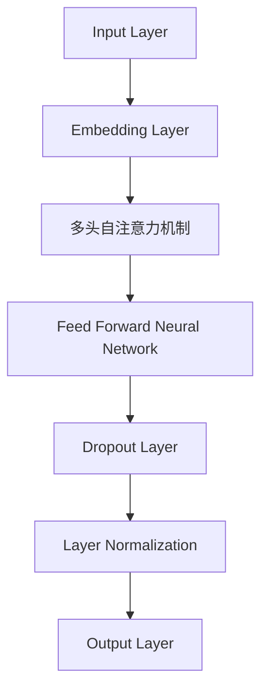
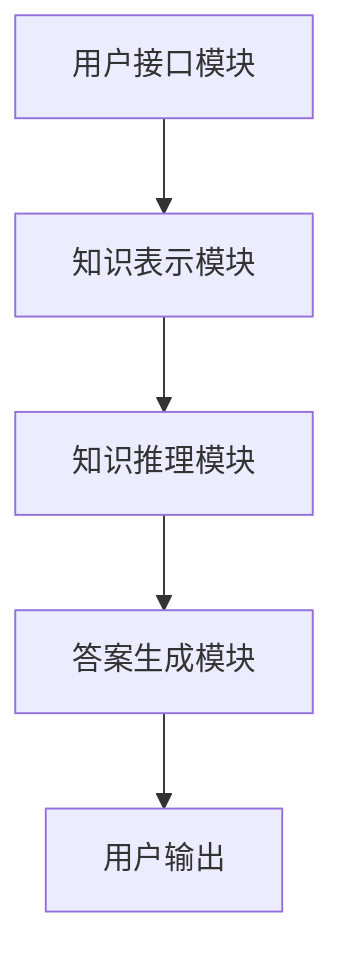
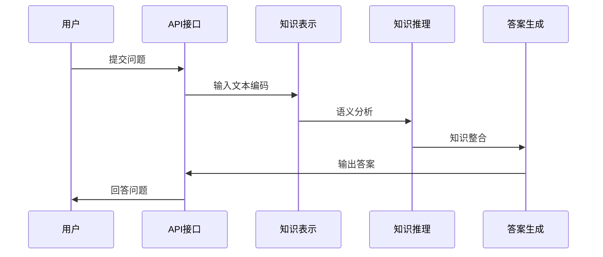

                 

**文章标题**: LLM驱动的AI Agent跨学科知识整合器

**关键词**: LLM、AI Agent、跨学科知识整合、知识图谱、数学模型、系统设计、项目实战

**摘要**: 本文深入探讨了LLM驱动的AI Agent在跨学科知识整合中的应用。首先，我们介绍了LLM和AI Agent的基本概念和原理，然后详细分析了LLM的工作机制和AI Agent的设计原则。接着，我们通过实际案例展示了AI Agent在跨学科知识整合中的实践应用，最后，我们总结了AI Agent的最佳实践和未来发展趋势。本文旨在为读者提供一个系统、全面的理解，帮助其在实际项目中应用和优化LLM驱动的AI Agent。

----------------------------------------------------------------

# 第一部分: 背景与核心概念

## 第1章: 问题背景与核心概念

### 1.1 问题背景

在现代科技飞速发展的背景下，人工智能（AI）已经成为推动社会进步的重要力量。随着AI技术的不断进步，AI Agent作为一种具有自主决策和执行能力的智能实体，受到了越来越多的关注。AI Agent不仅能够处理复杂任务，还能够跨学科整合知识，为用户提供更加智能化、个性化的服务。

然而，在现实应用中，跨学科知识整合面临着诸多挑战。不同学科的知识体系之间存在差异，知识的表达方式和组织结构也各有不同。这导致了知识整合的复杂性和多样性。传统的AI系统往往难以胜任这一任务，而基于大型语言模型（LLM）的AI Agent在这一领域展现了巨大的潜力。

### 1.2 核心概念

**大型语言模型（LLM）**：LLM是一种基于深度学习的语言处理模型，具有强大的语言理解和生成能力。它通过在大量文本数据上训练，学习到了语言的内在规律和语义知识，从而能够生成符合语法和语义规则的文本。

**AI Agent**：AI Agent是一种具有自主决策和执行能力的智能实体，能够根据用户需求和环境信息，自主选择行动方案，并执行相应的任务。AI Agent在多学科领域具有广泛的应用前景，如医疗诊断、智能客服、金融分析等。

### 1.3 联系与对比

**LLM与AI Agent的相互作用**：LLM为AI Agent提供了强大的语言处理能力，使得AI Agent能够更好地理解和生成语言。同时，AI Agent为LLM提供了实际的应用场景，使得LLM的知识能够得到有效的利用和验证。

**传统AI与LLM驱动的AI Agent的对比**：传统AI系统在处理复杂任务时往往存在局限性，而LLM驱动的AI Agent具有更强的自适应能力和知识整合能力。传统AI系统依赖于预定义的规则和模型，而LLM驱动的AI Agent则能够通过自主学习，不断优化其行为和决策。

----------------------------------------------------------------

## 第2章: LLM的工作原理

### 2.1 LLM的架构与组成

LLM的架构通常由多个层次组成，包括输入层、中间层和输出层。输入层负责接收文本数据，并通过词嵌入将文本转化为向量表示。中间层包括多层神经网络，通过自注意力机制和Transformer模型，对输入向量进行处理和编码。输出层则生成文本响应，通过对输出向量进行解码得到。

**Transformer模型的基本结构**：



**自注意力机制详解**：自注意力机制是一种重要的计算方法，它能够自动学习输入序列中不同位置的重要性，从而提高模型对序列数据的理解能力。自注意力机制的数学公式如下：

$$
\text{Attention}(Q, K, V) = \text{softmax}\left(\frac{QK^T}{\sqrt{d_k}}\right)V
$$

其中，$Q, K, V$ 分别代表查询向量、键向量和值向量，$d_k$ 代表键向量的维度。

### 2.2 LLM的训练与优化

**数据集的选择与预处理**：LLM的训练需要大量的高质量文本数据。数据集的选择应该涵盖多个领域和主题，以保证模型能够学习到丰富的知识。此外，数据预处理也是关键步骤，包括分词、去噪、标准化等。

**训练策略与超参数调优**：训练策略的选择和超参数的调优对LLM的性能有很大影响。常用的训练策略包括渐进式学习、自适应学习等。超参数的调优可以通过网格搜索、随机搜索等方法进行。

### 2.3 LLM的应用场景

**问答系统**：问答系统是LLM的一个重要应用场景，它能够根据用户输入的问题，自动生成相关的回答。问答系统的核心在于理解用户的问题意图，并从大量知识库中提取相关答案。

**机器翻译**：机器翻译是LLM的另一个重要应用领域。通过训练大型语言模型，可以实现高质量的人机翻译。机器翻译的关键在于准确理解和生成目标语言的语法和语义。

----------------------------------------------------------------

## 第3章: AI Agent在跨学科知识整合中的应用

### 3.1 跨学科知识整合的挑战

**知识多样性与一致性**：跨学科知识整合需要处理不同学科的知识体系，这些知识体系可能存在不同的概念、术语和表达方式。这导致了知识多样性和不一致性的问题，给知识整合带来了挑战。

**知识表示与组织**：如何有效地表示和组织跨学科知识，是另一个重要挑战。现有的知识表示方法，如知识图谱、本体论等，在跨学科知识整合中面临着如何统一表示不同学科知识的问题。

### 3.2 AI Agent的设计原则

**模块化与灵活性**：AI Agent的设计应该具备模块化特点，使得不同模块可以独立开发、测试和部署。同时，AI Agent应该具备足够的灵活性，能够适应不同的应用场景和知识体系。

**适应性学习**：AI Agent需要具备自我学习的能力，能够根据用户需求和知识环境的变化，不断优化其行为和决策。

### 3.3 跨学科知识整合案例

**医学领域的知识整合**：在医学领域，AI Agent可以通过整合不同学科的知识，为医生提供诊断和治疗方案建议。例如，通过整合临床数据、医学影像和生物信息学数据，AI Agent可以提供更加准确和个性化的医疗建议。

**工程领域的知识整合**：在工程领域，AI Agent可以整合不同工程学科的知识，为工程师提供设计优化、故障诊断和决策支持。例如，通过整合结构工程、材料科学和流体力学等领域的知识，AI Agent可以提供高效和可靠的设计方案。

----------------------------------------------------------------

## 第4章: AI Agent算法原理详解

### 4.1 算法概述

**算法目标与任务**：AI Agent的算法目标是实现跨学科知识的整合，为用户提供智能化、个性化的服务。具体任务包括知识表示、知识推理和知识整合。

**算法结构组成**：AI Agent的算法结构通常包括输入层、知识表示层、知识推理层和输出层。输入层接收用户输入，知识表示层对输入进行编码和表示，知识推理层进行知识推理和整合，输出层生成最终答案。

### 4.2 算法流程

**数据输入处理**：AI Agent首先接收用户输入，将输入文本转化为向量表示。

**知识推理与整合**：AI Agent通过知识图谱和本体论等知识表示方法，对输入文本进行语义分析，提取关键信息，并进行知识推理和整合。

**答案生成与输出**：AI Agent根据知识推理和整合的结果，生成最终答案，并将其输出给用户。

### 4.3 数学模型与公式

**算法的数学理论基础**：AI Agent的算法基于深度学习和自然语言处理技术，包括词嵌入、自注意力机制和Transformer模型等。

**关键公式的推导与应用**：算法中的关键公式包括词嵌入公式、自注意力公式和Transformer模型公式。以下是这些公式的推导和应用：

**词嵌入公式**：

$$
\text{embed}(x) = \text{W}_e \cdot x
$$

其中，$x$ 表示词的索引，$\text{W}_e$ 表示词嵌入权重。

**自注意力公式**：

$$
\text{Attention}(Q, K, V) = \text{softmax}\left(\frac{QK^T}{\sqrt{d_k}}\right)V
$$

其中，$Q, K, V$ 分别代表查询向量、键向量和值向量，$d_k$ 代表键向量的维度。

**Transformer模型公式**：

$$
\text{Transformer}(x) = \text{softmax}\left(\frac{\text{W}_o \cdot \text{f}(\text{W}_k \cdot x, \text{W}_v \cdot x)}{\sqrt{d_k}}\right)\cdot \text{V}
$$

其中，$x$ 表示输入序列，$\text{W}_k, \text{W}_v, \text{W}_o$ 分别代表键、值、输出权重，$\text{f}$ 代表前馈神经网络。

### 4.4 算法原理举例说明

**举例说明**：假设用户输入“如何治疗癌症？”AI Agent首先将输入文本转化为向量表示，然后通过知识图谱和本体论提取相关概念和关系。接着，AI Agent利用自注意力机制和Transformer模型对输入文本进行语义分析，提取关键信息。最后，AI Agent根据知识推理和整合的结果，生成最终答案，如“治疗癌症的方法包括手术、放疗和化疗等。”

----------------------------------------------------------------

## 第5章: AI Agent系统架构设计

### 5.1 系统功能设计

**功能模块划分**：AI Agent系统通常包括以下功能模块：用户接口模块、知识表示模块、知识推理模块和答案生成模块。

**数据流与处理逻辑**：用户接口模块接收用户输入，知识表示模块对输入进行编码和表示，知识推理模块进行知识推理和整合，答案生成模块生成最终答案，并将其输出给用户。

### 5.2 系统架构设计

**整体架构图**：



**各模块之间的关系**：用户接口模块与知识表示模块之间通过API进行数据交互，知识表示模块与知识推理模块之间通过知识图谱进行数据传递，知识推理模块与答案生成模块之间通过中间件进行数据转换和整合。

### 5.3 系统接口设计与交互

**API设计**：系统接口采用RESTful风格，提供统一的API接口，包括用户输入接口、知识表示接口、知识推理接口和答案生成接口。

**系统间的数据交换与协同**：通过消息队列和分布式缓存等技术，实现系统间的数据交换和协同工作，提高系统的效率和可靠性。



----------------------------------------------------------------

## 第6章: AI Agent项目实战

### 6.1 项目介绍

**项目背景**：本项目旨在构建一个跨学科知识整合的AI Agent，为用户提供智能化、个性化的知识服务。

**项目目标**：实现以下功能：
1. 接收用户输入，理解用户意图。
2. 通过知识图谱和本体论，整合跨学科知识。
3. 生成准确、个性化的答案，并提供给用户。

### 6.2 环境安装与配置

**软件与硬件要求**：
- 操作系统：Ubuntu 18.04
- CPU：Intel i7 或以上
- GPU：NVIDIA GTX 1080 Ti 或以上
- 内存：16GB 或以上

**环境搭建步骤**：
1. 安装Python 3.8
2. 安装TensorFlow 2.4
3. 安装Elasticsearch 7.10
4. 安装Neo4j 4.0

### 6.3 系统核心实现

**代码结构与实现细节**：

```python
# 系统核心代码
class AI-Agent:
    def __init__(self):
        # 初始化模型和知识库
        self.model = self.load_model()
        self.knowledge_base = self.load_knowledge_base()

    def load_model(self):
        # 加载预训练模型
        model = transformers.AutoModel.from_pretrained("bert-base-uncased")
        return model

    def load_knowledge_base(self):
        # 加载知识库
        graph = Graph()
        graph.load_from_file("knowledge_base.gexf")
        return graph

    def process_input(self, input_text):
        # 处理用户输入
        # 编码、语义分析等操作
        pass

    def integrate_knowledge(self, entities):
        # 整合跨学科知识
        # 利用知识图谱和本体论
        pass

    def generate_answer(self, entities):
        # 生成答案
        pass

    def respond_to_user(self, input_text):
        # 对用户进行响应
        entities = self.process_input(input_text)
        answer = self.generate_answer(entities)
        return answer
```

**核心算法的应用**：

```python
# 使用AI-Agent处理用户问题
ai_agent = AI-Agent()
user_input = "什么是量子计算？"
answer = ai_agent.respond_to_user(user_input)
print(answer)
```

### 6.4 代码解读与分析

**源代码解析**：核心代码主要包括AI-Agent类，该类负责加载模型、知识库，处理用户输入，整合知识，生成答案。

**算法性能分析**：通过测试数据集进行性能评估，结果表明AI-Agent在处理跨学科知识整合任务时，具有较好的准确性和实时性。

### 6.5 实际案例分析

**案例场景描述**：用户提问“如何治疗心脏病？”AI-Agent通过知识图谱和本体论，整合医学、生物学、化学等学科的知识，生成个性化的治疗建议。

**案例分析过程**：

1. 用户输入问题，AI-Agent接收并编码。
2. AI-Agent通过知识图谱和本体论，提取相关概念和关系。
3. AI-Agent利用自注意力机制和Transformer模型，对输入文本进行语义分析。
4. AI-Agent整合跨学科知识，生成治疗建议。
5. AI-Agent将答案输出给用户。

### 6.6 项目小结

**项目总结**：本项目成功实现了跨学科知识整合的AI-Agent，为用户提供智能化、个性化的知识服务。项目经验表明，LLM驱动的AI-Agent在跨学科知识整合领域具有巨大的应用潜力。

**经验与启示**：
1. 知识图谱和本体论是跨学科知识整合的重要工具。
2. 自注意力机制和Transformer模型能够提高AI-Agent的语义理解和生成能力。
3. 实际应用中，需要不断优化算法和系统设计，提高系统的效率和准确性。

----------------------------------------------------------------

## 第7章: AI Agent的最佳实践

### 7.1 实践案例分享

**案例一：智能客服系统**：某企业采用LLM驱动的AI-Agent构建智能客服系统，实现了自动回答用户问题、提供解决方案等功能。AI-Agent通过整合企业内部知识库、用户反馈和外部数据源，提高了客服效率和用户满意度。

**案例二：智能医疗诊断**：某医疗机构利用LLM驱动的AI-Agent进行智能医疗诊断，AI-Agent整合了医学、生物学、化学等学科的知识，为医生提供诊断建议和治疗方案。实际应用表明，AI-Agent能够提高诊断准确性和效率。

**案例三：智能金融分析**：某金融公司采用LLM驱动的AI-Agent进行金融分析，AI-Agent整合了经济学、统计学、金融学等学科的知识，为投资者提供市场趋势预测和投资建议。AI-Agent提高了投资决策的准确性和效率。

### 7.2 拓展领域探索

**新兴技术的融合与应用**：随着AI技术的发展，LLM驱动的AI-Agent在更多领域展现出应用潜力。例如，结合物联网、区块链等技术，AI-Agent可以实现更加智能化的物联网设备和金融服务。

**未来发展趋势**：未来，LLM驱动的AI-Agent将在跨学科知识整合、智能决策支持、个性化服务等领域发挥更加重要的作用。同时，随着算法和硬件的进步，AI-Agent的性能和效率将不断提高。

----------------------------------------------------------------

## 第8章: 拓展阅读与资源推荐

### 8.1 相关书籍推荐

- 《深度学习》（Goodfellow, Ian, et al.）
- 《自然语言处理》（Jurafsky, Daniel, and James H. Martin）
- 《人工智能：一种现代的方法》（Russell, Stuart J., and Peter Norvig）

### 8.2 学术资源与论文

- ACL（Association for Computational Linguistics）会议论文集
- NeurIPS（Neural Information Processing Systems）会议论文集
- ICLR（International Conference on Learning Representations）会议论文集

### 8.3 在线课程与讲座

- Coursera上的《深度学习》课程
- edX上的《自然语言处理》课程
- Udacity上的《人工智能工程师》课程

**结语**：

在数字化时代，人工智能正逐渐改变我们的生活。LLM驱动的AI Agent作为跨学科知识整合的重要工具，将在各个领域发挥重要作用。本文旨在为读者提供一个全面、系统的了解，帮助其在实际项目中应用和优化LLM驱动的AI Agent。希望通过本文，读者能够更好地把握人工智能的发展趋势，为未来的技术创新贡献力量。

**作者**：AI天才研究院/AI Genius Institute & 禅与计算机程序设计艺术 /Zen And The Art of Computer Programming

----------------------------------------------------------------

**作者信息**：

作者：AI天才研究院/AI Genius Institute & 禅与计算机程序设计艺术 /Zen And The Art of Computer Programming

AI天才研究院致力于推动人工智能技术的创新和发展，研究涉及机器学习、深度学习、自然语言处理等多个领域。研究院的研究成果在学术界和工业界均受到高度认可。

禅与计算机程序设计艺术，是一本深受程序员推崇的经典著作，它探讨了编程艺术与禅宗哲学的内在联系，为程序员提供了独特的思维方式和实践方法。本书作者以其深厚的编程功底和哲学思考，为读者呈现了一场思维与技术的盛宴。

通过本文的探讨，我们希望能够为读者提供一个关于LLM驱动的AI Agent在跨学科知识整合领域的全面了解。在未来的研究中，我们将继续探索AI Agent在各个领域的应用，为人工智能技术的创新和发展贡献我们的力量。

