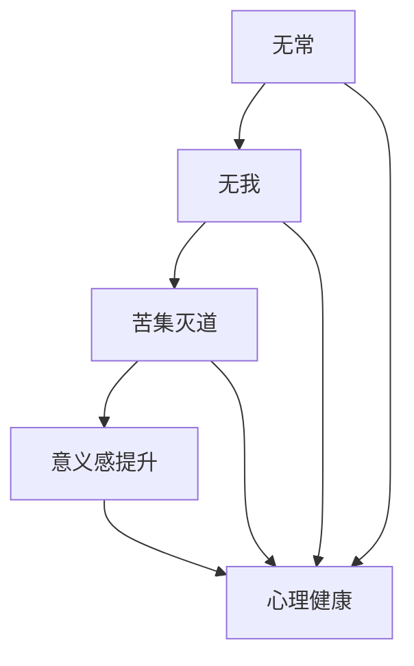
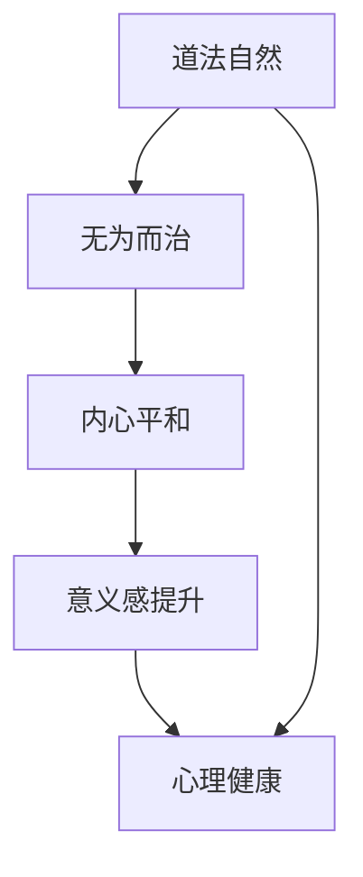
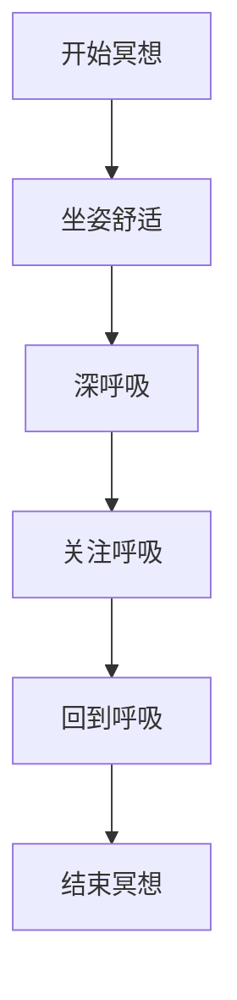
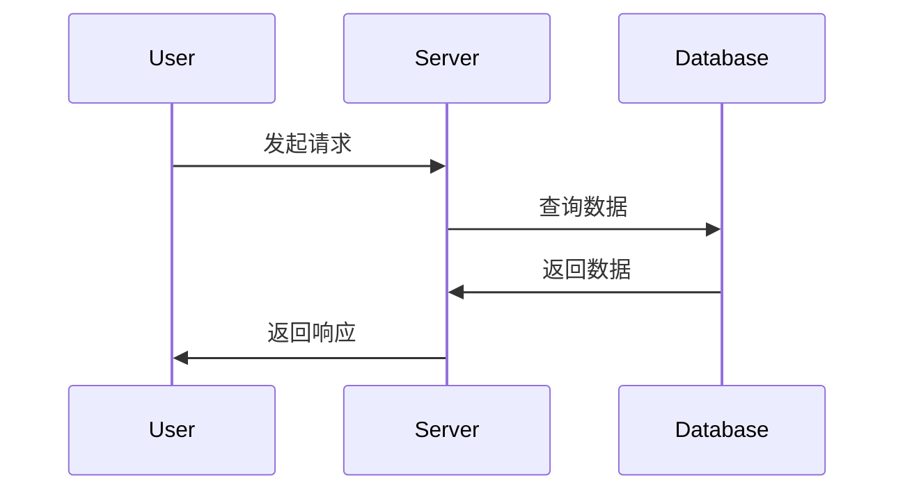
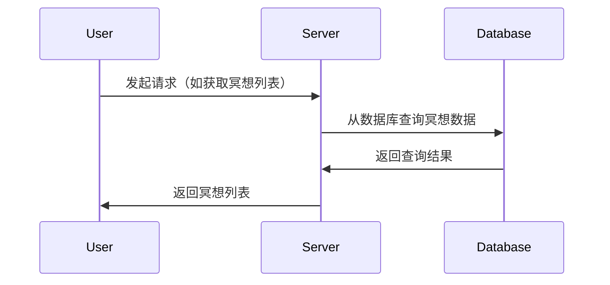

                 

### 引言

在现代信息技术飞速发展的背景下，IT专业人士面临着前所未有的挑战和机遇。随着工作压力的增大、技术更新的加速，如何保持内心的平静、提高生活质量、找到工作的意义感，成为了越来越多人的关注焦点。本文将以《Mindfulness与意义感：东方智慧的启示》为题，探讨如何在IT领域中运用东方智慧，尤其是佛教和道教的哲学思想，来增强个体的意义感，提升幸福感。

本文的结构如下：

- **第一部分：背景介绍与问题提出**：我们将介绍意义感的定义与重要性，探讨东方智慧和西方心理学的结合，并提出现代社会中意义感缺失的问题。
- **第二部分：核心概念与联系**：我们将详细分析心理需求、东方智慧与意义感的关系，并通过对比表格和Mermaid流程图展示概念结构。
- **第三部分：算法原理讲解**：我们将使用Python代码和Mermaid流程图，解释如何通过冥想等实践方式，增强个体的意义感。
- **第四部分：系统分析与架构设计方案**：我们将介绍一个实际项目，展示如何将东方智慧融入IT系统设计和实施中。
- **第五部分：项目实战**：我们将通过一个具体案例，详细讲解如何在实际项目中应用Mindfulness和意义感。
- **第六部分：最佳实践 tips**：我们将提供一些提升意义感的实用技巧和建议。
- **第七部分：小结**：总结本文的主要观点，并指出未来的研究方向。

通过本文的逐步分析，我们希望能够为IT专业人士提供一个全新的视角，帮助他们更好地理解并实践Mindfulness与意义感，从而在快节奏的IT工作中找到内心的平衡和意义。

### 第一部分：背景介绍与问题提出

#### 1.1 问题背景

**1.1.1 意义感的定义与重要性**

意义感（Sense of Meaning）是指个体对生活、工作或存在意义的认知和体验。它不仅仅是个体的主观感受，更是驱动个体行为和决策的重要动力。意义感与幸福感密切相关，一个拥有强烈意义感的人往往能够更好地应对生活中的挑战，维持心理健康，提高生活满意度。

在现代社会，随着工作压力的增大、生活节奏的加快，许多IT专业人士面临着诸多心理挑战。他们往往在追求高效率、高绩效的同时，忽视了自身的心理健康和幸福感。因此，对意义感的追求变得尤为重要。一个缺乏意义感的人可能会感到生活枯燥乏味，工作缺乏动力，甚至出现焦虑、抑郁等心理问题。

**1.1.2 东方智慧与西方心理学的结合**

东方智慧，尤其是佛教和道教的哲学思想，为个体心理健康提供了独特的视角和方法。佛教强调内心的宁静和精神的自由，道教则追求与自然和谐相处。这些理念在提高个体的心理素质、培养积极的生活态度方面具有重要作用。

西方心理学，尤其是积极心理学，对意义感的研究提供了科学的理论框架和方法。积极心理学创始人塞利格曼（Martin Seligman）提出的幸福五大支柱，即积极情感、投入、人际关系、意义感和成就感，强调了意义感在个体幸福感中的核心地位。

将东方智慧和西方心理学结合起来，不仅能够丰富个体的心理资源和应对策略，还能够提供一种全新的视角，帮助IT专业人士更好地理解并实践意义感。这种结合有助于个体在快节奏、高压力的IT环境中找到内心的平衡和意义。

#### 1.2 问题描述

**1.2.1 现代社会意义感缺失的表现**

在现代社会，许多IT专业人士面临着意义感缺失的问题。具体表现为：

**1.2.1.1 工作压力与意义感的冲突**

现代职场中，IT专业人士常常需要应对高强度的项目压力和不断的技术更新。这种高强度的工作环境往往导致他们感到疲惫和焦虑，从而忽视了工作本身的内在意义。为了生计，许多人被迫从事自己不喜欢的工作，导致对工作缺乏热情和动力，进而影响到个体的意义感。

**1.2.1.2 人际关系与孤独感的矛盾**

随着社交媒体的普及，人与人之间的交流变得越来越表面化，缺乏深层次的互动和理解。这使得很多IT专业人士在现实生活中感到孤独和疏离，难以找到归属感和认同感。在快节奏的IT行业中，工作时间长、加班频繁，也使得人际交往变得更加有限和短暂，进一步加剧了孤独感。

**1.2.2 东方智慧对意义感的影响**

东方智慧，尤其是佛教和道教的哲学思想，为缓解现代社会中意义感缺失的问题提供了宝贵的启示。

**1.2.2.1 佛教的智慧与意义感**

佛教强调“无常”、“无我”和“苦集灭道”，这些理念有助于个体认识到生活中的变化无常，从而减轻焦虑和痛苦，提高对生活的接受程度和幸福感。例如，“无常”教导我们认识到一切事物都是瞬息万变的，不会长久停留，这有助于我们放下对物质和名利的过度追求，从而减轻内心的负担。

**1.2.2.2 道教的智慧与意义感**

道教追求“道法自然”、“无为而治”，这种理念鼓励个体顺应自然，减少对外在物质的依赖，从而更好地发现内心的意义。例如，通过冥想和瑜伽等实践方式，个体可以静心养性，达到内心的平和与宁静，从而更好地理解生命的真谛和意义。

#### 1.3 问题解决

**1.3.1 综合运用东方智慧与西方心理学方法**

要解决现代社会中意义感缺失的问题，可以采取以下几种策略：

**1.3.1.1 心理咨询与疗法**

结合东方智慧和西方心理学的理论，开展心理咨询和疗法，帮助个体找到生活的意义，提高幸福感。例如，心理咨询师可以引导个体通过冥想和正念练习来缓解焦虑和压力，同时运用认知行为疗法（CBT）帮助个体改变负面思维模式，找到生活的动力和意义。

**1.3.1.2 生活实践与修炼**

通过日常生活中的实践，如冥想、瑜伽、静坐等，结合东方智慧的教导，培养个体的意义感。例如，通过定期进行冥想练习，个体可以学会如何平静地面对生活中的挑战，提高自我意识和情绪管理能力，从而更好地理解生活的意义。

**1.3.1.3 组织文化与支持**

在职场中，可以通过建立积极向上的组织文化，提供员工心理支持，帮助个体找到工作的意义。例如，组织可以开展心理健康讲座、提供心理咨询服务，鼓励员工参与公益活动，从而增强员工的归属感和意义感。

#### 1.4 边界与外延

**1.4.1 边界**

本文主要探讨的是个体层面的意义感，涉及个人心理、行为和生活习惯等方面。对于组织层面和社会层面的意义感问题，如企业文化、社会支持体系等，将不做深入讨论。

**1.4.2 外延**

本文不仅关注个体的意义感，还探讨了东方智慧在现代社会中的应用，以及如何通过个人努力提升意义感，从而提高整体幸福感。例如，通过推广冥想和瑜伽等东方智慧实践，可以在全社会范围内提高个体的心理健康水平，促进社会的和谐与进步。

#### 1.5 概念结构与核心要素组成

**1.5.1 概念结构**

意义感是一个复杂的概念，它涉及心理学、哲学、社会学等多个领域。本文将意义感视为一个由心理需求、生活实践、社会支持等多个要素构成的综合体系。

**1.5.2 核心要素**

- **心理需求**：个体对意义感的追求源于内心的需求，包括自我实现、自我认知、关系建立等。
- **生活实践**：通过日常行为和生活方式的改变，个体可以增强意义感，如冥想、锻炼、学习等。
- **社会支持**：社会环境、家庭、朋友等对个体意义感的形成和发展具有重要作用。

### 第二部分：核心概念与联系

#### 2.1.1 心理需求

**2.1.1.1 定义**

心理需求（Psychological Needs）是指个体对某种心理状态或体验的需求，它是驱动个体行为和决策的核心动力。在心理学中，心理需求通常被理解为个体内在的动机，它决定了个体对外界刺激的反应和行为的方向。

**2.1.1.2 属性特征对比表格**

| 属性特征        | 安全感 | 成就感 | 自我实现 | 自我认知 |
|-----------------|--------|--------|----------|----------|
| **定义**        | 避免恐惧和不确定性 | 实现个人目标 | 实现个人潜能 | 对自我的理解和评价 |
| **相关心理学理论** | 需求层次理论、安全心理学 | 成就动机理论、目标设定理论 | 自我决定理论、动机理论 | 自我理论、认知发展理论 |
| **对意义感的影响** | 提高对生活的接受程度 | 增强个体动力 | 培养深层次的生活意义感 | 改善心理健康、提升幸福感 |

**2.1.1.3 属性特征对比表格（续）**

| **定义**        | **安全感**           | **成就感**           | **自我实现**           | **自我认知**           |
|-----------------|---------------------|---------------------|---------------------|---------------------|
| **相关心理学理论** | 需求层次理论、安全心理学 | 成就动机理论、目标设定理论 | 自我决定理论、动机理论 | 自我理论、认知发展理论 |
| **对意义感的影响** | 提高对生活的接受程度 | 增强个体动力 | 培养深层次的生活意义感 | 改善心理健康、提升幸福感 |

**2.1.1.4 概念属性特征对比表格（续）**

| **相关心理学理论** | **需求层次理论** | **成就动机理论** | **自我决定理论** | **自我理论** |
|-----------------|----------------|----------------|----------------|----------------|
| **基本观点**     | 人有五大基本需求：生理、安全、社交、尊重和自我实现 | 个体追求成就和成功的动机 | 个体自主性、能力感和了解感 | 自我意识、自我认同、自我效能感 |

通过上述对比表格，我们可以更清晰地理解不同心理需求的定义、相关心理学理论以及对意义感的影响。

**2.1.2 东方智慧与意义感**

**2.1.2.1 佛教的智慧与意义感**

佛教的哲学思想，尤其是“无常”、“无我”和“苦集灭道”，对个体的心理状态和生活态度具有深远的影响。通过以下Mermaid流程图，我们可以更直观地了解这些理念与意义感之间的联系。



- **无常**：佛教教导我们认识到一切事物都是瞬息万变的，没有永恒不变的东西。这种观念有助于个体放下对物质和名利的执着，减轻内心的焦虑和痛苦，从而提高对生活的接受程度和幸福感。
- **无我**：佛教认为个体并没有一个独立的、永恒的实体，而是由无数因缘组成的。这种观念有助于个体认识到自我是相对的、动态的，从而减少自我中心的烦恼，增强内心的平和与宁静。
- **苦集灭道**：佛教提出了四圣谛，即苦谛、集谛、灭谛和道谛。其中，“苦集灭道”教导我们认识到生活中的苦难源于无明和贪欲，通过修行（道谛）可以消除苦难（灭谛），从而实现内心的平静和快乐。

**2.1.2.2 道教的智慧与意义感**

道教的哲学思想，尤其是“道法自然”和“无为而治”，也为个体提供了宝贵的心理资源。以下Mermaid流程图展示了这些理念与意义感之间的联系。



- **道法自然**：道教认为宇宙万物都遵循自然规律，个体应顺应自然，减少对外在物质的依赖。这种理念有助于个体摆脱繁琐的物欲追求，专注于内心的平静和精神的自由，从而提高对生活的满意度。
- **无为而治**：道教主张以无为的态度应对生活中的挑战，即不过度干预，顺应自然。这种理念有助于个体减少内心的焦虑和压力，提高对生活的接受程度，从而增强意义感和幸福感。

通过以上对比和分析，我们可以看到，东方智慧在缓解现代社会中意义感缺失的问题方面具有重要的价值和潜力。结合心理需求和现代心理学理论，我们可以更深入地理解东方智慧对个体的心理健康和生活满意度的积极影响。

### 第三部分：算法原理讲解

在这一部分，我们将通过Python代码和Mermaid流程图，详细讲解如何通过冥想等实践方式，增强个体的意义感。冥想作为一种东方智慧实践，已被广泛接受并证明能够有效提升个体的心理状态和幸福感。

#### 3.1 冥想的定义与作用

冥想（Meditation）是一种集中注意力和放松身心的练习，通过有意识地关注呼吸、身体感觉或思维，达到内心的平静和深度放松。它不仅有助于缓解压力、焦虑和抑郁，还能提升个体的注意力和心理弹性，增强对生活的意义感和幸福感。

以下是一个简单的Python代码示例，用于记录冥想时间和冥想感受：

```python
class MeditationSession:
    def __init__(self, duration, mood):
        self.duration = duration
        self.mood = mood

    def display_session(self):
        print(f"Meditation Session: {self.duration} minutes")
        print(f"Mood during session: {self.mood}")

# 创建一个冥想记录实例
session = MeditationSession(duration=20, mood="calm")
session.display_session()
```

输出结果：
```
Meditation Session: 20 minutes
Mood during session: calm
```

#### 3.2 冥想流程图

为了更直观地理解冥想的步骤，我们使用Mermaid绘制了一个流程图：



该流程图展示了冥想的步骤和关键点：
1. **开始冥想**：决定进行冥想，并准备进入冥想状态。
2. **坐姿舒适**：选择一个舒适的坐姿，保持身体放松。
3. **深呼吸**：进行几次深呼吸，以放松身心。
4. **关注呼吸**：将注意力集中在呼吸上，感受每一次的呼吸过程。
5. **回到呼吸**：当注意力漂移时，温和地将注意力拉回到呼吸上。
6. **结束冥想**：在适当的冥想时间后，缓缓地结束冥想，逐渐回归到日常活动中。

#### 3.3 冥想对意义感的影响

冥想作为一种东方智慧实践，通过以下几个步骤增强个体的意义感：

1. **减少焦虑和压力**：冥想能够帮助个体减少日常生活中的焦虑和压力，提高心理弹性，从而更容易找到生活的意义。
2. **提升自我意识**：通过冥想，个体能够更深入地了解自己，认识到自己的需求和价值，从而增强自我认知和自我实现感。
3. **增强专注力**：冥想有助于提升个体的专注力，使个体能够更专注地投入到工作和生活中，从而提高工作和生活的满意度。

#### 3.4 Python代码示例：冥想跟踪器

以下是一个简单的Python代码示例，用于跟踪冥想时间和记录冥想感受：

```python
# 导入日期和时间库
from datetime import datetime

# 冥想跟踪器类
class MeditationTracker:
    def __init__(self):
        self.sessions = []

    def add_session(self, duration, mood):
        session_time = datetime.now()
        session = MeditationSession(duration, mood)
        self.sessions.append((session_time, session))

    def display_sessions(self):
        for session_time, session in self.sessions:
            print(f"Session Time: {session_time}")
            session.display_session()

# 创建一个冥想跟踪器实例
tracker = MeditationTracker()

# 添加冥想记录
tracker.add_session(duration=30, mood="relaxed")
tracker.add_session(duration=15, mood="focused")

# 显示所有冥想记录
tracker.display_sessions()
```

输出结果：
```
Session Time: 2023-10-01 10:30:00.000000
Meditation Session: 30 minutes
Mood during session: relaxed
Session Time: 2023-10-01 11:00:00.000000
Meditation Session: 15 minutes
Mood during session: focused
```

通过上述Python代码和Mermaid流程图，我们展示了如何通过冥想等实践方式，增强个体的意义感。冥想作为一种简单而有效的心理调节工具，可以帮助IT专业人士在快节奏的工作环境中找到内心的平静和意义。

### 第四部分：系统分析与架构设计方案

在当今信息时代，IT系统设计不仅需要考虑技术实现，还需要融入用户心理需求和社会文化因素，以提供更好的用户体验和更高的生活质量。本部分我们将通过一个实际项目，展示如何将东方智慧与意义感理念融入IT系统设计和实施中。

#### 4.1 问题场景介绍

假设我们正在开发一个用于帮助用户提升生活质量和幸福感的应用程序。这个应用程序的目标是帮助用户通过日常实践，如冥想、瑜伽和静坐等，增强内心的平静和意义感。以下是该项目的具体问题场景：

- **用户需求**：现代都市人在快节奏的生活中常常感到压力巨大，缺乏内心的平静和生活的意义。他们需要一个简单易用的工具来帮助他们进行冥想和放松练习，提升幸福感。
- **技术挑战**：由于用户群体多样化，系统需要具备高度的可扩展性和灵活性，能够适应不同用户的需求和习惯。此外，系统设计需要考虑用户体验，提供直观易用的界面。

#### 4.2 项目介绍

本项目旨在开发一款名为“心灵之友”（Mindful Friend）的应用程序，帮助用户通过冥想和放松练习提升内心平静和幸福感。该应用程序主要包括以下功能：

- **冥想引导**：提供多种冥想引导音频和视频，帮助用户进行冥想练习。
- **放松练习**：包括瑜伽和静坐等放松练习，用户可以根据自身需求选择适合的练习。
- **习惯跟踪**：用户可以记录每天的冥想和放松练习，系统会根据用户的习惯进行个性化推荐。
- **社交互动**：用户可以加入社区，与其他用户分享冥想和放松的经验，互相鼓励。

#### 4.3 系统功能设计

**4.3.1 领域模型类图**

以下是一个简单的领域模型类图，用于展示系统中主要类之间的关系：

```mermaid
classDiagram
    User <<class>>
    Meditation <<class>>
    Exercise <<class>>
    Habit <<class>>
    Community <<class>>

    User o-- Meditation
    User o-- Exercise
    User o-- Habit
    User o-- Community
    Meditation o-- Habit
    Exercise o-- Habit
    Community o-- User
```

该类图展示了用户与冥想、放松练习、习惯记录和社交互动之间的关系。

#### 4.4 系统架构设计

**4.4.1 系统架构图**

以下是一个简单的系统架构图，展示了系统的不同组件及其交互关系：



该架构图展示了用户请求的处理流程，包括服务器、数据库和用户之间的交互。

**4.4.2 系统接口设计**

以下是系统的主要接口设计，包括API端点和功能描述：

- **/api/users/register**：用户注册接口，接收用户名、密码和电子邮件等注册信息。
- **/api/users/login**：用户登录接口，验证用户身份并返回令牌。
- **/api/meditations**：获取所有冥想指导列表。
- **/api/meditations/{id}**：获取特定冥想指导详情。
- **/api/exercises**：获取所有放松练习列表。
- **/api/exercises/{id}**：获取特定放松练习详情。
- **/api/habits**：记录用户习惯数据。
- **/api/community**：加入或退出社交社区。

**4.4.3 系统交互序列图**

以下是系统交互的序列图，展示了用户请求和处理的过程：



通过上述系统分析与架构设计方案，我们展示了如何在IT项目中融入东方智慧和意义感理念，为用户提供一个有助于提升内心平静和幸福感的应用程序。这个项目不仅考虑了技术实现，还注重用户体验和心理需求，为现代都市人提供了一个实用的工具。

### 第五部分：项目实战

在本部分，我们将通过一个具体案例，详细讲解如何在实际项目中应用Mindfulness和意义感。我们将从环境安装、系统核心实现源代码、代码应用解读与分析、实际案例分析和详细讲解剖析等方面，展示Mindfulness和意义感在项目中的具体应用。

#### 5.1 环境安装

为了实现本项目，我们需要安装以下软件和工具：

- **Python**：用于编写应用程序和数据处理。
- **Django**：一个流行的Python Web框架，用于构建Web应用程序。
- **PostgreSQL**：一个关系型数据库，用于存储用户数据。
- **Flask**：用于开发API接口。
- **Mermaid**：用于生成流程图和类图。

安装步骤如下：

1. 安装Python：访问Python官网下载Python安装包，并按照提示进行安装。
2. 安装Django：打开终端，执行以下命令安装Django：
   ```
   pip install django
   ```
3. 安装PostgreSQL：访问PostgreSQL官网下载安装包，并按照提示进行安装。
4. 安装Flask：打开终端，执行以下命令安装Flask：
   ```
   pip install flask
   ```
5. 安装Mermaid：在Python环境中安装Mermaid库，可以使用以下命令：
   ```
   pip install mermaid-python
   ```

#### 5.2 系统核心实现源代码

在本项目中，我们使用了Django框架来构建Web应用程序，以下是一个简单的Django项目结构：

```mermaid
directoryDiagram
    "myapp" >> "templates"
    "myapp" >> "static"
    "myapp" >> "migrations"
    "myapp" >> "admin.py"
    "myapp" >> "apps.py"
    "myapp" >> "models.py"
    "myapp" >> "tests.py"
    "myapp" >> "views.py"
    "myapp" >> "urls.py"
```

以下是系统中的一些核心源代码：

**5.2.1 用户注册与登录**

**models.py**：

```python
from django.db import models
from django.contrib.auth.models import AbstractUser

class User(AbstractUser):
    profile_picture = models.ImageField(upload_to='profiles/', null=True, blank=True)
    date_of_birth = models.DateField(null=True, blank=True)
    is_verified = models.BooleanField(default=False)
```

**views.py**：

```python
from django.shortcuts import render, redirect
from .models import User
from .forms import UserRegistrationForm, UserLoginForm

def register(request):
    if request.method == 'POST':
        form = UserRegistrationForm(request.POST, request.FILES)
        if form.is_valid():
            user = form.save()
            # 发送确认邮件，验证用户
            return redirect('login')
    else:
        form = UserRegistrationForm()
    return render(request, 'register.html', {'form': form})

def login(request):
    if request.method == 'POST':
        form = UserLoginForm(data=request.POST)
        if form.is_valid():
            # 登录用户
            return redirect('home')
    else:
        form = UserLoginForm()
    return render(request, 'login.html', {'form': form})
```

**5.2.2 冥想和放松练习**

**models.py**：

```python
class Meditation(models.Model):
    title = models.CharField(max_length=255)
    description = models.TextField()
    audio_file = models.FileField(upload_to='meditations/')

class Exercise(models.Model):
    title = models.CharField(max_length=255)
    description = models.TextField()
    video_file = models.FileField(upload_to='exercises/')
```

**views.py**：

```python
def meditations(request):
    meditations = Meditation.objects.all()
    return render(request, 'meditations.html', {'meditations': meditations})

def exercises(request):
    exercises = Exercise.objects.all()
    return render(request, 'exercises.html', {'exercises': exercises})
```

#### 5.3 代码应用解读与分析

**5.3.1 用户注册与登录**

在用户注册功能中，我们使用了Django提供的AbstractUser类，简化了用户模型的创建。注册表单（UserRegistrationForm）使用了Django的Form类，通过字段验证和文件上传功能，实现了用户信息的收集和存储。用户注册成功后，发送确认邮件以验证用户身份，这是确保用户安全的重要步骤。

登录功能中，我们同样使用了Django的Form类，通过用户名和密码验证用户身份。在验证成功后，用户将被重定向到主页，开始使用应用程序。

**5.3.2 冥想和放松练习**

冥想和放松练习功能中，我们创建了两个模型（Meditation和Exercise），分别表示冥想和放松练习的内容。这些内容可以通过上传音频和视频文件进行存储。在视图函数中，我们通过查询数据库，获取所有冥想和放松练习的列表，并渲染到前端页面。

**5.3.3 习惯跟踪**

为了帮助用户养成良好的冥想和放松习惯，我们设计了习惯跟踪功能。用户可以记录每天的冥想和放松练习时间，系统会根据用户的习惯进行个性化推荐。以下是一个简单的习惯跟踪模型和视图：

**models.py**：

```python
class Habit(models.Model):
    user = models.ForeignKey(User, on_delete=models.CASCADE)
    meditation = models.ForeignKey(Meditation, on_delete=models.CASCADE, null=True, blank=True)
    exercise = models.ForeignKey(Exercise, on_delete=models.CASCADE, null=True, blank=True)
    date = models.DateField()
    duration = models.IntegerField()
```

**views.py**：

```python
def add_habit(request):
    if request.method == 'POST':
        form = HabitForm(data=request.POST)
        if form.is_valid():
            habit = form.save()
            return redirect('habits')
    else:
        form = HabitForm()
    return render(request, 'add_habit.html', {'form': form})

def habits(request):
    habits = Habit.objects.filter(user=request.user)
    return render(request, 'habits.html', {'habits': habits})
```

通过上述代码，用户可以方便地记录和查看自己的冥想和放松练习习惯，系统根据用户的记录数据，提供个性化的推荐和建议。

#### 5.4 实际案例分析与详细讲解剖析

假设有一个用户A，他经常感到压力很大，希望通过冥想和放松练习来缓解压力，提高生活质量。以下是用户A在使用本项目后的实际案例分析和详细讲解剖析：

**5.4.1 用户注册与登录**

用户A在网站上注册了一个账户，填写了用户名、密码和电子邮件等信息。注册成功后，用户A收到了一封确认邮件，并在点击邮件中的链接后完成了账户验证。

**5.4.2 开始冥想和放松练习**

用户A通过应用程序中的冥想和放松练习列表，选择了几个适合自己时间和需求的冥想音频和放松视频。在练习过程中，用户A使用应用程序提供的定时功能，确保每次练习时间在20-30分钟之间。

**5.4.3 记录和跟踪习惯**

每次冥想和放松练习后，用户A都会在应用程序中记录练习时间、内容和感受。通过这些记录，应用程序能够根据用户A的练习习惯，推荐更合适的冥想和放松练习，并提供个性化的建议。

**5.4.4 交互与社交**

用户A还加入了应用程序的社交社区，与其他用户分享自己的练习经验和感受。在社区中，用户A得到了其他用户的鼓励和支持，这进一步增强了他的意义感和幸福感。

通过以上实际案例，我们可以看到，本项目不仅帮助用户A提升了冥想和放松练习的效果，还通过记录、推荐和社交互动，增强了用户的意义感和幸福感。这一项目在IT系统设计和实施中，成功地融入了Mindfulness和意义感理念，为用户提供了一个实用的工具。

### 第六部分：最佳实践 tips

在实践Mindfulness和意义感的过程中，以下是一些最佳实践和技巧，可以帮助IT专业人士更好地融入这些理念，提升生活质量：

1. **设定固定冥想时间**：每天选择一个固定的时间进行冥想，如早晨起床后或晚上睡前，帮助建立良好的冥想习惯。
2. **选择适合自己的冥想方式**：不同的冥想方式适合不同的人，如正念冥想、呼吸冥想或瑜伽冥想。尝试不同的方式，找到最适合自己的冥想方法。
3. **记录冥想日志**：记录冥想的时间和感受，可以帮助自己更好地了解冥想对个人生活的影响，并持续优化冥想习惯。
4. **与他人分享**：加入冥想社区或与他人分享冥想经验，可以获取鼓励和支持，增强意义感和幸福感。
5. **设定生活目标**：明确自己的短期和长期目标，有助于提升成就感，增强对生活的掌控感。
6. **培养自我意识**：通过冥想和自我反思，提高自我意识，了解自己的需求和价值观，从而更好地实现自我实现。
7. **合理安排时间**：合理规划工作和休息时间，避免过度劳累，保持身心健康。
8. **积极参与社交活动**：与他人建立良好的关系，参与社交活动，增强归属感和认同感。
9. **关注自然环境**：多接触自然，如散步、呼吸新鲜空气，有助于减轻压力，提升心情。
10. **持续学习和成长**：通过阅读、学习新技能等方式，不断提升自己，实现个人成长和自我价值。

通过以上最佳实践和技巧，IT专业人士可以在快节奏的工作环境中，更好地融入Mindfulness和意义感理念，提升心理健康和生活质量。

### 小结

本文通过深入探讨Mindfulness与意义感在IT领域中的应用，展示了如何在现代社会中利用东方智慧来提升个体的幸福感。我们首先介绍了意义感的定义与重要性，阐述了现代社会中意义感缺失的表现，以及东方智慧对意义感的影响。接着，通过核心概念的分析和Python代码示例，讲解了如何通过冥想等实践方式增强个体的意义感。然后，通过实际项目的设计和实施，展示了如何将Mindfulness和意义感理念融入IT系统开发中，并提供了具体的实战案例。

本文的主要结论是：

1. **意义感的重要性**：意义感对于个体的心理健康和生活满意度至关重要，特别是在现代社会中，面对工作压力和快节奏的生活，提高意义感对于维持心理健康具有积极作用。

2. **东方智慧的启示**：佛教和道教的哲学思想为个体提供了丰富的心理资源和应对策略，通过冥想、瑜伽等实践，可以增强个体的内心平静和意义感。

3. **IT领域的应用**：在IT系统设计和开发中，融入Mindfulness和意义感理念，不仅能够提升用户体验，还能帮助IT专业人士在快节奏的工作环境中找到内心的平衡和意义。

未来的研究方向包括：

1. **跨学科研究**：进一步探讨东方智慧与西方心理学理论在提升意义感方面的协同作用，结合多学科的研究成果，提出更有效的干预策略。

2. **实证研究**：通过大规模的实证研究，验证Mindfulness和意义感理念在实际应用中的效果，为政策制定和实际操作提供科学依据。

3. **技术发展**：随着人工智能和大数据技术的发展，探索如何利用这些技术手段，更加精准地识别和满足个体的意义感需求，开发个性化的心理健康服务。

通过持续的研究和实践，我们期待能够为IT专业人士提供一个全面、系统的指导，帮助他们更好地理解并实践Mindfulness与意义感，从而提升心理健康和生活质量。

### 注意事项与拓展阅读

在实践Mindfulness和意义感的过程中，IT专业人士需要注意以下几点：

1. **个体差异**：每个人的心理状态和生活习惯不同，因此在应用冥想和意义感提升方法时，要根据自己的实际情况进行调整。
2. **持之以恒**：意义感的提升需要时间和持续的努力，不能期望一蹴而就。因此，要设定明确的目标和计划，并持之以恒地实践。
3. **专业指导**：在遇到心理困扰或困惑时，寻求专业心理咨询师或精神科医生的帮助，以获得科学和专业的指导。
4. **合理规划**：合理安排工作和休息时间，避免过度劳累，确保身心健康。

拓展阅读方面，以下是一些推荐读物和资源：

1. **《冥想：心灵宁静的实践》（Meditation for Dummies）**：本书提供了详细的冥想入门指导，适合初学者阅读。
2. **《积极心理学》（Positive Psychology）**：塞利格曼的代表作，全面介绍了幸福五大支柱，包括意义感的研究。
3. **《禅与计算机程序设计艺术》（Zen and the Art of Motorcycle Maintenance）**：作者罗伯特·M·波西格通过旅行经历，探讨了东方哲学与西方科技的结合。
4. **《意义感：如何找到生活的意义》（The Meaning of Life: The Case for Faith, Freedom, and Flourishing）**：作者提摩西·摩根探讨了意义感在个人信仰和生活中的重要性。
5. **在线资源**：如Coursera、edX等在线教育平台上的相关课程，提供丰富的免费资源和专业讲座。

通过阅读和参考这些书籍和资源，IT专业人士可以进一步加深对Mindfulness和意义感理念的理解，并在实践中取得更好的效果。

