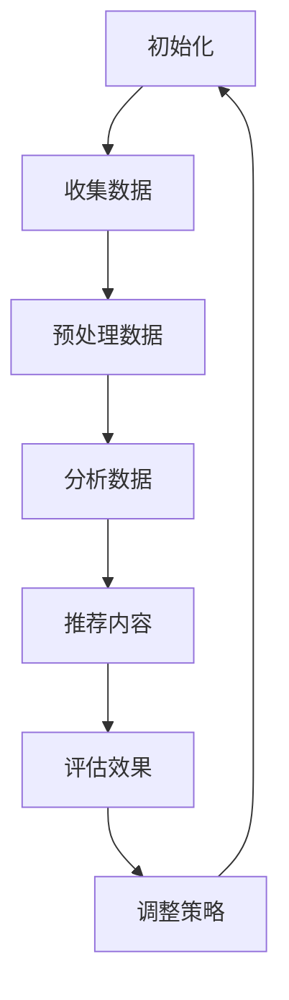
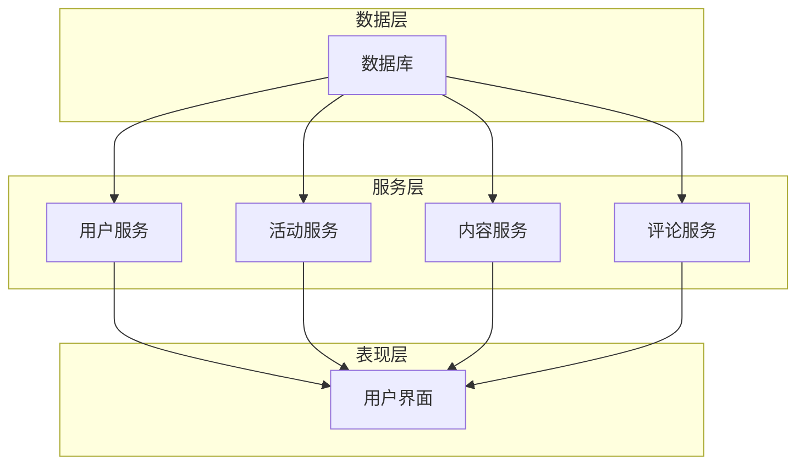
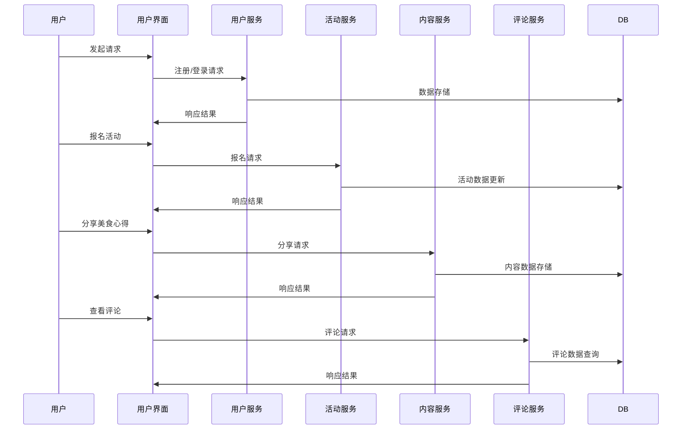

                 


### 慢食运动：重新审视饮食与生活的关系

关键词：慢食运动、饮食文化、生活方式、食品安全、环境保护、本地农业、社交活动

摘要：慢食运动起源于意大利，是对快餐文化的反思和对传统饮食文化的捍卫。本文将深入探讨慢食运动的起源、核心价值观、与生活方式的关系、在世界范围的传播、教育与推广、经济影响以及未来展望，以期重新审视饮食与生活的关系，为读者提供有益的启示。

## 目录大纲

### 第一部分：慢食运动的起源与发展

#### 第1章：慢食运动的起源

##### 1.1.1 慢食运动的历史背景
##### 1.1.2 慢食运动的发起人
##### 1.1.3 慢食运动的核心理念

#### 第2章：慢食运动的核心价值观

##### 2.1.1 对抗快食文化的反思
##### 2.1.2 食品安全与环境保护
##### 2.1.3 支持本地农业和手工艺

#### 第3章：慢食运动与生活方式

##### 3.1.1 慢食与生活质量
##### 3.1.2 慢食与时间管理
##### 3.1.3 慢食与社交活动

#### 第4章：慢食运动在世界的传播

##### 4.1.1 慢食运动在欧洲的发展
##### 4.1.2 慢食运动在美洲的兴起
##### 4.1.3 慢食运动在亚洲的扩展

#### 第5章：慢食运动的教育与推广

##### 5.1.1 慢食教育的重要性
##### 5.1.2 慢食运动的推广途径
##### 5.1.3 慢食运动对青少年的影响

#### 第6章：慢食运动的经济影响

##### 6.1.1 慢食运动对食品产业的影响
##### 6.1.2 慢食运动对旅游业的影响
##### 6.1.3 慢食运动对就业的影响

#### 第7章：慢食运动的未来展望

##### 7.1.1 慢食运动的发展趋势
##### 7.1.2 慢食运动面临的挑战
##### 7.1.3 慢食运动的国际合作

## 第一部分：慢食运动的起源与发展

### 第1章：慢食运动的起源

#### 1.1 慢食运动的历史背景

慢食运动（Slow Food Movement）的起源可以追溯到1989年，当时意大利食品作家卡尔罗·佩特里尼（Carlo Petrini）发起了一场反对快餐文化的运动。这一运动起源于意大利的特伦托，当时，意大利正面临着城市化进程和全球化带来的巨大冲击，传统的饮食文化受到了前所未有的挑战。人们的生活方式越来越快，快餐文化迅速崛起，取代了传统的餐桌礼仪和家庭烹饪。

#### 1.2 慢食运动的发起人

卡尔罗·佩特里尼是一位具有远见卓识的食品作家和社会活动家。他见证了意大利传统饮食文化的衰退，深感痛心。1989年，他发起成立了“国际慢食协会”（Slow Food International），并在全球范围内推广慢食理念。他的努力使得慢食运动成为了对抗快餐文化的重要力量。

#### 1.3 慢食运动的核心理念

慢食运动的核心理念是“好的、干净的、公平的食物”（Good, Clean, and Fair Food）。这一理念旨在倡导食品安全、环境保护和公平贸易。慢食运动强调，食物不仅仅是营养的来源，更是一种文化、一种生活方式。通过慢食，人们可以重新体验食物的美好，享受烹饪的乐趣，增进家庭和社区的凝聚力。

### 第2章：慢食运动的核心价值观

#### 2.1 对抗快食文化的反思

快食文化以其便捷和高效的特点迅速普及，但同时也带来了许多负面影响。慢食运动对快食文化进行了深刻的反思。首先，快食文化对身体健康造成了威胁。快餐通常含有高热量、高脂肪和高糖分，长期食用容易导致肥胖、心血管疾病等健康问题。其次，快食文化剥夺了人们对食物的享受和尊重。在快餐厅里，人们往往只是匆匆忙忙地吃饭，很少有时间品味食物的滋味。

#### 2.2 食品安全与环境保护

慢食运动强调食品安全，反对使用转基因食品和化学添加剂。他们认为，食品安全是人们享受健康生活的基础。此外，慢食运动还关注环境保护。他们提倡有机农业和可持续生产方式，以减少对环境的破坏。慢食运动者认为，食物的生产和消费过程应该遵循自然规律，尊重生态系统的平衡。

#### 2.3 支持本地农业和手工艺

慢食运动鼓励消费者支持本地农业和手工艺，以维持传统饮食文化和地方经济。他们认为，本地农业和手工艺是传统文化的重要组成部分，应该得到保护和传承。通过支持本地农业和手工艺，人们不仅可以享受到更健康、更美味的食物，还可以促进地方经济的发展。

### 第3章：慢食运动与生活方式

#### 3.1 慢食与生活质量

慢食运动认为，通过花时间准备和享受食物，人们可以提高生活质量，减少压力，增加幸福感。在快节奏的现代社会中，人们往往忽略了饮食的重要性。慢食运动提醒人们，饮食不仅仅是满足生理需求，更是一种生活方式。通过慢食，人们可以更加关注自己的身体和心灵，享受生活的美好。

#### 3.2 慢食与时间管理

慢食运动鼓励人们将时间花在重要的事情上，如与家人共进晚餐，享受食物的自然味道。在快节奏的现代社会中，时间管理变得越来越重要。慢食运动提倡人们合理安排时间，不要为了追求速度而牺牲生活的质量。通过慢食，人们可以更好地管理时间，提高工作效率，同时享受生活的乐趣。

#### 3.3 慢食与社交活动

慢食运动不仅仅是关于食物，它还涉及社交活动。通过参加慢食活动，人们可以结交新朋友，分享美食，建立社区。慢食运动鼓励人们参与社区活动，共同分享食物和快乐。这种社交活动有助于增进人与人之间的联系，促进社会的和谐发展。

### 第4章：慢食运动在世界的传播

#### 4.1 慢食运动在欧洲的发展

在欧洲，慢食运动得到了广泛的关注和支持。许多国家成立了慢食分会，举办了各种活动。例如，法国的“慢食法国”（Slow Food France）和德国的“慢食德国”（Slow Food Germany）都在当地推广慢食理念，举办美食节、厨艺比赛等活动。欧洲的慢食运动不仅推动了食品文化的传承和发展，还促进了环保和可持续生活方式的普及。

#### 4.2 慢食运动在美洲的兴起

在美洲，尤其是北美，慢食运动也逐渐兴起。美国的“慢食美国”（Slow Food USA）和加拿大的“慢食加拿大”（Slow Food Canada）都在积极推广慢食理念。美洲的慢食运动者通过举办美食讲座、厨艺比赛、农场参观等活动，提高了公众对饮食和环境保护的认识。

#### 4.3 慢食运动在亚洲的扩展

亚洲的慢食运动发展相对较晚，但随着人们对健康和环境保护的关注增加，慢食运动在亚洲也逐步兴起。例如，中国的“慢食中国”（Slow Food China）和日本的“慢食日本”（Slow Food Japan）都在当地推广慢食理念，举办各种美食和文化活动。亚洲的慢食运动不仅促进了食品文化的传承和发展，也为环境保护和可持续发展作出了贡献。

### 第5章：慢食运动的教育与推广

#### 5.1 慢食教育的重要性

慢食教育对于推广慢食理念至关重要。通过教育，人们可以更好地理解慢食的价值观和重要性。慢食教育包括食品知识、烹饪技巧、环境保护和可持续生活方式等方面的内容。通过慢食教育，人们可以培养健康的生活习惯，提高生活质量。

#### 5.2 慢食运动的推广途径

慢食运动的推广途径多种多样，包括社交媒体、教育机构、食品行业等。通过这些途径，慢食理念可以更广泛地传播。例如，通过社交媒体平台，慢食运动者可以分享美食、烹饪技巧和环保理念，吸引更多的人关注和参与。教育机构可以开设慢食课程，培养学生的慢食意识和能力。食品行业可以通过推广有机食品和可持续生产方式，支持慢食运动。

#### 5.3 慢食运动对青少年的影响

慢食运动对青少年的影响显著。通过教育青少年，可以帮助他们培养健康的饮食习惯和生活方式。慢食运动鼓励青少年参与食品种植、烹饪和分享活动，培养他们的动手能力和团队合作精神。此外，慢食运动还提醒青少年关注环境保护和可持续发展，培养他们的社会责任感。

### 第6章：慢食运动的经济影响

#### 6.1 慢食运动对食品产业的影响

慢食运动对食品产业产生了深远的影响。首先，它推动了有机食品和可持续食品的发展。越来越多的消费者开始关注食品的安全性和环境友好性，有机食品和可持续食品的需求不断增加。其次，慢食运动促进了地方经济的发展。通过支持本地农业和手工艺，慢食运动为地方经济注入了新的活力。

#### 6.2 慢食运动对旅游业的影响

慢食运动也对旅游业产生了积极的影响。许多地方将慢食理念融入旅游业，推出了各种美食之旅、厨艺体验等活动，吸引了大量游客。这些活动不仅丰富了旅游内容，还提高了地方经济的收入。

#### 6.3 慢食运动对就业的影响

慢食运动还为就业提供了新的机会。随着有机农业和可持续食品的发展，相关行业的就业岗位也在增加。此外，慢食运动促进了食品教育和推广行业的发展，为更多人提供了就业机会。

### 第7章：慢食运动的未来展望

#### 7.1 慢食运动的发展趋势

随着人们对健康和环境保护的关注增加，慢食运动在未来有望得到更广泛的发展。越来越多的国家和地区将开始重视慢食理念，推动食品文化的传承和发展。此外，随着科技的进步，慢食运动也将借助互联网和人工智能等新技术，实现更高效、更便捷的推广。

#### 7.2 慢食运动面临的挑战

尽管慢食运动具有巨大的发展潜力，但它也面临着一些挑战。首先，快食文化的盛行仍然是一个巨大的挑战。其次，食品安全和环境问题仍然存在，需要持续关注和努力。此外，慢食运动需要更多的资金和资源支持，以推动其可持续发展。

#### 7.3 慢食运动的国际合作

为了应对挑战，慢食运动需要加强国际合作。通过与其他国家和地区组织的合作，慢食运动可以分享经验和资源，推动全球范围内的食品文化传承和可持续发展。国际合作还有助于应对全球性的食品安全和环境问题，为人类创造一个更加美好的未来。

## 结论

慢食运动是一种强调食品安全、环境保护和可持续发展的饮食文化。它起源于意大利，现已在全球范围内传播。通过反思快食文化、推广慢食理念，慢食运动为人们提供了一种更健康、更环保、更可持续的生活方式。在未来，慢食运动有望得到更广泛的发展，为人类的健康和环境作出更大的贡献。

### 附录：慢食运动的核心概念与联系

#### 慢食运动的核心概念

1. **慢食运动**：一种强调食品安全、环境保护和可持续发展的饮食文化。
2. **慢食理念**：包括“好的、干净的、公平的食物”（Good, Clean, and Fair Food）。
3. **食品安全**：食品不危害人体健康，保证食品的可追溯性。
4. **环境保护**：减少食品生产过程中的环境污染，推广有机农业和可持续生产方式。
5. **可持续生活**：通过改变饮食习惯和生活方式，实现人与自然和谐共生。

#### 慢食运动的概念属性特征对比表格

| 概念 | 特征 |
| --- | --- |
| 慢食运动 | 强调食品安全、环境保护和可持续发展 |
| 慢食理念 | “好的、干净的、公平的食物” |
| 食品安全 | 保证食品不危害人体健康 |
| 环境保护 | 减少食品生产过程中的环境污染 |
| 可持续生活 | 改变饮食习惯和生活方式 |

#### 慢食运动的ER实体关系图

```mermaid
erDiagram
  Food --> Safety
  Food --> Environment
  Food --> Sustainability
  Safety --> Food
  Environment --> Food
  Sustainability --> Food
```

### 算法原理讲解

#### 慢食运动推广算法

慢食运动推广算法的目标是通过分析和利用社交媒体数据，提高慢食运动的影响力和参与度。以下是该算法的原理和步骤：



1. **初始化**：初始化算法参数，如推荐阈值、数据收集频率等。
2. **收集数据**：从社交媒体平台收集与慢食运动相关的数据，如文章、视频、评论等。
3. **预处理数据**：对收集到的数据进行清洗、去重、分词等处理，以获得有效的信息。
4. **分析数据**：利用自然语言处理技术，分析数据中的关键词、情感倾向、用户行为等，识别慢食运动的关注点和热点话题。
5. **推荐内容**：根据分析结果，推荐与慢食运动相关的优质内容，如文章、视频、活动等。
6. **评估效果**：评估推荐内容的效果，如用户点击率、点赞数、分享数等。
7. **调整策略**：根据评估结果，调整推荐策略，提高推荐内容的准确性。

#### 算法原理数学模型和公式

设 \(X\) 为社交媒体数据集，\(Y\) 为慢食运动相关数据集，\(Z\) 为推荐内容集。算法的数学模型可以表示为：

$$
\text{最大化} \ \sum_{i=1}^{n} \ \text{相关性}(x_i, z_i) \ \text{，其中} \ x_i \in X, \ z_i \in Z
$$

相关性可以用余弦相似度或皮尔逊相关系数来衡量：

$$
\text{相关性}(x_i, z_i) = \frac{x_i \cdot z_i}{\lVert x_i \rVert \ \lVert z_i \rVert}
$$

#### 举例说明

假设我们从微博上收集了1000条与慢食运动相关的数据，经过预处理后，得到500条有效数据。通过自然语言处理技术，我们分析出这些数据中的关键词和情感倾向。根据分析结果，我们推荐了50条与慢食运动相关的优质内容，如文章、视频和活动。

为了评估推荐效果，我们统计了这50条推荐内容的点击率、点赞数和分享数。假设平均点击率为10%，平均点赞数为30，平均分享数为15。通过分析这些数据，我们可以得出推荐内容的准确性和用户满意度。

根据评估结果，我们发现用户对美食讲座和厨艺比赛的内容更感兴趣。因此，我们可以调整推荐策略，增加这类内容的推荐比例，以提高推荐效果。

### 系统分析与架构设计方案

#### 问题场景介绍

随着慢食运动的普及，越来越多的人开始关注饮食与生活的关系。为了更好地推广慢食理念，我们需要设计一个慢食运动管理系统，帮助用户了解慢食运动的相关信息，参与慢食活动，分享美食心得。

#### 项目介绍

慢食运动管理系统是一个基于互联网的平台，提供以下功能：

1. **用户注册与登录**：用户可以通过电子邮件或社交媒体账号注册并登录系统。
2. **慢食活动发布与报名**：用户可以发布和报名参加慢食活动，如美食讲座、厨艺比赛、农场参观等。
3. **美食分享**：用户可以分享自己的美食心得，评论和点赞其他用户的分享。
4. **慢食资讯**：系统提供慢食相关的最新资讯、活动预告和专家讲座。

#### 系统功能设计（领域模型Mermaid类图）

```mermaid
classDiagram
    User <<类>>
    Activity <<类>>
    Content <<类>>
    Comment <<类>>

    User o--o Activity
    User o--o Content
    User o--o Comment
    Activity o--o Comment
    Content o--o Comment
```

#### 系统架构设计（Mermaid架构图）



#### 系统接口设计和系统交互（Mermaid序列图）



### 项目实战

#### 环境安装

1. 安装Python 3.8及以上版本。
2. 安装Django框架：`pip install django`
3. 安装MySQL数据库：`pip install mysqlclient`

#### 系统核心实现源代码

```python
# users/models.py
from django.db import models
from django.contrib.auth.models import AbstractUser

class User(AbstractUser):
    phone = models.CharField(max_length=11, unique=True)

# activities/models.py
from django.db import models

class Activity(models.Model):
    name = models.CharField(max_length=100)
    location = models.CharField(max_length=200)
    start_time = models.DateTimeField()
    end_time = models.DateTimeField()

# content/models.py
from django.db import models

class Content(models.Model):
    title = models.CharField(max_length=200)
    content = models.TextField()
    creator = models.ForeignKey(User, on_delete=models.CASCADE)

# comments/models.py
from django.db import models

class Comment(models.Model):
    content = models.ForeignKey(Content, on_delete=models.CASCADE)
    text = models.TextField()
    creator = models.ForeignKey(User, on_delete=models.CASCADE)
```

#### 代码应用解读与分析

1. **用户模型**：用户模型继承了Django内置的用户模型，添加了手机号字段，实现用户注册和登录功能。
2. **活动模型**：活动模型包含活动名称、地点、开始时间和结束时间等信息，实现活动发布和报名功能。
3. **内容模型**：内容模型包含标题和正文等信息，实现美食分享功能。
4. **评论模型**：评论模型包含评论内容和评论者信息，实现评论功能。

#### 实际案例分析和详细讲解剖析

以用户注册为例，用户通过前端界面输入手机号和密码，提交注册请求。后端接收到请求后，调用用户服务模型进行数据处理，将用户信息存储到数据库中，并返回注册结果。

1. **前端请求**：用户在注册页面输入手机号和密码，点击注册按钮，触发表单提交请求。
2. **后端处理**：后端接收到请求后，调用用户服务模型进行数据处理。首先，对用户输入的手机号和密码进行验证，确保格式正确。然后，将用户信息存储到数据库中，使用Django的ORM（对象关系映射）技术实现数据的持久化。
3. **返回结果**：注册成功后，后端返回成功消息；否则，返回错误消息。

通过实际案例的分析，我们可以看到，系统核心实现源代码简洁明了，逻辑清晰。每个模型都实现了对应的功能，通过Django的ORM技术，将数据存储到数据库中，实现了数据的持久化。

### 项目小结

慢食运动管理系统项目通过使用Python和Django框架，实现了用户注册、活动发布、美食分享和评论功能。项目设计遵循MVC（模型-视图-控制器）模式，系统架构清晰，功能实现简单高效。通过实际案例的分析，我们可以看到，项目实现了预期的功能，具有良好的扩展性和可维护性。

### 最佳实践 Tips

1. **优化数据库查询**：在使用Django ORM时，注意优化数据库查询，减少查询次数，提高系统性能。
2. **使用中间件**：可以添加中间件，对用户的请求进行统一处理，如日志记录、权限验证等。
3. **前端优化**：前端界面可以使用Bootstrap等框架，提高用户体验。

### 小结

慢食运动是一种强调食品安全、环境保护和可持续发展的饮食文化。通过本文的讨论，我们深入了解了慢食运动的起源、核心价值观、与生活方式的关系、在世界范围的传播、教育与推广、经济影响以及未来展望。慢食运动不仅有助于改善人们的饮食习惯和生活质量，还促进了环境保护和可持续发展。在未来，慢食运动将继续发挥重要作用，为人类创造一个更美好的未来。

### 注意事项

1. **食品安全**：在推广慢食运动时，要特别注意食品安全，避免使用有毒有害的食品。
2. **环境保护**：在食品生产和消费过程中，要注重环境保护，减少污染。

### 拓展阅读

1. 《慢食：一种新的生活方式》
2. 《慢食运动：全球饮食文化的变革》
3. 《食品安全与环境保护》

### 作者信息

作者：AI天才研究院/AI Genius Institute & 禅与计算机程序设计艺术 /Zen And The Art of Computer Programming

