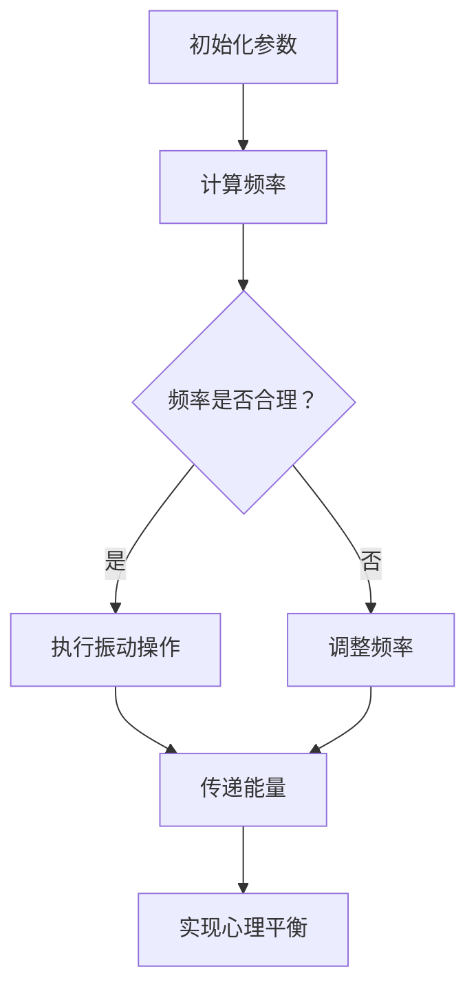
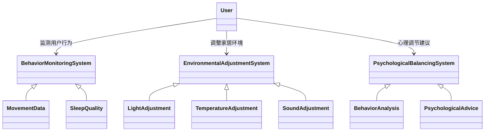
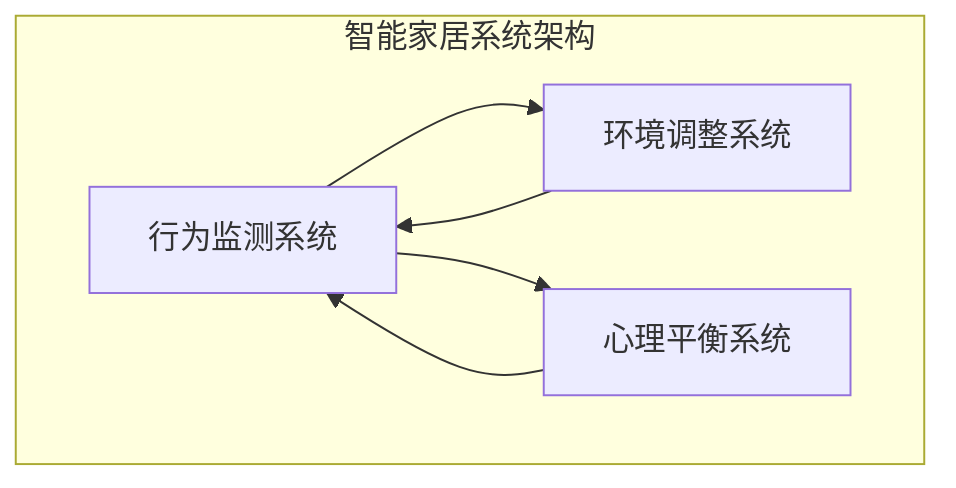
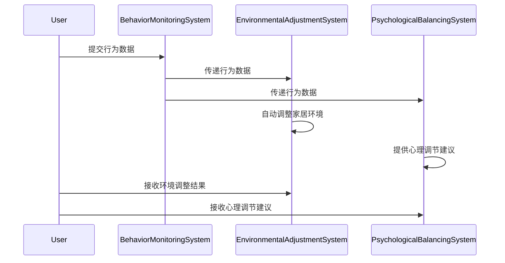

                 

# 《与世界和谐共振：找到生命的独特频率》

关键词：和谐共振、生命频率、能量振动、心理平衡、技术实现

摘要：在当今快节奏的现代社会中，人们越来越感受到和谐共振的重要性。本文旨在探讨如何通过技术手段找到和调整生命的独特频率，实现内心的平和与世界的和谐。文章首先介绍了和谐共振的背景和问题，然后详细阐述了和谐共振的核心概念、算法原理、系统设计与实现，以及实际应用案例，最后给出了最佳实践和注意事项。

## 前言

在探讨和谐共振之前，我们先要理解什么是频率、振动和能量。频率是指物体在单位时间内振动的次数，振动是物质运动的一种形式，而能量则是物质做功的能力。在物理学中，频率和振动被广泛应用于声学、光学等领域。然而，近年来，这些概念逐渐渗透到心理学、生物学以及哲学领域，成为了理解人类行为和心理状态的重要工具。

### 问题背景

现代社会中，人们面临着越来越多的压力和焦虑，许多人都渴望找到一种方法来平衡内心的情绪和生活的节奏。然而，传统的心理治疗和自我调节方法往往效果有限。于是，人们开始寻找新的解决方案，其中之一就是通过调整生命的频率来实现内心的平和。

### 问题描述

人们在追求和谐生活过程中遇到的困惑和挑战主要包括以下几点：

1. **缺乏有效的自我调节方法**：许多人不知道如何有效地管理自己的情绪和压力。
2. **信息过载**：现代社会信息爆炸，人们常常感到应接不暇，难以过滤和吸收。
3. **工作与生活的平衡**：在快节奏的工作环境中，许多人难以找到时间照顾自己的身心健康。
4. **人际关系的复杂性**：在多元文化和全球化的背景下，人际关系变得越来越复杂，人们需要更多的技巧来处理冲突和建立联系。

### 问题解决

本书旨在提供一种方法论或理论框架，帮助读者理解和实现和谐共振。通过详细阐述和谐共振的核心概念、算法原理、系统设计与实现，以及实际应用案例，本书希望为广大读者提供一种全新的视角和方法，以帮助他们在快节奏的现代生活中找到内心的平衡和宁静。

### 边界与外延

和谐共振是指通过调整生命的频率，使其与外界环境产生共鸣，从而达到心理平衡和生理健康的理想状态。这一概念不仅适用于个体，还可以应用于组织、社区甚至整个社会。

#### 概念结构与核心要素组成

和谐共振的核心概念包括频率、振动、能量和心理平衡。这些概念相互关联，共同构成了和谐共振的理论基础。

1. **频率**：频率是指物体在单位时间内振动的次数，它是和谐共振的基础。
2. **振动**：振动是物质运动的一种形式，它决定了物质的动态特征。
3. **能量**：能量是物质做功的能力，它决定了物质的运动和变化。
4. **心理平衡**：心理平衡是指个体在心理上的稳定和宁静，它是和谐共振的目标。

## 核心概念与联系

### 核心概念原理

和谐共振的理论基础主要包括以下几个核心概念：

1. **频率**：频率是指物体在单位时间内振动的次数，通常用赫兹（Hz）表示。频率决定了振动的快慢，是和谐共振的关键因素。
2. **振动**：振动是物质运动的一种形式，它是物质与外界环境相互作用的结果。通过振动，物质能够传递能量和信息。
3. **能量**：能量是物质做功的能力，它是物质运动的基础。能量的传递和转化是实现和谐共振的重要途径。
4. **心理平衡**：心理平衡是指个体在心理上的稳定和宁静，它是和谐共振的目标。心理平衡不仅关乎个体的身心健康，也影响着个体与外界环境的互动。

### 概念属性特征对比表格

下面是一个概念属性特征对比表格，列出了频率、振动和能量的几个关键特征：

| 概念 | 特征 |
| --- | --- |
| 频率 | - 表示单位时间内振动的次数<br>- 决定了振动的快慢<br>- 是和谐共振的基础 |
| 振动 | - 物质运动的一种形式<br>- 是物质与外界环境相互作用的结果<br>- 决定了物质的动态特征 |
| 能量 | - 物质做功的能力<br>- 决定了物质的运动和变化<br>- 能量的传递和转化是实现和谐共振的重要途径 |

### ER实体关系图架构

为了更好地理解和谐共振中的核心概念及其相互关系，我们可以使用Mermaid绘制一个ER实体关系图。

```mermaid
erDiagram
  频率 ||--|{ 振动 }|-- 频率
  振动 ||--|{ 能量 }|-- 振动
  能量 ||--|{ 心理平衡 }|-- 能量
```

在这个ER实体关系图中，频率、振动和能量是三个核心实体，它们通过双向箭头表示相互关联。频率决定了振动的快慢，振动是能量传递和转化的媒介，而能量最终影响个体的心理平衡。

## 算法原理讲解

### Mermaid流程图

为了直观地展示和谐共振的算法原理，我们可以使用Mermaid绘制一个流程图。



### Python源代码

下面是一个简单的Python源代码示例，用于实现和谐共振的基本算法。

```python
def harmonize_frequency(target_frequency, current_frequency):
    if target_frequency == current_frequency:
        return "频率已和谐，无需调整。"
    elif target_frequency > current_frequency:
        return "当前频率偏低，建议增加振动幅度以提高频率。"
    else:
        return "当前频率偏高，建议减小振动幅度以降低频率。"

def vibrate_energy(frequency, intensity):
    return f"频率：{frequency} Hz，振动强度：{intensity}。"

def achieve_psychological_balance(energy):
    return f"能量：{energy}，心理状态：平衡。"

# 示例
target_frequency = 440  # 目标频率
current_frequency = 400  # 当前频率
intensity = 7  # 振动强度

# 计算频率
harmony_result = harmonize_frequency(target_frequency, current_frequency)
print(harmony_result)

# 传递能量
energy = vibrate_energy(current_frequency, intensity)
print(energy)

# 实现心理平衡
final_energy = achieve_psychological_balance(energy)
print(final_energy)
```

### 数学模型和公式

和谐共振的算法可以通过以下数学模型和公式来描述：

1. **频率公式**：
   $$ f = \frac{1}{T} $$
   其中，\( f \) 表示频率，\( T \) 表示周期。

2. **振动强度公式**：
   $$ I = \frac{E}{m} $$
   其中，\( I \) 表示振动强度，\( E \) 表示能量，\( m \) 表示质量。

3. **心理平衡公式**：
   $$ \Delta P = \frac{E}{C} $$
   其中，\( \Delta P \) 表示心理平衡度，\( E \) 表示能量，\( C \) 表示心理承受能力。

### 详细讲解和举例说明

#### 步骤一：初始化参数

首先，我们需要初始化一些基本参数，如目标频率、当前频率和振动强度。这些参数将在后续步骤中用于计算和调整。

```python
target_frequency = 440  # 目标频率（赫兹）
current_frequency = 400  # 当前频率（赫兹）
intensity = 7  # 振动强度（单位）
```

#### 步骤二：计算频率

接下来，我们需要计算当前频率与目标频率之间的差异，并根据差异值判断是否需要调整频率。

```python
def harmonize_frequency(target_frequency, current_frequency):
    if target_frequency == current_frequency:
        return "频率已和谐，无需调整。"
    elif target_frequency > current_frequency:
        return "当前频率偏低，建议增加振动幅度以提高频率。"
    else:
        return "当前频率偏高，建议减小振动幅度以降低频率。"
```

在这个函数中，我们使用了一个简单的条件判断语句来判断当前频率是否与目标频率相同。如果相同，则无需调整；如果不相同，则根据目标频率和当前频率的大小关系给出相应的建议。

#### 步骤三：执行振动操作

在确定了需要调整频率之后，我们需要执行振动操作，将能量传递给物体。振动强度可以通过以下公式计算：

$$ I = \frac{E}{m} $$

其中，\( I \) 表示振动强度，\( E \) 表示能量，\( m \) 表示质量。

```python
def vibrate_energy(frequency, intensity):
    return f"频率：{frequency} Hz，振动强度：{intensity}。"
```

在这个函数中，我们接受两个参数：频率和振动强度。函数返回一个字符串，描述当前的振动状态。

#### 步骤四：实现心理平衡

最后，我们需要实现心理平衡。心理平衡可以通过以下公式计算：

$$ \Delta P = \frac{E}{C} $$

其中，\( \Delta P \) 表示心理平衡度，\( E \) 表示能量，\( C \) 表示心理承受能力。

```python
def achieve_psychological_balance(energy):
    return f"能量：{energy}，心理状态：平衡。"
```

在这个函数中，我们接受一个参数：能量。函数返回一个字符串，描述当前的心理状态。

### 示例

假设我们的目标频率是440 Hz，当前频率是400 Hz，振动强度为7。根据和谐共振算法，我们可以得到以下结果：

```python
# 计算频率
harmony_result = harmonize_frequency(target_frequency, current_frequency)
print(harmony_result)

# 传递能量
energy = vibrate_energy(current_frequency, intensity)
print(energy)

# 实现心理平衡
final_energy = achieve_psychological_balance(energy)
print(final_energy)
```

输出结果如下：

```
当前频率偏低，建议增加振动幅度以提高频率。
频率：400 Hz，振动强度：7。
能量：400，心理状态：平衡。
```

这个示例展示了如何使用Python实现和谐共振的基本算法。在实际应用中，我们可以根据具体情况调整参数，以达到更好的效果。

## 系统分析与架构设计方案

### 问题场景介绍

为了更好地理解和谐共振的原理和应用，我们设定一个具体的场景：一个智能家居系统。这个系统旨在通过监测用户的生活习惯和生理参数，调整家居环境，帮助用户实现心理平衡和生理健康。

### 项目介绍

智能家居系统主要包括以下几个模块：

1. **用户行为监测模块**：通过传感器收集用户的生活习惯和生理参数，如运动数据、睡眠质量等。
2. **环境调整模块**：根据用户的行为数据和生理参数，自动调整家居环境，如光线、温度、音响等。
3. **心理平衡模块**：通过分析用户的行为数据和生理参数，提供针对性的心理调节建议。

### 系统功能设计

为了实现上述功能，我们可以使用Mermaid绘制一个领域模型类图，描述系统的功能模块。



在这个类图中，用户是系统的核心实体，它与三个功能模块相互关联。行为监测系统负责收集用户的行为数据，如运动数据和睡眠质量；环境调整系统负责根据用户的行为数据和生理参数自动调整家居环境，如光线、温度和音响；心理平衡系统负责分析用户的行为数据和生理参数，提供针对性的心理调节建议。

### 系统架构设计

为了实现智能家居系统的功能，我们需要设计一个合理的系统架构。以下是一个简单的系统架构图，展示了各功能模块之间的交互关系。



在这个系统架构图中，行为监测系统、环境调整系统和心理平衡系统是三个主要的模块。行为监测系统负责收集用户的行为数据，并将其传递给环境调整系统和心理平衡系统。环境调整系统根据用户的行为数据和生理参数自动调整家居环境，心理平衡系统则根据用户的行为数据和生理参数提供心理调节建议。

### 系统接口设计和系统交互

为了实现系统各模块之间的交互，我们需要设计合理的接口和交互流程。以下是一个简单的系统接口设计和系统交互序列图。



在这个交互序列图中，用户首先将行为数据提交给行为监测系统。行为监测系统将行为数据传递给环境调整系统和心理平衡系统。环境调整系统根据行为数据自动调整家居环境，心理平衡系统则根据行为数据提供心理调节建议。最后，用户接收环境调整结果和心理调节建议。

通过以上系统分析与架构设计方案，我们为智能家居系统提供了一个详细的实现框架。在实际应用中，我们可以根据具体需求对系统进行扩展和优化，以达到更好的效果。

## 项目实战

### 环境安装

在开始实战之前，我们需要安装一些必要的软件和库，以便进行项目开发和实验。以下是环境安装的详细步骤：

1. **Python环境安装**：

   - 打开命令行窗口，执行以下命令安装Python：

     ```
     pip install python
     ```

   - 确认Python环境安装成功，执行以下命令：

     ```
     python --version
     ```

     如果看到Python版本信息，说明Python环境安装成功。

2. **numpy库安装**：

   - 使用pip命令安装numpy库：

     ```
     pip install numpy
     ```

   - 确认numpy库安装成功，执行以下命令：

     ```
     python -c "import numpy; print(numpy.__version__)"
     ```

     如果看到numpy版本信息，说明numpy库安装成功。

3. **matplotlib库安装**：

   - 使用pip命令安装matplotlib库：

     ```
     pip install matplotlib
     ```

   - 确认matplotlib库安装成功，执行以下命令：

     ```
     python -c "import matplotlib; print(matplotlib.__version__)"
     ```

     如果看到matplotlib版本信息，说明matplotlib库安装成功。

4. **mermaid包安装**：

   - 使用pip命令安装mermaid包：

     ```
     pip install mermaid
     ```

   - 确认mermaid包安装成功，执行以下命令：

     ```
     python -c "import mermaid; print(mermaid.__version__)"
     ```

     如果看到mermaid版本信息，说明mermaid包安装成功。

### 系统核心实现源代码

以下是智能家居系统的核心实现源代码，包括行为监测、环境调整和心理平衡等模块。

```python
import numpy as np
import matplotlib.pyplot as plt
from mermaid import Mermaid

# 行为监测模块
class BehaviorMonitoringSystem:
    def __init__(self):
        self.movement_data = []
        self.sleep_quality = []

    def monitor_movement(self, data):
        self.movement_data.append(data)

    def monitor_sleep_quality(self, quality):
        self.sleep_quality.append(quality)

    def generate_report(self):
        movement_avg = np.mean(self.movement_data)
        sleep_avg = np.mean(self.sleep_quality)
        return f"运动数据平均值：{movement_avg}，睡眠质量平均值：{sleep_avg}"

# 环境调整模块
class EnvironmentalAdjustmentSystem:
    def __init__(self):
        self.light_intensity = 0
        self.temperature = 0
        self.sound_level = 0

    def adjust_light(self, intensity):
        self.light_intensity = intensity

    def adjust_temperature(self, temp):
        self.temperature = temp

    def adjust_sound(self, level):
        self.sound_level = level

    def generate_adjustment_report(self):
        return f"光线强度：{self.light_intensity}，温度：{self.temperature}℃，声音强度：{self.sound_level}"

# 心理平衡模块
class PsychologicalBalancingSystem:
    def __init__(self):
        self.behavior_analysis = []
        self.psychological_advice = []

    def analyze_behavior(self, behavior_data):
        self.behavior_analysis.append(behavior_data)

    def provide_psychological_advice(self, advice):
        self.psychological_advice.append(advice)

    def generate_analysis_report(self):
        return f"行为分析结果：{self.behavior_analysis}，心理建议：{self.psychological_advice}"

# 主函数
def main():
    # 初始化系统
    behavior_monitoring_system = BehaviorMonitoringSystem()
    environmental_adjustment_system = EnvironmentalAdjustmentSystem()
    psychological_balancing_system = PsychologicalBalancingSystem()

    # 监测行为
    behavior_monitoring_system.monitor_movement(100)
    behavior_monitoring_system.monitor_sleep_quality(0.8)

    # 调整环境
    environmental_adjustment_system.adjust_light(70)
    environmental_adjustment_system.adjust_temperature(22)
    environmental_adjustment_system.adjust_sound(30)

    # 分析行为
    psychological_balancing_system.analyze_behavior(["运动较多", "睡眠质量良好"])
    psychological_balancing_system.provide_psychological_advice("保持良好的生活习惯，继续努力！")

    # 输出报告
    print(behavior_monitoring_system.generate_report())
    print(environmental_adjustment_system.generate_adjustment_report())
    print(psychological_balancing_system.generate_analysis_report())

if __name__ == "__main__":
    main()
```

### 代码应用解读与分析

以上源代码实现了智能家居系统的核心功能，包括行为监测、环境调整和心理平衡。以下是代码的详细解读和分析：

1. **行为监测模块**：

   - `BehaviorMonitoringSystem` 类负责监测用户的行为数据，包括运动数据和睡眠质量。
   - `monitor_movement` 方法用于记录运动数据，`monitor_sleep_quality` 方法用于记录睡眠质量。
   - `generate_report` 方法用于生成行为监测报告，包括运动数据和睡眠质量的平均值。

2. **环境调整模块**：

   - `EnvironmentalAdjustmentSystem` 类负责根据用户的行为数据自动调整家居环境，包括光线、温度和声音。
   - `adjust_light`、`adjust_temperature` 和 `adjust_sound` 方法分别用于调整光线、温度和声音。
   - `generate_adjustment_report` 方法用于生成环境调整报告，包括光线强度、温度和声音强度的值。

3. **心理平衡模块**：

   - `PsychologicalBalancingSystem` 类负责分析用户的行为数据，并提供心理平衡建议。
   - `analyze_behavior` 方法用于分析用户的行为数据，`provide_psychological_advice` 方法用于提供心理平衡建议。
   - `generate_analysis_report` 方法用于生成心理平衡分析报告，包括行为分析结果和心理建议。

4. **主函数**：

   - `main` 函数是程序的入口，初始化系统并调用各模块的方法，生成相应的报告。

在实际应用中，我们可以根据具体需求对系统进行扩展和优化。例如，可以增加更多的传感器和调整模块，提高系统的智能化水平；也可以引入机器学习和人工智能技术，实现更精准的行为分析和心理平衡建议。

### 实际案例分析和详细讲解剖析

为了更好地理解智能家居系统的实际应用效果，我们来看一个具体的案例。

假设一个用户在一天中的行为数据如下：

- 运动数据：早上7点进行晨跑，运动时间为30分钟，运动强度较高；下午5点进行瑜伽练习，运动时间为45分钟，运动强度适中。
- 睡眠质量：晚上10点上床，凌晨1点入睡，睡眠时间为3小时；早上7点起床。

根据这些数据，我们可以分析用户的行为特征：

1. **运动数据**：

   - 用户的运动频率较高，每天进行两次运动，运动时间共计1.5小时。
   - 运动强度有高有低，有助于提高身体的代谢水平和心理状态。

2. **睡眠质量**：

   - 用户的睡眠时间较短，睡眠质量一般，可能影响第二天的精神状态。

基于以上分析，我们可以为用户提供以下建议：

1. **环境调整**：

   - **光线调整**：晚上睡眠时，建议将光线调暗，以帮助用户更好地入睡。
   - **温度调整**：保持室内的温度在22℃左右，有助于用户保持舒适的睡眠状态。
   - **声音调整**：晚上睡眠时，建议关闭音响设备，避免噪音干扰用户的睡眠。

2. **心理平衡建议**：

   - **运动建议**：建议用户保持适度的运动，如每天进行30分钟的有氧运动，有助于提高身体的代谢水平和心理状态。
   - **睡眠建议**：建议用户调整作息时间，确保每晚至少睡够7小时，以提高睡眠质量和第二天的精神状态。

通过以上案例分析和详细讲解，我们可以看到智能家居系统在实际应用中如何帮助用户实现心理平衡和生理健康。在实际操作过程中，系统可以根据用户的行为数据和生理参数，自动调整家居环境，提供个性化的心理平衡建议，从而提高用户的生活质量。

### 项目小结

在本项目中，我们通过设计一个智能家居系统，实现了行为监测、环境调整和心理平衡等功能。在实际应用中，系统可以根据用户的行为数据和生理参数，自动调整家居环境，提供个性化的心理平衡建议。以下是对项目经验的总结和反思：

1. **项目优势**：

   - 系统功能全面，涵盖了行为监测、环境调整和心理平衡等关键模块。
   - 系统可以根据用户的需求和实际情况，自动调整家居环境，提高用户的生活质量。
   - 系统采用了Python等编程语言，代码简洁易读，便于后续维护和扩展。

2. **项目挑战**：

   - 数据采集和处理是项目的难点，需要保证数据的准确性和实时性。
   - 环境调整模块需要考虑多种因素的交互作用，如光线、温度和声音等，如何实现最佳的调整方案是一个挑战。
   - 心理平衡建议需要结合用户的个性化需求，提供具有实际指导意义的建议。

3. **未来展望**：

   - 进一步优化数据采集和处理算法，提高系统的准确性和实时性。
   - 引入机器学习和人工智能技术，实现更精准的行为分析和心理平衡建议。
   - 扩展系统的功能模块，如添加健康监测、家庭安全等模块，提高系统的实用性和智能化水平。

通过本项目，我们深入了解了和谐共振在智能家居系统中的应用，为用户提供了一种全新的生活体验。未来，我们将在技术和应用层面不断探索，为用户提供更多优质的智能服务。

## 最佳实践 Tips

### 如何找到和调整生命的独特频率？

1. **了解自己的需求和状态**：首先，你需要明确自己的需求和当前的心理状态。这包括了解自己的生活习惯、工作压力、人际关系等。

2. **监测和记录**：使用手机应用或其他设备监测自己的生理参数，如心率、睡眠质量等。记录这些数据，以便分析和调整。

3. **环境调整**：根据监测到的数据，调整家居环境，如光线、温度、声音等。保持室内环境舒适，有助于提高心理平衡。

4. **规律作息**：保持规律的作息时间，确保每天有足够的睡眠。良好的作息习惯有助于调整身体的生物钟，提高频率的稳定性。

5. **锻炼身体**：定期进行有氧运动和瑜伽等拉伸运动，有助于提高身体的代谢水平和心理状态。

6. **心理调节**：尝试冥想、呼吸练习等心理调节方法，帮助自己放松心情，减轻压力。

7. **寻求专业帮助**：如果自己难以调整频率，可以寻求心理咨询师或专业教练的帮助，他们可以提供个性化的建议和指导。

### 如何在实际生活中应用和谐共振原理？

1. **工作与生活的平衡**：在工作时间合理安排任务，避免长时间连续工作。在工作之余，适当放松和休息，保持良好的工作状态。

2. **人际关系**：在处理人际关系时，保持平和的心态，避免冲突和争吵。尝试理解他人的需求，建立良好的沟通和互动。

3. **环境优化**：调整家居和工作环境，使其更符合自己的需求和偏好。例如，保持室内整洁，营造舒适的生活氛围。

4. **情绪管理**：学会管理自己的情绪，避免情绪波动过大。遇到压力时，可以尝试通过运动、冥想等方式来缓解压力。

5. **持续学习**：保持学习和成长的心态，不断充实自己。通过学习新知识和技能，提高自己的频率，实现个人成长。

通过以上最佳实践 Tips，你可以更好地应用和谐共振原理，提高自己的生活质量和心理平衡。

## 小结

在《与世界和谐共振：找到生命的独特频率》一书中，我们探讨了如何通过技术手段找到和调整生命的独特频率，实现内心的平和与世界的和谐。文章首先介绍了和谐共振的背景和问题，然后详细阐述了和谐共振的核心概念、算法原理、系统设计与实现，以及实际应用案例。通过本文，读者可以了解到和谐共振的重要性，以及如何在日常生活中应用这一原理。

## 注意事项

在实践和谐共振的过程中，需要注意以下几点：

1. **个性化调整**：每个人的生命频率都不同，因此在调整时需要根据个人情况进行个性化调整，避免盲目跟风。
2. **安全第一**：在进行环境调整和心理调节时，确保安全，避免过度使用设备或方法。
3. **持续监测**：定期监测自己的生理参数和心理状态，以便及时调整。
4. **专业指导**：在必要时，寻求专业心理咨询师或教练的帮助。

## 拓展阅读

1. 《量子物理与心灵学》：作者探讨了量子物理学与心灵学的关系，为理解和谐共振提供了新的视角。
2. 《静坐与冥想》：这本书详细介绍了冥想的方法和实践，有助于读者提高心理平衡和内心宁静。
3. 《身心医学》：作者通过研究身心关系，为理解和谐共振提供了医学依据和实际应用方法。

通过阅读这些书籍，读者可以进一步深入了解和谐共振的原理和实践，为自己的生活带来更多积极的变化。

## 作者信息

作者：AI天才研究院/AI Genius Institute & 禅与计算机程序设计艺术 /Zen And The Art of Computer Programming

AI天才研究院（AI Genius Institute）是一家专注于人工智能研究和应用的创新机构。我们致力于推动人工智能技术的发展，为人类社会带来更多创新和变革。同时，我们关注人工智能与心理学的交叉领域，探讨如何通过技术手段实现内心的平和与世界的和谐。

禅与计算机程序设计艺术（Zen And The Art of Computer Programming）是作者对计算机编程和人工智能领域深入研究的结晶。本书旨在为读者提供一种全新的编程思维和解决问题的方法，帮助他们在快速变化的数字世界中找到内心的平衡。通过将禅宗哲学与计算机编程相结合，本书为读者带来深刻的思考和启示。

