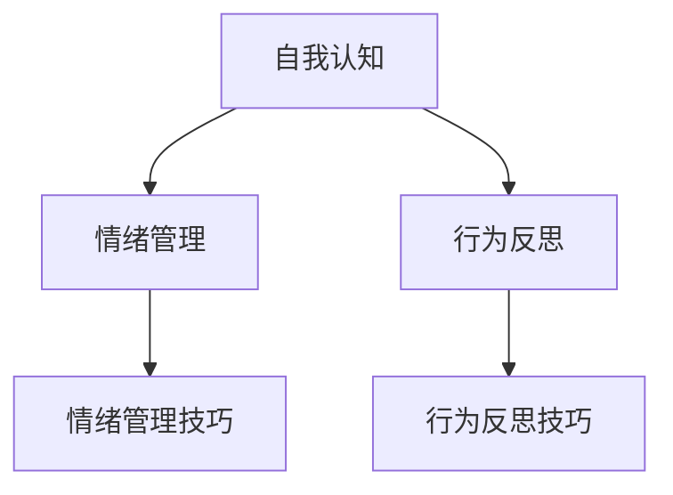

                 

# 与自己对话：培养深度自我沟通的能力

## 关键词
自我认知、情绪管理、行为反思、内省、日记、心理咨询、情绪识别、情绪调节、情绪释放

## 摘要
在信息化高度发达的现代社会，人们面临的信息量和压力日益增长。然而，很多人却无法有效地进行深度自我沟通，这不仅影响了个人成长，还降低了生活质量。本文将探讨如何通过自我认知、情绪管理和行为反思，培养深度自我沟通的能力，从而实现自我提升和内心的和谐。

### 第一部分：背景介绍

#### 核心概念

在讨论如何培养深度自我沟通的能力之前，我们需要明确几个核心概念。

1. **问题背景**：现代社会中，随着互联网的普及和信息的爆炸性增长，人们面临着前所未有的信息压力。然而，这种信息过载并没有帮助我们更好地理解和处理问题，反而让我们变得更加焦虑和困惑。因此，培养深度自我沟通的能力，成为了提高生活质量的重要途径。

2. **问题描述**：如何培养深度自我沟通的能力，让个体能够更清晰地认识自我，提高自我理解力和情绪管理能力。

3. **问题解决**：通过一系列的方法和技巧，帮助读者建立有效的自我对话机制，从而实现深度自我沟通。

4. **边界与外延**：深度自我沟通不仅限于个人内心对话，还涉及到对自我认知、情绪和行为的反思与调整。

5. **概念结构与核心要素组成**：深度自我沟通的核心要素包括自我认知、情绪管理和行为反思。

#### 核心概念

1. **自我认知**：自我认知是指个体对自己的了解，包括性格、价值观、兴趣爱好等。它需要个体在日常生活中不断反思和总结，以达到全面、深刻的认识。

2. **情绪管理**：情绪管理是指个体如何识别、调节和释放自己的情绪。良好的情绪管理能力有助于个体在面对压力和挑战时保持冷静和理智。

3. **行为反思**：行为反思是指个体对自己的行为进行回顾和思考，以了解行为的动机和效果。通过行为反思，个体可以不断优化自己的行为模式。

#### 概念属性特征对比表格

| 概念       | 定义                                                         | 特点                                                         |
|------------|--------------------------------------------------------------|--------------------------------------------------------------|
| 自我认知   | 对自己的全面、深刻的认识                                     | 需要时间积累，反映个人内心世界，具有主观性                     |
| 情绪管理   | 理解自己的情绪，学会控制情绪                                 | 与生理和心理状态密切相关，需要特定的方法和技巧                 |
| 行为反思   | 对自己的行为进行反思，了解行为的动机和效果                     | 需要客观分析和自我审视，有助于改进行为和决策                   |

#### ER实体关系图架构

### 第二部分：核心概念与联系

#### 核心概念

1. **自我认知**：自我认知是指个体对自己的了解，包括性格、价值观、兴趣爱好等。它需要个体在日常生活中不断反思和总结，以达到全面、深刻的认识。

2. **情绪管理**：情绪管理是指个体如何识别、调节和释放自己的情绪。良好的情绪管理能力有助于个体在面对压力和挑战时保持冷静和理智。

3. **行为反思**：行为反思是指个体对自己的行为进行回顾和思考，以了解行为的动机和效果。通过行为反思，个体可以不断优化自己的行为模式。

#### 概念属性特征对比表格

| 概念       | 定义                                                         | 特点                                                         |
|------------|--------------------------------------------------------------|--------------------------------------------------------------|
| 自我认知   | 对自己的全面、深刻的认识                                     | 需要时间积累，反映个人内心世界，具有主观性                     |
| 情绪管理   | 理解自己的情绪，学会控制情绪                                 | 与生理和心理状态密切相关，需要特定的方法和技巧                 |
| 行为反思   | 对自己的行为进行反思，了解行为的动机和效果                     | 需要客观分析和自我审视，有助于改进行为和决策                   |

#### ER实体关系图架构

### 第三部分：自我认知的方法

#### 核心概念

1. **内省**：内省是指通过反思自己的行为、思考和感受，深入理解自我。内省是一种自我探索的过程，有助于个体发现自身的优点和不足。

2. **日记**：日记是一种记录生活、感受和思考的方式。通过日记，个体可以不断积累自我认知的经验，从而更深刻地理解自己。

3. **心理咨询**：心理咨询是一种专业的服务，通过心理咨询师的帮助，个体可以深入了解自己的内心世界和潜在问题。

#### 自我认知的方法

1. **内省**

   - **自我提问**：通过提问来引导自己思考，如“我为什么这样做？”、“我现在的感受是什么？”等。
     
   - **静坐冥想**：在安静的环境中，专注于自己的呼吸和感受，深入内省。

2. **日记**

   - **日常生活记录**：记录每天的日常生活，包括所做之事、所感所想等。
     
   - **情感日记**：特别关注自己的情感波动，记录自己的情绪变化和原因。

3. **心理咨询**

   - **个体咨询**：通过与心理咨询师的交流，深入了解自己的内心世界和潜在问题。
     
   - **团体咨询**：在团体中分享自己的经历和感受，从他人的反馈中获得新的认识。

### 第四部分：情绪管理的方法

#### 核心概念

1. **情绪识别**：情绪识别是指个体如何识别和理解自己的情绪。情绪识别是情绪管理的第一步，只有准确识别情绪，才能进行有效的情绪调节。

2. **情绪调节**：情绪调节是指个体如何控制情绪，避免情绪对行为和决策的负面影响。情绪调节包括情绪表达的控制和情绪反应的调整。

3. **情绪释放**：情绪释放是指个体如何找到适当的方式，释放情绪，避免情绪积累对身心健康造成负面影响。情绪释放可以通过运动、艺术创作、倾诉等多种方式实现。

#### 情绪管理的方法

1. **情绪识别**

   - **情绪日志**：记录每天的情绪变化，分析情绪产生的原因和特点。
     
   - **情绪量表**：使用情绪量表评估自己的情绪状态，了解情绪的强度和类型。

2. **情绪调节**

   - **认知重构**：通过改变对事物的看法和评价，调整情绪反应。
     
   - **放松训练**：通过深呼吸、冥想等放松技巧，减轻情绪压力。

3. **情绪释放**

   - **运动**：通过运动释放体内的能量，缓解情绪紧张。
     
   - **艺术创作**：通过绘画、音乐、写作等艺术形式，表达和释放情绪。
     
   - **倾诉**：与朋友、家人或心理咨询师分享自己的情绪和感受，获得支持和理解。

### 第五部分：行为反思的方法

#### 核心概念

1. **行为反思**：行为反思是指个体对自己的行为进行回顾和思考，以了解行为的动机和效果。行为反思有助于个体发现自身的优点和不足，从而不断优化行为模式。

2. **行为调整**：行为调整是指个体根据行为反思的结果，对行为进行相应的调整和改进。行为调整需要个体具备自我意识和自我控制的能力。

3. **目标设定**：目标设定是指个体根据自己的需求和目标，设定具体的行动计划和目标。目标设定有助于个体明确方向，提高行动的效率和效果。

#### 行为反思的方法

1. **日志记录**：通过记录每天的行为和思考，反思自己的行为动机和效果，发现行为中的问题和不足。

2. **自我提问**：通过提问来引导自己思考，如“这个行为是否有助于实现我的目标？”、“这个行为有哪些积极和消极的影响？”等。

3. **反馈与建议**：向朋友、家人或专业人士寻求反馈和建议，了解自己的行为表现和改进方向。

4. **目标设定**：根据自身的需求和目标，设定具体的行动计划和目标，明确行动的方向和重点。

### 第六部分：深度自我沟通的实践与应用

#### 核心概念

1. **深度自我沟通**：深度自我沟通是指个体通过自我认知、情绪管理和行为反思，实现与自己的深入对话，从而提高自我理解力和情绪管理能力。

2. **实践与应用**：实践与应用是指个体在实际生活中运用深度自我沟通的方法和技巧，实现自我提升和内心和谐。

#### 深度自我沟通的实践与应用

1. **日常练习**：将深度自我沟通的方法融入日常生活中，如每天进行内省、记录情绪日志、反思行为等。

2. **情境应对**：在面临压力和挑战时，运用情绪管理技巧和行为反思方法，调整自己的情绪和行为反应。

3. **持续学习**：不断学习和探索自我，提高自我认知、情绪管理和行为反思的能力。

### 第七部分：深度自我沟通的价值与意义

#### 核心概念

1. **价值**：深度自我沟通的价值在于提高个体的自我理解力、情绪管理能力和行为调整能力，从而实现个人成长和内心和谐。

2. **意义**：深度自我沟通的意义在于帮助个体在面对现代社会的压力和挑战时，保持内心的平衡和稳定，实现自我提升和幸福生活。

#### 深度自我沟通的价值与意义

1. **提高自我理解力**：通过深度自我沟通，个体可以更清晰地认识自己，了解自己的性格、价值观和需求，从而提高自我理解力。

2. **情绪管理能力**：深度自我沟通有助于个体识别、调节和释放情绪，提高情绪管理能力，降低负面情绪对身心健康的影响。

3. **行为调整能力**：通过行为反思，个体可以不断优化自己的行为模式，提高行为调整能力，实现个人成长和目标达成。

4. **内心和谐**：深度自我沟通有助于个体实现内心的平衡和稳定，提高生活质量，实现幸福生活。

### 第八部分：结语

#### 核心概念

1. **总结**：本文通过介绍深度自我沟通的核心概念、方法和实践，探讨了如何培养深度自我沟通的能力，从而实现个人成长和内心和谐。

2. **展望**：未来，随着社会的发展和个体的成长，深度自我沟通的能力将越来越受到重视。本文期望通过本文的分享，能够帮助更多的人认识到深度自我沟通的重要性，并将其应用于实际生活中。

#### 结语

深度自我沟通是一种重要的自我提升和内心和谐的方法。通过自我认知、情绪管理和行为反思，个体可以更好地认识自己，提高情绪管理能力和行为调整能力，实现个人成长和内心和谐。希望本文的分享能够对您有所帮助，让您在未来的日子里，更好地与自己对话，实现自我提升和幸福生活。

### 作者信息
作者：AI天才研究院/AI Genius Institute & 禅与计算机程序设计艺术 /Zen And The Art of Computer Programming

---

在撰写这篇文章时，我们试图以逻辑清晰、结构紧凑、简单易懂的专业技术语言，一步一步地分析推理思考，使文章对读者具有启发性和实用性。文章的核心关键词包括自我认知、情绪管理、行为反思、内省、日记、心理咨询、情绪识别、情绪调节、情绪释放等。在文章的各个部分中，我们详细阐述了这些概念的定义、特征、方法和应用，并通过对比表格和实体关系图等方式，增强了文章的可读性和条理性。

### 常见问题与解答

**Q1：什么是深度自我沟通？**

深度自我沟通是指通过自我认知、情绪管理和行为反思等方式，个体与自己进行深入的对话，从而提高自我理解力、情绪管理能力和行为调整能力。

**Q2：如何培养深度自我沟通的能力？**

培养深度自我沟通的能力可以从以下几个方面入手：
1. **自我认知**：通过内省、日记和心理辅导等方式，了解自己的性格、价值观和需求。
2. **情绪管理**：学习情绪识别、情绪调节和情绪释放的方法，提高情绪管理能力。
3. **行为反思**：通过记录行为日志、自我提问和寻求反馈等方式，反思自己的行为动机和效果。

**Q3：为什么深度自我沟通对个人成长很重要？**

深度自我沟通有助于个人更清晰地认识自己，理解自己的情绪和行为，从而提高自我理解力。同时，它还能够帮助个人更好地管理情绪，优化行为模式，实现个人成长和目标达成。

**Q4：如何将深度自我沟通应用于实际生活中？**

可以将深度自我沟通的方法应用于日常生活中的各种情境，如面对压力和挑战时，运用情绪管理技巧；在做出决策前，进行行为反思等。通过持续实践和调整，逐渐形成深度自我沟通的习惯。

**Q5：深度自我沟通与心理咨询有何区别？**

深度自我沟通是一种自我探索的过程，个体通过自我认知、情绪管理和行为反思等方式，实现与自己的深入对话。而心理咨询是一种专业的服务，通过心理咨询师的帮助，个体可以深入了解自己的内心世界和潜在问题。

---

### 最佳实践 tips

1. **定期内省**：每天花10分钟时间进行内省，反思自己的行为、思考和情绪，有助于提升自我认知。

2. **记录情绪日志**：每周记录一次情绪日志，分析情绪波动的原因和规律，有助于情绪管理。

3. **行为反思**：每次完成任务后，花5分钟时间反思行为动机和效果，及时调整和优化行为。

4. **寻求反馈**：定期向朋友、家人或专业人士寻求反馈，了解自己在他人眼中的表现和改进方向。

5. **持续学习**：阅读相关书籍和文章，参加讲座和研讨会，不断丰富自我认知和情绪管理的方法和技巧。

---

### 小结

本文通过详细的讲解和实践指导，帮助读者了解深度自我沟通的概念、方法和应用。深度自我沟通不仅有助于个人成长，还能提升生活质量。希望读者能够将本文的知识和技巧应用到实际生活中，实现自我提升和内心和谐。

### 注意事项

1. **耐心与坚持**：深度自我沟通需要时间和耐心，不要期望一蹴而就，而是要持续地实践和调整。

2. **真诚与开放**：在进行自我反思时，要保持真诚和开放的态度，勇于面对自己的不足和问题。

3. **个性化**：每个人的情况都不同，所采用的方法和技巧也应因地制宜。在实践过程中，要根据自己的实际情况进行调整。

4. **专业人士指导**：在遇到困难和问题时，可以寻求心理咨询师或其他专业人士的指导，以获得更专业的支持和帮助。

### 拓展阅读

1. **《心理学与生活》**：理查德·格里高利·詹森著，详细介绍了心理学的基础知识和应用。

2. **《情绪的力量》**：丹尼尔·戈尔曼著，深入探讨了情绪管理的重要性和方法。

3. **《深度自我沟通》**：史蒂文·普拉瑟著，介绍了深度自我沟通的理论和实践。

4. **《禅与计算机程序设计艺术》**：杰拉尔德·温斯顿著，探讨了禅宗思想在计算机程序设计中的应用。

---

通过本文的学习和实践，希望读者能够更好地理解深度自我沟通的重要性和方法，并将其应用于个人成长和生活中。持续的自我提升和内心和谐，将为我们带来更加美好的人生。让我们与自己对话，开启深度自我沟通的旅程！

