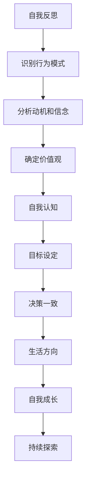
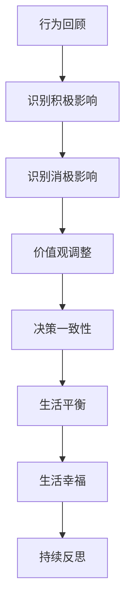
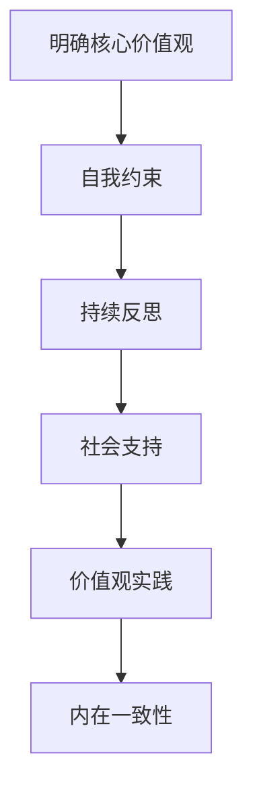
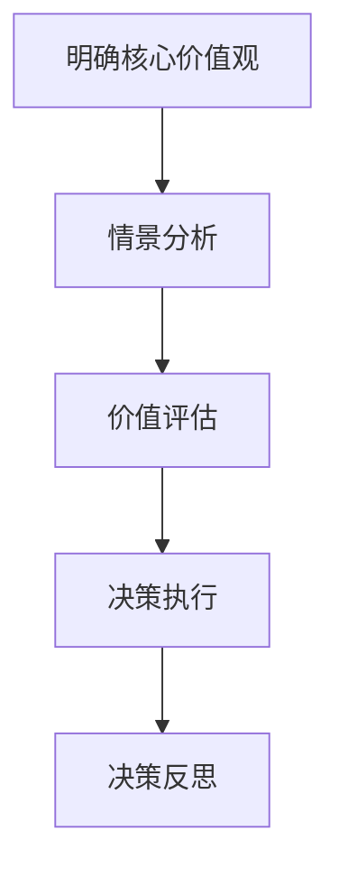
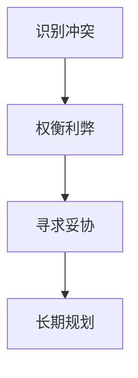
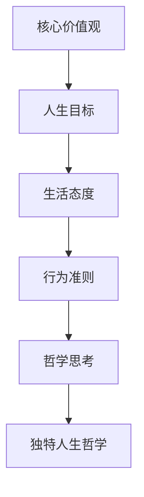
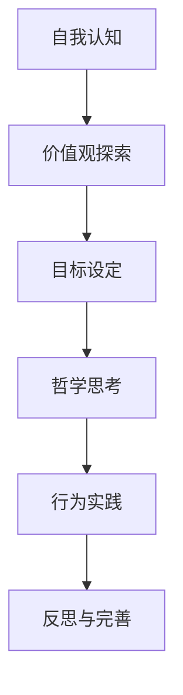
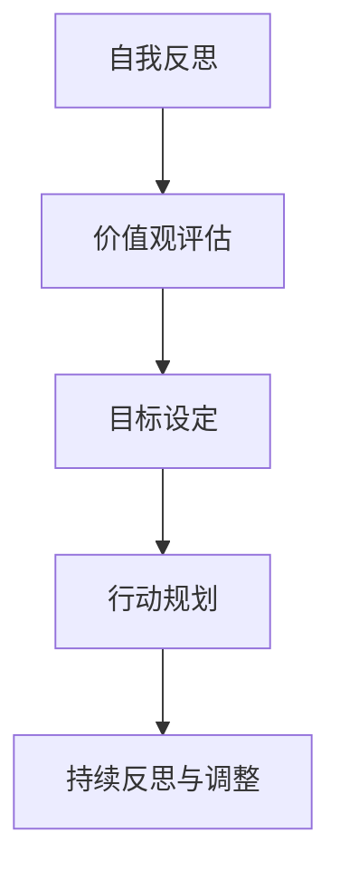

                 

## 第一部分：价值观的起源与发展

### 第1章：价值观的概念与起源

#### 1.1 价值观的定义

价值观是一系列相对固定的信仰、原则和信念，指导个体在行为选择和道德判断上的取向。它们反映了一个人对什么是有意义、重要和有价值的认识。从广义上讲，价值观涵盖了从个人生活到社会制度的各个方面。

#### 1.2 价值观的起源与演变

价值观的起源可以追溯到人类社会的早期。在原始社会，价值观主要是基于生存和繁衍的需求。随着社会的发展，尤其是农业革命和工业革命的推进，价值观逐渐复杂化和多元化。现代社会中，由于全球化和信息化的影响，价值观的多样性和冲突也变得更加显著。

#### 1.3 价值观的多元化与现代社会的挑战

现代社会的多元化带来了价值观的多元化。不同文化、宗教和意识形态之间的差异使得价值观的统一变得更加困难。这不仅体现在国际关系中，也体现在个人的生活中。面对多元化的价值观，现代社会面临着如何平衡不同价值观之间的冲突的挑战。

### 第2章：个人成长与价值观的形成

#### 2.1 家庭教育与价值观的形成

家庭教育在价值观的形成中起着至关重要的作用。父母的教育方式、价值观念和行为习惯都会对孩子产生深远的影响。例如，孝顺、诚实和勤奋等价值观通常会在家庭中得到强调。

#### 2.2 社会环境与价值观的塑造

社会环境也是影响价值观的重要因素。社会风气、文化传统和社会规范都会对个人的价值观产生影响。例如，在一个注重集体主义的社会中，个人可能会更倾向于将集体的利益置于个人利益之上。

#### 2.3 个人经历与价值观的塑造

个人的经历，特别是重大的人生事件，也会对其价值观产生深远的影响。例如，一次失败的经历可能会让人更加谨慎和谦虚，而一次成功的经历可能会让人更加自信和进取。

### 第3章：核心价值观的概念与分类

#### 3.1 核心价值观的定义

核心价值观是一个人认为最重要的价值观，它们构成了个人的行为准则和道德基础。核心价值观通常是在个体成长的过程中逐渐形成的，并且相对稳定。

#### 3.2 核心价值观的分类

核心价值观可以按照不同的标准进行分类。例如，可以按照功能分类为生存价值观、社会价值观和自我实现价值观；也可以按照文化分类为西方价值观和东方价值观等。

#### 3.3 不同核心价值观的影响与互动

不同的核心价值观之间可能会存在冲突。例如，个人自由和集体利益之间、权利和责任之间等。了解这些核心价值观之间的互动和影响，有助于更好地理解和应对现代社会中的价值冲突。

---

在本文的第一部分，我们探讨了价值观的定义、起源和分类，以及家庭、社会和个人经历在价值观形成中的重要作用。接下来，我们将进一步讨论如何构建个人价值观，以及个人价值观在决策和人生哲学中的意义。敬请期待。

### 第4章：自我认知与价值观的探索

#### 4.1 自我认知的重要性

自我认知是构建个人价值观的基础。通过深入理解自己的性格、兴趣、优势和劣势，个体能够更好地识别自己的价值观。自我认知有助于个体明确自己的目标和生活方向，从而在决策和行动中更加自信和一致。

#### 4.2 如何探索个人价值观

探索个人价值观可以通过多种方法进行。一种常见的方法是通过自我反思，思考自己在不同情境下的行为和决策，以及这些行为背后的动机和信念。此外，个体还可以通过与家人、朋友和同事的交流，了解他们对个人行为和决策的看法，从而获得更多的反馈和洞察。

#### 4.3 自我反思与价值观的调整

自我反思不仅有助于探索个人价值观，还可以帮助个体识别和调整价值观。通过回顾自己的行为和决策，个体可以识别哪些价值观对他们的生活产生了积极影响，哪些则可能需要调整。例如，如果一个人发现自己经常因为追求物质财富而忽视家庭，他们可能需要重新评估和调整自己的价值观，以确保生活的平衡和幸福。

通过自我认知和反思，个体可以更清晰地了解自己的价值观，并不断调整和优化，以实现个人成长和生活目标。在下一章节中，我们将探讨如何建立内在一致性，以确保价值观在决策和行动中得到有效应用。

---

在第4章中，我们探讨了自我认知在探索个人价值观中的重要性，并介绍了如何通过自我反思来识别和调整价值观。在下一章节，我们将深入探讨价值观的内在一致性，并分析如何在实际生活中保持这种一致性。

### 第5章：价值观的内在一致性

#### 5.1 内在一致性的重要性

内在一致性是指个人在不同情境下能够保持价值观的一致性。一个具有内在一致性的个体，其行为和决策与其所持有的价值观相吻合，不会因外界压力或个人利益而轻易改变。内在一致性对于个人的道德品质、决策能力和行为稳定性具有重要意义。

#### 5.2 如何建立内在一致性

建立内在一致性需要以下几个步骤：

1. **明确核心价值观**：首先，个体需要明确自己的核心价值观，这些价值观应当是长期稳定且对个人生活有深远影响的。

2. **自我约束**：个体应当在日常生活中不断强化对核心价值观的遵守，通过自我约束来抵制外界诱惑，确保行为与价值观的一致性。

3. **持续反思**：通过定期反思自己的行为和决策，个体可以识别出与核心价值观不符的地方，并做出相应的调整。

4. **社会支持**：个体可以从家人、朋友和同事那里获得支持和反馈，这有助于增强内在一致性的信心和决心。

5. **价值观实践**：将核心价值观应用到实际生活中，通过具体的行动来体现和巩固价值观。

#### 5.3 内在一致性在实际生活中的应用

内在一致性在实际生活中的应用主要体现在以下几个方面：

1. **决策过程**：在做出重要决策时，个体会参考自己的核心价值观，以确保决策的一致性和合理性。

2. **人际关系**：在人际交往中，个体会根据核心价值观来处理矛盾和冲突，维护和谐的人际关系。

3. **职业发展**：在职业生涯中，个体会根据核心价值观来选择职业道路和追求目标，确保职业发展与个人价值观相吻合。

4. **道德行为**：在面对道德困境时，个体会依据自己的核心价值观来做出道德选择，坚持正确的道德标准。

通过建立内在一致性，个体不仅能够在复杂多变的社会环境中保持稳定和清晰的价值观，还能在个人成长和职业发展中取得更好的成果。在下一章节中，我们将探讨如何将价值观融入决策过程，以实现个人目标和幸福感。

---

在第5章中，我们探讨了价值观的内在一致性及其重要性，并介绍了如何建立和保持这种一致性。在下一章节，我们将深入探讨价值观在决策过程中的作用，以及如何在复杂的决策环境中应用价值观来指导我们的选择。

### 第6章：价值观与决策

#### 6.1 价值观与决策的关系

价值观在决策过程中起着至关重要的作用。个体的价值观决定了他们在面对不同选择时的优先级和倾向。一个具有明确价值观的人，在面临决策时，可以更快地评估各种选择的优劣，做出符合自己价值观的决策。

#### 6.2 如何将价值观融入决策过程

将价值观融入决策过程，可以遵循以下步骤：

1. **明确核心价值观**：首先，个体需要明确自己的核心价值观，这些价值观应当是长期稳定且对个人生活有深远影响的。

2. **情景分析**：在做出决策前，个体应当分析当前情景，明确不同选择的可能后果。

3. **价值评估**：根据核心价值观，对各个选择进行价值评估，判断哪些选择更符合自己的价值观。

4. **决策执行**：选择那个与价值观最契合的选项，并付诸行动。

5. **决策反思**：决策后，个体应当反思决策的过程和结果，评估决策的效果，并据此调整自己的价值观或决策策略。

#### 6.3 价值观冲突与解决

在实际生活中，个体可能会遇到价值观冲突的情况。例如，在职业选择中，个体可能需要在收入和职业满足感之间做出选择。在这种情况下，个体需要：

1. **识别冲突**：明确冲突的来源和具体内容。

2. **权衡利弊**：分析各个选择的利弊，并根据价值观进行权衡。

3. **寻求妥协**：在无法完全满足所有价值观的情况下，寻求妥协，找到相对最优的解决方案。

4. **长期规划**：考虑长期目标和规划，调整价值观或决策策略，以实现长远利益。

通过将价值观融入决策过程，个体可以更有效地实现个人目标和幸福感。在下一章节中，我们将探讨如何将个人价值观应用于实际生活和职业发展，以实现个人成长和职业成功。

---

在第6章中，我们深入探讨了价值观在决策过程中的作用，并介绍了如何将价值观融入决策过程以及如何处理价值观冲突。在下一章节，我们将进一步探讨个人价值观在实践中的应用，以及如何在日常生活中体现和贯彻个人价值观。

### 第7章：价值观的实践与应用

#### 7.1 价值观的实践意义

价值观不仅是个人内心的信仰和指导原则，更是在实际生活中的行动指南。将价值观付诸实践，不仅有助于个体在日常生活中做出明智的选择，还能促进个人成长和职业发展。例如，诚实、勤奋和创新等价值观，在实际工作中可以帮助个人建立良好的职业声誉，提高工作效率和创造力。

#### 7.2 个人价值观的应用场景

个人价值观在不同情境中具有不同的应用特点：

1. **职场中**：个人价值观可以体现在工作态度、团队合作和职业目标上。例如，诚信可以让个人在工作中避免不实报告和欺诈行为，而敬业则能促使个人努力提升工作效率和质量。

2. **家庭中**：家庭是价值观实践的重要场所。家庭成员可以通过相互尊重、关爱和支持，体现家庭价值观，如和睦、责任和关爱。

3. **社会中**：在社会层面，个人价值观可以通过参与公益活动、志愿服务和社区建设来体现。这些行为不仅有助于社会和谐，还能提升个人的社会责任感和幸福感。

#### 7.3 个人价值观与社会价值观的互动

个人价值观与社会价值观之间存在互动关系。一方面，社会价值观对个人价值观的形成和变化产生影响；另一方面，个人价值观也对社会价值观产生反作用。例如，社会普遍倡导的公平、正义和环保等价值观，可以影响个人的行为选择和生活方式。

在社会价值观与个人价值观的互动中，个体需要平衡两种价值观的关系。例如，在面临职业选择时，个人需要在追求个人职业发展的同时，考虑社会责任和道德规范，避免违背社会价值观。

总之，个人价值观的实践不仅对个人成长和职业发展具有重要意义，还能促进社会和谐与进步。在下一章节中，我们将探讨如何形成独特的人生哲学，并分析独特人生哲学的构成要素和形成过程。

---

在第7章中，我们讨论了价值观的实践意义以及在不同情境中的应用场景。在下一章节中，我们将深入探讨如何形成独特的人生哲学，分析其构成要素和形成过程。敬请期待。

### 第8章：人生哲学的概念与内涵

#### 8.1 人生哲学的定义

人生哲学是一种关于人类存在、目的和意义的系统思考方式。它不仅仅是个体对生活态度和价值观的总结，更是一种深层次的哲学思考和生活方式。人生哲学涉及个体如何看待世界，如何对待自己和他人，以及如何实现个人的目标和价值。

#### 8.2 人生哲学的内涵

人生哲学的内涵可以从以下几个方面来理解：

1. **世界观**：人生哲学包含对世界本质、人类地位和宇宙意义的思考。例如，个体可能认为世界是客观存在的，人类是宇宙中的独特存在，具有改变世界的力量。

2. **价值观**：人生哲学涉及个体对道德、伦理和美德的看法。例如，个体可能认为诚实、正义和善良是重要的价值观。

3. **人生目标**：人生哲学包括对个人目标和追求的理解。例如，个体可能追求幸福、成就或个人成长。

4. **生活态度**：人生哲学影响个体对生活的态度，包括如何面对挑战、如何处理负面情绪等。

#### 8.3 人生哲学与价值观的关系

人生哲学与价值观密切相关，两者相互影响和补充。价值观是人生哲学的核心要素，决定了个体在行为选择和道德判断上的取向。而人生哲学则提供了更宏观的视角，帮助个体理解自己的价值观在更广泛的社会和文化背景中的意义。

例如，一个持有“贡献社会”价值观的人，其人生哲学可能强调个人在社会中的角色和责任，追求对社会有积极影响的成就。这种人生哲学不仅指导个体的行为选择，还影响其对待工作和生活的态度。

通过深入理解人生哲学的内涵，个体可以更好地认识自己的价值观，并将其融入日常生活和决策中。在下一章节中，我们将探讨如何构建独特的人生哲学，分析其构成要素和形成过程。敬请期待。

---

在第8章中，我们探讨了人生哲学的定义和内涵，并分析了人生哲学与价值观之间的关系。在下一章节中，我们将详细讨论如何构建独特的人生哲学，分析其构成要素和形成过程。敬请期待。

### 第9章：独特人生哲学的构建

#### 9.1 独特人生哲学的构成要素

独特的人生哲学并非一蹴而就，而是由多个相互关联的要素构成的。以下是构建独特人生哲学的主要构成要素：

1. **核心价值观**：核心价值观是人生哲学的基础，它们反映了个体对什么是重要的、有意义的和有价值的认知。例如，诚实、勤奋、责任感等核心价值观。

2. **人生目标**：人生目标是对个人长期追求的明确表述。这些目标可以是职业上的成就、个人成长、家庭幸福等。人生目标为个体提供了方向和动力。

3. **生活态度**：生活态度是个体对生活的总体看法和应对方式。积极的生活态度能够帮助个体更好地应对挑战和压力。

4. **行为准则**：行为准则是指导个体行为的具体原则和规范。例如，诚实守信、尊重他人等行为准则。

5. **哲学思考**：哲学思考是人生哲学的重要组成部分，它包括对存在、意义、道德等问题的深入探讨。哲学思考有助于个体形成深刻的自我认知和理性判断。

#### 9.2 独特人生哲学的形成过程

独特人生哲学的形成是一个逐步发展的过程，通常包括以下几个阶段：

1. **自我认知**：个体需要深入了解自己的性格、兴趣、优势和劣势。自我认知是构建人生哲学的基础。

2. **价值观探索**：通过反思和与他人的交流，个体可以识别和探索自己的核心价值观。这一阶段可能需要多次尝试和调整。

3. **目标设定**：个体应根据自身价值观设定长期和短期的目标。目标设定应具有明确性和可实现性。

4. **哲学思考**：个体应通过阅读哲学书籍、参与哲学讨论等方式，培养哲学思考和批判性思维。

5. **行为实践**：通过将价值观和哲学思考付诸实践，个体可以在实际生活中检验和调整自己的哲学体系。

6. **反思与完善**：个体应定期反思自己的生活实践和哲学思考，并根据反馈进行调整和优化。

通过上述阶段，个体可以逐步构建出独特的人生哲学，并在实践中不断完善和优化。在下一章节中，我们将探讨如何将独特的人生哲学应用于实际生活，以及在个人成长和社会中的价值。敬请期待。

---

在第9章中，我们详细探讨了如何构建独特的人生哲学，分析了其构成要素和形成过程。在下一章节中，我们将探讨人生哲学的传播与影响，并分析个人价值观与社会价值观的互动。敬请期待。

### 第10章：人生哲学的传播与影响

#### 10.1 人生哲学的传播途径

人生哲学的传播途径多种多样，包括但不限于以下几种：

1. **教育体系**：学校教育是人生哲学传播的重要渠道。通过课程设置、讲座和讨论等形式，教育体系能够帮助学生建立正确的价值观和人生观。

2. **媒体传播**：书籍、报纸、电视、互联网等媒体平台是传播人生哲学的重要工具。优秀的文学作品、电影和纪录片等，能够深刻影响观众的人生哲学。

3. **社会活动**：社会组织、公益活动、社区建设等社会活动，是传播和实践人生哲学的生动场所。这些活动不仅能够提升个体的社会责任感，还能促进社会和谐。

4. **人际交流**：家庭成员、朋友和同事之间的交流，也是人生哲学传播的重要途径。通过日常交流和互动，个体的价值观和人生哲学得以分享和影响他人。

#### 10.2 人生哲学的社会影响

人生哲学的社会影响深远且广泛，主要体现在以下几个方面：

1. **道德建设**：人生哲学的传播有助于提升社会的道德水平。一个拥有共同价值观的社会，更容易形成良好的社会风气和道德规范。

2. **文化传承**：人生哲学是文化的重要组成部分，它承载了历史和传统的智慧。通过传播人生哲学，文化得以传承和发扬。

3. **社会稳定**：一个具有共同人生哲学的社会，成员之间更容易建立信任和共识，从而促进社会稳定和和谐。

4. **个人成长**：人生哲学对个体的成长和发展具有重要指导作用。一个明确的价值观体系，能够帮助个体在复杂多变的社会环境中保持稳定和清晰的思维。

#### 10.3 人生哲学的个人价值

对于个人来说，人生哲学具有重要的价值和意义：

1. **自我认知**：人生哲学能够帮助个体深入理解自己和世界，从而更好地认识自我和定位自己在社会中的角色。

2. **决策指导**：一个明确的价值观体系，能够为个体在面临决策时提供清晰的指导，使决策更加明智和合理。

3. **行为规范**：人生哲学为个体的行为提供了具体的行为准则，有助于个体在复杂的社会环境中保持一致性。

4. **精神支撑**：在人生旅途中，人生哲学为个体提供了精神支撑和动力，使个体能够更好地应对挑战和困难。

通过传播和践行人生哲学，个体不仅能够实现个人成长和幸福，还能为社会和谐与进步贡献力量。在下一章节中，我们将通过案例分析，探讨成功人士的人生哲学，并从中获取启示。敬请期待。

---

在第10章中，我们探讨了人生哲学的传播途径、社会影响以及个人价值。在下一章节中，我们将通过具体案例分析成功人士的人生哲学，并从中提取有价值的启示。敬请期待。

### 第11章：成功人士的人生哲学分析

#### 11.1 案例背景介绍

在本章中，我们将分析几位成功人士的人生哲学，通过他们的经历和观点，探讨其核心价值观和人生哲学的构成。以下是几位成功人士的简要背景介绍：

1. **乔布斯（Steve Jobs）**：作为苹果公司的共同创始人，乔布斯以其创新精神和独特的设计理念改变了全球科技产业。他强调简约和用户体验，并坚信“活着就是为了改变世界”。

2. **马云（Jack Ma）**：阿里巴巴集团的创始人，马云以其远见卓识和坚韧不拔的精神，带领阿里巴巴成为全球最大的电子商务平台。他倡导“让天下没有难做的生意”，并强调“永不放弃”。

3. **贝佐斯（Jeff Bezos）**：亚马逊公司的创始人，贝佐斯以其对创新的执着和对长期愿景的坚持，打造了全球最大的在线零售平台。他提倡“客户至上”和“持续创新”。

#### 11.2 案例中的核心价值观

通过分析这些成功人士的公开演讲、访谈和自传，我们可以总结出他们共同的核心价值观：

1. **创新**：乔布斯、马云和贝佐斯都高度重视创新，认为创新是推动个人和公司发展的关键。他们不断探索新技术和新业务模式，以保持竞争优势。

2. **坚韧**：在面对困难和挑战时，这些成功人士都展现了坚韧不拔的精神。他们相信只要坚持不懈，就一定能找到解决问题的方法。

3. **客户至上**：贝佐斯曾说过，“客户至上”是亚马逊的核心价值观，他认为为客户提供卓越的体验是成功的关键。这种客户至上的理念贯穿了他们的商业决策和公司文化。

4. **长期主义**：这些成功人士都强调长期主义，即关注长远利益而非短期收益。他们相信通过长期的努力和坚持，可以创造出持久的成功。

#### 11.3 案例分析及启示

通过分析这些成功人士的人生哲学，我们可以获得以下启示：

1. **价值观的重要性**：成功的背后往往离不开明确的价值观。一个清晰的价值观能够为个人和公司提供方向和动力。

2. **创新与坚韧**：创新和坚韧是成功的关键因素。在面对挑战时，保持创新思维和坚韧精神，有助于克服困难并取得突破。

3. **客户至上**：在商业世界中，关注客户需求并为客户提供卓越的服务，是创造持久成功的关键。

4. **长期主义**：长期主义有助于个人和公司避免短期利益的诱惑，专注于长远目标和持续发展。

通过这些案例分析，我们可以看到，成功人士的人生哲学不仅影响了他们的个人和职业生涯，也对整个社会产生了深远的影响。在下一章节中，我们将提供个人价值观构建的实践指南，帮助读者将所学的价值观应用到实际生活中。

---

在第11章中，我们通过分析几位成功人士的人生哲学，探讨了他们的核心价值观以及这些价值观对个人和职业生涯的影响。在下一章节中，我们将提供具体的实践指南，帮助读者构建和践行个人价值观。敬请期待。

### 第12章：个人价值观构建的实践指南

#### 12.1 实践步骤与方法

构建个人价值观是一个持续的过程，需要明确的步骤和科学的方法。以下是构建个人价值观的实践步骤和方法：

1. **自我反思**：定期进行自我反思，思考自己在不同情境下的行为和决策。通过记录和总结，识别出哪些价值观在日常生活中起到了指导作用。

2. **价值观评估**：评估当前价值观的有效性，识别出哪些价值观对个人成长和幸福有积极影响，哪些则需要调整或放弃。

3. **目标设定**：根据核心价值观，设定个人目标和长期愿景。这些目标应具有明确性和可实现性，并与核心价值观保持一致。

4. **行动规划**：制定具体的行动计划，将核心价值观融入日常生活中的各个方面，包括职业、家庭、社交等。

5. **持续反思与调整**：在实践过程中，定期反思自己的行为和决策，评估价值观的应用效果，并根据反馈进行调整。

#### 12.2 实践中的常见问题与解决策略

在构建个人价值观的过程中，可能会遇到以下常见问题：

1. **价值观冲突**：当多个价值观之间存在冲突时，个体可能会感到困惑和不确定。解决策略包括重新评估价值观的重要性，找到妥协方案，或寻求专业指导。

2. **实践难度**：将价值观付诸实践可能会面临实际困难。解决策略包括制定详细可行的行动计划，寻求支持与鼓励，以及持续学习和调整。

3. **外界压力**：社会和文化压力可能会影响个人价值观的实施。解决策略包括保持自我认知，坚持核心价值观，以及寻找志同道合的社群。

#### 12.3 实践总结与反思

通过实践个人价值观，个体可以获得以下收获：

1. **个人成长**：个人价值观的实践有助于提升自我认知，增强自信心，促进个人成长。

2. **决策清晰**：清晰的价值观能够为个体提供明确的决策指南，使决策更加明智和合理。

3. **生活满意度**：遵循个人价值观的生活，通常能够带来更高的生活满意度和幸福感。

通过以上实践步骤和方法，个体可以逐步构建和践行个人价值观，实现个人成长和生活目标的达成。在下一章节中，我们将总结全文，回顾核心价值观和人生哲学的重要性，并展望未来的发展。

---

在第12章中，我们提供了具体的实践指南，帮助读者构建和践行个人价值观。在下一章节中，我们将总结全文，回顾核心价值观和人生哲学的重要性，并展望未来的发展。敬请期待。

### 第13章：价值观与人生哲学的重要性

#### 13.1 价值观与人生哲学对个体的影响

价值观和人生哲学对个体的影响深远且广泛。一个明确的价值观体系能够为个体提供行为准则和决策依据，帮助他们在复杂多变的社会环境中保持清晰的思维和稳定的行为。以下是一些具体的影响：

1. **决策指导**：清晰的价值观使个体在面对选择时能够迅速评估各种可能的结果，做出符合自己价值观的决策。

2. **行为规范**：价值观为个体的行为提供了具体规范，使他们在日常交往中能够遵循社会和道德规范，建立良好的社会关系。

3. **个人成长**：通过不断地反思和实践，个体能够更好地认识自己，提升自我意识和自我管理能力，实现个人成长。

4. **生活满意度**：遵循个人价值观的生活往往能够带来更高的生活满意度和幸福感，因为个体能够实现自己的目标，实现自我价值。

#### 13.2 价值观与人生哲学对社会的影响

价值观和人生哲学不仅对个体有深远影响，也对整个社会产生重要影响。以下是价值观和人生哲学对社会的一些具体影响：

1. **道德建设**：共同的价值观有助于提升社会的道德水平，促进社会风气的改善。

2. **文化传承**：人生哲学是文化传承的重要组成部分，它承载了历史和传统的智慧，为社会的文化发展提供基础。

3. **社会稳定**：一个具有共同价值观的社会，成员之间更容易建立信任和共识，从而促进社会的和谐与稳定。

4. **创新驱动**：价值观和人生哲学鼓励个体追求创新和进步，为社会的科技发展和经济繁荣提供动力。

#### 13.3 价值观与人生哲学的未来发展趋势

随着全球化、科技化和信息化的不断发展，价值观和人生哲学面临着新的挑战和机遇。以下是未来发展趋势的一些预测：

1. **多元化与融合**：随着文化交流的加深，不同文化背景的价值观将相互影响和融合，形成更加多元和包容的价值观体系。

2. **科技影响**：科技的发展，如人工智能和大数据，将深刻影响人们的生活方式，从而对价值观和人生哲学产生新的挑战。

3. **可持续发展**：在全球变暖和环境问题日益突出的背景下，可持续发展和环保将成为未来价值观和人生哲学的重要组成部分。

通过以上回顾，我们可以看到价值观和人生哲学在个体成长和社会发展中的重要性。在下一章节中，我们将进行全文总结，强调价值观构建的重要性，并鼓励读者积极践行和探索个人的人生哲学。

---

在第13章中，我们回顾了价值观与人生哲学对个体和社会的重要性，并展望了其未来的发展趋势。在下一章节中，我们将进行全文总结，强调价值观构建的重要性，并鼓励读者积极践行和探索个人的人生哲学。敬请期待。

### 第14章：结语

#### 14.1 个人价值观构建的意义

个人价值观的构建对于个体的成长和社会的和谐具有深远的意义。明确的价值观能够为个体提供清晰的行为指南和决策依据，使他们在面对复杂多变的环境时保持稳定和理性的态度。同时，个人价值观的构建有助于提升个体的自我认知和自我管理能力，促进个人成长和幸福感。

#### 14.2 形成独特人生哲学的价值

形成独特的人生哲学不仅对个人具有重要意义，也对社会的进步和发展产生积极影响。独特的人生哲学能够帮助个体在面对挑战和困难时保持坚定的信念和积极的态度，从而实现个人目标和价值。此外，人生哲学的传播和分享能够促进社会价值观的多元化和包容性，增强社会的凝聚力和稳定性。

#### 14.3 鼓励与展望

在个人价值观和人生哲学的构建过程中，我们鼓励读者保持开放和包容的心态，积极学习、实践和反思。通过不断地探索和调整，每个人都能找到适合自己的价值观体系，形成独特的人生哲学。同时，我们也期待读者能够将个人的人生哲学融入日常生活，积极践行，并在实践中不断完善和优化。

展望未来，随着科技的发展和全球化的深入，个人价值观和人生哲学将面临更多的挑战和机遇。我们鼓励读者保持敏锐的洞察力和积极的进取精神，不断探索和适应新环境，为个人成长和社会进步贡献力量。

---

在第14章中，我们对全文进行了总结，并强调了个人价值观构建和独特人生哲学的重要性。在本文的最后，我们再次感谢您的阅读，并期待您能够在个人价值观和人生哲学的探索中取得更大的成就。

---

## 文章标题：个人价值观的构建：形成独特的人生哲学

关键词：价值观、人生哲学、个人成长、决策、自我认知

摘要：本文通过探讨价值观的起源与发展、个人成长与价值观的形成、核心价值观的概念与分类、自我认知与价值观的探索、价值观的内在一致性、价值观与决策、价值观的实践与应用，以及人生哲学的构建和传播与影响，全面阐述了个人价值观的构建过程及其重要性。文章旨在帮助读者了解如何构建和践行个人价值观，形成独特的人生哲学，并在实际生活中实现个人成长和职业成功。

---

**作者：AI天才研究院/AI Genius Institute & 禅与计算机程序设计艺术 /Zen And The Art of Computer Programming**## 附加内容

**最佳实践 Tips**

1. **定期反思**：定期进行自我反思，思考自己的行为和决策是否符合核心价值观。
2. **目标设定**：设定短期和长期目标，确保这些目标与核心价值观相一致。
3. **持续学习**：不断学习新的知识和技能，以适应不断变化的社会环境。
4. **积极实践**：将价值观融入日常工作和生活中，通过实际行动来体现和实践。
5. **与他人交流**：与他人分享价值观和人生哲学，获取反馈和建议。

**小结**

本文详细探讨了个人价值观的构建过程和独特人生哲学的形成，强调了价值观在决策、个人成长和社会影响中的重要性。通过不断反思、学习与实践，每个人都可以构建自己的价值观体系，形成独特的人生哲学，并在实际生活中实现个人目标和社会价值。

**注意事项**

1. **价值观的多样性**：尊重不同文化和背景下的价值观多样性，避免价值冲突。
2. **持续调整**：随着个人成长和环境变化，不断调整和优化价值观体系。
3. **实践的重要性**：价值观的实践比理论更为重要，通过实际行动来体现和巩固价值观。

**拓展阅读**

1. **《人类简史》（Yuval Noah Harari）**：探讨人类历史和价值观的演变，对理解人类文明有重要启示。
2. **《活着》（余华）**：通过小说形式探讨人生意义和价值，对个人价值观的思考有深刻影响。
3. **《原则》（Ray Dalio）**：提供成功人士的决策原则和价值观，对个人成长有实用指导。

---

在本文的最后，我们希望读者能够深入思考个人价值观和人生哲学，积极构建和践行，为自己的成长和社会的进步贡献力量。感谢您的阅读，期待与您共同探索价值观的奥秘。

