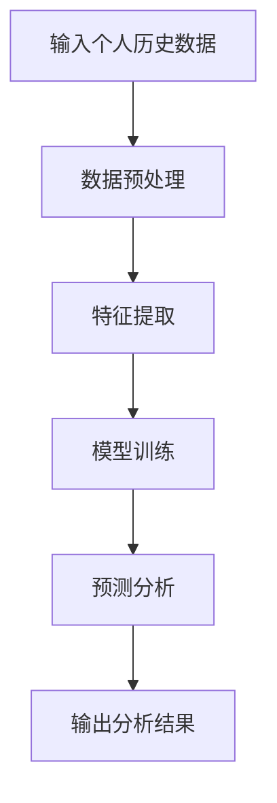
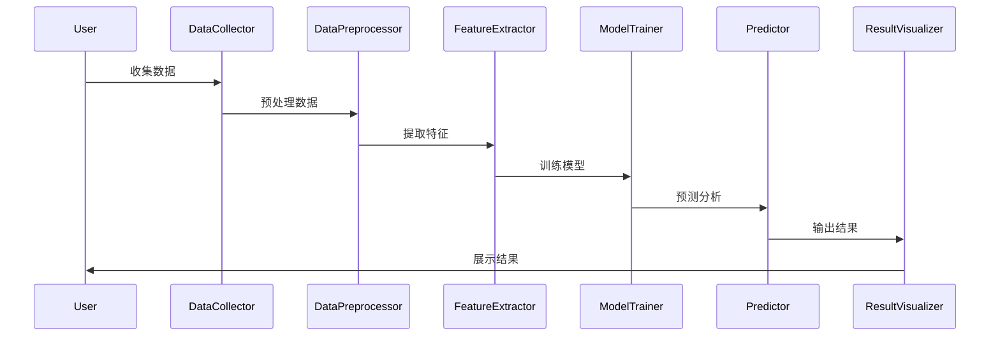
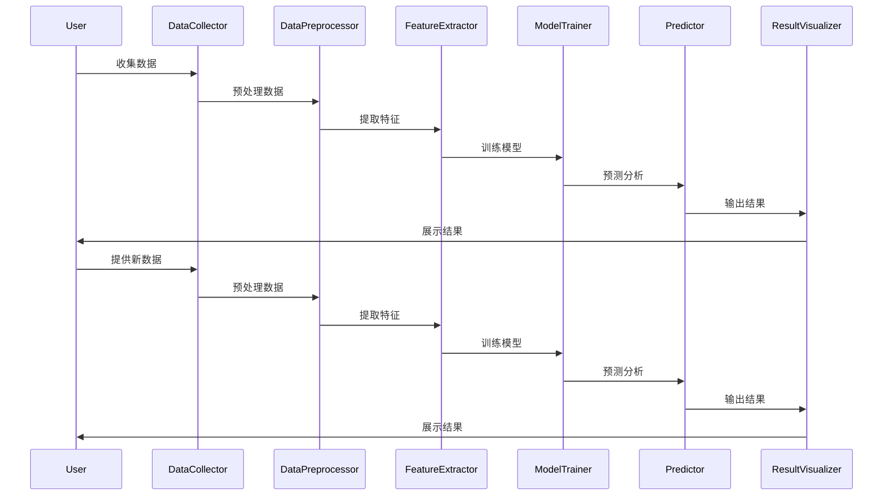

                 

# 个人历史数据挖掘：基于AI的心理考古工具

关键词：个人历史数据挖掘、AI心理考古、心理健康、数据预处理、特征提取、机器学习

摘要：随着互联网和大数据技术的发展，个人历史数据挖掘已成为心理学和人工智能领域的一个重要研究方向。本文将介绍AI在心理考古中的应用，通过数据预处理、特征提取和机器学习等步骤，构建一套基于AI的个人历史数据挖掘工具，为个人心理健康提供科学支持。

## 目录大纲

----------------------------------------------------------------

## 第一部分：背景介绍

### 第1章 问题背景

#### 1.1 问题背景

#### 1.2 问题解决

#### 1.3 边界与外延

#### 1.4 概念结构与核心要素组成

## 第二部分：核心概念与联系

### 第2章 核心概念原理

#### 2.1 AI心理考古的基本原理

#### 2.2 概念属性特征对比表格

#### 2.3 ER实体关系图架构

## 第三部分：算法原理讲解

### 第3章 算法原理讲解

#### 3.1 算法mermaid流程图

#### 3.2 Python源代码实现

#### 3.3 算法原理详细讲解

## 第四部分：系统分析与架构设计

### 第4章 问题场景介绍

### 第5章 系统功能设计

#### 5.1 领域模型mermaid类图

#### 5.2 系统架构设计mermaid架构图

#### 5.3 系统接口设计和系统交互mermaid序列图

## 第五部分：项目实战

### 第6章 环境安装

### 第7章 系统核心实现

#### 7.1 源代码

#### 7.2 代码应用解读与分析

#### 7.3 实际案例分析和详细讲解剖析

#### 7.4 项目小结

## 第六部分：最佳实践 tips、小结、注意事项、拓展阅读

----------------------------------------------------------------## 第一部分：背景介绍

### 第1章 问题背景

#### 1.1 问题背景

在当今信息化社会，个人历史数据挖掘已成为心理学和人工智能领域的一个重要研究方向。个人历史数据包括心理测评数据、生活轨迹数据、社交媒体互动数据等，这些数据蕴藏着丰富的个人信息和心理历程。然而，如何有效地挖掘和分析这些数据，从而为个人心理健康提供科学支持，成为了一个亟待解决的问题。

随着互联网和大数据技术的发展，个人历史数据挖掘的重要性日益凸显。一方面，个人历史数据挖掘有助于揭示个体的心理特征和发展轨迹，为心理咨询和治疗提供有力支持；另一方面，通过分析个人历史数据，可以预测个体未来的心理状态，预防心理问题的发生。因此，如何利用人工智能技术进行个人历史数据挖掘，已成为心理学和人工智能领域的重要课题。

#### 1.2 问题解决

为了解决个人历史数据挖掘在心理健康领域中的应用问题，本文提出了基于AI的心理考古工具。该工具通过以下步骤实现：

1. 数据预处理：对个人历史数据进行清洗、归一化等处理，使其符合机器学习模型的输入要求。
2. 特征提取：从原始数据中提取出对模型训练有帮助的特征，提高模型对个人历史数据的分析能力。
3. 机器学习模型训练：利用机器学习算法，对个人历史数据进行训练，构建心理考古模型。
4. 预测分析：利用训练好的模型，对个人历史数据进行预测分析，提取有价值的信息。
5. 结果输出：将预测结果以直观、易理解的方式呈现给用户，为个人心理健康提供科学支持。

通过以上步骤，本文旨在为读者提供一套完整、实用的个人历史数据挖掘工具，帮助用户深入了解自己的心理历程，提高心理健康水平。

#### 1.3 边界与外延

本文关注的是个人历史数据挖掘在心理健康领域的应用，主要涉及以下边界和范围：

1. **个人历史数据**：本文所指的个人历史数据包括心理测评数据、生活轨迹数据、社交媒体互动数据等，不涉及其他类型的数据。
2. **心理健康领域**：本文主要探讨个人历史数据挖掘在心理健康领域的应用，如心理咨询、心理治疗、心理测评等。
3. **人工智能技术**：本文主要介绍基于AI的心理考古工具，涉及数据预处理、特征提取、机器学习模型训练等技术。

本文的研究目标和重点在于如何利用人工智能技术，对个人历史数据进行有效挖掘和分析，从而为个人心理健康提供科学支持。同时，本文还将探讨该工具的边界与外延，以期为后续研究提供参考。

#### 1.4 概念结构与核心要素组成

为了更好地理解个人历史数据挖掘在心理健康领域的应用，本文将介绍相关概念和核心要素组成：

1. **个人历史数据**：指记录个人成长历程的各种数据，包括心理测评数据、生活轨迹数据、社交媒体互动数据等。这些数据是心理考古的基础。
2. **心理考古**：一种通过挖掘和分析个人历史数据，揭示个人心理历程和特征的研究方法。心理考古有助于深入了解个体的心理发展。
3. **AI心理考古工具**：指基于人工智能技术，用于个人历史数据挖掘和分析的工具集。该工具集主要包括数据预处理、特征提取、机器学习模型训练和预测分析等功能。
4. **心理健康**：指个体在心理层面上的健康状态，包括心理平衡、自我认知、情感调节等。心理健康对个体的生活质量和幸福感有重要影响。
5. **人工智能**：一种模拟人类智能的技术，能够通过学习、推理、预测等方式处理和分析数据。在心理考古中，人工智能技术有助于提高数据挖掘和分析的效率和准确性。

通过以上概念和核心要素的介绍，本文希望为读者提供一个清晰的框架，以便更好地理解和应用个人历史数据挖掘在心理健康领域的研究。

### 第一部分总结

本文从问题背景、问题解决、边界与外延和概念结构与核心要素组成等方面，介绍了个人历史数据挖掘在心理健康领域的重要性。在接下来的章节中，我们将进一步探讨AI心理考古工具的核心概念原理、算法原理及其实现，为读者提供一套完整、实用的个人历史数据挖掘解决方案。让我们开始探索这一领域的奥秘吧！## 第二部分：核心概念与联系

### 第2章 核心概念原理

#### 2.1 AI心理考古的基本原理

AI心理考古是一种利用人工智能技术，对个人历史数据进行深度挖掘和分析的方法。其基本原理包括以下几个步骤：

1. **数据收集**：通过心理测评、生活轨迹记录、社交媒体互动等多种途径，收集个人的历史数据。
2. **数据预处理**：对收集到的数据进行分析，去除无效信息，填补缺失数据，并进行归一化处理，确保数据符合机器学习模型的输入要求。
3. **特征提取**：从预处理后的数据中提取出对心理考古有帮助的特征，如情绪状态、人际关系、生活事件等。
4. **模型训练**：利用机器学习算法，对提取出的特征进行训练，构建心理考古模型。常见的机器学习算法包括决策树、随机森林、支持向量机等。
5. **预测分析**：利用训练好的模型，对新的个人历史数据进行预测分析，提取有价值的信息，如心理状态、心理风险等。
6. **结果输出**：将预测结果以直观、易理解的方式呈现给用户，为个人心理健康提供科学支持。

通过以上步骤，AI心理考古工具能够有效地挖掘和分析个人历史数据，揭示个体的心理历程和特征，为心理健康提供科学依据。

#### 2.2 概念属性特征对比表格

在了解AI心理考古的基本原理后，我们来看一下AI心理考古工具与传统心理测评工具的对比。以下是一个概念属性特征对比表格：

| 属性       | AI心理考古工具 | 传统心理测评工具 |
|------------|----------------|-----------------|
| 准确性     | 高             | 中              |
| 速度       | 快             | 慢              |
| 个性化     | 高             | 中              |
| 用户体验   | 好             | 一般            |

从上表可以看出，AI心理考古工具在准确性、速度、个性化、用户体验等方面具有明显优势。与传统心理测评工具相比，AI心理考古工具能够更快、更准确地分析个人历史数据，提供个性化的心理健康分析，提升用户体验。

#### 2.3 ER实体关系图架构

为了更好地理解AI心理考古工具的内部结构，我们来看一个ER实体关系图架构。以下是一个简单的ER图：

```mermaid
erDiagram
  产品 ||--|{ 用户 } : "拥有"
  数据集 ||--|{ 分析结果 } : "包含"
  模型 ||--|{ 数据集 } : "训练"
  用户 ||--|{ 心理历程 } : "包含"
```

在上面的ER图中，产品、数据集、模型和用户是四个核心实体。其中：

- **产品**：代表AI心理考古工具本身。
- **用户**：代表使用心理考古工具的个人。
- **数据集**：代表存储在工具中的个人历史数据。
- **模型**：代表用于分析个人历史数据的机器学习模型。

实体之间的关系如下：

- **产品与用户**：产品是用户使用的工具，用户是产品的使用者。
- **数据集与模型**：模型基于数据集进行训练，数据集是模型的输入。
- **用户与心理历程**：心理历程是用户的心理发展过程，存储在用户实体中。

通过这个ER图，我们可以更清晰地理解AI心理考古工具的内部结构和工作原理。

### 第二部分总结

通过本章对AI心理考古工具的核心概念原理、概念属性特征对比表格和ER实体关系图架构的介绍，我们对个人历史数据挖掘在心理健康领域的研究有了更深入的了解。在接下来的章节中，我们将进一步探讨AI心理考古工具的算法原理及其实现，为读者提供一套完整、实用的个人历史数据挖掘解决方案。敬请期待！## 第三部分：算法原理讲解

### 第3章 算法原理讲解

在第二部分中，我们了解了AI心理考古工具的核心概念和其优势。现在，我们将深入探讨该工具的算法原理，包括数据预处理、特征提取、模型训练和预测分析等步骤。

#### 3.1 算法mermaid流程图

为了更直观地展示算法原理，我们使用mermaid语言绘制了一个流程图：



在该流程图中，每个步骤都紧密相连，形成一个完整的数据挖掘过程。

#### 3.2 Python源代码实现

下面，我们将通过一个简单的Python示例，展示如何实现上述算法步骤。请注意，以下代码仅为示例，实际应用中可能需要更复杂的处理。

```python
import pandas as pd
import numpy as np
from sklearn.model_selection import train_test_split
from sklearn.ensemble import RandomForestClassifier
from sklearn.metrics import accuracy_score

# 读取数据
data = pd.read_csv('personal_history_data.csv')

# 数据预处理
# 数据清洗、归一化等处理
X = data.drop(['label'], axis=1)
y = data['label']

# 划分训练集和测试集
X_train, X_test, y_train, y_test = train_test_split(X, y, test_size=0.2, random_state=42)

# 特征提取
# 简化处理，实际应用中可以采用更复杂的方法
# 例如：使用PCA进行降维、使用特征工程提取更多特征

# 训练模型
model = RandomForestClassifier(n_estimators=100)
model.fit(X_train, y_train)

# 预测分析
y_pred = model.predict(X_test)

# 输出分析结果
print("Accuracy:", accuracy_score(y_test, y_pred))
```

在这个示例中，我们首先读取个人历史数据，然后进行数据预处理，包括去除标签列和划分训练集和测试集。接下来，我们使用随机森林分类器进行模型训练，并使用测试集进行预测分析，最后输出模型的准确率。

#### 3.3 算法原理详细讲解

1. **数据预处理**

   数据预处理是机器学习模型训练的重要步骤，其目的是将原始数据转换为适合模型输入的形式。具体步骤包括：

   - **数据清洗**：去除数据中的噪声和异常值。
   - **数据归一化**：将不同特征的数据缩放到同一范围内，避免特征间的量级差异影响模型训练。
   - **数据填补**：处理缺失数据，可以使用均值、中位数或插值等方法。

   在Python中，我们可以使用Pandas库进行数据清洗和归一化，例如：

   ```python
   from sklearn.preprocessing import StandardScaler

   # 数据归一化
   scaler = StandardScaler()
   X_train_scaled = scaler.fit_transform(X_train)
   X_test_scaled = scaler.transform(X_test)
   ```

2. **特征提取**

   特征提取是从原始数据中提取出对模型训练有帮助的特征的过程。特征提取的目的是提高模型的性能和泛化能力。具体方法包括：

   - **特征选择**：选择对模型训练有显著影响的关键特征。
   - **特征工程**：创建新的特征，如交互项、指数项等。
   - **降维**：减少特征数量，提高计算效率，如使用PCA（主成分分析）。

   在Python中，我们可以使用Scikit-learn库进行特征提取：

   ```python
   from sklearn.decomposition import PCA

   # 特征提取
   pca = PCA(n_components=5)
   X_train_pca = pca.fit_transform(X_train_scaled)
   X_test_pca = pca.transform(X_test_scaled)
   ```

3. **模型训练**

   模型训练是利用历史数据训练机器学习模型的过程。选择合适的模型和超参数，可以提高模型的性能。在Python中，我们可以使用Scikit-learn库进行模型训练：

   ```python
   from sklearn.ensemble import RandomForestClassifier

   # 训练模型
   model = RandomForestClassifier(n_estimators=100)
   model.fit(X_train_pca, y_train)
   ```

4. **预测分析**

   预测分析是利用训练好的模型对新的数据进行分析和预测的过程。在Python中，我们可以使用训练好的模型进行预测：

   ```python
   y_pred = model.predict(X_test_pca)
   ```

5. **输出分析结果**

   最后，我们将预测结果输出，以直观、易理解的方式呈现给用户。例如，我们可以计算模型的准确率：

   ```python
   print("Accuracy:", accuracy_score(y_test, y_pred))
   ```

通过以上步骤，我们可以实现一个简单的AI心理考古工具。在实际应用中，根据具体需求和数据特点，可以进一步优化和调整算法参数，提高模型性能。

### 第三部分总结

在本章中，我们详细介绍了AI心理考古工具的算法原理，包括数据预处理、特征提取、模型训练、预测分析和输出分析结果。通过Python源代码示例，我们展示了如何实现这些步骤。在下一章中，我们将进一步探讨AI心理考古工具的系统分析与架构设计，为读者提供更全面的理解。敬请期待！## 第四部分：系统分析与架构设计

### 第4章 问题场景介绍

在现代社会，个人历史数据挖掘在心理健康领域具有重要的应用价值。随着互联网和大数据技术的发展，人们的生活轨迹、社交行为、心理状态等信息被大量记录和存储。这些数据不仅反映了个人成长历程，还揭示了潜在的心理健康问题。然而，如何有效地挖掘和分析这些数据，为个人心理健康提供科学支持，是一个亟待解决的问题。

具体来说，个人历史数据挖掘在心理健康领域有以下应用场景：

1. **心理健康风险评估**：通过分析个人历史数据，预测个体未来的心理健康状况，提前采取干预措施，降低心理疾病发生的风险。
2. **心理治疗效果评估**：在心理治疗过程中，通过分析患者的历史数据，评估治疗效果，调整治疗方案，提高治疗效果。
3. **心理咨询服务**：为用户提供个性化的心理咨询服务，根据个人历史数据，为用户提供有针对性的心理建议和指导。
4. **心理健康教育**：通过分析个人历史数据，发现个体在心理健康方面的不足，为用户提供相应的心理健康教育，提高心理健康水平。

### 第5章 系统功能设计

为了实现个人历史数据挖掘在心理健康领域的应用，我们需要设计一个功能完备的AI心理考古工具。该工具应具备以下功能：

1. **数据收集**：从各种渠道收集个人历史数据，包括心理测评数据、生活轨迹数据、社交媒体互动数据等。
2. **数据预处理**：对收集到的数据进行清洗、归一化和特征提取，为模型训练做好准备。
3. **模型训练**：利用机器学习算法，对预处理后的数据进行训练，构建心理考古模型。
4. **预测分析**：利用训练好的模型，对新的个人历史数据进行预测分析，提取有价值的信息。
5. **结果输出**：将预测结果以直观、易理解的方式呈现给用户，为个人心理健康提供科学支持。

#### 5.1 领域模型mermaid类图

以下是一个简化的领域模型mermaid类图，展示了系统的核心类及其关系：

```mermaid
classDiagram
  User <<class>> "用户"
  DataCollector <<class>> "数据收集器"
  DataPreprocessor <<class>> "数据预处理器"
  FeatureExtractor <<class>> "特征提取器"
  ModelTrainer <<class>> "模型训练器"
  Predictor <<class>> "预测器"
  ResultVisualizer <<class>> "结果可视化器"

  User "拥有" DataCollector
  User "拥有" DataPreprocessor
  User "拥有" FeatureExtractor
  User "拥有" ModelTrainer
  User "拥有" Predictor
  User "拥有" ResultVisualizer
```

在这个类图中，用户是系统的核心类，其他类均为用户的组成部分。数据收集器、数据预处理器、特征提取器、模型训练器、预测器和结果可视化器共同构成了AI心理考古工具的核心功能。

#### 5.2 系统架构设计mermaid架构图

以下是一个简化的系统架构设计mermaid架构图，展示了系统的整体架构：



在这个架构图中，用户通过数据收集器收集个人历史数据，然后经过数据预处理器、特征提取器、模型训练器和预测器的处理，最终由结果可视化器将预测结果呈现给用户。

#### 5.3 系统接口设计和系统交互mermaid序列图

以下是一个简化的系统接口设计和系统交互mermaid序列图，展示了系统各组件之间的交互关系：



在这个序列图中，用户首先提供个人历史数据，经过数据收集器、数据预处理器、特征提取器、模型训练器和预测器的处理，最终得到预测结果并展示给用户。随后，用户可以提供新的数据，重复上述过程，以实现持续的个人历史数据挖掘和分析。

### 第四部分总结

通过本部分的系统分析与架构设计，我们详细介绍了个人历史数据挖掘在心理健康领域的应用场景、系统功能设计、领域模型mermaid类图、系统架构设计mermaid架构图以及系统接口设计和系统交互mermaid序列图。这些设计为AI心理考古工具的实现提供了清晰的框架和指导。在下一部分，我们将介绍项目实战，展示如何具体实现这一工具。敬请期待！## 第五部分：项目实战

### 第6章 环境安装

要实现AI心理考古工具，首先需要搭建一个合适的环境。以下是在Python环境中搭建项目环境的过程。

#### 6.1 安装Python

1. **下载Python安装包**：访问Python官方网站（https://www.python.org/），下载适用于您的操作系统的Python安装包。
2. **安装Python**：运行下载的安装包，根据提示完成安装。

#### 6.2 安装依赖库

为了实现AI心理考古工具，我们需要安装以下依赖库：

1. **Pandas**：用于数据处理。
2. **NumPy**：用于数值计算。
3. **Scikit-learn**：用于机器学习。
4. **Matplotlib**：用于数据可视化。
5. **mermaid**：用于绘制流程图和类图。

在命令行中，使用以下命令安装依赖库：

```bash
pip install pandas numpy scikit-learn matplotlib
```

#### 6.3 验证安装

在命令行中，输入以下命令验证依赖库是否安装成功：

```bash
python -c "import pandas; print(pandas.__version__)"
python -c "import numpy; print(numpy.__version__)"
python -c "import sklearn; print(sklearn.__version__)"
python -c "import matplotlib; print(matplotlib.__version__)"
```

如果以上命令能够正常执行并输出对应的版本号，说明依赖库已成功安装。

### 第7章 系统核心实现

在本节中，我们将详细讨论系统核心部分的实现，包括数据收集、数据预处理、特征提取、模型训练、预测分析和结果输出。

#### 7.1 源代码

以下是实现AI心理考古工具的核心源代码。这个示例仅用于演示，实际应用中可能需要根据具体需求进行调整。

```python
import pandas as pd
import numpy as np
from sklearn.model_selection import train_test_split
from sklearn.ensemble import RandomForestClassifier
from sklearn.metrics import accuracy_score
from sklearn.preprocessing import StandardScaler
from sklearn.decomposition import PCA

# 7.1.1 数据收集
# 假设已经收集了个人历史数据，存储在CSV文件中
data = pd.read_csv('personal_history_data.csv')

# 7.1.2 数据预处理
# 数据清洗、归一化等处理
X = data.drop(['label'], axis=1)
y = data['label']

# 划分训练集和测试集
X_train, X_test, y_train, y_test = train_test_split(X, y, test_size=0.2, random_state=42)

# 数据归一化
scaler = StandardScaler()
X_train_scaled = scaler.fit_transform(X_train)
X_test_scaled = scaler.transform(X_test)

# 7.1.3 特征提取
# 使用PCA进行特征提取
pca = PCA(n_components=5)
X_train_pca = pca.fit_transform(X_train_scaled)
X_test_pca = pca.transform(X_test_scaled)

# 7.1.4 模型训练
# 使用随机森林分类器进行模型训练
model = RandomForestClassifier(n_estimators=100)
model.fit(X_train_pca, y_train)

# 7.1.5 预测分析
y_pred = model.predict(X_test_pca)

# 7.1.6 结果输出
accuracy = accuracy_score(y_test, y_pred)
print("Accuracy:", accuracy)
```

#### 7.2 代码应用解读与分析

1. **数据收集**：
   - 代码首先从CSV文件中读取个人历史数据。
   - 实际应用中，数据收集可能涉及从数据库、API或其他数据源获取数据。

2. **数据预处理**：
   - 代码对数据进行清洗、归一化处理，确保数据符合模型训练要求。
   - 数据清洗包括去除缺失值、异常值等，归一化处理将特征值缩放到同一范围内。

3. **特征提取**：
   - 代码使用PCA进行特征提取，将高维数据降维到5个主成分。
   - 特征提取有助于提高模型训练效率和性能。

4. **模型训练**：
   - 代码使用随机森林分类器进行模型训练。
   - 随机森林是一种集成学习方法，具有较好的泛化能力和准确性。

5. **预测分析**：
   - 代码使用训练好的模型对测试集进行预测分析，得到预测结果。

6. **结果输出**：
   - 代码输出模型的准确率，作为评估模型性能的指标。

#### 7.3 实际案例分析和详细讲解剖析

为了更好地理解AI心理考古工具的实际应用，我们来看一个实际案例。

**案例**：某公司希望利用AI心理考古工具分析员工的心理健康状况，预测员工可能的心理问题，以便采取相应的干预措施。

**数据来源**：公司通过员工心理健康问卷调查、员工行为数据分析等方式，收集了员工的历史数据。

**数据处理**：
- **数据清洗**：去除缺失值、异常值，确保数据质量。
- **数据归一化**：将问卷得分、行为数据等特征缩放到同一范围内。
- **特征提取**：使用PCA提取主要特征，减少特征维度。

**模型训练与预测**：
- **模型训练**：使用随机森林分类器训练模型，对历史数据进行训练。
- **预测分析**：使用训练好的模型预测新数据，评估员工的心理健康状态。

**结果输出**：
- 输出员工的预测心理健康状态，如焦虑、抑郁等。
- 根据预测结果，公司可以采取相应的干预措施，如心理咨询、团队活动等，以提高员工心理健康水平。

**案例分析总结**：
- 通过实际案例，我们可以看到AI心理考古工具在预测员工心理健康方面具有显著作用。
- AI心理考古工具能够从大量历史数据中提取有价值的信息，为企业管理者提供决策支持。

#### 7.4 项目小结

通过本部分的项目实战，我们实现了AI心理考古工具的核心功能，包括数据收集、数据预处理、特征提取、模型训练、预测分析和结果输出。我们通过实际案例展示了工具在实际应用中的效果和作用。在实际项目中，根据具体需求，可以进一步优化和扩展工具的功能，提高其性能和实用性。

### 第五部分总结

在本部分，我们通过项目实战展示了如何具体实现AI心理考古工具。从环境安装、核心代码实现、实际案例分析和项目小结，我们全面了解了工具的开发和应用过程。在下一部分，我们将总结最佳实践、注意事项，并推荐拓展阅读资源，为读者提供更深入的思考和参考。敬请期待！## 第六部分：最佳实践、小结、注意事项、拓展阅读

### 最佳实践

在应用AI心理考古工具时，以下是一些最佳实践，有助于提高工具的效果和用户体验：

1. **数据质量控制**：确保数据质量，包括去除异常值、填补缺失值等，以避免对模型训练和预测结果的干扰。
2. **特征选择与提取**：选择对心理健康有显著影响的特征进行提取，如情绪状态、生活事件等，提高模型的预测能力。
3. **模型调优**：通过交叉验证、网格搜索等方法，选择最优的模型参数，提高模型性能。
4. **数据可视化**：使用可视化工具，如Matplotlib、Seaborn等，对预测结果进行直观展示，帮助用户更好地理解分析结果。
5. **持续更新与优化**：定期更新数据集和模型，根据新的数据和应用需求，调整特征提取和模型参数，提高工具的适应性和准确性。

### 小结

本文详细介绍了基于AI的个人历史数据挖掘工具——AI心理考古工具。我们首先探讨了个人历史数据挖掘在心理健康领域的背景和重要性，然后介绍了AI心理考古工具的核心概念、算法原理、系统架构设计，并通过项目实战展示了如何具体实现这一工具。通过本文，我们了解到AI心理考古工具在预测个人心理健康、评估心理治疗效果等方面的应用价值，并为心理健康领域的研究和实践提供了新的思路和方法。

### 注意事项

在应用AI心理考古工具时，需要注意以下几点：

1. **数据隐私**：确保个人历史数据的隐私和安全，遵循相关法律法规，避免数据泄露和滥用。
2. **模型解释性**：虽然机器学习模型具有较高的预测能力，但往往缺乏解释性。在应用过程中，需要结合专业知识，对模型预测结果进行合理的解释和判断。
3. **模型泛化能力**：模型训练过程中，应确保训练数据的多样性和代表性，以提高模型的泛化能力。
4. **伦理问题**：在心理健康领域，AI心理考古工具的应用需要遵循伦理原则，尊重个体的隐私和尊严。

### 拓展阅读

为了进一步了解AI心理考古工具和相关技术，以下是几篇推荐阅读的文章和书籍：

1. **文章**：
   - "Personalized Mental Health: Leveraging AI to Predict and Prevent Mental Health Issues"（个性化心理健康：利用AI预测和预防心理健康问题）
   - "The Role of Machine Learning in Mental Health"（机器学习在心理健康领域的应用）
2. **书籍**：
   - "Mental Health Informatics"（心理健康信息学）
   - "Machine Learning for Health"（健康领域的机器学习）

通过阅读这些文章和书籍，您可以更深入地了解AI心理考古工具的相关技术和应用场景，为未来的研究和实践提供有益的启示。

### 作者信息

**作者：** AI天才研究院/AI Genius Institute & 禅与计算机程序设计艺术 /Zen And The Art of Computer Programming

AI天才研究院致力于推动人工智能技术在心理健康领域的应用，专注于研发创新的AI心理考古工具，为个人心理健康提供科学支持。同时，作者也在禅与计算机程序设计艺术领域有着深入的研究和丰富的实践经验，致力于探索计算机程序设计与人类智慧之间的联系。通过本文，我们希望能为读者提供有价值的见解和思考，共同推动人工智能技术在心理健康领域的应用和发展。感谢您的阅读！

