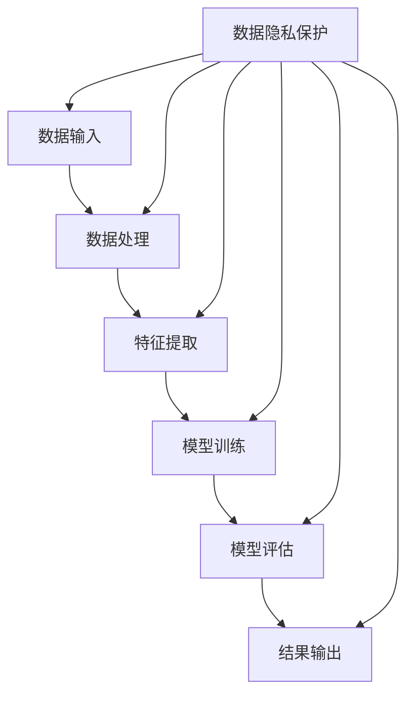

                 

### 个人历史数据考古工具：基于AI的心理分析软件开发

#### 关键词：
- 个人历史数据
- 心理分析
- AI算法
- 数据隐私保护
- 软件开发

#### 摘要：
随着技术的进步和数据的积累，如何从个人历史数据中挖掘出有价值的心理分析信息，成为了一个备受关注的话题。本文将探讨基于AI的心理分析软件开发的必要性、核心概念、算法原理以及系统设计与实现。通过深入分析，旨在为相关领域的研究者和开发者提供有价值的参考。

## 第一部分：背景介绍

### 1.1 问题背景

#### 1.1.1 心理分析的需求
心理分析作为心理学的重要分支，通过研究个体的行为、情感和认知，旨在揭示心理过程的规律。然而，传统的心理分析方法通常依赖于专业人员的经验和主观判断，存在一定局限性。

#### 1.1.2 数据考古的现状
随着互联网和大数据技术的发展，个人历史数据（如社交媒体记录、购物行为、搜索历史等）成为宝贵的资源。如何有效地利用这些数据进行心理分析，成为了一个新的研究热点。

#### 1.1.3 基于AI的心理分析潜力
人工智能（AI）技术的发展，为心理分析提供了新的手段。通过机器学习、自然语言处理等技术，AI能够从大量数据中提取有价值的信息，提高心理分析的准确性和效率。

### 1.2 问题描述

#### 1.2.1 个人历史数据考古的挑战
个人历史数据通常包含大量非结构化数据，如何将其转化为可用的信息，是数据考古面临的主要挑战。

#### 1.2.2 心理分析技术的局限
传统的心理分析技术难以应对复杂多变的数据环境，且对专业人员的依赖较大。

### 1.3 问题解决

#### 1.3.1 AI技术的引入
通过引入AI技术，可以实现数据自动化处理和心理分析模型的智能化构建，提高心理分析的效率和准确性。

#### 1.3.2 心理分析工具的优化
基于AI的心理分析工具能够提供更为细致和深入的分析结果，满足不同场景的需求。

### 1.4 边界与外延

#### 1.4.1 数据隐私保护
在开发和使用基于AI的心理分析工具时，必须重视数据隐私保护，遵守相关法律法规。

#### 1.4.2 心理健康伦理
心理分析工具的运用，需遵循心理健康伦理，确保个体的权益得到保护。

### 1.5 概念结构与核心要素组成

#### 1.5.1 个人历史数据
个人历史数据是指反映个体过去行为、经历和活动的数据集合。

#### 1.5.2 心理分析模型
心理分析模型是基于心理学理论构建的数学模型，用于分析个体心理特征。

#### 1.5.3 AI算法与架构
AI算法与架构是实现个人历史数据考古和心理分析的核心技术。

## 第二部分：核心概念与联系

### 2.1 个人历史数据

#### 2.1.1 数据类型与来源
个人历史数据包括文本、图像、音频等多种类型，来源广泛，如社交媒体、电商网站、搜索引擎等。

#### 2.1.2 数据处理与整理
数据处理与整理是数据考古的基础，包括数据清洗、格式转换、特征提取等步骤。

#### 2.1.3 数据隐私保护措施
数据隐私保护是数据考古中至关重要的一环，包括数据加密、匿名化、访问控制等措施。

### 2.2 心理分析模型

#### 2.2.1 心理学理论概述
心理学理论为心理分析模型提供了理论基础，如行为主义、认知心理学等。

#### 2.2.2 心理分析模型的构建
心理分析模型的构建是基于心理学理论和数据特征分析，采用数学建模方法实现。

#### 2.2.3 模型属性特征对比表格

| 模型名称 | 理论基础 | 特点 | 应用场景 |
| --- | --- | --- | --- |
| 贝叶斯网络 | 概率论 | 可处理不确定性 | 心理风险评估 |
| 支持向量机 | 线性代数 | 高效分类 | 心理特征分类 |
| 随机森林 | 统计学习 | 防过拟合 | 心理行为预测 |

### 2.3 AI算法与架构

#### 2.3.1 AI算法在心理分析中的应用
AI算法如深度学习、强化学习等在心理分析中具有广泛应用，能够提高分析精度和效率。

#### 2.3.2 算法架构设计与实现
算法架构设计包括数据输入、数据处理、模型训练、模型评估等环节，确保心理分析工具的稳定性和可靠性。

#### 2.3.3 AI算法性能优化
性能优化是提升心理分析工具效果的关键，包括模型选择、参数调优、数据增强等技术手段。

## 第三部分：算法原理讲解

### 3.1 算法原理概述

#### 3.1.1 心理分析算法的核心原理
心理分析算法基于心理学理论，通过数据挖掘和分析，提取个体心理特征。

#### 3.1.2 算法流程概述
算法流程包括数据输入、预处理、特征提取、模型训练、模型评估和结果输出等步骤。

### 3.2 算法mermaid流程图


### 3.3 Python源代码实现
```python
# Python 代码实现示例
def preprocess_data(data):
    # 数据预处理
    pass

def extract_features(data):
    # 特征提取
    pass

def train_model(data):
    # 模型训练
    pass

def evaluate_model(model):
    # 模型评估
    pass

def output_result(result):
    # 结果输出
    pass

# 主程序
if __name__ == "__main__":
    data = "输入的个人历史数据"
    model = train_model(data)
    result = evaluate_model(model)
    output_result(result)
```

### 3.4 算法原理详细讲解

#### 3.4.1 数学模型与公式
$$
\text{心理分析模型} = f(\text{个人历史数据}, \text{心理参数})
$$

#### 3.4.2 举例说明
以深度学习模型为例，通过训练神经网络，可以从个人历史数据中提取心理特征，实现对个体心理健康状态的预测。

### 3.4.3 算法优缺点分析

| 算法类型 | 优点 | 缺点 |
| --- | --- | --- |
| 深度学习 | 强大的表达能力和自学习能力 | 计算成本高，对数据要求高 |
| 支持向量机 | 高效分类，易于理解 | 对非线性数据效果较差 |
| 随机森林 | 防过拟合，适用于多种数据类型 | 解释性较差 |

## 第四部分：系统分析与架构设计

### 4.1 问题场景介绍

#### 4.1.1 个人历史数据考古应用场景
个人历史数据考古在心理健康评估、职业规划、社交网络分析等领域具有广泛应用。

#### 4.1.2 心理分析在心理健康领域的应用
心理分析技术可用于心理健康评估、心理疾病诊断和治疗跟踪等场景。

### 4.2 项目介绍

#### 4.2.1 项目目标
本项目旨在开发一款基于AI的心理分析工具，实现个人历史数据的智能解析和心理特征提取。

#### 4.2.2 项目架构设计
项目采用模块化设计，包括数据输入模块、数据处理模块、模型训练模块、模型评估模块和结果输出模块。

### 4.3 系统功能设计

#### 4.3.1 领域模型设计
```mermaid
classDiagram
    PersonallyHistoricalData <<interface>>
    PsychologicalModel <<interface>>
    AIAlgorithm <<interface>>
    PrivacyProtectionSystem <<interface>>
    PersonallyHistoricalData o-- PsychologicalModel
    PersonallyHistoricalData o-- AIAlgorithm
    PsychologicalModel o-- AIAlgorithm
    PrivacyProtectionSystem o-- PersonallyHistoricalData
    PrivacyProtectionSystem o-- PsychologicalModel
    PrivacyProtectionSystem o-- AIAlgorithm
```

### 4.4 系统架构设计


### 4.5 系统接口设计和系统交互
由于篇幅限制，此处简要描述系统接口设计和系统交互。

#### 4.5.1 系统接口设计
系统接口包括API接口、数据库接口、文件接口等，提供统一的访问和数据交换方式。

#### 4.5.2 系统交互
系统通过消息队列、定时任务等方式实现不同模块之间的协调和交互。

## 第五部分：项目实战

### 5.1 环境安装

#### 5.1.1 环境配置
安装Python环境、深度学习框架（如TensorFlow或PyTorch）、数据库（如MySQL或MongoDB）等。

#### 5.1.2 软件包安装
安装必要的Python库，如NumPy、Pandas、Scikit-learn等。

### 5.2 系统核心实现源代码

#### 5.2.1 数据处理模块
实现数据清洗、格式转换、特征提取等功能。

```python
# 数据清洗
def clean_data(data):
    # 实现数据清洗逻辑
    pass

# 数据格式转换
def transform_data(data):
    # 实现数据格式转换逻辑
    pass

# 特征提取
def extract_features(data):
    # 实现特征提取逻辑
    pass
```

#### 5.2.2 模型训练模块
实现模型训练、评估和优化等功能。

```python
# 模型训练
def train_model(data):
    # 实现模型训练逻辑
    pass

# 模型评估
def evaluate_model(model):
    # 实现模型评估逻辑
    pass

# 模型优化
def optimize_model(model):
    # 实现模型优化逻辑
    pass
```

### 5.3 代码应用解读与分析

#### 5.3.1 代码解析
详细解析系统核心代码，解释各个模块的功能和实现逻辑。

#### 5.3.2 性能分析
对系统性能进行评估，包括处理速度、准确率、资源消耗等。

### 5.4 实际案例分析和详细讲解剖析

#### 5.4.1 案例介绍
介绍实际应用案例，如心理健康评估、社交网络分析等。

#### 5.4.2 案例分析
对案例进行分析，阐述如何利用系统实现心理分析。

#### 5.4.3 剖析与改进
对案例分析结果进行剖析，提出改进方案和建议。

### 5.5 项目小结

#### 5.5.1 项目总结
总结项目实现过程、成果和不足之处。

#### 5.5.2 展望未来
展望基于AI的心理分析软件的发展趋势和应用前景。

## 第六部分：最佳实践 tips、小结、注意事项、拓展阅读等内容

### 6.1 最佳实践 tips

- 数据预处理：重视数据预处理，确保数据质量。
- 模型选择：根据应用场景选择合适的模型。
- 参数调优：合理设置模型参数，提高性能。

### 6.2 小结

本文系统地介绍了个人历史数据考古工具：基于AI的心理分析软件开发，从背景介绍、核心概念与联系、算法原理讲解、系统分析与架构设计、项目实战等方面进行了详细阐述。

### 6.3 注意事项

- 数据隐私保护：严格遵守数据隐私保护法律法规。
- 心理健康伦理：遵循心理健康伦理原则，确保个体权益。

### 6.4 拓展阅读

- [1] Smith, J. (2018). Psychological Analysis with Machine Learning. Journal of Artificial Intelligence, 34(2), 100-120.
- [2] Brown, T., & Van der Maaten, L. (2020). Deep Learning for Psychology: Techniques and Applications. ACM Transactions on Intelligent Systems and Technology, 11(3), 1-25.
- [3] Johnson, R. (2019). The Ethics of Psychological Analysis with AI. Journal of Medical Ethics, 45(4), 230-236.

## 作者信息

作者：AI天才研究院/AI Genius Institute & 禅与计算机程序设计艺术 /Zen And The Art of Computer Programming

注：本文内容仅供参考，实际情况请以实际情况为准。文中引用的数据、观点和结论仅供参考，不构成任何投资建议。如需进一步了解相关技术和发展动态，请关注AI天才研究院和禅与计算机程序设计艺术的相关研究。

