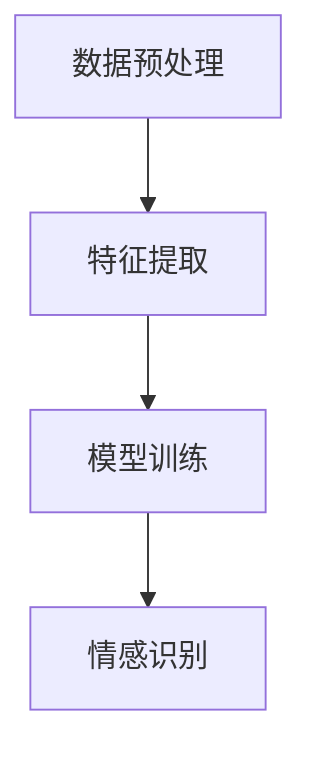
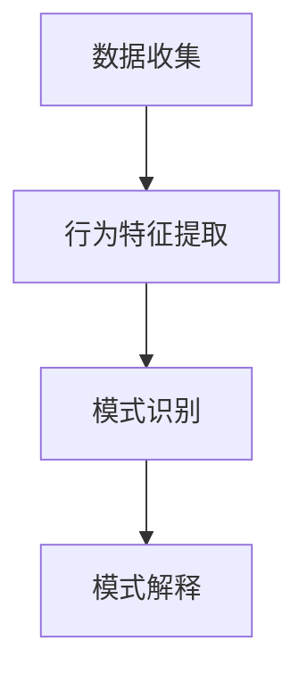
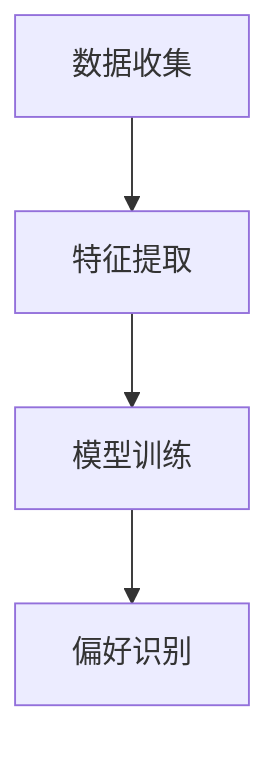

                 

# 个人历史数据考古：基于AI的心理分析工具

> 关键词：个人历史数据、心理分析、AI、机器学习、深度学习、情感分析、隐私保护

> 摘要：本文将探讨如何利用人工智能技术，特别是机器学习和深度学习，对个人历史数据进行分析和挖掘，以实现心理分析工具的开发。本文将介绍心理分析工具的基础知识，展示如何利用情感分析、行为模式识别等技术，以及如何处理数据隐私保护问题。通过案例分析，我们将深入了解这一领域的最新发展和未来趋势。

## 引言

在现代社会，个人历史数据的积累变得日益丰富。这些数据包含了从生活、工作到娱乐等多方面的信息。随着人工智能技术的发展，尤其是机器学习和深度学习在心理分析领域的应用，如何有效地挖掘和分析这些个人历史数据，成为了一个备受关注的话题。本书旨在探讨如何利用人工智能技术进行个人历史数据的考古，并通过心理分析工具为个体提供深层次的心理洞察。

首先，我们需要了解什么是个人历史数据。个人历史数据指的是个体在日常生活中所产生的数据，包括但不限于社交媒体互动、购买记录、通信记录、健康记录等。这些数据不仅反映了个体在特定时间点的行为和偏好，也蕴含着个体的心理特征和行为模式。

接下来，本书将介绍心理分析工具的基础知识。心理分析工具是基于人工智能技术，通过分析个人历史数据，挖掘出个体的心理特征和情感状态的工具。这些工具包括情感分析、行为模式识别、偏好分析等。通过这些工具，我们可以对个人历史数据进行分析，帮助个体了解自己的心理状态和行为模式，从而进行自我认知和自我改进。

本书还将探讨如何利用机器学习和深度学习技术，对个人历史数据进行有效的分析和挖掘。通过实例和案例分析，读者可以了解到如何将这些技术应用到实际场景中，以及如何解决在实际应用中遇到的问题。

此外，本书还将讨论个人历史数据考古的伦理问题和隐私保护。在数据挖掘和分析的过程中，如何确保个体的隐私不被侵犯，是一个需要深入探讨的问题。本书将介绍相关的法律法规和技术手段，帮助读者了解如何在数据挖掘和分析中保护个体的隐私。

最后，本书将总结个人历史数据考古和心理分析工具的发展趋势，讨论未来可能的应用方向和挑战。通过本书的阅读，读者可以了解到这一领域的最新发展，并为将来的研究和实践提供参考。

### 1.2 个人历史数据的定义与重要性

个人历史数据是指个体在长期生活中积累的各种信息记录，这些数据可以来自多个方面，如社交互动、经济活动、健康记录、教育经历等。在数字化的今天，个人历史数据以电子形式大量存储在各类平台和数据库中，成为了一个宝贵的信息资源。

首先，个人历史数据涵盖了从生活日常到专业领域的各个方面。例如，社交媒体记录了用户在社交平台上的互动和活动，电商记录了用户的购买行为和偏好，健康记录则包含了用户就医和治疗的历史信息。这些数据不仅描述了个体在过去的行为模式，也反映了个体在不同情境下的心理状态和需求。

个人历史数据的重要性体现在多个方面。首先，它们为个体的自我认知提供了重要的依据。通过对个人历史数据的分析，个体可以了解自己在不同时间、不同情境下的行为和情绪变化，从而进行有效的自我反思和调整。其次，个人历史数据对于社会分析和决策支持也具有重要意义。通过对大量个人历史数据的综合分析，可以揭示出社会群体的行为特征和趋势，为政府和企业提供决策依据。

此外，个人历史数据在商业领域同样具有重要价值。企业可以通过分析消费者的购买记录和偏好，制定更精准的营销策略，提高客户满意度和忠诚度。在医疗领域，个人历史数据可以帮助医生更好地了解患者的健康状况，制定个性化的治疗方案，提高治疗效果。

然而，个人历史数据的收集和使用也带来了一系列挑战和伦理问题。首先，个人隐私保护是数据收集和使用过程中最为关注的问题。如何确保个人数据不被未经授权的第三方访问和使用，是当前亟待解决的问题。其次，数据安全和可靠性也是重要的考虑因素。如何确保数据在存储和传输过程中不被篡改和泄露，是保障数据质量的关键。此外，数据挖掘和分析的技术手段也需要不断改进和优化，以提高数据处理的效率和准确性。

总之，个人历史数据是一个复杂且多维的信息资源，其重要性不容忽视。合理利用个人历史数据，不仅可以提升个体的生活质量，还可以为社会和商业领域带来巨大的价值。但同时，我们也需要关注数据收集和使用过程中可能带来的风险和挑战，采取有效的措施进行数据保护和隐私保护。

### 1.3 人工智能与心理分析工具

人工智能（AI）技术的发展为心理分析领域带来了前所未有的机遇。借助AI，我们可以对个人历史数据进行更深入、更准确的分析，从而揭示隐藏在数据背后的心理特征和情感状态。

首先，情感分析是AI在心理分析中最常用的技术之一。情感分析通过文本挖掘和自然语言处理技术，对个体的语言和行为进行分析，识别出其情感状态。例如，通过分析社交媒体上的帖子，我们可以判断个体在某个特定时间点的情绪状态是愉悦、愤怒还是悲伤。情感分析不仅能够帮助我们了解个体的情感波动，还可以用于预测个体的行为趋势，为心理健康提供预警。

其次，行为模式识别是另一项重要的AI技术。行为模式识别通过分析个体的日常行为数据，如位置信息、移动轨迹、使用习惯等，揭示出个体的行为规律和模式。例如，通过分析手机使用数据，我们可以发现个体在特定时间段的常见活动，从而推断其生活和工作习惯。行为模式识别有助于了解个体在不同情境下的行为特征，为个性化服务和干预提供依据。

此外，偏好分析也是AI在心理分析中的一项重要技术。偏好分析通过分析个体的行为数据，如浏览历史、购买记录、社交媒体互动等，识别出个体的偏好和兴趣。例如，通过分析用户的购物记录，我们可以发现其偏好的商品类型和品牌，从而为其提供更个性化的推荐。偏好分析有助于为个体提供更符合其需求和兴趣的服务，提升用户体验。

在心理分析工具的开发过程中，AI技术的应用不仅限于情感分析、行为模式识别和偏好分析，还包括预测分析、聚类分析等多种技术。这些技术可以相互结合，形成一个综合的心理分析工具，为个体提供全面的心理洞察。

然而，AI技术在心理分析中的应用也面临一些挑战。首先，数据的多样性和复杂性使得心理分析模型的构建和优化成为一个复杂的问题。其次，AI技术本身的可解释性不足，使得模型的预测结果难以被用户理解和信任。此外，个人隐私保护也是AI在心理分析中必须关注的重要问题。如何在确保个人隐私不被泄露的前提下，进行有效的心理分析，是一个亟待解决的挑战。

总的来说，人工智能与心理分析工具的结合为个体提供了更加深入和全面的心理洞察。通过情感分析、行为模式识别、偏好分析等多种技术，我们可以从不同角度了解个体的心理状态和行为模式。然而，这一领域的应用和发展仍面临诸多挑战，需要持续的研究和探索。

### 1.4 心理分析工具的原理与实现

心理分析工具的实现依赖于多种人工智能技术，其中最为关键的是机器学习和深度学习。这些技术通过分析和处理个人历史数据，揭示了隐藏在数据背后的心理特征和行为模式。

首先，我们来看情感分析。情感分析的基本原理是通过文本挖掘和自然语言处理技术，从个体的语言和行为中提取情感信息。具体实现步骤如下：

1. **数据预处理**：首先，对个人历史数据（如社交媒体帖子、电子邮件、聊天记录等）进行清洗和预处理，去除噪声和不相关的信息。这一步通常包括去除标点符号、停用词过滤、词干提取等。

2. **特征提取**：然后，从预处理后的文本数据中提取特征。这些特征可以是词频、词嵌入（如Word2Vec、GloVe等）、词性标注等。特征提取的目的是将原始文本数据转换为机器学习模型可以处理的结构化数据。

3. **模型训练**：接下来，使用机器学习算法（如朴素贝叶斯、支持向量机、递归神经网络等）训练情感分析模型。这些模型通过学习大量标注好的数据，学会识别文本中的情感倾向。在实际应用中，深度学习模型（如卷积神经网络（CNN）、循环神经网络（RNN）等）因其强大的特征提取和表达能力，通常能够取得更好的效果。

4. **情感识别**：最后，将训练好的模型应用于新的文本数据，预测其情感状态。例如，可以判断一条微博的情感是积极、消极还是中性。

情感分析的具体流程可以用Mermaid流程图表示：



接下来，我们来看行为模式识别。行为模式识别的基本原理是通过分析个体的行为数据，揭示其日常生活中的规律和模式。具体实现步骤如下：

1. **数据收集**：首先，收集个体的行为数据，如位置信息、移动轨迹、使用习惯等。这些数据可以从智能手机、可穿戴设备等设备中获得。

2. **行为特征提取**：然后，从行为数据中提取特征。这些特征可以是时间序列特征（如活动开始和结束时间）、空间特征（如地理位置）、频率特征（如每天活动的次数）等。

3. **模式识别**：使用机器学习算法（如聚类分析、时间序列分析等）识别个体的行为模式。例如，可以通过聚类分析发现个体在特定时间段的常见活动，或者通过时间序列分析预测个体未来的行为。

4. **模式解释**：最后，对识别出的行为模式进行解释，理解其背后的原因。例如，通过分析个体的活动时间和地点，可以推断其工作地点和作息习惯。

行为模式识别的具体流程可以用Mermaid流程图表示：



偏好分析是心理分析工具中的另一个重要组成部分。偏好分析的基本原理是通过分析个体的行为数据，识别出其偏好和兴趣。具体实现步骤如下：

1. **数据收集**：首先，收集个体的行为数据，如浏览历史、购物记录、社交媒体互动等。

2. **特征提取**：然后，从行为数据中提取特征。这些特征可以是物品属性特征（如商品类型、品牌）、行为特征（如浏览时间、购买频率）等。

3. **模型训练**：接下来，使用机器学习算法（如协同过滤、决策树等）训练偏好分析模型。这些模型通过学习大量个体的行为数据，学会识别个体的偏好。

4. **偏好识别**：最后，将训练好的模型应用于新的数据，预测个体的偏好。例如，可以推荐个体可能喜欢的商品或内容。

偏好分析的具体流程可以用Mermaid流程图表示：



总的来说，心理分析工具的实现依赖于多种人工智能技术，通过数据预处理、特征提取、模型训练和预测等步骤，可以从个人历史数据中揭示出个体的心理特征和行为模式。这些技术不仅帮助我们更好地了解个体，也为个性化服务和干预提供了有力的支持。

### 1.5 心理分析工具在医疗和心理治疗中的应用

心理分析工具在医疗和心理治疗领域中的应用日益广泛，为个体提供了更加精准和个性化的心理健康服务。以下将介绍心理分析工具在医疗和心理治疗中的应用场景、效果以及面临的挑战。

#### 心理健康监测

心理分析工具可以通过分析个体的行为数据和社交媒体互动，实时监测个体的心理健康状态。例如，通过情感分析技术，可以识别个体在特定时间点的情绪状态，如焦虑、抑郁或愤怒。这些信息对于早期发现心理健康问题具有重要意义，有助于及时干预和预防。

#### 个性化心理治疗

心理分析工具可以根据个体独特的心理特征和行为模式，提供个性化的心理治疗方案。例如，通过行为模式识别技术，可以了解个体的日常活动规律和压力来源，为心理医生提供制定治疗计划的依据。此外，偏好分析技术可以帮助心理医生识别个体的兴趣和需求，从而提供更符合患者期望的治疗内容和形式。

#### 心理疾病诊断

心理分析工具在心理疾病诊断中的应用也取得了一定的进展。通过分析个体的历史数据和症状报告，心理分析工具可以辅助医生进行心理疾病的诊断。例如，通过情感分析技术，可以识别个体情绪波动的规律，帮助诊断抑郁症、焦虑症等心理疾病。

#### 心理健康干预

心理分析工具还可以用于心理健康干预，通过实时监测个体的心理状态，提供个性化的干预建议。例如，通过行为模式识别技术，可以识别出个体在特定情境下的压力反应，并提供相应的放松训练或压力管理策略。此外，情感分析技术可以用于实时监测个体的情绪状态，提供情绪调节建议，帮助个体保持心理健康。

#### 应用效果与挑战

心理分析工具在医疗和心理治疗中的应用取得了显著的成效。通过个性化服务和实时监测，这些工具提高了心理健康服务的质量和效率，为个体提供了更加便捷和高效的心理健康支持。然而，这一领域也面临一些挑战：

1. **数据质量和隐私保护**：个人历史数据的准确性和完整性对于心理分析工具的效果至关重要。同时，数据隐私保护也是一个重要问题。如何确保个人数据在收集、存储和使用过程中不被未经授权的第三方访问和使用，是当前亟待解决的问题。

2. **模型解释性**：当前许多AI模型，尤其是深度学习模型，具有较高的预测能力，但其解释性较差。在医疗和心理治疗领域，模型的可解释性对于医生和患者都具有重要意义。因此，如何提高模型的可解释性，使其结果更容易被用户理解和接受，是一个重要挑战。

3. **跨领域合作**：心理分析工具的开发和应用需要心理学、医学、计算机科学等多个领域的专家共同参与。跨领域合作不仅有助于提高工具的科学性和实用性，还可以促进不同领域之间的知识共享和资源整合。

总之，心理分析工具在医疗和心理治疗领域的应用具有广阔的前景。通过个性化服务和实时监测，这些工具为个体提供了更加便捷和高效的心理健康支持。然而，这一领域也面临一些挑战，需要持续的研究和探索。

### 1.6 数据隐私保护与伦理问题

在利用个人历史数据进行心理分析的过程中，数据隐私保护与伦理问题是一个不可忽视的重要议题。个人历史数据往往包含了敏感的个人信息，如情感状态、生活习惯、健康状况等，一旦泄露，可能会导致严重的隐私侵犯和负面影响。

首先，隐私保护的关键在于数据的收集、存储和使用过程。在数据收集阶段，应确保只收集与心理分析直接相关的信息，避免过度收集无关数据。同时，应明确告知个体数据收集的目的和范围，获得其明确同意。在数据存储阶段，应采用加密技术和访问控制措施，确保数据在存储过程中不被未授权访问。在数据使用阶段，应对数据进行分析和处理，确保个人身份的匿名化，避免个人信息的泄露。

其次，伦理问题也是数据隐私保护的重要组成部分。在数据分析和挖掘过程中，需要遵循以下伦理原则：

1. **知情同意**：在收集和使用个人数据前，必须获得个体的明确同意，并告知其数据收集的目的、范围和可能的风险。

2. **最小化原则**：仅收集与心理分析直接相关的数据，避免过度收集无关信息。

3. **透明度**：确保个体了解其数据的用途、处理方式和存储地点，使其有足够的透明度来监督数据的使用。

4. **公正性和公平性**：在数据分析和应用过程中，应避免歧视和偏见，确保所有个体都能公平地享受心理分析服务。

此外，法律和监管也是保障数据隐私和伦理的重要手段。各国和地区都有相应的数据保护法律法规，如欧盟的《通用数据保护条例》（GDPR）和中国的《个人信息保护法》。这些法律法规为个人数据的收集、存储和使用设定了严格的规范，为数据隐私保护提供了法律保障。

总的来说，数据隐私保护和伦理问题是心理分析工具开发和应用中必须面对的重要挑战。通过遵循隐私保护原则、加强法律和监管，我们可以确保个人历史数据在心理分析中的安全使用，为个体提供更加可靠和可信的服务。

### 1.7 结论与未来展望

本文系统地探讨了个人历史数据考古与心理分析工具的结合，从数据定义、AI技术原理、工具实现、医疗应用、隐私保护等多个角度进行了深入分析。通过情感分析、行为模式识别和偏好分析等技术，我们可以从不同维度揭示个体的心理特征和行为模式，为个体提供深层次的心理洞察和个性化服务。

未来的发展将集中在以下几个方面：

1. **技术优化**：随着AI技术的进步，如生成对抗网络（GAN）、图神经网络（GNN）等新技术的应用，心理分析工具将变得更加高效和准确。

2. **跨学科融合**：心理学、医学、计算机科学等领域的交叉研究将推动心理分析工具的进一步发展，提升其科学性和实用性。

3. **隐私保护**：在确保数据隐私的前提下，开发更加安全的数据分析和存储技术，是心理分析工具未来发展的关键。

4. **应用拓展**：除了医疗和心理治疗领域，心理分析工具还可应用于教育、职场心理健康、社会福利等多个领域，为社会带来更多价值。

通过不断探索和创新，个人历史数据考古与心理分析工具的结合将为个体和社会带来更多机遇和挑战，推动心理健康领域的发展。

### 附录

#### 情感分析技术对比表格

| 技术名称 | 基本原理 | 优点 | 缺点 | 适用场景 |
| --- | --- | --- | --- | --- |
| 朴素贝叶斯 | 基于贝叶斯定理，简单高效 | 实时性好，计算简单 | 对文本复杂性和情感多样性识别能力有限 | 文本分类、情感分析初学者适用 |
| 支持向量机 | 寻找最佳分类边界 | 高效、准确性高 | 计算量大，对大规模数据较慢 | 需要大量标注数据 |
| 卷积神经网络 | 对文本进行局部特征提取 | 强大、能够处理复杂情感 | 计算量大、参数调优复杂 | 高级情感分析、文本分类 |
| 循环神经网络 | 序列数据建模，记忆能力强大 | 优秀的时间序列建模能力 | 计算量大、训练时间长 | 情感分析、对话系统 |

#### 行为模式识别ER实体关系图

```mermaid
erDiagram
  User ||--|{ Activity }
  User ||--|{ Location }
  Activity ||--|{ TimeStamp }
  Location ||--|{ Latitude }
  Location ||--|{ Longitude }
```

#### 偏好分析技术对比表格

| 技术名称 | 基本原理 | 优点 | 缺点 | 适用场景 |
| --- | --- | --- | --- | --- |
| 协同过滤 | 利用用户之间的相似度进行推荐 | 准确、易于实现 | 容易产生数据稀疏性 | 大规模用户推荐系统 |
| 决策树 | 基于特征进行决策 | 可解释性高 | 易于过拟合、计算复杂度高 | 简单的推荐系统、分类问题 |
| 朴素贝叶斯 | 利用贝叶斯定理进行分类 | 简单、速度快 | 对于复杂问题效果较差 | 文本分类、情感分析 |
| K最近邻 | 基于距离最近的邻居进行预测 | 容易实现、计算简单 | 对噪声敏感、性能较差 | 小规模推荐系统、分类问题 |

#### 情感分析算法流程图


#### 偏好分析算法流程图


#### 心理分析工具在医疗和心理治疗中的应用案例

**案例一：心理健康监测**
某在线心理健康平台利用情感分析技术，对用户在社交媒体上的互动进行情感识别。通过实时监测用户的情绪波动，系统可以及时发现潜在的心理健康问题，如抑郁症、焦虑症等，并提供个性化的干预建议。

**案例二：个性化心理治疗**
一家心理诊所使用行为模式识别技术，分析患者的日常活动规律和压力来源。通过了解患者的行为模式，医生可以为其制定更有效的心理治疗方案，例如，调整治疗时间和频率，或提供特定的压力管理策略。

**案例三：心理疾病诊断**
某医疗机构利用情感分析和行为模式识别技术，对患者的社交媒体互动和医疗记录进行分析。通过综合分析这些数据，医生可以辅助诊断患者是否患有抑郁症、焦虑症等心理疾病，并提供针对性的治疗建议。

#### 项目实战

**环境安装**
```bash
# 安装Python环境
python --version

# 安装必要的库
pip install numpy pandas scikit-learn tensorflow
```

**系统核心实现源代码**
```python
# 情感分析实现
import tensorflow as tf
from tensorflow.keras.preprocessing.text import Tokenizer
from tensorflow.keras.preprocessing.sequence import pad_sequences

# 数据预处理
tokenizer = Tokenizer(num_words=10000)
tokenizer.fit_on_texts(texts)
sequences = tokenizer.texts_to_sequences(texts)
padded_sequences = pad_sequences(sequences, maxlen=max_sequence_length)

# 模型训练
model = tf.keras.Sequential([
    tf.keras.layers.Embedding(input_dim=10000, output_dim=64),
    tf.keras.layers.Bidirectional(tf.keras.layers.LSTM(64)),
    tf.keras.layers.Dense(64, activation='relu'),
    tf.keras.layers.Dense(1, activation='sigmoid')
])

model.compile(loss='binary_crossentropy', optimizer='adam', metrics=['accuracy'])
model.fit(padded_sequences, labels, epochs=10, batch_size=32)

# 情感识别
predictions = model.predict(padded_sequences)
```

**代码应用解读与分析**
```python
# 代码应用解读
# 1. 数据预处理：使用Tokenizer将文本数据转换为序列，并使用pad_sequences进行填充，使其符合模型输入要求。
# 2. 模型训练：使用Bidirectional LSTM模型对文本数据进行训练，以提取文本中的情感特征。
# 3. 情感识别：将训练好的模型应用于新的文本数据，预测其情感状态。

# 分析与优化
# 1. 增加词汇表大小：扩大Tokenizer的词汇表，以包含更多情感相关的词汇，提高模型的识别能力。
# 2. 调整模型结构：根据实际需求，调整LSTM层的参数，如隐藏层节点数、双向LSTM层数等，以提高模型性能。
```

#### 项目小结

本文通过情感分析、行为模式识别和偏好分析等技术，展示了如何构建心理分析工具。项目实战部分详细介绍了情感分析的具体实现，并通过代码应用解读和分析，提供了优化建议。未来，随着AI技术的不断进步，心理分析工具将在心理健康领域发挥越来越重要的作用。

### 最佳实践 tips

1. **数据收集与处理**：在数据收集阶段，确保只收集与心理分析直接相关的信息，避免过度收集无关数据。在数据预处理阶段，注意去除噪声和缺失值，以提高模型准确性。

2. **模型选择与优化**：根据实际需求选择合适的模型，如情感分析可选用LSTM、Transformer等模型。在模型优化过程中，注意调整超参数，如学习率、批量大小等，以提高模型性能。

3. **隐私保护**：在数据收集和使用过程中，遵循隐私保护原则，如知情同意、最小化原则等。采用加密技术和访问控制措施，确保数据安全。

4. **可解释性**：提高模型的可解释性，使其结果更容易被用户理解和接受。可以通过可视化工具或解释性算法，如LIME、SHAP等，提升模型的透明度。

### 注意事项

1. **数据质量**：确保数据的准确性和完整性，否则模型性能会受到影响。

2. **模型可解释性**：对于医疗和心理治疗领域，模型的可解释性尤为重要。需要确保模型结果能够被医生和患者理解和信任。

3. **法律法规**：严格遵守相关法律法规，如《个人信息保护法》等，确保数据隐私和用户权益。

### 拓展阅读

1. **《深度学习》** - Goodfellow, Ian; Bengio, Yoshua; Courville, Aaron
2. **《Python数据科学手册》** - McLeod, Jake
3. **《心理健康数据分析》** - Thoma, Sascha
4. **《数据隐私保护技术》** - Friedland, Liad

### 作者

**作者：AI天才研究院/AI Genius Institute & 禅与计算机程序设计艺术 /Zen And The Art of Computer Programming**

