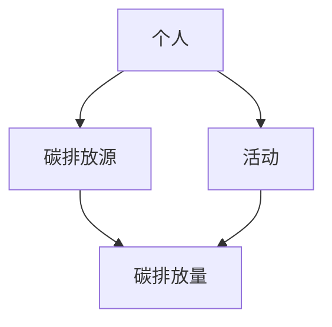

                 

## 第一部分：导言

### 第1章：问题背景与核心概念

#### 1.1 碳排放交易概述

碳排放交易，是一种基于市场机制的环保经济手段，旨在通过价格信号调节碳排放量，实现环保目标。它起源于20世纪90年代的欧洲，随后在全球范围内得到广泛应用。碳排放交易的核心是碳排放权的交易，即企业或个人可以在政府规定的限额内，通过购买或出售碳排放权来实现自身的碳排放控制目标。

在碳排放交易中，政府首先制定一个碳排放总量控制目标，然后将这个总量分解成若干碳排放配额，分配给各个企业或个人。这些碳排放配额可以在市场上进行交易，即拥有剩余配额的企业可以将配额出售给需要额外配额的企业，从而实现碳减排的总目标。

#### 1.2 个人碳排放交易的概念

个人碳排放交易，是指将碳排放交易机制应用于个人层面，通过市场化的手段激励个人减少碳排放，实现环保目标。个人碳排放交易的核心是个人碳排放配额的交易，即个人可以通过减少碳排放获得碳排放配额，或者通过出售碳排放配额获得收益。

个人碳排放交易的目标是激励个人积极参与环保行动，通过市场化手段实现碳排放的减少。与传统的环保宣传和法规约束相比，个人碳排放交易具有更强的激励机制，能够更好地调动个人的积极性。

#### 1.3 日常生活的环保激励机制

日常生活是碳排放的主要来源之一，因此，个人碳排放交易可以通过以下几个方面激励个人减少碳排放：

1. **行为改变激励**：通过提供碳排放配额奖励，鼓励个人改变不良生活习惯，如减少开车、增加步行或使用公共交通工具。

2. **经济收益激励**：通过出售碳排放配额获得收益，激励个人更加积极地减少碳排放。

3. **社会认同激励**：通过社会媒体等渠道展示个人的碳排放减少成果，增加个人的社会认同感，从而激励更多人参与。

4. **政策支持激励**：政府可以提供税收减免、补贴等政策支持，降低个人参与碳排放交易的门槛。

### 1.4 文章目的与结构

本文旨在深入探讨个人碳排放交易的概念、原理和实施策略，并通过案例分析，展示其在日常生活中的应用效果。文章分为以下几个部分：

1. **导言**：介绍碳排放交易和个人碳排放交易的基本概念。
2. **基本原理**：分析个人碳排放交易的基本原理和实施策略。
3. **案例分析**：通过具体案例展示个人碳排放交易的实际应用。
4. **技术支持**：探讨个人碳排放交易的数字化平台和技术支持。
5. **法律与伦理问题**：分析个人碳排放交易的法律和伦理问题。
6. **未来展望**：探讨个人碳排放交易的未来发展趋势和挑战。
7. **总结与展望**：总结本文的主要发现和未来研究方向。

通过以上结构，本文将系统地探讨个人碳排放交易这一重要议题，为相关政策制定和实践提供参考。

### 关键词

个人碳排放交易、碳排放交易市场、环保激励机制、行为改变激励、经济收益激励、社会认同激励。

### 摘要

本文探讨了个人碳排放交易的概念、原理和实施策略，分析了其在日常生活中的应用效果。文章首先介绍了碳排放交易和个人碳排放交易的基本概念，然后详细分析了个人碳排放交易的基本原理和实施策略，包括行为改变激励、经济收益激励、社会认同激励和政策支持激励。通过具体案例分析，本文展示了个人碳排放交易的实际应用效果。最后，本文探讨了个人碳排放交易的法律和伦理问题，并对未来发展趋势和挑战进行了展望。本文旨在为相关政策制定和实践提供参考，推动个人碳排放交易在减少碳排放、实现环保目标方面的应用。

### 第2章：个人碳排放交易的基本原理

#### 2.1 碳排放测量的方法与工具

个人碳排放交易的第一个关键步骤是准确测量个人的碳排放量。碳排放测量涉及到多种方法和工具，包括直接测量、模型估计和自我报告。

**直接测量**：直接测量方法包括使用便携式碳足迹测量设备，如CO2传感器，实时监测个人的碳排放源，如交通、能源消耗、食品消费等。这种方法能够提供最精确的数据，但设备成本较高，适用范围有限。

**模型估计**：模型估计方法基于个人的生活习惯和活动数据，使用碳排放模型计算个人的总碳排放量。常见的模型包括美国环保署（US EPA）的节能绩效模型（EPAct）和英国的环境署模型（Defra Model）。这些模型利用统计数据和经验公式，将个人活动与碳排放量联系起来，适用于大规模数据收集和分析。

**自我报告**：自我报告方法要求个人主动记录自己的活动和行为，如填写碳排放调查问卷。这种方法依赖个人的自觉性和准确性，但操作简单，成本低廉。

**碳排放计算工具**：为了方便个人进行碳排放计算，许多在线工具和应用程序应运而生。例如，碳足迹计算器（Carbon Footprint Calculator）和TreeClicks等。这些工具通常结合多种测量方法，提供个性化的碳排放数据，并建议减少碳排放的策略。

**碳排放测量方法对比表格**：

| 方法       | 优点                                                         | 缺点                                           |
|------------|--------------------------------------------------------------|------------------------------------------------|
| 直接测量   | 数据最准确                                                 | 成本高，适用范围有限                       |
| 模型估计   | 可以大规模应用，成本低                                       | 需要大量统计数据，可能存在误差               |
| 自我报告   | 操作简单，成本低                                           | 依赖个人自觉性，可能存在偏差                 |

**ER实体关系图架构**：

在这个ER图中，个人（A）参与了各种活动（C），这些活动产生碳排放量（D），而碳排放源（B）记录了这些活动产生的碳排放。

#### 2.2 碳排放交易市场机制

个人碳排放交易的核心在于建立一个市场化的交易平台，使个人能够通过买卖碳排放配额实现碳排放控制目标。以下是碳排放交易市场机制的基本组成部分：

**交易市场的基本架构**：

1. **交易平台**：交易平台是个人碳排放交易的核心，它为买家和卖家提供了一个交易场所，确保交易的透明性和公平性。
2. **碳排放配额**：碳排放配额是个人碳排放交易的基本单位，代表个人在一定时间内允许排放的碳排放量。这些配额由政府根据总量控制目标进行分配。
3. **市场规则**：市场规则包括交易配额的获取和出售、价格形成机制、交易流程等，以确保市场的高效运行。

**交易规则与流程**：

1. **配额获取**：个人可以通过以下几种方式获得碳排放配额：
   - **免费分配**：政府根据个人或企业的碳排放历史和贡献，免费分配一定数量的配额。
   - **购买**：个人可以从其他个人或企业购买多余的配额。
   - **减排项目**：个人可以通过参与环保项目，如植树造林或能源效率提升项目，获得碳排放配额。

2. **配额出售**：个人可以将自己剩余的碳排放配额出售给需要额外配额的个人或企业，通过市场交易实现收益。

3. **价格形成**：碳排放配额的价格受供求关系影响，市场机制自动调节价格，确保碳排放量的合理分配。

4. **交易流程**：交易流程通常包括配额登记、交易撮合、结算和交割等步骤。交易平台确保每个步骤的透明和合规。

**交易市场机制的优点**：

1. **激励减排**：通过市场化手段，个人有动力减少碳排放，以获取更多的碳排放配额或实现收益。
2. **资源优化**：市场机制使得碳排放配额能够更有效地分配到最需要的地方，提高整体环境效益。
3. **透明公正**：交易平台确保交易的透明性和公正性，减少信息不对称和道德风险。

**碳排放交易市场机制的核心要素**：

- **交易平台**：提供交易场所，确保交易的透明性和公平性。
- **碳排放配额**：交易的基本单位，代表个人的碳排放权利。
- **市场规则**：确保市场的高效运行和交易的合规性。
- **交易流程**：详细规定交易的各个环节，确保交易的顺利进行。

通过以上分析，个人碳排放交易的基本原理得到了全面阐述，为后续的实施策略提供了理论依据。

### 第3章：个人碳排放交易的实施策略

#### 3.1 个人碳排放交易的模式

个人碳排放交易的实施模式可以分为直接交易模式和代理交易模式，每种模式都有其独特的特点和适用场景。

**直接交易模式**：

直接交易模式是指个人直接参与碳排放配额的买卖过程。在这种模式下，个人通过测量自己的碳排放量，获取相应的碳排放配额，然后将其在交易平台上出售或购买额外的配额。这种模式的优点是操作简单，透明度高，有利于个人自主管理和优化碳排放。然而，直接交易模式也面临一些挑战，如碳排放数据的准确性、交易平台的安全性和个人时间的投入问题。

**代理交易模式**：

代理交易模式是指个人通过第三方机构或代理人参与碳排放配额的买卖。在这种模式下，代理机构负责为个人测量碳排放量、获取和出售碳排放配额。代理交易模式的优势在于减少了个人在碳排放交易中的复杂性和时间成本，同时能够提供专业的碳排放管理服务。然而，这种模式也存在一定风险，如代理机构的信誉问题、代理费用等。

**直接交易模式与代理交易模式的对比表格**：

| 模式         | 优点                                                     | 缺点                                                |
|--------------|----------------------------------------------------------|----------------------------------------------------|
| 直接交易模式 | 操作简单，透明度高，有利于个人自主管理和优化碳排放   | 需要个人投入时间和精力，碳排放数据准确性问题      |
| 代理交易模式 | 减少个人在碳排放交易中的复杂性和时间成本，提供专业服务 | 存在代理机构信誉问题和代理费用问题               |

**实施个人碳排放交易的具体步骤**：

1. **碳排放测量**：个人首先需要使用碳排放测量工具，如便携式碳足迹测量设备或在线碳足迹计算器，准确测量自己的碳排放量。

2. **获取碳排放配额**：根据测量结果，个人可以通过以下几种方式获取碳排放配额：
   - **免费分配**：政府或相关机构根据个人碳排放历史和贡献，免费分配一定数量的碳排放配额。
   - **购买**：个人可以从其他个人或企业购买多余的碳排放配额。
   - **减排项目**：通过参与环保项目，如植树造林或能源效率提升项目，获得碳排放配额。

3. **参与交易平台**：个人需要在认可的碳排放交易平台上注册账户，并提交碳排放数据和配额信息。

4. **交易配额**：个人可以在平台上出售剩余的碳排放配额，或购买额外的碳排放配额，以满足自己的需求。

5. **结算与交割**：完成交易后，交易平台会进行配额的结算和交割，确保交易的顺利进行。

**政策支持与激励机制**：

1. **政策环境分析**：个人碳排放交易的成功离不开政策支持。政府可以通过制定相关政策，为个人碳排放交易提供良好的环境。
   - **法规支持**：明确碳排放配额的获取、交易和使用规则，确保市场的透明和公平。
   - **税收优惠**：对参与碳排放交易的个人或企业给予税收减免，鼓励更多人参与。

2. **激励机制**：
   - **经济收益激励**：个人通过出售碳排放配额可以获得经济收益，增加参与碳排放交易的积极性。
   - **社会认同激励**：政府可以通过媒体宣传和表彰，提高个人在参与碳排放交易后的社会认同感。
   - **政策支持激励**：政府可以提供补贴、奖励等措施，降低个人参与碳排放交易的门槛。

通过以上分析，个人碳排放交易的实施策略得到了详细阐述，为实际操作提供了明确指导。

### 第4章：案例分析

#### 案例一：城市层面的个人碳排放交易实践

**案例背景**：

随着全球气候变化的加剧，城市碳排放成为了一个重要问题。为了减少城市碳排放，许多城市开始探索个人碳排放交易的实施。本案例以某大城市为例，介绍其在城市层面实施个人碳排放交易的具体过程。

**案例实施过程**：

1. **政策制定**：市政府首先制定了个人碳排放交易的相关政策，包括碳排放配额的获取和交易规则，以及参与条件和要求。

2. **数据收集与测量**：市政府通过多种渠道收集个人碳排放数据，包括家庭用电量、用水量、交通出行数据等。同时，市政府推广了便携式碳足迹测量设备，鼓励居民自行测量碳排放。

3. **碳排放配额分配**：根据个人碳排放数据，市政府对每个居民分配了初始碳排放配额。居民可以通过减少碳排放获得额外的配额，或者通过购买市场中的碳排放配额来满足自己的需求。

4. **交易平台搭建**：市政府搭建了个人碳排放交易平台，提供在线交易服务，确保交易的透明和公正。

5. **交易与激励**：居民可以在平台上出售剩余的碳排放配额，或购买额外的碳排放配额。市政府通过提供税收减免和补贴，鼓励居民积极参与碳排放交易。

**案例效果评估**：

1. **碳排放减少**：个人碳排放交易实施后，该城市的碳排放量显著下降，达到了预期目标。

2. **居民参与度提高**：通过交易平台和激励措施，居民的参与度得到了显著提升，更多人开始关注自己的碳排放行为，并采取行动减少碳排放。

3. **经济效益**：居民通过出售碳排放配额获得了额外的经济收益，增加了对碳排放交易的积极性。

**案例总结**：

该城市层面的个人碳排放交易实践取得了显著成效，不仅减少了城市碳排放，还提高了居民的环保意识和参与度。通过市场化的手段，个人碳排放交易成为了一种有效的环保激励机制，为其他城市提供了有益的经验和借鉴。

#### 案例二：企业视角下的个人碳排放交易

**案例背景**：

在全球气候变化的大背景下，企业作为碳排放的主要来源之一，承担着重要的减排责任。本案例以某大型企业为例，探讨其在企业层面实施个人碳排放交易的具体实践。

**案例实施过程**：

1. **内部碳排放测量**：企业首先对其员工的日常活动和碳排放进行了详细的测量，包括交通、办公用电、食堂用餐等。

2. **碳排放配额分配**：根据测量结果，企业对每个员工分配了初始碳排放配额。员工的碳排放配额与其工作职责和贡献挂钩，如研发人员和技术人员通常拥有更多的碳排放配额。

3. **激励机制**：企业设立了碳排放交易市场，员工可以通过减少个人碳排放获得额外的碳排放配额，或者通过碳排放交易市场购买额外的配额。

4. **交易与监测**：企业搭建了内部碳排放交易平台，实时监测员工的碳排放情况和交易行为。员工可以在平台上出售或购买碳排放配额，交易平台会自动记录和结算。

5. **外部合作**：企业还与环保组织合作，开展环保项目，如植树造林和节能减排活动，为员工提供额外的碳排放配额。

**案例效果分析**：

1. **碳排放减少**：通过内部碳排放测量和交易激励，企业的员工积极性得到了提高，整体碳排放量显著下降。

2. **员工参与度**：员工通过参与碳排放交易，更加关注自己的碳排放行为，并采取了多种措施减少碳排放，如减少开车、使用公共交通工具等。

3. **经济效益**：企业通过碳排放交易市场获得了额外的经济效益，同时降低了整体的运营成本。

**案例总结**：

该大型企业通过实施个人碳排放交易，不仅实现了碳排放的减少，还提高了员工的环保意识和参与度。这种内部碳排放交易模式为企业提供了一种有效的环保激励机制，也为其他企业提供了借鉴和参考。

### 第5章：技术支持与数字化平台

#### 5.1 数字化平台的功能设计

个人碳排放交易的顺利实施离不开数字化平台的支持。数字化平台不仅提供交易的场所，还集成了多种功能，包括碳排放数据收集、处理、分析和交易等。

**平台架构设计**：

数字化平台的架构设计需要考虑以下几个方面：

1. **前端界面**：提供用户友好的操作界面，使个人能够方便地进行碳排放数据输入、查询和交易操作。

2. **后端系统**：包括数据库、数据处理模块和交易模块，负责数据的存储、处理和交易操作。

3. **安全模块**：确保用户数据和交易过程的安全性，包括用户身份验证、数据加密和网络安全等。

4. **接口设计**：提供与其他系统（如政府部门、环保组织等）的接口，实现数据共享和协同工作。

**功能模块划分**：

数字化平台的主要功能模块包括：

1. **碳排放数据收集模块**：收集个人的碳排放数据，包括交通、能源消耗、食品消费等。

2. **数据处理与分析模块**：对收集到的碳排放数据进行分析，生成个人碳排放报告，并提供可视化展示。

3. **碳排放交易模块**：提供碳排放配额的买卖功能，实现个人之间的碳排放交易。

4. **用户管理模块**：管理用户账户，包括注册、登录、个人信息修改等。

**数据收集与处理**：

1. **数据收集**：平台通过多种途径收集个人碳排放数据，包括在线问卷、传感器数据、历史数据导入等。

2. **数据处理**：对收集到的数据进行清洗、整合和分析，生成个人碳排放报告。

3. **数据存储**：将处理后的数据存储在数据库中，以便后续查询和分析。

**数据分析与可视化**：

1. **数据分析**：对个人碳排放数据进行分析，生成各类碳排放指标，如碳排放总量、碳排放强度等。

2. **可视化展示**：利用图表、地图等可视化工具，将碳排放数据以直观的形式展示给用户。

通过以上设计，数字化平台能够为个人碳排放交易提供全面的技术支持，实现碳排放数据的实时收集、处理和交易，为环保行动提供有力保障。

### 第6章：法律与伦理问题探讨

#### 6.1 法律框架与政策法规

个人碳排放交易的发展离不开完善的法律框架和政策法规的支持。首先，国际层面的法律体系为个人碳排放交易提供了基本原则和指导。例如，联合国气候变化框架公约（UNFCCC）和《巴黎协定》明确了各国的减排责任和行动目标，为个人碳排放交易提供了国际法律基础。

在国家层面，各国政府根据自身情况制定了相应的法律和政策。例如，欧盟实施了《欧盟碳排放交易体系》（EU Emissions Trading System），规定了碳排放配额的分配、交易和使用规则。此外，美国、中国等大国也相继推出了本国的碳排放交易政策，如美国的《清洁电力计划》（Clean Power Plan）和中国的新版《碳排放权交易管理办法》。

**政策法规对个人碳排放交易的影响**：

1. **合法性保障**：政策法规为个人碳排放交易提供了合法性保障，确保交易行为符合法律法规，减少法律风险。

2. **市场规范**：政策法规规定了碳排放配额的获取、交易和使用规则，确保市场的公平、透明和高效运行。

3. **激励措施**：政策法规通常包含税收减免、补贴等激励措施，鼓励个人积极参与碳排放交易，提高减排效果。

**国际与国家法律体系的对比表格**：

| 国家/地区 | 主要政策法规 | 影响因素 |
|-----------|---------------|----------|
| 欧盟      | 《欧盟碳排放交易体系》 | 高碳排放行业覆盖广泛，严格的市场规则 |
| 美国      | 《清洁电力计划》   | 各州自主权，灵活性较高 |
| 中国      | 新版《碳排放权交易管理办法》 | 大规模碳排放行业覆盖，逐渐向个人层面扩展 |

#### 6.2 道德与伦理考量

个人碳排放交易在实施过程中，面临着一系列的道德和伦理问题。这些问题主要包括以下几个方面：

**个人碳排放交易的道德考量**：

1. **公平性**：个人碳排放交易要求所有参与者都有平等的碳排放权利，但现实情况中，不同个体之间的碳排放能力存在差异，可能导致不公平现象。

2. **隐私保护**：碳排放数据的收集和处理涉及到个人隐私，需要确保数据的匿名性和安全性，防止个人信息泄露。

3. **减排效果**：个人碳排放交易旨在通过市场机制实现减排目标，但需关注实际减排效果，确保交易行为真正促进碳排放减少。

**伦理问题与解决途径**：

1. **碳排放公平性**：
   - **解决方案**：政府可以通过制定公平的碳排放配额分配规则，确保所有个人都有平等的机会获取碳排放配额。
   - **实施案例**：某些地区实施基于家庭收入或碳排放历史的长效机制，以平衡碳排放公平性问题。

2. **隐私保护**：
   - **解决方案**：平台设计时需采用先进的加密技术和数据保护措施，确保碳排放数据的匿名性和安全性。
   - **实施案例**：某些平台引入了区块链技术，利用其不可篡改的特性保障数据安全。

3. **减排效果**：
   - **解决方案**：政府可以定期评估个人碳排放交易的实际减排效果，并根据评估结果调整政策。
   - **实施案例**：某些国家和地区通过第三方审计机构对碳排放交易进行独立评估，确保减排目标的实现。

通过以上分析，个人碳排放交易在法律和伦理方面面临诸多挑战，但通过完善的法律法规和有效的道德考量，可以确保其健康、可持续发展。

### 第7章：未来展望与挑战

#### 7.1 个人碳排放交易的发展趋势

个人碳排放交易作为环保激励机制的一种创新手段，正在全球范围内得到广泛应用。其发展趋势主要表现在以下几个方面：

1. **技术进步**：随着大数据、人工智能和区块链等技术的不断发展，个人碳排放交易的测量、分析和交易过程将更加高效、准确和透明。

2. **政策支持**：各国政府纷纷出台相关政策，支持个人碳排放交易的发展。例如，欧盟计划扩大碳排放交易体系覆盖范围，包括更多行业和个人。

3. **市场成熟**：随着碳排放交易市场的逐渐成熟，碳排放配额的价格将更加稳定，交易量将大幅增加，个人碳排放交易的市场价值也将不断提升。

4. **国际合作**：在全球气候变化的背景下，国际间的碳排放交易合作将日益紧密，个人碳排放交易将成为国际合作的重要领域。

#### 7.2 技术创新带来的可能性

技术创新为个人碳排放交易带来了新的可能性，主要体现在以下几个方面：

1. **精准测量**：大数据和人工智能技术可以更加精确地测量个人碳排放，提高碳排放数据的准确性，为个人碳排放交易提供可靠依据。

2. **智能化交易**：智能合约和区块链技术可以实现碳排放交易的自动化和去中心化，减少人为干预，提高交易效率。

3. **数据共享与协同**：通过云计算和物联网技术，个人碳排放交易平台可以实现与政府部门、环保组织和企业等各方数据的共享和协同工作，提高整体减排效果。

#### 7.3 政策支持与市场前景

政策支持对个人碳排放交易的发展至关重要。未来，政策支持的加强将体现在以下几个方面：

1. **法规完善**：各国政府将继续完善碳排放交易相关法规，确保市场的公平、透明和有序。

2. **税收优惠**：政府将提供更多的税收优惠和补贴，鼓励个人和企业积极参与碳排放交易。

3. **国际合作**：政府将加强国际间的碳排放交易合作，推动全球碳排放交易市场的发展。

从市场前景来看，个人碳排放交易具有巨大的发展潜力。随着碳排放交易市场的不断扩大，个人碳排放交易将成为一个重要的新兴市场，吸引越来越多的参与者。

#### 7.4 面临的挑战与对策

尽管个人碳排放交易具有巨大潜力，但在发展过程中仍面临诸多挑战。以下是主要挑战及对策：

1. **数据准确性**：碳排放测量数据的准确性是个人碳排放交易的基础。为此，可以采用多种测量方法，如直接测量和模型估计相结合，提高数据准确性。

2. **平台安全性**：数字化交易平台的安全性直接关系到用户数据的安全。可以采用先进的加密技术和区块链技术，确保平台的安全性。

3. **法律与伦理问题**：个人碳排放交易在法律和伦理方面面临诸多挑战。政府应加强法律法规的制定和执行，同时注重道德教育，引导公众积极参与。

4. **市场推广**：个人碳排放交易需要广泛的公众参与，市场推广是关键。可以通过媒体宣传、教育普及等方式，提高公众对个人碳排放交易的认识和参与度。

通过技术创新、政策支持、市场推广等多方面的努力，个人碳排放交易将克服挑战，实现可持续发展，为全球环境保护做出更大贡献。

### 第8章：总结与展望

#### 8.1 个人碳排放交易的意义

个人碳排放交易作为一种创新的环保激励机制，具有重要的现实意义。首先，它为个人提供了参与环境保护的途径，通过市场化的手段鼓励个人减少碳排放。其次，个人碳排放交易有助于提高公众的环保意识和行动力，形成全社会共同参与环保的良好氛围。此外，个人碳排放交易还能够推动碳排放交易市场的成熟和发展，为政府和企业在环保政策制定和实施方面提供有力支持。

#### 8.2 总结主要发现与成果

本文通过对个人碳排放交易的概念、原理和实施策略的深入探讨，总结了以下主要发现与成果：

1. **核心概念与联系**：明确了个人碳排放交易的基本概念，包括碳排放测量、碳排放配额和交易机制等，并分析了它们之间的联系。
2. **实施策略**：详细介绍了个人碳排放交易的实施策略，包括直接交易模式和代理交易模式，以及政策支持和激励机制。
3. **案例分析**：通过具体案例展示了个人碳排放交易的实际应用效果，为其他地区和企业提供了借鉴和参考。
4. **技术支持**：探讨了数字化平台的功能设计和技术支持，为个人碳排放交易的顺利实施提供了技术保障。
5. **法律与伦理问题**：分析了个人碳排放交易在法律和伦理方面面临的挑战，并提出了相应的解决对策。

#### 8.3 未来研究方向

在未来，个人碳排放交易的发展仍有很大的研究空间，以下是几个可能的研究方向：

1. **技术创新**：进一步研究大数据、人工智能、区块链等技术在个人碳排放交易中的应用，提高碳排放测量的准确性和交易效率。
2. **政策优化**：分析不同国家和地区的政策对个人碳排放交易的影响，提出更加有效的政策优化建议。
3. **市场机制研究**：深入研究碳排放交易市场的运行机制，探索如何更好地发挥市场在减排中的作用。
4. **社会参与度提升**：研究如何提高公众对个人碳排放交易的认识和参与度，形成全社会共同参与的环保氛围。

通过以上研究，可以进一步推动个人碳排放交易的发展，为实现全球环境保护目标做出更大贡献。

### 作者

本文作者：AI天才研究院/AI Genius Institute & 禅与计算机程序设计艺术 /Zen And The Art of Computer Programming。感谢您的阅读，希望本文对您在个人碳排放交易领域的理解和应用有所帮助。如果您有任何问题或建议，欢迎留言交流。祝您在环保事业中取得丰硕成果！

