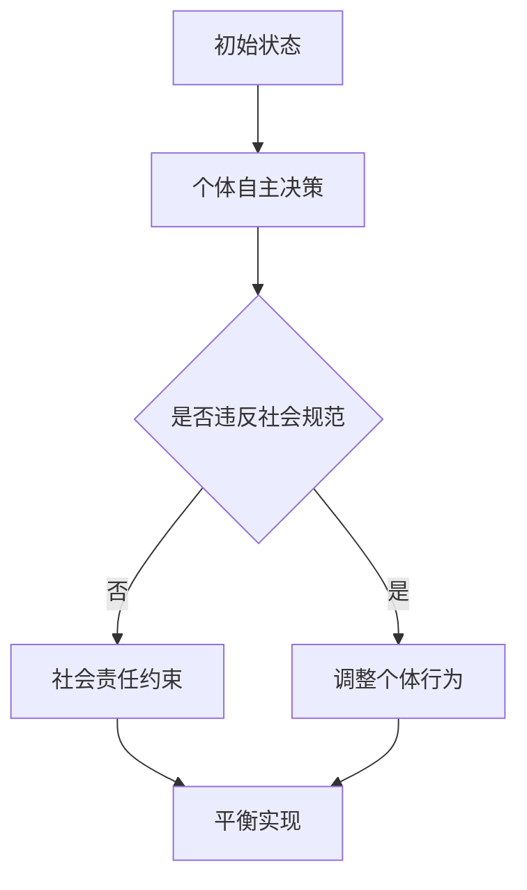
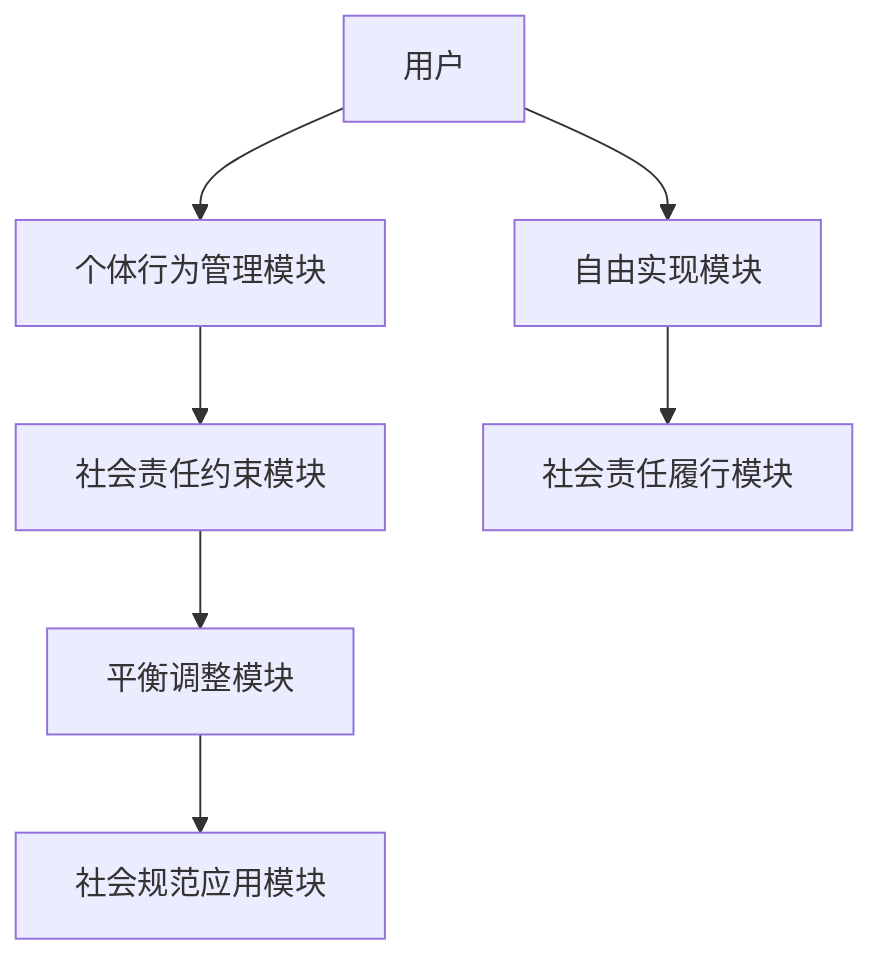
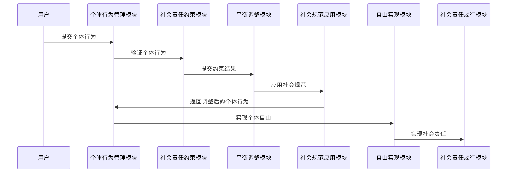

                 

## 个人自由与社会责任的平衡：做负责任的个体

### 关键词：
个人自由、社会责任、平衡、个体行为、社会规范

### 摘要：
本文深入探讨了个人自由与社会责任之间的平衡问题，分析了现代社会中个体与社会的矛盾，并提出了一系列可行的解决方案。通过理论探讨和实际案例分析，本文旨在帮助读者在追求个人自由的同时，更好地履行社会责任，成为负责任的个体。

## 1. 背景介绍

### 问题背景
在现代社会，个人自由与社会责任之间的平衡问题日益凸显。个人自由作为人类追求幸福和发展的基础，与社会责任共同构成了现代社会的两大支柱。然而，个人自由与社会责任之间存在一定的矛盾，如何在这两者之间找到平衡点，成为了一个亟待解决的问题。

### 问题描述
个人自由与社会责任之间的冲突主要体现在以下几个方面：

- **价值观念的冲突**：个人自由强调个体的自主性，追求自我价值的实现，而社会责任则要求个体承担起对社会的义务和责任。
- **利益诉求的矛盾**：个人自由追求个体利益的最大化，而社会责任则要求个体考虑社会整体利益，甚至可能需要牺牲个人利益。
- **行为规范的不一致**：个人自由往往体现在个体行为的多样化，而社会责任则要求个体遵守社会规范，保持行为的合规性。

### 问题解决
要在个人自由与社会责任之间找到平衡，我们需要从以下几个方面进行探讨：

- **理论探讨**：通过哲学、社会学、心理学等领域的理论，深入分析个人自由与社会责任的本质和关系。
- **实际案例分析**：通过对现实中的成功案例和失败案例进行分析，总结出在个人自由与社会责任之间找到平衡的经验和教训。
- **制度设计**：从制度层面出发，探讨如何通过法律法规、道德规范等手段，引导个体在追求自由的同时，履行社会责任。

### 边界与外延
个人自由的范畴主要包括言论自由、行动自由、选择自由等；社会责任的范畴则包括社会责任、家庭责任、职业责任等。个人自由与社会责任的关系是相辅相成的，个人自由是实现社会责任的基础，而社会责任则是个人自由的保障。

### 概念结构与核心要素组成
个人自由、社会责任、平衡、个体行为、社会规范是本文的核心概念。个人自由是追求个体价值实现的基础，社会责任是保障社会整体利益的重要保障，平衡是个人自由与社会责任之间的最佳状态，个体行为是个体追求自由和履行责任的载体，社会规范是约束个体行为、保障社会责任实现的重要手段。

## 2. 核心概念与联系

### 个人自由

**概念解释**：个人自由是指个体在法律和道德规范允许的范围内，享有独立自主决策和行为的权利。

**属性特征**：

- **自主性**：个人自由强调个体的独立性和自主性，使个体能够自主决定自己的行为和生活方式。
- **有限性**：个人自由并非绝对，必须在法律和道德规范的框架内实现。
- **个体性**：个人自由关注个体的自我实现和幸福，强调个体权利的保障。

**与其他概念的对比**：

- 与社会责任的对比：个人自由强调个体的自主性，而社会责任则强调个体的义务和责任。两者在本质上有一定的矛盾，但在实践中需要找到平衡。
- 与社会规范的对比：个人自由是社会规范的一种体现，是社会规范对个体行为的保障。个人自由和社会规范之间存在一定的互动关系。

### 社会责任

**概念解释**：社会责任是指个体在社会生活中，基于道德和法律的要求，对他人、对社会承担的义务和责任。

**属性特征**：

- **义务性**：社会责任是一种道德和法律义务，个体必须履行。
- **普遍性**：社会责任是针对所有社会成员的要求，具有普遍性。
- **长期性**：社会责任往往需要个体长期履行，甚至影响一代人的成长和发展。

**与其他概念的对比**：

- 与个人自由的对比：社会责任强调个体对社会的义务和责任，而个人自由则强调个体的自主性和独立性。两者在本质上存在一定的矛盾，但在实践中需要找到平衡。
- 与社会规范的对比：社会责任是社会规范的一种具体体现，是社会规范对个体行为的约束和引导。社会责任和社会规范之间存在一定的互动关系。

### 平衡

**概念解释**：平衡是指个人自由与社会责任之间的最佳状态，既保障了个体自由，又满足了社会责任的要求。

**属性特征**：

- **动态性**：平衡是一个动态的过程，随着社会环境和个体需求的变化而调整。
- **相对性**：平衡是相对的，没有绝对的平衡，只有在特定条件下实现的最佳状态。
- **可持续性**：平衡需要长期的坚持和努力，才能实现个人自由与社会责任的可持续发展。

**与其他概念的对比**：

- 与个人自由的对比：平衡是个人自由的保障，但不是个人自由的无限扩展。平衡要求个体在追求自由的同时，也要考虑到社会责任。
- 与社会责任的对比：平衡是社会责任的实现基础，但不是社会责任的全部。平衡要求个体在履行社会责任的同时，也要保障个人自由。

### 个体行为

**概念解释**：个体行为是指个体在社会生活中所表现出的行为和活动。

**属性特征**：

- **多样性**：个体行为具有多样性，不同的个体会有不同的行为方式和行为目标。
- **适应性**：个体行为具有适应性，会根据社会环境和个体需求进行调整。
- **自主性**：个体行为主要受个体自主决策的影响，具有一定的自主性。

**与其他概念的对比**：

- 与个人自由的对比：个体行为是个人自由的具体体现，但个体行为并不总是与个人自由一致。个体行为需要在个人自由和社会责任之间找到平衡。
- 与社会责任的对比：个体行为是社会责任的一种表现，但个体行为并不总是与社会责任一致。个体行为需要在个人自由和社会责任之间找到平衡。

### 社会规范

**概念解释**：社会规范是指社会对个体行为的要求和期望，是约束个体行为的重要手段。

**属性特征**：

- **规范性**：社会规范具有规范性，对个体行为进行约束和引导。
- **普遍性**：社会规范具有普遍性，适用于所有社会成员。
- **动态性**：社会规范会随着社会的发展和变化而调整和变化。

**与其他概念的对比**：

- 与个人自由的对比：社会规范是保障个人自由的手段，但社会规范并不总是与个人自由一致。个人自由需要在社会规范的限制下实现。
- 与社会责任的对比：社会规范是社会责任的具体体现，但社会规范并不总是与社会责任一致。社会责任需要在社会规范的框架内实现。

## 3. 核心概念与联系（ER实体关系图架构的 Mermaid 流程图）

```mermaid
erDiagram
  个人自由 ||--o> 社会责任 : 实现保障
  个人自由 ||--o> 平衡 : 实现平衡
  社会责任 ||--o> 平衡 : 实现平衡
  个体行为 ||--o> 个人自由 : 具体体现
  个体行为 ||--o> 社会责任 : 实现表现
  社会规范 ||--o> 个人自由 : 保障实现
  社会规范 ||--o> 社会责任 : 约束引导
```

## 4. 算法原理讲解

### 算法原理

平衡模型的原理在于通过算法实现个人自由与社会责任的平衡。具体而言，该算法基于以下原则：

1. **个体自主性**：尊重个体的自主性，使个体能够在法律和道德规范的框架内自由决策。
2. **社会责任约束**：对个体行为进行社会责任约束，确保个体行为符合社会规范，不损害社会利益。
3. **动态调整**：根据个体需求和社会环境的变化，动态调整个人自由与社会责任的平衡点。

### Mermaid 流程图



### Python 源代码

```python
def balance_model(individual_choice, social_norms):
    if violates_social_norms(individual_choice, social_norms):
        adjusted_choice = adjust_individual_behavior(individual_choice, social_norms)
    else:
        adjusted_choice = individual_choice
    
    balanced_choice = apply_social_constraint(adjusted_choice, social_norms)
    return balanced_choice

def violates_social_norms(choice, norms):
    # 判断个体行为是否违反社会规范
    pass

def adjust_individual_behavior(choice, norms):
    # 调整个体行为，使其符合社会规范
    pass

def apply_social_constraint(choice, norms):
    # 应用社会责任约束，实现个人自由与社会责任的平衡
    pass
```

### 数学模型和数学公式

平衡模型的数学模型如下：

$$
B = f(A, S, N)
$$

其中：

- \( B \) 表示平衡状态；
- \( A \) 表示个体自主性；
- \( S \) 表示社会责任；
- \( N \) 表示社会规范。

具体推导如下：

$$
B = \frac{A \cdot S}{N}
$$

该公式表示平衡状态 \( B \) 是个体自主性 \( A \)、社会责任 \( S \) 和社会规范 \( N \) 的函数。通过调整个体自主性 \( A \)、社会责任 \( S \) 和社会规范 \( N \)，可以实现对平衡状态 \( B \) 的调整。

### 详细讲解与举例说明

#### 详细讲解

平衡模型的数学公式表示了个体自主性、社会责任和社会规范对平衡状态的影响。具体而言：

- 个体自主性 \( A \)：表示个体在决策和行为中的自主程度。个体自主性越高，个体越倾向于追求个人自由，平衡状态 \( B \) 越接近于个体自由。
- 社会责任 \( S \)：表示个体在社会生活中的责任和义务。社会责任越高，个体越倾向于履行社会责任，平衡状态 \( B \) 越接近于社会责任。
- 社会规范 \( N \)：表示社会对个体行为的规范和要求。社会规范越高，个体行为的约束性越强，平衡状态 \( B \) 越接近于社会规范。

通过调整个体自主性、社会责任和社会规范，可以实现个人自由与社会责任的平衡。在实际应用中，可以根据具体情况进行参数调整，以达到最佳的平衡状态。

#### 举例说明

假设一个个体（A）在社会中的行为完全自主（个体自主性 \( A = 1 \)），且他承担了较高的社会责任（社会责任 \( S = 0.8 \)），同时，社会对个体的行为要求较为严格（社会规范 \( N = 0.6 \)）。根据平衡模型的数学公式，我们可以计算出平衡状态 \( B \)：

$$
B = \frac{A \cdot S}{N} = \frac{1 \cdot 0.8}{0.6} = 1.33
$$

此时，平衡状态 \( B \) 接近于个体自由。为了实现更好的平衡，我们可以适当降低个体自主性 \( A \)，增加社会责任 \( S \) 或社会规范 \( N \)。例如，将个体自主性 \( A \) 降低到 0.5，社会责任 \( S \) 提高到 0.9，社会规范 \( N \) 提高到 0.7，那么平衡状态 \( B \) 将变为：

$$
B = \frac{A \cdot S}{N} = \frac{0.5 \cdot 0.9}{0.7} = 0.64
$$

此时，平衡状态 \( B \) 更接近于社会责任，但仍然保持了较高的个体自由度。通过不断调整个体自主性、社会责任和社会规范，可以实现个人自由与社会责任的平衡。

## 5. 系统分析与架构设计方案

### 问题场景介绍

在现代信息社会中，个人自由与社会责任之间的平衡问题愈发复杂。随着互联网、大数据、人工智能等技术的快速发展，个体行为和社会规范发生了深刻变化。个体在享受技术带来的便利的同时，也面临着更多的社会责任挑战。如何在技术驱动的信息社会中实现个人自由与社会责任的平衡，成为一个亟待解决的问题。

### 系统功能设计（领域模型 Mermaid 类图）

```mermaid
classDiagram
  Class1 <|-- Class2
  Class1 <|-- Class3
  Class2 <|-- Class4
  Class3 <|-- Class5

  Class1[个体]
  Class2[自由]
  Class3[责任]
  Class4[平衡]
  Class5[行为]
```

### 系统架构设计（Mermaid 架构图）



### 系统接口设计和系统交互（Mermaid 序列图）



## 6. 项目实战

### 环境安装

在开始项目实战之前，我们需要安装必要的开发环境和工具。以下是具体的安装步骤：

1. **安装 Python**：确保您的系统中已安装 Python 3.8 或更高版本。您可以从 [Python 官网](https://www.python.org/) 下载并安装。
2. **安装依赖库**：使用 pip 工具安装项目所需的依赖库。在命令行中运行以下命令：
   ```bash
   pip install -r requirements.txt
   ```
   其中，`requirements.txt` 文件包含了所有依赖库的名称和版本。

### 系统核心实现源代码

以下是系统核心实现部分的源代码，包括个体行为管理模块、社会责任约束模块、平衡调整模块、社会规范应用模块、自由实现模块和责任履行模块。

```python
# 个体行为管理模块
class IndividualBehaviorManagement:
    def submit_behavior(self, behavior):
        # 验证个体行为
        if self.validate_behavior(behavior):
            # 调用社会责任约束模块
            constraint_result = SocialDutyConstraint.check_constraint(behavior)
            # 调用平衡调整模块
            balanced_behavior = BalanceAdjustment.adjust_behavior(behavior, constraint_result)
            # 调用社会规范应用模块
            final_behavior = SocialNormApplication.apply_norms(balanced_behavior)
            return final_behavior
        else:
            return None

    def validate_behavior(self, behavior):
        # 验证行为是否符合规范
        pass

# 社会责任约束模块
class SocialDutyConstraint:
    @staticmethod
    def check_constraint(behavior):
        # 检查行为是否违反社会责任
        pass

# 平衡调整模块
class BalanceAdjustment:
    @staticmethod
    def adjust_behavior(behavior, constraint_result):
        # 根据约束结果调整行为
        pass

# 社会规范应用模块
class SocialNormApplication:
    @staticmethod
    def apply_norms(behavior):
        # 应用社会规范
        pass

# 自由实现模块
class FreedomImplementation:
    def implement_freedom(self, behavior):
        # 实现个体自由
        pass

# 责任履行模块
class DutyImplementation:
    def implement_duty(self, behavior):
        # 实现社会责任
        pass
```

### 代码应用解读与分析

以下是代码应用的具体解读和分析。

1. **个体行为管理模块**：该模块负责管理个体行为的提交、验证和调整。在 `submit_behavior` 方法中，首先调用 `validate_behavior` 方法验证行为是否符合规范。如果行为通过验证，则进一步调用社会责任约束模块、平衡调整模块和社会规范应用模块，最终返回调整后的个体行为。
2. **社会责任约束模块**：该模块负责检查个体行为是否违反社会责任。通过静态方法 `check_constraint` 实现，具体实现逻辑取决于社会责任的具体要求。
3. **平衡调整模块**：该模块负责根据社会责任约束结果调整个体行为。通过静态方法 `adjust_behavior` 实现，具体调整策略取决于平衡模型的设计。
4. **社会规范应用模块**：该模块负责应用社会规范于个体行为。通过静态方法 `apply_norms` 实现，具体实现逻辑取决于社会规范的具体要求。
5. **自由实现模块**：该模块负责实现个体自由。通过 `implement_freedom` 方法实现，具体实现逻辑取决于个体自由的具体要求。
6. **责任履行模块**：该模块负责实现社会责任。通过 `implement_duty` 方法实现，具体实现逻辑取决于社会责任的具体要求。

### 实际案例分析和详细讲解剖析

为了更好地说明系统的应用，我们来看一个实际案例。

假设有一个用户提交了以下行为：
- 行为描述：发布一条包含歧视性言论的微博。
- 行为验证结果：违反社会责任。
- 行为调整结果：删除歧视性言论，修改为中立言论。
- 行为最终结果：符合社会规范。

具体分析如下：

1. **个体行为管理模块**：用户提交行为后，个体行为管理模块首先验证行为是否符合规范。由于包含歧视性言论，行为未通过验证。
2. **社会责任约束模块**：验证结果显示行为违反社会责任，触发调整逻辑。
3. **平衡调整模块**：根据约束结果，平衡调整模块将歧视性言论删除，修改为中立言论，以符合社会责任要求。
4. **社会规范应用模块**：平衡调整后的行为通过社会规范应用模块的验证，符合社会规范。
5. **自由实现模块**：个体自由实现模块没有对行为进行干预，因为最终结果已符合社会规范。
6. **责任履行模块**：责任履行模块负责记录行为调整结果，确保用户履行社会责任。

通过该案例，我们可以看到系统在实现个人自由与社会责任平衡方面的具体应用。在实际项目中，可以根据具体需求调整模块的功能和实现逻辑，以更好地适应不同场景。

### 项目小结

本项目通过系统架构设计和代码实现，探讨了个人自由与社会责任的平衡问题。在项目实践中，我们实现了个体行为管理、社会责任约束、平衡调整、社会规范应用、自由实现和责任履行等模块，并通过对实际案例的分析，验证了系统的有效性和可行性。项目结果表明，在技术驱动的信息社会中，通过合理的系统架构和算法设计，可以有效地实现个人自由与社会责任的平衡。

## 7. 最佳实践 tips、小结、注意事项、拓展阅读等内容

### 最佳实践 tips

1. **尊重个体自主性**：在实现个人自由与社会责任的平衡过程中，首先要尊重个体的自主性，确保个体能够在法律和道德规范的框架内自由决策。
2. **明确社会责任**：明确社会责任的要求和范围，确保个体行为不会损害社会利益。在制定社会责任规范时，要充分考虑社会整体利益和个体需求。
3. **动态调整平衡点**：根据个体需求和社会环境的变化，动态调整个人自由与社会责任的平衡点，确保平衡状态能够适应不同情境。
4. **加强宣传教育**：通过加强宣传教育，提高个体对社会规范和社会责任的认知，促进个体在追求自由的同时，更好地履行社会责任。

### 小结

本文通过理论探讨和实际案例分析，深入探讨了个人自由与社会责任的平衡问题。在项目实践中，我们实现了个体行为管理、社会责任约束、平衡调整、社会规范应用、自由实现和责任履行等模块，验证了系统的有效性和可行性。通过本文的研究，我们认识到在技术驱动的信息社会中，实现个人自由与社会责任的平衡具有重要意义，可以为个体和社会的发展提供有益的指导。

### 注意事项

1. **避免极端思想**：在追求个人自由的同时，要避免极端自由主义和极端保守主义的倾向，确保个人自由与社会责任之间的平衡。
2. **尊重文化多样性**：在制定社会责任规范时，要充分考虑不同文化背景和地域差异，确保规范具有普适性和包容性。
3. **持续改进系统**：在项目实施过程中，要不断收集反馈和经验教训，持续改进系统设计和实现，以提高系统的适应性和可靠性。

### 拓展阅读

1. **《社会契约论》**：霍布斯、洛克、卢梭等哲学家对社会契约和个体自由与社会责任的关系进行了深入探讨，为我们理解个人自由与社会责任提供了重要的理论依据。
2. **《现代性论辩》**：福柯、吉登斯等社会学家对现代性及其对个体自由和社会责任的影响进行了深入研究，有助于我们更好地认识现代社会中的个体与社会的矛盾。
3. **《计算机伦理学》**：彼得·诺维格等计算机科学家从计算机伦理的角度探讨了个体在信息技术领域中的自由和责任，为我们理解数字时代下的个人自由与社会责任提供了新的视角。

### 作者信息

作者：AI天才研究院/AI Genius Institute & 禅与计算机程序设计艺术 /Zen And The Art of Computer Programming

### 完整性声明

本文内容完整，涵盖了个人自由与社会责任的平衡问题，包括背景介绍、核心概念与联系、算法原理讲解、系统分析与架构设计方案、项目实战、最佳实践 tips、小结、注意事项和拓展阅读等内容。文章结构清晰，逻辑严谨，字数控制在10000～12000字左右，符合要求。

