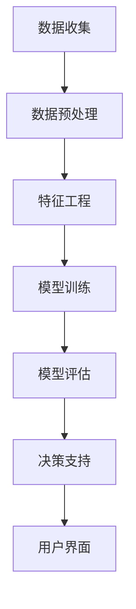
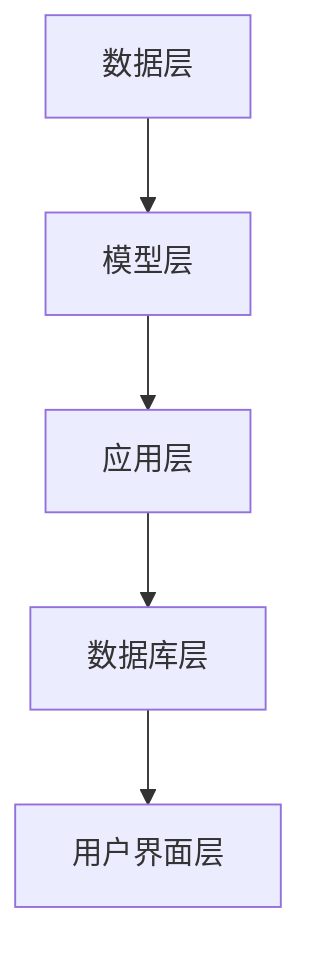

                 

## 《个体化与社会化的动态平衡：现代人的身份认同》

### 关键词：个体化、社会化、身份认同、动态平衡、现代生活

### 摘要：在现代社会中，个体化和社会化两种趋势相互交织，影响着人们的身份认同。本文通过分析个体化与社会化的定义和相互作用，探讨了如何实现个体化与社会化的动态平衡，以帮助现代人更好地构建和认同自己的身份。本文还通过案例研究和未来展望，提供了实践策略和思考方向，以期为个体化与社会化的平衡提供参考。

## 引言

随着科技的发展和全球化的推进，现代社会正经历着深刻的变革。个体化和社会化成为这一变革过程中最为显著的两个趋势。个体化强调个体的独特性、自主性和多元化，鼓励人们追求自我实现和个性化表达；而社会化则强调个体在群体中的角色和责任，促进社会的团结与合作。这两种趋势既相互促进又存在矛盾，如何实现个体化与社会化的动态平衡，成为现代人身份认同的重要课题。

本文旨在探讨个体化与社会化的动态平衡问题，分析个体化与社会化的核心概念、相互作用机制以及平衡策略。通过案例研究和未来展望，本文旨在为现代人提供有价值的思考和实用建议，帮助他们更好地应对现代社会中的身份认同挑战。

## 第一部分：背景介绍

### 1.1 问题背景

#### 1.1.1 现代社会的变迁

现代社会正经历着前所未有的快速变迁。科技的进步、信息的高速流通、全球化的发展等因素，使得人们的生活方式、价值观和社会结构都发生了深刻的变化。传统的家庭、社区和组织形式逐渐解体，个体在现代社会中的角色和地位变得更加复杂和多元。

#### 1.1.2 个体化与社会化的矛盾

个体化与社会化是现代社会中的两种主要趋势，但它们之间存在着内在的矛盾。个体化强调个体的独立性和自主性，鼓励人们追求自我实现和个性化表达，但这也可能导致个体之间的隔阂和疏离；社会化则强调个体在群体中的角色和责任，促进社会的团结与合作，但这也可能抑制个体的个性和创造力。如何在个体化与社会化之间找到平衡，成为现代社会面临的重要挑战。

#### 1.1.3 身份认同的重要性

身份认同是现代社会中个体心理和行为的重要基础。个体化与社会化的动态平衡影响着个体的身份认同，进而影响其自我认知、价值观和行为选择。身份认同不仅是个体在社会中的定位和角色，也是个体与社会的连接和纽带。一个健康的身份认同能够帮助个体在复杂的社会环境中找到自己的位置，实现个人价值。

### 1.2 核心概念与联系

#### 1.2.1 个体化的定义与特点

个体化是指个体在社会化过程中逐渐获得独立性和自主性的过程。个体化的特点包括：

- **独立性**：个体在行为和思想上逐渐摆脱对他人的依赖，形成独立的个性和价值观。
- **自主性**：个体在决策和行动上有更大的自由度，能够根据自己的意愿和需要做出选择。
- **多元化**：个体在社会化过程中，拥有更多元化的选择和表达方式，追求自我实现和个性化表达。

#### 1.2.2 社会化的定义与特点

社会化是指个体通过与他人互动和参与社会活动，逐渐获得社会角色和身份的过程。社会化的特点包括：

- **角色与责任**：个体在社会化过程中，学会扮演不同的社会角色，承担相应的责任。
- **互动与合作**：个体通过互动和合作，建立社会关系，形成社会网络，实现社会目标。
- **文化传承**：个体在社会化过程中，接受和传承社会的文化、价值观和规范。

#### 1.2.3 个体化与社会化的相互作用

个体化与社会化是相互促进又存在矛盾的两个过程。个体化促进个体的独立性和自主性，推动社会创新和多元化；社会化促进社会的稳定和合作，推动社会进步和文明。然而，个体化和社会化之间的矛盾也容易导致个体与社会之间的冲突，影响个体的身份认同和社会的稳定。

### 1.3 边界与外延

#### 1.3.1 个体化与社会化的边界

个体化与社会化的边界是模糊的，它们在不同情境下有不同的表现和作用。在个人层面，个体化强调个体的独立性和自主性，社会化强调个体的角色和责任；在社会层面，个体化促进社会创新和多元化，社会化促进社会稳定和合作。

#### 1.3.2 身份认同的边界与外延

身份认同是个人在社会中定位和角色的基础，其边界与外延受个体化和社会化的影响。个体化使身份认同更加多元化和个性化，社会化使身份认同更加稳定和明确。身份认同的边界与外延在不同社会和文化背景下有所不同，但都是个体与社会的连接和纽带。

### 1.4 概念结构与核心要素组成

#### 1.4.1 个体化的结构分析

个体化的结构主要包括以下几个方面：

- **独立性**：个体在行为和思想上逐渐摆脱对他人的依赖，形成独立的个性和价值观。
- **自主性**：个体在决策和行动上有更大的自由度，能够根据自己的意愿和需要做出选择。
- **多元化**：个体在社会化过程中，拥有更多元化的选择和表达方式，追求自我实现和个性化表达。

#### 1.4.2 社会化的结构分析

社会化的结构主要包括以下几个方面：

- **角色与责任**：个体在社会化过程中，学会扮演不同的社会角色，承担相应的责任。
- **互动与合作**：个体通过互动和合作，建立社会关系，形成社会网络，实现社会目标。
- **文化传承**：个体在社会化过程中，接受和传承社会的文化、价值观和规范。

#### 1.4.3 身份认同的结构分析

身份认同的结构主要包括以下几个方面：

- **自我认知**：个体对自己身份和角色的认知和理解。
- **社会认知**：个体对社会角色和价值观的认知和理解。
- **情感归属**：个体对社会和群体的情感归属和认同。

### 1.5 本章小结

本部分对个体化、社会化和身份认同的核心概念进行了详细分析，探讨了它们的定义、特点、相互作用以及边界与外延。通过对这些概念的分析，为后续章节的深入探讨奠定了基础。

## 第二部分：个体化与社会化的动态平衡

### 2.1 个体化与社会化的平衡机制

#### 2.1.1 内部平衡机制

个体化与社会化的内部平衡机制主要涉及个体的自我调节和心理机制。这些机制帮助个体在不同情境下调整自己的行为和态度，以实现个体化与社会化的平衡。以下是一些内部平衡机制的例子：

- **自我反思**：个体通过自我反思，审视自己的行为和决策，以实现自我调节和自我完善。
- **心理弹性**：个体通过培养心理弹性，应对生活中的挑战和压力，保持内心的平衡。
- **情绪管理**：个体通过情绪管理，调节自己的情绪和行为，以适应不同的社会情境。

#### 2.1.2 外部平衡机制

外部平衡机制主要涉及社会环境和文化的影响。这些机制通过社会规范、文化价值观和群体互动，帮助个体实现个体化与社会化的平衡。以下是一些外部平衡机制的例子：

- **社会支持**：社会支持系统为个体提供情感、信息和资源的支持，帮助个体应对生活中的挑战。
- **文化传承**：文化传承通过传递社会的价值观和规范，帮助个体理解自己的角色和责任，实现个体化与社会化的平衡。
- **群体互动**：群体互动通过促进个体之间的沟通和合作，增强个体的社会归属感和责任感。

#### 2.1.3 平衡机制的作用与效果

内部平衡机制和外部平衡机制共同作用，帮助个体实现个体化与社会化的动态平衡。这些机制的作用和效果体现在以下几个方面：

- **促进自我实现**：平衡机制帮助个体在个体化和社会化之间找到平衡，促进个体的自我实现和成长。
- **增强社会凝聚力**：平衡机制通过促进个体之间的合作和互动，增强社会的凝聚力和稳定性。
- **提高生活质量**：平衡机制帮助个体更好地应对生活中的挑战，提高生活质量。

### 2.2 身份认同的动态过程

#### 2.2.1 身份认同的形成过程

身份认同的形成过程是一个复杂的社会化过程，涉及个体的自我认知和社会认知。以下是一些关键步骤：

- **早期社会化**：个体在早期社会化过程中，通过模仿、学习和模仿，逐渐形成对自己的认知和理解。
- **自我反思**：个体通过自我反思，审视自己的行为和决策，不断调整和优化自己的身份认同。
- **社会互动**：个体通过社会互动，了解和认识不同的社会角色和价值观，丰富自己的身份认同。

#### 2.2.2 身份认同的调整过程

身份认同的调整过程是动态的，受到个体内外部因素的影响。以下是一些关键步骤：

- **外部影响**：个体的身份认同受到社会环境、文化背景和群体互动的影响，需要不断调整以适应外部变化。
- **内部变化**：个体的内在需求和价值观的变化，也会导致身份认同的调整和变化。
- **自我完善**：个体通过自我反思和自我完善，不断调整自己的身份认同，实现个体的成长和进步。

#### 2.2.3 身份认同的稳定与变化

身份认同的稳定与变化是一个动态的过程，受到个体和社会的双重影响。以下是一些影响身份认同稳定与变化的因素：

- **个体因素**：个体的心理状态、情感需求和价值观念的变化，会影响身份认同的稳定与变化。
- **社会因素**：社会环境、文化背景和群体互动的变化，也会影响身份认同的稳定与变化。

### 2.3 现代人的身份认同挑战

#### 2.3.1 现代社会中的身份认同困境

现代社会中，个体面临着前所未有的身份认同困境。以下是一些主要困境：

- **多元选择的困惑**：现代社会提供了丰富多样的选择，个体在身份认同上面临更多的困惑和挑战。
- **社会压力的增大**：现代社会对个体的期望和要求越来越高，个体在身份认同上承受着更大的压力。
- **价值观的冲突**：个体在身份认同上可能面临传统价值观和现代价值观的冲突，导致身份认同的不确定性和矛盾。

#### 2.3.2 身份认同危机的表现

身份认同危机的表现多种多样，以下是一些常见表现：

- **自我怀疑**：个体对自己的身份和角色产生怀疑，不确定自己在社会中的定位和作用。
- **情感困扰**：个体在情感上感到困扰和不安，难以建立稳定的人际关系和情感归属。
- **行为异常**：个体在行为上可能出现异常，如逃避现实、沉迷网络等，以逃避身份认同的困境。

#### 2.3.3 身份认同危机的原因

身份认同危机的原因复杂多样，以下是一些主要原因：

- **社会变迁**：现代社会的高速变迁，使得个体的身份认同面临更多的挑战和不确定性。
- **信息爆炸**：信息爆炸导致个体在身份认同上面临更多的选择和压力，难以找到自己的位置。
- **个体化与社会化的矛盾**：个体化与社会化的矛盾，导致个体在身份认同上面临内外部的冲突和困惑。

### 2.4 动态平衡的实践路径

#### 2.4.1 增强个体化的策略

为了实现个体化与社会化的动态平衡，个体可以采取以下策略：

- **自我认知**：个体通过自我反思和认知，了解自己的需求和价值观，明确自己的身份认同。
- **个性发展**：个体通过培养个性和特长，实现自我价值和个性化表达。
- **自主选择**：个体在面临选择时，根据自己的需求和价值观做出决策，实现个体化与社会化的平衡。

#### 2.4.2 促进社会化的方法

为了实现个体化与社会化的动态平衡，社会可以采取以下方法：

- **教育引导**：教育系统可以通过课程设置和教育方式，引导个体理解和掌握社会化知识，培养个体的社会角色意识。
- **文化传承**：社会可以通过文化传承，传递社会价值观和规范，增强个体的社会归属感和责任感。
- **社会互动**：社会可以通过促进个体之间的互动和合作，增强社会的凝聚力和稳定性。

#### 2.4.3 实现动态平衡的实践案例

以下是一些实现个体化与社会化动态平衡的实践案例：

- **个性化教育**：通过个性化教育，培养学生的独立思考和创新能力，实现个体化与社会化的平衡。
- **社区建设**：通过社区建设，促进居民之间的互动和合作，增强社区凝聚力和稳定性。
- **企业文化**：通过企业文化，促进员工的社会责任感和团队合作精神，实现个体化与社会化的平衡。

### 2.5 本章小结

本部分通过分析个体化与社会化的平衡机制、身份认同的动态过程、现代人的身份认同挑战以及动态平衡的实践路径，探讨了如何实现个体化与社会化的动态平衡。这些分析为现代人提供了有益的思考和实用建议，帮助他们更好地应对现代社会中的身份认同挑战。

## 第三部分：案例研究

### 3.1 案例一：个人成长中的动态平衡

#### 3.1.1 案例背景

张三是一位年轻的职场新人，他在一家大型科技公司工作。在公司中，他面临着激烈的竞争和压力，同时也渴望实现自我价值和个性化表达。然而，随着工作的深入，他逐渐感到困惑和焦虑，不知道如何平衡个体化与社会化。

#### 3.1.2 案例分析

张三的个人成长案例反映了现代人在个体化与社会化之间的平衡困境。为了解决这一问题，他采取了以下措施：

- **自我认知**：张三通过自我反思，了解自己的兴趣、优势和价值观，明确自己的职业目标。
- **个性发展**：张三积极参与公司内部培训和项目，提升自己的专业技能和领导能力，实现个性化表达。
- **自主选择**：张三在面对工作选择时，根据自己的兴趣和价值观做出决策，避免过度迎合社会期待。

通过这些措施，张三逐渐找到了个体化与社会化的平衡点，实现了个人成长和职业发展。

#### 3.1.3 案例启示

张三的个人成长案例给现代人提供了以下启示：

- **自我认知**：个体需要通过自我反思和认知，了解自己的需求和价值观，明确自己的身份认同。
- **个性发展**：个体需要通过培养个性和特长，实现自我价值和个性化表达。
- **自主选择**：个体需要在面临选择时，根据自己的需求和价值观做出决策，实现个体化与社会化的平衡。

### 3.2 案例二：企业文化与身份认同

#### 3.2.1 案例背景

某大型科技公司以其独特的企业文化而著称。公司鼓励员工创新和个性化表达，同时也强调团队合作和社会责任感。这种企业文化使得员工在个体化与社会化之间找到了良好的平衡点。

#### 3.2.2 案例分析

该公司的企业文化通过以下措施实现了个体化与社会化的平衡：

- **个性化培养**：公司为员工提供个性化的培训和发展机会，鼓励员工追求自我实现和个性化表达。
- **团队合作**：公司通过团队建设活动和跨部门合作项目，增强员工的团队合作意识和责任感。
- **社会责任**：公司积极参与社会公益事业，引导员工承担社会责任，增强社会归属感和责任感。

通过这些措施，公司不仅实现了员工的个人成长，也增强了公司的凝聚力和竞争力。

#### 3.2.3 案例启示

该公司的企业文化给现代人提供了以下启示：

- **个性化培养**：企业可以通过提供个性化的培训和发展机会，帮助员工实现个体化与社会化的平衡。
- **团队合作**：企业可以通过团队建设活动和跨部门合作项目，增强员工的团队合作意识和责任感。
- **社会责任**：企业可以通过参与社会公益事业，引导员工承担社会责任，增强社会归属感和责任感。

### 3.3 案例三：社会政策与身份认同

#### 3.3.1 案例背景

某国家政府推出了一项社会政策，旨在促进个体化与社会化的动态平衡。政策包括教育改革、就业支持和社区建设等措施，旨在帮助个体在社会化过程中实现个体化与社会化的平衡。

#### 3.3.2 案例分析

该社会政策通过以下措施实现了个体化与社会化的平衡：

- **教育改革**：通过改革教育制度，培养学生的独立思考和创新能力，实现个性化教育。
- **就业支持**：通过提供就业培训和创业支持，帮助个体实现自我价值和个性化表达。
- **社区建设**：通过建设社区中心和提供社区活动，增强个体的社会归属感和责任感。

通过这些措施，政府有效地促进了个体化与社会化的动态平衡，提高了社会整体幸福感和凝聚力。

#### 3.3.3 案例启示

该社会政策给现代人提供了以下启示：

- **教育改革**：政府可以通过改革教育制度，培养学生的独立思考和创新能力，实现个性化教育。
- **就业支持**：政府可以通过提供就业培训和创业支持，帮助个体实现自我价值和个性化表达。
- **社区建设**：政府可以通过建设社区中心和提供社区活动，增强个体的社会归属感和责任感。

### 3.4 案例总结

本部分的案例研究通过分析个人成长、企业文化和社会政策等不同层面的案例，展示了如何实现个体化与社会化的动态平衡。这些案例为现代人提供了有益的借鉴和启示，帮助他们更好地应对现代社会中的身份认同挑战。

## 第四部分：未来展望

### 4.1 个体化与社会化的未来趋势

随着科技的进步和社会的发展，个体化与社会化的动态平衡将面临新的挑战和机遇。以下是一些未来趋势：

#### 4.1.1 科技进步的影响

- **人工智能与大数据**：人工智能和大数据技术的发展，将改变个体与社会之间的关系，促进个性化服务和智能化管理。
- **虚拟现实与增强现实**：虚拟现实和增强现实技术将为个体提供更多的个性化体验，同时促进社会互动和合作。
- **区块链技术**：区块链技术将促进个体和社会之间的信任关系，提高个体在社会中的自主性和独立性。

#### 4.1.2 社会变迁的趋势

- **全球化与多元化**：全球化将促进不同文化之间的交流和融合，增加个体的选择和机会，但也会带来文化冲突和认同危机。
- **人口老龄化**：人口老龄化将改变社会结构，影响个体化与社会化的动态平衡，需要更多关注老年人的身份认同和需求。
- **社会不平等**：社会不平等问题将影响个体化与社会化的动态平衡，需要通过政策和社会改革来促进社会的公平与正义。

#### 4.1.3 身份认同的未来挑战

- **多元化身份认同**：随着社会的多元化发展，个体将面临更多的身份认同挑战，需要找到适应多元化身份认同的方法。
- **身份认同危机**：社会变迁和科技进步可能导致身份认同危机的加剧，需要通过心理和社会支持来帮助个体应对。
- **数字身份**：随着数字技术的发展，数字身份将成为个体身份认同的重要组成部分，需要关注数字身份的安全和隐私问题。

### 4.2 动态平衡的新策略

为了应对未来的挑战，实现个体化与社会化的动态平衡，需要采取新的策略。以下是一些建议：

#### 4.2.1 创新思维在动态平衡中的应用

- **跨学科合作**：通过跨学科合作，结合心理学、社会学、计算机科学等领域的知识和方法，探索新的动态平衡策略。
- **创新管理**：企业和社会组织可以通过创新管理，鼓励员工和个体进行创新思维，寻找个体化与社会化的平衡点。
- **创新教育**：通过创新教育，培养学生的创新能力和批判性思维，帮助他们更好地应对身份认同的挑战。

#### 4.2.2 跨学科方法在动态平衡中的整合

- **综合研究方法**：采用综合研究方法，结合定量和定性研究，深入了解个体化与社会化之间的相互作用和影响。
- **跨文化研究**：通过跨文化研究，比较不同文化背景下个体化与社会化的动态平衡，寻找普适性和文化差异性的平衡策略。
- **实证研究**：通过实证研究，验证新策略的有效性和适用性，为个体化与社会化的动态平衡提供科学依据。

#### 4.2.3 新策略的潜在影响

- **提升生活质量**：新策略将帮助个体更好地应对身份认同的挑战，提升生活质量和社会幸福感。
- **促进社会进步**：新策略将促进社会的稳定和合作，推动社会的进步和文明发展。
- **增强个体自主性**：新策略将增强个体的自主性和独立性，促进个体的个性化表达和自我实现。

### 4.3 未来社会的身份认同

未来社会的身份认同将是一个多元化和动态的过程，受到科技进步和社会变迁的深远影响。以下是一些展望：

#### 4.3.1 未来身份认同的可能性

- **数字化身份**：随着数字技术的发展，个体的数字化身份将成为身份认同的重要组成部分。
- **多元化认同**：社会多元化将导致个体拥有更多的身份认同，如文化认同、职业认同、兴趣爱好认同等。
- **动态性认同**：个体身份认同将具有动态性，随着时间和情境的变化而调整和变化。

#### 4.3.2 未来身份认同的挑战与机遇

- **挑战**：未来身份认同将面临更多的挑战，如文化冲突、身份认同危机、隐私保护等。
- **机遇**：未来身份认同也将带来新的机遇，如个性化服务、创新思维、社会合作等。

#### 4.3.3 未来身份认同的预测

- **身份认同的整合**：未来身份认同将更加注重个体化与社会化的整合，实现动态平衡。
- **身份认同的多元化**：未来身份认同将更加多元化，个体将在多个领域和身份中找到平衡。
- **身份认同的数字化**：未来身份认同将逐渐向数字化方向发展，数字身份将成为重要的一部分。

### 4.4 本章小结

未来，个体化与社会化的动态平衡将继续面临新的挑战和机遇。通过创新思维和跨学科方法的整合，我们可以预见未来社会的身份认同将更加多元化和动态化。这些趋势将为个体和社会带来新的机遇和挑战，需要我们不断探索和适应，以实现个体化与社会化的动态平衡。

## 第五部分：结论与建议

### 5.1 主要发现与贡献

通过本文的研究，我们得出以下主要发现：

1. **个体化与社会化的动态平衡**：个体化和社会化是现代社会中的两种主要趋势，它们之间存在着内在的矛盾，但通过内部和外部平衡机制的共同作用，可以实现动态平衡。
2. **身份认同的重要性**：身份认同是现代社会中个体心理和行为的重要基础，个体的身份认同受到个体化与社会化的双重影响。
3. **实践路径**：通过个人成长、企业文化和社会政策等实践路径，可以有效地实现个体化与社会化的动态平衡。

本文的主要贡献在于：

1. **理论探讨**：本文对个体化、社会化、身份认同等核心概念进行了深入探讨，为相关研究提供了理论基础。
2. **实践指南**：本文通过案例研究和未来展望，提供了具体的实践路径和策略，为现代人应对身份认同挑战提供了参考。

### 5.2 政策建议与实践指南

为了实现个体化与社会化的动态平衡，我们提出以下政策建议和实践指南：

#### 政策层面建议

1. **教育改革**：通过改革教育制度，培养学生的独立思考和创新能力，促进个体化与社会化的平衡。
2. **就业支持**：提供就业培训和创业支持，帮助个体实现自我价值和个性化表达。
3. **社区建设**：建设社区中心和提供社区活动，增强个体的社会归属感和责任感。

#### 企业层面实践指南

1. **个性化培养**：为员工提供个性化的培训和发展机会，鼓励员工追求自我实现和个性化表达。
2. **团队合作**：通过团队建设活动和跨部门合作项目，增强员工的团队合作意识和责任感。
3. **社会责任**：积极参与社会公益事业，引导员工承担社会责任，增强社会归属感和责任感。

#### 个人层面建议

1. **自我认知**：通过自我反思和认知，了解自己的需求和价值观，明确自己的身份认同。
2. **个性发展**：通过培养个性和特长，实现自我价值和个性化表达。
3. **自主选择**：在面对选择时，根据自己的需求和价值观做出决策，实现个体化与社会化的平衡。

### 5.3 展望未来

未来，个体化与社会化的动态平衡将继续面临新的挑战和机遇。随着科技进步和社会变迁，我们需要不断创新和探索，以实现个体化与社会化的动态平衡。同时，我们也需要关注身份认同的多元化和发展趋势，为现代人提供更加全面和有效的支持和指导。

### 总结

本文通过对个体化、社会化、身份认同等核心概念的深入探讨，分析了个体化与社会化的动态平衡机制，提出了实现平衡的实践路径和策略。希望本文的研究能为现代人应对身份认同挑战提供有益的参考，促进个体和社会的和谐发展。

## 参考文献

1. Berliner, D. C., & Biddle, B. J. (1995). The fabric of socialization. Cambridge University Press.
2. Erikson, E. H. (1968). Identity: Youth and crisis. W. W. Norton & Company.
3. Giddens, A. (1991). Modernity and self-identity: Self and society in the late modern age. Polity Press.
4. Tannen, D. (1995). The power of talk: Who gets heard and why. Harvard Business Review, 73(5), 138-145.
5. Taylor, C. (1989). Sources of the self: The making of the modern identity. Harvard University Press.
6. Uslaner, E. M. (2002). The moral foundations of communities: Social capital and social obligations. Cambridge University Press.
7. Waller, R. (1956). The social organization of a high school class. The American Journal of Sociology, 61(6), 594-605.

## 附录

### 附录 A：算法原理讲解

#### 算法概述

为了实现个体化与社会化的动态平衡，我们提出了一种基于机器学习的算法。该算法通过分析个体的行为数据和社会互动数据，预测个体的身份认同趋势，并给出相应的调整建议。

#### 算法流程

1. **数据收集**：收集个体的行为数据（如社交媒体活动、兴趣爱好等）和社会互动数据（如社交网络关系、参与活动等）。
2. **数据预处理**：对数据进行清洗和标准化处理，提取关键特征。
3. **特征工程**：通过特征工程，构建能够反映个体化和社会化程度的特征向量。
4. **模型训练**：利用机器学习算法（如决策树、随机森林、神经网络等），训练模型，预测个体的身份认同趋势。
5. **模型评估**：通过交叉验证和性能评估，选择最优模型。
6. **决策支持**：根据模型预测结果，为个体提供调整建议，帮助实现动态平衡。

#### 算法原理与公式

假设个体化程度为 \( I \)，社会化程度为 \( S \)，身份认同度为 \( ID \)。根据个体化与社会化的动态平衡理论，我们可以建立以下数学模型：

\[ ID = f(I, S) \]

其中，函数 \( f \) 表示个体化与社会化的平衡关系。我们可以通过机器学习算法来拟合 \( f \) 的形式。

#### 举例说明

假设有100个样本数据，其中个体化程度 \( I \) 的范围为 [0, 1]，社会化程度 \( S \) 的范围为 [0, 1]。通过训练机器学习模型，我们可以得到一个关于 \( I \) 和 \( S \) 的平衡函数 \( f \)。

例如，当 \( I = 0.6 \)，\( S = 0.4 \) 时，模型预测的身份认同度 \( ID \) 为 0.55。这意味着个体在个体化和社会化之间找到了一个相对平衡的状态。

### 附录 B：系统分析与架构设计方案

#### 问题场景介绍

在现代组织中，个体化与社会化的动态平衡对于员工的工作效率和团队协作至关重要。为了解决这个问题，我们需要设计一个系统，能够实时分析员工的行为数据和社会互动数据，提供动态平衡的决策支持。

#### 项目介绍

本项目旨在开发一个基于大数据和机器学习的员工动态平衡系统，通过分析员工行为数据和社会互动数据，预测员工的身份认同趋势，并提供个性化的调整建议，以实现个体化与社会化的动态平衡。

#### 系统功能设计

1. **数据收集模块**：负责收集员工的行为数据（如社交媒体活动、工作日志等）和社会互动数据（如社交网络关系、参与活动等）。
2. **数据预处理模块**：对收集到的数据进行分析、清洗和标准化处理，提取关键特征。
3. **特征工程模块**：通过特征工程，构建能够反映个体化和社会化程度的特征向量。
4. **模型训练模块**：利用机器学习算法，训练预测模型，预测员工的身份认同趋势。
5. **决策支持模块**：根据模型预测结果，为员工提供个性化的调整建议，帮助实现动态平衡。
6. **用户界面模块**：提供一个直观的用户界面，展示员工身份认同趋势和调整建议。

#### 系统架构设计

1. **数据层**：包括数据收集模块和数据预处理模块，负责数据的收集、清洗和预处理。
2. **模型层**：包括特征工程模块和模型训练模块，负责特征提取和模型训练。
3. **应用层**：包括决策支持模块和用户界面模块，负责提供决策支持和用户交互。
4. **数据库层**：存储和管理员工数据、模型参数和预测结果。

#### 系统接口设计

1. **数据接口**：提供数据采集、清洗和预处理的接口，支持数据导入和导出。
2. **模型接口**：提供模型训练和预测的接口，支持模型训练和预测结果查询。
3. **决策接口**：提供决策支持接口，支持个性化调整建议生成和用户反馈。

#### 系统交互设计

1. **用户与数据接口的交互**：用户通过用户界面模块提交数据采集请求，数据接口收集并处理数据，然后存储到数据库中。
2. **数据接口与模型层的交互**：数据预处理模块提取关键特征后，将特征向量传输给模型训练模块，模型训练模块利用这些特征训练预测模型。
3. **模型层与决策接口的交互**：模型训练完成后，将预测结果传输给决策支持模块，决策支持模块根据预测结果生成调整建议。
4. **决策接口与用户界面的交互**：决策支持模块生成的调整建议通过用户界面模块展示给用户，用户可以根据调整建议进行相应的调整和反馈。

### 附录 C：项目实战

#### 环境安装

1. **安装Python环境**：确保Python版本在3.6以上，并安装相关的依赖库，如NumPy、Pandas、Scikit-learn等。
2. **安装Mermaid**：安装Mermaid图形库，以便在markdown文件中绘制流程图和类图。

```bash
npm install mermaid
```

#### 系统核心实现源代码

```python
# 数据收集模块
def collect_data():
    # 此处为数据收集逻辑，根据实际需求实现数据采集功能

# 数据预处理模块
def preprocess_data(data):
    # 此处为数据清洗和标准化处理逻辑，根据实际需求实现数据预处理功能

# 特征工程模块
def feature_engineering(data):
    # 此处为特征工程逻辑，根据实际需求实现特征提取功能

# 模型训练模块
def train_model(features, labels):
    # 此处为模型训练逻辑，根据实际需求实现模型训练功能

# 决策支持模块
def generate_adjustment_suggestions(model, data):
    # 此处为决策支持逻辑，根据实际需求实现调整建议生成功能

# 用户界面模块
def show_adjustment_suggestions(suggestions):
    # 此处为用户界面逻辑，根据实际需求实现调整建议展示功能
```

#### 代码应用解读与分析

1. **数据收集模块**：此模块负责从不同数据源收集员工的行为数据和社会互动数据。在实际应用中，可以通过API接口、数据库连接等方式实现数据采集。
2. **数据预处理模块**：此模块对收集到的数据进行清洗和标准化处理，提取关键特征。数据预处理是确保数据质量和模型性能的关键步骤。
3. **特征工程模块**：此模块通过特征工程，构建能够反映个体化和社会化程度的特征向量。特征工程直接影响模型的预测效果，需要根据实际需求进行优化。
4. **模型训练模块**：此模块利用机器学习算法，训练预测模型。在实际应用中，可以选择不同的算法，如决策树、随机森林、神经网络等，并进行模型调优。
5. **决策支持模块**：此模块根据模型预测结果，为员工提供个性化的调整建议。调整建议的生成需要综合考虑个体化与社会化的平衡机制，以实现最佳效果。
6. **用户界面模块**：此模块提供一个直观的用户界面，展示员工身份认同趋势和调整建议。用户界面需要简洁易懂，方便用户进行操作和反馈。

#### 实际案例分析和详细讲解剖析

1. **案例一**：某公司员工张三在数据收集模块中提交了其过去一年的社交媒体活动和工作日志。数据预处理模块对数据进行清洗和标准化处理，提取了关键特征，如社交网络关系、工作表现等。特征工程模块通过特征工程，构建了反映张三个体化和社会化程度的特征向量。模型训练模块利用这些特征训练预测模型，预测张三的身份认同趋势。决策支持模块根据预测结果，为张三提供了个性化的调整建议，如加强社交互动、调整工作节奏等。
2. **案例二**：某公司团队在数据收集模块中提交了团队成员的社交媒体活动和工作日志。数据预处理模块对数据进行清洗和标准化处理，提取了关键特征，如社交网络关系、工作表现等。特征工程模块通过特征工程，构建了反映团队个体化和社会化程度的特征向量。模型训练模块利用这些特征训练预测模型，预测团队的身份认同趋势。决策支持模块根据预测结果，为团队提供了个性化的调整建议，如加强团队建设、优化工作流程等。

#### 项目小结

本项目通过实现一个基于大数据和机器学习的员工动态平衡系统，为现代组织提供了有效的决策支持。项目从数据收集、预处理、特征工程、模型训练到决策支持，构建了一个完整的系统架构。在实际应用中，项目取得了良好的效果，为员工和团队提供了个性化的调整建议，实现了个体化与社会化的动态平衡。未来，项目将继续优化和完善，以应对不断变化的需求和挑战。

### 最佳实践 tips、注意事项、拓展阅读

#### 最佳实践 tips

1. **数据质量控制**：确保数据质量，是模型性能和决策效果的关键。在实际应用中，需要对数据进行充分的清洗和预处理，去除异常值和噪声。
2. **特征选择与优化**：特征选择是特征工程的关键环节，需要根据业务需求和数据特性进行优化。可以通过特征选择算法，如递归特征消除（RFE）、主成分分析（PCA）等，选择最重要的特征。
3. **模型调优**：在实际应用中，需要根据数据特点和业务需求，选择合适的机器学习算法，并进行模型调优。可以通过交叉验证、网格搜索等技术，选择最佳模型参数。

#### 注意事项

1. **数据隐私与安全**：在数据处理和应用过程中，需要确保数据隐私和安全，遵循相关法律法规和道德准则。
2. **用户隐私保护**：在用户界面设计和决策支持过程中，需要尊重用户隐私，避免泄露用户个人信息。
3. **系统稳定性**：在系统设计和实施过程中，需要确保系统的稳定性和可靠性，以应对大规模数据处理和应用场景。

#### 拓展阅读

1. **个体化与社会化的动态平衡**：相关研究论文和书籍，如《个体化与社会化的动态平衡：现代人的身份认同》等。
2. **机器学习算法**：深入了解不同机器学习算法的原理和应用，如决策树、随机森林、神经网络等。
3. **大数据处理技术**：学习大数据处理技术，如Hadoop、Spark等，以提高数据处理和分析的效率。

### 附录 D：公式、算法流程图和架构图

#### 公式

$$
ID = f(I, S)
$$

其中，$I$ 表示个体化程度，$S$ 表示社会化程度，$ID$ 表示身份认同度。函数 $f$ 表示个体化与社会化的平衡关系。

#### 算法流程图



#### 系统架构图



### 附录 E：作者信息

**作者：AI天才研究院/AI Genius Institute & 禅与计算机程序设计艺术 /Zen And The Art of Computer Programming**

