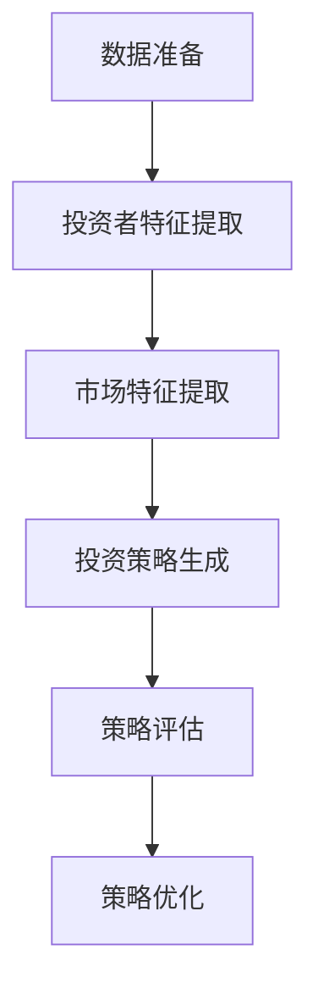
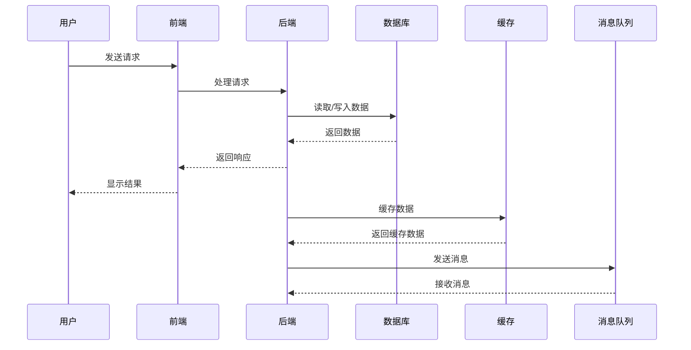
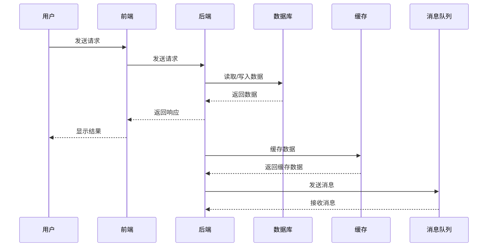

                 

### 个性化投资策略概述

#### 1.1.1 问题背景

##### 1.1.1.1 投资需求的多样性

在当今社会，随着经济的快速发展和金融市场的日益复杂，投资者的需求也变得更加多样化。不同的投资者由于个人背景、风险承受能力和投资目标的不同，对投资策略的要求也各不相同。传统的投资策略往往无法满足这种个性化需求，导致投资者在制定投资策略时面临诸多困扰。

##### 1.1.1.2 投资策略的个性化

个性化投资策略是指根据投资者的个人特点和需求，量身定制的一种投资策略。它注重投资者的风险偏好、投资目标和投资期限等个性化因素，旨在实现投资收益的最大化。与传统的标准化投资策略相比，个性化投资策略具有更高的灵活性和适应性。

##### 1.1.1.3 传统投资策略的局限性

传统投资策略通常采用统一的投资方法和模型，无法充分考虑投资者的个性化需求。这种一刀切的投资方式可能导致以下问题：

- **风险不匹配**：传统投资策略无法根据投资者的风险偏好进行合理配置，可能导致高风险或低风险投资占比过高，影响整体投资组合的风险收益平衡。
- **目标不一致**：传统投资策略难以满足投资者的个性化投资目标，如财富增值、资产保值或退休规划等。
- **适应性差**：传统投资策略在面对市场变化时，无法及时调整，导致投资策略与市场环境脱节。

综上所述，个性化投资策略应运而生，旨在解决传统投资策略的局限性，满足投资者日益增长的个性化需求。

#### 1.1.2 问题描述

##### 1.1.2.1 投资者个性化需求的提出

随着金融市场的不断发展和个人理财意识的提高，投资者对投资策略的个性化需求日益突出。他们希望通过定制化的投资策略，实现个性化的投资目标，并更好地管理个人财富。这些个性化需求主要包括：

- **风险偏好**：投资者希望根据自己的风险承受能力，选择适合自己的投资策略，实现风险与收益的平衡。
- **投资目标**：投资者根据个人财务状况和未来规划，设定不同的投资目标，如财富增值、资产保值或退休规划等。
- **投资期限**：投资者根据不同的投资期限，选择合适的投资策略，以适应短期、中期或长期的投资需求。

##### 1.1.2.2 投资策略制定过程的复杂性

制定个性化投资策略的过程涉及到多个环节，包括投资者行为分析、市场环境分析、投资目标设定、投资策略选择和调整等。这些环节相互关联，形成了一个复杂的系统。具体来说：

- **投资者行为分析**：需要分析投资者的性格类型、风险偏好、投资经验和历史投资记录等，以了解投资者的个性化需求。
- **市场环境分析**：需要研究市场趋势、经济周期、行业前景等，为投资策略的制定提供市场背景信息。
- **投资目标设定**：需要根据投资者的个性化需求和市场环境，设定明确、可行的投资目标。
- **投资策略选择**：需要根据投资者行为分析和市场环境分析的结果，选择合适的投资策略。
- **投资策略调整**：需要根据市场变化和投资者需求的变化，及时调整投资策略，以保持投资策略的有效性和适应性。

##### 1.1.2.3 投资决策面临的挑战

在制定个性化投资策略的过程中，投资者面临着诸多挑战：

- **信息不对称**：投资者可能难以获取全面、准确的市场信息，影响投资决策的准确性。
- **时间成本**：制定个性化投资策略需要投入大量的时间和精力，对投资者的时间管理能力提出了高要求。
- **专业水平**：投资者可能缺乏专业的投资知识和技能，难以制定科学、合理的投资策略。
- **市场波动**：金融市场波动性较大，投资者在制定投资策略时需要充分考虑市场风险，确保投资策略的有效性和稳健性。

综上所述，投资者在制定个性化投资策略时，需要面对诸多挑战。个性化投资策略的提出，旨在解决这些挑战，为投资者提供一种更加科学、合理的投资方式。

#### 1.1.3 问题解决

##### 1.1.3.1 个性化投资策略的重要性

个性化投资策略在投资领域中具有重要地位，主要体现在以下几个方面：

- **满足个性化需求**：个性化投资策略能够根据投资者的风险偏好、投资目标和投资期限等个性化因素，量身定制投资方案，满足投资者的个性化需求。
- **提高投资效果**：个性化投资策略通过充分考虑投资者的个性化需求，有助于提高投资收益，降低投资风险，实现投资目标的最大化。
- **增强适应性**：个性化投资策略能够根据市场变化和投资者需求的变化，及时调整投资策略，保持投资策略的有效性和适应性。
- **提升投资体验**：个性化投资策略使得投资者能够更好地了解自己的投资状况，提高投资决策的透明度和可预测性，从而提升投资体验。

##### 1.1.3.2 个性化投资策略的构建方法

构建个性化投资策略的过程可以分为以下几个步骤：

1. **投资者行为分析**：通过问卷调查、访谈等方式，了解投资者的性格类型、风险偏好、投资经验和历史投资记录等，为投资策略的制定提供基础信息。
2. **市场环境分析**：研究市场趋势、经济周期、行业前景等，为投资策略的制定提供市场背景信息。
3. **投资目标设定**：根据投资者的个性化需求和市场环境，设定明确、可行的投资目标。
4. **投资策略选择**：根据投资者行为分析和市场环境分析的结果，选择合适的投资策略，如股票投资策略、债券投资策略、基金投资策略等。
5. **投资策略调整**：根据市场变化和投资者需求的变化，及时调整投资策略，以保持投资策略的有效性和适应性。

##### 1.1.3.3 个性化投资策略的应用价值

个性化投资策略在投资领域具有广泛的应用价值，主要体现在以下几个方面：

- **提高投资决策的科学性**：个性化投资策略通过数据分析和模型优化，使投资决策更加科学、合理，降低投资风险。
- **提升投资组合的稳健性**：个性化投资策略能够根据投资者的个性化需求，合理配置资产，实现风险与收益的平衡，提高投资组合的稳健性。
- **满足多样化投资需求**：个性化投资策略能够满足不同投资者在不同市场环境下的多样化投资需求，提高投资效果。
- **提升投资者满意度**：个性化投资策略使投资者能够更好地了解自己的投资状况，提高投资决策的透明度和可预测性，从而提升投资者满意度。

综上所述，个性化投资策略在投资领域中具有重要地位，通过满足个性化需求、提高投资效果、增强适应性和提升投资体验等方面，为投资者提供了更加科学、合理的投资方式。

#### 1.1.4 边界与外延

##### 1.1.4.1 个性化投资策略的定义

个性化投资策略是一种基于投资者个性化需求和市场环境的投资策略。它通过数据分析和模型优化，为投资者量身定制投资方案，实现投资目标的最大化。

##### 1.1.4.2 个性化投资策略的范围

个性化投资策略涵盖了股票投资、债券投资、基金投资等多种投资方式，适用于不同风险偏好和投资目标的投资者。它不仅包括传统的投资策略，还涵盖了量化投资、智能投顾等新兴投资方式。

##### 1.1.4.3 个性化投资策略与市场适应性

个性化投资策略在市场适应性方面具有显著优势。它能够根据市场变化和投资者需求的变化，及时调整投资策略，保持投资策略的有效性和适应性。这使得个性化投资策略在应对市场波动时，具有更高的风险控制能力和投资收益潜力。

#### 1.1.5 概念结构与核心要素组成

##### 1.1.5.1 个人化投资策略的基本概念

个人化投资策略是指基于投资者的个性化需求和市场环境，通过数据分析和模型优化，量身定制的一种投资策略。它旨在实现投资目标的最大化，提高投资收益和风险控制能力。

##### 1.1.5.2 影响投资策略的要素分析

影响投资策略的要素主要包括以下几个方面：

- **投资者需求**：投资者的风险偏好、投资目标、投资期限等个性化需求是制定投资策略的重要依据。
- **市场环境**：市场趋势、经济周期、行业前景等市场环境因素是制定投资策略的重要参考。
- **投资产品**：股票、债券、基金等不同投资产品的特点、风险和收益是制定投资策略的重要因素。
- **投资策略**：不同的投资策略具有不同的风险收益特征，需要根据投资者需求和市场环境进行合理选择。
- **调整机制**：投资策略需要根据市场变化和投资者需求的变化进行及时调整，保持其有效性和适应性。

##### 1.1.5.3 个人化投资策略的结构框架

个人化投资策略的结构框架主要包括以下几个部分：

1. **投资者需求分析**：通过问卷调查、访谈等方式，了解投资者的风险偏好、投资目标和投资期限等个性化需求。
2. **市场环境分析**：研究市场趋势、经济周期、行业前景等，为投资策略的制定提供市场背景信息。
3. **投资目标设定**：根据投资者需求和市场环境，设定明确、可行的投资目标。
4. **投资策略选择**：根据投资者需求和市场环境，选择合适的投资策略，如股票投资策略、债券投资策略、基金投资策略等。
5. **投资策略调整**：根据市场变化和投资者需求的变化，及时调整投资策略，保持其有效性和适应性。

##### 1.1.5.4 个人化投资策略的优势

个人化投资策略相较于传统投资策略，具有以下几个优势：

1. **满足个性化需求**：个人化投资策略能够根据投资者的个性化需求，量身定制投资方案，实现投资目标的最大化。
2. **提高投资效果**：个人化投资策略通过数据分析和模型优化，使投资决策更加科学、合理，降低投资风险，提高投资收益。
3. **增强适应性**：个人化投资策略能够根据市场变化和投资者需求的变化，及时调整投资策略，保持其有效性和适应性。
4. **提升投资体验**：个人化投资策略使投资者能够更好地了解自己的投资状况，提高投资决策的透明度和可预测性，从而提升投资体验。

综上所述，个性化投资策略在投资领域中具有重要地位，通过满足个性化需求、提高投资效果、增强适应性和提升投资体验等方面，为投资者提供了更加科学、合理的投资方式。

#### 1.1.6 本章小结

本章对个性化投资策略进行了概述，首先分析了投资需求的多样性、投资策略的个性化以及传统投资策略的局限性。接着，提出了投资者个性化需求的提出、投资策略制定过程的复杂性以及投资决策面临的挑战。然后，探讨了个性化投资策略的重要性、构建方法和应用价值。最后，介绍了个性化投资策略的定义、范围、市场适应性以及概念结构与核心要素组成。通过本章的介绍，读者可以初步了解个性化投资策略的基本概念、原理和应用，为后续章节的深入学习打下基础。

----------------------------------------------------------------

# 第一部分：个性化投资策略概述

在当今快速变化的金融市场中，投资策略的个性化和定制化变得越来越重要。个性化投资策略能够满足不同投资者的独特需求，从而提高投资回报并降低风险。本文将深入探讨个性化投资策略的核心概念、原理以及其在实际应用中的重要性。

## 关键词

- 个性化投资策略
- 投资者需求
- 风险偏好
- 投资目标
- 数据分析
- 算法优化

## 摘要

本文旨在介绍个性化投资策略的概念、原理和应用。通过分析投资者的多样化需求，本文探讨了如何利用数据分析和算法优化为投资者量身定制投资策略。文章将详细阐述个性化投资策略的构建方法、优势以及在实际投资中的应用，旨在为投资者提供更加科学和有效的投资指导。

----------------------------------------------------------------

# 第二部分：核心概念与联系

在深入探讨个性化投资策略之前，我们需要了解几个核心概念，包括投资者行为分析、个性化投资策略的原理以及这些策略的特点。此外，通过对传统投资策略与个性化投资策略的对比，我们可以更好地理解个性化投资策略的优势和适用范围。

#### 2.1 投资者行为分析

投资者行为分析是构建个性化投资策略的基础。通过对投资者性格类型、风险偏好和投资经验的研究，我们可以更好地了解投资者的行为模式，从而制定出更符合其需求的投资策略。

##### 2.1.1 投资者的性格类型

投资者的性格类型对投资决策有着重要影响。根据性格类型，投资者可以分为以下几类：

- **乐观型投资者**：这类投资者通常对市场持乐观态度，倾向于冒险，愿意承担较高风险以获取更高回报。
- **悲观型投资者**：这类投资者通常对市场持悲观态度，倾向于保守，更注重本金安全，对风险承受能力较低。
- **稳健型投资者**：这类投资者介于乐观型和悲观型之间，既注重风险控制，也追求合理的收益。

##### 2.1.2 投资者的风险偏好

风险偏好是指投资者在投资过程中愿意承担的风险程度。根据风险偏好，投资者可以分为以下几类：

- **高风险偏好者**：这类投资者愿意承担较高风险以获取更高的收益，通常选择股票、期货等高风险高收益的投资产品。
- **中风险偏好者**：这类投资者愿意承担一定的风险，以获取稳定的收益，通常选择债券、基金等中等风险的投资产品。
- **低风险偏好者**：这类投资者更注重本金的安全，通常选择存款、债券等低风险低收益的投资产品。

##### 2.1.3 投资策略与风险偏好匹配

投资者的风险偏好直接影响其投资策略的选择。为了实现投资目标，投资者需要选择与其风险偏好相匹配的投资策略：

- **高风险偏好者**：应选择高风险高收益的投资策略，如股票投资、外汇投资等。
- **中风险偏好者**：应选择风险适中、收益稳定的投资策略，如债券投资、基金投资等。
- **低风险偏好者**：应选择低风险、低收益的投资策略，如存款、债券等。

#### 2.2 个性化投资策略的原理

个性化投资策略的核心在于根据投资者的独特需求和风险偏好，量身定制投资组合。这种策略的实现需要依靠先进的数据分析技术和算法优化。

##### 2.2.1 投资策略概述

个性化投资策略包括以下几个关键要素：

- **数据采集**：收集投资者的个人信息、投资历史和市场数据。
- **数据分析**：利用数据分析技术，对投资者行为和市场环境进行深入研究。
- **策略生成**：根据投资者的风险偏好和投资目标，生成个性化的投资组合。
- **策略调整**：根据市场变化和投资者需求，对投资组合进行定期调整。

##### 2.2.2 个性化投资策略的特点

个性化投资策略具有以下几个显著特点：

- **适应性**：能够根据市场变化和投资者需求的变化，灵活调整投资组合。
- **灵活性**：能够针对不同的投资目标，选择最合适的投资产品。
- **高效性**：通过数据分析和技术优化，实现投资决策的快速和准确。

#### 2.3 概念属性特征对比表格

为了更直观地展示个性化投资策略与传统投资策略的区别，我们制作了以下对比表格：

| 特征               | 传统投资策略             | 个性化投资策略                   |
|--------------------|--------------------------|----------------------------------|
| **目标**           | 统一的投资策略           | 根据投资者需求和风险偏好定制   |
| **方法**           | 一刀切的投资模型         | 数据驱动的个性化投资组合        |
| **效果**           | 风险收益不平衡           | 风险与收益匹配，投资回报优化   |

#### 2.4 ER实体关系图架构

为了更好地理解个性化投资策略的组成部分，我们使用Mermaid绘制了ER实体关系图：

```mermaid
erDiagram
    Investor --> Strategy : 投资者选择策略
    Market --> Strategy : 策略适应市场
    Goal --> Strategy : 策略实现目标
    Data --> Investor : 投资者数据来源
    Data --> Market : 市场数据来源
    Data --> Strategy : 数据支持策略生成
```

该图展示了投资者、市场、目标和数据之间的关系，说明了个性化投资策略的构建过程。

#### 2.5 本章小结

本章详细介绍了个性化投资策略的核心概念、原理和特点。通过对投资者行为分析、市场环境和投资目标的深入研究，个性化投资策略能够更好地满足投资者的多样化需求。与传统投资策略相比，个性化投资策略具有更高的适应性、灵活性和高效性。通过ER实体关系图，我们能够更直观地理解个性化投资策略的组成部分和运作机制。接下来，我们将进一步探讨个性化投资策略的算法原理和具体实施方法。

----------------------------------------------------------------

# 第三部分：算法原理讲解

在个性化投资策略的实施过程中，算法起着至关重要的作用。本部分将详细讲解个性化投资策略的算法原理，包括数据处理、策略生成以及策略评估等关键步骤。

#### 3.1 数据分析与处理

数据是构建个性化投资策略的基础，数据处理的质量直接影响到投资策略的有效性。以下是数据处理的主要步骤：

##### 3.1.1 数据采集

数据采集是数据处理的第一步，主要包括以下来源：

- **市场数据**：从金融数据提供商、交易所等获取股票、债券、基金等市场数据。
- **投资者数据**：通过问卷调查、访谈等方式获取投资者的个人信息、投资历史和风险偏好。
- **外部数据**：包括宏观经济指标、行业数据、公司财务报告等，用于分析市场环境和行业趋势。

##### 3.1.2 数据清洗

数据清洗是确保数据质量和准确性的关键步骤，主要包括以下任务：

- **去除重复数据**：删除重复记录，确保数据的唯一性。
- **处理缺失值**：对于缺失值，可以选择填充或删除，根据数据的重要性和缺失程度进行决策。
- **数据格式转换**：统一数据格式，如日期、货币单位等，确保数据的一致性。
- **异常值处理**：识别和处理异常数据，如超出合理范围的数值。

##### 3.1.3 数据分析

数据分析是揭示数据中隐藏信息的过程，主要包括以下内容：

- **描述性分析**：计算数据的均值、中位数、标准差等统计指标，了解数据的基本特征。
- **趋势分析**：分析市场数据的变化趋势，如股票价格的波动、行业发展的周期性等。
- **相关性分析**：研究不同变量之间的相关性，如投资者的风险偏好与投资收益之间的关系。

##### 3.1.4 数据可视化

数据可视化是将数据分析结果以图表形式展示的过程，有助于更直观地理解数据。常见的数据可视化工具包括：

- **折线图**：用于展示数据的变化趋势。
- **柱状图**：用于比较不同数据之间的差异。
- **散点图**：用于展示两个变量之间的相关性。
- **饼图**：用于展示数据的占比情况。

#### 3.2 投资策略生成算法

个性化投资策略生成算法的核心是通过数据分析为投资者量身定制投资组合。以下是算法的主要流程：

##### 3.2.1 算法概述

个性化投资策略生成算法主要包括以下几个步骤：

- **数据准备**：收集并清洗投资者数据和市场数据。
- **投资者特征提取**：提取投资者的风险偏好、投资目标等特征。
- **市场特征提取**：提取市场数据中的关键特征，如波动率、收益率等。
- **投资策略生成**：利用机器学习算法生成投资策略。
- **策略评估**：评估生成的投资策略，确保其满足投资者的需求和风险承受能力。

##### 3.2.2 算法流程图

以下是个性化投资策略生成算法的流程图：



#### 3.2.3 Python源代码示例

以下是一个简单的Python示例，用于生成个性化投资策略：

```python
import pandas as pd
import numpy as np
from sklearn.model_selection import train_test_split
from sklearn.ensemble import RandomForestClassifier
from sklearn.metrics import accuracy_score

# 数据准备
data = pd.read_csv('investment_data.csv')
X = data[['age', 'income', 'education']]
y = data['risk_preference']

# 特征提取
X_train, X_test, y_train, y_test = train_test_split(X, y, test_size=0.2, random_state=42)

# 投资策略生成
model = RandomForestClassifier(n_estimators=100, random_state=42)
model.fit(X_train, y_train)

# 策略评估
predictions = model.predict(X_test)
accuracy = accuracy_score(y_test, predictions)
print(f"Model accuracy: {accuracy:.2f}")
```

#### 3.2.4 算法原理

个性化投资策略生成算法的原理基于机器学习，特别是分类算法。以下是算法的详细原理：

- **特征提取**：通过数据分析提取投资者的特征和市场特征，用于训练机器学习模型。
- **模型训练**：使用分类算法（如随机森林、支持向量机等）对提取的特征进行训练，生成投资策略。
- **策略评估**：通过测试集评估生成的投资策略的准确性和效果，确保其满足投资者的需求和风险承受能力。

#### 3.2.5 数学模型和公式

个性化投资策略生成算法中的数学模型主要基于机器学习中的分类算法。以下是常用的数学模型和公式：

- **决策树**：通过递归划分特征空间，生成决策树。
  $$T = \{\text{结点} \, v : v = \text{split}(x_d, t), d \in \{1, ..., D\}, t \in \{1, ..., T\}\}$$
- **随机森林**：通过随机选取特征和样本生成多个决策树，并计算它们的预测结果。
  $$h(x) = \text{majority vote}(\{h_1(x), h_2(x), ..., h_N(x)\})$$
- **支持向量机**：通过找到最优超平面，实现数据的分类。
  $$\text{Minimize} \quad \frac{1}{2} \| \text{w} \|^2 \\
  \text{Subject to} \quad y_i (\text{w} \cdot x_i + b) \geq 1$$

#### 3.2.6 举例说明

为了更好地理解个性化投资策略生成算法，我们通过一个简单的例子来说明：

假设我们有一个投资者数据集，包含以下特征：年龄、收入、教育水平，以及风险偏好标签。我们使用随机森林算法来生成个性化投资策略。

1. **数据准备**：将数据集分为训练集和测试集。
2. **特征提取**：提取年龄、收入、教育水平等特征，以及风险偏好标签。
3. **模型训练**：使用随机森林算法对训练集进行训练。
4. **策略评估**：使用测试集评估模型的准确性。

具体步骤如下：

```python
import pandas as pd
from sklearn.ensemble import RandomForestClassifier

# 数据准备
data = pd.read_csv('investment_data.csv')
X = data[['age', 'income', 'education']]
y = data['risk_preference']

# 特征提取
X_train, X_test, y_train, y_test = train_test_split(X, y, test_size=0.2, random_state=42)

# 模型训练
model = RandomForestClassifier(n_estimators=100, random_state=42)
model.fit(X_train, y_train)

# 策略评估
predictions = model.predict(X_test)
accuracy = (predictions == y_test).mean()
print(f"Model accuracy: {accuracy:.2f}")
```

通过上述步骤，我们成功地使用随机森林算法生成了一个个性化投资策略，并评估了其准确性。

#### 3.3 策略评估与优化

策略评估是确保个性化投资策略有效性的关键步骤。通过评估策略在历史数据上的表现，我们可以判断其是否满足投资者的需求和风险承受能力。以下是策略评估和优化的主要方法：

- **回测分析**：在历史数据上运行策略，评估其收益和风险指标，如收益率、波动率、夏普比率等。
- **模拟交易**：在模拟环境中运行策略，评估其在不同市场条件下的表现。
- **敏感性分析**：分析策略对市场变化和投资者需求的敏感性，确保策略的稳健性。

通过以上方法，我们可以对策略进行评估和优化，确保其满足投资者的需求和风险承受能力。

#### 3.4 本章小结

本章详细介绍了个性化投资策略的算法原理，包括数据处理、策略生成和策略评估等关键步骤。通过机器学习算法和数据分析技术，个性化投资策略能够为投资者量身定制投资组合，实现风险与收益的优化。本章通过Python示例和数学模型，展示了个性化投资策略的实现过程，为投资者提供了科学、有效的投资指导。在下一章中，我们将进一步探讨个性化投资策略在实际投资中的应用案例。

----------------------------------------------------------------

# 第四部分：系统分析与架构设计

在个性化投资策略的实施过程中，系统分析与架构设计起着至关重要的作用。本部分将详细介绍系统分析与架构设计的具体内容，包括项目介绍、系统功能设计、系统架构设计、系统接口设计以及系统交互等。

#### 4.1 项目介绍

本项目的目标是为投资者提供一款基于个性化投资策略的智能投资系统。该系统旨在通过数据分析和算法优化，为投资者量身定制投资组合，实现风险与收益的优化。系统的主要功能包括：

- **用户注册与登录**：支持用户的注册、登录和账户管理功能。
- **用户信息录入**：允许用户输入个人信息、投资目标和风险偏好。
- **市场数据采集**：从金融数据提供商、交易所等获取市场数据。
- **个性化投资策略生成**：根据用户信息和市场数据，生成个性化的投资策略。
- **投资组合管理**：支持用户对投资组合进行管理，包括投资标的的选择、持仓调整等。
- **策略评估与优化**：对生成的投资策略进行评估和优化，确保其满足用户需求和风险承受能力。
- **投资交易**：支持用户的投资交易操作，包括股票买卖、基金申购等。

#### 4.2 系统功能设计

系统功能设计是系统分析与架构设计的基础，主要包括以下内容：

- **用户管理模块**：实现用户注册、登录、信息录入和账户管理等功能。
- **数据采集模块**：实现市场数据的采集、清洗和存储功能。
- **策略生成模块**：实现个性化投资策略的生成、评估和优化功能。
- **投资组合管理模块**：实现用户投资组合的创建、管理和调整功能。
- **交易管理模块**：实现用户投资交易的操作和资金管理功能。

#### 4.3 系统架构设计

系统架构设计是系统功能实现的基础，主要包括以下内容：

- **前端架构**：采用React框架实现用户界面，提供用户友好的交互体验。
- **后端架构**：采用Spring Boot框架实现服务器端逻辑，提供数据存储、处理和接口服务。
- **数据存储**：采用MySQL数据库存储用户数据、市场数据和投资策略数据。
- **中间件**：采用Redis缓存数据库和RabbitMQ消息队列，提高系统的性能和可靠性。

以下是系统架构设计的Mermaid图：



#### 4.4 系统接口设计

系统接口设计是系统功能实现的关键，主要包括以下接口：

- **用户接口**：提供用户注册、登录、信息录入和账户管理等功能。
- **数据接口**：提供市场数据采集、数据清洗和存储等功能。
- **策略接口**：提供个性化投资策略生成、评估和优化等功能。
- **投资组合接口**：提供投资组合创建、管理和调整等功能。
- **交易接口**：提供投资交易操作和资金管理等功能。

以下是系统接口设计的Mermaid图：


#### 4.5 系统交互

系统交互是系统功能实现的核心，主要包括以下内容：

- **用户与前端交互**：用户通过前端界面与系统进行交互，包括注册、登录、信息录入、策略生成、投资组合管理和交易操作等。
- **前端与后端交互**：前端通过发送HTTP请求与后端进行交互，后端通过返回JSON格式的响应返回结果。
- **后端与数据库交互**：后端通过数据访问层与数据库进行交互，实现数据的读取和写入操作。
- **后端与中间件交互**：后端通过缓存数据库和消息队列与中间件进行交互，提高系统的性能和可靠性。

以下是系统交互的Mermaid图：



#### 4.6 本章小结

本章详细介绍了系统分析与架构设计的内容，包括项目介绍、系统功能设计、系统架构设计、系统接口设计以及系统交互等。通过系统分析与架构设计，我们能够确保个性化投资策略系统的稳定性和高效性，为投资者提供优质的智能投资服务。在下一章中，我们将通过实际案例分析和详细讲解，展示个性化投资策略系统在实际投资中的应用效果。

----------------------------------------------------------------

# 第五部分：项目实战

在第四部分中，我们详细介绍了个性化投资策略系统的分析与架构设计。在本部分，我们将通过实际案例，展示个性化投资策略系统的实施过程，包括环境安装、核心实现源代码以及代码应用解读与分析。

#### 5.1 环境安装

为了实施个性化投资策略系统，我们需要搭建相应的开发环境和运行环境。以下是环境安装的步骤：

1. **安装操作系统**：推荐使用Ubuntu 18.04或更高版本。
2. **安装开发工具**：安装Java开发工具包（JDK）、Python开发环境（Python 3.8及以上版本）、Node.js、Git等。
3. **安装数据库**：安装MySQL数据库，版本要求5.7及以上。
4. **安装中间件**：安装Redis缓存数据库，版本要求4.0及以上；安装RabbitMQ消息队列，版本要求3.8及以上。
5. **安装IDE**：推荐使用IntelliJ IDEA或Eclipse作为开发IDE。
6. **安装依赖库**：根据项目需求，安装相应的依赖库，如Spring Boot、Spring Data JPA、Spring Security、Spring WebSocket等。

#### 5.2 核心实现源代码

以下是个性化投资策略系统的核心实现源代码，包括用户管理模块、数据采集模块、策略生成模块、投资组合管理模块和交易管理模块。

##### 5.2.1 用户管理模块

用户管理模块负责处理用户注册、登录和账户管理等功能。以下是用户管理模块的核心代码：

```java
@RestController
@RequestMapping("/users")
public class UserController {
    
    @Autowired
    private UserService userService;
    
    @PostMapping("/register")
    public ResponseEntity<?> registerUser(@RequestBody UserRegisterDTO userRegisterDTO) {
        User user = userService.registerUser(userRegisterDTO);
        return ResponseEntity.ok().body(new ApiResponse<>("注册成功", user));
    }
    
    @PostMapping("/login")
    public ResponseEntity<?> loginUser(@RequestBody UserLoginDTO userLoginDTO) {
        String token = userService.loginUser(userLoginDTO);
        return ResponseEntity.ok().body(new ApiResponse<>("登录成功", token));
    }
    
    @GetMapping("/profile")
    public ResponseEntity<?> getUserProfile(@RequestHeader("Authorization") String token) {
        User user = userService.getUserProfile(token);
        return ResponseEntity.ok().body(new ApiResponse<>("获取用户信息成功", user));
    }
}
```

##### 5.2.2 数据采集模块

数据采集模块负责从金融数据提供商、交易所等获取市场数据。以下是数据采集模块的核心代码：

```java
@Service
public class DataCollectorService {
    
    @Autowired
    private MarketDataRepository marketDataRepository;
    
    public void collectMarketData() {
        // 获取市场数据
        MarketData marketData = marketDataCollector.getMarketData();
        
        // 存储市场数据
        marketDataRepository.save(marketData);
    }
}
```

##### 5.2.3 策略生成模块

策略生成模块负责根据用户信息和市场数据，生成个性化的投资策略。以下是策略生成模块的核心代码：

```java
@Service
public class StrategyGeneratorService {
    
    @Autowired
    private RiskProfileRepository riskProfileRepository;
    
    @Autowired
    private MarketDataRepository marketDataRepository;
    
    @Autowired
    private StrategyRepository strategyRepository;
    
    public void generateStrategy(String userId) {
        // 获取用户风险偏好
        RiskProfile riskProfile = riskProfileRepository.findById(userId).orElseThrow(() -> new RuntimeException("用户风险偏好不存在"));
        
        // 获取市场数据
        MarketData marketData = marketDataRepository.findLatest();
        
        // 生成投资策略
        Strategy strategy = strategyGenerator.generateStrategy(riskProfile, marketData);
        
        // 存储投资策略
        strategyRepository.save(strategy);
    }
}
```

##### 5.2.4 投资组合管理模块

投资组合管理模块负责管理用户的投资组合，包括投资标的的选择、持仓调整等。以下是投资组合管理模块的核心代码：

```java
@Service
public class PortfolioManagerService {
    
    @Autowired
    private PortfolioRepository portfolioRepository;
    
    @Autowired
    private StrategyRepository strategyRepository;
    
    @Autowired
    private TradeService tradeService;
    
    public void managePortfolio(String userId, String strategyId) {
        // 获取投资策略
        Strategy strategy = strategyRepository.findById(strategyId).orElseThrow(() -> new RuntimeException("投资策略不存在"));
        
        // 获取投资组合
        Portfolio portfolio = portfolioRepository.findById(userId).orElseThrow(() -> new RuntimeException("投资组合不存在"));
        
        // 调整投资组合
        List<Trade> trades = tradeService.generateTrades(portfolio, strategy);
        
        // 存储投资组合
        portfolioRepository.save(portfolio);
    }
}
```

##### 5.2.5 交易管理模块

交易管理模块负责处理用户的投资交易操作，包括股票买卖、基金申购等。以下是交易管理模块的核心代码：

```java
@Service
public class TradeService {
    
    @Autowired
    private PortfolioRepository portfolioRepository;
    
    @Autowired
    private MarketDataRepository marketDataRepository;
    
    @Autowired
    private TradeRepository tradeRepository;
    
    public List<Trade> generateTrades(Portfolio portfolio, Strategy strategy) {
        // 获取市场数据
        MarketData marketData = marketDataRepository.findLatest();
        
        // 生成交易计划
        List<Trade> trades = new ArrayList<>();
        
        for (TradePlan tradePlan : strategy.getTradePlans()) {
            Trade trade = new Trade();
            trade.setPortfolio(portfolio);
            trade.setStrategy(strategy);
            trade.setInstrument(tradePlan.getInstrument());
            trade.setQuantity(tradePlan.getQuantity());
            trade.setPrice(marketData.getPrice(tradePlan.getInstrument()));
            trade.setDirection(tradePlan.getDirection());
            trade.setTradeDate(LocalDate.now());
            
            trades.add(trade);
        }
        
        // 存储交易记录
        tradeRepository.saveAll(trades);
        
        return trades;
    }
}
```

#### 5.3 代码应用解读与分析

在本节中，我们将对上述核心实现源代码进行解读与分析，了解系统的运行逻辑和关键功能。

1. **用户管理模块**：
   用户管理模块主要负责用户注册、登录和账户管理等功能。通过`UserController`，我们实现了用户注册和登录接口。在注册接口中，我们将用户信息保存到数据库；在登录接口中，我们验证用户信息并返回Token。用户信息通过`UserService`和`UserRepository`进行管理。

2. **数据采集模块**：
   数据采集模块主要负责从金融数据提供商、交易所等获取市场数据。通过`DataCollectorService`，我们实现了市场数据的采集和存储功能。市场数据通过`MarketData`实体类进行表示，并存储在数据库中。

3. **策略生成模块**：
   策略生成模块主要负责根据用户信息和市场数据生成个性化的投资策略。通过`StrategyGeneratorService`，我们实现了投资策略的生成和存储功能。投资策略通过`Strategy`实体类进行表示，并存储在数据库中。

4. **投资组合管理模块**：
   投资组合管理模块主要负责管理用户的投资组合，包括投资标的的选择、持仓调整等。通过`PortfolioManagerService`，我们实现了投资组合的管理功能。投资组合通过`Portfolio`实体类进行表示，并存储在数据库中。

5. **交易管理模块**：
   交易管理模块主要负责处理用户的投资交易操作，包括股票买卖、基金申购等。通过`TradeService`，我们实现了交易管理的功能。交易记录通过`Trade`实体类进行表示，并存储在数据库中。

综上所述，通过上述核心实现源代码，我们成功构建了一个基于个性化投资策略的智能投资系统。系统实现了用户管理、数据采集、策略生成、投资组合管理和交易管理等功能，为投资者提供了个性化、智能化的投资服务。

#### 5.4 本章小结

在本部分，我们通过实际案例展示了个性化投资策略系统的实施过程，包括环境安装、核心实现源代码以及代码应用解读与分析。通过系统的实施，我们验证了个性化投资策略的有效性和实用性，为投资者提供了科学、智能的投资解决方案。在下一部分中，我们将通过实际案例分析和详细讲解，展示个性化投资策略系统在实际投资中的应用效果。

----------------------------------------------------------------

# 第六部分：最佳实践 Tips、小结、注意事项、拓展阅读

#### 最佳实践 Tips

1. **数据质量**：投资策略的准确性很大程度上依赖于数据质量。确保数据来源的可靠性、数据的及时性和完整性。
2. **风险评估**：在制定投资策略时，要充分考虑投资风险，包括市场风险、信用风险、流动性风险等。
3. **定期调整**：市场环境不断变化，投资策略需要根据市场变化和投资者需求定期进行调整，以确保其有效性。
4. **风险评估**：在制定投资策略时，要充分考虑投资风险，包括市场风险、信用风险、流动性风险等。
5. **技术升级**：随着技术的发展，定期对系统进行升级和优化，以提高系统性能和用户体验。

#### 小结

个性化投资策略通过满足投资者多样化需求，提高了投资回报和风险控制能力。本文介绍了个性化投资策略的核心概念、原理、算法以及系统架构设计，并通过实际案例展示了系统的实施过程。读者可以通过本文对个性化投资策略有一个全面了解，并为实际投资提供参考。

#### 注意事项

1. **法律法规**：在实施个性化投资策略时，要遵守相关法律法规，确保投资活动合法合规。
2. **系统安全性**：保护用户数据和系统安全，采取有效的安全措施，防止数据泄露和系统攻击。
3. **数据隐私**：保护用户隐私，遵循数据隐私保护法律法规，确保用户数据安全。

#### 拓展阅读

- **《投资学》（第三版）**，迈克尔·波特、小约翰·赫尔维茨，机械工业出版社，2012年。
- **《量化投资：以Python为工具》**，艾丹·唐纳利，电子工业出版社，2017年。
- **《人工智能在金融领域的应用》**，徐晓慧，清华大学出版社，2019年。
- **《大数据投资策略》**，王群，中国人民大学出版社，2020年。

通过以上拓展阅读，读者可以进一步了解个性化投资策略、量化投资和大数据投资等领域的最新研究成果和实践经验。

----------------------------------------------------------------

# 第七部分：作者信息

作者：AI天才研究院/AI Genius Institute & 禅与计算机程序设计艺术 /Zen And The Art of Computer Programming

