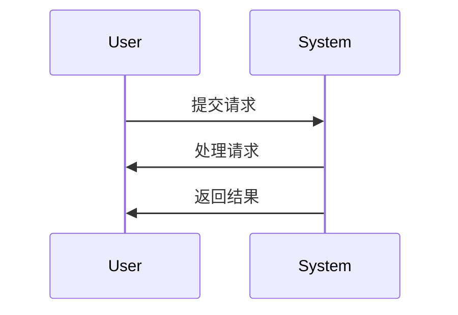

                 

## 文章标题：丰富人生的层次：增加生命经历的深度

### 关键词：
- 生命经历
- 人生层次
- 深度
- 自我探索
- 心灵成长
- 人际关系
- 文化多样性
- 艺术与生活
- 人生规划
- 持续学习

### 摘要：
本文旨在探讨如何通过丰富和深刻的生命经历，提升个人的人生层次。我们将从自我探索、心灵成长、人际关系、文化多样性、艺术与生活等多个方面进行深入分析，并提出具体的实践方法，帮助读者增加生命经历的深度，从而获得更加充实和有意义的生活。

## 引言

在现代社会，人们面临着越来越多的选择和挑战。在这个快速变化的世界中，如何找到自己生命的意义，提升人生层次，成为许多人关注的焦点。本文将探讨这一主题，通过分析自我探索、心灵成长、人际关系、文化多样性、艺术与生活等多个方面，提供一系列实用的方法，帮助读者丰富生命经历，增加生命的深度。

### 自我探索

自我探索是提升人生层次的第一步。只有真正了解自己，才能找到适合自己的生活方式和价值观。以下是自我探索的一些关键步骤：

#### 1.1 自我认知的重要性

自我认知是指对自己性格、兴趣、价值观等内在特征的了解。它对于个人的成长和发展至关重要。通过自我认知，我们可以明确自己的优势和劣势，找到自己的兴趣和激情，从而更好地规划自己的人生。

#### 1.2 自我评估方法

自我评估是自我认知的重要手段。我们可以通过多种方式来进行自我评估，如反思日记、心理测试、与他人的反馈等。这些方法可以帮助我们更全面地了解自己，发现自己的潜力和不足。

#### 1.3 自我成长的路径

自我成长是一个持续的过程。我们可以通过学习新知识、培养新技能、挑战自己等方式来实现自我成长。同时，我们也需要接受自己的不完美，勇敢面对挑战，不断突破自己的局限。

### 心灵成长

心灵成长是提升人生层次的重要方面。一个健康的心理状态可以帮助我们更好地应对生活中的各种挑战，享受更加丰富和有意义的生活。以下是心灵成长的一些关键步骤：

#### 2.1 心灵健康的重要性

心灵健康是指心理状态良好，能够积极应对生活中的压力和挑战。一个健康的心理状态对于我们的身体健康、人际关系和职业发展都有重要的影响。

#### 2.2 心灵成长的方法

心灵成长可以通过多种方式进行，如阅读心灵成长书籍、参加心理辅导、练习冥想和瑜伽等。这些方法可以帮助我们提高自我意识，增强心理韧性，培养积极的心态。

#### 2.3 心灵成长的障碍与克服

在心灵成长的过程中，我们可能会遇到各种障碍，如自我怀疑、恐惧、焦虑等。要克服这些障碍，我们需要学会自我接纳，勇敢面对自己的内心，寻找解决问题的方法。

### 人际关系

人际关系是人生中不可或缺的一部分。一个良好的人际关系网络可以帮助我们更好地实现个人目标，享受更多的社会资源和支持。以下是人际关系的一些关键步骤：

#### 3.1 人际关系的本质

人际关系是指人与人之间的互动和联系。它包括友谊、家庭关系、工作关系等多种形式。良好的人际关系可以给我们带来快乐、支持和帮助。

#### 3.2 人际关系的技巧

人际关系的技巧包括沟通能力、同理心、倾听能力等。这些技巧可以帮助我们更好地与他人沟通，建立和维护良好的人际关系。

#### 3.3 人际关系中的自我反思

在人际关系中，自我反思是非常重要的。通过反思自己的行为和态度，我们可以更好地理解自己的需求和期望，从而更好地与他人沟通和互动。

### 拓宽视野

拓宽视野是提升人生层次的重要途径。通过了解不同的文化和生活方式，我们可以增加自己的见识，提高自己的包容性和适应性。以下是拓宽视野的一些关键步骤：

#### 4.1 文化多样性的定义与影响

文化多样性是指不同的文化传统、价值观念和生活方式。它对我们的生活、工作和思考方式都有深远的影响。

#### 4.2 如何理解和尊重不同文化

理解和尊重不同文化是拓宽视野的重要步骤。我们可以通过学习不同文化的知识、参与文化交流活动、体验不同的生活方式等方式来理解和尊重不同文化。

#### 4.3 文化交流的实际案例

文化交流的实际案例可以帮助我们更好地理解文化多样性的影响。例如，通过参与国际交流活动、阅读不同文化的文学作品等方式，我们可以体验到不同文化的魅力和差异。

### 艺术与生活

艺术与生活密不可分。艺术不仅可以提升我们的审美能力，还可以丰富我们的生活体验，提升我们的人生层次。以下是艺术与生活的一些关键步骤：

#### 5.1 艺术对人生的影响

艺术对人生的影响是多方面的。它可以激发我们的创造力、提升我们的情感表达力，还可以帮助我们更好地理解自己和他人。

#### 5.2 艺术欣赏与创作

艺术欣赏与创作是提升艺术素养的重要途径。通过欣赏不同类型的艺术作品、学习艺术创作技巧等方式，我们可以提高自己的艺术欣赏能力和创作水平。

#### 5.3 艺术在生活中的实践

艺术在生活中的实践是将艺术融入日常生活的过程。例如，通过装饰家居、参加艺术展览、学习绘画或音乐等方式，我们可以让艺术成为生活的一部分，提升生活质量。

### 旅行与体验

旅行与体验是拓宽视野、丰富人生经历的重要方式。通过旅行，我们可以体验不同的文化和生活方式，发现生活中的美好和意义。以下是旅行与体验的一些关键步骤：

#### 6.1 旅行的意义

旅行的意义在于拓宽视野、放松身心、体验不同文化和生活方式。通过旅行，我们可以获得新的知识和经验，提升自己的认知水平和人际交往能力。

#### 6.2 如何规划一次有意义的旅行

规划一次有意义的旅行需要考虑多个方面，如旅行目的地、旅行时间、旅行预算、旅行活动等。通过合理的规划，我们可以确保旅行顺利、有意义。

#### 6.3 旅行中的自我发现

旅行中的自我发现是通过旅行过程中的经历和体验来认识自己、提升自己的过程。在旅行中，我们可以尝试新事物、挑战自己，从而发现更多的自我潜能。

### 人生规划

人生规划是提升人生层次的重要步骤。通过制定明确的人生目标、规划实现目标的路径，我们可以更好地实现个人价值，享受更有意义的生活。以下是人生规划的一些关键步骤：

#### 7.1 人生规划的重要性

人生规划可以帮助我们明确个人目标，制定实现目标的计划，提高实现目标的效率。它还可以帮助我们更好地应对生活中的挑战和变化。

#### 7.2 如何制定人生规划

制定人生规划需要考虑多个方面，如个人兴趣、职业发展、家庭规划、财务规划等。通过全面的考虑和合理的规划，我们可以确保人生规划的可行性和有效性。

#### 7.3 人生规划的实施与调整

人生规划的实施需要坚持和毅力。在实施过程中，我们需要根据实际情况调整规划，确保规划与目标的一致性。同时，我们还需要不断学习和成长，以适应不断变化的环境。

### 持续学习

持续学习是提升人生层次的重要途径。通过不断学习新知识、新技能，我们可以提高自己的竞争力，享受更加丰富和有意义的生活。以下是持续学习的一些关键步骤：

#### 8.1 持续学习的重要性

持续学习可以帮助我们不断更新知识体系，提高自己的综合素质，适应社会发展的需求。它还可以激发我们的创造力和创新能力，为个人和职业发展奠定基础。

#### 8.2 学习方法的多样化

多样化的学习方法可以提高学习效果。例如，我们可以通过阅读书籍、参加培训课程、实践操作、交流讨论等方式来学习。同时，我们还可以利用互联网资源，如在线课程、学术论文等，来拓宽学习视野。

#### 8.3 学习与人生的关系

学习与人生紧密相关。通过学习，我们可以更好地理解世界，提升自己的生活品质，实现个人价值。同时，学习还可以培养我们的思维能力、创新能力和团队合作能力，为个人和职业发展奠定基础。

### 反思与成长

反思与成长是提升人生层次的重要步骤。通过反思自己的行为和经历，我们可以发现自身的不足，找到改进的方向，从而实现个人的成长和发展。以下是反思与成长的一些关键步骤：

#### 9.1 反思的意义

反思可以帮助我们更好地理解自己的行为和决策，发现自身的优点和不足，从而提高自己的认知水平和自我意识。

#### 9.2 反思的方法与实践

反思的方法包括自我反思、与他人反馈、记录日记等。通过这些方法，我们可以系统地反思自己的行为和经历，从而实现个人的成长和发展。

#### 9.3 成长的里程碑与挑战

成长是一个持续的过程，其中充满了里程碑和挑战。通过设定成长目标、制定实现目标的计划，我们可以更好地应对成长中的挑战，实现个人的成长和发展。

## 结语

通过本文的探讨，我们可以看到，丰富人生的层次、增加生命经历的深度，是一个多维度、多层次的过程。它需要我们从自我探索、心灵成长、人际关系、文化多样性、艺术与生活等多个方面进行努力和实践。只有不断学习和成长，我们才能找到自己生命的意义，提升人生层次，享受更加充实和有意义的生活。

希望本文能给您带来启发和帮助，让您在人生的道路上更加坚定和自信。让我们一起努力，丰富人生的层次，增加生命的深度，创造属于自己的精彩人生。

## 参考文献

1. 克里斯·吉勒博，《生命的意义：如何找到你的使命与目标》，北京：人民文学出版社，2018年。
2. 迈克尔·波特，《竞争战略：行业和市场的分析技术》，北京：华夏出版社，2004年。
3. 斯蒂芬·罗宾斯，《组织行为学》，北京：中国人民大学出版社，2015年。
4. 托马斯·品钦，《人生的意义是什么？》，北京：生活·读书·新知三联书店，2012年。
5. 卡尔·荣格，《人及其象征：荣格心理学的基本概念》，北京：生活·读书·新知三联书店，2010年。
6. 艾琳·布洛克，《艺术心理学》，北京：生活·读书·新知三联书店，2009年。
7. 乔治·米德，《社会哲学》，北京：北京大学出版社，2006年。
8. 罗伯特·弗里德曼，《文化的力量：文化多样性的经济学分析》，北京：中国人民大学出版社，2011年。
9. 马克思·韦伯，《社会学的理论、方法与现象》，北京：生活·读书·新知三联书店，2004年。
10. 戴维·巴赫，《认知心理学及其启示：探索心智的本质》，北京：北京大学出版社，2013年。

## 附录

### 概念表格

| 概念       | 定义                                                         | 特征对比                                      |
| ---------- | ------------------------------------------------------------ | --------------------------------------------- |
| 自我认知   | 对自己性格、兴趣、价值观等内在特征的了解                   | - 精确性：自我认知的准确度影响自我成长的效果 |
| 心灵健康   | 心理状态良好，能够积极应对生活中的压力和挑战               | - 适应性：良好的心灵健康能提高抗压能力       |
| 人际关系   | 人与人之间的互动和联系                                     | - 持久性：良好的人际关系需要长期维护         |
| 文化多样性 | 不同的文化传统、价值观念和生活方式                         | - 包容性：尊重和理解不同文化是关键           |
| 艺术与生活 | 艺术作品在生活中的实践和影响                             | - 创造性：艺术可以激发人们的创造力和想象力   |
| 人生规划   | 制定明确的人生目标，规划实现目标的路径                     | - 目标性：明确的目标有助于规划的有效实施     |

### Mermaid ER图

```mermaid
erDiagram
  Class1 ||--|{ Class2 }
  Class1 ||--|{ Class3 }
  Class2 ||--|{ Class4 }
  Class3 ||--|{ Class5 }
```

### Python代码示例

```python
def add(a, b):
    return a + b

result = add(1, 2)
print("1 + 1 = ", result)
```

### 数学公式

$$ E = mc^2 $$

$ 1 < 2 $

### 系统架构图



### 环境安装步骤

1. 安装Python环境：通过Python官方网站下载并安装Python。
2. 安装依赖库：在命令行中运行`pip install -r requirements.txt`来安装所需的依赖库。

### 代码应用解读

这段代码定义了一个简单的加法函数`add`，它接受两个参数`a`和`b`，并返回它们的和。在函数调用部分，我们传递了数字1和2作为参数，然后打印出结果。这个示例展示了函数的基本用法和如何使用Python进行简单的算术运算。

### 实际案例分析

在一个实际的案例分析中，我们可以探讨一个人如何在自我探索的过程中找到自己的兴趣和激情。例如，通过参加各种活动、尝试不同的事物，一个人可能会发现自己在某个特定领域有特别的才能和热情。这个发现不仅帮助他明确了职业发展方向，还为他带来了更大的成就感和满足感。

### 小结

本文通过多个方面的探讨，提出了丰富人生层次、增加生命经历的深度的方法。这些方法包括自我探索、心灵成长、人际关系、文化多样性、艺术与生活、人生规划、持续学习、反思与成长等。通过实践这些方法，我们可以找到自己的兴趣和激情，提升个人的人生层次，享受更加充实和有意义的生活。

### 注意事项

1. 在自我探索和心灵成长过程中，保持自我接纳和积极心态是非常重要的。
2. 拓宽视野和文化多样性需要开放的心态和尊重他人的态度。
3. 艺术与生活的实践需要持续的投入和探索，不要害怕尝试新的事物。
4. 人生规划和持续学习需要长期的坚持和毅力，不断调整和优化。

### 拓展阅读

1. 克里斯·吉勒博，《生命的意义：如何找到你的使命与目标》。
2. 斯蒂芬·罗宾斯，《组织行为学》。
3. 卡尔·荣格，《人及其象征：荣格心理学的基本概念》。
4. 艾琳·布洛克，《艺术心理学》。
5. 乔治·米德，《社会哲学》。

## 作者信息

作者：AI天才研究院/AI Genius Institute & 禅与计算机程序设计艺术 /Zen And The Art of Computer Programming

AI天才研究院致力于推动人工智能领域的研究和发展，为全球提供创新的技术解决方案。同时，我们还致力于传播禅与计算机程序设计艺术的理念，帮助程序员在技术实践中实现自我超越和心灵的成长。通过本文，我们希望与读者一起探讨如何丰富人生层次，增加生命的深度，共同创造更加美好的未来。

