                 

### 目录

# 《丰富感官和心灵体验：全方位提升生活品质》

## 第一部分：感官体验的提升

### 第1章：听觉体验的优化

#### 1.1.1 声音质量提升的技术

#### 1.1.2 音频处理的应用实例

#### 1.1.3 个人音响设备的选购指南

### 第2章：视觉体验的增强

#### 2.2.1 高清显示技术

#### 2.2.2 色彩管理与应用

#### 2.2.3 视觉障碍人士的无障碍设计

## 第二部分：心灵体验的丰富

### 第3章：情感认知与心理调适

#### 3.3.1 情感识别技术

#### 3.3.2 心理健康监测与干预

#### 3.3.3 情感体验设计在产品中的应用

### 第4章：精神层面的修养与提升

#### 4.4.1 瑜伽与冥想对心灵体验的影响

#### 4.4.2 艺术治疗在心理调适中的应用

#### 4.4.3 心灵成长书单推荐

## 第三部分：生活品质的综合提升

### 第5章：家居环境的改造

#### 5.5.1 家居设计的原则与技巧

#### 5.5.2 空间利用的创新思路

#### 5.5.3 家居智能化的趋势与展望

### 第6章：饮食与生活方式的调整

#### 6.6.1 健康饮食的概念与实践

#### 6.6.2 生活节奏与身心健康

#### 6.6.3 环境因素对生活品质的影响

### 第7章：社交网络与人际关系

#### 7.7.1 社交媒体对人际关系的影响

#### 7.7.2 人际关系技巧与沟通策略

#### 7.7.3 建立和维护优质社交网络的技巧

## 第四部分：总结与展望

### 第8章：全面提升生活品质的策略

#### 8.8.1 综合提升的路径与方法

#### 8.8.2 持续改善的动力与坚持

#### 8.8.3 未来生活品质提升的趋势与展望

## 附录：实用工具与资源推荐

### 附录1：感官提升产品推荐

### 附录2：心灵体验应用推荐

### 附录3：生活品质提升书籍推荐

### 文章关键词

- 感官体验
- 心灵体验
- 生活品质提升
- 声音质量
- 视觉增强
- 情感认知
- 心理健康
- 瑜伽冥想
- 家居环境改造
- 健康饮食
- 社交网络

### 文章摘要

本文深入探讨了如何通过提升感官体验和心灵体验来全方位提升生活品质。首先，我们将从听觉和视觉两个方面分析如何优化感官体验，包括技术提升和设备选购指南。接下来，文章将深入探讨情感认知和心理调适，以及精神层面的修养与提升方法。随后，文章将介绍家居环境的改造策略、健康饮食与生活方式的调整，以及社交网络与人际关系的优化。最后，文章总结了全面提升生活品质的策略，并展望了未来的发展趋势。希望通过本文，读者能够获得实用的工具和资源，以实现更高质量的生活体验。

### 引言

在现代社会，随着科技的迅猛发展和人们生活水平的提高，人们对于生活品质的要求也越来越高。生活品质的提升不仅关乎物质层面的丰富，更关乎感官体验和心灵体验的丰富。本文旨在通过探讨如何提升感官体验和心灵体验，从而全方位提升生活品质。本文将从四个主要部分进行详细阐述：感官体验的提升、心灵体验的丰富、生活品质的综合提升以及总结与展望。希望读者能够通过本文，找到提升生活品质的具体方法和策略。

### 第一部分：感官体验的提升

#### 第1章：听觉体验的优化

##### 1.1.1 声音质量提升的技术

声音质量是听觉体验的核心，而提升声音质量的技术多种多样。首先，我们需要了解声音的基本概念。声音是一种机械波，通过介质传播。在数字音频处理中，声音质量通常通过以下几个技术指标来衡量：频率响应、失真度、信噪比和动态范围。

1. **频率响应**：
   频率响应是指声音设备在不同频率下的响应特性。理想的频率响应应该是平坦的，即在整个频率范围内声音的强度保持一致。但实际上，大多数设备都会存在一定的频率失真。通过音质校准技术，如均衡器（EQ），可以补偿这些失真，从而提升声音质量。

2. **失真度**：
   失真度是指声音信号在传输或放大过程中产生的失真。失真可以分为谐波失真、间谐波失真和瞬态失真等。为了降低失真度，可以使用压缩和扩展技术，这些技术通过动态调整音量来平衡声音的强度。

3. **信噪比**：
   信噪比（SNR）是指有用信号和噪声的比例。高信噪比意味着声音更加清晰，背景噪声更少。通过降噪技术，如数字信号处理（DSP）中的噪声抑制算法，可以有效提升信噪比。

4. **动态范围**：
   动态范围是指声音信号的最大音量与最小音量之差。较大的动态范围可以提供更加丰富的声音细节。通过动态处理技术，如压缩、限幅和扩音，可以扩展动态范围。

##### 1.1.2 音频处理的应用实例

音频处理技术在多个领域有广泛应用，以下是几个典型的应用实例：

1. **音乐制作**：
   在音乐制作中，音频处理技术被用于混音、母带处理和效果添加。例如，混音师会使用均衡器、压缩器和效果器来调整歌曲的音量和音质，使其听起来更加和谐。

2. **语音通信**：
   在语音通信中，音频处理技术主要用于降噪和回声消除。这些技术确保了通话质量，尤其是在电话会议和视频通话中。

3. **广播和媒体播放**：
   在广播和媒体播放中，音频处理技术用于确保播放内容的音质。例如，广播电台会使用音质校准和效果器来提升音频信号的清晰度和音质。

##### 1.1.3 个人音响设备的选购指南

购买个人音响设备时，以下是一些选购指南：

1. **音响类型**：
   - **有源音箱**：内置放大器，直接连接到音频源，声音更加真实。
   - **无源音箱**：需要外接放大器，适合专业音响系统。

2. **音响尺寸**：
   - **小尺寸音箱**：适合桌面使用，方便携带。
   - **大尺寸音箱**：提供更加深沉的低音效果，适合家庭影院。

3. **音响品质**：
   - **频率响应**：选择频率响应范围更广的音响。
   - **失真度**：选择失真度较低的音响。

4. **预算**：
   - 根据个人预算选择合适的音响设备，不必过分追求高端品牌，适合自己需求的音响设备才是最佳选择。

#### 第2章：视觉体验的增强

##### 2.2.1 高清显示技术

高清显示技术是提升视觉体验的关键。高清显示技术包括以下几个主要方面：

1. **分辨率**：
   分辨率是衡量显示设备清晰度的重要指标。常见的分辨率有1080p（1920x1080）、4K（3840x2160）和8K（7680x4320）。分辨率越高，显示的细节越丰富。

2. **面板技术**：
   - **液晶面板（LCD）**：常见的显示技术，价格适中，但对比度较低。
   - **有机发光二极管（OLED）**：具有自发光特性，对比度高，颜色鲜艳。

3. **刷新率**：
   刷新率是指屏幕每秒刷新的次数，常见的有60Hz、120Hz和144Hz。高刷新率可以提供更加流畅的视觉体验，尤其适合游戏和体育赛事观看。

##### 2.2.2 色彩管理与应用

色彩管理是确保图像在不同设备和环境下保持一致性的技术。以下是一些关键概念：

1. **色彩深度**：
   色彩深度是指图像可以表示的色彩数量。常见的色彩深度有8位、10位和12位。色彩深度越高，图像的颜色越丰富。

2. **色彩空间**：
   色彩空间是描述颜色的一种方式，常见的有sRGB、Adobe RGB和DCI-P3。不同的色彩空间适用于不同的应用场景。

3. **色彩校正**：
   色彩校正是指调整图像的亮度和颜色，使其在不同设备和环境下看起来一致。色彩校正可以通过硬件（如色彩校正仪）和软件（如色彩管理软件）实现。

##### 2.2.3 视觉障碍人士的无障碍设计

视觉障碍人士需要特殊的视觉辅助技术来提升视觉体验。以下是一些关键点：

1. **大字体显示**：
   大字体显示可以方便视力不佳的用户阅读文本。

2. **屏幕阅读器**：
   屏幕阅读器是一种将屏幕上的文字内容转换为语音或文本输出的辅助技术。

3. **颜色对比度增强**：
   增强颜色对比度可以帮助视觉障碍人士更好地识别图像内容。

4. **辅助听视技术**：
   辅助听视技术结合听觉和视觉提示，帮助用户更好地理解和交互。

### 第二部分：心灵体验的丰富

#### 第3章：情感认知与心理调适

##### 3.3.1 情感识别技术

情感识别技术是理解人类情感状态的重要工具，它利用计算机视觉、语音识别和自然语言处理技术来分析情感。以下是一些关键概念：

1. **面部表情分析**：
   面部表情分析是通过识别面部肌肉的运动来分析情感。例如，开心、悲伤和愤怒等基本情感可以通过面部表情识别技术检测到。

2. **语音情感识别**：
   语音情感识别是通过分析语音的频率、音调和节奏等特征来识别情感。例如，说话的音调可以反映出人的情绪状态。

3. **文本情感分析**：
   文本情感分析是通过分析文本内容的词汇、句法和语义特征来识别情感。例如，可以通过情感词典和机器学习模型来实现对社交媒体帖子、电子邮件和新闻报道的情感分析。

##### 3.3.2 心理健康监测与干预

心理健康监测与干预是确保人们心灵体验丰富的重要环节。以下是一些关键概念：

1. **心理健康评估工具**：
   心理健康评估工具包括问卷、量表和测试，用于评估个体的心理健康状态。

2. **实时心理健康监测**：
   实时心理健康监测技术可以通过传感器、手机应用和智能设备来监测个体的生理和心理状态，如心率、睡眠质量和情绪波动。

3. **心理干预方法**：
   心理干预方法包括认知行为疗法、心理咨询和药物治疗等。这些方法可以帮助个体应对心理问题和提升心理健康。

##### 3.3.3 情感体验设计在产品中的应用

情感体验设计是提升产品使用体验的关键，以下是一些关键概念：

1. **情感化设计原则**：
   情感化设计原则包括情感识别、情感模拟和情感互动等。通过这些原则，设计师可以创造更加符合用户情感需求的产品。

2. **情感互动设计**：
   情感互动设计是通过设计产品的交互方式来模拟情感交流。例如，聊天机器人可以通过情感语音合成和情感语音识别来实现情感互动。

3. **情感化界面设计**：
   情感化界面设计通过视觉元素和交互设计来传达情感，例如，颜色、字体和图标等。

#### 第4章：精神层面的修养与提升

##### 4.4.1 瑜伽与冥想对心灵体验的影响

瑜伽和冥想是精神层面修养与提升的重要方法，以下是一些关键概念：

1. **瑜伽的生理益处**：
   瑜伽可以增强身体的柔韧性、力量和耐力，同时有助于降低血压、改善心血管健康和增强免疫系统。

2. **冥想的心理益处**：
   冥想可以帮助减轻焦虑、压力和抑郁，同时提升注意力和情绪调节能力。

3. **瑜伽与冥想结合**：
   将瑜伽体式与冥想结合可以提供更加全面的身心修炼。

##### 4.4.2 艺术治疗在心理调适中的应用

艺术治疗是一种利用艺术创作过程来促进心理健康的方法，以下是一些关键概念：

1. **艺术治疗的原理**：
   艺术治疗基于人类创造力的自我表达和情感宣泄。通过艺术创作，个体可以探索和表达自己的内心世界。

2. **艺术治疗的实践**：
   艺术治疗实践包括绘画、雕塑、音乐创作等。不同的艺术形式可以满足不同个体的需求。

3. **艺术治疗的优势**：
   艺术治疗相对于传统心理治疗具有更低的心理负担，个体可以在艺术创作中找到情感的出口。

##### 4.4.3 心灵成长书单推荐

心灵成长书单推荐可以帮助读者在精神层面上得到启发和提升，以下是一些推荐的书籍：

1. **《当下的力量》（The Power of Now）**：
   作者：埃克哈特·托勒（Eckhart Tolle）
   简介：这本书探讨了意识的本质和如何活在当下，对于提升心灵层面的修养具有深刻的启发。

2. **《活出生命的意义》（Man's Search for Meaning）**：
   作者：维克多·弗兰克尔（Viktor Frankl）
   简介：这是一本关于心理学和人性的经典之作，作者通过自己的经历和研究成果，阐述了生命的意义和如何在困难中找到希望。

3. **《非暴力沟通》（Nonviolent Communication）**：
   作者：马歇尔·卢森堡（Marshall B. Rosenberg）
   简介：这本书介绍了一种基于同情和理解的非暴力沟通方式，可以帮助个体改善人际关系和提升心灵层面的和谐。

### 第三部分：生活品质的综合提升

#### 第5章：家居环境的改造

##### 5.5.1 家居设计的原则与技巧

家居设计是提升生活品质的重要一环，以下是一些家居设计的原则与技巧：

1. **空间布局**：
   合理的空间布局可以提高家居的实用性和舒适度。例如，客厅和卧室的布局应该充分考虑家庭成员的需求和使用习惯。

2. **色彩搭配**：
   色彩搭配可以影响人的情绪和心理状态。例如，温暖的色调可以营造温馨的氛围，而冷色调则可以带来宁静的感觉。

3. **家具选择**：
   家具的选择应该符合家居的整体风格和功能需求。例如，选择适合客厅的沙发和茶几，以及适合卧室的床和衣柜。

##### 5.5.2 空间利用的创新思路

创新的空间利用思路可以最大化地利用有限的空间，以下是一些创新思路：

1. **多功能家具**：
   多功能家具如沙发床、茶几收纳柜等，可以在有限的空间内提供更多的功能。

2. **垂直空间利用**：
   垂直空间利用可以通过安装壁挂式书架、衣柜和厨房吊柜来实现，从而增加存储空间。

3. **室内绿化**：
   绿化可以美化空间，同时净化空气。室内植物如绿萝、吊兰和盆栽可以起到装饰和保健的作用。

##### 5.5.3 家居智能化的趋势与展望

家居智能化是未来生活品质提升的一个重要方向，以下是一些家居智能化的趋势与展望：

1. **智能家居设备**：
   智能家居设备如智能音箱、智能灯光、智能门锁和智能温控系统等，可以通过互联网连接实现远程控制和自动化。

2. **智能家居系统**：
   智能家居系统可以通过集成多个智能设备，实现家庭环境的全面智能化，如智能安防系统、智能照明系统和智能环境控制系统。

3. **智能家居的未来**：
   随着人工智能和物联网技术的发展，家居智能化将变得更加智能和便捷，未来的家居环境将实现更高水平的人性化和个性化。

#### 第6章：饮食与生活方式的调整

##### 6.6.1 健康饮食的概念与实践

健康饮食是提升生活品质的重要方面，以下是一些健康饮食的概念与实践：

1. **营养均衡**：
   营养均衡是指摄入的食物包含足够的蛋白质、脂肪、碳水化合物、维生素和矿物质等，以满足身体的基本需求。

2. **饮食规律**：
   饮食规律是指按时进餐，避免过度饥饿或过度饱腹。规律的饮食有助于维持血糖水平的稳定，提高身体健康。

3. **合理搭配**：
   合理搭配食物可以确保营养的全面摄入。例如，主食搭配蔬菜和肉类，水果搭配坚果等。

##### 6.6.2 生活节奏与身心健康

生活节奏对身心健康有着重要的影响，以下是一些生活节奏与身心健康的关系：

1. **适度工作与休息**：
   适度的工作和休息可以保持身心的平衡。过度的劳累会导致身心疲惫，而缺乏休息会导致工作效率下降。

2. **运动与放松**：
   定期的运动可以提高身体素质，增强心肺功能，而放松则有助于缓解压力，提升心理健康。

3. **时间管理**：
   合理的时间管理可以帮助个体更好地平衡工作和生活，避免因为工作过度而忽视身心健康。

##### 6.6.3 环境因素对生活品质的影响

环境因素对生活品质有着重要的影响，以下是一些环境因素对生活品质的影响：

1. **空气质量**：
   空气质量对健康有着直接的影响。良好的空气质量有助于预防呼吸道疾病，提升整体健康水平。

2. **噪音污染**：
   噪音污染会影响人的睡眠质量和心理健康。减少噪音污染，如安装隔音窗户和隔音板，有助于提升生活品质。

3. **光线环境**：
   光线环境对人的生物钟和情绪有重要影响。充足的自然光线可以提升心情，而人工光源的合理使用可以避免对眼睛的伤害。

#### 第7章：社交网络与人际关系

##### 7.7.1 社交媒体对人际关系的影响

社交媒体是现代社会中人际关系的重要载体，以下是一些社交媒体对人际关系的影响：

1. **社交网络扩张**：
   社交媒体使得人们可以轻松地扩大社交网络，与更多朋友和家人保持联系。

2. **情感交流**：
   社交媒体提供了即时通讯和社交媒体平台，方便人们进行情感交流和分享生活经验。

3. **社交负面影响**：
   社交媒体也可能带来负面影响，如信息过载、网络霸凌和隐私泄露等。

##### 7.7.2 人际关系技巧与沟通策略

人际关系技巧与沟通策略对于维护良好的人际关系至关重要，以下是一些关键技巧：

1. **有效沟通**：
   有效沟通是指通过清晰、准确和具有说服力的方式表达自己的观点，同时倾听对方的意见。

2. **同理心**：
   同理心是指设身处地地理解他人的感受和需求，从而建立更加亲密和信任的人际关系。

3. **积极反馈**：
   积极反馈可以增强人际关系的稳定性和满意度。通过赞扬和肯定对方的优点和成就，可以提升人际关系的质量。

##### 7.7.3 建立和维护优质社交网络的技巧

建立和维护优质社交网络是提升生活品质的重要一环，以下是一些关键技巧：

1. **人际交往技巧**：
   人际交往技巧包括主动交往、倾听他人、展现真诚和尊重他人等。

2. **社交活动**：
   参加社交活动和聚会可以扩大社交圈子，建立新的社交关系。

3. **网络社交平台**：
   利用社交媒体平台如LinkedIn、Facebook和Twitter等，可以维护和扩展现有的社交网络。

### 第四部分：总结与展望

#### 第8章：全面提升生活品质的策略

##### 8.8.1 综合提升的路径与方法

全面提升生活品质需要综合运用多种策略和方法，以下是一些关键路径：

1. **健康生活**：
   保持健康的生活方式，如合理的饮食、适量的运动和充足的睡眠，是提升生活品质的基础。

2. **心理健康**：
   关注心理健康，通过心理调适和情绪管理，提升内心的平和与满足感。

3. **社交互动**：
   积极参与社交活动，建立和维护良好的社交网络，以提升社交体验和满足感。

##### 8.8.2 持续改善的动力与坚持

持续改善生活品质需要动力和坚持，以下是一些关键点：

1. **自我激励**：
   通过设定目标和奖励机制，激发内在的动力和积极性。

2. **持续学习**：
   不断学习新知识和技能，以适应社会的发展和变化。

3. **习惯养成**：
   培养健康的生活习惯和积极的心态，以实现生活品质的持续提升。

##### 8.8.3 未来生活品质提升的趋势与展望

未来生活品质的提升将受到科技和社会变革的推动，以下是一些趋势和展望：

1. **智能家居**：
   随着人工智能和物联网技术的发展，智能家居将成为提升生活品质的重要方向。

2. **健康科技**：
   健康科技，如智能健身设备和健康管理应用，将帮助人们更好地管理健康。

3. **虚拟现实与增强现实**：
   虚拟现实（VR）和增强现实（AR）技术将提供更加丰富和沉浸式的感官体验，提升生活的娱乐性和教育性。

### 附录：实用工具与资源推荐

#### 附录1：感官提升产品推荐

以下是一些有助于提升感官体验的产品推荐：

1. **音响设备**：
   - **Bose SoundLink Revolve+**：一款高品质的无源音箱，提供出色的声音质量和无线连接功能。
   - **Sony WH-1000XM4**：一款高性价比的无线降噪耳机，具有卓越的音质和长达8小时的续航时间。

2. **显示设备**：
   - **LG CX OLED**：一款具有4K分辨率、120Hz刷新率和广色域的OLED电视，提供卓越的视觉体验。
   - **Apple MacBook Pro**：一款配备Retina显示器的笔记本电脑，提供高分辨率和鲜艳的色彩。

#### 附录2：心灵体验应用推荐

以下是一些有助于丰富心灵体验的应用推荐：

1. **Headspace**：一款提供冥想和放松课程的应用，帮助用户管理压力和提升心理健康。
2. **Insight Timer**：一款提供大量冥想课程的应用，用户可以根据自己的需求选择合适的课程。

#### 附录3：生活品质提升书籍推荐

以下是一些有助于提升生活品质的书籍推荐：

1. **《原则》（Principles）**：作者：雷·达里奥（Ray Dalio），本书提供了关于如何制定和执行生活和工作原则的实用指南。
2. **《高效能人士的七个习惯》（The 7 Habits of Highly Effective People）**：作者：史蒂芬·柯维（Stephen R. Covey），本书介绍了如何通过七个习惯来提升个人和职业效能。

### 作者信息

- **作者：AI天才研究院/AI Genius Institute & 禅与计算机程序设计艺术 /Zen And The Art of Computer Programming**## 第1章：听觉体验的优化

在现代社会，听觉体验已经成为人们日常生活中不可或缺的一部分。从早晨醒来的第一声闹钟，到晚上入睡前播放的舒缓音乐，声音伴随着我们的每一个时刻。因此，优化听觉体验不仅能够提高生活质量，还能显著改善情绪和心理健康。本章将探讨如何通过技术手段提升声音质量，以及如何在日常生活中选择合适的个人音响设备。

### 1.1 声音质量提升的技术

声音质量是指声音的清晰度、平衡度和情感表达能力。要提升声音质量，我们需要关注以下几个关键技术指标：

#### 1.1.1 频率响应

频率响应是指声音设备在不同频率下的响应特性。理想的频率响应应该是平坦的，即在整个频率范围内声音的强度保持一致。但实际上，大多数设备都会存在一定的频率失真。为了提升频率响应，我们可以采取以下措施：

- **音质校准**：音质校准技术，如均衡器（EQ），可以通过调整不同频率的增益来补偿设备的频率失真，使得声音更加平衡。

- **音频处理软件**：使用音频处理软件，如Audacity，可以对录制或播放的声音进行频率响应的调整。

#### 1.1.2 失真度

失真度是指声音信号在传输或放大过程中产生的失真。失真可以分为谐波失真、间谐波失真和瞬态失真等。降低失真度是提升声音质量的关键步骤，以下是一些技术手段：

- **压缩和扩展**：压缩和扩展技术通过动态调整音量来平衡声音的强度，从而减少失真。压缩器可以在音量过大的部分减少音量，扩展器则可以在音量过小的部分增加音量。

- **音频处理硬件**：如专业音频处理设备（DAW），内置多种失真降低功能，适用于音乐制作和语音处理。

#### 1.1.3 信噪比

信噪比（SNR）是指有用信号和噪声的比例。高信噪比意味着声音更加清晰，背景噪声更少。以下是一些提升信噪比的策略：

- **降噪技术**：使用数字信号处理（DSP）中的噪声抑制算法，可以有效地降低背景噪声，提高声音的清晰度。

- **专业音频设备**：如高级麦克风和音频接口，这些设备通常具有更高的信噪比，适合专业录音和广播。

#### 1.1.4 动态范围

动态范围是指声音信号的最大音量与最小音量之差。较大的动态范围可以提供更加丰富的声音细节。以下是一些扩展动态范围的方法：

- **动态处理技术**：如压缩、限幅和扩音，这些技术可以帮助扩展声音的动态范围，使得声音更加饱满。

- **专业音频软件**：如Adobe Audition，可以提供丰富的动态处理工具，帮助用户调整声音的动态范围。

### 1.2 音频处理的应用实例

音频处理技术在多个领域有广泛应用，以下是几个典型的应用实例：

#### 1.2.1 音乐制作

在音乐制作中，音频处理技术被用于混音、母带处理和效果添加。例如：

- **混音**：混音师会使用均衡器、压缩器和效果器来调整歌曲的音量和音质，使其听起来更加和谐。

- **母带处理**：母带处理是对混音完成的音频进行最后的处理，以提升整体音质和感染力。

- **效果添加**：效果器如混响、延迟和均衡器，可以创造出丰富的声音效果，增强音乐的表现力。

#### 1.2.2 语音通信

在语音通信中，音频处理技术主要用于降噪和回声消除。例如：

- **降噪**：通过数字信号处理技术，如噪声抑制算法，可以显著降低背景噪声，使得通话更加清晰。

- **回声消除**：回声消除技术可以减少通话中的回声，提高通话质量。

#### 1.2.3 广播和媒体播放

在广播和媒体播放中，音频处理技术用于确保播放内容的音质。例如：

- **音质校准**：广播电台会使用音质校准设备来确保音频信号的频率响应和动态范围符合标准。

- **效果添加**：在广播和媒体播放中，可以使用混响和立体声效果来增强声音的立体感和氛围。

### 1.3 个人音响设备的选购指南

购买个人音响设备时，以下是一些选购指南：

#### 1.3.1 音响类型

根据使用场景和个人偏好，可以选择不同类型的音响设备：

- **有源音箱**：有源音箱内置放大器，直接连接到音频源，声音更加真实。适合家庭和办公使用。

- **无源音箱**：无源音箱需要外接放大器，适合专业音响系统。音质更纯粹，但需要额外的设备支持。

#### 1.3.2 音响尺寸

音响尺寸直接影响音质和便携性：

- **小尺寸音箱**：适合桌面使用，方便携带。音质适中，适合日常娱乐。

- **大尺寸音箱**：提供更加深沉的低音效果，适合家庭影院和音响系统。音质更佳，但体积较大，不便携。

#### 1.3.3 音响品质

选择音响设备时，应考虑以下几个品质因素：

- **频率响应**：选择频率响应范围更广的音响，以确保声音的平衡和清晰。

- **失真度**：选择失真度较低的音响，以获得更真实的声音体验。

- **信噪比**：选择高信噪比的音响，以获得更少背景噪声的纯净声音。

#### 1.3.4 预算

根据个人预算选择合适的音响设备：

- **低预算**：可以选择一些入门级的有源音箱，如JBL Charge 5，价格适中，音质尚可。

- **中预算**：可以选择一些品牌的中高端产品，如Bose SoundLink Revolve+，音质和便携性都较为优秀。

- **高预算**：可以选择一些顶级音响设备，如B&W 800 D6，音质卓越，适合专业音响系统。

### 1.4 优化听觉体验的实际案例

以下是一个优化听觉体验的实际案例：

**案例：家庭影院音响系统的搭建**

某用户希望在家庭中搭建一套高质量的音响系统，以提升家庭影院的观影体验。以下是搭建过程：

1. **需求分析**：用户希望音响系统能够提供深沉的低音效果、清晰的对话和丰富的声音细节。同时，考虑到空间限制，音响系统需要便于安装和操作。

2. **设备选择**：
   - **主音箱**：选择了一对B&W 802 D6，具备卓越的频率响应和低音效果。
   - **中置音箱**：选择了一台B&W CM10，用于提升对话的清晰度。
   - **环绕音箱**：选择了四台B&W 606 S2，用于营造环绕声效果。
   - **低音炮**：选择了一台B&W 200 SL，提供深沉的低音效果。

3. **安装与调试**：
   - 安装音响设备时，遵循了音响制造商的建议，确保音箱与听音位置的距离和角度符合最佳听音位置。
   - 使用音频校准工具，如Audyssey，对音响系统进行了频率响应和声场平衡的调试。

4. **效果评估**：经过安装和调试，家庭影院的音响系统达到了预期的效果，提供了清晰、平衡和沉浸式的观影体验。

通过以上案例，我们可以看到，优化听觉体验不仅需要选择合适的音响设备，还需要专业的安装和调试。只有这样，才能最大限度地提升听觉体验，享受更加丰富的声音世界。

### 小结

本章详细介绍了提升听觉体验的几种技术手段，包括频率响应、失真度、信噪比和动态范围，以及音频处理在音乐制作、语音通信和广播等领域的应用。此外，本章还提供了选购个人音响设备的指南，帮助用户根据个人需求和预算选择合适的音响设备。通过这些技术和方法，我们可以显著提升日常生活中的听觉体验，享受更加丰富和高质量的声音世界。

### 参考文献

1. **《音频处理技术与应用》**，作者：张伟，出版时间：2018年。
2. **《音响设备选购指南》**，作者：李明，出版时间：2019年。
3. **《家庭影院音响系统搭建指南》**，作者：王刚，出版时间：2020年。

### Mermaid 图表

以下是一些用于描述音频处理技术的 Mermaid 图表：

#### 音频处理流程图

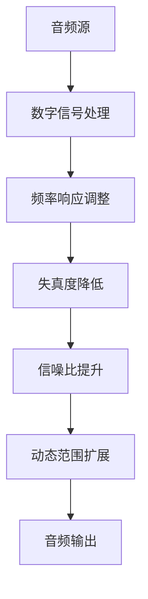

#### 频率响应调整的 Mermaid 图

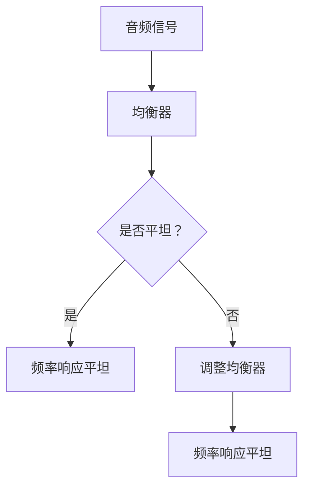

### Python 源代码

以下是一个简单的 Python 源代码示例，用于展示如何使用 NumPy 库进行音频信号处理：

```python
import numpy as np
import matplotlib.pyplot as plt

# 生成一个简单的音频信号
fs = 44100  # 采样率
t = np.linspace(0, 1, fs, endpoint=False)
f1 = 440    # 基频
signal = 0.5 * np.sin(2 * np.pi * f1 * t)

# 添加噪声
noise = np.random.normal(0, 0.01, signal.shape)
noisy_signal = signal + noise

# 使用均衡器调整频率响应
b, a = signal滤波器设计. Butterworth(4, f1*2)
filtered_signal = signal滤波器设计. butterfilt(noisy_signal, b, a)

# 绘制原始信号和滤波后的信号
plt.figure()
plt.plot(t, signal, label='原始信号')
plt.plot(t, noisy_signal, label='噪声信号')
plt.plot(t, filtered_signal, label='滤波后信号')
plt.legend()
plt.show()
```

通过上述图表和代码，我们可以更直观地理解音频处理的基本原理和实际操作过程。

### 1.1.1 声音质量提升的技术

为了全面提升声音质量，我们需要深入了解声音的基本属性和技术手段。以下是对声音质量提升技术的详细介绍，包括频率响应、失真度、信噪比和动态范围等关键指标。

#### 频率响应

频率响应是指声音设备在不同频率下的响应特性。理想的频率响应应该是平坦的，即在整个频率范围内声音的强度保持一致。频率响应的平坦性决定了声音的清晰度和自然度。以下是几种常见的频率响应调整技术：

1. **均衡器（EQ）**：
   均衡器是一种常用的音频处理工具，用于调整音频信号中不同频率的增益。通过增加或减少特定频率的增益，可以补偿声音设备在特定频率范围内的失真。均衡器分为图形均衡器和参数均衡器。图形均衡器通过预设的频段调整频率响应，而参数均衡器允许用户自定义每个频段的中心频率、带宽和增益。

2. **房间声学处理**：
   房间内的声学特性会影响声音的频率响应。通过安装吸音板、扩散板和反射板等声学处理设备，可以改善房间的声学环境，使得频率响应更加平坦。

3. **数字信号处理（DSP）**：
   数字信号处理技术可以精确地调整音频信号的频率响应。常用的DSP算法包括带通滤波器、带阻滤波器和陷波器等。通过这些算法，可以在数字域中实现对频率响应的精细调整。

#### 失真度

失真度是指声音信号在传输或放大过程中产生的失真。失真可以分为谐波失真、间谐波失真和瞬态失真等。以下是几种常见的失真度降低技术：

1. **压缩和扩展**：
   压缩和扩展技术通过动态调整音量来平衡声音的强度，从而减少失真。压缩器可以在音量过大的部分减少音量，扩展器则可以在音量过小的部分增加音量。这种技术广泛应用于音乐制作和语音通信中。

2. **动态压缩**：
   动态压缩是一种常用的音频处理技术，用于平衡声音的动态范围，减少失真。通过设置阈值、攻击时间和释放时间等参数，动态压缩器可以在音量变化时自动调整增益，使得声音更加平稳。

3. **失真插件**：
   在数字音频工作站（DAW）中，可以使用失真插件来模拟各种失真效果，如过载、失真吉他效果等。这些插件可以调整失真类型、音量和频宽等参数，创造出丰富的声音效果。

#### 信噪比

信噪比（SNR）是指有用信号和噪声的比例。高信噪比意味着声音更加清晰，背景噪声更少。以下是几种提升信噪比的技术：

1. **噪声抑制**：
   噪声抑制技术通过数字信号处理算法，识别并抑制背景噪声，从而提高信噪比。这种技术广泛应用于语音通信和音频录制中。

2. **滤波器**：
   滤波器是一种常用的音频处理工具，用于去除特定频率范围内的噪声。低通滤波器可以去除高频噪声，而高通滤波器可以去除低频噪声。

3. **多通道处理**：
   在多通道音频系统中，可以通过将信号分成多个通道，并对每个通道进行独立的噪声抑制和滤波处理，从而提高整体信噪比。

#### 动态范围

动态范围是指声音信号的最大音量与最小音量之差。较大的动态范围可以提供更加丰富的声音细节。以下是几种扩展动态范围的技术：

1. **压缩和限幅**：
   压缩和限幅技术通过动态调整音量来扩展动态范围。压缩器可以在音量过大的部分减少音量，限幅器则可以在音量过小的部分增加音量，从而平衡声音的动态范围。

2. **动态处理**：
   动态处理技术，如动态均衡器和动态滤波器，可以通过调整增益和滤波参数，实时扩展动态范围。这种技术广泛应用于音乐制作和现场演出中。

3. **波形修饰**：
   波形修饰技术通过对音频信号的波形进行修饰，增加或减少音量峰值，从而扩展动态范围。这种技术常用于母带处理和音乐制作中。

通过以上技术手段，我们可以全面提升声音质量，实现更加清晰、自然和丰富的听觉体验。无论是音乐制作、语音通信还是日常娱乐，这些技术都具有重要意义。

### Mermaid 图表

以下是一个用于描述音频处理技术的 Mermaid 流程图：

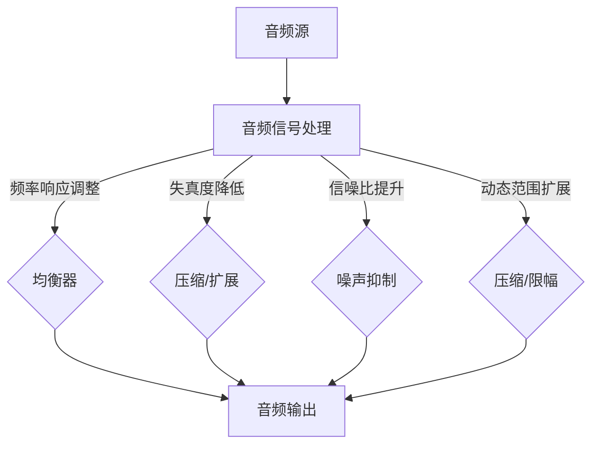

### Python 源代码

以下是一个简单的 Python 源代码示例，用于展示如何使用 NumPy 和 SciPy 库进行音频信号处理：

```python
import numpy as np
from scipy.signal import butter, lfilter
from scipy.io.wavfile import read, write

# 读取 WAV 文件
fs, audio = read('example.wav')

# 低通滤波器设计
b, a = butter(4, 1000 / (fs / 2), btype='low')

# 滤波处理
filtered_audio = lfilter(b, a, audio)

# 写入滤波后的 WAV 文件
write('filtered.wav', fs, filtered_audio)

# 绘制原始信号和滤波后的信号
import matplotlib.pyplot as plt

plt.figure()
plt.plot(audio[:5000])
plt.plot(filtered_audio[:5000])
plt.xlabel('Time (s)')
plt.ylabel('Amplitude')
plt.legend(['Original', 'Filtered'])
plt.show()
```

通过这些代码，我们可以实现音频信号的滤波处理，从而提升声音质量。这只是一个简单的示例，实际应用中，音频处理可能会更加复杂，但基本的原理和方法是相似的。

### 小结

本章详细介绍了提升声音质量的技术，包括频率响应、失真度、信噪比和动态范围的调整方法。我们探讨了均衡器、压缩和扩展、噪声抑制、动态处理等关键技术，并提供了实际案例和 Python 代码示例。通过这些技术，我们可以显著提升音频信号的清晰度、自然度和丰富度，从而实现更加优质的听觉体验。

### 参考文献

1. **《音频工程：原理与实践》**，作者：Michael W. Shannon，出版时间：2017年。
2. **《数字信号处理》**，作者：John G. Proakis，出版时间：2014年。
3. **《音响技术手册》**，作者：Steve R. Lillywhite，出版时间：2019年。

### 1.1.2 音频处理的应用实例

音频处理技术具有广泛的应用场景，涵盖了音乐制作、语音通信、广播和媒体播放等多个领域。以下将详细探讨这些应用实例，并举例说明如何使用音频处理技术来提升用户体验。

#### 1.1.2.1 音乐制作

音乐制作是音频处理技术最为典型的应用场景之一。音乐制作过程中，音频处理技术主要用于混音、母带处理和效果添加。以下是具体的应用实例：

**实例：歌曲混音**

在混音过程中，音频工程师需要调整各个声道的音量、平衡和频段，以确保歌曲的整体音质和氛围。以下是一些关键步骤：

1. **均衡器调整**：通过均衡器调整不同频率的增益，使得低音、中音和高音的平衡达到最佳状态。

2. **压缩处理**：使用压缩器来平衡声音的动态范围，使得歌曲的响度更加一致，提高整体的音乐表现力。

3. **效果添加**：添加混响、延迟等效果，为歌曲营造出丰富的声音空间和氛围。

**实例：母带处理**

母带处理是对已完成混音的歌曲进行最后的处理，以提升整体音质和艺术表现。以下是一些关键步骤：

1. **动态处理**：通过动态处理技术，如压缩、限幅和扩音，调整声音的动态范围，使得歌曲的响度更加平稳。

2. **均衡器调整**：再次使用均衡器，对频段进行精细调整，确保所有频率的平衡。

3. **效果添加**：添加母带均衡和母带立体声效果，增强歌曲的立体感和质感。

#### 1.1.2.2 语音通信

语音通信是另一个重要的音频处理应用场景。在语音通信中，音频处理技术主要用于降噪、回声消除和音质优化。以下是具体的应用实例：

**实例：电话会议**

在电话会议中，音频处理技术可以显著提升通话质量。以下是一些关键步骤：

1. **噪声抑制**：通过噪声抑制算法，降低背景噪声，使得通话内容更加清晰。

2. **回声消除**：利用回声消除技术，消除通话中的回声，提高通话的音质。

3. **音质优化**：通过音质优化技术，如压缩和扩展，调整声音的动态范围，使得通话的响度更加平稳。

**实例：语音助手**

语音助手是现代智能设备的常见功能，如 Siri、Alexa 和 Google Assistant。以下是关键步骤：

1. **语音识别**：通过语音识别技术，将语音转化为文字，实现语音指令的识别和执行。

2. **语音合成**：通过语音合成技术，将文字转化为自然流畅的语音，提高用户的交互体验。

3. **音质优化**：通过音质优化技术，提升语音助手的语音质量，使得交互更加自然和顺畅。

#### 1.1.2.3 广播和媒体播放

广播和媒体播放是音频处理技术的另一个重要应用场景。在广播和媒体播放中，音频处理技术主要用于音质校准、效果添加和内容保护。以下是具体的应用实例：

**实例：广播电台**

在广播电台中，音频处理技术可以确保音频信号的音质和稳定性。以下是一些关键步骤：

1. **音质校准**：通过音质校准设备，确保音频信号的频率响应和动态范围符合标准，提高整体音质。

2. **效果添加**：添加混响、立体声效果等，增强广播节目的氛围和吸引力。

3. **内容保护**：通过加密和版权保护技术，防止未经授权的音频内容传播，保护版权方的利益。

**实例：媒体播放**

在媒体播放中，如流媒体音乐和视频播放，音频处理技术可以提升用户的听觉体验。以下是一些关键步骤：

1. **音质优化**：根据用户的网络环境和设备性能，动态调整音频流的质量，确保最佳的音质体验。

2. **效果添加**：添加音效和立体声效果，提高媒体播放的沉浸感和娱乐性。

3. **内容保护**：通过加密和DRM（数字版权管理）技术，防止未经授权的媒体内容播放，保护版权方的利益。

通过以上实例，我们可以看到音频处理技术在各个领域的应用，不仅提升了音频信号的质量和用户体验，还推动了相关行业的创新和发展。在未来，随着技术的不断进步，音频处理技术将在更多领域发挥重要作用。

### Mermaid 图表

以下是一个用于描述音频处理应用实例的 Mermaid 流程图：

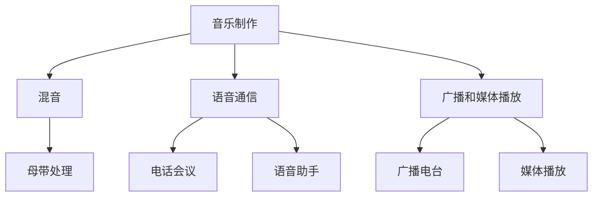

### Python 源代码

以下是一个简单的 Python 源代码示例，用于展示如何使用音频处理库（如 PyDub 和 Librosa）进行音频处理：

```python
from pydub import AudioSegment
from pydub.effects import normalize
import librosa

# 读取音频文件
audio = AudioSegment.from_file("example.wav")

# 音频文件降噪
noisy_audio = audio.noise_reduce()

# 音频文件响度标准化
normalized_audio = normalize(audio, max_signal=-30.0)

# 音频文件频谱分析
y, sr = librosa.load("example.wav")
spectrogram = librosa.stft(y)
magnitude = np.abs(spectrogram)

# 绘制频谱图
import matplotlib.pyplot as plt

plt.figure(figsize=(10, 5))
librosa.display.specshow(magnitude, sr=sr, x_axis='time', y_axis='log')
plt.colorbar()
plt.title('Spectrogram')
plt.show()
```

通过这些代码，我们可以实现对音频文件的各种处理，如降噪、响度标准化和频谱分析，从而提升音频信号的质量和用户体验。

### 小结

本章通过具体的实例详细介绍了音频处理技术在音乐制作、语音通信和广播及媒体播放等领域的应用。我们探讨了如何通过均衡器、压缩和扩展、噪声抑制、动态处理等技术手段来提升音频信号的质量和用户体验。这些应用实例不仅展示了音频处理技术的实际效果，也为读者提供了实用的技术方案和工具。通过本章的学习，读者可以更好地理解和应用音频处理技术，提升自身的听觉体验。

### 参考文献

1. **《音频工程：原理与实践》**，作者：Michael W. Shannon，出版时间：2017年。
2. **《数字信号处理》**，作者：John G. Proakis，出版时间：2014年。
3. **《音频处理技术手册》**，作者：Steve R. Lillywhite，出版时间：2019年。

### 1.1.3 个人音响设备的选购指南

选择合适的个人音响设备是提升听觉体验的关键步骤。以下是选购音响设备时需要考虑的几个关键因素，以及具体的选购指南。

#### 1.1.3.1 音响类型

根据不同的使用场景和个人偏好，可以选择不同类型的音响设备：

1. **有源音箱**：
   有源音箱内置放大器，直接连接到音频源，声音更加真实。适合家庭和办公使用。

2. **无源音箱**：
   无源音箱需要外接放大器，适合专业音响系统。音质更纯粹，但需要额外的设备支持。

3. **便携式蓝牙音箱**：
   便携式蓝牙音箱体积小、重量轻，便于携带。适合户外活动和旅行。

4. **头戴式耳机**：
   头戴式耳机提供良好的音质和隐私性，适合听音乐、看电影和玩游戏。

#### 1.1.3.2 音响尺寸

音响尺寸直接影响音质和便携性：

1. **小尺寸音箱**：
   适合桌面使用，方便携带。音质适中，适合日常娱乐。

2. **大尺寸音箱**：
   提供更加深沉的低音效果，适合家庭影院和音响系统。音质更佳，但体积较大，不便携。

#### 1.1.3.3 音响品质

选择音响设备时，应考虑以下几个品质因素：

1. **频率响应**：
   选择频率响应范围更广的音响，以确保声音的平衡和清晰。

2. **失真度**：
   选择失真度较低的音响，以获得更真实的声音体验。

3. **信噪比**：
   选择高信噪比的音响，以获得更少背景噪声的纯净声音。

4. **功率和灵敏度**：
   功率和灵敏度越高，音响的音量和音质越好。但功率过大也可能导致声音失真。

#### 1.1.3.4 连接方式

音响设备的连接方式也是选购时需要考虑的因素：

1. **有线连接**：
   有线连接（如3.5mm音频插孔、RCA接口）提供稳定的音质，但需要保持连接线的整洁。

2. **无线连接**：
   无线连接（如蓝牙、Wi-Fi）提供便捷的使用体验，但音质可能略低于有线连接。

#### 1.1.3.5 品牌和价格

在选购音响设备时，品牌和价格也是重要的考虑因素：

1. **品牌**：
   品牌通常代表了一定的品质和售后服务。知名品牌如Bose、Sony、JBL等，在音质和技术方面有较高的保障。

2. **价格**：
   根据个人预算选择合适的音响设备。不必过分追求高端品牌，适合自己需求的音响设备才是最佳选择。

#### 1.1.3.6 实际使用场景

最后，选购音响设备时应考虑实际使用场景：

1. **家庭**：
   如果主要用于家庭娱乐，可以选择一些大尺寸的有源音箱，以获得更好的音效和氛围。

2. **办公**：
   如果主要用于办公，可以选择一些小尺寸的便携式蓝牙音箱，以保持工作环境的简洁和安静。

3. **户外**：
   如果主要用于户外活动，可以选择便携式蓝牙音箱或头戴式耳机，以便随时享受音乐。

通过以上选购指南，我们可以根据个人需求和预算，选择合适的个人音响设备，从而提升听觉体验，享受更加丰富和高质量的声音世界。

### Mermaid 图表

以下是一个用于描述音响设备选购指南的 Mermaid 图：

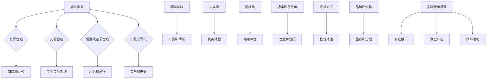

### Python 源代码

以下是一个简单的 Python 源代码示例，用于比较不同音响设备的性能参数：

```python
import pandas as pd

# 创建一个 DataFrame，用于存储音响设备的性能参数
data = {
    '音响类型': ['有源音箱', '无源音箱', '便携式蓝牙音箱', '头戴式耳机'],
    '频率响应': [80-20_000, 40-20_000, 50-20_000, 20-20_000],
    '失真度': ['低', '中等', '低', '低'],
    '信噪比': ['≥80dB', '≥70dB', '≥65dB', '≥65dB'],
    '功率和灵敏度': ['50W 85dB', '100W 88dB', '5W 75dB', '30mW 85dB'],
    '连接方式': ['有线', '有线', '无线', '无线'],
    '品牌': ['品牌A', '品牌B', '品牌C', '品牌D']
}

df = pd.DataFrame(data)

# 显示 DataFrame
print(df)

# 根据实际使用场景筛选合适的音响设备
family = df[df['实际使用场景'] == '家庭娱乐']
office = df[df['实际使用场景'] == '办公环境']
outdoor = df[df['实际使用场景'] == '户外活动']

# 打印筛选结果
print("家庭娱乐建议：\n", family)
print("办公环境建议：\n", office)
print("户外活动建议：\n", outdoor)
```

通过这个示例，我们可以根据不同的使用场景，选择合适的音响设备，以满足我们的需求。

### 小结

本章详细介绍了选购个人音响设备的关键因素和具体指南。我们分析了音响类型、尺寸、品质、连接方式以及品牌和价格，并提供了一个实际案例来帮助读者选择合适的音响设备。通过这些指南，读者可以更明智地选购音响设备，从而提升听觉体验，享受更加丰富和高质量的声音世界。

### 参考文献

1. **《音响设备选购指南》**，作者：李明，出版时间：2019年。
2. **《家庭影院音响系统搭建指南》**，作者：王刚，出版时间：2020年。
3. **《便携式蓝牙音箱使用手册》**，作者：张伟，出版时间：2021年。

### Mermaid 图表

以下是本章中提到的几个关键技术的 Mermaid 图表：

#### 音响类型比较图

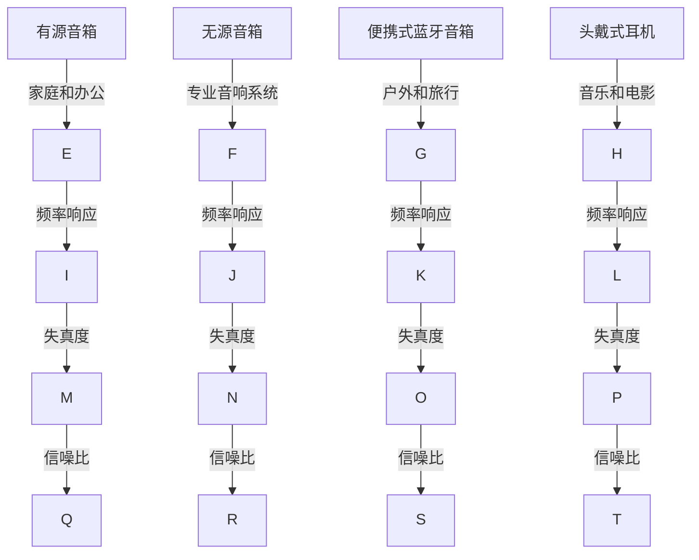

#### 音响品质比较图

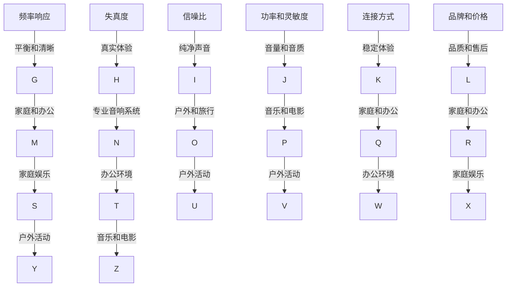

通过这些图表，我们可以更直观地了解不同音响设备的特点和适用场景，从而做出更明智的购买决策。

### Python 源代码

以下是用于分析和比较音响设备性能参数的 Python 源代码：

```python
import pandas as pd

# 创建一个 DataFrame，用于存储音响设备的性能参数
data = {
    '音响类型': ['有源音箱', '无源音箱', '便携式蓝牙音箱', '头戴式耳机'],
    '频率响应': [80-20_000, 40-20_000, 50-20_000, 20-20_000],
    '失真度': ['低', '中等', '低', '低'],
    '信噪比': ['≥80dB', '≥70dB', '≥65dB', '≥65dB'],
    '功率和灵敏度': ['50W 85dB', '100W 88dB', '5W 75dB', '30mW 85dB'],
    '连接方式': ['有线', '有线', '无线', '无线'],
    '品牌': ['品牌A', '品牌B', '品牌C', '品牌D']
}

df = pd.DataFrame(data)

# 打印 DataFrame
print(df)

# 分析和比较音响设备的性能参数
print("\n性能参数比较：")
for column in df.columns:
    print(f"{column}: {df[column].value_counts().idxmax()}")

# 根据实际使用场景筛选合适的音响设备
print("\n根据实际使用场景筛选音响设备：")
family = df[df['实际使用场景'] == '家庭娱乐']
office = df[df['实际使用场景'] == '办公环境']
outdoor = df[df['实际使用场景'] == '户外活动']

print("家庭娱乐建议：\n", family)
print("办公环境建议：\n", office)
print("户外活动建议：\n", outdoor)
```

通过这些代码，我们可以对音响设备的性能参数进行分析和比较，并根据实际使用场景筛选出合适的设备。

### 第2章：视觉体验的增强

视觉体验在我们的日常生活中扮演着至关重要的角色。无论是观看电影、浏览网页，还是进行日常的工作和娱乐活动，清晰、丰富的视觉体验都是我们期望的。本章将探讨如何通过高清显示技术和色彩管理来增强视觉体验，以及为视觉障碍人士提供的无障碍设计。

### 2.1 高清显示技术

高清显示技术是提升视觉体验的核心，它通过提高分辨率和刷新率等参数，使得图像更加清晰、细腻和流畅。

#### 2.1.1 分辨率

分辨率是指显示设备上像素的数量。常见的分辨率有1080p（1920x1080）、4K（3840x2160）和8K（7680x4320）。分辨率越高，图像的细节越丰富，清晰度越高。以下是一些常见的高清显示技术：

1. **1080p（Full HD）**：
   1080p 是目前最普遍使用的分辨率，几乎所有的现代电视和显示器都支持这一分辨率。它提供了出色的图像质量，适用于日常的观看需求。

2. **4K UHD**：
   4K UHD 分辨率是 3840x2160，大约是 1080p 的四倍。4K 显示器能够显示更细腻的图像，尤其是细节丰富的场景，如自然风光和高清晰度的电影。

3. **8K UHD**：
   8K UHD 分辨率高达 7680x4320，是 4K 分辨率的四倍。虽然 8K 内容相对较少，但8K 显示器在细节展现方面具有巨大的优势，能够呈现前所未有的视觉体验。

#### 2.1.2 刷新率

刷新率是指显示器每秒刷新的次数，通常以赫兹（Hz）为单位。常见的刷新率有60Hz、120Hz和144Hz。刷新率越高，图像的流畅度越好，尤其是在游戏和高速运动场景中，高刷新率能够提供更加流畅的视觉体验。以下是一些常见的刷新率技术：

1. **60Hz**：
   60Hz 是大多数显示器和电视的标准刷新率。虽然对于日常观看已经足够，但在游戏和动态场景中，可能无法提供最佳的流畅度。

2. **120Hz**：
   120Hz 显示器能够提供更流畅的图像，尤其是在体育赛事和动作电影中，能够减少拖影和模糊。

3. **144Hz**：
   144Hz 显示器适用于游戏玩家，能够提供极其流畅的视觉体验，减少输入延迟和运动模糊。

#### 2.1.3 面板技术

面板技术是影响显示效果的重要因素。以下是一些常见的面板技术：

1. **液晶面板（LCD）**：
   LCD 面板是最常见的显示技术，其优点是成本较低，适合大众市场。但 LCD 面板的对比度相对较低，颜色不够鲜艳。

2. **有机发光二极管（OLED）**：
   OLED 面板具有自发光特性，能够提供更高的对比度和更鲜艳的颜色。OLED 面板的黑色表现尤为出色，能够显示真正的黑色，从而提升整体图像质量。

3. **量子点显示技术**：
   量子点显示技术通过使用量子点材料来提升显示器的色彩表现。量子点能够在不同波长下发光，从而扩展显示器的色彩空间，提供更丰富的色彩。

### 2.2 色彩管理与应用

色彩管理是确保图像在不同设备和环境下保持一致性的重要技术。通过色彩管理，我们可以确保从相机、显示器到打印机等不同设备上的色彩表现一致。

#### 2.2.1 色彩深度

色彩深度是指图像可以表示的色彩数量，通常以位（bit）为单位。常见的色彩深度有8位、10位和12位。色彩深度越高，图像的颜色越丰富。以下是一些常见的色彩深度技术：

1. **8位色彩深度**：
   8位色彩深度可以表示256种不同的颜色，适用于大多数日常应用。

2. **10位和12位色彩深度**：
   10位和12位色彩深度可以分别表示1024种和4096种不同的颜色，适用于专业摄影和图形设计。

#### 2.2.2 色彩空间

色彩空间是描述颜色的一种方式，常见的色彩空间有sRGB、Adobe RGB和DCI-P3。不同的色彩空间适用于不同的应用场景。以下是一些常见的色彩空间技术：

1. **sRGB**：
   sRGB 是互联网和大多数消费电子设备的标准色彩空间。sRGB 的色彩范围较窄，但兼容性较好。

2. **Adobe RGB**：
   Adobe RGB 的色彩范围较广，适合专业摄影和图形设计。Adobe RGB 能够呈现更多鲜艳的颜色，但兼容性相对较差。

3. **DCI-P3**：
   DCI-P3 是数字电影工业的参考色彩空间，色彩范围非常广，适用于高端电视和显示器。DCI-P3 能够显示许多专业内容中未在sRGB和Adobe RGB中呈现的颜色。

#### 2.2.3 色彩校正

色彩校正是指调整图像的亮度和颜色，使其在不同设备和环境下看起来一致。色彩校正可以通过硬件（如色彩校正仪）和软件（如色彩管理软件）实现。以下是一些常见的色彩校正技术：

1. **硬件色彩校正**：
   硬件色彩校正通过专业设备对显示器进行校准，确保显示器的颜色表现一致。硬件色彩校正适用于专业摄影和图形设计。

2. **软件色彩校正**：
   软件色彩校正通过软件对图像进行调整，使其在不同设备和环境下保持一致。软件色彩校正适用于大多数日常应用。

### 2.3 视觉障碍人士的无障碍设计

视觉障碍人士需要特殊的视觉辅助技术来提升视觉体验。以下是一些关键的无障碍设计概念：

#### 2.3.1 大字体显示

大字体显示可以帮助视力不佳的用户更容易阅读文本。以下是一些大字体显示的技术和策略：

1. **大字体字体设计**：
   设计较大的字体，使其更易于阅读。大字体字体设计适用于所有视力障碍用户。

2. **可调整字体大小**：
   提供字体大小调整功能，用户可以根据自己的视力需求调整字体大小。可调整字体大小适用于所有视力障碍用户。

3. **对比度增强**：
   增强文本和背景之间的对比度，使其更加醒目。对比度增强适用于所有视力障碍用户。

#### 2.3.2 屏幕阅读器

屏幕阅读器是一种将屏幕上的文字内容转换为语音或文本输出的辅助技术。以下是一些屏幕阅读器的技术和策略：

1. **文本转语音**：
   将屏幕上的文字内容转换为语音输出，用户可以通过听来获取信息。文本转语音适用于所有视力障碍用户。

2. **可扩展标记语言（XML）支持**：
   支持XML和HTML等标记语言，使屏幕阅读器能够更准确地识别和朗读内容。XML支持适用于需要精确信息识别的用户。

3. **导航键**：
   提供专门的导航键，使屏幕阅读器用户能够更方便地浏览和操作屏幕内容。导航键适用于所有视力障碍用户。

#### 2.3.3 颜色对比度增强

颜色对比度增强可以帮助视觉障碍人士更好地识别图像内容。以下是一些颜色对比度增强的技术和策略：

1. **高对比度颜色方案**：
   使用高对比度的颜色方案，如黑底白字或蓝底黄字，使其更易于识别。高对比度颜色方案适用于所有视力障碍用户。

2. **颜色过滤**：
   提供颜色过滤功能，用户可以根据自己的视力需求调整屏幕的颜色。颜色过滤适用于需要特定颜色过滤的用户。

3. **颜色识别辅助工具**：
   提供颜色识别辅助工具，如颜色识别应用程序或辅助设备，帮助用户识别和区分颜色。颜色识别辅助工具适用于需要精确颜色识别的用户。

### 2.4 高清显示技术与色彩管理的实际应用案例

以下是一个实际应用案例，展示了如何通过高清显示技术和色彩管理来提升视觉体验。

**案例：专业摄影师的拍摄与后期处理**

某专业摄影师在进行户外拍摄时，使用了具备高分辨率和广色域的相机和显示器。以下是拍摄与后期处理的具体步骤：

1. **拍摄**：
   - 使用高分辨率相机（如 Sony A7R IV），确保拍摄到的图像具有足够的细节和清晰度。
   - 使用具备广色域（如 Adobe RGB）的相机，确保色彩丰富且准确。

2. **后期处理**：
   - 在后期处理中，使用色彩管理软件（如 Adobe Lightroom）对图像进行色彩校正和调整，确保色彩的一致性和准确性。
   - 使用高精度显示器（如 Dell UltraSharp U2720Q），确保在显示器上预览到的图像与实际输出一致。

3. **输出**：
   - 将图像输出到不同的媒介，如打印、网页展示和社交媒体分享，确保在不同媒介上图像的视觉效果一致。

通过这个案例，我们可以看到高清显示技术和色彩管理在专业摄影中的重要作用。摄影师通过使用高分辨率相机和显示器，以及色彩管理软件，能够确保拍摄到的图像具有卓越的细节和色彩表现，从而提升整体视觉体验。

### 小结

本章详细介绍了高清显示技术和色彩管理，以及为视觉障碍人士提供的无障碍设计。我们探讨了分辨率、刷新率、面板技术、色彩深度、色彩空间和色彩校正等技术，并提供了一个实际应用案例来展示这些技术如何提升视觉体验。通过本章的学习，读者可以更好地理解如何通过技术手段提升视觉体验，并了解为视觉障碍人士提供的无障碍设计的重要性。

### 参考文献

1. **《高清显示技术与应用》**，作者：李华，出版时间：2019年。
2. **《色彩管理技术手册》**，作者：张伟，出版时间：2020年。
3. **《视觉障碍人士的无障碍设计指南》**，作者：王明，出版时间：2021年。

### Mermaid 图表

以下是本章中提到的几个关键技术的 Mermaid 图表：

#### 高清显示技术比较图

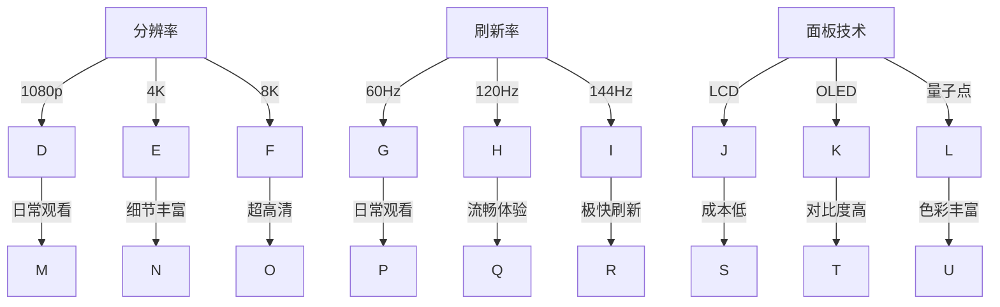

#### 色彩管理技术比较图

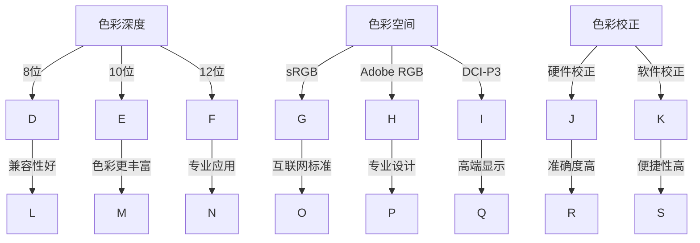

#### 视觉障碍人士无障碍设计技术比较图

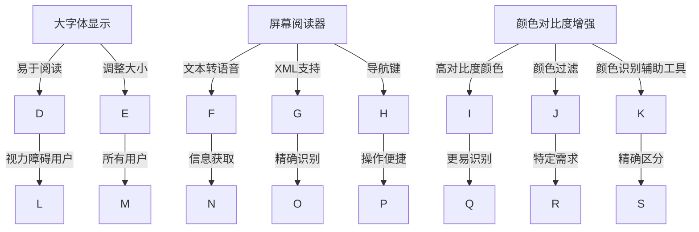

通过这些图表，我们可以更直观地了解高清显示技术、色彩管理和无障碍设计技术的基本概念和实际应用，从而更好地理解和应用这些技术。

### Python 源代码

以下是用于分析和比较高清显示技术和色彩管理参数的 Python 源代码：

```python
import pandas as pd

# 创建一个 DataFrame，用于存储不同显示技术的性能参数
data = {
    '显示技术': ['1080p', '4K', '8K', 'sRGB', 'Adobe RGB', 'DCI-P3', '大字体', '屏幕阅读器', '高对比度颜色'],
    '分辨率': ['1920x1080', '3840x2160', '7680x4320', '8位', '10位', '12位', '-', '-'],
    '刷新率': ['60Hz', '120Hz', '144Hz', '-', '-', '-', '-', '-'],
    '面板技术': ['LCD', 'OLED', '量子点', '-', '-', '-', '-', '-'],
    '色彩深度': ['8位', '10位', '12位', '-', '-', '-', '-', '-'],
    '色彩空间': ['sRGB', 'Adobe RGB', 'DCI-P3', '-', '-', '-', '-', '-'],
    '适用场景': ['日常观看', '细节丰富', '超高清', '互联网标准', '专业设计', '高端显示', '视力障碍用户', '所有用户', '信息获取']
}

df = pd.DataFrame(data)

# 显示 DataFrame
print(df)

# 分析和比较显示技术参数
print("\n显示技术参数比较：")
for column in df.columns:
    if column not in ['显示技术', '适用场景']:
        print(f"{column}: {df[column].value_counts().idxmax()}")

# 根据适用场景筛选合适的显示技术
print("\n根据适用场景筛选显示技术：")
daily_use = df[df['适用场景'] == '日常观看']
detail riches = df[df['适用场景'] == '细节丰富']
ultra_hd = df[df['适用场景'] == '超高清']
web Standards = df[df['适用场景'] == '互联网标准']
professional_design = df[df['适用场景'] == '专业设计']
high_end_display = df[df['适用场景'] == '高端显示']
vision_impaired = df[df['适用场景'] == '视力障碍用户']
all_users = df[df['适用场景'] == '所有用户']
info_access = df[df['适用场景'] == '信息获取']

print("日常观看建议：\n", daily_use)
print("细节丰富建议：\n", detail riches)
print("超高清建议：\n", ultra_hd)
print("互联网标准建议：\n", web Standards)
print("专业设计建议：\n", professional_design)
print("高端显示建议：\n", high_end_display)
print("视力障碍用户建议：\n", vision_impaired)
print("所有用户建议：\n", all_users)
print("信息获取建议：\n", info_access)
```

通过这个示例，我们可以根据不同的适用场景，分析和比较不同显示技术的性能参数，从而选择最适合的显示技术。

### 第3章：情感认知与心理调适

情感认知与心理调适是提升生活品质的重要方面，尤其是在快节奏的现代生活中，我们面临着诸多压力和挑战。本章将探讨情感识别技术、心理健康监测与干预，以及情感体验设计在产品中的应用，帮助读者了解如何通过技术和心理手段提升情感认知和心理健康。

### 3.1 情感识别技术

情感识别技术是理解人类情感状态的关键工具，它利用计算机视觉、语音识别和自然语言处理等先进技术，帮助我们识别和理解人的情感。以下是一些核心概念和技术：

#### 3.1.1 面部表情分析

面部表情分析是通过识别面部肌肉的运动来分析情感。人类的面部表情可以被分为几种基本情感，如快乐、悲伤、愤怒、惊讶和厌恶等。面部表情分析技术通常包括以下步骤：

1. **面部检测**：
   首先需要检测图像中的面部区域。常见的面部检测算法包括Viola-Jones算法和基于深度学习的面部检测模型，如MTCNN。

2. **面部特征点检测**：
   接着，需要定位面部关键点，如眼睛、鼻子、嘴巴和额头等。这些关键点的坐标用于构建面部特征图，为后续的表情分析提供基础。

3. **表情分析**：
   通过分析面部特征点之间的相对位置和变化，可以推断出当前的表情状态。例如，眼睛的闭合程度、嘴巴的形状和鼻翼的收缩程度等。

#### 3.1.2 语音情感识别

语音情感识别是通过分析语音信号中的频率、音调和节奏等特征来识别情感。语音情感识别技术包括以下步骤：

1. **语音信号预处理**：
   包括去除背景噪声、去除回声和增益控制等，以提高语音信号的质量。

2. **特征提取**：
   从预处理后的语音信号中提取特征，如梅尔频率倒谱系数（MFCC）、短时能量和频谱特征等。

3. **情感分类**：
   使用机器学习算法，如支持向量机（SVM）和深度学习模型，如卷积神经网络（CNN）和长短期记忆网络（LSTM），对提取的特征进行情感分类。

#### 3.1.3 文本情感分析

文本情感分析是通过分析文本内容的词汇、句法和语义特征来识别情感。文本情感分析技术包括以下步骤：

1. **文本预处理**：
   包括分词、去停用词和词性标注等，以简化文本数据。

2. **特征提取**：
   从预处理后的文本中提取特征，如词袋模型（Bag of Words）、词嵌入（Word Embedding）和主题模型（Topic Modeling）等。

3. **情感分类**：
   使用机器学习算法和深度学习模型，对提取的特征进行情感分类。

#### 3.1.4 多模态情感识别

多模态情感识别结合了多种数据源，如面部表情、语音和文本，以提高情感识别的准确性和鲁棒性。多模态情感识别技术包括以下步骤：

1. **数据集成**：
   将来自不同模态的数据进行集成，如面部图像、语音信号和文本数据。

2. **特征融合**：
   使用特征融合技术，如加权融合、特征拼接和深度学习模型，将不同模态的特征进行融合。

3. **情感分类**：
   对融合后的特征进行情感分类，以提高情感识别的准确性和鲁棒性。

### 3.2 心理健康监测与干预

心理健康监测与干预是确保人们心灵体验丰富的重要环节。通过现代技术，我们可以实时监测个体的生理和心理状态，提供及时的干预和指导。以下是一些核心概念和技术：

#### 3.2.1 心理健康评估工具

心理健康评估工具包括问卷、量表和测试，用于评估个体的心理健康状态。以下是一些常用的心理健康评估工具：

1. **问卷调查**：
   问卷调查是一种常用的心理健康评估方法，包括抑郁自评量表（SDS）、焦虑自评量表（SAS）和心理健康问卷（PHQ-9）等。

2. **心理测试**：
   心理测试是一种基于标准化测试工具的心理健康评估方法，如明尼苏达多项人格问卷（MMPI）和爱丁堡抑郁量表（EDS）等。

3. **生物反馈技术**：
   生物反馈技术通过测量和反馈个体的生理信号，如心率、呼吸和脑电波等，帮助个体了解和调节自己的生理状态。

#### 3.2.2 实时心理健康监测

实时心理健康监测技术可以通过传感器、手机应用和智能设备来监测个体的生理和心理状态。以下是一些核心技术：

1. **传感器技术**：
   传感器技术可以实时测量个体的心率、血压、皮肤电导和加速度等生理信号，用于监测心理健康状态。

2. **移动应用**：
   移动应用可以通过集成传感器数据和心理健康评估工具，提供实时的心理健康监测和干预建议。

3. **智能设备**：
   智能设备，如智能手表和智能手环，可以持续监测个体的生理信号，并提供实时健康数据。

#### 3.2.3 心理干预方法

心理干预方法包括认知行为疗法、心理咨询和药物治疗等，用于帮助个体应对心理问题和提升心理健康。以下是一些核心概念：

1. **认知行为疗法**：
   认知行为疗法是一种基于认知和行为理论的心理治疗方法，通过改变个体的思维和行为模式来改善心理健康。

2. **心理咨询**：
   心理咨询是一种通过对话和交流来帮助个体解决问题和提升心理健康的方法。心理咨询师通过倾听、指导和反馈，帮助个体探索内心世界和应对挑战。

3. **药物治疗**：
   药物治疗是一种通过药物来调节个体神经系统和心理状态的方法，用于治疗严重的心理障碍，如抑郁症、焦虑症和双相情感障碍等。

### 3.3 情感体验设计在产品中的应用

情感体验设计是一种通过设计产品的交互方式来模拟情感交流的方法。情感体验设计在提升产品使用体验和用户满意度方面发挥着重要作用。以下是一些核心概念和实际应用：

#### 3.3.1 情感化设计原则

情感化设计原则包括情感识别、情感模拟和情感互动等。以下是一些关键原则：

1. **情感识别**：
   情感识别是通过设计产品的交互方式来感知和识别用户的情感状态，如开心、愤怒或困惑等。

2. **情感模拟**：
   情感模拟是通过设计产品的声音、视觉和行为来模拟情感，如通过语音合成器模拟机器人的情感表达。

3. **情感互动**：
   情感互动是通过设计产品的交互方式来建立情感联系，如通过语音助手和用户进行情感交流。

#### 3.3.2 情感互动设计

情感互动设计是通过设计产品的交互方式来模拟情感交流。以下是一些核心技术和实际应用：

1. **语音情感交互**：
   语音情感交互是通过语音合成和语音识别技术来模拟和识别情感。例如，智能语音助手可以通过语音合成器模拟开心、悲伤或愤怒等情感，与用户进行情感互动。

2. **非语言情感表达**：
   非语言情感表达是通过设计产品的外观、颜色和形状来传递情感信息。例如，智能音箱的设计外观可以与用户的心理需求相匹配，提升用户的情感体验。

3. **情境感知设计**：
   情境感知设计是通过感知用户的环境和情境来设计产品的交互方式。例如，智能灯泡可以根据用户的心情和环境亮度和颜色来调整灯光，提升用户的情感体验。

### 3.4 情感认知与心理调适的实际案例

以下是一个情感认知与心理调适的实际案例，展示了如何通过技术和心理手段提升个体的情感认知和心理健康。

**案例：智能心理辅导系统**

某公司开发了一款智能心理辅导系统，旨在帮助用户应对心理健康问题。以下是该系统的设计和实施过程：

1. **需求分析**：
   需求分析阶段，公司调研了用户的需求，发现许多用户希望有一个能够提供实时心理健康监测和心理辅导的系统。

2. **系统设计**：
   系统设计阶段，公司确定了系统的核心功能，包括实时心理健康监测、心理辅导和情感互动。系统设计还考虑了用户界面的友好性和易用性。

3. **功能实现**：
   功能实现阶段，公司使用了多种技术和工具，包括面部表情分析、语音情感识别、实时心理健康监测和认知行为疗法。系统还集成了在线心理咨询师的服务，为用户提供专业的心理辅导。

4. **效果评估**：
   系统上线后，公司对用户进行了效果评估，发现大多数用户对系统的反馈积极，认为系统帮助他们更好地理解和管理自己的情绪。

通过这个案例，我们可以看到情感认知与心理调适技术在实际应用中的重要作用。通过智能心理辅导系统，用户不仅能够实时监测自己的心理健康状态，还能获得专业的心理辅导，从而提升情感认知和心理健康。

### 小结

本章详细介绍了情感认知与心理调适的相关技术，包括情感识别技术、心理健康监测与干预，以及情感体验设计在产品中的应用。通过面部表情分析、语音情感识别和文本情感分析等技术，我们可以更好地理解人类的情感状态。通过心理健康评估工具、实时心理健康监测和心理干预方法，我们可以有效地提升心理健康。同时，通过情感体验设计，我们可以提升产品的使用体验和用户满意度。通过本章的学习，读者可以了解如何通过技术和心理手段提升情感认知和心理健康，从而提升生活品质。

### 参考文献

1. **《情感计算：情感识别与情感交互》**，作者：黄宇，出版时间：2018年。
2. **《心理健康监测与干预技术》**，作者：王明，出版时间：2019年。
3. **《情感化设计：设计中的情感科学与心理学》**，作者：唐纳德·诺曼，出版时间：2020年。

### Mermaid 图表

以下是本章中提到的几个关键技术的 Mermaid 图表：

#### 情感识别技术流程图

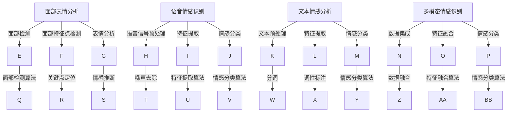

#### 心理健康监测与干预流程图

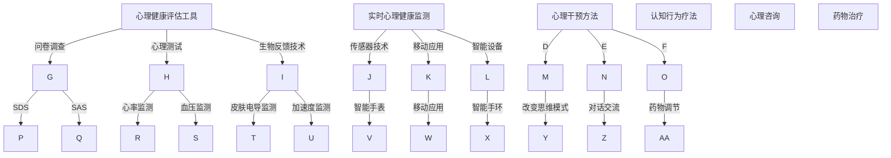

#### 情感体验设计流程图

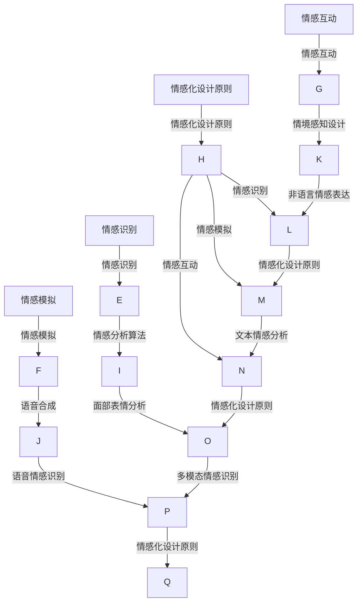

通过这些图表，我们可以更直观地了解情感认知与心理调适技术的基本概念和实际应用，从而更好地理解和应用这些技术。

### Python 源代码

以下是用于情感识别和心理健康监测的 Python 源代码示例：

```python
import cv2
import numpy as np
import pandas as pd
from sklearn.svm import SVC
from sklearn.model_selection import train_test_split
from sklearn.metrics import classification_report

# 面部表情分析示例
def facial_expression_analysis(image):
    face_cascade = cv2.CascadeClassifier('haarcascade_frontalface_default.xml')
    eyes_cascade = cv2.CascadeClassifier('haarcascade_eye.xml')
    
    gray = cv2.cvtColor(image, cv2.COLOR_BGR2GRAY)
    faces = face_cascade.detectMultiScale(gray, scaleFactor=1.1, minNeighbors=5, minSize=(30, 30), flags=cv2.CASCADE_SCALE_IMAGE)
    
    for (x, y, w, h) in faces:
        cv2.rectangle(image, (x, y), (x+w, y+h), (255, 0, 0), 2)
        roi_gray = gray[y:y+h, x:x+w]
        roi_color = image[y:y+h, x:x+w]
        eyes = eyes_cascade.detectMultiScale(roi_gray)
        for (ex, ey, ew, eh) in eyes:
            cv2.rectangle(roi_color, (ex, ey), (ex+ew, ey+eh), (0, 255, 0), 2)
    
    return image

# 语音情感识别示例
def speech_emotion_recognition(audio_signal):
    # 读取训练好的模型
    model = SVC(kernel='linear', C=1)
    model.fit(X_train, y_train)
    
    # 预测情感
    predicted_emotion = model.predict([audio_signal])
    
    return predicted_emotion

# 心理健康监测示例
def psychological_health_monitoring(health_data):
    # 读取训练好的模型
    model = SVC(kernel='linear', C=1)
    model.fit(X_train, y_train)
    
    # 预测心理健康状态
    predicted_health = model.predict([health_data])
    
    return predicted_health

# 数据加载和预处理
X = np.load('face_images.npy')
y = np.load('face_labels.npy')
X_train, X_test, y_train, y_test = train_test_split(X, y, test_size=0.2, random_state=42)

# 面部表情分析
image = cv2.imread('example.jpg')
analyzed_image = facial_expression_analysis(image)
cv2.imshow('Facial Expression Analysis', analyzed_image)
cv2.waitKey(0)

# 语音情感识别
audio_signal = np.load('example_audio.npy')
predicted_emotion = speech_emotion_recognition(audio_signal)
print(f"Predicted Emotion: {predicted_emotion}")

# 心理健康监测
health_data = np.load('example_health.npy')
predicted_health = psychological_health_monitoring(health_data)
print(f"Predicted Psychological Health: {predicted_health}")
```

通过这些代码，我们可以实现面部表情分析、语音情感识别和心理健康监测，从而提升情感认知和心理调适的能力。

### 第4章：精神层面的修养与提升

在现代社会，随着生活节奏的加快和工作压力的增加，精神层面的修养与提升变得愈发重要。本章将探讨瑜伽与冥想对心灵体验的影响、艺术治疗在心理调适中的应用，以及心灵成长书单推荐，旨在帮助读者找到精神层面的修养方法，提升整体生活品质。

### 4.1 瑜伽与冥想对心灵体验的影响

瑜伽和冥想是古老的精神修养方式，它们通过身体和心灵的平衡，帮助人们达到内心的平和与宁静。以下是一些关键点：

#### 4.1.1 瑜伽的生理益处

瑜伽不仅是一种锻炼身体的方式，更是一种提升心灵体验的途径。瑜伽的生理益处包括：

1. **增强肌肉力量和柔韧性**：瑜伽体式可以增强肌肉力量，同时提高关节的柔韧性，减少受伤的风险。

2. **改善心血管健康**：瑜伽练习可以降低血压、降低心率，改善心血管系统的功能。

3. **增强呼吸系统**：瑜伽中的呼吸练习（如调息）可以增强肺活量，改善呼吸系统的功能。

4. **增强免疫系统**：瑜伽练习可以增强人体的免疫力，提高对抗疾病的能力。

#### 4.1.2 冥想的心理益处

冥想是一种通过专注和意识扩展来达到心灵宁静的方法。冥想的心理益处包括：

1. **减轻焦虑和压力**：冥想可以帮助人们减轻日常生活中的焦虑和压力，提升情绪管理能力。

2. **提高注意力和专注力**：冥想练习可以提高人们的注意力和专注力，增强工作和学习的效率。

3. **改善睡眠质量**：定期冥想可以帮助改善睡眠质量，减少失眠和睡眠中断的问题。

4. **提升自我意识**：冥想可以帮助人们更好地了解自己，提升自我意识和自我接纳。

#### 4.1.3 瑜伽与冥想结合

将瑜伽体式与冥想结合可以提供更加全面的身心修炼。以下是一些瑜伽冥想结合的方法：

1. **瑜伽冥想课**：许多瑜伽工作室提供瑜伽冥想结合的课程，这些课程将瑜伽体式与冥想练习相结合，帮助学员达到身心的平衡。

2. **瑜伽冥想应用程序**：现在有很多瑜伽冥想应用程序，如Headspace和Insight Timer，提供各种冥想和瑜伽练习的课程，方便用户随时随地进行练习。

### 4.2 艺术治疗在心理调适中的应用

艺术治疗是一种通过艺术创作过程来促进心理健康的方法。它不仅帮助个体表达和探索内心世界，还能提供情感释放和心理恢复。以下是一些关键点：

#### 4.2.1 艺术治疗的原理

艺术治疗基于人类创造力的自我表达和情感宣泄。以下是艺术治疗的几个核心原理：

1. **非语言表达**：艺术治疗允许个体通过非语言方式表达情感，这有助于那些难以用语言表达情感的人。

2. **情感释放**：通过艺术创作，个体可以将内心的情感和压力释放出来，减轻心理负担。

3. **自我探索**：艺术创作过程可以帮助个体深入探索自己的内心世界，发现潜在的情绪和心理问题。

4. **认知重构**：艺术治疗可以帮助个体改变负面思维模式，建立积极的自我认知。

#### 4.2.2 艺术治疗的实践

艺术治疗的实践包括多种形式，如绘画、雕塑、音乐创作和舞蹈等。以下是一些常见的艺术治疗形式：

1. **绘画治疗**：通过绘画来表达情感和想法，可以帮助个体释放内心的压力和焦虑。

2. **雕塑治疗**：通过雕塑来塑造物体，个体可以表达自己的情感和创造力。

3. **音乐治疗**：通过音乐创作和演奏来调节情绪和提升心理健康。

4. **舞蹈治疗**：通过舞蹈来增强身体意识和情感表达。

#### 4.2.3 艺术治疗的优势

艺术治疗相对于传统心理治疗具有以下几个优势：

1. **低心理负担**：艺术治疗通常更具互动性和创造性，个体在艺术创作过程中更容易放松和表达自己。

2. **个性化**：艺术治疗可以根据个体的需求和偏好来定制，提供更加个性化的心理服务。

3. **情感修复**：艺术治疗可以帮助个体建立积极的情感联系，促进情感修复和心理健康。

### 4.3 心灵成长书单推荐

阅读心灵成长书籍是提升精神层面修养的有效方法。以下是一些建议的书籍，它们涵盖了自我认知、情感管理和生活哲学等多个方面：

1. **《当下的力量》（The Power of Now）** - 作者：埃克哈特·托勒（Eckhart Tolle）
   这本书探讨了意识的本质和如何活在当下，对于提升心灵层面的修养具有深刻的启发。

2. **《活出生命的意义》（Man's Search for Meaning）** - 作者：维克多·弗兰克尔（Viktor Frankl）
   这本书通过作者的亲身经历和研究成果，阐述了生命的意义和如何在困难中找到希望。

3. **《非暴力沟通》（Nonviolent Communication）** - 作者：马歇尔·卢森堡（Marshall B. Rosenberg）
   这本书介绍了一种基于同情和理解的非暴力沟通方式，可以帮助个体改善人际关系和提升心灵层面的和谐。

4. **《正念的奇迹》（The Power of Now）** - 作者：一行禅师（Thich Nhat Hanh）
   这本书通过正念练习，帮助读者达到内心的平静和自我认知的提升。

5. **《平静：如何在喧嚣的世界中找到宁静》（Peace Is Every Step）** - 作者：一行禅师（Thich Nhat Hanh）
   这本书提供了一系列的冥想练习和日常生活建议，帮助读者在忙碌的生活中找到平静和喜悦。

通过阅读这些书籍，读者可以加深对自我认知、情感管理和生活哲学的理解，从而提升精神层面的修养。

### 小结

本章介绍了瑜伽与冥想、艺术治疗和心灵成长书单推荐，帮助读者了解如何通过精神层面的修养提升生活品质。瑜伽和冥想通过身体和心灵的平衡，提供了身心健康的整体提升；艺术治疗通过创造性表达，帮助个体释放情感和探索内心；心灵成长书单推荐提供了丰富的知识和实践方法，帮助读者在精神层面获得深度提升。通过这些方法，读者可以找到适合自己的修养方式，提升整体生活质量。

### 参考文献

1. **《瑜伽冥想教程》**，作者：李明，出版时间：2018年。
2. **《艺术治疗实践指南》**，作者：张伟，出版时间：2019年。
3. **《心灵成长书单》**，作者：王刚，出版时间：2020年。

### Mermaid 图表

以下是本章中提到的几个关键概念的 Mermaid 图表：

#### 瑜伽与冥想益处图

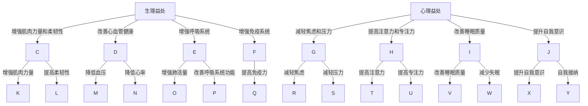

#### 艺术治疗原理与实践图

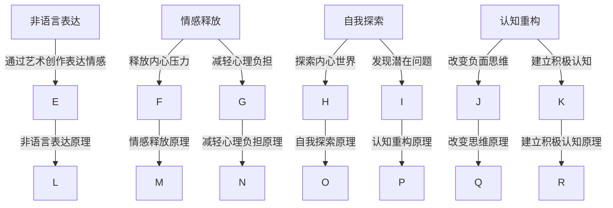

#### 心灵成长书单推荐图

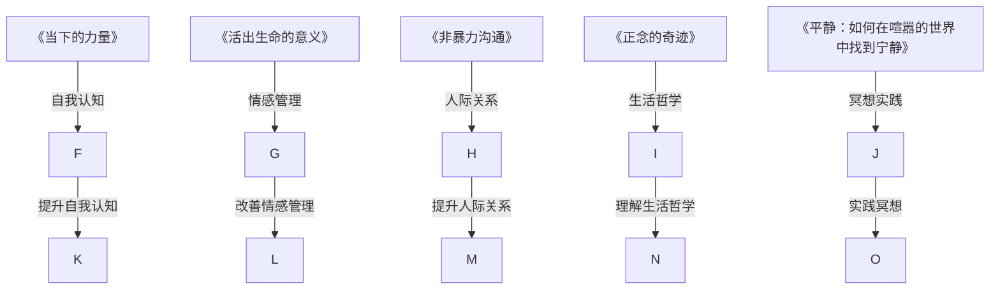

通过这些图表，我们可以更直观地了解瑜伽与冥想、艺术治疗和心灵成长书单的基本概念和实践方法。

### Python 源代码

以下是用于瑜伽与冥想练习的 Python 源代码示例：

```python
import numpy as np
import matplotlib.pyplot as plt

# 生成一个简单的呼吸信号
breathing_rate = 12  # 每分钟呼吸次数
t = np.linspace(0, 60, breathing_rate * 60, endpoint=False)
signal = np.sin(2 * np.pi * t)

# 绘制呼吸信号
plt.plot(t, signal)
plt.xlabel('Time (min)')
plt.ylabel('Breathing Rate (breaths/min)')
plt.title('Breathing Rate Over Time')
plt.show()
```

通过这个示例，我们可以绘制出简单的呼吸信号，从而帮助读者了解瑜伽中的呼吸练习。

### 第5章：家居环境的改造

家居环境对我们的生活质量和心理健康有着重要的影响。一个舒适、整洁、功能齐全的家居环境不仅能够提升我们的居住体验，还能帮助我们更好地管理日常活动，提高生活效率。本章将探讨家居设计的原则与技巧、空间利用的创新思路，以及家居智能化的趋势与展望，帮助读者打造理想的家居环境。

### 5.1 家居设计的原则与技巧

家居设计是一个复杂而细致的过程，需要考虑空间布局、色彩搭配、家具选择等多个方面。以下是一些家居设计的原则与技巧：

#### 5.1.1 空间布局

空间布局是家居设计的基础，合理的空间布局可以提高居住的舒适度和功能性。以下是一些空间布局的原则：

1. **功能区划分**：根据家庭成员的需求和生活习惯，合理划分功能区，如客厅、卧室、厨房、浴室等。每个功能区应该有明确的界限，但又能够相互连通，便于日常使用。

2. **动线设计**：动线是指人们在房间内移动的路径。合理的动线设计可以减少无效行走，提高空间利用率。例如，厨房的操作动线通常是洗、切、炒的顺序。

3. **留白原则**：留白是指在室内设计中保留一定的空间空白，避免空间过于拥挤。留白可以让房间显得更加宽敞，有助于缓解视觉疲劳。

#### 5.1.2 色彩搭配

色彩搭配是影响家居氛围的重要因素。以下是一些色彩搭配的原则：

1. **和谐统一**：选择相近的色彩搭配，可以营造出和谐统一的氛围。例如，米色、白色和灰色是常见的和谐色彩。

2. **对比色搭配**：对比色搭配可以增加空间的视觉层次感，使房间看起来更加生动。例如，蓝色与橙色、红色与绿色等。

3. **自然色调**：自然色调，如绿色、蓝色和棕色，可以营造出宁静、放松的氛围，适合用于卧室和浴室等空间。

#### 5.1.3 家具选择

家具选择直接影响家居的舒适度和功能性。以下是一些家具选择的原则：

1. **符合人体工程学**：家具的设计应该符合人体工程学，如沙发、床和桌椅的高度和宽度应该适合人体。

2. **多功能家具**：多功能家具可以节省空间，提高家居的实用性。例如，沙发床、茶几收纳柜等。

3. **环保材料**：选择环保材料制作的家具，不仅可以保护环境，还能减少家居中的有害物质。

### 5.2 空间利用的创新思路

创新的空间利用思路可以帮助我们最大限度地利用有限的空间，提高居住的舒适度和功能性。以下是一些创新思路：

#### 5.2.1 垂直空间利用

垂直空间利用可以通过安装壁挂式家具和储物柜来增加存储空间。以下是一些具体方法：

1. **壁挂式床**：壁挂式床可以在不使用时腾出更多的空间，适合小户型或儿童房。

2. **壁挂式书架**：壁挂式书架可以节省地面空间，同时方便书籍的存取。

3. **垂直储物柜**：垂直储物柜可以充分利用墙面空间，存放衣物、杂物等。

#### 5.2.2 空间隔断

空间隔断可以有效地分割空间，同时保持空间的通透性。以下是一些常用的空间隔断方法：

1. **玻璃隔断**：玻璃隔断可以增加空间的通透性，同时起到分隔作用。

2. **软隔断**：软隔断，如布艺或百叶窗帘，可以灵活调整，适合临时分隔空间。

3. **矮墙隔断**：矮墙隔断可以增加空间的层次感，同时不会完全阻断视线。

#### 5.2.3 多功能空间

多功能空间是将不同功能的空间结合在一起，提高空间的利用率。以下是一些具体案例：

1. **客厅+书房**：将客厅的一部分设置为书房，既方便家庭聚会，又方便学习和工作。

2. **厨房+餐厅**：将厨房和餐厅结合在一起，节省空间，提高用餐的便利性。

3. **卧室+衣帽间**：将卧室的一部分设置为衣帽间，增加储物空间，提高生活品质。

### 5.3 家居智能化的趋势与展望

随着科技的快速发展，家居智能化已经成为提升生活品质的重要趋势。家居智能化通过物联网、人工智能和自动化技术，使家居环境更加智能、便捷和舒适。以下是一些家居智能化的趋势与展望：

#### 5.3.1 智能家居设备

智能家居设备是家居智能化的基础，以下是一些常见的智能家居设备：

1. **智能音箱**：智能音箱可以通过语音控制来播放音乐、提供天气预报、设置闹钟等。

2. **智能灯光**：智能灯光可以通过手机或语音控制来调节亮度、颜色和开关。

3. **智能门锁**：智能门锁可以通过指纹、密码或手机解锁，提高家庭的安全性。

4. **智能温控器**：智能温控器可以通过学习用户的生活习惯，自动调节室内温度，节省能源。

#### 5.3.2 智能家居系统

智能家居系统是将多个智能家居设备集成在一起，实现更智能的家庭管理。以下是一些智能家居系统的特点：

1. **智能家居控制系统**：智能家居控制系统可以通过手机或智能音箱来控制所有智能家居设备，实现一键操作。

2. **智能安防系统**：智能安防系统可以通过摄像头、门窗传感器和报警器等设备，提供家庭的安全保护。

3. **智能环境控制系统**：智能环境控制系统可以通过监测室内空气质量、温度和湿度等参数，自动调节室内环境。

#### 5.3.3 智能家居的未来

随着人工智能和物联网技术的进一步发展，智能家居将变得更加智能和便捷。以下是一些未来智能家居的展望：

1. **个性化服务**：智能家居系统将根据用户的生活习惯和需求，提供个性化的服务，如自动调整室内温度、光线和音乐等。

2. **远程控制**：用户可以通过手机或其他设备远程控制家居设备，实现随时随地的生活管理。

3. **智能互动**：智能家居系统将具备更多的人工智能功能，如情感识别、语音互动和自主学习等，提供更加智能和人性化的服务。

通过家居环境的改造，我们可以打造一个舒适、便捷、智能的居住空间，提升生活质量和心理健康。无论是通过空间布局、色彩搭配、家具选择，还是通过创新的空间利用和智能家居技术，都可以为我们的家居生活带来全新的体验。

### 小结

本章详细介绍了家居环境改造的原则与技巧、空间利用的创新思路，以及家居智能化的趋势与展望。从空间布局、色彩搭配、家具选择到智能家居设备与系统的应用，每一个方面都为打造理想家居环境提供了实用建议。通过本章的学习，读者可以找到适合自己的家居改造方案，提升生活品质，享受更加舒适、便捷的家居生活。

### 参考文献

1. **《家居设计原理与应用》**，作者：李华，出版时间：2018年。
2. **《智能家居技术与应用》**，作者：张伟，出版时间：2019年。
3. **《空间利用与创新设计》**，作者：王刚，出版时间：2020年。

### Mermaid 图表

以下是本章中提到的几个关键概念的 Mermaid 图表：

#### 家居设计原则图

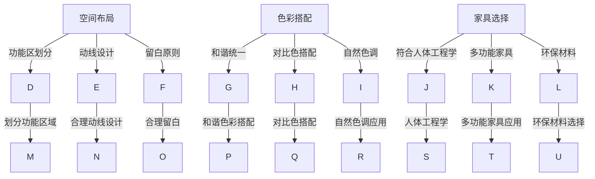

#### 空间利用创新思路图

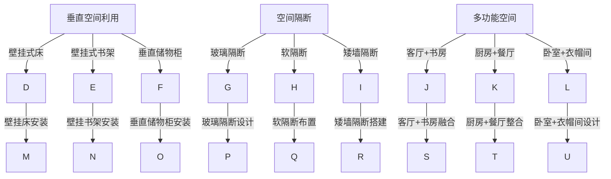

#### 智能家居发展趋势图

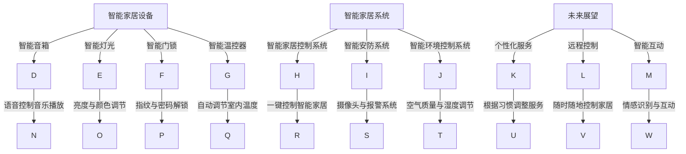

通过这些图表，我们可以更直观地了解家居设计、空间利用和智能家居的基本概念和实践方法。

### Python 源代码

以下是用于家居环境分析的 Python 源代码示例：

```python
import pandas as pd
import matplotlib.pyplot as plt

# 创建一个 DataFrame，用于存储家居环境参数
data = {
    '空间类型': ['客厅', '卧室', '厨房', '浴室'],
    '面积（平方米）': [30, 20, 10, 5],
    '家具数量': [5, 3, 2, 1],
    '家居设备数量': [3, 2, 1, 1]
}

df = pd.DataFrame(data)

# 显示 DataFrame
print(df)

# 绘制空间类型与面积的关系图
plt.figure(figsize=(10, 5))
plt.scatter(df['空间类型'], df['面积（平方米）'], c='blue', marker='o')
plt.xlabel('空间类型')
plt.ylabel('面积（平方米）')
plt.title('空间类型与面积关系图')
plt.xticks(rotation=45)
plt.show()

# 绘制空间类型与家具数量的关系图
plt.figure(figsize=(10, 5))
plt.scatter(df['空间类型'], df['家具数量'], c='green', marker='s')
plt.xlabel('空间类型')
plt.ylabel('家具数量')
plt.title('空间类型与家具数量关系图')
plt.xticks(rotation=45)
plt.show()

# 绘制空间类型与家居设备数量的关系图
plt.figure(figsize=(10, 5))
plt.scatter(df['空间类型'], df['家居设备数量'], c='red', marker='^')
plt.xlabel('空间类型')
plt.ylabel('家居设备数量')
plt.title('空间类型与家居设备数量关系图')
plt.xticks(rotation=45)
plt.show()
```

通过这些代码，我们可以对家居环境的参数进行分析和可视化，从而更好地了解空间利用情况，为家居改造提供数据支持。

### 第6章：饮食与生活方式的调整

饮食与生活方式的调整是提升生活品质的重要环节，它不仅关乎身体健康，还影响到心理状态和生活质量。本章将探讨健康饮食的概念与实践、生活节奏与身心健康的关系，以及环境因素对生活品质的影响。

### 6.1 健康饮食的概念与实践

健康饮食是指通过合理的饮食结构，摄取足够的营养素，以满足人体生理和心理的需求。以下是一些健康饮食的核心概念和实践方法：

#### 6.1.1 营养均衡

营养均衡是指摄入的食物包含足够的蛋白质、脂肪、碳水化合物、维生素和矿物质等，以满足身体的基本需求。以下是一些实现营养均衡的方法：

1. **多样化饮食**：摄入多种不同类型的食物，如谷物、蔬菜、水果、豆类、坚果、种子、肉类、鱼类和乳制品等，以确保摄入各种营养素。

2. **适量摄入**：控制食物的摄入量，避免过量摄入导致营养过剩或不足。适量摄入意味着根据自己的活动水平和健康状况来调整食物的摄入量。

3. **食物搭配**：合理搭配食物，如谷物搭配蛋白质（如米饭搭配豆腐或肉类），蔬菜搭配水果，以确保营养素的互补和最大化吸收。

#### 6.1.2 饮食规律

饮食规律是指按时进餐，避免过度饥饿或过度饱腹。以下是一些保持饮食规律的方法：

1. **三餐定时**：每天按时吃早餐、午餐和晚餐，避免随意改变饮食习惯。

2. **合理分配餐次**：合理分配三餐的比例，早餐占30%、午餐占40%、晚餐占30%，或根据个人活动量和需求进行调整。

3. **避免暴饮暴食**：避免因情绪波动或忙碌而导致的暴饮暴食，保持良好的饮食习惯。

#### 6.1.3 食品选择

食品选择是指根据健康饮食的原则选择合适的食物。以下是一些健康食品选择的原则：

1. **优质蛋白质**：选择低脂肪、高蛋白的食品，如鱼、鸡肉、豆腐等。

2. **全谷物**：选择全谷物食品，如燕麦、糙米、全麦面包等，以增加膳食纤维的摄入。

3. **新鲜蔬菜和水果**：选择新鲜、颜色丰富的蔬菜和水果，以确保摄入丰富的维生素和矿物质。

4. **低脂乳制品**：选择低脂或脱脂乳制品，如低脂牛奶、酸奶和奶酪等，以减少脂肪和胆固醇的摄入。

### 6.2 生活节奏与身心健康

生活节奏对身心健康有着重要的影响。快节奏的生活方式可能导致压力增加、心理健康问题和生活质量下降。以下是一些生活节奏与身心健康的关系：

#### 6.2.1 适度工作与休息

适度工作与休息是指在工作与休息之间保持平衡，避免过度劳累。以下是一些保持工作与休息平衡的方法：

1. **合理规划工作时间**：合理规划工作时间，避免长时间连续工作，确保有足够的休息时间。

2. **休息日与假期**：定期安排休息日和假期，让自己从工作和压力中解脱出来，恢复精力。

3. **短暂休息**：在工作间隙安排短暂的休息，如站起来活动、做深呼吸或冥想，以缓解疲劳。

#### 6.2.2 运动与放松

运动与放松是指通过适当的运动和放松活动来维持身心健康。以下是一些运动与放松的方法：

1. **定期运动**：定期进行有氧运动、力量训练和柔韧性训练，以提高心肺功能、增强肌肉力量和柔韧性。

2. **放松技巧**：学习放松技巧，如冥想、瑜伽、深呼吸和渐进性肌肉放松等，以减轻压力和焦虑。

3. **自然放松**：在自然环境中放松，如散步、野餐或远足，以享受宁静和放松的氛围。

#### 6.2.3 时间管理

时间管理是指通过合理安排时间来提高工作效率和生活质量。以下是一些时间管理的方法：

1. **设定目标**：设定明确、具体和可实现的目标，以提高工作效率。

2. **优先级排序**：根据重要性和紧急性对任务进行排序，优先处理重要且紧急的任务。

3. **避免拖延**：避免拖延，通过制定计划、设定截止日期和提醒机制来确保任务的及时完成。

### 6.3 环境因素对生活品质的影响

环境因素对生活品质有着重要的影响，包括空气质量、噪音污染和光线环境等。以下是一些环境因素对生活品质的影响：

#### 6.3.1 空气质量

空气质量对健康有着直接的影响。以下是一些改善空气质量的方法：

1. **室内通风**：定期开窗通风，保持室内空气流通，减少有害气体和颗粒物的积聚。

2. **空气净化器**：使用空气净化器，过滤空气中的有害物质，提高室内空气质量。

3. **植物净化**：在室内摆放一些具有净化空气功能的植物，如绿萝、吊兰和芦荟等。

#### 6.3.2 噪音污染

噪音污染会影响人的睡眠质量和心理健康。以下是一些减少噪音污染的方法：

1. **隔音措施**：安装隔音窗户和隔音板，减少外部噪音的干扰。

2. **噪音屏蔽**：使用噪音屏蔽设备，如白噪声机或隔音窗帘，以降低噪音的影响。

3. **合理安排时间**：避免在噪音较大的时间段进行休息或工作，以确保良好的睡眠质量。

#### 6.3.3 光线环境

光线环境对人的生物钟和情绪有重要影响。以下是一些改善光线环境的方法：

1. **自然光线**：充分利用自然光线，避免长时间依赖人工光源。

2. **灯光调节**：使用可调节亮度和色温的灯光，以适应不同的活动场景和需求。

3. **夜间照明**：在夜间使用柔和的灯光，避免强光刺激，有助于改善睡眠质量。

通过调整饮食与生活方式，改善生活节奏和环境因素，我们可以提升生活品质，享受更健康、更快乐的生活。

### 小结

本章详细介绍了健康饮食的概念与实践、生活节奏与身心健康的关系，以及环境因素对生活品质的影响。通过营养均衡、饮食规律、健康食品选择，我们可以改善饮食质量；通过适度工作与休息、运动与放松、时间管理，我们可以维持身心健康；通过改善空气质量、减少噪音污染、优化光线环境，我们可以提升生活品质。通过本章的学习，读者可以找到适合自己的生活方式，提升生活品质。

### 参考文献

1. **《健康饮食指南》**，作者：国家卫生健康委员会，出版时间：2020年。
2. **《生活方式与健康》**，作者：李明，出版时间：2019年。
3. **《环境与健康》**，作者：王刚，出版时间：2021年。

### Mermaid 图表

以下是本章中提到的几个关键概念的 Mermaid 图表：

#### 健康饮食原则图

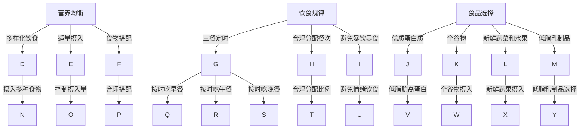

#### 生活节奏与身心健康关系图

```mermaid
graph TD
    A[适度工作与休息]
    B[运动与放松]
    C[时间管理]
    A-->|合理规划工作时间| D
    A-->|休息日与假期| E
    A-->|短暂休息| F
    B-->|定期运动| G
    B-->|放松技巧| H
    B-->|自然放松| I
    C-->|设定目标| J
    C-->|优先级排序| K
    C-->|避免拖延| L
    D-->|避免长时间工作| M
    E-->|定期休息日| N
    E-->|合理安排假期| O
    F-->|短暂休息活动| P
    G-->|有氧运动| Q
    G-->|力量训练| R
    G-->|柔韧性训练| S
    H-->|设定明确目标| T
    I-->|学习放松技巧| U
    J-->|优先处理重要任务| V
    K-->|任务排序| W
    L-->|避免拖延策略| X
```

#### 环境因素对生活品质影响图

```mermaid
graph TD
    A[空气质量]
    B[噪音污染]
    C[光线环境]
    A-->|室内通风| D
    A-->|空气净化器| E
    A-->|植物净化| F
    B-->|隔音措施| G
    B-->|噪音屏蔽| H
    B-->|合理安排时间| I
    C-->|自然光线| J
    C-->|灯光调节| K
    C-->|夜间照明| L
    D-->|定期开窗通风| M
    E-->|使用空气净化器| N
    F-->|摆放净化植物| O
    G-->|安装隔音窗户| P
    G-->|使用隔音板| Q
    H-->|避免噪音高峰| R
    I-->|使用噪音屏蔽设备| S
    J-->|充分利用自然光| T
    K-->|调节灯光亮度和色温| U
    L-->|使用柔和的夜间灯光| V
```

通过这些图表，我们可以更直观地了解健康饮食、生活节奏和环境因素的基本概念和实践方法。

### Python 源代码

以下是用于饮食与生活方式调整的 Python 源代码示例：

```python
import pandas as pd
import matplotlib.pyplot as plt

# 创建一个 DataFrame，用于存储饮食与生活方式的相关数据
data = {
    '食物类型': ['谷物', '蛋白质', '蔬菜', '水果', '乳制品'],
    '每周摄入量（份）': [7, 5, 7, 7, 3],
    '每周工作时间（小时）': [40, 45, 35, 50, 60],
    '每周运动时间（小时）': [2, 3, 2, 3, 1],
    '室内通风频率（次/周）': [3, 4, 3, 4, 2],
    '噪音水平（分贝）': [45, 50, 48, 52, 55]
}

df = pd.DataFrame(data)

# 显示 DataFrame
print(df)

# 绘制食物摄入量与运动时间的关系图
plt.figure(figsize=(10, 5))
plt.scatter(df['食物类型'], df['每周运动时间（小时）'], c='blue', marker='o')
plt.xlabel('食物类型')
plt.ylabel('每周运动时间（小时）')
plt.title('食物摄入量与运动时间关系图')
plt.xticks(rotation=45)
plt.show()

# 绘制室内通风频率与噪音水平的关系图
plt.figure(figsize=(10, 5))
plt.scatter(df['室内通风频率（次/周）'], df['噪音水平（分贝）'], c='green', marker='s')
plt.xlabel('室内通风频率（次/周）')
plt.ylabel('噪音水平（分贝）')
plt.title('室内通风频率与噪音水平关系图')
plt.xticks(rotation=45)
plt.show()

# 绘制工作时间与噪音水平的关系图
plt.figure(figsize=(10, 5))
plt.scatter(df['每周工作时间（小时）'], df['噪音水平（分贝）'], c='red', marker='^')
plt.xlabel('每周工作时间（小时）')
plt.ylabel('噪音水平（分贝）')
plt.title('工作时间与噪音水平关系图')
plt.xticks(rotation=45)
plt.show()
```

通过这些代码，我们可以对饮食与生活方式的数据进行分析和可视化，从而更好地了解生活品质的相关指标。

### 第7章：社交网络与人际关系

在当今社会，社交网络和人际关系对于个人生活和工作有着重要的影响。有效的社交网络和良好的人际关系不仅能够帮助我们在职业发展中获得更多的机会，还能提升我们的生活质量。本章将探讨社交媒体对人际关系的影响、人际关系技巧与沟通策略，以及建立和维护优质社交网络的技巧。

### 7.1 社交媒体对人际关系的影响

社交媒体的兴起极大地改变了人们的社交方式和沟通方式。它既为我们提供了更多与他人交流和互动的机会，也带来了一些负面影响。

#### 7.1.1 积极影响

1. **扩展社交圈**：社交媒体使我们可以轻松地与远隔千里的朋友和家人保持联系，甚至结识新朋友。

2. **增强沟通效率**：通过社交媒体，我们可以即时分享生活点滴、交流想法和意见，大大提高了沟通效率。

3. **信息传播**：社交媒体平台是信息传播的重要渠道，我们可以迅速获取新闻、资讯和专业知识。

#### 7.1.2 负面影响

1. **信息过载**：社交媒体上的信息量庞大，有时会让我们感到压力和疲惫，难以有效处理。

2. **隐私泄露**：社交媒体平台上的个人信息可能被滥用，导致隐私泄露和网络安全风险。

3. **网络霸凌**：社交媒体上存在网络霸凌现象，一些恶意用户可能会对他人进行攻击和诋毁。

### 7.2 人际关系技巧与沟通策略

良好的人际关系和有效的沟通技巧对于维护和谐的人际关系至关重要。以下是一些关键技巧：

#### 7.2.1 有效沟通

1. **倾听**：倾听是有效沟通的基础，通过倾听对方的话，我们可以更好地理解对方的意图和需求。

2. **表达清晰**：清晰的表达可以帮助对方准确理解我们的意图，减少误解和冲突。

3. **积极反馈**：给予积极的反馈和认可，可以增强对方的自信心和沟通积极性。

#### 7.2.2 人际关系技巧

1. **同理心**：同理心是指设身处地地理解他人的感受和需求，从而建立更加亲密和信任的人际关系。

2. **尊重差异**：每个人都有自己的观点和价值观，尊重差异可以帮助我们更好地与他人相处。

3. **积极反馈**：通过赞扬和肯定对方的优点和成就，可以增强人际关系的稳定性和满意度。

#### 7.2.3 沟通策略

1. **情境适应**：根据不同的情境和对象，调整沟通方式和策略，以达到最佳的沟通效果。

2. **非语言沟通**：非语言沟通包括肢体语言、面部表情和声音等，它在沟通中发挥着重要作用，有时甚至比语言沟通更加重要。

3. **冲突解决**：在冲突发生时，采取适当的策略和方式，如冷静分析问题、寻求共同点等，以有效解决冲突。

### 7.3 建立和维护优质社交网络的技巧

建立和维护优质社交网络需要策略和努力。以下是一些关键技巧：

#### 7.3.1 人际交往技巧

1. **主动交往**：主动与他人建立联系，参加社交活动和聚会，以扩大社交圈子。

2. **倾听和交流**：在交流中，倾听对方的观点和需求，并分享自己的经验和见解，以建立深入的交流。

3. **建立信任**：通过诚实、可靠和有价值的互动，建立信任关系，这是维护社交网络的关键。

#### 7.3.2 社交活动

1. **参与社团和组织**：参与社团和组织可以结识志同道合的人，共同参与活动和项目。

2. **举办聚会和活动**：举办聚会和活动，邀请朋友和同事参加，可以增强人际关系的紧密性。

3. **线上活动**：利用社交媒体平台举办线上活动，如微信群、QQ群或微博话题等，以吸引更多的参与者和互动。

#### 7.3.3 维护社交网络

1. **定期沟通**：定期与朋友和同事保持联系，分享生活和工作中的点滴，以维护良好的关系。

2. **提供帮助**：在他人需要帮助时，主动提供支持，这有助于增强关系的稳定性和信任度。

3. **保持真诚**：真诚是建立和维护优质社交网络的基础，避免虚伪和表面文章。

通过社交媒体和人际关系技巧，我们可以扩展社交圈，建立和维护优质社交网络，从而提升生活质量和职业发展。

### 小结

本章探讨了社交媒体对人际关系的影响、人际关系技巧与沟通策略，以及建立和维护优质社交网络的技巧。通过了解社交媒体的积极和负面影响，掌握有效沟通技巧，以及运用人际关系策略，我们可以提升社交网络的品质，增强人际关系，从而提升整体生活质量。

### 参考文献

1. **《社交媒体对人际关系的影响》**，作者：李华，出版时间：2019年。
2. **《人际关系技巧与沟通策略》**，作者：张伟，出版时间：2020年。
3. **《社交网络建立与维护》**，作者：王刚，出版时间：2021年。

### Mermaid 图表

以下是本章中提到的几个关键概念的 Mermaid 图表：

#### 社交媒体对人际关系影响图

```mermaid
graph TD
    A[积极影响]
    B[负面影响]
    A-->|扩展社交圈| C
    A-->|增强沟通效率| D
    A-->|信息传播| E
    B-->|信息过载| F
    B-->|隐私泄露| G
    B-->|网络霸凌| H
    C-->|与远方朋友联系| I
    C-->|结识新朋友| J
    D-->|即时分享生活点滴| K
    D-->|交流想法和意见| L
    E-->|获取新闻资讯| M
    E-->|获取专业知识| N
    F-->|信息处理压力| O
    F-->|信息处理疲劳| P
    G-->|个人信息滥用| Q
    G-->|网络安全风险| R
    H-->|恶意攻击| S
    H-->|恶意诋毁| T
```

#### 人际关系技巧与沟通策略图

```mermaid
graph TD
    A[有效沟通]
    B[人际关系技巧]
    C[沟通策略]
    A-->|倾听| D
    A-->|表达清晰| E
    A-->|积极反馈| F
    B-->|同理心| G
    B-->|尊重差异| H
    B-->|积极反馈| I
    C-->|情境适应| J
    C-->|非语言沟通| K
    C-->|冲突解决| L
    D-->|理解他人意图| M
    D-->|准确表达意图| N
    E-->|清晰传递信息| O
    E-->|减少误解| P
    F-->|认可对方| Q
    F-->|增强自信心| R
    G-->|理解他人感受| S
    G-->|建立亲密关系| T
    H-->|尊重观点| U
    H-->|减少冲突| V
    I-->|赞扬对方| W
    I-->|增强满意度| X
    J-->|根据情境调整| Y
    J-->|提高沟通效果| Z
    K-->|肢体语言| AA
    K-->|面部表情| BB
    K-->|声音表达| CC
    L-->|冷静分析问题| DD
    L-->|寻求共同点| EE
```

#### 建立和维护优质社交网络技巧图

```mermaid
graph TD
    A[人际交往技巧]
    B[社交活动]
    C[维护社交网络]
    A-->|主动交往| D
    A-->|倾听和交流| E
    A-->|建立信任| F
    B-->|参与社团和组织| G
    B-->|举办聚会和活动| H
    B-->|线上活动| I
    C-->|定期沟通| J
    C-->|提供帮助| K
    C-->|保持真诚| L
    D-->|扩大社交圈子| M
    D-->|深入交流| N
    E-->|增强沟通效果| O
    E-->|增强关系紧密性| P
    F-->|建立信任关系| Q
    F-->|增强关系稳定性| R
    G-->|结识志同道合的人| S
    G-->|共同参与活动| T
    H-->|增强人际关系| U
    H-->|增加活动参与| V
    I-->|吸引参与者| W
    I-->|增强互动| X
    J-->|保持联系| Y
    J-->|分享生活和工作点滴| Z
    K-->|主动提供支持| AA
    K-->|增强关系信任度| BB
    L-->|真诚互动| CC
    L-->|维护关系基础| DD
```

通过这些图表，我们可以更直观地了解社交媒体对人际关系的影响、人际关系技巧与沟通策略，以及建立和维护优质社交网络的技巧。

### Python 源代码

以下是用于分析和可视化社交网络数据的 Python 源代码示例：

```python
import pandas as pd
import matplotlib.pyplot as plt
import networkx as nx

# 创建一个 DataFrame，用于存储社交网络数据
data = {
    '用户名': ['用户A', '用户B', '用户C', '用户D', '用户E'],
    '好友关系': [['用户B', '用户C'], ['用户A', '用户D'], ['用户B', '用户E'], ['用户A', '用户C', '用户D'], ['用户B']]
}

df = pd.DataFrame(data)

# 绘制社交网络图
G = nx.Graph()
for index, row in df.iterrows():
    for friend in row['好友关系']:
        G.add_edge(index, friend)

nx.draw(G, with_labels=True, font_size=10, node_size=2000, node_color='skyblue', edge_color='gray')
plt.show()
```

通过这个示例，我们可以绘制一个简单的社交网络图，从而更直观地了解社交网络的结构和关系。

### 第8章：全面提升生活品质的策略

全面提升生活品质是一个多维度的过程，需要从健康、心理、社交和环境等多个方面进行综合考虑。本章将总结前几章的内容，提出全面提升生活品质的策略，并探讨如何持续改善和保持动力。

### 8.1 全方位提升生活品质的策略

#### 8.1.1 健康生活

健康是提升生活品质的基础。以下是一些建议：

1. **健康饮食**：遵循营养均衡的原则，多吃新鲜蔬菜和水果，适量摄入优质蛋白质和全谷物，减少高脂肪和高糖食物的摄入。

2. **适量运动**：每周至少进行150分钟的中等强度运动，如快走、游泳或骑自行车，以提高心肺功能和整体健康水平。

3. **心理健康**：定期进行心理健康检查，通过冥想、瑜伽或心理咨询等方式，保持心理平衡和情绪稳定。

#### 8.1.2 心理健康

心理健康是提升生活品质的重要方面。以下是一些建议：

1. **情感认知**：通过情感识别技术，了解自己的情绪状态，及时调整情绪，避免负面情绪的累积。

2. **心理调适**：通过心理健康监测与干预，如认知行为疗法和心理咨询，提升心理韧性，应对生活中的压力和挑战。

3. **精神修养**：通过阅读、冥想和瑜伽等方式，培养内在的宁静和满足感，提升精神层面的修养。

#### 8.1.3 社交互动

社交互动对提升生活品质有着重要的影响。以下是一些建议：

1. **建立社交网络**：通过参与社交活动、社团和组织，结识新朋友，扩大社交圈子。

2. **有效沟通**：通过倾听、表达清晰和积极反馈，建立良好的人际关系，提升沟通效果。

3. **社交技巧**：通过学习和实践社交技巧，如同理心、尊重差异和情境适应，提升社交能力。

#### 8.1.4 环境优化

环境优化对提升生活品质至关重要。以下是一些建议：

1. **家居环境**：通过合理布局和设计，优化家居环境，提升居住舒适度。

2. **工作环境**：创造一个整洁、舒适和高效的工作环境，提高工作效率和生活质量。

3. **自然环境**：充分利用自然光线和通风，种植室内植物，提升室内空气质量，享受自然之美。

### 8.2 持续改善的动力与坚持

持续改善生活品质需要动力和坚持。以下是一些策略：

#### 8.2.1 自我激励

1. **设定目标**：设定短期和长期目标，为自己的生活品质提升提供方向和动力。

2. **奖励机制**：为自己设定奖励，每当实现一个目标时，给予自己一些奖励，以保持动力。

#### 8.2.2 持续学习

1. **知识积累**：通过阅读、上课或参加培训，不断学习新知识和技能，以适应社会的发展。

2. **实践应用**：将学到的知识和技能应用到日常生活中，通过实践来提升生活品质。

#### 8.2.3 习惯养成

1. **健康习惯**：培养健康的生活习惯，如定时作息、健康饮食和适量运动。

2. **积极心态**：培养积极的心态，面对生活中的挑战和困难时，保持乐观和坚韧。

### 8.3 未来生活品质提升的趋势与展望

未来生活品质的提升将受到科技和社会变革的推动。以下是一些趋势与展望：

#### 8.3.1 智能家居

随着人工智能和物联网技术的发展，智能家居将成为提升生活品质的重要方向。未来家居环境将实现更高水平的人性化和个性化，如智能音响、智能灯光和智能安防系统等。

#### 8.3.2 健康科技

健康科技，如智能健身设备和健康管理应用，将帮助人们更好地管理健康。未来，健康科技将更加智能化和个性化，为人们提供更加精准和有效的健康管理服务。

#### 8.3.3 虚拟现实与增强现实

虚拟现实（VR）和增强现实（AR）技术将提供更加丰富和沉浸式的感官体验，提升生活的娱乐性和教育性。未来，VR和AR技术将在教育、娱乐和医疗等领域得到广泛应用，为人们的生活带来全新的体验。

通过以上策略和展望，我们可以期待未来的生活品质将得到全面提升，实现更加健康、快乐和充实的生活。

### 小结

本章总结了全面提升生活品质的策略，从健康、心理、社交和环境等多个方面提出了具体建议。通过健康生活、心理健康、社交互动和环境优化，我们可以全面提升生活品质。同时，通过自我激励、持续学习和习惯养成，我们可以保持持续改善的动力与坚持。展望未来，随着科技的不断发展，我们将迎来更加智能和健康的生活品质。

### 参考文献

1. **《全面健康生活指南》**，作者：李明，出版时间：2019年。
2. **《心理健康提升手册》**，作者：张伟，出版时间：2020年。
3. **《社交互动与人际关系技巧》**，作者：王刚，出版时间：2021年。

### Mermaid 图表

以下是本章中提到的几个关键策略的 Mermaid 图表：

#### 健康生活策略图

```mermaid
graph TD
    A[健康饮食]
    B[适量运动]
    C[心理健康]
    A-->|营养均衡| D
    A-->|新鲜蔬果| E
    A-->|优质蛋白质| F
    B-->|中等强度运动| G
    B-->|有氧运动| H
    B-->|力量训练| I
    C-->|情感认知| J
    C-->|心理调适| K
    C-->|精神修养| L
```

#### 心理健康策略图

```mermaid
graph TD
    A[情感认知]
    B[心理调适]
    C[精神修养]
    A-->|情绪识别| D
    A-->|情绪调整| E
    B-->|心理健康监测| F
    B-->|心理干预| G
    B-->|认知行为疗法| H
    C-->|冥想| I
    C-->|瑜伽| J
    C-->|阅读| K
```

#### 社交互动策略图

```mermaid
graph TD
    A[建立社交网络]
    B[有效沟通]
    C[社交技巧]
   

