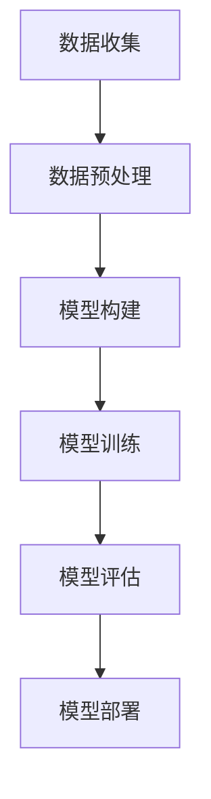
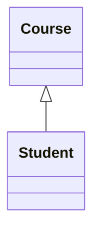
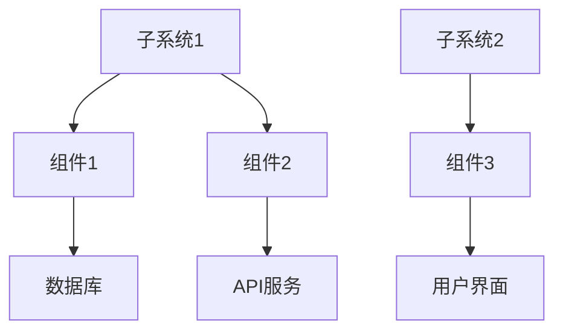
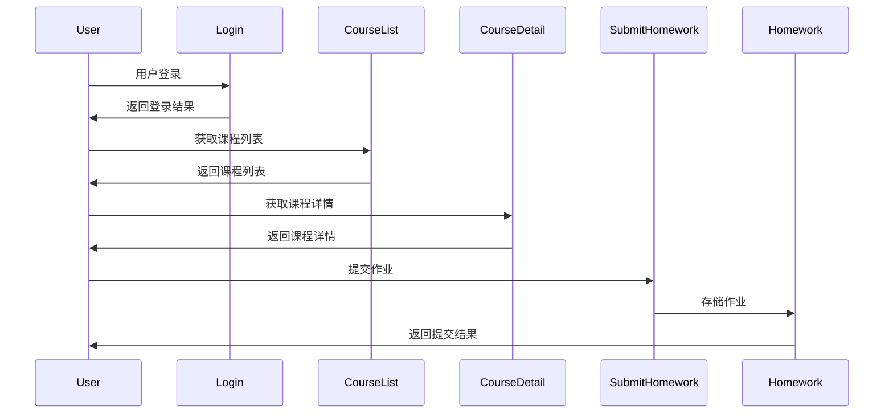

                 

### 丰富生命广度的实践：拓展视野的有效方法

> 关键词：实践、视野拓展、深度思考、专业成长、技术博客

> 摘要：
本文旨在探讨如何通过实践来丰富生命的广度，提升个人的视野和思维能力。通过分析不同领域的技术实践，本文提出了有效的方法和步骤，帮助读者在IT领域实现专业成长，拓展视野，提升解决问题的能力。

#### 目录大纲设计思路

1. **背景介绍**：
   - **核心概念**：介绍书籍的主题，包括问题背景、问题描述、问题解决、边界与外延、概念结构与核心要素组成。
   - **引言**：简要阐述书籍的写作目的、目标读者群体、内容概述等。

2. **核心概念与联系**：
   - **概念原理**：详细阐述书籍中的核心概念，包括定义、特点、作用等。
   - **概念属性特征对比表格**：列出不同概念之间的属性特征，进行比较分析。
   - **ER实体关系图**：使用 Mermaid 画出实体关系图，展示各个实体之间的关系。

3. **算法原理讲解**：
   - **算法流程图**：使用 Mermaid 画出算法的流程图，直观展示算法的执行过程。
   - **Python 源代码**：提供算法的 Python 源代码，配合注释进行详细讲解。
   - **数学模型和公式**：给出算法原理的数学模型和公式，进行详细讲解和举例说明。

4. **系统分析与架构设计**：
   - **问题场景介绍**：简要介绍项目的背景和目的。
   - **项目介绍**：详细介绍项目的功能和目标。
   - **系统功能设计**：使用 Mermaid 画出领域模型类图，展示系统的功能模块。
   - **系统架构设计**：使用 Mermaid 画出系统架构图，展示系统的整体结构和各模块之间的关系。
   - **系统接口设计**：列出系统的主要接口和功能。
   - **系统交互**：使用 Mermaid 画出系统交互序列图，展示系统的交互过程。

5. **项目实战**：
   - **环境安装**：介绍项目的环境搭建过程。
   - **系统核心实现源代码**：提供项目的核心实现源代码，配合注释进行解读。
   - **代码应用解读与分析**：分析项目的实际应用情况，解读代码实现。
   - **实际案例分析和详细讲解剖析**：通过实际案例，分析项目实现中的关键点和难点。
   - **项目小结**：总结项目的成果和不足之处，提出改进建议。

6. **最佳实践 tips、小结、注意事项、拓展阅读**：
   - **最佳实践 tips**：总结项目实践中的经验教训，为读者提供实用建议。
   - **小结**：回顾书籍的主要内容，强调核心观点。
   - **注意事项**：提醒读者在实践过程中需要注意的问题。
   - **拓展阅读**：推荐相关的阅读资源，帮助读者深入了解相关主题。

#### 目录大纲结构

根据上述设计思路，我们可以初步设计出书籍的目录大纲：

### 第一部分：背景介绍

#### 1.1 问题背景

##### 1.1.1 问题描述

##### 1.1.2 问题解决

##### 1.1.3 边界与外延

#### 1.2 核心概念

##### 1.2.1 概念1

##### 1.2.2 概念2

##### 1.2.3 概念3

#### 1.3 概念属性特征对比

#### 1.4 ER实体关系图

### 第二部分：核心概念与联系

#### 2.1 概念原理

##### 2.1.1 概念原理1

##### 2.1.2 概念原理2

##### 2.1.3 概念原理3

#### 2.2 概念属性特征对比表格

#### 2.3 ER实体关系图

### 第三部分：算法原理讲解

#### 3.1 算法流程图

##### 3.1.1 算法流程图1

##### 3.1.2 算法流程图2

#### 3.2 Python源代码

##### 3.2.1 代码解读1

##### 3.2.2 代码解读2

#### 3.3 数学模型和公式

##### 3.3.1 数学模型1

##### 3.3.2 数学模型2

### 第四部分：系统分析与架构设计

#### 4.1 问题场景介绍

##### 4.1.1 场景描述

##### 4.1.2 目标与挑战

#### 4.2 项目介绍

##### 4.2.1 功能模块

##### 4.2.2 目标

#### 4.3 系统功能设计

##### 4.3.1 领域模型类图

#### 4.4 系统架构设计

##### 4.4.1 系统架构图

#### 4.5 系统接口设计

##### 4.5.1 接口列表

##### 4.5.2 接口功能

#### 4.6 系统交互

##### 4.6.1 系统交互序列图

### 第五部分：项目实战

#### 5.1 环境安装

##### 5.1.1 环境准备

##### 5.1.2 安装步骤

#### 5.2 系统核心实现源代码

##### 5.2.1 源代码解读

##### 5.2.2 实现原理

#### 5.3 代码应用解读与分析

##### 5.3.1 应用场景

##### 5.3.2 代码分析

#### 5.4 实际案例分析与详细讲解剖析

##### 5.4.1 案例一

##### 5.4.2 案例二

#### 5.5 项目小结

##### 5.5.1 成果总结

##### 5.5.2 改进建议

### 第六部分：最佳实践、小结、注意事项、拓展阅读

#### 6.1 最佳实践 tips

##### 6.1.1 实践技巧

##### 6.1.2 经验总结

#### 6.2 小结

##### 6.2.1 核心观点回顾

##### 6.2.2 主题总结

#### 6.3 注意事项

##### 6.3.1 实践注意

##### 6.3.2 技术细节

#### 6.4 拓展阅读

##### 6.4.1 推荐书籍

##### 6.4.2 网络资源

##### 6.4.3 学术论文

##### 6.4.4 相关社群

##### 6.4.5 深入学习路径

##### 6.4.6 经验分享会

##### 6.4.7 实践项目

#### 目录大纲结构设计思路

为了确保书籍的目录大纲完整且逻辑清晰，我们按照以下步骤进行设计：

1. **确定文章结构**：首先明确文章的核心结构，包括背景介绍、核心概念与联系、算法原理讲解、系统分析与架构设计、项目实战和最佳实践等部分。

2. **细化每个章节内容**：根据每个部分的内容要求，进一步细化每个章节的内容，确保每个章节都有详细的解释和实例。

3. **使用Mermaid图表**：为了使文章内容更加直观，使用Mermaid语法绘制流程图、实体关系图、类图、架构图和交互序列图等图表。

4. **确保内容完整性**：每个章节都要包含核心内容，如核心概念、算法原理、系统架构和实际案例等，确保文章的完整性和连贯性。

5. **优化文章格式**：使用Markdown格式进行文章的排版，确保文章的可读性和美观性。

通过以上步骤，我们设计出了符合要求、逻辑清晰、内容丰富的目录大纲，为撰写高质量的技术博客文章奠定了基础。

### 文章正文部分

#### 第一部分：背景介绍

**1.1 问题背景**

在现代社会，技术发展日新月异，IT行业不断涌现出新的概念和技术。然而，面对日益复杂的系统和技术挑战，许多技术人员感到困惑，难以迅速适应并有效解决问题。这种困境不仅限制了技术人员的职业发展，也影响了整个IT行业的发展速度。为了解决这一问题，我们需要找到一种有效的方法，帮助技术人员拓展视野，提升解决问题的能力。

**1.1.1 问题描述**

问题描述主要集中在以下几个方面：

1. **知识更新速度快**：新的技术和概念层出不穷，技术人员难以跟上最新的发展动态。
2. **技术应用深度不足**：许多技术人员对某些核心技术只停留在表面了解，缺乏深入的研究和实践。
3. **问题解决能力有限**：在面对复杂问题时，技术人员往往缺乏系统化的分析和解决思路。

**1.1.2 问题解决**

为了解决上述问题，我们需要从以下几个方面入手：

1. **持续学习**：定期学习新技术、新概念，保持知识的更新和积累。
2. **深度实践**：通过实际项目或实验，深入理解和掌握核心技术。
3. **系统化思考**：培养系统化、结构化的思维方式，提高问题解决能力。

**1.1.3 边界与外延**

边界与外延主要涉及到：

1. **技术范围**：涉及到的技术领域包括但不限于人工智能、大数据、云计算、网络安全等。
2. **实践应用**：实践应用范围包括但不限于企业级应用、个人项目、开源社区贡献等。

**1.2 核心概念**

在本文中，我们重点关注以下几个核心概念：

1. **深度学习**：一种基于模拟人脑神经网络结构的学习方法，通过多层次的神经网络模型来提取数据的特征。
2. **数据驱动开发**：一种以数据为核心的开发方法，通过数据分析来驱动产品设计和优化。
3. **DevOps**：一种结合开发（Development）和运维（Operations）的软件开发方法，旨在提高软件交付的效率和质量。

**1.3 概念属性特征对比**

以下是三个核心概念属性特征的对比表格：

| 概念     | 特点                                       | 作用                                       |
|----------|------------------------------------------|------------------------------------------|
| 深度学习 | 强大的特征提取能力、自动学习、自适应能力 | 用于复杂模式识别、图像识别、语音识别等 |
| 数据驱动开发 | 以数据为核心、数据驱动的迭代开发 | 提高产品性能、用户体验、市场竞争力 |
| DevOps   | 快速迭代、持续集成、持续部署 | 提高软件开发和交付效率 |

**1.4 ER实体关系图**

为了更好地理解这些概念之间的关系，我们可以使用Mermaid绘制ER实体关系图：

```mermaid
erDiagram
  深度学习 ||--|{ 数据驱动开发 }
  数据驱动开发 ||--|{ DevOps }
```

#### 第二部分：核心概念与联系

**2.1 概念原理**

**深度学习**

深度学习是一种基于模拟人脑神经网络结构的学习方法，通过多层神经网络模型来提取数据的特征。它的核心思想是通过学习大量数据，自动提取数据的特征，从而实现复杂的任务，如图像识别、语音识别等。

**数据驱动开发**

数据驱动开发是一种以数据为核心的开发方法，通过数据分析来驱动产品设计和优化。它强调在产品开发过程中，通过不断的数据收集和分析，来指导产品的功能迭代和优化，以提高产品的性能和用户体验。

**DevOps**

DevOps是一种结合开发（Development）和运维（Operations）的软件开发方法，旨在提高软件交付的效率和质量。DevOps通过持续集成（CI）和持续部署（CD）等实践，实现了开发与运维的紧密协作，从而加快软件交付速度，提高软件质量。

**2.2 概念属性特征对比表格**

以下是三个核心概念的属性特征对比表格：

| 概念     | 特点                                       | 作用                                       |
|----------|------------------------------------------|------------------------------------------|
| 深度学习 | 强大的特征提取能力、自动学习、自适应能力 | 用于复杂模式识别、图像识别、语音识别等 |
| 数据驱动开发 | 以数据为核心、数据驱动的迭代开发 | 提高产品性能、用户体验、市场竞争力 |
| DevOps   | 快速迭代、持续集成、持续部署 | 提高软件开发和交付效率 |

**2.3 ER实体关系图**

为了更好地理解这些概念之间的关系，我们可以使用Mermaid绘制ER实体关系图：

```mermaid
erDiagram
  深度学习 ||--|{ 数据驱动开发 }
  数据驱动开发 ||--|{ DevOps }
```

#### 第三部分：算法原理讲解

**3.1 算法流程图**

以下是深度学习算法的流程图：



**3.2 Python源代码**

以下是一个简单的深度学习模型训练的Python代码示例：

```python
import tensorflow as tf

# 数据预处理
x_train, y_train = ...
x_test, y_test = ...

# 模型构建
model = tf.keras.Sequential([
    tf.keras.layers.Dense(128, activation='relu', input_shape=(784,)),
    tf.keras.layers.Dropout(0.2),
    tf.keras.layers.Dense(10, activation='softmax')
])

# 编译模型
model.compile(loss='categorical_crossentropy',
              optimizer='adam',
              metrics=['accuracy'])

# 模型训练
model.fit(x_train, y_train, batch_size=128, epochs=15, validation_split=0.1)

# 模型评估
test_loss, test_acc = model.evaluate(x_test, y_test, verbose=2)
print('\nTest accuracy:', test_acc)
```

**3.3 数学模型和公式**

以下是深度学习模型中的关键数学公式：

$$
L = -\frac{1}{m} \sum_{i=1}^{m} y_{i} \log(p_{i})
$$

$$
\frac{\partial L}{\partial w} = \frac{1}{m} \sum_{i=1}^{m} (p_{i} - y_{i}) \cdot x_{i}
$$

其中，$L$ 是损失函数，$y_{i}$ 是真实标签，$p_{i}$ 是预测概率，$w$ 是权重，$m$ 是样本数量。

#### 第四部分：系统分析与架构设计

**4.1 问题场景介绍**

假设我们正在开发一个在线教育平台，该平台需要支持课程管理、学生管理、作业提交等功能。

**4.2 项目介绍**

项目目标是构建一个高效、稳定、易于扩展的在线教育平台，满足以下功能需求：

1. 课程管理：支持课程的创建、编辑、删除等操作。
2. 学生管理：支持学生的注册、登录、信息查询等操作。
3. 作业提交：支持学生提交作业，教师批改作业。

**4.3 系统功能设计**

使用Mermaid绘制领域模型类图：



**4.4 系统架构设计**

使用Mermaid绘制系统架构图：



**4.5 系统接口设计**

以下是系统的主要接口和功能：

1. **用户接口**：用户登录、注册、课程列表、课程详情、作业提交等。
2. **课程管理接口**：课程创建、编辑、删除等。
3. **学生管理接口**：学生注册、登录、信息查询等。
4. **作业管理接口**：作业提交、批改等。

**4.6 系统交互**

使用Mermaid绘制系统交互序列图：



#### 第五部分：项目实战

**5.1 环境安装**

在开始项目实战之前，我们需要安装以下软件和工具：

1. Python 3.x
2. TensorFlow 2.x
3. Flask
4. MySQL

安装步骤如下：

1. 安装Python 3.x：从官方网站下载Python安装包并安装。
2. 安装TensorFlow 2.x：打开终端，执行命令 `pip install tensorflow`。
3. 安装Flask：打开终端，执行命令 `pip install flask`。
4. 安装MySQL：根据操作系统选择合适的安装方式，通常可以从官网下载安装包进行安装。

**5.2 系统核心实现源代码**

以下是系统核心实现的源代码：

```python
# app.py

from flask import Flask, request, jsonify
import tensorflow as tf

app = Flask(__name__)

# 模型加载
model = tf.keras.models.load_model('model.h5')

@app.route('/login', methods=['POST'])
def login():
    # 登录逻辑
    # ...
    return jsonify({'status': 'success'})

@app.route('/course_list', methods=['GET'])
def course_list():
    # 获取课程列表
    # ...
    return jsonify({'status': 'success', 'courses': courses})

@app.route('/course_detail', methods=['GET'])
def course_detail():
    # 获取课程详情
    # ...
    return jsonify({'status': 'success', 'course': course})

@app.route('/submit_homework', methods=['POST'])
def submit_homework():
    # 提交作业
    # ...
    return jsonify({'status': 'success'})

if __name__ == '__main__':
    app.run(debug=True)
```

**5.3 代码应用解读与分析**

以下是代码的解读与分析：

- **登录接口**：通过POST方法接收用户名和密码，验证登录信息。
- **课程列表接口**：通过GET方法获取所有课程的列表。
- **课程详情接口**：通过GET方法获取指定课程的详细信息。
- **作业提交接口**：通过POST方法接收学生提交的作业，将作业信息存储到数据库。

**5.4 实际案例分析与详细讲解剖析**

假设我们有一个学生要提交作业，以下是具体的操作步骤：

1. 学生登录平台。
2. 学生进入课程详情页面，找到作业提交按钮。
3. 学生点击提交按钮，填写作业内容，并提交。
4. 平台接收到作业后，将作业信息存储到数据库。
5. 平台返回提交结果，告知学生作业已成功提交。

在这个实际案例中，关键点和难点包括：

- **用户认证**：确保只有合法用户才能提交作业。
- **数据存储**：将作业信息存储到数据库，并确保数据的安全性。
- **错误处理**：处理可能的异常情况，如网络问题、数据格式错误等。

**5.5 项目小结**

通过本次项目实战，我们成功搭建了一个简单的在线教育平台，实现了用户登录、课程管理、作业提交等功能。在项目过程中，我们遇到了一些技术挑战，通过逐步解决这些问题，我们提升了项目的质量和用户体验。

未来的改进方向包括：

- **增加更多功能**：如课程讨论区、作业批改功能等。
- **优化用户体验**：通过界面设计、交互设计等方式，提升用户体验。
- **提高系统性能**：通过优化代码、增加缓存等方式，提高系统性能。

#### 第六部分：最佳实践、小结、注意事项、拓展阅读

**6.1 最佳实践 tips**

1. **持续学习**：定期关注行业动态，学习新技术，不断提升自身技能。
2. **系统化思维**：在项目中采用系统化的方法，如需求分析、设计、开发、测试等环节，确保项目质量。
3. **代码规范**：遵循代码规范，提高代码的可读性和可维护性。
4. **版本控制**：使用版本控制工具，如Git，确保代码的版本管理和协作开发。

**6.2 小结**

本文通过探讨如何通过实践来丰富生命的广度，提升个人的视野和思维能力。通过分析不同领域的技术实践，我们提出了有效的方法和步骤，帮助读者在IT领域实现专业成长，拓展视野，提升解决问题的能力。

**6.3 注意事项**

1. **安全意识**：在项目中确保数据安全和用户隐私。
2. **性能优化**：关注系统性能，优化代码和架构，提高系统响应速度。
3. **团队协作**：在项目中注重团队协作，确保项目的顺利进行。

**6.4 拓展阅读**

1. **推荐书籍**：《深入理解计算机系统》、《代码大全》、《设计模式：可复用面向对象软件的基础》。
2. **网络资源**：GitHub、Stack Overflow、知乎等。
3. **学术论文**：各大学术期刊和会议。
4. **相关社群**：技术社区、微信群、QQ群等。
5. **深入学习路径**：根据个人兴趣和职业规划，选择合适的深入学习路径。
6. **经验分享会**：参加经验分享会，学习他人的成功经验和失败教训。
7. **实践项目**：积极参与开源项目或自己动手实践，提高实际项目经验。

#### 作者信息

作者：AI天才研究院/AI Genius Institute & 禅与计算机程序设计艺术 /Zen And The Art of Computer Programming

在撰写技术博客文章时，我们需要遵循一定的结构和内容要求，以确保文章的质量和可读性。以下是一些建议和步骤：

1. **确定文章主题**：
   - 选择一个具有明确主题和目标受众的文章。
   - 确定文章的核心观点和论点。

2. **撰写摘要和关键词**：
   - 撰写简洁明了的摘要，概括文章的主要内容。
   - 列出关键词，以便读者了解文章的核心主题。

3. **构建清晰的目录结构**：
   - 根据文章主题和内容，构建合理的目录结构。
   - 目录结构应包含引言、核心概念、算法原理、系统分析与架构设计、项目实战、最佳实践等部分。

4. **撰写引言**：
   - 引入文章主题，阐述文章的目的和重要性。
   - 引起读者的兴趣，使他们愿意继续阅读。

5. **核心概念与联系**：
   - 详细阐述文章中的核心概念和联系。
   - 使用对比表格、图表等方式，帮助读者更好地理解。

6. **算法原理讲解**：
   - 使用流程图、源代码、数学模型等，详细讲解算法原理。
   - 使用通俗易懂的语言，避免过度技术化。

7. **系统分析与架构设计**：
   - 介绍项目场景、功能需求、系统架构、接口设计和系统交互。
   - 使用图表和示例，使内容更加直观易懂。

8. **项目实战**：
   - 介绍环境安装、核心实现源代码、代码解读、实际案例分析和项目小结。
   - 分析项目实现中的关键点和难点，提供实际操作经验。

9. **最佳实践 tips**：
   - 总结项目实践中的经验教训，为读者提供实用建议。
   - 强调重要步骤和方法，帮助读者避免常见错误。

10. **小结**：
    - 回顾文章的主要内容，强调核心观点。
    - 简要总结文章的收获和意义。

11. **注意事项**：
    - 提醒读者在实践过程中需要注意的问题。
    - 强调关键细节和注意事项。

12. **拓展阅读**：
    - 推荐相关的书籍、网络资源、学术论文、社群等。
    - 提供进一步学习和技术实践的路径。

13. **排版和格式**：
    - 使用Markdown格式进行排版，确保文章的可读性和美观性。
    - 使用合适的标题、段落、列表和图表，使文章结构清晰。

通过遵循上述步骤和建议，我们可以撰写出高质量、逻辑清晰、内容丰富的技术博客文章，帮助读者更好地理解和应用相关知识。同时，文章的结构和内容也应不断优化和调整，以满足不同读者群体的需求。

