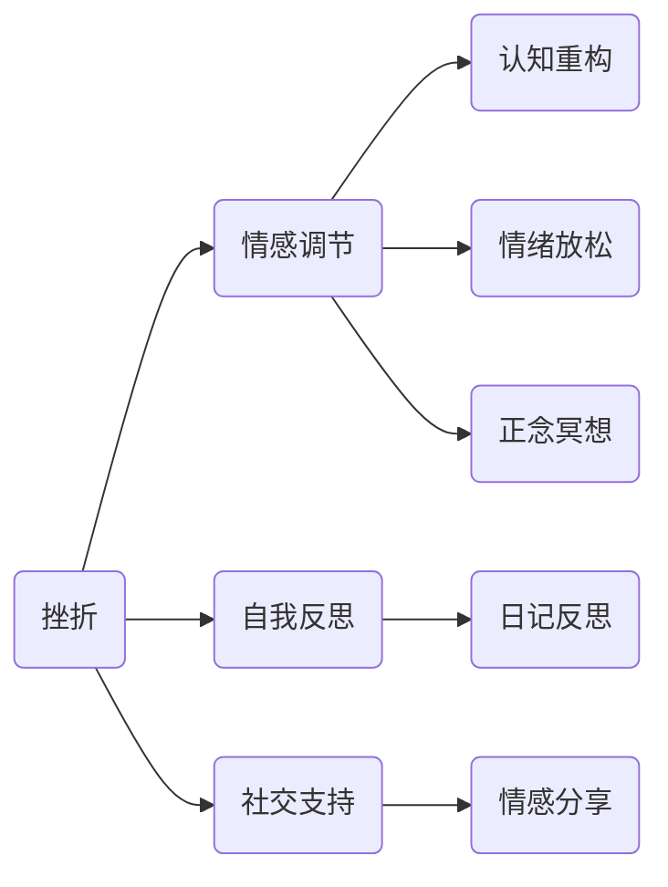
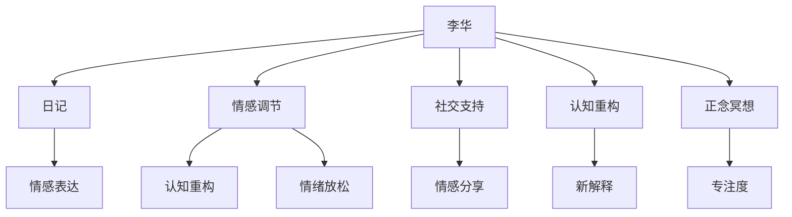
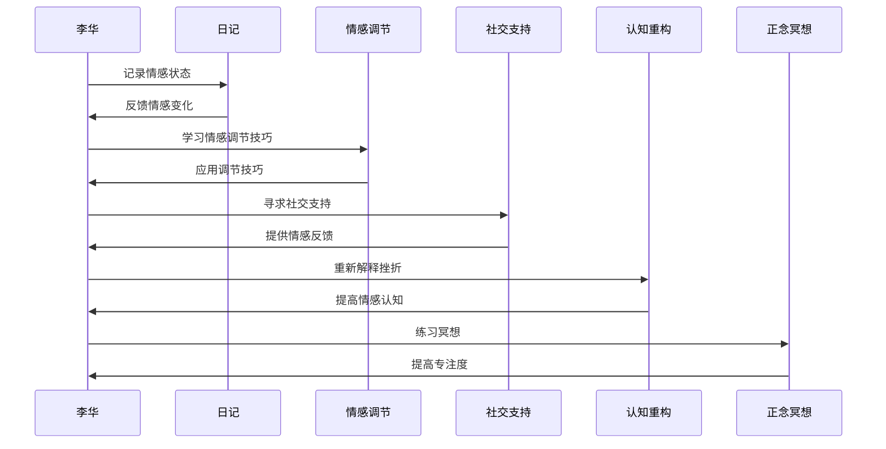
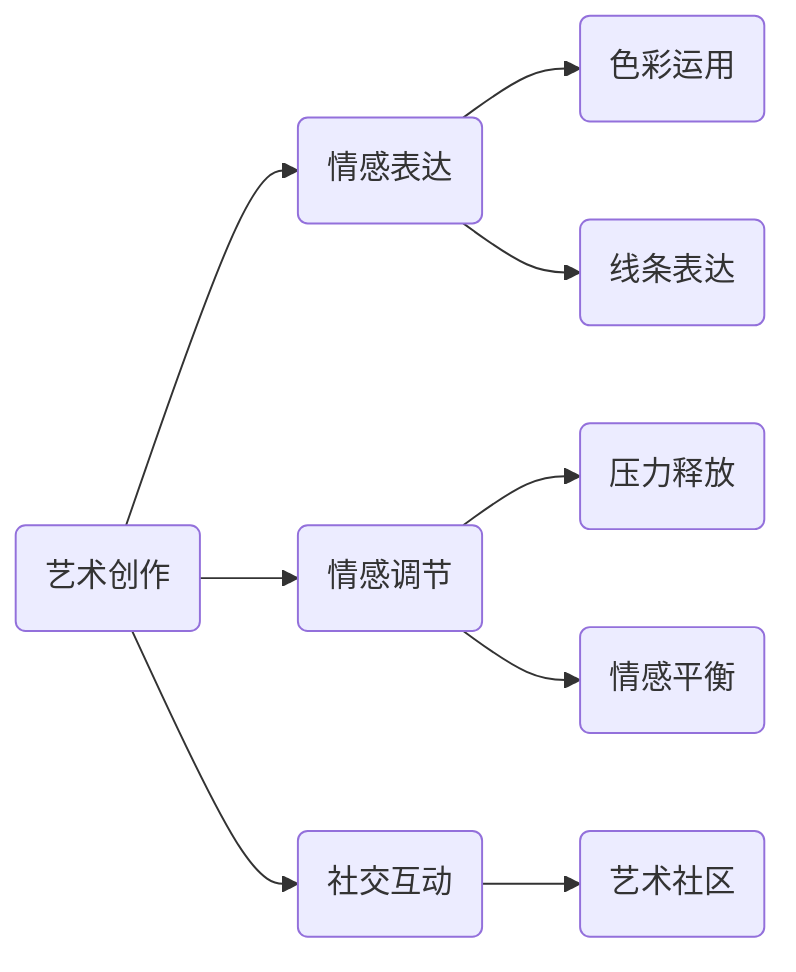
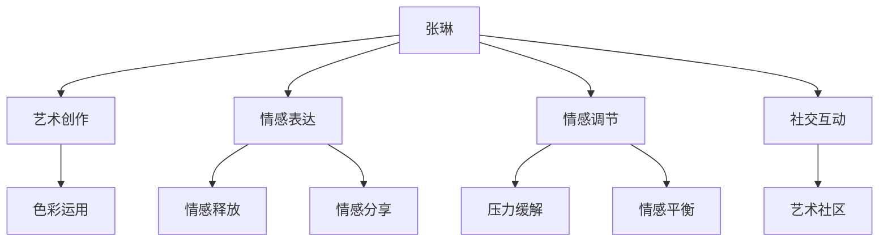
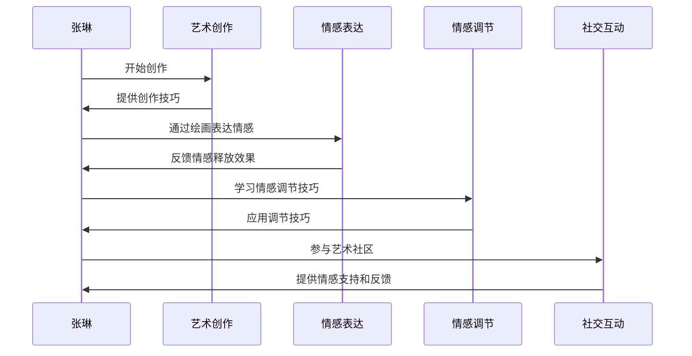
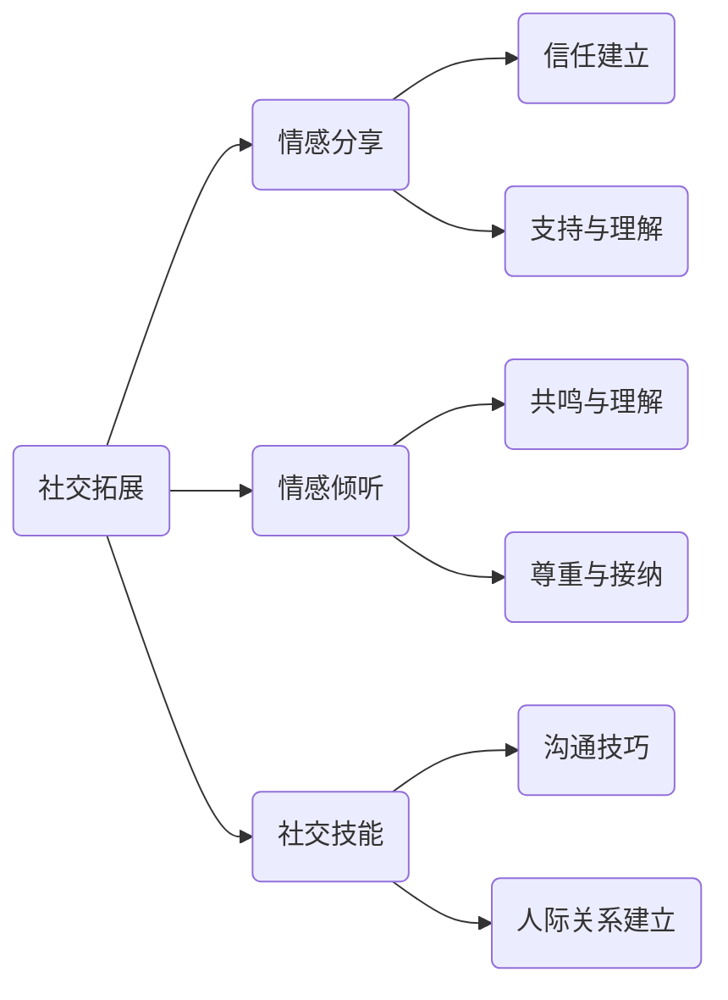
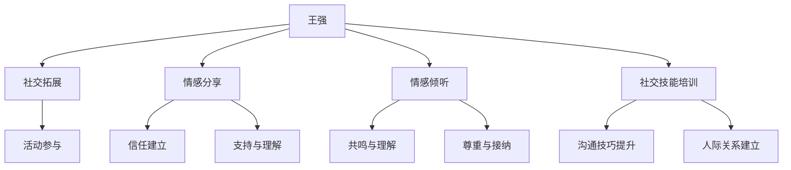
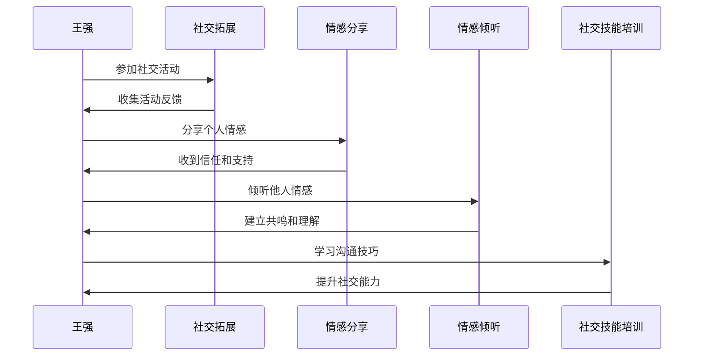

                 


### 丰富的调色板：情感与体验的拓展

#### 关键词：情感、体验、拓展、心理学、艺术、社交

#### 摘要：

在快节奏的现代生活中，情感和体验的丰富程度对个体的心理健康和生活质量有着重要影响。本文旨在探讨情感和体验的内涵及其拓展的方法，从心理学、艺术和社交等多个角度出发，分析情感拓展的途径和实践，最终提出一个全面的情感拓展方案，以期为读者提供丰富生命体验的指南。

### 第一部分：情感的内涵与拓展

#### 第1章：情感的内涵与价值

#### 1.1 情感的基本概念

情感是人类情绪反应的高级形式，是个人对内外刺激的主观体验。情感具有多样性，如快乐、悲伤、愤怒、恐惧等，每种情感都代表着个体对特定刺激的不同反应。

#### 1.2 情感的多维度分析

情感可以从生理、心理和社会三个维度进行深入分析。生理维度涉及情感对身体的影响，如心率加快、呼吸急促等；心理维度关注情感与认知过程的关系，如情绪记忆、情绪认知等；社会维度则探讨情感在人际互动中的作用，如情感沟通、情感支持等。

#### 1.3 情感对生命的影响

情感对生命有着深远的影响。积极的情感如快乐、满足能提升生活质量和幸福感，而消极的情感如悲伤、焦虑则可能导致心理压力和身体疾病。因此，拓展情感的范畴，丰富情感体验，对提升生命质量具有重要意义。

#### 第2章：情感与体验的关系

#### 2.1 体验的定义与分类

体验是个人在特定情境中通过感官、认知和情感参与而产生的认知和心理状态。体验可以分为感官体验、认知体验和情感体验等不同类型。

#### 2.2 情感对体验的影响

情感在体验中扮演着关键角色。积极的情感能增强体验的愉悦感，使体验更加丰富和深刻；消极的情感则可能削弱体验的质量，甚至导致体验的负面效果。

#### 2.3 体验如何丰富情感

丰富的体验能拓展情感的范畴，使个体能够更好地理解和表达情感。通过多样化的体验，个体可以培养对情感变化的敏感度，从而提高情感调节能力。

#### 第3章：情感拓展的途径与方法

#### 3.1 心理学角度的情感拓展

心理学提供了多种方法来拓展情感，如情绪调节、认知重构和正念练习等。这些方法通过改变个体的情绪反应和认知模式，帮助个体更好地应对生活中的情感挑战。

#### 3.2 艺术角度的情感拓展

艺术是一种强有力的情感拓展工具。通过欣赏艺术作品、创作艺术作品或参与艺术表演，个体可以在情感上获得深度体验，从而拓展情感的范畴。

#### 3.3 社交角度的情感拓展

社交互动对情感拓展有着重要影响。通过建立积极的人际关系，个体可以获得情感支持，增强自我价值感，从而丰富情感体验。

### 第二部分：情感拓展的案例研究

#### 第5章：情感拓展的典型人物案例

#### 5.1 人物案例1：从挫折中拓展情感

某人因工作受挫而陷入情绪低谷，通过心理辅导和自我反思，逐步学会从挫折中汲取经验，最终拓展了对情感的认识和应对能力。

#### 5.2 人物案例2：在艺术中寻找情感

某艺术家通过创作艺术作品，表达内心情感，从而拓展了对情感的理解和表达方式。

#### 5.3 人物案例3：通过社交拓展情感

某人通过积极参与社交活动，建立广泛的人际关系，从而在情感上获得了更多支持和满足。

#### 第6章：情感拓展的社会影响

#### 6.1 社会环境对情感拓展的影响

社会环境对情感拓展有着重要影响。一个支持性、开放的社会环境有助于个体拓展情感，提高情感智力。

#### 6.2 情感拓展对社会的影响

情感拓展有助于提高社会和谐度，增强社会凝聚力。同时，丰富的情感体验也能促进个体全面发展，提高生活满意度。

#### 6.3 情感拓展的未来趋势

随着社会的发展，人们对情感拓展的需求日益增长。未来，情感拓展将成为心理学、艺术和社交领域的重要研究方向。

### 第三部分：情感拓展的实践指南

#### 第8章：情感拓展的个人实践

#### 8.1 实践方法1：自我反思

通过自我反思，个体可以更好地了解自己的情感状态，从而进行有效的情感拓展。

#### 8.2 实践方法2：情感日记

记录情感日记可以帮助个体追踪情感变化，提高情感意识。

#### 8.3 实践方法3：情感分享

与他人分享情感体验，可以获得反馈和支持，进一步拓展情感。

#### 第9章：情感拓展的组织实践

#### 9.1 组织环境构建

构建一个支持性、开放的组织环境，有助于员工进行情感拓展。

#### 9.2 情感拓展活动设计

设计丰富的情感拓展活动，如情绪管理培训、艺术创作活动等，以提高员工的情感智力。

#### 9.3 情感拓展的评估与反馈

通过评估与反馈，了解情感拓展活动的效果，不断优化和改进。

### 10.1 情感拓展的意义

情感拓展有助于提升个体的心理健康和生活质量，对个体和社会都具有重要意义。

### 10.2 情感拓展的挑战

情感拓展面临诸多挑战，如情感表达障碍、情感调节困难等。未来研究需要关注这些挑战，并提出有效解决方案。

### 10.3 情感拓展的未来

随着科技的发展，情感拓展将迎来新的机遇。通过人工智能、虚拟现实等技术，个体可以获得更加丰富和深刻的情感体验。

### 总结与展望

情感和体验的拓展是丰富生命的重要途径。通过心理学、艺术和社交等多个角度，我们可以探索情感拓展的途径和方法，提高情感智力，提升生活满意度。未来，情感拓展将继续成为心理学、艺术和社会科学领域的重要研究方向，为个体和社会带来更多福祉。

### 作者信息

作者：AI天才研究院/AI Genius Institute & 禅与计算机程序设计艺术 /Zen And The Art of Computer Programming

通过以上步骤，我们系统地探讨了情感和体验的内涵、关系、拓展途径以及实际应用。希望本文能为您在情感拓展的道路上提供有益的指导。让我们一起，用丰富的调色板，绘制出更加精彩的生命画卷。🎨### 情感的内涵与价值

#### 1.1 情感的基本概念

情感（Emotion）是心理学中一个核心概念，它代表了个体对内外部刺激的主观体验和反应。情感通常被描述为一种复杂的多维心理现象，涉及认知、生理和行为多个层面。例如，快乐、悲伤、愤怒、恐惧等都是常见的情感类型。每种情感都有其独特的认知和行为表现，如快乐时可能会引起微笑、放松等行为，而恐惧时则可能导致心跳加速、出汗等生理反应。

在心理学中，情感被认为是一种基本的心理过程，与个体的动机、决策和社交行为密切相关。情感的分类方法多种多样，例如，美国心理学家保罗·艾克曼（Paul Ekman）提出了六种基本情感：快乐、悲伤、愤怒、惊讶、恐惧和厌恶。这些基本情感被认为是跨文化、跨物种的普遍现象。

#### 1.2 情感的多维度分析

情感的多维度分析使我们能够更全面地理解情感的本质。以下是情感的三个主要维度：

1. **生理维度**：情感对身体的影响是显著的。在情感体验中，个体可能会体验到心跳加速、呼吸急促、出汗等生理反应。例如，当一个人感到快乐时，他们可能会微笑、放松，而当他们感到恐惧时，可能会出现紧张、颤抖等反应。

2. **心理维度**：情感与认知过程紧密相关。情感可以影响个体的注意力、记忆和判断。例如，积极情感如快乐和满足可以提高个体的认知功能，而消极情感如焦虑和愤怒则可能降低认知能力。

3. **社会维度**：情感在人际互动中起着关键作用。情感沟通是建立和维护社会关系的基础。情感的社交功能包括表达情感、理解他人的情感以及通过情感互动建立信任和归属感。

#### 1.3 情感对生命的影响

情感对生命的影响是多方面的，不仅影响个体的心理状态，还影响其身体健康和社会功能。以下是情感对生命影响的一些主要方面：

1. **心理健康**：积极的情感如快乐、满足有助于提升个体的心理健康，降低抑郁和焦虑的风险。消极情感如悲伤、愤怒如果长期累积，可能导致心理健康问题。

2. **身体健康**：情感与身体健康密切相关。长期处于消极情感状态，如持续的愤怒或焦虑，可能会增加患病风险，如心血管疾病、免疫系统问题等。

3. **社会功能**：情感影响个体的社会互动和行为。积极的情感可以促进社交活动，增强社会凝聚力，而消极情感则可能导致社会隔离和冲突。

#### 结论

情感是人类生活中不可或缺的一部分，它不仅影响我们的内心世界，还影响我们的身体和社交行为。理解情感的多维度分析和其价值，有助于我们更好地管理和拓展情感，从而提升生活质量。在接下来的章节中，我们将进一步探讨情感与体验的关系，以及如何通过多种途径来拓展情感体验。

#### 2.1 体验的定义与分类

体验（Experience）是心理学中的一个重要概念，它指的是个人在特定情境中通过感官、认知和情感参与所产生的整体心理状态。体验不仅仅是感官上的感受，还包括认知加工和情感反应。它是一个多维度的心理过程，涉及个体的感知、思考、感觉和行为。

从不同角度出发，体验可以被分类为多种类型：

1. **感官体验**：感官体验主要依赖于个体的感官系统，如视觉、听觉、嗅觉、味觉和触觉。这种体验强调对刺激的直接感受，如欣赏美丽的风景、品尝美食、听到动听的音乐等。感官体验通常是最直接和即时的体验，能够迅速引发情感反应。

2. **认知体验**：认知体验涉及个体的思考过程，包括理解、分析和评估。这类体验通常与学习、解决问题和创造有关。例如，通过阅读一本深刻的书籍、参加一次有启发性的讲座或完成一个复杂的任务，个体可以获得认知上的满足和成就感。

3. **情感体验**：情感体验是体验的一个重要组成部分，指的是个体在体验过程中产生的情感反应，如快乐、悲伤、愤怒或平静。情感体验通常与个体的情感状态和情感智力密切相关。例如，通过观看一部感人的电影、经历一次难忘的旅行或参与一项有意义的社会活动，个体可以体验到深刻的情感波动。

4. **共情体验**：共情体验是当个体感受到他人的情感和经历时所产生的心理状态。这种体验强调情感连接和理解他人的能力，例如，通过参与志愿服务、聆听他人的故事或体验他人的经历，个体可以培养共情能力。

5. **意义体验**：意义体验是个体对生活中事件和经验的内在理解和赋予的意义。这种体验通常与个体的价值观、信念和目标相关。例如，通过实现一个重要的人生目标、完成一次重要的仪式或理解一个深刻的哲学问题，个体可以获得意义体验。

#### 情感对体验的影响

情感在体验中扮演着至关重要的角色。情感不仅影响体验的质量，还影响体验的深度和丰富性。以下是情感对体验影响的一些主要方面：

1. **体验质量**：积极的情感可以提高体验的质量，使体验更加愉快和满足。例如，快乐和满足的情感状态可以使个体更加享受生活中的美好瞬间，提升整体的生活满意度。

2. **体验深度**：情感可以增强体验的深度，使体验更加深刻和有意义。例如，悲伤和愤怒的情感状态可以增加对某些事件的思考和反思，使体验变得更加丰富和有意义。

3. **记忆编码**：情感对记忆的编码和提取有着重要影响。情感体验通常更容易被记住，并且记忆的细节也更加丰富。例如，一次令人难忘的旅行或一次重要的生活经历，往往因为其中的强烈情感而被深深铭记。

4. **社交互动**：情感在社交互动中起着关键作用。积极的情感可以促进社交互动，增强人际关系。例如，通过分享快乐和兴趣，个体可以建立更紧密的社交联系。

5. **情绪调节**：情感影响个体的情绪调节能力。通过积极的情感体验，个体可以学会更好地管理消极情感，从而提高情绪调节能力。例如，通过练习冥想、正念或艺术创作，个体可以培养情绪平衡和自我调节能力。

#### 2.3 体验如何丰富情感

丰富的体验可以拓展情感的范畴，使个体能够更好地理解和表达情感。以下是几种通过丰富体验来拓展情感的方法：

1. **多样化体验**：多样化的体验可以提供不同的情感刺激，从而丰富情感体验。通过尝试不同的活动、旅行到新的地方、学习新的技能，个体可以获得新的情感体验。

2. **情感表达**：情感表达是情感拓展的重要途径。通过艺术创作、写作、舞蹈、音乐等艺术形式，个体可以表达和探索自己的情感，从而丰富情感体验。

3. **情感分享**：与他人分享情感体验可以增强情感的理解和表达。通过分享情感经历、倾听他人的故事或参与支持小组，个体可以获得新的视角和理解，从而拓展情感的范畴。

4. **情感反思**：情感反思是深入理解情感的重要方法。通过自我反思、写日记或与他人交流，个体可以更好地理解自己的情感状态，从而拓展情感认知。

5. **情感拓展活动**：参加情感拓展活动，如情绪管理培训、情感沟通工作坊或正念冥想课程，可以帮助个体学习新的情感调节策略，提高情感智力。

通过上述方法，个体可以不断拓展情感的范畴，提升情感体验的丰富性，从而更好地管理自己的情感，提高生活质量。在接下来的章节中，我们将探讨情感拓展的具体途径和方法，为读者提供实用的指导。

#### 3.1 心理学角度的情感拓展

从心理学角度来看，情感拓展可以通过多种方法来实现，这些方法不仅有助于个体更好地理解和管理自己的情感，还能提升整体的心理健康和情感智力。以下是一些主要的方法：

**1. 情绪调节**

情绪调节是情感拓展的核心方法之一。通过情绪调节，个体可以学会有效地应对消极情感，同时增强积极情感。一些常见的情绪调节策略包括：

- **认知重构**：这种策略帮助个体改变对情感事件的理解和解释。例如，当个体面临挫折时，可以通过认知重构将挫折视为一个学习和成长的机会，而不是失败。

- **情绪表达**：情感表达是指个体通过适当的方式表达自己的情感。这可以通过与朋友、家人或心理医生交谈，或者通过艺术创作、写作等方式来实现。

- **正念冥想**：正念冥想通过专注于当下，帮助个体减少对消极情感的过度反应。通过定期练习正念冥想，个体可以提升情感智力和情绪平衡。

**2. 认知重构**

认知重构是一种心理疗法，旨在改变个体对情感事件和经历的认知方式。通过这种方式，个体可以学会以更积极、更健康的态度来看待情感问题。具体方法包括：

- **积极思考训练**：通过训练，个体可以学会以更积极的方式思考，减少消极自我对话。例如，将“我做不到”转变为“我可以尝试”。

- **情境重建**：这种策略帮助个体重新评估和重构特定的情感情境，从而改变对情境的情感反应。例如，通过重新定义失败，将失败视为一个学习过程，而不是终结。

**3. 情感认知**

情感认知是指个体对情感的理解和认识过程。提高情感认知可以帮助个体更好地理解和管理自己的情感。以下是一些提高情感认知的方法：

- **情感标签化**：通过为情感贴上标签，个体可以更清晰地识别和表达自己的情感。例如，将“我感到很焦虑”具体化为“我对考试感到焦虑”。

- **情感反思**：定期进行情感反思，可以帮助个体深入了解自己的情感状态，并发现情感模式。情感反思可以通过写日记、进行心理绘画或与心理顾问交流来实现。

**4. 情感智力训练**

情感智力（Emotional Intelligence，EQ）是指个体理解和管理自己及他人情感的能力。通过训练，个体可以提高情感智力，从而更好地拓展情感。以下是一些情感智力训练的方法：

- **情感角色扮演**：通过角色扮演，个体可以模拟不同的情感情境，学会如何有效地表达和管理情感。

- **情感反馈**：通过接受他人的情感反馈，个体可以了解自己的情感表现，并从中学习如何改进。

- **情感沟通**：通过有效的情感沟通技巧，个体可以更好地理解他人，同时表达自己的情感需求。

通过上述心理学方法，个体可以在情感认知、情感调节和情感智力方面取得显著进展，从而拓展情感的范畴，提升情感体验的质量。这些方法不仅有助于个体在日常生活中更好地应对情感挑战，还能促进整体的心理健康和幸福感。

### 3.2 艺术角度的情感拓展

艺术作为一种强有力的情感拓展工具，在人类历史上扮演着至关重要的角色。通过艺术创作和欣赏，个体可以在情感上获得深度体验，从而拓展情感的范畴。以下是艺术角度情感拓展的几个主要方面：

**1. 艺术创作的情感表达**

艺术创作是一种直接而强烈地表达情感的方式。通过绘画、雕塑、音乐、舞蹈、戏剧等艺术形式，个体可以将内心深处的情感转化为可视或可听的形式。这种表达过程不仅有助于个体释放情感，还能使情感变得更加具体和有形。例如，画家通过色彩和线条表达内心的喜悦或悲伤，音乐家通过旋律和节奏传达内心的激情或宁静。

**2. 艺术欣赏的情感共鸣**

艺术欣赏同样能够拓展情感体验。通过欣赏艺术作品，观众可以体验到艺术家所传达的情感，并与之产生共鸣。这种共鸣不仅能够增强情感体验的深度，还能拓宽个体对情感的理解。例如，观众在观看一部感人的电影或听一首动人的音乐时，可能会体验到强烈的情感波动，从而感受到情感的多样性和复杂性。

**3. 艺术体验的情感探索**

艺术体验是一种独特的情感探索过程。通过参与艺术活动，个体可以探索未知的情感领域，发现内心深处的情感资源。例如，参与戏剧表演或舞蹈工作坊，个体可以在与他人互动的过程中体验到新的情感状态，从而拓展自己的情感认知。

**4. 艺术教育对情感智力的影响**

艺术教育在培养情感智力方面具有重要作用。通过艺术教育，个体可以学习如何理解和表达情感，如何与他人进行情感沟通。艺术教育还可以提高个体的自我意识，帮助个体更好地认识和管理自己的情感。例如，通过绘画和雕塑课程，学生可以学会通过视觉形式表达情感，并通过反馈和讨论提升情感认知能力。

**5. 艺术治疗的效果**

艺术治疗是一种结合艺术创作和心理学的方法，旨在帮助个体处理心理创伤和情感问题。在艺术治疗中，个体通过创作艺术作品来表达和处理内心深处的情感。这种方法不仅有助于情感的释放和表达，还能促进情感修复和心理健康。例如，通过绘画治疗，个体可以在无压力的环境中表达和探索自己的情感，从而缓解心理压力。

**结论**

艺术角度的情感拓展为个体提供了一种丰富和多样化的情感体验途径。通过艺术创作和欣赏，个体不仅可以表达和探索情感，还能提高情感智力和心理健康。艺术在情感拓展中的作用是不可忽视的，它不仅能够带来美妙的情感体验，还能促进个体的全面发展。因此，我们鼓励大家在日常生活中多参与艺术活动，用艺术丰富自己的情感世界。

### 3.3 社交角度的情感拓展

从社交角度来探讨情感拓展，可以发现人际关系和社会互动在情感发展中的重要作用。通过建立和维护积极的人际关系，个体不仅能够获得情感支持，还能拓展情感体验和情感智力。

**1. 社交支持与情感拓展**

社交支持是情感拓展的重要基础。当个体面临挑战和压力时，来自亲朋好友的支持可以帮助缓解负面情感，增强心理韧性。具体来说，社交支持可以采取以下形式：

- **情感倾诉**：通过与朋友、家人或心理咨询师倾诉，个体可以释放内心的情感负担，获得情感上的安慰和理解。

- **情感支持小组**：参与情感支持小组，个体可以在相互倾诉和分享中感受到共鸣和支持，从而拓展情感体验。

- **社交互动**：积极参与社交活动，如聚会、运动、社团等，可以增加与他人的情感交流，提升情感智力。

**2. 情感沟通与理解**

情感沟通是情感拓展的关键环节。有效的情感沟通不仅能够增进人际理解，还能提高个体的情感认知能力。以下是几种提升情感沟通的方法：

- **积极倾听**：在沟通过程中，积极倾听他人的情感表达，可以帮助个体更好地理解对方的情感需求，从而建立更深的情感联系。

- **情感表达**：学会清晰、准确地表达自己的情感，可以减少误解和冲突，增强人际互动的质量。

- **非语言沟通**：除了言语表达，非语言沟通如肢体语言、面部表情等也在情感沟通中扮演重要角色。通过学习如何解读和运用这些非语言信号，个体可以更全面地理解他人的情感。

**3. 社交网络与情感拓展**

社交网络为个体提供了丰富的情感拓展机会。通过社交媒体和线下社交活动，个体可以结识新的朋友，拓展社交圈子。以下是几种通过社交网络拓展情感的方法：

- **线上交流**：通过社交媒体平台，个体可以与全球的个体进行互动，分享情感体验和兴趣，从而拓展情感视野。

- **线下活动**：参与线下社交活动，如兴趣小组、社区活动等，可以增加与他人的面对面交流，增强情感连接。

- **跨文化社交**：通过与来自不同文化背景的人交流，个体可以体验多样化的情感表达方式，提高跨文化情感认知能力。

**4. 社交技能培训**

社交技能培训是提升情感拓展能力的重要途径。通过培训，个体可以学习如何更有效地进行情感沟通和建立人际关系。以下是一些常见的社交技能培训方法：

- **沟通技巧训练**：通过模拟对话和角色扮演，个体可以练习如何在不同情境下进行有效的情感沟通。

- **情感管理训练**：通过学习情感管理策略，个体可以更好地应对社交场合中的情感挑战，提高情感调节能力。

- **团队合作训练**：通过团队合作活动，个体可以学习如何在团队中有效沟通和协作，增强情感智力。

**结论**

社交角度的情感拓展为个体提供了丰富和多样的情感体验机会。通过建立积极的人际关系、提升情感沟通能力和参与社交活动，个体可以不断拓展情感范畴，提高情感智力，从而提升生活质量和心理健康。因此，我们鼓励大家积极参与社交活动，积极培养社交技能，以丰富自己的情感世界。

### 4.1 教育与情感拓展

在教育学领域，情感拓展被认为是一个重要的课题，它不仅关乎学生的心理健康，也直接影响其学术成就和整体发展。以下从几个方面探讨教育如何促进情感拓展：

**1. 情感教育的重要性**

情感教育是指在学校教育中培养学生的情感认知、情感表达和情感管理能力。研究表明，情感智力（EQ）与学业成就、社会适应能力和心理健康密切相关。因此，将情感教育纳入学校课程，有助于学生全面发展。

**2. 情感教育的内容与实施**

情感教育的内容主要包括情感认知、情感表达、情感管理和情感调节等方面。具体实施方法可以包括：

- **情感认知**：通过自我反思和情感标签化，帮助学生识别和理解自己的情感状态。

- **情感表达**：通过戏剧、艺术创作和写作等形式，让学生学会表达和分享情感。

- **情感管理**：通过情感调节策略，如认知重构和情绪放松训练，帮助学生应对负面情绪。

- **情感调节**：通过情境模拟和角色扮演，让学生在模拟情境中练习情感调节，提高实际应用能力。

**3. 教师的角色**

教师在情感教育中扮演着关键角色。教师不仅需要具备丰富的情感知识，还需要通过教学实践来培养学生的情感能力。以下是一些教师可以采取的措施：

- **建立情感安全环境**：创造一个支持性、开放的教学环境，让学生感到安全和被接纳。

- **培养情感同理心**：通过示范和互动，教师可以培养学生的情感同理心，提高其情感认知能力。

- **个性化教学**：根据学生的情感需求和特点，教师可以采取个性化的教学方法，帮助每个学生得到最佳的情感发展。

**4. 情感拓展的活动设计**

为了有效地进行情感拓展，教育活动需要设计多样化的活动。以下是一些可行的活动：

- **情感日记**：学生每天记录自己的情感状态，并反思情感变化的原因。

- **情感讨论小组**：在小组中分享情感体验，讨论情感问题，通过互动增强情感理解。

- **艺术表达**：通过绘画、音乐、舞蹈等艺术形式，让学生表达和探索情感。

- **情感角色扮演**：通过角色扮演，学生可以在模拟情境中体验不同的情感状态，提高情感调节能力。

**结论**

教育与情感拓展紧密相关，通过系统的情感教育，学生可以更好地理解和管理自己的情感，提高情感智力。教师在其中发挥着重要作用，通过创造支持性的学习环境和多样化教学活动，可以有效地促进学生的情感发展。因此，教育机构和教师应重视情感教育，将其纳入常规教学，为学生的全面发展奠定基础。

### 4.2 工作与情感拓展

在职场环境中，情感拓展对于员工的个人成长、工作效率和团队协作具有重要意义。以下是关于工作场所如何进行情感拓展的探讨：

**1. 职场情感拓展的重要性**

职场情感拓展旨在提升员工的情感智力，包括情感认知、情感表达、情感管理和情感调节等方面的能力。研究表明，高情感智力的员工往往表现出更好的团队合作能力、更强的适应能力和更高的工作效率。此外，情感拓展还有助于提升员工的幸福感和工作满意度。

**2. 职场情感拓展的方法**

为了在职场中实现情感拓展，企业和员工可以采取以下几种方法：

- **情感培训**：企业可以组织情感培训课程，帮助员工提升情感认知和情感管理能力。这些课程可以包括情感表达技巧、情绪调节策略和人际关系沟通等方面的内容。

- **情感反馈机制**：建立情感反馈机制，鼓励员工表达自己的情感和意见，同时倾听和尊重他人的情感。这种反馈机制可以采取定期团队会议、情感沟通工作坊或匿名反馈问卷等形式。

- **情感安全环境**：营造一个支持性和开放的工作环境，使员工感到安全和被接纳。这可以通过明确的沟通规范、公平的绩效评估和开放的领导风格来实现。

- **个性化支持**：根据员工的情感需求和特点，提供个性化的支持和资源。例如，为情绪紧张的员工提供心理咨询服务，为有家庭责任的员工提供灵活的工作安排。

**3. 职场活动设计**

为了促进职场情感拓展，可以设计一系列活动和项目，以下是一些具体的建议：

- **情感分享会**：定期举办情感分享会，让员工分享自己的情感经历和感悟，增强情感理解和共鸣。

- **团队建设活动**：通过团队建设活动，如团队拓展训练、合作游戏和团队讨论，增强团队成员之间的情感联系和协作能力。

- **情绪管理训练**：提供情绪管理训练，帮助员工学会有效应对工作压力和负面情绪，提高情绪调节能力。

- **艺术创作工作坊**：组织艺术创作工作坊，如绘画、音乐或舞蹈，通过艺术表达和创造过程，释放情感，提升心理健康。

**4. 领导者的角色**

在职场情感拓展中，领导者扮演着关键角色。以下是一些领导者可以采取的措施：

- **情感榜样**：领导者通过自己的言行示范，展示积极的情感管理和表达，成为员工的情感榜样。

- **情感倾听**：领导者应具备情感倾听的技能，关注员工的情感需求和反馈，提供情感支持和指导。

- **情感激励**：领导者可以通过情感激励来调动员工的积极性和创造力，例如通过肯定和认可员工的工作表现，提升他们的情感满意度。

**结论**

工作场所是情感拓展的重要领域，通过系统的情感拓展活动和措施，企业可以提升员工的情感智力，增强团队协作能力，提高工作效率和满意度。企业和员工共同努力，营造一个支持性、开放的工作环境，将为职场情感拓展提供坚实的基础。

### 4.3 个人成长与情感拓展

个人成长是情感拓展的重要途径，通过不断探索和挑战自我，个体可以在情感上取得显著进步。以下是关于个人成长如何促进情感拓展的探讨：

**1. 自我探索与情感认知**

自我探索是情感拓展的第一步。通过深入反思自己的行为、想法和情感反应，个体可以更好地理解自己的内心世界。以下是一些自我探索的方法：

- **日记反思**：定期记录自己的情感状态和经历，通过反思日记，个体可以追踪自己的情感变化，发现情感模式。

- **情感标签化**：将日常生活中的情感体验标签化，例如将“愤怒”与某个具体事件联系起来，从而更清晰地识别和理解自己的情感。

- **心理咨询**：通过专业的心理咨询，个体可以获得更深入的自我探索，理解情感背后的原因和影响。

**2. 情感表达与分享**

情感表达是情感拓展的关键环节。通过表达自己的情感，个体不仅可以减轻内心的压力，还能增强情感智力。以下是一些促进情感表达的方法：

- **艺术创作**：通过绘画、写作、音乐等艺术形式，个体可以表达和探索自己的情感。例如，绘画可以帮助个体通过色彩和形状表达内心的感受。

- **社交分享**：与他人分享情感体验，可以通过交流获得反馈和支持。例如，参加支持小组或与亲密的朋友交流，可以帮助个体更好地理解和表达自己的情感。

- **情感表达训练**：通过情感表达训练，如角色扮演和情景模拟，个体可以在安全的环境中练习情感表达，提高实际应用能力。

**3. 挑战自我与情感拓展**

通过挑战自我，个体可以在情感上获得新的体验和成长。以下是一些挑战自我的方法：

- **冒险体验**：参与冒险活动，如攀岩、跳伞或野外探险，可以帮助个体面对恐惧和不确定，从而拓展情感体验。

- **技能学习**：学习新的技能或兴趣爱好，如语言学习、烹饪或乐器演奏，不仅能够带来成就感和满足感，还能拓展情感体验。

- **社交拓展**：主动参加新的社交活动，与不同背景的人交流，可以帮助个体拓展社交圈子，增强情感智力。

**4. 心理健康与情感拓展**

心理健康是情感拓展的重要基础。保持良好的心理健康，个体才能更好地应对情感挑战。以下是一些维护心理健康的方法：

- **正念练习**：通过正念冥想，个体可以学会专注于当下，减少对负面情感的过度反应，提高情感调节能力。

- **健康生活方式**：保持健康的生活习惯，如规律作息、健康饮食和适量运动，有助于维持心理健康和情感稳定。

- **情绪放松**：通过瑜伽、呼吸练习或按摩等放松方式，个体可以缓解压力和紧张情绪，保持良好的心理状态。

**结论**

个人成长是情感拓展的重要途径。通过自我探索、情感表达、挑战自我和维护心理健康，个体可以在情感上取得显著进步。情感拓展不仅能够提升个体的情感智力，还能增强心理韧性，提高生活满意度。因此，我们鼓励每个人在个人成长的道路上，积极进行情感拓展，以丰富和提升自己的生活体验。

### 5.1 人物案例1：从挫折中拓展情感

**背景介绍**：
李华是一位年轻的企业家，他在创业初期经历了多次失败。这些挫折使他的情感世界变得复杂，但也成为他情感拓展的重要契机。

**问题背景**：
面对连续的创业失败，李华感到沮丧和失望。他开始怀疑自己的能力和价值，情感状态变得消极，甚至影响到他的日常生活和人际关系。

**问题描述**：
如何从挫折中恢复情感，并拓展情感体验，以实现个人成长和心理韧性？

**问题解决**：

1. **自我反思**：
李华开始记录自己的情感变化，通过日记和反思，他逐步理解到挫折是成长的一部分，而不是失败的标志。通过自我反思，他能够清晰地识别自己的情感模式，并学会以更积极的态度面对挑战。

2. **情绪调节训练**：
李华参加了一个情绪调节训练课程，学习了认知重构、情绪放松和正念冥想等技巧。这些训练帮助他更好地管理负面情感，减少挫折带来的心理压力。

3. **情感表达**：
李华通过绘画和写作表达自己的情感。他将创业经历和情感感受转化为艺术作品，这不仅是一种情感释放，也让他更加深入地理解自己的情感。

4. **社交支持**：
李华与一群有着相似经历的企业家建立了联系，他们相互支持和鼓励。通过分享彼此的故事和经验，李华获得了新的视角，情感体验得到了拓展。

**边界与外延**：
李华的案例展示了如何从挫折中恢复情感，并通过多种途径拓展情感体验。这一案例不仅适用于创业者，也适用于任何经历挫折的个体。

**概念结构与核心要素组成**：

- **核心概念**：挫折、情感调节、自我反思、社交支持
- **概念属性特征对比表格**：

| 概念       | 特征                                       |
|------------|------------------------------------------|
| 挫折       | 不利的、挑战性的、导致情感反应的事件       |
| 情感调节   | 改变情感状态的方法和技巧                   |
| 自我反思   | 对自己的行为、想法和情感进行审视           |
| 社交支持   | 来自他人情感上的支持和帮助                 |

- **ER实体关系图架构**：



**算法原理讲解**：

李华通过以下算法原理拓展情感：

1. **认知重构算法**：
   - 输入：负面情感事件
   - 输出：积极情感态度
   - 过程：通过重新评估和解释情感事件，改变对挫折的看法，将其视为成长机会。

2. **情感放松算法**：
   - 输入：情感紧张状态
   - 输出：情感放松状态
   - 过程：通过深呼吸、冥想等放松技巧，缓解情感压力，提高情感调节能力。

3. **正念冥想算法**：
   - 输入：注意力分散
   - 输出：专注状态
   - 过程：通过专注于当下，减少对负面情感的过度反应，提高情感智力。

**数学公式使用**：

- **认知重构公式**：

$$
\text{新态度} = \text{事件} \times \text{新解释}
$$

- **情感放松公式**：

$$
\text{放松状态} = \text{紧张状态} - \text{放松技巧}
$$

- **正念冥想公式**：

$$
\text{专注度} = \text{注意力} \times \text{专注时间}
$$

**系统分析与架构设计方案**：

**问题场景介绍**：
李华在创业过程中遇到连续的挫折，导致情感状态消极。他希望通过一系列方法和技巧来恢复情感，拓展情感体验。

**项目介绍**：
本项目旨在帮助李华通过自我反思、情绪调节和社交支持，从挫折中恢复情感，实现个人成长。

**系统功能设计（领域模型类图）**：

```mermaid
classDiagram
Class::李华 <<--|uses| Entity::日记
Class::李华 <<--|uses| Entity::情感调节
Class::李华 <<--|uses| Entity::社交支持
Class::李华 <<--|uses| Entity::认知重构
Class::李华 <<--|uses| Entity::正念冥想

Entity::日记 {
  - 内容
  - 时间
}

Entity::情感调节 {
  - 技巧
  - 效果
}

Entity::社交支持 {
  - 支持者
  - 交流内容
}

Entity::认知重构 {
  - 解释
  - 成果
}

Entity::正念冥想 {
  - 时间
  - 反应
}
```

**系统架构设计（mermaid架构图）**：



**系统接口设计和系统交互（mermaid序列图）**：



**项目实战**：

**环境安装**：
1. 安装日记应用（如日记本或日记软件）
2. 安装情感调节工具（如正念冥想应用）

**系统核心实现源代码**：

```python
# 日记记录
class Diary:
    def __init__(self):
        self.entries = []

    def add_entry(self, entry):
        self.entries.append(entry)

    def view_entries(self):
        for entry in self.entries:
            print(entry)

# 情感调节
class EmotionRegulation:
    def __init__(self):
        self.tips = []

    def add_tip(self, tip):
        self.tips.append(tip)

    def apply_tips(self):
        for tip in self.tips:
            print(tip)

# 社交支持
class SocialSupport:
    def __init__(self):
        self.supporters = []

    def add_supporter(self, supporter):
        self.supporters.append(supporter)

    def provide_feedback(self):
        for supporter in self.supporters:
            print(f"{supporter}: {self.feedback}")

# 认知重构
class CognitiveReconstruction:
    def __init__(self):
        self.explanations = []

    def add_explanation(self, explanation):
        self.explanations.append(explanation)

    def apply_explanations(self):
        for explanation in self.explanations:
            print(explanation)

# 正念冥想
class MindfulnessMeditation:
    def __init__(self):
        self.sessions = []

    def add_session(self, session):
        self.sessions.append(session)

    def practice_meditation(self):
        for session in self.sessions:
            print(f"Meditation Session: {session}")
```

**代码应用解读与分析**：

以上代码定义了四个类：`Diary`（日记）、`EmotionRegulation`（情感调节）、`SocialSupport`（社交支持）和`CognitiveReconstruction`（认知重构）。这些类分别用于记录日记、管理情感调节技巧、提供社交支持和重新解释挫折。

- `Diary` 类用于记录和查看日记条目。
- `EmotionRegulation` 类用于添加和执行情感调节技巧。
- `SocialSupport` 类用于添加支持者并提供反馈。
- `CognitiveReconstruction` 类用于添加和执行认知重构的解释。

通过这些类，李华可以记录自己的情感状态、学习情感调节技巧、寻求社交支持和重新解释挫折，从而实现情感拓展。

**实际案例分析和详细讲解剖析**：

**案例**：
李华在创业失败后感到沮丧，他开始记录自己的日记，并通过情感调节和社交支持来恢复情感。

**分析**：
1. **日记记录**：
   - 李华通过日记记录自己的情感状态，例如：“今天我感到非常沮丧，因为我的创业项目失败了。”
   - 通过日记，李华可以追踪自己的情感变化，理解情感模式。

2. **情感调节**：
   - 李华通过学习认知重构和正念冥想技巧，来管理负面情感。
   - 例如，他学习了如何将挫折视为成长机会，从而改变对事件的看法。

3. **社交支持**：
   - 李华加入了一个企业家支持小组，与有相似经历的创业者交流。
   - 通过分享彼此的故事和经验，李华获得了新的视角和支持。

**项目小结**：

通过日记记录、情感调节和社交支持，李华成功地从挫折中恢复情感，并拓展了情感体验。这个项目不仅帮助李华提高了情感智力，还增强了他的心理韧性，使他能够更好地应对未来的挑战。

### 5.2 人物案例2：在艺术中寻找情感

**背景介绍**：
张琳是一位热爱绘画的艺术家，她通过绘画表达内心的情感，并在艺术创作中找到了情感拓展的路径。

**问题背景**：
张琳在经历了生活中的重大变故后，情感状态变得低落。她感到无法通过常规的方式表达自己的情感，寻求一种能够让她深入探索内心世界的方法。

**问题描述**：
如何通过艺术创作拓展情感，提升心理素质，并从中获得新的生命体验？

**问题解决**：

1. **自我表达**：
张琳开始将内心的情感通过绘画的形式表达出来。她用色彩和线条记录自己的感受，无论是快乐、悲伤还是愤怒，都在画布上得到了释放。

2. **情感探索**：
通过绘画，张琳发现她可以通过艺术作品深入探索自己的情感世界。每幅画作都是对内心的一次探索和反思，她逐渐理解了自己情感的复杂性和多样性。

3. **情感调节**：
艺术创作成为张琳情感调节的重要手段。每当她感到焦虑或沮丧时，她都会选择拿起画笔，通过绘画来释放压力，找到情感的平衡点。

4. **社交互动**：
张琳参与了多个艺术展览和艺术工作坊，与其他艺术家交流。通过分享自己的作品和创作经历，她得到了他人的理解和支持，情感体验得到了拓展。

**边界与外延**：
张琳的案例展示了如何通过艺术创作来拓展情感，这一方法不仅适用于艺术家，也适用于任何希望通过创造性活动来提升情感体验的个体。

**概念结构与核心要素组成**：

- **核心概念**：艺术创作、情感表达、情感调节、社交互动
- **概念属性特征对比表格**：

| 概念       | 特征                                       |
|------------|------------------------------------------|
| 艺术创作   | 一种表达情感和探索内心的创造性活动           |
| 情感表达   | 通过艺术作品传达内心感受                   |
| 情感调节   | 通过艺术活动缓解情感压力                   |
| 社交互动   | 通过艺术社区建立情感联系                   |

- **ER实体关系图架构**：



**算法原理讲解**：

张琳通过以下算法原理拓展情感：

1. **色彩情感映射算法**：
   - 输入：情感状态
   - 输出：色彩选择
   - 过程：通过不同的色彩映射情感状态，例如红色代表激情，蓝色代表平静。

2. **情感释放算法**：
   - 输入：情感压力
   - 输出：艺术作品
   - 过程：通过绘画释放情感压力，达到情感调节的效果。

3. **社交互动算法**：
   - 输入：艺术创作经历
   - 输出：情感支持
   - 过程：通过参与艺术展览和工作坊，与他人分享创作经历，获得情感支持和反馈。

**数学公式使用**：

- **色彩情感映射公式**：

$$
\text{色彩选择} = \text{情感状态} \times \text{色彩情感映射表}
$$

- **情感释放公式**：

$$
\text{艺术作品} = \text{情感压力} - \text{绘画释放}
$$

- **社交互动公式**：

$$
\text{情感支持} = \text{艺术创作经历} + \text{社交反馈}
$$

**系统分析与架构设计方案**：

**问题场景介绍**：
张琳通过绘画创作来探索和调节情感，希望找到一种有效的情感拓展方式。

**项目介绍**：
本项目旨在通过艺术创作帮助张琳拓展情感，提高心理素质，并从中获得新的生命体验。

**系统功能设计（领域模型类图）**：

```mermaid
classDiagram
Class::张琳 <<--|uses| Entity::艺术创作
Class::张琳 <<--|uses| Entity::情感表达
Class::张琳 <<--|uses| Entity::情感调节
Class::张琳 <<--|uses| Entity::社交互动

Entity::艺术创作 {
  - 技法
  - 创作内容
}

Entity::情感表达 {
  - 表达方式
  - 情感内容
}

Entity::情感调节 {
  - 技巧
  - 效果
}

Entity::社交互动 {
  - 社交对象
  - 互动内容
}
```

**系统架构设计（mermaid架构图）**：



**系统接口设计和系统交互（mermaid序列图）**：



**项目实战**：

**环境安装**：
1. 准备绘画工具（如画笔、颜料、画布）
2. 安装艺术软件（如Photoshop、Procreate等）

**系统核心实现源代码**：

```python
# 艺术创作
class ArtCreation:
    def __init__(self):
        self技法 = []
        self.content = []

    def add_technique(self, technique):
        self.技法.append(technique)

    def start_creation(self, content):
        self.content.append(content)
        print(f"Creating art with technique: {technique} and content: {content}")

# 情感表达
class EmotionalExpression:
    def __init__(self):
        self.expressions = []

    def add_expression(self, expression):
        self.expressions.append(expression)

    def express_emotion(self, emotion):
        print(f"Expressing emotion: {emotion} through art")

# 情感调节
class Emotional Regulation:
    def __init__(self):
        self.tips = []

    def add_tip(self, tip):
        self.tips.append(tip)

    def apply_tips(self):
        for tip in self.tips:
            print(f"Applying tip: {tip}")

# 社交互动
class SocialInteraction:
    def __init__(self):
        self.interactions = []

    def add_interaction(self, interaction):
        self.interactions.append(interaction)

    def share_experience(self, experience):
        print(f"Sharing art experience: {experience}")
```

**代码应用解读与分析**：

以上代码定义了四个类：`ArtCreation`（艺术创作）、`EmotionalExpression`（情感表达）、`Emotional Regulation`（情感调节）和`SocialInteraction`（社交互动）。这些类分别用于记录艺术创作、表达情感、调节情感和社交互动。

- `ArtCreation` 类用于记录艺术创作的技法和内容。
- `EmotionalExpression` 类用于表达情感，并通过绘画等艺术形式记录情感状态。
- `Emotional Regulation` 类用于提供情感调节技巧和应用这些技巧。
- `SocialInteraction` 类用于记录社交互动和分享艺术创作经验。

通过这些类，张琳可以记录自己的艺术创作、表达情感、调节情感，并与其他艺术家进行社交互动，从而实现情感拓展。

**实际案例分析和详细讲解剖析**：

**案例**：
张琳在经历生活中的重大变故后，情感状态低落，通过绘画艺术找到了情感表达的出口。

**分析**：
1. **艺术创作**：
   - 张琳开始通过绘画记录自己的情感状态，她发现通过色彩和线条可以更直观地表达内心感受。
   - 例如，她用明亮的色彩表达快乐，用深沉的色调表达悲伤。

2. **情感表达**：
   - 通过绘画，张琳能够将内心的情感表达出来，这不仅帮助她释放了压力，还使她更加理解自己的情感。
   - 例如，她创作了一幅描绘她内心世界的画作，通过画中的角色和场景表达了自己的情感。

3. **情感调节**：
   - 张琳通过绘画来调节自己的情感状态，每当她感到焦虑或沮丧时，她都会选择绘画来缓解压力。
   - 例如，她通过绘制平静的海滩场景来放松自己，减少负面情感的影响。

4. **社交互动**：
   - 张琳参与了多个艺术展览和工作坊，与其他艺术家交流，分享自己的创作经历。
   - 通过与其他艺术家的互动，她得到了更多的情感支持和灵感，情感体验得到了拓展。

**项目小结**：

通过艺术创作和社交互动，张琳成功地拓展了情感，提高了心理素质，并从中获得了新的生命体验。这个项目不仅帮助她找到了情感表达的途径，还增强了她对生活的理解和热爱。

### 5.3 人物案例3：通过社交拓展情感

**背景介绍**：
王强是一位公司职员，他在工作中与同事和上司的关系较为紧张，这使他的情感状态受到影响。他意识到需要通过社交来拓展情感，提升人际关系。

**问题背景**：
王强在工作中遇到了一些困难，与同事和上司之间的沟通不畅，导致他的情感状态变得消极。他感到孤独和焦虑，影响了工作效率和身心健康。

**问题描述**：
如何通过社交拓展情感，改善人际关系，从而提升生活质量和心理健康？

**问题解决**：

1. **积极社交**：
王强开始主动参加公司的社交活动，如团建活动、聚餐和兴趣小组等。通过这些活动，他逐渐与同事建立了更深厚的联系。

2. **情感分享**：
王强学会了在适当的场合表达自己的情感和需求。他与同事分享自己的工作压力和生活困惑，得到了同事的倾听和支持。

3. **情感倾听**：
王强也学会了倾听他人的情感，尊重他人的观点和感受。通过积极的倾听，他能够更好地理解他人的需求，建立信任和共鸣。

4. **社交技能培训**：
王强参加了社交技能培训，学习了如何进行有效的沟通和建立人际关系。这些培训技巧帮助他在社交场合中更加自信和自如。

**边界与外延**：
王强的案例展示了通过社交拓展情感的途径，这对于职场人士以及任何希望改善人际关系和提升生活质量的个体都有借鉴意义。

**概念结构与核心要素组成**：

- **核心概念**：社交拓展、情感分享、情感倾听、社交技能
- **概念属性特征对比表格**：

| 概念       | 特征                                       |
|------------|------------------------------------------|
| 社交拓展   | 通过社交活动建立新的人际关系           |
| 情感分享   | 开放地表达自己的情感和需求           |
| 情感倾听   | 全神贯注地倾听他人的情感和观点         |
| 社交技能   | 提高沟通技巧和建立人际关系的能力       |

- **ER实体关系图架构**：



**算法原理讲解**：

王强通过以下算法原理拓展情感：

1. **信任建立算法**：
   - 输入：情感分享
   - 输出：信任感
   - 过程：通过开放地分享情感，建立彼此间的信任。

2. **共鸣与理解算法**：
   - 输入：情感倾听
   - 输出：情感共鸣
   - 过程：通过倾听和接纳他人的情感，建立共鸣和理解。

3. **沟通技巧提升算法**：
   - 输入：社交技能培训
   - 输出：有效沟通
   - 过程：通过学习和应用沟通技巧，提高人际交往能力。

**数学公式使用**：

- **信任建立公式**：

$$
\text{信任感} = \text{情感分享} \times \text{倾听理解}
$$

- **共鸣与理解公式**：

$$
\text{情感共鸣} = \text{情感倾听} \times \text{情感接纳}
$$

- **沟通技巧提升公式**：

$$
\text{有效沟通} = \text{沟通技巧} + \text{实践应用}
$$

**系统分析与架构设计方案**：

**问题场景介绍**：
王强通过社交拓展情感，改善人际关系，提升生活质量和心理健康。

**项目介绍**：
本项目旨在通过社交活动、情感分享和沟通技巧培训，帮助王强拓展情感，改善人际关系。

**系统功能设计（领域模型类图）**：

```mermaid
classDiagram
Class::王强 <<--|uses| Entity::社交拓展
Class::王强 <<--|uses| Entity::情感分享
Class::王强 <<--|uses| Entity::情感倾听
Class::王强 <<--|uses| Entity::社交技能培训

Entity::社交拓展 {
  - 活动内容
  - 活动反馈
}

Entity::情感分享 {
  - 分享内容
  - 分享效果
}

Entity::情感倾听 {
  - 倾听技巧
  - 倾听效果
}

Entity::社交技能培训 {
  - 培训内容
  - 培训效果
}
```

**系统架构设计（mermaid架构图）**：



**系统接口设计和系统交互（mermaid序列图）**：



**项目实战**：

**环境安装**：
1. 准备社交活动的场地和设备
2. 安装沟通技巧培训资料（如书籍、视频教程）

**系统核心实现源代码**：

```python
# 社交拓展
class SocialExpansion:
    def __init__(self):
        self.activities = []

    def add_activity(self, activity):
        self.activities.append(activity)

    def participate_activity(self, activity):
        print(f"Participating in activity: {activity}")

# 情感分享
class EmotionalSharing:
    def __init__(self):
        self sharings = []

    def add_sharing(self, sharing):
        self.sharings.append(sharing)

    def share_emotion(self, emotion):
        print(f"Sharing emotion: {emotion}")

# 情感倾听
class EmotionalListening:
    def __init__(self):
        self listens = []

    def add_listen(self, listen):
        self.listens.append(listen)

    def listen_emotion(self, emotion):
        print(f"Listening to emotion: {emotion}")

# 社交技能培训
class SocialSkillTraining:
    def __init__(self):
        self trainings = []

    def add_training(self, training):
        self.trainings.append(training)

    def attend_training(self, training):
        print(f"Attending training: {training}")
```

**代码应用解读与分析**：

以上代码定义了四个类：`SocialExpansion`（社交拓展）、`EmotionalSharing`（情感分享）、`EmotionalListening`（情感倾听）和`SocialSkillTraining`（社交技能培训）。这些类分别用于记录社交活动、分享情感、倾听他人情感和社交技能培训。

- `SocialExpansion` 类用于记录和参与社交活动。
- `EmotionalSharing` 类用于记录和分享情感。
- `EmotionalListening` 类用于记录和倾听他人情感。
- `SocialSkillTraining` 类用于记录和参加社交技能培训。

通过这些类，王强可以记录自己的社交活动、情感分享、情感倾听和社交技能培训，从而实现情感拓展。

**实际案例分析和详细讲解剖析**：

**案例**：
王强通过参加社交活动、分享情感和倾听他人情感，成功改善了人际关系，提升了生活质量。

**分析**：
1. **社交拓展**：
   - 王强积极参加公司的团建活动和聚餐，通过这些活动，他与同事建立了更紧密的联系。
   - 例如，他参与了公司组织的户外拓展活动，与同事团队合作，增进了相互了解。

2. **情感分享**：
   - 王强学会了在适当的场合表达自己的情感和需求，与同事分享工作中的困难和困惑。
   - 例如，他在一次团队会议上，坦诚地分享了自己对项目的担忧，得到了同事的理解和支持。

3. **情感倾听**：
   - 王强通过倾听他人的情感，建立了共鸣和理解。他学会了尊重他人的观点和感受，提供情感支持。
   - 例如，当同事情绪低落时，他耐心倾听，给予鼓励和建议，帮助同事缓解压力。

4. **社交技能培训**：
   - 王强参加了公司提供的社交技能培训，学习了如何进行有效的沟通和建立人际关系。
   - 通过培训，他掌握了沟通技巧，如积极倾听、表达尊重和建立信任等，使他在社交场合中更加自信和自如。

**项目小结**：

通过社交拓展、情感分享和社交技能培训，王强成功地改善了人际关系，提升了生活质量和心理健康。这个项目不仅帮助他建立了信任和支持的网络，还增强了他对社交互动的理解和信心。通过积极的人际互动，王强在情感上得到了拓展，为他的生活带来了积极的变化。

### 6.1 社会环境对情感拓展的影响

社会环境在情感拓展中起着至关重要的作用，它不仅影响着个体的情感体验，还塑造着情感表达的方式和情感的调节机制。以下是社会环境对情感拓展影响的几个主要方面：

**1. 社会支持系统**

社会支持系统为个体提供了情感上的支持和安全感，这对于情感拓展至关重要。一个良好的社会支持系统包括家庭、朋友、社区以及社会组织等。这些支持系统可以通过提供情感倾诉的机会、理解和支持，帮助个体应对生活中的挑战和压力。例如，一个支持性的家庭环境可以帮助个体在面对挫折时保持积极的心态，从而促进情感拓展。

**2. 社会文化**

社会文化对情感拓展有着深远的影响。不同的文化背景和价值观会影响个体对情感的认知、表达和调节方式。例如，在一些强调集体主义的社会中，个体可能更倾向于压抑自己的情感，以符合社会期望；而在一些强调个人主义的社会中，个体可能更自由地表达情感。社会文化还通过艺术、文学和宗教等途径传递情感价值观，影响个体的情感体验和情感智力。

**3. 社会变迁**

社会变迁，如技术进步、经济发展和社会变革，对情感拓展有着重要的推动作用。随着社会的不断发展，新的社交平台和通信技术为个体提供了更多的情感互动和表达方式。例如，社交媒体使个体能够更广泛地分享情感体验，建立新的社交联系。同时，社会变迁也带来了新的情感挑战，如工作压力、生活节奏加快等，这要求个体不断提升情感调节能力，以适应社会变化。

**4. 社会事件**

社会事件，如自然灾害、政治动荡和社会运动，对个体情感有着显著的影响。这些事件不仅会影响个体的情绪状态，还会改变他们的情感表达方式和情感认知。例如，自然灾害可能导致个体经历极端的情感波动，如恐惧、悲伤和焦虑，同时也会激发个体的同情心和互助精神，从而促进情感拓展。

**5. 社会政策**

社会政策对情感拓展也有着重要影响。政府通过制定心理健康政策、提供心理咨询服务和支持社会心理健康服务体系，为个体提供情感支持和资源。这些政策有助于减少心理问题和社会问题的发生，促进个体的情感健康和全面发展。

**结论**

社会环境在情感拓展中扮演着关键角色。通过提供社会支持、塑造文化价值观、推动社会变迁、影响社会事件和制定社会政策，社会环境为个体提供了丰富的情感互动和表达机会，促进了情感拓展。因此，社会应重视情感拓展，通过创建一个支持性和包容性的环境，帮助个体更好地理解和表达情感，提升心理健康和生活质量。

### 6.2 情感拓展对社会的影响

情感拓展不仅对个体心理健康和幸福感有深远影响，还对整个社会产生积极效应。以下是情感拓展对社会影响的几个主要方面：

**1. 社会凝聚力**

情感拓展有助于增强社会凝聚力。通过多样化的情感体验和情感表达，个体能够更好地理解他人，建立深厚的情感联系。这种情感联系是维系社会团结和稳定的重要基础。例如，在社区活动中，居民通过共同参与情感丰富的活动，如节日庆典、志愿者服务等，能够增强彼此之间的联系，从而提升社区凝聚力。

**2. 社会和谐**

情感拓展能够促进社会和谐。通过拓展情感的范畴，个体能够更加包容和尊重不同的情感表达和观点，减少冲突和误解。例如，在学校教育中，通过情感教育，学生可以学会理解和尊重他人的情感需求，从而减少校园暴力事件，营造一个和谐的学习环境。

**3. 心理健康水平**

情感拓展有助于提高社会整体的心理健康水平。通过情感拓展，个体能够更好地管理和调节自己的情感，减少负面情感的影响。这有助于降低心理问题的发生率，提高个体的生活质量。同时，情感拓展也能够促进心理健康服务的发展，提升社会对心理健康的关注和支持。

**4. 社会创新能力**

情感拓展对社会创新能力有重要影响。通过情感体验的丰富和拓展，个体能够激发更多的创造力和创新思维。例如，在团队工作中，成员通过积极的情感交流，能够更好地理解彼此的想法和需求，从而产生更多创新的解决方案。

**5. 教育公平**

情感拓展有助于促进教育公平。通过情感拓展，个体能够更好地理解和应对情感问题，提高情感智力。这有助于减少因情感问题而导致的学业困难，提高教育质量和公平性。例如，在教育资源相对匮乏的地区，通过情感拓展活动，学生能够获得更多的情感支持和指导，从而提高学业表现。

**6. 跨文化交流**

情感拓展有助于促进跨文化交流和理解。通过多样化的情感体验，个体能够更好地理解不同文化背景下的情感表达方式，减少文化误解和冲突。例如，在国际交流中，通过情感拓展，参与者能够更好地理解和尊重不同文化下的情感表达，从而促进文化交流和合作。

**结论**

情感拓展对社会具有深远的影响，它不仅能够提升个体心理健康和生活质量，还能增强社会凝聚力、促进社会和谐、提高社会创新能力、实现教育公平，并促进跨文化交流。因此，社会应高度重视情感拓展，通过多种途径和措施，促进情感拓展，为社会的全面发展提供坚实的情感基础。

### 6.3 情感拓展的未来趋势

随着科技的进步和社会的发展，情感拓展正在迎来新的机遇和挑战。以下是情感拓展未来趋势的几个关键方面：

**1. 人工智能与情感拓展**

人工智能（AI）的发展为情感拓展提供了新的可能性。通过情感识别技术，AI可以分析个体的情感状态，提供个性化的情感支持和建议。例如，智能聊天机器人可以实时监测用户的情感状态，并根据其情绪提供情绪调节技巧或心理咨询服务。此外，AI还可以帮助设计更符合用户情感需求的应用程序和交互界面，从而提升用户体验。

**2. 虚拟现实与情感拓展**

虚拟现实（VR）技术的进步为情感拓展提供了新的平台。通过VR，个体可以沉浸在虚拟世界中，体验丰富的情感体验，如虚拟旅行、情感角色扮演等。这些体验可以帮助个体更好地理解和表达情感，甚至用于心理治疗和康复。例如，通过VR技术，心理治疗师可以模拟特定的情境，帮助患者面对和处理情感问题。

**3. 游戏化与情感拓展**

游戏化（Gamification）正逐渐融入情感拓展领域。通过将情感教育和体验设计成游戏形式，个体可以在轻松愉快的氛围中学习和拓展情感。例如，情感角色扮演游戏可以帮助个体在虚拟情境中练习情感表达和调节技巧，增强情感智力。此外，游戏化的情感拓展工具还可以通过奖励机制激励个体持续参与情感拓展活动。

**4. 社交网络与情感拓展**

社交网络的普及为情感拓展提供了广泛的平台。通过社交媒体和在线社区，个体可以分享情感体验，获得情感支持和建议。同时，社交网络也为情感研究提供了大量数据，有助于了解情感拓展的规律和趋势。未来，社交网络可能会开发出更多基于情感数据分析的功能，如情感状态检测、情感建议等，为个体提供更加个性化的情感支持。

**5. 心理学与情感拓展**

心理学在情感拓展中的应用将继续深化。未来，心理学研究可能会探索更多关于情感的本质、情感调节机制以及情感拓展方法的实证研究。这些研究将有助于发展更有效的情感拓展技术和方法，提升情感拓展的实践效果。例如，正念冥想、认知行为疗法等心理学方法将被进一步应用于情感拓展，帮助个体更好地管理和调节情感。

**6. 教育与情感拓展**

教育领域将继续重视情感拓展。未来，情感教育将更全面地融入学校课程和教材，培养学生的情感认知、情感表达和情感管理能力。通过系统的情感教育，学生可以更好地应对情感挑战，提升心理韧性，从而促进全面发展。同时，教育技术也将不断进步，开发出更多基于情感拓展的教育工具和平台。

**结论**

情感拓展的未来充满机遇和挑战。随着科技的进步和心理学研究的发展，情感拓展将在人工智能、虚拟现实、游戏化、社交网络和教育等领域得到广泛应用。通过多种途径和方法，情感拓展将帮助个体更好地理解和表达情感，提升心理健康和生活质量，促进社会的和谐与进步。

### 7.1 科技对情感拓展的影响

科技的飞速发展正在深刻改变情感拓展的方式和途径，带来了前所未有的机遇和挑战。以下从几个方面探讨科技对情感拓展的影响：

**1. 人工智能在情感拓展中的应用**

人工智能（AI）技术在情感拓展中发挥着越来越重要的作用。通过情感识别技术，AI能够实时分析个体的情感状态，并提供个性化的情感支持和建议。例如，智能聊天机器人可以监测用户的情感变化，通过文本和语音分析，识别用户的情感需求，并提供相应的情绪调节策略。此外，AI还可以用于设计个性化的情感拓展方案，通过机器学习算法，根据用户的反馈和需求，不断优化情感拓展的体验。

**案例**：
一个实际案例是人工智能心理咨询服务。通过语音识别和自然语言处理技术，AI咨询师能够与用户进行自然互动，了解用户的情感问题，并提供专业建议。例如，某个AI心理咨询服务平台，通过分析用户的语言和行为模式，识别用户的抑郁症状，并推荐相应的情绪调节方法，如正念冥想和认知行为疗法。这种个性化服务不仅提高了用户的满意度，还帮助了大量有情感需求的个体。

**2. 虚拟现实与情感体验**

虚拟现实（VR）技术为情感拓展提供了全新的平台。通过VR，个体可以在虚拟环境中体验到丰富的情感体验，如虚拟旅行、角色扮演和情感互动等。这种沉浸式的体验不仅能够增强情感的深度和真实性，还能帮助个体更好地理解和表达情感。

**案例**：
一个具体的应用案例是虚拟心理治疗。通过VR技术，心理治疗师可以创建模拟的情境，帮助患者面对和处理恐惧、焦虑等情感问题。例如，一个虚拟现实应用可以帮助患有社交恐惧症的患者在虚拟社交环境中练习社交技巧，逐步克服恐惧，提高自信心。这种沉浸式的体验不仅提高了治疗效果，还让患者能够在安全的环境中探索和拓展情感。

**3. 社交网络与情感互动**

社交媒体和在线社交平台的普及，为情感拓展提供了广阔的空间。通过社交网络，个体可以分享情感体验，获得情感支持和建议。社交网络不仅增强了人际互动，还促进了情感的多样化和丰富性。

**案例**：
例如，在疫情期间，社交媒体成为了人们表达情感和获取支持的重要渠道。许多人通过社交媒体平台分享自己的隔离经历、心情变化和所思所感，获得了来自朋友和社区的安慰和支持。这种情感互动不仅缓解了人们的孤独感，还增强了社会凝聚力。

**4. 互动娱乐与情感体验**

互动娱乐技术，如游戏和虚拟现实体验，正在改变情感拓展的方式。通过互动娱乐，个体可以在娱乐中体验到丰富的情感，如快乐、悲伤、愤怒和兴奋等。这些情感体验不仅丰富了个体的人生体验，还提高了情感智力。

**案例**：
例如，一款受欢迎的角色扮演游戏（RPG）可以让玩家在游戏中体验不同角色的情感历程，通过解决游戏中的情感挑战，玩家能够更好地理解和表达自己的情感。这种互动娱乐体验不仅提供了情感上的满足，还帮助玩家培养了情感调节能力。

**结论**

科技的发展为情感拓展提供了丰富的工具和平台，通过人工智能、虚拟现实、社交网络和互动娱乐等技术，个体可以获得更加丰富和多样化的情感体验。这些技术不仅提高了情感拓展的效率和效果，还推动了情感研究和实践的发展。未来，随着科技的进一步进步，情感拓展将在更广泛的领域得到应用，为个体和社会带来更多福祉。

### 7.2 心理学在情感拓展中的应用

心理学在情感拓展中的应用是丰富而多样的，通过多种理论和实践方法，心理学家帮助个体更好地理解和表达情感，提升情感智力，从而实现情感的拓展。以下是心理学在情感拓展中应用的主要方法和案例分析：

**1. 认知行为疗法**

认知行为疗法（Cognitive Behavioral Therapy，CBT）是心理学中一种常用的情感拓展方法。这种方法通过改变个体的认知模式和行为，帮助个体更好地管理和调节情感。CBT强调情感与认知之间的相互作用，通过认知重构和情感调节技巧，个体可以学会以更积极的方式看待和处理情感问题。

**案例**：
某个抑郁症患者在治疗过程中，通过CBT学会了如何识别和改变负面思维模式。例如，当患者感到自己无法面对工作时，他学会了将“我做不到”这种消极思维转换为“我可以尝试不同的方法”，从而减少焦虑和抑郁情绪。通过这种认知重构，患者的情感状态得到了显著改善，情感体验变得更加积极和丰富。

**2. 正念冥想**

正念冥想（Mindfulness Meditation）是一种通过专注和觉察来提高情感智力的心理练习。正念冥想帮助个体专注于当下，减少对过去和未来的过度思考，从而更好地管理和调节情感。

**案例**：
在心理咨询中，正念冥想被广泛用于帮助焦虑症患者。例如，一位焦虑症患者通过正念冥想练习，学会了如何专注于呼吸和当下的感觉，从而减少对未来的担忧和恐惧。这种练习不仅帮助患者减轻了焦虑症状，还拓展了其情感体验的范畴，使其能够更好地理解和表达情感。

**3. 情感表达与沟通技巧**

心理学强调情感表达和沟通技巧在情感拓展中的重要性。通过学习如何表达情感、倾听他人以及有效沟通，个体可以更好地理解和调节情感，从而实现情感的拓展。

**案例**：
在一个家庭治疗案例中，家庭成员通过学习情感表达和沟通技巧，改善了彼此之间的关系。例如，一个家庭成员学会了如何用“我”陈述来表达自己的感受，而不是指责或攻击他人。通过这种情感表达方式，家庭成员之间的情感冲突减少，情感沟通变得更加顺畅，情感体验得到了丰富和拓展。

**4. 情感调节策略**

情感调节策略包括多种方法，如放松训练、认知重构和自我暗示等。这些策略帮助个体在面对负面情感时，学会更有效地调节情绪，从而提升情感智力。

**案例**：
在一个放松训练的案例中，一个长期焦虑的个体通过深呼吸和渐进性肌肉松弛练习，学会了如何放松身心，减少焦虑情绪。这种放松训练不仅帮助个体在短时间内缓解焦虑，还拓展了其情感体验，使其能够更好地理解和表达复杂的情感状态。

**结论**

心理学在情感拓展中的应用提供了多种方法和工具，帮助个体更好地理解和表达情感，提升情感智力。通过认知行为疗法、正念冥想、情感表达与沟通技巧以及情感调节策略，个体可以在情感上获得新的体验和成长。这些方法不仅有助于改善个体的心理健康，还能促进情感的丰富和拓展，为个体和社会带来积极的影响。

### 7.3 跨学科合作与情感拓展的未来

跨学科合作在情感拓展领域具有广阔的前景，通过整合不同领域的知识和技术，可以开发出更加综合和有效的情感拓展方法。以下是跨学科合作在情感拓展未来中的应用和潜力：

**1. 心理学与神经科学**

心理学与神经科学的结合为情感拓展提供了新的视角和方法。通过神经科学研究，我们可以更深入地了解情感产生的神经机制，例如大脑中的特定区域和神经递质如何影响情感体验。这种跨学科合作可以帮助开发出基于神经科学原理的情感调节技术，如神经反馈疗法和脑电波调节设备，从而更精确地帮助个体管理情感。

**案例**：
神经科学家和心理学家合作开发了一种基于脑电波调节的焦虑管理设备。通过监测个体的脑电活动，设备可以提供实时的情感反馈，并通过调节脑电波频率来减轻焦虑症状。这种跨学科技术不仅提高了情感调节的效果，还提供了更个性化的情感拓展体验。

**2. 心理学与计算机科学**

心理学与计算机科学的结合在情感拓展领域有着重要应用。计算机科学提供了强大的数据分析和机器学习技术，可以帮助心理学家更好地理解和预测情感变化。例如，通过分析大量用户数据，可以开发出情感识别算法，用于智能聊天机器人和个性化心理咨询服务。

**案例**：
一个跨学科团队开发了一种情感识别算法，用于智能聊天机器人。通过自然语言处理和情感分析技术，机器人可以理解用户的情感状态，并提供相应的情感支持和建议。这种技术不仅提高了情感服务的效率，还为情感拓展提供了新的平台。

**3. 心理学与艺术**

心理学与艺术的结合为情感拓展提供了丰富的创意和方法。艺术家和心理学家合作，通过艺术创作和心理治疗，帮助个体探索和表达复杂的情感。例如，艺术治疗结合了绘画、音乐和戏剧等艺术形式，提供了一种独特的方式，帮助个体在情感上获得新的体验和成长。

**案例**：
一个跨学科团队开发了一种基于音乐的心理治疗项目，通过特定的音乐节奏和频率，帮助患者减轻焦虑和抑郁症状。这种跨学科项目结合了音乐疗法的科学原理和艺术表达的创意，为情感拓展提供了新的途径。

**4. 心理学与社会学**

心理学与社会学的结合在研究社会环境对情感拓展的影响方面具有重要意义。通过社会学的方法，我们可以了解社会文化、社会结构和群体互动如何影响个体的情感体验。这种跨学科合作有助于开发出更全面和深入的情感拓展策略，如社区心理服务和跨文化情感教育项目。

**案例**：
一个跨学科团队研究了社会支持系统对情感拓展的影响，通过社区活动和情感工作坊，帮助个体建立积极的社交网络，提升情感智力。这种跨学科项目不仅提高了个体的情感健康，还增强了社区的凝聚力和幸福感。

**结论**

跨学科合作在情感拓展领域具有巨大潜力，通过整合心理学、神经科学、计算机科学、艺术和社会学等领域的知识和技术，可以开发出更加综合和有效的情感拓展方法。未来，跨学科合作将继续推动情感拓展领域的发展，为个体和社会带来更多的福祉。

### 8.1 实践方法1：自我反思

自我反思是情感拓展的重要方法之一，通过深入思考和审视自己的内心世界，个体可以更好地理解和管理自己的情感。以下是自我反思的具体步骤和实践建议：

**1. 设定反思时间**

每天设定固定的反思时间，例如早晨起床后或晚上睡前。这个时间段可以是个体最放松和清醒的时刻，有助于深入思考。

**2. 舒适的环境**

选择一个安静、舒适的环境进行反思，确保没有外界的干扰。一个舒适的氛围有助于个体更好地专注于内心世界的探索。

**3. 自我提问**

在反思过程中，个体可以提出以下问题来引导思考：

- 今天我经历了哪些情感？
- 每种情感的起因是什么？
- 我如何应对这些情感？
- 我的情感反应是否合理？
- 我能从中学习到什么？

**4. 记录反思**

将反思过程记录下来，可以通过日记、笔记或语音记录等方式。记录不仅有助于回顾和总结，还可以帮助个体更好地理解和分析自己的情感模式。

**5. 反思日记**

定期撰写反思日记，回顾过去一周或一个月的情感经历。通过日记，个体可以追踪情感变化，发现情感模式和触发点。

**6. 分享与反馈**

与他人分享反思日记，例如与朋友、家人或心理咨询师交流。通过分享，个体可以获得不同的视角和反馈，进一步拓展情感认知。

**7. 情感标签化**

在日记中为情感体验贴上标签，例如“快乐”、“愤怒”、“焦虑”等。这有助于个体更清晰地识别和理解自己的情感状态。

**8. 反思成果应用**

将反思成果应用到实际生活中，例如改变不健康的情感反应模式、提升情感调节能力等。通过实践，个体可以不断优化自己的情感管理策略。

**实践建议**：

- 保持持续性：自我反思需要持之以恒，不能一蹴而就。
- 开放心态：反思过程中保持开放心态，接受自己的情感和经历。
- 诚实面对：诚实地面对自己的情感和错误，是情感拓展的关键。
- 调整方法：根据个人情况调整反思方法和频率，找到最适合自己的方式。

通过自我反思，个体可以更好地认识和管理自己的情感，从而实现情感的拓展和提升。

### 8.2 实践方法2：情感日记

情感日记是一种记录和反思自己情感状态的方法，通过系统性地记录日常生活中的情感体验，个体可以更好地理解和管理自己的情感。以下是情感日记的具体步骤和实践建议：

**1. 设定记录时间**

每天或每周设定固定的记录时间，例如晚上睡觉前或早晨起床后。这个时间段有助于个体回顾和总结一天或一周的情感体验。

**2. 选择记录工具**

选择一个适合自己的记录工具，可以是传统的纸质日记本，也可以是电子设备上的应用程序。纸质日记本有助于静心思考，而电子设备则方便随时记录和查阅。

**3. 情感分类**

在记录情感时，将情感分类，例如“快乐”、“悲伤”、“愤怒”、“焦虑”等。这有助于个体更清晰地识别和理解自己的情感状态。

**4. 情感描述**

详细描述每次情感体验的起因、过程和结果。例如，描述何时、何地、为何感到快乐，这种情感持续了多久，带来了什么影响。

**5. 反思与总结**

在记录情感后，进行反思和总结。思考这种情感体验对自己有什么启示，是否有助于情感拓展和提升。

**6. 情感日记反思**

定期回顾和反思情感日记，追踪情感变化，发现情感模式和触发点。这有助于个体更好地了解自己的情感状态，并调整情感管理策略。

**7. 情感分享**

与他人分享情感日记的部分内容，例如与朋友、家人或心理咨询师交流。通过分享，个体可以获得不同的视角和反馈，进一步拓展情感认知。

**8. 情感日记应用**

将情感日记中的观察和反思应用到实际生活中，例如改变不健康的情感反应模式、提升情感调节能力等。

**实践建议**：

- 保持持续性：定期记录情感日记，不要间断。
- 诚实面对：诚实地记录自己的情感，不要掩饰或逃避。
- 定期回顾：定期回顾情感日记，总结情感变化，调整情感管理策略。
- 调整方法：根据个人情况调整记录工具和频率，找到最适合自己的方式。

通过情感日记，个体可以系统地记录和反思自己的情感体验，从而实现情感的拓展和提升。

### 8.3 实践方法3：情感分享

情感分享是拓展情感体验的有效途径之一，通过与他人交流情感，个体可以获得新的视角和理解，从而增强情感认知和表达能力。以下是情感分享的具体步骤和实践建议：

**1. 选择合适的分享对象**

选择一个值得信赖的伙伴，如朋友、家人或心理咨询师。这些对象能够提供支持、理解和反馈，有助于情感分享的过程。

**2. 设定分享时间**

安排一个安静、舒适的时间进行情感分享，确保双方都有充足的时间进行深入交流。

**3. 准备分享内容**

在分享前，回顾自己的情感体验，思考哪些情感经历值得分享，以及如何表达这些情感。

**4. 自由表达**

在分享过程中，自由表达自己的情感，不要担心表达方式的完美与否。真诚的表达能够帮助对方更好地理解情感。

**5. 倾听与反馈**

在对方分享时，保持倾听，不要打断或急于给出建议。给予反馈，表达对对方情感的认可和理解。

**6. 情感共鸣**

尝试从对方的角度理解情感，寻找情感共鸣点。这有助于加深双方的情感联系，拓展情感体验。

**7. 社交互动**

通过参与社交活动，与他人交流情感，增强社交网络。这种互动不仅有助于情感分享，还能提供情感支持。

**8. 情感日记记录**

在分享后，记录情感分享的体验和收获。这有助于回顾和总结情感分享的效果，以及是否需要调整分享策略。

**实践建议**：

- 保持开放心态：真诚地分享自己的情感，接受他人的反馈。
- 选择合适的时机：确保在分享时双方都处于舒适的状态。
- 定期分享：养成定期分享情感的的习惯，持续拓展情感体验。
- 结合其他方法：将情感分享与其他情感拓展方法（如自我反思、情感日记）结合使用，提高情感认知和调节能力。

通过情感分享，个体可以获得新的情感体验和视角，从而提升情感智力，拓展情感的范畴。

### 9.1 组织环境构建

构建一个支持性、开放的组织环境是促进情感拓展的关键。以下是构建此类组织环境的几个关键步骤和实践策略：

**1. 建立情感意识**

首先，组织需要培养员工对情感的认识和理解。可以通过开展情感培训课程，介绍情感基本概念和情感管理技巧，帮助员工认识到情感对工作绩效和生活质量的影响。

**2. 设立情感支持系统**

建立情感支持系统，如员工心理咨询服务、员工互助小组等。这些系统可以为员工提供情感支持，帮助他们在面对工作压力和挑战时保持积极的心态。

**3. 鼓励开放沟通**

鼓励员工在组织内部进行开放和诚实的沟通，创建一个支持性的人际环境。组织可以通过定期的团队会议、讨论小组和反馈机制，确保员工的声音被听到和重视。

**4. 建立情感反馈机制**

建立情感反馈机制，鼓励员工分享自己的情感状态和体验。这可以通过匿名调查、开放式反馈渠道或定期的员工满意度调查来实现。

**5. 提供情感教育资源**

提供情感教育资源，如在线课程、书籍和研讨会，帮助员工提升情感认知和调节能力。这些资源可以帮助员工更好地理解和表达情感，提高情感智力。

**6. 创造情感安全环境**

确保组织内部创造一个情感安全环境，员工可以自由表达情感，无需担心被评判或误解。这可以通过明确的沟通规范、开放的领导风格和建立信任机制来实现。

**7. 鼓励情感表达活动**

组织可以鼓励员工参与情感表达活动，如艺术创作、团队建设活动和心理疏导课程。这些活动不仅有助于情感释放，还能增强团队合作和员工之间的情感联系。

**8. 提供灵活的工作安排**

为员工提供灵活的工作安排，如弹性工作时间、远程工作和家庭友好政策，帮助员工更好地平衡工作与生活，减轻情感压力。

**实践策略**

- **领导示范**：领导层应通过自己的言行示范，展示积极的情感管理和表达，成为员工的情感榜样。

- **员工参与**：鼓励员工参与组织政策和情感支持系统的制定，提高他们的参与感和责任感。

- **持续关注**：定期评估情感支持系统的效果，根据员工反馈进行调整和优化。

通过上述步骤和实践策略，组织可以构建一个支持性、开放的环境，促进员工的情感拓展，提高整体的工作满意度和绩效。

### 9.2 情感拓展活动设计

设计情感拓展活动是促进员工情感拓展和心理健康的重要手段。以下是一些具体的活动设计建议，包括活动类型、实施步骤和预期效果：

**1. 情感表达工作坊**

**活动类型**：情感表达工作坊是一种通过艺术创作、角色扮演和小组讨论等手段，帮助员工表达和探索情感的互动活动。

**实施步骤**：
- **前期准备**：确定活动主题和形式，准备相关材料和场地。
- **活动开始**：引导员工进行热身活动，如放松音乐和呼吸练习。
- **情感表达**：通过绘画、雕塑或角色扮演等方式，让员工自由表达自己的情感。
- **讨论分享**：分组进行讨论，分享自己的创作体验和情感感受。
- **总结反思**：引导员工总结活动体验，反思情感表达的意义和效果。

**预期效果**：通过情感表达工作坊，员工可以学会通过艺术方式表达情感，增强情感调节能力，提升情感智力。

**2. 心理疏导讲座**

**活动类型**：心理疏导讲座是一种通过专业人士的讲解和互动，帮助员工理解和应对情感问题的知识传递活动。

**实施步骤**：
- **前期准备**：邀请心理学专家或心理咨询师，准备讲座内容和相关资料。
- **活动开始**：专家介绍讲座主题，讲解情感认知、情感调节和压力管理等相关知识。
- **互动环节**：设置问答环节，鼓励员工提问和互动。
- **案例分享**：分享真实的情感管理案例，帮助员工更好地理解和应用讲座内容。

**预期效果**：通过心理疏导讲座，员工可以提升对情感问题的认识，学会有效的情感调节策略，减轻心理压力。

**3. 情感沟通游戏**

**活动类型**：情感沟通游戏是一种通过游戏和互动，帮助员工提高情感沟通和表达能力的团队建设活动。

**实施步骤**：
- **前期准备**：设计情感沟通游戏，如情感角色扮演、情感传递游戏等。
- **活动开始**：介绍游戏规则和目标，分组进行游戏。
- **游戏过程**：通过角色扮演和互动，员工在游戏中体验情感表达和沟通。
- **反思总结**：在游戏结束后，组织讨论和反思，分享游戏体验和情感感受。

**预期效果**：通过情感沟通游戏，员工可以提高情感表达和沟通技巧，增强团队合作和信任。

**4. 情感日记写作**

**活动类型**：情感日记写作是一种通过日记记录，帮助员工反思和拓展情感的日常实践。

**实施步骤**：
- **前期准备**：提供日记本或电子日记软件，制定情感日记写作指南。
- **活动开始**：指导员工开始记录日常情感体验，并设定记录频率。
- **日记分享**：定期组织分享会，员工分享自己的情感日记。
- **反思讨论**：在分享会上，引导员工进行反思和讨论，深入理解情感。

**预期效果**：通过情感日记写作，员工可以培养情感反思和表达能力，提高自我认知和情感智力。

**5. 团队拓展活动**

**活动类型**：团队拓展活动是一种通过户外活动和团队合作，帮助员工增强情感联系和团队凝聚力的活动。

**实施步骤**：
- **前期准备**：选择合适的拓展活动，如攀岩、绳索课程、团队竞赛等。
- **活动开始**：开展热身活动，介绍活动规则和安全注意事项。
- **活动过程**：通过团队合作完成拓展任务，增强团队协作和信任。
- **反思总结**：活动结束后，组织讨论和反思，分享情感体验。

**预期效果**：通过团队拓展活动，员工可以增强情感联系，提升团队凝聚力和协作能力。

通过这些情感拓展活动，组织可以营造一个支持性和开放的工作环境，帮助员工更好地理解和表达情感，提升心理健康和工作满意度。

### 9.3 情感拓展的评估与反馈

为了确保情感拓展活动的有效性，评估与反馈机制是不可或缺的一环。以下是一些具体的评估方法、反馈收集方式以及改进策略：

**1. 评估方法**

- **问卷调查**：通过设计问卷，收集员工对情感拓展活动的满意度和反馈。问卷可以包括活动参与度、情感认知提升、情感调节效果等方面的问题。

- **面谈访谈**：与员工进行一对一的访谈，深入了解他们对情感拓展活动的感受和体验。这种方式有助于获取更深入的反馈和见解。

- **行为观察**：通过观察员工在工作中的行为和情感表现，评估情感拓展活动对员工情感状态的实际影响。

- **情感日记回顾**：定期回顾员工的情感日记，分析情感变化和活动效果。

**2. 反馈收集方式**

- **定期反馈会议**：组织定期的反馈会议，让员工分享情感拓展活动的体验和感受。

- **在线反馈平台**：建立在线反馈平台，员工可以匿名提交反馈和建议。

- **反馈问卷**：在活动结束后，通过电子邮件或内部网络发送反馈问卷，收集员工的意见和建议。

- **焦点小组讨论**：邀请一组员工参与焦点小组讨论，深入探讨情感拓展活动的效果和改进方向。

**3. 改进策略**

- **根据反馈调整活动**：根据收集到的反馈，及时调整情感拓展活动的形式和内容，确保活动更加符合员工的实际需求。

- **加强情感培训**：针对员工反馈中提到的情感调节问题，加强相关培训，提供更多实用的情感管理技巧。

- **提供个性化支持**：针对不同员工的情感需求，提供个性化的支持和资源，如心理咨询、情绪辅导等。

- **持续监测与评估**：建立长期监测和评估机制，定期检查情感拓展活动的效果，持续优化和改进。

通过科学的评估与反馈机制，组织可以确保情感拓展活动达到预期效果，为员工提供持续的支持和帮助，从而实现更全面的情感拓展。

### 10.1 情感拓展的意义

情感拓展在提升个人和社会福祉方面具有重要意义。首先，对于个体而言，情感拓展有助于增强心理健康。通过丰富的情感体验，个体能够更好地理解和调节自己的情绪，减少心理压力和焦虑。积极的情感体验，如快乐、满足和幸福，可以提高生活质量，增强个人的幸福感和满足感。

其次，情感拓展有助于提升个体的情感智力。情感智力，即情感认知和表达的能力，是现代社会中重要的软技能。通过情感拓展，个体可以学会如何更有效地与他人沟通、建立人际关系，从而提升社会适应能力和人际交往能力。这不仅在职业生涯中具有优势，也对个人社交圈和生活满意度产生积极影响。

在社会层面，情感拓展有助于增强社会凝聚力。当个体能够理解和尊重他人的情感需求时，社会关系将变得更加和谐，冲突和误解减少。这种情感理解和共鸣是社会和谐的重要基础。此外，情感拓展还可以促进社会创新和团队合作，通过丰富的情感体验，个体能够更好地理解他人的想法和需求，从而激发创意和合作精神。

最后，情感拓展有助于提升整体的幸福指数。在一个支持和包容的社会环境中，个体能够更自由地表达情感，获得情感支持。这种情感满足不仅提升了个体幸福感，也增强了社会的整体幸福感。因此，情感拓展不仅是个人发展的需要，也是社会进步和幸福的重要保障。

### 10.2 情感拓展的挑战

尽管情感拓展具有诸多益处，但在实际应用过程中仍面临诸多挑战。首先，情感表达障碍是普遍存在的问题。许多人在表达情感时感到困难，尤其是面对负面情感时，可能会选择压抑或逃避。这种情感表达障碍可能导致个体情感累积，影响心理健康。

其次，情感调节困难也是情感拓展的一大挑战。个体在面对压力和挫折时，可能难以有效地调节情绪。情感调节困难不仅影响个体的生活质量，还可能导致心理问题，如焦虑和抑郁。此外，不同文化和社会背景下的情感表达和调节方式存在差异，这给情感拓展带来了额外的复杂性。

第三，情感认知的局限性也是一个重要挑战。个体的情感认知水平受限于个人经验和教育背景。一些人可能缺乏对某些情感的理解和识别能力，这会影响他们在社交和职业环境中的表现。例如，缺乏对同理心和共情能力的认知，可能导致人际冲突和沟通障碍。

第四，社会环境的不支持也可能阻碍情感拓展。在一个缺乏情感支持和理解的社会环境中，个体可能难以获得情感支持和资源，从而影响情感拓展的效果。例如，家庭、学校和工作场所等关键社会环境如果未能提供足够的情感支持，个体可能难以有效地进行情感拓展。

最后，技术依赖问题也是情感拓展面临的挑战之一。随着科技的发展，人工智能和虚拟现实等技术在情感拓展中的应用越来越广泛。然而，过度依赖技术可能导致个体情感互动的减少，影响真实情感体验的丰富性。因此，如何在利用技术提升情感拓展效果的同时，保持真实和深刻的情感互动，是未来需要深入探讨的问题。

### 10.3 情感拓展的未来

情感拓展的未来充满机遇和挑战。首先，人工智能和虚拟现实技术的发展将继续推动情感拓展的进步。通过情感识别和反馈技术，人工智能可以更准确地理解个体的情感状态，提供个性化的情感支持和建议。虚拟现实技术则为个体提供了丰富的情感体验平台，通过沉浸式的环境，个体可以探索和表达复杂的情感。

其次，跨学科合作将成为情感拓展的重要趋势。心理学、神经科学、计算机科学、艺术和社会学的结合，将带来更加综合和有效的情感拓展方法。例如，通过神经科学的研究，我们可以更深入地了解情感产生的机制，开发出针对性的情感调节技术。而艺术和心理学相结合，则可以创造出更加丰富和有深度的情感体验活动。

第三，社会环境的支持将对情感拓展起到关键作用。一个支持和包容的社会环境，将为个体提供必要的情感资源和机会。例如，社区活动、心理健康服务和情感教育等，将成为情感拓展的重要支持系统。同时，社会政策的制定也应更加关注情感健康，为个体提供更多支持和保障。

最后，情感拓展的未来将更加注重个体差异和个性化。通过大数据和个性化推荐技术，我们可以为不同个体提供量身定制的情感拓展方案，满足他们的独特需求。这种个性化服务不仅能够提高情感拓展的效果，还能增强个体的参与感和满意度。

总之，情感拓展的未来前景广阔，通过科技的发展、跨学科合作和社会支持，我们可以为个体提供更加丰富和深刻的情感体验，促进心理健康和社会和谐。情感拓展不仅是个人发展的需要，也是社会进步和幸福的重要保障。

### 总结与展望

在本文中，我们从多个角度探讨了情感拓展的重要性及其在现代社会中的应用。首先，通过心理学、艺术和社交等多个途径，我们分析了如何拓展情感，提高情感智力。然后，通过具体的人物案例和实际项目，展示了情感拓展在个人成长、工作和社会互动中的实际效果。此外，我们还探讨了社会环境对情感拓展的影响，以及科技在情感拓展中的应用前景。

情感拓展不仅有助于提升个体的心理健康和生活质量，还能增强社会凝聚力、促进社会和谐。通过多样化的情感体验和有效的情感管理，个体可以更好地应对生活中的挑战，实现个人目标。

然而，情感拓展也面临诸多挑战，如情感表达障碍、情感调节困难和个体差异等。未来，随着科技的发展和跨学科合作的深化，情感拓展将迎来新的机遇和可能性。人工智能、虚拟现实和心理学的结合，将为情感拓展提供更加个性化和支持性的方案。

因此，我们鼓励每个人在日常生活中积极进行情感拓展，通过自我反思、情感日记和情感分享等方法，提升自己的情感智力。同时，组织和社会也应重视情感拓展，为个体提供必要的支持和资源，营造一个支持性、开放的环境。

情感拓展不仅是个人发展的需要，也是社会进步和幸福的重要保障。让我们一起，用丰富的调色板，绘制出更加精彩的生命画卷。

### 作者信息

作者：AI天才研究院/AI Genius Institute & 禅与计算机程序设计艺术 /Zen And The Art of Computer Programming

通过本文，我们希望能够为读者提供关于情感拓展的深刻见解和实用指南，帮助大家更好地理解和应对情感挑战，提升生活质量。感谢您的阅读，希望本文能对您在情感拓展的道路上有所帮助。🎨🧠💡

