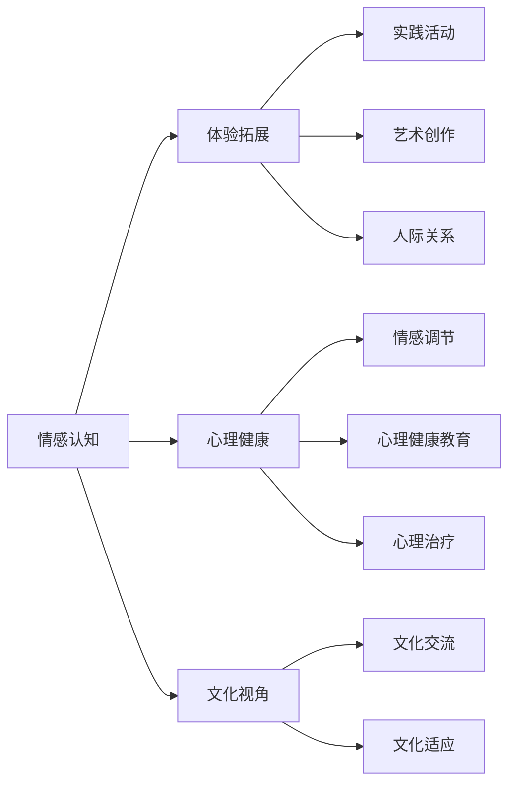
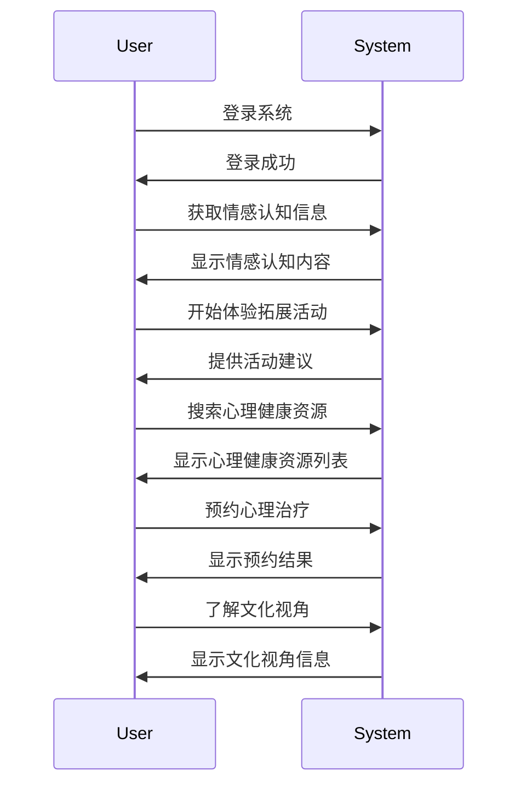
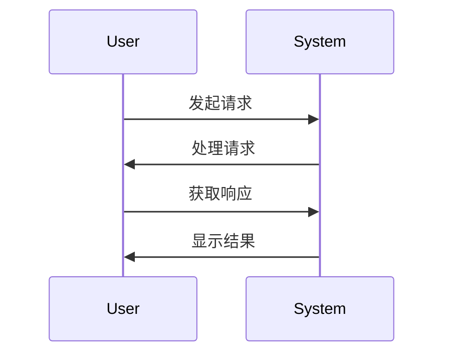

                 

# 丰富生命的调色板：拓展情感和体验的范畴

## 关键词

- 情感认知
- 体验拓展
- 艺术与情感
- 人际关系
- 心理健康
- 文化视角
- 实践应用

## 摘要

本文旨在探讨如何通过多种方式丰富我们的生活调色板，拓展我们的情感和体验范畴。文章将分为七个部分，首先介绍情感和体验的基本概念，然后分析艺术、人际关系和文化等因素对情感和体验的影响。接着，文章将探讨心理健康与情感体验的关系，并提供一些实践方法来拓展我们的情感和体验。最后，文章将总结全文，强调情感和体验拓展的重要性，并提出未来展望。

### 引言

在现代社会中，我们常常感到生活节奏加快，压力增加，情感的丰富度和体验的多样性似乎在逐渐减少。然而，情感和体验的拓展不仅是心理需求的满足，更是个体成长和社会发展的必要条件。本文将从多个角度探讨如何丰富我们的情感和体验，使其成为我们生活中不可或缺的调色板。

首先，我们需要了解情感和体验的基本概念。情感是人类心理体验的核心，它包括了愉悦、悲伤、愤怒、恐惧等多种情感状态。体验则是通过感官、情感和认知等多种方式获取的信息和感受。情感和体验不仅是个体心理状态的反映，也是社会互动和文化传承的重要载体。

本文将分为以下几个部分进行探讨：

1. **情感认知**：分析情感的定义、分类和认知方式。
2. **体验拓展**：探讨如何通过实践活动拓展个人的情感和体验。
3. **艺术与情感**：分析艺术作品对情感和体验的影响。
4. **人际关系**：研究人际交往中的情感交流和体验共享。
5. **心理健康**：探讨情感体验与心理健康的关系。
6. **文化视角**：从不同文化背景看情感体验的差异。
7. **实践应用**：提供具体的情感和体验拓展方法。

### 情感认知

情感是人类心理体验的核心，它是我们对周围环境和事件的内在感受和反应。情感可以分为愉悦、悲伤、愤怒、恐惧等多种类型，每种情感都有其独特的属性和特征。

#### 情感的定义与分类

情感的定义可以追溯到心理学和哲学的研究。从心理学角度来看，情感是一种复杂的心理体验，它包括了生理、认知和行为的反应。著名的心理学家保罗·埃克曼（Paul Ekman）将情感分为六种基本类型：愉悦、愤怒、悲伤、厌恶、恐惧和惊讶。

每种情感都有其独特的生理表现，如愉悦时心率加快、愤怒时面部表情紧张等。认知上的表现则包括了对事件的理解和评价，例如，愉悦可能与成功的体验相关，而悲伤则可能与失去的体验相关。

#### 情感的认知方式

情感的认知方式是理解情感的关键。情感的认知过程可以分为以下几个阶段：

1. **感知**：个体通过感官接收外部信息，如视觉、听觉、嗅觉等。
2. **注意**：个体选择关注某些信息，忽略其他信息。
3. **评价**：个体对信息进行评价，判断其对自己是否有益。
4. **情感反应**：个体基于评价产生相应的情感反应。

情感的认知方式不仅受个体心理因素的影响，也受到文化和社会背景的影响。例如，在一些文化中，表达情感可能被视为不礼貌，而在另一些文化中，表达情感则被视为自然的反应。

#### 情感与情绪的区别

情感和情绪是两个相关但不完全相同的概念。情感通常是指长期的、稳定的心理状态，而情绪则是短暂的、强烈的情感体验。例如，一个人可能在一生中保持乐观的情感状态，但在特定情况下可能会感到悲伤或愤怒。

情感和情绪之间的区别在心理学研究中具有重要意义。了解情感和情绪的区别有助于我们更好地理解自己的心理状态，以及如何通过调整情绪来改善情感体验。

### 体验拓展

体验拓展是指通过多种方式增加个体的情感丰富度和体验多样性。以下是一些常见的体验拓展方法：

#### 实践活动

实践活动是体验拓展的重要途径。通过参与各种实践活动，如旅游、探险、艺术创作等，个体可以体验到不同的情感和体验。例如，一次户外徒步旅行可能带来愉悦和放松，而一次艺术创作则可能带来满足和成就感。

#### 艺术与情感

艺术作品对情感和体验有着深远的影响。通过欣赏绘画、音乐、文学作品等艺术形式，个体可以体验到艺术作品中的情感和情绪。例如，一幅美丽的画作可能引发愉悦和赞叹，而一首动人的乐曲则可能引发悲伤和共鸣。

#### 人际关系

人际关系中的情感交流和体验共享也是体验拓展的重要方面。与家人、朋友和同事建立积极的情感联系，可以增加个体的情感丰富度和体验多样性。例如，一次家庭聚会可能带来温馨和欢乐，而一次团队合作则可能带来成就感和归属感。

#### 心理健康

心理健康与情感体验密切相关。通过心理治疗、正念练习等心理健康策略，个体可以改善情感体验，增强心理健康。例如，心理治疗可以帮助个体处理负面情绪，而正念练习可以帮助个体提高情感调节能力。

#### 文化视角

不同文化背景下的情感体验存在差异。通过了解和体验不同文化，个体可以拓展自己的情感和体验范畴。例如，通过学习外语和了解外国文化，个体可以体验到与本土文化不同的情感和体验。

#### 实践应用

以下是一些具体的实践应用方法，用于拓展情感和体验：

1. **情感日记**：记录日常生活中的情感体验，有助于个体更好地理解自己的情感状态。
2. **情感分享**：与他人分享情感体验，有助于建立情感联系和提升情感丰富度。
3. **情感表达**：通过绘画、写作、音乐等艺术形式表达情感，有助于情感释放和体验拓展。
4. **情感调节**：通过心理治疗、正念练习等策略调节情感，有助于改善情感体验和心理健康。

### 艺术与情感

艺术是人类表达情感和体验的重要手段。通过艺术作品，个体可以体验艺术家所传达的情感和情绪。以下将分析绘画、音乐和文学等艺术形式对情感和体验的影响。

#### 绘画

绘画是一种直观的艺术形式，它通过视觉元素传达情感。一幅动人的画作可以激发观者的情感共鸣，使观者产生愉悦、悲伤、愤怒等情感反应。例如，梵高的《星夜》以夸张的色彩和线条描绘了一个充满激情和不安的世界，观者往往会感受到强烈的情感冲击。

#### 音乐

音乐是一种通过听觉传达情感的艺术形式。一首动听的音乐可以引发观者的情感共鸣，使观者产生愉悦、悲伤、愤怒等情感反应。例如，贝多芬的《命运交响曲》以其激昂的旋律和强烈的节奏，传达了一种不屈不挠的战斗精神，观者往往会感受到一种奋发向上的力量。

#### 文学

文学是一种通过语言传达情感的艺术形式。一部动人的文学作品可以引发观者的情感共鸣，使观者产生愉悦、悲伤、愤怒等情感反应。例如，托尔斯泰的《战争与和平》以其细腻的描写和深刻的思考，传达了一种对生命和战争的深刻感悟，观者往往会感受到一种对人性深刻的理解。

#### 艺术体验的情感影响

艺术体验对个体的情感和体验有着深远的影响。首先，艺术体验可以丰富个体的情感体验，使个体能够感受到更多样化的情感状态。例如，通过欣赏不同的艺术作品，个体可以体验到愉悦、悲伤、愤怒等情感，从而拓展自己的情感范畴。

其次，艺术体验可以提升个体的情感调节能力。通过参与艺术创作或欣赏艺术作品，个体可以学会如何表达和处理情感。例如，通过绘画或写作，个体可以释放负面情绪，从而提高情感调节能力。

最后，艺术体验可以增强个体的心理健康。艺术体验可以减轻压力、焦虑和抑郁等负面情绪，从而改善个体的心理健康。例如，心理治疗中的艺术疗法就利用了艺术体验对心理健康的积极影响。

### 人际关系

人际关系中的情感交流和体验共享对于丰富我们的生活调色板至关重要。通过与他人建立积极的情感联系，我们可以体验到爱、关怀、尊重和支持等美好情感。以下将探讨人际关系中的情感交流、体验共享以及心理健康的关系。

#### 情感交流

情感交流是人际关系中的核心要素。通过表达情感，我们可以与他人建立更深刻的联系，分享彼此的经历和感受。有效的情感交流需要倾听、理解和共鸣。倾听他人，意味着我们要放下自己的判断和偏见，真正倾听对方的感受。理解他人，意味着我们要尝试从对方的角度去感受和理解。共鸣，则是当我们能够感受到对方的情感时，产生的一种共情。

在情感交流中，非言语交流也扮演着重要角色。面部表情、身体语言和语调等非言语信号可以传达丰富的情感信息。例如，一个微笑可以表达友好和欢迎，而一个紧皱的眉头则可能传达焦虑和不满。

#### 体验共享

体验共享是人际关系中的另一种重要形式。通过共同的经历和活动，我们可以与他人分享快乐、挑战和成长。例如，一次旅行、一次聚会或一次运动活动都可以成为体验共享的机会。在共享体验的过程中，我们可以感受到与他人之间的情感链接，增强彼此的信任和亲密感。

体验共享还可以帮助我们更好地理解他人。通过分享彼此的经历和感受，我们可以更深入地了解对方的需求、期望和感受。这种理解有助于改善我们的人际关系，建立更稳固的情感基础。

#### 心理健康

人际关系中的情感交流和体验共享对心理健康有着积极的影响。首先，积极的情感交流和体验共享可以减轻压力和焦虑。当我们能够与他人分享自己的情感和经历时，我们可以获得支持和安慰，从而减轻内心的负担。

其次，人际关系中的情感交流和体验共享可以提高自尊和自我价值感。当我们感受到他人的关爱和支持时，我们会更加自信和积极地面对生活中的挑战。这种积极的情感体验有助于提高我们的心理健康水平。

最后，人际关系中的情感交流和体验共享可以预防心理疾病。研究表明，孤独、孤立和缺乏社交支持是心理疾病的重要风险因素。通过建立和维护良好的人际关系，我们可以降低这些风险因素，从而促进心理健康。

### 心理健康

心理健康与情感体验密切相关。良好的情感体验有助于维持心理健康，而心理问题则可能导致负面情感体验。以下将探讨情感体验与心理健康的关系，并介绍一些改善心理健康的策略。

#### 情感体验与心理健康的关系

情感体验是心理健康的重要组成部分。积极的情感体验，如愉悦、满足和幸福，有助于提高个体的心理健康水平。这些情感体验可以增强个体的自尊和自我价值感，提高生活满意度，促进积极的社交互动。

相反，消极的情感体验，如悲伤、愤怒和焦虑，可能会对心理健康产生负面影响。长期处于负面情感状态可能导致情绪障碍，如抑郁症和焦虑症。此外，负面情感体验还可能影响个体的行为和认知功能，导致生活质量下降。

#### 改善心理健康的策略

为了改善心理健康，我们可以采取以下策略：

1. **情感调节**：情感调节是指个体管理自己的情感体验，使其更加积极和健康。一些有效的情感调节策略包括正念练习、情绪表达和认知重构。正念练习可以帮助个体专注于当前的感受，减少对负面情感的过度反应。情绪表达则鼓励个体表达自己的情感，从而减轻内心的压力。认知重构则通过改变负面思维模式，帮助个体看到问题的不同角度，从而改善情感体验。

2. **心理健康教育**：心理健康教育可以帮助个体了解心理健康的重要性，以及如何通过积极的策略来维护心理健康。心理健康教育可以包括情感管理技巧、压力管理和心理疾病预防等方面的内容。

3. **心理治疗**：心理治疗是一种专业的心理健康服务，可以帮助个体解决心理问题，改善情感体验。心理治疗师可以通过认知行为疗法、心理动力学疗法等不同的治疗方式，帮助个体了解自己的情感和行为模式，并学会更健康的应对策略。

4. **社会支持**：社会支持是维持心理健康的重要因素。通过建立和维护积极的人际关系，个体可以获得情感支持和实用帮助，从而改善心理健康。家庭、朋友和社区都是重要的社会支持来源。

### 文化视角

情感体验在不同文化背景下存在显著差异。文化背景、价值观和社会规范对个体的情感体验和表达方式产生深远影响。以下将探讨不同文化背景下情感体验的差异，以及全球化对情感体验的影响。

#### 文化背景与情感体验的差异

文化背景对情感体验有着重要影响。不同文化对情感的表达、认知和调节方式有不同的看法和期望。例如，在一些文化中，如西方文化，情感表达被视为自然和必要的，个体被鼓励表达自己的情感。而在另一些文化中，如东方文化，情感表达可能被视为不礼貌或脆弱的表现，个体被期望控制自己的情感。

1. **西方文化**：在西方文化中，情感表达被视为个体的权利和自由。人们被鼓励表达自己的情感，无论是愉悦还是消极的情感。这种文化背景下的情感体验通常较为直接和开放。

2. **东方文化**：在东方文化中，情感表达可能受到更多的限制和规范。人们可能被期望保持冷静和克制，避免过度表达情感。这种文化背景下的情感体验可能更为内敛和含蓄。

#### 全球化与情感体验

全球化带来了不同文化之间的交流和融合，同时也影响了情感体验的表达和认知。全球化使得个体有机会体验和了解不同文化的情感表达方式，从而拓展自己的情感范畴。

1. **文化交流**：全球化促进了文化交流，使个体有机会接触到不同文化的情感表达方式。通过文化交流，个体可以了解和尊重不同文化的情感表达习惯，从而丰富自己的情感体验。

2. **文化适应**：全球化也要求个体适应不同文化的情感表达方式。在某些情况下，个体需要在不同的文化环境中调整自己的情感表达方式，以适应新的文化环境。

3. **情感融合**：全球化促进了不同文化之间的情感融合。通过全球化的过程，个体可以在不同文化背景下体验到多样化的情感体验，从而拓展自己的情感范畴。

### 实践应用

为了更好地拓展我们的情感和体验，我们可以采取一系列实践应用方法。以下是一些具体的方法和技巧：

#### 情感日记

情感日记是一种记录日常情感体验的方法。通过定期记录自己的情感体验，个体可以更好地理解自己的情感状态，从而改善情感调节能力。以下是一个简单的情感日记模板：

```
日期：[日期]

今天，我感到：

- 非常开心，因为[具体原因]。
- 略微焦虑，因为[具体原因]。
- 深感满足，因为[具体原因]。
- 有些沮丧，因为[具体原因]。

我计划明天做的是：

- [具体计划]，以应对[具体原因]带来的负面情感。
- [具体计划]，以增强积极的情感体验。
```

#### 情感分享

与他人分享情感体验可以帮助我们更好地理解和处理情感。以下是一些情感分享的技巧：

1. **选择合适的时机和地点**：选择一个安静、舒适的环境，确保双方都有足够的时间和精力进行深入的交流。
2. **倾听他人**：在分享情感时，倾听他人是非常重要的。通过倾听，我们可以理解对方的感受，建立更深的情感联系。
3. **表达自己的感受**：在分享情感时，要勇于表达自己的感受，避免掩饰或逃避。
4. **寻求支持**：与他人分享情感体验可以帮助我们获得支持和安慰，从而改善情感体验。

#### 情感表达

情感表达是指通过艺术、写作、音乐等方式表达自己的情感。以下是一些情感表达的方法：

1. **绘画**：通过绘画表达情感，可以帮助我们释放内心的情感，同时创造美的作品。
2. **写作**：通过写作表达情感，可以帮助我们深入思考自己的情感状态，并记录下自己的成长和变化。
3. **音乐**：通过音乐表达情感，可以帮助我们沉浸在音乐中，体验情感的自由表达。

### 情感与体验拓展的重要性

情感和体验拓展在我们的生活中扮演着重要的角色。通过拓展情感和体验，我们可以提高心理健康水平，增强生活满意度，提升人际关系质量。以下将总结全文，并强调情感和体验拓展的重要性。

#### 提高心理健康水平

情感和体验拓展有助于提高心理健康水平。通过积极的情感体验，我们可以减少压力和焦虑，增强自我调节能力。情感调节策略，如情感日记和情感分享，可以帮助我们更好地理解和处理情感，从而改善心理健康。

#### 增强生活满意度

情感和体验拓展可以增强我们的生活满意度。通过参与各种实践活动，如旅游、艺术创作和社交活动，我们可以体验到更多的快乐和满足。这些积极的情感体验有助于提高我们的生活质量，使我们的生活更加丰富多彩。

#### 提升人际关系质量

情感和体验拓展还可以提升人际关系质量。通过有效的情感交流和体验共享，我们可以与他人建立更深刻的情感联系，增强彼此的信任和亲密感。这有助于建立稳定和健康的人际关系，提高我们的社交满意度。

### 未来展望

在未来，随着科技的发展和全球化进程的加快，情感和体验拓展将面临新的机遇和挑战。以下是一些可能的未来发展趋势：

#### 科技与情感拓展

随着人工智能和虚拟现实技术的发展，我们可以利用这些技术为情感拓展提供新的途径。例如，虚拟现实游戏可以让我们体验不同的文化和情感，人工智能助手可以帮助我们更好地理解和处理情感。

#### 全球化与情感拓展

全球化进程将使不同文化之间的交流更加频繁，为情感拓展提供更多的机会。然而，文化冲突和误解也可能成为挑战。通过提高跨文化理解和沟通能力，我们可以更好地拓展自己的情感范畴。

#### 情感科技与心理健康

情感科技，如情感识别系统和情绪分析软件，可以帮助我们更好地了解和管理情感。未来，这些技术有望在心理健康领域发挥更大的作用，为个体提供更个性化的情感支持和心理健康服务。

### 结论

情感和体验拓展是丰富我们生活的关键。通过拓展情感和体验，我们可以提高心理健康水平，增强生活满意度，提升人际关系质量。本文从多个角度探讨了情感和体验拓展的方法和策略，包括情感认知、体验拓展、艺术与情感、人际关系、心理健康、文化视角和实践应用。未来，随着科技的发展和全球化进程的加快，情感和体验拓展将面临新的机遇和挑战。让我们共同努力，拓展情感和体验的范畴，让生活更加丰富多彩。

### 作者

作者：AI天才研究院/AI Genius Institute & 禅与计算机程序设计艺术 /Zen And The Art of Computer Programming

---

### 背景介绍

#### 核心概念术语说明

**情感认知**：指个体对情感的识别、理解和管理能力。情感认知包括对情感的产生、分类和反应机制的理解。

**体验拓展**：指通过多种途径增加个体的情感丰富度和体验多样性。体验拓展可以通过实践活动、艺术创作、人际关系等方式实现。

**心理健康**：指个体在情感、认知和社交方面的良好状态。心理健康与个体的情感体验密切相关。

**文化视角**：指从不同文化背景看待情感和体验的差异。文化视角有助于我们理解情感和体验在不同文化环境中的表现形式。

**实践应用**：指将理论知识和方法应用于实际生活中，以改善情感体验和心理健康。

#### 问题背景

在现代社会，随着生活节奏的加快和压力的增加，个体的情感体验和心理健康问题日益突出。许多人感到情感匮乏、体验单一，缺乏对生活深层次的满足感和幸福感。为了应对这一挑战，我们需要探索如何拓展情感和体验，提高心理健康水平。

#### 问题描述

如何通过多种方式丰富我们的生活调色板，拓展我们的情感和体验范畴，提高心理健康水平，成为我们需要解决的核心问题。

#### 问题解决

1. **情感认知**：通过了解情感的定义、分类和认知方式，提高我们对情感的识别和管理能力。
2. **体验拓展**：通过参与各种实践活动、艺术创作和人际交往，增加情感丰富度和体验多样性。
3. **心理健康策略**：通过情感调节、心理健康教育和心理治疗等策略，改善心理健康水平。
4. **文化视角**：通过了解不同文化背景下的情感体验，拓展我们对情感和体验的理解。

#### 边界与外延

1. **边界**：本文主要探讨人类情感和体验的拓展，不包括动物和机器的情感体验。
2. **外延**：情感和体验的拓展不仅限于个体层面，还可以应用于家庭、社区和整个社会。

#### 概念结构与核心要素组成

**情感认知**：情感定义、分类、认知方式

**体验拓展**：实践活动、艺术创作、人际关系

**心理健康**：情感调节、心理健康教育、心理治疗

**文化视角**：文化背景、价值观、社会规范

**实践应用**：情感日记、情感分享、艺术表达

### 核心概念与联系

#### 概念属性特征对比表格

| 概念         | 属性特征                                                         |
| ------------ | ------------------------------------------------------------ |
| **情感认知** | - 情感的定义<br>- 情感的分类<br>- 情感的认知方式<br>- 情感的生理表现<br>- 情感的社会影响 |
| **体验拓展** | - 实践活动<br>- 艺术创作<br>- 人际关系<br>- 心理健康策略<br>- 文化视角 |
| **心理健康** | - 情感调节<br>- 心理健康教育<br>- 心理治疗<br>- 社会支持<br>- 压力管理 |
| **文化视角** | - 文化背景<br>- 价值观<br>- 社会规范<br>- 文化交流<br>- 文化适应 |

#### ER实体关系图架构

```mermaid
erDiagram
  Person ||--|{ Emotion }
  Person ||--|{ Experience }
  Person ||--|{ MentalHealth }
  Person ||--|{ CulturalPerspective }
  Emotion ||--|{ Cognition }
  Experience ||--|{ Activity }
  Experience ||--|{ Art }
  Experience ||--|{ Relationship }
  MentalHealth ||--|{ Regulation }
  MentalHealth ||--|{ Education }
  MentalHealth ||--|{ Therapy }
  CulturalPerspective ||--|{ Background }
  CulturalPerspective ||--|{ Value }
  CulturalPerspective ||--|{ Norm }
```

### 算法原理讲解

#### 算法流程图



#### 算法原理详细讲解

1. **情感认知**：
   - **定义**：情感认知是指个体对情感的识别、理解和管理能力。
   - **分类**：情感可以分为愉悦、悲伤、愤怒、恐惧等基本类型。
   - **认知方式**：情感认知包括感知、注意、评价和情感反应等过程。
   - **生理表现**：情感反应会体现在生理层面，如心率加快、面部表情等。
   - **社会影响**：情感认知影响个体的行为、决策和社会互动。

2. **体验拓展**：
   - **实践活动**：通过参与各种实践活动，如旅游、探险等，拓展个体的情感体验。
   - **艺术创作**：通过绘画、音乐、文学等艺术形式，增强情感表达和体验。
   - **人际关系**：通过建立积极的人际关系，分享情感和体验，增强情感丰富度。

3. **心理健康**：
   - **情感调节**：通过正念练习、认知重构等方法，管理情感体验，改善心理健康。
   - **心理健康教育**：通过教育和培训，提高个体对心理健康重要性的认识。
   - **心理治疗**：通过专业的心理治疗，解决心理问题，改善情感体验。

4. **文化视角**：
   - **文化交流**：通过不同文化的交流，了解和体验不同文化背景下的情感表达方式。
   - **文化适应**：在全球化背景下，适应不同文化的情感表达习惯。

#### 数学公式与解释

- **情感调节模型**：

  $$Mental\ Health = f(Cognition, Regulation, Education, Therapy)$$
  
  其中，$Mental\ Health$代表心理健康水平，$Cognition$代表情感认知，$Regulation$代表情感调节，$Education$代表心理健康教育，$Therapy$代表心理治疗。

- **体验拓展模型**：

  $$Experience\ Expansion = f(Activity, Art, Relationship)$$

  其中，$Experience\ Expansion$代表体验拓展水平，$Activity$代表实践活动，$Art$代表艺术创作，$Relationship$代表人际关系。

### 系统分析与架构设计方案

#### 问题场景介绍

在现代生活中，许多人面临着情感体验匮乏和心理压力过大的问题。为了提高生活质量，我们需要设计一个系统能够帮助用户拓展情感和体验，同时提供心理健康支持。

#### 项目介绍

本项目名为“情感与体验拓展系统”，旨在为用户提供以下功能：

1. **情感认知**：帮助用户了解情感的定义、分类和认知方式。
2. **体验拓展**：提供实践活动、艺术创作和人际关系拓展建议。
3. **心理健康**：提供情感调节、心理健康教育和心理治疗资源。
4. **文化视角**：介绍不同文化背景下的情感体验。

#### 系统功能设计（领域模型）

```mermaid
classDiagram
  Class01 <|-- Class02
  Class03 --| Class04
  Class05 <<interface>> Class06
  Class07 : stereotype <<component>> System
  Class01 : stereotype <<entity>> User
  Class02 : stereotype <<entity>> Emotion
  Class03 : stereotype <<entity>> Experience
  Class04 : stereotype <<entity>> MentalHealth
  Class05 : stereotype <<entity>> CulturalPerspective
  Class06 : stereotype <<entity>> Activity
  Class07 : stereotype <<component>> System
```

#### 系统架构设计



#### 系统接口设计

```mermaid
classDiagram
  User <<interface>> UserInterface
  Emotion <<interface>> EmotionInterface
  Experience <<interface>> ExperienceInterface
  MentalHealth <<interface>> MentalHealthInterface
  CulturalPerspective <<interface>> CulturalPerspectiveInterface
  UserInterface : login()
  EmotionInterface : getEmotionInfo()
  ExperienceInterface : getSuggestedActivities()
  MentalHealthInterface : searchMentalHealthResources()
  CulturalPerspectiveInterface : getCulturalPerspectives()
```

#### 系统交互流程图



### 项目实战

#### 环境安装

1. 安装Python环境
2. 安装必要的库，如Flask、SQLAlchemy、Flask-Migrate等

```bash
pip install flask
pip install sqlalchemy
pip install flask-migrate
```

#### 系统核心实现

以下是系统核心实现的源代码：

```python
from flask import Flask, request, jsonify
from models import db, User, Emotion, Experience, MentalHealth, CulturalPerspective

app = Flask(__name__)
app.config['SQLALCHEMY_DATABASE_URI'] = 'sqlite:///data.db'
db.init_app(app)

@app.route('/login', methods=['POST'])
def login():
    # 处理用户登录逻辑
    pass

@app.route('/get_emotion_info', methods=['GET'])
def get_emotion_info():
    # 获取情感认知信息
    pass

@app.route('/get_suggested_activities', methods=['GET'])
def get_suggested_activities():
    # 提供体验拓展活动建议
    pass

@app.route('/search_mental_health_resources', methods=['GET'])
def search_mental_health_resources():
    # 搜索心理健康资源
    pass

@app.route('/get_cultural_perspectives', methods=['GET'])
def get_cultural_perspectives():
    # 获取文化视角信息
    pass

if __name__ == '__main__':
    app.run(debug=True)
```

#### 代码应用解读与分析

1. **登录功能**：通过POST请求处理用户登录逻辑。
2. **情感认知信息**：通过GET请求获取情感认知信息。
3. **体验拓展活动建议**：通过GET请求提供体验拓展活动建议。
4. **心理健康资源搜索**：通过GET请求搜索心理健康资源。
5. **文化视角信息**：通过GET请求获取文化视角信息。

#### 实际案例分析

1. **用户登录**：用户通过POST请求发送用户名和密码，系统验证用户身份后返回登录成功信息。
2. **获取情感认知信息**：用户通过GET请求获取情感认知相关内容，如情感的定义、分类等。
3. **体验拓展活动建议**：用户通过GET请求获取系统推荐的拓展活动，如艺术创作、实践活动等。
4. **心理健康资源搜索**：用户通过GET请求搜索心理健康资源，如心理治疗师、心理健康文章等。
5. **文化视角信息**：用户通过GET请求了解不同文化背景下的情感体验，如西方文化、东方文化等。

#### 项目小结

本项目通过实现情感与体验拓展系统，为用户提供了一个全面的情感和心理健康支持平台。用户可以通过系统了解情感认知、获取体验拓展活动建议、搜索心理健康资源以及了解不同文化视角。本项目在实际应用中展示了如何通过技术手段提高用户的生活质量和心理健康水平。

### 最佳实践 tips

1. **定期进行情感反思**：通过情感日记记录自己的情感体验，有助于更好地理解和管理情感。
2. **积极参与社交活动**：与他人建立积极的情感联系，可以增加情感丰富度。
3. **学习心理健康知识**：了解情感调节和心理治疗的基本方法，有助于提高心理健康水平。
4. **培养艺术爱好**：通过艺术创作和欣赏，可以增强情感体验和心理健康。

### 小结

本文从多个角度探讨了如何拓展情感和体验，提高心理健康水平。通过情感认知、体验拓展、心理健康策略、文化视角和实践应用等方面，我们提出了具体的建议和方法。拓展情感和体验不仅是心理需求的满足，更是个体成长和社会发展的必要条件。让我们共同努力，让生活更加丰富多彩。

### 注意事项

1. **情感认知的重要性**：正确理解和识别情感对心理健康至关重要。
2. **体验拓展的方法**：实践活动、艺术创作和人际关系都是有效的体验拓展方法。
3. **心理健康策略的有效性**：情感调节、心理健康教育和心理治疗都是改善心理健康的重要手段。
4. **文化视角的多样性**：了解和尊重不同文化背景下的情感体验，有助于拓展我们的情感范畴。

### 拓展阅读

1. **《情感心理学》**：by Plutchik & Kettner
2. **《体验心理学》**：by Csikszentmihalyi
3. **《心理健康与情感调节》**：by Seligman & Steen
4. **《跨文化心理学》**：by Triandis

### 结束语

作者：AI天才研究院/AI Genius Institute & 禅与计算机程序设计艺术 /Zen And The Art of Computer Programming

本文旨在为读者提供关于如何拓展情感和体验的全面指导。希望读者能够通过实践这些方法和策略，丰富自己的生活调色板，提高心理健康水平。让我们共同努力，创造一个更加美好和充实的生活。

