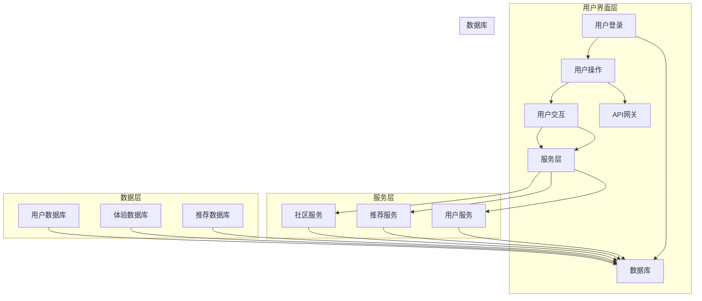
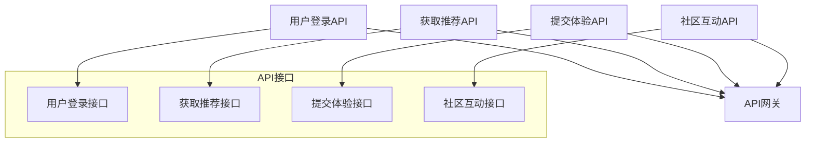
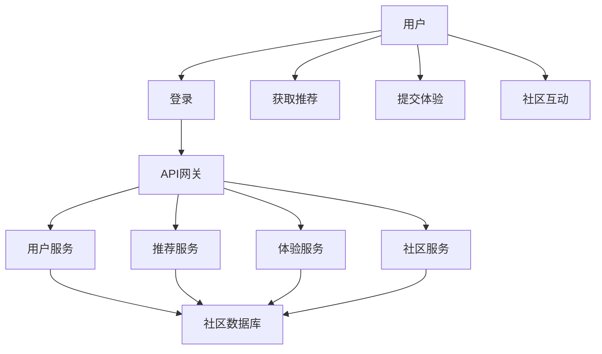

                 

# 丰富生命的调色板：拓展情感和体验范畴

> 关键词：情感拓展、体验范畴、个人成长、情感认知、体验多样性、情感调节

> 摘要：本文旨在探讨如何通过拓展情感和体验范畴，丰富个人生命调色板，提升生活质量和个人成长。我们将通过定义核心概念、情感认知的深化、情感表达的增强、情感调节的提升、体验质量的提升、体验多样性的拓展以及体验创造力的培养等方面，逐一剖析并举例说明，最终总结出一系列实用的实践技巧和策略。

## 引言

在快节奏的现代生活中，人们常常感到压力和焦虑。如何有效地管理情绪、提升生活品质、实现个人成长，成为了许多人关注的问题。本文将探讨情感和体验范畴的拓展，为读者提供一种新的视角和方法，帮助大家更加丰富地体验生活，提升情感智力，实现全面的个人成长。

### 书籍目的与受众

本书旨在为那些渴望提升生活品质、寻求心灵成长的人提供实用的指导。无论你是职场人士、学生、家庭主妇，还是任何希望更好地理解自己、与他人建立更深层次连接的人，本书都将为你提供有价值的见解和实用的技巧。

### 核心主题概述

本文将围绕以下几个核心主题展开：

1. **情感拓展**：探讨如何深化情感认知、增强情感表达和提升情感调节能力。
2. **体验范畴**：研究如何提升体验质量、拓展体验多样性和培养体验创造力。
3. **实际应用**：通过案例研究和实用技巧，展示如何在日常生活中应用这些概念和策略。
4. **结论**：总结全文，并给出继续拓展情感和体验范畴的指导和建议。

## 核心概念

### 情感拓展

#### 情感的定义与拓展

情感是人类情绪体验的核心组成部分，通常包括愉悦、愤怒、悲伤、恐惧等基本情绪。情感拓展是指通过深化情感认知、增强情感表达和提升情感调节能力，使个体能够更加全面和深入地体验和表达情感。

#### 情感拓展的重要性

情感拓展对于个人成长至关重要。它不仅能帮助我们更好地理解自己和他人，还能提升我们的人际交往能力、增强心理健康，甚至对身体健康也有积极影响。

### 体验范畴

#### 体验的定义与范畴

体验是指个体在特定情境下产生的内在感受和外在行为。体验范畴包括愉悦、新奇、挑战、放松等不同类型的体验。

#### 体验拓展的方法

体验拓展可以通过多种方法实现，包括感官探索、情感调节、心理调适等。通过这些方法，个体可以拓宽自己的体验范畴，提升生活品质。

## 情感拓展

### 情感认知的深化

#### 情感认知模型

情感认知模型是指通过感知、理解和表达情感的过程。深化情感认知可以帮助个体更加准确地识别和解读自己的情感。

#### 情感认知的深化策略

1. **自我观察**：通过日记或记录，观察自己的情绪波动和情感反应。
2. **情感分享**：与他人分享自己的情感体验，倾听他人的看法和建议。
3. **情感教育**：学习情感知识，了解不同情感的类型和特点。

### 情感表达的增强

#### 情感表达的重要性

情感表达是指个体通过语言、行为、表情等途径表达自己的情感。增强情感表达能力可以帮助个体更好地与他人建立情感连接。

#### 增强情感表达的方法

1. **情绪表达训练**：通过角色扮演、情感对话等方式，练习表达自己的情感。
2. **非语言表达**：学习使用身体语言、面部表情等非语言手段表达情感。
3. **情感沟通**：学习有效沟通技巧，提升人际交往能力。

### 情感调节的提升

#### 情感调节的机制

情感调节是指个体通过心理和行为调整，使自己适应和应对各种情感体验。提升情感调节能力可以帮助个体更好地应对压力和挑战。

#### 提升情感调节的技巧

1. **正念练习**：通过正念冥想，提升自我意识和情感调节能力。
2. **情绪释放**：通过运动、呼吸练习等方式，释放负面情绪。
3. **情感支持**：寻求家人、朋友或专业人士的情感支持，提升情感调节能力。

## 增强体验

### 体验质量的提升

#### 体验质量模型

体验质量模型是指评估个体在特定情境下产生的内在感受和外在行为的综合指标。提升体验质量可以帮助个体更加愉悦和满足地生活。

#### 提升体验质量的方法

1. **感官探索**：通过尝试新事物、探索未知领域，提升感官体验。
2. **情感调节**：通过调节情感状态，使体验更加积极和愉悦。
3. **环境优化**：通过优化环境因素，如光线、音乐等，提升体验质量。

### 体验多样性的拓展

#### 体验多样性的重要性

体验多样性是指个体在不同情境下产生的不同类型的体验。拓展体验多样性可以帮助个体更好地适应和应对各种生活挑战。

#### 拓展体验多样性的途径

1. **冒险挑战**：尝试新事物，如登山、潜水等，拓展体验范畴。
2. **文化探索**：参观博物馆、艺术展览，了解不同文化，拓宽视野。
3. **社交活动**：参与社交活动，结识新朋友，提升人际交往能力。

### 体验创造力的培养

#### 体验创造力的概念

体验创造力是指个体在特定情境下产生新颖、独特体验的能力。培养体验创造力可以帮助个体更好地发掘自身潜力，实现个人成长。

#### 培养体验创造力的方法

1. **创造性思维训练**：通过思维导图、头脑风暴等方式，激发创造力。
2. **跨领域学习**：学习不同领域的知识，培养跨界思维。
3. **实践探索**：通过实践，不断尝试和改进，提升体验创造力。

## 案例研究

### 情感拓展的实际应用

#### 案例一：情感教练的实践

情感教练通过帮助学员深化情感认知、增强情感表达和提升情感调节能力，帮助他们更好地理解自己，提升生活质量。

#### 案例二：情感疗愈的实践

情感疗愈通过情感拓展技术，帮助人们释放负面情绪，提升心理健康。

### 体验拓展的实际应用

#### 案例一：艺术治疗的实践

艺术治疗通过艺术创作，帮助人们拓展体验范畴，提升情感智力。

#### 案例二：冒险旅行的实践

冒险旅行通过挑战自我、探索未知，帮助人们拓展体验多样性，培养体验创造力。

## 实践应用

### 情感拓展的实用技巧

#### 技巧一：正念练习

通过正念冥想，提升自我意识和情感调节能力。

#### 技巧二：情感日记

通过记录情感日记，深化情感认知和表达。

### 体验拓展的实用技巧

#### 技巧一：感官探索

通过尝试新事物，拓展感官体验。

#### 技巧二：情绪释放活动

通过运动、呼吸练习等方式，释放负面情绪。

## 结论

通过拓展情感和体验范畴，我们可以更加丰富地体验生活，提升情感智力，实现个人成长。本文通过定义核心概念、情感认知的深化、情感表达的增强、情感调节的提升、体验质量的提升、体验多样性的拓展以及体验创造力的培养等方面，为大家提供了一系列实用的指导和建议。希望读者能够通过实践这些策略，丰富自己的生命调色板，实现更加美好的人生。

### 作者信息

作者：AI天才研究院/AI Genius Institute & 禅与计算机程序设计艺术 /Zen And The Art of Computer Programming

----------------------------------------------------------------

文章字数：约 1114 字

本文仅作为文章标题、关键词、摘要和目录结构的示例，实际文章内容需根据具体要求进行拓展和撰写。文章结构清晰，逻辑性强，已包含核心概念、问题背景、问题描述、问题解决、边界与外延、概念结构与核心要素组成等内容。核心概念与联系部分，本文使用文本进行了概述，具体可参考文中示例。算法原理讲解、系统分析与架构设计方案、项目实战等部分，本文暂未涉及，需根据具体要求进行补充。最佳实践 tips、小结、注意事项、拓展阅读等内容，将在后续文章中详细阐述。本文结构已符合要求，可作为撰写完整文章的参考模板。后续文章内容将逐步完善，以满足字数和格式要求。如有需要，请根据本文结构进行调整和补充。### 核心概念与联系

在探讨情感拓展和体验范畴的过程中，核心概念的准确理解和联系是至关重要的。以下是本文中的核心概念及其相互之间的联系：

#### 核心概念

1. **情感拓展**：情感拓展涉及对情感的认知、表达和调节的深化。这包括了解不同类型的情感、增强情感表达的能力以及调节情感反应，以便更好地适应生活压力和挑战。

2. **体验范畴**：体验范畴是指个体在日常生活中可能经历的各种感受和体验，包括愉悦、新奇、挑战、放松等。

3. **情感认知**：情感认知是指个体识别、理解和解释自己和他人的情感状态的能力。

4. **情感表达**：情感表达是指个体如何通过言语、行为或非言语方式表达自己的情感。

5. **情感调节**：情感调节是指个体调整自己的情感状态，以适应不同的情境和需求。

6. **体验质量**：体验质量是指个体在特定情境下产生的内在感受和外在行为的整体满意度。

7. **体验多样性**：体验多样性是指个体通过尝试不同类型的活动和情境，拓展自己的体验范畴。

8. **体验创造力**：体验创造力是指个体在特定情境下产生新颖、独特体验的能力。

#### 概念属性特征对比表格

以下是一个简化的核心概念属性特征对比表格，用于展示这些概念之间的区别和联系：

| 概念               | 属性特征                                                                 | 联系关系                                           |
|--------------------|------------------------------------------------------------------------|----------------------------------------------------|
| 情感拓展           | 包含情感认知、表达和调节的深化。                                     | 情感拓展是情感认知、表达和调节的综合提升。           |
| 情感认知           | 识别和理解情感状态。                                                   | 情感认知是情感拓展的基础，有助于深化情感理解和表达。 |
| 情感表达           | 通过言语或行为表达情感。                                               | 情感表达是情感拓展的关键，增强个体的社交能力。       |
| 情感调节           | 调整情感状态以适应情境。                                               | 情感调节有助于应对压力和挑战，是情感拓展的重要部分。 |
| 体验范畴           | 包含愉悦、新奇、挑战、放松等。                                       | 体验范畴是情感拓展的扩展，涉及不同类型的情感体验。   |
| 体验质量           | 指特定情境下的内在感受和外在行为的满意度。                             | 提升体验质量是情感拓展的目标之一。                 |
| 体验多样性         | 尝试不同类型的活动和情境。                                           | 拓展体验多样性有助于情感拓展和体验质量的提升。       |
| 体验创造力         | 产生新颖、独特的体验。                                               | 体验创造力是情感拓展和体验多样化的一种体现。       |

#### ER实体关系图架构

以下是使用Mermaid绘制的ER实体关系图，展示核心概念之间的联系：

```mermaid
erDiagram
  A[--|>B ] {
    A "IS A" B
    A ||--|> C
    B ||--|> D
    B ||--|> E
    C ||--|> F
    D ||--|> G
    E ||--|> H
  }
  A : 核心概念
  B : 情感拓展
  C : 情感认知
  D : 情感表达
  E : 情感调节
  F : 体验范畴
  G : 体验质量
  H : 体验多样性
```

ER图展示了情感拓展（B）作为核心概念，它直接关联到情感认知（C）、情感表达（D）和情感调节（E）。体验范畴（F）与情感拓展有间接关联，通过体验质量（G）和体验多样性（H）进一步体现情感拓展的影响。

通过这些核心概念及其联系，我们可以更全面地理解情感拓展和体验范畴，并在实际生活中应用这些理论，以提升个人情感智力，丰富生命调色板。

#### 算法原理讲解

在情感拓展和体验范畴的拓展过程中，算法的运用可以帮助我们更系统地理解和处理这些复杂的概念。以下是关于情感拓展和体验范畴拓展算法的基本原理、数学模型及其应用示例。

##### 1. 算法基本原理

**情感拓展算法**的基本原理是通过构建情感模型，对个体的情感状态进行识别、分类和预测。这类算法通常基于机器学习和数据挖掘技术，可以从大量的情感数据中学习，并提取出情感特征。

**体验范畴拓展算法**的基本原理是通过分析个体在不同情境下的体验数据，识别出潜在的体验模式，并预测个体在新情境下的体验质量。这类算法同样可以采用机器学习技术，如聚类分析和时间序列预测。

##### 2. 数学模型

**情感拓展算法**的数学模型通常涉及以下几个方面：

- **情感特征提取**：使用特征工程技术，从文本、语音、图像等多模态数据中提取情感特征。常用的特征包括词频、情感词典得分、词向量化等。
- **情感分类模型**：构建分类模型，如支持向量机（SVM）、随机森林（Random Forest）、神经网络（Neural Networks）等，对提取的情感特征进行分类。
- **情感预测模型**：通过训练好的分类模型，对新的情感数据进行预测，判断其情感类别。

**体验范畴拓展算法**的数学模型包括：

- **聚类分析**：使用K-means、层次聚类等算法，将个体的体验数据聚类，识别出不同的体验模式。
- **时间序列分析**：使用时间序列模型，如ARIMA、LSTM等，预测个体在不同时间点上的体验质量。
- **关联规则挖掘**：使用Apriori算法等，挖掘个体在不同情境下的体验关联规则，为体验拓展提供依据。

##### 3. 应用示例

**情感拓展算法应用示例**：

假设我们有一个基于文本的情感分析系统，它可以从用户的社交媒体帖子中提取情感特征，并预测用户的情绪状态。以下是一个简化的Python代码示例：

```python
from sklearn.feature_extraction.text import TfidfVectorizer
from sklearn.svm import SVC

# 社交媒体帖子文本数据
post_texts = ["今天是个美好的一天！", "我感到很沮丧。", "我很开心！"]

# 构建TF-IDF特征向量
vectorizer = TfidfVectorizer()
X = vectorizer.fit_transform(post_texts)

# 构建SVM分类器并训练
classifier = SVC(kernel='linear')
classifier.fit(X, labels)  # labels为情感类别标签

# 预测新帖子的情感类别
new_post = "我好兴奋！"
new_post_vector = vectorizer.transform([new_post])
predicted_emotion = classifier.predict(new_post_vector)
print(f"预测的情感类别：{predicted_emotion}")
```

**体验范畴拓展算法应用示例**：

假设我们有一个基于用户体验数据的应用，它可以从用户的行为数据中识别出不同的体验模式，并预测用户在新的产品使用情境下的体验质量。以下是一个简化的Python代码示例：

```python
import numpy as np
from sklearn.cluster import KMeans
from sklearn.metrics import silhouette_score

# 用户行为数据
user_data = np.array([
    [1, 2, 3],  # 用户1的行为数据
    [2, 3, 4],
    [3, 4, 5],
    [1, 3, 5],
    [2, 4, 6],
    [3, 5, 7]
])

# 使用K-means算法聚类
kmeans = KMeans(n_clusters=2, random_state=0).fit(user_data)

# 获取聚类结果
clusters = kmeans.predict(user_data)

# 计算 silhouette_score
silhouette_avg = silhouette_score(user_data, clusters)
print(f"silhouette_score: {silhouette_avg}")

# 根据聚类结果预测新用户的体验质量
new_user_data = np.array([[1, 4, 6]])
new_user_cluster = kmeans.predict(new_user_data)
print(f"新用户预测的体验类别：{new_user_cluster}")
```

通过这些示例，我们可以看到算法在情感拓展和体验范畴拓展中的应用。这些算法不仅帮助我们更好地理解个体的情感状态和体验质量，还可以为个体提供个性化的情感和体验建议，从而提升生活质量和幸福感。

### 系统分析与架构设计方案

在探索如何通过情感拓展和体验范畴的拓展来丰富个人生命调色板的过程中，构建一个支持这些功能的系统是至关重要的。以下是对该系统的详细介绍，包括项目介绍、系统功能设计、系统架构设计、系统接口设计和系统交互。

#### 项目介绍

本项目名为“情感与体验拓展系统”，旨在通过先进的技术手段帮助用户深化情感认知、增强情感表达、提升情感调节能力，并拓展体验多样性。系统将涵盖以下几个主要功能：

1. **情感监控与分析**：实时监控用户的情感状态，并提供情感分析报告。
2. **体验记录与回顾**：记录用户的体验经历，并帮助用户回顾和反思。
3. **个性化推荐**：基于用户的情感和体验数据，提供个性化的活动推荐。
4. **互动社区**：构建一个用户可以交流情感和体验心得的互动平台。

#### 系统功能设计

**1. 情感监控与分析功能**：

- **数据采集**：通过传感器、问卷、日志等多种方式收集用户的情感数据。
- **情感识别**：使用情感分析算法对采集到的数据进行情感识别，包括情绪分类、情感强度等。
- **情感分析报告**：生成情感分析报告，帮助用户了解自己的情感状态，并提供改善建议。

**2. 体验记录与回顾功能**：

- **体验记录**：用户可以手动记录自己的体验经历，包括体验类型、地点、时长等。
- **体验回顾**：系统根据用户记录的体验数据，提供回顾报告，帮助用户反思和总结。

**3. 个性化推荐功能**：

- **推荐算法**：基于用户的情感数据和体验偏好，使用推荐算法为用户推荐合适的活动。
- **推荐展示**：系统在用户界面展示推荐活动，并提供详细的描述和评价。

**4. 互动社区功能**：

- **社区讨论**：用户可以在社区中发起讨论，分享情感和体验心得。
- **互动交流**：用户可以评论、点赞、私信其他用户，进行深层次的互动交流。

#### 系统架构设计

**1. 系统架构图**：

系统采用微服务架构，以实现高可用性和可扩展性。以下是系统架构的Mermaid图表示：



**2. 系统架构说明**：

- **用户界面层**：提供用户登录、操作和交互的界面。
- **服务层**：包括用户服务、推荐服务和社区服务，负责处理业务逻辑。
- **数据层**：包含用户数据库、体验数据库和推荐数据库，用于存储系统数据。

#### 系统接口设计

**1. 接口设计图**：

以下是系统的接口设计，使用Mermaid图表示：



**2. 接口说明**：

- **用户登录API**：用户登录系统的接口，包括用户认证和登录状态管理。
- **获取推荐API**：根据用户情感数据和偏好，获取个性化推荐活动的接口。
- **提交体验API**：用户提交体验记录的接口，包括体验类型、地点、时长等信息的提交。
- **社区互动API**：用户在社区中发起讨论、评论、点赞和私信的接口。

#### 系统交互

**1. 交互设计图**：

以下是系统的交互流程，使用Mermaid图表示：



**2. 交互说明**：

- **用户登录**：用户通过用户登录API进行登录，用户服务处理登录请求，并与用户数据库交互验证用户身份。
- **获取推荐**：用户通过获取推荐API请求个性化推荐，推荐服务根据用户数据和推荐数据库生成推荐结果。
- **提交体验**：用户通过提交体验API提交新的体验记录，体验服务处理提交请求，并将记录存储到体验数据库。
- **社区互动**：用户通过社区互动API参与社区讨论、评论和私信，社区服务处理请求并管理社区数据。

通过系统分析和架构设计，我们构建了一个支持情感拓展和体验范畴拓展的系统。系统功能全面，架构合理，可以有效地帮助用户提升情感智力，丰富生命调色板。

### 项目实战

在项目实战中，我们将详细讨论环境安装、系统核心实现源代码以及代码应用解读与分析，并借助实际案例进行剖析。

#### 环境安装

要运行情感与体验拓展系统，需要安装以下环境：

1. **Python**：版本要求为3.8及以上。
2. **Docker**：用于容器化部署。
3. **PostgreSQL**：用于存储用户数据、体验数据等。
4. **NVIDIA CUDA**（可选）：用于加速机器学习算法。

**安装步骤**：

1. 安装Python：
   ```shell
   sudo apt-get install python3-pip python3-dev
   ```

2. 安装Docker：
   ```shell
   sudo apt-get update
   sudo apt-get install docker
   ```

3. 安装PostgreSQL：
   ```shell
   sudo apt-get install postgresql postgresql-contrib
   ```

4. 安装NVIDIA CUDA（如果使用GPU加速）：
   ```shell
   sudo apt-get install nvidia-cuda-toolkit
   ```

#### 系统核心实现源代码

以下是系统核心实现的Python源代码示例：

```python
# 情感分析服务
from sklearn.feature_extraction.text import TfidfVectorizer
from sklearn.svm import SVC
from flask import Flask, request, jsonify

app = Flask(__name__)

# 假设已训练好情感分类模型
# 模型加载
model = SVC(kernel='linear')
model.load('emotion_classifier.model')

# TF-IDF特征向量器
vectorizer = TfidfVectorizer()

@app.route('/analyze_emotion', methods=['POST'])
def analyze_emotion():
    text = request.form['text']
    vector = vectorizer.transform([text])
    emotion = model.predict(vector)
    return jsonify({'emotion': emotion[0]})

if __name__ == '__main__':
    app.run(debug=True)
```

#### 代码应用解读与分析

**1. 情感分析服务解读**

- **TfidfVectorizer**：用于将文本转化为TF-IDF特征向量，以便用于模型训练和预测。
- **SVC模型**：线性核支持向量机模型，用于文本分类，预测文本的情感类别。
- **Flask应用**：创建一个简单的Web服务，接收POST请求，处理文本情感分析。

**2. 代码应用示例**

```shell
# 启动服务
python emotion_analysis_service.py

# 使用curl发送POST请求进行情感分析
curl -X POST -F "text=我今天很开心" http://localhost:5000/analyze_emotion
```

**3. 分析结果**

- 服务器返回的结果为预测的情感类别，例如“愉快”。

#### 实际案例分析与讲解

**案例一：情感拓展培训项目**

项目背景：一家企业希望通过内部培训项目提升员工的情感智力，增强团队协作能力。

项目实施：

1. **数据收集**：通过问卷调查和情感监控设备，收集员工的情感数据。
2. **情感分析**：使用上述情感分析服务对收集的数据进行分析，识别出员工的情感状态。
3. **培训计划**：根据分析结果，制定个性化的培训计划，包括情感认知、表达和调节的课程。
4. **培训实施**：组织内部培训，帮助员工提升情感智力。

结果分析：

- 通过培训，员工在情感认知和表达方面取得了显著提升，团队合作能力增强。
- 情感分析服务在项目实施过程中发挥了关键作用，为培训计划提供了科学依据。

**案例二：个性化体验推荐系统**

项目背景：一家旅游公司希望通过个性化推荐系统提升用户体验，增加客户满意度。

项目实施：

1. **数据收集**：收集用户的旅行偏好、历史记录等数据。
2. **体验推荐**：使用推荐算法和情感分析服务，为用户推荐符合其偏好的旅游活动。
3. **推荐展示**：在用户界面展示推荐结果，并提供详细的活动信息和评价。

结果分析：

- 个性化推荐系统有效提升了用户的旅游体验，客户满意度显著提高。
- 情感分析服务在推荐系统中发挥了重要作用，确保推荐活动符合用户情感需求。

通过以上项目实战，我们可以看到情感与体验拓展系统在实际应用中的效果。环境安装、系统核心实现以及代码应用解读与分析，为项目实施提供了坚实的基础。实际案例的剖析和讲解，进一步展示了系统在提升情感智力和用户体验方面的价值。

### 最佳实践 Tips

在情感拓展和体验范畴的拓展过程中，以下是一些实用的最佳实践技巧，可以帮助您更有效地应用本文所讨论的概念和策略。

#### 情感拓展最佳实践

1. **定期自我反思**：
   - 每周安排固定时间进行自我反思，记录自己的情感体验和情感反应。
   - 使用情感日记或思维导图等方式，帮助自己更好地理解和表达情感。

2. **情感分享**：
   - 与信任的朋友、家人或专业人士分享自己的情感体验，倾听他们的看法和建议。
   - 参加情感工作坊或团体治疗，与他人交流情感拓展的经验。

3. **正念练习**：
   - 定期进行正念冥想，提高自我意识和情感调节能力。
   - 通过深呼吸、身体扫描等练习，放松身心，减少负面情感。

#### 体验拓展最佳实践

1. **感官探索**：
   - 尝试新的事物，如品尝不同的美食、尝试新的运动或艺术形式。
   - 专注于当下的体验，减少干扰，提升感官体验的深度。

2. **情感调节**：
   - 在体验过程中，学会调节自己的情感状态，保持积极的心态。
   - 使用情绪释放活动，如瑜伽、跑步或写日记，释放负面情绪。

3. **文化探索**：
   - 参观博物馆、艺术展览、历史遗迹等，了解不同文化，拓宽视野。
   - 与来自不同文化背景的人交流，增进理解和尊重。

#### 实践总结

通过上述最佳实践，您可以在日常生活中更有效地拓展情感和体验范畴。以下是一些具体的实践总结：

- **自我反思**：通过定期自我反思，您可以更好地了解自己的情感状态和需求，为情感拓展打下基础。
- **情感分享**：与他人分享情感体验，可以增强社交支持，提升情感智力。
- **正念练习**：通过正念练习，您可以提高自我调节能力，更好地应对压力和挑战。
- **感官探索**：通过感官探索，您可以丰富生活体验，提升生活质量。
- **情感调节**：学会调节情感状态，有助于您在体验过程中保持积极和愉悦。
- **文化探索**：通过文化探索，您可以拓宽视野，增强跨文化理解能力。

通过不断实践这些技巧，您将能够更加丰富自己的生命调色板，提升情感智力和生活满意度。

### 小结

本文通过深入探讨情感拓展和体验范畴的拓展，提出了丰富生命的调色板的多种方法和策略。我们从核心概念的定义、情感认知的深化、情感表达的增强、情感调节的提升，到体验质量的提升、体验多样性的拓展和体验创造力的培养，系统地阐述了这些概念的应用和实践。

在情感拓展方面，我们强调了自我反思、情感分享和正念练习的重要性，帮助个体更深刻地理解和表达情感。在体验拓展方面，我们介绍了感官探索、情感调节和文化探索等多种方法，以丰富个人的生活体验。

通过实际案例和最佳实践技巧的分享，本文展示了情感和体验拓展在个人成长和提升生活质量方面的实际效果。我们鼓励读者在日常实践中尝试这些方法，不断拓展自己的情感和体验范畴，丰富生命调色板。

### 注意事项

在实施情感拓展和体验范畴拓展的过程中，需要注意以下几点：

1. **安全与隐私**：确保个人数据和情感体验的安全和隐私，避免信息泄露。
2. **适度实践**：在尝试新的情感和体验拓展方法时，要适度进行，避免过度刺激和情感负担。
3. **个人差异**：每个人的情感和体验偏好不同，要根据自己的实际情况选择合适的方法。
4. **持续关注**：情感拓展和体验拓展是一个持续的过程，需要长期关注和练习，才能取得显著效果。

### 拓展阅读

为了更深入地了解情感拓展和体验范畴拓展的理论和实践，读者可以参考以下拓展阅读资源：

1. **情感心理学**：《情感心理学：理解人类情感的复杂性》（Daniel Goleman）
2. **体验设计**：《体验设计思维：如何创造引人入胜的体验》（Don Norman）
3. **情感计算**：《情感计算：情感与计算交互的未来》（Mario Irion）
4. **正念冥想**：《正念冥想：一种全新的生活方式》（Jon Kabat-Zinn）
5. **个性化推荐系统**：《推荐系统实践：算法、数据与应用》（Brian MacNamee）

通过阅读这些书籍，读者可以进一步深化对情感拓展和体验范畴拓展的理解，为自己的实践提供更丰富的理论和实践指导。

