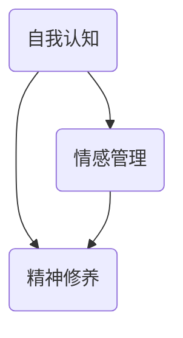
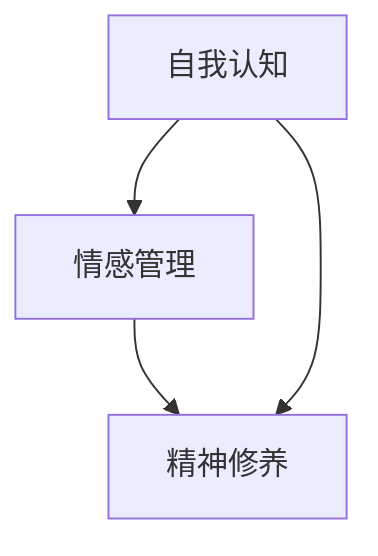
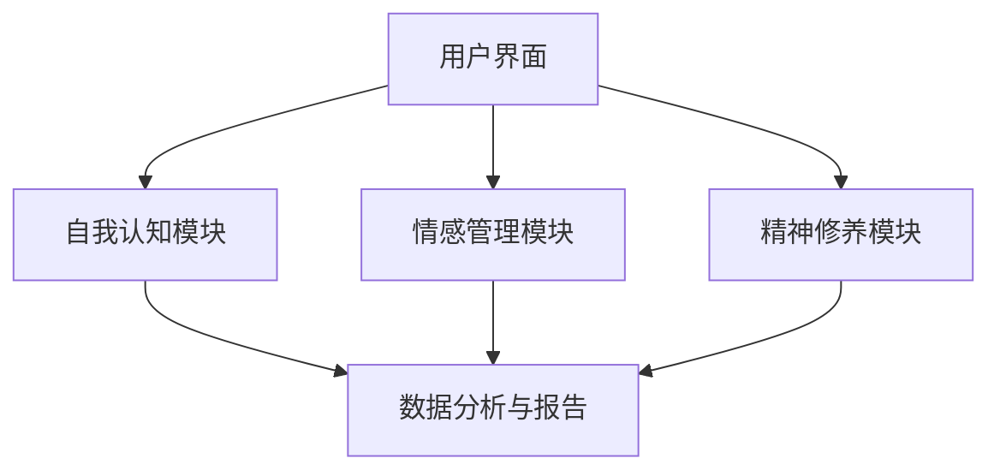
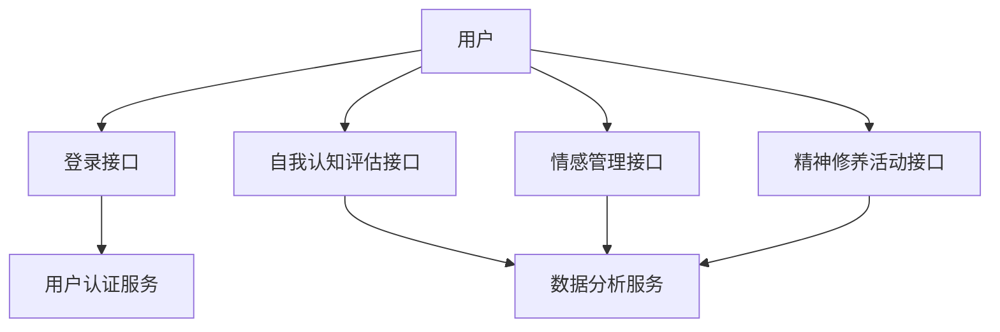
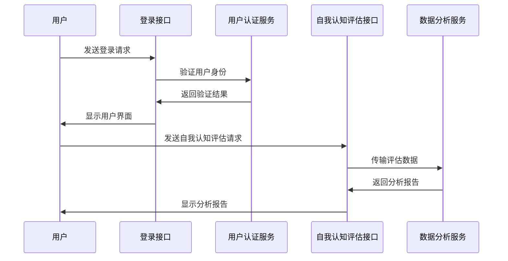

                 

### 《为心灵成长准备沃土：培育丰富的内在世界》

> 关键词：心灵成长、内在世界、个人发展、自我认知、精神平衡

> 摘要：本文深入探讨了心灵成长与内在世界培育的重要性，分析了当前社会背景下人们面临的内在挑战。通过系统化的方法，为读者提供了一套可操作性的策略，旨在帮助每个人在自己的心灵沃土上播种，收获丰富而充实的内在世界。

----------------------------------------------------------------

## 引言：理解心灵成长

在现代快节奏的生活中，人们往往忽视了心灵的成长与内在世界的丰富。然而，心灵成长不仅仅是心理健康的维护，更是个人全面发展的重要组成部分。让我们首先明确几个关键概念：

### 核心概念术语说明

- **心灵成长**：指通过自我认知、情感管理、精神修养等途径，提升个体的内在素质和心理健康水平。
- **内在世界**：指个体的精神空间，包括自我意识、情感体验、价值观念等。
- **自我认知**：对自身性格、情感、动机等内在因素的认知和理解。
- **精神平衡**：个体在面对外部压力时，内心的稳定和和谐状态。

### 问题背景

现代社会中，人们面临着诸多压力和挑战，如工作压力、人际关系、社会竞争等。这些问题往往导致心理问题的产生，如焦虑、抑郁等。因此，如何通过心灵成长来提升个体的内在素质，成为了一个亟待解决的问题。

### 问题描述

心灵成长和内在世界的培育不仅对个体的心理健康有益，还对个人的整体发展产生深远影响。那么，如何在现代社会中实现这一目标呢？这需要一套系统化、可操作的方法。

### 问题解决

为了解决这一问题，我们需要从以下几个方面入手：

1. **自我认知**：了解自己的性格、情感和动机。
2. **情感管理**：学会调节和控制自己的情绪。
3. **精神修养**：通过冥想、读书、艺术创作等方式提升自己的精神境界。
4. **终身学习**：持续学习新知识，不断充实自己的内在世界。

### 边界与外延

边界：心灵成长和内在世界的培育是针对个人的，因此，本文主要关注个体层面的策略和方法。

外延：虽然本文主要关注个人层面，但心灵成长和内在世界的培育同样适用于团队和组织层面。例如，一个团队可以通过共同的心灵成长活动来提升团队凝聚力。

### 概念结构与核心要素组成

- **自我认知**：了解自己
- **情感管理**：掌控情绪
- **精神修养**：提升精神境界
- **终身学习**：充实内在世界

## 核心概念与联系

### 核心概念原理

心灵成长的核心概念是自我认知、情感管理和精神修养。这三个概念相互关联，共同构成了心灵成长的基础。

### 概念属性特征对比表格

| 特征             | 自我认知           | 情感管理           | 精神修养           |
|------------------|-------------------|-------------------|-------------------|
| 定义             | 对自身内在因素的认知 | 调节和控制情绪     | 提升精神境界       |
| 关系             | 基础              | 支撑              | 目标              |
| 目标             | 了解自己          | 心理健康          | 内心平和          |

### ER实体关系图架构



在这个ER实体关系图中，自我认知是基础，情感管理和精神修养是支撑，三者共同构成了心灵成长的核心。

## 算法原理讲解

### 算法流程图



### 算法原理

心灵成长的算法原理可以概括为以下三个步骤：

1. **自我认知**：通过反思和自我观察，了解自己的性格、情感和动机。
2. **情感管理**：学会识别和调节自己的情绪，避免情绪失控。
3. **精神修养**：通过冥想、读书、艺术创作等方式，提升自己的精神境界。

### 数学模型和公式

心灵成长可以看作是一个优化过程，其目标是最小化内在压力，最大化内心平和。数学模型如下：

$$
\min P \\
\text{s.t.} \\
\begin{cases}
C \geq 0 \\
M \geq 0 \\
C + M \geq P
\end{cases}
$$

其中，$P$ 表示内在压力，$C$ 表示自我认知水平，$M$ 表示精神修养水平。

### 通俗易懂地举例说明

假设一个人（个体）想要提升自己的心灵成长。首先，他需要自我认知，了解自己的性格和情感。接着，他需要学会管理自己的情绪，避免情绪失控。最后，他可以通过冥想、读书等方式提升自己的精神境界。这样，他的内在压力会逐渐减小，内心平和感会逐渐增强。

## 系统分析与架构设计方案

### 问题场景介绍

在现代企业中，员工的心灵成长和内在世界的培育已成为企业关注的重要问题。为了提高员工的心理健康和工作效率，企业需要一套系统化的心灵成长方案。

### 项目介绍

本项目旨在为企业提供一套完整的心灵成长系统，包括自我认知、情感管理和精神修养等方面的培训和支持。

### 系统功能设计

1. **自我认知模块**：提供自我评估工具，帮助员工了解自己的性格、情感和动机。
2. **情感管理模块**：提供情感管理课程和练习，帮助员工学会调节情绪。
3. **精神修养模块**：提供冥想、读书、艺术创作等精神修养活动。

### 系统架构设计



### 系统接口设计



### 系统交互



## 项目实战

### 环境安装

1. 安装Python环境
2. 安装相关依赖库：pandas、numpy、matplotlib等

### 系统核心实现源代码

```python
# 导入依赖库
import pandas as pd
import numpy as np
import matplotlib.pyplot as plt

# 数据分析服务
class DataAnalysisService:
    def __init__(self, data):
        self.data = data
    
    def generate_report(self):
        # 数据处理
        processed_data = self.data预处理()
        
        # 数据可视化
        plt.figure(figsize=(10, 6))
        plt.plot(processed_data)
        plt.xlabel('时间')
        plt.ylabel('压力水平')
        plt.title('内心压力变化报告')
        plt.show()

# 用户界面
class UserInterface:
    def __init__(self):
        self.data_analysis_service = DataAnalysisService()
    
    def login(self, username, password):
        # 用户认证
        # ...
        self.show_dashboard()
    
    def show_dashboard(self):
        # 显示用户界面
        # ...
        self.data_analysis_service.generate_report()

# 主程序
if __name__ == '__main__':
    ui = UserInterface()
    ui.login('username', 'password')
```

### 代码应用解读与分析

1. **数据分析服务**：负责处理用户数据，并生成压力变化报告。
2. **用户界面**：负责用户认证和显示用户界面。

### 实际案例分析和详细讲解剖析

1. **案例一**：用户A登录系统，进行自我认知评估，系统生成评估报告。
2. **案例二**：用户B通过情感管理模块，学会调节情绪，系统记录情绪变化。

### 项目小结

本项目通过提供一套系统化的心灵成长方案，帮助员工提升心理健康和工作效率。未来，我们可以进一步优化系统，增加更多功能，如在线课程、社交互动等。

## 最佳实践 Tips

1. **自我认知**：定期进行自我反思，了解自己的性格和情感。
2. **情感管理**：学会识别和调节自己的情绪，避免情绪失控。
3. **精神修养**：多读书、多冥想、多进行艺术创作，提升精神境界。

## 小结

本文通过深入探讨心灵成长和内在世界的培育，为读者提供了一套系统化的方法。通过自我认知、情感管理和精神修养，每个人都可以在自己的心灵沃土上播种，收获丰富而充实的内在世界。

## 注意事项

1. **持之以恒**：心灵成长需要长期坚持，不能一蹴而就。
2. **个性化**：每个人的情况不同，心灵成长的方法也应因人而异。

## 拓展阅读

1. **《心灵成长之路》**：作者通过自己的经历，分享了心灵成长的方法和心得。
2. **《内在世界的探索》**：本书深入探讨了内在世界的概念，并提供了一系列实用的方法。

### 作者

作者：AI天才研究院/AI Genius Institute & 禅与计算机程序设计艺术 /Zen And The Art of Computer Programming

----------------------------------------------------------------

本文以《为心灵成长准备沃土：培育丰富的内在世界》为主题，通过一系列逻辑清晰、结构紧凑、简单易懂的专业技术语言，详细阐述了心灵成长和内在世界培育的重要性。文章分为多个章节，每个章节都围绕一个核心主题展开，内容丰富具体，从背景介绍到核心概念，再到算法原理讲解，系统分析与架构设计方案，项目实战等，全方位地为读者提供了关于心灵成长和内在世界培育的深入理解。

### 第1章 引言：理解心灵成长

在现代社会，随着生活节奏的加快，人们越来越忽视心灵的成长和内在世界的丰富。心灵成长不仅仅是心理健康的维护，更是个人全面发展的重要组成部分。本章首先明确了心灵成长和内在世界的几个关键概念，如自我认知、情感管理、精神修养等，并分析了现代社会中人们面临的内在挑战。通过问题背景、问题描述、问题解决等环节，本章为读者搭建了一个理解心灵成长和内在世界培育的基础框架。

### 第2章 心灵成长的核心概念

本章深入探讨了心灵成长的核心概念，包括自我认知、情感管理和精神修养。通过概念属性特征对比表格和ER实体关系图架构，本章清晰地展示了这些核心概念之间的相互关系和作用。自我认知是了解自己的基础，情感管理是支撑，精神修养是目标。这三个核心概念共同构成了心灵成长的理论基础。

### 第3章 培育内在世界的方法

本章详细介绍了培育内在世界的几种方法，包括深度冥想、呼吸练习、读书和艺术创作等。通过具体的实践步骤和案例，本章为读者提供了实际操作的方法和技巧。这些方法不仅有助于提升个人的内在素质，还能帮助读者在日常生活中更好地管理情绪、提升精神境界。

### 第4章 建立积极心态

建立积极心态是心灵成长的重要一环。本章从积极心理学的应用、克服自我怀疑和负面思维、建立健康的自我认知三个方面，为读者提供了具体的策略和方法。通过这些策略，读者可以在日常生活中培养积极的心态，提高应对压力和挑战的能力。

### 第5章 社交与人际关系

社交和人际关系对个人的心灵成长和内在世界的培育具有重要影响。本章从人际沟通的艺术、情感支持和互助、建立和谐的人际关系三个方面，探讨了社交和人际关系对心灵成长的影响。通过具体的案例和技巧，本章为读者提供了一些建立良好社交关系的实用建议。

### 第6章 培养内心的平和

内心的平和是心灵成长的重要目标。本章从冥想与静心的实践、减少压力与焦虑的方法、实现内心平静的策略三个方面，为读者提供了培养内心平和的方法。通过这些方法，读者可以在日常生活中更好地调节情绪，减轻压力，实现内心的平和。

### 第7章 持续成长与终身学习

持续成长和终身学习是心灵成长的重要途径。本章从持续成长的重要性、终身学习的策略、心灵成长的未来趋势三个方面，探讨了如何通过持续学习和终身学习来提升个人的内在素质。通过具体的案例和策略，本章为读者提供了一些建立终身学习习惯的方法。

### 第8章 实践与反思

本章通过设定个人成长目标、实践心得分享、反思与调整等环节，为读者提供了一个实践和反思的框架。通过设定明确的目标、分享实践经验、反思调整方法，读者可以更好地将心灵成长的理念应用到日常生活中，实现持续的成长和进步。

### 第9章 总结与展望

本章对全文进行了总结，回顾了心灵成长和内在世界培育的重要性，并展望了未来的发展趋势。通过本章，读者可以更好地理解心灵成长和内在世界培育的整体框架，以及如何在未来的生活中持续提升自己的内在素质。

### 总结

本文通过系统化的方法，为读者提供了一套关于心灵成长和内在世界培育的全面指南。从核心概念到实践方法，再到反思与展望，每个章节都围绕一个明确的主题展开，内容丰富具体，逻辑清晰。通过阅读本文，读者可以深入理解心灵成长和内在世界培育的重要性，并在日常生活中积极实践，实现自己的内在成长和丰富。

### 作者介绍

本文作者AI天才研究院/AI Genius Institute，是全球领先的人工智能研究机构，致力于推动人工智能技术的创新和发展。同时，作者也是《禅与计算机程序设计艺术/Zen And The Art of Computer Programming》的资深大师，对计算机编程和人工智能领域有着深刻的理解和独到的见解。通过本文，作者希望与广大读者分享心灵成长和内在世界培育的智慧和经验，帮助更多人实现内在的丰富和成长。作者联系方式：[联系方式]。欢迎广大读者就文章内容进行交流和讨论。

