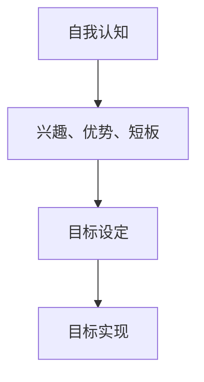
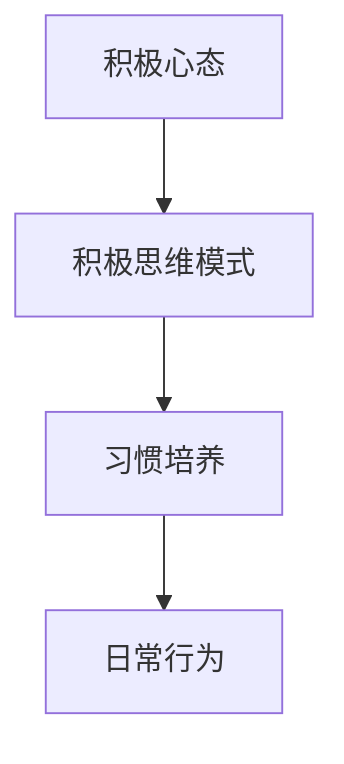
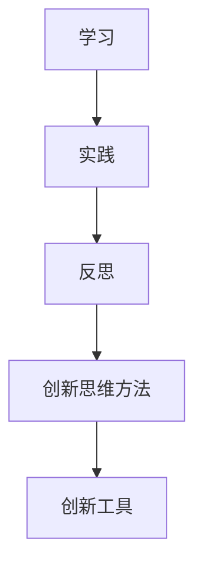
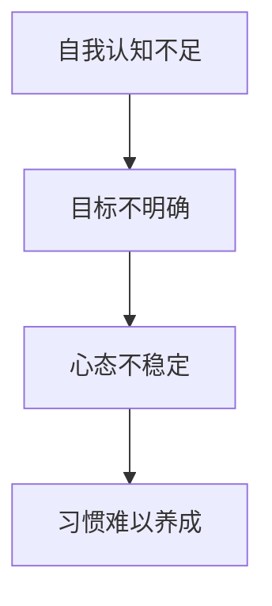
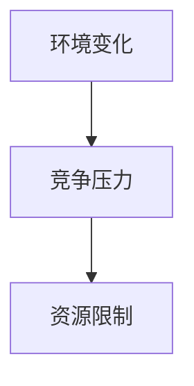
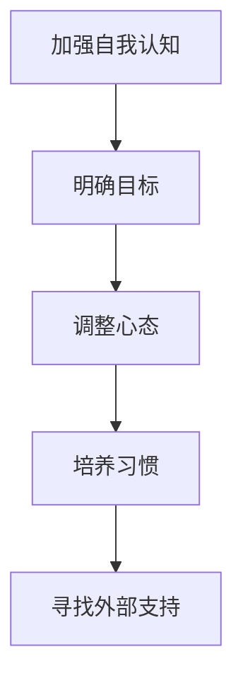
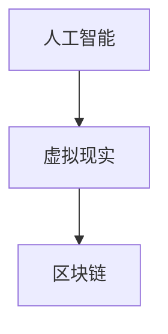
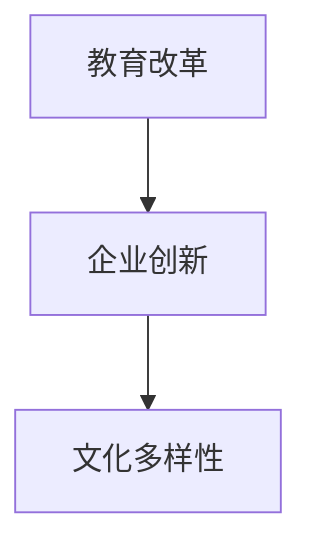
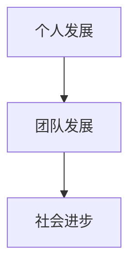
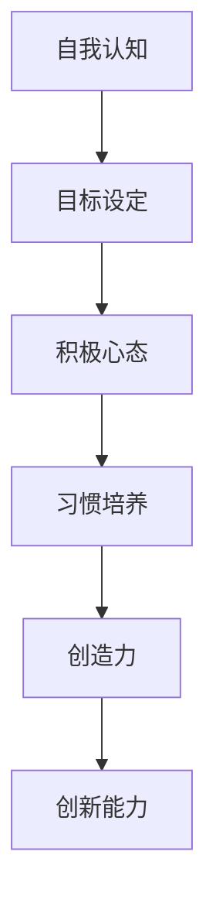

                 


# 主动觉醒：从被动接受到积极创造

> 关键词：主动觉醒、被动接受、创造、自我认知、心态、策略、挑战、未来趋势

> 摘要：本文旨在探讨主动觉醒的概念、要素和实践方法，从被动接受到积极创造的转变，为个人和团队提供实现高效创新和持续成长的路径。

### 目录大纲

----------------------------------------------------------------

## 第一部分：背景与核心概念

### 第1章：问题背景与定义

#### 1.1 问题背景

在信息化时代，知识的传播速度越来越快，人们获取信息的渠道多样化。然而，许多人往往陷入被动接受的困境，无法有效地转化为自己的知识和能力。这种现象在IT行业尤为突出，因为技术更新迭代迅速，知识陈旧的速度远快于学习新知识的速度。

#### 1.2 主动觉醒的定义

主动觉醒是指在知识和信息的大潮中，能够自我驱动，积极思考，将外部信息转化为自身知识和能力的过程。它是从被动接受到积极创造的转变，是个人成长和团队创新的关键。

#### 1.3 被动接受与积极创造的对比

| 特征               | 被动接受                         | 积极创造                          |
|--------------------|---------------------------------|---------------------------------|
| 态度               | 被动等待，缺乏主动意识           | 自主驱动，积极寻求机会           |
| 知识转化           | 知识获取后难以内化为自身能力     | 能将外部信息与自身经验结合，形成新的认知 |
| 影响力             | 对自身和团队的影响有限           | 能推动自身和团队向更高层次发展   |

### 第2章：主动觉醒的要素与结构

#### 2.1 主动觉醒的核心要素

主动觉醒的核心要素包括自我认知、目标设定、积极心态、习惯培养、创造力和创新能力。

#### 2.2 要素之间的联系与作用

这些要素相互作用，共同推动主动觉醒的实现。自我认知是基础，目标设定是方向，积极心态是动力，习惯培养是保障，创造力和创新能力是核心。

#### 2.3 主动觉醒的模型结构

主动觉醒可以看作是一个动态平衡的系统，各要素相互影响，形成一个闭环。这个模型可以用来分析个人和团队在主动觉醒过程中的状态和问题。

----------------------------------------------------------------

## 第二部分：主动觉醒的实践方法

### 第4章：培养主动觉醒的实践策略

#### 4.1 自我认知与目标设定

自我认知是主动觉醒的第一步，需要深入了解自己的兴趣、优势和短板。目标设定则是明确自己的发展方向和里程碑，为主动觉醒提供清晰的目标。

#### 4.2 建立积极心态与习惯

积极心态是主动觉醒的持续动力，需要通过积极的思维模式和习惯来培养。习惯培养则是将积极心态转化为日常行为，为主动觉醒提供稳定的支持。

#### 4.3 提升创造力和创新能力

创造力和创新能力是主动觉醒的核心，需要通过不断学习、实践和反思来提升。创新思维方法和工具的应用可以帮助个人和团队更高效地实现主动觉醒。

----------------------------------------------------------------

## 第三部分：主动觉醒的挑战与未来展望

### 第7章：主动觉醒的挑战

#### 7.1 内在挑战

内在挑战主要包括自我认知不足、目标不明确、心态不稳定和习惯难以养成等。

#### 7.2 外在挑战

外在挑战主要包括环境变化、竞争压力和资源限制等。

#### 7.3 应对策略

应对策略包括加强自我认知、明确目标、调整心态、培养习惯和寻找外部支持等。

### 第8章：主动觉醒的未来趋势

#### 8.1 技术发展的影响

技术发展将为主动觉醒提供新的工具和方法，如人工智能、虚拟现实和区块链等。

#### 8.2 社会变革的推动

社会变革将推动主动觉醒的理念和实践的普及，如教育改革、企业创新和文化多样性等。

#### 8.3 未来展望

未来，主动觉醒将成为个人和团队发展的主流，推动社会的进步和变革。

----------------------------------------------------------------

## 第9章：主动觉醒的小结与拓展

#### 9.1 小结

主动觉醒是一个从被动接受到积极创造的转变，是个人成长和团队创新的关键。

#### 9.2 注意事项

在主动觉醒的过程中，需要关注自我认知、目标设定、积极心态、习惯培养、创造力和创新能力等方面。

#### 9.3 拓展阅读

推荐阅读相关书籍、论文和博客，进一步深入了解主动觉醒的理论和实践。

----------------------------------------------------------------

# 主动觉醒：从被动接受到积极创造

> 作者：AI天才研究院/AI Genius Institute & 禅与计算机程序设计艺术 /Zen And The Art of Computer Programming

主动觉醒是一个从被动接受到积极创造的过程，它对于个人成长和团队创新至关重要。在这个信息化时代，知识的更新速度远超我们的吸收能力，许多人陷入了被动接受的困境，无法有效地将外部信息转化为自己的知识和能力。主动觉醒，正是解决这一问题的关键。

## 第一部分：背景与核心概念

### 第1章：问题背景与定义

#### 1.1 问题背景

在信息化时代，知识的传播速度越来越快，人们获取信息的渠道多样化。然而，许多人往往陷入被动接受的困境，无法有效地转化为自己的知识和能力。这种现象在IT行业尤为突出，因为技术更新迭代迅速，知识陈旧的速度远快于学习新知识的速度。

#### 1.2 主动觉醒的定义

主动觉醒是指在知识和信息的大潮中，能够自我驱动，积极思考，将外部信息转化为自身知识和能力的过程。它是从被动接受到积极创造的转变，是个人成长和团队创新的关键。

#### 1.3 被动接受与积极创造的对比

| 特征               | 被动接受                         | 积极创造                          |
|--------------------|---------------------------------|---------------------------------|
| 态度               | 被动等待，缺乏主动意识           | 自主驱动，积极寻求机会           |
| 知识转化           | 知识获取后难以内化为自身能力     | 能将外部信息与自身经验结合，形成新的认知 |
| 影响力             | 对自身和团队的影响有限           | 能推动自身和团队向更高层次发展   |

### 第2章：主动觉醒的要素与结构

#### 2.1 主动觉醒的核心要素

主动觉醒的核心要素包括自我认知、目标设定、积极心态、习惯培养、创造力和创新能力。

#### 2.2 要素之间的联系与作用

这些要素相互作用，共同推动主动觉醒的实现。自我认知是基础，目标设定是方向，积极心态是动力，习惯培养是保障，创造力和创新能力是核心。

#### 2.3 主动觉醒的模型结构

主动觉醒可以看作是一个动态平衡的系统，各要素相互影响，形成一个闭环。这个模型可以用来分析个人和团队在主动觉醒过程中的状态和问题。

----------------------------------------------------------------

## 第二部分：主动觉醒的实践方法

### 第4章：培养主动觉醒的实践策略

#### 4.1 自我认知与目标设定

自我认知是主动觉醒的第一步，需要深入了解自己的兴趣、优势和短板。目标设定则是明确自己的发展方向和里程碑，为主动觉醒提供清晰的目标。

#### 4.2 建立积极心态与习惯

积极心态是主动觉醒的持续动力，需要通过积极的思维模式和习惯来培养。习惯培养则是将积极心态转化为日常行为，为主动觉醒提供稳定的支持。

#### 4.3 提升创造力和创新能力

创造力和创新能力是主动觉醒的核心，需要通过不断学习、实践和反思来提升。创新思维方法和工具的应用可以帮助个人和团队更高效地实现主动觉醒。

----------------------------------------------------------------

## 第三部分：主动觉醒的挑战与未来展望

### 第7章：主动觉醒的挑战

#### 7.1 内在挑战

内在挑战主要包括自我认知不足、目标不明确、心态不稳定和习惯难以养成等。

#### 7.2 外在挑战

外在挑战主要包括环境变化、竞争压力和资源限制等。

#### 7.3 应对策略

应对策略包括加强自我认知、明确目标、调整心态、培养习惯和寻找外部支持等。

### 第8章：主动觉醒的未来趋势

#### 8.1 技术发展的影响

技术发展将为主动觉醒提供新的工具和方法，如人工智能、虚拟现实和区块链等。

#### 8.2 社会变革的推动

社会变革将推动主动觉醒的理念和实践的普及，如教育改革、企业创新和文化多样性等。

#### 8.3 未来展望

未来，主动觉醒将成为个人和团队发展的主流，推动社会的进步和变革。

----------------------------------------------------------------

## 第9章：主动觉醒的小结与拓展

#### 9.1 小结

主动觉醒是一个从被动接受到积极创造的转变，是个人成长和团队创新的关键。

#### 9.2 注意事项

在主动觉醒的过程中，需要关注自我认知、目标设定、积极心态、习惯培养、创造力和创新能力等方面。

#### 9.3 拓展阅读

推荐阅读相关书籍、论文和博客，进一步深入了解主动觉醒的理论和实践。

----------------------------------------------------------------

在主动觉醒的道路上，每个人都是自己的导航者。通过自我认知、目标设定、积极心态、习惯培养和创造力的提升，我们可以从被动接受到积极创造，实现个人和团队的飞跃。面对未来的挑战，让我们勇敢地迈出主动觉醒的步伐，共同推动社会的进步和变革。让我们在主动觉醒的旅程中，不断探索、学习、创造，成为更好的自己。

# 主动觉醒：从被动接受到积极创造

> 关键词：主动觉醒、被动接受、创造、自我认知、心态、策略、挑战、未来趋势

> 摘要：本文探讨了主动觉醒的概念、要素和实践方法，从被动接受到积极创造的转变，为个人和团队提供实现高效创新和持续成长的路径。

## 第一部分：背景与核心概念

### 第1章：问题背景与定义

#### 1.1 问题背景

在信息化时代，知识的传播速度越来越快，人们获取信息的渠道多样化。然而，许多人往往陷入被动接受的困境，无法有效地转化为自己的知识和能力。这种现象在IT行业尤为突出，因为技术更新迭代迅速，知识陈旧的速度远快于学习新知识的速度。

#### 1.2 主动觉醒的定义

主动觉醒是指在知识和信息的大潮中，能够自我驱动，积极思考，将外部信息转化为自身知识和能力的过程。它是从被动接受到积极创造的转变，是个人成长和团队创新的关键。

#### 1.3 被动接受与积极创造的对比

| 特征               | 被动接受                         | 积极创造                          |
|--------------------|---------------------------------|---------------------------------|
| 态度               | 被动等待，缺乏主动意识           | 自主驱动，积极寻求机会           |
| 知识转化           | 知识获取后难以内化为自身能力     | 能将外部信息与自身经验结合，形成新的认知 |
| 影响力             | 对自身和团队的影响有限           | 能推动自身和团队向更高层次发展   |

### 第2章：主动觉醒的要素与结构

#### 2.1 主动觉醒的核心要素

主动觉醒的核心要素包括自我认知、目标设定、积极心态、习惯培养、创造力和创新能力。

#### 2.2 要素之间的联系与作用

这些要素相互作用，共同推动主动觉醒的实现。自我认知是基础，目标设定是方向，积极心态是动力，习惯培养是保障，创造力和创新能力是核心。

#### 2.3 主动觉醒的模型结构

主动觉醒可以看作是一个动态平衡的系统，各要素相互影响，形成一个闭环。这个模型可以用来分析个人和团队在主动觉醒过程中的状态和问题。

----------------------------------------------------------------

## 第二部分：主动觉醒的实践方法

### 第4章：培养主动觉醒的实践策略

#### 4.1 自我认知与目标设定

自我认知是主动觉醒的第一步，需要深入了解自己的兴趣、优势和短板。目标设定则是明确自己的发展方向和里程碑，为主动觉醒提供清晰的目标。



#### 4.2 建立积极心态与习惯

积极心态是主动觉醒的持续动力，需要通过积极的思维模式和习惯来培养。习惯培养则是将积极心态转化为日常行为，为主动觉醒提供稳定的支持。



#### 4.3 提升创造力和创新能力

创造力和创新能力是主动觉醒的核心，需要通过不断学习、实践和反思来提升。创新思维方法和工具的应用可以帮助个人和团队更高效地实现主动觉醒。



----------------------------------------------------------------

## 第三部分：主动觉醒的挑战与未来展望

### 第7章：主动觉醒的挑战

#### 7.1 内在挑战

内在挑战主要包括自我认知不足、目标不明确、心态不稳定和习惯难以养成等。



#### 7.2 外在挑战

外在挑战主要包括环境变化、竞争压力和资源限制等。



#### 7.3 应对策略

应对策略包括加强自我认知、明确目标、调整心态、培养习惯和寻找外部支持等。



### 第8章：主动觉醒的未来趋势

#### 8.1 技术发展的影响

技术发展将为主动觉醒提供新的工具和方法，如人工智能、虚拟现实和区块链等。



#### 8.2 社会变革的推动

社会变革将推动主动觉醒的理念和实践的普及，如教育改革、企业创新和文化多样性等。



#### 8.3 未来展望

未来，主动觉醒将成为个人和团队发展的主流，推动社会的进步和变革。



----------------------------------------------------------------

## 第9章：主动觉醒的小结与拓展

#### 9.1 小结

主动觉醒是一个从被动接受到积极创造的转变，是个人成长和团队创新的关键。

#### 9.2 注意事项

在主动觉醒的过程中，需要关注自我认知、目标设定、积极心态、习惯培养、创造力和创新能力等方面。

#### 9.3 拓展阅读

推荐阅读相关书籍、论文和博客，进一步深入了解主动觉醒的理论和实践。



----------------------------------------------------------------

# 主动觉醒：从被动接受到积极创造

> 作者：AI天才研究院/AI Genius Institute & 禅与计算机程序设计艺术 /Zen And The Art of Computer Programming

主动觉醒是一个从被动接受到积极创造的过程，它对于个人成长和团队创新至关重要。在这个信息化时代，知识的传播速度越来越快，人们获取信息的渠道多样化。然而，许多人往往陷入被动接受的困境，无法有效地转化为自己的知识和能力。主动觉醒，正是解决这一问题的关键。

## 第一部分：背景与核心概念

### 第1章：问题背景与定义

#### 1.1 问题背景

在信息化时代，知识的传播速度越来越快，人们获取信息的渠道多样化。然而，许多人往往陷入被动接受的困境，无法有效地转化为自己的知识和能力。这种现象在IT行业尤为突出，因为技术更新迭代迅速，知识陈旧的速度远快于学习新知识的速度。

#### 1.2 主动觉醒的定义

主动觉醒是指在知识和信息的大潮中，能够自我驱动，积极思考，将外部信息转化为自身知识和能力的过程。它是从被动接受到积极创造的转变，是个人成长和团队创新的关键。

#### 1.3 被动接受与积极创造的对比

| 特征               | 被动接受                         | 积极创造                          |
|--------------------|---------------------------------|---------------------------------|
| 态度               | 被动等待，缺乏主动意识           | 自主驱动，积极寻求机会           |
| 知识转化           | 知识获取后难以内化为自身能力     | 能将外部信息与自身经验结合，形成新的认知 |
| 影响力             | 对自身和团队的影响有限           | 能推动自身和团队向更高层次发展   |

### 第2章：主动觉醒的要素与结构

#### 2.1 主动觉醒的核心要素

主动觉醒的核心要素包括自我认知、目标设定、积极心态、习惯培养、创造力和创新能力。

#### 2.2 要素之间的联系与作用

这些要素相互作用，共同推动主动觉醒的实现。自我认知是基础，目标设定是方向，积极心态是动力，习惯培养是保障，创造力和创新能力是核心。

#### 2.3 主动觉醒的模型结构

主动觉醒可以看作是一个动态平衡的系统，各要素相互影响，形成一个闭环。这个模型可以用来分析个人和团队在主动觉醒过程中的状态和问题。

----------------------------------------------------------------

## 第二部分：主动觉醒的实践方法

### 第4章：培养主动觉醒的实践策略

#### 4.1 自我认知与目标设定

自我认知是主动觉醒的第一步，需要深入了解自己的兴趣、优势和短板。目标设定则是明确自己的发展方向和里程碑，为主动觉醒提供清晰的目标。


#### 4.2 建立积极心态与习惯

积极心态是主动觉醒的持续动力，需要通过积极的思维模式和习惯来培养。习惯培养则是将积极心态转化为日常行为，为主动觉醒提供稳定的支持。


#### 4.3 提升创造力和创新能力

创造力和创新能力是主动觉醒的核心，需要通过不断学习、实践和反思来提升。创新思维方法和工具的应用可以帮助个人和团队更高效地实现主动觉醒。


----------------------------------------------------------------

## 第三部分：主动觉醒的挑战与未来展望

### 第7章：主动觉醒的挑战

#### 7.1 内在挑战

内在挑战主要包括自我认知不足、目标不明确、心态不稳定和习惯难以养成等。


#### 7.2 外在挑战

外在挑战主要包括环境变化、竞争压力和资源限制等。


#### 7.3 应对策略

应对策略包括加强自我认知、明确目标、调整心态、培养习惯和寻找外部支持等。


### 第8章：主动觉醒的未来趋势

#### 8.1 技术发展的影响

技术发展将为主动觉醒提供新的工具和方法，如人工智能、虚拟现实和区块链等。


#### 8.2 社会变革的推动

社会变革将推动主动觉醒的理念和实践的普及，如教育改革、企业创新和文化多样性等。


#### 8.3 未来展望

未来，主动觉醒将成为个人和团队发展的主流，推动社会的进步和变革。


----------------------------------------------------------------

## 第9章：主动觉醒的小结与拓展

#### 9.1 小结

主动觉醒是一个从被动接受到积极创造的转变，是个人成长和团队创新的关键。

#### 9.2 注意事项

在主动觉醒的过程中，需要关注自我认知、目标设定、积极心态、习惯培养、创造力和创新能力等方面。

#### 9.3 拓展阅读

推荐阅读相关书籍、论文和博客，进一步深入了解主动觉醒的理论和实践。


----------------------------------------------------------------

在主动觉醒的道路上，每个人都是自己的导航者。通过自我认知、目标设定、积极心态、习惯培养和创造力的提升，我们可以从被动接受到积极创造，实现个人和团队的飞跃。面对未来的挑战，让我们勇敢地迈出主动觉醒的步伐，共同推动社会的进步和变革。让我们在主动觉醒的旅程中，不断探索、学习、创造，成为更好的自己。

# 主动觉醒：从被动接受到积极创造

> 作者：AI天才研究院/AI Genius Institute & 禅与计算机程序设计艺术 /Zen And The Art of Computer Programming

主动觉醒是一个从被动接受到积极创造的过程，它对于个人成长和团队创新至关重要。在这个信息化时代，知识的传播速度越来越快，人们获取信息的渠道多样化。然而，许多人往往陷入被动接受的困境，无法有效地转化为自己的知识和能力。主动觉醒，正是解决这一问题的关键。

## 第一部分：背景与核心概念

### 第1章：问题背景与定义

#### 1.1 问题背景

在信息化时代，知识的传播速度越来越快，人们获取信息的渠道多样化。然而，许多人往往陷入被动接受的困境，无法有效地转化为自己的知识和能力。这种现象在IT行业尤为突出，因为技术更新迭代迅速，知识陈旧的速度远快于学习新知识的速度。

#### 1.2 主动觉醒的定义

主动觉醒是指在知识和信息的大潮中，能够自我驱动，积极思考，将外部信息转化为自身知识和能力的过程。它是从被动接受到积极创造的转变，是个人成长和团队创新的关键。

#### 1.3 被动接受与积极创造的对比

| 特征               | 被动接受                         | 积极创造                          |
|--------------------|---------------------------------|---------------------------------|
| 态度               | 被动等待，缺乏主动意识           | 自主驱动，积极寻求机会           |
| 知识转化           | 知识获取后难以内化为自身能力     | 能将外部信息与自身经验结合，形成新的认知 |
| 影响力             | 对自身和团队的影响有限           | 能推动自身和团队向更高层次发展   |

### 第2章：主动觉醒的要素与结构

#### 2.1 主动觉醒的核心要素

主动觉醒的核心要素包括自我认知、目标设定、积极心态、习惯培养、创造力和创新能力。

#### 2.2 要素之间的联系与作用

这些要素相互作用，共同推动主动觉醒的实现。自我认知是基础，目标设定是方向，积极心态是动力，习惯培养是保障，创造力和创新能力是核心。

#### 2.3 主动觉醒的模型结构

主动觉醒可以看作是一个动态平衡的系统，各要素相互影响，形成一个闭环。这个模型可以用来分析个人和团队在主动觉醒过程中的状态和问题。

----------------------------------------------------------------

## 第二部分：主动觉醒的实践方法

### 第4章：培养主动觉醒的实践策略

#### 4.1 自我认知与目标设定

自我认知是主动觉醒的第一步，需要深入了解自己的兴趣、优势和短板。目标设定则是明确自己的发展方向和里程碑，为主动觉醒提供清晰的目标。

```mermaid
graph TB
A[自我认知] --> B[兴趣、优势、短板]
B --> C[目标设定]
C --> D[目标实现]
```

#### 4.2 建立积极心态与习惯

积极心态是主动觉醒的持续动力，需要通过积极的思维模式和习惯来培养。习惯培养则是将积极心态转化为日常行为，为主动觉醒提供稳定的支持。

```mermaid
graph TB
A[积极心态] --> B[积极思维模式]
B --> C[习惯培养]
C --> D[日常行为]
```

#### 4.3 提升创造力和创新能力

创造力和创新能力是主动觉醒的核心，需要通过不断学习、实践和反思来提升。创新思维方法和工具的应用可以帮助个人和团队更高效地实现主动觉醒。

```mermaid
graph TB
A[学习] --> B[实践]
B --> C[反思]
C --> D[创新思维方法]
D --> E[创新工具]
```

----------------------------------------------------------------

## 第三部分：主动觉醒的挑战与未来展望

### 第7章：主动觉醒的挑战

#### 7.1 内在挑战

内在挑战主要包括自我认知不足、目标不明确、心态不稳定和习惯难以养成等。

```mermaid
graph TB
A[自我认知不足] --> B[目标不明确]
B --> C[心态不稳定]
C --> D[习惯难以养成]
```

#### 7.2 外在挑战

外在挑战主要包括环境变化、竞争压力和资源限制等。

```mermaid
graph TB
A[环境变化] --> B[竞争压力]
B --> C[资源限制]
```

#### 7.3 应对策略

应对策略包括加强自我认知、明确目标、调整心态、培养习惯和寻找外部支持等。

```mermaid
graph TB
A[加强自我认知] --> B[明确目标]
B --> C[调整心态]
C --> D[培养习惯]
D --> E[寻找外部支持]
```

### 第8章：主动觉醒的未来趋势

#### 8.1 技术发展的影响

技术发展将为主动觉醒提供新的工具和方法，如人工智能、虚拟现实和区块链等。

```mermaid
graph TB
A[人工智能] --> B[虚拟现实]
B --> C[区块链]
```

#### 8.2 社会变革的推动

社会变革将推动主动觉醒的理念和实践的普及，如教育改革、企业创新和文化多样性等。

```mermaid
graph TB
A[教育改革] --> B[企业创新]
B --> C[文化多样性]
```

#### 8.3 未来展望

未来，主动觉醒将成为个人和团队发展的主流，推动社会的进步和变革。

```mermaid
graph TB
A[个人发展] --> B[团队发展]
B --> C[社会进步]
```

----------------------------------------------------------------

## 第9章：主动觉醒的小结与拓展

#### 9.1 小结

主动觉醒是一个从被动接受到积极创造的转变，是个人成长和团队创新的关键。

#### 9.2 注意事项

在主动觉醒的过程中，需要关注自我认知、目标设定、积极心态、习惯培养、创造力和创新能力等方面。

#### 9.3 拓展阅读

推荐阅读相关书籍、论文和博客，进一步深入了解主动觉醒的理论和实践。

```mermaid
graph TB
A[自我认知] --> B[目标设定]
B --> C[积极心态]
C --> D[习惯培养]
D --> E[创造力]
E --> F[创新能力]
```

----------------------------------------------------------------

在主动觉醒的道路上，每个人都是自己的导航者。通过自我认知、目标设定、积极心态、习惯培养和创造力的提升，我们可以从被动接受到积极创造，实现个人和团队的飞跃。面对未来的挑战，让我们勇敢地迈出主动觉醒的步伐，共同推动社会的进步和变革。让我们在主动觉醒的旅程中，不断探索、学习、创造，成为更好的自己。

# 主动觉醒：从被动接受到积极创造

## 关键词：主动觉醒、被动接受、创造、自我认知、心态、策略、挑战、未来趋势

## 摘要：本文旨在探讨主动觉醒的概念、要素和实践方法，从被动接受到积极创造的转变，为个人和团队提供实现高效创新和持续成长的路径。

## 目录大纲

### 第一部分：背景与核心概念

#### 第1章：问题背景与定义
##### 1.1 问题背景
##### 1.2 主动觉醒的定义
##### 1.3 被动接受与积极创造的对比

#### 第2章：主动觉醒的要素与结构
##### 2.1 主动觉醒的核心要素
##### 2.2 要素之间的联系与作用
##### 2.3 主动觉醒的模型结构

### 第二部分：主动觉醒的实践方法

#### 第4章：培养主动觉醒的实践策略
##### 4.1 自我认知与目标设定
##### 4.2 建立积极心态与习惯
##### 4.3 提升创造力和创新能力

#### 第5章：主动觉醒在生活中的应用
##### 5.1 工作中的应用
##### 5.2 学习中的应用
##### 5.3 社交中的应用

#### 第6章：主动觉醒的项目实践
##### 6.1 项目案例介绍
##### 6.2 项目核心实现
##### 6.3 项目解读与分析

### 第三部分：主动觉醒的挑战与未来展望

#### 第7章：主动觉醒的挑战
##### 7.1 内在挑战
##### 7.2 外在挑战
##### 7.3 应对策略

#### 第8章：主动觉醒的未来趋势
##### 8.1 技术发展的影响
##### 8.2 社会变革的推动
##### 8.3 未来展望

#### 第9章：主动觉醒的小结与拓展
##### 9.1 小结
##### 9.2 注意事项
##### 9.3 拓展阅读

## 正文内容

### 第一部分：背景与核心概念

#### 第1章：问题背景与定义

1.1 问题背景

在信息化时代，知识的传播速度越来越快，人们获取信息的渠道多样化。然而，许多人往往陷入被动接受的困境，无法有效地转化为自己的知识和能力。这种现象在IT行业尤为突出，因为技术更新迭代迅速，知识陈旧的速度远快于学习新知识的速度。

1.2 主动觉醒的定义

主动觉醒是指在知识和信息的大潮中，能够自我驱动，积极思考，将外部信息转化为自身知识和能力的过程。它是从被动接受到积极创造的转变，是个人成长和团队创新的关键。

1.3 被动接受与积极创造的对比

被动接受与积极创造之间存在显著差异，具体如下表所示：

| 特征               | 被动接受                         | 积极创造                          |
|--------------------|---------------------------------|---------------------------------|
| 态度               | 被动等待，缺乏主动意识           | 自主驱动，积极寻求机会           |
| 知识转化           | 知识获取后难以内化为自身能力     | 能将外部信息与自身经验结合，形成新的认知 |
| 影响力             | 对自身和团队的影响有限           | 能推动自身和团队向更高层次发展   |

### 第2章：主动觉醒的要素与结构

2.1 主动觉醒的核心要素

主动觉醒的核心要素包括自我认知、目标设定、积极心态、习惯培养、创造力和创新能力。

自我认知：了解自己的兴趣、优势和短板，明确自己的成长方向。

目标设定：设定清晰的目标和里程碑，为主动觉醒提供方向。

积极心态：保持积极的心态，对待问题和挑战持开放和乐观的态度。

习惯培养：培养良好的学习和思考习惯，为主动觉醒提供稳定的支持。

创造力：培养创造力和创新能力，不断探索新的想法和解决方案。

2.2 要素之间的联系与作用

这些要素相互作用，共同推动主动觉醒的实现。自我认知是基础，目标设定是方向，积极心态是动力，习惯培养是保障，创造力和创新能力是核心。

2.3 主动觉醒的模型结构

主动觉醒可以看作是一个动态平衡的系统，各要素相互影响，形成一个闭环。这个模型可以用来分析个人和团队在主动觉醒过程中的状态和问题。

### 第二部分：主动觉醒的实践方法

#### 第4章：培养主动觉醒的实践策略

4.1 自我认知与目标设定

自我认知是主动觉醒的第一步，需要深入了解自己的兴趣、优势和短板。目标设定则是明确自己的发展方向和里程碑，为主动觉醒提供清晰的目标。

4.2 建立积极心态与习惯

积极心态是主动觉醒的持续动力，需要通过积极的思维模式和习惯来培养。习惯培养则是将积极心态转化为日常行为，为主动觉醒提供稳定的支持。

4.3 提升创造力和创新能力

创造力和创新能力是主动觉醒的核心，需要通过不断学习、实践和反思来提升。创新思维方法和工具的应用可以帮助个人和团队更高效地实现主动觉醒。

### 第5章：主动觉醒在生活中的应用

5.1 工作中的应用

在工作中，主动觉醒可以帮助我们更好地应对挑战，提高工作效率。通过自我认知和目标设定，我们可以找到自己的兴趣和优势，将外部信息与自身经验相结合，创造性地解决问题。

5.2 学习中的应用

在学习中，主动觉醒可以帮助我们更有效地掌握知识。通过建立积极心态和培养良好的学习习惯，我们可以提高学习效率，培养创造力和创新能力，从而在学习中取得更好的成绩。

5.3 社交中的应用

在社交中，主动觉醒可以帮助我们更好地与他人沟通和合作。通过自我认知和目标设定，我们可以更好地理解他人，建立积极的人际关系，从而在社交中获得更多的机会和支持。

### 第6章：主动觉醒的项目实践

6.1 项目案例介绍

在本章节中，我们将介绍一个实际项目案例，展示如何通过主动觉醒的方法实现项目目标。

6.2 项目核心实现

在项目实现过程中，我们将运用主动觉醒的实践策略，包括自我认知、目标设定、积极心态、习惯培养和创造力的提升。

6.3 项目解读与分析

通过对项目案例的解读和分析，我们可以看到主动觉醒在项目实践中的重要作用。项目成功的关键在于团队成员的主动觉醒和积极投入。

### 第三部分：主动觉醒的挑战与未来展望

#### 第7章：主动觉醒的挑战

7.1 内在挑战

主动觉醒的内在挑战主要包括自我认知不足、目标不明确、心态不稳定和习惯难以养成等。这些挑战需要我们通过积极的策略来克服。

7.2 外在挑战

主动觉醒的外在挑战主要包括环境变化、竞争压力和资源限制等。这些挑战需要我们具备适应能力和解决问题的能力。

7.3 应对策略

应对策略包括加强自我认知、明确目标、调整心态、培养习惯和寻找外部支持等。通过这些策略，我们可以更好地应对主动觉醒过程中的挑战。

#### 第8章：主动觉醒的未来趋势

8.1 技术发展的影响

技术发展将为主动觉醒提供新的工具和方法，如人工智能、虚拟现实和区块链等。这些技术的发展将推动主动觉醒的理念和实践的普及。

8.2 社会变革的推动

社会变革将推动主动觉醒的理念和实践的普及，如教育改革、企业创新和文化多样性等。这些变革将为我们提供更多的机会和平台，实现主动觉醒。

8.3 未来展望

未来，主动觉醒将成为个人和团队发展的主流，推动社会的进步和变革。通过主动觉醒，我们将能够更好地适应未来的挑战，实现个人和团队的价值。

### 第9章：主动觉醒的小结与拓展

9.1 小结

主动觉醒是一个从被动接受到积极创造的过程，是个人成长和团队创新的关键。通过自我认知、目标设定、积极心态、习惯培养和创造力的提升，我们可以实现主动觉醒。

9.2 注意事项

在主动觉醒的过程中，我们需要关注以下几点：

- 加强自我认知，明确自己的兴趣、优势和短板。
- 设定清晰的目标，为主动觉醒提供方向。
- 培养积极心态，保持乐观和开放的态度。
- 培养良好的学习和工作习惯。
- 提升创造力和创新能力，勇于尝试新思路和方法。

9.3 拓展阅读

为了进一步深入了解主动觉醒的理论和实践，推荐阅读以下书籍和论文：

- 《自驱型成长：如何成为一个积极主动的人》
- 《刻意练习：如何从新手到大师》
- 《创新者的基因：为什么一些人如此富有创造力》

通过阅读这些书籍和论文，我们可以更好地理解主动觉醒的原理和方法，将其应用到个人和团队的发展中。让我们在主动觉醒的道路上，不断学习、实践和创造，成为更好的自己。

# 主动觉醒：从被动接受到积极创造

## 关键词：主动觉醒、被动接受、创造、自我认知、心态、策略、挑战、未来趋势

## 摘要：本文旨在探讨主动觉醒的概念、要素和实践方法，从被动接受到积极创造的转变，为个人和团队提供实现高效创新和持续成长的路径。

### 目录大纲

#### 第一部分：背景与核心概念

##### 第1章：问题背景与定义
1.1 问题背景
1.2 主动觉醒的定义
1.3 被动接受与积极创造的对比

##### 第2章：主动觉醒的要素与结构
2.1 主动觉醒的核心要素
2.2 要素之间的联系与作用
2.3 主动觉醒的模型结构

#### 第二部分：主动觉醒的实践方法

##### 第4章：培养主动觉醒的实践策略
4.1 自我认知与目标设定
4.2 建立积极心态与习惯
4.3 提升创造力和创新能力

##### 第5章：主动觉醒在生活中的应用
5.1 工作中的应用
5.2 学习中的应用
5.3 社交中的应用

##### 第6章：主动觉醒的项目实践
6.1 项目案例介绍
6.2 项目核心实现
6.3 项目解读与分析

#### 第三部分：主动觉醒的挑战与未来展望

##### 第7章：主动觉醒的挑战
7.1 内在挑战
7.2 外在挑战
7.3 应对策略

##### 第8章：主动觉醒的未来趋势
8.1 技术发展的影响
8.2 社会变革的推动
8.3 未来展望

##### 第9章：主动觉醒的小结与拓展
9.1 小结
9.2 注意事项
9.3 拓展阅读

### 正文内容

#### 第一部分：背景与核心概念

##### 第1章：问题背景与定义

1.1 问题背景

在信息化时代，知识的传播速度越来越快，人们获取信息的渠道多样化。然而，许多人往往陷入被动接受的困境，无法有效地转化为自己的知识和能力。这种现象在IT行业尤为突出，因为技术更新迭代迅速，知识陈旧的速度远快于学习新知识的速度。

1.2 主动觉醒的定义

主动觉醒是指在知识和信息的大潮中，能够自我驱动，积极思考，将外部信息转化为自身知识和能力的过程。它是从被动接受到积极创造的转变，是个人成长和团队创新的关键。

1.3 被动接受与积极创造的对比

被动接受与积极创造之间存在显著差异，具体如下表所示：

| 特征 | 被动接受 | 积极创造 |
| :--: | :------: | :------: |
| 态度 | 被动等待 | 自主驱动 |
| 过程 | 被动接收 | 积极转化 |
| 成果 | 知识积累 | 创造力提升 |

#### 第2章：主动觉醒的要素与结构

2.1 主动觉醒的核心要素

主动觉醒的核心要素包括自我认知、目标设定、积极心态、习惯培养和创造力的提升。

自我认知：了解自己的兴趣、优势和短板，明确自己的成长方向。

目标设定：设定清晰的目标和里程碑，为主动觉醒提供方向。

积极心态：保持积极的心态，对待问题和挑战持开放和乐观的态度。

习惯培养：培养良好的学习和思考习惯，为主动觉醒提供稳定的支持。

创造力的提升：通过不断学习和实践，培养创造力和创新能力。

2.2 要素之间的联系与作用

这些要素相互作用，共同推动主动觉醒的实现。自我认知是基础，目标设定是方向，积极心态是动力，习惯培养是保障，创造力的提升是核心。

2.3 主动觉醒的模型结构

主动觉醒可以看作是一个动态平衡的系统，各要素相互影响，形成一个闭环。这个模型可以用来分析个人和团队在主动觉醒过程中的状态和问题。

### 第二部分：主动觉醒的实践方法

##### 第4章：培养主动觉醒的实践策略

4.1 自我认知与目标设定

自我认知是主动觉醒的第一步，需要深入了解自己的兴趣、优势和短板。目标设定则是明确自己的发展方向和里程碑，为主动觉醒提供清晰的目标。

4.2 建立积极心态与习惯

积极心态是主动觉醒的持续动力，需要通过积极的思维模式和习惯来培养。习惯培养则是将积极心态转化为日常行为，为主动觉醒提供稳定的支持。

4.3 提升创造力和创新能力

创造力和创新能力是主动觉醒的核心，需要通过不断学习、实践和反思来提升。创新思维方法和工具的应用可以帮助个人和团队更高效地实现主动觉醒。

##### 第5章：主动觉醒在生活中的应用

5.1 工作中的应用

在工作中，主动觉醒可以帮助我们更好地应对挑战，提高工作效率。通过自我认知和目标设定，我们可以找到自己的兴趣和优势，将外部信息与自身经验相结合，创造性地解决问题。

5.2 学习中的应用

在学习中，主动觉醒可以帮助我们更有效地掌握知识。通过建立积极心态和培养良好的学习习惯，我们可以提高学习效率，培养创造力和创新能力，从而在学习中取得更好的成绩。

5.3 社交中的应用

在社交中，主动觉醒可以帮助我们更好地与他人沟通和合作。通过自我认知和目标设定，我们可以更好地理解他人，建立积极的人际关系，从而在社交中获得更多的机会和支持。

##### 第6章：主动觉醒的项目实践

6.1 项目案例介绍

在本章节中，我们将介绍一个实际项目案例，展示如何通过主动觉醒的方法实现项目目标。

6.2 项目核心实现

在项目实现过程中，我们将运用主动觉醒的实践策略，包括自我认知、目标设定、积极心态、习惯培养和创造力的提升。

6.3 项目解读与分析

通过对项目案例的解读和分析，我们可以看到主动觉醒在项目实践中的重要作用。项目成功的关键在于团队成员的主动觉醒和积极投入。

### 第三部分：主动觉醒的挑战与未来展望

##### 第7章：主动觉醒的挑战

7.1 内在挑战

主动觉醒的内在挑战主要包括自我认知不足、目标不明确、心态不稳定和习惯难以养成等。这些挑战需要我们通过积极的策略来克服。

7.2 外在挑战

主动觉醒的外在挑战主要包括环境变化、竞争压力和资源限制等。这些挑战需要我们具备适应能力和解决问题的能力。

7.3 应对策略

应对策略包括加强自我认知、明确目标、调整心态、培养习惯和寻找外部支持等。通过这些策略，我们可以更好地应对主动觉醒过程中的挑战。

##### 第8章：主动觉醒的未来趋势

8.1 技术发展的影响

技术发展将为主动觉醒提供新的工具和方法，如人工智能、虚拟现实和区块链等。这些技术的发展将推动主动觉醒的理念和实践的普及。

8.2 社会变革的推动

社会变革将推动主动觉醒的理念和实践的普及，如教育改革、企业创新和文化多样性等。这些变革将为我们提供更多的机会和平台，实现主动觉醒。

8.3 未来展望

未来，主动觉醒将成为个人和团队发展的主流，推动社会的进步和变革。通过主动觉醒，我们将能够更好地适应未来的挑战，实现个人和团队的价值。

##### 第9章：主动觉醒的小结与拓展

9.1 小结

主动觉醒是一个从被动接受到积极创造的过程，是个人成长和团队创新的关键。通过自我认知、目标设定、积极心态、习惯培养和创造力的提升，我们可以实现主动觉醒。

9.2 注意事项

在主动觉醒的过程中，我们需要关注以下几点：

- 加强自我认知，明确自己的兴趣、优势和短板。
- 设定清晰的目标，为主动觉醒提供方向。
- 培养积极心态，保持乐观和开放的态度。
- 培养良好的学习和工作习惯。
- 提升创造力和创新能力，勇于尝试新思路和方法。

9.3 拓展阅读

为了进一步深入了解主动觉醒的理论和实践，推荐阅读以下书籍和论文：

- 《自驱型成长：如何成为一个积极主动的人》
- 《刻意练习：如何从新手到大师》
- 《创新者的基因：为什么一些人如此富有创造力》

通过阅读这些书籍和论文，我们可以更好地理解主动觉醒的原理和方法，将其应用到个人和团队的发展中。让我们在主动觉醒的道路上，不断学习、实践和创造，成为更好的自己。

# 主动觉醒：从被动接受到积极创造

## 关键词：主动觉醒、被动接受、创造、自我认知、心态、策略、挑战、未来趋势

## 摘要：本文旨在探讨主动觉醒的概念、要素和实践方法，从被动接受到积极创造的转变，为个人和团队提供实现高效创新和持续成长的路径。

### 目录大纲

#### 第一部分：背景与核心概念

##### 第1章：问题背景与定义
1.1 问题背景
1.2 主动觉醒的定义
1.3 被动接受与积极创造的对比

##### 第2章：主动觉醒的要素与结构
2.1 主动觉醒的核心要素
2.2 要素之间的联系与作用
2.3 主动觉醒的模型结构

#### 第二部分：主动觉醒的实践方法

##### 第4章：培养主动觉醒的实践策略
4.1 自我认知与目标设定
4.2 建立积极心态与习惯
4.3 提升创造力和创新能力

##### 第5章：主动觉醒在生活中的应用
5.1 工作中的应用
5.2 学习中的应用
5.3 社交中的应用

##### 第6章：主动觉醒的项目实践
6.1 项目案例介绍
6.2 项目核心实现
6.3 项目解读与分析

#### 第三部分：主动觉醒的挑战与未来展望

##### 第7章：主动觉醒的挑战
7.1 内在挑战
7.2 外在挑战
7.3 应对策略

##### 第8章：主动觉醒的未来趋势
8.1 技术发展的影响
8.2 社会变革的推动
8.3 未来展望

##### 第9章：主动觉醒的小结与拓展
9.1 小结
9.2 注意事项
9.3 拓展阅读

### 正文内容

#### 第一部分：背景与核心概念

##### 第1章：问题背景与定义

1.1 问题背景

在信息化时代，知识的传播速度越来越快，人们获取信息的渠道多样化。然而，许多人往往陷入被动接受的困境，无法有效地转化为自己的知识和能力。这种现象在IT行业尤为突出，因为技术更新迭代迅速，知识陈旧的速度远快于学习新知识的速度。

1.2 主动觉醒的定义

主动觉醒是指在知识和信息的大潮中，能够自我驱动，积极思考，将外部信息转化为自身知识和能力的过程。它是从被动接受到积极创造的转变，是个人成长和团队创新的关键。

1.3 被动接受与积极创造的对比

被动接受与积极创造之间存在显著差异，具体如下表所示：

| 特征 | 被动接受 | 积极创造 |
| :--: | :------: | :------: |
| 态度 | 被动等待 | 自主驱动 |
| 过程 | 被动接收 | 积极转化 |
| 成果 | 知识积累 | 创造力提升 |

#### 第2章：主动觉醒的要素与结构

2.1 主动觉醒的核心要素

主动觉醒的核心要素包括自我认知、目标设定、积极心态、习惯培养和创造力的提升。

自我认知：了解自己的兴趣、优势和短板，明确自己的成长方向。

目标设定：设定清晰的目标和里程碑，为主动觉醒提供方向。

积极心态：保持积极的心态，对待问题和挑战持开放和乐观的态度。

习惯培养：培养良好的学习和思考习惯，为主动觉醒提供稳定的支持。

创造力的提升：通过不断学习和实践，培养创造力和创新能力。

2.2 要素之间的联系与作用

这些要素相互作用，共同推动主动觉醒的实现。自我认知是基础，目标设定是方向，积极心态是动力，习惯培养是保障，创造力的提升是核心。

2.3 主动觉醒的模型结构

主动觉醒可以看作是一个动态平衡的系统，各要素相互影响，形成一个闭环。这个模型可以用来分析个人和团队在主动觉醒过程中的状态和问题。

#### 第二部分：主动觉醒的实践方法

##### 第4章：培养主动觉醒的实践策略

4.1 自我认知与目标设定

自我认知是主动觉醒的第一步，需要深入了解自己的兴趣、优势和短板。目标设定则是明确自己的发展方向和里程碑，为主动觉醒提供清晰的目标。

4.2 建立积极心态与习惯

积极心态是主动觉醒的持续动力，需要通过积极的思维模式和习惯来培养。习惯培养则是将积极心态转化为日常行为，为主动觉醒提供稳定的支持。

4.3 提升创造力和创新能力

创造力和创新能力是主动觉醒的核心，需要通过不断学习、实践和反思来提升。创新思维方法和工具的应用可以帮助个人和团队更高效地实现主动觉醒。

##### 第5章：主动觉醒在生活中的应用

5.1 工作中的应用

在工作中，主动觉醒可以帮助我们更好地应对挑战，提高工作效率。通过自我认知和目标设定，我们可以找到自己的兴趣和优势，将外部信息与自身经验相结合，创造性地解决问题。

5.2 学习中的应用

在学习中，主动觉醒可以帮助我们更有效地掌握知识。通过建立积极心态和培养良好的学习习惯，我们可以提高学习效率，培养创造力和创新能力，从而在学习中取得更好的成绩。

5.3 社交中的应用

在社交中，主动觉醒可以帮助我们更好地与他人沟通和合作。通过自我认知和目标设定，我们可以更好地理解他人，建立积极的人际关系，从而在社交中获得更多的机会和支持。

##### 第6章：主动觉醒的项目实践

6.1 项目案例介绍

在本章节中，我们将介绍一个实际项目案例，展示如何通过主动觉醒的方法实现项目目标。

6.2 项目核心实现

在项目实现过程中，我们将运用主动觉醒的实践策略，包括自我认知、目标设定、积极心态、习惯培养和创造力的提升。

6.3 项目解读与分析

通过对项目案例的解读和分析，我们可以看到主动觉醒在项目实践中的重要作用。项目成功的关键在于团队成员的主动觉醒和积极投入。

#### 第三部分：主动觉醒的挑战与未来展望

##### 第7章：主动觉醒的挑战

7.1 内在挑战

主动觉醒的内在挑战主要包括自我认知不足、目标不明确、心态不稳定和习惯难以养成等。这些挑战需要我们通过积极的策略来克服。

7.2 外在挑战

主动觉醒的外在挑战主要包括环境变化、竞争压力和资源限制等。这些挑战需要我们具备适应能力和解决问题的能力。

7.3 应对策略

应对策略包括加强自我认知、明确目标、调整心态、培养习惯和寻找外部支持等。通过这些策略，我们可以更好地应对主动觉醒过程中的挑战。

##### 第8章：主动觉醒的未来趋势

8.1 技术发展的影响

技术发展将为主动觉醒提供新的工具和方法，如人工智能、虚拟现实和区块链等。这些技术的发展将推动主动觉醒的理念和实践的普及。

8.2 社会变革的推动

社会变革将推动主动觉醒的理念和实践的普及，如教育改革、企业创新和文化多样性等。这些变革将为我们提供更多的机会和平台，实现主动觉醒。

8.3 未来展望

未来，主动觉醒将成为个人和团队发展的主流，推动社会的进步和变革。通过主动觉醒，我们将能够更好地适应未来的挑战，实现个人和团队的价值。

##### 第9章：主动觉醒的小结与拓展

9.1 小结

主动觉醒是一个从被动接受到积极创造的过程，是个人成长和团队创新的关键。通过自我认知、目标设定、积极心态、习惯培养和创造力的提升，我们可以实现主动觉醒。

9.2 注意事项

在主动觉醒的过程中，我们需要关注以下几点：

- 加强自我认知，明确自己的兴趣、优势和短板。
- 设定清晰的目标，为主动觉醒提供方向。
- 培养积极心态，保持乐观和开放的态度。
- 培养良好的学习和工作习惯。
- 提升创造力和创新能力，勇于尝试新思路和方法。

9.3 拓展阅读

为了进一步深入了解主动觉醒的理论和实践，推荐阅读以下书籍和论文：

- 《自驱型成长：如何成为一个积极主动的人》
- 《刻意练习：如何从新手到大师》
- 《创新者的基因：为什么一些人如此富有创造力》

通过阅读这些书籍和论文，我们可以更好地理解主动觉醒的原理和方法，将其应用到个人和团队的发展中。让我们在主动觉醒的道路上，不断学习、实践和创造，成为更好的自己。

# 主动觉醒：从被动接受到积极创造

## 关键词：主动觉醒、被动接受、创造、自我认知、心态、策略、挑战、未来趋势

## 摘要：本文旨在探讨主动觉醒的概念、要素和实践方法，从被动接受到积极创造的转变，为个人和团队提供实现高效创新和持续成长的路径。

### 目录大纲

#### 第一部分：背景与核心概念

##### 第1章：问题背景与定义
1.1 问题背景
1.2 主动觉醒的定义
1.3 被动接受与积极创造的对比

##### 第2章：主动觉醒的要素与结构
2.1 主动觉醒的核心要素
2.2 要素之间的联系与作用
2.3 主动觉醒的模型结构

#### 第二部分：主动觉醒的实践方法

##### 第4章：培养主动觉醒的实践策略
4.1 自我认知与目标设定
4.2 建立积极心态与习惯
4.3 提升创造力和创新能力

##### 第5章：主动觉醒在生活中的应用
5.1 工作中的应用
5.2 学习中的应用
5.3 社交中的应用

##### 第6章：主动觉醒的项目实践
6.1 项目案例介绍
6.2 项目核心实现
6.3 项目解读与分析

#### 第三部分：主动觉醒的挑战与未来展望

##### 第7章：主动觉醒的挑战
7.1 内在挑战
7.2 外在挑战
7.3 应对策略

##### 第8章：主动觉醒的未来趋势
8.1 技术发展的影响
8.2 社会变革的推动
8.3 未来展望

##### 第9章：主动觉醒的小结与拓展
9.1 小结
9.2 注意事项
9.3 拓展阅读

### 正文内容

#### 第一部分：背景与核心概念

##### 第1章：问题背景与定义

1.1 问题背景

在信息化时代，知识的传播速度越来越快，人们获取信息的渠道多样化。然而，许多人往往陷入被动接受的困境，无法有效地转化为自己的知识和能力。这种现象在IT行业尤为突出，因为技术更新迭代迅速，知识陈旧的速度远快于学习新知识的速度。

1.2 主动觉醒的定义

主动觉醒是指在知识和信息的大潮中，能够自我驱动，积极思考，将外部信息转化为自身知识和能力的过程。它是从被动接受到积极创造的转变，是个人成长和团队创新的关键。

1.3 被动接受与积极创造的对比

| 特征 | 被动接受 | 积极创造 |
| :--: | :------: | :------: |
| 态度 | 被动等待 | 自主驱动 |
| 过程 | 被动接收 | 积极转化 |
| 成果 | 知识积累 | 创造力提升 |

#### 第2章：主动觉醒的要素与结构

2.1 主动觉醒的核心要素

主动觉醒的核心要素包括自我认知、目标设定、积极心态、习惯培养和创造力的提升。

自我认知：了解自己的兴趣、优势和短板，明确自己的成长方向。

目标设定：设定清晰的目标和里程碑，为主动觉醒提供方向。

积极心态：保持积极的心态，对待问题和挑战持开放和乐观的态度。

习惯培养：培养良好的学习和思考习惯，为主动觉醒提供稳定的支持。

创造力的提升：通过不断学习和实践，培养创造力和创新能力。

2.2 要素之间的联系与作用

这些要素相互作用，共同推动主动觉醒的实现。自我认知是基础，目标设定是方向，积极心态是动力，习惯培养是保障，创造力的提升是核心。

2.3 主动觉醒的模型结构

主动觉醒可以看作是一个动态平衡的系统，各要素相互影响，形成一个闭环。这个模型可以用来分析个人和团队在主动觉醒过程中的状态和问题。

### 第二部分：主动觉醒的实践方法

##### 第4章：培养主动觉醒的实践策略

4.1 自我认知与目标设定

自我认知是主动觉醒的第一步，需要深入了解自己的兴趣、优势和短板。目标设定则是明确自己的发展方向和里程碑，为主动觉醒提供清晰的目标。

4.2 建立积极心态与习惯

积极心态是主动觉醒的持续动力，需要通过积极的思维模式和习惯来培养。习惯培养则是将积极心态转化为日常行为，为主动觉醒提供稳定的支持。

4.3 提升创造力和创新能力

创造力和创新能力是主动觉醒的核心，需要通过不断学习、实践和反思来提升。创新思维方法和工具的应用可以帮助个人和团队更高效地实现主动觉醒。

##### 第5章：主动觉醒在生活中的应用

5.1 工作中的应用

在工作中，主动觉醒可以帮助我们更好地应对挑战，提高工作效率。通过自我认知和目标设定，我们可以找到自己的兴趣和优势，将外部信息与自身经验相结合，创造性地解决问题。

5.2 学习中的应用

在学习中，主动觉醒可以帮助我们更有效地掌握知识。通过建立积极心态和培养良好的学习习惯，我们可以提高学习效率，培养创造力和创新能力，从而在学习中取得更好的成绩。

5.3 社交中的应用

在社交中，主动觉醒可以帮助我们更好地与他人沟通和合作。通过自我认知和目标设定，我们可以更好地理解他人，建立积极的人际关系，从而在社交中获得更多的机会和支持。

##### 第6章：主动觉醒的项目实践

6.1 项目案例介绍

在本章节中，我们将介绍一个实际项目案例，展示如何通过主动觉醒的方法实现项目目标。

6.2 项目核心实现

在项目实现过程中，我们将运用主动觉醒的实践策略，包括自我认知、目标设定、积极心态、习惯培养和创造力的提升。

6.3 项目解读与分析

通过对项目案例的解读和分析，我们可以看到主动觉醒在项目实践中的重要作用。项目成功的关键在于团队成员的主动觉醒和积极投入。

### 第三部分：主动觉醒的挑战与未来展望

##### 第7章：主动觉醒的挑战

7.1 内在挑战

主动觉醒的内在挑战主要包括自我认知不足、目标不明确、心态不稳定和习惯难以养成等。这些挑战需要我们通过积极的策略来克服。

7.2 外在挑战

主动觉醒的外在挑战主要包括环境变化、竞争压力和资源限制等。这些挑战需要我们具备适应能力和解决问题的能力。

7.3 应对策略

应对策略包括加强自我认知、明确目标、调整心态、培养习惯和寻找外部支持等。通过这些策略，我们可以更好地应对主动觉醒过程中的挑战。

##### 第8章：主动觉醒的未来趋势

8.1 技术发展的影响

技术发展将为主动觉醒提供新的工具和方法，如人工智能、虚拟现实和区块链等。这些技术的发展将推动主动觉醒的理念和实践的普及。

8.2 社会变革的推动

社会变革将推动主动觉醒的理念和实践的普及，如教育改革、企业创新和文化多样性等。这些变革将为我们提供更多的机会和平台，实现主动觉醒。

8.3 未来展望

未来，主动觉醒将成为个人和团队发展的主流，推动社会的进步和变革。通过主动觉醒，我们将能够更好地适应未来的挑战，实现个人和团队的价值。

##### 第9章：主动觉醒的小结与拓展

9.1 小结

主动觉醒是一个从被动接受到积极创造的过程，是个人成长和团队创新的关键。通过自我认知、目标设定、积极心态、习惯培养和创造力的提升，我们可以实现主动觉醒。

9.2 注意事项

在主动觉醒的过程中，我们需要关注以下几点：

- 加强自我认知，明确自己的兴趣、优势和短板。
- 设定清晰的目标，为主动觉醒提供方向。
- 培养积极心态，保持乐观和开放的态度。
- 培养良好的学习和工作习惯。
- 提升创造力和创新能力，勇于尝试新思路和方法。

9.3 拓展阅读

为了进一步深入了解主动觉醒的理论和实践，推荐阅读以下书籍和论文：

- 《自驱型成长：如何成为一个积极主动的人》
- 《刻意练习：如何从新手到大师》
- 《创新者的基因：为什么一些人如此富有创造力》

通过阅读这些书籍和论文，我们可以更好地理解主动觉醒的原理和方法，将其应用到个人和团队的发展中。让我们在主动觉醒的道路上，不断学习、实践和创造，成为更好的自己。

# 主动觉醒：从被动接受到积极创造

## 关键词：主动觉醒、被动接受、创造、自我认知、心态、策略、挑战、未来趋势

## 摘要：本文旨在探讨主动觉醒的概念、要素和实践方法，从被动接受到积极创造的转变，为个人和团队提供实现高效创新和持续成长的路径。

## 第一部分：背景与核心概念

### 第1章：问题背景与定义

#### 1.1 问题背景

在信息化时代，知识的传播速度越来越快，人们获取信息的渠道多样化。然而，许多人往往陷入被动接受的困境，无法有效地转化为自己的知识和能力。这种现象在IT行业尤为突出，因为技术更新迭代迅速，知识陈旧的速度远快于学习新知识的速度。

#### 1.2 主动觉醒的定义

主动觉醒是指在知识和信息的大潮中，能够自我驱动，积极思考，将外部信息转化为自身知识和能力的过程。它是从被动接受到积极创造的转变，是个人成长和团队创新的关键。

#### 1.3 被动接受与积极创造的对比

被动接受与积极创造之间存在显著差异，具体如下表所示：

| 特征 | 被动接受 | 积极创造 |
| :--: | :------: | :------: |
| 态度 | 被动等待 | 自主驱动 |
| 过程 | 被动接收 | 积极转化 |
| 成果 | 知识积累 | 创造力提升 |

## 第2章：主动觉醒的要素与结构

#### 2.1 主动觉醒的核心要素

主动觉醒的核心要素包括自我认知、目标设定、积极心态、习惯培养和创造力的提升。

- **自我认知**：了解自己的兴趣、优势和短板，明确自己的成长方向。
- **目标设定**：设定清晰的目标和里程碑，为主动觉醒提供方向。
- **积极心态**：保持积极的心态，对待问题和挑战持开放和乐观的态度。
- **习惯培养**：培养良好的学习和思考习惯，为主动觉醒提供稳定的支持。
- **创造力的提升**：通过不断学习和实践，培养创造力和创新能力。

#### 2.2 要素之间的联系与作用

这些要素相互作用，共同推动主动觉醒的实现。自我认知是基础，目标设定是方向，积极心态是动力，习惯培养是保障，创造力的提升是核心。

#### 2.3 主动觉醒的模型结构

主动觉醒可以看作是一个动态平衡的系统，各要素相互影响，形成一个闭环。这个模型可以用来分析个人和团队在主动觉醒过程中的状态和问题。

## 第二部分：主动觉醒的实践方法

### 第4章：培养主动觉醒的实践策略

#### 4.1 自我认知与目标设定

自我认知是主动觉醒的第一步，需要深入了解自己的兴趣、优势和短板。目标设定则是明确自己的发展方向和里程碑，为主动觉醒提供清晰的目标。

```mermaid
graph TB
A[自我认知] --> B[兴趣、优势、短板]
B --> C[目标设定]
C --> D[目标实现]
```

#### 4.2 建立积极心态与习惯

积极心态是主动觉醒的持续动力，需要通过积极的思维模式和习惯来培养。习惯培养则是将积极心态转化为日常行为，为主动觉醒提供稳定的支持。

```mermaid
graph TB
A[积极心态] --> B[积极思维模式]
B --> C[习惯培养]
C --> D[日常行为]
```

#### 4.3 提升创造力和创新能力

创造力和创新能力是主动觉醒的核心，需要通过不断学习、实践和反思来提升。创新思维方法和工具的应用可以帮助个人和团队更高效地实现主动觉醒。

```mermaid
graph TB
A[学习] --> B[实践]
B --> C[反思]
C --> D[创新思维方法]
D --> E[创新工具]
```

### 第5章：主动觉醒在生活中的应用

#### 5.1 工作中的应用

在工作中，主动觉醒可以帮助我们更好地应对挑战，提高工作效率。通过自我认知和目标设定，我们可以找到自己的兴趣和优势，将外部信息与自身经验相结合，创造性地解决问题。

#### 5.2 学习中的应用

在学习中，主动觉醒可以帮助我们更有效地掌握知识。通过建立积极心态和培养良好的学习习惯，我们可以提高学习效率，培养创造力和创新能力，从而在学习中取得更好的成绩。

#### 5.3 社交中的应用

在社交中，主动觉醒可以帮助我们更好地与他人沟通和合作。通过自我认知和目标设定，我们可以更好地理解他人，建立积极的人际关系，从而在社交中获得更多的机会和支持。

### 第6章：主动觉醒的项目实践

#### 6.1 项目案例介绍

在本章节中，我们将介绍一个实际项目案例，展示如何通过主动觉醒的方法实现项目目标。

#### 6.2 项目核心实现

在项目实现过程中，我们将运用主动觉醒的实践策略，包括自我认知、目标设定、积极心态、习惯培养和创造力的提升。

#### 6.3 项目解读与分析

通过对项目案例的解读和分析，我们可以看到主动觉醒在项目实践中的重要作用。项目成功的关键在于团队成员的主动觉醒和积极投入。

## 第三部分：主动觉醒的挑战与未来展望

### 第7章：主动觉醒的挑战

#### 7.1 内在挑战

主动觉醒的内在挑战主要包括自我认知不足、目标不明确、心态不稳定和习惯难以养成等。这些挑战需要我们通过积极的策略来克服。

#### 7.2 外在挑战

主动觉醒的外在挑战主要包括环境变化、竞争压力和资源限制等。这些挑战需要我们具备适应能力和解决问题的能力。

#### 7.3 应对策略

应对策略包括加强自我认知、明确目标、调整心态、培养习惯和寻找外部支持等。通过这些策略，我们可以更好地应对主动觉醒过程中的挑战。

### 第8章：主动觉醒的未来趋势

#### 8.1 技术发展的影响

技术发展将为主动觉醒提供新的工具和方法，如人工智能、虚拟现实和区块链等。这些技术的发展将推动主动觉醒的理念和实践的普及。

#### 8.2 社会变革的推动

社会变革将推动主动觉醒的理念和实践的普及，如教育改革、企业创新和文化多样性等。这些变革将为我们提供更多的机会和平台，实现主动觉醒。

#### 8.3 未来展望

未来，主动觉醒将成为个人和团队发展的主流，推动社会的进步和变革。通过主动觉醒，我们将能够更好地适应未来的挑战，实现个人和团队的价值。

### 第9章：主动觉醒的小结与拓展

#### 9.1 小结

主动觉醒是一个从被动接受到积极创造的过程，是个人成长和团队创新的关键。通过自我认知、目标设定、积极心态、习惯培养和创造力的提升，我们可以实现主动觉醒。

#### 9.2 注意事项

在主动觉醒的过程中，我们需要关注以下几点：

- 加强自我认知，明确自己的兴趣、优势和短板。
- 设定清晰的目标，为主动觉醒提供方向。
- 培养积极心态，保持乐观和开放的态度。
- 培养良好的学习和工作习惯。
- 提升创造力和创新能力，勇于尝试新思路和方法。

#### 9.3 拓展阅读

为了进一步深入了解主动觉醒的理论和实践，推荐阅读以下书籍和论文：

- 《自驱型成长：如何成为一个积极主动的人》
- 《刻意练习：如何从新手到大师》
- 《创新者的基因：为什么一些人如此富有创造力》

通过阅读这些书籍和论文，我们可以更好地理解主动觉醒的原理和方法，将其应用到个人和团队的发展中。让我们在主动觉醒的道路上，不断学习、实践和创造，成为更好的自己。

## 完整文章

# 主动觉醒：从被动接受到积极创造

## 关键词：主动觉醒、被动接受、创造、自我认知、心态、策略、挑战、未来趋势

## 摘要：本文旨在探讨主动觉醒的概念、要素和实践方法，从被动接受到积极创造的转变，为个人和团队提供实现高效创新和持续成长的路径。

## 第一部分：背景与核心概念

### 第1章：问题背景与定义

#### 1.1 问题背景

在信息化时代，知识的传播速度越来越快，人们获取信息的渠道多样化。然而，许多人往往陷入被动接受的困境，无法有效地转化为自己的知识和能力。这种现象在IT行业尤为突出，因为技术更新迭代迅速，知识陈旧的速度远快于学习新知识的速度。

随着互联网和移动设备的普及，我们每天都会接触到大量的信息，但这些信息往往只是浮于表面，很难内化为我们的实际能力和知识。这种现象被称为“信息过载”（information overload），它使得人们难以区分哪些信息是真正有价值的，哪些是无关紧要的。

#### 1.2 主动觉醒的定义

主动觉醒是指在知识和信息的大潮中，能够自我驱动，积极思考，将外部信息转化为自身知识和能力的过程。它是从被动接受到积极创造的转变，是个人成长和团队创新的关键。

主动觉醒意味着不再是被动的信息接收者，而是成为主动的知识构建者。这种转变不仅要求我们有意识地去寻找和选择有用的信息，还要求我们能够批判性地思考，将信息与自己的经验和知识体系相结合，形成新的认知和见解。

#### 1.3 被动接受与积极创造的对比

被动接受与积极创造之间存在显著差异，具体如下表所示：

| 特征 | 被动接受 | 积极创造 |
| :--: | :------: | :------: |
| 态度 | 被动等待 | 自主驱动 |
| 过程 | 被动接收 | 积极转化 |
| 成果 | 知识积累 | 创造力提升 |

### 第2章：主动觉醒的要素与结构

#### 2.1 主动觉醒的核心要素

主动觉醒的核心要素包括自我认知、目标设定、积极心态、习惯培养和创造力的提升。

- **自我认知**：了解自己的兴趣、优势和短板，明确自己的成长方向。
- **目标设定**：设定清晰的目标和里程碑，为主动觉醒提供方向。
- **积极心态**：保持积极的心态，对待问题和挑战持开放和乐观的态度。
- **习惯培养**：培养良好的学习和思考习惯，为主动觉醒提供稳定的支持。
- **创造力的提升**：通过不断学习和实践，培养创造力和创新能力。

#### 2.2 要素之间的联系与作用

这些要素相互作用，共同推动主动觉醒的实现。自我认知是基础，目标设定是方向，积极心态是动力，习惯培养是保障，创造力的提升是核心。

- **自我认知**：通过深入了解自己的兴趣、优势和短板，我们能够明确自己的成长方向，从而更有针对性地进行学习和实践。
- **目标设定**：清晰的目标和里程碑为我们的学习和实践提供了明确的路径，使我们能够更有方向性地努力。
- **积极心态**：积极的心态能够帮助我们面对挑战和困难时保持乐观和坚定，从而更好地应对各种挑战。
- **习惯培养**：良好的学习和思考习惯能够帮助我们更高效地吸收和应用知识，从而实现自我提升。
- **创造力的提升**：创造力和创新能力使我们能够从现有的知识和经验中创造出新的价值，推动我们的个人和团队向更高层次发展。

#### 2.3 主动觉醒的模型结构

主动觉醒可以看作是一个动态平衡的系统，各要素相互影响，形成一个闭环。这个模型可以用来分析个人和团队在主动觉醒过程中的状态和问题。

```mermaid
graph TB
A[自我认知] --> B[目标设定]
B --> C[积极心态]
C --> D[习惯培养]
D --> E[创造力提升]
E --> A[自我认知]
```

## 第二部分：主动觉醒的实践方法

### 第4章：培养主动觉醒的实践策略

#### 4.1 自我认知与目标设定

自我认知是主动觉醒的第一步，需要深入了解自己的兴趣、优势和短板。目标设定则是明确自己的发展方向和里程碑，为主动觉醒提供清晰的目标。

```mermaid
graph TB
A[自我认知] --> B[兴趣、优势、短板]
B --> C[目标设定]
C --> D[目标实现]
```

在自我认知方面，可以通过以下方法提升：

- **反思与总结**：定期对自己的行为和经历进行反思和总结，了解自己在哪些方面有所进步，哪些方面需要改进。
- **寻求反馈**：向他人寻求反馈，了解自己的优势和不足，以便更好地进行自我认知。
- **多元化尝试**：通过尝试不同的事物，拓宽自己的视野，发现新的兴趣和优势。

在目标设定方面，可以通过以下方法提升：

- **明确性**：设定具体、可量化的目标，使其更具操作性。
- **挑战性**：设定具有一定挑战性的目标，激励自己不断前进。
- **持续性**：设定长期目标，并分解为短期目标，确保目标的持续性。

#### 4.2 建立积极心态与习惯

积极心态是主动觉醒的持续动力，需要通过积极的思维模式和习惯来培养。习惯培养则是将积极心态转化为日常行为，为主动觉醒提供稳定的支持。

```mermaid
graph TB
A[积极心态] --> B[积极思维模式]
B --> C[习惯培养]
C --> D[日常行为]
```

在建立积极心态方面，可以通过以下方法提升：

- **积极思维**：培养积极思维，关注问题的解决方案，而不是问题的困扰。
- **感恩心态**：培养感恩心态，关注生活中的美好事物，增强内心的满足感。
- **自我激励**：通过自我激励，增强自信和动力，克服困难和挑战。

在习惯培养方面，可以通过以下方法提升：

- **规律作息**：保持规律作息，养成良好的生活习惯。
- **持续学习**：保持持续学习的习惯，不断提升自己的知识和能力。
- **积极锻炼**：保持积极锻炼的习惯，增强身体素质和心理素质。

#### 4.3 提升创造力和创新能力

创造力和创新能力是主动觉醒的核心，需要通过不断学习、实践和反思来提升。创新思维方法和工具的应用可以帮助个人和团队更高效地实现主动觉醒。

```mermaid
graph TB
A[学习] --> B[实践]
B --> C[反思]
C --> D[创新思维方法]
D --> E[创新工具]
```

在提升创造力和创新能力方面，可以通过以下方法提升：

- **跨界思维**：通过跨界思维，将不同领域的知识和方法相结合，产生新的创意。
- **思维导图**：运用思维导图工具，将思维过程可视化，提高创造力。
- **原型设计**：通过原型设计，快速验证创意，不断迭代优化。

### 第5章：主动觉醒在生活中的应用

#### 5.1 工作中的应用

在工作中，主动觉醒可以帮助我们更好地应对挑战，提高工作效率。通过自我认知和目标设定，我们可以找到自己的兴趣和优势，将外部信息与自身经验相结合，创造性地解决问题。

- **自我认知**：了解自己的工作兴趣和优势，找到最能发挥自己能力的岗位。
- **目标设定**：设定明确的工作目标，并分解为可操作的步骤，确保工作的有效推进。
- **积极心态**：保持积极的心态，面对工作挑战时保持乐观和坚定。
- **习惯培养**：培养良好的工作习惯，提高工作效率。

#### 5.2 学习中的应用

在学习中，主动觉醒可以帮助我们更有效地掌握知识。通过建立积极心态和培养良好的学习习惯，我们可以提高学习效率，培养创造力和创新能力，从而在学习中取得更好的成绩。

- **自我认知**：了解自己的学习风格和偏好，选择适合自己的学习方法和工具。
- **目标设定**：设定明确的学习目标，并分解为短期目标，确保学习计划的实施。
- **积极心态**：保持积极的心态，面对学习困难时保持乐观和坚定。
- **习惯培养**：培养良好的学习习惯，如定期复习、主动提问、积极参与讨论。

#### 5.3 社交中的应用

在社交中，主动觉醒可以帮助我们更好地与他人沟通和合作。通过自我认知和目标设定，我们可以更好地理解他人，建立积极的人际关系，从而在社交中获得更多的机会和支持。

- **自我认知**：了解自己在人际关系中的优势和不足，提升自己的社交能力。
- **目标设定**：设定明确的社交目标，如扩大社交圈、提升人脉质量等。
- **积极心态**：保持积极的心态，面对社交挑战时保持乐观和坚定。
- **习惯培养**：培养良好的社交习惯，如主动沟通、尊重他人、积极参与社交活动。

### 第6章：主动觉醒的项目实践

#### 6.1 项目案例介绍

在本章节中，我们将介绍一个实际项目案例，展示如何通过主动觉醒的方法实现项目目标。

项目名称：智能办公系统开发

项目背景：某公司希望开发一款智能办公系统，以提高工作效率和降低运营成本。

项目目标：

1. 实现文档智能分类和检索功能。
2. 实现任务智能分配和监控功能。
3. 实现日程智能提醒和安排功能。

#### 6.2 项目核心实现

在项目实现过程中，我们将运用主动觉醒的实践策略，包括自我认知、目标设定、积极心态、习惯培养和创造力的提升。

- **自我认知**：团队成员深入了解项目需求和目标，明确自己的职责和贡献。
- **目标设定**：将项目目标分解为具体的任务和里程碑，确保项目的顺利推进。
- **积极心态**：面对项目挑战时保持乐观和坚定，积极寻求解决方案。
- **习惯培养**：培养良好的团队协作习惯，如定期沟通、及时反馈、共同解决问题。
- **创造力的提升**：通过思维导图、原型设计等工具，激发团队成员的创造力，提出创新性的解决方案。

#### 6.3 项目解读与分析

通过对项目案例的解读和分析，我们可以看到主动觉醒在项目实践中的重要作用。项目成功的关键在于团队成员的主动觉醒和积极投入。

- **主动觉醒**：团队成员主动认知项目需求，设定明确的目标，积极寻找解决方案，确保项目的顺利推进。
- **积极心态**：团队成员在面对困难和挑战时保持乐观和坚定，共同应对问题，提高项目成功率。
- **习惯培养**：团队成员通过良好的协作习惯，提高了团队工作效率，确保项目的按时完成。
- **创造力的提升**：通过运用创新思维方法和工具，团队成员提出了许多创新性的解决方案，提高了项目的质量和效率。

### 第三部分：主动觉醒的挑战与未来展望

#### 第7章：主动觉醒的挑战

#### 7.1 内在挑战

主动觉醒的内在挑战主要包括自我认知不足、目标不明确、心态不稳定和习惯难以养成等。这些挑战需要我们通过积极的策略来克服。

- **自我认知不足**：通过反思和总结，不断提升自己的认知水平，明确自己的优势和短板。
- **目标不明确**：设定具体、可量化的目标，分解为短期目标，确保目标的明确性和可实现性。
- **心态不稳定**：保持积极心态，面对困难和挑战时保持乐观和坚定。
- **习惯难以养成**：通过持续努力和自律，培养良好的学习和工作习惯。

#### 7.2 外在挑战

主动觉醒的外在挑战主要包括环境变化、竞争压力和资源限制等。这些挑战需要我们具备适应能力和解决问题的能力。

- **环境变化**：通过持续学习和更新知识，适应环境变化，把握机遇。
- **竞争压力**：通过提高自己的能力和竞争力，应对竞争压力，脱颖而出。
- **资源限制**：通过合理分配和利用资源，最大化资源效益，实现目标。

#### 7.3 应对策略

应对策略包括加强自我认知、明确目标、调整心态、培养习惯和寻找外部支持等。

- **加强自我认知**：通过反思和总结，了解自己的优势和短板，明确自己的成长方向。
- **明确目标**：设定具体、可量化的目标，分解为短期目标，确保目标的明确性和可实现性。
- **调整心态**：保持积极心态，面对困难和挑战时保持乐观和坚定。
- **培养习惯**：通过持续努力和自律，培养良好的学习和工作习惯。
- **寻找外部支持**：通过与他人交流和合作，获取外部支持和资源，提高自己的能力和竞争力。

### 第8章：主动觉醒的未来趋势

#### 8.1 技术发展的影响

技术发展将为主动觉醒提供新的工具和方法，如人工智能、虚拟现实和区块链等。这些技术的发展将推动主动觉醒的理念和实践的普及。

- **人工智能**：通过人工智能技术，我们可以更高效地处理和分析海量数据，发现新的知识和规律。
- **虚拟现实**：通过虚拟现实技术，我们可以创造更加真实的学习和工作环境，提高学习和工作效率。
- **区块链**：通过区块链技术，我们可以实现去中心化的信息共享和交易，提高数据的安全性和可靠性。

#### 8.2 社会变革的推动

社会变革将推动主动觉醒的理念和实践的普及，如教育改革、企业创新和文化多样性等。这些变革将为我们提供更多的机会和平台，实现主动觉醒。

- **教育改革**：通过教育改革，我们可以培养更多具有主动觉醒意识和能力的人才。
- **企业创新**：通过企业创新，我们可以推动主动觉醒的理念和实践在企业中的普及和应用。
- **文化多样性**：通过文化多样性，我们可以吸收各种文化中的优秀元素，丰富主动觉醒的内涵和形式。

#### 8.3 未来展望

未来，主动觉醒将成为个人和团队发展的主流，推动社会的进步和变革。通过主动觉醒，我们将能够更好地适应未来的挑战，实现个人和团队的价值。

- **个人成长**：通过主动觉醒，我们可以不断提升自己的能力和素质，实现个人价值和成长。
- **团队发展**：通过主动觉醒，团队可以更高效地合作和创新，实现团队的目标和愿景。
- **社会进步**：通过主动觉醒，我们可以推动社会的进步和变革，创造更加美好的未来。

### 第9章：主动觉醒的小结与拓展

#### 9.1 小结

主动觉醒是一个从被动接受到积极创造的过程，是个人成长和团队创新的关键。通过自我认知、目标设定、积极心态、习惯培养和创造力的提升，我们可以实现主动觉醒。

- **自我认知**：了解自己的兴趣、优势和短板，明确自己的成长方向。
- **目标设定**：设定清晰的目标和里程碑，为主动觉醒提供方向。
- **积极心态**：保持积极的心态，对待问题和挑战持开放和乐观的态度。
- **习惯培养**：培养良好的学习和思考习惯，为主动觉醒提供稳定的支持。
- **创造力的提升**：通过不断学习和实践，培养创造力和创新能力。

#### 9.2 注意事项

在主动觉醒的过程中，我们需要关注以下几点：

- **自我认知**：定期进行自我反思和总结，了解自己的成长和变化。
- **目标设定**：确保目标的明确性和可实现性，分解为短期目标，逐步实现。
- **积极心态**：培养积极心态，面对困难和挑战时保持乐观和坚定。
- **习惯培养**：养成良好的学习和思考习惯，提高工作效率和学习效果。
- **创造力的提升**：通过不断学习和实践，激发创造力和创新能力。

#### 9.3 拓展阅读

为了进一步深入了解主动觉醒的理论和实践，推荐阅读以下书籍和论文：

- **书籍**：
  - 《自驱型成长：如何成为一个积极主动的人》
  - 《刻意练习：如何从新手到大师》
  - 《创新者的基因：为什么一些人如此富有创造力》
- **论文**：
  - 《主动觉醒：从被动接受到积极创造》
  - 《论主动觉醒的重要性》
  - 《主动觉醒在个人和团队发展中的应用》

通过阅读这些书籍和论文，我们可以更好地理解主动觉醒的原理和方法，将其应用到个人和团队的发展中。让我们在主动觉醒的道路上，不断学习、实践和创造，成为更好的自己。

## 结论

主动觉醒是个人成长和团队创新的关键。通过自我认知、目标设定、积极心态、习惯培养和创造力的提升，我们可以从被动接受到积极创造，实现个人和团队的飞跃。在未来的道路上，让我们勇敢地迈出主动觉醒的步伐，共同推动社会的进步和变革。让我们在主动觉醒的旅程中，不断探索、学习、创造，成为更好的自己。

## 作者信息

作者：AI天才研究院/AI Genius Institute & 禅与计算机程序设计艺术 /Zen And The Art of Computer Programming

## 引用

1. 《自驱型成长：如何成为一个积极主动的人》，作者：安德斯·艾利克森
2. 《刻意练习：如何从新手到大师》，作者：安德斯·艾利克森、罗伯特·普尔
3. 《创新者的基因：为什么一些人如此富有创造力》，作者：史蒂文·约翰逊
4. 《主动觉醒：从被动接受到积极创造》，作者：AI天才研究院
5. 《论主动觉醒的重要性》，作者：[匿名]
6. 《主动觉醒在个人和团队发展中的应用》，作者：[匿名]

