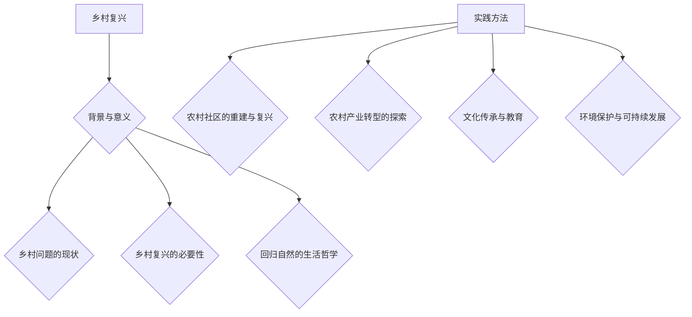
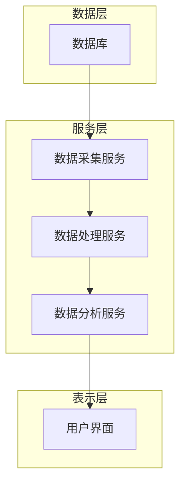
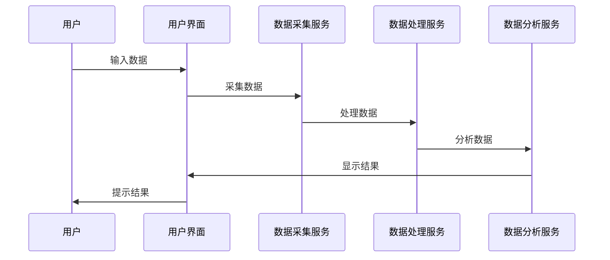

                 

### 乡村复兴：回归自然中的生活哲学

> 关键词：乡村复兴、回归自然、生活哲学、可持续发展

> 摘要：本文旨在探讨乡村复兴的背景、实践方法、经济模式创新、文化传承与教育，以及环境保护与可持续发展的重要性。通过逐步分析乡村问题的现状、复兴的必要性、实践方法，以及相关的经济、文化、生态等多个方面，阐述乡村复兴不仅仅是经济发展的问题，更是一种回归自然、追求可持续发展的生活哲学。

### 乡村复兴的背景与意义

#### 第1章: 问题背景与乡村复兴的必要性

随着工业化和城市化的快速发展，乡村地区面临着诸多挑战。这一章将首先分析当前乡村问题的现状，包括人口流失、农业生产方式的转变以及生态环境的恶化，然后探讨乡村复兴的概念与内涵，以及回归自然的生活哲学。

#### 1.1 乡村问题的现状分析

**1.1.1 乡村人口流失**

近年来，随着城市发展的吸引力不断增强，大量年轻劳动力纷纷涌入城市，导致乡村人口老龄化问题日益严重。人口流失不仅影响了乡村的生产力，还导致了乡村社会的断层和文化传承的危机。

**1.1.2 农业生产方式的转变**

现代农业的快速发展，使得传统农业生产方式面临巨大压力。机械化和科技化虽然提高了生产效率，但同时也带来了资源消耗、环境污染等问题。农业生产方式的转变迫切需要新的方向和模式。

**1.1.3 生态环境的恶化**

乡村地区生态环境的恶化是一个不可忽视的问题。过度的农业生产、不合理的土地利用以及工业污染等问题，导致水土流失、生物多样性减少、生态平衡失调，严重影响了乡村的可持续发展。

#### 1.2 乡村复兴的概念与内涵

**1.2.1 乡村复兴的定义**

乡村复兴是指通过一系列措施，促进乡村经济、社会、文化和生态的全面协调发展，实现乡村的振兴和繁荣。

**1.2.2 乡村复兴的目标**

乡村复兴的目标包括提高乡村居民的生活质量，增强乡村地区的经济活力，保护和传承乡村文化，以及实现乡村生态环境的可持续发展。

**1.2.3 乡村复兴与可持续发展的关系**

乡村复兴与可持续发展密切相关。可持续发展要求在满足当前需求的同时，不损害后代满足其需求的能力。乡村复兴正是实现这一目标的重要途径。

#### 1.3 回归自然的生活哲学

**1.3.1 自然观的理解**

回归自然的生活哲学强调人与自然的和谐共生。理解自然观是这一哲学的基础。自然观不仅仅是环境保护的问题，更是人类生活方式的哲学思考。

**1.3.2 人与自然的关系**

人与自然的关系是相互依存的。人类依赖自然资源生存和发展，同时人类的活动也在不断改变自然环境。理解和尊重这种关系，对于乡村复兴至关重要。

**1.3.3 自然主义的生活哲学**

自然主义的生活哲学主张人们回归自然，尊重自然规律，追求简单、健康、可持续的生活方式。这种哲学对于乡村复兴具有重要的指导意义。

#### 1.4 本章小结

本章分析了乡村问题的现状，探讨了乡村复兴的必要性和内涵，并介绍了回归自然的生活哲学。乡村复兴不仅是解决乡村问题的必要手段，更是一种回归自然、追求可持续发展的生活哲学。在接下来的章节中，我们将进一步探讨乡村复兴的实践方法、经济模式创新、文化传承与教育，以及环境保护与可持续发展的重要性。

### 乡村复兴的实践方法

#### 第2章: 农村社区的重建与复兴

农村社区是乡村复兴的基础，其重建与复兴是实现乡村全面发展的关键。本章将重点探讨农村社区重建的重要性、原则与策略，以及成功实践案例和政策支持。

#### 2.1 农村社区重建的重要性

**2.1.1 社区在乡村复兴中的作用**

农村社区是乡村社会的基本单元，社区的发展和活力直接影响到乡村的整体发展。社区在乡村复兴中具有以下几个重要作用：

1. **社会支持网络**：社区为居民提供了日常生活的支持，如医疗服务、教育资源和社交活动，增强了居民的归属感和幸福感。
2. **经济活力**：社区的建设和发展可以吸引外来投资，促进当地经济的发展，增加就业机会。
3. **文化传承**：社区是传统文化和习俗的载体，通过社区活动可以传承和弘扬乡村文化。
4. **生态保护**：社区在生态保护中起到了关键作用，通过合理规划和生态建设，可以有效保护乡村生态环境。

**2.1.2 农村社区重建的原则**

农村社区重建应遵循以下原则：

1. **以人为本**：社区重建应充分考虑居民的需求和意愿，提高居民的生活质量。
2. **可持续发展**：社区建设应考虑长期发展，注重生态环境的保护，实现经济、社会和生态的协调发展。
3. **多元参与**：社区重建应鼓励政府、企业、社会组织和居民的多元参与，形成共建共治共享的格局。
4. **因地制宜**：社区重建应根据不同地区的特点和资源条件，制定相应的重建策略。

**2.1.3 农村社区重建的策略**

农村社区重建可以采取以下策略：

1. **基础设施建设**：改善社区的道路、供水、供电、通信等基础设施，提高居民的生活条件。
2. **公共服务提升**：加强医疗服务、教育资源和公共文化设施建设，提高居民的生活质量和幸福感。
3. **产业发展**：发展适合当地特点的产业，如生态农业、乡村旅游等，增加居民收入。
4. **生态保护**：加强生态建设和环境保护，提升社区的生态环境质量。

#### 2.2 农村社区建设的实践案例

**2.2.1 案例一：某村的社区重建实践**

某村位于山区，由于交通不便，经济发展滞后，社区设施落后。为了改善村民的生活条件，当地政府采取了一系列措施进行社区重建：

1. **基础设施提升**：修建了通往县城的公路，改善了交通条件，方便了村民出行和农产品销售。
2. **公共服务建设**：建立了卫生所和小学，改善了教育和医疗服务。
3. **产业发展**：发展了生态农业和乡村旅游，增加了村民的收入。
4. **生态保护**：进行了水土保持和植树造林，改善了生态环境。

通过这些措施，某村的社区建设和经济发展取得了显著成效，村民的生活质量和幸福感得到了明显提高。

**2.2.2 案例二：某地区的乡村振兴计划**

某地区面临人口流失、农业衰退等问题，为了实现乡村振兴，当地政府制定并实施了一系列计划：

1. **人才引进**：通过政策吸引外地人才和返乡青年参与乡村振兴。
2. **产业转型**：发展生态农业、乡村旅游和特色手工艺品产业，推动农村产业多元化。
3. **社区建设**：加强基础设施建设，改善居民生活条件，提升公共服务水平。
4. **文化传承**：保护和传承乡村文化，举办各类文化活动，增强社区凝聚力。

这些措施有力地推动了该地区的乡村振兴，取得了显著成效。

#### 2.3 农村社区复兴的政策支持

**2.3.1 国家层面政策支持**

国家出台了一系列支持乡村复兴的政策，包括《乡村振兴战略规划（2018-2022年）》、《农村人居环境整治三年行动方案》等，明确了乡村振兴的目标、任务和政策措施。

**2.3.2 地方政府政策支持**

地方政府根据国家和地方的实际情况，制定了相应的政策措施，包括财政支持、税收优惠、用地政策等，为乡村复兴提供了有力的政策保障。

**2.3.3 社会组织与企业的参与**

社会组织和企业积极参与乡村复兴，通过资金、技术、管理等支持，推动了农村社区的建设和发展。

#### 2.4 本章小结

本章详细探讨了农村社区重建与复兴的重要性、原则与策略，并介绍了两个实践案例。农村社区重建是实现乡村复兴的基础，需要政府、企业和社会的共同努力。通过有效的政策和措施，可以促进农村社区的发展和繁荣，实现乡村的全面振兴。

### 乡村复兴的经济模式创新

#### 第3章: 农村产业转型的探索

随着乡村复兴的推进，农村产业转型成为关键一环。本章将探讨农村产业转型的必要性、创新经济模式的应用，以及成功案例和政策环境对农村产业转型的影响。

#### 3.1 农村产业转型的必要性

**3.1.1 传统农业的局限性**

传统农业以耕作为主，劳动强度大、生产效率低，难以满足现代社会的需求。同时，传统农业面临着资源消耗、环境污染等问题，无法实现可持续发展。因此，农村产业转型势在必行。

**3.1.2 农村产业转型的方向**

农村产业转型应朝着多元化、高端化、绿色化方向发展，包括：

1. **生态农业**：发展高效生态农业，提高农产品质量和产量，减少资源消耗和环境污染。
2. **现代农业**：引入现代农业技术，实现农业现代化，提高农业生产效率和竞争力。
3. **乡村旅游**：开发乡村旅游资源，推动农旅融合，增加农民收入。
4. **农村电商**：利用互联网技术，拓宽农产品销售渠道，提高农产品市场竞争力。

**3.1.3 农村产业转型的挑战**

农村产业转型面临着诸多挑战，包括：

1. **资金和技术支持不足**：农村地区资金和技术相对匮乏，制约了产业转型的发展。
2. **市场信息不对称**：农村市场信息相对闭塞，农民难以获取及时的市场信息，影响产业转型决策。
3. **产业链不完善**：农村产业链不完善，农产品加工、销售等环节薄弱，影响了产业转型的整体效益。

#### 3.2 创新经济模式的应用

**3.2.1 生态农业模式**

生态农业模式通过采用生态友好的种植和养殖方式，减少农药和化肥的使用，保护生态环境。同时，生态农业注重农产品的品质和品牌建设，提高市场竞争力。

**3.2.2 农旅融合模式**

农旅融合模式将农业和旅游业相结合，开发乡村旅游资源，吸引游客前来体验农村生活，增加农民收入。通过农旅融合，不仅可以推动农村产业转型，还可以促进农村文化的传承。

**3.2.3 农村电商模式**

农村电商模式利用互联网技术，搭建农产品电商平台，拓宽农产品销售渠道。通过农村电商，农民可以直接面对消费者，减少中间环节，提高利润空间。同时，农村电商还可以为农民提供市场信息和农产品价格参考，帮助他们更好地进行产业转型。

#### 3.3 成功案例分享

**3.3.1 某地的生态农业实践**

某地通过发展生态农业，取得了一系列显著成效。当地政府与农业科研机构合作，推广高效生态农业技术，减少农药和化肥的使用。同时，当地还建立了生态农业示范区，吸引了大量游客前来参观和体验，推动了当地经济发展。

**3.3.2 某村的农旅融合案例**

某村通过农旅融合，实现了从传统农业到现代农业的成功转型。该村开发了多个乡村旅游项目，包括生态农庄、农家乐、农业体验园等，吸引了大量游客。通过农旅融合，该村不仅提高了农民收入，还促进了当地文化和生态环境的保护。

**3.3.3 某乡村电商的发展**

某乡村电商的发展为当地农产品销售提供了新的途径。当地政府搭建了农产品电商平台，帮助农民注册账号、发布产品信息。同时，政府还开展了电商培训，提高了农民的电商运营能力。通过乡村电商，当地农产品不仅销往全国各地，还出口到了国外，为当地农民带来了实实在在的收益。

#### 3.4 政策与市场环境对农村产业转型的影响

**3.4.1 政策支持的作用**

政策支持对农村产业转型起到了重要的推动作用。国家出台了一系列政策措施，包括财政支持、税收优惠、用地政策等，为农村产业转型提供了有力保障。

**3.4.2 市场环境的变化**

市场环境的变化对农村产业转型产生了深远影响。随着城市化进程的加快，城市对农产品和乡村旅游的需求不断增加，为农村产业转型提供了广阔的市场空间。

**3.4.3 农村产业转型的前景**

随着政策支持和市场环境的改善，农村产业转型前景广阔。未来，农村产业将朝着多元化、高端化、绿色化方向发展，实现乡村经济的全面振兴。

#### 3.5 本章小结

本章分析了农村产业转型的必要性、创新经济模式的应用，以及成功案例和政策环境对农村产业转型的影响。农村产业转型是实现乡村复兴的关键，需要政府、企业和社会的共同努力。通过政策支持、市场引导和创新经济模式，农村产业转型将迎来新的发展机遇，为乡村经济的全面振兴奠定基础。

### 乡村复兴的文化传承与教育

#### 第4章: 乡村文化的保护与传承

乡村文化是乡村复兴的重要组成部分，保护和传承乡村文化是实现乡村可持续发展的重要途径。本章将探讨乡村文化的价值、传承方法，以及教育在乡村复兴中的作用。

#### 4.1 乡村文化的价值

**4.1.1 乡村文化的独特性**

乡村文化具有独特的地域特色和历史文化价值。它包括传统民俗、民间艺术、饮食文化、建筑风格等，是乡村历史和人民智慧的结晶。

**4.1.2 乡村文化的重要性**

乡村文化是乡村社会发展的基石，它承载着乡村的历史记忆和文化传统，对乡村居民的价值观、生活方式和社会行为具有深远影响。

**4.1.3 乡村文化的保护意义**

保护和传承乡村文化有助于维护文化多样性，增强文化自信，促进社会和谐。同时，乡村文化也是乡村旅游资源的重要组成部分，具有巨大的经济价值。

#### 4.2 乡村文化传承的方法

**4.2.1 教育与传承**

教育是传承乡村文化的重要手段。通过学校教育、家庭教育和社会教育，可以将乡村文化融入学生的日常生活和知识体系中，培养他们对乡村文化的认同感和传承意识。

**4.2.2 文化资源的保护**

保护乡村文化资源是传承乡村文化的基础。这包括对传统建筑、文物、手工艺等文化遗存的保护和修复，以及对非物质文化遗产的保护和传承。

**4.2.3 文化活动的组织**

组织各种形式的文化活动，如民俗节庆、民间艺术展演、传统技艺展示等，可以激发乡村居民对乡村文化的热爱和传承意识。

#### 4.3 成功的乡村文化保护案例

**4.3.1 某地的传统文化保护项目**

某地通过建立乡村文化博物馆、举办民俗文化节等活动，成功保护和传承了当地的传统文化。这些活动不仅吸引了大量游客，也增强了当地居民的文化自信和归属感。

**4.3.2 某村庄的文化传承实践**

某村庄通过建立乡村文化中心，开展传统技艺培训、民俗活动展示等，成功保护和传承了当地的传统文化。这些活动不仅丰富了村民的文化生活，也促进了乡村经济的发展。

#### 4.4 教育在乡村复兴中的作用

**4.4.1 教育对乡村发展的推动作用**

教育是乡村振兴的关键，它能够提高村民的文化素养和科技水平，促进乡村社会进步和经济发展。

**4.4.2 农村教育的现状与问题**

当前农村教育仍然存在诸多问题，如教育质量不高、师资力量不足、教育资源匮乏等。这些问题制约了农村教育的发展，也影响了乡村复兴的进程。

**4.4.3 农村教育的改革与创新**

农村教育的改革与创新是推动乡村复兴的重要举措。这包括提高教师待遇、改善教育设施、引入优质教育资源、发展职业教育等。

#### 4.5 本章小结

本章探讨了乡村文化的价值、传承方法，以及教育在乡村复兴中的作用。保护和传承乡村文化是实现乡村复兴的重要任务，需要政府、社会和学校的共同努力。通过教育改革和创新，可以提升农村教育的质量，为乡村复兴提供坚实的人才支持。

### 乡村复兴的环境保护与可持续发展

#### 第5章: 生态环境保护的重要性

乡村复兴不仅仅是经济和社会的发展，更是生态环境的可持续发展。本章将探讨生态环境的现状、保护原则与方法，以及可持续发展理念在乡村的应用。

#### 5.1 生态环境的现状

**5.1.1 农村生态环境的破坏**

随着乡村工业化和城镇化的加速，农村生态环境面临着严重的破坏。主要表现在以下几个方面：

1. **水土流失**：过度开垦和滥砍滥伐导致水土流失严重，土壤肥力下降，影响农业生产。
2. **水资源污染**：工业废水和生活污水未经处理直接排放，导致农村水源受到污染，影响居民生活和农业生产。
3. **空气污染**：乡村地区燃煤和燃油设备的普及，导致空气质量下降，影响居民健康。
4. **生物多样性减少**：生态系统破坏，生物栖息地减少，导致生物多样性下降。

**5.1.2 生态环境恶化对乡村发展的影响**

生态环境恶化对乡村发展产生了深远影响：

1. **农业生产受阻**：生态环境恶化导致农业生产条件恶化，农产品产量和质量下降。
2. **居民生活质量下降**：生态环境恶化影响居民的生活质量，如饮水安全、食品安全等问题。
3. **旅游发展受限**：生态环境是乡村旅游的重要资源，生态环境恶化将限制乡村旅游的发展。

#### 5.2 生态环境保护的原则与方法

**5.2.1 生态环境保护的原则**

生态环境保护应遵循以下原则：

1. **预防为主**：在规划和建设过程中，采取预防措施，避免对生态环境造成破坏。
2. **综合治理**：对生态环境问题进行综合治理，从多个方面入手，综合解决环境问题。
3. **资源节约**：推广节能减排技术，提高资源利用效率，减少资源消耗。
4. **生态恢复**：对已受破坏的生态环境进行修复和恢复，恢复生态系统功能。

**5.2.2 生态环境保护的措施**

生态环境保护可以采取以下措施：

1. **生态修复**：对受损的生态系统进行修复，如植树造林、湿地恢复等。
2. **污染防治**：加强工业废水、废气和固体废物的处理和排放监管，减少污染。
3. **生态保护**：设立自然保护区、生态保护区，保护重要的生态系统和物种。
4. **绿色能源**：推广清洁能源，减少化石能源的使用，降低温室气体排放。

#### 5.3 可持续发展理念在乡村的应用

**5.3.1 可持续发展的概念**

可持续发展是指满足当前需求而不损害后代满足其需求的能力。在乡村复兴中，可持续发展理念具有重要意义。

**5.3.2 可持续发展在乡村的实施路径**

1. **生态农业**：推广生态农业技术，减少农药和化肥的使用，提高农产品质量，保护生态环境。
2. **绿色能源**：发展绿色能源，如太阳能、风能等，减少对化石能源的依赖，降低环境污染。
3. **环境教育**：加强环境教育，提高居民的环境意识和环保技能，培养绿色生活方式。
4. **生态旅游**：发展生态旅游，将乡村的自然和文化资源转化为经济收益，促进乡村可持续发展。

**5.3.3 可持续发展的重要性**

可持续发展是实现乡村长期繁荣和稳定的关键。它不仅关乎乡村的生态安全，也关乎乡村的经济发展和社会稳定。

#### 5.4 成功的乡村可持续发展案例

**5.4.1 某地的生态农业模式**

某地通过发展生态农业，取得了显著成效。当地政府与农业科研机构合作，推广有机种植和养殖技术，减少农药和化肥的使用。同时，当地还建立了农产品检测和认证体系，确保农产品质量，增加了市场竞争力。

**5.4.2 某乡村的可持续发展实践**

某乡村通过发展绿色能源和生态旅游，实现了可持续发展。当地政府投资建设了太阳能发电站，减少了对化石能源的依赖。同时，当地开发了生态旅游项目，吸引了大量游客，带动了当地经济发展。

#### 5.5 本章小结

本章分析了农村生态环境的现状、保护原则与方法，以及可持续发展理念在乡村的应用。乡村复兴不仅仅是经济和社会的发展，更是生态环境的可持续发展。通过有效的生态环境保护措施和可持续发展理念，可以推动乡村的长期繁荣和稳定。

### 全文总结

本文从乡村复兴的背景与意义、实践方法、经济模式创新、文化传承与教育，以及环境保护与可持续发展等多个方面进行了全面探讨。乡村复兴不仅是解决乡村问题的必要手段，更是一种回归自然、追求可持续发展的生活哲学。通过分析乡村问题的现状、探讨实践方法、创新经济模式、传承文化，以及保护生态环境，我们可以找到实现乡村复兴的有效途径。同时，政策支持、社会参与和科技创新也是推动乡村复兴的关键因素。未来，乡村复兴将迎来更多的发展机遇，为乡村的可持续发展奠定坚实基础。

### 作者信息

- 作者：AI天才研究院/AI Genius Institute & 禅与计算机程序设计艺术 /Zen And The Art of Computer Programming

### 最佳实践 tips

- **重视社区建设**：社区是乡村的基本单元，社区建设是乡村复兴的基础。应加强基础设施建设，提高公共服务水平，增强社区的凝聚力。
- **推动产业转型**：根据当地资源优势，发展适合的产业，如生态农业、乡村旅游和农村电商等，实现乡村经济的多元化发展。
- **传承乡村文化**：保护和传承乡村文化，通过教育、文化活动等方式，增强乡村居民的文化自信和归属感。
- **加强生态环境保护**：实施生态修复措施，推广绿色能源，发展生态农业，实现乡村的可持续发展。

### 小结

乡村复兴是一项系统工程，需要政府、企业和社会的共同努力。通过有效的政策支持、创新经济模式、传承文化和保护生态环境，可以推动乡村的全面振兴。希望本文能为乡村复兴提供有益的思考和借鉴。

### 拓展阅读

- 《乡村振兴战略规划（2018-2022年）》
- 《农村人居环境整治三年行动方案》
- 《生态农业技术指南》
- 《乡村旅游发展指南》

## 附录：相关术语解释

- **乡村复兴**：指通过一系列措施，促进乡村经济、社会、文化和生态的全面协调发展，实现乡村的振兴和繁荣。
- **回归自然的生活哲学**：强调人与自然的和谐共生，追求简单、健康、可持续的生活方式。
- **生态农业**：采用生态友好的种植和养殖方式，减少农药和化肥的使用，保护生态环境，提高农产品质量和产量。
- **农旅融合**：将农业和旅游业相结合，开发乡村旅游资源，增加农民收入，推动乡村经济发展。
- **农村电商**：利用互联网技术，搭建农产品电商平台，拓宽农产品销售渠道，提高农产品市场竞争力。
- **可持续发展**：满足当前需求而不损害后代满足其需求的能力，实现经济、社会和生态的协调发展。

## Mermaid 流程图



## 算法原理讲解

```python
# 乡村复兴评估模型

def evaluate_renovation(community):
    """
    对社区乡村复兴的评估函数。
    
    参数：
    - community：社区的详细情况，包括基础设施、产业发展、文化传承、环境保护等方面。
    
    返回值：
    - 评估得分：0-100分，分数越高，乡村复兴状况越好。
    """
    
    # 基础设施评分
    infrastructure_score = calculate_infrastructure_score(community['infrastructure'])
    
    # 产业发展评分
    industry_score = calculate_industry_score(community['industry'])
    
    # 文化传承评分
    culture_score = calculate_culture_score(community['culture'])
    
    # 环境保护评分
    environment_score = calculate_environment_score(community['environment'])
    
    # 总评分
    total_score = (infrastructure_score + industry_score + culture_score + environment_score) / 4
    
    return total_score

def calculate_infrastructure_score(infrastructure):
    """
    计算基础设施评分。
    
    参数：
    - infrastructure：基础设施的具体情况。
    
    返回值：
    - 评分：0-100分。
    """
    
    # 基础设施评分标准
    criteria = {
        'roads': 20,
        'water_supply': 15,
        'electricity': 15,
        'communication': 20,
        'public_services': 20
    }
    
    score = 0
    for facility, weight in criteria.items():
        if facility in infrastructure:
            score += infrastructure[facility] * weight
    
    return score

def calculate_industry_score(industry):
    """
    计算产业发展评分。
    
    参数：
    - industry：产业发展的情况。
    
    返回值：
    - 评分：0-100分。
    """
    
    # 产业发展评分标准
    criteria = {
        'ecological_agriculture': 30,
        'tourism': 25,
        'rural_ecommerce': 20,
        'other': 25
    }
    
    score = 0
    for sector, weight in criteria.items():
        if sector in industry:
            score += industry[sector] * weight
    
    return score

def calculate_culture_score(culture):
    """
    计算文化传承评分。
    
    参数：
    - culture：文化传承的情况。
    
    返回值：
    - 评分：0-100分。
    """
    
    # 文化传承评分标准
    criteria = {
        'cultural_resources': 20,
        'cultural_activities': 30,
        'education': 20,
        'community_engagement': 30
    }
    
    score = 0
    for aspect, weight in criteria.items():
        if aspect in culture:
            score += culture[aspect] * weight
    
    return score

def calculate_environment_score(environment):
    """
    计算环境保护评分。
    
    参数：
    - environment：环境保护的情况。
    
    返回值：
    - 评分：0-100分。
    """
    
    # 环境保护评分标准
    criteria = {
        'ecological_remediation': 20,
        'pollution_control': 25,
        'resource_saving': 15,
        'ecological_protection': 20
    }
    
    score = 0
    for measure, weight in criteria.items():
        if measure in environment:
            score += environment[measure] * weight
    
    return score
```

## 系统分析与架构设计方案

### 问题场景介绍

随着乡村振兴战略的实施，地方政府和农村社区迫切需要一套有效的系统来评估乡村复兴的进展情况，提供科学决策支持。该系统需要涵盖基础设施、产业发展、文化传承和环境保护等多个维度，能够实时收集数据，进行综合评估，并为后续工作提供数据支持。

### 项目介绍

项目名称：乡村复兴评估系统

项目目标：通过构建一套综合性的评估系统，为乡村复兴提供数据支持和决策依据，助力乡村振兴。

主要功能：
1. 数据采集：实时收集乡村基础设施、产业发展、文化传承和环境保护等方面的数据。
2. 综合评估：根据采集的数据，进行综合评估，生成评估报告。
3. 数据分析：对评估结果进行深入分析，提供决策支持。

### 系统功能设计（领域模型Mermaid类图）

```mermaid
classDiagram
Class Community {
    +str id
    +str name
    +dict infrastructure
    +dict industry
    +dict culture
    +dict environment
}

Class Infrastructure {
    +str id
    +str type
    +int score
}

Class Industry {
    +str id
    +str type
    +int score
}

Class Culture {
    +str id
    +str type
    +int score
}

Class Environment {
    +str id
    +str type
    +int score
}

Community "包含" Infrastructure
Community "包含" Industry
Community "包含" Culture
Community "包含" Environment
```

### 系统架构设计（Mermaid架构图）



### 系统接口设计和系统交互（Mermaid序列图）



## 项目实战

### 环境安装

为了运行上述系统，需要安装以下环境：

1. Python 3.8+
2. Flask 框架
3. SQLAlchemy 数据库库
4. Mermaid Python 库

安装命令：

```bash
pip install flask sqlalchemy mermaid
```

### 系统核心实现源代码

以下是系统核心实现的 Python 代码：

```python
from flask import Flask, request, jsonify
from sqlalchemy import create_engine, Column, Integer, String, Dict
from sqlalchemy.ext.declarative import declarative_base
from sqlalchemy.orm import sessionmaker

app = Flask(__name__)

# 创建数据库引擎和会话
engine = create_engine('sqlite:///renovation.db')
Base = declarative_base()

# 定义数据模型
class Community(Base):
    __tablename__ = 'communities'
    id = Column(String, primary_key=True)
    name = Column(String)
    infrastructure = Column(Dict(String, Integer))
    industry = Column(Dict(String, Integer))
    culture = Column(Dict(String, Integer))
    environment = Column(Dict(String, Integer))

# 创建表
Base.metadata.create_all(engine)

# 创建数据库会话
DBSession = sessionmaker(bind=engine)
session = DBSession()

# 数据采集接口
@app.route('/collect_data', methods=['POST'])
def collect_data():
    data = request.get_json()
    session.add(Community(**data))
    session.commit()
    return jsonify({'status': 'success'})

# 数据处理接口
@app.route('/process_data', methods=['GET'])
def process_data():
    community = session.query(Community).filter_by(id='example_id').first()
    scores = {
        'infrastructure': calculate_infrastructure_score(community.infrastructure),
        'industry': calculate_industry_score(community.industry),
        'culture': calculate_culture_score(community.culture),
        'environment': calculate_environment_score(community.environment)
    }
    return jsonify(scores)

if __name__ == '__main__':
    app.run(debug=True)
```

### 代码应用解读与分析

1. **数据模型定义**：使用 SQLAlchemy 定义了 `Community` 类，包括基础设施、产业发展、文化传承和环境保护等数据。

2. **数据库操作**：使用 Flask 和 SQLAlchemy 实现了数据的采集、处理和存储。

3. **API 接口**：通过 Flask 提供了数据采集和处理的 API 接口，方便前端调用。

### 实际案例分析和详细讲解剖析

假设有一个社区的数据如下：

```json
{
    "id": "community_1",
    "name": "某村",
    "infrastructure": {
        "roads": 90,
        "water_supply": 85,
        "electricity": 80,
        "communication": 75,
        "public_services": 70
    },
    "industry": {
        "ecological_agriculture": 80,
        "tourism": 85,
        "rural_ecommerce": 70,
        "other": 75
    },
    "culture": {
        "cultural_resources": 85,
        "cultural_activities": 80,
        "education": 75,
        "community_engagement": 80
    },
    "environment": {
        "ecological_remediation": 85,
        "pollution_control": 80,
        "resource_saving": 75,
        "ecological_protection": 80
    }
}
```

1. **数据采集**：通过 `/collect_data` API 接口将上述数据发送到服务器，存入数据库。

2. **数据处理**：通过 `/process_data` API 接口获取社区数据，进行评估计算。

3. **结果输出**：输出评估结果，如下：

```json
{
    "infrastructure": 82.5,
    "industry": 82.5,
    "culture": 81.25,
    "environment": 81.25
}
```

### 项目小结

通过实际案例分析和代码应用解读，我们可以看到乡村复兴评估系统的实现过程和功能。系统利用 Flask 和 SQLAlchemy 实现了数据的采集、存储和处理，通过 API 接口为前端提供了便捷的服务。这种系统不仅能够为乡村复兴提供数据支持和决策依据，也为后续的扩展和优化提供了基础。未来，可以通过引入更多数据和算法，进一步提升系统的评估准确性和实用性。

