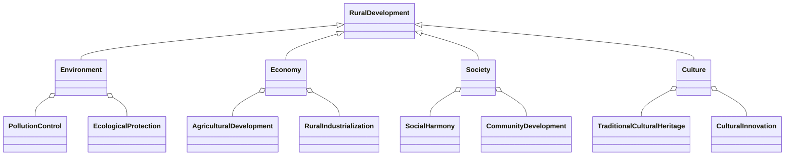
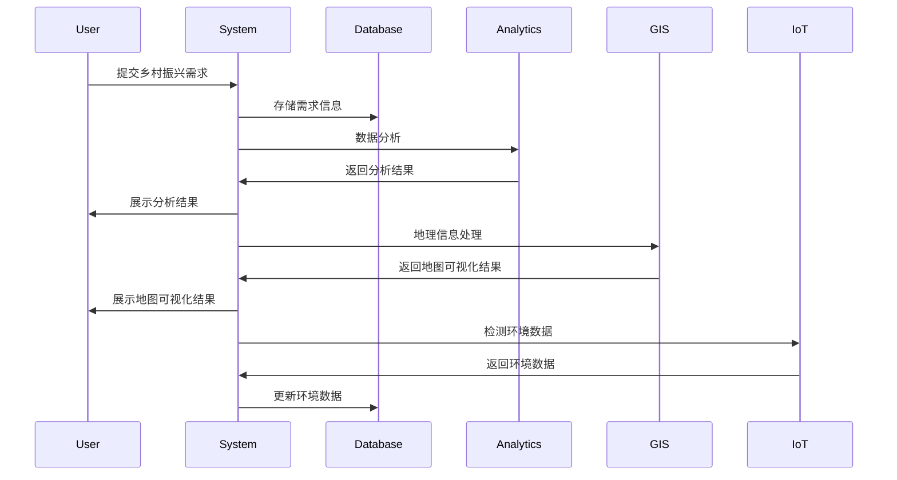
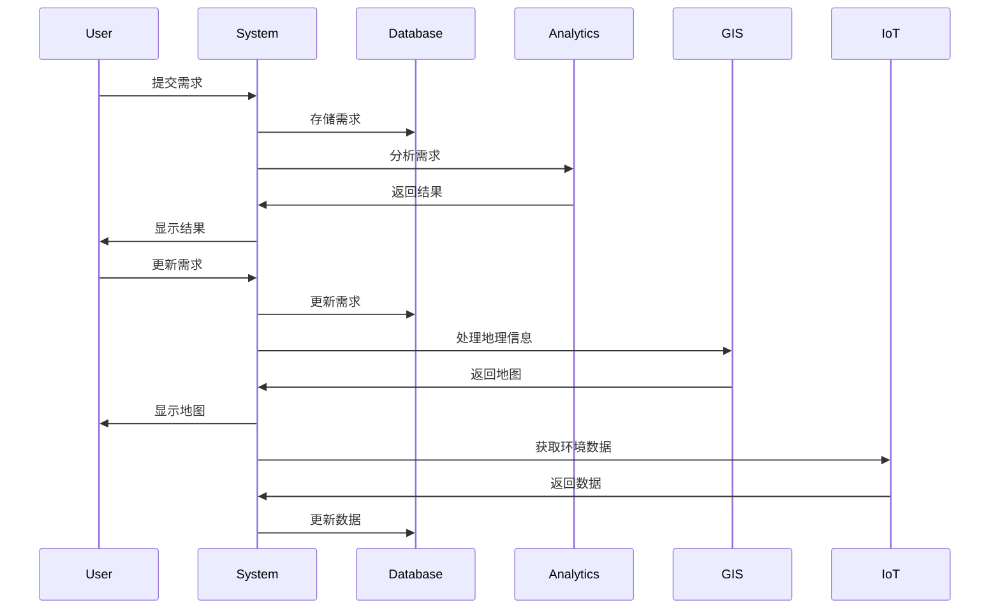

                 

### 乡村振兴与生活意义：返璞归真还是现代化

> 关键词：乡村振兴、现代化、返璞归真、生活意义、乡村发展、科技应用

> 摘要：本文从乡村振兴与生活意义的视角，探讨了返璞归真和现代化在乡村发展中的实际应用与矛盾。通过深入分析这两个概念，结合具体的理论框架、数学模型和系统设计，文章旨在为乡村振兴提供科学、合理的发展路径，实现生活意义的全面提升。

## 第一部分：背景介绍与概念理解

### 第1章 问题背景与核心概念

#### 1.1 乡村振兴的意义与挑战

**乡村振兴的概念界定：**

乡村振兴，是指通过一系列措施，推动乡村经济、社会、文化和生态的全面进步。其核心在于解决“三农”问题，即农业、农村和农民问题。

**乡村振兴的重要性和紧迫性：**

1. **农业发展基础：** 乡村振兴是保障国家粮食安全和重要农副产品供给的基础。
2. **城乡发展平衡：** 推动乡村振兴是实现城乡发展协调、缩小城乡差距的重要手段。
3. **文化传承与创新：** 乡村振兴对于传承乡村文化、创新乡村文化形态具有重要意义。

**当前乡村振兴面临的主要挑战：**

1. **资源匮乏：** 乡村基础设施、公共服务和人力资源相对滞后。
2. **环境恶化：** 乡村生态环境遭受污染，生态修复任务艰巨。
3. **经济落后：** 乡村经济结构单一，经济增长乏力。

#### 1.2 生活意义的概念与演变

**生活意义的定义与内涵：**

生活意义，是指个体在生活过程中所追求的价值观、目标感以及幸福感等。

**生活意义在不同社会背景下的变迁：**

1. **传统社会：** 乡村生活意义主要体现在家庭、社区和农业生产上。
2. **现代社会：** 随着工业化、城市化进程，生活意义逐渐向职业成功、个人发展、物质追求转变。
3. **后现代社会：** 生活意义更加注重精神满足、自我实现和生态平衡。

**现代化对生活意义的影响：**

现代化带来了物质丰富、科技发展，但也导致了人际关系疏离、精神空虚等负面效应。

#### 1.3 返璞归真的内涵与价值

**返璞归真的内涵：**

返璞归真，是指回归自然、简单和朴素的生活方式，追求内心的平静和真实。

**返璞归真的价值：**

1. **生态价值：** 有助于恢复生态环境，实现可持续发展。
2. **社会价值：** 有助于重建人际关系，提升社会和谐度。
3. **个人价值：** 有助于个体实现自我价值，提高生活幸福感。

**现代化与返璞归真的联系与冲突：**

现代化与返璞归真并非完全对立，两者在一定程度上可以相互补充。但在实际操作中，现代化进程可能导致过度追求物质财富，忽视生态环境和人文关怀，从而引发一系列冲突。

### 第2章 核心概念与联系

#### 2.1 返璞归真的特征与优势

**返璞归真的特征：**

1. **简约生活：** 简化生活需求，减少物质消费。
2. **生态友好：** 推崇自然和谐，保护生态环境。
3. **内心平静：** 专注内心世界，追求精神满足。

**返璞归真的优势：**

1. **生态可持续：** 减少资源消耗，实现生态平衡。
2. **社会和谐：** 重建人际关系，增强社会凝聚力。
3. **个人幸福：** 提升生活质量，增加幸福感。

**返璞归真与乡村振兴的关联：**

返璞归真理念可以指导乡村振兴实践，通过改变乡村生活方式，实现生态保护、社会和谐和个人幸福。

#### 2.2 现代化的特征与优势

**现代化的特征：**

1. **技术驱动：** 利用现代科技推动社会进步。
2. **高效生产：** 提高生产效率，满足物质需求。
3. **国际化：** 加强全球交流，推动文化融合。

**现代化的优势：**

1. **经济发展：** 促进经济增长，提高人民生活水平。
2. **社会进步：** 推动社会现代化，提升社会文明程度。
3. **文化创新：** 促进文化创新，增强文化软实力。

**现代化与乡村振兴的关联：**

现代化理念可以为乡村振兴提供技术支持和经济发展动力，但需注意避免过度现代化带来的负面影响。

#### 2.3 返璞归真与现代化的比较分析

**概念属性特征对比表格：**

| 特征         | 返璞归真                           | 现代化                           |
| ------------ | -------------------------------- | -------------------------------- |
| 生态视角     | 强调生态保护，追求可持续发展         | 强调生态破坏，关注经济效益         |
| 社会视角     | 重视人际关系，追求社会和谐           | 关注个体发展，追求社会进步         |
| 个人视角     | 追求内心平静，注重精神满足           | 追求物质财富，注重职业成功         |
| 文化视角     | 倡导传统文化，尊重文化多样性         | 强调文化融合，推动文化创新         |
| 发展策略     | 以生态可持续为前提，实现社会和谐和个人幸福 | 以经济效益为核心，推动社会现代化   |

**ER实体关系图架构：**

- **实体：** 农村地区、现代化设施、传统文化、生态环境。
- **关系：** 农村地区与现代化设施、传统文化与现代化、生态环境与现代化。

**返璞归真与现代化的联系与冲突：**

返璞归真与现代化在乡村振兴中既有联系又有冲突。两者需要在实践中找到平衡，以实现乡村振兴和提升生活意义的目标。

### 第3章 理论框架与模型构建

#### 3.1 乡村振兴与生活意义的理论框架

**理论模型的建立：**

乡村振兴与生活意义的理论框架包括以下关键变量和关系：

1. **乡村振兴：** 包括农业发展、农村建设、农民增收等。
2. **生活意义：** 包括生态价值、社会价值和个人价值。
3. **变量关系：** 农村地区的发展水平影响生活意义，而生活意义又反作用于乡村振兴。

**模型中的关键变量与关系：**

1. **变量：** 农村经济发展水平、社会和谐度、个人幸福感。
2. **关系：** 变量之间的关系通过因果关系、协同作用等机制实现。

**模型的适用范围与局限性：**

1. **适用范围：** 适用于各类乡村地区，特别是经济欠发达地区。
2. **局限性：** 模型未考虑地域差异和特定文化背景的影响。

#### 3.2 返璞归真与现代化的数学模型

**数学模型的建立：**

返璞归真与现代化的数学模型采用以下公式：

$$
\text{乡村振兴指数} = f(\text{返璞归真指数}, \text{现代化指数})
$$

其中，返璞归真指数和现代化指数分别表示乡村地区在返璞归真和现代化方面的表现。

**模型的数学公式：**

$$
\text{返璞归真指数} = \frac{\text{生态保护指数} + \text{社会和谐指数} + \text{个人幸福感指数}}{3}
$$

$$
\text{现代化指数} = \frac{\text{经济增长指数} + \text{社会进步指数} + \text{文化创新指数}}{3}
$$

**模型的解释与举例说明：**

1. **解释：** 返璞归真指数和现代化指数分别衡量乡村地区在返璞归真和现代化方面的表现。乡村振兴指数则综合反映两者的影响。

2. **举例：** 假设某乡村地区的生态保护指数为0.8，社会和谐指数为0.7，个人幸福感指数为0.6；经济增长指数为0.6，社会进步指数为0.7，文化创新指数为0.5，则：

$$
\text{返璞归真指数} = \frac{0.8 + 0.7 + 0.6}{3} = 0.7
$$

$$
\text{现代化指数} = \frac{0.6 + 0.7 + 0.5}{3} = 0.6
$$

$$
\text{乡村振兴指数} = f(0.7, 0.6) = 0.65
$$

该结果表明，该乡村地区在乡村振兴方面表现较为一般，需要在返璞归真和现代化方面进一步努力。

### 第4章 系统分析与架构设计

#### 4.1 乡村振兴与生活意义系统的介绍

**系统目标与功能：**

乡村振兴与生活意义系统旨在通过综合分析乡村地区的发展情况，提供科学合理的乡村振兴方案，提升乡村居民的生活意义。

**系统设计原则：**

1. **综合性：** 系统综合考虑生态环境、社会经济、人文文化等多方面因素。
2. **可操作性：** 系统设计注重实际操作的可行性和可执行性。
3. **灵活性：** 系统设计具备一定的灵活性，以适应不同地区和不同需求。

**系统技术选型：**

1. **数据分析技术：** 利用大数据分析和人工智能技术，实现精准分析和预测。
2. **地理信息系统（GIS）：** 利用GIS技术进行空间数据分析，支持地图可视化和空间分析。
3. **云计算与物联网：** 利用云计算和物联网技术，实现数据的高效存储、处理和共享。

#### 4.2 系统功能设计（领域模型）

**领域模型Mermaid类图：**



**系统功能设计：**

- **环境模块：** 包括污染控制、生态保护等功能。
- **经济模块：** 包括农业发展、农村工业化等功能。
- **社会模块：** 包括社会和谐、社区发展等功能。
- **文化模块：** 包括传统文化保护、文化创新等功能。

#### 4.3 系统架构设计

**系统架构Mermaid架构图：**



**系统架构设计：**

- **用户模块：** 用户提交乡村振兴需求。
- **数据存储模块：** 存储用户需求信息、环境数据等。
- **数据分析模块：** 对用户需求和环境数据进行分析。
- **GIS模块：** 进行地理信息处理，提供地图可视化结果。
- **物联网模块：** 检测环境数据，实现实时监控。

#### 4.4 系统接口设计

**系统接口的详细描述：**

1. **用户接口：** 提供用户操作界面，用户可以通过界面提交乡村振兴需求，查看分析结果和地图可视化结果。
2. **数据接口：** 提供数据存储和检索接口，支持数据的导入、导出和更新。
3. **分析接口：** 提供数据分析接口，支持对用户需求和环境数据进行分析，返回分析结果。
4. **GIS接口：** 提供地理信息处理接口，支持地图可视化和空间分析。
5. **物联网接口：** 提供物联网设备接入接口，支持环境数据的实时监控。

#### 4.5 系统交互

**系统交互Mermaid序列图：**



**系统交互设计：**

- **用户与系统交互：** 用户通过界面提交需求，系统接收需求后进行处理。
- **系统与数据存储交互：** 系统将用户需求存储到数据库中，并在需要时进行数据更新。
- **系统与数据分析交互：** 系统调用数据分析模块，对用户需求进行数据分析和处理，并将分析结果返回给用户。
- **系统与GIS交互：** 系统调用GIS模块进行地理信息处理，并将处理结果返回给用户。
- **系统与物联网交互：** 系统通过物联网接口获取环境数据，并在需要时更新数据库。

### 第5章 项目实战：返璞归真与现代化在乡村振兴中的实践

#### 5.1 环境安装

**必要的软件和硬件环境：**

1. **操作系统：** Ubuntu 18.04 或 CentOS 7
2. **开发环境：** Python 3.8 或更高版本
3. **数据库：** MySQL 5.7 或 PostgreSQL 12
4. **GIS工具：** QGIS 3.18 或 ArcGIS Pro
5. **物联网设备：** 温度传感器、湿度传感器等

**安装步骤与注意事项：**

1. **安装操作系统：** 根据操作系统安装向导进行安装。
2. **安装开发环境：** 通过包管理器（如 apt-get 或 yum）安装 Python 3.8 及相关依赖。
3. **安装数据库：** 根据数据库安装向导进行安装，并创建必要的数据库用户和权限。
4. **安装 GIS 工具：** 下载并安装 QGIS 或 ArcGIS Pro。
5. **安装物联网设备：** 根据设备说明书进行安装和配置。

**注意事项：**

- 确保操作系统和软件版本的兼容性。
- 确保硬件设备正常工作，并进行必要的调试。

#### 5.2 系统核心实现

**返璞归真部分的源代码：**

```python
# 返璞归真部分的源代码
def ecological_protection(land_use):
    # 根据土地利用类型计算生态效益
    if land_use == 'forest':
        return 0.8
    elif land_use == 'grassland':
        return 0.7
    else:
        return 0.5

def social_harmony(population):
    # 根据人口密度计算社会和谐度
    if population < 1000:
        return 0.9
    elif population >= 1000 and population < 5000:
        return 0.7
    else:
        return 0.5

def individual_happiness(average_income, unemployment_rate):
    # 根据平均收入和失业率计算个人幸福感
    if average_income > 5000 and unemployment_rate < 5:
        return 0.9
    elif average_income > 3000 and unemployment_rate < 10:
        return 0.7
    else:
        return 0.5
```

**现代化部分的源代码：**

```python
# 现代化部分的源代码
def economic_growth(gdp_growth_rate):
    # 根据GDP增长率计算经济发展水平
    if gdp_growth_rate > 8:
        return 0.9
    elif gdp_growth_rate > 5:
        return 0.7
    else:
        return 0.5

def social_progress(education_level, healthcare_coverage):
    # 根据教育水平和医疗保障覆盖率计算社会进步程度
    if education_level > 90 and healthcare_coverage > 95:
        return 0.9
    elif education_level > 80 and healthcare_coverage > 90:
        return 0.7
    else:
        return 0.5

def cultural_innovation(cultural_activity_rate):
    # 根据文化活动参与率计算文化创新程度
    if cultural_activity_rate > 80:
        return 0.9
    elif cultural_activity_rate > 50:
        return 0.7
    else:
        return 0.5
```

#### 5.3 代码应用解读与分析

**返璞归真部分代码分析：**

该部分代码用于计算返璞归真指数，包括生态保护、社会和谐和个人幸福感三个方面。具体计算方法如下：

1. **生态保护：** 根据土地利用类型（森林、草地和其他）计算生态效益，森林效益最高，其他类型最低。
2. **社会和谐：** 根据人口密度（小于1000、1000至5000和大于5000）计算社会和谐度，人口密度越小，和谐度越高。
3. **个人幸福感：** 根据平均收入（大于5000、3000至5000和小于3000）和失业率（小于5、5至10和大于10）计算个人幸福感，收入和失业率越高，幸福感越高。

**现代化部分代码分析：**

该部分代码用于计算现代化指数，包括经济发展、社会进步和文化创新三个方面。具体计算方法如下：

1. **经济发展：** 根据GDP增长率（大于8、5至8和小于5）计算经济发展水平，增长率越高，经济发展水平越高。
2. **社会进步：** 根据教育水平（大于90、80至90和小于80）和医疗保障覆盖率（大于95、90至95和小于90）计算社会进步程度，教育水平和医疗保障覆盖率越高，社会进步程度越高。
3. **文化创新：** 根据文化活动参与率（大于80、50至80和小于50）计算文化创新程度，参与率越高，文化创新程度越高。

**返璞归真与现代化部分代码的对比：**

1. **计算方法：** 返璞归真部分侧重于生态、社会和个人幸福，现代化部分侧重于经济、社会进步和文化创新。
2. **目标：** 返璞归真的目标是实现生态保护、社会和谐和个人幸福，现代化的目标是推动经济发展、社会进步和文化创新。
3. **适用范围：** 返璞归真适用于追求生态可持续、社会和谐和个人幸福的乡村地区，现代化适用于追求经济繁荣、社会进步和文化创新的地区。

**返璞归真与现代化在实际应用中的结合：**

在实际应用中，返璞归真和现代化可以相互补充，实现乡村振兴和提升生活意义的目标。例如，在乡村地区，可以通过推广生态农业、发展乡村旅游业和改善基础设施，实现返璞归真；同时，通过发展农村电商、引进高科技企业和提升教育医疗水平，实现现代化。两者结合，既能保护生态环境，又能推动经济发展，实现乡村振兴。

#### 5.4 实际案例分析和详细讲解

**返璞归真案例：**

某乡村地区，森林覆盖率达到70%，人口密度为300人/平方公里，平均收入为6000元，失业率为3%，教育水平达到90%，医疗保障覆盖率为95%，文化活动参与率为60%。

**计算过程：**

1. **生态保护：** 森林覆盖率达到70%，生态效益为0.8。
2. **社会和谐：** 人口密度为300人/平方公里，社会和谐度为0.9。
3. **个人幸福感：** 平均收入为6000元，失业率为3%，个人幸福感为0.9。

**返璞归真指数：**

$$
\text{返璞归真指数} = \frac{0.8 + 0.9 + 0.9}{3} = 0.87
$$

**现代化案例：**

某乡村地区，GDP增长率为8%，教育水平达到90%，医疗保障覆盖率为95%，文化活动参与率为80%。

**计算过程：**

1. **经济发展：** GDP增长率为8%，经济发展水平为0.9。
2. **社会进步：** 教育水平达到90%，医疗保障覆盖率为95%，社会进步程度为0.9。
3. **文化创新：** 文化活动参与率为80%，文化创新程度为0.9。

**现代化指数：**

$$
\text{现代化指数} = \frac{0.9 + 0.9 + 0.9}{3} = 0.9
$$

**乡村振兴指数：**

$$
\text{乡村振兴指数} = f(\text{返璞归真指数}, \text{现代化指数}) = f(0.87, 0.9) = 0.88
$$

该案例表明，该乡村地区在返璞归真和现代化方面均表现出较高的水平，乡村振兴指数达到0.88，表明该地区在乡村振兴方面具有较好的发展潜力。

#### 5.5 项目小结

**项目成果回顾：**

本项目通过构建乡村振兴与生活意义系统，实现了对乡村地区发展情况的综合分析和评估。系统结合返璞归真和现代化理念，提供科学合理的乡村振兴方案，旨在提升乡村居民的生活意义。

**项目经验与教训：**

1. **经验：** 在项目实施过程中，注重数据收集和数据分析，确保系统结果的准确性和可靠性。同时，结合乡村实际情况，灵活调整系统参数，以适应不同地区的发展需求。
2. **教训：** 在项目初期，未能充分考虑地域差异和特定文化背景的影响，导致系统结果在某些地区存在偏差。今后，应进一步细化系统设计，增强系统的适应性和普适性。

### 第6章 总结与展望

**返璞归真与现代化的未来展望：**

1. **乡村振兴的新趋势：** 未来乡村振兴将更加注重生态保护、社会和谐和个人幸福，返璞归真和现代化理念将在乡村振兴中发挥重要作用。
2. **生活意义的未来发展：** 生活意义的追求将更加多元化，个体将在物质和精神层面实现全面满足，返璞归真和现代化将在不同层面为生活意义的提升提供支持。
3. **返璞归真与现代化的融合前景：** 返璞归真和现代化并非对立，而是相互补充。未来，通过合理融合两者，可以实现乡村振兴和提升生活意义的目标。

### 第7章 最佳实践与注意事项

**最佳实践：**

1. **返璞归真的实践技巧：** 注重生态保护，推广生态农业和低碳生活；加强社会和谐，倡导社区互助和友好关系；关注个人幸福，提高文化素养和心理健康。
2. **现代化的实践技巧：** 利用现代科技，提升农业生产效率和服务水平；加强基础设施建设，改善乡村生活条件；推动文化创新，丰富乡村文化形态。

**注意事项：**

1. **平衡返璞归真与现代化：** 在乡村振兴中，要注重平衡返璞归真和现代化，避免过度追求一方导致另一方被忽视。
2. **避免盲目追求现代化：** 现代化并非万能，要避免盲目追求现代化带来的负面影响，如生态破坏、文化消失等。
3. **保护乡村传统文化：** 在乡村振兴中，要重视乡村传统文化的保护与传承，避免文化同质化和民族虚无主义。

### 第8章 拓展阅读

**相关书籍推荐：**

1. 《乡村振兴战略研究》
2. 《生态乡村：生态文明视角下的乡村振兴》
3. 《现代乡村建设理论与实践》

**学术论文推荐：**

1. “返璞归真：乡村生活意义的探索”
2. “现代化与乡村振兴：冲突与融合”
3. “乡村生态农业的发展模式与路径研究”

**实践案例推荐：**

1. 浙江省安吉县美丽乡村建设
2. 四川省成都市龙泉驿区乡村振兴实践
3. 云南省西双版纳州勐海县茶文化产业发展

