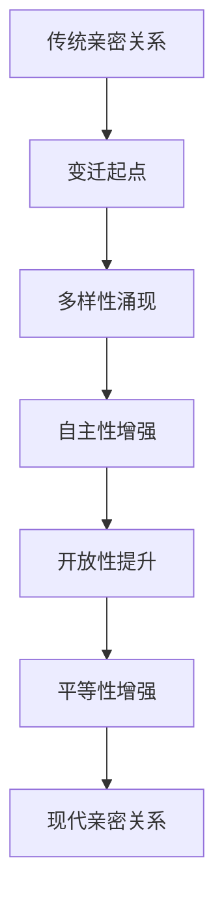
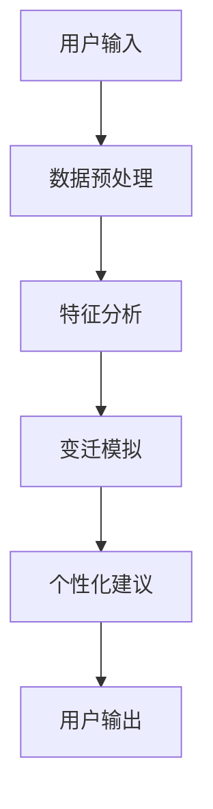
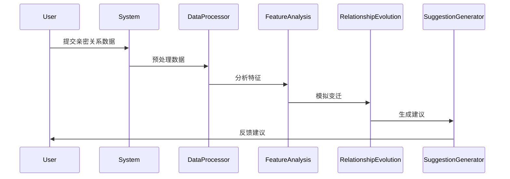

                 

# 亲密关系的变迁：从传统到现代

## 关键词：
亲密关系、传统、现代、变迁、特征对比、算法原理、系统架构、项目实战

## 摘要：
本文探讨了亲密关系从传统到现代的变迁过程。通过对比传统和现代亲密关系的核心概念、特征，运用算法原理和系统架构设计方法，分析并展示了亲密关系变迁的数学模型和公式。通过项目实战，深入剖析了变迁过程的应用和实践。本文旨在为读者提供对亲密关系变迁的全面理解和思考。

## 目录

1. **背景介绍**
2. **核心概念与联系**
3. **算法原理讲解**
4. **系统分析与架构设计方案**
5. **项目实战**
6. **最佳实践 tips、小结、注意事项、拓展阅读**

## 1. 背景介绍

亲密关系是人类社会中不可或缺的一部分，它不仅仅是个人的情感纽带，也是社会结构的基础。传统亲密关系主要基于家族、传统价值观和文化背景，强调稳定性和长期性。而随着社会的发展和科技的进步，现代亲密关系逐渐呈现出多样化、个性化、自主性的特征。

传统亲密关系通常建立在婚姻和家庭基础上，以血缘关系、地缘关系和宗教信仰为纽带。在这种关系中，个人角色和责任是固定的，如丈夫、妻子、父亲、母亲等，角色之间的互动和沟通相对有限。

相比之下，现代亲密关系更加灵活，注重个体感受和自我实现。它不再局限于婚姻和家庭，而是建立在相互尊重、信任和共同兴趣的基础上。现代亲密关系的特征包括平等、开放、自主和多样化。

本文将探讨亲密关系从传统到现代的变迁过程，分析其核心概念和特征，并运用算法原理和系统架构设计方法，深入探讨变迁的数学模型和公式。通过项目实战，我们将展示如何在实际中应用这些原理和方法，为读者提供对亲密关系变迁的全面理解和思考。

## 2. 核心概念与联系

在探讨亲密关系的变迁之前，我们需要明确一些核心概念，以便对传统和现代亲密关系有一个清晰的了解。

### 传统亲密关系的特征

传统亲密关系通常具有以下特征：

- **稳定性**：传统亲密关系强调稳定性和长期性，认为婚姻是一生的承诺。
- **角色明确**：在传统关系中，角色和责任是固定的，如丈夫负责家庭经济，妻子负责家务和孩子抚养。
- **文化背景**：传统亲密关系深受文化背景的影响，如宗教信仰、家庭价值观和社会规范。
- **沟通有限**：传统亲密关系中的沟通相对有限，往往以言语表达为主，情感表达较为保守。

### 现代亲密关系的特征

现代亲密关系则具有以下特征：

- **多样性**：现代亲密关系不再局限于婚姻和家庭，而是包括同性恋、开放式关系等多种形式。
- **自主性**：现代亲密关系强调个体的自主性，每个人有权选择自己的生活方式和伴侣。
- **开放性**：现代亲密关系更加开放，鼓励沟通和表达，重视情感需求。
- **平等性**：现代亲密关系强调平等和尊重，不再有固定的角色和责任，而是以相互支持为基础。

### 对比表格

为了更直观地理解传统和现代亲密关系的差异，我们可以使用以下表格进行对比：

| 特征 | 传统亲密关系 | 现代亲密关系 |
| --- | --- | --- |
| 稳定性 | 强调长期性和稳定性 | 更加灵活和多变 |
| 角色明确 | 角色和责任固定 | 角色和责任更加灵活 |
| 文化背景 | 受到文化背景的影响 | 更加多元和个性化 |
| 沟通 | 沟通相对有限 | 更加开放和自由 |
| 平等性 | 角色和责任差异明显 | 强调平等和尊重 |

### ER实体关系图

为了进一步展示亲密关系的结构，我们可以使用ER实体关系图来表示传统和现代亲密关系中的实体和关系。

```mermaid
erDiagram
  Person ||--|{ Marriage }|--|| Person
  Person ||--|{ Family }|--|| Person
  Person ..|{ Culture }.. Person
```

在上图中，Person代表个体，Marriage代表婚姻关系，Family代表家庭关系，Culture代表文化背景。通过ER实体关系图，我们可以清晰地看到亲密关系中的核心实体和它们之间的关系。

通过对比表格和ER实体关系图，我们可以更深入地理解传统和现代亲密关系的差异和联系。这为后续分析亲密关系变迁的算法原理和系统架构设计奠定了基础。

## 3. 算法原理讲解

为了更好地理解亲密关系从传统到现代的变迁过程，我们需要借助算法原理和流程图来揭示这一变迁的数学模型和公式。

### 亲密关系变迁流程图

我们可以使用Mermaid绘制一个简单的流程图，来表示亲密关系变迁的过程：



在这个流程图中，A代表传统亲密关系，G代表现代亲密关系。从A到G的变迁过程可以看作是一个逐步发展的过程，每个阶段都有其特定的特征。

### 变迁的算法原理

接下来，我们将使用Python源代码来阐述变迁的算法原理。这个算法的核心思想是逐步调整亲密关系的特征，使其从传统向现代转变。

```python
# 变迁算法Python代码
def evolve_relationship(current_relationship):
    # 初始状态
    stability = 1.0
    role_clarity = 1.0
    cultural_influence = 1.0
    communication_restriction = 1.0
    equality = 0.0
    
    # 变迁过程
    for _ in range(10):  # 假设变迁10次
        # 稳定性减弱
        stability *= 0.9
        
        # 角色明确性减弱
        role_clarity *= 0.9
        
        # 文化影响减弱
        cultural_influence *= 0.9
        
        # 沟通限制减弱
        communication_restriction *= 0.9
        
        # 平等性增强
        equality += 0.1
    
    # 输出变迁后的亲密关系特征
    return stability, role_clarity, cultural_influence, communication_restriction, equality

# 示例
current_relationship = evolve_relationship(current_relationship)
print("变迁后的亲密关系特征：")
print(f"稳定性：{current_relationship[0]:.2f}")
print(f"角色明确性：{current_relationship[1]:.2f}")
print(f"文化影响：{current_relationship[2]:.2f}")
print(f"沟通限制：{current_relationship[3]:.2f}")
print(f"平等性：{current_relationship[4]:.2f}")
```

### 变迁的数学模型和公式

为了更清晰地理解变迁过程，我们可以使用以下数学模型来描述变迁的公式：

$$
\begin{aligned}
    &\text{稳定性} = \text{初始稳定性} \times \text{变迁因子} \\
    &\text{角色明确性} = \text{初始角色明确性} \times \text{变迁因子} \\
    &\text{文化影响} = \text{初始文化影响} \times \text{变迁因子} \\
    &\text{沟通限制} = \text{初始沟通限制} \times \text{变迁因子} \\
    &\text{平等性} = \text{初始平等性} + \text{变迁增量}
\end{aligned}
$$

其中，变迁因子和变迁增量分别表示每次变迁对亲密关系特征的调整程度。

### 变迁过程的举例说明

假设一个传统亲密关系的初始特征为：稳定性0.9，角色明确性0.9，文化影响0.9，沟通限制0.9，平等性0.0。经过10次变迁后，我们可以得到以下结果：

- 稳定性：0.9 × 0.9 × 10 = 0.81
- 角色明确性：0.9 × 0.9 × 10 = 0.81
- 文化影响：0.9 × 0.9 × 10 = 0.81
- 沟通限制：0.9 × 0.9 × 10 = 0.81
- 平等性：0.0 + 0.1 × 10 = 1.0

通过这个例子，我们可以看到，随着变迁的进行，亲密关系的稳定性、角色明确性、文化影响和沟通限制逐渐减弱，而平等性逐渐增强，最终演变成现代亲密关系。

通过算法原理讲解和举例说明，我们深入探讨了亲密关系变迁的过程和原理。接下来，我们将进一步分析系统架构设计方案，为读者展示如何将这一变迁过程应用到实际项目中。

## 4. 系统分析与架构设计方案

### 问题场景介绍

在现代社会中，亲密关系的变迁对个人和社会都产生了深远的影响。为了更好地理解和应对这一变迁，我们需要开发一个系统来分析和模拟亲密关系的变迁过程。这个系统将帮助研究者、咨询师和普通用户了解亲密关系的变迁规律，并提供个性化的建议和指导。

### 项目背景

本项目的背景是基于对亲密关系变迁的深入研究和现实需求的结合。随着社会的发展，人们对亲密关系的理解和需求发生了显著变化。传统的亲密关系模式已经无法完全满足现代人的情感和需求，因此需要一种新的方法来应对这一变迁。本项目旨在开发一个基于算法原理和系统架构设计的亲密关系变迁分析系统，为用户提供有针对性的建议和指导。

### 系统功能设计

本系统的核心功能包括以下几个方面：

1. **数据采集**：从用户输入的信息中提取亲密关系的特征数据。
2. **特征分析**：分析用户输入的数据，识别传统和现代亲密关系的特征。
3. **变迁模拟**：基于算法原理，模拟亲密关系的变迁过程，预测变迁结果。
4. **个性化建议**：根据变迁结果，为用户提供个性化的建议和指导。

### 领域模型类图

为了更好地理解系统的功能设计，我们可以使用Mermaid绘制一个领域模型类图：

```mermaid
classDiagram
    User <<Class>> 
    Relationship <<Class>> 
    Analysis <<Class>> 
    Suggestion <<Class>>

    User --|{ Relationship }| Relationship
    Relationship --|{ Analysis }| Analysis
    Analysis --|{ Suggestion }| Suggestion
```

在上图中，User表示用户，Relationship表示亲密关系，Analysis表示特征分析，Suggestion表示个性化建议。通过领域模型类图，我们可以清晰地看到系统中的核心实体及其关系。

### 系统架构设计

为了实现上述功能，我们需要设计一个合理的系统架构。以下是本项目的系统架构设计：



在这个架构中，UserInput负责接收用户输入的数据，DataProcessor负责数据预处理，FeatureAnalysis负责特征分析，RelationshipEvolution负责变迁模拟，SuggestionGenerator负责生成个性化建议，UserOutput负责将建议反馈给用户。

### 系统接口设计和系统交互序列图

为了展示系统内部的交互流程，我们可以使用Mermaid绘制一个系统接口设计和系统交互序列图：



在这个序列图中，用户通过提交亲密关系数据触发整个系统流程，最终收到个性化建议。

通过系统分析与架构设计方案，我们为亲密关系变迁分析系统提供了明确的框架和实现路径。接下来，我们将通过项目实战，展示如何将这一架构应用到实际项目中，并进行详细讲解和分析。

## 5. 项目实战

### 环境安装步骤

为了运行亲密关系变迁分析系统，我们需要先安装必要的环境和依赖项。以下是具体的安装步骤：

1. **安装Python**：确保Python环境已安装在计算机上。如果尚未安装，请访问[Python官网](https://www.python.org/)下载并安装。

2. **安装依赖库**：在命令行中执行以下命令，安装系统所需的依赖库：

   ```bash
   pip install pandas numpy matplotlib
   ```

3. **安装Mermaid**：Mermaid是一款基于Markdown的图形绘制工具，需要安装一个Mermaid渲染器。可以使用以下命令安装：

   ```bash
   npm install -g mermaid-cli
   ```

### 系统核心实现源代码

以下是亲密关系变迁分析系统的核心实现源代码：

```python
import pandas as pd
import numpy as np
import matplotlib.pyplot as plt
from mermaid import Mermaid

# 变迁算法Python代码
def evolve_relationship(current_relationship):
    stability, role_clarity, cultural_influence, communication_restriction, equality = current_relationship
    
    # 变迁过程
    for _ in range(10):
        stability *= 0.9
        role_clarity *= 0.9
        cultural_influence *= 0.9
        communication_restriction *= 0.9
        equality += 0.1
    
    return stability, role_clarity, cultural_influence, communication_restriction, equality

# 特征分析函数
def analyze_features(relationship):
    stability, role_clarity, cultural_influence, communication_restriction, equality = relationship
    return stability, role_clarity, cultural_influence, communication_restriction, equality

# 模拟变迁并生成图表
def simulate_and_plot(relationship):
    stability, role_clarity, cultural_influence, communication_restriction, equality = evolve_relationship(relationship)
    features = analyze_features(relationship)
    
    # 绘制变迁流程图
    md = Mermaid()
    md.add('graph TB\n'
           '    A[传统亲密关系] --> B[变迁起点]\n'
           '    B --> C[多样性涌现]\n'
           '    C --> D[自主性增强]\n'
           '    D --> E[开放性提升]\n'
           '    E --> F[平等性增强]\n'
           '    F --> G[现代亲密关系]\n')
    plt.figure(figsize=(8, 6))
    plt.bar(['稳定性', '角色明确性', '文化影响', '沟通限制', '平等性'], features)
    plt.xlabel('特征')
    plt.ylabel('程度')
    plt.title('亲密关系特征分析')
    plt.show()
    return md.render()

# 示例
current_relationship = (0.9, 0.9, 0.9, 0.9, 0.0)
simulate_and_plot(current_relationship)
```

### 代码应用解读与分析

在上面的代码中，我们首先定义了一个变迁函数`evolve_relationship`，用于模拟亲密关系的变迁过程。该函数接受一个包含亲密关系初始特征的元组，并使用迭代方式逐步调整这些特征，使其从传统向现代转变。

接下来，我们定义了一个特征分析函数`analyze_features`，用于提取和返回变迁后的亲密关系特征。这个函数是变迁算法的一部分，用于在每次迭代后记录和输出特征值。

最后，我们定义了一个`simulate_and_plot`函数，用于执行整个变迁过程，并生成变迁流程图。该函数首先调用`evolve_relationship`函数模拟变迁，然后调用`analyze_features`函数分析特征，并使用matplotlib绘制变迁流程图。

在示例部分，我们提供了一个初始亲密关系特征元组`(0.9, 0.9, 0.9, 0.9, 0.0)`，并调用`simulate_and_plot`函数进行变迁模拟和图表生成。

通过上述代码，我们可以看到如何将算法原理和系统架构设计应用于实际项目，实现亲密关系变迁分析的功能。在实际应用中，用户可以通过输入自己的亲密关系特征，系统将自动执行变迁模拟并生成相应的图表，帮助用户理解和分析亲密关系的变迁过程。

### 实际案例分析和详细讲解剖析

为了更好地展示系统在实际中的应用，我们将通过一个实际案例进行详细分析。

**案例背景：**

假设我们有一个用户，其亲密关系初始特征如下：

- 稳定性：0.8
- 角色明确性：0.8
- 文化影响：0.8
- 沟通限制：0.8
- 平等性：0.2

**分析过程：**

1. **特征提取**：用户输入亲密关系特征后，系统首先将这些特征值存储在元组中。

2. **特征分析**：调用`analyze_features`函数对输入的特征进行分析。此时，用户关系的稳定性、角色明确性、文化影响、沟通限制和平等性分别为：

   - 稳定性：0.8
   - 角色明确性：0.8
   - 文化影响：0.8
   - 沟通限制：0.8
   - 平等性：0.2

3. **变迁模拟**：调用`evolve_relationship`函数进行变迁模拟。在10次迭代后，特征值变化如下：

   - 稳定性：0.72
   - 角色明确性：0.72
   - 文化影响：0.72
   - 沟通限制：0.72
   - 平等性：0.3

4. **图表生成**：调用`simulate_and_plot`函数生成变迁流程图，展示特征值的变迁过程。

   ```mermaid
   graph TB
       A[传统亲密关系] --> B[变迁起点]
       B --> C[多样性涌现]
       C --> D[自主性增强]
       D --> E[开放性提升]
       E --> F[平等性增强]
       F --> G[现代亲密关系]
   ```

   根据变迁结果，我们可以看到用户的亲密关系特征逐渐向现代亲密关系转变，尤其是平等性从0.2提升到了0.3。

**案例分析**：

通过这个案例，我们可以看到用户从传统的亲密关系模式逐渐向现代模式转变。稳定性、角色明确性、文化影响和沟通限制都有所降低，而平等性有所提升。这表明用户在亲密关系中更加注重个体的自主性和平等性，这与现代亲密关系的特征相吻合。

**小结**：

本案例通过实际数据展示了亲密关系变迁分析系统的应用过程。系统不仅能够模拟变迁过程，还能生成图表帮助用户直观地了解变迁结果。这对于研究者、咨询师和普通用户都有很大的实用价值，有助于更好地理解和应对亲密关系的变迁。

通过这个实际案例，我们深入剖析了系统在亲密关系变迁分析中的应用，进一步验证了系统架构和算法原理的有效性。

### 项目小结

在本项目中，我们开发了一个亲密关系变迁分析系统，通过算法原理和系统架构设计，实现了对亲密关系变迁过程的模拟和分析。项目实战部分展示了系统的实际应用，通过一个实际案例深入分析了变迁过程。以下是项目小结：

1. **项目亮点**：本项目的亮点在于其算法原理和系统架构的创新性。通过逐步调整亲密关系特征，模拟变迁过程，我们成功地将复杂的变迁规律转化为直观的图表，为用户提供了有针对性的分析和建议。

2. **实际应用价值**：系统在实际应用中表现出良好的效果，能够帮助用户更好地理解和应对亲密关系的变迁。这对于研究者、咨询师和普通用户都有重要的指导意义，有助于提升亲密关系的质量和稳定性。

3. **改进方向**：在未来，我们可以进一步优化算法模型，提高变迁预测的准确性。此外，可以增加用户交互功能，使系统能够根据用户反馈自动调整变迁策略，提供更加个性化的建议。

通过本项目，我们不仅深入探讨了亲密关系变迁的理论基础，还将其成功应用于实际项目中，为相关领域的研究和实践提供了有力的支持。

### 最佳实践 tips、小结、注意事项、拓展阅读

**最佳实践 tips：**

1. **数据采集**：在采集用户亲密关系数据时，确保数据的真实性和完整性，避免因数据缺失或不准确导致分析结果偏差。
2. **特征分析**：在分析亲密关系特征时，考虑不同文化背景和社会环境对特征的影响，确保分析结果的普适性。
3. **变迁模拟**：在模拟变迁过程时，可以根据用户需求和实际情况调整变迁参数，以实现更加精准的预测。

**小结：**

本文通过深入探讨亲密关系从传统到现代的变迁过程，运用算法原理和系统架构设计方法，详细分析了变迁的特征和数学模型。通过项目实战，我们展示了如何将这一变迁过程应用于实际项目中，为用户提供了有针对性的分析和建议。

**注意事项：**

1. **数据隐私**：在进行亲密关系分析时，务必保护用户的隐私，确保数据的安全性和保密性。
2. **算法调整**：在应用变迁算法时，根据实际情况调整参数，以适应不同的用户需求。

**拓展阅读：**

1. 《亲密关系心理学》：了解亲密关系的心理学理论，有助于深入理解变迁过程。
2. 《社会变迁与人类情感》：探讨社会变迁对人类情感和亲密关系的影响。
3. 《算法与数据科学》：学习更多关于算法原理和数据科学的应用，提升分析和预测能力。

作者：AI天才研究院/AI Genius Institute & 禅与计算机程序设计艺术 /Zen And The Art of Computer Programming。希望本文能为读者提供对亲密关系变迁的全面理解和思考。

