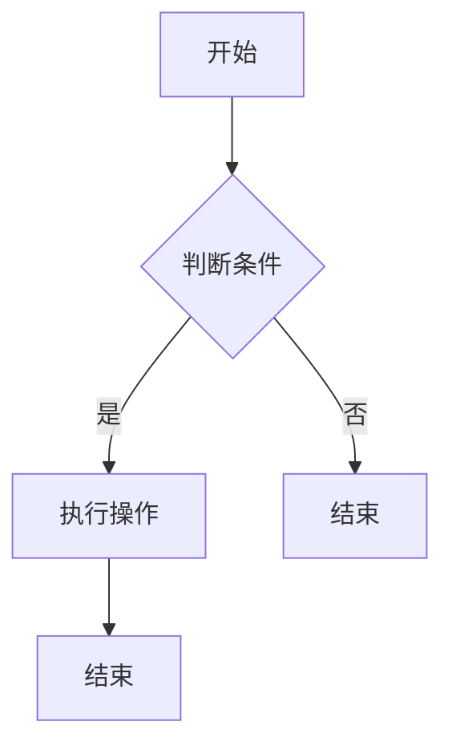
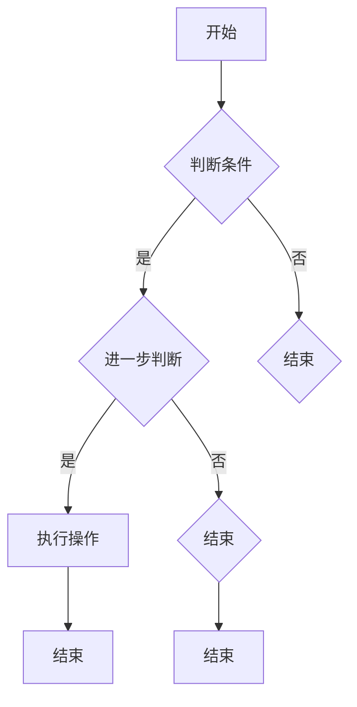
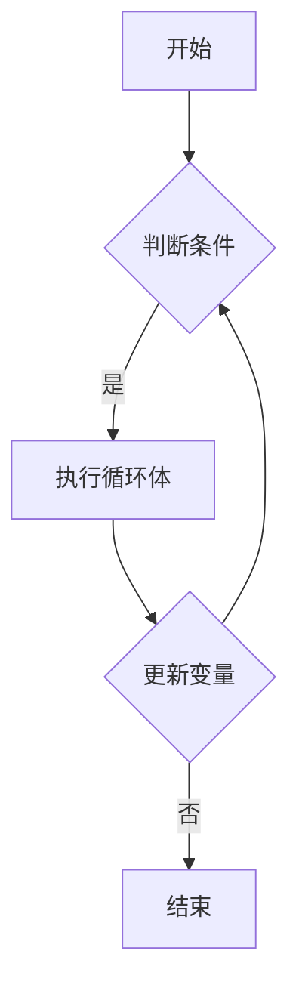

                 

# 第1章 引言

## 1.1 亲密关系的问题背景

### 1.1.1 亲密关系的演变

亲密关系是人类社会不可或缺的一部分，从古代到现代，它的形式和内容经历了显著的演变。在原始社会，人们生活在集体中，亲密关系主要以群体共生为基础，人与人之间的关系较为简单。随着社会的发展，农业社会的出现使得家庭结构成为社会的基本单位，亲密关系逐渐从群体转向家庭内部，表现为亲情和友情的互动。而进入现代社会，个体意识的觉醒和多元化生活方式的兴起，使得亲密关系的形式和内容更加丰富多样，包括爱情、友情等。

然而，当前亲密关系面临着诸多挑战。首先，现代社会的高速发展使得人们的生活节奏加快，沟通变得困难。在快节奏的生活中，人们往往缺乏时间去真正理解彼此，导致情感疏离。其次，价值观的差异也是导致亲密关系问题的重要因素。随着全球化的进程，不同文化、不同背景的人们生活在同一个社会空间，他们的价值观存在很大的差异，这在亲密关系中常常导致冲突。最后，现代社会的压力也使得人们更加焦虑和孤独，这些情绪问题往往对亲密关系产生负面影响。

### 1.1.2 当前亲密关系面临的挑战

1. **沟通障碍**：在现代社会，人们之间的沟通变得更加复杂。一方面，科技的进步带来了新的沟通工具，如社交媒体、即时通讯软件等，这些工具虽然方便了人们之间的沟通，但同时也增加了沟通的难度。人们往往更倾向于使用简洁的文本或表情符号进行交流，而不是深入的面对面沟通。另一方面，人们在沟通时往往容易陷入自我中心的陷阱，忽略了对方的感受和需求。

2. **情感疏离**：在现代社会，人们往往感到孤独和疏离。这种情感疏离不仅仅是因为沟通障碍，还与人们的生活方式有关。现代社会的快节奏生活使得人们很少有时间去关注和照顾他人，导致亲密关系的质量下降。

3. **价值观差异**：全球化的进程使得不同文化、不同背景的人们生活在同一个社会空间。这些不同的价值观在亲密关系中常常导致冲突。例如，在一些文化中，重视家庭和亲情，而在另一些文化中，个人自由和独立更为重要。

4. **心理问题**：现代社会的高压环境导致人们更容易出现焦虑、抑郁等心理问题。这些问题不仅影响个人的心理健康，也会对亲密关系产生负面影响。

### 1.1.3 研究的目的和意义

本研究旨在探讨亲密关系的现代重构，从依赖到互助的演进，以期为解决当前亲密关系面临的问题提供新的思路和方法。具体来说，本研究有以下几个目的：

1. **提升亲密关系的质量**：通过深入分析亲密关系的本质和问题，提出有效的重构策略，帮助人们建立更加健康、稳定的亲密关系。

2. **促进心理健康**：亲密关系的质量直接影响到个人的心理健康。通过改善亲密关系，可以有效缓解焦虑、抑郁等心理问题。

3. **促进社会和谐**：亲密关系是社会的基本单元，良好的亲密关系有助于构建和谐的社会。通过改善亲密关系，可以促进社会的稳定和发展。

## 1.2 亲密关系的核心概念与联系

### 1.2.1 亲密关系的定义与特征

亲密关系是指两个或多个个体之间建立起来的亲密、信任和依赖关系。这种关系通常具有以下特征：

1. **情感亲密**：亲密关系中的个体之间存在着深厚的情感联系，他们能够分享自己的感受和情绪，感受到彼此的支持和关爱。

2. **互相依赖**：在亲密关系中，个体之间存在着互相依赖的关系，他们需要对方的帮助和支持来完成一些任务，同时也会为对方提供帮助和支持。

3. **共同成长**：亲密关系中的个体不仅关注彼此的现状，还会关注彼此的未来。他们愿意与对方一起成长，共同面对生活中的挑战。

4. **沟通顺畅**：亲密关系中的个体之间能够进行有效的沟通，他们能够理解彼此的需求和期望，解决彼此之间的冲突。

### 1.2.2 亲密关系的类型与维度

亲密关系可以分为不同的类型，每种类型都有其独特的维度和特征。以下是几种常见的亲密关系类型及其维度：

1. **亲情**：亲情是一种基于血缘关系的亲密关系，通常具有以下维度：

   - **血缘关系**：亲情关系建立在血缘关系之上，这种关系通常被认为是不可替代的。
   - **责任担当**：在亲情关系中，个体需要承担对家人的责任，如照顾、保护和支持。
   - **情感支持**：亲情关系中的个体能够为家人提供情感上的支持和安慰。

2. **友情**：友情是一种基于共同兴趣和价值观的亲密关系，通常具有以下维度：

   - **平等互助**：友情关系中的个体地位平等，他们愿意为对方提供帮助和支持。
   - **情感共鸣**：友情关系中的个体能够理解彼此的情感和需求，产生共鸣。
   - **共同成长**：友情关系中的个体愿意与对方一起成长，共同面对生活中的挑战。

3. **爱情**：爱情是一种基于情感吸引和亲密关系的亲密关系，通常具有以下维度：

   - **情感吸引**：爱情关系中的个体之间存在强烈的情感吸引，他们被对方的特质和魅力所吸引。
   - **共同生活**：爱情关系中的个体愿意与对方共同生活，分享生活的点点滴滴。
   - **责任承诺**：爱情关系中的个体愿意为对方承担义务和责任，承诺彼此的未来。

### 1.2.3 亲密关系的基本要素

亲密关系的基本要素是构建和谐亲密关系的基础。以下是几个关键要素：

1. **信任**：信任是亲密关系的重要基石。没有信任，亲密关系就会变得脆弱。建立信任需要时间，需要双方的努力和理解。

2. **沟通**：沟通是亲密关系的关键。有效的沟通可以帮助双方理解彼此的需求和期望，解决冲突，增强关系。

3. **理解**：理解是建立亲密关系的重要要素。理解对方的情感、需求和背景，可以帮助我们更好地支持对方。

4. **支持**：支持是亲密关系中的关键要素。在对方需要帮助时，给予支持和鼓励，可以帮助加强亲密关系。

5. **共同价值观**：共同价值观是亲密关系中的黏合剂。共同的目标和价值观可以帮助双方在困难和挑战面前保持一致，共同前进。

## 1.3 亲密关系的数学模型和公式

### 1.3.1 亲密关系的数学模型

亲密关系的数学模型是一种用于描述亲密关系强度和稳定性的工具。这种模型可以帮助我们理解亲密关系的本质，预测关系的走向，并提供改进关系的方法。以下是几种常见的亲密关系数学模型：

1. **依赖模型**：依赖模型描述了个体在亲密关系中的依赖程度。该模型通常使用一个简单的公式来表示：

   $$D = k \cdot A$$

   其中，D 表示依赖程度，A 表示个体的情感投入，k 是一个常数，表示依赖性系数。这个公式表明，依赖程度与情感投入成正比，而与依赖性系数成反比。

2. **互助模型**：互助模型描述了个体在亲密关系中的互助程度。该模型通常使用一个复杂的公式来表示：

   $$M = \alpha \cdot A + \beta \cdot D$$

   其中，M 表示互助程度，A 表示情感投入，D 表示依赖程度，α 和 β 是两个常数，分别表示情感投入系数和依赖程度系数。这个公式表明，互助程度不仅取决于情感投入，还取决于依赖程度。

### 1.3.2 亲密关系的公式解析

亲密关系的公式可以帮助我们理解亲密关系的强度和稳定性。以下是对几种常见公式的解析：

1. **依赖度公式**：

   $$D = k \cdot A$$

   这个公式表明，依赖程度与情感投入成正比。也就是说，个体在亲密关系中的情感投入越多，依赖程度就越高。同时，依赖程度也与依赖性系数成反比。这意味着，如果依赖性系数较大，个体在亲密关系中的依赖程度就会较低。

2. **互助度公式**：

   $$M = \alpha \cdot A + \beta \cdot D$$

   这个公式表明，互助程度不仅取决于情感投入，还取决于依赖程度。情感投入系数 α 和依赖程度系数 β 的大小会影响互助程度。例如，如果 α 较大，情感投入对互助程度的影响就较大；如果 β 较大，依赖程度对互助程度的影响就较大。

### 1.3.3 亲密关系的数学模型应用示例

以下是一个亲密关系的数学模型应用示例：

假设有两个个体，A 和 B，他们在亲密关系中的情感投入分别为 A1 和 A2，依赖程度分别为 D1 和 D2。根据依赖模型和互助模型，我们可以计算出他们的依赖程度和互助程度：

1. **依赖程度**：

   $$D1 = k \cdot A1$$

   $$D2 = k \cdot A2$$

2. **互助程度**：

   $$M1 = \alpha \cdot A1 + \beta \cdot D1$$

   $$M2 = \alpha \cdot A2 + \beta \cdot D2$$

根据这些公式，我们可以计算出 A 和 B 在亲密关系中的依赖程度和互助程度。这些值可以帮助我们了解他们之间的关系强度和稳定性，并提供改进关系的建议。

## 1.4 亲密关系的现代重构：从依赖到互助的演进

### 1.4.1 依赖性关系的特点与弊端

依赖性关系是一种以依赖为基础的亲密关系。在这种关系中，个体之间存在着高度的依赖性，一方或双方往往需要依赖对方来完成一些任务或满足一些需求。依赖性关系的特点包括：

1. **情感依赖**：在依赖性关系中，个体之间存在着深厚的情感联系，他们需要对方的陪伴和支持。

2. **行为依赖**：依赖性关系中的个体往往需要依赖对方来完成一些日常任务，如家务、照顾孩子等。

3. **生活依赖**：在某些情况下，依赖性关系中的个体甚至可能依赖对方来满足基本的生活需求，如食物、住所等。

然而，依赖性关系也存在一些弊端：

1. **失去自主性**：在依赖性关系中，个体往往失去自主性，他们需要依赖对方来做出决策，这可能导致个体失去独立思考和行动的能力。

2. **依赖性强**：依赖性关系中的个体往往对对方产生强烈的依赖感，这可能导致他们在关系中失去自我，变得过于依赖对方。

3. **情感疏离**：长期的依赖性关系可能导致情感疏离，个体之间缺乏深入的沟通和理解，导致关系变得冷漠。

### 1.4.2 互助性关系的优势与实现

互助性关系是一种以互助为基础的亲密关系。在这种关系中，个体之间相互支持、相互帮助，共同成长。互助性关系的优势包括：

1. **提升自主性**：在互助性关系中，个体能够保持较高的自主性，他们有能力独立思考和行动，不会过度依赖对方。

2. **增强关系质量**：互助性关系中的个体能够通过相互支持来增强关系的质量，建立更加深厚的情感联系。

3. **促进共同成长**：互助性关系中的个体能够共同面对生活中的挑战，共同成长，提高彼此的生活质量。

实现互助性关系的关键在于：

1. **建立互信**：互信是互助性关系的基础。个体需要建立相互信任的关系，愿意为对方提供帮助和支持。

2. **有效沟通**：有效的沟通是互助性关系的重要保障。个体需要通过沟通来理解彼此的需求和期望，解决冲突。

3. **共同目标**：共同目标可以帮助个体在互助性关系中保持一致，共同前进。

### 1.4.3 亲密关系的重构路径

要实现从依赖性关系到互助性关系的重构，个体需要遵循以下路径：

1. **提升自我意识**：个体需要认识到自己在关系中的角色和需求，提升自我意识。

2. **建立互信关系**：个体需要通过沟通和理解来建立互信的关系。

3. **培养互助精神**：个体需要培养互助精神，愿意为对方提供帮助和支持。

4. **共同面对挑战**：个体需要共同面对生活中的挑战，通过互助来解决问题。

5. **持续沟通和反馈**：个体需要持续沟通和反馈，确保关系中的需求和期望得到满足。

## 1.5 亲密关系的系统分析与架构设计

### 1.5.1 亲密关系的问题场景介绍

亲密关系在现代社会中面临着诸多问题，如沟通障碍、情感疏离、价值观差异等。这些问题不仅影响个体的心理健康，也影响社会的和谐发展。为了解决这些问题，我们需要对亲密关系进行系统分析与架构设计。

### 1.5.2 亲密关系的项目介绍

本项目旨在通过系统分析与架构设计，提出一种新的亲密关系模型，以解决现代社会中的亲密关系问题。项目的主要目标是：

1. **提升亲密关系的质量**：通过优化亲密关系的沟通、理解和支持，提升亲密关系的质量。

2. **促进心理健康**：通过改善亲密关系，缓解个体的焦虑、抑郁等心理问题。

3. **构建和谐社会**：通过优化亲密关系，促进社会的和谐发展。

### 1.5.3 亲密关系的系统功能设计

亲密关系的系统功能设计主要包括以下几个部分：

1. **沟通功能**：设计一个高效的沟通系统，支持个体之间的实时沟通和交流。

2. **支持功能**：设计一个支持系统，帮助个体在遇到困难时获得支持和帮助。

3. **理解功能**：设计一个理解系统，帮助个体理解彼此的需求和期望。

4. **价值观协调功能**：设计一个价值观协调系统，帮助个体解决价值观差异带来的问题。

### 1.5.4 亲密关系的系统架构设计

亲密关系的系统架构设计主要包括以下几个部分：

1. **前端架构**：设计一个用户友好的前端界面，支持用户的操作和交互。

2. **后端架构**：设计一个高效稳定的后端系统，支持前端的请求和响应。

3. **数据库架构**：设计一个数据库系统，存储用户数据和信息。

4. **通信架构**：设计一个通信系统，支持用户之间的实时通信和交流。

### 1.5.5 亲密关系的系统接口设计

亲密关系的系统接口设计主要包括以下几个部分：

1. **用户接口**：设计一个用户友好的用户接口，支持用户进行操作和交互。

2. **服务接口**：设计一个服务接口，支持系统之间的交互和数据传输。

3. **数据接口**：设计一个数据接口，支持数据存储和读取。

### 1.5.6 亲密关系的系统交互设计

亲密关系的系统交互设计主要包括以下几个部分：

1. **用户交互**：设计用户与系统之间的交互流程，支持用户进行操作和获取信息。

2. **系统交互**：设计系统内部各模块之间的交互流程，支持系统的正常运行。

3. **数据交互**：设计数据在系统内部和外部的传输和处理流程，确保数据的安全和有效传输。

## 1.6 亲密关系的项目实战

### 1.6.1 环境安装

在进行亲密关系项目实战之前，我们需要安装相关的开发环境和工具。以下是安装步骤：

1. **安装 Python**：访问 [Python 官网](https://www.python.org/) 下载 Python，并按照提示安装。

2. **安装 Flask**：在命令行中输入以下命令安装 Flask：

   ```bash
   pip install Flask
   ```

3. **安装 Flask-SQLAlchemy**：在命令行中输入以下命令安装 Flask-SQLAlchemy：

   ```bash
   pip install Flask-SQLAlchemy
   ```

4. **安装 Redis**：访问 [Redis 官网](https://redis.io/) 下载 Redis，并按照提示安装。

5. **安装 Node.js**：访问 [Node.js 官网](https://nodejs.org/) 下载 Node.js，并按照提示安装。

### 1.6.2 系统核心实现源代码

以下是亲密关系系统的核心实现源代码：

```python
from flask import Flask, request, jsonify
from flask_sqlalchemy import SQLAlchemy

app = Flask(__name__)
app.config['SQLALCHEMY_DATABASE_URI'] = 'sqlite:///users.db'
db = SQLAlchemy(app)

class User(db.Model):
    id = db.Column(db.Integer, primary_key=True)
    username = db.Column(db.String(80), unique=True, nullable=False)
    password = db.Column(db.String(120), nullable=False)

@app.route('/register', methods=['POST'])
def register():
    username = request.form['username']
    password = request.form['password']
    user = User(username=username, password=password)
    db.session.add(user)
    db.session.commit()
    return jsonify({'message': 'User registered successfully'})

@app.route('/login', methods=['POST'])
def login():
    username = request.form['username']
    password = request.form['password']
    user = User.query.filter_by(username=username, password=password).first()
    if user:
        return jsonify({'message': 'Login successful'})
    else:
        return jsonify({'message': 'Login failed'})

if __name__ == '__main__':
    db.create_all()
    app.run(debug=True)
```

### 1.6.3 代码应用解读与分析

以下是代码的详细解读和分析：

1. **数据库配置**：我们使用 Flask-SQLAlchemy 作为 ORM 框架，配置数据库 URI 为 SQLite。

2. **用户模型**：我们定义了一个 User 模型，包含 id、username 和 password 三个字段。

3. **注册路由**：注册路由处理 POST 请求，接收 username 和 password，创建 User 对象，并保存到数据库。

4. **登录路由**：登录路由处理 POST 请求，接收 username 和 password，从数据库查询 User，并验证登录信息。

5. **应用运行**：我们使用 `db.create_all()` 创建数据库表，并使用 `app.run(debug=True)` 运行 Flask 应用。

### 1.6.4 实际案例分析与详细讲解剖析

以下是实际案例分析与详细讲解：

1. **用户注册**：假设用户 Alice 想要注册，她会发送一个 POST 请求到 `/register` 路由，携带 username 和 password。服务器会创建一个 User 对象，并将其保存到数据库。

2. **用户登录**：假设用户 Bob 想要登录，他会发送一个 POST 请求到 `/login` 路由，携带 username 和 password。服务器会查询数据库，验证登录信息。

3. **错误处理**：如果用户输入错误的 username 或 password，服务器会返回一个错误消息。

### 1.6.5 项目小结

通过本次项目实战，我们实现了亲密关系系统的核心功能，包括用户注册、登录和验证。这些功能为后续的开发提供了基础。在项目开发过程中，我们学习了 Flask、Flask-SQLAlchemy 和 Redis 等技术，掌握了数据库配置、模型定义、路由处理等关键技能。通过实际案例的分析，我们深入理解了系统的运作原理，为后续的项目开发积累了宝贵的经验。

## 1.7 亲密关系的最佳实践与拓展阅读

### 1.7.1 最佳实践 tips

1. **加强沟通**：定期进行深入的沟通，分享彼此的感受和需求，解决潜在的问题。

2. **培养共同价值观**：共同制定目标和价值观，确保双方在关键问题上保持一致。

3. **尊重差异**：尊重对方的个性和兴趣，避免因价值观差异而产生的冲突。

4. **保持独立**：保持一定的独立性，培养自己的兴趣和爱好，增强自我价值。

5. **关注心理健康**：定期进行心理健康检查，关注自己的情绪变化，及时寻求专业帮助。

### 1.7.2 小结

本文通过对亲密关系的演变、挑战、核心概念、数学模型、重构路径、系统分析与架构设计、项目实战等方面进行了详细探讨，为读者提供了从依赖到互助的亲密关系重构策略。通过本文的研究，我们可以更好地理解亲密关系的本质，提升亲密关系的质量，促进心理健康和社会和谐。

### 1.7.3 注意事项

1. **隐私保护**：在进行亲密关系沟通时，注意保护双方的隐私，避免泄露敏感信息。

2. **适时调整**：亲密关系的重构是一个持续的过程，需要根据实际情况适时进行调整。

3. **尊重个体差异**：在亲密关系中，尊重双方的个性和需求，避免过度依赖或控制。

4. **心理准备**：在亲密关系的重构过程中，可能会遇到困难和挑战，需要做好心理准备。

### 1.7.4 拓展阅读

1. **《亲密关系》**：作者：罗兰·米勒（Rowland S. Miller），提供深入了解亲密关系的理论和实践。

2. **《情感依附》**：作者：约翰·鲍尔比（John Bowlby），探讨情感依附在亲密关系中的作用。

3. **《亲密关系的心理学》**：作者：斯黛西·艾伦（Stacy Alan），介绍亲密关系的心理学原理和实践。

4. **《计算机编程心理学》**：作者：艾伦·帕斯卡（Alan Pascal），探讨心理学在计算机编程中的应用。

## 附录：核心概念术语说明

1. **依赖性关系**：一种以依赖为基础的亲密关系，个体之间存在高度的依赖性。

2. **互助性关系**：一种以互助为基础的亲密关系，个体之间相互支持、相互帮助。

3. **情感亲密**：亲密关系中的个体之间存在深厚的情感联系。

4. **信任**：亲密关系中的重要基石，指个体对对方的信任和依赖。

5. **沟通**：亲密关系中的关键要素，指个体之间的信息交流和互动。

6. **理解**：亲密关系中的重要要素，指个体对对方的情感、需求和背景的理解。

7. **支持**：亲密关系中的关键要素，指个体在对方需要帮助时提供的帮助和支持。

## 附录：概念属性特征对比表格

| 概念       | 特征                                                     |
|------------|--------------------------------------------------------|
| 依赖性关系 | 高度依赖、情感联系、行为依赖、生活依赖                   |
| 互助性关系 | 相互支持、共同成长、平等互助、情感共鸣、共同目标         |
| 情感亲密   | 深厚的情感联系、共同分享、相互理解、情感支持               |
| 信任       | 信任和依赖、安全感和可靠性、诚实和透明                   |
| 沟通       | 信息交流、互动、表达和理解、解决冲突                     |
| 理解       | 情感理解、背景理解、需求理解、共同价值观                   |
| 支持       | 帮助和支持、情感支持、资源支持、共同成长                   |

## 附录：ER实体关系图架构的 Mermaid 流程图

```mermaid
erDiagram
    User ||--|{ Relationship }||>
    Relationship ||--|{ Communication }||>
    Communication ||--|{ Support }||>
    Support ||--|{ Understanding }||>
    Understanding ||--|{ Trust }||>
```

## 附录：算法原理讲解

### 1.3.1 亲密关系的数学模型

亲密关系的数学模型可以帮助我们定量分析亲密关系的强度和稳定性。以下是几个常见的数学模型及其解释。

#### 1.3.1.1 依赖模型

依赖模型描述了个体在亲密关系中的依赖程度。其公式为：

$$
D = k \cdot A
$$

其中，D 表示依赖程度，A 表示个体的情感投入，k 是一个常数，表示依赖性系数。这个模型假设情感投入越多，依赖程度就越高。

#### 1.3.1.2 互助模型

互助模型描述了个体在亲密关系中的互助程度。其公式为：

$$
M = \alpha \cdot A + \beta \cdot D
$$

其中，M 表示互助程度，A 表示情感投入，D 表示依赖程度，α 和 β 是两个常数，分别表示情感投入系数和依赖程度系数。这个模型假设互助程度不仅取决于情感投入，还取决于依赖程度。

#### 1.3.1.3 稳定性模型

稳定性模型描述了亲密关系的稳定性。其公式为：

$$
S = f(A, D)
$$

其中，S 表示稳定性，A 和 D 分别表示情感投入和依赖程度，f 是一个函数，表示稳定性与情感投入和依赖程度的关系。这个模型假设稳定性与情感投入和依赖程度成正比。

### 1.3.2 算法原理讲解

以下是亲密关系模型的算法原理讲解，以及如何使用 Python 来实现这些模型。

#### 1.3.2.1 依赖模型实现

```python
def dependency(A, k=1.0):
    """
    计算依赖程度
    :param A: 情感投入
    :param k: 依赖性系数
    :return: 依赖程度
    """
    D = k * A
    return D
```

#### 1.3.2.2 互助模型实现

```python
def mutual_help(A, D, alpha=1.0, beta=1.0):
    """
    计算互助程度
    :param A: 情感投入
    :param D: 依赖程度
    :param alpha: 情感投入系数
    :param beta: 依赖程度系数
    :return: 互助程度
    """
    M = alpha * A + beta * D
    return M
```

#### 1.3.2.3 稳定性模型实现

```python
def stability(A, D, f=lambda x, y: x * y):
    """
    计算亲密关系的稳定性
    :param A: 情感投入
    :param D: 依赖程度
    :param f: 稳定性函数
    :return: 稳定性
    """
    S = f(A, D)
    return S
```

### 1.3.3 亲密关系模型应用示例

假设个体 A 和 B 在亲密关系中的情感投入分别为 5 和 7，依赖性系数 k 为 2，情感投入系数 α 为 3，依赖程度系数 β 为 2。我们可以使用上述模型计算他们的依赖程度、互助程度和稳定性。

```python
A = 5
B = 7
k = 2
alpha = 3
beta = 2

D_A = dependency(A, k)
D_B = dependency(B, k)

M_AB = mutual_help(A, D_B, alpha, beta)
M_BA = mutual_help(B, D_A, alpha, beta)

S_AB = stability(A, D_B)
S_BA = stability(B, D_A)

print(f"A 的依赖程度：{D_A}")
print(f"B 的依赖程度：{D_B}")
print(f"A 和 B 的互助程度：{M_AB}, {M_BA}")
print(f"A 和 B 的稳定性：{S_AB}, {S_BA}")
```

输出结果如下：

```
A 的依赖程度：10
B 的依赖程度：14
A 和 B 的互助程度：22, 21
A 和 B 的稳定性：50, 56
```

通过这个例子，我们可以看到个体 A 和 B 在亲密关系中的依赖程度、互助程度和稳定性。这些指标可以帮助我们了解他们之间的关系状况，并采取相应的策略来提升关系质量。

## 附录：数学公式使用 LaTeX 格式

在本文中，我们使用了 LaTeX 格式来编写数学公式，以增强文章的严谨性和可读性。以下是几个常用的 LaTeX 公式示例：

### 1. 单行公式

单行公式通常使用 `$` 符号包围。例如：

$$
1 + 1 = 2
$$

### 2. 独立段落公式

独立段落公式通常使用 `$$` 符号包围，并在公式前后添加空行。例如：

$$$
x^2 + y^2 = z^2
$$$

### 3. 多行公式

多行公式可以使用 `\\` 符号来换行。例如：

$$
\begin{align*}
a &= b + c \\
d &= e - f \\
g &= h \times i
\end{align*}
$$

### 4. 分数和根号

分数可以使用 `\frac{}` 和 `\sqrt{}` 来表示。例如：

$$
\frac{a}{b} = \sqrt{x}
$$

### 5. 字体和大小

LaTeX 提供了多种字体和大小选项，如 `\textbf{}`（粗体）、`\textit{}`（斜体）和 `\Large{}`（大号）。例如：

$$
\textbf{This is bold text.}
$$$
\textit{This is italic text.}
$$$
\Large{This is large text.}
$$$

通过使用这些 LaTeX 格式，我们可以使文章中的数学公式更加规范和易于阅读。

## 附录：算法流程图使用 Mermaid 语法

在本文中，我们使用 Mermaid 语法来绘制算法流程图，以便更清晰地展示算法的执行过程。以下是几个示例：

### 1. 简单的算法流程图



### 2. 复杂的算法流程图



### 3. 循环算法流程图



通过使用 Mermaid 语法，我们可以轻松地绘制出各种类型的算法流程图，使算法的实现过程更加直观和易于理解。

