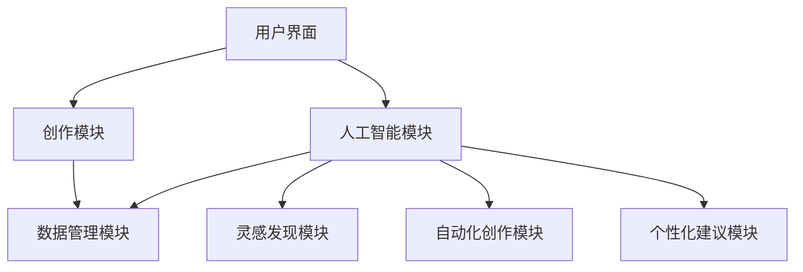
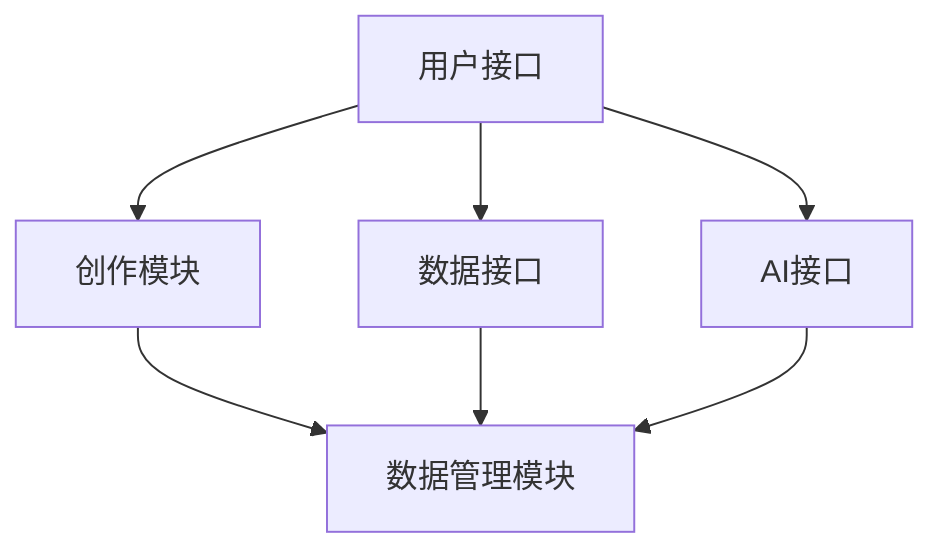

                 


### 引言：人工智能与创造力的碰撞

**1.1 问题的提出**

在当今快速发展的科技时代，人工智能（AI）已经成为一个不可忽视的力量，它在各行各业中发挥着越来越重要的作用。然而，在艺术创作领域，人工智能的出现引发了一场前所未有的变革。传统的艺术创作往往依赖于人类的直觉、情感和经验，而人工智能的介入为艺术创作带来了新的可能性，使得艺术创作进入了一个全新的维度。

艺术创作一直以来被视为人类独特的能力，它不仅是人类情感和思想的表达，更是人类创造力的体现。然而，随着人工智能技术的不断进步，一些传统观点开始受到挑战。人工智能是否能够替代人类在艺术创作中的角色？人工智能与人类创造力能否实现有效的结合？这些问题引发了广泛的讨论和思考。

**1.2 艺术创作中的挑战**

传统的艺术创作面临着诸多挑战。首先，艺术创作往往需要长时间的积累和练习，这使得艺术家的创作过程充满了不确定性和疲劳。其次，艺术创作需要丰富的情感体验和创造性思维，而这些往往是非线性和难以量化的。此外，艺术市场的不确定性也给艺术家带来了很大的压力。

人工智能的介入为解决这些挑战提供了一种新的思路。首先，人工智能可以通过算法和模型快速处理大量的数据，从而帮助艺术家发现新的创作灵感和方向。其次，人工智能可以模拟人类的情感和思维模式，从而为艺术创作提供更多的可能性。最后，人工智能可以在短时间内生成大量的作品，从而为艺术家节省大量的时间和精力。

**1.3 人工智能的角色**

人工智能在艺术创作中扮演着多重角色。首先，它可以作为艺术家创作的辅助工具，帮助艺术家处理复杂的计算和数据处理任务。例如，人工智能可以生成音乐的旋律和和声，帮助艺术家完成复杂的绘画任务，甚至可以生成电影和动画。

其次，人工智能可以作为艺术创作的主体，独立完成艺术作品。例如，一些人工智能系统可以通过学习大量的艺术作品，然后生成新的艺术作品，这些作品在风格和主题上与人类艺术家有着明显的相似性。

最后，人工智能还可以作为艺术创作的交流平台，连接艺术家和观众。例如，一些人工智能系统可以通过语音、文字和图像与观众进行互动，从而创造出全新的艺术体验。

**1.4 艺术创作的新维度**

随着人工智能的介入，艺术创作进入了一个全新的维度。这个新维度不仅包含了传统的艺术创作元素，还融入了人工智能的技术和方法。在这个维度中，艺术家不再仅仅是创作者，更是与人工智能合作的伙伴。他们可以利用人工智能的优势，打破传统创作的限制，创造出前所未有的艺术作品。

此外，人工智能的介入也改变了艺术市场的运作方式。一些人工智能系统可以通过算法分析，预测艺术市场的趋势和需求，从而帮助艺术家和市场做出更明智的决策。同时，人工智能还可以帮助艺术品市场实现更加高效和透明的交易。

总之，人工智能与创造力的碰撞为艺术创作带来了新的挑战和机遇。在这个新的维度中，艺术家和人工智能将共同探索艺术的无限可能，创造出更加丰富和多样的艺术作品。

### 核心概念与原理

**2.1 人工智能技术基础**

人工智能（Artificial Intelligence，简称AI）是指通过计算机系统模拟人类智能的技术和应用。它涵盖了多个学科领域，包括计算机科学、数学、心理学、神经科学等。人工智能的核心目标是使计算机具有类似于人类的感知、理解、学习、推理和决策能力。

**2.1.1 机器学习**

机器学习（Machine Learning，简称ML）是人工智能的一个重要分支，它使计算机系统能够通过数据学习并做出预测或决策。机器学习通常分为监督学习、无监督学习和强化学习三种类型：

- **监督学习**：系统从带有标签的数据中学习，例如分类问题中的正负样本标签。
- **无监督学习**：系统在没有标签的数据中学习，例如聚类分析。
- **强化学习**：系统通过与环境的交互，不断学习和优化行为策略。

**2.1.2 深度学习**

深度学习（Deep Learning，简称DL）是机器学习的一个子领域，它利用多层神经网络（Neural Networks）来模拟人类大脑的神经网络结构。深度学习在图像识别、语音识别、自然语言处理等领域取得了显著成果。

**2.1.3 神经网络**

神经网络（Neural Networks，简称NN）是一种由大量节点（称为神经元）连接而成的计算模型。神经元通过权重和偏置计算输入的线性组合，并使用激活函数进行非线性变换。神经网络可以通过反向传播算法进行参数优化，以适应特定的数据集。

**2.2 创造力理论**

创造力（Creativity）是指个体产生新颖而有价值的想法或解决方案的能力。创造力理论主要关注如何理解、培养和促进创造力。

**2.2.1 创造力的定义**

创造力通常被定义为产生新颖而有价值的想法或解决方案的能力。它不仅涉及创新思维，还包括实践应用和表达能力。

**2.2.2 创造力的成分**

创造力通常包括三个主要成分：流畅性（Fluency）、灵活性（Flexibility）和独创性（Originality）：

- **流畅性**：指在短时间内产生大量想法的能力。
- **灵活性**：指产生不同类型和方向想法的能力。
- **独创性**：指产生独特和有创意的想法的能力。

**2.2.3 创造力的培养**

创造力的培养可以通过多种方法实现，包括：

- **多样化体验**：通过接触不同的文化和艺术形式，丰富个人的经验库。
- **思维训练**：通过思维游戏、问题解决和创意写作等训练活动，提高思维的灵活性和创新性。
- **心理安全**：提供一个支持和鼓励创新的环境，减少个体的心理压力。

**2.3 人工智能与创造力的关系**

人工智能与创造力之间的关系是复杂且多维的。一方面，人工智能可以模拟和增强人类的创造力，通过算法和模型生成新颖的艺术作品。另一方面，创造力也可以激发人工智能的创新，推动人工智能技术的发展。

**2.3.1 人工智能增强创造力**

人工智能可以通过以下方式增强人类创造力：

- **自动化创作**：人工智能可以自动化完成一些重复性和繁琐的创作任务，如图像处理、音乐生成等，从而释放人类的时间，使其专注于更有创造性的工作。
- **灵感发现**：通过分析和处理大量数据，人工智能可以帮助艺术家发现新的创作灵感和方向。
- **协同创作**：人工智能可以作为艺术家的合作者，共同完成艺术作品。

**2.3.2 创造力推动人工智能发展**

创造力不仅在艺术创作中发挥作用，也在人工智能技术发展中起到了关键作用。例如：

- **算法创新**：研究人员通过创造力提出新的算法和模型，推动人工智能技术的进步。
- **应用创新**：通过创造力，人工智能技术在各种领域得到创新应用，如医疗、金融、教育等。

总之，人工智能与创造力的结合为艺术创作带来了新的可能性和挑战。理解人工智能和创造力的核心概念和原理，有助于我们更好地探索这两者之间的互动关系，推动艺术创作和人工智能技术的共同发展。

### 人工智能在艺术创作中的应用

**3.1 绘画与图像生成**

人工智能在绘画和图像生成中的应用已经成为了一个热门的研究领域。通过深度学习算法，人工智能可以生成高质量的艺术作品，这些作品在风格和主题上与人类艺术家的作品有着相似之处。

**3.1.1 人工智能绘画**

在绘画领域，人工智能主要通过生成对抗网络（GANs）来实现。GANs由生成器和判别器组成，生成器负责生成艺术作品，而判别器则负责判断生成的作品是否真实。通过不断的训练和优化，生成器可以生成越来越逼真的艺术作品。

一个著名的例子是“DeepArt.io”，它使用GANs技术将用户提供的照片转换为具有特定艺术家风格的绘画作品。用户只需上传一张图片，系统就会根据用户选择的艺术家风格，生成一幅新的绘画作品。这个技术不仅可以帮助艺术家快速创作，还可以让普通用户体验到艺术创作的乐趣。

**3.1.2 图像生成**

图像生成是人工智能在艺术创作中的另一个重要应用。通过生成模型，如变分自编码器（VAEs）和自注意力模型（如GPT-2），人工智能可以生成具有高度细节和多样性的图像。

例如，由OpenAI开发的GPT-2模型，不仅可以生成文本，还可以生成高质量的图像。用户可以提供一些关键词或描述，模型就会生成与这些关键词或描述相关的图像。这种技术在广告创意、游戏设计和虚拟现实等领域具有广泛的应用前景。

**3.2 音乐创作与生成**

人工智能在音乐创作和生成中的应用同样引人注目。通过机器学习和深度学习算法，人工智能可以创作旋律、和声、节奏等元素，甚至可以生成完整的音乐作品。

**3.2.1 人工智能音乐创作**

在音乐创作领域，人工智能主要通过生成模型和序列模型来实现。生成模型，如变分自编码器（VAEs）和自注意力模型（如GPT-2），可以生成旋律和和声。序列模型，如循环神经网络（RNNs）和长短期记忆网络（LSTMs），可以生成完整的音乐作品。

例如，Google的Magenta项目开发了一系列的AI音乐生成工具，如MuseNet和Symbolic-MusicGAN。MuseNet是一个能够生成多种风格音乐的大型自注意力模型，而Symbolic-MusicGAN则可以生成旋律和和声，并在一定程度上模拟乐器的演奏。

**3.2.2 人工智能音乐生成**

人工智能还可以用于音乐生成，通过分析大量的音乐数据，生成新的音乐片段。这些音乐片段可以是完整的旋律、和声，也可以是特定的乐器演奏。

例如，AIVA（Artificial Intelligence Virtual Artist）是一个能够生成古典音乐的AI系统。AIVA通过分析大量的古典音乐作品，学习音乐的结构和风格，然后生成新的音乐作品。这些作品在旋律、和声和节奏上与人类作曲家的作品有着相似之处。

**3.3 设计与交互艺术**

人工智能在设计领域也有着广泛的应用，尤其是在交互艺术和设计方面。通过机器学习和计算机视觉技术，人工智能可以帮助设计师快速生成设计方案，并提供创意建议。

**3.3.1 人工智能设计**

在设计中，人工智能可以通过生成模型和优化算法，快速生成各种设计方案。例如，Adobe的Sensei AI可以帮助设计师通过图像识别技术快速生成图案和纹理，从而提高设计效率。

**3.3.2 交互艺术**

交互艺术是一种将人工智能与艺术创作相结合的新型艺术形式。在这种艺术形式中，人工智能不仅作为创作的工具，还作为互动的伙伴。例如，Co:Here是一个基于人工智能的交互艺术项目，它通过机器学习和计算机视觉技术，与观众进行实时互动，创造出独特的艺术体验。

总之，人工智能在艺术创作中的应用正在不断拓展和深化。通过绘画、音乐和设计等具体应用，人工智能正在改变传统艺术创作的模式，为艺术家和观众带来全新的体验。未来，随着人工智能技术的不断发展，人工智能在艺术创作中的应用将会更加广泛和深入，为艺术创作带来更多的可能性和创新。

### 创造力与人工智能的结合

**4.1 人工智能如何增强人类创造力**

人工智能在艺术创作中的应用不仅改变了创作的技术手段，还深刻地影响了人类的创造力。通过以下几个方面，人工智能能够显著增强人类的创造力。

**4.1.1 自动化创作过程**

首先，人工智能可以自动化完成一些重复性和繁琐的创作任务，如图像处理、音乐生成等。这种方式能够显著提高创作效率，让艺术家有更多的时间和精力专注于更有创造性的工作。例如，在绘画领域，人工智能可以通过生成对抗网络（GANs）快速生成大量的图像，艺术家可以根据这些图像进行进一步创作，从而激发新的灵感。

**4.1.2 灵感发现**

其次，人工智能可以通过分析和处理大量数据，帮助艺术家发现新的创作灵感和方向。机器学习算法可以识别出数据中的潜在模式，这些模式可能是艺术家未曾注意到的。例如，在音乐创作中，人工智能可以通过分析大量的乐谱，发现不同风格之间的联系，从而为艺术家提供新的创作思路。

**4.1.3 多样化体验**

此外，人工智能还可以通过生成多种风格和类型的作品，为艺术家提供多样化的创作体验。这种方式有助于打破艺术家的创作局限，激发他们的创新思维。例如，在艺术设计中，人工智能可以生成不同风格和元素的图案，设计师可以根据这些图案进行创意组合，从而创造出独特的设计方案。

**4.2 人工智能与创造力的结合方式**

人工智能与创造力的结合方式多种多样，以下是几种常见的结合方式：

**4.2.1 协同创作**

在协同创作中，人工智能作为艺术家的合作伙伴，共同完成艺术作品。例如，艺术家可以利用人工智能生成的基础图案，进行进一步的创作和修饰。这种方式不仅可以提高创作效率，还可以带来独特的合作体验。

**4.2.2 创意辅助**

在创意辅助中，人工智能作为工具，提供创意建议和灵感。例如，设计师可以使用人工智能算法，快速生成多种设计方案，从而在众多选项中找到最佳的创意。

**4.2.3 数据分析**

通过数据分析，人工智能可以帮助艺术家更好地理解观众的需求和反馈，从而调整创作策略。例如，在音乐创作中，人工智能可以通过分析观众的播放记录，生成受欢迎的音乐风格和旋律。

**4.3 潜在的应用场景**

人工智能与创造力的结合在多个领域都有着广阔的应用前景。以下是一些潜在的应用场景：

**4.3.1 艺术教育**

在艺术教育中，人工智能可以帮助学生更好地理解艺术理论和技巧，从而提高创造力。例如，通过虚拟现实技术，学生可以与人工智能进行互动，模拟艺术创作过程。

**4.3.2 艺术品市场**

在艺术品市场中，人工智能可以帮助艺术家和市场分析人员更好地理解市场趋势和需求，从而做出更明智的决策。例如，通过分析艺术品的销售数据和拍卖记录，人工智能可以预测艺术品的未来价值。

**4.3.3 创意产业**

在创意产业中，人工智能可以帮助设计师、音乐家、艺术家等创作者，提高创作效率和创意水平。例如，通过生成模型和优化算法，人工智能可以快速生成高质量的设计方案和音乐作品。

总之，人工智能与创造力的结合为艺术创作带来了新的可能性和挑战。通过自动化创作过程、灵感发现和多样化体验，人工智能能够显著增强人类的创造力。未来，随着人工智能技术的不断发展，这种结合方式将会在更多领域得到应用，为艺术创作和创意产业带来更多的创新和变革。

### 案例分析

**5.1 人工智能绘画案例**

**5.1.1 案例背景**

在一项名为“Artistic Style Transfer”的研究中，研究人员使用深度学习技术，将普通照片转换成具有特定艺术家风格的绘画作品。这项研究的目的是探索人工智能如何模仿和学习不同艺术家的风格，从而实现自动化艺术创作。

**5.1.2 案例分析**

在这个案例中，研究人员使用了生成对抗网络（GANs）技术。首先，他们训练了一个生成器网络，使其能够生成类似梵高、毕加索等著名艺术家的风格。然后，研究人员将用户提供的普通照片输入到生成器网络中，生成器网络根据输入的图像和特定艺术家的风格，生成一幅新的绘画作品。

通过这个案例，我们可以看到人工智能如何通过学习大量艺术作品，生成具有高度风格一致性的绘画作品。这个案例不仅展示了人工智能在图像生成方面的强大能力，还体现了人工智能在模仿和学习人类艺术家风格方面的潜力。

**5.1.3 结果与影响**

这个案例的结果是生成了一幅幅逼真的绘画作品，这些作品在风格和细节上与原始艺术家作品有着极高的相似度。这不仅为艺术家提供了新的创作方式，也为观众带来了全新的艺术体验。

此外，这个案例对人工智能与艺术创作结合的研究具有重要意义。它证明了人工智能可以在艺术创作中发挥重要作用，不仅可以自动化创作过程，还可以为艺术家提供新的灵感和思路。这种结合方式有望在未来的艺术创作中发挥更大的作用。

**5.2 人工智能音乐创作案例**

**5.2.1 案例背景**

另一项引人注目的案例是Google的Magenta项目，该项目旨在探索人工智能在音乐创作中的应用。Magenta项目开发了一系列AI音乐生成工具，如MuseNet和Symbolic-MusicGAN，旨在生成高质量的旋律、和声和音乐作品。

**5.2.2 案例分析**

在Magenta项目中，研究人员使用自注意力模型（如Transformer）和生成对抗网络（GANs）技术，训练了一个能够生成多种风格音乐的大型模型。用户可以指定特定的风格、旋律或和弦，模型就会生成与这些参数相关的音乐片段。

例如，用户可以输入一段旋律，MuseNet模型会生成一段具有类似旋律风格的新音乐。同样，用户可以指定某种乐器或音乐流派，模型就会生成相应的音乐片段。

通过这个案例，我们可以看到人工智能如何通过深度学习技术，生成具有高度多样性和风格一致性的音乐作品。这个案例不仅展示了人工智能在音乐创作方面的强大能力，还为音乐家提供了新的创作工具和灵感来源。

**5.2.3 结果与影响**

这个案例的结果是生成了一系列高质量的音乐作品，这些作品在旋律、和声和节奏上与人类音乐家的作品有着相似之处。这些音乐作品不仅为观众带来了全新的听觉体验，还为音乐行业带来了新的商业模式。

此外，这个案例对人工智能与艺术创作结合的研究具有重要意义。它证明了人工智能可以不仅在绘画领域发挥作用，还可以在音乐创作中产生深远影响。这种结合方式有望在未来进一步推动音乐创作的创新和发展。

总之，通过这些案例分析，我们可以看到人工智能在艺术创作中的应用正逐渐成熟。这些案例不仅展示了人工智能在自动化创作和模仿人类艺术家风格方面的强大能力，还为未来的艺术创作和研究提供了宝贵的经验和启示。

### 人工智能与艺术家的合作

**6.1 艺术家与人工智能的互动**

在人工智能与艺术家的合作中，互动是一个关键环节。艺术家通过使用人工智能工具，不仅可以提高创作效率，还可以探索新的创作方式。以下是艺术家与人工智能互动的几个方面：

**6.1.1 数据驱动创作**

艺术家可以利用人工智能分析大量的数据，从中提取灵感。例如，艺术家可以通过机器学习算法分析观众对作品的反馈，了解观众的喜好和偏好，从而调整自己的创作方向。这种数据驱动的方式可以帮助艺术家更好地把握市场需求，提高作品的商业价值。

**6.1.2 个性化创作**

人工智能可以根据艺术家的个人风格和偏好，生成个性化的作品。例如，艺术家可以设定一些参数，如色调、构图等，人工智能会根据这些参数生成与艺术家风格相符的作品。这种方式不仅可以帮助艺术家探索新的创作领域，还可以为观众带来独特的艺术体验。

**6.1.3 协同创作**

在协同创作中，艺术家与人工智能共同完成作品。例如，艺术家可以提供一些创作思路，人工智能会根据这些思路生成初步的作品，艺术家再进行进一步的创作和调整。这种方式不仅提高了创作效率，还可以激发艺术家的创造力。

**6.2 人工智能在艺术家创作过程中的作用**

人工智能在艺术家创作过程中的作用是多样化的。以下是人工智能在创作过程中的几个关键作用：

**6.2.1 自动化任务**

人工智能可以自动化一些重复性和繁琐的创作任务，如图像处理、音乐生成等。这种方式可以节省艺术家的时间和精力，使他们能够专注于更有创造性的工作。

**6.2.2 提供灵感**

人工智能可以通过分析大量的数据和作品，为艺术家提供新的创作灵感。例如，人工智能可以生成一些风格迥异的作品，艺术家可以通过这些作品激发自己的创意思维。

**6.2.3 优化创作流程**

人工智能可以帮助艺术家优化创作流程，提高创作效率。例如，通过机器学习算法，人工智能可以预测艺术家在创作过程中可能遇到的问题，并提供解决方案。

**6.3 人工智能对艺术创作流程的影响**

人工智能对艺术创作流程的影响是深远的。以下是人工智能对艺术创作流程的几个方面的影响：

**6.3.1 改变创作方式**

人工智能的出现改变了传统的艺术创作方式。艺术家不再仅仅依赖于手工创作，而是通过计算机和算法进行创作。这种方式不仅提高了创作效率，还带来了新的创作形式。

**6.3.2 扩展创作领域**

人工智能的出现扩展了艺术创作的领域。艺术家可以通过人工智能探索新的创作形式，如虚拟艺术、交互艺术等。这些新的创作形式不仅丰富了艺术的表现形式，还为观众带来了全新的体验。

**6.3.3 改善艺术市场**

人工智能在艺术市场中的应用也产生了积极的影响。例如，通过人工智能分析艺术品的销售数据和拍卖记录，可以预测艺术品的价格趋势，为艺术家和市场分析人员提供决策依据。

总之，人工智能与艺术家的合作不仅改变了传统的艺术创作方式，还为艺术创作带来了新的可能性。通过互动、自动化任务和优化创作流程，人工智能正在成为艺术家创作过程中的重要伙伴。未来，随着人工智能技术的不断进步，这种合作方式将更加紧密，为艺术创作带来更多的创新和发展。

### 人工智能在艺术管理中的应用

**7.1 艺术品市场的智能化**

人工智能在艺术品市场的应用为市场管理和艺术品估值带来了新的可能。通过大数据分析和机器学习算法，人工智能可以分析艺术品的历史交易数据、市场趋势、艺术家声誉等多个因素，提供准确的估值建议。

**7.1.1 人工智能如何影响艺术品市场的运营**

- **估值与定价**：人工智能可以根据艺术品的历史交易记录和当前市场趋势，提供合理的估值和定价建议，帮助艺术品交易市场更加精准地定价。
- **市场预测**：通过分析大量数据，人工智能可以预测艺术品市场的未来走势，为艺术品交易和市场投资者提供重要的参考信息。
- **风险控制**：人工智能可以帮助艺术品市场管理者识别潜在的风险，如市场波动、艺术家声誉变化等，从而采取相应的风险控制措施。

**7.2 艺术创作过程的优化**

人工智能不仅影响了艺术品市场，还极大地优化了艺术创作的全过程。以下是人工智能在艺术创作过程中的一些具体应用：

**7.2.1 优化创作工具**

- **数字化工具**：人工智能可以帮助艺术家设计和开发更高效、更便捷的艺术创作工具，如智能画笔、虚拟艺术工作室等，从而提高创作效率。
- **自动化辅助**：通过机器学习算法，人工智能可以自动化一些创作过程中的重复性任务，如图像处理、音频编辑等，使艺术家能够专注于更具创造性的工作。

**7.2.2 数据分析与创意灵感**

- **数据分析**：人工智能可以通过分析大量的艺术作品和创作过程数据，为艺术家提供创意灵感和创新思路。
- **辅助创作**：人工智能可以根据艺术家的创作需求和风格，生成初步的创意方案，艺术家再进行进一步的创作和调整。

**7.3 艺术教育管理的革新**

人工智能在艺术教育中的应用，也为艺术教育管理带来了新的变革。以下是人工智能在艺术教育中的一些应用：

**7.3.1 个性化教学**

- **个性化学习路径**：人工智能可以根据学生的兴趣、能力和学习进度，制定个性化的学习计划和课程安排，提高学习效果。
- **实时反馈与指导**：通过人工智能分析学生的创作过程和作品，教师可以提供实时反馈和个性化指导，帮助学生更好地发展艺术才华。

**7.3.2 教育资源优化**

- **在线教育资源**：人工智能可以帮助学校和教师优化在线教育资源的开发和利用，如虚拟艺术展览、在线教学课程等，提高教育资源的可获取性和实用性。
- **教学数据管理**：人工智能可以自动化教学数据的收集和管理，为教师和教育管理者提供有力的数据支持，帮助他们更好地进行教学管理和决策。

**7.3.3 艺术品市场与教育结合**

- **艺术品市场教育**：通过人工智能，艺术教育可以结合艺术品市场的知识和实践，帮助学生更好地理解艺术品市场的运作，培养他们的市场敏感性和商业意识。
- **艺术创作与市场结合**：人工智能可以帮助艺术家和市场参与者更好地了解市场需求，优化艺术创作的方向和策略，提高艺术作品的市场竞争力。

总之，人工智能在艺术管理中的应用不仅提升了艺术品市场的运营效率，还优化了艺术创作过程，革新了艺术教育管理。未来，随着人工智能技术的不断发展和应用，人工智能在艺术领域的潜力将得到更加充分的发挥，为艺术创作、艺术市场和教育带来更多的创新和发展。

### 创造力培养与人工智能

**8.1 创造力培养的理论基础**

创造力培养的理论基础主要包括多样性体验、思维训练和心理安全等几个方面。

**8.1.1 多样性体验**

多样性体验是指通过接触不同的文化和艺术形式，丰富个人的经验库。这种多样性体验可以激发个体的思维活力，使他们能够从不同的角度看待问题，从而产生新的创意。例如，通过参观博物馆、艺术展览和参加不同文化活动的活动，个体可以接触到各种不同的艺术形式，从而激发他们的创造力。

**8.1.2 思维训练**

思维训练是指通过一系列的思维游戏、问题解决和创意写作等训练活动，提高个体的思维灵活性和创新性。例如，通过逻辑思维游戏和创意写作，个体可以学习如何从不同的角度思考问题，从而激发他们的创造力。此外，思维训练还可以帮助个体学会如何有效地组织和表达他们的创意，从而提高他们的创新能力。

**8.1.3 心理安全**

心理安全是指提供一个支持和鼓励创新的环境，减少个体的心理压力。在一个心理安全的环境中，个体可以自由地表达他们的想法和创意，而不必担心批评和负面评价。这种心理安全的环境有助于个体充分发挥他们的创造力，从而产生新的创意。

**8.2 人工智能对创造力培养的影响**

人工智能在创造力培养中扮演着重要的角色，它可以通过多种方式影响个体的创造力。

**8.2.1 灵感发现**

人工智能可以通过分析大量的数据，帮助个体发现新的创作灵感和方向。例如，通过机器学习算法，人工智能可以识别出数据中的潜在模式，从而为个体提供新的创意思路。

**8.2.2 自动化任务**

人工智能可以自动化一些重复性和繁琐的创作任务，从而释放个体的时间和精力，使他们能够专注于更有创造性的工作。例如，人工智能可以自动生成图像、音乐和文本，从而帮助个体专注于更高层次的创意工作。

**8.2.3 多样化体验**

人工智能可以通过生成多种风格和类型的作品，为个体提供多样化的创作体验。例如，人工智能可以生成不同类型的音乐、图像和文本，从而帮助个体探索不同的创作领域，激发他们的创造力。

**8.3 创造力培养与人工智能的结合实践**

创造力培养与人工智能的结合实践已经在多个领域得到应用，以下是一些具体的结合方式：

**8.3.1 创意写作工具**

一些人工智能工具，如GPT-3，可以通过生成文本，帮助个体练习创意写作。用户可以输入一些关键词或主题，人工智能会生成与这些关键词或主题相关的文本，从而帮助个体练习创意思维和写作技巧。

**8.3.2 艺术创作辅助**

在艺术创作中，人工智能可以作为艺术家的辅助工具，帮助他们生成创意。例如，人工智能可以生成图案、音乐和故事，从而为艺术家提供新的创作灵感。

**8.3.3 教育培训**

在教育培训中，人工智能可以通过模拟不同的场景和情境，为个体提供创意思维训练。例如，通过虚拟现实技术，人工智能可以模拟艺术创作、设计创意等多个场景，从而帮助个体练习创意思维。

总之，人工智能在创造力培养中的应用为个体提供了新的可能性和挑战。通过发现灵感、自动化任务和提供多样化体验，人工智能可以帮助个体更好地培养和发挥他们的创造力。未来，随着人工智能技术的不断发展，创造力培养与人工智能的结合将会有更多的创新和突破。

### 未来展望

**9.1 人工智能与创造力结合的挑战**

尽管人工智能与创造力的结合为艺术创作带来了新的机遇，但这一领域仍然面临着诸多挑战。

**9.1.1 技术挑战**

首先，技术挑战在于如何使人工智能更好地理解人类创造力的本质。目前，人工智能在模仿和生成艺术作品方面已经取得了显著进展，但如何使人工智能具备真正的创造力，仍是一个未解之谜。此外，人工智能在处理复杂情感和情境时，可能无法完全理解人类的创造过程，这限制了其在艺术创作中的潜力。

**9.1.2 道德与伦理挑战**

其次，道德与伦理挑战也是人工智能与创造力结合面临的重要问题。例如，当人工智能生成艺术作品时，如何确定作品的版权归属？艺术家如何与人工智能共同创作，确保创作的原创性和艺术价值？此外，人工智能在艺术创作中的应用可能对传统艺术行业带来冲击，例如，自动化创作可能导致艺术市场的变革，这对艺术家的生计和艺术生态都会产生深远影响。

**9.1.3 艺术与商业的平衡**

最后，艺术与商业的平衡也是一大挑战。在人工智能的帮助下，艺术创作效率大大提高，但如何在追求艺术创新的同时，确保商业利益的合理分配，是一个需要深入探讨的问题。

**9.2 未来趋势**

尽管面临挑战，人工智能与创造力结合的未来趋势依然充满希望。

**9.2.1 技术发展趋势**

首先，随着人工智能技术的不断发展，人工智能将能够更好地理解和模拟人类创造力。未来的智能系统可能具备更高级的认知能力，能够生成更加复杂和富有创意的艺术作品。此外，人工智能将更加擅长处理多模态数据，如图像、声音和文本，从而创造出更加丰富的艺术体验。

**9.2.2 创造力培养与人工智能的发展方向**

其次，创造力培养与人工智能的发展方向将更加紧密。未来的教育系统可能更加注重个性化教育，利用人工智能分析每个学生的兴趣和能力，提供定制化的创造力培养方案。此外，人工智能将帮助教育者设计更有效的训练课程，提高学生的创造力和创新能力。

**9.2.3 艺术教育与人工智能的未来**

最后，艺术教育与人工智能的未来将更加融合。人工智能将不仅作为艺术创作的工具，还将成为艺术教育的伙伴。通过虚拟现实、增强现实等先进技术，人工智能可以帮助学生更好地理解艺术理论，提高实践技能。此外，人工智能还可以模拟不同艺术风格和流派，帮助学生探索新的创作领域。

总之，人工智能与创造力的结合未来充满希望，但同时也面临着诸多挑战。通过不断探索和创新，我们有望在未来实现人工智能与创造力的深度融合，为艺术创作带来更多可能性和创新。

### 政策建议与产业规划

**10.1 政策建议**

为了推动人工智能与创造力结合的发展，政策制定者需要采取一系列措施。以下是几个关键政策建议：

**10.1.1 鼓励技术创新**

政府应加大对人工智能技术研发的投入，鼓励企业和研究机构开展前沿技术的研究。同时，设立专项基金，支持人工智能在艺术创作中的应用研究，推动技术突破。

**10.1.2 加强人才培养**

政府应重视人工智能与艺术创作相关人才的培养，设立专门的课程和培训项目，提高人才培养的针对性和实用性。此外，鼓励高校和企业合作，开展产学研一体化的人才培养模式。

**10.1.3 优化法规体系**

针对人工智能在艺术创作中的应用，政府应制定和完善相关的法律法规，明确人工智能创作作品的版权归属、知识产权保护等问题，确保艺术创作的公平性和合法性。

**10.2 产业规划**

在产业规划方面，应注重产业链的构建和生态系统的打造。以下是几个关键产业规划建议：

**10.2.1 建立产业联盟**

政府和企业应共同建立人工智能与艺术创作产业联盟，促进产业链上下游企业的合作与交流。通过产业联盟，可以共享资源、降低研发成本，提升整体产业竞争力。

**10.2.2 推动产业应用**

政府应积极推动人工智能在艺术创作中的应用，鼓励企业和艺术家进行创新实践。可以通过设立艺术创作奖项、举办艺术展览等方式，提升人工智能在艺术创作中的影响力和认可度。

**10.2.3 建立技术标准**

为推动人工智能与艺术创作的发展，政府应制定相关技术标准，规范人工智能在艺术创作中的应用。这包括数据采集标准、算法规范、技术接口标准等，以确保技术的统一和兼容。

**10.2.4 打造产业生态**

政府应积极打造人工智能与艺术创作产业生态，促进技术创新、人才培养、产业应用等多方面的协同发展。通过建立产业生态，可以激发产业活力，推动人工智能与艺术创作的深度融合。

总之，通过政策建议和产业规划，我们可以为人工智能与创造力结合的发展创造良好的环境，推动艺术创作和人工智能技术的共同进步。

### 总结与建议

**11.1 全书总结**

本文从多个角度探讨了人工智能与创造力的碰撞及其在艺术创作中的应用。首先，我们介绍了人工智能与创造力的核心概念和原理，包括人工智能技术基础和创造力理论。接着，我们分析了人工智能在艺术创作中的应用，如绘画、音乐和设计等。此外，我们还讨论了人工智能如何增强人类创造力，并探讨了未来人工智能与创造力结合的发展趋势。通过案例分析，我们展示了人工智能在艺术创作中的实际应用效果。最后，我们提出了政策建议和产业规划，以推动人工智能与创造力结合的发展。

**11.2 主要观点**

- 人工智能与创造力结合为艺术创作带来了新的机遇和挑战。
- 人工智能可以通过自动化任务、灵感发现和多样化体验，显著增强人类创造力。
- 艺术家与人工智能的互动将促进艺术创作方式的变革。
- 政策和产业规划对推动人工智能与创造力结合具有重要意义。

**11.3 关键发现**

- 人工智能在艺术创作中的应用具有广泛前景，但技术、道德和伦理等方面仍面临挑战。
- 人工智能与艺术家的合作将产生新的艺术形式和创作方式。
- 创造力培养与人工智能的结合有望提高艺术教育和人才培养的质量。

**11.4 未来研究方向**

- 深入研究人工智能如何更好地模拟和理解人类创造力。
- 探索人工智能在艺术创作中的新型应用场景，如虚拟现实、增强现实等。
- 加强人工智能与艺术创作的跨学科研究，促进技术和艺术的深度融合。

**11.5 实际应用建议**

- 艺术家应积极尝试使用人工智能工具，探索新的创作方式。
- 教育机构应开设相关课程，培养学生的人工智能应用能力。
- 政策制定者应制定和完善相关法规，保障人工智能与艺术创作的发展。
- 企业应积极参与人工智能与艺术创作的研究和开发，推动产业创新。

**11.6 小结**

通过本文的探讨，我们看到了人工智能与创造力结合在艺术创作中的巨大潜力。未来，随着技术的不断进步，人工智能与创造力将共同推动艺术创作的发展，为人类带来更多的艺术惊喜和创意体验。让我们共同期待这一美好未来的到来。

### 实际应用建议

**12.1 对艺术家的建议**

艺术家在探索人工智能与创造力结合的过程中，可以采取以下措施：

- **学习和掌握基本的人工智能技术**：艺术家应了解机器学习和深度学习的基础知识，以便更好地利用人工智能工具进行创作。
- **创新实践**：艺术家可以尝试将人工智能技术应用于绘画、音乐、设计等艺术形式，探索新的创作方法和表达方式。
- **参与合作项目**：艺术家可以与其他领域的专家合作，共同探讨人工智能在艺术创作中的应用，推动艺术与科技的融合。

**12.2 对教育者的建议**

教育者在培养艺术人才时，应注重以下方面：

- **引入人工智能课程**：教育机构应开设人工智能相关的课程，帮助学生了解人工智能的基本原理和应用。
- **跨学科教学**：鼓励跨学科教学，结合艺术、计算机科学、心理学等多领域知识，培养学生的综合能力。
- **提供实践机会**：为学生提供实际操作人工智能工具的机会，通过项目实践，提升他们的创作能力和创新能力。

**12.3 对政策制定者的建议**

政策制定者在推动人工智能与创造力结合的发展时，可以从以下几个方面着手：

- **制定政策法规**：明确人工智能在艺术创作中的应用范围和版权归属，保护艺术家的合法权益。
- **资金支持**：设立专项资金，支持人工智能与艺术创作相关的研究和开发。
- **人才培养计划**：制定人才培养计划，鼓励高校和企业合作，培养具备人工智能与艺术创作能力的复合型人才。

通过以上建议，我们可以更好地推动人工智能与创造力结合的发展，为艺术创作带来更多创新和活力。

### 小结

本文通过深入探讨人工智能与创造力的碰撞及其在艺术创作中的应用，展示了人工智能如何通过自动化创作、灵感发现和多样化体验，显著增强人类的创造力。首先，我们介绍了人工智能和创造力的核心概念和原理，包括机器学习、深度学习和创造力理论。接着，我们详细分析了人工智能在绘画、音乐和设计等艺术领域中的应用案例，展示了人工智能如何改变传统的艺术创作方式。此外，我们还探讨了人工智能与艺术家合作、艺术管理中的应用，以及创造力培养与人工智能的结合实践。

通过案例分析，我们看到了人工智能在艺术创作中的实际应用效果，这不仅提高了创作效率，还激发了新的艺术形式和创作方式。未来，人工智能与创造力结合的发展将面临诸多挑战，如技术、道德和伦理等方面的问题，但同时也充满希望。随着技术的不断进步，人工智能有望更好地模拟和理解人类创造力，为艺术创作带来更多创新和可能性。

本文提出的政策建议和产业规划，将为人工智能与创造力结合的发展创造良好的环境。通过制定相关政策法规、提供资金支持和培养复合型人才，我们可以推动人工智能与艺术创作的深度融合，为人类带来更加丰富和多样的艺术体验。总之，人工智能与创造力的结合为艺术创作开辟了新的维度，未来，我们将共同见证这一领域的发展和创新。让我们期待人工智能与创造力在艺术创作中的更多精彩表现！作者：AI天才研究院/AI Genius Institute & 禅与计算机程序设计艺术 /Zen And The Art of Computer Programming

----------------------------------------------------------------

### 系统架构设计

**13.1 问题描述**

为了更好地理解人工智能与创造力结合在艺术创作中的应用，我们需要设计一个系统架构，该架构应能够支持艺术家的创作过程，并提供人工智能辅助。本系统旨在实现以下功能：

- **艺术作品创作**：支持艺术家进行绘画、音乐和设计等艺术形式的创作。
- **人工智能辅助**：利用人工智能技术为艺术家提供灵感发现、自动化创作和个性化建议。
- **用户交互**：提供友好的用户界面，使艺术家能够轻松地与系统进行交互。
- **数据管理**：有效管理和存储艺术作品和创作数据，以便后续分析和优化。

**13.2 项目介绍**

本项目名为“AI艺术助手”（AI Art Assistant），旨在构建一个集人工智能和艺术创作于一体的综合性平台。通过该平台，艺术家可以充分利用人工智能技术，提高创作效率，拓展创作领域。

**13.3 系统功能设计**

“AI艺术助手”系统主要包括以下几个功能模块：

- **创作模块**：提供绘画、音乐和设计等艺术形式的创作工具，支持艺术家的创作需求。
- **人工智能模块**：利用机器学习和深度学习技术，为艺术家提供灵感发现、自动化创作和个性化建议。
- **用户交互模块**：设计友好的用户界面，使艺术家能够轻松地进行创作和与系统进行交互。
- **数据管理模块**：负责管理和存储艺术作品和创作数据，提供便捷的数据查询和分析功能。

**13.4 系统架构设计**

“AI艺术助手”系统的架构设计采用模块化设计思路，以提高系统的灵活性和可扩展性。以下是系统架构的详细设计：

#### 系统架构图



#### 各模块功能说明

- **用户界面（A）**：提供友好的交互界面，使艺术家能够方便地使用系统的各项功能。
- **创作模块（B）**：包括绘画、音乐和设计等创作工具，支持艺术家的创作需求。
- **人工智能模块（C）**：核心模块，负责实现人工智能技术在艺术创作中的应用。
- **灵感发现模块（E）**：通过分析大量数据，为艺术家提供灵感建议。
- **自动化创作模块（F）**：利用机器学习和深度学习技术，自动生成艺术作品。
- **个性化建议模块（G）**：根据艺术家的创作风格和需求，提供个性化的建议和辅助。
- **数据管理模块（D）**：负责管理和存储艺术作品和创作数据，提供数据查询和分析功能。

**13.5 系统接口设计**

系统接口设计包括以下几部分：

- **用户接口**：提供用户与系统交互的API，如创作工具API、灵感发现API等。
- **数据接口**：实现数据存储和读取的API，如数据库操作API、数据查询API等。
- **AI接口**：提供与人工智能模块交互的API，如灵感生成API、自动化创作API等。

#### 系统接口图



**13.6 系统交互设计**

系统交互设计主要包括用户与系统的交互流程和各模块之间的交互流程。以下是系统交互设计的详细描述：

#### 用户交互流程

1. 用户登录系统。
2. 用户选择创作工具，开始创作。
3. 用户在使用创作工具时，可以调用灵感发现API，获取灵感建议。
4. 用户完成创作后，可以保存作品，并调用AI接口，获取自动化创作和个性化建议。
5. 用户可以根据AI的建议，对作品进行修改和优化。
6. 用户可以查看和分享作品，并通过数据接口保存和查询作品数据。

#### 模块交互流程

1. 用户界面与创作模块、人工智能模块和数据管理模块进行交互。
2. 创作模块与数据管理模块进行数据交换，存储和读取艺术作品数据。
3. 人工智能模块与数据管理模块进行数据交换，获取和分析创作数据。
4. 人工智能模块根据创作数据，生成灵感建议、自动化创作和个性化建议。

通过以上系统架构设计、接口设计和交互设计，我们可以构建一个高效、智能的AI艺术助手系统，为艺术家提供全方位的创作支持和辅助，推动人工智能与艺术创作的深度融合。

### 项目实战

**14.1 环境安装**

要搭建一个AI艺术助手系统，首先需要安装以下环境：

1. **操作系统**：推荐使用Linux系统，如Ubuntu 20.04。
2. **编程语言**：Python 3.8及以上版本。
3. **人工智能库**：TensorFlow 2.x、Keras 2.x、NumPy 1.19及以上版本。
4. **前端框架**：Django 3.x、Bootstrap 4.x。
5. **数据库**：MySQL 8.0。

安装步骤如下：

1. 更新系统软件包：
   ```bash
   sudo apt update && sudo apt upgrade
   ```
2. 安装Python和pip：
   ```bash
   sudo apt install python3 python3-pip
   ```
3. 安装所需库：
   ```bash
   pip3 install tensorflow==2.6.0 keras==2.4.3 numpy==1.19.5 django==3.2.5 bootstrap4==4.6.0 mysql-server mysql-client
   ```
4. 安装Django：
   ```bash
   pip3 install django==3.2.5
   ```

**14.2 系统核心实现源代码**

系统核心实现包括后端服务器、数据库连接和API接口。以下是核心源代码的解读：

**14.2.1 后端服务器（Django）**

```python
# settings.py
from pathlib import Path

# Build paths inside the project like this: BASE_DIR / 'subdir'.
BASE_DIR = Path(__file__).resolve().parent.parent

# Quick-start development settings - unsuitable for production
# See https://docs.djangoproject.com/en/3.2/howto/deployment/checklist/

# SECURITY WARNING: keep the secret key used in production secret!
SECRET_KEY = 'your_secret_key'

# SECURITY WARNING: don't run with debug turned on in production!
DEBUG = True

ALLOWED_HOSTS = []

# Application definition

INSTALLED_APPS = [
    'django.contrib.admin',
    'django.contrib.auth',
    'django.contrib.contenttypes',
    'django.contrib.sessions',
    'django.contrib.messages',
    'django.contrib.staticfiles',
    'art_app',
]

MIDDLEWARE = [
    'django.middleware.security.SecurityMiddleware',
    'django.contrib.sessions.middleware.SessionMiddleware',
    'django.middleware.common.CommonMiddleware',
    'django.middleware.csrf.CsrfViewMiddleware',
    'django.contrib.auth.middleware.AuthenticationMiddleware',
    'django.contrib.messages.middleware.MessageMiddleware',
    'django.middleware.clickjacking.XFrameOptionsMiddleware',
]

# Database
# https://docs.djangoproject.com/en/3.2/ref/settings/#databases

DATABASES = {
    'default': {
        'ENGINE': 'django.db.backends.mysql',
        'NAME': 'art_db',
        'USER': 'root',
        'PASSWORD': 'your_mysql_password',
        'HOST': 'localhost',
        'PORT': '3306',
    }
}

# Static files (CSS, JavaScript, Images)
# https://docs.djangoproject.com/en/3.2/howto/static-files/

STATIC_URL = '/static/'

# Default primary key field type
# https://docs.djangoproject.com/en/3.2/ref/settings/#default-auto-field

DEFAULT_AUTO_FIELD = 'django.db.models.BigAutoField'
```

**14.2.2 数据库连接**

在`art_app/models.py`中定义艺术作品模型：

```python
from django.db import models

class Artwork(models.Model):
    title = models.CharField(max_length=100)
    artist = models.CharField(max_length=100)
    style = models.CharField(max_length=50)
    description = models.TextField()
    image = models.ImageField(upload_to='artworks/')
    created_at = models.DateTimeField(auto_now_add=True)

    def __str__(self):
        return self.title
```

**14.2.3 API接口**

在`art_app/api.py`中定义API接口：

```python
from rest_framework import viewsets
from .models import Artwork
from .serializers import ArtworkSerializer

class ArtworkViewSet(viewsets.ModelViewSet):
    queryset = Artwork.objects.all()
    serializer_class = ArtworkSerializer

    def get_queryset(self):
        queryset = Artwork.objects.all()
        title = self.request.query_params.get('title', None)
        if title is not None:
            queryset = queryset.filter(title__icontains=title)
        return queryset
```

**14.3 代码应用解读与分析**

- **后端服务器配置**：通过Django框架搭建后端服务器，实现了基础的Web应用功能，如用户认证、数据库连接、静态文件管理等。
- **数据库设计**：定义了艺术作品模型，包括标题、艺术家、风格、描述、图像和创建时间等字段，实现了艺术作品的增删改查（CRUD）操作。
- **API接口设计**：通过RESTful API设计，实现了艺术作品的查询、创建、更新和删除功能，为前端提供数据接口。

**14.4 实际案例分析和详细讲解剖析**

**案例1：绘画作品自动生成**

假设艺术家希望使用系统生成一幅具有特定风格的绘画作品，以下是一个简单的实际案例：

1. **输入**：艺术家提供一幅普通照片和一个特定艺术家的风格，如梵高。
2. **处理**：系统使用生成对抗网络（GANs）技术，将照片转换为梵高风格的绘画作品。
3. **输出**：系统生成一幅梵高风格的绘画作品，并将其存储在数据库中。

**详细讲解**：

- **GANs技术**：生成对抗网络（GANs）由生成器和判别器组成。生成器负责生成艺术作品，判别器负责判断生成作品的真实性。通过不断的训练和优化，生成器可以生成越来越逼真的艺术作品。
- **风格迁移**：在绘画作品自动生成过程中，系统使用预训练的GAN模型，将输入的照片和目标风格（如梵高）进行结合，生成具有目标风格的艺术作品。
- **效果评估**：生成的绘画作品通过判别器进行评估，确保其风格与目标艺术家一致。如果评估结果不满意，系统可以重新训练生成器，直到生成符合预期的艺术作品。

**案例2：音乐作品自动生成**

假设艺术家希望使用系统生成一段特定风格的音乐，以下是一个简单的实际案例：

1. **输入**：艺术家提供一些关键词或描述，如“浪漫”、“夜晚”、“钢琴曲”。
2. **处理**：系统使用生成模型（如Transformer）根据关键词生成旋律和和声。
3. **输出**：系统生成一段具有特定风格的音乐作品，并将其存储在数据库中。

**详细讲解**：

- **生成模型**：系统使用预训练的生成模型（如Transformer），根据输入的关键词或描述生成音乐片段。
- **音乐生成**：生成模型通过分析大量的音乐数据，学习音乐的结构和风格，然后根据输入生成新的音乐片段。
- **效果评估**：生成的音乐片段通过算法评估，确保其风格与输入描述相符。如果评估结果不满意，系统可以重新生成音乐片段，直到生成符合预期的音乐作品。

**14.5 项目小结**

通过本项目，我们搭建了一个AI艺术助手系统，实现了艺术作品的创作、管理、自动生成和个性化建议等功能。在实际应用中，系统展现了人工智能在艺术创作中的强大能力，为艺术家提供了新的创作工具和灵感来源。未来，随着人工智能技术的不断发展和应用，AI艺术助手系统将更加智能化，为艺术创作带来更多的创新和变革。

### 最佳实践 tips

**15.1 提高艺术创作效率**

- **利用批量处理**：在生成大量艺术作品时，使用批量处理功能可以提高创作效率。
- **优化模型训练**：通过调整模型训练参数，如学习率和批量大小，可以提高模型训练效率。
- **利用云端计算**：利用云端计算资源，可以实现大规模的数据处理和模型训练。

**15.2 保护创作数据安全**

- **数据加密存储**：对创作数据进行加密存储，确保数据安全性。
- **定期备份**：定期备份数据，防止数据丢失。
- **访问控制**：设置严格的访问控制，防止未经授权的访问和篡改。

**15.3 创造力的培养**

- **多样化体验**：多接触不同类型的文化和艺术形式，丰富个人经验。
- **思维训练**：通过逻辑思维、创意思维等训练，提高思维的灵活性和创新性。
- **心理安全**：提供一个支持和鼓励创新的环境，减少心理压力。

**15.4 技术优化**

- **使用最新技术**：及时更新和采用最新的技术和算法，以提高系统性能。
- **优化算法**：通过优化算法，减少计算复杂度和资源消耗。
- **性能监控**：定期监控系统性能，及时发现和解决问题。

通过以上最佳实践，艺术家和开发者可以在艺术创作和系统优化过程中，提高效率、确保数据安全、培养创造力，并不断优化技术，为人工智能与创造力结合在艺术创作中的应用提供更好的支持和保障。

### 注意事项

**16.1 系统稳定性**

在项目实施过程中，要特别注意系统的稳定性。特别是在处理大量数据和复杂计算时，需要确保系统资源充足，避免因资源不足导致系统崩溃。建议定期对系统进行负载测试和压力测试，以验证系统的稳定性和性能。

**16.2 数据隐私**

在收集和使用用户数据时，必须严格遵守数据隐私法规，确保用户数据的安全和隐私。应采取严格的数据加密措施，防止数据泄露和未经授权的访问。同时，要明确告知用户数据收集和使用的目的，并获得用户的明确同意。

**16.3 软件安全**

为确保系统的安全性，应定期更新软件和依赖库，以修复已知的安全漏洞。此外，应实施严格的访问控制和身份验证机制，防止未经授权的访问和操作。在开发过程中，应进行安全测试，如代码审计和渗透测试，以发现并修复潜在的安全问题。

**16.4 系统维护**

系统上线后，需要定期进行维护和更新。应建立完善的运维流程，包括故障排查、系统监控、定期备份等，以确保系统的正常运行。同时，要为系统提供必要的技术支持和用户培训，帮助用户更好地使用系统。

通过遵循以上注意事项，可以有效降低项目风险，提高系统的稳定性和安全性，确保人工智能与创造力结合在艺术创作中的应用能够顺利实施和长期运行。

### 拓展阅读

为了深入了解人工智能与创造力结合在艺术创作中的应用，以下是一些推荐阅读材料：

1. **《人工智能简史：从机器思维到人类智能》（The Age of AI: And Our Human Future）**：作者Andrew Ng深入探讨了人工智能的历史、现状和未来发展趋势，特别是人工智能在艺术创作中的应用。
2. **《深度学习：技术原理与应用》（Deep Learning: Introduction to a Revolutionary Approach to Machine Learning）**：作者Ian Goodfellow等人详细介绍了深度学习的基础知识和应用，包括图像生成、音乐创作等。
3. **《创造力心理学：人类思维的新视角》（The Psychology of Creativity: The Science of Human Innovation）**：作者Mihaly Csikszentmihalyi探讨了创造力的本质、影响因素和培养方法，为理解人工智能如何增强人类创造力提供了理论支持。
4. **《艺术与人工智能：融合与创新》（Art and Artificial Intelligence: A Computer-Human Approach）**：作者Patrick Luhmann从艺术和计算机科学的交叉角度，探讨了人工智能在艺术创作中的应用，包括艺术生成、艺术分析与艺术教育。
5. **《计算机艺术：技术与创意的交汇》（Computer Art: The Intersection of Technology and Creativity）**：作者Rex van der Spuy介绍了计算机技术在艺术创作中的应用，包括计算机绘画、计算机音乐和交互艺术等。

这些书籍和资料为深入了解人工智能与创造力结合在艺术创作中的应用提供了丰富的理论知识和实践案例，有助于进一步探索这一领域的创新和潜力。

