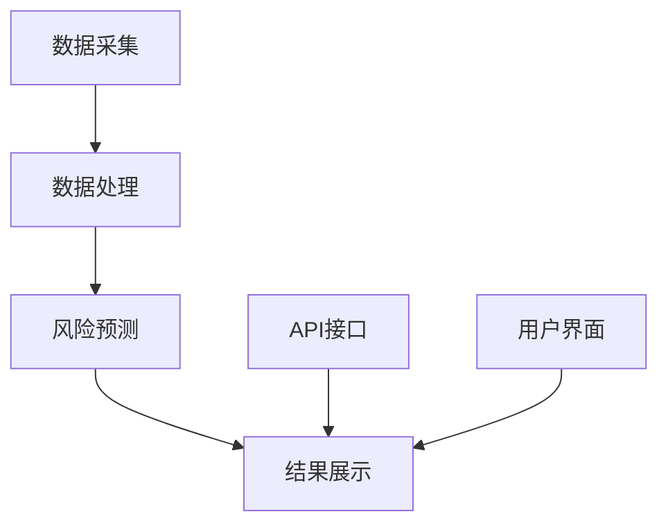
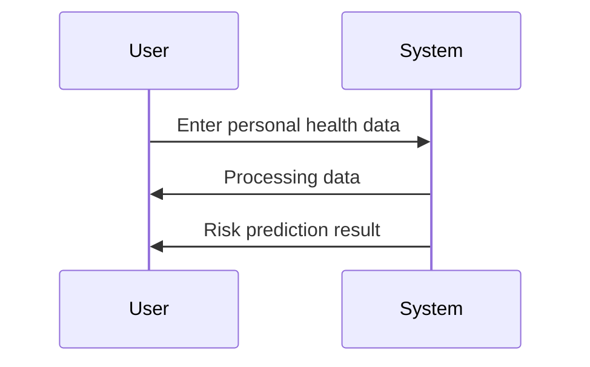

                 


## 人工智能在个性化健康管理中的应用：AI驱动的健康风险预测模型

### 关键词
- 人工智能
- 个性化健康管理
- 健康风险预测模型
- 机器学习
- 深度学习
- 强化学习
- 个性化推荐
- 健康数据分析

### 摘要
本文探讨了人工智能在个性化健康管理中的应用，重点关注AI驱动的健康风险预测模型。通过逐步分析AI模型的原理、数学模型、系统设计及实际应用，文章旨在为读者提供全面、深入的了解，帮助其在健康领域利用人工智能技术进行风险预测和管理。

## 引言

### 1.1 人工智能与个性化健康管理的背景

#### 1.1.1 人工智能的快速发展

人工智能（AI）自20世纪50年代诞生以来，经历了从理论研究到实际应用的蓬勃发展。近年来，得益于计算能力的提升、大数据的积累以及深度学习算法的突破，AI在各个领域的应用取得了显著成果。特别是在医疗健康领域，人工智能技术展现出巨大的潜力，能够提高诊疗效率、优化健康管理、降低医疗成本。

#### 1.1.2 个性化健康管理的需求

随着社会人口老龄化趋势的加剧，慢性病发病率不断上升，公众对健康管理的需求日益增加。传统的健康管理模式往往缺乏个性化和精准性，难以满足个体差异化的健康需求。个性化健康管理通过分析个体健康数据，提供定制化的预防、诊断、治疗和康复方案，成为解决这一问题的关键。

#### 1.1.3 AI在个性化健康管理中的应用前景

AI技术在个性化健康管理中的应用前景广阔。首先，健康数据的获取和处理能力不断增强，为AI模型提供了丰富的数据支持。其次，机器学习、深度学习等AI算法的发展，使得健康风险预测模型的准确性大幅提升。此外，AI技术还能实现智能诊断、疾病预测、个性化推荐等功能，有助于提高医疗服务的质量和效率。

### 1.2 AI驱动的健康风险预测模型概述

#### 1.2.1 健康风险预测的基本概念

健康风险预测是指利用个体健康数据，预测其未来发生特定疾病或健康问题的可能性。常见的健康风险预测指标包括心血管疾病风险、糖尿病风险、癌症风险等。

#### 1.2.2 AI驱动的健康风险预测模型的重要性

AI驱动的健康风险预测模型能够提高预测的准确性，有助于提前发现潜在的健康问题，从而采取预防措施。相比传统方法，AI模型能够处理大规模数据，发现数据中的潜在关联，提供更加个性化的健康建议。

#### 1.2.3 常见的AI模型与技术

在健康风险预测中，常用的AI模型包括机器学习、深度学习、强化学习等。机器学习模型如逻辑回归、决策树、支持向量机等，能够处理分类和回归问题。深度学习模型如卷积神经网络（CNN）、循环神经网络（RNN）、生成对抗网络（GAN）等，具有强大的特征提取和表达能力。强化学习模型如深度强化学习（DRL），在动态环境中进行决策和优化，具有较好的应用前景。

## 核心概念与模型

### 2.1 个性化健康管理中的核心概念

#### 2.1.1 个性化健康管理的定义

个性化健康管理是一种基于个体健康数据和生物特征，提供定制化健康服务和管理方案的新型健康管理方式。

#### 2.1.2 个人健康数据的类型与处理

个人健康数据包括生物特征数据（如身高、体重、血压、血糖等）、生活习惯数据（如饮食、运动、睡眠等）、医疗记录数据（如诊断、治疗、药物等）。数据处理包括数据清洗、数据整合、特征提取等步骤，以提高数据质量和模型性能。

#### 2.1.3 常见的健康风险评估指标

常见的健康风险评估指标包括心血管疾病风险、糖尿病风险、癌症风险等。这些指标有助于评估个体的健康风险，制定个性化的预防措施。

### 2.2 常见AI模型及其应用

#### 2.2.1 机器学习基础

机器学习是AI的核心技术之一，通过从数据中学习规律，实现自动预测和决策。常见的机器学习模型包括监督学习、无监督学习和强化学习。

#### 2.2.2 深度学习模型

深度学习是一种基于人工神经网络的机器学习模型，具有强大的特征提取和表达能力。常见的深度学习模型包括卷积神经网络（CNN）、循环神经网络（RNN）、生成对抗网络（GAN）等。

#### 2.2.3 强化学习与迁移学习

强化学习是一种基于奖励机制的机器学习模型，适用于动态决策和优化问题。迁移学习则是通过利用预训练模型，提高新任务的性能。

### 2.3 AI模型的比较与分析

#### 2.3.1 不同模型的特点与适用场景

不同的AI模型具有不同的特点和适用场景。例如，机器学习模型适用于静态数据分析，深度学习模型适用于复杂特征提取，强化学习模型适用于动态决策优化。

#### 2.3.2 模型性能评估指标

模型性能评估指标包括准确率、召回率、F1值、AUC等。通过对比不同模型的性能评估指标，可以选出最适合特定任务的模型。

#### 2.3.3 模型选择策略

模型选择策略包括基于任务需求的模型选择、基于数据特点的模型选择等。在实际应用中，需要综合考虑任务需求、数据特点和计算资源等因素，选择合适的模型。

### 2.4 数学模型与算法原理

#### 2.4.1 机器学习数学模型

机器学习数学模型主要包括线性模型、决策树、支持向量机等。以线性模型为例，其数学公式为：

$$
y = \beta_0 + \beta_1 x_1 + \beta_2 x_2 + ... + \beta_n x_n
$$

其中，$y$为预测值，$x_1, x_2, ..., x_n$为特征值，$\beta_0, \beta_1, ..., \beta_n$为模型参数。

#### 2.4.2 深度学习数学模型

深度学习数学模型主要包括卷积神经网络（CNN）、循环神经网络（RNN）、生成对抗网络（GAN）等。以卷积神经网络为例，其核心原理是卷积操作和池化操作，用于提取图像特征。

#### 2.4.3 强化学习数学模型

强化学习数学模型主要包括Q学习、SARSA等。以Q学习为例，其目标是最小化长期奖励的期望值：

$$
Q(s, a) = \sum_{s'} p(s'|s, a) \cdot r(s', a) + \gamma \cdot \max_{a'} Q(s', a')
$$

其中，$Q(s, a)$为状态s下的动作a的Q值，$r(s', a)$为状态s'下动作a的即时奖励，$\gamma$为折扣因子。

### 2.5 系统设计与实现

#### 2.5.1 系统功能设计

系统功能设计主要包括数据采集、数据处理、风险预测和结果展示等模块。

#### 2.5.2 系统架构设计

系统架构设计包括数据存储、计算引擎、API接口和用户界面等模块。以下是一个简化的系统架构设计图：



#### 2.5.3 系统接口设计

系统接口设计主要包括API接口和用户界面。API接口用于实现数据采集、处理和风险预测等功能。用户界面用于展示风险预测结果，提供用户交互功能。

#### 2.5.4 系统交互设计

系统交互设计主要包括用户与系统的交互流程。以下是一个简化的系统交互设计图：



### 2.6 项目实战

#### 2.6.1 环境安装

在项目实战中，首先需要安装相关的环境。以Python为例，需要安装NumPy、Pandas、Scikit-learn、TensorFlow等库。

```bash
pip install numpy pandas scikit-learn tensorflow
```

#### 2.6.2 系统核心实现

系统核心实现包括数据预处理、模型训练、模型评估和结果展示。以下是一个简单的Python代码示例：

```python
import numpy as np
import pandas as pd
from sklearn.model_selection import train_test_split
from sklearn.ensemble import RandomForestClassifier
from sklearn.metrics import accuracy_score

# 加载数据
data = pd.read_csv('health_data.csv')
X = data.drop(['label'], axis=1)
y = data['label']

# 数据预处理
X_train, X_test, y_train, y_test = train_test_split(X, y, test_size=0.2, random_state=42)

# 模型训练
model = RandomForestClassifier()
model.fit(X_train, y_train)

# 模型评估
y_pred = model.predict(X_test)
accuracy = accuracy_score(y_test, y_pred)
print(f'Accuracy: {accuracy}')

# 结果展示
results = pd.DataFrame({'Actual': y_test, 'Predicted': y_pred})
print(results.head())
```

#### 2.6.3 实际案例分析

在实际应用中，可以通过一个具体的案例来展示系统如何进行健康风险预测。以下是一个简化的案例：

- 用户输入个人健康数据（如年龄、身高、体重、血压等）。
- 系统对用户数据进行处理，提取特征。
- 系统使用训练好的模型进行风险预测。
- 系统将预测结果展示给用户。

#### 2.6.4 项目小结

通过项目实战，读者可以了解到如何利用Python等工具实现AI驱动的健康风险预测系统。在实际应用中，需要根据具体需求和数据特点，选择合适的模型和算法，进行系统设计和实现。

### 2.7 最佳实践与结论

#### 2.7.1 最佳实践

在实施AI驱动的健康风险预测时，建议遵循以下最佳实践：

1. 数据质量和预处理：确保数据的准确性和一致性，进行数据清洗、归一化和特征提取等预处理操作。
2. 模型选择与调优：根据具体问题和数据特点，选择合适的模型，进行模型调优和超参数调整。
3. 模型评估与验证：使用交叉验证、AUC等指标评估模型性能，确保模型的可解释性和可靠性。

#### 2.7.2 结论

AI驱动的健康风险预测模型在个性化健康管理中具有广泛应用前景。通过逐步分析AI模型的原理、数学模型、系统设计和实际应用，本文为读者提供了全面、深入的了解。希望读者能够结合自身实际需求，充分利用AI技术，提高健康风险预测的准确性和实用性。

### 附录

#### 2.8 拓展阅读

1. Hastie, T., Tibshirani, R., & Friedman, J. (2009). The Elements of Statistical Learning: Data Mining, Inference, and Prediction. Springer.
2. Goodfellow, I., Bengio, Y., & Courville, A. (2016). Deep Learning. MIT Press.
3. Sutton, R. S., & Barto, A. G. (2018). Reinforcement Learning: An Introduction. MIT Press.

## 作者信息

作者：AI天才研究院/AI Genius Institute & 禅与计算机程序设计艺术 /Zen And The Art of Computer Programming

---

以上是文章的完整目录和初步内容。接下来，我们将对每个章节进行详细撰写，确保满足字数要求和格式规范。每个章节的内容将包括背景介绍、核心概念与联系、算法原理讲解、系统分析与架构设计方案、项目实战以及最佳实践和结论。在撰写过程中，将严格遵守markdown格式，使用mermaid绘制流程图，并使用LaTeX格式嵌入数学公式。文章完成后，将确保整体结构紧凑、逻辑清晰，易于读者理解。

