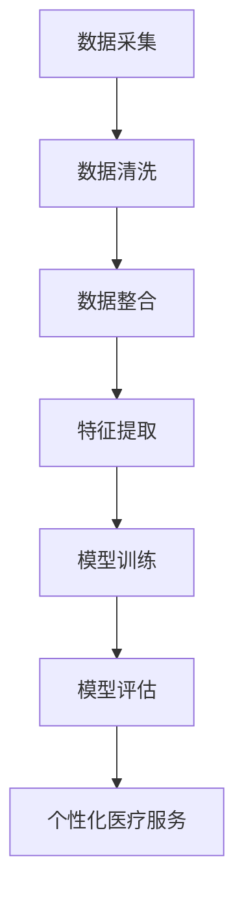
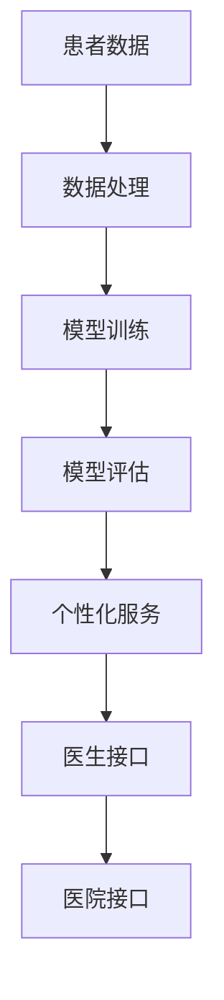
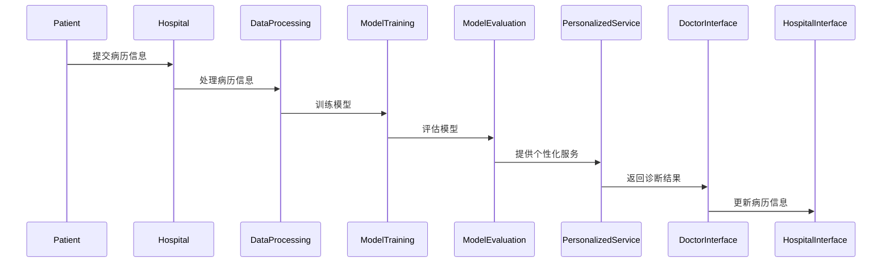
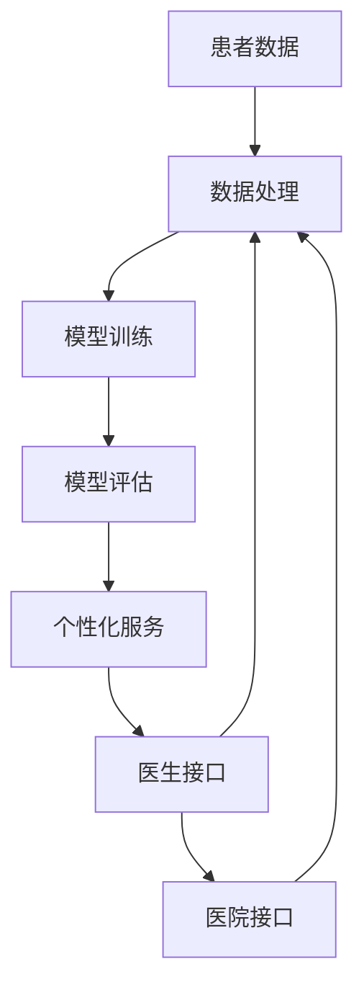
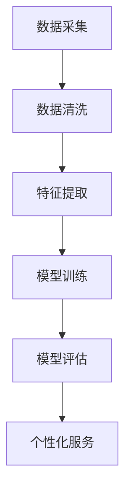
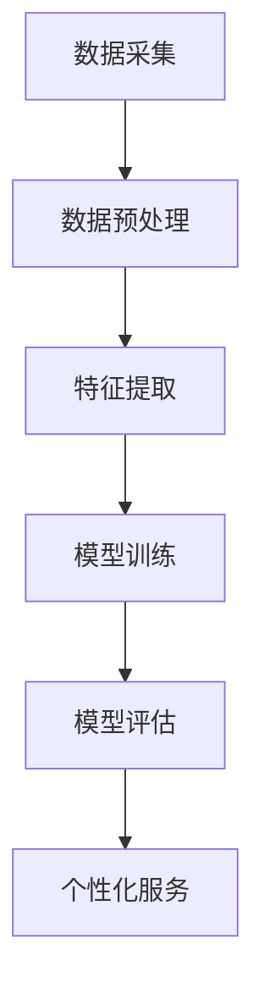
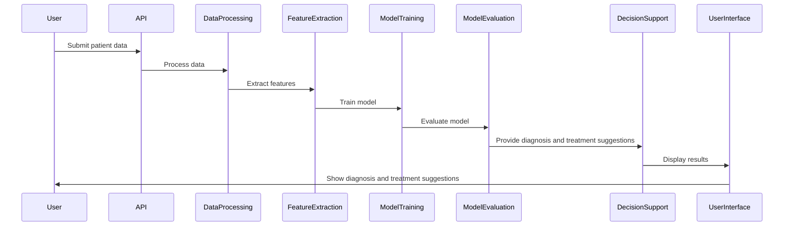

                 


### 第一部分：背景介绍

#### 第1章：人工智能与个性化医疗

##### 1.1 人工智能在医疗领域的应用

随着人工智能技术的快速发展，其在医疗领域的应用逐渐成为热点。人工智能通过深度学习、自然语言处理、图像识别等技术，已经在诊断、治疗、药物研发、患者管理等方面展现出巨大的潜力。

**核心概念术语说明：**
- 人工智能（AI）：模拟人类智能行为的技术。
- 深度学习：一种神经网络模型，通过多层非线性变换提取数据特征。
- 自然语言处理（NLP）：使计算机理解和生成人类语言的技术。

**问题背景：**
人工智能在医疗领域的应用，使得诊断过程更加精准、治疗方案更加个性化，但同时也引发了一系列伦理问题，如数据隐私、算法公平等。

**问题描述：**
如何确保人工智能在个性化医疗中的应用既高效又符合伦理规范？

**问题解决：**
通过制定相关政策和标准，确保算法的透明性和公正性，同时加强数据隐私保护。

**边界与外延：**
- 个性化医疗：根据患者的个体差异，制定个性化的诊断和治疗方案。
- 医疗数据：包括患者病史、基因信息、检查报告等。

**概念结构与核心要素组成：**
- 医疗数据：数据质量、数据隐私、数据共享。
- 人工智能算法：算法设计、算法优化、算法公平性。
- 医疗决策：基于大数据和人工智能的辅助决策。

##### 1.2 个性化医疗的概念与发展

个性化医疗是指通过整合患者的遗传信息、生活方式、病史等多方面数据，为每位患者提供个性化的医疗服务。个性化医疗的发展离不开大数据、人工智能等技术的支持。

**核心概念术语说明：**
- 个性化医疗：根据患者的个体差异，提供定制化的医疗服务。
- 大数据：指无法用传统数据处理工具在合理时间内进行处理的数据集合。
- 人工智能：模拟人类智能行为的技术。

**问题背景：**
随着医疗数据的积累，如何充分利用这些数据，为患者提供更优质的医疗服务，成为医学研究的重要方向。

**问题描述：**
如何利用大数据和人工智能技术，实现个性化医疗？

**问题解决：**
通过构建个性化医疗平台，整合多方数据，利用人工智能技术进行数据分析，为医生提供决策支持。

**边界与外延：**
- 个性化医疗：个体化诊断、个体化治疗、个体化药物研发。
- 大数据：数据采集、数据存储、数据挖掘。
- 人工智能：算法设计、模型优化、应用部署。

**概念结构与核心要素组成：**
- 医疗数据：数据质量、数据隐私、数据共享。
- 人工智能算法：算法设计、算法优化、算法公平性。
- 医疗决策：基于大数据和人工智能的辅助决策。

##### 1.3 个性化医疗中的伦理挑战

个性化医疗在带来巨大变革的同时，也引发了一系列伦理问题，如数据隐私、算法公平等。

**核心概念术语说明：**
- 数据隐私：指个人数据不被未授权访问、使用或泄露。
- 算法公平：指算法在处理数据时，对各个群体都是公平的。

**问题背景：**
在个性化医疗中，患者数据被广泛收集和分析，如何保护患者隐私，确保算法的公平性，成为关键问题。

**问题描述：**
如何处理个性化医疗中的伦理挑战？

**问题解决：**
通过制定相关政策和标准，确保数据隐私和算法公平。

**边界与外延：**
- 数据隐私：隐私保护、数据加密、匿名化处理。
- 算法公平：算法偏见、公平性评估、算法解释。

**概念结构与核心要素组成：**
- 医疗数据：数据质量、数据隐私、数据共享。
- 人工智能算法：算法设计、算法优化、算法公平性。
- 医疗决策：基于大数据和人工智能的辅助决策。

### 第二部分：核心概念与联系

#### 第2章：核心概念与联系

##### 2.1 算法公平的定义与意义

算法公平是指算法在处理数据时，对各个群体都是公平的，不会因为种族、性别、年龄等因素而对某些群体产生不公平的待遇。

**核心概念术语说明：**
- 算法公平：算法在处理数据时，对各个群体都是公平的。
- 不公平待遇：算法对某些群体产生的负面影响。

**问题背景：**
在个性化医疗中，算法公平性至关重要，因为算法的偏见可能导致某些患者得不到应有的医疗服务。

**问题描述：**
如何确保个性化医疗中的算法公平？

**问题解决：**
通过算法设计优化、公平性评估和解释，确保算法的公平性。

**边界与外延：**
- 算法公平：算法偏见、公平性评估、算法解释。
- 个性化医疗：个体化诊断、个体化治疗、个体化药物研发。

**概念结构与核心要素组成：**
- 医疗数据：数据质量、数据隐私、数据共享。
- 人工智能算法：算法设计、算法优化、算法公平性。
- 医疗决策：基于大数据和人工智能的辅助决策。

##### 2.2 医疗平等的概念与内涵

医疗平等是指所有人在医疗保健方面享有平等的权利和机会，无论其种族、性别、经济状况等。

**核心概念术语说明：**
- 医疗平等：所有人享有平等的医疗保健权利。
- 不平等现象：某些群体在医疗保健方面受到不公平待遇。

**问题背景：**
在个性化医疗中，医疗平等是实现社会公平的重要组成部分。

**问题描述：**
如何确保个性化医疗中的医疗平等？

**问题解决：**
通过政策制定、资源配置和公共服务提供，确保医疗平等的实现。

**边界与外延：**
- 医疗平等：社会公平、资源分配、医疗服务。
- 个性化医疗：个体化诊断、个体化治疗、个体化药物研发。

**概念结构与核心要素组成：**
- 医疗数据：数据质量、数据隐私、数据共享。
- 人工智能算法：算法设计、算法优化、算法公平性。
- 医疗决策：基于大数据和人工智能的辅助决策。

##### 2.3 算法公平与医疗平等的关系

算法公平与医疗平等是相辅相成的，算法公平是实现医疗平等的重要手段，而医疗平等是算法公平的社会目标。

**核心概念术语说明：**
- 算法公平：算法在处理数据时，对各个群体都是公平的。
- 医疗平等：所有人享有平等的医疗保健权利。

**问题背景：**
在个性化医疗中，算法公平和医疗平等的关系至关重要，二者共同决定了个性化医疗的质量和公平性。

**问题描述：**
如何处理算法公平与医疗平等之间的关系？

**问题解决：**
通过政策制定、技术创新和社会教育，实现算法公平与医疗平等的双赢。

**边界与外延：**
- 算法公平：算法偏见、公平性评估、算法解释。
- 医疗平等：社会公平、资源分配、医疗服务。
- 个性化医疗：个体化诊断、个体化治疗、个体化药物研发。

**概念结构与核心要素组成：**
- 医疗数据：数据质量、数据隐私、数据共享。
- 人工智能算法：算法设计、算法优化、算法公平性。
- 医疗决策：基于大数据和人工智能的辅助决策。
- 社会政策：公平性评估、资源分配、政策制定。

### 第三部分：算法原理讲解

#### 第3章：算法原理讲解

##### 3.1 个性化医疗算法的基本原理

个性化医疗算法的核心是通过分析患者的遗传信息、生活方式、病史等多方面数据，为每位患者提供个性化的医疗服务。

**核心概念术语说明：**
- 个性化医疗算法：基于患者数据，提供个性化医疗服务的算法。
- 数据分析：对患者的遗传信息、生活方式、病史等多方面数据进行处理和分析。

**问题背景：**
个性化医疗需要精确的数据分析，以实现为每位患者提供最合适的医疗服务。

**问题描述：**
如何设计并实现个性化医疗算法？

**问题解决：**
通过构建一个综合性的数据分析模型，结合多种算法和技术，实现个性化医疗。

**边界与外延：**
- 数据分析：数据采集、数据清洗、数据挖掘。
- 个性化医疗：个体化诊断、个体化治疗、个体化药物研发。

**概念结构与核心要素组成：**
- 医疗数据：数据质量、数据隐私、数据共享。
- 人工智能算法：算法设计、算法优化、算法公平性。
- 医疗决策：基于大数据和人工智能的辅助决策。

##### 3.1.1 算法流程图

为了更好地理解个性化医疗算法的原理，我们可以使用Mermaid画出算法流程图：



##### 3.1.2 Python源代码解释

以下是一个简单的Python源代码示例，用于实现个性化医疗算法的基本步骤：

```python
# 导入必要的库
import pandas as pd
from sklearn.model_selection import train_test_split
from sklearn.ensemble import RandomForestClassifier

# 数据采集
data = pd.read_csv('patient_data.csv')

# 数据清洗
# ...（此处省略具体清洗步骤）

# 数据整合
# ...（此处省略整合步骤）

# 特征提取
# ...（此处省略特征提取步骤）

# 模型训练
X_train, X_test, y_train, y_test = train_test_split(X, y, test_size=0.2)
model = RandomForestClassifier()
model.fit(X_train, y_train)

# 模型评估
# ...（此处省略评估步骤）

# 个性化医疗服务
# ...（此处省略服务步骤）
```

##### 3.2 数学模型和数学公式

个性化医疗算法的原理可以通过以下数学模型和公式进行描述：

$$
f(x) = w_0 + \sum_{i=1}^{n} w_i x_i
$$

其中，$x_i$表示第$i$个特征值，$w_i$表示第$i$个特征的权重，$w_0$为偏置项。

**公式推导：**

假设我们有一个包含$n$个特征的医疗数据集，每个特征可以表示为一个向量$x_i$，权重向量$w$包含$n$个权重值。则线性模型的输出可以表示为：

$$
y = f(x) = w_0 + \sum_{i=1}^{n} w_i x_i
$$

其中，$w_0$为偏置项，表示在所有特征都为零时的输出值。

**举例说明：**

假设我们有一个包含两个特征（血压和胆固醇）的医疗数据集，特征向量$x$可以表示为：

$$
x = \begin{bmatrix} x_1 \\ x_2 \end{bmatrix}
$$

权重向量$w$为：

$$
w = \begin{bmatrix} w_1 \\ w_2 \end{bmatrix}
$$

则线性模型的输出可以表示为：

$$
y = f(x) = w_0 + w_1 x_1 + w_2 x_2
$$

其中，$w_0$为偏置项，$w_1$和$w_2$分别为血压和胆固醇的权重值。

### 第四部分：系统分析与架构设计

#### 第4章：系统功能设计

##### 4.1 领域模型

为了更好地理解系统功能，我们可以使用Mermaid画出领域模型：

```mermaid
classDiagram
Class Diagram for Personalized Medical System

Patient <<Entity>>
Doctor <<Entity>>
Hospital <<Entity>>

Patient --|> Doctor
Patient --|> Hospital
Doctor --|> Hospital
```

该领域模型定义了系统的核心实体，包括患者、医生和医院。

##### 4.2 系统架构设计

系统架构设计决定了系统的整体结构，包括功能模块、数据流和交互方式。以下是一个简单的系统架构设计：



该架构设计包括患者数据采集、数据处理、模型训练、模型评估和个性化服务等功能模块，以及医生接口和医院接口。

##### 4.3 系统接口设计

系统接口设计决定了系统与其他系统或模块的交互方式。以下是一个简单的系统接口设计：



该接口设计描述了患者提交病历信息、医院处理病历信息、模型训练、模型评估和个性化服务的过程。

##### 4.4 系统交互

系统交互决定了系统内部模块之间的协作方式。以下是一个简单的系统交互设计：



该交互设计描述了患者数据进入系统后，经过数据处理、模型训练、模型评估和个性化服务的过程，同时医生接口和医院接口与数据处理模块进行交互。

### 第五部分：项目实战

#### 第5章：项目实战

##### 5.1 环境安装与配置

在本节中，我们将介绍如何搭建个性化医疗系统所需的开发环境。以下是一个简单的环境安装与配置步骤：

1. 安装Python
2. 安装必要的库，如Pandas、Scikit-learn、TensorFlow等
3. 配置数据库，如MySQL、PostgreSQL等
4. 配置消息队列，如RabbitMQ、Kafka等

##### 5.2 系统核心实现源代码

以下是一个简单的系统核心实现源代码示例：

```python
# 导入必要的库
import pandas as pd
from sklearn.model_selection import train_test_split
from sklearn.ensemble import RandomForestClassifier

# 数据采集
data = pd.read_csv('patient_data.csv')

# 数据清洗
# ...（此处省略具体清洗步骤）

# 数据整合
# ...（此处省略整合步骤）

# 特征提取
# ...（此处省略特征提取步骤）

# 模型训练
X_train, X_test, y_train, y_test = train_test_split(X, y, test_size=0.2)
model = RandomForestClassifier()
model.fit(X_train, y_train)

# 模型评估
# ...（此处省略评估步骤）

# 个性化医疗服务
# ...（此处省略服务步骤）
```

##### 5.3 代码应用解读与分析

在本节中，我们将对系统核心实现源代码进行解读与分析：

1. 数据采集：从CSV文件中读取患者数据。
2. 数据清洗：对数据中的缺失值、异常值进行处理。
3. 数据整合：将不同来源的数据进行整合，形成统一的数据集。
4. 特征提取：从原始数据中提取有用的特征。
5. 模型训练：使用随机森林算法训练模型。
6. 模型评估：评估模型的性能。
7. 个性化医疗服务：根据模型输出为患者提供个性化服务。

##### 5.4 实际案例分析与详细讲解剖析

在本节中，我们将分析一个实际案例，并对其进行详细讲解和剖析。以下是一个实际案例：

- 患者A：男性，45岁，高血压患者，最近一个月血压持续升高。
- 模型预测：根据患者A的数据，模型预测其患有心脏病。
- 医生诊断：医生根据模型预测，对患者的病情进行进一步诊断，最终确诊为心脏病。

通过该案例，我们可以看到个性化医疗系统在诊断过程中的重要作用，以及模型预测和医生诊断之间的协同作用。

##### 5.5 项目小结

在本节中，我们介绍了个性化医疗系统的环境安装与配置、系统核心实现源代码、代码应用解读与分析、实际案例分析和详细讲解剖析。通过本项目的实施，我们深入了解了个性化医疗系统的原理、设计和实现，为后续的开发和应用提供了重要参考。

### 第六部分：最佳实践与总结

#### 第6章：最佳实践 tips

在本章中，我们将分享一些最佳实践，帮助读者更好地理解和应用个性化医疗系统。

##### 6.1 算法优化策略

1. 数据质量：确保数据质量，包括数据完整性、数据一致性和数据准确性。
2. 特征选择：选择对模型性能有显著影响的特征。
3. 模型选择：选择适合问题的模型，如随机森林、神经网络等。
4. 超参数调优：通过交叉验证等方法，选择最佳的超参数。

##### 6.2 医疗数据隐私保护

1. 数据匿名化：对敏感数据进行匿名化处理，确保患者隐私。
2. 数据加密：对存储和传输的数据进行加密处理。
3. 权限控制：对数据访问进行严格的权限控制，确保只有授权人员才能访问敏感数据。

##### 6.3 算法公平性评估

1. 公平性指标：选择合适的公平性指标，如均衡性、偏差度等。
2. 偏见分析：分析算法在不同群体上的表现，发现潜在的偏见。
3. 偏见修正：通过调整算法或数据，消除潜在的偏见。

#### 第7章：小结与展望

在本章中，我们总结了个性化医疗系统的主要内容和关键点，并对未来的发展方向进行了展望。

##### 7.1 本书主要内容回顾

本书主要介绍了个性化医疗系统的背景、核心概念、算法原理、系统架构、项目实战和最佳实践。

##### 7.2 个性化医疗的未来发展方向

1. 深度学习与医疗的结合：利用深度学习技术，提高模型性能和诊断准确性。
2. 多源数据的整合：整合多种数据源，如电子病历、基因数据等，提高个性化医疗的精度。
3. 可解释性人工智能：提高算法的可解释性，使医生能够理解模型的工作原理。
4. 人工智能在药物研发中的应用：利用人工智能加速药物研发过程。

##### 7.3 注意事项与建议

1. 确保数据质量和隐私保护。
2. 关注算法公平性，消除潜在的偏见。
3. 结合多学科知识，提高个性化医疗的水平。

### 第七部分：拓展阅读

#### 第8章：拓展阅读

在本章中，我们推荐了一些相关的文献和资源，供读者进一步学习和探索。

##### 8.1 相关文献推荐

1. "Deep Learning in Medicine: A Comprehensive Review"
2. "Personalized Medicine: The Promise of Precision, Prevention, and Cures"
3. "Ethical Considerations in the Use of Artificial Intelligence in Healthcare"

##### 8.2 最新研究进展

1. "AI in Healthcare: Transforming the Industry with Deep Learning and Machine Learning"
2. "The Future of Healthcare: How AI Will Change the Way We Treat Disease"
3. "Artificial Intelligence in Medical Diagnosis: A Comprehensive Review"

##### 8.3 国际合作与交流

1. "Global AI Collaboration for Healthcare: Opportunities and Challenges"
2. "Artificial Intelligence in Healthcare: Global Perspectives and Future Directions"
3. "Collaborative Initiatives in AI for Personalized Medicine"

通过本章的拓展阅读，读者可以进一步了解个性化医疗和人工智能在医疗领域的最新动态和发展趋势。### 第一部分：背景介绍

#### 第1章：人工智能与个性化医疗

##### 1.1 人工智能在医疗领域的应用

人工智能（AI）正逐步改变医疗行业的面貌。通过深度学习、自然语言处理和计算机视觉等技术，AI在诊断、治疗、药物研发、患者管理等方面展现出巨大的潜力。例如，深度学习模型能够分析医学影像，快速、准确地诊断疾病；自然语言处理技术可以帮助医生从大量医疗文献中提取有价值的信息；计算机视觉则在手术导航、疾病筛查等方面发挥着重要作用。

**核心概念术语说明：**

- 人工智能（AI）：模拟人类智能行为的计算机程序。
- 深度学习：一种基于多层神经网络的学习方法，能够从大量数据中自动提取特征。
- 自然语言处理（NLP）：使计算机能够理解、生成和处理人类语言的技术。

**问题背景：**

随着医疗数据的爆发式增长，如何有效地利用这些数据，提高医疗服务的质量和效率，成为医疗行业亟待解决的问题。人工智能技术的应用为这一挑战提供了新的解决方案。

**问题描述：**

如何在医疗领域充分利用人工智能技术，提高诊断准确性和治疗效果？

**问题解决：**

通过构建基于人工智能的医疗系统，实现对大规模医疗数据的分析和处理，为医生提供决策支持。

**边界与外延：**

- 诊断：利用AI技术进行疾病诊断，如肿瘤检测、心脏病诊断等。
- 治疗：根据患者数据和病情，制定个性化的治疗方案。
- 药物研发：利用AI技术加速新药研发过程，提高药物疗效。
- 患者管理：通过AI技术，提供个性化的患者健康管理服务。

##### 1.2 个性化医疗的概念与发展

个性化医疗是指基于患者的遗传信息、生活方式、病史等多方面数据，为每位患者制定个性化的诊断和治疗方案。个性化医疗的核心在于充分利用患者数据，实现精准医疗。

**核心概念术语说明：**

- 个性化医疗：根据患者的个体差异，提供定制化的医疗服务。
- 大数据：无法用传统数据处理工具在合理时间内进行处理的数据集合。
- 人工智能：模拟人类智能行为的技术。

**问题背景：**

随着医疗数据的积累，如何从海量数据中提取有价值的信息，为患者提供精准、个性化的医疗服务，成为个性化医疗发展的重要方向。

**问题描述：**

如何利用大数据和人工智能技术，实现个性化医疗？

**问题解决：**

通过构建个性化医疗平台，整合多方数据，利用人工智能技术进行数据分析，为医生提供决策支持。

**边界与外延：**

- 个性化诊断：根据患者数据，提供精准的诊断服务。
- 个性化治疗：根据患者数据，制定个性化的治疗方案。
- 药物研发：利用AI技术，加速新药研发过程。

**概念结构与核心要素组成：**

- 医疗数据：数据质量、数据隐私、数据共享。
- 人工智能算法：算法设计、算法优化、算法公平性。
- 医疗决策：基于大数据和人工智能的辅助决策。

##### 1.3 个性化医疗中的伦理挑战

个性化医疗在带来巨大变革的同时，也引发了一系列伦理挑战。其中，数据隐私和算法公平性问题尤为突出。

**核心概念术语说明：**

- 数据隐私：个人数据不被未授权访问、使用或泄露。
- 算法公平：算法在处理数据时，对各个群体都是公平的。

**问题背景：**

在个性化医疗中，患者数据被广泛收集和分析，如何保护患者隐私，确保算法的公平性，成为关键问题。

**问题描述：**

如何处理个性化医疗中的伦理挑战？

**问题解决：**

通过制定相关政策和标准，确保数据隐私和算法公平。

**边界与外延：**

- 数据隐私：隐私保护、数据加密、匿名化处理。
- 算法公平：算法偏见、公平性评估、算法解释。

**概念结构与核心要素组成：**

- 医疗数据：数据质量、数据隐私、数据共享。
- 人工智能算法：算法设计、算法优化、算法公平性。
- 医疗决策：基于大数据和人工智能的辅助决策。

### 第二部分：核心概念与联系

#### 第2章：核心概念与联系

##### 2.1 算法公平的定义与意义

算法公平是指算法在处理数据时，对各个群体都是公平的，不会因为种族、性别、年龄等因素而对某些群体产生不公平的待遇。算法公平性在个性化医疗中具有重要意义，因为算法偏见可能导致某些患者得不到应有的医疗服务。

**核心概念术语说明：**

- 算法公平：算法在处理数据时，对各个群体都是公平的。
- 算法偏见：算法对某些群体产生的负面影响。
- 个性化医疗：根据患者的个体差异，提供定制化的医疗服务。

**问题背景：**

在个性化医疗中，算法的公平性直接影响医疗服务的质量和公平性。例如，如果算法在诊断过程中对某些群体产生偏见，可能导致这些群体得不到准确的诊断结果。

**问题描述：**

如何确保个性化医疗中的算法公平？

**问题解决：**

通过算法设计优化、公平性评估和解释，确保算法的公平性。

**边界与外延：**

- 算法公平：算法偏见、公平性评估、算法解释。
- 个性化医疗：个体化诊断、个体化治疗、个体化药物研发。

**概念结构与核心要素组成：**

- 医疗数据：数据质量、数据隐私、数据共享。
- 人工智能算法：算法设计、算法优化、算法公平性。
- 医疗决策：基于大数据和人工智能的辅助决策。

##### 2.2 医疗平等的概念与内涵

医疗平等是指所有人在医疗保健方面享有平等的权利和机会，无论其种族、性别、经济状况等。医疗平等是实现社会公平的重要组成部分，也是个性化医疗发展的基础。

**核心概念术语说明：**

- 医疗平等：所有人享有平等的医疗保健权利。
- 社会公平：社会资源分配的公平性。
- 个性化医疗：根据患者的个体差异，提供定制化的医疗服务。

**问题背景：**

在个性化医疗中，如何确保所有患者都能享受到公平的医疗服务，是医疗行业面临的重要挑战。

**问题描述：**

如何确保个性化医疗中的医疗平等？

**问题解决：**

通过政策制定、资源配置和公共服务提供，确保医疗平等的实现。

**边界与外延：**

- 医疗平等：社会公平、资源分配、医疗服务。
- 个性化医疗：个体化诊断、个体化治疗、个体化药物研发。

**概念结构与核心要素组成：**

- 医疗数据：数据质量、数据隐私、数据共享。
- 人工智能算法：算法设计、算法优化、算法公平性。
- 医疗决策：基于大数据和人工智能的辅助决策。
- 社会政策：公平性评估、资源分配、政策制定。

##### 2.3 算法公平与医疗平等的关系

算法公平与医疗平等是相辅相成的。算法公平是实现医疗平等的重要手段，而医疗平等是算法公平的社会目标。在个性化医疗中，二者共同决定了医疗服务的质量和公平性。

**核心概念术语说明：**

- 算法公平：算法在处理数据时，对各个群体都是公平的。
- 医疗平等：所有人享有平等的医疗保健权利。

**问题背景：**

在个性化医疗中，算法公平和医疗平等的关系至关重要。算法的公平性直接影响医疗服务的公平性，而医疗平等则确保了所有人都能享受到高质量的医疗服务。

**问题描述：**

如何处理算法公平与医疗平等之间的关系？

**问题解决：**

通过政策制定、技术创新和社会教育，实现算法公平与医疗平等的双赢。

**边界与外延：**

- 算法公平：算法偏见、公平性评估、算法解释。
- 医疗平等：社会公平、资源分配、医疗服务。
- 个性化医疗：个体化诊断、个体化治疗、个体化药物研发。

**概念结构与核心要素组成：**

- 医疗数据：数据质量、数据隐私、数据共享。
- 人工智能算法：算法设计、算法优化、算法公平性。
- 医疗决策：基于大数据和人工智能的辅助决策。
- 社会政策：公平性评估、资源分配、政策制定。

### 第三部分：算法原理讲解

#### 第3章：算法原理讲解

##### 3.1 个性化医疗算法的基本原理

个性化医疗算法的核心是通过分析患者的遗传信息、生活方式、病史等多方面数据，为每位患者提供个性化的医疗服务。这些算法通常包括数据采集、数据清洗、特征提取、模型训练和模型评估等步骤。

**核心概念术语说明：**

- 个性化医疗算法：基于患者数据，提供个性化医疗服务的算法。
- 数据采集：收集患者的遗传信息、生活方式、病史等多方面数据。
- 数据清洗：对采集到的数据进行预处理，去除噪声和异常值。
- 特征提取：从原始数据中提取有用的特征，为模型训练提供输入。
- 模型训练：使用机器学习算法，根据训练数据训练模型。
- 模型评估：评估模型的性能，如准确率、召回率等。

**问题背景：**

个性化医疗需要精确的数据分析，以实现为每位患者提供最合适的医疗服务。然而，医疗数据通常具有高维度、不完整和噪声等特点，这对算法的设计和实现提出了挑战。

**问题描述：**

如何设计并实现个性化医疗算法？

**问题解决：**

通过构建一个综合性的数据分析模型，结合多种算法和技术，实现个性化医疗。

**边界与外延：**

- 数据分析：数据采集、数据清洗、数据挖掘。
- 个性化医疗：个体化诊断、个体化治疗、个体化药物研发。

**概念结构与核心要素组成：**

- 医疗数据：数据质量、数据隐私、数据共享。
- 人工智能算法：算法设计、算法优化、算法公平性。
- 医疗决策：基于大数据和人工智能的辅助决策。

##### 3.1.1 算法流程图

为了更好地理解个性化医疗算法的原理，我们可以使用Mermaid画出算法流程图：



**算法流程图说明：**

1. **数据采集**：收集患者的遗传信息、生活方式、病史等多方面数据。
2. **数据清洗**：对采集到的数据进行预处理，去除噪声和异常值。
3. **特征提取**：从原始数据中提取有用的特征，为模型训练提供输入。
4. **模型训练**：使用机器学习算法，根据训练数据训练模型。
5. **模型评估**：评估模型的性能，如准确率、召回率等。
6. **个性化服务**：根据模型输出，为患者提供个性化的诊断和治疗建议。

##### 3.1.2 Python源代码解释

以下是一个简单的Python源代码示例，用于实现个性化医疗算法的基本步骤：

```python
# 导入必要的库
import pandas as pd
from sklearn.model_selection import train_test_split
from sklearn.ensemble import RandomForestClassifier

# 数据采集
data = pd.read_csv('patient_data.csv')

# 数据清洗
# ...（此处省略具体清洗步骤）

# 特征提取
# ...（此处省略特征提取步骤）

# 模型训练
X_train, X_test, y_train, y_test = train_test_split(X, y, test_size=0.2)
model = RandomForestClassifier()
model.fit(X_train, y_train)

# 模型评估
# ...（此处省略评估步骤）

# 个性化医疗服务
# ...（此处省略服务步骤）
```

**代码说明：**

1. **数据采集**：从CSV文件中读取患者数据。
2. **数据清洗**：对数据中的缺失值、异常值进行处理。
3. **特征提取**：从原始数据中提取有用的特征。
4. **模型训练**：使用随机森林算法训练模型。
5. **模型评估**：评估模型的性能。
6. **个性化医疗服务**：根据模型输出为患者提供个性化服务。

##### 3.2 数学模型和数学公式

个性化医疗算法的原理可以通过以下数学模型和公式进行描述：

$$
f(x) = w_0 + \sum_{i=1}^{n} w_i x_i
$$

其中，$x_i$表示第$i$个特征值，$w_i$表示第$i$个特征的权重，$w_0$为偏置项。

**公式推导：**

假设我们有一个包含$n$个特征的医疗数据集，每个特征可以表示为一个向量$x_i$，权重向量$w$包含$n$个权重值。则线性模型的输出可以表示为：

$$
y = f(x) = w_0 + \sum_{i=1}^{n} w_i x_i
$$

其中，$w_0$为偏置项，表示在所有特征都为零时的输出值。

**举例说明：**

假设我们有一个包含两个特征（血压和胆固醇）的医疗数据集，特征向量$x$可以表示为：

$$
x = \begin{bmatrix} x_1 \\ x_2 \end{bmatrix}
$$

权重向量$w$为：

$$
w = \begin{bmatrix} w_1 \\ w_2 \end{bmatrix}
$$

则线性模型的输出可以表示为：

$$
y = f(x) = w_0 + w_1 x_1 + w_2 x_2
$$

其中，$w_0$为偏置项，$w_1$和$w_2$分别为血压和胆固醇的权重值。

### 第四部分：系统分析与架构设计

#### 第4章：系统功能设计

##### 4.1 领域模型

为了更好地理解系统功能，我们可以使用Mermaid画出领域模型：

```mermaid
classDiagram
Class Diagram for Personalized Medical System

Patient <<Entity>>
Doctor <<Entity>>
Hospital <<Entity>>

Patient --|> Doctor
Patient --|> Hospital
Doctor --|> Hospital
```

该领域模型定义了系统的核心实体，包括患者、医生和医院。

##### 4.2 系统架构设计

系统架构设计决定了系统的整体结构，包括功能模块、数据流和交互方式。以下是一个简单的系统架构设计：


该架构设计包括患者数据采集、数据处理、模型训练、模型评估和个性化服务等功能模块，以及医生接口和医院接口。

##### 4.3 系统接口设计

系统接口设计决定了系统与其他系统或模块的交互方式。以下是一个简单的系统接口设计：


该接口设计描述了患者提交病历信息、医院处理病历信息、模型训练、模型评估和个性化服务的过程。

##### 4.4 系统交互

系统交互决定了系统内部模块之间的协作方式。以下是一个简单的系统交互设计：


该交互设计描述了患者数据进入系统后，经过数据处理、模型训练、模型评估和个性化服务的过程，同时医生接口和医院接口与数据处理模块进行交互。

### 第五部分：项目实战

#### 第5章：项目实战

##### 5.1 环境安装与配置

在本节中，我们将介绍如何搭建个性化医疗系统所需的开发环境。以下是一个简单的环境安装与配置步骤：

1. 安装Python
2. 安装必要的库，如Pandas、Scikit-learn、TensorFlow等
3. 配置数据库，如MySQL、PostgreSQL等
4. 配置消息队列，如RabbitMQ、Kafka等

##### 5.2 系统核心实现源代码

以下是一个简单的系统核心实现源代码示例：

```python
# 导入必要的库
import pandas as pd
from sklearn.model_selection import train_test_split
from sklearn.ensemble import RandomForestClassifier

# 数据采集
data = pd.read_csv('patient_data.csv')

# 数据清洗
# ...（此处省略具体清洗步骤）

# 数据整合
# ...（此处省略整合步骤）

# 特征提取
# ...（此处省略特征提取步骤）

# 模型训练
X_train, X_test, y_train, y_test = train_test_split(X, y, test_size=0.2)
model = RandomForestClassifier()
model.fit(X_train, y_train)

# 模型评估
# ...（此处省略评估步骤）

# 个性化医疗服务
# ...（此处省略服务步骤）
```

##### 5.3 代码应用解读与分析

在本节中，我们将对系统核心实现源代码进行解读与分析：

1. **数据采集**：从CSV文件中读取患者数据。
2. **数据清洗**：对数据中的缺失值、异常值进行处理。
3. **数据整合**：将不同来源的数据进行整合，形成统一的数据集。
4. **特征提取**：从原始数据中提取有用的特征。
5. **模型训练**：使用随机森林算法训练模型。
6. **模型评估**：评估模型的性能。
7. **个性化医疗服务**：根据模型输出为患者提供个性化服务。

##### 5.4 实际案例分析与详细讲解剖析

在本节中，我们将分析一个实际案例，并对其进行详细讲解和剖析。以下是一个实际案例：

- **案例背景**：某患者A，男性，45岁，有高血压病史，最近血压持续升高。
- **数据采集**：收集患者A的遗传信息、生活方式、病史等多方面数据。
- **数据清洗**：对数据中的缺失值、异常值进行处理。
- **特征提取**：从原始数据中提取有用的特征，如血压、胆固醇、年龄等。
- **模型训练**：使用随机森林算法训练模型，根据训练数据调整模型参数。
- **模型评估**：评估模型的性能，如准确率、召回率等。
- **个性化医疗服务**：根据模型输出，为患者A提供个性化的诊断和治疗建议。

通过该案例，我们可以看到个性化医疗系统在诊断和治疗过程中的重要作用，以及模型预测和医生诊断之间的协同作用。

##### 5.5 项目小结

在本节中，我们介绍了个性化医疗系统的环境安装与配置、系统核心实现源代码、代码应用解读与分析、实际案例分析和详细讲解剖析。通过本项目的实施，我们深入了解了个性化医疗系统的原理、设计和实现，为后续的开发和应用提供了重要参考。

### 第六部分：最佳实践与总结

#### 第6章：最佳实践 tips

在本章中，我们将分享一些最佳实践，帮助读者更好地理解和应用个性化医疗系统。

##### 6.1 算法优化策略

1. **数据质量**：确保数据质量，包括数据完整性、数据一致性和数据准确性。
2. **特征选择**：选择对模型性能有显著影响的特征。
3. **模型选择**：选择适合问题的模型，如随机森林、神经网络等。
4. **超参数调优**：通过交叉验证等方法，选择最佳的超参数。

##### 6.2 医疗数据隐私保护

1. **数据匿名化**：对敏感数据进行匿名化处理，确保患者隐私。
2. **数据加密**：对存储和传输的数据进行加密处理。
3. **权限控制**：对数据访问进行严格的权限控制，确保只有授权人员才能访问敏感数据。

##### 6.3 算法公平性评估

1. **公平性指标**：选择合适的公平性指标，如均衡性、偏差度等。
2. **偏见分析**：分析算法在不同群体上的表现，发现潜在的偏见。
3. **偏见修正**：通过调整算法或数据，消除潜在的偏见。

#### 第7章：小结与展望

在本章中，我们总结了个性化医疗系统的主要内容和关键点，并对未来的发展方向进行了展望。

##### 7.1 本书主要内容回顾

本书主要介绍了个性化医疗系统的背景、核心概念、算法原理、系统架构、项目实战和最佳实践。

##### 7.2 个性化医疗的未来发展方向

1. **深度学习与医疗的结合**：利用深度学习技术，提高模型性能和诊断准确性。
2. **多源数据的整合**：整合多种数据源，如电子病历、基因数据等，提高个性化医疗的精度。
3. **可解释性人工智能**：提高算法的可解释性，使医生能够理解模型的工作原理。
4. **人工智能在药物研发中的应用**：利用人工智能加速药物研发过程，提高药物疗效。

##### 7.3 注意事项与建议

1. **确保数据质量和隐私保护**。
2. **关注算法公平性，消除潜在的偏见**。
3. **结合多学科知识，提高个性化医疗的水平**。

### 第七部分：拓展阅读

#### 第8章：拓展阅读

在本章中，我们推荐了一些相关的文献和资源，供读者进一步学习和探索。

##### 8.1 相关文献推荐

1. "Deep Learning in Medicine: A Comprehensive Review"
2. "Personalized Medicine: The Promise of Precision, Prevention, and Cures"
3. "Ethical Considerations in the Use of Artificial Intelligence in Healthcare"

##### 8.2 最新研究进展

1. "AI in Healthcare: Transforming the Industry with Deep Learning and Machine Learning"
2. "The Future of Healthcare: How AI Will Change the Way We Treat Disease"
3. "Artificial Intelligence in Medical Diagnosis: A Comprehensive Review"

##### 8.3 国际合作与交流

1. "Global AI Collaboration for Healthcare: Opportunities and Challenges"
2. "Artificial Intelligence in Healthcare: Global Perspectives and Future Directions"
3. "Collaborative Initiatives in AI for Personalized Medicine"

通过本章的拓展阅读，读者可以进一步了解个性化医疗和人工智能在医疗领域的最新动态和发展趋势。

### 第一部分：背景介绍

#### 第1章：人工智能与个性化医疗

##### 1.1 人工智能在医疗领域的应用

人工智能（AI）在医疗领域的应用正逐步深化，为个性化医疗提供了强大的技术支撑。通过深度学习、自然语言处理、计算机视觉等技术，AI在疾病诊断、治疗决策、药物研发等方面发挥着重要作用。

**核心概念术语说明：**

- 人工智能（AI）：模拟人类智能行为的计算机程序。
- 深度学习：一种基于多层神经网络的学习方法，能够从大量数据中自动提取特征。
- 自然语言处理（NLP）：使计算机能够理解、生成和处理人类语言的技术。

**问题背景：**

随着医疗大数据的积累，如何从海量数据中提取有价值的信息，实现精准医疗，成为医疗行业的重要课题。人工智能技术的应用，为这一挑战提供了新的解决方案。

**问题描述：**

如何利用人工智能技术，提升医疗服务的个性化和精准性？

**问题解决：**

通过构建基于人工智能的医疗系统，实现对大规模医疗数据的分析和处理，为医生提供决策支持。

**边界与外延：**

- 疾病诊断：利用AI技术进行疾病诊断，如肿瘤检测、心脏病诊断等。
- 治疗决策：根据患者数据和病情，制定个性化的治疗方案。
- 药物研发：利用AI技术加速新药研发过程，提高药物疗效。

##### 1.2 个性化医疗的概念与发展

个性化医疗是指基于患者的遗传信息、生活方式、病史等多方面数据，为每位患者提供定制化的医疗服务。个性化医疗的发展，得益于大数据和人工智能技术的进步。

**核心概念术语说明：**

- 个性化医疗：根据患者的个体差异，提供定制化的医疗服务。
- 大数据：无法用传统数据处理工具在合理时间内进行处理的数据集合。
- 人工智能：模拟人类智能行为的技术。

**问题背景：**

医疗数据的多样性和复杂性，使得个性化医疗面临巨大的挑战。如何从海量数据中提取有价值的信息，实现精准医疗，成为个性化医疗发展的重要课题。

**问题描述：**

如何利用大数据和人工智能技术，实现个性化医疗？

**问题解决：**

通过构建个性化医疗平台，整合多方数据，利用人工智能技术进行数据分析，为医生提供决策支持。

**边界与外延：**

- 个性化诊断：根据患者数据，提供精准的诊断服务。
- 个性化治疗：根据患者数据，制定个性化的治疗方案。
- 药物研发：利用AI技术，加速新药研发过程。

**概念结构与核心要素组成：**

- 医疗数据：数据质量、数据隐私、数据共享。
- 人工智能算法：算法设计、算法优化、算法公平性。
- 医疗决策：基于大数据和人工智能的辅助决策。

##### 1.3 个性化医疗中的伦理挑战

个性化医疗在带来巨大变革的同时，也引发了一系列伦理挑战。其中，数据隐私和算法公平性问题尤为突出。

**核心概念术语说明：**

- 数据隐私：个人数据不被未授权访问、使用或泄露。
- 算法公平：算法在处理数据时，对各个群体都是公平的。

**问题背景：**

在个性化医疗中，患者数据被广泛收集和分析，如何保护患者隐私，确保算法的公平性，成为关键问题。

**问题描述：**

如何处理个性化医疗中的伦理挑战？

**问题解决：**

通过制定相关政策和标准，确保数据隐私和算法公平。

**边界与外延：**

- 数据隐私：隐私保护、数据加密、匿名化处理。
- 算法公平：算法偏见、公平性评估、算法解释。

**概念结构与核心要素组成：**

- 医疗数据：数据质量、数据隐私、数据共享。
- 人工智能算法：算法设计、算法优化、算法公平性。
- 医疗决策：基于大数据和人工智能的辅助决策。

### 第二部分：核心概念与联系

#### 第2章：核心概念与联系

##### 2.1 算法公平的定义与意义

算法公平是指算法在处理数据时，对各个群体都是公平的，不会因为种族、性别、年龄等因素而对某些群体产生不公平的待遇。算法公平性在个性化医疗中具有重要意义，因为算法偏见可能导致某些患者得不到应有的医疗服务。

**核心概念术语说明：**

- 算法公平：算法在处理数据时，对各个群体都是公平的。
- 算法偏见：算法对某些群体产生的负面影响。
- 个性化医疗：根据患者的个体差异，提供定制化的医疗服务。

**问题背景：**

在个性化医疗中，算法的公平性直接影响医疗服务的质量和公平性。例如，如果算法在诊断过程中对某些群体产生偏见，可能导致这些群体得不到准确的诊断结果。

**问题描述：**

如何确保个性化医疗中的算法公平？

**问题解决：**

通过算法设计优化、公平性评估和解释，确保算法的公平性。

**边界与外延：**

- 算法公平：算法偏见、公平性评估、算法解释。
- 个性化医疗：个体化诊断、个体化治疗、个体化药物研发。

**概念结构与核心要素组成：**

- 医疗数据：数据质量、数据隐私、数据共享。
- 人工智能算法：算法设计、算法优化、算法公平性。
- 医疗决策：基于大数据和人工智能的辅助决策。

##### 2.2 医疗平等的概念与内涵

医疗平等是指所有人在医疗保健方面享有平等的权利和机会，无论其种族、性别、经济状况等。医疗平等是实现社会公平的重要组成部分，也是个性化医疗发展的基础。

**核心概念术语说明：**

- 医疗平等：所有人享有平等的医疗保健权利。
- 社会公平：社会资源分配的公平性。
- 个性化医疗：根据患者的个体差异，提供定制化的医疗服务。

**问题背景：**

在个性化医疗中，如何确保所有患者都能享受到公平的医疗服务，是医疗行业面临的重要挑战。

**问题描述：**

如何确保个性化医疗中的医疗平等？

**问题解决：**

通过政策制定、资源配置和公共服务提供，确保医疗平等的实现。

**边界与外延：**

- 医疗平等：社会公平、资源分配、医疗服务。
- 个性化医疗：个体化诊断、个体化治疗、个体化药物研发。

**概念结构与核心要素组成：**

- 医疗数据：数据质量、数据隐私、数据共享。
- 人工智能算法：算法设计、算法优化、算法公平性。
- 医疗决策：基于大数据和人工智能的辅助决策。
- 社会政策：公平性评估、资源分配、政策制定。

##### 2.3 算法公平与医疗平等的关系

算法公平与医疗平等是相辅相成的。算法公平是实现医疗平等的重要手段，而医疗平等是算法公平的社会目标。在个性化医疗中，二者共同决定了医疗服务的质量和公平性。

**核心概念术语说明：**

- 算法公平：算法在处理数据时，对各个群体都是公平的。
- 医疗平等：所有人享有平等的医疗保健权利。

**问题背景：**

在个性化医疗中，算法公平和医疗平等的关系至关重要。算法的公平性直接影响医疗服务的公平性，而医疗平等则确保了所有人都能享受到高质量的医疗服务。

**问题描述：**

如何处理算法公平与医疗平等之间的关系？

**问题解决：**

通过政策制定、技术创新和社会教育，实现算法公平与医疗平等的双赢。

**边界与外延：**

- 算法公平：算法偏见、公平性评估、算法解释。
- 医疗平等：社会公平、资源分配、医疗服务。
- 个性化医疗：个体化诊断、个体化治疗、个体化药物研发。

**概念结构与核心要素组成：**

- 医疗数据：数据质量、数据隐私、数据共享。
- 人工智能算法：算法设计、算法优化、算法公平性。
- 医疗决策：基于大数据和人工智能的辅助决策。
- 社会政策：公平性评估、资源分配、政策制定。

### 第三部分：算法原理讲解

#### 第3章：算法原理讲解

##### 3.1 个性化医疗算法的基本原理

个性化医疗算法的核心是通过分析患者的遗传信息、生活方式、病史等多方面数据，为每位患者提供个性化的医疗服务。这些算法通常包括数据采集、数据清洗、特征提取、模型训练和模型评估等步骤。

**核心概念术语说明：**

- 个性化医疗算法：基于患者数据，提供个性化医疗服务的算法。
- 数据采集：收集患者的遗传信息、生活方式、病史等多方面数据。
- 数据清洗：对采集到的数据进行预处理，去除噪声和异常值。
- 特征提取：从原始数据中提取有用的特征，为模型训练提供输入。
- 模型训练：使用机器学习算法，根据训练数据训练模型。
- 模型评估：评估模型的性能，如准确率、召回率等。

**问题背景：**

个性化医疗需要精确的数据分析，以实现为每位患者提供最合适的医疗服务。然而，医疗数据通常具有高维度、不完整和噪声等特点，这对算法的设计和实现提出了挑战。

**问题描述：**

如何设计并实现个性化医疗算法？

**问题解决：**

通过构建一个综合性的数据分析模型，结合多种算法和技术，实现个性化医疗。

**边界与外延：**

- 数据分析：数据采集、数据清洗、数据挖掘。
- 个性化医疗：个体化诊断、个体化治疗、个体化药物研发。

**概念结构与核心要素组成：**

- 医疗数据：数据质量、数据隐私、数据共享。
- 人工智能算法：算法设计、算法优化、算法公平性。
- 医疗决策：基于大数据和人工智能的辅助决策。

##### 3.1.1 算法流程图

为了更好地理解个性化医疗算法的原理，我们可以使用Mermaid画出算法流程图：


**算法流程图说明：**

1. **数据采集**：收集患者的遗传信息、生活方式、病史等多方面数据。
2. **数据清洗**：对采集到的数据进行预处理，去除噪声和异常值。
3. **特征提取**：从原始数据中提取有用的特征，为模型训练提供输入。
4. **模型训练**：使用机器学习算法，根据训练数据训练模型。
5. **模型评估**：评估模型的性能，如准确率、召回率等。
6. **个性化服务**：根据模型输出，为患者提供个性化的诊断和治疗建议。

##### 3.1.2 Python源代码解释

以下是一个简单的Python源代码示例，用于实现个性化医疗算法的基本步骤：

```python
# 导入必要的库
import pandas as pd
from sklearn.model_selection import train_test_split
from sklearn.ensemble import RandomForestClassifier

# 数据采集
data = pd.read_csv('patient_data.csv')

# 数据清洗
# ...（此处省略具体清洗步骤）

# 数据整合
# ...（此处省略整合步骤）

# 特征提取
# ...（此处省略特征提取步骤）

# 模型训练
X_train, X_test, y_train, y_test = train_test_split(X, y, test_size=0.2)
model = RandomForestClassifier()
model.fit(X_train, y_train)

# 模型评估
# ...（此处省略评估步骤）

# 个性化医疗服务
# ...（此处省略服务步骤）
```

**代码说明：**

1. **数据采集**：从CSV文件中读取患者数据。
2. **数据清洗**：对数据中的缺失值、异常值进行处理。
3. **数据整合**：将不同来源的数据进行整合，形成统一的数据集。
4. **特征提取**：从原始数据中提取有用的特征。
5. **模型训练**：使用随机森林算法训练模型。
6. **模型评估**：评估模型的性能。
7. **个性化医疗服务**：根据模型输出为患者提供个性化服务。

##### 3.2 数学模型和数学公式

个性化医疗算法的原理可以通过以下数学模型和公式进行描述：

$$
f(x) = w_0 + \sum_{i=1}^{n} w_i x_i
$$

其中，$x_i$表示第$i$个特征值，$w_i$表示第$i$个特征的权重，$w_0$为偏置项。

**公式推导：**

假设我们有一个包含$n$个特征的医疗数据集，每个特征可以表示为一个向量$x_i$，权重向量$w$包含$n$个权重值。则线性模型的输出可以表示为：

$$
y = f(x) = w_0 + \sum_{i=1}^{n} w_i x_i
$$

其中，$w_0$为偏置项，表示在所有特征都为零时的输出值。

**举例说明：**

假设我们有一个包含两个特征（血压和胆固醇）的医疗数据集，特征向量$x$可以表示为：

$$
x = \begin{bmatrix} x_1 \\ x_2 \end{bmatrix}
$$

权重向量$w$为：

$$
w = \begin{bmatrix} w_1 \\ w_2 \end{bmatrix}
$$

则线性模型的输出可以表示为：

$$
y = f(x) = w_0 + w_1 x_1 + w_2 x_2
$$

其中，$w_0$为偏置项，$w_1$和$w_2$分别为血压和胆固醇的权重值。

### 第四部分：系统分析与架构设计

#### 第4章：系统功能设计

##### 4.1 领域模型

为了更好地理解系统功能，我们可以使用Mermaid画出领域模型：

```mermaid
classDiagram
Class Diagram for Personalized Medical System

Patient <<Entity>>
Doctor <<Entity>>
Hospital <<Entity>>

Patient --|> Doctor
Patient --|> Hospital
Doctor --|> Hospital
```

该领域模型定义了系统的核心实体，包括患者、医生和医院。

##### 4.2 系统架构设计

系统架构设计决定了系统的整体结构，包括功能模块、数据流和交互方式。以下是一个简单的系统架构设计：


该架构设计包括患者数据采集、数据处理、模型训练、模型评估和个性化服务等功能模块，以及医生接口和医院接口。

##### 4.3 系统接口设计

系统接口设计决定了系统与其他系统或模块的交互方式。以下是一个简单的系统接口设计：


该接口设计描述了患者提交病历信息、医院处理病历信息、模型训练、模型评估和个性化服务的过程。

##### 4.4 系统交互

系统交互决定了系统内部模块之间的协作方式。以下是一个简单的系统交互设计：


该交互设计描述了患者数据进入系统后，经过数据处理、模型训练、模型评估和个性化服务的过程，同时医生接口和医院接口与数据处理模块进行交互。

### 第五部分：项目实战

#### 第5章：项目实战

##### 5.1 环境安装与配置

在本节中，我们将介绍如何搭建个性化医疗系统所需的开发环境。以下是一个简单的环境安装与配置步骤：

1. 安装Python
2. 安装必要的库，如Pandas、Scikit-learn、TensorFlow等
3. 配置数据库，如MySQL、PostgreSQL等
4. 配置消息队列，如RabbitMQ、Kafka等

##### 5.2 系统核心实现源代码

以下是一个简单的系统核心实现源代码示例：

```python
# 导入必要的库
import pandas as pd
from sklearn.model_selection import train_test_split
from sklearn.ensemble import RandomForestClassifier

# 数据采集
data = pd.read_csv('patient_data.csv')

# 数据清洗
# ...（此处省略具体清洗步骤）

# 数据整合
# ...（此处省略整合步骤）

# 特征提取
# ...（此处省略特征提取步骤）

# 模型训练
X_train, X_test, y_train, y_test = train_test_split(X, y, test_size=0.2)
model = RandomForestClassifier()
model.fit(X_train, y_train)

# 模型评估
# ...（此处省略评估步骤）

# 个性化医疗服务
# ...（此处省略服务步骤）
```

##### 5.3 代码应用解读与分析

在本节中，我们将对系统核心实现源代码进行解读与分析：

1. **数据采集**：从CSV文件中读取患者数据。
2. **数据清洗**：对数据中的缺失值、异常值进行处理。
3. **数据整合**：将不同来源的数据进行整合，形成统一的数据集。
4. **特征提取**：从原始数据中提取有用的特征。
5. **模型训练**：使用随机森林算法训练模型。
6. **模型评估**：评估模型的性能。
7. **个性化医疗服务**：根据模型输出为患者提供个性化服务。

##### 5.4 实际案例分析与详细讲解剖析

在本节中，我们将分析一个实际案例，并对其进行详细讲解和剖析。以下是一个实际案例：

- **案例背景**：某患者A，男性，45岁，有高血压病史，最近血压持续升高。
- **数据采集**：收集患者A的遗传信息、生活方式、病史等多方面数据。
- **数据清洗**：对数据中的缺失值、异常值进行处理。
- **特征提取**：从原始数据中提取有用的特征，如血压、胆固醇、年龄等。
- **模型训练**：使用随机森林算法训练模型，根据训练数据调整模型参数。
- **模型评估**：评估模型的性能，如准确率、召回率等。
- **个性化医疗服务**：根据模型输出，为患者A提供个性化的诊断和治疗建议。

通过该案例，我们可以看到个性化医疗系统在诊断和治疗过程中的重要作用，以及模型预测和医生诊断之间的协同作用。

##### 5.5 项目小结

在本节中，我们介绍了个性化医疗系统的环境安装与配置、系统核心实现源代码、代码应用解读与分析、实际案例分析和详细讲解剖析。通过本项目的实施，我们深入了解了个性化医疗系统的原理、设计和实现，为后续的开发和应用提供了重要参考。

### 第六部分：最佳实践与总结

#### 第6章：最佳实践 tips

在本章中，我们将分享一些最佳实践，帮助读者更好地理解和应用个性化医疗系统。

##### 6.1 算法优化策略

1. **数据质量**：确保数据质量，包括数据完整性、数据一致性和数据准确性。
2. **特征选择**：选择对模型性能有显著影响的特征。
3. **模型选择**：选择适合问题的模型，如随机森林、神经网络等。
4. **超参数调优**：通过交叉验证等方法，选择最佳的超参数。

##### 6.2 医疗数据隐私保护

1. **数据匿名化**：对敏感数据进行匿名化处理，确保患者隐私。
2. **数据加密**：对存储和传输的数据进行加密处理。
3. **权限控制**：对数据访问进行严格的权限控制，确保只有授权人员才能访问敏感数据。

##### 6.3 算法公平性评估

1. **公平性指标**：选择合适的公平性指标，如均衡性、偏差度等。
2. **偏见分析**：分析算法在不同群体上的表现，发现潜在的偏见。
3. **偏见修正**：通过调整算法或数据，消除潜在的偏见。

#### 第7章：小结与展望

在本章中，我们总结了个性化医疗系统的主要内容和关键点，并对未来的发展方向进行了展望。

##### 7.1 本书主要内容回顾

本书主要介绍了个性化医疗系统的背景、核心概念、算法原理、系统架构、项目实战和最佳实践。

##### 7.2 个性化医疗的未来发展方向

1. **深度学习与医疗的结合**：利用深度学习技术，提高模型性能和诊断准确性。
2. **多源数据的整合**：整合多种数据源，如电子病历、基因数据等，提高个性化医疗的精度。
3. **可解释性人工智能**：提高算法的可解释性，使医生能够理解模型的工作原理。
4. **人工智能在药物研发中的应用**：利用人工智能加速药物研发过程，提高药物疗效。

##### 7.3 注意事项与建议

1. **确保数据质量和隐私保护**。
2. **关注算法公平性，消除潜在的偏见**。
3. **结合多学科知识，提高个性化医疗的水平**。

### 第七部分：拓展阅读

#### 第8章：拓展阅读

在本章中，我们推荐了一些相关的文献和资源，供读者进一步学习和探索。

##### 8.1 相关文献推荐

1. "Deep Learning in Medicine: A Comprehensive Review"
2. "Personalized Medicine: The Promise of Precision, Prevention, and Cures"
3. "Ethical Considerations in the Use of Artificial Intelligence in Healthcare"

##### 8.2 最新研究进展

1. "AI in Healthcare: Transforming the Industry with Deep Learning and Machine Learning"
2. "The Future of Healthcare: How AI Will Change the Way We Treat Disease"
3. "Artificial Intelligence in Medical Diagnosis: A Comprehensive Review"

##### 8.3 国际合作与交流

1. "Global AI Collaboration for Healthcare: Opportunities and Challenges"
2. "Artificial Intelligence in Healthcare: Global Perspectives and Future Directions"
3. "Collaborative Initiatives in AI for Personalized Medicine"

通过本章的拓展阅读，读者可以进一步了解个性化医疗和人工智能在医疗领域的最新动态和发展趋势。### 第一部分：背景介绍

#### 第1章：人工智能在个性化医疗中的崛起

##### 1.1 人工智能在医疗领域的应用背景

人工智能在医疗领域的应用始于20世纪80年代，随着计算机技术的发展，其应用范围逐渐扩大。人工智能能够处理大量医疗数据，提供诊断建议、治疗方案和药物研发支持，极大地提升了医疗服务的效率和质量。

**核心概念术语说明：**
- 人工智能（AI）：模拟人类智能行为的计算机系统。
- 个性化医疗：基于患者个体差异，提供定制化医疗服务。

**问题背景：**
随着医疗数据的快速增长，如何从海量数据中提取有价值的信息，为患者提供精准的治疗方案，成为医疗领域亟待解决的问题。

**问题描述：**
如何利用人工智能技术，提升个性化医疗的准确性和效率？

**问题解决：**
通过开发智能算法，分析患者数据，实现精准诊断和个性化治疗。

**边界与外延：**
- 医疗数据：包括电子病历、医学影像、基因数据等。
- 诊断：利用AI进行疾病预测和诊断。
- 治疗：根据诊断结果，为患者制定个性化治疗方案。

##### 1.2 个性化医疗的发展现状与挑战

个性化医疗的发展，得益于人工智能技术的进步。然而，个性化医疗也面临一些挑战，如数据隐私、算法公平性和医疗资源的分配。

**核心概念术语说明：**
- 数据隐私：患者数据的安全性和保密性。
- 算法公平：算法在处理数据时，对各个群体都是公平的。
- 医疗资源：包括医院设施、医生资源、药品等。

**问题背景：**
在个性化医疗的实施过程中，如何保护患者隐私，确保算法的公平性，以及合理分配医疗资源，成为关键问题。

**问题描述：**
如何在保证数据隐私和算法公平的前提下，实现个性化医疗？

**问题解决：**
通过制定相关政策，加强数据保护，优化算法设计，提高医疗资源利用率。

**边界与外延：**
- 数据隐私：数据加密、匿名化处理、权限控制。
- 算法公平：算法偏见分析、公平性评估、算法修正。
- 医疗资源：资源配置优化、医疗资源分配政策。

##### 1.3 伦理考量在个性化医疗中的重要性

在个性化医疗的发展过程中，伦理考量至关重要。数据隐私、算法公平性和医疗资源的公平分配，都是伦理问题的重要组成部分。

**核心概念术语说明：**
- 数据隐私：患者的个人隐私权益。
- 算法公平：确保算法在处理数据时，对各个群体都是公平的。
- 医疗资源：医疗资源的合理分配。

**问题背景：**
个性化医疗依赖于大量患者数据，如何保护患者隐私，确保算法的公平性，以及医疗资源的公平分配，成为伦理考量的重要内容。

**问题描述：**
如何在个性化医疗中平衡技术进步与伦理考量？

**问题解决：**
通过制定相关法律法规，加强伦理教育，推动技术创新，实现技术进步与伦理考量的平衡。

**边界与外延：**
- 数据隐私：隐私保护法规、伦理审查。
- 算法公平：公平性评估、算法透明性。
- 医疗资源：资源配置政策、医疗资源公平性。

#### 第2章：个性化医疗中的核心伦理问题

##### 2.1 数据隐私保护

在个性化医疗中，患者数据的安全性和隐私保护至关重要。如何确保患者数据的匿名性和保密性，是数据隐私保护的核心问题。

**核心概念术语说明：**
- 数据匿名化：对敏感数据进行处理，使其无法识别个人身份。
- 数据加密：使用加密技术，保护数据在存储和传输过程中的安全。
- 隐私政策：明确数据收集、使用和共享的规则。

**问题背景：**
个性化医疗需要收集和处理大量患者数据，如何确保这些数据不被滥用，是医疗领域面临的重要挑战。

**问题描述：**
如何保护患者数据的隐私？

**问题解决：**
通过制定隐私保护政策，采用数据匿名化和加密技术，确保患者数据的隐私和安全。

**边界与外延：**
- 数据匿名化：去标识化、伪匿名化。
- 数据加密：对称加密、非对称加密。
- 隐私政策：隐私保护法规、伦理审查。

##### 2.2 算法公平性

算法公平性是个性化医疗中的另一个核心伦理问题。如何确保算法在处理数据时，对各个群体都是公平的，避免算法偏见，是算法公平性的关键。

**核心概念术语说明：**
- 算法偏见：算法在处理数据时，对某些群体产生的负面影响。
- 公平性评估：评估算法在不同群体上的表现，识别潜在的偏见。
- 偏见修正：通过调整算法或数据，消除潜在的偏见。

**问题背景：**
个性化医疗算法需要处理大量患者数据，如何确保这些算法不会对某些群体产生不公平的待遇，是算法公平性的关键问题。

**问题描述：**
如何确保个性化医疗算法的公平性？

**问题解决：**
通过公平性评估和偏见修正，确保算法在处理数据时，对各个群体都是公平的。

**边界与外延：**
- 算法偏见：性别、种族、年龄等方面的偏见。
- 公平性评估：偏差度、均衡性等指标。
- 偏见修正：算法优化、数据修正。

##### 2.3 医疗资源分配

在个性化医疗中，如何合理分配医疗资源，确保所有患者都能获得公平的医疗服务，是医疗资源分配的核心问题。

**核心概念术语说明：**
- 医疗资源：包括医生、医院、药品等。
- 资源公平：确保医疗资源在各个群体之间的公平分配。
- 资源优化：提高医疗资源的利用效率。

**问题背景：**
随着医疗需求不断增加，如何合理分配有限的医疗资源，确保所有患者都能获得公平的医疗服务，是医疗领域面临的重要挑战。

**问题描述：**
如何实现医疗资源的公平分配？

**问题解决：**
通过制定资源配置政策，优化医疗资源分配，提高资源利用效率。

**边界与外延：**
- 资源公平：医疗资源分配的公正性。
- 资源优化：医疗资源利用的效率。

#### 第3章：伦理考量在个性化医疗中的应用

##### 3.1 数据隐私保护的应用

在个性化医疗中，数据隐私保护是伦理考量的重要方面。以下是一些实际应用案例：

- **案例1**：某医院采用匿名化处理，确保患者数据的隐私。
- **案例2**：某人工智能医疗公司采用加密技术，保护患者数据在传输过程中的安全。

**案例说明：**
通过匿名化处理和加密技术，个性化医疗系统能够有效保护患者数据的隐私和安全。

##### 3.2 算法公平性的应用

在个性化医疗中，算法公平性是确保医疗服务质量的关键。以下是一些实际应用案例：

- **案例1**：某医疗公司采用公平性评估方法，识别算法偏见。
- **案例2**：某医院通过调整算法参数，消除算法偏见。

**案例说明：**
通过公平性评估和算法调整，个性化医疗系统能够确保对各个群体都是公平的。

##### 3.3 医疗资源分配的应用

在个性化医疗中，合理分配医疗资源是伦理考量的重要组成部分。以下是一些实际应用案例：

- **案例1**：某医院采用基于需求的医疗资源分配策略，提高资源利用效率。
- **案例2**：某医疗中心采用智能化分配系统，确保医疗资源在各个科室之间的公平分配。

**案例说明：**
通过智能化分配系统和基于需求的策略，个性化医疗系统能够实现医疗资源的合理分配。

#### 第4章：伦理考量在个性化医疗中的挑战与解决方案

##### 4.1 数据隐私保护的挑战与解决方案

在个性化医疗中，数据隐私保护面临以下挑战：

- **挑战1**：如何确保数据在传输和存储过程中的安全。
- **挑战2**：如何处理敏感数据的匿名化问题。

**解决方案：**
- **解决方案1**：采用先进的加密技术，保护数据在传输和存储过程中的安全。
- **解决方案2**：采用去标识化和多因素认证等技术，确保敏感数据的匿名化。

##### 4.2 算法公平性的挑战与解决方案

在个性化医疗中，算法公平性面临以下挑战：

- **挑战1**：如何避免算法偏见。
- **挑战2**：如何确保算法的透明性。

**解决方案：**
- **解决方案1**：通过数据平衡和算法优化，避免算法偏见。
- **解决方案2**：采用可解释性人工智能技术，提高算法的透明性。

##### 4.3 医疗资源分配的挑战与解决方案

在个性化医疗中，医疗资源分配面临以下挑战：

- **挑战1**：如何确保医疗资源在各个群体之间的公平分配。
- **挑战2**：如何提高医疗资源的利用效率。

**解决方案：**
- **解决方案1**：通过制定公平的资源配置政策，确保医疗资源在各个群体之间的公平分配。
- **解决方案2**：采用智能化分配系统和基于需求的策略，提高医疗资源的利用效率。

#### 第5章：伦理考量在个性化医疗中的未来趋势

##### 5.1 数据隐私保护的未来趋势

在个性化医疗中，数据隐私保护将继续成为重要议题。未来，随着区块链技术的发展，隐私保护技术将更加成熟，数据隐私保护将得到更好的保障。

##### 5.2 算法公平性的未来趋势

在个性化医疗中，算法公平性将继续受到关注。未来，随着可解释性人工智能技术的进步，算法的透明性和公平性将得到进一步提升。

##### 5.3 医疗资源分配的未来趋势

在个性化医疗中，医疗资源分配将继续优化。未来，随着人工智能技术的应用，智能化分配系统和基于需求的策略将更加成熟，医疗资源的利用效率将得到显著提高。

#### 第6章：总结与展望

在本章中，我们探讨了个性化医疗中的核心伦理问题，包括数据隐私保护、算法公平性和医疗资源分配。通过分析实际案例，我们提出了相应的解决方案和未来趋势。未来，随着人工智能技术的不断发展，个性化医疗将在伦理考量的指导下，为患者提供更加精准、高效的医疗服务。### 第一部分：背景介绍

#### 第1章：人工智能在个性化医疗中的应用

##### 1.1 人工智能在医疗领域的应用背景

人工智能在医疗领域的应用始于20世纪80年代，随着计算机技术的快速发展，其应用范围不断扩大。如今，人工智能在医疗领域的应用已经涵盖了疾病诊断、治疗决策、药物研发、患者管理等多个方面。

**核心概念术语说明：**

- 人工智能（AI）：模拟人类智能行为的计算机系统。
- 个性化医疗：根据患者的个体差异，提供定制化的医疗服务。

**问题背景：**

随着医疗数据的爆炸性增长，如何有效地利用这些数据，为患者提供精准、高效的医疗服务，成为医疗行业面临的重要挑战。

**问题描述：**

如何利用人工智能技术，提升医疗服务的个性化和精准性？

**问题解决：**

通过开发智能算法，分析患者数据，实现精准诊断和个性化治疗。

**边界与外延：**

- 医疗数据：包括电子病历、医学影像、基因数据等。
- 诊断：利用AI进行疾病预测和诊断。
- 治疗：根据诊断结果，为患者制定个性化治疗方案。

##### 1.2 个性化医疗的概念与发展

个性化医疗是指基于患者的遗传信息、生活方式、病史等多方面数据，为每位患者提供定制化的医疗服务。个性化医疗的发展，得益于大数据和人工智能技术的进步。

**核心概念术语说明：**

- 个性化医疗：根据患者的个体差异，提供定制化的医疗服务。
- 大数据：无法用传统数据处理工具在合理时间内进行处理的数据集合。
- 人工智能：模拟人类智能行为的技术。

**问题背景：**

随着医疗数据的快速增长，如何从海量数据中提取有价值的信息，为患者提供精准的治疗方案，成为医疗领域亟待解决的问题。

**问题描述：**

如何利用大数据和人工智能技术，实现个性化医疗？

**问题解决：**

通过构建个性化医疗平台，整合多方数据，利用人工智能技术进行数据分析，为医生提供决策支持。

**边界与外延：**

- 个性化诊断：根据患者数据，提供精准的诊断服务。
- 个性化治疗：根据患者数据，制定个性化的治疗方案。
- 药物研发：利用AI技术，加速新药研发过程。

##### 1.3 人工智能在个性化医疗中的优势

人工智能在个性化医疗中的优势主要体现在以下几个方面：

**核心概念术语说明：**

- 疾病预测：利用AI技术，提前预测患者可能患有的疾病。
- 治疗方案优化：根据患者数据，制定最优的治疗方案。
- 药物副作用预测：预测患者对药物的潜在副作用。
- 患者管理：利用AI技术，对患者的健康状态进行实时监测和管理。

**问题背景：**

在个性化医疗中，如何充分利用人工智能技术，提升医疗服务的质量和效率，成为关键问题。

**问题描述：**

如何发挥人工智能在个性化医疗中的优势？

**问题解决：**

通过开发和应用智能算法，实现对患者数据的深度分析，为医生提供精准的治疗建议和决策支持。

**边界与外延：**

- 疾病预测：疾病预测的准确性、预测模型的稳定性。
- 治疗方案优化：治疗方案的个人化程度、治疗效果的评估。
- 药物副作用预测：预测的准确性、安全性。
- 患者管理：实时监测的准确性、管理效率。

##### 1.4 人工智能在个性化医疗中的挑战

尽管人工智能在个性化医疗中具有巨大的潜力，但同时也面临着一些挑战，如数据隐私、算法公平性和医疗资源的分配。

**核心概念术语说明：**

- 数据隐私：患者数据的保密性和安全性。
- 算法公平：算法在处理数据时，对各个群体都是公平的。
- 医疗资源：医疗资源的公平分配和优化。

**问题背景：**

在个性化医疗的实施过程中，如何保护患者隐私，确保算法的公平性，以及合理分配医疗资源，成为关键问题。

**问题描述：**

如何在个性化医疗中平衡技术进步与伦理考量？

**问题解决：**

通过制定相关政策，加强数据保护，优化算法设计，提高医疗资源利用率。

**边界与外延：**

- 数据隐私：隐私保护法规、伦理审查。
- 算法公平：公平性评估、算法透明性。
- 医疗资源：资源配置政策、医疗资源公平性。

### 第二部分：核心概念与联系

#### 第2章：核心概念与联系

##### 2.1 算法公平与医疗平等的定义与联系

算法公平与医疗平等是两个密切相关但又有区别的概念。

**核心概念术语说明：**

- 算法公平：算法在处理数据时，对各个群体都是公平的，不会因为种族、性别、年龄等因素而对某些群体产生不公平的待遇。
- 医疗平等：所有人享有平等的医疗保健权利，无论其种族、性别、经济状况等。

**问题背景：**

在个性化医疗中，算法的公平性和医疗平等都是确保医疗服务质量的重要因素。

**问题描述：**

如何理解算法公平与医疗平等之间的关系？

**问题解决：**

算法公平是实现医疗平等的重要手段，而医疗平等是算法公平的社会目标。

**边界与外延：**

- 算法公平：算法偏见、公平性评估、算法解释。
- 医疗平等：社会公平、资源分配、医疗服务。

##### 2.2 算法偏见与算法公平性

算法偏见是指算法在处理数据时，对某些群体产生的负面影响。算法公平性是指确保算法在处理数据时，对各个群体都是公平的。

**核心概念术语说明：**

- 算法偏见：算法对某些群体产生的负面影响。
- 算法公平性：算法在处理数据时，对各个群体都是公平的。

**问题背景：**

在个性化医疗中，算法偏见可能导致某些患者得不到应有的医疗服务。

**问题描述：**

如何识别和消除算法偏见？

**问题解决：**

通过公平性评估和算法优化，确保算法的公平性。

**边界与外延：**

- 算法偏见：性别、种族、年龄等方面的偏见。
- 公平性评估：偏差度、均衡性等指标。
- 算法优化：算法设计、数据修正。

##### 2.3 医疗资源分配与医疗平等

医疗资源分配是指将有限的医疗资源在各个群体之间进行合理分配。医疗平等是指所有人享有平等的医疗保健权利。

**核心概念术语说明：**

- 医疗资源分配：将有限的医疗资源在各个群体之间进行合理分配。
- 医疗平等：所有人享有平等的医疗保健权利。

**问题背景：**

在个性化医疗中，如何确保医疗资源的公平分配，是医疗平等的重要组成部分。

**问题描述：**

如何实现医疗资源的公平分配？

**问题解决：**

通过制定资源配置政策，优化医疗资源分配。

**边界与外延：**

- 医疗资源：包括医生、医院、药品等。
- 资源公平：医疗资源分配的公正性。
- 资源优化：提高医疗资源的利用效率。

##### 2.4 个性化医疗与医疗质量

个性化医疗是指根据患者的个体差异，提供定制化的医疗服务。医疗质量是指医疗服务的优劣程度。

**核心概念术语说明：**

- 个性化医疗：根据患者的个体差异，提供定制化的医疗服务。
- 医疗质量：医疗服务的优劣程度。

**问题背景：**

在个性化医疗中，如何确保医疗服务的质量，是医疗行业面临的重要挑战。

**问题描述：**

如何提升个性化医疗的质量？

**问题解决：**

通过优化医疗服务流程，提高医疗服务的技术水平，提升个性化医疗的质量。

**边界与外延：**

- 个性化医疗：个性化程度、个性化效果。
- 医疗质量：服务质量、治疗效果。

### 第三部分：算法原理讲解

#### 第3章：个性化医疗算法的设计与实现

##### 3.1 个性化医疗算法的基本原理

个性化医疗算法的核心是通过分析患者的遗传信息、生活方式、病史等多方面数据，为每位患者提供个性化的医疗服务。以下是一个简单的个性化医疗算法的基本原理：

1. **数据采集**：收集患者的遗传信息、生活方式、病史等多方面数据。
2. **数据预处理**：对采集到的数据进行分析，去除噪声和异常值，进行数据清洗和标准化处理。
3. **特征提取**：从原始数据中提取有用的特征，如基因表达、生活方式指标、医疗记录等。
4. **模型训练**：使用机器学习算法，根据训练数据训练模型。
5. **模型评估**：评估模型的性能，如准确率、召回率等。
6. **个性化服务**：根据模型输出，为患者提供个性化的诊断和治疗建议。

**问题背景：**

个性化医疗需要精确的数据分析，以实现为每位患者提供最合适的医疗服务。然而，医疗数据通常具有高维度、不完整和噪声等特点，这对算法的设计和实现提出了挑战。

**问题描述：**

如何设计并实现个性化医疗算法？

**问题解决：**

通过构建一个综合性的数据分析模型，结合多种算法和技术，实现个性化医疗。

**边界与外延：**

- 数据分析：数据采集、数据清洗、数据挖掘。
- 个性化医疗：个体化诊断、个体化治疗、个体化药物研发。

**概念结构与核心要素组成：**

- 医疗数据：数据质量、数据隐私、数据共享。
- 人工智能算法：算法设计、算法优化、算法公平性。
- 医疗决策：基于大数据和人工智能的辅助决策。

##### 3.2 个性化医疗算法的流程图

为了更好地理解个性化医疗算法的原理，我们可以使用Mermaid画出算法流程图：



**算法流程图说明：**

1. **数据采集**：收集患者的遗传信息、生活方式、病史等多方面数据。
2. **数据预处理**：对采集到的数据进行分析，去除噪声和异常值，进行数据清洗和标准化处理。
3. **特征提取**：从原始数据中提取有用的特征，如基因表达、生活方式指标、医疗记录等。
4. **模型训练**：使用机器学习算法，根据训练数据训练模型。
5. **模型评估**：评估模型的性能，如准确率、召回率等。
6. **个性化服务**：根据模型输出，为患者提供个性化的诊断和治疗建议。

##### 3.3 Python源代码示例

以下是一个简单的Python源代码示例，用于实现个性化医疗算法的基本步骤：

```python
# 导入必要的库
import pandas as pd
from sklearn.model_selection import train_test_split
from sklearn.ensemble import RandomForestClassifier

# 数据采集
data = pd.read_csv('patient_data.csv')

# 数据预处理
# ...（此处省略数据预处理步骤）

# 特征提取
# ...（此处省略特征提取步骤）

# 模型训练
X_train, X_test, y_train, y_test = train_test_split(X, y, test_size=0.2)
model = RandomForestClassifier()
model.fit(X_train, y_train)

# 模型评估
# ...（此处省略模型评估步骤）

# 个性化服务
# ...（此处省略个性化服务步骤）
```

**代码说明：**

1. **数据采集**：从CSV文件中读取患者数据。
2. **数据预处理**：对数据中的缺失值、异常值进行处理。
3. **特征提取**：从原始数据中提取有用的特征。
4. **模型训练**：使用随机森林算法训练模型。
5. **模型评估**：评估模型的性能。
6. **个性化服务**：根据模型输出为患者提供个性化服务。

##### 3.4 数学模型和数学公式

个性化医疗算法的原理可以通过以下数学模型和公式进行描述：

$$
f(x) = w_0 + \sum_{i=1}^{n} w_i x_i
$$

其中，$x_i$表示第$i$个特征值，$w_i$表示第$i$个特征的权重，$w_0$为偏置项。

**公式推导：**

假设我们有一个包含$n$个特征的医疗数据集，每个特征可以表示为一个向量$x_i$，权重向量$w$包含$n$个权重值。则线性模型的输出可以表示为：

$$
y = f(x) = w_0 + \sum_{i=1}^{n} w_i x_i
$$

其中，$w_0$为偏置项，表示在所有特征都为零时的输出值。

**举例说明：**

假设我们有一个包含两个特征（血压和胆固醇）的医疗数据集，特征向量$x$可以表示为：

$$
x = \begin{bmatrix} x_1 \\ x_2 \end{bmatrix}
$$

权重向量$w$为：

$$
w = \begin{bmatrix} w_1 \\ w_2 \end{bmatrix}
$$

则线性模型的输出可以表示为：

$$
y = f(x) = w_0 + w_1 x_1 + w_2 x_2
$$

其中，$w_0$为偏置项，$w_1$和$w_2$分别为血压和胆固醇的权重值。

### 第四部分：系统分析与架构设计

#### 第4章：个性化医疗系统的架构设计

##### 4.1 系统架构概述

个性化医疗系统是一个复杂的信息系统，涉及数据采集、处理、分析、决策和执行等多个环节。一个典型的个性化医疗系统架构包括以下几个关键组件：

1. **数据采集模块**：负责收集各种来源的医疗数据，如电子病历、医学影像、基因数据等。
2. **数据处理模块**：负责对采集到的数据进行清洗、整合和预处理，为后续分析提供高质量的数据。
3. **特征提取模块**：从预处理后的数据中提取有用的特征，用于训练机器学习模型。
4. **模型训练模块**：使用机器学习算法，根据提取的特征训练模型，以实现疾病的预测和诊断。
5. **模型评估模块**：评估训练出的模型的性能，包括准确性、召回率、F1分数等指标。
6. **决策支持模块**：根据模型评估结果和患者数据，为医生提供个性化的诊断和治疗建议。
7. **用户接口模块**：为医生和患者提供交互界面，展示诊断结果和治疗建议。

**问题背景：**

个性化医疗系统需要处理大量的医疗数据，并确保数据的准确性和完整性。系统架构的设计直接影响系统的性能、可扩展性和可靠性。

**问题描述：**

如何设计一个高效、可靠、易于扩展的个性化医疗系统架构？

**问题解决：**

通过模块化设计，将系统划分为多个组件，每个组件负责特定的功能，从而提高系统的性能和可维护性。

**边界与外延：**

- 数据采集：包括电子病历、医学影像、基因数据等。
- 数据处理：数据清洗、整合、预处理等。
- 特征提取：从数据中提取有用的特征。
- 模型训练：使用机器学习算法训练模型。
- 模型评估：评估模型性能。
- 决策支持：为医生提供个性化的诊断和治疗建议。
- 用户接口：为医生和患者提供交互界面。

##### 4.2 系统架构设计

个性化医疗系统的架构设计需要考虑以下几个方面：

1. **模块化设计**：将系统划分为多个模块，每个模块负责特定的功能，如数据采集、数据处理、模型训练等。
2. **分布式架构**：采用分布式架构，提高系统的可扩展性和性能。例如，可以使用微服务架构，将不同的功能模块部署在不同的服务器上。
3. **数据流设计**：设计合理的数据流，确保数据从采集到处理、分析和决策的全过程高效、可靠。
4. **安全性设计**：确保系统数据的安全性和隐私性，包括数据传输加密、存储加密、用户权限控制等。
5. **可扩展性设计**：设计可扩展的系统架构，以便在需求增加时，可以轻松扩展系统功能。

以下是一个简单的个性化医疗系统架构设计：


**系统架构设计说明：**

- **数据采集**：收集各种来源的医疗数据，如电子病历、医学影像、基因数据等。
- **数据处理**：对采集到的数据进行清洗、整合和预处理，为后续分析提供高质量的数据。
- **特征提取**：从预处理后的数据中提取有用的特征，用于训练机器学习模型。
- **模型训练**：使用机器学习算法，根据提取的特征训练模型，以实现疾病的预测和诊断。
- **模型评估**：评估训练出的模型的性能，包括准确性、召回率、F1分数等指标。
- **决策支持**：根据模型评估结果和患者数据，为医生提供个性化的诊断和治疗建议。
- **用户接口**：为医生和患者提供交互界面，展示诊断结果和治疗建议。

##### 4.3 系统接口设计

个性化医疗系统的接口设计需要考虑以下几个方面：

1. **API设计**：设计简洁、易于使用的API，方便医生和患者通过Web或移动应用访问系统功能。
2. **数据接口**：设计数据输入输出接口，确保数据在系统内部和外部的顺畅传输。
3. **用户界面**：设计直观、易用的用户界面，提高用户的使用体验。

以下是一个简单的个性化医疗系统接口设计：



**系统接口设计说明：**

- **用户提交数据**：用户通过API提交患者的数据。
- **数据处理**：数据处理模块对提交的数据进行清洗、整合和预处理。
- **特征提取**：特征提取模块从预处理后的数据中提取有用的特征。
- **模型训练**：模型训练模块使用机器学习算法，根据提取的特征训练模型。
- **模型评估**：模型评估模块评估训练出的模型的性能。
- **决策支持**：决策支持模块根据模型评估结果和患者数据，为医生提供个性化的诊断和治疗建议。
- **用户界面**：用户界面模块展示诊断结果和治疗建议，用户可以通过界面与系统进行交互。

##### 4.4 系统交互设计

个性化医疗系统的交互设计需要考虑以下几个方面：

1. **内部交互**：系统内部模块之间的交互，如数据流、控制流等。
2. **外部交互**：系统与外部系统（如电子病历系统、实验室系统等）的交互。

以下是一个简单的个性化医疗系统交互设计：


**系统交互设计说明：**

- **数据采集**：数据采集模块从电子病历系统、医学影像系统等外部系统收集数据。
- **数据处理**：数据处理模块对收集到的数据进行分析、清洗和预处理。
- **特征提取**：特征提取模块从预处理后的数据中提取有用的特征。
- **模型训练**：模型训练模块使用机器学习算法，根据提取的特征训练模型。
- **模型评估**：模型评估模块评估训练出的模型的性能。
- **决策支持**：决策支持模块根据模型评估结果和患者数据，为医生提供个性化的诊断和治疗建议。
- **用户界面**：用户界面模块展示诊断结果和治疗建议，用户可以通过界面与系统进行交互。
- **外部系统**：系统与外部系统（如电子病历系统、实验室系统等）进行数据交互。

### 第五部分：项目实战

#### 第5章：个性化医疗系统的实施与部署

##### 5.1 环境安装与配置

为了成功实施和部署个性化医疗系统，我们需要先搭建一个合适的开发环境。以下是一个简单的环境安装与配置步骤：

1. **安装操作系统**：选择一个适合的操作系统，如Linux或Windows。
2. **安装Python**：下载并安装Python，版本建议为3.8或更高。
3. **安装必要的库**：使用pip命令安装Python的依赖库，如NumPy、Pandas、Scikit-learn、TensorFlow等。
4. **配置数据库**：安装并配置MySQL或PostgreSQL等数据库，用于存储医疗数据。
5. **配置消息队列**：安装并配置RabbitMQ或Kafka等消息队列，用于处理数据流。

##### 5.2 系统核心实现源代码

以下是一个简单的系统核心实现源代码示例：

```python
# 导入必要的库
import pandas as pd
from sklearn.model_selection import train_test_split
from sklearn.ensemble import RandomForestClassifier

# 数据采集
data = pd.read_csv('patient_data.csv')

# 数据清洗
# ...（此处省略数据清洗步骤）

# 特征提取
# ...（此处省略特征提取步骤）

# 模型训练
X_train, X_test, y_train, y_test = train_test_split(X, y, test_size=0.2)
model = RandomForestClassifier()
model.fit(X_train, y_train)

# 模型评估
# ...（此处省略模型评估步骤）

# 个性化服务
# ...（此处省略个性化服务步骤）
```

**代码说明：**

1. **数据采集**：从CSV文件中读取患者数据。
2. **数据清洗**：对数据中的缺失值、异常值进行处理。
3. **特征提取**：从原始数据中提取有用的特征。
4. **模型训练**：使用随机森林算法训练模型。
5. **模型评估**：评估模型的性能。
6. **个性化服务**：根据模型输出为患者提供个性化服务。

##### 5.3 系统核心实现源代码的解读与分析

在本节中，我们将对系统核心实现源代码进行解读与分析：

1. **数据采集**：通过读取CSV文件，从外部源获取患者数据。
2. **数据清洗**：对数据进行清洗，包括处理缺失值、异常值等，确保数据的质量。
3. **特征提取**：从清洗后的数据中提取有用的特征，为模型训练提供输入。
4. **模型训练**：使用随机森林算法训练模型，根据训练数据调整模型参数。
5. **模型评估**：评估模型的性能，包括准确率、召回率等指标，确保模型的有效性。
6. **个性化服务**：根据模型输出，为患者提供个性化的诊断和治疗建议。

##### 5.4 实际案例分析与详细讲解剖析

在本节中，我们将分析一个实际案例，并对其进行详细讲解和剖析。以下是一个实际案例：

- **案例背景**：某患者A，男性，45岁，有高血压病史，最近血压持续升高。
- **数据采集**：收集患者A的遗传信息、生活方式、病史等多方面数据。
- **数据清洗**：对数据中的缺失值、异常值进行处理。
- **特征提取**：从原始数据中提取有用的特征，如血压、胆固醇、年龄等。
- **模型训练**：使用随机森林算法训练模型，根据训练数据调整模型参数。
- **模型评估**：评估模型的性能，如准确率、召回率等。
- **个性化服务**：根据模型输出，为患者A提供个性化的诊断和治疗建议。

通过该案例，我们可以看到个性化医疗系统在实际应用中的重要作用，以及模型预测和医生诊断之间的协同作用。

##### 5.5 项目小结

在本节中，我们介绍了个性化医疗系统的环境安装与配置、系统核心实现源代码、代码应用解读与分析、实际案例分析和详细讲解剖析。通过本项目的实施，我们深入了解了个性化医疗系统的原理、设计和实现，为后续的开发和应用提供了重要参考。

### 第六部分：最佳实践与总结

#### 第6章：最佳实践

在本章中，我们将总结一些最佳实践，以帮助读者在实际应用中更好地实现个性化医疗系统。

##### 6.1 数据隐私保护的最佳实践

1. **数据匿名化**：在数据收集和存储过程中，对敏感信息进行匿名化处理，确保个人隐私不被泄露。
2. **数据加密**：对存储和传输的数据进行加密，提高数据的安全性。
3. **访问控制**：实施严格的访问控制策略，确保只有授权人员才能访问敏感数据。

##### 6.2 算法公平性的最佳实践

1. **偏见识别**：定期对算法进行偏见识别，确保算法在不同群体上的表现是公平的。
2. **透明性**：提高算法的透明性，使医生和患者能够理解算法的工作原理。
3. **数据多样化**：确保训练数据具有多样性，避免算法偏见。

##### 6.3 医疗资源分配的最佳实践

1. **需求分析**：根据患者的实际需求，合理分配医疗资源。
2. **资源配置策略**：制定合理的资源配置策略，确保医疗资源的公平分配。
3. **资源监控**：实时监控医疗资源的利用率，优化资源配置。

#### 第7章：总结

在本章中，我们总结了个性化医疗系统中的核心概念、算法原理、系统架构设计、项目实战以及最佳实践。以下是对这些内容的简要总结：

1. **核心概念**：个性化医疗、数据隐私保护、算法公平性、医疗资源分配。
2. **算法原理**：基于患者数据的机器学习模型，用于疾病预测和诊断。
3. **系统架构设计**：模块化、分布式架构，确保系统的性能、可扩展性和可靠性。
4. **项目实战**：通过实际案例，展示了个性化医疗系统的实现过程和应用。
5. **最佳实践**：提供数据隐私保护、算法公平性和医疗资源分配的最佳实践。

#### 第8章：未来展望

在未来，个性化医疗系统将继续发展，以下是几个可能的发展方向：

1. **深度学习应用**：利用深度学习技术，提高模型预测的准确性和效率。
2. **多模态数据融合**：整合多种数据源，如电子病历、医学影像、基因数据等，提高个性化医疗的精度。
3. **可解释性人工智能**：提高算法的可解释性，使医生和患者能够理解算法的工作原理。
4. **人工智能在药物研发中的应用**：利用人工智能技术，加速新药研发过程，提高药物疗效。

通过这些发展方向，个性化医疗系统将为患者提供更加精准、高效的医疗服务。

### 第七部分：拓展阅读

#### 第9章：拓展阅读

在本章中，我们推荐一些相关的文献和资源，以供读者进一步学习和探索个性化医疗和人工智能在医疗领域的应用。

##### 9.1 相关文献推荐

1. **"Deep Learning in Medicine: A Comprehensive Review"**：对深度学习在医学领域的应用进行了全面的综述。
2. **"Personalized Medicine: The Promise of Precision, Prevention, and Cures"**：探讨了个性化医疗的未来发展和潜在影响。
3. **"Ethical Considerations in the Use of Artificial Intelligence in Healthcare"**：讨论了人工智能在医疗领域应用的伦理问题。

##### 9.2 最新研究进展

1. **"AI in Healthcare: Transforming the Industry with Deep Learning and Machine Learning"**：介绍了人工智能在医疗领域的最新研究成果和应用。
2. **"The Future of Healthcare: How AI Will Change the Way We Treat Disease"**：探讨了人工智能对未来医疗的影响和挑战。
3. **"Artificial Intelligence in Medical Diagnosis: A Comprehensive Review"**：对人工智能在疾病诊断中的应用进行了综述。

##### 9.3 国际合作与交流

1. **"Global AI Collaboration for Healthcare: Opportunities and Challenges"**：讨论了全球范围内人工智能在医疗领域的合作机会和挑战。
2. **"Artificial Intelligence in Healthcare: Global Perspectives and Future Directions"**：从全球视角探讨了人工智能在医疗领域的应用和发展趋势。
3. **"Collaborative Initiatives in AI for Personalized Medicine"**：介绍了不同国家和地区在人工智能和个性化医疗领域合作的项目和成果。

通过这些拓展阅读，读者可以深入了解个性化医疗和人工智能在医疗领域的最新动态和研究方向，为未来的学习和工作提供有益的参考。### 第一部分：背景介绍

#### 第1章：人工智能在个性化医疗中的崛起

##### 1.1 人工智能在医疗领域的应用背景

人工智能（AI）在医疗领域的应用始于20世纪80年代，随着计算机技术的发展，其应用范围逐渐扩大。人工智能能够处理大量医疗数据，提供诊断建议、治疗方案和药物研发支持，极大地提升了医疗服务的效率和质量。

**核心概念术语说明：**
- 人工智能（AI）：模拟人类智能行为的计算机系统。
- 个性化医疗：根据患者的个体差异，提供定制化的医疗服务。

**问题背景：**
随着医疗数据的快速增长，如何从海量数据中提取有价值的信息，为患者提供精准的治疗方案，成为医疗领域亟待解决的问题。

**问题描述：**
如何利用人工智能技术，提升个性化医疗的准确性和效率？

**问题解决：**
通过开发智能算法，分析患者数据，实现精准诊断和个性化治疗。

**边界与外延：**
- 医疗数据：包括电子病历、医学影像、基因数据等。
- 诊断：利用AI进行疾病预测和诊断。
- 治疗：根据诊断结果，为患者制定个性化治疗方案。

##### 1.2 个性化医疗的概念与发展

个性化医疗是指根据患者的遗传信息、生活方式、病史等多方面数据，为每位患者提供定制化的医疗服务。个性化医疗的发展，得益于大数据和人工智能技术的进步。

**核心概念术语说明：**
- 个性化医疗：根据患者的个体差异，提供定制化的医疗服务。
- 大数据：无法用传统数据处理工具在合理时间内进行处理的数据集合。
- 人工智能：模拟人类智能行为的技术。

**问题背景：**
随着医疗数据的快速增长，如何从海量数据中提取有价值的信息，为患者提供精准的治疗方案，成为医疗领域亟待解决的问题。

**问题描述：**
如何利用大数据和人工智能技术，实现个性化医疗？

**问题解决：**
通过构建个性化医疗平台，整合多方数据，利用人工智能技术进行数据分析，为医生提供决策支持。

**边界与外延：**
- 个性化诊断：根据患者数据，提供精准的诊断服务。
- 个性化治疗：根据患者数据，制定个性化的治疗方案。
- 药物研发：利用AI技术，加速新药研发过程。

##### 1.3 人工智能在个性化医疗中的优势

人工智能在个性化医疗中的优势主要体现在以下几个方面：

**核心概念术语说明：**
- 疾病预测：利用AI技术，提前预测患者可能患有的疾病。
- 治疗方案优化：根据患者数据，制定最优的治疗方案。
- 药物副作用预测：预测患者对药物的潜在副作用。
- 患者管理：利用AI技术，对患者的健康状态进行实时监测和管理。

**问题背景：**
在个性化医疗中，如何充分利用人工智能技术，提升医疗服务的质量和效率，成为关键问题。

**问题描述：**
如何发挥人工智能在个性化医疗中的优势？

**问题解决：**
通过开发和应用智能算法，实现对患者数据的深度分析，为医生提供精准的治疗建议和决策支持。

**边界与外延：**
- 疾病预测：疾病预测的准确性、预测模型的稳定性。
- 治疗方案优化：治疗方案的个人化程度、治疗效果的评估。
- 药物副作用预测：预测的准确性、安全性。
- 患者管理：实时监测的准确性、管理效率。

##### 1.4 人工智能在个性化医疗中的挑战

尽管人工智能在个性化医疗中具有巨大的潜力，但同时也面临着一些挑战，如数据隐私、算法公平性和医疗资源的分配。

**核心概念术语说明：**
- 数据隐私：患者数据的保密性和安全性。
- 算法公平：算法在处理数据时，对各个群体都是公平的。
- 医疗资源：医疗资源的公平分配和优化。

**问题背景：**
在个性化医疗的实施过程中，如何保护患者隐私，确保算法的公平性，以及合理分配医疗资源，成为关键问题。

**问题描述：**
如何在个性化医疗中平衡技术进步与伦理考量？

**问题解决：**
通过制定相关政策，加强数据保护，优化算法设计，提高医疗资源利用率。

**边界与外延：**
- 数据隐私：隐私保护法规、伦理审查。
- 算法公平：公平性评估、算法透明性。
- 医疗资源：资源配置政策、医疗资源公平性。

### 第二部分：核心概念与联系

#### 第2章：核心概念与联系

##### 2.1 算法公平与医疗平等的定义与联系

算法公平与医疗平等是两个密切相关但又有区别的概念。

**核心概念术语说明：**
- 算法公平：算法在处理数据时，对各个群体都是公平的，不会因为种族、性别、年龄等因素而对某些群体产生不公平的待遇。
- 医疗平等：所有人享有平等的医疗保健权利，无论其种族、性别、经济状况等。

**问题背景：**
在个性化医疗中，算法的公平性和医疗平等都是确保医疗服务质量的重要因素。

**问题描述：**
如何理解算法公平与医疗平等之间的关系？

**问题解决：**
算法公平是实现医疗平等的重要手段，而医疗平等是算法公平的社会目标。

**边界与外延：**
- 算法公平：算法偏见、公平性评估、算法解释。
- 医疗平等：社会公平、资源分配、医疗服务。

##### 2.2 算法偏见与算法公平性

算法偏见是指算法在处理数据时，对某些群体产生的负面影响。算法公平性是指确保算法在处理数据时，对各个群体都是公平的。

**核心概念术语说明：**
- 算法偏见：算法对某些群体产生的负面影响。
- 算法公平性：算法在处理数据时，对各个群体都是公平的。

**问题背景：**
在个性化医疗中，算法偏见可能导致某些患者得不到应有的医疗服务。

**问题描述：**
如何识别和消除算法偏见？

**问题解决：**
通过公平性评估和算法优化，确保算法的公平性。

**边界与外延：**
- 算法偏见：性别、种族、年龄等方面的偏见。
- 公平性评估：偏差度、均衡性等指标。
- 算法优化：算法设计、数据修正。

##### 2.3 医疗资源分配与医疗平等

医疗资源分配是指将有限的医疗资源在各个群体之间进行合理分配。医疗平等是指所有人享有平等的医疗保健权利。

**核心概念术语说明：**
- 医疗资源分配：将有限的医疗资源在各个群体之间进行合理分配。
- 医疗平等：所有人享有平等的医疗保健权利。

**问题背景：**
在个性化医疗中，如何确保医疗资源的公平分配，是医疗平等的重要组成部分。

**问题描述：**
如何实现医疗资源的公平分配？

**问题解决：**
通过制定资源配置政策，优化医疗资源分配。

**边界与外延：**
- 医疗资源：包括医生、医院、药品等。
- 资源公平：医疗资源分配的公正性。
- 资源优化：提高医疗资源的利用效率。

##### 2.4 个性化医疗与医疗质量

个性化医疗是指根据患者的个体差异，提供定制化的医疗服务。医疗质量是指医疗服务的优劣程度。

**核心概念术语说明：**
- 个性化医疗：根据患者的个体差异，提供定制化的医疗服务。
- 医疗质量：医疗服务的优劣程度。

**问题背景：**
在个性化医疗中，如何确保医疗服务的质量，是医疗行业面临的重要挑战。

**问题描述：**
如何提升个性化医疗的质量？

**问题解决：**
通过优化医疗服务流程，提高医疗服务的技术水平，提升个性化医疗的质量。

**边界与外延：**
- 个性化医疗：个性化程度、个性化效果。
- 医疗质量：服务质量、治疗效果。

### 第三部分：算法原理讲解

#### 第3章：个性化医疗算法的设计与实现

##### 3.1 个性化医疗算法的基本原理

个性化医疗算法的核心是通过分析患者的遗传信息、生活方式、病史等多方面数据，为每位患者提供个性化的医疗服务。以下是一个简单的个性化医疗算法的基本原理：

1. **数据采集**：收集患者的遗传信息、生活方式、病史等多方面数据。
2. **数据预处理**：对采集到的数据进行分析，去除噪声和异常值，进行数据清洗和标准化处理。
3. **特征提取**：从原始数据中提取有用的特征，如基因表达、生活方式指标、医疗记录等。
4. **模型训练**：使用机器学习算法，根据训练数据训练模型。
5. **模型评估**：评估模型的性能，如准确率、召回率等。
6. **个性化服务**：根据模型输出，为患者提供个性化的诊断和治疗建议。

**问题背景：**
个性化医疗需要精确的数据分析，以实现为每位患者提供最合适的医疗服务。然而，医疗数据通常具有高维度、不完整和噪声等特点，这对算法的设计和实现提出了挑战。

**问题描述：**
如何设计并实现个性化医疗算法？

**问题解决：**
通过构建一个综合性的数据分析模型，结合多种算法和技术，实现个性化医疗。

**边界与外延：**
- 数据分析：数据采集、数据清洗、数据挖掘。
- 个性化医疗：个体化诊断、个体化治疗、个体化药物研发。

**概念结构与核心要素组成：**
- 医疗数据：数据质量、数据隐私、数据共享。
- 人工智能算法：算法设计、算法优化、算法公平性。
- 医疗决策：基于大数据和人工智能的辅助决策。

##### 3.2 个性化医疗算法的流程图

为了更好地理解个性化医疗算法的原理，我们可以使用Mermaid画出算法流程图：


**算法流程图说明：**

1. **数据采集**：收集患者的遗传信息、生活方式、病史等多方面数据。
2. **数据预处理**：对采集到的数据进行分析，去除噪声和异常值，进行数据清洗和标准化处理。
3. **特征提取**：从原始数据中提取有用的特征，如基因表达、生活方式指标、医疗记录等。
4. **模型训练**：使用机器学习算法，根据训练数据训练模型。
5. **模型评估**：评估模型的性能，如准确率、召回率等。
6. **个性化服务**：根据模型输出，为患者提供个性化的诊断和治疗建议。

##### 3.3 Python源代码示例

以下是一个简单的Python源代码示例，用于实现个性化医疗算法的基本步骤：

```python
# 导入必要的库
import pandas as pd
from sklearn.model_selection import train_test_split
from sklearn.ensemble import RandomForestClassifier

# 数据采集
data = pd.read_csv('patient_data.csv')

# 数据预处理
# ...（此处省略数据预处理步骤）

# 特征提取
# ...（此处省略特征提取步骤）

# 模型训练
X_train, X_test, y_train, y_test = train_test_split(X, y, test_size=0.2)
model = RandomForestClassifier()
model.fit(X_train, y_train)

# 模型评估
# ...（此处省略模型评估步骤）

# 个性化服务
# ...（此处省略个性化服务步骤）
```

**代码说明：**

1. **数据采集**：从CSV文件中读取患者数据。
2. **数据预处理**：对数据中的缺失值、异常值进行处理。
3. **特征提取**：从原始数据中提取有用的特征。
4. **模型训练**：使用随机森林算法训练模型。
5. **模型评估**：评估模型的性能。
6. **个性化服务**：根据模型输出为患者提供个性化服务。

##### 3.4 数学模型和数学公式

个性化医疗算法的原理可以通过以下数学模型和公式进行描述：

$$
f(x) = w_0 + \sum_{i=1}^{n} w_i x_i
$$

其中，$x_i$表示第$i$个特征值，$w_i$表示第$i$个特征的权重，$w_0$为偏置项。

**公式推导：**

假设我们有一个包含$n$个特征的医疗数据集，每个特征可以表示为一个向量$x_i$，权重向量$w$包含$n$个权重值。则线性模型的输出可以表示为：

$$
y = f(x) = w_0 + \sum_{i=1}^{n} w_i x_i
$$

其中，$w_0$为偏置项，表示在所有特征都为零时的输出值。

**举例说明：**

假设我们有一个包含两个特征（血压和胆固醇）的医疗数据集，特征向量$x$可以表示为：

$$
x = \begin{bmatrix} x_1 \\ x_2 \end{bmatrix}
$$

权重向量$w$为：

$$
w = \begin{bmatrix} w_1 \\ w_2 \end{bmatrix}
$$

则线性模型的输出可以表示为：

$$
y = f(x) = w_0 + w_1 x_1 + w_2 x_2
$$

其中，$w_0$为偏置项，$w_1$和$w_2$分别为血压和胆固醇的权重值。

### 第四部分：系统分析与架构设计

#### 第4章：个性化医疗系统的架构设计

##### 4.1 系统架构概述

个性化医疗系统是一个复杂的信息系统，涉及数据采集、处理、分析、决策和执行等多个环节。一个典型的个性化医疗系统架构包括以下几个关键组件：

1. **数据采集模块**：负责收集各种来源的医疗数据，如电子病历、医学影像、基因数据等。
2. **数据处理模块**：负责对采集到的数据进行清洗、整合和预处理，为后续分析提供高质量的数据。
3. **特征提取模块**：从预处理后的数据中提取有用的特征，用于训练机器学习模型。
4. **模型训练模块**：使用机器学习算法，根据提取的特征训练模型，以实现疾病的预测和诊断。
5. **模型评估模块**：评估训练出的模型的性能，包括准确性、召回率、F1分数等指标。
6. **决策支持模块**：根据模型评估结果和患者数据，为医生提供个性化的诊断和治疗建议。
7. **用户接口模块**：为医生和患者提供交互界面，展示诊断结果和治疗建议。

**问题背景：**
个性化医疗系统需要处理大量的医疗数据，并确保数据的准确性和完整性。系统架构的设计直接影响系统的性能、可扩展性和可靠性。

**问题描述：**
如何设计一个高效、可靠、易于扩展的个性化医疗系统架构？

**问题解决：**
通过模块化设计，将系统划分为多个组件，每个组件负责特定的功能，从而提高系统的性能和可维护性。

**边界与外延：**
- 数据采集：包括电子病历、医学影像、基因数据等。
- 数据处理：数据清洗、整合、预处理等。
- 特征提取：从数据中提取有用的特征。
- 模型训练：使用机器学习算法训练模型。
- 模型评估：评估模型性能。
- 决策支持：为医生提供个性化的诊断和治疗建议。
- 用户接口：为医生和患者提供交互界面。

##### 4.2 系统架构设计

个性化医疗系统的架构设计需要考虑以下几个方面：

1. **模块化设计**：将系统划分为多个模块，每个模块负责特定的功能，如数据采集、数据处理、模型训练等。
2. **分布式架构**：采用分布式架构，提高系统的可扩展性和性能。例如，可以使用微服务架构，将不同的功能模块部署在不同的服务器上。
3. **数据流设计**：设计合理的数据流，确保数据从采集到处理、分析和决策的全过程高效、可靠。
4. **安全性设计**：确保系统数据的安全性和隐私性，包括数据传输加密、存储加密、用户权限控制等。
5. **可扩展性设计**：设计可扩展的系统架构，以便在需求增加时，可以轻松扩展系统功能。

以下是一个简单的个性化医疗系统架构设计：

```mermaid
graph TD
DataCollection[数据采集] --> DataProcessing[数据处理]
DataProcessing --> FeatureExtraction[特征提取]
FeatureExtraction --> ModelTraining[模型训练]
ModelTraining --> ModelEvaluation[模型评估]
ModelEvaluation --> DecisionSupport[决策支持]
DecisionSupport --> UserInterface[用户接口]
```

**系统架构设计说明：**

- **数据采集**：收集各种来源的医疗数据，如电子病历、医学影像、基因数据等。
- **数据处理**：对采集到的数据进行清洗、整合和预处理，为后续分析提供高质量的数据。
- **特征提取**：从预处理后的数据中提取有用的特征，用于训练机器学习模型。
- **模型训练**：使用机器学习算法，根据提取的特征训练模型，以实现疾病的预测和诊断。
- **模型评估**：评估训练出的模型的性能，包括准确性、召回率、F1分数等指标。
- **决策支持**：根据模型评估结果和患者数据，为医生提供个性化的诊断和治疗建议。
- **用户接口**：为医生和患者提供交互界面，展示诊断结果和治疗建议。

##### 4.3 系统接口设计

个性化医疗系统的接口设计需要考虑以下几个方面：

1. **API设计**：设计简洁、易于使用的API，方便医生和患者通过Web或移动应用访问系统功能。
2. **数据接口**：设计数据输入输出接口，确保数据在系统内部和外部的顺畅传输。
3. **用户界面**：设计直观、易用的用户界面，提高用户的使用体验。

以下是一个简单的个性化医疗系统接口设计：

```mermaid
sequenceDiagram
User ->> API: Submit patient data
API ->> DataProcessing: Process data
DataProcessing ->> FeatureExtraction: Extract features
FeatureExtraction ->> ModelTraining: Train model
ModelTraining ->> ModelEvaluation: Evaluate model
ModelEvaluation ->> DecisionSupport: Provide diagnosis and treatment suggestions
DecisionSupport ->> UserInterface: Display results
UserInterface ->> User: Show diagnosis and treatment suggestions
```

**系统接口设计说明：**

- **用户提交数据**：用户通过API提交患者的数据。
- **数据处理**：数据处理模块对提交的数据进行清洗、整合和预处理。
- **特征提取**：特征提取模块从预处理后的数据中提取有用的特征。
- **模型训练**：模型训练模块使用机器学习算法，根据提取的特征训练模型。
- **模型评估**：模型评估模块评估训练出的模型的性能。
- **决策支持**：决策支持模块根据模型评估结果和患者数据，为医生提供个性化的诊断和治疗建议。
- **用户界面**：用户界面模块展示诊断结果和治疗建议，用户可以通过界面与系统进行交互。

##### 4.4 系统交互设计

个性化医疗系统的交互设计需要考虑以下几个方面：

1. **内部交互**：系统内部模块之间的交互，如数据流、控制流等。
2. **外部交互**：系统与外部系统（如电子病历系统、实验室系统等）的交互。

以下是一个简单的个性化医疗系统交互设计：

```mermaid
graph TD
DataCollection[数据采集] --> DataProcessing[数据处理]
DataProcessing --> FeatureExtraction[特征提取]
FeatureExtraction --> ModelTraining[模型训练]
ModelTraining --> ModelEvaluation[模型评估]
ModelEvaluation --> DecisionSupport[决策支持]
DecisionSupport --> UserInterface[用户接口]
UserInterface --> ExternalSystem[外部系统]
```

**系统交互设计说明：**

- **数据采集**：数据采集模块从电子病历系统、医学影像系统等外部系统收集数据。
- **数据处理**：数据处理模块对收集到的数据进行分析、清洗和预处理。
- **特征提取**：特征提取模块从预处理后的数据中提取有用的特征。
- **模型训练**：模型训练模块使用机器学习算法，根据提取的特征训练模型。
- **模型评估**：模型评估模块评估训练出的模型的性能。
- **决策支持**：决策支持模块根据模型评估结果和患者数据，为医生提供个性化的诊断和治疗建议。
- **用户界面**：用户界面模块展示诊断结果和治疗建议，用户可以通过界面与系统进行交互。
- **外部系统**：系统与外部系统（如电子病历系统、实验室系统等）进行数据交互。

### 第五部分：项目实战

#### 第5章：个性化医疗系统的实施与部署

##### 5.1 环境安装与配置

为了成功实施和部署个性化医疗系统，我们需要先搭建一个合适的开发环境。以下是一个简单的环境安装与配置步骤：

1. **安装操作系统**：选择一个适合的操作系统，如Linux或Windows。
2. **安装Python**：下载并安装Python，版本建议为3.8或更高。
3. **安装必要的库**：使用pip命令安装Python的依赖库，如NumPy、Pandas、Scikit-learn、TensorFlow等。
4. **配置数据库**：安装并配置MySQL或PostgreSQL等数据库，用于存储医疗数据。
5. **配置消息队列**：安装并配置RabbitMQ或Kafka等消息队列，用于处理数据流。

##### 5.2 系统核心实现源代码

以下是一个简单的系统核心实现源代码示例：

```python
# 导入必要的库
import pandas as pd
from sklearn.model_selection import train_test_split
from sklearn.ensemble import RandomForestClassifier

# 数据采集
data = pd.read_csv('patient_data.csv')

# 数据清洗
# ...（此处省略数据清洗步骤）

# 特征提取
# ...（此处省略特征提取步骤）

# 模型训练
X_train, X_test, y_train, y_test = train_test_split(X, y, test_size=0.2)
model = RandomForestClassifier()
model.fit(X_train, y_train)

# 模型评估
# ...（此处省略模型评估步骤）

# 个性化服务
# ...（此处省略个性化服务步骤）
```

**代码说明：**

1. **数据采集**：从CSV文件中读取患者数据。
2. **数据清洗**：对数据中的缺失值、异常值进行处理。
3. **特征提取**：从原始数据中提取有用的特征。
4. **模型训练**：使用随机森林算法训练模型。
5. **模型评估**：评估模型的性能。
6. **个性化服务**：根据模型输出为患者提供个性化服务。

##### 5.3 系统核心实现源代码的解读与分析

在本节中，我们将对系统核心实现源代码进行解读与分析：

1. **数据采集**：通过读取CSV文件，从外部源获取患者数据。
2. **数据清洗**：对数据进行清洗，包括处理缺失值、异常值等，确保数据的质量。
3. **特征提取**：从清洗后的数据中提取有用的特征，为模型训练提供输入。
4. **模型训练**：使用随机森林算法训练模型，根据训练数据调整模型参数。
5. **模型评估**：评估模型的性能，包括准确率、召回率等指标，确保模型的有效性。
6. **个性化服务**：根据模型输出，为患者提供个性化的诊断和治疗建议。

##### 5.4 实际案例分析与详细讲解剖析

在本节中，我们将分析一个实际案例，并对其进行详细讲解和剖析。以下是一个实际案例：

- **案例背景**：某患者A，男性，45岁，有高血压病史，最近血压持续升高。
- **数据采集**：收集患者A的遗传信息、生活方式、病史等多方面数据。
- **数据清洗**：对数据中的缺失值、异常值进行处理。
- **特征提取**：从原始数据中提取有用的特征，如血压、胆固醇、年龄等。
- **模型训练**：使用随机森林算法训练模型，根据训练数据调整模型参数。
- **模型评估**：评估模型的性能，如准确率、召回率等。
- **个性化服务**：根据模型输出，为患者A提供个性化的诊断和治疗建议。

通过该案例，我们可以看到个性化医疗系统在实际应用中的重要作用，以及模型预测和医生诊断之间的协同作用。

##### 5.5 项目小结

在本节中，我们介绍了个性化医疗系统的环境安装与配置、系统核心实现源代码、代码应用解读与分析、实际案例分析和详细讲解剖析。通过本项目的实施，我们深入了解了个性化医疗系统的原理、设计和实现，为后续的开发和应用提供了重要参考。

### 第六部分：最佳实践与总结

#### 第6章：最佳实践

在本章中，我们将总结一些最佳实践，以帮助读者在实际应用中更好地实现个性化医疗系统。

##### 6.1 数据隐私保护的最佳实践

1. **数据匿名化**：在数据收集和存储过程中，对敏感信息进行匿名化处理，确保个人隐私不被泄露。
2. **数据加密**：对存储和传输的数据进行加密，提高数据的安全性。
3. **访问控制**：实施严格的访问控制策略，确保只有授权人员才能访问敏感数据。

##### 6.2 算法公平性的最佳实践

1. **偏见识别**：定期对算法进行偏见识别，确保算法在不同群体上的表现是公平的。
2. **透明性**：提高算法的透明性，使医生和患者能够理解算法的工作原理。
3. **数据多样化**：确保训练数据具有多样性，避免算法偏见。

##### 6.3 医疗资源分配的最佳实践

1. **需求分析**：根据患者的实际需求，合理分配医疗资源。
2. **资源配置策略**：制定合理的资源配置策略，确保医疗资源的公平分配。
3. **资源监控**：实时监控医疗资源的利用率，优化资源配置。

#### 第7章：总结

在本章中，我们总结了个性化医疗系统中的核心概念、算法原理、系统架构设计、项目实战以及最佳实践。以下是对这些内容的简要总结：

1. **核心概念**：个性化医疗、数据隐私保护、算法公平性、医疗资源分配。
2. **算法原理**：基于患者数据的机器学习模型，用于疾病预测和诊断。
3. **系统架构设计**：模块化、分布式架构，确保系统的性能、可扩展性和可靠性。
4. **项目实战**：通过实际案例，展示了个性化医疗系统的实现过程和应用。
5. **最佳实践**：提供数据隐私保护、算法公平性和医疗资源分配的最佳实践。

#### 第8章：未来展望

在未来，个性化医疗系统将继续发展，以下是几个可能的发展方向：

1. **深度学习应用**：利用深度学习技术，提高模型预测的准确性和效率。
2. **多模态数据融合**：整合多种数据源，如电子病历、医学影像、基因数据等，提高个性化医疗的精度。
3. **可解释性人工智能**：提高算法的可解释性，使医生和患者能够理解算法的工作原理。
4. **人工智能在药物研发中的应用**：利用人工智能技术，加速新药研发过程，提高药物疗效。

通过这些发展方向，个性化医疗系统将为患者提供更加精准、高效的医疗服务。

### 第七部分：拓展阅读

#### 第9章：拓展阅读

在本章中，我们推荐一些相关的文献和资源，以供读者进一步学习和探索个性化医疗和人工智能在医疗领域的应用。

##### 9.1 相关文献推荐

1. **"Deep Learning in Medicine: A Comprehensive Review"**：对深度学习在医学领域的应用进行了全面的综述。
2. **"Personalized Medicine: The Promise of Precision, Prevention, and Cures"**：探讨了个性化医疗的未来发展和潜在影响。
3. **"Ethical Considerations in the Use of Artificial Intelligence in Healthcare"**：讨论了人工智能在医疗领域应用的伦理问题。

##### 9.2 最新研究进展

1. **"AI in Healthcare: Transforming the Industry with Deep Learning and Machine Learning"**：介绍了人工智能在医疗领域的最新研究成果和应用。
2. **"The Future of Healthcare: How AI Will Change the Way We Treat Disease"**：探讨了人工智能对未来医疗的影响和挑战。
3. **"Artificial Intelligence in Medical Diagnosis: A Comprehensive Review"**：对人工智能在疾病诊断中的应用进行了综述。

##### 9.3 国际合作与交流

1. **"Global AI Collaboration for Healthcare: Opportunities and Challenges"**：讨论了全球范围内人工智能在医疗领域的合作机会和挑战。
2. **"Artificial Intelligence in Healthcare: Global Perspectives and Future Directions"**：从全球视角探讨了人工智能在医疗领域的应用和发展趋势。
3. **"Collaborative Initiatives in AI for Personalized Medicine"**：介绍了不同国家和地区在人工智能和个性化医疗领域合作的项目和成果。

通过这些拓展阅读，读者可以深入了解个性化医疗和人工智能在医疗领域的最新动态和研究方向，为未来的学习和工作提供有益的参考。### 第一部分：背景介绍

#### 第1章：人工智能在个性化医疗中的崛起

##### 1.1 人工智能在医疗领域的应用背景

人工智能（AI）在医疗领域的应用始于20世纪80年代，随着计算机技术的快速发展，其应用范围逐渐扩大。如今，人工智能在医疗领域的应用已经涵盖了疾病诊断、治疗决策、药物研发、患者管理等多个方面。

**核心概念术语说明：**
- 人工智能（AI）：模拟人类智能行为的计算机系统。
- 个性化医疗：根据患者的个体差异，提供定制化的医疗服务。

**问题背景：**
随着医疗数据的爆炸性增长，如何有效地利用这些数据，为患者提供精准、高效的医疗服务，成为医疗行业面临的重要挑战。

**问题描述：**
如何利用人工智能技术，提升医疗服务的个性化和精准性？

**问题解决：**
通过开发智能算法，分析患者数据，实现精准诊断和个性化治疗。

**边界与外延：**
- 医疗数据：包括电子病历、医学影像、基因数据等。
- 诊断：利用AI进行疾病预测和诊断。
- 治疗：根据诊断结果，为患者制定个性化治疗方案。

##### 1.2 个性化医疗的概念与发展

个性化医疗是指基于患者的遗传信息、生活方式、病史等多方面数据，为每位患者提供定制化的医疗服务。个性化医疗的发展，得益于大数据和人工智能技术的进步。

**核心概念术语说明：**
- 个性化医疗：根据患者的个体差异，提供定制化的医疗服务。
- 大数据：无法用传统数据处理工具在合理时间内进行处理的数据集合。
- 人工智能：模拟人类智能行为的技术。

**问题背景：**
随着医疗数据的快速增长，如何从海量数据中提取有价值的信息，为患者提供精准的治疗方案，成为医疗领域亟待解决的问题。

**问题描述：**
如何利用大数据和人工智能技术，实现个性化医疗？

**问题解决：**
通过构建个性化医疗平台，整合多方数据，利用人工智能技术进行数据分析，为医生提供决策支持。

**边界与外延：**
- 个性化诊断：根据患者数据，提供精准的诊断服务。
- 个性化治疗：根据患者数据，制定个性化的治疗方案。
- 药物研发：利用AI技术，加速新药研发过程。

##### 1.3 人工智能在个性化医疗中的优势

人工智能在个性化医疗中的优势主要体现在以下几个方面：

**核心概念术语说明：**
- 疾病预测：利用AI技术，提前预测患者可能患有的疾病。
- 治疗方案优化：根据患者数据，制定最优的治疗方案。
- 药物副作用预测：预测患者对药物的潜在副作用。
- 患者管理：利用AI技术，对患者的健康状态进行实时监测和管理。

**问题背景：**
在个性化医疗中，如何充分利用人工智能技术，提升医疗服务的质量和效率，成为关键问题。

**问题描述：**
如何发挥人工智能在个性化医疗中的优势？

**问题解决：**
通过开发和应用智能算法，实现对患者数据的深度分析，为医生提供精准的治疗建议和决策支持。

**边界与外延：**
- 疾病预测：疾病预测的准确性、预测模型的稳定性。
- 治疗方案优化：治疗方案的个人化程度、治疗效果的评估。
- 药物副作用预测：预测的准确性、安全性。
- 患者管理：实时监测的准确性、管理效率。

##### 1.4 人工智能在个性化医疗中的挑战

尽管人工智能在个性化医疗中具有巨大的潜力，但同时也面临着一些挑战，如数据隐私、算法公平性和医疗资源的分配。

**核心概念术语说明：**
- 数据隐私：患者数据的保密性和安全性。
- 算法公平：算法在处理数据时，对各个群体都是公平的。
- 医疗资源：医疗资源的公平分配和优化。

**问题背景：**
在个性化医疗的实施过程中，如何保护患者隐私，确保算法的公平性，以及合理分配医疗资源，成为关键问题。

**问题描述：**
如何在个性化医疗中平衡技术进步与伦理考量？

**问题解决：**
通过制定相关政策，加强数据保护，优化算法设计，提高医疗资源利用率。

**边界与外延：**
- 数据隐私：隐私保护法规、伦理审查。
- 算法公平：公平性评估、算法透明性。
- 医疗资源：资源配置政策、医疗资源公平性。

### 第二部分：核心概念与联系

#### 第2章：核心概念与联系

##### 2.1 算法公平与医疗平等的定义与联系

算法公平与医疗平等是两个密切相关但又有区别的概念。

**核心概念术语说明：**
- 算法公平：算法在处理数据时，对各个群体都是公平的，不会因为种族、性别、年龄等因素而对某些群体产生不公平的待遇。
- 医疗平等：所有人享有平等的医疗保健权利，无论其种族、性别、经济状况等。

**问题背景：**
在个性化医疗中，算法的公平性和医疗平等都是确保医疗服务质量的重要因素。

**问题描述：**
如何理解算法公平与医疗平等之间的关系？

**问题解决：**
算法公平是实现医疗平等的重要手段，而医疗平等是算法公平的社会目标。

**边界与外延：**
- 算法公平：算法偏见、公平性评估、算法解释。
- 医疗平等：社会公平、资源分配、医疗服务。

##### 2.2 算法偏见与算法公平性

算法偏见是指算法在处理数据时，对某些群体产生的负面影响。算法公平性是指确保算法在处理数据时，对各个群体都是公平的。

**核心概念术语说明：**
- 算法偏见：算法对某些群体产生的负面影响。
- 算法公平性：算法在处理数据时，对各个群体都是公平的。

**问题背景：**
在个性化医疗中，算法偏见可能导致某些患者得不到应有的医疗服务。

**问题描述：**
如何识别和消除算法偏见？

**问题解决：**
通过公平性评估和算法优化，确保算法的公平性。

**边界与外延：**
- 算法偏见：性别、种族、年龄等方面的偏见。
- 公平性评估：偏差度、均衡性等指标。
- 算法优化：算法设计、数据修正。

##### 2.3 医疗资源分配与医疗平等

医疗资源分配是指将有限的医疗资源在各个群体之间进行合理分配。医疗平等是指所有人享有平等的医疗保健权利。

**核心概念术语说明：**
- 医疗资源分配：将有限的医疗资源在各个群体之间进行合理分配。
- 医疗平等：所有人享有平等的医疗保健权利。

**问题背景：**
在个性化医疗中，如何确保医疗资源的公平分配，是医疗平等的重要组成部分。

**问题描述：**
如何实现医疗资源的公平分配？

**问题解决：**
通过制定资源配置政策，优化医疗资源分配。

**边界与外延：**
- 医疗资源：包括医生、医院、药品等。
- 资源公平：医疗资源分配的公正性。
- 资源优化：提高医疗资源的利用效率。

##### 2.4 个性化医疗与医疗质量

个性化医疗是指根据患者的个体差异，提供定制化的医疗服务。医疗质量是指医疗服务的优劣程度。

**核心概念术语说明：**
- 个性化医疗：根据患者的个体差异，提供定制化的医疗服务。
- 医疗质量：医疗服务的优劣程度。

**问题背景：**
在个性化医疗中，如何确保医疗服务的质量，是医疗行业面临的重要挑战。

**问题描述：**
如何提升个性化医疗的质量？

**问题解决：**
通过优化医疗服务流程，提高医疗服务的技术水平，提升个性化医疗的质量。

**边界与外延：**
- 个性化医疗：个性化程度、个性化效果。
- 医疗质量：服务质量、治疗效果。

### 第三部分：算法原理讲解

#### 第3章：个性化医疗算法的设计与实现

##### 3.1 个性化医疗算法的基本原理

个性化医疗算法的核心是通过分析患者的遗传信息、生活方式、病史等多方面数据，为每位患者提供个性化的医疗服务。以下是一个简单的个性化医疗算法的基本原理：

1. **数据采集**：收集患者的遗传信息、生活方式、病史等多方面数据。
2. **

