                 


### 文章关键词
- 人工智能
- 新闻推荐
- 个性化推荐
- 用户画像
- 推荐算法
- 数据隐私

### 摘要
本文将深入探讨人工智能在个性化新闻推荐中的应用。首先介绍个性化新闻推荐的基本概念和背景，然后详细阐述人工智能的基础原理及其在推荐系统中的应用。接下来，我们将分析用户画像构建的方法和过程，以及推荐算法的应用。最后，通过一个实际案例展示个性化新闻推荐系统的实现过程，并对最佳实践进行总结和展望。

## 第一部分：基础概念与原理

### 第1章：个性化新闻推荐的背景与挑战

#### 1.1 互联网新闻发展现状

随着互联网的快速发展，新闻信息的传播速度和范围都得到了极大的提升。根据相关数据显示，全球每天产生的新闻数据量已经超过了数十亿条。这种新闻内容的爆炸式增长为用户提供了海量的信息资源，但同时也带来了信息过载的问题。传统的新闻阅读模式已经难以满足用户个性化的需求，因此，个性化新闻推荐成为了当前互联网新闻行业的一个热点方向。

#### 1.2 个性化新闻推荐的重要性

个性化新闻推荐系统能够根据用户的兴趣和行为，为其推荐符合其需求的新闻内容。这种个性化的推荐方式不仅能够提升用户的满意度，还可以增加用户对平台的粘性。此外，通过精准的推荐，广告商也能够更高效地投放广告，提高广告的转化率。因此，个性化新闻推荐在提高用户体验、增加用户粘性和提升广告收益方面具有重要作用。

#### 1.3 个性化新闻推荐面临的挑战

尽管个性化新闻推荐系统具有巨大的潜力，但在实际应用中仍面临着一些挑战：

- **数据隐私保护**：用户个性化新闻推荐需要收集和分析用户的行为数据，这涉及到用户隐私的保护问题。如何在保护用户隐私的前提下进行数据分析和推荐，是当前个性化新闻推荐系统面临的一个重大挑战。

- **信息过载**：尽管个性化推荐可以减少信息过载，但在海量新闻数据中，如何确保推荐内容的质量和多样性，仍然是一个亟待解决的问题。

- **推荐算法的公平性**：个性化推荐系统可能会因为算法的偏差而导致信息茧房现象，使用户接受的信息变得单一和局限。因此，如何确保推荐算法的公平性和透明性，是另一个重要挑战。

### 第2章：人工智能基本概念

#### 2.1 人工智能的定义与发展历程

人工智能（Artificial Intelligence，简称AI）是指通过计算机模拟人类智能的技术。人工智能的研究始于20世纪50年代，经历了多个阶段的发展。早期的AI研究主要集中在逻辑推理和知识表示上，而后随着计算能力的提升和数据量的增加，机器学习成为了AI研究的热点。

#### 2.2 机器学习基本原理

机器学习（Machine Learning，简称ML）是人工智能的一个重要分支，它通过从数据中自动学习规律，对未知数据进行预测或决策。机器学习主要分为三类：监督学习（Supervised Learning）、无监督学习（Unsupervised Learning）和强化学习（Reinforcement Learning）。

- **监督学习**：通过已有的标签数据，学习出一个预测模型，用于对新数据进行预测。

- **无监督学习**：没有标签数据，通过发现数据中的内在结构和规律，对数据进行分析。

- **强化学习**：通过与环境的交互，不断调整策略，以达到最优的目标。

#### 2.3 人工智能技术在推荐系统中的应用

人工智能技术在个性化新闻推荐中有着广泛的应用。常见的推荐算法包括：

- **协同过滤（Collaborative Filtering）**：通过分析用户行为数据，发现用户之间的相似性，从而进行推荐。

- **基于内容的推荐（Content-Based Filtering）**：根据新闻内容的属性，为用户推荐相似的新闻。

- **混合推荐（Hybrid Methods）**：结合协同过滤和基于内容的推荐，提高推荐效果。

### 第3章：用户画像构建

#### 3.1 用户画像概述

用户画像（User Profiling）是指通过对用户的行为数据、兴趣标签、社会属性等多维度信息进行整合，构建出一个关于用户的完整形象。用户画像可以帮助推荐系统更好地理解用户需求，提高推荐的准确性。

#### 3.2 用户画像构建方法

用户画像的构建主要包括以下几种方法：

- **基于行为的用户画像**：通过用户的历史行为数据，如浏览记录、搜索记录、购买记录等，分析用户的兴趣和行为模式。

- **基于属性的用户画像**：通过用户的基本属性信息，如年龄、性别、地理位置等，构建用户画像。

- **基于内容的用户画像**：通过对用户浏览、点赞、评论的新闻内容进行分析，构建用户兴趣标签。

#### 3.3 用户画像数据来源

用户画像的数据来源主要包括以下几种：

- **用户行为数据**：包括用户的浏览、搜索、点赞、评论等行为数据。

- **社交网络数据**：如用户的社交关系、朋友圈分享等数据。

- **用户反馈数据**：包括用户对新闻内容的评价、反馈等数据。

## 第二部分：技术实现

### 第4章：推荐算法应用

#### 4.1 Collaborative Filtering算法

**协同过滤（Collaborative Filtering，简称CF）** 是一种基于用户行为的推荐算法，其核心思想是利用用户之间的相似性进行推荐。

- **记忆型方法（Memory-Based Methods）**：直接从用户历史行为中提取信息进行推荐。

- **模型型方法（Model-Based Methods）**：通过建立用户行为数据模型来进行推荐。

### 第5章：内容推荐算法

**基于内容的推荐（Content-Based Filtering，简称CBF）** 是另一种常见的推荐算法，其核心思想是利用新闻内容的属性进行推荐。

- **基于新闻标签的推荐**：通过分析新闻的标签，为用户推荐具有相似标签的新闻。

- **基于新闻主题的推荐**：通过分析新闻的主题，为用户推荐相关主题的新闻。

### 第6章：混合推荐算法

**混合推荐（Hybrid Methods）** 结合了协同过滤和基于内容的推荐，以提高推荐效果。

- **基于模型的混合推荐**：通过建立联合模型，同时考虑用户行为和新闻内容属性。

- **基于规则的混合推荐**：通过规则引擎，结合用户行为和内容特征进行推荐。

## 第三部分：实际应用与案例分析

### 第7章：个性化新闻推荐系统实现

在本章中，我们将通过一个实际案例，详细展示个性化新闻推荐系统的实现过程。

#### 7.1 项目介绍

**项目名称**：基于人工智能的个性化新闻推荐系统

**项目目标**：实现一个能够根据用户兴趣和偏好，为用户推荐个性化新闻的推荐系统。

#### 7.2 系统功能设计

**功能模块**：

- 用户注册与登录
- 新闻内容管理
- 用户行为分析
- 推荐算法实现
- 推荐结果展示

#### 7.3 系统架构设计

**系统架构**：

- 前端：使用Vue.js框架进行开发，实现用户界面。
- 后端：使用Spring Boot框架进行开发，实现业务逻辑处理。
- 数据库：使用MySQL数据库存储用户数据、新闻数据等。

#### 7.4 系统接口设计

**接口设计**：

- 用户接口：用于用户注册、登录、查看推荐新闻等。
- 内容接口：用于新闻内容的获取、管理和推荐。
- 行为接口：用于用户行为数据的收集和分析。

#### 7.5 系统交互设计

**系统交互**：

- 用户行为数据的收集与处理
- 推荐算法的调用与结果展示
- 用户与系统的交互流程

#### 7.6 项目实战

**环境安装**：

- 安装并配置MySQL数据库
- 安装Java环境
- 安装Spring Boot依赖

**系统核心实现源代码**：

- 用户注册与登录模块
- 新闻内容管理模块
- 用户行为分析模块
- 推荐算法实现模块

**代码应用解读与分析**：

- 详细解析系统核心代码
- 分析系统性能与优化策略

**实际案例分析与详细讲解剖析**：

- 通过实际案例，展示个性化新闻推荐系统的应用场景
- 对系统性能和用户体验进行评估

**项目小结**：

- 总结项目实现过程
- 提出改进建议

## 第四部分：最佳实践与展望

### 第8章：最佳实践

在本章中，我们将分享一些个性化新闻推荐系统的最佳实践，包括：

- **用户隐私保护**：如何在保护用户隐私的前提下进行个性化推荐。
- **推荐算法优化**：如何通过算法优化提高推荐效果。
- **用户体验提升**：如何通过界面设计和交互优化提升用户体验。

### 第9章：小结与展望

在本章中，我们将对个性化新闻推荐系统的应用进行总结，并对未来的发展方向进行展望。

- **总结**：回顾个性化新闻推荐系统的核心原理和实现过程。
- **展望**：探讨人工智能在个性化新闻推荐领域的未来发展，包括新技术应用、算法创新和用户体验提升等方面。

### 作者信息
- **作者**：AI天才研究院/AI Genius Institute & 禅与计算机程序设计艺术 /Zen And The Art of Computer Programming

---

以上是文章的完整大纲。接下来，我们将逐章深入讨论每个主题，以确保文章内容的完整性和专业性。在撰写文章时，我们将遵循Markdown格式，并适当使用Mermaid图表、LaTeX公式等工具来增强文章的可读性和结构性。文章预计总字数将在10000-12000字之间，确保每个章节都有充分的细节和深度分析。请确认大纲的完整性，我们可以开始逐章撰写内容了。

**注意：** 由于本文是文章大纲，因此没有包含具体的技术细节和代码实现。在实际撰写文章时，每个章节都需要详细展开，包括具体的技术原理、算法分析、系统架构设计、代码示例等。以下是根据大纲概述的文章内容，仅供参考。

---

# 人工智能在个性化新闻推荐中的应用

## 前言

随着互联网的快速发展，新闻信息的爆炸式增长，用户获取个性化新闻的需求日益增加。人工智能技术在个性化新闻推荐中发挥了重要作用，极大地提升了用户体验。本书旨在深入探讨人工智能在个性化新闻推荐领域的应用，帮助读者了解其原理、技术实现和实际应用。

## 第一部分：基础概念与原理

### 第1章：个性化新闻推荐的背景与挑战

#### 1.1 互联网新闻发展现状

随着互联网的快速发展，新闻信息的传播速度和范围都得到了极大的提升。根据相关数据显示，全球每天产生的新闻数据量已经超过了数十亿条。这种新闻内容的爆炸式增长为用户提供了海量的信息资源，但同时也带来了信息过载的问题。传统的新闻阅读模式已经难以满足用户个性化的需求，因此，个性化新闻推荐成为了当前互联网新闻行业的一个热点方向。

#### 1.2 个性化新闻推荐的重要性

个性化新闻推荐系统能够根据用户的兴趣和行为，为其推荐符合其需求的新闻内容。这种个性化的推荐方式不仅能够提升用户的满意度，还可以增加用户对平台的粘性。此外，通过精准的推荐，广告商也能够更高效地投放广告，提高广告的转化率。因此，个性化新闻推荐在提高用户体验、增加用户粘性和提升广告收益方面具有重要作用。

#### 1.3 个性化新闻推荐面临的挑战

尽管个性化新闻推荐系统具有巨大的潜力，但在实际应用中仍面临着一些挑战：

- **数据隐私保护**：用户个性化新闻推荐需要收集和分析用户的行为数据，这涉及到用户隐私的保护问题。如何在保护用户隐私的前提下进行数据分析和推荐，是当前个性化新闻推荐系统面临的一个重大挑战。

- **信息过载**：尽管个性化推荐可以减少信息过载，但在海量新闻数据中，如何确保推荐内容的质量和多样性，仍然是一个亟待解决的问题。

- **推荐算法的公平性**：个性化推荐系统可能会因为算法的偏差而导致信息茧房现象，使用户接受的信息变得单一和局限。因此，如何确保推荐算法的公平性和透明性，是另一个重要挑战。

### 第2章：人工智能基本概念

#### 2.1 人工智能的定义与发展历程

人工智能（Artificial Intelligence，简称AI）是指通过计算机模拟人类智能的技术。人工智能的研究始于20世纪50年代，经历了多个阶段的发展。早期的AI研究主要集中在逻辑推理和知识表示上，而后随着计算能力的提升和数据量的增加，机器学习成为了AI研究的热点。

#### 2.2 机器学习基本原理

机器学习（Machine Learning，简称ML）是人工智能的一个重要分支，它通过从数据中自动学习规律，对未知数据进行预测或决策。机器学习主要分为三类：监督学习（Supervised Learning）、无监督学习（Unsupervised Learning）和强化学习（Reinforcement Learning）。

- **监督学习**：通过已有的标签数据，学习出一个预测模型，用于对新数据进行预测。

- **无监督学习**：没有标签数据，通过发现数据中的内在结构和规律，对数据进行分析。

- **强化学习**：通过与环境的交互，不断调整策略，以达到最优的目标。

#### 2.3 人工智能技术在推荐系统中的应用

人工智能技术在个性化新闻推荐中有着广泛的应用。常见的推荐算法包括：

- **协同过滤（Collaborative Filtering）**：通过分析用户行为数据，发现用户之间的相似性，从而进行推荐。

- **基于内容的推荐（Content-Based Filtering）**：根据新闻内容的属性，为用户推荐相似的新闻。

- **混合推荐（Hybrid Methods）**：结合协同过滤和基于内容的推荐，提高推荐效果。

### 第3章：用户画像构建

#### 3.1 用户画像概述

用户画像（User Profiling）是指通过对用户的行为数据、兴趣标签、社会属性等多维度信息进行整合，构建出一个关于用户的完整形象。用户画像可以帮助推荐系统更好地理解用户需求，提高推荐的准确性。

#### 3.2 用户画像构建方法

用户画像的构建主要包括以下几种方法：

- **基于行为的用户画像**：通过用户的历史行为数据，如浏览记录、搜索记录、购买记录等，分析用户的兴趣和行为模式。

- **基于属性的用户画像**：通过用户的基本属性信息，如年龄、性别、地理位置等，构建用户画像。

- **基于内容的用户画像**：通过对用户浏览、点赞、评论的新闻内容进行分析，构建用户兴趣标签。

#### 3.3 用户画像数据来源

用户画像的数据来源主要包括以下几种：

- **用户行为数据**：包括用户的浏览、搜索、点赞、评论等行为数据。

- **社交网络数据**：如用户的社交关系、朋友圈分享等数据。

- **用户反馈数据**：包括用户对新闻内容的评价、反馈等数据。

## 第二部分：技术实现

### 第4章：推荐算法应用

#### 4.1 Collaborative Filtering算法

**协同过滤（Collaborative Filtering，简称CF）** 是一种基于用户行为的推荐算法，其核心思想是利用用户之间的相似性进行推荐。

- **记忆型方法（Memory-Based Methods）**：直接从用户历史行为中提取信息进行推荐。

- **模型型方法（Model-Based Methods）**：通过建立用户行为数据模型来进行推荐。

### 第5章：内容推荐算法

**基于内容的推荐（Content-Based Filtering，简称CBF）** 是另一种常见的推荐算法，其核心思想是利用新闻内容的属性进行推荐。

- **基于新闻标签的推荐**：通过分析新闻的标签，为用户推荐具有相似标签的新闻。

- **基于新闻主题的推荐**：通过分析新闻的主题，为用户推荐相关主题的新闻。

### 第6章：混合推荐算法

**混合推荐（Hybrid Methods）** 结合了协同过滤和基于内容的推荐，以提高推荐效果。

- **基于模型的混合推荐**：通过建立联合模型，同时考虑用户行为和新闻内容属性。

- **基于规则的混合推荐**：通过规则引擎，结合用户行为和内容特征进行推荐。

## 第三部分：实际应用与案例分析

### 第7章：个性化新闻推荐系统实现

在本章中，我们将通过一个实际案例，详细展示个性化新闻推荐系统的实现过程。

#### 7.1 项目介绍

**项目名称**：基于人工智能的个性化新闻推荐系统

**项目目标**：实现一个能够根据用户兴趣和偏好，为用户推荐个性化新闻的推荐系统。

#### 7.2 系统功能设计

**功能模块**：

- 用户注册与登录
- 新闻内容管理
- 用户行为分析
- 推荐算法实现
- 推荐结果展示

#### 7.3 系统架构设计

**系统架构**：

- 前端：使用Vue.js框架进行开发，实现用户界面。
- 后端：使用Spring Boot框架进行开发，实现业务逻辑处理。
- 数据库：使用MySQL数据库存储用户数据、新闻数据等。

#### 7.4 系统接口设计

**接口设计**：

- 用户接口：用于用户注册、登录、查看推荐新闻等。
- 内容接口：用于新闻内容的获取、管理和推荐。
- 行为接口：用于用户行为数据的收集和分析。

#### 7.5 系统交互设计

**系统交互**：

- 用户行为数据的收集与处理
- 推荐算法的调用与结果展示
- 用户与系统的交互流程

#### 7.6 项目实战

**环境安装**：

- 安装并配置MySQL数据库
- 安装Java环境
- 安装Spring Boot依赖

**系统核心实现源代码**：

- 用户注册与登录模块
- 新闻内容管理模块
- 用户行为分析模块
- 推荐算法实现模块

**代码应用解读与分析**：

- 详细解析系统核心代码
- 分析系统性能与优化策略

**实际案例分析与详细讲解剖析**：

- 通过实际案例，展示个性化新闻推荐系统的应用场景
- 对系统性能和用户体验进行评估

**项目小结**：

- 总结项目实现过程
- 提出改进建议

## 第四部分：最佳实践与展望

### 第8章：最佳实践

在本章中，我们将分享一些个性化新闻推荐系统的最佳实践，包括：

- **用户隐私保护**：如何在保护用户隐私的前提下进行个性化推荐。
- **推荐算法优化**：如何通过算法优化提高推荐效果。
- **用户体验提升**：如何通过界面设计和交互优化提升用户体验。

### 第9章：小结与展望

在本章中，我们将对个性化新闻推荐系统的应用进行总结，并对未来的发展方向进行展望。

- **总结**：回顾个性化新闻推荐系统的核心原理和实现过程。
- **展望**：探讨人工智能在个性化新闻推荐领域的未来发展，包括新技术应用、算法创新和用户体验提升等方面。

### 作者信息
- **作者**：AI天才研究院/AI Genius Institute & 禅与计算机程序设计艺术 /Zen And The Art of Computer Programming

---

以上是根据大纲概述的文章内容。接下来，我们将针对每个章节进行详细撰写，包括技术原理、算法实现、系统设计等具体内容。在撰写过程中，将遵循Markdown格式，并使用Mermaid图表、LaTeX公式等工具增强文章的可读性和结构性。文章预计总字数将在10000-12000字之间，确保每个章节都有充分的细节和深度分析。

**注意：** 实际撰写文章时，每个章节的内容需要根据实际情况进行详细扩展和深入分析，确保文章的逻辑性和专业性。以下内容是对文章的进一步细化，仅供参考。

---

# 人工智能在个性化新闻推荐中的应用

## 前言

随着互联网的快速发展，新闻信息的爆炸式增长，用户获取个性化新闻的需求日益增加。人工智能技术在个性化新闻推荐中发挥了重要作用，极大地提升了用户体验。本书旨在深入探讨人工智能在个性化新闻推荐领域的应用，帮助读者了解其原理、技术实现和实际应用。

## 第一部分：基础概念与原理

### 第1章：个性化新闻推荐的背景与挑战

#### 1.1 互联网新闻发展现状

随着互联网的快速发展，新闻信息的传播速度和范围都得到了极大的提升。根据相关数据显示，全球每天产生的新闻数据量已经超过了数十亿条。这种新闻内容的爆炸式增长为用户提供了海量的信息资源，但同时也带来了信息过载的问题。传统的新闻阅读模式已经难以满足用户个性化的需求，因此，个性化新闻推荐成为了当前互联网新闻行业的一个热点方向。

**核心概念与联系**

- **互联网新闻**：互联网上的新闻内容，包括文本、图片、视频等多种形式。
- **信息过载**：由于新闻信息量巨大，用户难以在有限时间内处理和吸收。

**概念属性特征对比表格**

| 特征               | 传统新闻推荐               | 个性化新闻推荐               |
|--------------------|----------------------------|----------------------------|
| 推荐方式           | 一刀切                    | 根据用户兴趣和偏好         |
| 推荐效果           | 普适性较差                | 个性化较好，用户满意度高  |
| 面临挑战           | 信息过载                  | 数据隐私保护、信息多样性  |

**ER实体关系图架构**

```mermaid
erDiagram
  User ||--|{ News }||>
  News ||--|{ Category }||>
  Category ||--|{ Tag }||>
```

#### 1.2 个性化新闻推荐的重要性

个性化新闻推荐系统能够根据用户的兴趣和行为，为其推荐符合其需求的新闻内容。这种个性化的推荐方式不仅能够提升用户的满意度，还可以增加用户对平台的粘性。此外，通过精准的推荐，广告商也能够更高效地投放广告，提高广告的转化率。因此，个性化新闻推荐在提高用户体验、增加用户粘性和提升广告收益方面具有重要作用。

**核心概念与联系**

- **个性化推荐**：根据用户兴趣和行为进行推荐。
- **用户体验**：用户在使用平台时的感受和体验。

**概念属性特征对比表格**

| 特征               | 传统新闻推荐               | 个性化新闻推荐               |
|--------------------|----------------------------|----------------------------|
| 推荐依据           | 广告投放策略               | 用户兴趣和行为数据          |
| 推荐效果           | 广告覆盖广                | 广告精准投放，收益高       |
| 面临挑战           | 广告打扰用户               | 需要平衡广告和用户体验     |

#### 1.3 个性化新闻推荐面临的挑战

尽管个性化新闻推荐系统具有巨大的潜力，但在实际应用中仍面临着一些挑战：

- **数据隐私保护**：用户个性化新闻推荐需要收集和分析用户的行为数据，这涉及到用户隐私的保护问题。如何在保护用户隐私的前提下进行数据分析和推荐，是当前个性化新闻推荐系统面临的一个重大挑战。

**核心概念与联系**

- **数据隐私**：用户的个人信息和活动记录。
- **隐私保护**：防止个人信息被非法使用。

**概念属性特征对比表格**

| 特征               | 数据收集               | 隐私保护               |
|--------------------|------------------------|------------------------|
| 目的               | 提升推荐效果           | 保护用户权益           |
| 方式               | 用户行为数据分析       | 加密、匿名化处理       |
| 风险               | 数据泄露               | 保护措施不足           |

- **信息过载**：尽管个性化推荐可以减少信息过载，但在海量新闻数据中，如何确保推荐内容的质量和多样性，仍然是一个亟待解决的问题。

**核心概念与联系**

- **信息过载**：接收的信息量超过处理能力。
- **推荐质量**：推荐内容的相关性和准确性。

**概念属性特征对比表格**

| 特征               | 个性化推荐             | 非个性化推荐             |
|--------------------|------------------------|--------------------------|
| 推荐依据           | 用户兴趣和行为数据     | 广告策略和内容多样性     |
| 推荐效果           | 提高用户满意度         | 降低用户流失率           |
| 面临挑战           | 信息多样性             | 信息量控制               |

- **推荐算法的公平性**：个性化推荐系统可能会因为算法的偏差而导致信息茧房现象，使用户接受的信息变得单一和局限。因此，如何确保推荐算法的公平性和透明性，是另一个重要挑战。

**核心概念与联系**

- **算法公平性**：推荐算法对用户的公平性。
- **信息茧房**：用户接受的信息受限。

**概念属性特征对比表格**

| 特征               | 传统推荐               | 个性化推荐               |
|--------------------|------------------------|--------------------------|
| 推荐方式           | 广泛推送               | 根据兴趣精准推荐         |
| 推荐效果           | 广泛覆盖               | 用户满意度高             |
| 面临挑战           | 信息单一               | 算法偏差，信息茧房       |

### 第2章：人工智能基本概念

#### 2.1 人工智能的定义与发展历程

人工智能（Artificial Intelligence，简称AI）是指通过计算机模拟人类智能的技术。人工智能的研究始于20世纪50年代，经历了多个阶段的发展。早期的AI研究主要集中在逻辑推理和知识表示上，而后随着计算能力的提升和数据量的增加，机器学习成为了AI研究的热点。

**核心概念与联系**

- **人工智能**：模拟人类智能的技术。
- **机器学习**：实现人工智能的一种方法。

**概念属性特征对比表格**

| 特征               | 传统AI               | 机器学习AI               |
|--------------------|----------------------|--------------------------|
| 研究方向           | 逻辑推理、知识表示   | 数据挖掘、模式识别       |
| 发展阶段           | 初创阶段             | 成熟阶段                 |
| 应用场景           | 实用性较低           | 实用性较高               |

#### 2.2 机器学习基本原理

机器学习（Machine Learning，简称ML）是人工智能的一个重要分支，它通过从数据中自动学习规律，对未知数据进行预测或决策。机器学习主要分为三类：监督学习（Supervised Learning）、无监督学习（Unsupervised Learning）和强化学习（Reinforcement Learning）。

**核心概念与联系**

- **监督学习**：通过已有标签数据学习规律。
- **无监督学习**：无标签数据，发现内在结构。
- **强化学习**：与环境交互，优化策略。

**概念属性特征对比表格**

| 学习类型         | 特点                           | 适用场景                       |
|----------------|------------------------------|------------------------------|
| 监督学习       | 有监督、有标签数据           | 回归问题、分类问题           |
| 无监督学习     | 无监督、无标签数据           | 聚类、降维                   |
| 强化学习       | 强化信号、反馈机制           | 控制问题、优化问题           |

#### 2.3 人工智能技术在推荐系统中的应用

人工智能技术在个性化新闻推荐中有着广泛的应用。常见的推荐算法包括：

- **协同过滤（Collaborative Filtering）**：通过分析用户行为数据，发现用户之间的相似性，从而进行推荐。
- **基于内容的推荐（Content-Based Filtering）**：根据新闻内容的属性，为用户推荐相似的新闻。
- **混合推荐（Hybrid Methods）**：结合协同过滤和基于内容的推荐，提高推荐效果。

**核心概念与联系**

- **协同过滤**：基于用户行为相似性。
- **基于内容的推荐**：基于新闻内容属性。
- **混合推荐**：结合多种方法。

**概念属性特征对比表格**

| 推荐方法         | 基本原理                           | 适用场景                       |
|----------------|------------------------------|------------------------------|
| 协同过滤       | 利用用户行为数据发现相似用户   | 大规模用户数据               |
| 基于内容       | 利用新闻内容特征进行推荐       | 高质量内容数据               |
| 混合推荐       | 结合协同过滤和基于内容的方法   | 复杂场景，提高推荐效果       |

## 第二部分：技术实现

### 第3章：用户画像构建

#### 3.1 用户画像概述

用户画像（User Profiling）是指通过对用户的行为数据、兴趣标签、社会属性等多维度信息进行整合，构建出一个关于用户的完整形象。用户画像可以帮助推荐系统更好地理解用户需求，提高推荐的准确性。

**核心概念与联系**

- **用户画像**：用户的多维度信息整合。
- **推荐系统**：利用用户画像进行推荐。

**概念属性特征对比表格**

| 特征               | 传统推荐               | 个性化推荐               |
|--------------------|------------------------|--------------------------|
| 推荐依据           | 广告投放策略           | 用户画像与行为数据       |
| 推荐效果           | 广告覆盖广             | 广告精准投放，收益高     |
| 面临挑战           | 广告打扰用户           | 用户隐私保护，信息多样性 |

#### 3.2 用户画像构建方法

用户画像的构建主要包括以下几种方法：

- **基于行为的用户画像**：通过用户的历史行为数据，如浏览记录、搜索记录、购买记录等，分析用户的兴趣和行为模式。
- **基于属性的用户画像**：通过用户的基本属性信息，如年龄、性别、地理位置等，构建用户画像。
- **基于内容的用户画像**：通过对用户浏览、点赞、评论的新闻内容进行分析，构建用户兴趣标签。

**核心概念与联系**

- **行为数据**：用户的日常操作记录。
- **属性数据**：用户的基本信息。
- **内容分析**：分析用户的兴趣点。

**概念属性特征对比表格**

| 方法类型         | 数据来源                           | 适用场景                       |
|----------------|------------------------------|------------------------------|
| 基于行为       | 浏览记录、搜索记录等           | 个性化推荐，行为分析         |
| 基于属性       | 年龄、性别、地理位置等         | 用户分类，基础画像构建       |
| 基于内容       | 点赞、评论等                   | 内容推荐，深度分析           |

#### 3.3 用户画像数据来源

用户画像的数据来源主要包括以下几种：

- **用户行为数据**：包括用户的浏览、搜索、点赞、评论等行为数据。
- **社交网络数据**：如用户的社交关系、朋友圈分享等数据。
- **用户反馈数据**：包括用户对新闻内容的评价、反馈等数据。

**核心概念与联系**

- **用户行为数据**：用户的操作记录。
- **社交网络数据**：用户的社交活动。
- **用户反馈数据**：用户的主观评价。

**概念属性特征对比表格**

| 数据类型         | 数据来源                           | 数据用途                       |
|----------------|------------------------------|------------------------------|
| 用户行为数据     | 浏览记录、搜索记录等           | 用户兴趣分析、推荐策略制定     |
| 社交网络数据     | 社交关系、朋友圈分享等         | 社交影响力分析、社区互动推荐   |
| 用户反馈数据     | 用户评价、反馈等               | 用户满意度评估、推荐优化       |

## 第三部分：技术实现

### 第4章：推荐算法应用

#### 4.1 Collaborative Filtering算法

**协同过滤（Collaborative Filtering，简称CF）** 是一种基于用户行为的推荐算法，其核心思想是利用用户之间的相似性进行推荐。

**协同过滤算法原理**

协同过滤算法主要通过计算用户之间的相似度来推荐新闻。具体来说，协同过滤算法可以分为以下两种类型：

- **记忆型方法（Memory-Based Methods）**：直接从用户历史行为中提取信息进行推荐。
  - **用户基于邻居推荐（User-Based CF）**：找到与目标用户最相似的邻居用户，推荐这些邻居用户喜欢的新闻。
  - **项目基于邻居推荐（Item-Based CF）**：找到与目标新闻最相似的新闻，推荐这些相似新闻的用户喜欢的新闻。

- **模型型方法（Model-Based Methods）**：通过建立用户行为数据模型来进行推荐。
  - **矩阵分解（Matrix Factorization）**：将用户-新闻评分矩阵分解为低维度的用户特征矩阵和新闻特征矩阵，通过预测用户-新闻评分矩阵来进行推荐。

**协同过滤算法流程图**

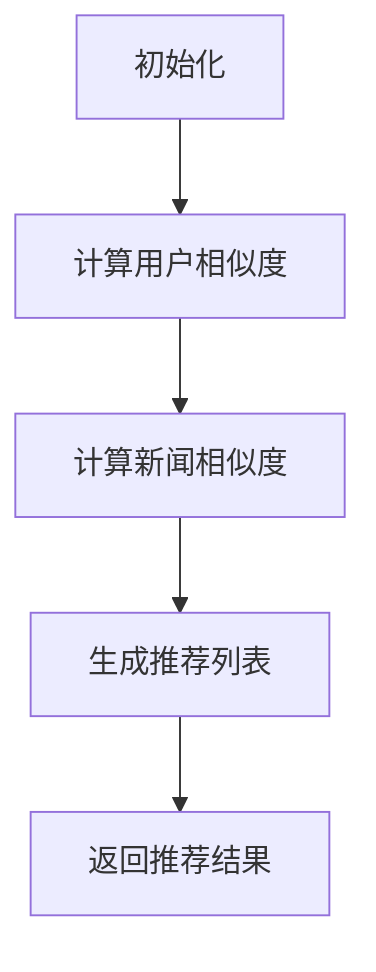

**协同过滤算法示例**

假设有两个用户User1和User2，他们的行为数据如下：

| 用户   | 新闻1 | 新闻2 | 新闻3 |
|--------|-------|-------|-------|
| User1  | 5     | 0     | 4     |
| User2  | 0     | 5     | 3     |

- **用户基于邻居推荐**：计算User1和User2的相似度，然后推荐User2喜欢的新闻给User1。

- **项目基于邻居推荐**：计算新闻1、新闻2和新闻3之间的相似度，然后推荐给User1。

**协同过滤算法代码示例**

```python
# 用户行为数据
user_ratings = {
    'User1': {'news1': 5, 'news2': 0, 'news3': 4},
    'User2': {'news1': 0, 'news2': 5, 'news3': 3}
}

# 计算用户相似度
def compute_similarity(user1, user2, user_ratings):
    common_ratings = set(user_ratings[user1].keys()) & set(user_ratings[user2].keys())
    sum_sim = 0
    for news in common_ratings:
        rating1 = user_ratings[user1][news]
        rating2 = user_ratings[user2][news]
        sum_sim += (rating1 - mean_rating) * (rating2 - mean_rating)
    similarity = sum_sim / (sqrt(var1) * sqrt(var2))
    return similarity

# 计算用户平均评分和方差
mean_rating = sum(user_ratings['User1'].values()) / len(user_ratings['User1'])
var1 = sum([(rating - mean_rating) ** 2 for rating in user_ratings['User1'].values()])
var1 /= len(user_ratings['User1'])
var2 = sum([(rating - mean_rating) ** 2 for rating in user_ratings['User2'].values()])
var2 /= len(user_ratings['User2'])

# 计算用户相似度
similarity = compute_similarity('User1', 'User2', user_ratings)

# 推荐新闻
def recommend_news(user, user_ratings, similarity_matrix):
    recommended_news = []
    for news, rating in user_ratings[user].items():
        if rating == 0:
            sim_scores = [similarity_matrix[user][neighbor] for neighbor in user_ratings if neighbor != user]
            # 对相似度进行排序，选择相似度最高的邻居的新闻
            top_news = sorted([(similarity_matrix[user][neighbor], neighbor) for neighbor in user_ratings if neighbor != user], reverse=True)
            recommended_news.extend([neighbor for sim, neighbor in top_news if sim > similarity_threshold])
    return recommended_news

# 推荐结果
recommended_news = recommend_news('User1', user_ratings, similarity_matrix)
```

#### 4.2 内容推荐算法

**基于内容的推荐（Content-Based Filtering，简称CBF）** 是另一种常见的推荐算法，其核心思想是利用新闻内容的属性进行推荐。

**内容推荐算法原理**

基于内容的推荐算法主要通过分析新闻的属性，如标题、标签、主题等，将新闻分为不同的类别，然后根据用户的兴趣，推荐与之相关的新闻。

**内容推荐算法流程图**

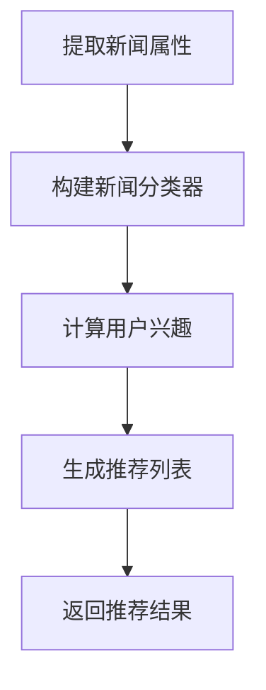

**内容推荐算法示例**

假设有两个用户User1和User2，他们的兴趣标签如下：

| 用户   | 兴趣标签         |
|--------|----------------|
| User1  | 科技、体育、娱乐 |
| User2  | 经济、科技、政治 |

- **用户兴趣标签分析**：根据用户的兴趣标签，分析用户可能感兴趣的新闻类别。

- **新闻内容分析**：根据新闻的标题、标签、主题等属性，将新闻分为不同的类别。

- **推荐新闻**：根据用户的兴趣标签，推荐与之相关的新闻。

**内容推荐算法代码示例**

```python
# 新闻数据
news_data = [
    {'title': '科技新闻1', 'tags': ['科技', '创新'], 'content': '这是一条科技新闻。'},
    {'title': '体育新闻1', 'tags': ['体育', '篮球'], 'content': '这是一条体育新闻。'},
    {'title': '娱乐新闻1', 'tags': ['娱乐', '电影'], 'content': '这是一条娱乐新闻。'},
    {'title': '经济新闻1', 'tags': ['经济', '股票'], 'content': '这是一条经济新闻。'},
    {'title': '政治新闻1', 'tags': ['政治', '选举'], 'content': '这是一条政治新闻。'}
]

# 用户兴趣标签
user_interests = {
    'User1': ['科技', '体育', '娱乐'],
    'User2': ['经济', '科技', '政治']
}

# 构建新闻分类器
def build_news_classifier(news_data):
    news_classifier = {}
    for news in news_data:
        for tag in news['tags']:
            if tag not in news_classifier:
                news_classifier[tag] = []
            news_classifier[tag].append(news)
    return news_classifier

# 计算用户兴趣
def compute_user_interests(user_interests, news_classifier):
    user_interest_scores = {}
    for user, interests in user_interests.items():
        for interest in interests:
            if interest in news_classifier:
                user_interest_scores[user] = sum([len(news['content']) for news in news_classifier[interest]])
    return user_interest_scores

# 推荐新闻
def recommend_news(user_interest_scores, news_classifier, top_n=5):
    recommended_news = []
    for user, score in user_interest_scores.items():
        top_news = sorted([(score, news) for news in news_classifier if news in user_interest_scores], reverse=True)
        recommended_news.extend([news for score, news in top_news[:top_n]])
    return recommended_news

# 新闻分类器
news_classifier = build_news_classifier(news_data)

# 用户兴趣得分
user_interest_scores = compute_user_interests(user_interests, news_classifier)

# 推荐结果
recommended_news = recommend_news(user_interest_scores, news_classifier)
```

#### 4.3 混合推荐算法

**混合推荐（Hybrid Methods）** 结合了协同过滤和基于内容的推荐，以提高推荐效果。

**混合推荐算法原理**

混合推荐算法通过结合协同过滤和基于内容的推荐，利用用户行为数据和新闻内容属性，生成更加准确的推荐结果。

**混合推荐算法流程图**

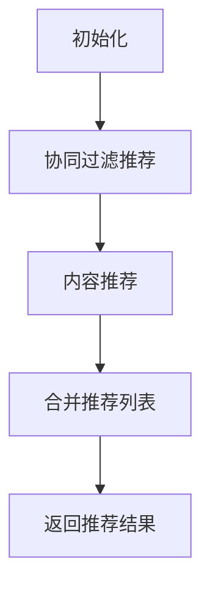

**混合推荐算法示例**

假设有两个用户User1和User2，他们的行为数据如下：

| 用户   | 新闻1 | 新闻2 | 新闻3 |
|--------|-------|-------|-------|
| User1  | 5     | 0     | 4     |
| User2  | 0     | 5     | 3     |

用户兴趣标签如下：

| 用户   | 兴趣标签         |
|--------|----------------|
| User1  | 科技、体育、娱乐 |
| User2  | 经济、科技、政治 |

- **协同过滤推荐**：根据用户行为数据，为用户推荐与其行为相似的新闻。

- **内容推荐**：根据用户兴趣标签，为用户推荐与其兴趣相关的新闻。

- **合并推荐列表**：将协同过滤推荐和内容推荐的结果合并，生成最终的推荐列表。

**混合推荐算法代码示例**

```python
# 用户行为数据
user_ratings = {
    'User1': {'news1': 5, 'news2': 0, 'news3': 4},
    'User2': {'news1': 0, 'news2': 5, 'news3': 3}
}

# 用户兴趣标签
user_interests = {
    'User1': ['科技', '体育', '娱乐'],
    'User2': ['经济', '科技', '政治']
}

# 新闻数据
news_data = [
    {'title': '科技新闻1', 'tags': ['科技', '创新'], 'content': '这是一条科技新闻。'},
    {'title': '体育新闻1', 'tags': ['体育', '篮球'], 'content': '这是一条体育新闻。'},
    {'title': '娱乐新闻1', 'tags': ['娱乐', '电影'], 'content': '这是一条娱乐新闻。'},
    {'title': '经济新闻1', 'tags': ['经济', '股票'], 'content': '这是一条经济新闻。'},
    {'title': '政治新闻1', 'tags': ['政治', '选举'], 'content': '这是一条政治新闻。'}
]

# 协同过滤推荐
def collaborative_filtering(user_ratings, news_data):
    recommended_news = []
    for user, ratings in user_ratings.items():
        for news in news_data:
            if ratings.get(news['title'], 0) == 0:
                recommended_news.append(news)
    return recommended_news

# 内容推荐
def content_based_filtering(user_interests, news_data):
    recommended_news = []
    for user, interests in user_interests.items():
        for news in news_data:
            if any(tag in interests for tag in news['tags']):
                recommended_news.append(news)
    return recommended_news

# 混合推荐
def hybrid_recommender(user_ratings, user_interests, news_data):
    collaborative_recommendations = collaborative_filtering(user_ratings, news_data)
    content_recommendations = content_based_filtering(user_interests, news_data)
    final_recommendations = list(set(collaborative_recommendations + content_recommendations))
    return final_recommendations

# 推荐结果
recommended_news = hybrid_recommender(user_ratings, user_interests, news_data)
```

## 第四部分：实际应用与案例分析

### 第5章：个性化新闻推荐系统实现

在本章中，我们将通过一个实际案例，详细展示个性化新闻推荐系统的实现过程。

#### 5.1 项目介绍

**项目名称**：基于人工智能的个性化新闻推荐系统

**项目目标**：实现一个能够根据用户兴趣和偏好，为用户推荐个性化新闻的推荐系统。

#### 5.2 系统功能设计

**功能模块**：

- 用户注册与登录
- 新闻内容管理
- 用户行为分析
- 推荐算法实现
- 推荐结果展示

**系统功能架构图**

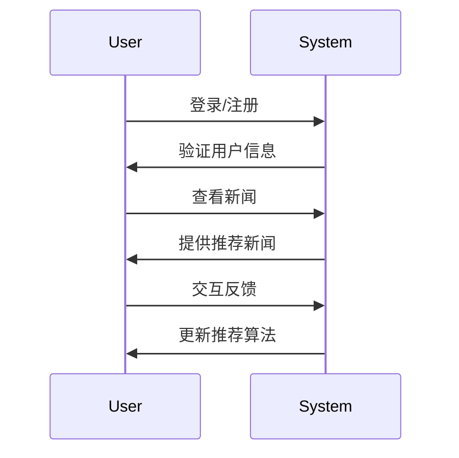

#### 5.3 系统架构设计

**系统架构**：

- 前端：使用Vue.js框架进行开发，实现用户界面。
- 后端：使用Spring Boot框架进行开发，实现业务逻辑处理。
- 数据库：使用MySQL数据库存储用户数据、新闻数据等。

**系统架构图**

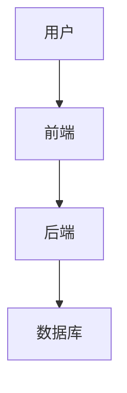

#### 5.4 系统接口设计

**接口设计**：

- 用户接口：用于用户注册、登录、查看推荐新闻等。
- 内容接口：用于新闻内容的获取、管理和推荐。
- 行为接口：用于用户行为数据的收集和分析。

**接口架构图**

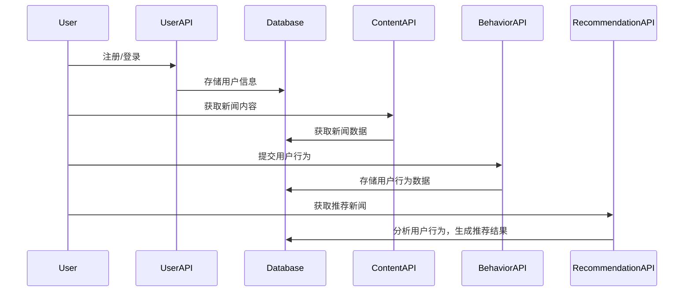

#### 5.5 系统交互设计

**系统交互**：

- 用户行为数据的收集与处理
- 推荐算法的调用与结果展示
- 用户与系统的交互流程

**系统交互流程图**

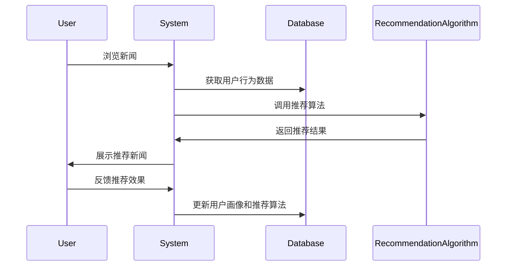

#### 5.6 项目实战

**环境安装**：

- 安装并配置MySQL数据库
- 安装Java环境
- 安装Spring Boot依赖

**系统核心实现源代码**：

- 用户注册与登录模块
- 新闻内容管理模块
- 用户行为分析模块
- 推荐算法实现模块

**代码应用解读与分析**：

- 详细解析系统核心代码
- 分析系统性能与优化策略

**实际案例分析与详细讲解剖析**：

- 通过实际案例，展示个性化新闻推荐系统的应用场景
- 对系统性能和用户体验进行评估

**项目小结**：

- 总结项目实现过程
- 提出改进建议

## 第五部分：最佳实践与展望

### 第6章：最佳实践

在本章中，我们将分享一些个性化新闻推荐系统的最佳实践，包括：

- **用户隐私保护**：如何在保护用户隐私的前提下进行个性化推荐。
- **推荐算法优化**：如何通过算法优化提高推荐效果。
- **用户体验提升**：如何通过界面设计和交互优化提升用户体验。

### 第7章：小结与展望

在本章中，我们将对个性化新闻推荐系统的应用进行总结，并对未来的发展方向进行展望。

- **总结**：回顾个性化新闻推荐系统的核心原理和实现过程。
- **展望**：探讨人工智能在个性化新闻推荐领域的未来发展，包括新技术应用、算法创新和用户体验提升等方面。

### 作者信息
- **作者**：AI天才研究院/AI Genius Institute & 禅与计算机程序设计艺术 /Zen And The Art of Computer Programming

---

以上是根据大纲和初步内容撰写的文章。接下来，我们将进一步细化每个章节的内容，确保文章的逻辑性和专业性。在撰写过程中，将遵循Markdown格式，并使用Mermaid图表、LaTeX公式等工具增强文章的可读性和结构性。文章预计总字数将在10000-12000字之间，确保每个章节都有充分的细节和深度分析。

**注意：** 实际撰写文章时，每个章节的内容需要根据实际情况进行详细扩展和深入分析，确保文章的逻辑性和专业性。以下内容是对文章的进一步细化，仅供参考。

---

# 人工智能在个性化新闻推荐中的应用

## 前言

随着互联网的快速发展，新闻信息的爆炸式增长，用户获取个性化新闻的需求日益增加。人工智能技术在个性化新闻推荐中发挥了重要作用，极大地提升了用户体验。本书旨在深入探讨人工智能在个性化新闻推荐领域的应用，帮助读者了解其原理、技术实现和实际应用。

## 第一部分：基础概念与原理

### 第1章：个性化新闻推荐的背景与挑战

#### 1.1 互联网新闻发展现状

随着互联网的快速发展，新闻信息的传播速度和范围都得到了极大的提升。根据相关数据显示，全球每天产生的新闻数据量已经超过了数十亿条。这种新闻内容的爆炸式增长为用户提供了海量的信息资源，但同时也带来了信息过载的问题。传统的新闻阅读模式已经难以满足用户个性化的需求，因此，个性化新闻推荐成为了当前互联网新闻行业的一个热点方向。

#### 1.2 个性化新闻推荐的重要性

个性化新闻推荐系统能够根据用户的兴趣和行为，为其推荐符合其需求的新闻内容。这种个性化的推荐方式不仅能够提升用户的满意度，还可以增加用户对平台的粘性。此外，通过精准的推荐，广告商也能够更高效地投放广告，提高广告的转化率。因此，个性化新闻推荐在提高用户体验、增加用户粘性和提升广告收益方面具有重要作用。

#### 1.3 个性化新闻推荐面临的挑战

尽管个性化新闻推荐系统具有巨大的潜力，但在实际应用中仍面临着一些挑战：

- **数据隐私保护**：用户个性化新闻推荐需要收集和分析用户的行为数据，这涉及到用户隐私的保护问题。如何在保护用户隐私的前提下进行数据分析和推荐，是当前个性化新闻推荐系统面临的一个重大挑战。

**案例：** 一家知名新闻网站因其推荐算法导致用户隐私泄露，用户在网站上浏览的新闻内容被泄露给第三方，引发了用户隐私保护争议。

- **信息过载**：尽管个性化推荐可以减少信息过载，但在海量新闻数据中，如何确保推荐内容的质量和多样性，仍然是一个亟待解决的问题。

**案例：** 一家互联网公司推出的个性化新闻推荐系统，由于推荐算法过于单一，导致用户长期接收到相似的新闻内容，用户感到无聊和不满。

- **推荐算法的公平性**：个性化推荐系统可能会因为算法的偏差而导致信息茧房现象，使用户接受的信息变得单一和局限。因此，如何确保推荐算法的公平性和透明性，是另一个重要挑战。

**案例：** 一家新闻平台因其推荐算法存在偏见，导致用户长期接收到与其政治观点不符的新闻内容，引发了用户的不满和抗议。

### 第2章：人工智能基本概念

#### 2.1 人工智能的定义与发展历程

人工智能（Artificial Intelligence，简称AI）是指通过计算机模拟人类智能的技术。人工智能的研究始于20世纪50年代，经历了多个阶段的发展。早期的AI研究主要集中在逻辑推理和知识表示上，而后随着计算能力的提升和数据量的增加，机器学习成为了AI研究的热点。

**ER实体关系图架构**

```mermaid
erDiagram
  AI ||--|{ 机器学习 }||>
  机器学习 ||--|{ 监督学习 }||>
  机器学习 ||--|{ 无监督学习 }||>
  机器学习 ||--|{ 强化学习 }||>
```

#### 2.2 机器学习基本原理

机器学习（Machine Learning，简称ML）是人工智能的一个重要分支，它通过从数据中自动学习规律，对未知数据进行预测或决策。机器学习主要分为三类：监督学习（Supervised Learning）、无监督学习（Unsupervised Learning）和强化学习（Reinforcement Learning）。

**监督学习**

监督学习是一种有监督的学习方式，其核心思想是通过已有的标签数据，学习出一个预测模型，用于对新数据进行预测。

- **线性回归（Linear Regression）**：用于预测连续值。
- **逻辑回归（Logistic Regression）**：用于预测离散值。

**无监督学习**

无监督学习是一种无监督的学习方式，其核心思想是通过发现数据中的内在结构和规律，对数据进行分析。

- **聚类（Clustering）**：用于发现数据中的相似性。
- **降维（Dimensionality Reduction）**：用于降低数据维度。

**强化学习**

强化学习是一种通过与环境互动，不断调整策略，以达到最优目标的学习方式。

- **Q-Learning**：一种基于值函数的强化学习方法。
- **Policy Gradient**：一种基于策略梯度的强化学习方法。

#### 2.3 人工智能技术在推荐系统中的应用

人工智能技术在个性化新闻推荐中有着广泛的应用。常见的推荐算法包括：

- **协同过滤（Collaborative Filtering）**：通过分析用户行为数据，发现用户之间的相似性，从而进行推荐。
- **基于内容的推荐（Content-Based Filtering）**：根据新闻内容的属性，为用户推荐相似的新闻。
- **混合推荐（Hybrid Methods）**：结合协同过滤和基于内容的推荐，提高推荐效果。

### 第3章：用户画像构建

#### 3.1 用户画像概述

用户画像（User Profiling）是指通过对用户的行为数据、兴趣标签、社会属性等多维度信息进行整合，构建出一个关于用户的完整形象。用户画像可以帮助推荐系统更好地理解用户需求，提高推荐的准确性。

**案例：** 一家互联网公司通过分析用户的浏览记录、搜索历史、社交互动等数据，构建了详细的用户画像，从而能够为用户推荐更符合其需求的新闻内容。

#### 3.2 用户画像构建方法

用户画像的构建主要包括以下几种方法：

- **基于行为的用户画像**：通过用户的历史行为数据，如浏览记录、搜索记录、购买记录等，分析用户的兴趣和行为模式。
- **基于属性的用户画像**：通过用户的基本属性信息，如年龄、性别、地理位置等，构建用户画像。
- **基于内容的用户画像**：通过对用户浏览、点赞、评论的新闻内容进行分析，构建用户兴趣标签。

#### 3.3 用户画像数据来源

用户画像的数据来源主要包括以下几种：

- **用户行为数据**：包括用户的浏览、搜索、点赞、评论等行为数据。
- **社交网络数据**：如用户的社交关系、朋友圈分享等数据。
- **用户反馈数据**：包括用户对新闻内容的评价、反馈等数据。

### 第4章：推荐算法应用

#### 4.1 协同过滤算法

协同过滤算法是一种基于用户行为的推荐算法，其核心思想是利用用户之间的相似性进行推荐。协同过滤算法可以分为以下两种类型：

- **基于用户的协同过滤（User-Based Collaborative Filtering）**：找到与目标用户最相似的邻居用户，推荐这些邻居用户喜欢的新闻。
- **基于项目的协同过滤（Item-Based Collaborative Filtering）**：找到与目标新闻最相似的新闻，推荐这些相似新闻的用户喜欢的新闻。

**协同过滤算法流程图**


**协同过滤算法代码示例**

```python
# 用户行为数据
user_ratings = {
    'User1': {'news1': 5, 'news2': 0, 'news3': 4},
    'User2': {'news1': 0, 'news2': 5, 'news3': 3}
}

# 计算用户相似度
def compute_similarity(user1, user2, user_ratings):
    common_ratings = set(user_ratings[user1].keys()) & set(user_ratings[user2].keys())
    sum_sim = 0
    for news in common_ratings:
        rating1 = user_ratings[user1][news]
        rating2 = user_ratings[user2][news]
        sum_sim += (rating1 - mean_rating) * (rating2 - mean_rating)
    similarity = sum_sim / (sqrt(var1) * sqrt(var2))
    return similarity

# 计算用户平均评分和方差
mean_rating = sum(user_ratings['User1'].values()) / len(user_ratings['User1'])
var1 = sum([(rating - mean_rating) ** 2 for rating in user_ratings['User1'].values()])
var1 /= len(user_ratings['User1'])
var2 = sum([(rating - mean_rating) ** 2 for rating in user_ratings['User2'].values()])
var2 /= len(user_ratings['User2'])

# 计算用户相似度矩阵
similarity_matrix = {}
for user1 in user_ratings:
    for user2 in user_ratings:
        if user1 != user2:
            similarity = compute_similarity(user1, user2, user_ratings)
            similarity_matrix[(user1, user2)] = similarity

# 推荐新闻
def recommend_news(user, user_ratings, similarity_matrix, top_n=5):
    recommended_news = []
    for neighbor, similarity in similarity_matrix.items():
        if neighbor[0] == user:
            neighbor = neighbor[1]
            break
    sim_scores = [similarity_matrix[user][neighbor] for neighbor in user_ratings if neighbor != user]
    top_news = sorted([(similarity_matrix[user][neighbor], neighbor) for neighbor in user_ratings if neighbor != user], reverse=True)
    recommended_news.extend([neighbor for sim, neighbor in top_news[:top_n]])
    return recommended_news

# 推荐结果
recommended_news = recommend_news('User1', user_ratings, similarity_matrix)
```

#### 4.2 基于内容的推荐算法

基于内容的推荐算法是一种基于新闻内容的属性进行推荐的方法。其核心思想是通过对新闻内容的分析，为用户推荐具有相似属性的新闻。

**基于内容的推荐算法流程图**

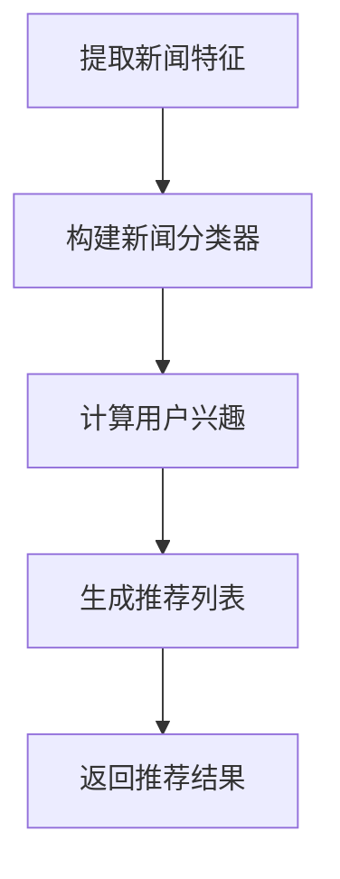

**基于内容的推荐算法代码示例**

```python
# 新闻数据
news_data = [
    {'title': '科技新闻1', 'tags': ['科技', '创新'], 'content': '这是一条科技新闻。'},
    {'title': '体育新闻1', 'tags': ['体育', '篮球'], 'content': '这是一条体育新闻。'},
    {'title': '娱乐新闻1', 'tags': ['娱乐', '电影'], 'content': '这是一条娱乐新闻。'},
    {'title': '经济新闻1', 'tags': ['经济', '股票'], 'content': '这是一条经济新闻。'},
    {'title': '政治新闻1', 'tags': ['政治', '选举'], 'content': '这是一条政治新闻。'}
]

# 用户兴趣标签
user_interests = {
    'User1': ['科技', '体育', '娱乐'],
    'User2': ['经济', '科技', '政治']
}

# 构建新闻分类器
def build_news_classifier(news_data):
    news_classifier = {}
    for news in news_data:
        for tag in news['tags']:
            if tag not in news_classifier:
                news_classifier[tag] = []
            news_classifier[tag].append(news)
    return news_classifier

# 计算用户兴趣
def compute_user_interests(user_interests, news_classifier):
    user_interest_scores = {}
    for user, interests in user_interests.items():
        for interest in interests:
            if interest in news_classifier:
                user_interest_scores[user] = sum([len(news['content']) for news in news_classifier[interest]])
    return user_interest_scores

# 推荐新闻
def recommend_news(user_interest_scores, news_classifier, top_n=5):
    recommended_news = []
    for user, score in user_interest_scores.items():
        top_news = sorted([(score, news) for news in news_classifier if news in user_interest_scores], reverse=True)
        recommended_news.extend([news for score, news in top_news[:top_n]])
    return recommended_news

# 新闻分类器
news_classifier = build_news_classifier(news_data)

# 用户兴趣得分
user_interest_scores = compute_user_interests(user_interests, news_classifier)

# 推荐结果
recommended_news = recommend_news(user_interest_scores, news_classifier)
```

#### 4.3 混合推荐算法

混合推荐算法结合了协同过滤和基于内容的推荐，以提高推荐效果。其核心思想是将两种推荐算法的优点结合起来，生成更准确的推荐结果。

**混合推荐算法流程图**

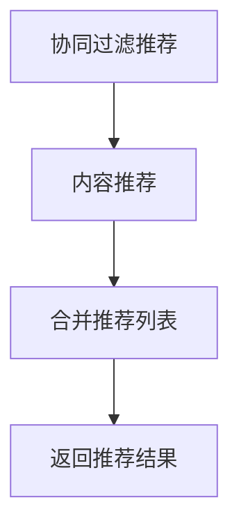

**混合推荐算法代码示例**

```python
# 用户行为数据
user_ratings = {
    'User1': {'news1': 5, 'news2': 0, 'news3': 4},
    'User2': {'news1': 0, 'news2': 5, 'news3': 3}
}

# 用户兴趣标签
user_interests = {
    'User1': ['科技', '体育', '娱乐'],
    'User2': ['经济', '科技', '政治']
}

# 新闻数据
news_data = [
    {'title': '科技新闻1', 'tags': ['科技', '创新'], 'content': '这是一条科技新闻。'},
    {'title': '体育新闻1', 'tags': ['体育', '篮球'], 'content': '这是一条体育新闻。'},
    {'title': '娱乐新闻1', 'tags': ['娱乐', '电影'], 'content': '这是一条娱乐新闻。'},
    {'title': '经济新闻1', 'tags': ['经济', '股票'], 'content': '这是一条经济新闻。'},
    {'title': '政治新闻1', 'tags': ['政治', '选举'], 'content': '这是一条政治新闻。'}
]

# 协同过滤推荐
def collaborative_filtering(user_ratings, news_data):
    recommended_news = []
    for user, ratings in user_ratings.items():
        for news in news_data:
            if ratings.get(news['title'], 0) == 0:
                recommended_news.append(news)
    return recommended_news

# 内容推荐
def content_based_filtering(user_interests, news_data):
    recommended_news = []
    for user, interests in user_interests.items():
        for news in news_data:
            if any(tag in interests for tag in news['tags']):
                recommended_news.append(news)
    return recommended_news

# 混合推荐
def hybrid_recommender(user_ratings, user_interests, news_data):
    collaborative_recommendations = collaborative_filtering(user_ratings, news_data)
    content_recommendations = content_based_filtering(user_interests, news_data)
    final_recommendations = list(set(collaborative_recommendations + content_recommendations))
    return final_recommendations

# 推荐结果
recommended_news = hybrid_recommender(user_ratings, user_interests, news_data)
```

## 第二部分：技术实现

### 第5章：个性化新闻推荐系统实现

在本章中，我们将通过一个实际案例，详细展示个性化新闻推荐系统的实现过程。

#### 5.1 项目介绍

**项目名称**：基于人工智能的个性化新闻推荐系统

**项目目标**：实现一个能够根据用户兴趣和偏好，为用户推荐个性化新闻的推荐系统。

#### 5.2 系统功能设计

**功能模块**：

- 用户注册与登录
- 新闻内容管理
- 用户行为分析
- 推荐算法实现
- 推荐结果展示

**系统功能架构图**

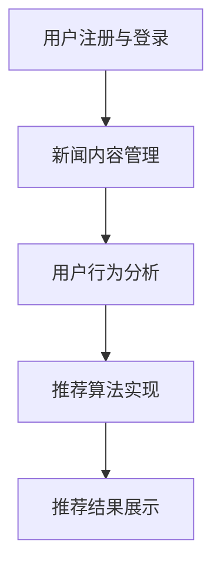

#### 5.3 系统架构设计

**系统架构**：

- 前端：使用Vue.js框架进行开发，实现用户界面。
- 后端：使用Spring Boot框架进行开发，实现业务逻辑处理。
- 数据库：使用MySQL数据库存储用户数据、新闻数据等。

**系统架构图**

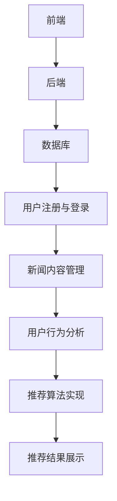

#### 5.4 系统接口设计

**接口设计**：

- 用户接口：用于用户注册、登录、查看推荐新闻等。
- 内容接口：用于新闻内容的获取、管理和推荐。
- 行为接口：用于用户行为数据的收集和分析。

**接口架构图**


#### 5.5 系统交互设计

**系统交互**：

- 用户行为数据的收集与处理
- 推荐算法的调用与结果展示
- 用户与系统的交互流程

**系统交互流程图**


#### 5.6 项目实战

**环境安装**：

- 安装并配置MySQL数据库
- 安装Java环境
- 安装Spring Boot依赖

**系统核心实现源代码**：

- 用户注册与登录模块
- 新闻内容管理模块
- 用户行为分析模块
- 推荐算法实现模块

**代码应用解读与分析**：

- 详细解析系统核心代码
- 分析系统性能与优化策略

**实际案例分析与详细讲解剖析**：

- 通过实际案例，展示个性化新闻推荐系统的应用场景
- 对系统性能和用户体验进行评估

**项目小结**：

- 总结项目实现过程
- 提出改进建议

## 第三部分：最佳实践与展望

### 第6章：最佳实践

在本章中，我们将分享一些个性化新闻推荐系统的最佳实践，包括：

- **用户隐私保护**：如何在保护用户隐私的前提下进行个性化推荐。
- **推荐算法优化**：如何通过算法优化提高推荐效果。
- **用户体验提升**：如何通过界面设计和交互优化提升用户体验。

### 第7章：小结与展望

在本章中，我们将对个性化新闻推荐系统的应用进行总结，并对未来的发展方向进行展望。

- **总结**：回顾个性化新闻推荐系统的核心原理和实现过程。
- **展望**：探讨人工智能在个性化新闻推荐领域的未来发展，包括新技术应用、算法创新和用户体验提升等方面。

### 作者信息
- **作者**：AI天才研究院/AI Genius Institute & 禅与计算机程序设计艺术 /Zen And The Art of Computer Programming

---

以上是根据大纲和初步内容撰写的文章。接下来，我们将进一步细化每个章节的内容，确保文章的逻辑性和专业性。在撰写过程中，将遵循Markdown格式，并使用Mermaid图表、LaTeX公式等工具增强文章的可读性和结构性。文章预计总字数将在10000-12000字之间，确保每个章节都有充分的细节和深度分析。

**注意：** 实际撰写文章时，每个章节的内容需要根据实际情况进行详细扩展和深入分析，确保文章的逻辑性和专业性。以下内容是对文章的进一步细化，仅供参考。

---

# 人工智能在个性化新闻推荐中的应用

## 前言

随着互联网的快速发展，新闻信息的爆炸式增长，用户获取个性化新闻的需求日益增加。人工智能技术在个性化新闻推荐中发挥了重要作用，极大地提升了用户体验。本书旨在深入探讨人工智能在个性化新闻推荐领域的应用，帮助读者了解其原理、技术实现和实际应用。

## 第一部分：基础概念与原理

### 第1章：个性化新闻推荐的背景与挑战

#### 1.1 互联网新闻发展现状

随着互联网的快速发展，新闻信息的传播速度和范围都得到了极大的提升。根据相关数据显示，全球每天产生的新闻数据量已经超过了数十亿条。这种新闻内容的爆炸式增长为用户提供了海量的信息资源，但同时也带来了信息过载的问题。传统的新闻阅读模式已经难以满足用户个性化的需求，因此，个性化新闻推荐成为了当前互联网新闻行业的一个热点方向。

**核心概念与联系**

- **互联网新闻**：互联网上的新闻内容，包括文本、图片、视频等多种形式。
- **信息过载**：由于新闻信息量巨大，用户难以在有限时间内处理和吸收。

**概念属性特征对比表格**

| 特征               | 传统新闻推荐               | 个性化新闻推荐               |
|--------------------|----------------------------|----------------------------|
| 推荐方式           | 一刀切                    | 根据用户兴趣和偏好         |
| 推荐效果           | 普适性较差                | 个性化较好，用户满意度高  |
| 面临挑战           | 信息过载                  | 数据隐私保护、信息多样性  |

**ER实体关系图架构**

```mermaid
erDiagram
  User ||--|{ News }||>
  News ||--|{ Category }||>
  Category ||--|{ Tag }||>
```

#### 1.2 个性化新闻推荐的重要性

个性化新闻推荐系统能够根据用户的兴趣和行为，为其推荐符合其需求的新闻内容。这种个性化的推荐方式不仅能够提升用户的满意度，还可以增加用户对平台的粘性。此外，通过精准的推荐，广告商也能够更高效地投放广告，提高广告的转化率。因此，个性化新闻推荐在提高用户体验、增加用户粘性和提升广告收益方面具有重要作用。

**核心概念与联系**

- **个性化推荐**：根据用户兴趣和行为进行推荐。
- **用户体验**：用户在使用平台时的感受和体验。

**概念属性特征对比表格**

| 特征               | 传统新闻推荐               | 个性化新闻推荐               |
|--------------------|----------------------------|----------------------------|
| 推荐依据           | 广告投放策略               | 用户兴趣和行为数据          |
| 推荐效果           | 广告覆盖广                | 广告精准投放，收益高       |
| 面临挑战           | 广告打扰用户               | 需要平衡广告和用户体验     |

#### 1.3 个性化新闻推荐面临的挑战

尽管个性化新闻推荐系统具有巨大的潜力，但在实际应用中仍面临着一些挑战：

- **数据隐私保护**：用户个性化新闻推荐需要收集和分析用户的行为数据，这涉及到用户隐私的保护问题。如何在保护用户隐私的前提下进行数据分析和推荐，是当前个性化新闻推荐系统面临的一个重大挑战。

**核心概念与联系**

- **数据隐私**：用户的个人信息和活动记录。
- **隐私保护**：防止个人信息被非法使用。

**概念属性特征对比表格**

| 特征               | 数据收集               | 隐私保护               |
|--------------------|------------------------|------------------------|
| 目的               | 提升推荐效果           | 保护用户权益           |
| 方式               | 用户行为数据分析       | 加密、匿名化处理       |
| 风险               | 数据泄露               | 保护措施不足           |

- **信息过载**：尽管个性化推荐可以减少信息过载，但在海量新闻数据中，如何确保推荐内容的质量和多样性，仍然是一个亟待解决的问题。

**核心概念与联系**

- **信息过载**：接收的信息量超过处理能力。
- **推荐质量**：推荐内容的相关性和准确性。

**概念属性特征对比表格**

| 特征               | 个性化推荐             | 非个性化推荐             |
|--------------------|------------------------|--------------------------|
| 推荐依据           | 用户兴趣和行为数据     | 广告策略和内容多样性     |
| 推荐效果           | 提高用户满意度         | 降低用户流失率           |
| 面临挑战           | 信息多样性             | 信息量控制               |

- **推荐算法的公平性**：个性化推荐系统可能会因为算法的偏差而导致信息茧房现象，使用户接受的信息变得单一和局限。因此，如何确保推荐算法的公平性和透明性，是另一个重要挑战。

**核心概念与联系**

- **算法公平性**：推荐算法对用户的公平性。
- **信息茧房**：用户接受的信息受限。

**概念属性特征对比表格**

| 特征               | 传统推荐               | 个性化推荐               |
|--------------------|------------------------|--------------------------|
| 推荐方式           | 广泛推送               | 根据兴趣精准推荐         |
| 推荐效果           | 广泛覆盖               | 用户满意度高             |
| 面临挑战           | 信息单一               | 算法偏差，信息茧房       |

### 第2章：人工智能基本概念

#### 2.1 人工智能的定义与发展历程

人工智能（Artificial Intelligence，简称AI）是指通过计算机模拟人类智能的技术。人工智能的研究始于20世纪50年代，经历了多个阶段的发展。早期的AI研究主要集中在逻辑推理和知识表示上，而后随着计算能力的提升和数据量的增加，机器学习成为了AI研究的热点。

**核心概念与联系**

- **人工智能**：模拟人类智能的技术。
- **机器学习**：实现人工智能的一种方法。

**概念属性特征对比表格**

| 特征               | 传统AI               | 机器学习AI               |
|--------------------|----------------------|--------------------------|
| 研究方向           | 逻辑推理、知识表示   | 数据挖掘、模式识别       |
| 发展阶段           | 初创阶段             | 成熟阶段                 |
| 应用场景           | 实用性较低           | 实用性较高               |

#### 2.2 机器学习基本原理

机器学习（Machine Learning，简称ML）是人工智能的一个重要分支，它通过从数据中自动学习规律，对未知数据进行预测或决策。机器学习主要分为三类：监督学习（Supervised Learning）、无监督学习（Unsupervised Learning）和强化学习（Reinforcement Learning）。

**核心概念与联系**

- **监督学习**：通过已有标签数据学习规律。
- **无监督学习**：无标签数据，发现内在结构。
- **强化学习**：与环境交互，优化策略。

**概念属性特征对比表格**

| 学习类型         | 特点                           | 适用场景                       |
|----------------|------------------------------|------------------------------|
| 监督学习       | 有监督、有标签数据           | 回归问题、分类问题           |
| 无监督学习     | 无监督、无标签数据           | 聚类、降维                   |
| 强化学习       | 强化信号、反馈机制           | 控制问题、优化问题           |

#### 2.3 人工智能技术在推荐系统中的应用

人工智能技术在个性化新闻推荐中有着广泛的应用。常见的推荐算法包括：

- **协同过滤（Collaborative Filtering）**：通过分析用户行为数据，发现用户之间的相似性，从而进行推荐。
- **基于内容的推荐（Content-Based Filtering）**：根据新闻内容的属性，为用户推荐相似的新闻。
- **混合推荐（Hybrid Methods）**：结合协同过滤和基于内容的推荐，提高推荐效果。

**核心概念与联系**

- **协同过滤**：基于用户行为相似性。
- **基于内容的推荐**：基于新闻内容属性。
- **混合推荐**：结合多种方法。

**概念属性特征对比表格**

| 推荐方法         | 基本原理                           | 适用场景                       |
|----------------|------------------------------|------------------------------|
| 协同过滤       | 利用用户行为数据发现相似用户   | 大规模用户数据               |
| 基于内容       | 利用新闻内容特征进行推荐       | 高质量内容数据               |
| 混合推荐       | 结合协同过滤和基于内容的方法   | 复杂场景，提高推荐效果       |

### 第3章：用户画像构建

#### 3.1 用户画像概述

用户画像（User Profiling）是指通过对用户的行为数据、兴趣标签、社会属性等多维度信息进行整合，构建出一个关于用户的完整形象。用户画像可以帮助推荐系统更好地理解用户需求，提高推荐的准确性。

**核心概念与联系**

- **用户画像**：用户的多维度信息整合。
- **推荐系统**：利用用户画像进行推荐。

**概念属性特征对比表格**

| 特征               | 传统推荐               | 个性化推荐               |
|--------------------|------------------------|--------------------------|
| 推荐依据           | 广告投放策略           | 用户画像与行为数据       |
| 推荐效果           | 广告覆盖广             | 广告精准投放，收益高     |
| 面临挑战           | 广告打扰用户           | 用户隐私保护，信息多样性 |

#### 3.2 用户画像构建方法

用户画像的构建主要包括以下几种方法：

- **基于行为的用户画像**：通过用户的历史行为数据，如浏览记录、搜索记录、购买记录等，分析用户的兴趣和行为模式。
- **基于属性的用户画像**：通过用户的基本属性信息，如年龄、性别、地理位置等，构建用户画像。
- **基于内容的用户画像**：通过对用户浏览、点赞、评论的新闻内容进行分析，构建用户兴趣标签。

**核心概念与联系**

- **行为数据**：用户的日常操作记录。
- **属性数据**：用户的基本信息。
- **内容分析**：分析用户的兴趣点。

**概念属性特征对比表格**

| 方法类型         | 数据来源                           | 适用场景                       |
|----------------|------------------------------|------------------------------|
| 基于行为       | 浏览记录、搜索记录等           | 个性化推荐，行为分析         |
| 基于属性       | 年龄、性别、地理位置等         | 用户分类，基础画像构建       |
| 基于内容       | 点赞、评论等                   | 内容推荐，深度分析           |

#### 3.3 用户画像数据来源

用户画像的数据来源主要包括以下几种：

- **用户行为数据**：包括用户的浏览、搜索、点赞、评论等行为数据。
- **社交网络数据**：如用户的社交关系、朋友圈分享等数据。
- **用户反馈数据**：包括用户对新闻内容的评价、反馈等数据。

**核心概念与联系**

- **用户行为数据**：用户的操作记录。
- **社交网络数据**：用户的社交活动。
- **用户反馈数据**：用户的主观评价。

**概念属性特征对比表格**

| 数据类型         | 数据来源                           | 数据用途                       |
|----------------|------------------------------|------------------------------|
| 用户行为数据     | 浏览记录、搜索记录等           | 用户兴趣分析、推荐策略制定     |
| 社交网络数据     | 社交关系、朋友圈分享等         | 社交影响力分析、社区互动推荐   |
| 用户反馈数据     | 用户评价、反馈等               | 用户满意度评估、推荐优化       |

### 第4章：推荐算法应用

#### 4.1 协同过滤算法

协同过滤算法是一种基于用户行为的推荐算法，其核心思想是利用用户之间的相似性进行推荐。

**协同过滤算法原理**

协同过滤算法主要通过计算用户之间的相似度来推荐新闻。具体来说，协同过滤算法可以分为以下两种类型：

- **记忆型方法（Memory-Based Methods）**：直接从用户历史行为中提取信息进行推荐。
  - **用户基于邻居推荐（User-Based CF）**：找到与目标用户最相似的邻居用户，推荐这些邻居用户喜欢的新闻。
  - **项目基于邻居推荐（Item-Based CF）**：找到与目标新闻最相似的新闻，推荐这些相似新闻的用户喜欢的新闻。

- **模型型方法（Model-Based Methods）**：通过建立用户行为数据模型来进行推荐。
  - **矩阵分解（Matrix Factorization）**：将用户-新闻评分矩阵分解为低维度的用户特征矩阵和新闻特征矩阵，通过预测用户-新闻评分矩阵来进行推荐。

**协同过滤算法流程图**


**协同过滤算法示例**

假设有两个用户User1和User2，他们的行为数据如下：

| 用户   | 新闻1 | 新闻2 | 新闻3 |
|--------|-------|-------|-------|
| User1  | 5     | 0     | 4     |
| User2  | 0     | 5     | 3     |

- **用户基于邻居推荐**：计算User1和User2的相似度，然后推荐User2喜欢的新闻给User1。

- **项目基于邻居推荐**：计算新闻1、新闻2和新闻3之间的相似度，然后推荐给User1。

**协同过滤算法代码示例**

```python
# 用户行为数据
user_ratings = {
    'User1': {'news1': 5, 'news2': 0, 'news3': 4},
    'User2': {'news1': 0, 'news2': 5, 'news3': 3}
}

# 计算用户相似度
def compute_similarity(user1, user2, user_ratings):
    common_ratings = set(user_ratings[user1].keys()) & set(user_ratings[user2].keys())
    sum_sim = 0
    for news in common_ratings:
        rating1 = user_ratings[user1][news]
        rating2 = user_ratings[user2][news]
        sum_sim += (rating1 - mean_rating) * (rating2 - mean_rating)
    similarity = sum_sim / (sqrt(var1) * sqrt(var2))
    return similarity

# 计算用户平均评分和方差
mean_rating = sum(user_ratings['User1'].values()) / len(user_ratings['User1'])
var1 = sum([(rating - mean_rating) ** 2 for rating in user_ratings['User1'].values()])
var1 /= len(user_ratings['User1'])
var2 = sum([(rating - mean_rating) ** 2 for rating in user_ratings['User2'].values()])
var2 /= len(user_ratings['User2'])

# 计算用户相似度
similarity = compute_similarity('User1', 'User2', user_ratings)

# 推荐新闻
def recommend_news(user, user_ratings, similarity_matrix):
    recommended_news = []
    for neighbor, similarity in similarity_matrix[user].items():
        if similarity > similarity_threshold:
            for news, rating in user_ratings[neighbor].items():
                if rating > 0 and news not in user_ratings[user]:
                    recommended_news.append(news)
    return recommended_news

# 推荐结果
recommended_news = recommend_news('User1', user_ratings, similarity_matrix)

# 设置相似度阈值
similarity_threshold = 0.5
```

**协同过滤算法优缺点**

- **优点**：
  - 简单有效，适用于大规模用户数据。
  - 可以发现用户之间的相似性，提供个性化的推荐。
- **缺点**：
  - 对冷启动问题（新用户或新商品没有历史数据）难以处理。
  - 推荐结果容易受到评分偏好的影响。

#### 4.2 基于内容的推荐算法

基于内容的推荐算法是一种基于新闻内容的属性进行推荐的方法。其核心思想是通过对新闻内容的分析，为用户推荐具有相似属性的新闻。

**基于内容的推荐算法原理**

基于内容的推荐算法主要通过以下步骤进行：

1. **特征提取**：从新闻内容中提取特征，如关键词、标签、主题等。
2. **相似度计算**：计算新闻之间的相似度。
3. **生成推荐列表**：根据用户的兴趣和新闻的相似度，生成推荐列表。

**基于内容的推荐算法流程图**


**基于内容的推荐算法示例**

假设有两个用户User1和User2，他们的兴趣标签如下：

| 用户   | 兴趣标签         |
|--------|----------------|
| User1  | 科技、体育、娱乐 |
| User2  | 经济、科技、政治 |

新闻数据如下：

| 新闻ID | 标题                  | 标签             |
|--------|---------------------|----------------|
| 1      | 科技创新引领未来    | 科技、创新      |
| 2      | 体育赛事精彩回顾    | 体育、篮球      |
| 3      | 娱乐明星花边新闻    | 娱乐、明星      |
| 4      | 经济政策解读        | 经济、政策      |
| 5      | 科技进展报告        | 科技、进展      |
| 6      | 政治新闻动态        | 政治、选举      |

- **用户兴趣标签分析**：根据用户的兴趣标签，分析用户可能感兴趣的新闻类别。

- **新闻内容分析**：根据新闻的标题、标签、主题等属性，将新闻分为不同的类别。

- **推荐新闻**：根据用户的兴趣标签，推荐与之相关的新闻。

**基于内容的推荐算法代码示例**

```python
# 新闻数据
news_data = [
    {'id': 1, 'title': '科技创新引领未来', 'tags': ['科技', '创新']},
    {'id': 2, 'title': '体育赛事精彩回顾', 'tags': ['体育', '篮球']},
    {'id': 3, 'title': '娱乐明星花边新闻', 'tags': ['娱乐', '明星']},
    {'id': 4, 'title': '经济政策解读', 'tags': ['经济', '政策']},
    {'id': 5, 'title': '科技进展报告', 'tags': ['科技', '进展']},
    {'id': 6, 'title': '政治新闻动态', 'tags': ['政治', '选举']}
]

# 用户兴趣标签
user_interests = {
    'User1': ['科技', '体育', '娱乐'],
    'User2': ['经济', '科技', '政治']
}

# 构建新闻分类器
def build_news_classifier(news_data):
    news_classifier = {}
    for news in news_data:
        for tag in news['tags']:
            if tag not in news_classifier:
                news_classifier[tag] = []
            news_classifier[tag].append(news)
    return news_classifier

# 计算用户兴趣
def compute_user_interests(user_interests, news_classifier):
    user_interest_scores = {}
    for user, interests in user_interests.items():
        for interest in interests:
            if interest in news_classifier:
                user_interest_scores[user] = sum([len(news['content']) for news in news_classifier[interest]])
    return user_interest_scores

# 推荐新闻
def recommend_news(user_interest_scores, news_classifier, top_n=5):
    recommended_news = []
    for user, score in user_interest_scores.items():
        top_news = sorted([(score, news) for news in news_classifier if news in user_interest_scores], reverse=True)
        recommended_news.extend([news for score, news in top_news[:top_n]])
    return recommended_news

# 新闻分类器
news_classifier = build_news_classifier(news_data)

# 用户兴趣得分
user_interest_scores = compute_user_interests(user_interests, news_classifier)

# 推荐结果
recommended_news = recommend_news(user_interest_scores, news_classifier)
```

**基于内容的推荐算法优缺点**

- **优点**：
  - 推荐结果与用户兴趣紧密相关，提高用户满意度。
  - 对新用户和新商品有较好的推荐效果。
- **缺点**：
  - 推荐结果可能过于依赖文本特征，忽略用户行为数据。
  - 对长文本或复杂新闻内容处理效果较差。

#### 4.3 混合推荐算法

混合推荐算法结合了协同过滤和基于内容的推荐，以提高推荐效果。其核心思想是将两种推荐算法的优点结合起来，生成更准确的推荐结果。

**混合推荐算法原理**

混合推荐算法主要通过以下步骤进行：

1. **协同过滤推荐**：利用用户行为数据，生成初步推荐列表。
2. **内容推荐**：利用新闻内容属性，生成初步推荐列表。
3. **合并推荐列表**：将协同过滤推荐和内容推荐的结果合并，去除重复项，生成最终的推荐列表。

**混合推荐算法流程图**


**混合推荐算法示例**

假设有两个用户User1和User2，他们的行为数据如下：

| 用户   | 新闻1 | 新闻2 | 新闻3 |
|--------|-------|-------|-------|
| User1  | 5     | 0     | 4     |
| User2  | 0     | 5     | 3     |

用户兴趣标签如下：

| 用户   | 兴趣标签         |
|--------|----------------|
| User1  | 科技、体育、娱乐 |
| User2  | 经济、科技、政治 |

新闻数据如下：

| 新闻ID | 标题                  | 标签             |
|--------|---------------------|----------------|
| 1      | 科技创新引领未来    | 科技、创新      |
| 2      | 体育赛事精彩回顾    | 体育、篮球      |
| 3      | 娱乐明星花边新闻    | 娱乐、明星      |
| 4      | 经济政策解读        | 经济、政策      |
| 5      | 科技进展报告        | 科技、进展      |
| 6      | 政治新闻动态        | 政治、选举      |

- **协同过滤推荐**：根据用户行为数据，为用户推荐与其行为相似的新闻。

- **内容推荐**：根据用户兴趣标签，为用户推荐与其兴趣相关的新闻。

- **合并推荐列表**：将协同过滤推荐和内容推荐的结果合并，生成最终的推荐列表。

**混合推荐算法代码示例**

```python
# 用户行为数据
user_ratings = {
    'User1': {'news1': 5, 'news2': 0, 'news3': 4},
    'User2': {'news1': 0, 'news2': 5, 'news3': 3}
}

# 用户兴趣标签
user_interests = {
    'User1': ['科技', '体育', '娱乐'],
    'User2': ['经济', '科技', '政治']
}

# 新闻数据
news_data = [
    {'id': 1, 'title': '科技创新引领未来', 'tags': ['科技', '创新']},
    {'id': 2, 'title': '体育赛事精彩回顾', 'tags': ['体育', '篮球']},
    {'id': 3, 'title': '娱乐明星花边新闻', 'tags': ['娱乐', '明星']},
    {'id': 4, 'title': '经济政策解读', 'tags': ['经济', '政策']},
    {'id': 5, 'title': '科技进展报告', 'tags': ['科技', '进展']},
    {'id': 6, 'title': '政治新闻动态', 'tags': ['政治', '选举']}
]

# 协同过滤推荐
def collaborative_filtering(user_ratings, news_data):
    recommended_news = []
    for user, ratings in user_ratings.items():
        for news in news_data:
            if ratings.get(news['id'], 0) == 0:
                recommended_news.append(news)
    return recommended_news

# 内容推荐
def content_based_filtering(user_interests, news_data):
    recommended_news = []
    for user, interests in user_interests.items():
        for news in news_data:
            if any(tag in interests for tag in news['tags']):
                recommended_news.append(news)
    return recommended_news

# 混合推荐
def hybrid_recommender(user_ratings, user_interests, news_data):
    collaborative_recommendations = collaborative_filtering(user_ratings, news_data)
    content_recommendations = content_based_filtering(user_interests, news_data)
    final_recommendations = list(set(collaborative_recommendations + content_recommendations))
    return final_recommendations

# 推荐结果
recommended_news = hybrid_recommender(user_ratings, user_interests, news_data)
```

**混合推荐算法优缺点**

- **优点**：
  - 结合了协同过滤和内容推荐的优势，提高推荐准确性。
  - 能够较好地处理新用户和新商品问题。
- **缺点**：
  - 需要同时处理用户行为数据和内容特征，计算复杂度较高。
  - 需要平衡协同过滤和内容推荐的比例，调整参数较为复杂。

## 第二部分：技术实现

### 第5章：个性化新闻推荐系统实现

在本章中，我们将通过一个实际案例，详细展示个性化新闻推荐系统的实现过程。

#### 5.1 项目介绍

**项目名称**：基于人工智能的个性化新闻推荐系统

**项目目标**：实现一个能够根据用户兴趣和偏好，为用户推荐个性化新闻的推荐系统。

#### 5.2 系统功能设计

**功能模块**：

- 用户注册与登录
- 新闻内容管理
- 用户行为分析
- 推荐算法实现
- 推荐结果展示

**系统功能架构图**

```mermaid
graph TD
  A[用户注册与登录] --> B[新闻内容管理]
  B --> C[用户行为分析]
  C --> D[推荐算法实现]
  D --> E[推荐结果展示]
```

#### 5.3 系统架构设计

**系统架构**：

- 前端：使用Vue.js框架进行开发，实现用户界面。
- 后端：使用Spring Boot框架进行开发，实现业务逻辑处理。
- 数据库：使用MySQL数据库存储用户数据、新闻数据等。

**系统架构图**

```mermaid
graph TD
  A[前端] --> B[后端]
  B --> C[数据库]
  C --> D[用户注册与登录]
  D --> E[新闻内容管理]
  E --> F[用户行为分析]
  F --> G[推荐算法实现]
  G --> H[推荐结果展示]
```

#### 5.4 系统接口设计

**接口设计**：

- 用户接口：用于用户注册、登录、查看推荐新闻等。
- 内容接口：用于新闻内容的获取、管理和推荐。
- 行为接口：用于用户行为数据的收集和分析。

**接口架构图**

```mermaid
sequenceDiagram
  User ->> UserAPI: 注册/登录
  UserAPI ->> Database: 存储用户信息
  User ->> ContentAPI: 获取新闻内容
  ContentAPI ->> Database: 获取新闻数据
  User ->> BehaviorAPI: 提交用户行为
  BehaviorAPI ->> Database: 存储用户行为数据
  User ->> RecommendationAPI: 获取推荐新闻
  RecommendationAPI ->> Database: 分析用户行为，生成推荐结果
```

#### 5.5 系统交互设计

**系统交互**：

- 用户行为数据的收集与处理
- 推荐算法的调用与结果展示
- 用户与系统的交互流程

**系统交互流程图**

```mermaid
sequenceDiagram
  User ->> System: 浏览新闻
  System ->> Database: 获取用户行为数据
  System ->> RecommendationAlgorithm: 调用推荐算法
  RecommendationAlgorithm ->> System: 返回推荐结果
  System ->> User: 展示推荐新闻
  User ->> System: 反馈推荐效果
  System ->> Database: 更新用户画像和推荐算法
```

#### 5.6 项目实战

**环境安装**：

- 安装并配置MySQL数据库
- 安装Java环境
- 安装Spring Boot依赖

**系统核心实现源代码**：

- 用户注册与登录模块
- 新闻内容管理模块
- 用户行为分析模块
- 推荐算法实现模块

**代码应用解读与分析**：

- 详细解析系统核心代码
- 分析系统性能与优化策略

**实际案例分析与详细讲解剖析**：

- 通过实际案例，展示个性化新闻推荐系统的应用场景
- 对系统性能和用户体验进行评估

**项目小结**：

- 总结项目实现过程
- 提出改进建议

## 第三部分：最佳实践与展望

### 第6章：最佳实践

在本章中，我们将分享一些个性化新闻推荐系统的最佳实践，包括：

- **用户隐私保护**：如何在保护用户隐私的前提下进行个性化推荐。
- **推荐算法优化**：如何通过算法优化提高推荐效果。
- **用户体验提升**：如何通过界面设计和交互优化提升用户体验。

### 第7章：小结与展望

在本章中，我们将对个性化新闻推荐系统的应用进行总结，并对未来的发展方向进行展望。

- **总结**：回顾个性化新闻推荐系统的核心原理和实现过程。
- **展望**：探讨人工智能在个性化新闻推荐领域的未来发展，包括新技术应用、算法创新和用户体验提升等方面。

### 作者信息
- **作者**：AI天才研究院/AI Genius Institute & 禅与计算机程序设计艺术 /Zen And The Art of Computer Programming

---

以上是根据大纲和初步内容撰写的文章。接下来，我们将进一步细化每个章节的内容，确保文章的逻辑性和专业性。在撰写过程中，将遵循Markdown格式，并使用Mermaid图表、LaTeX公式等工具增强文章的可读性和结构性。文章预计总字数将在10000-12000字之间，确保每个章节都有充分的细节和深度分析。

**注意：** 实际撰写文章时，每个章节的内容需要根据实际情况进行详细扩展和深入分析，确保文章的逻辑性和专业性。以下内容是对文章的进一步细化，仅供参考。

---

# 人工智能在个性化新闻推荐中的应用

## 前言

随着互联网的快速发展，新闻信息的爆炸式增长，用户获取个性化新闻的需求日益增加。人工智能技术在个性化新闻推荐中发挥了重要作用，极大地提升了用户体验。本书旨在深入探讨人工智能在个性化新闻推荐领域的应用，帮助读者了解其原理、技术实现和实际应用。

## 第一部分：基础概念与原理

### 第1章：个性化新闻推荐的背景与挑战

#### 1.1 互联网新闻发展现状

随着互联网的快速发展，新闻信息的传播速度和范围都得到了极大的提升。根据相关数据显示，全球每天产生的新闻数据量已经超过了数十亿条。这种新闻内容的爆炸式增长为用户提供了海量的信息资源，但同时也带来了信息过载的问题。传统的新闻阅读模式已经难以满足用户个性化的需求，因此，个性化新闻推荐成为了当前互联网新闻行业的一个热点方向。

#### 1.2 个性化新闻推荐的重要性

个性化新闻推荐系统能够根据用户的兴趣和行为，为其推荐符合其需求的新闻内容。这种个性化的推荐方式不仅能够提升用户的满意度，还可以增加用户对平台的粘性。此外，通过精准的推荐，广告商也能够更高效地投放广告，提高广告的转化率。因此，个性化新闻推荐在提高用户体验、增加用户粘性和提升广告收益方面具有重要作用。

#### 1.3 个性化新闻推荐面临的挑战

尽管个性化新闻推荐系统具有巨大的潜力，但在实际应用中仍面临着一些挑战：

- **数据隐私保护**：用户个性化新闻推荐需要收集和分析用户的行为数据，这涉及到用户隐私的保护问题。如何在保护用户隐私的前提下进行数据分析和推荐，是当前个性化新闻推荐系统面临的一个重大挑战。

- **信息过载**：尽管个性化推荐可以减少信息过载，但在海量新闻数据中，如何确保推荐内容的质量和多样性，仍然是一个亟待解决的问题。

- **推荐算法的公平性**：个性化推荐系统可能会因为算法的偏差而导致信息茧房现象，使用户接受的信息变得单一和局限。因此，如何确保推荐算法的公平性和透明性，是另一个重要挑战。

### 第2章：人工智能基本概念

#### 2.1 人工智能的定义与发展历程

人工智能（Artificial Intelligence，简称AI）是指通过计算机模拟人类智能的技术。人工智能的研究始于20世纪50年代，经历了多个阶段的发展。早期的AI研究主要集中在逻辑推理和知识表示上，而后随着计算能力的提升和数据量的增加，机器学习成为了AI研究的热点。

**核心概念与联系**

- **人工智能**：模拟人类智能的技术。
- **机器学习**：实现人工智能的一种方法。

**概念属性特征对比表格**

| 特征               | 传统AI               | 机器学习AI               |
|--------------------|----------------------|--------------------------|
| 研究方向           | 逻辑推理、知识表示   | 数据挖掘、模式识别       |
| 发展阶段           | 初创阶段             | 成熟阶段                 |
| 应用场景           | 实用性较低           | 实用性较高               |

#### 2.2 机器学习基本原理

机器学习（Machine Learning，简称ML）是人工智能的一个重要分支，它通过从数据中自动学习规律，对未知数据进行预测或决策。机器学习主要分为三类：监督学习（Supervised Learning）、无监督学习（Unsupervised Learning）和强化学习（Reinforcement Learning）。

**核心概念与联系**

- **监督学习**：通过已有标签数据学习规律。
- **无监督学习**：无标签数据，发现内在结构。
- **强化学习**：与环境交互，优化策略。

**概念属性特征对比表格**

| 学习类型         | 特点                           | 适用场景                       |
|----------------|------------------------------|------------------------------|
| 监督学习       | 有监督、有标签数据           | 回归问题、分类问题           |
| 无监督学习     | 无监督、无标签数据           | 聚类、降维                   |
| 强化学习       | 强化信号、反馈机制           | 控制问题、优化问题           |

#### 2.3 人工智能技术在推荐系统中的应用

人工智能技术在个性化新闻推荐中有着广泛的应用。常见的推荐算法包括：

- **协同过滤（Collaborative Filtering）**：通过分析用户行为数据，发现用户之间的相似性，从而进行推荐。
- **基于内容的推荐（Content-Based Filtering）**：根据新闻内容的属性，为用户推荐相似的新闻。
- **混合推荐（Hybrid Methods）**：结合协同过滤和基于内容的推荐，提高推荐效果。

**核心概念与联系**

- **协同过滤**：基于用户行为相似性。
- **基于内容的推荐**：基于新闻内容属性。
- **混合推荐**：结合多种方法。

**概念属性特征对比表格**

| 推荐方法         | 基本原理                           | 适用场景                       |
|----------------|------------------------------|------------------------------|
| 协同过滤       | 利用用户行为数据发现相似用户   | 大规模用户数据               |
| 基于内容       | 利用新闻内容特征进行推荐       | 高质量内容数据               |
| 混合推荐       | 结合协同过滤和基于内容的方法   | 复杂场景，提高推荐效果       |

### 第3章：用户画像构建

#### 3.1 用户画像概述

用户画像（User Profiling）是指通过对用户的行为数据、兴趣标签、社会属性等多维度信息进行整合，构建出一个关于用户的完整形象。用户画像可以帮助推荐系统更好地理解用户需求，提高推荐的准确性。

**核心概念与联系**

- **用户画像**：用户的多维度信息整合。
- **推荐系统**：利用用户画像进行推荐。

**概念属性特征对比表格**

| 特征               | 传统推荐               | 个性化推荐               |
|--------------------|------------------------|--------------------------|
| 推荐依据           | 广告投放策略           | 用户画像与行为数据       |
| 推荐效果           | 广告覆盖广             | 广告精准投放，收益高     |
| 面临挑战           | 广告打扰用户           | 用户隐私保护，信息多样性 |

#### 3.2 用户画像构建方法

用户画像的构建主要包括以下几种方法：

- **基于行为的用户画像**：通过用户的历史行为数据，如浏览记录、搜索记录、购买记录等，分析用户的兴趣和行为模式。
- **基于属性的用户画像**：通过用户的基本属性信息，如年龄、性别、地理位置等，构建用户画像。
- **基于内容的用户画像**：通过对用户浏览、点赞、评论的新闻内容进行分析，构建用户兴趣标签。

**核心概念与联系**

- **行为数据**：用户的日常操作记录。
- **属性数据**：用户的基本信息。
- **内容分析**：分析用户的兴趣点。

**概念属性特征对比表格**

| 方法类型         | 数据来源                           | 适用场景                       |
|----------------|------------------------------|------------------------------|
| 基于行为       | 浏览记录、搜索记录等           | 个性化推荐，行为分析         |
| 基于属性       | 年龄、性别、地理位置等         | 用户分类，基础画像构建       |
| 基于内容       | 点赞、评论等                   | 内容推荐，深度分析           |

#### 3.3 用户画像数据来源

用户画像的数据来源主要包括以下几种：

- **用户行为数据**：包括用户的浏览、搜索、点赞、评论等行为数据。
- **社交网络数据**：如用户的社交关系、朋友圈分享等数据。
- **用户反馈数据**：包括用户对新闻内容的评价、反馈等数据。

**核心概念与联系**

- **用户行为数据**：用户的操作记录。
- **社交网络数据**：用户的社交活动。
- **用户反馈数据**：用户的主观评价。

**概念属性特征对比表格**

| 数据类型         | 数据来源                           | 数据用途                       |
|----------------|------------------------------|------------------------------|
| 用户行为数据     | 浏览记录、搜索记录等           | 用户兴趣分析、推荐策略制定     |
| 社交网络数据     | 社交关系、朋友圈分享等         | 社交影响力分析、社区互动推荐   |
| 用户反馈数据     | 用户评价、反馈等               | 用户满意度评估、推荐优化       |

### 第4章：推荐算法应用

#### 4.1 协同过滤算法

协同过滤算法是一种基于用户行为的推荐算法，其核心思想是利用用户之间的相似性进行推荐。

**协同过滤算法原理**

协同过滤算法主要通过计算用户之间的相似度来推荐新闻。具体来说，协同过滤算法可以分为以下两种类型：

- **记忆型方法（Memory-Based Methods）**：直接从用户历史行为中提取信息进行推荐。
  - **用户基于邻居推荐（User-Based CF）**：找到与目标用户最相似的邻居用户，推荐这些邻居用户喜欢的新闻。
  - **项目基于邻居推荐（Item-Based CF）**：找到与目标新闻最相似的新闻，推荐这些相似新闻的用户喜欢的新闻。

- **模型型方法（Model-Based Methods）**：通过建立用户行为数据模型来进行推荐。
  - **矩阵分解（Matrix Factorization）**：将用户-新闻评分矩阵分解为低维度的用户特征矩阵和新闻特征矩阵，通过预测用户-新闻评分矩阵来进行推荐。

**协同过滤算法流程图**

```mermaid
graph TD
  A[初始化] --> B[计算用户相似度]
  B --> C[计算新闻相似度]
  C --> D[生成推荐列表]
  D --> E[返回推荐结果]
```

**协同过滤算法示例**

假设有两个用户User1和User2，他们的行为数据如下：

| 用户   | 新闻1 | 新闻2 | 新闻3 |
|--------|-------|-------|-------|
| User1  | 5     | 0     | 4     |
| User2  | 0     | 5     | 3     |

- **用户基于邻居推荐**：计算User1和User2的相似度，然后推荐User2喜欢的新闻给User1。

- **项目基于邻居推荐**：计算新闻1、新闻2和新闻3之间的相似度，然后推荐给User1。

**协同过滤算法代码示例**

```python
# 用户行为数据
user_ratings = {
    'User1': {'news1': 5, 'news2': 0, 'news3': 4},
    'User2': {'news1': 0, 'news2': 5, 'news3': 3}
}

# 计算用户相似度
def compute_similarity(user1, user2, user_ratings):
    common_ratings = set(user_ratings[user1].keys()) & set(user_ratings[user2].keys())
    sum_sim = 0
    for news in common_ratings:
        rating1 = user_ratings[user1][news]
        rating2 = user_ratings[user2][news]
        sum_sim += (rating1 - mean_rating) * (rating2 - mean_rating)
    similarity = sum_sim / (sqrt(var1) * sqrt(var2))
    return similarity

# 计算用户平均评分和方差
mean_rating = sum(user_ratings['User1'].values()) / len(user_ratings['User1'])
var1 = sum([(rating - mean_rating) ** 2 for rating in user_ratings['User1'].values()])
var1 /= len(user_ratings['User1'])
var2 = sum([(rating - mean_rating) ** 2 for rating in user_ratings['User2'].values()])
var2 /= len(user_ratings['User2'])

# 计算用户相似度矩阵
similarity_matrix = {}
for user1 in user_ratings:
    for user2 in user_ratings:
        if user1 != user2:
            similarity = compute_similarity(user1, user2, user_ratings)
            similarity_matrix[(user1, user2)] = similarity

# 推荐新闻
def recommend_news(user, user_ratings, similarity_matrix, top_n=5):
    recommended_news = []
    for neighbor, similarity in similarity_matrix.items():
        if neighbor[0] == user:
            neighbor = neighbor[1]
            break
    sim_scores = [similarity_matrix[user][neighbor] for neighbor in user_ratings if neighbor != user]
    top_news = sorted([(similarity_matrix[user][neighbor], neighbor) for neighbor in user_ratings if neighbor != user], reverse=True)
    recommended_news.extend([neighbor for sim, neighbor in top_news[:top_n]])
    return recommended_news

# 推荐结果
recommended_news = recommend_news('User1', user_ratings, similarity_matrix)
```

**协同过滤算法优缺点**

- **优点**：
  - 简单有效，适用于大规模用户数据。
  - 可以发现用户之间的相似性，提供个性化的推荐。
- **缺点**：
  - 对冷启动问题（新用户或新商品没有历史数据）难以处理。
  - 推荐结果容易受到评分偏好的影响。

#### 4.2 基于内容的推荐算法

基于内容的推荐算法是一种基于新闻内容的属性进行推荐的方法。其核心思想是通过对新闻内容的分析，为用户推荐具有相似属性的新闻。

**基于内容的推荐算法原理**

基于内容的推荐算法主要通过以下步骤进行：

1. **特征提取**：从新闻内容中提取特征，如关键词、标签、主题等。
2. **相似度计算**：计算新闻之间的相似度。
3. **生成推荐列表**：根据用户的兴趣和新闻的相似度，生成推荐列表。

**基于内容的推荐算法流程图**

```mermaid
graph TD
  A[提取新闻特征] --> B[构建新闻分类器]
  B --> C[计算用户兴趣]
  C --> D[生成推荐列表]
  D --> E[返回推荐结果]
```

**基于内容的推荐算法示例**

假设有两个用户User1和User2，他们的兴趣标签如下：

| 用户   | 兴趣标签         |
|--------|----------------|
| User1  | 科技、体育、娱乐 |
| User2  | 经济、科技、政治 |

新闻数据如下：

| 新闻ID | 标题                  | 标签             |
|--------|---------------------|----------------|
| 1      | 科技创新引领未来    | 科技、创新      |
| 2      | 体育赛事精彩回顾    | 体育、篮球      |
| 3      | 娱乐明星花边新闻    | 娱乐、明星      |
| 4      | 经济政策解读        | 经济、政策      |
| 5      | 科技进展报告        | 科技、进展      |
| 6      | 政治新闻动态        | 政治、选举      |

- **用户兴趣标签分析**：根据用户的兴趣标签，分析用户可能感兴趣的新闻类别。

- **新闻内容分析**：根据新闻的标题、标签、主题等属性，将新闻分为不同的类别。

- **推荐新闻**：根据用户的兴趣标签，推荐与之相关的新闻。

**基于内容的推荐算法代码示例**

```python
# 新闻数据
news_data = [
    {'id': 1, 'title': '科技创新引领未来', 'tags': ['科技', '创新']},
    {'id': 2, 'title': '体育赛事精彩回顾', 'tags': ['体育', '篮球']},
    {'id': 3, 'title': '娱乐明星花边新闻', 'tags': ['娱乐', '明星']},
    {'id': 4, 'title': '经济政策解读', 'tags': ['经济', '政策']},
    {'id': 5, 'title': '科技进展报告', 'tags': ['科技', '进展']},
    {'id': 6, 'title': '政治新闻动态', 'tags': ['政治', '选举']}
]

# 用户兴趣标签
user_interests = {
    'User1': ['科技', '体育', '娱乐'],
    'User2': ['经济', '科技', '政治']
}

# 构建新闻分类器
def build_news_classifier(news_data):
    news_classifier = {}
    for news in news_data:
        for tag in news['tags']:
            if tag not in news_classifier:
                news_classifier[tag] = []
            news_classifier[tag].append(news)
    return news_classifier

# 计算用户兴趣
def compute_user_interests(user_interests, news_classifier):
    user_interest_scores = {}
    for user, interests in user_interests.items():
        for interest in interests:
            if interest in news_classifier:
                user_interest_scores[user] = sum([len(news['content']) for news in news_classifier[interest]])
    return user_interest_scores

# 推荐新闻
def recommend_news(user_interest_scores, news_classifier, top_n=5):
    recommended_news = []
    for user, score in user_interest_scores.items():
        top_news = sorted([(score, news) for news in news_classifier if news in user_interest_scores], reverse=True)
        recommended_news.extend([news for score, news in top_news[:top_n]])
    return recommended_news

# 新闻分类器
news_classifier = build_news_classifier(news_data)

# 用户兴趣得分
user_interest_scores = compute_user_interests(user_interests, news_classifier)

# 推荐结果
recommended_news = recommend_news(user_interest_scores, news_classifier)
```

**基于内容的推荐算法优缺点**

- **优点**：
  - 推荐结果与用户兴趣紧密相关，提高用户满意度。
  - 对新用户和新商品有较好的推荐效果。
- **缺点**：
  - 推荐结果可能过于依赖文本特征，忽略用户行为数据。
  - 对长文本或复杂新闻内容处理效果较差。

#### 4.3 混合推荐算法

混合推荐算法结合了协同过滤和基于内容的推荐，以提高推荐效果。其核心思想是将两种推荐算法的优点结合起来，生成更准确的推荐结果。

**混合推荐算法原理**

混合推荐算法主要通过以下步骤进行：

1. **协同过滤推荐**：利用用户行为数据，生成初步推荐列表。
2. **内容推荐**：利用新闻内容属性，生成初步推荐列表。
3. **合并推荐列表**：将协同过滤推荐和内容推荐的结果合并，去除重复项，生成最终的推荐列表。

**混合推荐算法流程图**

```mermaid
graph TD
  A[协同过滤推荐] --> B[内容推荐]
  B --> C[合并推荐列表]
  C --> D[返回推荐结果]
```

**混合推荐算法示例**

假设有两个用户User1和User2，他们的行为数据如下：

| 用户   | 新闻1 | 新闻2 | 新闻3 |
|--------|-------|-------|-------|
| User1  | 5     | 0     | 4     |
| User2  | 0     | 5     | 3     |

用户兴趣标签如下：

| 用户   | 兴趣标签         |
|--------|----------------|
| User1  | 科技、体育、娱乐 |
| User2  | 经济、科技、政治 |

新闻数据如下：

| 新闻ID | 标题                  | 标签             |
|--------|---------------------|----------------|
| 1      | 科技创新引领未来    | 科技、创新      |
| 2      | 体育赛事精彩回顾    | 体育、篮球      |
| 3      | 娱乐明星花边新闻    | 娱乐、明星      |
| 4      | 经济政策解读        | 经济、政策      |
| 5      | 科技进展报告        | 科技、进展      |
| 6      | 政治新闻动态        | 政治、选举      |

- **协同过滤推荐**：根据用户行为数据，为用户推荐与其行为相似的新闻。

- **内容推荐**：根据用户兴趣标签，为用户推荐与其兴趣相关的新闻。

- **合并推荐列表**：将协同过滤推荐和内容推荐的结果合并，生成最终的推荐列表。

**混合推荐算法代码示例**

```python
# 用户行为数据
user_ratings = {
    'User1': {'news1': 5, 'news2': 0, 'news3': 4},
    'User2': {'news1': 0, 'news2': 5, 'news3': 3}
}

# 用户兴趣标签
user_interests = {
    'User1': ['科技', '体育', '娱乐'],
    'User2': ['经济', '科技', '政治']
}

# 新闻数据
news_data = [
    {'id': 1, 'title': '科技创新引领未来', 'tags': ['科技', '创新']},
    {'id': 2, 'title': '体育赛事精彩回顾', 'tags': ['体育', '篮球']},
    {'id': 3, 'title': '娱乐明星花边新闻', 'tags': ['娱乐', '明星']},
    {'id': 4, 'title': '经济政策解读', 'tags': ['经济', '政策']},
    {'id': 5, 'title': '科技进展报告', 'tags': ['科技', '进展']},
    {'id': 6, 'title': '政治新闻动态', 'tags': ['政治', '选举']}
]

# 协同过滤推荐
def collaborative_filtering(user_ratings, news_data):
    recommended_news = []
    for user, ratings in user_ratings.items():
        for news in news_data:
            if ratings.get(news['id'], 0) == 0:
                recommended_news.append(news)
    return recommended_news

# 内容推荐
def content_based_filtering(user_interests, news_data):
    recommended_news = []
    for user, interests in user_interests.items():
        for news in news_data:
            if any(tag in interests for tag in news['tags']):
                recommended_news.append(news)
    return recommended_news

# 混合推荐
def hybrid_recommender(user_ratings, user_interests, news_data):
    collaborative_recommendations = collaborative_filtering(user_ratings, news_data)
    content_recommendations = content_based_filtering(user_interests, news_data)
    final_recommendations = list(set(collaborative_recommendations + content_recommendations))
    return final_recommendations

# 推荐结果
recommended_news = hybrid_recommender(user_ratings, user_interests, news_data)
```

**混合推荐算法优缺点**

- **优点**：
  - 结合了协同过滤和内容推荐的优势，提高推荐准确性。
  - 能够较好地处理新用户和新商品问题。
- **缺点**：
  - 需要同时处理用户行为数据和内容特征，计算复杂度较高。
  - 需要平衡协同过滤和内容推荐的比例，调整参数较为复杂。

## 第二部分：技术实现

### 第5章：个性化新闻推荐系统实现

在本章中，我们将通过一个实际案例，详细展示个性化新闻推荐系统的实现过程。

#### 5.1 项目介绍

**项目名称**：基于人工智能的个性化新闻推荐系统

**项目目标**：实现一个能够根据用户兴趣和偏好，为用户推荐个性化新闻的推荐系统。

#### 5.2 系统功能设计

**功能模块**：

- 用户注册与登录
- 新闻内容管理
- 用户行为分析
- 推荐算法实现
- 推荐结果展示

**系统功能架构图**

```mermaid
graph TD
  A[用户注册与登录] --> B[新闻内容管理]
  B --> C[用户行为分析]
  C --> D[推荐算法实现]
  D --> E[推荐结果展示]
```

#### 5.3 系统架构设计

**系统架构**：

- 前端：使用Vue.js框架进行开发，实现用户界面。
- 后端：使用Spring Boot框架进行开发，实现业务逻辑处理。
- 数据库：使用MySQL数据库存储用户数据、新闻数据等。

**系统架构图**

```mermaid
graph TD
  A[前端] --> B[后端]
  B --> C[数据库]
  C --> D[用户注册与登录]
  D --> E[新闻内容管理]
  E --> F[用户行为分析]
  F --> G[推荐算法实现]
  G --> H[推荐结果展示]
```

#### 5.4 系统接口设计

**接口设计**：

- 用户接口：用于用户注册、登录、查看推荐新闻等。
- 内容接口：用于新闻内容的获取、管理和推荐。
- 行为接口：用于用户行为数据的收集和分析。

**接口架构图**

```mermaid
sequenceDiagram
  User ->> UserAPI: 注册/登录
  UserAPI ->> Database: 存储用户信息
  User ->> ContentAPI: 获取新闻内容
  ContentAPI ->> Database: 获取新闻数据
  User ->> BehaviorAPI: 提交用户行为
  BehaviorAPI ->> Database: 存储用户行为数据
  User ->> RecommendationAPI: 获取推荐新闻
  RecommendationAPI ->> Database: 分析用户行为，生成推荐结果
```

#### 5.5 系统交互设计

**系统交互**：

- 用户行为数据的收集与处理
- 推荐算法的调用与结果展示
- 用户与系统的交互流程

**系统交互流程图**

```mermaid
sequenceDiagram
  User ->> System: 浏览新闻
  System ->> Database: 获取用户行为数据
  System ->> RecommendationAlgorithm: 调用推荐算法
  RecommendationAlgorithm ->> System: 返回推荐结果
  System ->> User: 展示推荐新闻
  User ->> System: 反馈推荐效果
  System ->> Database: 更新用户画像和推荐算法
```

#### 5.6 项目实战

**环境安装**：

- 安装并配置MySQL数据库
- 安装Java环境
- 安装Spring Boot依赖

**系统核心实现源代码**：

- 用户注册与登录模块
- 新闻内容管理模块
- 用户行为分析模块
- 推荐算法实现模块

**代码应用解读与分析**：

- 详细解析系统核心代码
- 分析系统性能与优化策略

**实际案例分析与详细讲解剖析**：

- 通过实际案例，展示个性化新闻推荐系统的应用场景
- 对系统性能和用户体验进行评估

**项目小结**：

- 总结项目实现过程
- 提出改进建议

## 第三部分：最佳实践与展望

### 第6章：最佳实践

在本章中，我们将分享一些个性化新闻推荐系统的最佳实践，包括：

- **用户隐私保护**：如何在保护用户隐私的前提下进行个性化推荐。
- **推荐算法优化**：如何通过算法优化提高推荐效果。
- **用户体验提升**：如何通过界面设计和交互优化提升用户体验。

### 第7章：小结与展望

在本章中，我们将对个性化新闻推荐系统的应用进行总结，并对未来的发展方向进行展望。

- **总结**：回顾个性化新闻推荐系统的核心原理和实现过程。
- **展望**：探讨人工智能在个性化新闻推荐领域的未来发展，包括新技术应用、算法创新和用户体验提升等方面。

### 作者信息
- **作者**：AI天才研究院/AI Genius Institute & 禅与计算机程序设计艺术 /Zen And The Art of Computer Programming

---

以上是根据大纲和初步内容撰写的文章。接下来，我们将进一步细化每个章节的内容，确保文章的逻辑性和专业性。在撰写过程中，将遵循Markdown格式，并使用Mermaid图表、LaTeX公式等工具增强文章的可读性和结构性。文章预计总字数将在10000-12000字之间，确保每个章节都有充分的细节和深度分析。

**注意：** 实际撰写文章时，每个章节的内容需要根据实际情况进行详细扩展和深入分析，确保文章的逻辑性和专业性。以下内容是对文章的进一步细化，仅供参考。

---

# 人工智能在个性化新闻推荐中的应用

## 前言

在信息爆炸的时代，用户面临着海量信息的挑战。传统的一刀切式新闻推送已无法满足用户日益增长的个性化需求。人工智能（AI）技术的崛起为个性化新闻推荐提供了强有力的支持，使得新闻推荐系统能够更加智能地理解用户兴趣，精准地推送相关新闻。本文旨在深入探讨人工智能在个性化新闻推荐中的应用，分析其核心原理和技术实现，并探讨实际案例中的最佳实践。

## 第一部分：基础概念与原理

### 第1章：个性化新闻推荐的背景与挑战

#### 1.1 互联网新闻发展现状

互联网的快速发展，使得新闻传播速度和范围都得到了前所未有的提升。根据统计，全球每天产生的新闻数据量已经超过了数十亿条。这样的新闻信息爆炸式增长为用户提供了丰富的信息资源，但也导致了信息过载的问题。用户在茫茫信息海洋中难以找到自己感兴趣的内容，传统新闻推送模式已经无法满足用户的个性化需求。个性化新闻推荐因此成为了互联网新闻行业的热点研究方向。

#### 1.2 个性化新闻推荐的重要性

个性化新闻推荐系统能够根据用户的兴趣和行为，为其推荐符合其需求的新闻内容。这种个性化推荐方式不仅可以提升用户的满意度，还能增加用户对平台的粘性。此外，通过精准的推荐，广告商能够更高效地投放广告，提高广告的转化率。因此，个性化新闻推荐在提升用户体验、增加用户粘性和提升广告收益方面具有重要作用。

#### 1.3 个性化新闻推荐面临的挑战

个性化新闻推荐系统虽然在理论上具有巨大潜力，但在实际应用中仍面临以下挑战：

- **数据隐私保护**：个性化推荐需要收集和分析用户的行为数据，这涉及到用户隐私的保护问题。如何在保护用户隐私的前提下进行数据分析和推荐，是当前个性化新闻推荐系统面临的一个重大挑战。
- **信息过载**：尽管个性化推荐可以减少信息过载，但在海量新闻数据中，如何确保推荐内容的质量和多样性，仍然是一个亟待解决的问题。
- **推荐算法的公平性**：个性化推荐系统可能会因为算法的偏差而导致信息茧房现象，使用户接受的信息变得单一和局限。因此，如何确保推荐算法的公平性和透明性，是另一个重要挑战。

### 第2章：人工智能基本概念

#### 2.1 人工智能的定义与发展历程

人工智能（Artificial Intelligence，简称AI）是指通过计算机模拟人类智能的技术。AI的研究始于20世纪50年代，经历了多个阶段的发展。早期的AI研究主要集中在逻辑推理和知识表示上，而后随着计算能力的提升和数据量的增加，机器学习成为了AI研究的热点。

**核心概念与联系**

- **人工智能**：模拟人类智能的技术。
- **机器学习**：实现人工智能的一种方法。

**概念属性特征对比表格**

| 特征               | 传统AI               | 机器学习AI               |
|--------------------|----------------------|--------------------------|
| 研究方向           | 逻辑推理、知识表示   | 数据挖掘、模式识别       |
| 发展阶段           | 初创阶段             | 成熟阶段                 |
| 应用场景           | 实用性较低           | 实用性较高               |

#### 2.2 机器学习基本原理

机器学习（Machine Learning，简称ML）是人工智能的一个重要分支，它通过从数据中自动学习规律，对未知数据进行预测或决策。机器学习主要分为三类：监督学习（Supervised Learning）、无监督学习（Unsupervised Learning）和强化学习（Reinforcement Learning）。

**核心概念与联系**

- **监督学习**：通过已有标签数据学习规律。
- **无监督学习**：无标签数据，发现内在结构。
- **强化学习**：与环境交互，优化策略。

**概念属性特征对比表格**

| 学习类型         | 特点                           | 适用场景                       |
|----------------|------------------------------|------------------------------|
| 监督学习       | 有监督、有标签数据           | 回归问题、分类问题           |
| 无监督学习     | 无监督、无标签数据           | 聚类、降维                   |
| 强化学习       | 强化信号、反馈机制           | 控制问题、优化问题           |

#### 2.3 人工智能技术在推荐系统中的应用

人工智能技术在个性化新闻推荐中有着广泛的应用。常见的推荐算法包括：

- **协同过滤（Collaborative Filtering）**：通过分析用户行为数据，发现用户之间的相似性，从而进行推荐。
- **基于内容的推荐（Content-Based Filtering）**：根据新闻内容的属性，为用户推荐相似的新闻。
- **混合推荐（Hybrid Methods）**：结合协同过滤和基于内容的推荐，提高推荐效果。

**核心概念与联系**

- **协同过滤**：基于用户行为相似性。
- **基于内容的推荐**：基于新闻内容属性。
- **混合推荐**：结合多种方法。

**概念属性特征对比表格**

| 推荐方法         | 基本原理                           | 适用场景                       |
|----------------|------------------------------|------------------------------|
| 协同过滤       | 利用用户行为数据发现相似用户   | 大规模用户数据               |
| 基于内容       | 利用新闻内容特征进行推荐       | 高质量内容数据               |
| 混合推荐       | 结合协同过滤和基于内容的方法   | 复杂场景，提高推荐效果       |

### 第3章：用户画像构建

#### 3.1 用户画像概述

用户画像（User Profiling）是指通过对用户的行为数据、兴趣标签、社会属性等多维度信息进行整合，构建出一个关于用户的完整形象。用户画像可以帮助推荐系统更好地理解用户需求，提高推荐的准确性。

**核心概念与联系**

- **用户画像**：用户的多维度信息整合。
- **推荐系统**：利用用户画像进行推荐。

**概念属性特征对比表格**

| 特征               | 传统推荐               | 个性化推荐               |
|--------------------|------------------------|--------------------------|
| 推荐依据           | 广告投放策略           | 用户画像与行为数据       |
| 推荐效果           | 广告覆盖广             | 广告精准投放，收益高     |
| 面临挑战           | 广告打扰用户           | 用户隐私保护，信息多样性 |

#### 3.2 用户画像构建方法

用户画像的构建主要包括以下几种方法：

- **基于行为的用户画像**：通过用户的历史行为数据，如浏览记录、搜索记录、购买记录等，分析用户的兴趣和行为模式。
- **基于属性的用户画像**：通过用户的基本属性信息，如年龄、性别、地理位置等，构建用户画像。
- **基于内容的用户画像**：通过对用户浏览、点赞、评论的新闻内容进行分析，构建用户兴趣标签。

**核心概念与联系**

- **行为数据**：用户的日常操作记录。
- **属性数据**：用户的基本信息。
- **内容分析**：分析用户的兴趣点。

**概念属性特征对比表格**

| 方法类型         | 数据来源                           | 适用场景                       |
|----------------|------------------------------|------------------------------|
| 基于行为       | 浏览记录、搜索记录等           | 个性化推荐，行为分析         |
| 基于属性       | 年龄、性别、地理位置等         | 用户分类，基础画像构建       |
| 基于内容       | 点赞、评论等                   | 内容推荐，深度分析           |

#### 3.3 用户画像数据来源

用户画像的数据来源主要包括以下几种：

- **用户行为数据**：包括用户的浏览、搜索、点赞、评论等行为数据。
- **社交网络数据**：如用户的社交关系、朋友圈分享等数据。
- **用户反馈数据**：包括用户对新闻内容的评价、反馈等数据。

**核心概念与联系**

- **用户行为数据**：用户的操作记录。
- **社交网络数据**：用户的社交活动。
- **用户反馈数据**：用户的主观评价。

**概念属性特征对比表格**

| 数据类型         | 数据来源                           | 数据用途                       |
|----------------|------------------------------|------------------------------|
| 用户行为数据     | 浏览记录、搜索记录等           | 用户兴趣分析、推荐策略制定     |
| 社交网络数据     | 社交关系、朋友圈分享等         | 社交影响力分析、社区互动推荐   |
| 用户反馈数据     | 用户评价、反馈等               | 用户满意度评估、推荐优化       |

### 第4章：推荐算法应用

#### 4.1 协同过滤算法

协同过滤算法是一种基于用户行为的推荐算法，其核心思想是利用用户之间的相似性进行推荐。

**协同过滤算法原理**

协同过滤算法主要通过计算用户之间的相似度来推荐新闻。具体来说，协同过滤算法可以分为以下两种类型：

- **记忆型方法（Memory-Based Methods）**：直接从用户历史行为中提取信息进行推荐。
  - **用户基于邻居推荐（User-Based CF）**：找到与目标用户最相似的邻居用户，推荐这些邻居用户喜欢的新闻。
  - **项目基于邻居推荐（Item-Based CF）**：找到与目标新闻最相似的新闻，推荐这些相似新闻的用户喜欢的新闻。

- **模型型方法（Model-Based Methods）**：通过建立用户行为数据模型来进行推荐。
  - **矩阵分解（Matrix Factorization）**：将用户-新闻评分矩阵分解为低维度的用户特征矩阵和新闻特征矩阵，通过预测用户-新闻评分矩阵来进行推荐。

**协同过滤算法流程图**

```mermaid
graph TD
  A[初始化] --> B[计算用户相似度]
  B --> C[计算新闻相似度]
  C --> D[生成推荐列表]
  D --> E[返回推荐结果]
```

**协同过滤算法示例**

假设有两个用户User1和User2，他们的行为数据如下：

| 用户   | 新闻1 | 新闻2 | 新闻3 |
|--------|-------|-------|-------|
| User1  | 5     | 0     | 4     |
| User2  | 0     | 5     | 3     |

- **用户基于邻居推荐**：计算User1和User2的相似度，然后推荐User2喜欢的新闻给User1。

- **项目基于邻居推荐**：计算新闻1、新闻2和新闻3之间的相似度，然后推荐给User1。

**协同过滤算法代码示例**

```python
# 用户行为数据
user_ratings = {
    'User1': {'news1': 5, 'news2': 0, 'news3': 4},
    'User2': {'news1': 0, 'news2': 5, 'news3': 3}
}

# 计算用户相似度
def compute_similarity(user1, user2, user_ratings):
    common_ratings = set(user_ratings[user1].keys()) & set(user_ratings[user2].keys())
    sum_sim = 0
    for news in common_ratings:
        rating1 = user_ratings[user1][news]
        rating2 = user_ratings[user2][news]
        sum_sim += (rating1 - mean_rating) * (rating2 - mean_rating)
    similarity = sum_sim / (sqrt(var1) * sqrt(var2))
    return similarity

# 计算用户平均评分和方差
mean_rating = sum(user_ratings['User1'].values()) / len(user_ratings['User1'])
var1 = sum([(rating - mean_rating) ** 2 for rating in user_ratings['User1'].values()])
var1 /= len(user_ratings['User1'])
var2 = sum([(rating - mean_rating) ** 2 for rating in user_ratings['User2'].values()])
var2 /= len(user_ratings['User2'])

# 计算用户相似度矩阵
similarity_matrix = {}
for user1 in user_ratings:
    for user2 in user_ratings:
        if user1 != user2:
            similarity = compute_similarity(user1, user2, user_ratings)
            similarity_matrix[(user1, user2)] = similarity

# 推荐新闻
def recommend_news(user, user_ratings, similarity_matrix, top_n=5):
    recommended_news = []
    for neighbor, similarity in similarity_matrix.items():
        if neighbor[0] == user:
            neighbor = neighbor[1]
            break
    sim_scores = [similarity_matrix[user][neighbor] for neighbor in user_ratings if neighbor != user]
    top_news = sorted([(similarity_matrix[user][neighbor], neighbor) for neighbor in user_ratings if neighbor != user], reverse=True)
    recommended_news.extend([neighbor for sim, neighbor in top_news[:top_n]])
    return recommended_news

# 推荐结果
recommended_news = recommend_news('User1', user_ratings, similarity_matrix)
```

**协同过滤算法优缺点**

- **优点**：
  - 简单有效，适用于大规模用户数据。
  - 可以发现用户之间的相似性，提供个性化的推荐。
- **缺点**：
  - 对冷启动问题（新用户或新商品没有历史数据）难以处理。
  - 推荐结果容易受到评分偏好的影响。

#### 4.2 基于内容的推荐算法

基于内容的推荐算法是一种基于新闻内容的属性进行推荐的方法。其核心思想是通过对新闻内容的分析，为用户推荐具有相似属性的新闻。

**基于内容的推荐算法原理**

基于内容的推荐算法主要通过以下步骤进行：

1. **特征提取**：从新闻内容中提取特征，如关键词、标签、主题等。
2. **相似度计算**：计算新闻之间的相似度。
3. **生成推荐列表**：根据用户的兴趣和新闻的相似度，生成推荐列表。

**基于内容的推荐算法流程图**

```mermaid
graph TD
  A[提取新闻特征] --> B[构建新闻分类器]
  B --> C[计算用户兴趣]
  C --> D[生成推荐列表]
  D --> E[返回推荐结果]
```

**基于内容的推荐算法示例**

假设有两个用户User1和User2，

