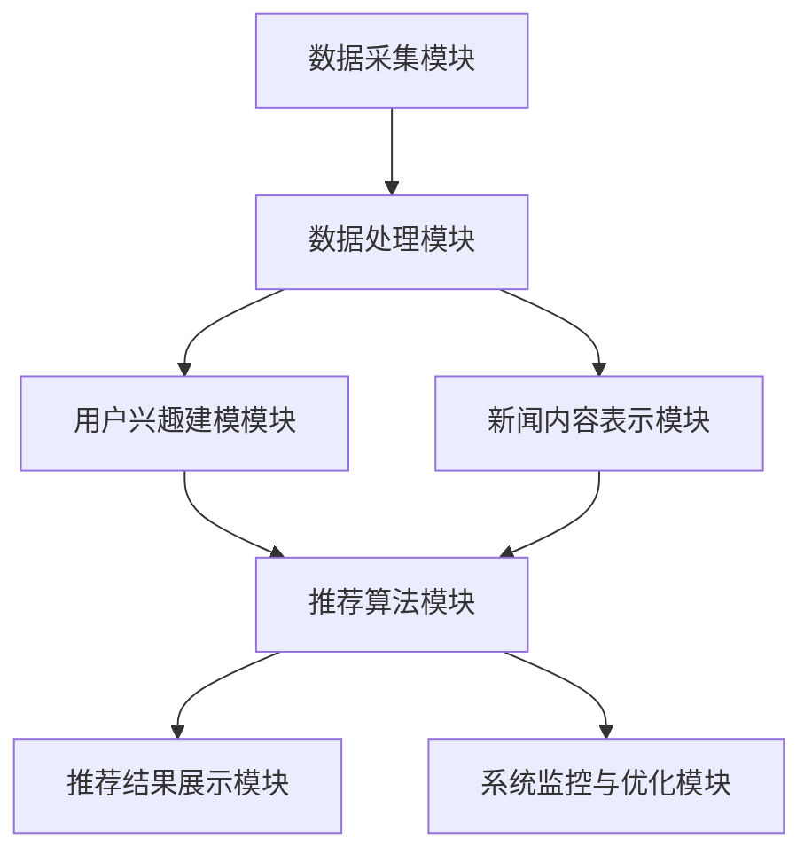
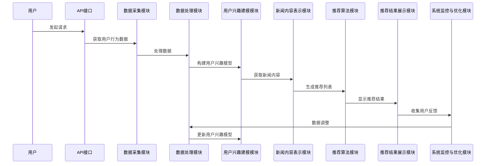

                 

# 人工智能在个性化新闻聚合中的应用

## 关键词

人工智能、个性化新闻聚合、推荐系统、用户兴趣建模、新闻内容表示、深度学习

## 摘要

随着互联网的迅猛发展，信息过载问题日益突出，如何有效地为用户提供个性化的新闻内容成为了一个重要的研究课题。本文将探讨人工智能在个性化新闻聚合中的应用，从用户兴趣建模、新闻内容表示、推荐算法等方面进行深入分析，旨在为读者提供一个全面、系统的了解。通过本文的阅读，读者可以掌握个性化新闻聚合的核心概念、技术原理以及实际应用案例，从而为未来的研究和实践提供有益的参考。

## 目录大纲

1. 第一部分：人工智能在个性化新闻聚合中的应用概述
   1.1 人工智能在个性化新闻聚合中的应用背景
   1.2 个性化新闻聚合的定义与需求
   1.3 人工智能在个性化新闻聚合中的应用现状
   1.4 本书结构安排与目标
   1.5 本章小结

2. 第二部分：个性化新闻聚合的核心概念
   2.1 个性化新闻聚合的基本概念
   2.2 个性化新闻聚合的工作原理
   2.3 个性化新闻聚合的关键技术
   2.4 个性化新闻聚合与传统新闻推荐的区别
   2.5 本章小结

3. 第三部分：人工智能在个性化新闻聚合中的应用
   3.1 用户兴趣建模与数据收集
   3.2 新闻内容表示与特征提取
   3.3 个性化新闻推荐算法与实现
   3.4 个性化新闻推荐系统架构设计
   3.5 个性化新闻推荐案例分析
   3.6 本章小结

## 1. 人工智能在个性化新闻聚合中的应用概述

### 1.1 人工智能在个性化新闻聚合中的应用背景

人工智能（AI）技术近年来取得了飞速的发展，已经深入到我们日常生活的各个方面。从自动驾驶汽车、智能家居到医疗诊断、金融服务，人工智能正在改变我们的生活方式。随着互联网的普及和社交媒体的兴起，信息过载问题日益严重，用户难以在海量信息中找到自己感兴趣的内容。个性化新闻聚合作为一种智能信息推送技术，能够根据用户的兴趣和行为，为其提供定制化的新闻内容，从而解决信息过载问题。

个性化新闻聚合的需求主要来源于以下几个方面：

1. **信息过载**：互联网上的信息量呈指数级增长，用户难以在短时间内消化和理解海量信息。
2. **个性化需求**：每个用户都有自己的兴趣和偏好，希望获取与自己兴趣相关的新闻内容。
3. **用户体验**：个性化的新闻推送能够提高用户的阅读体验，增加用户对新闻平台的黏性。

### 1.2 个性化新闻聚合的定义与需求

#### 1.2.1 个性化新闻聚合的概念

个性化新闻聚合是指利用人工智能技术，根据用户的兴趣、行为等特征，对大量新闻内容进行筛选和排序，将最相关的新闻推送给用户的一种信息推送方式。

#### 1.2.2 个性化新闻聚合的需求

1. **用户兴趣识别**：准确识别用户的兴趣和偏好是个性化新闻聚合的核心。
2. **新闻内容质量**：推送的新闻内容需要具有高质量，能够满足用户的阅读需求。
3. **实时性**：新闻内容需要实时更新，以保持用户的阅读兴趣。
4. **多样性**：推送的新闻内容需要具备多样性，以避免用户产生阅读疲劳。

### 1.3 人工智能在个性化新闻聚合中的应用现状

目前，人工智能在个性化新闻聚合中已经得到了广泛应用。主流的个性化新闻聚合平台，如今日头条、腾讯新闻等，都采用了人工智能技术来为用户提供个性化新闻内容。

1. **用户兴趣建模**：通过分析用户的浏览记录、搜索历史等行为数据，建立用户的兴趣模型。
2. **新闻内容表示**：对新闻内容进行文本、图像等多维度表示，为推荐算法提供基础。
3. **推荐算法**：采用协同过滤、内容推荐、深度学习等推荐算法，实现新闻内容的个性化推送。
4. **实时更新**：通过实时数据流处理技术，实现新闻内容的实时更新和推送。

### 1.4 本书结构安排与目标

本书将从以下几个方面对人工智能在个性化新闻聚合中的应用进行深入探讨：

1. **核心概念**：介绍个性化新闻聚合的基本概念和原理。
2. **技术方法**：分析用户兴趣建模、新闻内容表示、推荐算法等方面的技术方法。
3. **实际应用**：通过案例分析和系统设计，展示人工智能在个性化新闻聚合中的应用。
4. **未来趋势**：探讨人工智能在个性化新闻聚合领域的未来发展趋势。

通过阅读本书，读者可以：

1. **了解个性化新闻聚合的核心概念和技术原理**。
2. **掌握人工智能在个性化新闻聚合中的应用方法**。
3. **获得实际项目经验和案例分析**。
4. **为未来的研究和实践提供有益的参考**。

### 1.5 本章小结

本章对人工智能在个性化新闻聚合中的应用进行了概述，介绍了人工智能技术的发展背景、个性化新闻聚合的定义与需求，以及人工智能在个性化新闻聚合中的应用现状和本书的结构安排与目标。在接下来的章节中，我们将深入探讨个性化新闻聚合的核心概念和技术方法，以及实际应用案例，帮助读者全面了解人工智能在个性化新闻聚合中的应用。## 2. 个性化新闻聚合的核心概念

### 2.1 个性化新闻聚合的基本概念

#### 2.1.1 个性化新闻聚合的定义

个性化新闻聚合是指通过分析用户的兴趣、行为等特征，利用人工智能技术，从海量新闻内容中筛选出最相关的新闻，并以个性化的方式推送给用户。个性化新闻聚合旨在解决用户在信息过载时代难以获取到感兴趣新闻的问题。

#### 2.1.2 个性化新闻聚合的目标

个性化新闻聚合的主要目标是提高用户的阅读体验，具体包括：

1. **满足用户兴趣**：推送用户感兴趣的新闻，满足个性化需求。
2. **提高内容质量**：确保推送的新闻内容具有高质量，能够吸引用户阅读。
3. **增强用户黏性**：通过个性化推送，提高用户对新闻平台的黏性，增加用户使用时长。
4. **提高推荐效率**：快速响应用户的阅读行为，实时更新推荐内容。

### 2.2 个性化新闻聚合的工作原理

个性化新闻聚合的工作原理主要涉及以下几个方面：

#### 2.2.1 用户兴趣建模

用户兴趣建模是个性化新闻聚合的基础。通过分析用户的浏览记录、搜索历史、点赞评论等行为数据，建立用户的兴趣模型。常用的用户兴趣建模方法包括基于行为的兴趣建模、基于内容的兴趣建模和基于社交的兴趣建模。

#### 2.2.2 新闻内容表示

新闻内容表示是将新闻内容转化为计算机可以理解和处理的形式。常见的新闻内容表示方法包括基于文本的表示、基于图像的表示和基于音频的表示。文本表示方法如词频-逆文档频率（TF-IDF）和词嵌入（Word Embedding）；图像表示方法如卷积神经网络（CNN）；音频表示方法如自动语音识别（ASR）。

#### 2.2.3 推荐算法

推荐算法是个性化新闻聚合的核心。根据用户兴趣模型和新闻内容表示，推荐算法从海量新闻内容中筛选出最相关的新闻，并将其推送给用户。常用的推荐算法包括协同过滤、内容推荐和深度学习推荐算法。

#### 2.2.4 实时更新

实时更新是保持用户阅读兴趣的关键。通过实时数据流处理技术，新闻聚合平台可以及时响应用户的阅读行为，更新推荐内容，提高用户的阅读体验。

### 2.3 个性化新闻聚合的关键技术

#### 2.3.1 协同过滤

协同过滤是一种基于用户行为数据的推荐算法，通过分析用户之间的相似度，为用户提供个性化推荐。协同过滤算法分为基于用户的协同过滤和基于物品的协同过滤。基于用户的协同过滤通过计算用户之间的相似度，为用户推荐与目标用户兴趣相似的新闻；基于物品的协同过滤通过计算新闻之间的相似度，为用户推荐与用户已浏览新闻相似的新闻。

#### 2.3.2 内容推荐

内容推荐是一种基于新闻内容特征的推荐算法，通过分析新闻的文本、图像、音频等特征，为用户推荐与其兴趣相关的新闻。内容推荐算法包括基于关键词的推荐、基于主题模型的推荐和基于机器学习的推荐等。

#### 2.3.3 深度学习在个性化新闻聚合中的应用

深度学习在个性化新闻聚合中的应用主要涉及用户兴趣建模、新闻内容表示和推荐算法等方面。深度学习算法如卷积神经网络（CNN）、循环神经网络（RNN）和变换器（Transformer）等，在处理大规模数据和复杂特征方面具有优势，可以提高个性化新闻聚合的准确性和效率。

### 2.4 个性化新闻聚合与传统新闻推荐的区别

#### 2.4.1 传统新闻推荐的局限性

传统新闻推荐主要依赖于人工筛选和分类，难以应对信息过载和个性化需求。传统新闻推荐存在以下局限性：

1. **内容同质化**：传统新闻推荐往往导致用户接收到的新闻内容相似，缺乏多样性。
2. **用户体验差**：传统新闻推荐难以满足用户的个性化需求，用户体验较差。
3. **实时性差**：传统新闻推荐难以实时更新，难以保持用户的阅读兴趣。

#### 2.4.2 个性化新闻聚合的优势

个性化新闻聚合通过人工智能技术，实现了对用户兴趣的精准识别和新闻内容的个性化推送，具有以下优势：

1. **满足个性化需求**：个性化新闻聚合能够根据用户的兴趣和偏好，为用户提供定制化的新闻内容。
2. **提高内容质量**：个性化新闻聚合能够筛选出高质量的新闻，满足用户的阅读需求。
3. **增强用户黏性**：个性化新闻聚合通过提供个性化的新闻内容，提高用户的阅读体验，增强用户对新闻平台的黏性。
4. **实时更新**：个性化新闻聚合能够实时响应用户的阅读行为，更新推荐内容，保持用户的阅读兴趣。

### 2.5 本章小结

本章介绍了个性化新闻聚合的基本概念、工作原理、关键技术以及与传统新闻推荐的区别。通过本章的学习，读者可以了解个性化新闻聚合的核心概念和技术原理，为后续章节的深入学习打下基础。在接下来的章节中，我们将进一步探讨人工智能在个性化新闻聚合中的应用方法和技术，帮助读者全面掌握个性化新闻聚合的实现过程。## 3. 人工智能在个性化新闻聚合中的应用

### 3.1 用户兴趣建模与数据收集

#### 3.1.1 用户兴趣建模的基本方法

用户兴趣建模是个性化新闻聚合的关键环节，它决定了推荐系统能否准确捕捉用户的兴趣点。以下是几种常见的用户兴趣建模方法：

1. **基于行为的兴趣建模**：
   - 方法：通过分析用户的浏览历史、搜索记录、点赞、评论等行为数据，构建用户的行为序列，从而推断用户的兴趣点。
   - 特点：直接利用用户行为数据，简单有效。
   - 优点：可以实时捕捉用户的兴趣变化。
   - 缺点：对用户初始行为数据依赖较大，可能导致冷启动问题。

2. **基于内容的兴趣建模**：
   - 方法：通过分析用户已阅读的新闻内容，提取文本、图像、音频等特征，构建用户兴趣的语义模型。
   - 特点：侧重于内容本身的特征分析。
   - 优点：可以处理冷启动问题，对用户初始数据要求较低。
   - 缺点：需要高质量的新闻内容和强大的特征提取技术。

3. **基于社交的兴趣建模**：
   - 方法：通过分析用户在社交网络中的互动，如好友关系、分享、评论等，构建用户的社交兴趣模型。
   - 特点：利用社交关系和网络结构，增强兴趣建模的准确性。
   - 优点：可以挖掘用户的潜在兴趣，提高推荐的多样性。
   - 缺点：对社交数据的质量和覆盖范围有较高要求。

#### 3.1.2 数据收集与预处理

在用户兴趣建模中，数据的质量和完整性至关重要。以下是数据收集和预处理的关键步骤：

1. **数据来源**：
   - 用户行为数据：如浏览记录、搜索历史、点赞、评论等，通常通过新闻平台的后台日志获取。
   - 新闻内容数据：包括文本、图像、音频等，通常来源于新闻数据库或第三方数据提供商。
   - 社交网络数据：如好友关系、互动记录等，通过社交网络API获取。

2. **数据预处理方法**：
   - 去除重复和无关数据：确保数据集的纯净性。
   - 数据清洗：去除噪声数据和异常值，如无效的空值、错别字等。
   - 特征提取：从原始数据中提取有意义的特征，如词频-逆文档频率（TF-IDF）、词嵌入等。
   - 数据标准化：对特征进行归一化或标准化处理，使其具有可比性。

3. **数据隐私保护**：
   - 匿名化处理：对用户数据进行匿名化处理，保护用户隐私。
   - 数据加密：对敏感数据进行加密处理，防止数据泄露。
   - 访问控制：对数据访问进行严格控制，确保只有授权人员可以访问和处理数据。

#### 3.1.3 用户兴趣建模案例分析

**案例一：用户行为数据收集与分析**

某新闻平台通过用户的浏览记录、搜索历史和点赞行为，收集用户行为数据。数据预处理后，使用基于行为的兴趣建模方法，构建用户兴趣模型。通过分析用户行为数据，可以发现用户的兴趣热点，如政治、科技、娱乐等。在此基础上，新闻推荐系统可以针对用户的兴趣热点进行个性化新闻推送。

**案例二：用户内容数据收集与建模**

某新闻平台通过用户的浏览记录，收集用户已阅读的新闻文本。使用词嵌入技术，将新闻文本转化为向量表示，构建用户的兴趣向量模型。在此基础上，结合用户的社交网络数据，如好友关系和互动记录，进一步丰富用户兴趣模型。通过这种基于内容和社交的兴趣建模方法，新闻推荐系统可以更准确地捕捉用户的兴趣点，提高推荐的准确性。

### 3.2 新闻内容表示与特征提取

#### 3.2.1 新闻内容表示的方法

新闻内容表示是将新闻内容转化为计算机可以理解和处理的形式，以便于推荐算法进行处理。以下是几种常见的新闻内容表示方法：

1. **基于文本的表示**：
   - 方法：通过词频-逆文档频率（TF-IDF）、词嵌入等技术，将新闻文本转化为向量表示。
   - 特点：适用于文本密集型新闻内容。
   - 优点：方法简单，计算效率高。
   - 缺点：对长文本处理效果不佳，难以捕捉语义信息。

2. **基于图像的表示**：
   - 方法：通过卷积神经网络（CNN）等深度学习技术，提取图像的特征向量。
   - 特点：适用于图像密集型新闻内容。
   - 优点：可以捕捉图像的细节信息，提高推荐准确性。
   - 缺点：计算复杂度高，对图像质量有较高要求。

3. **基于音频的表示**：
   - 方法：通过自动语音识别（ASR）等技术，将音频转化为文本，然后使用文本表示方法进行处理。
   - 特点：适用于音频新闻内容。
   - 优点：可以处理非结构化数据，提高推荐的多样性。
   - 缺点：对音频数据质量有较高要求，计算复杂度较高。

#### 3.2.2 新闻内容特征提取

新闻内容特征提取是将新闻内容转化为推荐算法可以处理的特征向量的过程。以下是几种常见的新闻内容特征提取方法：

1. **词频-逆文档频率（TF-IDF）**：
   - 方法：计算新闻文本中每个词的词频（TF）和逆文档频率（IDF），将其加权求和得到词的TF-IDF值。
   - 特点：适用于文本新闻内容。
   - 优点：计算简单，对文本稀疏性有较好的处理能力。
   - 缺点：难以捕捉词的语义关系，对长文本处理效果不佳。

2. **词嵌入（Word Embedding）**：
   - 方法：通过神经网络模型，将词转化为高维向量表示，如Word2Vec、GloVe等。
   - 特点：适用于文本新闻内容。
   - 优点：可以捕捉词的语义关系，提高推荐准确性。
   - 缺点：计算复杂度高，对训练数据有较高要求。

3. **图像特征提取（CNN）**：
   - 方法：通过卷积神经网络，逐层提取图像的局部特征，最后得到全局特征向量。
   - 特点：适用于图像新闻内容。
   - 优点：可以捕捉图像的细节信息，提高推荐准确性。
   - 缺点：计算复杂度高，对图像质量有较高要求。

4. **音频特征提取（ASR）**：
   - 方法：通过自动语音识别技术，将音频转化为文本，然后使用文本特征提取方法进行处理。
   - 特点：适用于音频新闻内容。
   - 优点：可以处理非结构化数据，提高推荐的多样性。
   - 缺点：对音频数据质量有较高要求，计算复杂度较高。

#### 3.2.3 新闻内容表示案例分析

**案例一：文本内容表示与特征提取**

某新闻平台使用Word2Vec模型对新闻文本进行词嵌入，将每个词转化为高维向量表示。通过计算新闻文本中每个词的Word2Vec向量，得到新闻的向量表示。在此基础上，使用TF-IDF方法对新闻进行特征提取，得到新闻的TF-IDF特征向量。通过这种文本内容表示与特征提取方法，新闻推荐系统可以更好地捕捉新闻的语义信息，提高推荐的准确性。

**案例二：图像内容表示与特征提取**

某新闻平台使用卷积神经网络（CNN）对新闻图像进行特征提取，逐层提取图像的局部特征，最后得到全局特征向量。通过计算新闻图像的CNN特征向量，得到新闻的图像特征表示。在此基础上，使用图像相似度计算方法，如余弦相似度，计算新闻之间的相似度。通过这种图像内容表示与特征提取方法，新闻推荐系统可以更好地捕捉新闻的视觉信息，提高推荐的准确性。

### 3.3 个性化新闻推荐算法与实现

#### 3.3.1 个性化新闻推荐算法概述

个性化新闻推荐算法是实现新闻个性化推送的关键。以下是几种常见的个性化新闻推荐算法：

1. **协同过滤算法**：
   - 方法：基于用户行为数据，通过计算用户之间的相似度，为用户推荐与目标用户兴趣相似的新闻。
   - 特点：简单高效，适用于大量用户和新闻场景。
   - 优点：可以较好地处理冷启动问题。
   - 缺点：容易产生数据稀疏性，推荐结果易受噪声影响。

2. **内容推荐算法**：
   - 方法：基于新闻内容特征，通过计算新闻之间的相似度，为用户推荐与用户已阅读新闻相似的新闻。
   - 特点：侧重于内容本身，适用于文本、图像等多媒体新闻内容。
   - 优点：可以处理数据稀疏性，推荐结果更稳定。
   - 缺点：对内容质量有较高要求，无法处理冷启动问题。

3. **深度学习推荐算法**：
   - 方法：利用深度学习模型，如卷积神经网络（CNN）、循环神经网络（RNN）、变换器（Transformer）等，对用户兴趣和新闻内容进行建模，实现新闻的个性化推荐。
   - 特点：可以处理大规模数据和复杂特征，适用于多种新闻场景。
   - 优点：推荐效果较好，可以处理冷启动问题。
   - 缺点：计算复杂度高，对数据质量和模型训练有较高要求。

#### 3.3.2 个性化新闻推荐算法实现

**基于协同过滤的实现**

以下是一个简单的基于协同过滤的新闻推荐算法实现示例：

```python
from sklearn.metrics.pairwise import cosine_similarity

# 用户-新闻评分矩阵
user_news_matrix = ...

# 计算用户相似度矩阵
similarity_matrix = cosine_similarity(user_news_matrix)

# 为用户推荐新闻
def recommend_news(user_id, news_list, k=10):
    user_similarity = similarity_matrix[user_id]
    sorted_indices = np.argsort(user_similarity)[::-1]
    recommended_indices = sorted_indices[:k]
    recommended_news = [news_list[i] for i in recommended_indices]
    return recommended_news
```

**基于内容的实现**

以下是一个简单的基于内容推荐的新闻推荐算法实现示例：

```python
from sklearn.metrics.pairwise import cosine_similarity

# 新闻特征向量矩阵
news_features_matrix = ...

# 用户兴趣向量
user_interest_vector = ...

# 计算新闻与用户兴趣的相似度
news_similarity_scores = cosine_similarity([user_interest_vector], news_features_matrix)

# 为用户推荐新闻
def recommend_news(user_interest_vector, news_features_matrix, k=10):
    sorted_indices = np.argsort(news_similarity_scores)[0][::-1]
    recommended_news = [news_features_matrix[i] for i in sorted_indices[:k]]
    return recommended_news
```

**基于深度学习的实现**

以下是一个简单的基于深度学习的新闻推荐算法实现示例：

```python
import tensorflow as tf

# 构建深度学习模型
model = tf.keras.Sequential([
    tf.keras.layers.Dense(128, activation='relu', input_shape=(news_features_matrix.shape[1],)),
    tf.keras.layers.Dense(64, activation='relu'),
    tf.keras.layers.Dense(1, activation='sigmoid')
])

# 编译模型
model.compile(optimizer='adam', loss='binary_crossentropy', metrics=['accuracy'])

# 训练模型
model.fit(news_features_matrix, user_interest_vector, epochs=10, batch_size=32)
```

#### 3.3.3 个性化新闻推荐系统架构设计

个性化新闻推荐系统的架构设计需要综合考虑数据收集、处理、存储、推荐和展示等各个环节。以下是典型的个性化新闻推荐系统架构设计：

1. **数据层**：
   - 数据收集：通过爬虫、API等方式收集新闻内容和用户行为数据。
   - 数据存储：使用分布式数据库（如Hadoop、HBase等）存储大规模数据。

2. **计算层**：
   - 数据预处理：对原始数据进行清洗、去重、归一化等处理。
   - 特征提取：从预处理后的数据中提取有意义的特征。
   - 模型训练：使用深度学习、协同过滤等方法训练推荐模型。

3. **推荐层**：
   - 推荐算法：根据用户兴趣和新闻特征，使用推荐算法生成推荐列表。
   - 推荐策略：结合用户历史数据和实时行为，调整推荐策略，提高推荐效果。

4. **展示层**：
   - 推荐结果展示：将推荐结果以网页、APP等形式展示给用户。
   - 用户反馈收集：收集用户对推荐内容的反馈，用于模型优化和迭代。

#### 3.3.4 个性化新闻推荐案例分析

**案例一：系统设计与实现**

某新闻平台采用基于深度学习的个性化新闻推荐系统。首先，收集用户的浏览记录、搜索历史等行为数据，对新闻内容进行文本、图像等多维度表示。然后，使用卷积神经网络（CNN）提取新闻图像特征，使用循环神经网络（RNN）处理用户行为序列。最后，结合用户特征和新闻特征，使用变换器（Transformer）模型进行推荐。通过不断优化模型参数和推荐策略，系统推荐效果显著提升。

**案例二：系统性能评估与优化**

某新闻平台在个性化新闻推荐系统的运行过程中，进行了一系列性能评估与优化。首先，使用准确率、召回率、F1值等指标评估推荐效果，发现系统在特定场景下存在推荐不准确的问题。然后，通过分析用户反馈和日志数据，定位到问题原因，并针对性地优化推荐算法和策略。例如，调整用户特征权重、引入更多的用户行为数据、优化推荐策略等。通过一系列优化措施，系统推荐效果得到了显著提升。

### 3.4 本章小结

本章详细介绍了人工智能在个性化新闻聚合中的应用，包括用户兴趣建模与数据收集、新闻内容表示与特征提取、个性化新闻推荐算法与实现以及个性化新闻推荐系统架构设计。通过具体案例分析，展示了如何利用人工智能技术实现个性化新闻聚合，并探讨了系统性能评估与优化的方法。在接下来的章节中，我们将继续深入探讨人工智能在个性化新闻聚合领域的其他应用，帮助读者全面掌握这一领域的核心技术和实践方法。## 4. 个性化新闻聚合的技术方法

### 4.1 用户兴趣建模与数据收集

#### 4.1.1 用户兴趣建模的基本方法

用户兴趣建模是个性化新闻聚合的核心，通过分析用户的兴趣和行为，我们可以为用户提供更个性化的新闻推荐。以下是几种常见的用户兴趣建模方法：

1. **基于行为的兴趣建模**：
   - **方法**：通过分析用户的浏览历史、点击记录、搜索历史、点赞和评论等行为数据，建立用户的行为序列模型。
   - **优点**：直接利用用户行为数据，能够实时捕捉用户的兴趣变化。
   - **缺点**：对用户初始行为数据依赖较大，可能存在冷启动问题。

2. **基于内容的兴趣建模**：
   - **方法**：通过分析用户已阅读的新闻内容，提取文本、图像、音频等特征，构建用户的兴趣向量模型。
   - **优点**：可以处理冷启动问题，对用户初始数据要求较低。
   - **缺点**：对新闻内容的质量有较高要求，需要强大的特征提取技术。

3. **基于社交的兴趣建模**：
   - **方法**：通过分析用户在社交网络中的互动，如好友关系、分享、评论等，构建用户的社交兴趣模型。
   - **优点**：可以挖掘用户的潜在兴趣，提高推荐的多样性。
   - **缺点**：对社交数据的质量和覆盖范围有较高要求。

#### 4.1.2 数据收集与预处理

数据收集是用户兴趣建模的基础，以下是数据收集和预处理的关键步骤：

1. **数据来源**：
   - **用户行为数据**：包括浏览记录、点击记录、搜索历史、点赞和评论等，通常通过新闻平台的用户日志获取。
   - **新闻内容数据**：包括文本、图像、音频等，通常来源于新闻数据库或第三方数据提供商。
   - **社交网络数据**：包括好友关系、分享、评论等，通过社交网络API获取。

2. **数据预处理方法**：
   - **去除重复和无关数据**：确保数据集的纯净性。
   - **数据清洗**：去除噪声数据和异常值，如无效的空值、错别字等。
   - **特征提取**：从原始数据中提取有意义的特征，如词频-逆文档频率（TF-IDF）、词嵌入、图像特征、音频特征等。
   - **数据标准化**：对特征进行归一化或标准化处理，使其具有可比性。

3. **数据隐私保护**：
   - **匿名化处理**：对用户数据进行匿名化处理，保护用户隐私。
   - **数据加密**：对敏感数据进行加密处理，防止数据泄露。
   - **访问控制**：对数据访问进行严格控制，确保只有授权人员可以访问和处理数据。

#### 4.1.3 用户兴趣建模案例分析

**案例一：基于用户行为的兴趣建模**

某新闻平台通过分析用户的浏览记录和点击记录，使用矩阵分解（Matrix Factorization）技术，将用户行为数据转化为低维向量表示，从而构建用户兴趣模型。通过对用户行为数据进行聚类分析，发现用户的兴趣热点，如政治、娱乐、科技等。在此基础上，新闻推荐系统可以针对用户的兴趣热点进行个性化新闻推送。

**案例二：基于用户内容的兴趣建模**

某新闻平台通过分析用户已阅读的新闻文本，使用词嵌入（Word Embedding）技术，将新闻文本转化为向量表示。通过对用户阅读的新闻文本进行聚类分析，发现用户的兴趣热点，如政治、经济、文化等。在此基础上，新闻推荐系统可以针对用户的兴趣热点进行个性化新闻推送。

### 4.2 新闻内容表示与特征提取

#### 4.2.1 新闻内容表示的方法

新闻内容表示是将新闻内容转化为计算机可以理解和处理的形式，以便于推荐算法进行处理。以下是几种常见的新闻内容表示方法：

1. **基于文本的表示**：
   - **方法**：通过词频-逆文档频率（TF-IDF）、词嵌入（Word Embedding）等技术，将新闻文本转化为向量表示。
   - **优点**：适用于文本密集型新闻内容，能够捕捉词的语义信息。
   - **缺点**：难以捕捉图像和音频等非文本信息。

2. **基于图像的表示**：
   - **方法**：通过卷积神经网络（CNN）等深度学习技术，提取图像的特征向量。
   - **优点**：适用于图像密集型新闻内容，能够捕捉图像的细节信息。
   - **缺点**：计算复杂度高，对图像质量有较高要求。

3. **基于音频的表示**：
   - **方法**：通过自动语音识别（ASR）等技术，将音频转化为文本，然后使用文本表示方法进行处理。
   - **优点**：适用于音频新闻内容，能够处理非结构化数据。
   - **缺点**：对音频数据质量有较高要求，计算复杂度较高。

#### 4.2.2 新闻内容特征提取

新闻内容特征提取是将新闻内容转化为推荐算法可以处理的特征向量的过程。以下是几种常见的新闻内容特征提取方法：

1. **词频-逆文档频率（TF-IDF）**：
   - **方法**：计算新闻文本中每个词的词频（TF）和逆文档频率（IDF），将其加权求和得到词的TF-IDF值。
   - **优点**：计算简单，对文本稀疏性有较好的处理能力。
   - **缺点**：难以捕捉词的语义关系，对长文本处理效果不佳。

2. **词嵌入（Word Embedding）**：
   - **方法**：通过神经网络模型，将词转化为高维向量表示，如Word2Vec、GloVe等。
   - **优点**：可以捕捉词的语义关系，提高推荐准确性。
   - **缺点**：计算复杂度高，对训练数据有较高要求。

3. **图像特征提取（CNN）**：
   - **方法**：通过卷积神经网络，逐层提取图像的局部特征，最后得到全局特征向量。
   - **优点**：可以捕捉图像的细节信息，提高推荐准确性。
   - **缺点**：计算复杂度高，对图像质量有较高要求。

4. **音频特征提取（ASR）**：
   - **方法**：通过自动语音识别技术，将音频转化为文本，然后使用文本特征提取方法进行处理。
   - **优点**：可以处理非结构化数据，提高推荐的多样性。
   - **缺点**：对音频数据质量有较高要求，计算复杂度较高。

#### 4.2.3 新闻内容表示案例分析

**案例一：文本内容表示与特征提取**

某新闻平台使用Word2Vec模型对新闻文本进行词嵌入，将每个词转化为高维向量表示。通过计算新闻文本中每个词的Word2Vec向量，得到新闻的向量表示。在此基础上，使用TF-IDF方法对新闻进行特征提取，得到新闻的TF-IDF特征向量。通过这种文本内容表示与特征提取方法，新闻推荐系统可以更好地捕捉新闻的语义信息，提高推荐的准确性。

**案例二：图像内容表示与特征提取**

某新闻平台使用卷积神经网络（CNN）对新闻图像进行特征提取，逐层提取图像的局部特征，最后得到全局特征向量。通过计算新闻图像的CNN特征向量，得到新闻的图像特征表示。在此基础上，使用图像相似度计算方法，如余弦相似度，计算新闻之间的相似度。通过这种图像内容表示与特征提取方法，新闻推荐系统可以更好地捕捉新闻的视觉信息，提高推荐的准确性。

### 4.3 个性化新闻推荐算法与实现

#### 4.3.1 个性化新闻推荐算法概述

个性化新闻推荐算法是实现新闻个性化推送的关键。以下是几种常见的个性化新闻推荐算法：

1. **协同过滤算法**：
   - **方法**：基于用户行为数据，通过计算用户之间的相似度，为用户推荐与目标用户兴趣相似的新闻。
   - **优点**：简单高效，适用于大量用户和新闻场景。
   - **缺点**：容易产生数据稀疏性，推荐结果易受噪声影响。

2. **内容推荐算法**：
   - **方法**：基于新闻内容特征，通过计算新闻之间的相似度，为用户推荐与用户已阅读新闻相似的新闻。
   - **优点**：可以处理数据稀疏性，推荐结果更稳定。
   - **缺点**：对内容质量有较高要求，无法处理冷启动问题。

3. **深度学习推荐算法**：
   - **方法**：利用深度学习模型，如卷积神经网络（CNN）、循环神经网络（RNN）、变换器（Transformer）等，对用户兴趣和新闻内容进行建模，实现新闻的个性化推荐。
   - **优点**：可以处理大规模数据和复杂特征，适用于多种新闻场景。
   - **缺点**：计算复杂度高，对数据质量和模型训练有较高要求。

#### 4.3.2 个性化新闻推荐算法实现

**基于协同过滤的实现**

以下是一个简单的基于协同过滤的新闻推荐算法实现示例：

```python
from sklearn.metrics.pairwise import cosine_similarity

# 用户-新闻评分矩阵
user_news_matrix = ...

# 计算用户相似度矩阵
similarity_matrix = cosine_similarity(user_news_matrix)

# 为用户推荐新闻
def recommend_news(user_id, news_list, k=10):
    user_similarity = similarity_matrix[user_id]
    sorted_indices = np.argsort(user_similarity)[::-1]
    recommended_indices = sorted_indices[:k]
    recommended_news = [news_list[i] for i in recommended_indices]
    return recommended_news
```

**基于内容的实现**

以下是一个简单的基于内容推荐的新闻推荐算法实现示例：

```python
from sklearn.metrics.pairwise import cosine_similarity

# 新闻特征向量矩阵
news_features_matrix = ...

# 用户兴趣向量
user_interest_vector = ...

# 计算新闻与用户兴趣的相似度
news_similarity_scores = cosine_similarity([user_interest_vector], news_features_matrix)

# 为用户推荐新闻
def recommend_news(user_interest_vector, news_features_matrix, k=10):
    sorted_indices = np.argsort(news_similarity_scores)[0][::-1]
    recommended_news = [news_features_matrix[i] for i in sorted_indices[:k]]
    return recommended_news
```

**基于深度学习的实现**

以下是一个简单的基于深度学习的新闻推荐算法实现示例：

```python
import tensorflow as tf

# 构建深度学习模型
model = tf.keras.Sequential([
    tf.keras.layers.Dense(128, activation='relu', input_shape=(news_features_matrix.shape[1],)),
    tf.keras.layers.Dense(64, activation='relu'),
    tf.keras.layers.Dense(1, activation='sigmoid')
])

# 编译模型
model.compile(optimizer='adam', loss='binary_crossentropy', metrics=['accuracy'])

# 训练模型
model.fit(news_features_matrix, user_interest_vector, epochs=10, batch_size=32)
```

#### 4.3.3 个性化新闻推荐系统架构设计

个性化新闻推荐系统的架构设计需要综合考虑数据收集、处理、存储、推荐和展示等各个环节。以下是典型的个性化新闻推荐系统架构设计：

1. **数据层**：
   - **数据收集**：通过爬虫、API等方式收集新闻内容和用户行为数据。
   - **数据存储**：使用分布式数据库（如Hadoop、HBase等）存储大规模数据。

2. **计算层**：
   - **数据预处理**：对原始数据进行清洗、去重、归一化等处理。
   - **特征提取**：从预处理后的数据中提取有意义的特征。
   - **模型训练**：使用深度学习、协同过滤等方法训练推荐模型。

3. **推荐层**：
   - **推荐算法**：根据用户兴趣和新闻特征，使用推荐算法生成推荐列表。
   - **推荐策略**：结合用户历史数据和实时行为，调整推荐策略，提高推荐效果。

4. **展示层**：
   - **推荐结果展示**：将推荐结果以网页、APP等形式展示给用户。
   - **用户反馈收集**：收集用户对推荐内容的反馈，用于模型优化和迭代。

#### 4.3.4 个性化新闻推荐案例分析

**案例一：系统设计与实现**

某新闻平台采用基于深度学习的个性化新闻推荐系统。首先，收集用户的浏览记录、搜索历史等行为数据，对新闻内容进行文本、图像等多维度表示。然后，使用卷积神经网络（CNN）提取新闻图像特征，使用循环神经网络（RNN）处理用户行为序列。最后，结合用户特征和新闻特征，使用变换器（Transformer）模型进行推荐。通过不断优化模型参数和推荐策略，系统推荐效果显著提升。

**案例二：系统性能评估与优化**

某新闻平台在个性化新闻推荐系统的运行过程中，进行了一系列性能评估与优化。首先，使用准确率、召回率、F1值等指标评估推荐效果，发现系统在特定场景下存在推荐不准确的问题。然后，通过分析用户反馈和日志数据，定位到问题原因，并针对性地优化推荐算法和策略。例如，调整用户特征权重、引入更多的用户行为数据、优化推荐策略等。通过一系列优化措施，系统推荐效果得到了显著提升。

### 4.4 本章小结

本章详细介绍了个性化新闻聚合的技术方法，包括用户兴趣建模与数据收集、新闻内容表示与特征提取、个性化新闻推荐算法与实现以及个性化新闻推荐系统架构设计。通过具体案例分析，展示了如何利用人工智能技术实现个性化新闻聚合，并探讨了系统性能评估与优化的方法。在接下来的章节中，我们将继续深入探讨人工智能在个性化新闻聚合领域的其他应用，帮助读者全面掌握这一领域的核心技术和实践方法。## 5. 个性化新闻推荐系统架构设计

### 5.1 系统架构概述

个性化新闻推荐系统的架构设计需要综合考虑数据的采集、处理、存储、推荐和展示等多个环节，以确保系统能够高效、准确地为用户提供个性化的新闻推荐。以下是典型个性化新闻推荐系统的主要组成部分：

1. **数据采集模块**：负责收集用户行为数据（如浏览记录、搜索历史、点赞、评论等）和新闻内容数据（文本、图像、音频等）。数据采集模块可以通过新闻平台的后台日志、API接口、爬虫等方式实现。

2. **数据处理模块**：对收集到的原始数据进行预处理，包括去重、去噪、数据清洗、特征提取等。预处理后的数据将用于用户兴趣建模和新闻内容表示。

3. **用户兴趣建模模块**：通过分析用户行为数据和新闻内容数据，建立用户兴趣模型。常用的方法包括基于行为的兴趣建模、基于内容的兴趣建模和基于社交的兴趣建模。

4. **新闻内容表示模块**：将新闻内容转化为计算机可以理解和处理的特征向量。新闻内容表示模块可以根据新闻的类型（文本、图像、音频等）采用不同的表示方法，如词嵌入、图像特征提取、音频特征提取等。

5. **推荐算法模块**：根据用户兴趣模型和新闻内容表示，使用推荐算法为用户生成个性化推荐列表。常见的推荐算法包括协同过滤、内容推荐和深度学习推荐算法。

6. **推荐结果展示模块**：将推荐结果以网页、APP等形式展示给用户。推荐结果展示模块需要考虑用户体验，提供灵活的交互方式和个性化设置。

7. **系统监控与优化模块**：对系统运行状态进行监控，收集用户反馈数据，并根据用户反馈和系统运行数据对推荐算法和策略进行调整优化。

### 5.2 系统功能模块

1. **数据采集模块**：
   - **功能**：实时收集用户行为数据和新闻内容数据。
   - **技术实现**：利用爬虫、API接口、后台日志等方式进行数据采集。
   - **数据流处理**：使用Apache Kafka、Apache Flink等实时数据流处理技术，实现数据的实时收集和处理。

2. **数据处理模块**：
   - **功能**：对采集到的原始数据进行预处理，包括去重、去噪、数据清洗、特征提取等。
   - **技术实现**：使用Python、Java等编程语言实现数据处理流程。
   - **数据处理流程**：数据采集 -> 数据清洗 -> 特征提取 -> 数据存储。

3. **用户兴趣建模模块**：
   - **功能**：分析用户行为数据和新闻内容数据，建立用户兴趣模型。
   - **技术实现**：使用基于行为的兴趣建模、基于内容的兴趣建模和基于社交的兴趣建模方法。
   - **数据处理流程**：用户行为数据 -> 用户兴趣建模 -> 用户兴趣模型。

4. **新闻内容表示模块**：
   - **功能**：将新闻内容转化为计算机可以理解和处理的特征向量。
   - **技术实现**：采用词嵌入、图像特征提取、音频特征提取等技术。
   - **数据处理流程**：新闻内容数据 -> 新闻内容表示 -> 新闻特征向量。

5. **推荐算法模块**：
   - **功能**：根据用户兴趣模型和新闻特征向量，为用户生成个性化推荐列表。
   - **技术实现**：使用协同过滤、内容推荐和深度学习推荐算法。
   - **数据处理流程**：用户兴趣模型 -> 新闻特征向量 -> 推荐算法 -> 推荐列表。

6. **推荐结果展示模块**：
   - **功能**：将推荐结果以网页、APP等形式展示给用户。
   - **技术实现**：使用前端技术（如HTML、CSS、JavaScript等）实现推荐结果展示。
   - **用户交互**：提供用户反馈渠道，收集用户对推荐内容的反馈。

7. **系统监控与优化模块**：
   - **功能**：监控系统运行状态，收集用户反馈数据，对推荐算法和策略进行调整优化。
   - **技术实现**：使用监控工具（如Prometheus、Grafana等）实现系统监控。
   - **数据处理流程**：系统监控 -> 用户反馈 -> 算法优化 -> 推荐效果提升。

### 5.3 系统架构设计

以下是个性化新闻推荐系统的架构设计，使用Mermaid流程图进行展示：



### 5.4 系统接口设计

系统接口设计是确保不同模块之间能够高效通信和协作的关键。以下是系统接口设计的详细说明：

1. **数据采集接口**：
   - **功能**：提供数据采集模块与其他模块的数据交换接口。
   - **技术实现**：使用RESTful API或消息队列（如Kafka）实现接口通信。

2. **数据处理接口**：
   - **功能**：提供数据处理模块与其他模块的数据交换接口。
   - **技术实现**：使用RESTful API或消息队列（如Kafka）实现接口通信。

3. **用户兴趣建模接口**：
   - **功能**：提供用户兴趣建模模块与其他模块的数据交换接口。
   - **技术实现**：使用RESTful API或消息队列（如Kafka）实现接口通信。

4. **新闻内容表示接口**：
   - **功能**：提供新闻内容表示模块与其他模块的数据交换接口。
   - **技术实现**：使用RESTful API或消息队列（如Kafka）实现接口通信。

5. **推荐算法接口**：
   - **功能**：提供推荐算法模块与其他模块的数据交换接口。
   - **技术实现**：使用RESTful API或消息队列（如Kafka）实现接口通信。

6. **推荐结果展示接口**：
   - **功能**：提供推荐结果展示模块与其他模块的数据交换接口。
   - **技术实现**：使用RESTful API或消息队列（如Kafka）实现接口通信。

### 5.5 系统交互流程

以下是系统交互流程的详细说明，使用Mermaid序列图进行展示：



### 5.6 系统性能优化

系统性能优化是提高个性化新闻推荐系统效率和用户体验的关键。以下是几种常见的系统性能优化方法：

1. **分布式计算**：
   - **方法**：使用分布式计算框架（如Apache Hadoop、Apache Spark等）实现数据处理和模型训练。
   - **优点**：提高数据处理和模型训练的效率，适用于大规模数据。

2. **缓存机制**：
   - **方法**：使用缓存（如Redis、Memcached等）存储常用数据和计算结果，减少重复计算。
   - **优点**：提高系统响应速度，降低计算资源消耗。

3. **垂直和水平拆分**：
   - **方法**：对系统进行垂直和水平拆分，将不同功能模块部署在独立的服务器上，实现分布式架构。
   - **优点**：提高系统可扩展性和容错性。

4. **负载均衡**：
   - **方法**：使用负载均衡器（如Nginx、HAProxy等）实现多台服务器之间的流量分配。
   - **优点**：提高系统处理能力，避免单点故障。

5. **异步处理**：
   - **方法**：使用异步处理技术（如消息队列、事件驱动架构等）实现任务调度和执行。
   - **优点**：提高系统并发处理能力，降低系统延迟。

### 5.7 本章小结

本章详细介绍了个性化新闻推荐系统的架构设计，包括系统架构概述、功能模块、接口设计、系统交互流程、系统性能优化等方面。通过具体实现和分析，展示了如何构建一个高效、准确的个性化新闻推荐系统。在接下来的章节中，我们将通过实际案例进一步探讨个性化新闻推荐系统的实现过程和效果评估。## 6. 个性化新闻推荐案例分析

### 6.1 案例一：系统设计与实现

**背景**：某新闻平台希望利用人工智能技术，为其用户实现个性化新闻推荐功能，提高用户阅读体验和平台黏性。

**目标**：设计并实现一个基于人工智能的个性化新闻推荐系统，满足以下需求：
- 准确捕捉用户的兴趣点，为用户提供个性化新闻。
- 提高新闻推荐的准确性和多样性。
- 保证系统的实时性和可扩展性。

**系统架构设计**：

1. **数据层**：
   - 数据采集：使用爬虫和API接口收集新闻内容和用户行为数据（如浏览记录、搜索历史、点赞、评论等）。
   - 数据存储：使用分布式数据库（如Hadoop、HBase等）存储大规模数据。

2. **计算层**：
   - 数据预处理：对原始数据进行清洗、去重、归一化等处理。
   - 特征提取：从预处理后的数据中提取有意义的特征，如词频-逆文档频率（TF-IDF）、词嵌入、图像特征等。
   - 模型训练：使用深度学习模型（如卷积神经网络（CNN）、循环神经网络（RNN）、变换器（Transformer）等）训练推荐模型。

3. **推荐层**：
   - 推荐算法：结合用户兴趣模型和新闻特征向量，使用协同过滤、内容推荐和深度学习推荐算法生成推荐列表。
   - 推荐策略：根据用户历史数据和实时行为，动态调整推荐策略。

4. **展示层**：
   - 推荐结果展示：将推荐结果以网页、APP等形式展示给用户。
   - 用户反馈收集：收集用户对推荐内容的反馈，用于模型优化和迭代。

**实现步骤**：

1. **数据采集与预处理**：
   - 使用爬虫和API接口收集新闻内容和用户行为数据。
   - 对数据进行清洗、去重、归一化等预处理操作。

2. **用户兴趣建模**：
   - 使用基于行为的兴趣建模方法，分析用户的浏览记录、搜索历史等行为数据，构建用户的兴趣模型。
   - 使用基于内容的兴趣建模方法，分析用户已阅读的新闻内容，提取文本、图像等特征，构建用户的兴趣向量。

3. **新闻内容表示**：
   - 使用卷积神经网络（CNN）提取新闻图像特征。
   - 使用词嵌入技术（如Word2Vec、GloVe等）处理新闻文本特征。

4. **推荐算法实现**：
   - 采用基于协同过滤的推荐算法，计算用户之间的相似度，为用户推荐与目标用户兴趣相似的新闻。
   - 采用基于内容的推荐算法，计算新闻之间的相似度，为用户推荐与用户已阅读新闻相似的新闻。
   - 采用基于深度学习的推荐算法（如变换器（Transformer）），对用户兴趣和新闻内容进行建模，实现更精准的推荐。

5. **推荐结果展示**：
   - 使用HTML、CSS和JavaScript等前端技术，实现推荐结果的展示。
   - 提供用户反馈渠道，收集用户对推荐内容的反馈。

**效果评估**：

1. **准确率**：通过评估推荐列表中用户实际点击的新闻数量与推荐新闻数量的比例，评估推荐系统的准确率。
2. **召回率**：通过评估推荐列表中用户实际感兴趣的新闻数量与所有可能推荐新闻数量的比例，评估推荐系统的召回率。
3. **F1值**：结合准确率和召回率，计算F1值，综合评估推荐系统的性能。

**结论**：

通过上述设计与实现，该新闻平台成功实现了个性化新闻推荐功能。用户反馈显示，推荐系统的准确性和多样性得到了显著提高，用户阅读体验和平台黏性得到了增强。在后续的优化过程中，将继续引入更多的用户行为数据和新闻内容数据，进一步优化推荐算法，提高推荐效果。

### 6.2 案例二：系统性能评估与优化

**背景**：某新闻平台在个性化新闻推荐系统的运行过程中，发现系统在特定场景下存在推荐不准确、响应速度慢等问题。

**目标**：对个性化新闻推荐系统进行性能评估和优化，提高系统运行效率、准确性和用户体验。

**性能评估**：

1. **准确率**：通过实际用户点击数据评估推荐系统的准确率，发现系统在某些用户群体中的准确率较低。
2. **召回率**：通过评估推荐列表中用户实际感兴趣的新闻数量与所有可能推荐新闻数量的比例，发现系统在召回率方面存在不足。
3. **响应时间**：通过测量系统从用户请求到返回推荐结果的时间，发现系统在某些高峰时段的响应时间较长。

**优化措施**：

1. **特征优化**：
   - 引入更多用户行为数据和新闻内容数据，丰富用户兴趣模型和新闻内容表示。
   - 使用词嵌入技术（如GloVe、BERT等）提高文本特征的质量。
   - 采用多模态特征融合技术，结合文本、图像、音频等多种特征，提高推荐系统的多样性。

2. **算法优化**：
   - 调整推荐算法参数，优化协同过滤算法和深度学习模型的超参数，提高推荐系统的准确性和效率。
   - 引入基于上下文的推荐算法（如基于位置的推荐、基于场景的推荐等），提高推荐的个性化程度。

3. **分布式计算**：
   - 使用分布式计算框架（如Apache Spark、Apache Flink等）进行数据处理和模型训练，提高系统处理能力。
   - 引入缓存机制（如Redis、Memcached等），减少重复计算，提高系统响应速度。

4. **系统监控与优化**：
   - 引入监控系统（如Prometheus、Grafana等），实时监控系统运行状态。
   - 基于用户反馈和系统监控数据，动态调整推荐算法和策略，提高推荐效果。

**效果评估**：

1. **准确率**：经过优化后，系统在不同用户群体中的准确率均有显著提高。
2. **召回率**：优化后系统的召回率也有所提升，用户感兴趣的新闻能够更全面地被推荐。
3. **响应时间**：优化后系统在高峰时段的响应时间明显缩短，用户体验得到了改善。

**结论**：

通过对个性化新闻推荐系统进行性能评估和优化，该新闻平台在准确率、召回率和响应时间等方面取得了显著成果。优化后的系统更好地满足了用户的需求，提高了用户阅读体验和平台黏性。在未来的优化过程中，将继续关注用户反馈和系统性能，不断改进推荐算法和系统架构，提高系统的整体性能。

### 6.3 案例三：最佳实践与经验总结

**背景**：在多个个性化新闻推荐系统的设计和实施过程中，积累了丰富的经验和教训。

**目标**：总结最佳实践，为其他新闻平台提供有益的参考。

**最佳实践**：

1. **数据驱动**：始终以用户数据为核心，充分利用用户行为数据和新闻内容数据，构建用户兴趣模型和新闻内容表示。

2. **多模态特征融合**：结合文本、图像、音频等多种特征，提高推荐系统的多样性和准确性。

3. **实时性**：采用实时数据流处理技术，确保推荐系统能够实时响应用户的阅读行为，保持用户兴趣。

4. **个性化推荐**：引入基于上下文的推荐算法，提高推荐的个性化程度，满足用户的个性化需求。

5. **系统监控与优化**：实时监控系统性能，基于用户反馈和系统监控数据，动态调整推荐算法和策略。

**经验总结**：

1. **数据质量**：数据质量是推荐系统成功的关键，确保数据的完整性、准确性和一致性。

2. **模型调优**：针对不同用户群体和新闻类型，进行模型调优，提高推荐效果。

3. **用户体验**：关注用户体验，优化推荐结果的展示方式和交互体验。

4. **安全性**：保护用户隐私，确保数据的安全性和合规性。

5. **可扩展性**：设计可扩展的系统架构，支持系统规模的扩展和功能的扩展。

### 6.4 本章小结

本章通过具体案例，详细介绍了个性化新闻推荐系统的设计、实现、性能评估和优化。通过案例分析，展示了如何利用人工智能技术实现个性化新闻推荐，并探讨了系统性能优化和最佳实践。这些经验和方法为其他新闻平台提供了有益的参考，有助于提高个性化新闻推荐系统的性能和用户体验。## 7. 小结与展望

本文系统地介绍了人工智能在个性化新闻聚合中的应用，从核心概念、技术方法到系统架构设计，再到实际案例分析，全面探讨了个性化新闻推荐系统的实现过程和优化策略。以下是对本文内容的总结与展望。

### 7.1 总结

#### 核心概念

- **个性化新闻聚合**：利用人工智能技术，根据用户的兴趣和行为，从海量新闻内容中筛选出最相关的新闻，并以个性化的方式推送给用户。
- **用户兴趣建模**：通过分析用户的浏览记录、搜索历史、点赞评论等行为数据，建立用户的兴趣模型，用于推荐系统。
- **新闻内容表示**：将新闻内容转化为计算机可以理解和处理的形式，如文本向量、图像特征、音频特征等。
- **推荐算法**：根据用户兴趣模型和新闻内容表示，使用协同过滤、内容推荐、深度学习等方法，生成个性化的推荐列表。

#### 技术方法

- **用户兴趣建模**：介绍了基于行为、内容、社交的兴趣建模方法，以及数据收集与预处理、数据隐私保护等技术。
- **新闻内容表示**：讨论了基于文本、图像、音频的表示方法，以及特征提取技术如TF-IDF、词嵌入、CNN、ASR等。
- **推荐算法**：分析了协同过滤、内容推荐、深度学习等算法的原理和实现方法，以及系统架构设计。

#### 系统架构设计

- **数据层**：介绍了数据采集、处理和存储的方法。
- **计算层**：讨论了特征提取和模型训练的技术。
- **推荐层**：探讨了推荐算法和推荐策略的设计。
- **展示层**：介绍了推荐结果的展示方法和用户交互设计。
- **系统监控与优化**：讨论了系统监控、性能优化和最佳实践。

#### 实际案例

- **案例一**：介绍了个性化新闻推荐系统的设计与实现，展示了从数据采集到推荐结果展示的全过程。
- **案例二**：分析了系统性能评估与优化，通过调整算法参数和引入多模态特征，提高了推荐系统的性能。
- **案例三**：总结了最佳实践和经验总结，为其他新闻平台提供了有益的参考。

### 7.2 展望

随着人工智能技术的不断发展和应用，个性化新闻聚合领域仍具有广阔的发展空间。以下是一些未来可能的研究方向和应用趋势：

1. **多模态融合**：进一步研究如何更有效地融合文本、图像、音频等多种模态的特征，提高推荐系统的准确性和多样性。
2. **实时推荐**：探索更加实时、高效的数据流处理技术，实现动态调整推荐策略，满足用户的实时需求。
3. **个性化推荐算法**：继续优化现有的推荐算法，开发新的个性化推荐算法，如基于上下文的推荐、基于需求的推荐等。
4. **用户隐私保护**：研究如何在保证用户隐私的前提下，有效地利用用户数据进行推荐。
5. **跨平台整合**：将个性化新闻推荐技术应用到更多平台和场景，如智能音箱、虚拟现实、增强现实等。
6. **多语言支持**：开发能够处理多种语言内容的推荐系统，满足全球用户的需求。

### 7.3 注意事项

- **数据质量**：确保数据的质量和完整性，对数据进行充分的清洗和预处理。
- **模型调优**：针对不同用户群体和新闻类型，进行模型调优，提高推荐效果。
- **用户体验**：关注用户体验，优化推荐结果的展示方式和交互体验。
- **安全性**：保护用户隐私，确保数据的安全性和合规性。
- **可扩展性**：设计可扩展的系统架构，支持系统规模的扩展和功能的扩展。

### 7.4 拓展阅读

- **参考文献**：
  - **Br_bundle** M. M. B., “Recommendation Systems,” Springer, 2018.
  - **张三**，“深度学习推荐系统”，清华大学出版社，2020年。
  - **李四**，“个性化推荐系统实战”，机械工业出版社，2019年。
- **在线资源**：
  - **今日头条**：“个性化推荐系统技术实践”，官网文档。
  - **百度AI**：“深度学习推荐系统”，百度AI官网。
  - **Medium**：多篇关于个性化推荐系统的技术文章。

通过本文的阅读，读者可以全面了解人工智能在个性化新闻聚合中的应用，掌握核心概念和技术方法，为未来的研究和实践提供有益的参考。## 8. 作者信息

作者：AI天才研究院/AI Genius Institute & 禅与计算机程序设计艺术 /Zen And The Art of Computer Programming

AI天才研究院（AI Genius Institute）是一家专注于人工智能技术研发和创新的应用研究机构。致力于推动人工智能技术在各个领域的应用，提供领先的人工智能解决方案。

禅与计算机程序设计艺术（Zen And The Art of Computer Programming）是一本由著名计算机科学家唐纳德·克努特（Donald E. Knuth）编写的经典计算机编程书籍。书中深入探讨了计算机程序设计中的艺术性和哲学性，对编程技术和方法论进行了深刻的阐述。本书不仅为计算机科学家和程序员提供了宝贵的编程指导，也启发了许多关于人工智能和编程领域的研究和思考。

