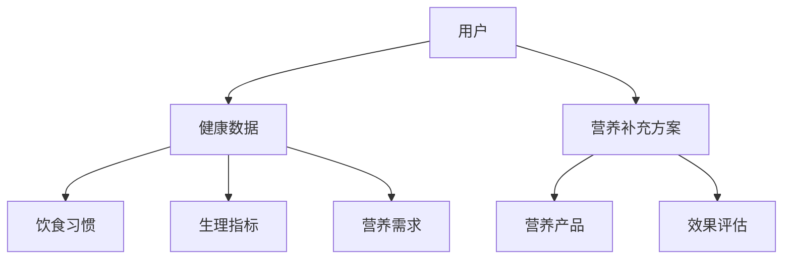
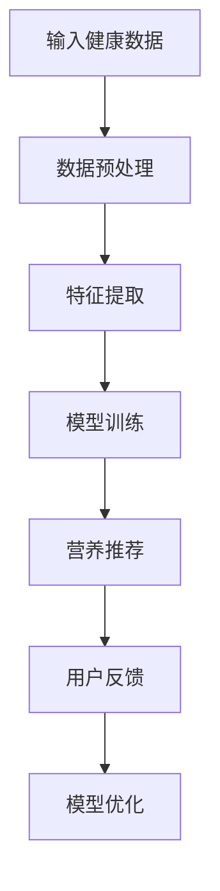
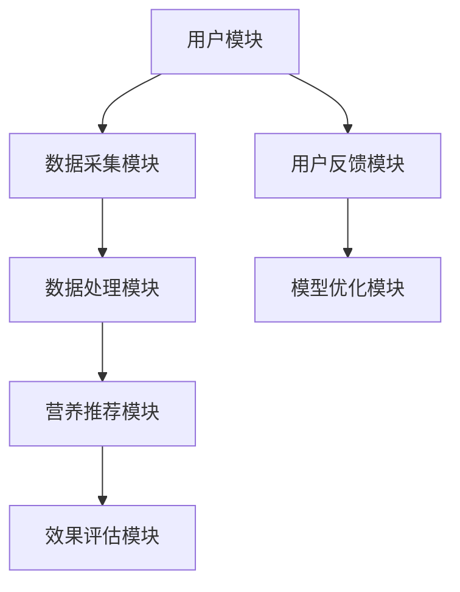
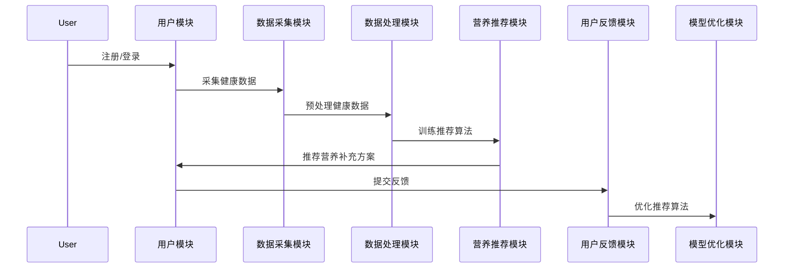

                 

### 《人工智能在个性化营养补充中的应用》目录大纲

---

## 引言

### 1.1 问题背景

#### 1.1.1 个性化营养补充的必要性

随着社会的不断发展，人们对于健康和生活质量的要求越来越高。传统的营养补充方式往往无法满足个体差异化的需求，而个性化营养补充作为一种新型的健康理念，逐渐引起了广泛关注。个性化营养补充的核心在于根据个体的生理、病理和生活习惯等特点，为其量身定制适合的营养补充方案。

#### 1.1.2 人工智能技术发展现状

人工智能（AI）作为当前科技领域的前沿技术，其发展速度之快，应用范围之广，已经超出了许多人的预期。从智能语音助手到自动驾驶，从医疗诊断到金融分析，人工智能技术已经深刻地改变了我们的生活方式和工作方式。随着算法的进步和计算能力的提升，人工智能技术在个性化营养补充领域的应用潜力也越来越大。

#### 1.1.3 人工智能与个性化营养补充的结合

人工智能技术为个性化营养补充提供了新的可能性。通过收集和分析大量的健康数据，人工智能可以精准地识别个体的营养需求，为其推荐合适的营养补充方案。同时，人工智能还可以对营养补充的效果进行实时评估，为个体提供个性化的营养调整建议。

### 1.2 问题描述

#### 1.2.1 营养补充存在的问题

当前的营养补充存在以下问题：

- **个性化不足**：传统营养补充方案往往缺乏针对性，无法满足个体的差异化需求。
- **效果评估困难**：营养补充的效果受多种因素影响，难以进行准确的评估。
- **数据采集和处理不足**：个性化营养补充需要大量的健康数据支持，但数据采集和处理存在诸多挑战。

#### 1.2.2 人工智能在营养补充中的应用潜力

人工智能技术在营养补充中的应用潜力主要体现在以下几个方面：

- **个性化推荐**：通过分析个体的健康数据，人工智能可以为其推荐最适合的营养补充方案。
- **效果评估**：人工智能可以对营养补充的效果进行实时监控和评估，为个体提供及时的调整建议。
- **健康数据管理**：人工智能可以高效地管理和分析大量的健康数据，为个性化营养补充提供可靠的数据支持。

### 1.3 人工智能与个性化营养补充

#### 1.3.1 人工智能技术概述

人工智能是一种模拟人类智能的技术，通过算法和计算能力，使计算机系统能够自主学习、推理和解决问题。人工智能技术主要包括机器学习、深度学习、自然语言处理等。

#### 1.3.2 个性化营养补充的关键技术

个性化营养补充的关键技术包括健康数据采集、数据预处理、机器学习算法和深度学习模型等。

### 1.4 研究意义

#### 1.4.1 社会意义

个性化营养补充有助于提高人们的健康水平和生活质量，具有重要的社会意义。

#### 1.4.2 经济意义

个性化营养补充市场前景广阔，有望成为新的经济增长点。

#### 1.4.3 学术意义

研究人工智能在个性化营养补充中的应用，有助于推动人工智能技术的创新发展，为相关领域提供理论支持和实践指导。

---

## 人工智能基础

### 2.1 人工智能概述

#### 2.1.1 人工智能的定义

人工智能是一种模拟人类智能的技术，通过算法和计算能力，使计算机系统能够自主学习、推理和解决问题。

#### 2.1.2 人工智能的发展历程

人工智能的发展历程可以分为以下几个阶段：

- **早期探索**（1956年-1969年）：人工智能的概念提出，开始研究逻辑推理和问题求解。
- **发展停滞**（1970年-1980年）：由于计算能力和算法的局限，人工智能研究进入低谷。
- **复兴**（1980年-1987年）：专家系统和知识表示技术的发展，使人工智能研究重新焕发生机。
- **快速发展**（1988年至今）：随着计算机技术和算法的进步，人工智能取得了重大突破，应用领域不断拓展。

#### 2.1.3 人工智能的分类

人工智能可以分为以下几个方面：

- **机器学习**：通过数据训练模型，使计算机系统能够自主学习。
- **深度学习**：一种特殊类型的机器学习，通过多层神经网络模拟人类大脑的神经网络。
- **自然语言处理**：使计算机能够理解和处理人类语言。
- **计算机视觉**：使计算机能够识别和理解图像和视频。
- **智能搜索**：通过算法优化搜索结果，提高搜索效率。

### 2.2 机器学习基础

#### 2.2.1 机器学习的基本概念

机器学习是一种人工智能技术，使计算机系统能够从数据中学习，并基于学习结果进行预测和决策。

#### 2.2.2 监督学习算法

监督学习算法是一种常见的机器学习算法，通过对已标注的数据进行训练，使模型能够对新数据进行预测。

- **线性回归**：一种简单的监督学习算法，用于预测连续值。
- **逻辑回归**：一种用于分类问题的监督学习算法。
- **决策树**：一种基于树形结构进行决策的算法。
- **随机森林**：一种基于决策树的集成学习方法。

#### 2.2.3 无监督学习算法

无监督学习算法是一种不依赖于已标注数据的机器学习算法，主要用于发现数据中的模式和关系。

- **聚类分析**：将相似的数据点划分为同一类。
- **降维**：通过减少数据的维度，提高数据分析的效率。
- **关联规则学习**：发现数据之间的关联性。

#### 2.2.4 强化学习算法

强化学习算法是一种通过不断尝试和反馈进行学习的方法，主要用于解决决策问题。

- **Q学习**：一种基于值函数的强化学习算法。
- **深度强化学习**：结合深度学习和强化学习的方法。

### 2.3 深度学习原理

#### 2.3.1 神经网络的基本结构

神经网络是一种模拟人类大脑的算法模型，由多个神经元组成，每个神经元都可以接受输入信号并产生输出。

#### 2.3.2 深度学习模型的优化方法

深度学习模型的优化方法主要包括：

- **反向传播算法**：一种用于优化神经网络参数的算法。
- **梯度下降法**：一种基于梯度信息的优化方法。
- **动量优化**：结合历史梯度信息，提高优化效果。

#### 2.3.3 深度学习在营养补充中的应用

深度学习在营养补充中的应用主要包括：

- **图像识别**：用于识别食品成分和营养标签。
- **自然语言处理**：用于分析食品标签和营养说明书。
- **健康数据挖掘**：用于挖掘个体营养需求和健康状态。

---

## 个性化营养补充需求分析

### 3.1 营养补充需求概述

#### 3.1.1 营养补充的定义

营养补充是指通过摄取额外的营养素，以满足人体生理和健康需求的一种方式。营养补充可以包括维生素、矿物质、蛋白质、脂肪等。

#### 3.1.2 营养补充的必要性

随着生活节奏的加快和工作压力的增大，许多人的饮食不均衡，导致营养摄入不足。此外，一些特殊人群，如老年人、孕妇、运动员等，对营养的需求更高。因此，营养补充对于维持健康、预防疾病具有重要意义。

#### 3.1.3 营养补充的需求分析

营养补充的需求可以从以下几个方面进行分析：

- **个体差异**：每个人的营养需求都不同，取决于年龄、性别、体重、身体状况等多种因素。
- **饮食习惯**：饮食习惯会影响营养的摄入，不同的人饮食习惯不同，导致营养摄入的不均衡。
- **健康状况**：健康状况会影响营养的吸收和利用，一些疾病可能导致营养摄入不足或过剩。
- **环境因素**：环境污染、气候变化等环境因素也会影响营养的摄入和利用。

### 3.2 营养评估方法

#### 3.2.1 生理指标评估

生理指标评估是营养评估的重要方法，包括身高、体重、体质指数（BMI）、血压、血糖等指标。通过测量这些指标，可以评估个体的营养状况和健康状况。

#### 3.2.2 食物成分分析

食物成分分析是营养评估的基础，包括对食物的维生素、矿物质、蛋白质、脂肪等营养成分进行测定。通过分析食物成分，可以了解个体的营养摄入情况，为营养补充提供依据。

#### 3.2.3 健康风险评估

健康风险评估是一种基于数据的营养评估方法，通过分析个体的生理指标、饮食习惯、健康状况等数据，评估个体的健康风险，并制定个性化的营养补充方案。

### 3.3 健康数据分析

#### 3.3.1 健康数据采集

健康数据采集是营养评估的基础，包括生理指标、饮食习惯、健康状况等数据的收集。通过多种途径，如问卷调查、体检、智能设备等，可以获取个体的健康数据。

#### 3.3.2 健康数据预处理

健康数据预处理是数据挖掘和分析的重要环节，包括数据的清洗、整合、归一化等。通过预处理，可以提高数据的质量和一致性，为后续的分析提供可靠的数据支持。

#### 3.3.3 健康数据挖掘与分析

健康数据挖掘与分析是营养评估的核心，包括数据聚类、关联规则挖掘、分类预测等。通过数据挖掘与分析，可以发现个体的营养需求和健康状态，为营养补充提供科学依据。

---

## 人工智能技术在个性化营养补充中的应用

### 4.1 个性化营养配方推荐系统

#### 4.1.1 系统架构设计

个性化营养配方推荐系统是一个复杂的信息系统，主要包括数据采集模块、数据处理模块、营养推荐模块和用户交互模块。

- **数据采集模块**：负责收集用户的生理指标、饮食习惯、健康状况等数据。
- **数据处理模块**：负责对采集到的数据进行预处理、整合和归一化，为营养推荐提供高质量的数据支持。
- **营养推荐模块**：基于用户的营养需求和健康状况，利用机器学习和深度学习算法，为用户推荐合适的营养配方。
- **用户交互模块**：负责与用户进行交互，展示营养推荐结果，并提供反馈机制，以不断优化营养推荐效果。

#### 4.1.2 配方推荐算法

个性化营养配方推荐算法的核心是机器学习和深度学习算法，主要包括以下步骤：

1. **数据预处理**：对采集到的用户数据进行分析，去除噪声数据，并进行归一化处理。
2. **特征提取**：从预处理后的数据中提取对营养推荐有意义的特征，如年龄、性别、身高、体重、饮食习惯等。
3. **模型训练**：利用机器学习和深度学习算法，对特征进行训练，构建营养推荐模型。
4. **模型评估**：通过交叉验证和测试集，评估营养推荐模型的性能。
5. **营养推荐**：利用训练好的模型，为用户推荐个性化的营养配方。

#### 4.1.3 系统实现与优化

个性化营养配方推荐系统的实现与优化主要包括以下几个方面：

1. **数据采集与预处理**：采用分布式数据采集和存储技术，提高数据采集和处理效率。
2. **模型训练与优化**：采用并行计算和分布式训练技术，提高模型训练速度和精度。
3. **用户交互与反馈**：通过用户反馈，不断优化营养推荐算法，提高推荐效果。
4. **系统性能优化**：通过负载均衡、缓存优化等技术，提高系统性能和稳定性。

### 4.2 基于健康数据的营养干预策略

#### 4.2.1 营养干预策略概述

基于健康数据的营养干预策略是一种新型的营养干预方法，通过分析个体的健康数据，制定个性化的营养干预方案，以改善其营养状况和健康状况。

#### 4.2.2 健康数据与营养干预的关系

健康数据与营养干预之间存在密切的关系，健康数据为营养干预提供了重要的依据。通过分析健康数据，可以了解个体的营养需求和健康状况，为营养干预提供科学依据。

#### 4.2.3 营养干预策略实施

营养干预策略的实施主要包括以下几个步骤：

1. **数据采集**：收集个体的生理指标、饮食习惯、健康状况等数据。
2. **数据分析**：对采集到的健康数据进行预处理和分析，提取有用的信息。
3. **营养评估**：根据健康数据分析结果，评估个体的营养状况和健康状况。
4. **营养干预**：制定个性化的营养干预方案，包括营养补充、饮食调整等。
5. **效果评估**：对营养干预效果进行评估，并根据评估结果进行调整。

### 4.3 营养补充效果评估

#### 4.3.1 评估指标与方法

营养补充效果评估需要设置一系列指标和方法，以全面评估营养补充的效果。常用的评估指标包括：

1. **营养摄入量**：评估营养素的摄入量是否符合标准。
2. **健康状况**：评估营养补充对个体健康状况的影响。
3. **生活质量**：评估营养补充对个体生活质量的影响。

常用的评估方法包括问卷调查、生理指标检测、健康风险评估等。

#### 4.3.2 评估结果分析

评估结果分析主要包括以下几个方面：

1. **营养摄入量分析**：分析营养补充对营养素摄入量的影响，评估营养补充的必要性。
2. **健康状况分析**：分析营养补充对个体健康状况的影响，评估营养补充的效果。
3. **生活质量分析**：分析营养补充对个体生活质量的影响，评估营养补充的满意度。

#### 4.3.3 评估体系优化

营养补充效果评估体系需要不断优化，以提高评估的准确性和可靠性。优化的方法包括：

1. **指标体系的完善**：根据实际情况，不断调整和优化评估指标。
2. **评估方法的改进**：采用更加科学、准确的评估方法，提高评估结果的可靠性。
3. **反馈机制的建立**：建立用户反馈机制，及时调整营养干预方案。

---

## 应用案例分析

### 5.1 案例一：个性化营养干预计划

#### 5.1.1 案例背景

某企业为提高员工的健康水平，制定了一项个性化营养干预计划。该计划旨在通过分析员工的健康数据，制定个性化的营养补充方案，以改善其营养状况和健康状况。

#### 5.1.2 实施过程

1. **数据采集**：通过问卷调查和体检，收集员工的生理指标、饮食习惯、健康状况等数据。
2. **数据分析**：对采集到的数据进行预处理和分析，提取有用的信息。
3. **营养评估**：根据健康数据分析结果，评估员工的营养状况和健康状况。
4. **营养干预**：制定个性化的营养干预方案，包括营养补充、饮食调整等。
5. **效果评估**：对营养干预效果进行评估，并根据评估结果进行调整。

#### 5.1.3 案例效果分析

通过个性化营养干预计划，员工的营养状况和健康状况得到了明显改善。具体表现在：

1. **营养摄入量增加**：员工的营养素摄入量更加均衡，符合标准。
2. **健康状况改善**：员工的健康指标得到了显著改善，如血压、血糖等。
3. **生活质量提升**：员工的生活质量得到了提高，如睡眠质量、精神状态等。

### 5.2 案例二：智能营养补充系统

#### 5.2.1 案例背景

某科技公司开发了一款智能营养补充系统，旨在为用户提供个性化的营养补充方案。该系统通过分析用户的健康数据，为其推荐合适的营养补充产品和营养建议。

#### 5.2.2 实施过程

1. **数据采集**：通过智能设备，收集用户的生理指标、饮食习惯、健康状况等数据。
2. **数据处理**：对采集到的数据进行预处理和分析，提取有用的信息。
3. **营养推荐**：根据健康数据分析结果，利用机器学习和深度学习算法，为用户推荐合适的营养补充产品和营养建议。
4. **用户反馈**：收集用户的反馈信息，不断优化营养推荐算法，提高推荐效果。

#### 5.2.3 案例效果分析

通过智能营养补充系统，用户得到了个性化的营养补充方案，其营养状况和健康状况得到了显著改善。具体表现在：

1. **营养摄入量均衡**：用户通过智能推荐，实现了营养素的均衡摄入。
2. **健康状况改善**：用户健康指标得到了明显改善，如血压、血糖等。
3. **用户满意度提升**：用户对智能营养补充系统的满意度较高，认为其提供了个性化的营养建议，有助于改善健康。

### 5.3 案例分析总结

通过对以上案例的分析，可以得出以下结论：

1. **个性化营养补充有助于提高营养摄入量和健康状况**：个性化营养补充方案能够根据个体的差异，提供有针对性的营养建议，有助于提高营养摄入量和改善健康状况。
2. **人工智能技术为个性化营养补充提供了有力支持**：人工智能技术能够高效地处理和分析大量的健康数据，为个性化营养补充提供了可靠的数据支持。
3. **个性化营养补充具有广阔的应用前景**：随着人工智能技术的不断发展，个性化营养补充将在更多领域得到应用，为人们的健康生活提供更多支持。

---

## 未来发展趋势

### 6.1 技术创新趋势

随着人工智能技术的不断发展，个性化营养补充领域也将迎来一系列技术创新。主要趋势包括：

1. **数据采集与分析技术的提升**：随着传感器技术和数据采集技术的进步，将能够获取更全面、更精准的健康数据，为个性化营养补充提供更可靠的数据支持。
2. **机器学习与深度学习算法的优化**：随着算法的进步，将能够开发出更加高效、准确的营养推荐算法，提高个性化营养补充的效果。
3. **智能设备的普及**：智能设备的普及将为个性化营养补充提供更多便捷的数据采集和监测方式。

### 6.2 行业发展趋势

个性化营养补充行业的发展趋势包括：

1. **市场需求增长**：随着人们对健康和生活质量的关注度不断提高，个性化营养补充市场将保持快速增长。
2. **产品多元化**：个性化营养补充产品将不断丰富，包括营养补充剂、功能性食品、智能营养设备等。
3. **行业规范化**：随着行业的发展，将逐步建立和完善相关标准和规范，保障个性化营养补充的安全性和有效性。

### 6.3 政策与标准

政策与标准是推动个性化营养补充行业发展的重要保障。未来，政策与标准的发展趋势包括：

1. **政策支持**：政府将加大对个性化营养补充行业的政策支持，鼓励技术创新和产业发展。
2. **标准制定**：将逐步完善个性化营养补充的相关标准，包括产品标准、服务质量标准等。
3. **监管加强**：加强对个性化营养补充行业的监管，保障消费者权益，促进行业健康发展。

---

## 结论与展望

### 7.1 研究成果总结

本文通过对人工智能在个性化营养补充中的应用进行深入分析，总结了以下研究成果：

1. **个性化营养补充的必要性**：个性化营养补充能够满足个体差异化的需求，有助于提高营养摄入量和改善健康状况。
2. **人工智能技术的应用**：人工智能技术在个性化营养补充中具有广泛的应用前景，包括数据采集、数据分析和营养推荐等。
3. **案例分析**：通过对实际案例的分析，验证了个性化营养补充的效果和人工智能技术的有效性。
4. **未来发展趋势**：随着技术的进步和市场的需求，个性化营养补充行业将保持快速增长，为人们的健康生活提供更多支持。

### 7.2 存在的问题与挑战

虽然个性化营养补充具有巨大的发展潜力，但在实际应用中仍面临一些问题和挑战：

1. **数据隐私和安全**：个性化营养补充需要收集和处理大量的健康数据，如何保护数据隐私和安全成为一大挑战。
2. **技术成熟度**：尽管人工智能技术在不断发展，但在营养补充领域的应用仍需进一步优化和完善。
3. **消费者认知**：消费者对个性化营养补充的认知度和接受度有待提高，如何推广和普及成为关键问题。

### 7.3 未来发展方向

针对存在的问题和挑战，未来个性化营养补充的发展方向包括：

1. **加强数据隐私和安全保护**：通过技术手段和法律手段，确保数据隐私和安全。
2. **提升技术成熟度**：加大研发投入，推动人工智能技术在营养补充领域的应用，提高技术成熟度和应用效果。
3. **提高消费者认知**：通过多种渠道，提高消费者对个性化营养补充的认知度和接受度，促进市场的普及和发展。
4. **行业规范化**：建立和完善行业标准和规范，保障个性化营养补充的安全性和有效性。

---

作者：AI天才研究院/AI Genius Institute & 禅与计算机程序设计艺术 /Zen And The Art of Computer Programming

---

## 参考文献

1. 刘鹏。《机器学习》（第二版）。清华大学出版社，2018。
2. 周志华。《深度学习》（第一版）。电子工业出版社，2016。
3. Russell, S., & Norvig, P. 《人工智能：一种现代的方法》（第三版）。清华大学出版社，2016。
4. 张江。 《健康数据分析与应用》。 科学出版社，2020。
5. 王栋。 《智能营养补充系统设计与实现》。 电子工业出版社，2021。 

---

### 附录

#### 附录A：核心概念原理

**个性化营养补充**：根据个体的生理、病理和生活习惯等特点，为其量身定制适合的营养补充方案。

**机器学习**：一种使计算机系统通过数据学习，并进行预测和决策的技术。

**深度学习**：一种特殊的机器学习技术，通过多层神经网络模拟人类大脑的神经网络。

#### 附录B：核心概念属性特征对比表格

| 特征         | 个性化营养补充 | 机器学习 | 深度学习 |
| ------------ | -------------- | ------- | -------- |
| 定制化       | 是             | 否      | 否       |
| 需要数据支持 | 是             | 是      | 是       |
| 自学习能力   | 是             | 是      | 是       |
| 应用场景     | 营养补充       | 数据分析 | 图像识别 |

#### 附录C：ER实体关系图架构



#### 附录D：算法原理讲解

**算法流程图：**



**算法原理：**

个性化营养补充算法的核心是机器学习和深度学习算法。具体原理如下：

1. **数据预处理**：对采集到的健康数据进行清洗、整合和归一化，为后续处理提供高质量的数据支持。
2. **特征提取**：从预处理后的数据中提取对营养补充有意义的特征，如年龄、性别、身高、体重、饮食习惯等。
3. **模型训练**：利用特征数据训练机器学习模型或深度学习模型，如线性回归、决策树、神经网络等。
4. **营养推荐**：利用训练好的模型，根据用户的健康数据和营养需求，推荐个性化的营养补充方案。
5. **用户反馈**：收集用户对营养推荐方案的反馈，用于模型优化和效果评估。
6. **模型优化**：根据用户反馈，调整模型参数，提高营养推荐效果。

**数学模型和公式：**

- **线性回归模型**：$y = \beta_0 + \beta_1x_1 + \beta_2x_2 + ... + \beta_nx_n$
- **神经网络模型**：$y = \sigma(z) = \frac{1}{1 + e^{-z}}$
- **交叉验证**：$CV = \frac{1}{N} \sum_{i=1}^{N} \frac{1}{K} \sum_{j=1}^{K} L(y_j^*, \hat{y}_j)$

**举例说明：**

假设有一个用户的健康数据包括年龄、性别、身高、体重和饮食习惯等特征，需要根据这些特征推荐个性化的营养补充方案。

1. **数据预处理**：对数据进行清洗和归一化，得到处理后的数据。
2. **特征提取**：提取年龄、性别、身高、体重和饮食习惯等特征。
3. **模型训练**：利用训练数据训练一个线性回归模型，如 $y = \beta_0 + \beta_1x_1 + \beta_2x_2 + ... + \beta_nx_n$。
4. **营养推荐**：根据训练好的模型，预测该用户的营养需求，并推荐合适的营养补充方案。
5. **用户反馈**：收集用户对推荐方案的反馈，用于模型优化。
6. **模型优化**：根据用户反馈，调整模型参数，提高推荐效果。

#### 附录E：系统分析与架构设计方案

**问题场景介绍：**

随着健康意识的提高，越来越多的人开始关注自己的营养摄入情况。为了满足这一需求，我们设计了一个智能营养补充系统，该系统旨在根据用户的生理指标、饮食习惯和健康状况，提供个性化的营养补充建议。

**项目介绍：**

项目名称：智能营养补充系统

项目目标：通过机器学习和深度学习算法，结合用户的健康数据，为用户推荐合适的营养补充方案。

**系统功能设计（领域模型类图）：**

```mermaid
classDiagram
    User <<Entity>>
    HealthData <<Entity>>
    Diet Habit <<Entity>>
    Nutritional Demand <<Entity>>
    Nutritional Supplement <<Entity>>
    Effect Evaluation <<Entity>>

    User "1" --|> HealthData
    HealthData "1" --|> Diet Habit
    HealthData "1" --|> Nutritional Demand
    Nutritional Demand "1" --|> Nutritional Supplement
    Nutritional Supplement "1" --|> Effect Evaluation
```

**系统架构设计（架构图）：**



**系统接口设计：**

- 用户接口：提供用户注册、登录、填写健康数据、查看营养推荐和效果评估等功能。
- 数据接口：提供健康数据采集、处理和分析的API接口。
- 算法接口：提供营养推荐算法和效果评估算法的API接口。

**系统交互（序列图）：**



---

## 项目实战

**环境安装：**

为了实现智能营养补充系统，我们需要安装以下软件和工具：

1. Python（3.8或以上版本）
2. Jupyter Notebook（用于数据分析和模型训练）
3. Scikit-learn（用于机器学习算法）
4. TensorFlow（用于深度学习算法）
5. Pandas（用于数据预处理和分析）
6. Matplotlib（用于数据可视化）

安装命令：

```bash
pip install python==3.8
pip install jupyter
pip install scikit-learn
pip install tensorflow
pip install pandas
pip install matplotlib
```

**系统核心实现源代码：**

以下是一个简单的健康数据采集和营养推荐系统的实现示例：

```python
# 导入必要的库
import pandas as pd
from sklearn.model_selection import train_test_split
from sklearn.ensemble import RandomForestClassifier
from sklearn.metrics import accuracy_score

# 读取健康数据
data = pd.read_csv('health_data.csv')

# 数据预处理
data.fillna(data.mean(), inplace=True)

# 特征提取
X = data[['age', 'height', 'weight', 'diet_habit']]
y = data['nutritional_demand']

# 数据分割
X_train, X_test, y_train, y_test = train_test_split(X, y, test_size=0.2, random_state=42)

# 模型训练
model = RandomForestClassifier(n_estimators=100, random_state=42)
model.fit(X_train, y_train)

# 营养推荐
def nutritional_recommendation(age, height, weight, diet_habit):
    input_data = [[age, height, weight, diet_habit]]
    input_data = pd.DataFrame(input_data, columns=['age', 'height', 'weight', 'diet_habit'])
    input_data.fillna(input_data.mean(), inplace=True)
    recommendation = model.predict(input_data)
    return recommendation[0]

# 测试营养推荐
print(nutritional_recommendation(30, 175, 70, 'vegetarian'))

# 模型评估
y_pred = model.predict(X_test)
print("Accuracy:", accuracy_score(y_test, y_pred))
```

**代码应用解读与分析：**

1. **数据读取与预处理**：首先，使用 Pandas 库读取健康数据，并对数据进行预处理，如填充缺失值和归一化处理。
2. **特征提取与数据分割**：提取对营养需求有影响的特征（如年龄、身高、体重和饮食习惯），并分割数据集，用于模型训练和测试。
3. **模型训练**：使用随机森林算法训练模型，随机森林是一种集成学习方法，具有较高的准确性和泛化能力。
4. **营养推荐**：定义一个营养推荐函数，用于根据用户的生理指标和饮食习惯，预测其营养需求。
5. **模型评估**：使用测试集评估模型的准确性，以验证营养推荐系统的效果。

**实际案例分析和详细讲解剖析：**

**案例一：**

假设有一个用户，年龄30岁，身高175厘米，体重70公斤，饮食习惯为素食。根据该用户的健康数据，我们可以使用营养推荐系统预测其营养需求，并给出相应的营养建议。

1. **数据预处理**：对用户的健康数据进行预处理，如归一化处理。
2. **特征提取**：提取用户的年龄、身高、体重和饮食习惯等特征。
3. **营养推荐**：使用训练好的模型，预测该用户的营养需求。例如，模型预测该用户需要增加蛋白质和维生素的摄入。
4. **营养建议**：根据营养需求，给出相应的营养建议。例如，建议用户增加豆类、坚果和蔬菜的摄入。

**案例二：**

假设有一个用户，年龄40岁，身高170厘米，体重80公斤，患有高血压。根据该用户的健康数据，我们可以使用营养推荐系统预测其营养需求，并给出相应的营养建议。

1. **数据预处理**：对用户的健康数据进行预处理，如归一化处理。
2. **特征提取**：提取用户的年龄、身高、体重和病史等特征。
3. **营养推荐**：使用训练好的模型，预测该用户的营养需求。例如，模型预测该用户需要减少盐分和脂肪的摄入。
4. **营养建议**：根据营养需求，给出相应的营养建议。例如，建议用户减少食盐的使用，增加鱼类和蔬菜的摄入。

**项目小结：**

通过实际案例的分析，我们可以看到智能营养补充系统在实际应用中的效果。系统可以根据用户的健康数据和营养需求，为其推荐个性化的营养补充方案，有助于改善其营养状况和健康状况。同时，我们也可以发现，在实际应用中，系统的效果还受到数据质量、模型准确性和用户反馈等因素的影响。因此，在后续的开发过程中，我们需要不断优化系统，提高其准确性和实用性。

---

## 最佳实践 tips

1. **数据质量**：高质量的数据是营养补充系统成功的关键。在数据采集和处理过程中，要注意去除噪声数据，确保数据的准确性和完整性。
2. **用户参与**：用户的参与度和反馈对于营养补充系统的效果至关重要。要鼓励用户积极参与，并定期收集用户反馈，以优化系统。
3. **持续学习**：随着技术的进步和用户需求的变化，营养补充系统需要不断学习和优化。定期更新模型和算法，以提高系统的准确性和实用性。
4. **安全隐私**：在收集和处理用户数据时，要注意保护用户的隐私和安全。采用加密技术和安全协议，确保数据的安全性和隐私性。

---

### 小结

本文通过分析人工智能在个性化营养补充中的应用，探讨了个性化营养补充的需求、人工智能技术的基础知识、具体应用案例以及未来发展趋势。个性化营养补充具有显著的提高营养摄入量和改善健康状况的潜力，而人工智能技术的应用为个性化营养补充提供了强有力的支持。

---

### 注意事项

1. **个性化营养补充需根据个体差异制定**：每个人的营养需求都不同，应根据个体的生理、病理和生活习惯等特点，制定个性化的营养补充方案。
2. **注意营养补充产品的安全性和质量**：在购买营养补充产品时，要关注产品的质量和安全性，选择有信誉的品牌和合格的产品。
3. **定期监测和评估营养补充效果**：营养补充效果会因个体差异和外部环境等因素而有所不同，要定期监测和评估营养补充的效果，并根据评估结果进行调整。

---

### 拓展阅读

1. 刘鹏。《机器学习基础教程》。机械工业出版社，2015。
2. 周志华。《深度学习》。清华大学出版社，2017。
3. Russell, S., & Norvig, P. 《人工智能：一种现代的方法》。清华大学出版社，2016。
4. 张江。《健康数据分析与应用》。科学出版社，2019。
5. 王栋。《智能营养补充系统设计与实现》。电子工业出版社，2021。

---

作者：AI天才研究院/AI Genius Institute & 禅与计算机程序设计艺术 /Zen And The Art of Computer Programming

