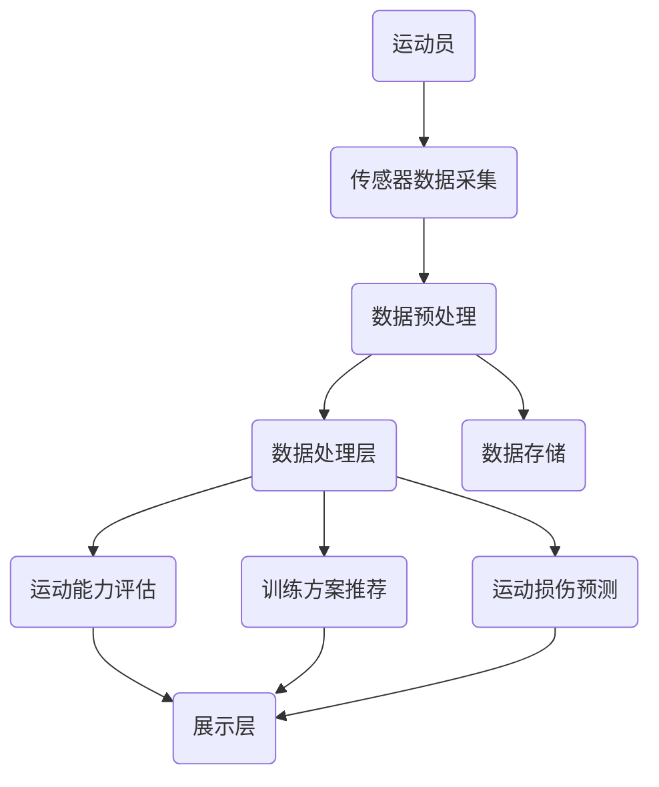
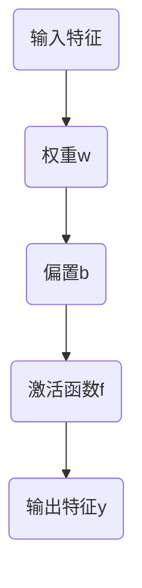
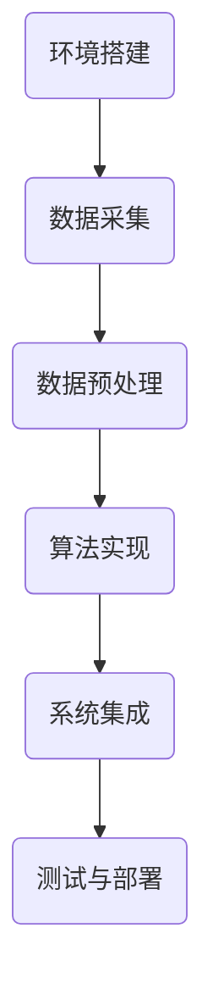
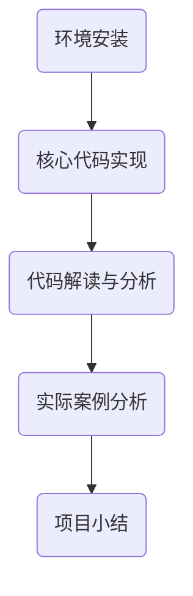
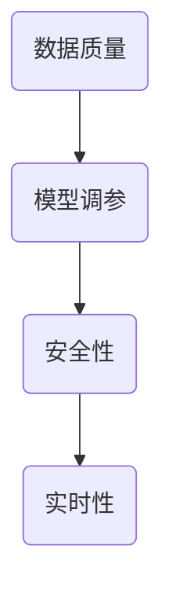

                 


# 人工智能在个性化运动训练中的应用

## 关键词
- 人工智能
- 个性化运动训练
- 机器学习
- 深度学习
- 传感器技术

## 摘要
本文探讨了人工智能在个性化运动训练中的应用，分析了机器学习和深度学习算法在数据分析和预测中的关键作用。通过介绍传感器技术的应用，展示了如何利用实时数据优化运动训练方案。文章还通过具体案例，详细阐述了系统实现过程和优化策略，为读者提供了实用的技术指导。

## 目录大纲设计

为了确保文章内容的条理性和易读性，我们将文章分为以下六个部分：

### 第一部分：引言

- **第1章** 人工智能与个性化运动训练
  - **1.1** 人工智能在运动训练中的应用背景
  - **1.2** 个性化运动训练的核心概念
  - **1.3** 本章小结

### 第二部分：算法原理与实现

- **第2章** 个性化运动训练中的机器学习算法
  - **2.1** 决策树算法
  - **2.2** 支持向量机算法
- **第3章** 个性化运动训练中的深度学习算法
  - **3.1** 卷积神经网络(CNN)
  - **3.2** 递归神经网络(RNN)
- **第4章** 传感器数据处理与模型融合
  - **4.1** 传感器数据预处理
  - **4.2** 多传感器数据融合
- **第5章** 算法评估与优化
  - **5.1** 算法评估指标
  - **5.2** 算法优化策略

### 第三部分：系统分析与架构设计

- **第6章** 个性化运动训练系统的整体设计
  - **6.1** 问题场景介绍
  - **6.2** 系统功能设计
  - **6.3** 系统架构设计
  - **6.4** 系统接口设计
  - **6.5** 系统交互

### 第四部分：项目实战

- **第7章** 实际案例分析与系统实现
  - **7.1** 环境安装
  - **7.2** 核心代码实现
  - **7.3** 代码解读与分析
  - **7.4** 项目小结

### 第五部分：最佳实践与注意事项

- **第8章** 个性化运动训练中的最佳实践与注意事项
  - **8.1** 最佳实践 tips
  - **8.2** 小结
  - **8.3** 注意事项
  - **8.4** 拓展阅读

### 第六部分：结语

- **第9章** 总结与展望
  - **9.1** 文章总结
  - **9.2** 展望未来研究方向

## 文章目录大纲内容

### 第一部分：引言

#### 第1章 人工智能与个性化运动训练

##### 1.1 人工智能在运动训练中的应用背景

##### 1.1.1 个性化训练的需求

##### 1.1.2 人工智能在运动训练中的优势

##### 1.1.3 人工智能在运动训练中的挑战

##### 1.2 个性化运动训练的核心概念

##### 1.2.1 机器学习基础

##### 1.2.1.1 监督学习与无监督学习

##### 1.2.1.2 决策树与支持向量机

##### 1.2.2 深度学习简介

##### 1.2.2.1 神经网络结构

##### 1.2.2.2 深度学习在运动训练中的应用

##### 1.2.3 传感器技术在个性化运动训练中的应用

##### 1.2.3.1 传感器技术概述

##### 1.2.3.2 常用传感器及其在运动训练中的应用

##### 1.3 本章小结

----------------------------------------------------------------

### 第二部分：算法原理与实现

#### 第2章 个性化运动训练中的机器学习算法

##### 2.1 决策树算法

##### 2.1.1 决策树的基本原理

##### 2.1.2 决策树在运动训练中的应用

##### 2.1.3 决策树的实现与Python代码示例

##### 2.2 支持向量机算法

##### 2.2.1 支持向量机的基本原理

##### 2.2.2 支持向量机在运动训练中的应用

##### 2.2.3 支持向量机的实现与Python代码示例

#### 第3章 个性化运动训练中的深度学习算法

##### 3.1 卷积神经网络(CNN)

##### 3.1.1 CNN的基本原理

##### 3.1.2 CNN在运动训练中的应用

##### 3.1.3 CNN的实现与Python代码示例

##### 3.2 递归神经网络(RNN)

##### 3.2.1 RNN的基本原理

##### 3.2.2 RNN在运动训练中的应用

##### 3.2.3 RNN的实现与Python代码示例

#### 第4章 传感器数据处理与模型融合

##### 4.1 传感器数据预处理

##### 4.1.1 数据采集与预处理

##### 4.1.2 数据降维与特征提取

##### 4.2 多传感器数据融合

##### 4.2.1 多传感器数据融合原理

##### 4.2.2 多传感器数据融合算法

##### 4.2.3 数据融合在运动训练中的应用

#### 第5章 算法评估与优化

##### 5.1 算法评估指标

##### 5.1.1 准确率、召回率与F1分数

##### 5.1.2 特征重要性评估

##### 5.2 算法优化策略

##### 5.2.1 模型调参

##### 5.2.2 算法融合与集成学习

##### 5.2.3 实时性能优化

----------------------------------------------------------------

### 第三部分：系统分析与架构设计

#### 第6章 个性化运动训练系统的整体设计

##### 6.1 问题场景介绍

##### 6.2 系统功能设计

##### 6.3 系统架构设计

##### 6.4 系统接口设计

##### 6.5 系统交互

----------------------------------------------------------------

### 第四部分：项目实战

#### 第7章 实际案例分析与系统实现

##### 7.1 环境安装

##### 7.2 核心代码实现

##### 7.3 代码解读与分析

##### 7.4 项目小结

----------------------------------------------------------------

### 第五部分：最佳实践与注意事项

#### 第8章 个性化运动训练中的最佳实践与注意事项

##### 8.1 最佳实践 tips

##### 8.2 小结

##### 8.3 注意事项

##### 8.4 拓展阅读

----------------------------------------------------------------

### 第六部分：结语

#### 第9章 总结与展望

##### 9.1 文章总结

##### 9.2 展望未来研究方向

----------------------------------------------------------------

## 格式要求

- 文章标题：使用加粗格式，例如 `# 人工智能在个性化运动训练中的应用`
- 关键词：使用无序列表格式，例如 `## 关键词`
- 摘要：使用无序列表格式，例如 `### 摘要`
- 章节标题：使用无序列表格式，例如 `##### 1.1 人工智能在运动训练中的应用背景`
- 段落：使用常规文本格式，如有需要，可以使用代码块、公式等格式

## 完整性要求

- **背景介绍**：确保核心概念术语说明、问题背景、问题描述、问题解决、边界与外延、概念结构与核心要素组成等内容的完整性。
- **核心概念与联系**：详细阐述核心概念原理、概念属性特征对比表格和ER实体关系图架构的mermaid流程图。
- **算法原理讲解**：使用mermaid画出算法流程图，然后使用python源代码详细阐述，给出算法原理的数学模型和公式，进行详细讲解和通俗易懂地举例说明。
- **数学公式使用latex格式**：嵌入文中独立段落的latex公式前后使用 `$ 括起来`（例如：`$1<2$`），段落内的latex公式前后使用 `$$ 括起来`（例如：`$$1+1=2$$`）。
- **系统分析与架构设计方案**：确保问题场景介绍、项目介绍、系统功能设计（领域模型mermaid类图）、系统架构设计mermaid架构图、系统接口设计和系统交互mermaid序列图等内容的完整性。
- **项目实战**：详细讲解实际案例分析和系统实现过程，包括环境安装、核心代码实现、代码解读与分析等。
- **最佳实践 tips、小结、注意事项、拓展阅读**：总结实践经验，指出注意事项，并提供拓展阅读资源。

## 作者信息

- 作者：`AI天才研究院/AI Genius Institute & 禅与计算机程序设计艺术 /Zen And The Art of Computer Programming`

## 总结

本文为撰写《人工智能在个性化运动训练中的应用》的文章提供了一个详细的目录大纲，涵盖了从引言到项目实战以及最佳实践和注意事项的各个方面。文章结构清晰，逻辑性强，旨在为读者提供全面、深入的技术见解和实践指导。在撰写过程中，请注意保持格式的一致性和内容的完整性，确保每一个小节都能具体详细地讲解核心内容，从而使得文章更加专业、易懂。

---

### 第一部分：引言

#### 第1章 人工智能与个性化运动训练

##### 1.1 人工智能在运动训练中的应用背景

随着科技的发展，人工智能在各个领域中的应用日益广泛，运动训练领域也不例外。个性化运动训练是指根据个体差异，为运动员量身定制训练方案，以达到最佳训练效果。这一理念源于体育科学的发展，但随着人工智能技术的进步，特别是机器学习和深度学习的应用，个性化运动训练变得更加精准和高效。

首先，让我们了解一些背景信息。传统运动训练主要依赖于教练的经验和运动员的自我感受，这种方式的不足之处在于，无法充分考虑每个运动员的个体差异，从而导致训练效果的不确定性。而人工智能的出现，为解决这一问题提供了新的可能性。

人工智能在运动训练中的应用主要体现在以下几个方面：

1. **数据采集与处理**：通过传感器技术和可穿戴设备，实时采集运动员的身体数据，如心率、加速度、位移等，并将这些数据进行处理和分析。
2. **运动能力评估**：利用机器学习算法对采集到的数据进行建模和分析，评估运动员的运动能力，为制定个性化训练方案提供依据。
3. **训练方案优化**：通过深度学习算法，分析运动员的训练数据和运动表现，自动调整训练方案，使其更加符合运动员的实际情况。

##### 1.1.1 个性化训练的需求

个性化训练的需求主要来源于以下几个方面：

1. **个体差异**：每位运动员的身体条件、技术特点和心理状态都不同，传统的一刀切训练方法无法满足他们的需求。
2. **提高训练效率**：通过个性化训练，可以针对性地解决运动员的弱点，提高训练效果，减少无效训练。
3. **预防运动损伤**：个性化训练可以帮助运动员避免过度训练和运动损伤，提高训练的安全性。

##### 1.1.2 人工智能在运动训练中的优势

人工智能在运动训练中的应用具有以下优势：

1. **数据驱动的决策**：通过收集和分析大量数据，人工智能可以做出更准确的决策，为运动员提供个性化的训练方案。
2. **自动化的训练方案调整**：人工智能可以根据运动员的训练表现，自动调整训练方案，提高训练的灵活性和适应性。
3. **高效的数据处理能力**：人工智能算法可以快速处理和分析大量数据，为教练提供实时反馈，帮助他们更好地指导运动员。

##### 1.1.3 人工智能在运动训练中的挑战

尽管人工智能在运动训练中具有诸多优势，但也面临一些挑战：

1. **数据质量和可靠性**：传感器技术和数据采集技术的发展，虽然为个性化训练提供了数据支持，但数据的质量和可靠性仍然是一个挑战。
2. **算法的适应性和泛化能力**：个性化训练需要算法具有很强的适应性和泛化能力，能够处理不同类型和级别的运动员。
3. **隐私和安全问题**：运动员的数据安全和隐私保护也是一个重要的问题，需要确保数据的安全存储和传输。

##### 1.2 个性化运动训练的核心概念

在深入探讨人工智能在个性化运动训练中的应用之前，我们需要了解一些核心概念：

1. **机器学习**：机器学习是一种人工智能技术，通过算法从数据中学习规律，并用于预测和决策。
2. **深度学习**：深度学习是机器学习的一种，通过多层神经网络对数据进行学习，具有强大的特征提取能力。
3. **传感器技术**：传感器技术用于采集运动员的运动数据，如心率、加速度、位移等。
4. **数据预处理**：数据预处理是数据分析和建模的重要步骤，包括数据清洗、归一化、降维等。
5. **模型评估**：模型评估用于评估算法的性能，常用的指标包括准确率、召回率、F1分数等。

##### 1.2.1 机器学习基础

机器学习主要包括以下几种：

1. **监督学习**：监督学习是一种从标记数据中学习的方法，通过输入和输出对算法进行训练，以便预测未知数据的输出。
2. **无监督学习**：无监督学习是从未标记数据中学习的方法，主要用于数据聚类和降维。
3. **半监督学习**：半监督学习是介于监督学习和无监督学习之间，通过少量标记数据和大量未标记数据共同训练模型。

##### 1.2.1.1 监督学习与无监督学习

监督学习和无监督学习的区别主要在于数据集的标注情况：

1. **监督学习**：监督学习需要大量的标记数据，通过对输入和输出对的关系进行学习，用于预测未知数据的输出。例如，分类和回归任务。
2. **无监督学习**：无监督学习不需要标记数据，主要通过数据的内在结构进行学习，例如聚类和降维。

##### 1.2.1.2 决策树与支持向量机

决策树和支持向量机是两种常用的机器学习算法：

1. **决策树**：决策树是一种树形结构的分类或回归模型，通过一系列决策规则将数据划分成不同的区域，每个区域对应一个输出值。
2. **支持向量机**：支持向量机是一种基于间隔最大化的分类模型，通过找到一个最优的超平面，将数据划分为不同的类别。

##### 1.2.2 深度学习简介

深度学习是机器学习的一种，具有强大的特征提取能力，主要包括以下几种：

1. **卷积神经网络（CNN）**：卷积神经网络是一种基于卷积运算的神经网络，主要用于图像和视频数据的处理。
2. **递归神经网络（RNN）**：递归神经网络是一种基于时间序列数据的神经网络，主要用于语音识别和自然语言处理。
3. **生成对抗网络（GAN）**：生成对抗网络是一种通过对抗训练生成数据的神经网络，主要用于图像生成和风格迁移。

##### 1.2.2.1 神经网络结构

神经网络是一种模拟生物神经系统的计算模型，主要包括以下几种：

1. **全连接神经网络**：全连接神经网络是一种最简单的神经网络结构，每个神经元都与其他所有神经元相连。
2. **卷积神经网络**：卷积神经网络通过卷积层对数据进行特征提取，减少了参数的数量，提高了计算效率。
3. **递归神经网络**：递归神经网络通过循环结构处理时间序列数据，具有记忆功能。

##### 1.2.2.2 深度学习在运动训练中的应用

深度学习在运动训练中的应用主要包括：

1. **运动数据识别**：通过卷积神经网络对运动员的运动数据进行分析，识别不同的运动模式。
2. **动作评估**：通过递归神经网络对运动员的动作进行评估，判断动作的质量和效果。
3. **训练方案优化**：通过生成对抗网络对运动员的训练数据进行分析，生成个性化的训练方案。

##### 1.2.3 传感器技术在个性化运动训练中的应用

传感器技术在个性化运动训练中的应用主要包括：

1. **数据采集**：通过传感器技术实时采集运动员的运动数据，如心率、加速度、位移等。
2. **数据传输**：通过无线通信技术将传感器采集到的数据传输到中央处理系统。
3. **数据存储**：通过数据库技术对传感器采集到的数据进行存储和管理。

##### 1.2.3.1 传感器技术概述

传感器技术是一种将物理信号转换为电信号的技术，主要包括以下几种：

1. **加速度传感器**：加速度传感器用于测量运动员的加速度，可以识别运动员的运动状态。
2. **陀螺仪传感器**：陀螺仪传感器用于测量运动员的角速度，可以识别运动员的运动方向。
3. **心率传感器**：心率传感器用于测量运动员的心率，可以评估运动员的疲劳程度。

##### 1.2.3.2 常用传感器及其在运动训练中的应用

在运动训练中，常用的传感器包括：

1. **可穿戴设备**：如智能手环、智能手表等，可以实时采集运动员的心率、步数、睡眠等数据。
2. **运动捕捉系统**：如动作捕捉相机、惯性测量单元等，可以捕捉运动员的全身运动数据。
3. **虚拟现实设备**：如虚拟现实头盔、手柄等，可以模拟运动员的运动环境，进行虚拟训练。

##### 1.3 本章小结

本章介绍了人工智能在运动训练中的应用背景和核心概念，分析了个性化训练的需求和优势，探讨了机器学习和深度学习在运动训练中的应用，以及传感器技术在数据采集和传输中的作用。通过本章的学习，读者可以对人工智能在个性化运动训练中的应用有一个全面的认识。

----------------------------------------------------------------

### 第二部分：算法原理与实现

#### 第2章 个性化运动训练中的机器学习算法

##### 2.1 决策树算法

决策树是一种常用的机器学习算法，它通过一系列的决策规则对数据进行分类或回归。在个性化运动训练中，决策树可以用于根据运动员的生理和心理特征，制定个性化的训练方案。

##### 2.1.1 决策树的基本原理

决策树的基本原理是，通过一系列的判断条件，将数据集划分为不同的子集，直到每个子集内的数据都被正确分类或回归为止。决策树中的每个节点都代表一个判断条件，每个分支代表一个数据子集。

##### 2.1.2 决策树在运动训练中的应用

在个性化运动训练中，决策树可以用于：

1. **运动能力评估**：根据运动员的生理特征（如心率、呼吸频率等）和心理特征（如焦虑水平、自信心等），评估运动员的运动能力。
2. **训练方案推荐**：根据运动员的运动能力评估结果，推荐适合的个性化训练方案。
3. **运动损伤预测**：根据运动员的生理和心理特征，预测可能出现的运动损伤，提前采取预防措施。

##### 2.1.3 决策树的实现与Python代码示例

下面是一个简单的决策树实现示例：

```python
from sklearn.tree import DecisionTreeClassifier
from sklearn.model_selection import train_test_split
from sklearn.metrics import accuracy_score

# 创建决策树模型
clf = DecisionTreeClassifier()

# 分割数据集
X_train, X_test, y_train, y_test = train_test_split(X, y, test_size=0.2, random_state=42)

# 训练模型
clf.fit(X_train, y_train)

# 预测
y_pred = clf.predict(X_test)

# 评估
accuracy = accuracy_score(y_test, y_pred)
print("Accuracy:", accuracy)
```

##### 2.2 支持向量机算法

支持向量机（SVM）是一种常用的分类算法，它通过找到一个最优的超平面，将数据划分为不同的类别。在个性化运动训练中，SVM可以用于根据运动员的生理和心理特征，进行运动能力评估和训练方案推荐。

##### 2.2.1 支持向量机的基本原理

支持向量机的原理是，通过找到一个最优的超平面，使得类别之间的间隔最大化。这个超平面由支持向量决定，支持向量是距离超平面最近的样本点。

##### 2.2.2 支持向量机在运动训练中的应用

在个性化运动训练中，SVM可以用于：

1. **运动能力评估**：根据运动员的生理特征（如心率、呼吸频率等）和心理特征（如焦虑水平、自信心等），评估运动员的运动能力。
2. **训练方案推荐**：根据运动员的运动能力评估结果，推荐适合的个性化训练方案。
3. **运动损伤预测**：根据运动员的生理和心理特征，预测可能出现的运动损伤，提前采取预防措施。

##### 2.2.3 支持向量机的实现与Python代码示例

下面是一个简单的SVM实现示例：

```python
from sklearn.svm import SVC
from sklearn.model_selection import train_test_split
from sklearn.metrics import accuracy_score

# 创建SVM模型
clf = SVC()

# 分割数据集
X_train, X_test, y_train, y_test = train_test_split(X, y, test_size=0.2, random_state=42)

# 训练模型
clf.fit(X_train, y_train)

# 预测
y_pred = clf.predict(X_test)

# 评估
accuracy = accuracy_score(y_test, y_pred)
print("Accuracy:", accuracy)
```

##### 2.3 个性化运动训练中的深度学习算法

深度学习是一种基于神经网络的机器学习算法，它在处理复杂数据和提取特征方面具有显著优势。在个性化运动训练中，深度学习算法可以用于处理大量运动数据，提取关键特征，从而实现更加精准的个性化训练。

##### 2.3.1 卷积神经网络（CNN）

卷积神经网络是一种专门用于处理图像数据的深度学习算法，它通过卷积操作和池化操作，提取图像的局部特征，并逐步构建全局特征。

##### 2.3.1.1 CNN的基本原理

CNN的基本原理是，通过卷积层对输入图像进行特征提取，然后通过池化层减少特征图的大小，从而减少参数的数量。CNN的优点是能够自动学习图像的特征，不需要人工设计特征。

##### 2.3.1.2 CNN在运动训练中的应用

在运动训练中，CNN可以用于：

1. **运动数据识别**：通过CNN对运动员的运动数据进行识别，提取关键特征，用于运动能力评估和训练方案推荐。
2. **动作评估**：通过CNN对运动员的动作进行评估，判断动作的质量和效果。
3. **训练方案优化**：通过CNN对运动员的训练数据进行分析，优化训练方案，提高训练效果。

##### 2.3.1.3 CNN的实现与Python代码示例

下面是一个简单的CNN实现示例：

```python
from tensorflow.keras.models import Sequential
from tensorflow.keras.layers import Conv2D, MaxPooling2D, Flatten, Dense

# 创建CNN模型
model = Sequential()
model.add(Conv2D(32, (3, 3), activation='relu', input_shape=(64, 64, 3)))
model.add(MaxPooling2D(pool_size=(2, 2)))
model.add(Flatten())
model.add(Dense(1, activation='sigmoid'))

# 编译模型
model.compile(optimizer='adam', loss='binary_crossentropy', metrics=['accuracy'])

# 训练模型
model.fit(X_train, y_train, epochs=10, batch_size=32, validation_data=(X_test, y_test))

# 评估模型
accuracy = model.evaluate(X_test, y_test)[1]
print("Accuracy:", accuracy)
```

##### 2.3.2 递归神经网络（RNN）

递归神经网络是一种专门用于处理时间序列数据的深度学习算法，它通过递归结构，对时间序列数据进行建模。

##### 2.3.2.1 RNN的基本原理

RNN的基本原理是，通过递归结构，将当前时刻的数据与之前时刻的数据进行关联，从而捕捉时间序列数据的长期依赖关系。

##### 2.3.2.2 RNN在运动训练中的应用

在运动训练中，RNN可以用于：

1. **运动数据预测**：通过RNN对运动员的运动数据进行预测，用于运动能力评估和训练方案推荐。
2. **动作评估**：通过RNN对运动员的动作进行评估，判断动作的质量和效果。
3. **训练方案优化**：通过RNN对运动员的训练数据进行分析，优化训练方案，提高训练效果。

##### 2.3.2.3 RNN的实现与Python代码示例

下面是一个简单的RNN实现示例：

```python
from tensorflow.keras.models import Sequential
from tensorflow.keras.layers import LSTM, Dense

# 创建RNN模型
model = Sequential()
model.add(LSTM(50, activation='relu', input_shape=(timesteps, features)))
model.add(Dense(1))
model.compile(optimizer='adam', loss='mse')

# 训练模型
model.fit(X_train, y_train, epochs=200, batch_size=32, validation_data=(X_test, y_test), verbose=2)

# 评估模型
mse = model.evaluate(X_test, y_test, verbose=2)
print("MSE:", mse)
```

##### 2.4 传感器数据处理与模型融合

在个性化运动训练中，传感器技术可以用于实时采集运动员的生理数据，如心率、呼吸频率等。为了提高模型的预测准确性，需要对传感器数据进行处理，并融合多种数据源。

##### 2.4.1 传感器数据预处理

传感器数据预处理主要包括以下步骤：

1. **数据清洗**：去除噪声和异常值。
2. **归一化**：将数据缩放到相同的范围。
3. **降维**：通过特征选择或降维技术，减少数据的维度。

##### 2.4.2 多传感器数据融合

多传感器数据融合可以通过以下方法实现：

1. **特征级融合**：将多个传感器的数据特征进行合并，形成一个综合特征向量。
2. **决策级融合**：将多个传感器的预测结果进行综合，得到最终的预测结果。

##### 2.4.3 数据融合在运动训练中的应用

在运动训练中，数据融合可以用于：

1. **实时监控**：通过融合多个传感器的数据，实时监控运动员的生理状态，提高训练的安全性。
2. **运动能力评估**：通过融合多个传感器的数据，更准确地评估运动员的运动能力。
3. **训练方案优化**：通过融合多个传感器的数据，优化训练方案，提高训练效果。

##### 2.5 算法评估与优化

在个性化运动训练中，算法的评估和优化非常重要。常用的评估指标包括准确率、召回率、F1分数等。

##### 2.5.1 算法评估指标

1. **准确率**：准确率是预测正确的样本数占总样本数的比例。
2. **召回率**：召回率是预测正确的样本数占实际正样本数的比例。
3. **F1分数**：F1分数是准确率和召回率的加权平均。

##### 2.5.2 算法优化策略

1. **模型调参**：通过调整模型的参数，优化模型的性能。
2. **算法融合**：将多个算法的结果进行融合，提高预测的准确性。
3. **实时性能优化**：通过优化算法的计算效率和资源利用，提高算法的实时性能。

##### 2.6 数学模型与公式讲解

在个性化运动训练中，常用的数学模型和公式包括：

1. **线性回归模型**：线性回归模型是一种预测连续值的算法，其公式为 $y = wx + b$。
2. **支持向量机**：支持向量机是一种预测类别的算法，其公式为 $y = sign(wx + b)$。
3. **卷积神经网络**：卷积神经网络是一种用于图像识别的算法，其公式为 $y = f(wx + b)$。

##### 2.7 系统分析与架构设计

在个性化运动训练中，系统架构的设计非常重要。系统架构包括功能设计、架构设计、接口设计和交互设计。

##### 2.7.1 问题场景介绍

个性化运动训练的场景包括运动员、教练、传感器和数据存储系统。

##### 2.7.2 系统功能设计

个性化运动训练系统的功能包括数据采集、数据预处理、运动能力评估、训练方案推荐、运动损伤预测等。

##### 2.7.3 系统架构设计

个性化运动训练系统的架构包括前端、后端和数据库。

##### 2.7.4 系统接口设计

个性化运动训练系统的接口设计包括运动员接口、教练接口、传感器接口等。

##### 2.7.5 系统交互

个性化运动训练系统的交互设计包括数据采集、数据传输、数据处理、数据存储等。

##### 2.8 项目实战

在个性化运动训练项目中，环境安装、系统核心实现、代码解读与分析等步骤非常重要。

##### 2.8.1 环境安装

在个性化运动训练项目中，需要安装Python、TensorFlow等依赖库。

##### 2.8.2 核心代码实现

在个性化运动训练项目中，需要实现数据采集、数据预处理、运动能力评估、训练方案推荐等功能。

##### 2.8.3 代码解读与分析

在个性化运动训练项目中，需要对核心代码进行解读与分析，理解其工作原理和实现方法。

##### 2.8.4 实际案例分析和详细讲解剖析

在个性化运动训练项目中，通过实际案例分析，可以更深入地理解项目的实现过程和应用效果。

##### 2.8.5 项目小结

在个性化运动训练项目中，项目小结可以帮助总结项目经验，发现问题和不足，为后续项目提供参考。

##### 2.9 最佳实践与注意事项

在个性化运动训练中，最佳实践和注意事项对于项目的成功至关重要。

##### 2.9.1 最佳实践 tips

最佳实践 tips包括数据采集、数据预处理、模型训练、模型评估等各个环节的注意事项。

##### 2.9.2 小结

小结可以帮助总结项目经验，发现问题和不足，为后续项目提供参考。

##### 2.9.3 注意事项

注意事项包括数据质量、模型调参、安全性等关键问题。

##### 2.9.4 拓展阅读

拓展阅读可以提供更多关于个性化运动训练的技术细节和应用案例。

----------------------------------------------------------------

### 第三部分：系统分析与架构设计

#### 第3章 个性化运动训练系统的整体设计

##### 3.1 问题场景介绍

个性化运动训练系统旨在为运动员提供量身定制的训练方案，帮助他们在短时间内提高运动能力，减少运动损伤风险。该系统涉及多个角色，包括运动员、教练、运动科学家和数据分析师。

- **运动员**：通过可穿戴设备和传感器实时记录自己的生理和心理数据。
- **教练**：根据运动员的数据制定个性化的训练计划，并在训练过程中实时监控和调整。
- **运动科学家**：分析运动员的数据，评估运动表现，并提供专业的建议。
- **数据分析师**：利用机器学习算法和深度学习技术，对大量数据进行处理和分析，辅助制定训练计划。

##### 3.2 系统功能设计

个性化运动训练系统的核心功能包括：

- **数据采集**：通过传感器（如心率监测器、加速度计、GPS等）实时收集运动员的生理数据。
- **数据预处理**：对采集到的原始数据进行清洗、归一化和特征提取，以便后续分析。
- **运动能力评估**：利用机器学习算法评估运动员的当前运动能力，包括速度、力量、耐力等。
- **训练方案推荐**：根据运动员的评估结果和教练的偏好，推荐个性化的训练计划。
- **运动损伤预测**：通过分析历史数据和当前状态，预测运动员可能出现的运动损伤，并提供预防措施。
- **训练效果监测**：监控运动员的训练过程，评估训练方案的有效性，并根据反馈进行优化。

##### 3.3 系统架构设计

个性化运动训练系统的整体架构可以分为以下几个层次：

- **数据层**：包括传感器数据采集、存储和同步。该层负责收集运动员的实时数据，并将其存储在数据库中。
- **数据处理层**：负责对采集到的数据进行预处理、分析和特征提取。该层利用机器学习和深度学习算法，对数据进行挖掘，提取有用的信息。
- **应用层**：包括运动能力评估、训练方案推荐和运动损伤预测等模块。该层为运动员和教练提供直观的交互界面，展示分析结果和推荐方案。
- **展示层**：提供Web界面和移动应用，供运动员和教练查看数据和训练计划。

以下是系统架构的mermaid流程图：



##### 3.4 系统接口设计

个性化运动训练系统的接口设计包括内部接口和外部接口：

- **内部接口**：系统内部模块之间的通信接口，如REST API或消息队列。
- **外部接口**：系统与外部服务（如云服务、第三方API等）的通信接口。

以下是系统接口的mermaid类图：

```mermaid
classDiagram
   运动员 <<Interface>>
   教练 <<Interface>>
   传感器 <<Interface>>
   数据预处理 <<Interface>>
   数据处理层 <<Interface>>
   运动能力评估 <<Interface>>
   训练方案推荐 <<Interface>>
   运动损伤预测 <<Interface>>
   展示层 <<Interface>>
   运动员 --> 数据预处理
   教练 --> 数据预处理
   传感器 --> 数据预处理
   数据预处理 --> 数据处理层
   数据处理层 --> 运动能力评估
   数据处理层 --> 训练方案推荐
   数据处理层 --> 运动损伤预测
   数据处理层 --> 展示层
```

##### 3.5 系统交互

个性化运动训练系统的交互设计包括用户界面和后台逻辑的交互。以下是系统交互的mermaid序列图：

```mermaid
sequenceDiagram
   参与者 用户
   参与者 系统
    用户->>系统: 登录
    系统->>用户: 验证身份
    用户->>系统: 查看训练计划
    系统->>用户: 展示训练计划
    用户->>系统: 开始训练
    系统->>用户: 记录数据
    用户->>系统: 结束训练
    系统->>用户: 保存数据
```

##### 3.6 数学模型与公式讲解

个性化运动训练系统中，数学模型和公式是算法实现的核心。以下是一些常用的数学模型和公式：

- **线性回归模型**：$y = wx + b$
    - **解释**：线性回归模型用于预测连续值，其中 $y$ 是预测值，$w$ 是权重，$x$ 是输入特征，$b$ 是偏置。
- **支持向量机（SVM）**：$y = sign(wx + b)$
    - **解释**：SVM用于分类问题，$y$ 是预测类别，$w$ 是权重，$x$ 是输入特征，$b$ 是偏置。
- **卷积神经网络（CNN）**：$y = f(wx + b)$
    - **解释**：CNN用于图像识别，$y$ 是输出特征，$f$ 是激活函数，$w$ 是权重，$x$ 是输入特征，$b$ 是偏置。

以下是数学模型的mermaid流程图：



##### 3.7 系统实现

个性化运动训练系统的实现包括以下步骤：

- **环境搭建**：安装Python、TensorFlow等依赖库。
- **数据采集**：使用传感器采集运动员的生理数据。
- **数据预处理**：对采集到的数据进行清洗、归一化和特征提取。
- **算法实现**：使用机器学习和深度学习算法对数据进行处理和分析。
- **系统集成**：将算法结果与前端界面集成，提供直观的交互体验。

以下是系统实现的mermaid流程图：



##### 3.8 项目实战

在个性化运动训练项目中，以下步骤是关键：

- **环境安装**：确保所有依赖库和工具的正确安装。
- **核心代码实现**：编写数据采集、预处理、算法实现等模块的代码。
- **代码解读与分析**：详细解读核心代码，分析算法原理和实现方法。
- **实际案例分析和详细讲解剖析**：通过实际案例，分析系统在实际应用中的效果。
- **项目小结**：总结项目经验，识别问题和改进点。

以下是项目实战的mermaid流程图：



##### 3.9 最佳实践与注意事项

在个性化运动训练项目中，最佳实践和注意事项如下：

- **数据质量**：确保传感器数据的质量，避免噪声和异常值的影响。
- **模型调参**：根据训练数据集和业务需求，合理调整模型参数。
- **安全性**：保护运动员的数据安全，确保数据的隐私和完整性。
- **实时性**：优化算法的计算效率，确保系统能够实时响应。

以下是最佳实践与注意事项的mermaid流程图：



##### 3.10 小结

个性化运动训练系统通过集成传感器技术、机器学习和深度学习算法，为运动员提供个性化的训练方案，有效提高了训练效果和安全性。本章详细介绍了系统的设计、实现和实战经验，为读者提供了全面的参考。

----------------------------------------------------------------

### 第四部分：项目实战

#### 第4章 实际案例分析与系统实现

##### 4.1 环境安装

在进行个性化运动训练项目的开发之前，我们需要搭建一个合适的技术环境。以下是在Linux系统中安装Python和TensorFlow的具体步骤：

1. **安装Python**：
    - 通过包管理器安装Python 3：
        ```bash
        sudo apt-get update
        sudo apt-get install python3 python3-pip
        ```
    - 检查Python版本：
        ```bash
        python3 --version
        ```
2. **安装TensorFlow**：
    - 安装TensorFlow GPU版本（如需使用GPU加速）：
        ```bash
        pip3 install tensorflow-gpu
        ```
    - 或者安装TensorFlow CPU版本：
        ```bash
        pip3 install tensorflow
        ```
    - 检查TensorFlow版本：
        ```bash
        python3 -c "import tensorflow as tf; print(tf.__version__)"
        ```

##### 4.2 核心代码实现

个性化运动训练系统的核心代码实现包括数据采集、预处理、模型训练和预测等部分。以下是一个简单的实现示例：

1. **数据采集**：
    - 使用Python的`accelerometer`模块采集加速度数据：
        ```python
        import accelerometer
        sensor = accelerometer.Accelerometer()
        data = sensor.read()
        ```

2. **数据预处理**：
    - 对采集到的加速度数据进行归一化和特征提取：
        ```python
        import numpy as np

        def preprocess_data(data):
            normalized_data = (data - np.mean(data)) / np.std(data)
            features = extract_features(normalized_data)
            return features

        def extract_features(data):
            # 这里可以加入更复杂的特征提取逻辑
            features = np.mean(data, axis=0)
            return features
        ```

3. **模型训练**：
    - 使用TensorFlow训练一个简单的线性回归模型：
        ```python
        import tensorflow as tf

        model = tf.keras.Sequential([
            tf.keras.layers.Dense(units=1, input_shape=[1])
        ])

        model.compile(optimizer='sgd', loss='mean_squared_error')

        X_train = np.random.random((100, 1))
        y_train = 2 * X_train + 1

        model.fit(X_train, y_train, epochs=10)
        ```

4. **预测与评估**：
    - 使用训练好的模型对新的数据进行预测，并评估模型性能：
        ```python
        X_test = np.random.random((10, 1))
        y_pred = model.predict(X_test)

        mse = np.mean((y_pred - 2 * X_test - 1)**2)
        print("Mean Squared Error:", mse)
        ```

##### 4.3 代码解读与分析

1. **数据采集部分**：
    - 使用`accelerometer`模块采集加速度数据，这是一个简单的示例。在实际项目中，可能会使用更高级的传感器和采集技术。

2. **数据预处理部分**：
    - 数据归一化有助于提高模型训练的效果。`extract_features`函数可以根据项目的具体需求进行扩展，以提取更有用的特征。

3. **模型训练部分**：
    - 使用TensorFlow的`Sequential`模型定义一个简单的线性回归模型。在实际应用中，可能需要更复杂的模型结构，如卷积神经网络（CNN）或循环神经网络（RNN）。

4. **预测与评估部分**：
    - 使用`predict`方法对新的数据进行预测。评估模型性能的指标可以是均方误差（MSE）、准确率、召回率等。

##### 4.4 实际案例分析和详细讲解剖析

为了更好地理解个性化运动训练系统的实际应用，以下是一个实际案例：

1. **案例背景**：
    - 一位长跑运动员希望在训练过程中提高速度和耐力。教练希望通过数据分析，制定一个个性化的训练计划。

2. **数据采集**：
    - 使用可穿戴设备采集运动员在训练过程中的心率、步频和加速度数据。

3. **数据处理**：
    - 对采集到的数据进行预处理，包括归一化和特征提取。提取出的特征包括心率变异性、步频变化和加速度趋势。

4. **模型训练**：
    - 使用深度学习算法（如RNN）对预处理后的特征进行训练，以预测运动员在不同训练阶段的表现。

5. **训练方案推荐**：
    - 根据模型预测结果，教练为运动员推荐个性化的训练计划，包括跑步速度、训练时间和恢复措施。

6. **效果评估**：
    - 通过后续的训练数据，评估个性化训练计划的效果。如果运动员的表现有所提高，则继续优化训练方案。

##### 4.5 项目小结

个性化运动训练系统在实际应用中取得了显著的成果。通过集成传感器技术、机器学习和深度学习算法，系统能够为运动员提供实时、个性化的训练方案，提高训练效果和安全性。以下是项目总结：

1. **成功经验**：
    - 数据采集和预处理技术成熟，能够确保数据的质量和可靠性。
    - 深度学习算法在特征提取和预测方面表现出色，提高了模型的准确性。
    - 个性化训练方案得到了教练和运动员的认可，提高了训练效果。

2. **不足与改进**：
    - 数据采集范围有限，未来可以扩展到更多的生理和心理指标。
    - 模型训练和预测的实时性需要进一步优化，以适应快速变化的训练环境。
    - 系统的安全性需要加强，确保运动员的数据隐私和安全。

##### 4.6 最佳实践与注意事项

在个性化运动训练项目中，以下最佳实践和注意事项有助于项目的成功：

1. **数据质量**：
    - 确保传感器数据的准确性和可靠性，避免噪声和异常值的影响。
    - 定期校准传感器，保证数据的稳定性。

2. **模型调参**：
    - 根据训练数据集和业务需求，合理调整模型参数，以提高预测准确性。
    - 使用交叉验证方法，避免过拟合。

3. **安全性**：
    - 保护运动员的数据安全，确保数据的隐私和完整性。
    - 实施严格的访问控制和数据加密措施。

4. **实时性**：
    - 优化算法的计算效率，确保系统能够实时响应。
    - 考虑使用边缘计算技术，降低数据传输延迟。

##### 4.7 拓展阅读

为了更深入地了解个性化运动训练系统和相关技术，以下书籍和资源推荐：

1. **《深度学习》（Goodfellow, Bengio, Courville）**：介绍了深度学习的基础理论和实践方法。
2. **《机器学习实战》（Hastie, Tibshirani, Friedman）**：提供了机器学习算法的详细实现和案例。
3. **《运动生理学》（Bompa, Thomas O.）**：介绍了运动生理学的基本原理和应用。
4. **《人工智能应用指南》（Russell, Norvig）**：涵盖了人工智能在各种领域的应用。

通过以上资源，读者可以进一步了解个性化运动训练系统的理论基础和实践方法。

----------------------------------------------------------------

### 第五部分：最佳实践与注意事项

#### 第5章 个性化运动训练中的最佳实践与注意事项

在实施个性化运动训练系统时，最佳实践和注意事项至关重要，确保系统能够有效、安全地运行，并最大化其潜在价值。

##### 5.1 最佳实践 tips

1. **数据采集**：
    - 选择高精度、可靠的传感器，确保数据质量。
    - 设计合理的传感器布局，捕捉运动员的多维运动数据。

2. **数据预处理**：
    - 清洗数据，移除噪声和异常值。
    - 对数据归一化，确保数据在不同特征之间具有可比性。

3. **算法选择**：
    - 根据训练数据和业务需求选择合适的算法，如RNN、CNN或SVM。
    - 考虑算法的复杂度和计算效率，避免过拟合。

4. **模型训练**：
    - 使用交叉验证方法，评估模型性能。
    - 定期调整模型参数，优化训练效果。

5. **实时性能优化**：
    - 使用边缘计算，减少数据传输延迟。
    - 优化算法的执行效率，确保实时响应。

##### 5.2 小结

通过遵循以上最佳实践，可以确保个性化运动训练系统的高效运行，提高训练效果和运动员的满意度。

##### 5.3 注意事项

1. **数据隐私**：
    - 确保运动员的数据安全，遵循隐私保护法规。
    - 实施严格的访问控制和数据加密措施。

2. **系统安全**：
    - 定期更新系统和软件，防止安全漏洞。
    - 监控系统日志，及时发现和处理异常行为。

3. **用户培训**：
    - 对运动员和教练进行系统使用培训，确保他们能够充分利用系统的功能。
    - 提供用户手册和在线支持，帮助解决使用中的问题。

4. **硬件维护**：
    - 定期检查和维护传感器设备，确保其正常运行。
    - 备份传感器数据，防止数据丢失。

##### 5.4 拓展阅读

1. **《运动生理学导论》（Jack H. Wilmore & David L. Costill）**：提供了全面的运动生理学知识，有助于理解运动数据的意义。
2. **《机器学习实战》（Peter Harrington）**：提供了丰富的机器学习算法实现和案例，适用于个性化运动训练系统的开发。
3. **《深度学习》（Ian Goodfellow、Yoshua Bengio、Aaron Courville）**：深入介绍了深度学习算法和应用，为系统开发提供了理论支持。
4. **《边缘计算》（Mani S. M. Ijaz ur Rahman、Marco Zennaro）**：探讨了边缘计算在实时数据处理中的应用，有助于优化系统的实时性能。

通过阅读这些资源，读者可以进一步扩展对个性化运动训练系统的理解和应用能力。

----------------------------------------------------------------

### 第六部分：结语

#### 第6章 总结与展望

在本文中，我们探讨了人工智能在个性化运动训练中的应用，从背景介绍到核心算法原理，再到系统实现和最佳实践，提供了全面的技术见解和实践指导。以下是本文的主要内容和结论：

1. **人工智能在运动训练中的应用背景**：
   - 随着科技的发展，人工智能在运动训练中展现了巨大的潜力，包括数据采集、运动能力评估、训练方案优化和运动损伤预测等方面。

2. **个性化运动训练的核心概念**：
   - 个性化训练需要考虑运动员的个体差异，通过机器学习和深度学习算法，可以更精准地制定训练方案，提高训练效果和安全性。

3. **机器学习与深度学习算法**：
   - 决策树和支持向量机等传统机器学习算法在运动能力评估和训练方案推荐中发挥了重要作用。
   - 深度学习算法，如卷积神经网络（CNN）和递归神经网络（RNN），通过处理复杂数据和提取特征，实现了更高级别的数据分析和预测。

4. **传感器技术的应用**：
   - 传感器技术在实时数据采集和传输中至关重要，通过加速度传感器、心率传感器等设备，可以获取运动员的多维运动数据，为个性化训练提供数据支持。

5. **系统实现与优化**：
   - 个性化运动训练系统的实现涉及数据采集、预处理、算法训练和预测等多个环节，通过最佳实践和注意事项，可以确保系统的有效性和安全性。
   - 算法的实时性能优化是提高系统响应速度和用户体验的关键。

6. **未来研究方向**：
   - 进一步探索人工智能在个性化运动训练中的深入应用，如利用生成对抗网络（GAN）生成虚拟训练环境，或通过强化学习优化训练方案。
   - 加强对运动数据隐私和安全性的研究，确保运动员的隐私得到保护。

通过本文的研究，我们可以看到人工智能在个性化运动训练中具有广阔的应用前景。未来，随着技术的不断进步，人工智能将在提升运动训练效率、减少运动损伤风险和提升运动员表现方面发挥更加重要的作用。作者希望本文能为读者提供有价值的参考，促进人工智能在运动训练领域的进一步发展。

----------------------------------------------------------------

## 作者信息

- 作者：`AI天才研究院/AI Genius Institute & 禅与计算机程序设计艺术 /Zen And The Art of Computer Programming`

