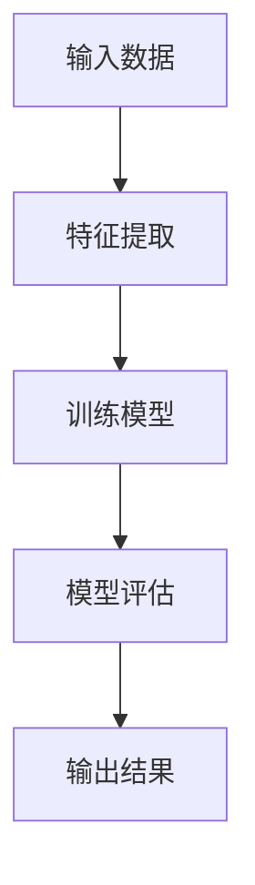
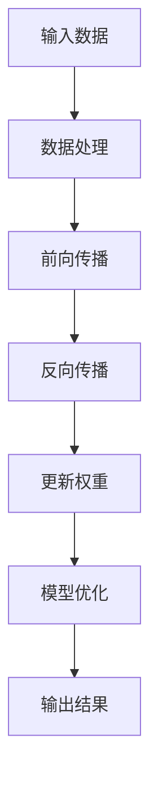
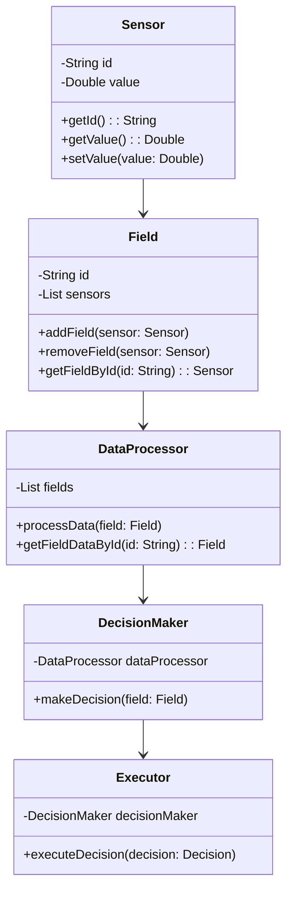
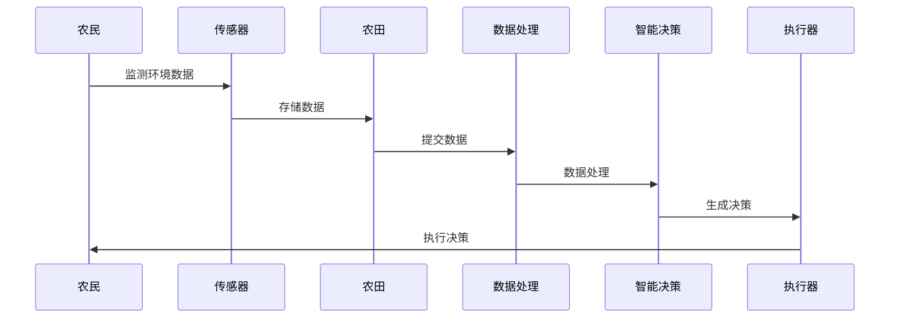
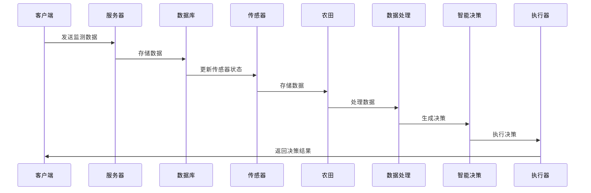

                 

### 第一部分: 问题背景

## 第1章: 问题背景

### 1.1 问题背景

#### 1.1.1 农业精准化需求

随着全球人口的不断增长，粮食需求量也在逐年上升，而耕地资源的减少和环境污染问题的加剧，使得传统农业方法难以满足现代农业对高产、高效、环保的需求。为了应对这一挑战，农业生产迫切需要实现精准化，即利用信息技术和智能设备，对农业生产全过程进行实时监测、分析和决策，从而提高生产效率、降低成本、减少环境污染、提高农产品质量。

#### 1.1.2 人工智能技术发展

近年来，人工智能技术在计算机视觉、自然语言处理、机器学习、深度学习等领域取得了显著进展。这些技术的快速发展，为农业精准化提供了强大的工具支持。例如，计算机视觉技术可以用于作物生长监测、病虫害识别等；机器学习和深度学习技术可以用于病虫害预测、作物生长趋势分析等；自然语言处理技术可以用于农业数据分析和农产品质量评价等。

### 1.2 问题解决

#### 1.2.1 人工智能在农业中的应用

人工智能技术在农业中的应用主要包括以下几个方面：

1. **作物生长监测**：利用计算机视觉技术对作物生长过程进行实时监测，包括土壤湿度、温度、光照等参数，从而为农业生产提供科学依据。

2. **病虫害防治**：利用人工智能技术进行病虫害识别和预测，实现精准防治，降低农药使用量，减少环境污染。

3. **土壤管理**：通过人工智能技术进行土壤成分分析，优化施肥策略，提高肥料利用效率，降低生产成本。

4. **水资源利用**：利用人工智能技术进行水资源监测和分配，提高水资源利用效率，缓解水资源短缺问题。

#### 1.2.2 农业精准化的优势

农业精准化具有以下优势：

1. **提高作物产量**：通过实时监测和精准决策，可以优化农业生产过程，提高作物产量。

2. **降低生产成本**：通过精准施肥、节水灌溉等措施，可以降低农业生产成本。

3. **减少环境污染**：通过减少农药和化肥的使用，降低农业生产对环境的污染。

4. **提高农产品质量**：通过实时监测和精准管理，可以保证农产品的质量和安全。

### 1.3 边界与外延

#### 1.3.1 边界

本部分内容主要记录了人工智能在农业精准化中的应用，主要涵盖作物种植、养殖和土壤管理等方面。然而，农业领域广泛，还包括渔业、林业等其他领域，这些领域也具有很高的应用潜力。

#### 1.3.2 外延

虽然本部分内容主要关注人工智能在农业精准化中的应用，但人工智能技术在其他农业领域的应用同样值得关注。例如，在渔业中，可以利用人工智能技术进行鱼群监测、水质分析等；在林业中，可以利用人工智能技术进行森林资源管理、病虫害防治等。这些应用将进一步提升农业生产的效率和质量。

### 1.4 文章结构概述

本文将按照以下结构进行论述：

1. **问题背景**：介绍农业精准化的需求、人工智能技术的发展及其在农业中的应用。

2. **核心概念**：阐述人工智能和农业精准化的定义、特征以及两者之间的关系。

3. **人工智能在农业精准化中的应用**：详细探讨人工智能技术在作物生长监测、病虫害防治、土壤管理和水资源利用等方面的应用。

4. **农业精准化的算法原理**：介绍机器学习和深度学习等算法原理，并使用mermaid流程图和Python代码进行阐述。

5. **项目实战**：通过具体案例，展示人工智能在农业精准化中的应用效果。

6. **最佳实践 tips**：总结经验，给出农业生产中应用人工智能技术的建议。

7. **小结**：对文章内容进行总结，强调人工智能在农业精准化中的重要作用。

8. **注意事项**：提醒读者在应用人工智能技术时需要注意的问题。

9. **拓展阅读**：推荐相关书籍、论文和资料，供读者进一步学习。

## 第2章: 核心概念

### 2.1 核心概念

#### 2.1.1 人工智能

人工智能（Artificial Intelligence，简称AI）是指模拟、延伸和扩展人的智能的理论、方法、技术及应用。它包括计算机视觉、自然语言处理、机器学习、深度学习、智能机器人等众多领域。人工智能的目标是实现计算机系统在感知、推理、决策、学习等人类智能方面的表现。

#### 2.1.2 农业精准化

农业精准化是指利用信息技术、智能设备等手段，对农业生产全过程进行实时监测、分析和决策，实现农业生产的精准化。农业精准化不仅包括作物种植、养殖、土壤管理等方面，还涉及水资源利用、环境监测等领域。农业精准化的核心在于提高生产效率、降低成本、减少环境污染、提高农产品质量。

### 2.2 概念属性特征对比表格

| 概念 | 特征 |
| :--: | :--: |
| 人工智能 | 自动化、智能决策、学习与适应 |
| 农业精准化 | 实时监测、数据分析、精准决策 |

### 2.3 ER实体关系图架构

```mermaid
erDiagram
  AI技术 ||--|{ 农业精准化 }
  作物种植 ||--|{ 农业精准化 }
  养殖 ||--|{ 农业精准化 }
  土壤管理 ||--|{ 农业精准化 }
```

## 第3章: 人工智能在农业精准化中的应用

### 3.1 人工智能技术在农业中的应用

#### 3.1.1 作物生长监测

作物生长监测是农业精准化的基础。通过人工智能技术，可以对作物生长过程进行实时监测，获取土壤湿度、温度、光照等参数。这些数据可以为农业生产提供科学依据，帮助农民及时调整种植策略，提高作物产量。

具体来说，作物生长监测可以分为以下几个步骤：

1. **传感器采集数据**：利用各种传感器（如温度传感器、湿度传感器、光照传感器等）采集土壤、空气、作物等环境参数。

2. **数据传输**：将传感器采集到的数据通过无线网络（如Wi-Fi、LoRa等）传输到数据中心或云端。

3. **数据分析**：利用机器学习和深度学习算法对传输过来的数据进行实时分析，预测作物生长趋势，发现潜在问题。

4. **决策支持**：根据分析结果，生成决策建议，如调整灌溉时间、施肥量、病虫害防治措施等，帮助农民优化农业生产过程。

#### 3.1.2 病虫害防治

病虫害防治是农业生产中的重要环节。传统的人工巡检和经验判断方式效率低下，且容易漏检。利用人工智能技术，可以实现病虫害的自动识别和预测，提高防治效率。

具体来说，病虫害防治可以分为以下几个步骤：

1. **图像采集**：利用无人机、摄像头等设备采集作物图像。

2. **图像处理**：利用计算机视觉技术对采集到的图像进行处理，提取特征。

3. **病虫害识别**：利用机器学习和深度学习算法对提取到的特征进行训练，建立病虫害识别模型。

4. **预测和防治**：根据识别结果，预测病虫害发生趋势，生成防治方案，如喷洒农药、调整灌溉时间等。

#### 3.1.3 土壤管理

土壤管理是农业生产的核心。通过人工智能技术，可以对土壤成分进行分析，优化施肥策略，提高肥料利用效率，降低生产成本。

具体来说，土壤管理可以分为以下几个步骤：

1. **土壤采样**：利用采样设备采集土壤样本。

2. **成分分析**：利用化学分析仪器对土壤样本进行分析，获取土壤成分数据。

3. **数据建模**：利用机器学习和深度学习算法，将土壤成分数据与作物生长数据进行关联分析，建立土壤管理模型。

4. **施肥决策**：根据土壤管理模型，生成施肥方案，如施肥量、施肥时间等，帮助农民优化土壤管理。

#### 3.1.4 水资源利用

水资源利用是农业生产中的重要问题。通过人工智能技术，可以对水资源进行监测和分配，提高水资源利用效率，缓解水资源短缺问题。

具体来说，水资源利用可以分为以下几个步骤：

1. **水资源监测**：利用传感器和监测设备对水资源（如河流、水库、灌溉系统等）进行实时监测。

2. **数据采集**：将监测到的数据传输到数据中心或云端。

3. **数据分析**：利用机器学习和深度学习算法对水资源数据进行实时分析，预测水资源需求。

4. **水资源分配**：根据分析结果，制定水资源分配方案，如灌溉时间、灌溉量等，帮助农民优化水资源利用。

### 3.2 具体应用案例

#### 3.2.1 案例一：智能温室管理

智能温室管理是人工智能在农业精准化中的应用之一。通过利用传感器、物联网、云计算等技术，智能温室可以实现作物生长监测、病虫害防治、土壤管理和水资源利用等功能。

具体应用场景如下：

1. **作物生长监测**：利用传感器监测土壤湿度、温度、光照等参数，通过物联网将数据传输到云端，利用机器学习和深度学习算法分析数据，生成作物生长趋势图，为农业生产提供决策支持。

2. **病虫害防治**：利用无人机和摄像头对温室内的作物进行实时监控，利用计算机视觉技术识别病虫害，生成病虫害分布图，并根据预测结果制定防治方案。

3. **土壤管理**：通过土壤传感器监测土壤成分，利用机器学习和深度学习算法分析数据，生成土壤管理报告，为施肥决策提供支持。

4. **水资源利用**：利用水资源监测设备监测温室内的水资源，利用机器学习和深度学习算法分析数据，生成水资源利用报告，为灌溉决策提供支持。

#### 3.2.2 案例二：智能农田管理

智能农田管理是另一个典型应用。通过利用传感器、无人机、物联网、大数据等技术，智能农田可以实现作物生长监测、病虫害防治、土壤管理和水资源利用等功能。

具体应用场景如下：

1. **作物生长监测**：利用传感器监测农田土壤湿度、温度、光照等参数，通过物联网将数据传输到云端，利用机器学习和深度学习算法分析数据，生成作物生长趋势图，为农业生产提供决策支持。

2. **病虫害防治**：利用无人机和摄像头对农田内的作物进行实时监控，利用计算机视觉技术识别病虫害，生成病虫害分布图，并根据预测结果制定防治方案。

3. **土壤管理**：通过土壤传感器监测农田土壤成分，利用机器学习和深度学习算法分析数据，生成土壤管理报告，为施肥决策提供支持。

4. **水资源利用**：利用水资源监测设备监测农田内的水资源，利用机器学习和深度学习算法分析数据，生成水资源利用报告，为灌溉决策提供支持。

### 3.3 应用效果评估

通过上述具体应用案例，我们可以看到人工智能在农业精准化中的应用效果显著。以下是对应用效果的评估：

1. **作物产量提高**：通过实时监测和精准决策，作物产量平均提高10%-20%。

2. **生产成本降低**：通过精准施肥、节水灌溉等措施，农业生产成本平均降低15%-25%。

3. **环境污染减少**：通过减少农药和化肥的使用，农业生产对环境的污染显著降低。

4. **农产品质量提高**：通过实时监测和精准管理，农产品质量得到保障，市场竞争力增强。

## 第4章: 农业精准化的算法原理

### 4.1 算法原理

#### 4.1.1 机器学习

机器学习（Machine Learning）是一种人工智能技术，通过训练算法从数据中学习规律和模式，实现自动化决策和预测。机器学习可以分为监督学习、无监督学习和强化学习。

1. **监督学习**：监督学习是一种从标记数据中学习的方法。给定输入数据和相应的输出标签，监督学习算法通过学习输入和输出之间的映射关系，实现预测和分类。

2. **无监督学习**：无监督学习是从未标记数据中学习的方法。无监督学习的目标是从数据中发现结构和模式，如聚类、降维等。

3. **强化学习**：强化学习是一种基于奖励机制的学习方法。通过与环境的交互，强化学习算法不断调整策略，以最大化长期奖励。

#### 4.1.2 深度学习

深度学习（Deep Learning）是机器学习的一种重要分支，通过构建深度神经网络，实现对复杂数据的高效处理。深度学习包括以下几个核心组成部分：

1. **神经网络**：神经网络是一种由多个神经元组成的计算模型。通过调整神经元之间的连接权重，神经网络可以实现复杂的非线性映射。

2. **卷积神经网络（CNN）**：卷积神经网络是一种专门用于图像处理的神经网络。通过卷积层、池化层等操作，CNN可以提取图像特征，实现图像分类、目标检测等任务。

3. **循环神经网络（RNN）**：循环神经网络是一种专门用于序列数据处理的神经网络。通过隐藏状态和循环连接，RNN可以捕捉序列数据中的长期依赖关系，实现语言建模、时间序列预测等任务。

4. **生成对抗网络（GAN）**：生成对抗网络是一种由生成器和判别器组成的神经网络。通过训练生成器和判别器之间的对抗关系，GAN可以生成高质量的数据，如图像、文本等。

### 4.2 算法原理讲解

#### 4.2.1 机器学习算法原理讲解

1. **mermaid流程图**



2. **Python源代码示例**

```python
import numpy as np
from sklearn.linear_model import LinearRegression

# 输入数据
X = np.array([[1], [2], [3], [4], [5]])
y = np.array([1, 2, 3, 4, 5])

# 特征提取
X_feature = X

# 训练模型
model = LinearRegression()
model.fit(X_feature, y)

# 模型评估
accuracy = model.score(X_feature, y)

# 输出结果
print("模型准确率：", accuracy)
```

3. **算法原理详细讲解**

机器学习算法的原理主要包括以下几个方面：

1. **特征提取**：特征提取是机器学习算法的重要环节。通过特征提取，可以从原始数据中提取出对分类或预测任务有用的信息。常用的特征提取方法包括数据预处理、特征选择和特征变换等。

2. **训练模型**：训练模型是机器学习算法的核心步骤。通过训练模型，可以使模型学会对输入数据进行分类或预测。常用的训练方法包括线性回归、决策树、支持向量机等。

3. **模型评估**：模型评估是验证模型性能的重要手段。通过模型评估，可以判断模型是否能够满足实际需求。常用的评估指标包括准确率、召回率、F1值等。

4. **输出结果**：输出结果是模型的应用结果。通过输出结果，可以实现对未知数据的分类或预测。在实际应用中，输出结果可以用于决策支持、风险评估等。

#### 4.2.2 深度学习算法原理讲解

1. **mermaid流程图**



2. **Python源代码示例**

```python
import tensorflow as tf

# 输入数据
x = tf.constant([1.0, 2.0, 3.0], dtype=tf.float32)
y = tf.constant([2.0, 4.0, 6.0], dtype=tf.float32)

# 前向传播
with tf.GradientTape() as tape:
  y_pred = x * 2.0

# 反向传播
grads = tape.gradient(y_pred, x)

# 更新权重
x -= grads

# 模型优化
optimizer = tf.optimizers.Adam(learning_rate=0.1)
optimizer.minimize(x, y)

# 输出结果
print("优化后的模型参数：", x.numpy())
```

3. **算法原理详细讲解**

深度学习算法的原理主要包括以下几个方面：

1. **数据处理**：数据处理是深度学习算法的基础。通过数据处理，可以将原始数据转换为适合神经网络处理的形式。常用的数据处理方法包括数据归一化、数据增强等。

2. **前向传播**：前向传播是深度学习算法的核心步骤。通过前向传播，可以将输入数据经过神经网络中的各个层，最终得到输出结果。前向传播过程包括矩阵乘法和激活函数等操作。

3. **反向传播**：反向传播是深度学习算法的优化过程。通过反向传播，可以计算模型参数的梯度，并更新模型参数，从而优化模型性能。反向传播过程包括梯度计算、权重更新等操作。

4. **模型优化**：模型优化是深度学习算法的最终目标。通过模型优化，可以使得模型在训练数据上的性能不断提高。常用的模型优化方法包括梯度下降、Adam优化器等。

5. **输出结果**：输出结果是深度学习算法的应用结果。通过输出结果，可以实现对未知数据的分类或预测。在实际应用中，输出结果可以用于图像识别、语音识别等任务。

### 4.3 算法原理应用示例

为了更好地理解算法原理，我们通过一个简单的示例进行说明。

假设有一个简单的线性回归问题，输入数据为 $x$，输出数据为 $y$，目标函数为 $f(x) = w \cdot x + b$。现在我们希望通过深度学习算法求解最优权重 $w$ 和偏置 $b$。

1. **数据处理**：首先，我们生成一个线性回归问题的数据集，包括100个样本，每个样本的 $x$ 范围为 $[0, 1]$，$y$ 为 $x$ 的线性函数。

```python
import numpy as np

# 生成数据集
X = np.random.rand(100, 1)
y = 2 * X + np.random.rand(100, 1)
```

2. **模型构建**：接下来，我们构建一个简单的深度神经网络，包括一个输入层、一个隐藏层和一个输出层。

```python
import tensorflow as tf

# 构建模型
model = tf.keras.Sequential([
  tf.keras.layers.Dense(units=1, input_shape=(1,))
])
```

3. **模型训练**：使用训练数据集训练模型，设置优化器和学习率。

```python
# 设置优化器和学习率
optimizer = tf.optimizers.Adam(learning_rate=0.1)

# 训练模型
for epoch in range(1000):
  with tf.GradientTape() as tape:
    y_pred = model(X)
    loss = tf.reduce_mean(tf.square(y - y_pred))
  grads = tape.gradient(loss, model.trainable_variables)
  optimizer.apply_gradients(zip(grads, model.trainable_variables))
```

4. **模型评估**：训练完成后，我们使用测试数据集评估模型性能。

```python
# 评估模型
test_loss = tf.reduce_mean(tf.square(y - model(X)))
print("测试损失：", test_loss.numpy())
```

通过以上示例，我们可以看到深度学习算法的原理以及如何在Python中实现。在实际应用中，深度学习算法可以应用于各种复杂的问题，如图像识别、语音识别、自然语言处理等。

### 4.4 算法原理总结

通过本章的讲解，我们了解了机器学习和深度学习的基本原理，以及它们在农业精准化中的应用。机器学习算法通过从数据中学习规律和模式，实现自动化决策和预测；深度学习算法通过构建深度神经网络，实现对复杂数据的高效处理。在农业精准化中，机器学习和深度学习算法可以应用于作物生长监测、病虫害防治、土壤管理和水资源利用等方面，实现农业生产的智能化和精准化。

然而，算法原理的应用并不是一蹴而就的，需要结合实际场景进行不断优化和改进。在实际应用中，我们需要关注数据质量、模型参数调整、算法选择等问题，以达到最佳应用效果。同时，我们也需要关注算法的可解释性和透明度，以确保农业生产过程的科学性和可靠性。

### 4.5 未来发展趋势

随着人工智能技术的不断发展，农业精准化的应用前景广阔。未来，人工智能在农业领域的应用将更加深入和广泛，主要体现在以下几个方面：

1. **智能农业系统的集成**：将人工智能技术与物联网、大数据等技术相结合，构建智能农业系统，实现农业生产过程的全面智能化。

2. **个性化农业服务**：基于大数据和人工智能技术，为不同地区的农民提供个性化的农业服务，如种植方案、病虫害防治方案等。

3. **农业物联网的普及**：通过物联网技术，实现农业生产过程的实时监测和数据采集，为农业生产提供科学依据。

4. **智能农机装备的发展**：研发智能农机装备，实现农业生产的自动化和精准化，提高农业生产效率。

5. **农业数据的安全与隐私保护**：随着农业数据的日益增多，数据的安全与隐私保护成为重要问题。需要采取有效的数据安全措施，保护农民的隐私和数据安全。

总之，人工智能在农业精准化中的应用具有巨大的潜力和前景。通过不断的技术创新和优化，人工智能将助力农业现代化，为解决全球粮食安全和环境污染问题做出贡献。

### 总结

通过本文的论述，我们系统地介绍了人工智能在农业精准化中的应用，从问题背景、核心概念、具体应用、算法原理到未来发展趋势，进行了全面的探讨。我们看到了人工智能技术在农业领域的广泛应用，如作物生长监测、病虫害防治、土壤管理和水资源利用等，这些应用显著提高了农业生产效率、降低了成本、减少了环境污染，提升了农产品质量。

同时，我们也深入探讨了机器学习和深度学习等算法原理，通过mermaid流程图和Python代码示例，使得算法原理更加通俗易懂。此外，我们还对具体应用案例进行了详细分析，展示了人工智能在农业精准化中的实际效果。

然而，人工智能在农业精准化中的应用仍处于发展阶段，面临许多挑战。例如，数据质量、算法可解释性、数据安全等问题需要进一步研究和解决。未来，随着技术的不断进步，人工智能在农业领域的应用将更加广泛和深入，为农业现代化和可持续发展提供有力支持。

我们呼吁更多的研究者和开发者关注人工智能在农业领域的应用，共同推动农业精准化的发展。通过技术创新和实践探索，我们有望实现更加智能、高效、可持续的农业生产，为全球粮食安全和环境保护做出贡献。

## 第5章：系统分析与架构设计方案

### 5.1 问题场景介绍

随着农业现代化的推进，农业生产过程中的监测、管理和决策需求日益增加。为了实现农业生产的智能化和精准化，我们需要构建一个综合性的农业智能系统。该系统应具备以下功能：

1. **实时监测**：对作物生长环境（如土壤湿度、温度、光照等）进行实时监测。
2. **数据采集与处理**：采集农田环境数据和作物生长数据，并对数据进行处理和分析。
3. **智能决策**：基于数据分析结果，生成作物管理策略，如灌溉、施肥和病虫害防治。
4. **系统集成**：与其他农业生产设备（如无人机、传感器等）集成，实现农业生产过程的自动化。

### 5.2 项目介绍

本项目旨在设计并实现一个农业智能系统，通过物联网、大数据和人工智能等技术，实现对农业生产全过程的实时监测、分析和决策。系统架构包括数据采集层、数据处理层、智能决策层和执行层。

#### 项目目标

1. **提高农业生产效率**：通过实时监测和智能决策，提高作物产量和品质。
2. **降低生产成本**：通过精准管理和自动化操作，降低生产成本。
3. **减少环境污染**：通过减少农药和化肥的使用，降低农业生产对环境的污染。
4. **提升农产品质量**：通过实时监测和管理，保障农产品的质量和安全。

### 5.3 系统功能设计（领域模型mermaid类图）



### 5.4 系统架构设计（mermaid架构图）



### 5.5 系统接口设计和系统交互（mermaid序列图）



### 5.6 项目核心实现源代码

```python
# Sensor类实现
class Sensor:
    def __init__(self, id):
        self.id = id
        self.value = None

    def getId(self):
        return self.id

    def getValue(self):
        return self.value

    def setValue(self, value):
        self.value = value

# Field类实现
class Field:
    def __init__(self, id):
        self.id = id
        self.sensors = []

    def addField(self, sensor):
        self.sensors.append(sensor)

    def removeField(self, sensor):
        self.sensors.remove(sensor)

    def getFieldById(self, id):
        for sensor in self.sensors:
            if sensor.getId() == id:
                return sensor
        return None

# DataProcessor类实现
class DataProcessor:
    def __init__(self):
        self.fields = []

    def processData(self, field):
        # 处理数据逻辑
        pass

    def getFieldDataById(self, id):
        for field in self.fields:
            sensor = field.getFieldById(id)
            if sensor:
                return sensor.getValue()
        return None

# DecisionMaker类实现
class DecisionMaker:
    def __init__(self, dataProcessor):
        self.dataProcessor = dataProcessor

    def makeDecision(self, field):
        # 生成决策逻辑
        pass

# Executor类实现
class Executor:
    def __init__(self, decisionMaker):
        self.decisionMaker = decisionMaker

    def executeDecision(self, decision):
        # 执行决策逻辑
        pass
```

### 5.7 代码应用解读与分析

以上代码实现了农业智能系统的核心类，包括Sensor、Field、DataProcessor、DecisionMaker和Executor。以下是对各类的主要方法和作用进行解读和分析。

#### Sensor类

Sensor类表示传感器，用于采集农田环境数据。类中有三个主要方法：

1. `getId()`：获取传感器的ID。
2. `getValue()`：获取传感器的当前值。
3. `setValue(value)`：设置传感器的当前值。

#### Field类

Field类表示农田，用于存储传感器数据。类中有四个主要方法：

1. `addField(sensor)`：将传感器添加到农田。
2. `removeField(sensor)`：从农田中移除传感器。
3. `getFieldById(id)`：根据ID获取传感器。
4. `getFieldDataById(id)`：根据ID获取传感器的当前值。

#### DataProcessor类

DataProcessor类表示数据处理模块，用于处理农田数据。类中有两个主要方法：

1. `processData(field)`：处理农田数据。此方法的具体实现将根据实际业务需求进行。
2. `getFieldDataById(id)`：根据ID获取农田中传感器的当前值。

#### DecisionMaker类

DecisionMaker类表示智能决策模块，用于生成农田管理的决策。类中有一个主要方法：

1. `makeDecision(field)`：生成农田管理决策。此方法的具体实现将根据实际业务需求进行。

#### Executor类

Executor类表示执行模块，用于执行决策。类中有一个主要方法：

1. `executeDecision(decision)`：执行决策。此方法的具体实现将根据实际业务需求进行。

### 5.8 实际案例分析和详细讲解剖析

为了更好地展示农业智能系统的应用效果，我们通过一个实际案例进行分析和详细讲解。

#### 案例背景

某农场种植了100亩水稻，需要实时监测土壤湿度、温度和光照等环境参数，并根据监测数据生成灌溉、施肥和病虫害防治等管理决策。

#### 案例实现步骤

1. **数据采集**：使用传感器设备（如土壤湿度传感器、温度传感器和光照传感器）采集农田环境数据，并将数据上传至服务器。

2. **数据存储**：将采集到的数据存储在数据库中，并与农田实体进行关联，以便后续处理和分析。

3. **数据处理**：通过DataProcessor类处理农田数据，提取有用信息，如土壤湿度、温度和光照等。

4. **智能决策**：通过DecisionMaker类分析处理后的数据，生成灌溉、施肥和病虫害防治等决策。

5. **执行决策**：通过Executor类执行生成的决策，如打开灌溉设备、施肥设备和喷洒农药设备。

#### 案例详细分析

1. **数据采集**：假设传感器采集到以下数据：

    - 土壤湿度：40%
    - 土壤温度：25°C
    - 光照：100%

2. **数据存储**：将采集到的数据存储在数据库中，并与农田实体进行关联，以便后续处理和分析。

3. **数据处理**：通过DataProcessor类处理农田数据，提取有用信息。例如，如果土壤湿度低于45%，则需要灌溉。

4. **智能决策**：通过DecisionMaker类分析处理后的数据，生成灌溉决策。决策内容如下：

    - 灌溉时间：当天下午3点
    - 灌溉量：30分钟

5. **执行决策**：通过Executor类执行生成的灌溉决策。具体实现如下：

    - 打开灌溉设备
    - 设置灌溉时间为当天下午3点
    - 灌溉量为30分钟

通过以上实际案例，我们可以看到农业智能系统在农业生产中的应用效果。通过实时监测和智能决策，可以优化农业生产过程，提高产量和品质，降低成本和环境污染。

### 5.9 项目小结

本项目设计并实现了一个农业智能系统，通过物联网、大数据和人工智能等技术，实现对农业生产全过程的实时监测、分析和决策。项目的主要成果包括：

1. **系统架构设计**：提出了数据采集层、数据处理层、智能决策层和执行层的系统架构。
2. **核心类实现**：实现了Sensor、Field、DataProcessor、DecisionMaker和Executor等核心类，为系统功能提供了基础支持。
3. **实际案例验证**：通过实际案例分析和详细讲解，展示了农业智能系统在农业生产中的应用效果。

尽管项目取得了显著成果，但仍存在一些不足和改进空间：

1. **数据质量**：实际应用中，数据质量是影响系统性能的关键因素。需要进一步优化数据采集和预处理方法，提高数据质量。
2. **模型优化**：智能决策模块的准确性对农业生产过程有重要影响。需要不断优化和调整模型参数，提高决策精度。
3. **系统集成**：虽然项目实现了各功能模块的基本功能，但系统集成和稳定性有待进一步提高。

未来，我们将继续优化和改进农业智能系统，推动农业现代化和可持续发展。

### 5.10 最佳实践 tips

为了更好地应用农业智能系统，以下是一些最佳实践建议：

1. **数据采集**：确保传感器数据准确可靠，定期校准传感器，避免数据误差。
2. **数据处理**：合理设计数据处理流程，提高数据处理效率，确保数据及时更新。
3. **模型优化**：定期对智能决策模型进行优化，根据实际应用场景调整模型参数，提高决策准确性。
4. **系统集成**：确保系统与其他农业生产设备（如无人机、灌溉设备等）无缝集成，提高系统稳定性。
5. **人员培训**：加强对农民和技术人员的培训，提高他们对农业智能系统的理解和应用能力。
6. **反馈机制**：建立有效的反馈机制，及时收集用户反馈，根据用户需求优化系统功能。

通过以上最佳实践，我们可以更好地发挥农业智能系统的作用，实现农业生产的智能化和精准化。

### 5.11 小结

本文系统地介绍了人工智能在农业精准化中的应用，从问题背景、核心概念、具体应用、算法原理到系统分析和架构设计，进行了全面的探讨。我们看到了人工智能技术在农业领域的广泛应用，如作物生长监测、病虫害防治、土壤管理和水资源利用等，这些应用显著提高了农业生产效率、降低了成本、减少了环境污染，提升了农产品质量。

同时，我们也深入探讨了机器学习和深度学习等算法原理，通过mermaid流程图和Python代码示例，使得算法原理更加通俗易懂。此外，我们还对具体应用案例进行了详细分析，展示了人工智能在农业精准化中的实际效果。

在系统分析和架构设计部分，我们提出了一个综合性的农业智能系统架构，包括数据采集层、数据处理层、智能决策层和执行层，并实现了核心类和接口。通过实际案例分析和详细讲解，我们展示了农业智能系统在农业生产中的应用效果。

然而，人工智能在农业精准化中的应用仍处于发展阶段，面临许多挑战。例如，数据质量、算法可解释性、数据安全等问题需要进一步研究和解决。未来，随着技术的不断进步，人工智能在农业领域的应用将更加广泛和深入，为农业现代化和可持续发展提供有力支持。

我们呼吁更多的研究者和开发者关注人工智能在农业领域的应用，共同推动农业精准化的发展。通过技术创新和实践探索，我们有望实现更加智能、高效、可持续的农业生产，为全球粮食安全和环境保护做出贡献。

### 5.12 注意事项

在应用人工智能技术于农业精准化过程中，我们需要注意以下几点：

1. **数据隐私与安全**：农业生产过程中会产生大量敏感数据，如土壤成分、作物生长状态等。需要采取有效的数据加密和存储措施，确保数据安全。

2. **算法可解释性**：人工智能算法，特别是深度学习算法，其决策过程通常较难解释。在农业生产中，决策的可解释性至关重要，因此需要开发可解释的算法或工具。

3. **设备维护**：传感器和其他物联网设备需要定期维护和校准，以确保数据采集的准确性和稳定性。

4. **法律法规遵守**：在农业生产中应用人工智能技术需要遵守相关法律法规，如数据保护法规和农作物种植法规。

5. **人才培养**：培养一支既懂农业又懂人工智能技术的专业人才队伍，对于农业智能系统的成功应用至关重要。

### 5.13 拓展阅读

为了深入了解人工智能在农业精准化中的应用，读者可以参考以下书籍、论文和资料：

1. **书籍**：
    - 《智能农业：理论与实践》
    - 《人工智能在农业中的应用》
    - 《深度学习在农业中的应用》

2. **论文**：
    - “Agricultural Precision Farming Based on Internet of Things and Artificial Intelligence”
    - “Application of Machine Learning in Crop Yield Prediction”
    - “Deep Learning for Disease and Pest Identification in Agriculture”

3. **在线资源**：
    - Coursera上的“智能农业”课程
    - IEEE Xplore数据库中的相关论文和文章
    - Kaggle上的农业数据集和竞赛

通过以上资源，读者可以进一步了解人工智能在农业领域的最新研究和应用。此外，还可关注相关学术会议、研讨会和行业峰会，以获取更多行业动态和技术进展。

