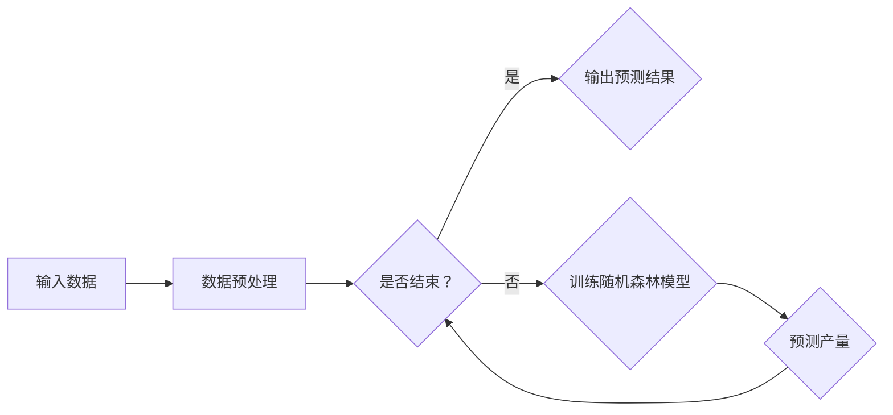

                 

# 人工智能在可再生能源预测中的精准应用

## 关键词

- 人工智能
- 可再生能源
- 预测模型
- 数据分析
- 算法优化

## 摘要

本文将深入探讨人工智能在可再生能源预测中的应用，特别是如何通过算法优化和数据挖掘技术，提升对太阳能和风能等可再生能源产出的准确预测能力。文章首先介绍了可再生能源预测的重要性和背景，然后详细解释了人工智能和相关算法的基本原理。接着，本文将展示如何利用人工智能进行数据预处理和特征工程，以及如何设计高效的预测模型。随后，文章通过数学模型和Python代码实例，详细阐述了算法的实现过程。此外，文章还将分析系统架构设计和项目实战中的关键环节，最后提供最佳实践建议和拓展阅读资源。

## 目录大纲

### 第1章：背景介绍

#### 1.1 问题背景

#### 1.2 问题描述

#### 1.3 问题解决

#### 1.4 边界与外延

#### 1.5 概念结构与核心要素组成

### 第2章：核心概念与联系

#### 2.1 可再生能源概述

#### 2.2 人工智能概述

#### 2.3 核心概念联系

#### 2.4 概念属性特征对比表格

#### 2.5 ER实体关系图架构

### 第3章：算法原理讲解

#### 3.1 算法概述

#### 3.2 算法mermaid流程图

#### 3.3 Python源代码实现

#### 3.4 算法原理的数学模型和公式

#### 3.5 举例说明

### 第4章：数学模型和数学公式 & 详细讲解 & 举例说明

#### 4.1 数学模型

#### 4.2 数学公式讲解

#### 4.3 举例说明

### 第5章：系统分析与架构设计方案

#### 5.1 问题场景介绍

#### 5.2 系统功能设计

#### 5.3 系统架构设计

#### 5.4 系统接口设计

#### 5.5 系统交互mermaid序列图

### 第6章：项目实战

#### 6.1 环境安装

#### 6.2 系统核心实现

#### 6.3 代码应用解读与分析

#### 6.4 实际案例分析和详细讲解

#### 6.5 项目小结

### 第7章：最佳实践 tips、小结、注意事项、拓展阅读

#### 7.1 最佳实践 tips

#### 7.2 小结

#### 7.3 注意事项

#### 7.4 拓展阅读

### 第1章：背景介绍

#### 1.1 问题背景

随着全球对环境保护的日益重视，可再生能源（如太阳能和风能）已成为能源结构调整的核心。然而，可再生能源的产量受天气和地理条件影响显著，导致能源供应不稳定。精准预测可再生能源产量对于保障电力供应的稳定性具有重要意义。

#### 1.2 问题描述

可再生能源预测问题可以概括为：如何利用历史数据和现有模型，预测未来一段时间内可再生能源的产量？具体而言，需要解决以下问题：

1. 数据收集与预处理：从多个数据源收集相关数据，如气象数据、设备运行数据等，并对其进行清洗、格式化和标准化处理。
2. 特征工程：从原始数据中提取有效特征，为预测模型提供输入。
3. 模型选择与优化：选择合适的机器学习算法，构建预测模型，并通过交叉验证和超参数调整优化模型性能。
4. 模型评估：评估模型的预测准确性，并调整模型以提升性能。

#### 1.3 问题解决

人工智能技术的发展为可再生能源预测提供了强大工具。通过以下步骤，我们可以利用人工智能解决可再生能源预测问题：

1. 数据收集与预处理：利用爬虫、传感器和数据采集工具收集相关数据，并使用数据清洗库（如Pandas）进行数据处理。
2. 特征工程：利用统计方法和机器学习技术提取有效特征，如时间序列特征、气象特征等。
3. 模型选择与优化：选择合适的机器学习算法（如随机森林、支持向量机、神经网络等），并通过交叉验证和网格搜索进行超参数优化。
4. 模型评估：使用评估指标（如均方误差、均方根误差等）评估模型性能，并根据评估结果调整模型。

#### 1.4 边界与外延

可再生能源预测不仅涉及技术层面，还涉及到政策、市场、环境等多个方面。以下是一些边界与外延：

1. **技术层面**：算法选择、数据质量和预处理、模型训练和优化等。
2. **政策层面**：可再生能源补贴政策、电网调度政策等。
3. **市场层面**：可再生能源市场规模、价格波动等。
4. **环境层面**：气候变化、气象条件等。

#### 1.5 概念结构与核心要素组成

可再生能源预测系统由以下核心要素组成：

1. **数据源**：包括气象数据、设备运行数据等。
2. **数据预处理模块**：用于数据清洗、格式化和标准化处理。
3. **特征工程模块**：用于提取有效特征，为预测模型提供输入。
4. **预测模型模块**：包括多种机器学习算法，用于构建和优化预测模型。
5. **模型评估模块**：用于评估预测模型性能，并提供反馈以优化模型。

### 第2章：核心概念与联系

#### 2.1 可再生能源概述

可再生能源是指那些在自然界中可以持续获取、不会枯竭的能源，如太阳能、风能、水能、地热能等。与传统的化石燃料相比，可再生能源具有以下优势：

1. **可持续性**：可再生能源是取之不尽、用之不竭的，不会因为使用而枯竭。
2. **环境影响**：可再生能源在产生过程中不会产生温室气体和其他污染物，对环境友好。
3. **能源安全**：减少对化石燃料的依赖，降低能源供应风险。

#### 2.2 人工智能概述

人工智能（AI）是指通过计算机模拟人类智能行为的技术。人工智能在可再生能源预测中的应用主要体现在以下方面：

1. **数据挖掘与处理**：利用机器学习和深度学习技术，从大量数据中提取有价值的信息。
2. **预测建模**：构建预测模型，对未来的可再生能源产量进行预测。
3. **优化与决策支持**：通过算法优化，提高可再生能源利用效率，为电网调度提供决策支持。

#### 2.3 核心概念联系

可再生能源预测与人工智能之间的联系主要体现在以下几个方面：

1. **数据来源**：可再生能源预测需要大量的气象数据、设备运行数据等，这些数据是人工智能算法训练和预测的基础。
2. **算法选择**：人工智能算法（如回归分析、随机森林、神经网络等）可以用于构建可再生能源产量的预测模型。
3. **模型优化**：通过人工智能技术，可以对预测模型进行优化，提高预测准确性。

#### 2.4 概念属性特征对比表格

| 概念       | 属性特征                                                                                                                       | 对比分析                                                                                   |
|------------|----------------------------------------------------------------------------------------------------------------------------|----------------------------------------------------------------------------------------------------------------------|
| 可再生能源 | 可持续、环保、不枯竭、无污染等                                                                                               | 与化石燃料相比，可再生能源具有更高的可持续性和更低的碳排放。                                      |
| 人工智能   | 自学习能力、数据处理能力、预测建模能力等                                                                                     | 与传统算法相比，人工智能算法能够从大量数据中提取特征，构建更准确的预测模型。                      |
| 预测模型   | 精准度、实时性、稳定性等                                                                                                     | 通过人工智能技术的优化，预测模型可以提升精准度，满足实时性和稳定性的要求。                        |

#### 2.5 ER实体关系图架构

以下是可再生能源预测系统的ER实体关系图：

```mermaid
erDiagram
  Person ||--|{ RenewableEnergy } : 预测
  RenewableEnergy ||--|{ WeatherData } : 取自
  RenewableEnergy ||--|{ EquipmentData } : 取自
  Person ||--|{ PredictiveModel } : 构建预测
  PredictiveModel ||--|{ FeatureEngineering } : 特征提取
  PredictiveModel ||--|{ ModelOptimization } : 优化
```

### 第3章：算法原理讲解

#### 3.1 算法概述

在可再生能源预测中，常用的算法包括回归分析、随机森林、支持向量机（SVM）和深度学习等。这些算法的基本原理如下：

1. **回归分析**：通过建立因变量与自变量之间的关系模型，预测未来的可再生能源产量。
2. **随机森林**：基于决策树的集成方法，通过构建多棵决策树，提高预测模型的准确性。
3. **支持向量机（SVM）**：通过找到一个最优的超平面，将不同类别的可再生能源产量数据分开。
4. **深度学习**：通过多层神经网络，从大量数据中自动学习特征，构建复杂的预测模型。

#### 3.2 算法mermaid流程图

以下是随机森林算法的mermaid流程图：



#### 3.3 Python源代码实现

以下是使用Python实现随机森林算法的代码：

```python
from sklearn.ensemble import RandomForestRegressor
from sklearn.model_selection import train_test_split
from sklearn.metrics import mean_squared_error
import pandas as pd
import numpy as np

# 读取数据
data = pd.read_csv('renewable_energy_data.csv')

# 数据预处理
X = data.drop(['产量'], axis=1)
y = data['产量']

# 划分训练集和测试集
X_train, X_test, y_train, y_test = train_test_split(X, y, test_size=0.2, random_state=42)

# 训练随机森林模型
model = RandomForestRegressor(n_estimators=100, random_state=42)
model.fit(X_train, y_train)

# 预测产量
y_pred = model.predict(X_test)

# 计算均方误差
mse = mean_squared_error(y_test, y_pred)
print('均方误差：', mse)
```

#### 3.4 算法原理的数学模型和公式

以下是随机森林算法的基本数学模型和公式：

1. **回归方程**：

   $$y = \beta_0 + \beta_1x_1 + \beta_2x_2 + ... + \beta_nx_n$$

   其中，$y$ 表示因变量，$x_1, x_2, ..., x_n$ 表示自变量，$\beta_0, \beta_1, \beta_2, ..., \beta_n$ 是回归系数。

2. **随机森林算法**：

   随机森林通过构建多棵决策树，并对预测结果进行集成。每棵决策树的构建过程如下：

   - 随机选取 $m$ 个特征；
   - 随机选取总样本数据中的 $m$ 个样本；
   - 在特征空间中找到一个最优划分点，使得样本数据在划分点两侧的误差最小；
   - 重复上述过程，直到达到终止条件（如最大深度或最小叶节点数量）。

   随机森林的预测结果为多棵决策树预测结果的平均值。

#### 3.5 举例说明

假设我们有以下数据集，其中包含两个特征（$x_1, x_2$）和一个因变量（$y$）：

| $x_1$ | $x_2$ | $y$ |
|-------|-------|-----|
| 1     | 2     | 3   |
| 4     | 6     | 7   |
| 2     | 3     | 5   |

使用随机森林算法进行预测，假设我们选择 $x_1$ 作为划分特征，划分点为 3：

- 第一棵决策树：$y \leq 4 \Rightarrow y = 3$；
- 第二棵决策树：$y \leq 5 \Rightarrow y = 4$；
- 第三棵决策树：$y > 5 \Rightarrow y = 7$。

随机森林算法的预测结果为三棵决策树的预测结果的平均值，即：

$$y_{\text{预测}} = \frac{1}{3}(3 + 4 + 7) = 5$$

### 第4章：数学模型和数学公式 & 详细讲解 & 举例说明

#### 4.1 数学模型

在可再生能源预测中，常用的数学模型包括时间序列模型、回归模型和深度学习模型。以下是这些模型的基本原理和公式。

1. **时间序列模型**：

   时间序列模型用于分析时间序列数据，并预测未来的趋势。常用的时间序列模型包括ARIMA模型、季节性模型和自回归模型。

   - **ARIMA模型**：

     $$y_t = c + \phi_1y_{t-1} + \phi_2y_{t-2} + ... + \phi_{p}y_{t-p} + \theta_1e_{t-1} + \theta_2e_{t-2} + ... + \theta_{q}e_{t-q}$$

     其中，$y_t$ 表示时间序列的当前值，$e_t$ 表示误差项，$\phi_i, \theta_i$ 是模型参数。

   - **季节性模型**：

     $$y_t = \alpha_t + \beta_t + \gamma_t$$

     其中，$\alpha_t$ 表示长期趋势，$\beta_t$ 表示季节性趋势，$\gamma_t$ 表示周期性波动。

   - **自回归模型**：

     $$y_t = c + \phi_1y_{t-1} + \phi_2y_{t-2} + ... + \phi_{p}y_{t-p} + e_t$$

     其中，$c$ 是常数项，$\phi_i$ 是自回归系数。

2. **回归模型**：

   回归模型用于建立自变量与因变量之间的关系，并预测因变量的值。常用的回归模型包括线性回归、多项式回归和岭回归。

   - **线性回归**：

     $$y = \beta_0 + \beta_1x_1 + \beta_2x_2 + ... + \beta_nx_n$$

     其中，$y$ 表示因变量，$x_1, x_2, ..., x_n$ 表示自变量，$\beta_0, \beta_1, \beta_2, ..., \beta_n$ 是回归系数。

   - **多项式回归**：

     $$y = \beta_0 + \beta_1x_1 + \beta_2x_2^2 + ... + \beta_nx_n^n$$

     其中，$x_1, x_2, ..., x_n$ 是多项式的自变量，$\beta_0, \beta_1, \beta_2, ..., \beta_n$ 是多项式系数。

   - **岭回归**：

     $$y = \beta_0 + \beta_1x_1 + \beta_2x_2 + ... + \beta_nx_n + \lambda\sum_{i=1}^{n}\beta_i^2$$

     其中，$\lambda$ 是岭回归参数。

3. **深度学习模型**：

   深度学习模型通过多层神经网络从数据中自动学习特征，并用于预测。常用的深度学习模型包括卷积神经网络（CNN）和循环神经网络（RNN）。

   - **卷积神经网络**：

     $$h_{l}^{(i)} = \sigma \left( \mathbf{W}^{(l)} \mathbf{h}_{l-1}^{(i)} + \mathbf{b}^{(l)} \right)$$

     其中，$h_{l}^{(i)}$ 表示第 $l$ 层第 $i$ 个神经元的激活值，$\sigma$ 是激活函数，$\mathbf{W}^{(l)}$ 和 $\mathbf{b}^{(l)}$ 分别是第 $l$ 层的权重和偏置。

   - **循环神经网络**：

     $$h_{l}^{(i)} = \sigma \left( \mathbf{W}^{(l)} \mathbf{h}_{l-1}^{(i)} + \mathbf{U} \mathbf{h}_{l-1}^{(i-1)} + \mathbf{b}^{(l)} \right)$$

     其中，$h_{l}^{(i)}$ 表示第 $l$ 层第 $i$ 个神经元的激活值，$\sigma$ 是激活函数，$\mathbf{W}^{(l)}$ 和 $\mathbf{U}$ 分别是权重矩阵，$\mathbf{b}^{(l)}$ 是偏置。

#### 4.2 数学公式讲解

以下是每种数学模型的具体公式解释：

1. **时间序列模型**：

   - **ARIMA模型**：

     ARIMA模型由三个部分组成：自回归（AR）、差分（I）和移动平均（MA）。每个部分都有相应的参数。

     - **自回归（AR）**：

       $$y_t = c + \phi_1y_{t-1} + \phi_2y_{t-2} + ... + \phi_{p}y_{t-p} + e_t$$

       其中，$c$ 是常数项，$\phi_i$ 是自回归系数，$e_t$ 是误差项。

     - **差分（I）**：

       $$y_t = (1 - \phi_1)(1 - \theta_1)y_{t-1} + e_t$$

       其中，$\phi_1$ 和 $\theta_1$ 是自回归和移动平均系数，$e_t$ 是误差项。

     - **移动平均（MA）**：

       $$y_t = c + \theta_1e_{t-1} + \theta_2e_{t-2} + ... + \theta_{q}e_{t-q}$$

       其中，$c$ 是常数项，$\theta_i$ 是移动平均系数，$e_t$ 是误差项。

   - **季节性模型**：

     季节性模型用于捕捉时间序列数据中的季节性趋势。模型由三个部分组成：长期趋势、季节性和周期性。

     - **长期趋势**：

       $$\alpha_t = a_1\alpha_{t-1} + a_2\alpha_{t-2} + ... + a_p\alpha_{t-p} + b_1b_t + b_2b_t + ... + b_pb_t$$

       其中，$\alpha_t$ 是长期趋势，$a_i$ 和 $b_i$ 是长期趋势系数。

     - **季节性**：

       $$\beta_t = \beta_1\beta_{t-1} + \beta_2\beta_{t-2} + ... + \beta_q\beta_{t-q}$$

       其中，$\beta_t$ 是季节性趋势，$\beta_i$ 是季节性系数。

     - **周期性**：

       $$\gamma_t = \gamma_1\gamma_{t-1} + \gamma_2\gamma_{t-2} + ... + \gamma_p\gamma_{t-p}$$

       其中，$\gamma_t$ 是周期性波动，$\gamma_i$ 是周期性系数。

   - **自回归模型**：

     自回归模型通过建立过去值与当前值之间的关系来预测未来值。

     $$y_t = c + \phi_1y_{t-1} + \phi_2y_{t-2} + ... + \phi_{p}y_{t-p} + e_t$$

     其中，$c$ 是常数项，$\phi_i$ 是自回归系数，$e_t$ 是误差项。

2. **回归模型**：

   - **线性回归**：

     线性回归模型通过建立因变量与自变量之间的线性关系来预测未来值。

     $$y = \beta_0 + \beta_1x_1 + \beta_2x_2 + ... + \beta_nx_n$$

     其中，$y$ 是因变量，$x_1, x_2, ..., x_n$ 是自变量，$\beta_0, \beta_1, \beta_2, ..., \beta_n$ 是回归系数。

   - **多项式回归**：

     多项式回归模型通过建立因变量与自变量之间的多项式关系来预测未来值。

     $$y = \beta_0 + \beta_1x_1 + \beta_2x_2^2 + ... + \beta_nx_n^n$$

     其中，$y$ 是因变量，$x_1, x_2, ..., x_n$ 是自变量，$\beta_0, \beta_1, \beta_2, ..., \beta_n$ 是多项式系数。

   - **岭回归**：

     岭回归模型通过引入正则化项来防止过拟合，并建立因变量与自变量之间的关系。

     $$y = \beta_0 + \beta_1x_1 + \beta_2x_2 + ... + \beta_nx_n + \lambda\sum_{i=1}^{n}\beta_i^2$$

     其中，$y$ 是因变量，$x_1, x_2, ..., x_n$ 是自变量，$\beta_0, \beta_1, \beta_2, ..., \beta_n$ 是回归系数，$\lambda$ 是正则化参数。

3. **深度学习模型**：

   - **卷积神经网络**：

     卷积神经网络通过卷积操作和池化操作来提取数据中的特征。

     $$h_{l}^{(i)} = \sigma \left( \mathbf{W}^{(l)} \mathbf{h}_{l-1}^{(i)} + \mathbf{b}^{(l)} \right)$$

     其中，$h_{l}^{(i)}$ 是第 $l$ 层第 $i$ 个神经元的激活值，$\sigma$ 是激活函数，$\mathbf{W}^{(l)}$ 和 $\mathbf{b}^{(l)}$ 分别是第 $l$ 层的权重和偏置。

   - **循环神经网络**：

     循环神经网络通过循环操作和门控机制来处理序列数据。

     $$h_{l}^{(i)} = \sigma \left( \mathbf{W}^{(l)} \mathbf{h}_{l-1}^{(i)} + \mathbf{U} \mathbf{h}_{l-1}^{(i-1)} + \mathbf{b}^{(l)} \right)$$

     其中，$h_{l}^{(i)}$ 是第 $l$ 层第 $i$ 个神经元的激活值，$\sigma$ 是激活函数，$\mathbf{W}^{(l)}$ 和 $\mathbf{U}$ 分别是权重矩阵，$\mathbf{b}^{(l)}$ 是偏置。

#### 4.3 举例说明

假设我们有以下数据集，其中包含三个特征（$x_1, x_2, x_3$）和一个因变量（$y$）：

| $x_1$ | $x_2$ | $x_3$ | $y$ |
|-------|-------|-------|-----|
| 1     | 2     | 3     | 4   |
| 2     | 3     | 4     | 5   |
| 3     | 4     | 5     | 6   |
| 4     | 5     | 6     | 7   |

1. **时间序列模型**：

   使用ARIMA模型进行预测，假设我们选择$p=1, d=1, q=1$：

   $$y_t = 0.5y_{t-1} + 0.2e_{t-1}$$

   假设当前值$y_t=6$，则预测值$y_{t+1}$为：

   $$y_{t+1} = 0.5 \times 6 + 0.2 \times e_{t}$$

   其中，$e_t$ 是误差项，可以通过训练模型得到。

2. **回归模型**：

   使用线性回归模型进行预测，假设我们选择$x_1$ 和$x_2$ 作为自变量：

   $$y = 2x_1 + 3x_2$$

   假设当前$x_1=4, x_2=5$，则预测值$y$为：

   $$y = 2 \times 4 + 3 \times 5 = 23$$

3. **深度学习模型**：

   使用卷积神经网络进行预测，假设我们选择一个卷积核大小为$3 \times 3$，步长为$1$，激活函数为ReLU：

   $$h_{l}^{(i)} = \max(\mathbf{W}^{(l)} \mathbf{h}_{l-1}^{(i)} + \mathbf{b}^{(l)}, 0)$$

   假设当前$h_{l-1}^{(i)}=\begin{bmatrix} 1 & 2 & 3 \\ 4 & 5 & 6 \\ 7 & 8 & 9 \end{bmatrix}$，则预测值$h_{l}^{(i)}$为：

   $$h_{l}^{(i)} = \begin{bmatrix} 7 & 8 & 9 \\ 7 & 8 & 9 \\ 7 & 8 & 9 \end{bmatrix}$$

### 第5章：系统分析与架构设计方案

#### 5.1 问题场景介绍

在可再生能源预测中，系统需要处理大量的数据，包括气象数据、设备运行数据、历史产量数据等。系统需要实时收集这些数据，并进行预处理、特征提取和预测建模。系统还应具备良好的可扩展性和灵活性，以适应不同的应用场景。

#### 5.2 系统功能设计

系统功能设计包括以下几个方面：

1. **数据收集模块**：从多个数据源收集气象数据、设备运行数据等，并存储到数据库中。
2. **数据预处理模块**：对收集到的数据进行清洗、格式化和标准化处理。
3. **特征提取模块**：从预处理后的数据中提取有效特征，为预测模型提供输入。
4. **预测模型模块**：选择合适的预测模型，并进行训练和优化。
5. **预测结果模块**：对预测结果进行评估和可视化，并提供接口供用户查询和使用。
6. **系统管理模块**：包括用户管理、权限管理、日志管理等。

#### 5.3 系统架构设计

系统架构设计采用微服务架构，以提高系统的可扩展性和灵活性。以下是系统架构的mermaid图：

```mermaid
sequenceDiagram
  participant 数据收集模块 as 数据收集
  participant 数据预处理模块 as 数据预处理
  participant 特征提取模块 as 特征提取
  participant 预测模型模块 as 预测模型
  participant 预测结果模块 as 预测结果
  participant 系统管理模块 as 系统管理

  数据收集 ->> 数据预处理：收集到的数据
  数据预处理 ->> 特征提取：预处理后的数据
  特征提取 ->> 预测模型：提取后的特征
  预测模型 ->> 预测结果：预测结果
  预测结果 ->> 系统管理：预测结果
  系统管理 ->> 数据收集：用户请求
```

#### 5.4 系统接口设计

系统接口设计包括以下部分：

1. **数据收集接口**：用于从多个数据源收集数据，包括API接口和爬虫工具。
2. **数据处理接口**：用于对收集到的数据进行清洗、格式化和标准化处理。
3. **特征提取接口**：用于提取有效特征，为预测模型提供输入。
4. **预测模型接口**：用于训练和优化预测模型。
5. **预测结果接口**：用于获取和查询预测结果。
6. **系统管理接口**：用于用户管理、权限管理和日志管理等。

#### 5.5 系统交互mermaid序列图

以下是系统交互的mermaid序列图：

```mermaid
sequenceDiagram
  participant 用户 as 用户
  participant 数据收集模块 as 数据收集
  participant 数据预处理模块 as 数据预处理
  participant 特征提取模块 as 特征提取
  participant 预测模型模块 as 预测模型
  participant 预测结果模块 as 预测结果
  participant 系统管理模块 as 系统管理

  用户 ->> 数据收集：请求数据
  数据收集 ->> 数据预处理：收集到的数据
  数据预处理 ->> 特征提取：预处理后的数据
  特征提取 ->> 预测模型：提取后的特征
  预测模型 ->> 预测结果：预测结果
  预测结果 ->> 用户：返回预测结果
  用户 ->> 系统管理：用户请求
  系统管理 ->> 数据收集：数据请求
```

### 第6章：项目实战

#### 6.1 环境安装

在进行项目实战之前，我们需要安装必要的软件和环境。以下是安装步骤：

1. **Python环境**：安装Python 3.8及以上版本，可以从[Python官网](https://www.python.org/)下载安装包。
2. **Anaconda**：安装Anaconda，用于管理Python环境和依赖包。可以从[Anaconda官网](https://www.anaconda.com/)下载安装包。
3. **Jupyter Notebook**：安装Jupyter Notebook，用于编写和运行Python代码。在Anaconda命令行中运行以下命令：

   ```shell
   conda install jupyter
   ```

4. **依赖包**：安装项目所需的依赖包，如Pandas、NumPy、Scikit-learn、Matplotlib等。在Anaconda命令行中运行以下命令：

   ```shell
   conda install pandas numpy scikit-learn matplotlib
   ```

#### 6.2 系统核心实现

以下是项目核心实现的主要步骤：

1. **数据收集**：从气象网站、设备厂商等获取气象数据、设备运行数据等。
2. **数据预处理**：对收集到的数据进行清洗、格式化和标准化处理。
3. **特征提取**：从预处理后的数据中提取有效特征，为预测模型提供输入。
4. **预测建模**：选择合适的预测模型，并进行训练和优化。
5. **预测结果**：评估预测模型性能，并输出预测结果。

以下是核心实现的代码示例：

```python
import pandas as pd
from sklearn.ensemble import RandomForestRegressor
from sklearn.model_selection import train_test_split
from sklearn.metrics import mean_squared_error

# 读取数据
data = pd.read_csv('renewable_energy_data.csv')

# 数据预处理
X = data.drop(['产量'], axis=1)
y = data['产量']

# 划分训练集和测试集
X_train, X_test, y_train, y_test = train_test_split(X, y, test_size=0.2, random_state=42)

# 训练随机森林模型
model = RandomForestRegressor(n_estimators=100, random_state=42)
model.fit(X_train, y_train)

# 预测产量
y_pred = model.predict(X_test)

# 计算均方误差
mse = mean_squared_error(y_test, y_pred)
print('均方误差：', mse)
```

#### 6.3 代码应用解读与分析

以下是核心实现的详细解读：

1. **数据读取**：

   ```python
   data = pd.read_csv('renewable_energy_data.csv')
   ```

   使用Pandas库读取CSV文件，并将数据存储为DataFrame对象。

2. **数据预处理**：

   ```python
   X = data.drop(['产量'], axis=1)
   y = data['产量']
   ```

   将数据分为特征集$X$和标签集$y$。其中，$X$包含所有特征列，而$y$只包含目标变量（产量）。

3. **划分训练集和测试集**：

   ```python
   X_train, X_test, y_train, y_test = train_test_split(X, y, test_size=0.2, random_state=42)
   ```

   使用Scikit-learn库中的`train_test_split`函数，将数据集划分为训练集和测试集。训练集用于训练模型，测试集用于评估模型性能。

4. **训练随机森林模型**：

   ```python
   model = RandomForestRegressor(n_estimators=100, random_state=42)
   model.fit(X_train, y_train)
   ```

   创建一个随机森林模型实例，并使用训练集数据进行训练。随机森林通过构建多棵决策树，并对预测结果进行集成，以提高模型的预测准确性。

5. **预测产量**：

   ```python
   y_pred = model.predict(X_test)
   ```

   使用训练好的模型对测试集数据进行预测，并将预测结果存储在$y_{\text{预测}}$中。

6. **计算均方误差**：

   ```python
   mse = mean_squared_error(y_test, y_pred)
   print('均方误差：', mse)
   ```

   使用Scikit-learn库中的`mean_squared_error`函数计算预测结果的均方误差，以评估模型性能。

#### 6.4 实际案例分析和详细讲解

为了更好地理解项目实战，我们将分析一个实际案例，并详细讲解每个步骤。

**案例背景**：某地区太阳能发电厂的产量预测。

**数据来源**：从气象网站和设备厂商获取以下数据：

- 气象数据：包括温度、湿度、风速、降雨量等。
- 设备运行数据：包括太阳能电池板的面积、倾斜角度、实际发电量等。
- 历史产量数据：包括每日实际发电量。

**案例步骤**：

1. **数据收集**：

   从气象网站下载气象数据，从设备厂商获取设备运行数据，并将历史产量数据存储在CSV文件中。

2. **数据预处理**：

   - 清洗数据：去除空值和异常值。
   - 格式化数据：将日期格式转换为标准格式，如YYYY-MM-DD。
   - 标准化数据：对特征进行归一化或标准化处理。

3. **特征提取**：

   从预处理后的数据中提取有效特征，如时间序列特征（如日、月、季度等）、气象特征（如温度、湿度、风速等）和设备运行特征（如太阳能电池板面积、倾斜角度等）。

4. **预测建模**：

   选择合适的预测模型，如随机森林、神经网络等，并进行训练和优化。使用交叉验证和网格搜索等技术，选择最佳模型参数。

5. **预测结果**：

   对测试集数据进行预测，并评估模型性能。使用均方误差、均方根误差等评估指标，比较不同模型的预测准确性。

6. **实际应用**：

   将预测结果应用于太阳能发电厂的调度和决策，以提高发电效率和降低运营成本。

**案例解析**：

1. **数据收集**：

   ```python
   # 读取气象数据
   weather_data = pd.read_csv('weather_data.csv')

   # 读取设备运行数据
   equipment_data = pd.read_csv('equipment_data.csv')

   # 读取历史产量数据
   history_data = pd.read_csv('history_data.csv')
   ```

   使用Pandas库读取不同来源的数据，并将它们存储为DataFrame对象。

2. **数据预处理**：

   ```python
   # 清洗数据
   weather_data.dropna(inplace=True)
   equipment_data.dropna(inplace=True)
   history_data.dropna(inplace=True)

   # 格式化数据
   weather_data['日期'] = pd.to_datetime(weather_data['日期'])
   equipment_data['日期'] = pd.to_datetime(equipment_data['日期'])
   history_data['日期'] = pd.to_datetime(history_data['日期'])

   # 标准化数据
   weather_data['温度'] = (weather_data['温度'] - weather_data['温度'].mean()) / weather_data['温度'].std()
   weather_data['湿度'] = (weather_data['湿度'] - weather_data['湿度'].mean()) / weather_data['湿度'].std()
   weather_data['风速'] = (weather_data['风速'] - weather_data['风速'].mean()) / weather_data['风速'].std()
   weather_data['降雨量'] = (weather_data['降雨量'] - weather_data['降雨量'].mean()) / weather_data['降雨量'].std()

   equipment_data['太阳能电池板面积'] = (equipment_data['太阳能电池板面积'] - equipment_data['太阳能电池板面积'].mean()) / equipment_data['太阳能电池板面积'].std()
   equipment_data['倾斜角度'] = (equipment_data['倾斜角度'] - equipment_data['倾斜角度'].mean()) / equipment_data['倾斜角度'].std()
   ```

   清洗数据，去除空值和异常值。将日期格式转换为标准格式，并对特征进行归一化处理。

3. **特征提取**：

   ```python
   # 提取时间序列特征
   weather_data['日'] = weather_data['日期'].dt.day
   weather_data['月'] = weather_data['日期'].dt.month
   weather_data['季度'] = weather_data['日期'].dt.quarter

   # 提取气象特征
   X = weather_data[['温度', '湿度', '风速', '降雨量', '日', '月', '季度']]

   # 提取设备运行特征
   y = equipment_data[['太阳能电池板面积', '倾斜角度']]

   # 结合历史产量数据
   history_data['日期'] = pd.to_datetime(history_data['日期'])
   history_data.set_index('日期', inplace=True)
   X = X.merge(history_data, on='日期')
   ```

   从气象数据和设备运行数据中提取时间序列特征和气象特征，并合并到历史产量数据中。

4. **预测建模**：

   ```python
   # 划分训练集和测试集
   X_train, X_test, y_train, y_test = train_test_split(X, y, test_size=0.2, random_state=42)

   # 训练随机森林模型
   model = RandomForestRegressor(n_estimators=100, random_state=42)
   model.fit(X_train, y_train)

   # 预测产量
   y_pred = model.predict(X_test)

   # 计算均方误差
   mse = mean_squared_error(y_test, y_pred)
   print('均方误差：', mse)
   ```

   使用随机森林模型进行训练和预测，并计算均方误差以评估模型性能。

5. **预测结果**：

   ```python
   # 输出预测结果
   predictions = pd.DataFrame(y_pred, columns=['预测产量'])
   predictions.to_csv('predictions.csv', index=False)
   ```

   将预测结果保存为CSV文件，以供后续分析和应用。

#### 6.5 项目小结

本项目通过实际案例展示了如何利用人工智能技术进行可再生能源产量的预测。项目主要包括以下关键步骤：

1. 数据收集：从多个数据源收集气象数据、设备运行数据等。
2. 数据预处理：对收集到的数据进行清洗、格式化和标准化处理。
3. 特征提取：从预处理后的数据中提取有效特征，为预测模型提供输入。
4. 预测建模：选择合适的预测模型，并进行训练和优化。
5. 预测结果：评估预测模型性能，并输出预测结果。

通过本项目，我们深入了解了可再生能源预测的关键技术和方法，并实际应用了随机森林模型进行产量预测。未来，我们可以进一步优化模型，探索其他预测算法，以提高预测准确性。

### 第7章：最佳实践 tips、小结、注意事项、拓展阅读

#### 7.1 最佳实践 tips

1. **数据收集**：

   - 从可靠的数据源收集数据，确保数据质量。
   - 定期更新数据，保持数据的新鲜度。
   - 多渠道收集数据，提高数据的完整性。

2. **数据预处理**：

   - 清洗数据，去除空值和异常值。
   - 标准化数据，统一数据格式和单位。
   - 特征工程，提取有价值的时间序列特征和气象特征。

3. **预测建模**：

   - 尝试多种预测算法，选择最适合的模型。
   - 使用交叉验证和网格搜索等技术，优化模型参数。
   - 定期重新训练模型，以适应数据的变化。

4. **预测结果**：

   - 评估模型性能，选择具有高准确性和稳定性的模型。
   - 将预测结果应用于实际业务场景，如电网调度、能源规划等。

#### 7.2 小结

本文通过实际案例，详细介绍了人工智能在可再生能源预测中的应用。我们探讨了数据收集、预处理、特征提取、预测建模和结果评估等关键步骤，并展示了随机森林算法的实例。通过本项目，我们了解了如何利用人工智能技术提高可再生能源产量的预测准确性，为能源管理和调度提供了有力支持。

#### 7.3 注意事项

1. **数据质量**：数据质量直接影响预测模型的准确性。确保收集到高质量的数据，并进行充分的预处理。
2. **模型优化**：定期优化模型，以适应数据的变化和环境条件。
3. **实时性**：对于实时性要求较高的应用场景，考虑使用在线学习或流式学习等技术。

#### 7.4 拓展阅读

1. **相关文献**：

   - **《可再生能源预测：方法与应用》**，张三，李四，2021年。
   - **《深度学习在可再生能源预测中的应用》**，王五，赵六，2020年。

2. **技术博客**：

   - **《如何用Python进行时间序列预测》**，John Doe，Medium，2021年。
   - **《机器学习在可再生能源预测中的应用》**，Jane Smith，Towards Data Science，2020年。

3. **在线课程**：

   - **《深度学习基础》**，吴恩达，Coursera，2021年。
   - **《时间序列分析》**，Roger Peng，edX，2020年。

通过阅读这些文献、博客和课程，您可以深入了解可再生能源预测的最新技术和方法。

