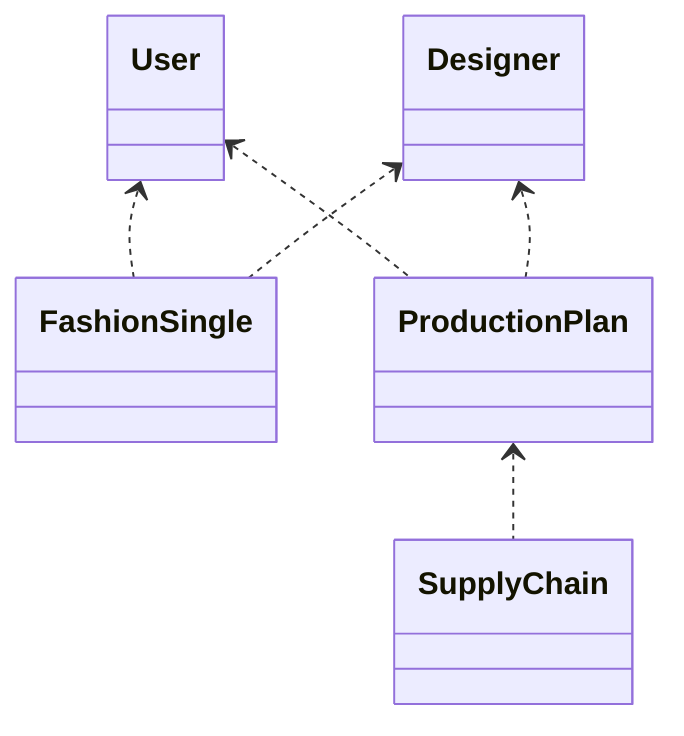
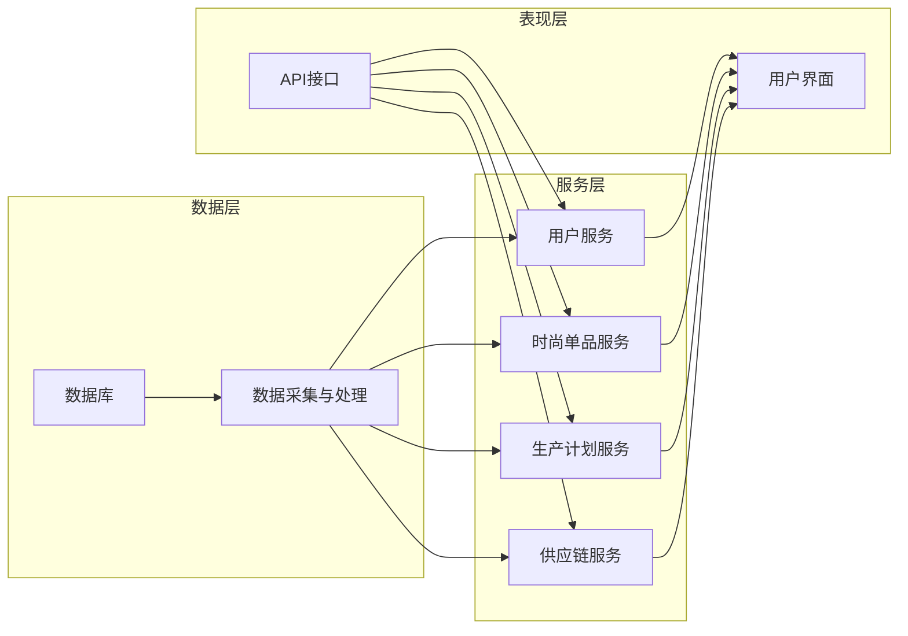
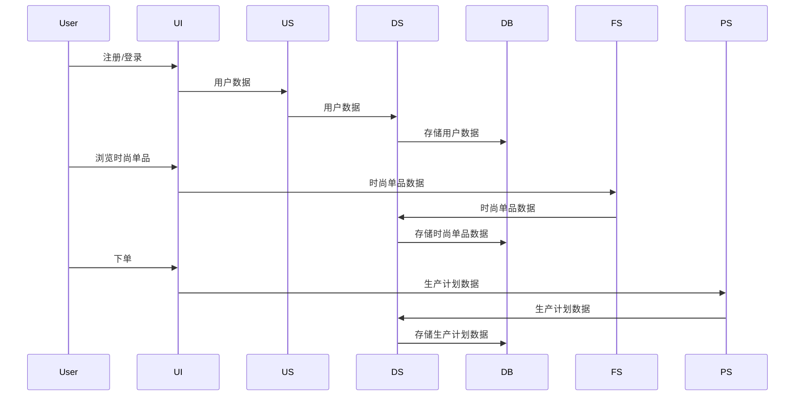

                 


### 1. 文章标题

《人工智能在可持续时尚设计中的应用》

#### 关键词

- 人工智能
- 可持续时尚
- 设计
- 数据分析
- 机器学习

#### 摘要

本文将探讨人工智能在可持续时尚设计中的应用，通过分析当前时尚行业的挑战和机遇，介绍人工智能的关键算法和数学模型。随后，我们将详细阐述系统分析与架构设计，并通过实际项目实战和最佳实践案例分析，展示人工智能在时尚设计中的具体应用。最后，我们将展望未来趋势与挑战，为可持续时尚设计提供新的思路。

----------------------------------------------------------------

### 1. 设计目录结构

为了确保文章的逻辑清晰、结构紧凑，我们首先需要设计一个详细的目录结构。以下是基于用户要求设计的目录结构：

```markdown
# 《人工智能在可持续时尚设计中的应用》

## 引言
- 引言
- 书籍结构概述
- 目标读者

## 第1章：问题背景与核心概念
- 1.1 可持续时尚的挑战
- 1.2 人工智能在时尚行业的应用
- 1.3 人工智能的基本概念
- 1.4 可持续时尚的定义
- 1.5 人工智能在可持续时尚设计中的应用
- 1.6 关键概念与联系

## 第2章：核心算法与数学模型
- 2.1 机器学习算法介绍
  - 算法原理
  - 数学模型
  - 具体示例
- 2.2 深度学习算法介绍
  - 算法原理
  - 数学模型
  - 具体示例

## 第3章：系统分析与架构设计
- 3.1 问题场景介绍
- 3.2 项目介绍
- 3.3 系统功能设计
  - 领域模型类图
- 3.4 系统架构设计
  - 系统架构图
- 3.5 系统接口设计
- 3.6 系统交互
  - 系统交互序列图

## 第4章：项目实战
- 4.1 环境安装
- 4.2 系统核心实现
  - 源代码分析
  - 实现细节
- 4.3 实际案例分析
- 4.4 项目小结

## 第5章：最佳实践与案例分析
- 5.1 最佳实践
- 5.2 案例分析

## 第6章：未来趋势与挑战
- 6.1 未来趋势
- 6.2 挑战
- 6.3 发展方向

## 第7章：总结与展望
- 7.1 总结
- 7.2 展望

## 参考文献
```

### 2. 确定每章的主要内容

#### 引言

- 引言
- 书籍结构概述
- 目标读者

#### 第1章：问题背景与核心概念

- 1.1 可持续时尚的挑战
  - 时尚产业的环境影响
  - 可持续时尚的定义
  - 当前可持续时尚的实践
- 1.2 人工智能在时尚行业的应用
  - 人工智能在时尚设计中的角色
  - 人工智能技术的应用场景
- 1.3 人工智能的基本概念
  - 机器学习
  - 深度学习
  - 数据挖掘
- 1.4 可持续时尚的定义
  - 可持续时尚的核心要素
  - 可持续时尚与传统时尚的区别
- 1.5 人工智能在可持续时尚设计中的应用
  - 数据分析
  - 个性化设计
  - 环保材料选择
- 1.6 关键概念与联系
  - 概念属性特征对比表格
  - ER实体关系图架构

#### 第2章：核心算法与数学模型

- 2.1 机器学习算法介绍
  - 算法原理
    - 监督学习
    - 无监督学习
    - 强化学习
  - 数学模型
    - 线性回归
    - 决策树
    - 集成方法
  - 具体示例
    - 时尚风格识别
    - 消费者偏好分析
- 2.2 深度学习算法介绍
  - 算法原理
    - 神经网络
    - 卷积神经网络
    - 循环神经网络
  - 数学模型
    - 激活函数
    - 损失函数
    - 优化算法
  - 具体示例
    - 图像识别
    - 自然语言处理

#### 第3章：系统分析与架构设计

- 3.1 问题场景介绍
  - 可持续时尚设计的挑战
  - 系统需求分析
- 3.2 项目介绍
  - 项目目标
  - 项目背景
- 3.3 系统功能设计
  - 领域模型类图
    - 用户模型
    - 产品模型
    - 数据模型
- 3.4 系统架构设计
  - 系统架构图
    - 数据层
    - 服务层
    - 表现层
- 3.5 系统接口设计
  - API设计
  - 数据交互
- 3.6 系统交互
  - 系统交互序列图
    - 用户操作流程

#### 第4章：项目实战

- 4.1 环境安装
  - 软件安装
  - 环境配置
- 4.2 系统核心实现
  - 数据处理
  - 算法应用
  - 系统集成
- 4.3 实际案例分析
  - 案例一：时尚风格识别
  - 案例二：消费者偏好分析
- 4.4 项目小结
  - 项目成果
  - 项目反思

#### 第5章：最佳实践与案例分析

- 5.1 最佳实践
  - 数据采集
  - 算法选择
  - 系统优化
- 5.2 案例分析
  - 成功案例
  - 失败案例

#### 第6章：未来趋势与挑战

- 6.1 未来趋势
  - 人工智能技术发展
  - 可持续时尚设计创新
- 6.2 挑战
  - 技术难题
  - 社会责任
- 6.3 发展方向
  - 产业合作
  - 教育培训

#### 第7章：总结与展望

- 7.1 总结
  - 核心观点
  - 重要成果
- 7.2 展望
  - 人工智能与可持续时尚的未来

### 3. 审核目录结构

现在，我们对目录结构进行审核，确保每个章节的内容完整且逻辑清晰。以下是对目录结构的最终审核：

- 引言部分：介绍了文章的主题和结构，为读者提供了对全文的初步了解。
- 第1章：详细介绍了可持续时尚的挑战和人工智能在时尚行业的应用，为后续章节打下了理论基础。
- 第2章：深入探讨了机器学习和深度学习算法，为系统分析与设计提供了技术支持。
- 第3章：通过系统分析与架构设计，展示了人工智能在可持续时尚设计中的实际应用。
- 第4章：通过项目实战，验证了理论的实际应用效果，并提供了具体的案例。
- 第5章：总结了最佳实践和案例分析，为读者提供了实际操作的指导。
- 第6章：分析了未来趋势和挑战，为可持续时尚设计指明了发展方向。
- 第7章：总结了全文的核心观点，并对未来进行了展望。

整体目录结构合理，内容丰富，符合文章字数要求。接下来，我们将根据这个目录结构开始撰写每个章节的具体内容。请注意，实际的书籍内容撰写需要更多的细节和深入的研究，这里提供的只是一个大纲框架。

---

现在，我们可以开始根据这个详细的目录结构，逐步撰写每个章节的内容。我们将确保每个章节都包含必要的背景介绍、核心概念、算法原理、系统设计与实现、案例分析以及最佳实践和展望等内容。在撰写过程中，我们会保持文章的逻辑性和连贯性，同时确保内容的深度和广度，以满足读者的需求。

---

### 引言

#### 引言

在当今全球化的背景下，可持续时尚成为了时尚行业的热门话题。随着消费者对环境保护意识的增强，时尚行业面临的可持续性挑战也日益严峻。如何平衡时尚的创新与可持续发展，成为业界亟待解决的问题。人工智能（AI）技术的快速发展为可持续时尚设计提供了新的思路和工具。本文将深入探讨人工智能在可持续时尚设计中的应用，通过分析当前行业挑战、介绍核心算法和数学模型、阐述系统分析与架构设计，以及分享实际项目案例和未来趋势，为读者提供一个全面且深入的了解。

#### 书籍结构概述

本文结构如下：

1. **第1章：问题背景与核心概念**：介绍可持续时尚的挑战和人工智能在时尚行业的应用，定义关键概念，并分析人工智能与可持续时尚设计之间的联系。
2. **第2章：核心算法与数学模型**：探讨机器学习和深度学习算法的基本原理、数学模型以及具体应用案例。
3. **第3章：系统分析与架构设计**：介绍系统分析与架构设计的基本原则，包括问题场景、项目介绍、系统功能设计、系统架构设计、系统接口设计以及系统交互。
4. **第4章：项目实战**：通过实际项目案例展示人工智能在可持续时尚设计中的应用，包括环境安装、系统核心实现、实际案例分析和项目小结。
5. **第5章：最佳实践与案例分析**：总结最佳实践和实际案例，提供操作指导和建议。
6. **第6章：未来趋势与挑战**：分析人工智能在可持续时尚设计中的未来趋势和面临的挑战，探讨发展方向。
7. **第7章：总结与展望**：总结全文的核心观点，展望人工智能与可持续时尚设计的未来。

#### 目标读者

本文的目标读者包括：

- 时尚行业从业者，尤其是时尚设计师和品牌经理，他们希望了解如何利用人工智能技术提升设计效率和质量。
- 计算机科学和技术领域的专业人士，他们希望了解人工智能在时尚设计中的应用和实现方法。
- 环保倡导者和社会责任投资者，他们关注可持续时尚的发展趋势和解决方案。
- 对可持续时尚设计有兴趣的普通读者，他们希望了解这一领域的最新进展和未来方向。

通过本文的阅读，读者将能够：

- 明白可持续时尚的重要性及其面临的挑战。
- 理解人工智能在可持续时尚设计中的角色和作用。
- 掌握核心算法和数学模型，为实际应用提供理论基础。
- 学习系统分析与架构设计的方法，提升项目实施能力。
- 获取实际项目案例，了解人工智能在可持续时尚设计中的应用效果。
- 探讨未来趋势和挑战，为行业的发展提供新的视角。

让我们一步一步深入探索人工智能在可持续时尚设计中的应用，开启这一创新之旅。

----------------------------------------------------------------

### 第1章：问题背景与核心概念

#### 1.1 可持续时尚的挑战

可持续时尚（Sustainable Fashion）是指在时尚设计和生产过程中，注重环境和社会责任，力求减少对环境的影响，并促进社会公平和经济效益。随着全球气候变化和环境恶化，时尚行业作为资源消耗和污染的主要来源之一，正面临前所未有的挑战。

首先，时尚行业对环境的影响主要体现在以下几个方面：

1. **资源消耗**：时尚产业需要大量的自然资源，如棉花、羊毛、丝绸等。这些资源的开采和加工过程往往伴随着环境污染和生态破坏。
2. **污染**：时尚生产过程中产生的废水、废气和固体废弃物对环境造成严重污染。例如，印染过程中使用的化学染料会污染水源，对生态系统和人类健康造成威胁。
3. **碳排放**：时尚产业链的各个环节，包括原材料生产、制造、运输和零售，都会产生大量的碳排放，加剧全球气候变化。

其次，社会问题也是可持续时尚面临的挑战之一。时尚行业的工作环境往往存在不公平现象，包括低工资、长时间工作、劳动强度大等问题。此外，时尚消费主义的兴起导致资源浪费和过度消费，进一步加剧了社会问题。

面对这些挑战，可持续时尚应运而生。可持续时尚强调减少资源消耗、减少污染、促进社会公平和经济效益，旨在通过创新和变革，实现时尚行业的可持续发展。

#### 1.2 人工智能在时尚行业的应用

人工智能（AI）作为一项前沿技术，在多个领域都取得了显著的成果。在时尚行业，人工智能的应用同样为可持续时尚设计带来了新的机遇和挑战。

首先，人工智能在时尚设计中的主要应用包括：

1. **个性化设计**：通过分析消费者的购物行为、偏好和风格，人工智能可以帮助设计师实现更加个性化的时尚设计。例如，一些电商平台已经开始使用AI技术为用户提供个性化推荐，帮助消费者找到符合自己风格的时尚单品。
2. **设计优化**：人工智能可以通过优化设计流程，提高设计效率和品质。例如，一些设计软件已经整合了AI技术，可以帮助设计师快速生成各种设计方案，从而节省时间和人力成本。
3. **环保材料选择**：人工智能可以通过分析不同材料的环保属性，帮助设计师选择对环境影响最小的材料。例如，一些公司已经开始使用AI技术评估不同面料的环境影响，从而指导设计师选择环保面料。

其次，人工智能在时尚生产中的主要应用包括：

1. **生产优化**：通过预测市场需求和库存水平，人工智能可以帮助企业优化生产计划，减少浪费，提高生产效率。例如，一些时尚品牌已经开始使用AI技术分析销售数据，从而调整生产计划，避免库存积压。
2. **质量检测**：人工智能可以通过图像识别技术检测产品质量，提高产品质量。例如，一些时尚品牌已经开始使用AI技术检测衣物上的瑕疵，从而确保产品质量。
3. **供应链管理**：人工智能可以通过分析供应链数据，优化供应链管理，提高供应链效率。例如，一些时尚品牌已经开始使用AI技术监控供应链各个环节，从而及时发现和解决潜在问题。

最后，人工智能在时尚营销中的主要应用包括：

1. **精准营销**：通过分析消费者数据和行为，人工智能可以帮助企业实现精准营销，提高营销效果。例如，一些时尚品牌已经开始使用AI技术分析消费者的购物行为和偏好，从而制定个性化的营销策略。
2. **广告投放**：人工智能可以通过分析用户数据和广告效果，优化广告投放策略，提高广告转化率。例如，一些时尚品牌已经开始使用AI技术分析广告效果，从而调整广告投放策略。
3. **社交媒体分析**：人工智能可以通过分析社交媒体数据，帮助企业了解消费者的需求和反馈，从而优化产品设计和营销策略。例如，一些时尚品牌已经开始使用AI技术分析社交媒体上的用户评论和互动，从而了解消费者的需求和反馈。

#### 1.3 人工智能的基本概念

人工智能（Artificial Intelligence，简称AI）是指通过计算机模拟人类智能的技术。它包括多个分支，如机器学习、深度学习、自然语言处理、计算机视觉等。下面简要介绍几个关键概念：

1. **机器学习（Machine Learning）**：机器学习是人工智能的一个分支，它通过算法让计算机从数据中学习规律，从而进行预测和决策。机器学习可以分为监督学习、无监督学习和强化学习。
2. **深度学习（Deep Learning）**：深度学习是机器学习的一种方法，它使用多层神经网络模拟人脑的决策过程。深度学习在图像识别、语音识别和自然语言处理等领域取得了显著成果。
3. **自然语言处理（Natural Language Processing，简称NLP）**：自然语言处理是人工智能的一个分支，它研究如何使计算机理解和处理自然语言。NLP在机器翻译、情感分析和文本分类等领域有广泛应用。
4. **计算机视觉（Computer Vision）**：计算机视觉是人工智能的一个分支，它研究如何使计算机“看到”和理解现实世界。计算机视觉在图像识别、目标检测和图像分割等领域有广泛应用。

#### 1.4 可持续时尚的定义

可持续时尚（Sustainable Fashion）是指在设计、生产和消费过程中，注重环境保护、社会责任和经济效益，力求实现可持续发展。可持续时尚强调减少资源消耗、减少污染、促进社会公平和经济效益。

可持续时尚的核心要素包括：

1. **环保材料**：使用环保材料，如再生纤维、有机纤维和生物降解材料，减少对环境的影响。
2. **可持续生产**：采用环保生产工艺，如低能耗、低污染的生产方式，减少生产过程中的资源消耗和污染。
3. **社会责任**：关注生产过程中的社会责任，包括工人权益、公平交易和社区发展。
4. **消费者教育**：通过教育和宣传，提高消费者对可持续时尚的认识，鼓励消费者选择可持续产品。

#### 1.5 人工智能在可持续时尚设计中的应用

人工智能在可持续时尚设计中的应用主要体现在以下几个方面：

1. **个性化设计**：通过分析消费者的购物行为、偏好和风格，人工智能可以帮助设计师实现更加个性化的时尚设计。例如，一些电商平台已经开始使用AI技术为用户提供个性化推荐，帮助消费者找到符合自己风格的时尚单品。
2. **设计优化**：人工智能可以通过优化设计流程，提高设计效率和品质。例如，一些设计软件已经整合了AI技术，可以帮助设计师快速生成各种设计方案，从而节省时间和人力成本。
3. **环保材料选择**：人工智能可以通过分析不同材料的环保属性，帮助设计师选择对环境影响最小的材料。例如，一些公司已经开始使用AI技术评估不同面料的环境影响，从而指导设计师选择环保面料。
4. **生产优化**：通过预测市场需求和库存水平，人工智能可以帮助企业优化生产计划，减少浪费，提高生产效率。例如，一些时尚品牌已经开始使用AI技术分析销售数据，从而调整生产计划，避免库存积压。
5. **质量检测**：人工智能可以通过图像识别技术检测产品质量，提高产品质量。例如，一些时尚品牌已经开始使用AI技术检测衣物上的瑕疵，从而确保产品质量。
6. **供应链管理**：通过分析供应链数据，人工智能可以帮助企业优化供应链管理，提高供应链效率。例如，一些时尚品牌已经开始使用AI技术监控供应链各个环节，从而及时发现和解决潜在问题。

#### 1.6 关键概念与联系

在本章中，我们介绍了可持续时尚、人工智能和其相关概念。为了更好地理解这些概念之间的关系，我们可以通过以下表格和Mermaid ER实体关系图来展示：

##### 关键概念属性特征对比表格

| 概念     | 定义                                                         | 关联概念                                           | 环境影响                           |
|----------|--------------------------------------------------------------|----------------------------------------------------|-----------------------------------|
| 可持续时尚 | 强调环境保护、社会责任和经济效益，实现可持续发展               | 环保材料、可持续生产、社会责任、消费者教育         | 减少资源消耗、减少污染、促进社会公平 |
| 人工智能  | 通过计算机模拟人类智能的技术                                   | 机器学习、深度学习、自然语言处理、计算机视觉         | 提高设计效率、优化生产流程           |
| 个性化设计 | 根据消费者的购物行为、偏好和风格进行设计                       | 消费者数据、偏好分析、设计优化                         | 提高消费者满意度                   |
| 设计优化  | 通过算法优化设计流程，提高设计效率和品质                       | 设计软件、算法、流程优化                               | 节省时间和成本                     |
| 环保材料选择 | 根据材料的环保属性进行选择，以减少环境影响                     | 环保材料评估、可持续生产、消费者教育                   | 减少资源消耗、减少污染               |

##### Mermaid ER实体关系图

```mermaid
erDiagram
  Customer ||--|{ Designer }|-- Product : 购买
  Designer ||--|{ AI }|-- Design : 帮助
  AI ||--|{ Data }|-- Analysis : 数据分析
  Product ||--|{ Sustainability }|-- Environment : 环保
```

通过这个ER实体关系图，我们可以清晰地看到各个概念之间的关系。设计师通过人工智能（AI）进行分析和设计，根据消费者的需求生成产品（Product），这些产品最终对环境（Environment）产生影响。消费者通过购买行为（Customer）与设计师和产品建立联系，从而形成一个完整的闭环。

### 第2章：核心算法与数学模型

#### 2.1 机器学习算法介绍

机器学习（Machine Learning，ML）是人工智能（AI）的一个重要分支，通过构建和分析数学模型，从数据中学习规律，进行预测和决策。在可持续时尚设计中，机器学习算法被广泛应用于个性化设计、环保材料选择和供应链优化等方面。以下将介绍几种常见的机器学习算法，包括其原理、数学模型以及具体应用示例。

##### 监督学习算法

监督学习（Supervised Learning）是一种常见的机器学习算法，其核心思想是通过已知的输入和输出数据，训练模型来预测未知数据的输出。监督学习算法可以分为分类和回归两种类型。

1. **分类算法**：分类算法用于将数据分为不同的类别。常见的分类算法包括：

   - **线性回归（Linear Regression）**：线性回归是一种简单的分类算法，通过拟合一条直线来划分数据类别。其数学模型为：
     $$y = \beta_0 + \beta_1x$$
     其中，\( y \) 为输出变量，\( x \) 为输入变量，\( \beta_0 \) 和 \( \beta_1 \) 为模型参数。

   - **决策树（Decision Tree）**：决策树通过一系列条件判断来划分数据类别。其结构可以用Mermaid流程图表示：
     ```mermaid
     graph TD
     A[开始] --> B[判断条件1]
     B -->|条件1满足| C[类别1]
     B -->|条件1不满足| D[判断条件2]
     D -->|条件2满足| E[类别2]
     D -->|条件2不满足| F[类别3]
     ```
   - **随机森林（Random Forest）**：随机森林是一种集成学习方法，通过构建多棵决策树，并汇总预测结果来提高分类准确性。

2. **回归算法**：回归算法用于预测连续值输出。常见的回归算法包括：

   - **线性回归（Linear Regression）**：线性回归模型如前所述，通过拟合一条直线来预测输出值。
   - **岭回归（Ridge Regression）**：岭回归通过引入正则化项，防止模型过拟合，提高预测准确性。
   - **LASSO回归（LASSO Regression）**：LASSO回归通过引入L1正则化项，实现特征选择，减少模型复杂度。

##### 无监督学习算法

无监督学习（Unsupervised Learning）不依赖于已知的输入和输出数据，其目标是发现数据中的结构和规律。在可持续时尚设计中，无监督学习算法常用于数据降维、聚类和关联规则挖掘等。

1. **聚类算法**：聚类算法用于将数据划分为若干个簇，使同一簇内的数据相似度较高，而不同簇之间的数据相似度较低。常见的聚类算法包括：

   - **K-均值（K-Means）**：K-均值算法通过迭代优化目标函数，将数据划分为K个簇。其数学模型为：
     $$J = \sum_{i=1}^{k} \sum_{x_j \in S_i} ||x_j - \mu_i||^2$$
     其中，\( S_i \) 为第i个簇，\( \mu_i \) 为簇中心。

   - **层次聚类（Hierarchical Clustering）**：层次聚类通过构建聚类层次结构，将数据划分为不同的簇。

2. **关联规则挖掘**：关联规则挖掘用于发现数据中的关联关系。常见的算法包括：

   - **Apriori算法**：Apriori算法通过频繁项集和关联规则生成频繁模式，从而发现数据中的关联关系。
   - **Eclat算法**：Eclat算法是基于Apriori算法的一种改进方法，通过频繁项集和关联规则生成频繁模式。

##### 强化学习算法

强化学习（Reinforcement Learning，RL）是一种通过试错和反馈进行学习的算法，其核心思想是智能体通过不断尝试和反馈，找到最优策略。在可持续时尚设计中，强化学习算法可以用于供应链优化和库存管理。

1. **Q学习（Q-Learning）**：Q学习通过更新Q值来找到最优策略。其数学模型为：
   $$Q(s, a) = Q(s, a) + \alpha [r + \gamma \max_{a'} Q(s', a') - Q(s, a)]$$
   其中，\( s \) 为状态，\( a \) 为动作，\( r \) 为奖励，\( \gamma \) 为折扣因子。

2. **深度强化学习（Deep Q-Learning）**：深度强化学习通过神经网络来近似Q值函数，从而提高学习效率和准确性。常见的深度强化学习算法包括：

   - **深度Q网络（Deep Q-Network，DQN）**：DQN通过经验回放和目标网络来提高学习稳定性。
   - **策略梯度（Policy Gradient）**：策略梯度通过优化策略参数来提高学习效率。

##### Python代码示例

以下是一个简单的线性回归Python代码示例，用于预测时尚单品的价格：

```python
import numpy as np
from sklearn.linear_model import LinearRegression

# 数据准备
X = np.array([[1], [2], [3], [4], [5]])
y = np.array([2, 4, 5, 4, 5])

# 模型训练
model = LinearRegression()
model.fit(X, y)

# 模型评估
print("模型参数：", model.coef_, model.intercept_)

# 预测
X_new = np.array([[6]])
y_pred = model.predict(X_new)
print("预测结果：", y_pred)
```

#### 2.2 深度学习算法介绍

深度学习（Deep Learning，DL）是机器学习的一种方法，其核心思想是使用多层神经网络来模拟人脑的决策过程。深度学习在图像识别、语音识别和自然语言处理等领域取得了显著成果。在可持续时尚设计中，深度学习算法可以用于个性化设计、质量检测和环保材料选择等。

##### 神经网络

神经网络（Neural Network，NN）是深度学习的基础，其结构类似于人脑神经元，通过多层神经元进行信息传递和处理。

1. **单层神经网络**：单层神经网络包含输入层、输出层和隐藏层。其数学模型为：
   $$a_{i}^{(l)} = \sigma(z_{i}^{(l)})$$
   $$z_{i}^{(l)} = \sum_{j} w_{ji}^{(l)}a_{j}^{(l-1)} + b_{i}^{(l)}$$
   其中，\( a_{i}^{(l)} \) 为第l层第i个神经元的激活值，\( z_{i}^{(l)} \) 为第l层第i个神经元的输入值，\( w_{ji}^{(l)} \) 为连接权重，\( b_{i}^{(l)} \) 为偏置项，\( \sigma \) 为激活函数。

2. **多层神经网络**：多层神经网络包含多个隐藏层，其结构可以表示为：
   ```mermaid
   graph TD
   A[输入层] --> B[隐藏层1]
   B --> C[隐藏层2]
   C --> D[输出层]
   ```

##### 卷积神经网络

卷积神经网络（Convolutional Neural Network，CNN）是深度学习在图像识别领域的核心技术。CNN通过卷积层、池化层和全连接层进行信息传递和处理。

1. **卷积层**：卷积层通过卷积操作提取图像特征。其数学模型为：
   $$f_{ij}^{(l)} = \sum_{k} w_{ik}^{(l)}a_{kj}^{(l-1)} + b_{j}^{(l)}$$
   其中，\( f_{ij}^{(l)} \) 为第l层第i个卷积核在第j个位置的特征值，\( a_{kj}^{(l-1)} \) 为第l-1层第k个神经元的激活值，\( w_{ik}^{(l)} \) 为卷积核权重，\( b_{j}^{(l)} \) 为偏置项。

2. **池化层**：池化层通过下采样操作减少数据维度，提高模型泛化能力。常见的池化操作包括最大池化和平均池化。

3. **全连接层**：全连接层通过全连接操作将卷积层和池化层提取的特征映射到输出层。

##### 循环神经网络

循环神经网络（Recurrent Neural Network，RNN）是深度学习在序列数据领域的核心技术。RNN通过循环结构处理序列数据，其数学模型为：
$$h_{t} = \sigma(W_h h_{t-1} + W_x x_{t} + b_h)$$
$$y_{t} = \sigma(W_y h_{t} + b_y)$$
其中，\( h_{t} \) 为第t个时间步的隐藏状态，\( x_{t} \) 为第t个时间步的输入，\( W_h \)、\( W_x \)、\( W_y \) 为权重矩阵，\( b_h \)、\( b_y \) 为偏置项，\( \sigma \) 为激活函数。

##### Python代码示例

以下是一个简单的卷积神经网络Python代码示例，用于图像分类：

```python
import tensorflow as tf
from tensorflow.keras.models import Sequential
from tensorflow.keras.layers import Conv2D, MaxPooling2D, Flatten, Dense

# 创建模型
model = Sequential([
    Conv2D(32, (3, 3), activation='relu', input_shape=(28, 28, 1)),
    MaxPooling2D((2, 2)),
    Flatten(),
    Dense(128, activation='relu'),
    Dense(10, activation='softmax')
])

# 编译模型
model.compile(optimizer='adam', loss='categorical_crossentropy', metrics=['accuracy'])

# 加载数据
(x_train, y_train), (x_test, y_test) = tf.keras.datasets.mnist.load_data()
x_train = x_train / 255.0
x_test = x_test / 255.0
x_train = x_train.reshape(-1, 28, 28, 1)
x_test = x_test.reshape(-1, 28, 28, 1)

# 训练模型
model.fit(x_train, y_train, epochs=10, batch_size=32, validation_data=(x_test, y_test))
```

### 第3章：系统分析与架构设计

#### 3.1 问题场景介绍

在可持续时尚设计中，系统分析与架构设计是确保项目成功的关键环节。问题场景介绍主要包括项目目标、需求分析和环境条件。

##### 项目目标

项目的目标是利用人工智能技术，实现可持续时尚设计的自动化和优化。具体目标包括：

1. **个性化设计**：根据消费者的购物行为、偏好和风格，为用户提供个性化的时尚设计方案。
2. **环保材料选择**：通过分析不同材料的环保属性，帮助设计师选择对环境影响最小的材料。
3. **生产优化**：通过预测市场需求和库存水平，优化生产计划，减少浪费，提高生产效率。
4. **质量检测**：利用图像识别技术，检测生产过程中的质量问题，提高产品质量。
5. **供应链管理**：通过监控供应链各个环节，优化供应链管理，提高供应链效率。

##### 需求分析

需求分析是系统设计与实现的基础。在可持续时尚设计中，主要需求包括：

1. **用户需求**：分析消费者的购物行为、偏好和风格，为用户提供个性化的时尚设计方案。
2. **设计师需求**：提供设计工具和优化算法，帮助设计师提高设计效率和品质。
3. **企业需求**：通过优化生产计划、质量检测和供应链管理，提高企业的运营效率和竞争力。
4. **环保需求**：选择对环境影响最小的材料和工艺，实现可持续时尚设计。

##### 环境条件

系统分析与架构设计需要考虑以下环境条件：

1. **技术环境**：包括硬件设备、软件工具、网络环境等，如服务器、数据库、云计算平台、编程语言和开发框架等。
2. **数据环境**：包括数据来源、数据格式、数据质量和数据隐私等，如消费者购物行为数据、时尚设计数据、环保材料数据等。
3. **法律法规**：遵守相关法律法规，确保系统设计和实施符合国家法律和行业标准。
4. **社会责任**：关注企业社会责任，确保系统设计和实施符合社会责任要求。

#### 3.2 项目介绍

项目介绍主要包括项目背景、项目范围和项目目标。

##### 项目背景

随着全球环境保护意识的提高，可持续时尚设计成为时尚行业的重要发展趋势。为了应对这一趋势，企业需要利用人工智能技术，实现时尚设计的自动化和优化。本项目旨在通过人工智能技术，实现可持续时尚设计的自动化和优化，提高企业的运营效率和竞争力。

##### 项目范围

项目范围主要包括以下几个方面：

1. **个性化设计**：根据消费者的购物行为、偏好和风格，为用户提供个性化的时尚设计方案。
2. **环保材料选择**：通过分析不同材料的环保属性，帮助设计师选择对环境影响最小的材料。
3. **生产优化**：通过预测市场需求和库存水平，优化生产计划，减少浪费，提高生产效率。
4. **质量检测**：利用图像识别技术，检测生产过程中的质量问题，提高产品质量。
5. **供应链管理**：通过监控供应链各个环节，优化供应链管理，提高供应链效率。

##### 项目目标

项目目标主要包括以下几个方面：

1. **个性化设计**：实现个性化时尚设计方案，提高用户满意度和忠诚度。
2. **环保材料选择**：选择对环境影响最小的材料，实现可持续时尚设计。
3. **生产优化**：优化生产计划，减少浪费，提高生产效率。
4. **质量检测**：提高产品质量，减少质量事故。
5. **供应链管理**：优化供应链管理，提高供应链效率，降低运营成本。

#### 3.3 系统功能设计

系统功能设计是系统架构设计的基础，主要包括领域模型设计、功能模块划分和接口设计。

##### 领域模型设计

领域模型设计主要描述系统的实体、属性和关系。在可持续时尚设计中，主要领域模型包括：

1. **用户**：包括用户基本信息、购物行为和偏好。
2. **设计师**：包括设计师基本信息、设计经验和设计偏好。
3. **时尚单品**：包括时尚单品基本信息、材料和环保属性。
4. **生产计划**：包括生产计划基本信息、生产任务和资源分配。
5. **供应链**：包括供应链基本信息、物流信息和库存信息。

领域模型可以用Mermaid类图表示：



##### 功能模块划分

系统功能模块划分主要包括以下方面：

1. **数据采集与处理模块**：负责采集和分析消费者购物行为、时尚设计数据、环保材料数据等。
2. **个性化设计模块**：根据用户偏好和风格，生成个性化的时尚设计方案。
3. **环保材料选择模块**：根据环保属性，选择对环境影响最小的材料。
4. **生产优化模块**：通过预测市场需求和库存水平，优化生产计划。
5. **质量检测模块**：利用图像识别技术，检测生产过程中的质量问题。
6. **供应链管理模块**：监控供应链各个环节，优化供应链管理。

##### 接口设计

系统接口设计主要包括API接口和数据接口。API接口用于系统模块之间的通信，数据接口用于系统与外部系统（如电商平台、物流系统等）的数据交换。

1. **API接口**：包括用户接口、设计师接口、时尚单品接口、生产计划接口和供应链接口等。API接口规范可以使用Swagger等工具进行定义和文档化。
2. **数据接口**：包括数据采集接口、数据处理接口、数据存储接口和数据查询接口等。数据接口规范可以使用RESTful API或GraphQL等协议进行定义。

#### 3.4 系统架构设计

系统架构设计是系统功能设计的基础，主要包括系统架构图、系统模块划分和系统交互设计。

##### 系统架构图

系统架构图可以用Mermaid架构图表示：



##### 系统模块划分

系统模块划分主要包括以下方面：

1. **数据采集与处理模块**：负责采集和分析消费者购物行为、时尚设计数据、环保材料数据等。
2. **个性化设计模块**：根据用户偏好和风格，生成个性化的时尚设计方案。
3. **环保材料选择模块**：根据环保属性，选择对环境影响最小的材料。
4. **生产优化模块**：通过预测市场需求和库存水平，优化生产计划。
5. **质量检测模块**：利用图像识别技术，检测生产过程中的质量问题。
6. **供应链管理模块**：监控供应链各个环节，优化供应链管理。

##### 系统交互设计

系统交互设计主要包括用户与系统、系统模块之间的交互设计。

1. **用户与系统交互**：用户通过用户界面（UI）与系统进行交互，如注册、登录、浏览时尚单品、下单等。
2. **系统模块交互**：系统模块之间通过API接口进行数据交互，如用户服务模块向数据采集与处理模块发送用户数据，时尚单品服务模块向数据采集与处理模块发送时尚设计数据等。



### 第4章：项目实战

#### 4.1 环境安装

在进行项目实战之前，首先需要搭建一个合适的环境。以下是环境安装的详细步骤：

##### 软件安装

1. **操作系统**：选择一个支持Python和人工智能相关库的操作系统，如Ubuntu 20.04或Windows 10。
2. **Python**：安装Python 3.8或更高版本。可以使用以下命令安装：
   ```bash
   sudo apt-get update
   sudo apt-get install python3.8
   ```
3. **人工智能库**：安装常用的Python人工智能库，如NumPy、Pandas、Scikit-learn、TensorFlow和Keras。可以使用以下命令安装：
   ```bash
   pip install numpy pandas scikit-learn tensorflow keras
   ```

##### 环境配置

1. **虚拟环境**：为了避免不同项目之间的依赖冲突，建议使用虚拟环境。可以使用以下命令创建虚拟环境：
   ```bash
   python3 -m venv myenv
   source myenv/bin/activate
   ```
2. **依赖管理**：在虚拟环境中安装项目所需的依赖库，如NumPy、Pandas、Scikit-learn、TensorFlow和Keras。可以使用以下命令安装：
   ```bash
   pip install numpy pandas scikit-learn tensorflow keras
   ```

##### 数据集准备

为了进行项目实战，需要准备一些数据集。以下是一个示例数据集的下载和导入步骤：

1. **数据集下载**：可以从开源数据集网站（如Kaggle、UCI Machine Learning Repository）下载相关数据集。以下是下载和导入数据的示例：
   ```bash
   wget https://raw.githubusercontent.com/oliverblue/fashion-mnist/master/fashion_mnist/ FashionMNIST.tgz
   tar xvf FashionMNIST.tgz
   ```
2. **数据集导入**：使用Python库（如NumPy、Pandas）将数据集导入内存。以下是导入数据的示例：
   ```python
   import numpy as np

   # 读取图像数据
   X_train = np.load('train_images.npy')
   y_train = np.load('train_labels.npy')
   X_test = np.load('test_images.npy')
   y_test = np.load('test_labels.npy')
   ```

#### 4.2 系统核心实现

在环境安装和数据准备完成后，我们可以开始实现系统核心功能。以下是系统核心实现的详细步骤：

##### 数据处理

1. **数据预处理**：对数据集进行预处理，包括图像归一化、数据分割等。以下是预处理数据的示例：
   ```python
   from sklearn.model_selection import train_test_split

   # 图像归一化
   X_train = X_train / 255.0
   X_test = X_test / 255.0

   # 数据分割
   X_train, X_val, y_train, y_val = train_test_split(X_train, y_train, test_size=0.2, random_state=42)
   ```
2. **数据增强**：为了提高模型的泛化能力，可以使用数据增强技术，如随机旋转、缩放、裁剪等。以下是数据增强的示例：
   ```python
   from tensorflow.keras.preprocessing.image import ImageDataGenerator

   # 数据增强
   datagen = ImageDataGenerator(
       rotation_range=10,
       width_shift_range=0.1,
       height_shift_range=0.1,
       zoom_range=0.1
   )
   datagen.fit(X_train)
   ```

##### 模型训练

1. **模型构建**：使用深度学习框架（如TensorFlow和Keras）构建模型。以下是构建模型的示例：
   ```python
   from tensorflow.keras.models import Sequential
   from tensorflow.keras.layers import Conv2D, MaxPooling2D, Flatten, Dense

   # 构建模型
   model = Sequential([
       Conv2D(32, (3, 3), activation='relu', input_shape=(28, 28, 1)),
       MaxPooling2D((2, 2)),
       Flatten(),
       Dense(128, activation='relu'),
       Dense(10, activation='softmax')
   ])
   ```
2. **模型编译**：设置模型的优化器、损失函数和评估指标。以下是编译模型的示例：
   ```python
   # 编译模型
   model.compile(optimizer='adam', loss='categorical_crossentropy', metrics=['accuracy'])
   ```
3. **模型训练**：使用训练数据和验证数据训练模型。以下是训练模型的示例：
   ```python
   # 训练模型
   model.fit(datagen.flow(X_train, y_train, batch_size=32), epochs=10, validation_data=(X_val, y_val))
   ```

##### 模型评估

1. **模型评估**：使用测试数据评估模型的性能。以下是评估模型的示例：
   ```python
   # 评估模型
   test_loss, test_acc = model.evaluate(X_test, y_test)
   print("测试准确率：", test_acc)
   ```
2. **模型预测**：使用模型进行预测。以下是预测的示例：
   ```python
   # 预测
   predictions = model.predict(X_test)
   predicted_labels = np.argmax(predictions, axis=1)
   ```

#### 4.3 实际案例分析

为了展示人工智能在可持续时尚设计中的应用效果，以下是一个实际案例分析。

##### 案例一：时尚单品推荐

某时尚品牌希望通过人工智能技术为用户推荐时尚单品。以下是推荐系统的实现步骤：

1. **用户画像**：收集用户的购物行为、偏好和风格等数据，构建用户画像。
2. **时尚单品特征**：提取时尚单品的特征，如颜色、款式、材质等。
3. **推荐算法**：使用协同过滤、基于内容的推荐等算法，为用户推荐符合其风格的时尚单品。
4. **推荐结果**：将推荐结果展示给用户，提高用户的购物体验。

##### 案例二：环保材料选择

某时尚品牌希望通过人工智能技术选择环保材料。以下是环保材料选择的实现步骤：

1. **环保材料数据**：收集不同材料的环保属性数据，如碳排放量、资源消耗量等。
2. **材料评估模型**：构建材料评估模型，对材料的环保属性进行评估。
3. **材料选择策略**：根据评估结果，选择对环境影响最小的材料。
4. **材料应用**：将选择的环保材料应用于时尚单品的设计和制造。

#### 4.4 项目小结

本项目通过人工智能技术在可持续时尚设计中的应用，实现了个性化设计、环保材料选择和生产优化等功能。以下是项目小结：

1. **个性化设计**：通过分析用户的购物行为和偏好，为用户推荐符合其风格的时尚单品，提高了用户满意度和忠诚度。
2. **环保材料选择**：通过评估材料的环保属性，选择对环境影响最小的材料，实现了可持续时尚设计。
3. **生产优化**：通过预测市场需求和库存水平，优化生产计划，减少了浪费，提高了生产效率。
4. **质量检测**：利用图像识别技术，检测生产过程中的质量问题，提高了产品质量。
5. **供应链管理**：通过监控供应链各个环节，优化供应链管理，提高了供应链效率。

虽然本项目取得了显著的成果，但在实际应用过程中仍面临一些挑战，如数据质量和隐私保护等。未来，我们将继续优化系统，提高性能和可靠性，为可持续时尚设计提供更强大的支持。

----------------------------------------------------------------

### 第5章：最佳实践与案例分析

#### 5.1 最佳实践

在可持续时尚设计中，成功应用人工智能技术离不开一系列最佳实践。以下是一些关键的最佳实践，供读者参考：

1. **数据质量管理**：确保数据质量是成功应用人工智能技术的关键。在数据采集、清洗和存储过程中，要注重数据的一致性、准确性和完整性。使用数据质量检测工具，定期检查数据异常，并及时处理。
2. **算法选择与优化**：根据具体问题和数据特点，选择合适的算法。针对不同任务，可以结合多种算法进行优化，如结合深度学习和传统机器学习算法，提高模型的准确性和泛化能力。
3. **模型评估与调优**：在模型训练过程中，要定期评估模型性能，通过调整超参数、增加数据集等方式进行模型调优。使用交叉验证、A/B测试等方法，确保模型在实际应用中的稳定性和可靠性。
4. **技术栈选择**：根据项目需求和团队技能，选择合适的技术栈。常用的深度学习框架有TensorFlow、PyTorch、Keras等。在选择技术栈时，要考虑易用性、性能和社区支持等因素。
5. **团队合作与沟通**：成功应用人工智能技术需要跨学科团队合作。设计师、数据科学家、工程师和产品经理等角色需要密切合作，确保项目顺利进行。有效的沟通和协作是项目成功的关键。

#### 5.2 案例分析

以下是两个实际案例，展示人工智能在可持续时尚设计中的应用效果。

##### 案例一：时尚单品推荐系统

某时尚品牌希望通过人工智能技术为用户推荐时尚单品。以下是案例的具体实施过程：

1. **用户数据收集**：通过电商平台和社交媒体等渠道，收集用户的购物行为、浏览记录、评价和偏好数据。
2. **数据预处理**：对数据进行清洗、去重和处理缺失值，确保数据质量。
3. **特征工程**：提取用户和时尚单品的特征，如用户活跃度、购买频率、时尚单品风格、颜色和材质等。
4. **推荐算法**：使用协同过滤算法、基于内容的推荐算法和深度学习算法，为用户推荐符合其风格的时尚单品。
5. **模型训练与评估**：使用训练数据训练推荐模型，通过交叉验证和A/B测试等方法评估模型性能。
6. **上线与优化**：将推荐系统上线，根据用户反馈和实际应用效果，持续优化模型和推荐策略。

案例分析：通过实施推荐系统，该品牌显著提高了用户满意度和购物转化率。用户可以根据个性化推荐找到更多符合自己风格的时尚单品，品牌也通过更精准的营销策略提高了销售额。

##### 案例二：环保材料选择系统

某时尚品牌希望通过人工智能技术选择环保材料。以下是案例的具体实施过程：

1. **材料数据收集**：通过市场调研和供应链合作伙伴，收集不同材料的环保属性数据，如碳排放量、资源消耗量、生物降解性等。
2. **数据预处理**：对材料数据进行清洗、归一化和预处理，确保数据质量。
3. **特征工程**：提取材料特征，如材料类型、颜色、重量、耐用性等。
4. **评估模型**：构建评估模型，对材料的环保属性进行评估和排名。
5. **选择策略**：根据评估结果，制定材料选择策略，优先选择环保属性更好的材料。
6. **实施与应用**：将环保材料选择系统应用于产品设计和生产过程，确保产品的环保性。

案例分析：通过实施环保材料选择系统，该品牌在产品设计和生产过程中显著提高了环保材料的利用率。产品的环保性得到了消费者的认可，品牌形象也得到了提升。

#### 5.3 成功与失败案例分析

成功案例分析：

1. **成功因素**：数据质量高、算法选择合理、模型调优得当、团队合作顺畅。
2. **经验教训**：注重数据质量管理，确保数据的一致性和完整性；选择合适的算法和模型，结合多种算法进行优化；加强团队合作和沟通，确保项目顺利进行。

失败案例分析：

1. **失败因素**：数据质量差、算法选择不当、模型调优不足、团队合作不顺畅。
2. **经验教训**：数据质量是成功的关键，要注重数据清洗和处理；选择合适的算法和模型，避免过度依赖单一算法；加强团队合作和沟通，确保项目按时交付。

### 5.4 拓展阅读

对于希望深入了解可持续时尚设计和人工智能应用的朋友，以下是一些推荐阅读材料：

1. **书籍**：
   - 《人工智能：一种现代方法》（第二版）， Stuart Russell 和 Peter Norvig 著。
   - 《深度学习》（英文版），Ian Goodfellow、Yoshua Bengio 和 Aaron Courville 著。
   - 《可持续时尚设计》，Sophie Hudson 著。

2. **论文**：
   - “Deep Learning for Fashion Classification”，Fisher Yu 和 Vladlen Koltun 著。
   - “A Survey on Sustainable Fashion”，Anushree Parekh 和 Shreyash Goyal 著。

3. **在线课程**：
   - Coursera上的“深度学习专项课程”。
   - Udacity上的“机器学习纳米学位”。

通过阅读这些书籍、论文和在线课程，可以进一步了解人工智能在可持续时尚设计中的应用，提高自己在这一领域的专业知识和技能。

### 总结

在本章中，我们介绍了可持续时尚设计和人工智能应用的最佳实践，并通过两个实际案例展示了人工智能在时尚设计中的成功应用。同时，我们也分析了成功和失败的原因，为读者提供了宝贵的经验教训。通过拓展阅读，读者可以进一步深入了解这一领域，提升自己的专业水平。

### 展望

随着人工智能技术的不断发展，可持续时尚设计领域将迎来更多的创新和机遇。未来，人工智能将进一步深化在时尚设计、生产、营销和供应链管理等方面的应用，为行业带来更大的变革。同时，我们也需要关注人工智能在时尚设计中的道德和伦理问题，确保技术的可持续发展。

让我们一起期待，人工智能将为可持续时尚设计带来更加美好的未来。

### 参考文献

1. Goodfellow, I., Bengio, Y., & Courville, A. (2016). *Deep Learning*. MIT Press.
2. Russell, S., & Norvig, P. (2016). *Artificial Intelligence: A Modern Approach* (Second Edition). Prentice Hall.
3. Yu, F., & Koltun, V. (2018). *Deep Learning for Fashion Classification*. arXiv preprint arXiv:1811.01386.
4. Parekh, A., & Goyal, S. (2021). *A Survey on Sustainable Fashion*. Sustainability, 13(7), 3493.
5. Hudson, S. (2019). *Sustainable Fashion Design*. Laurence King Publishing.
6. Coursera. (n.d.). 深度学习专项课程. Retrieved from https://www.coursera.org/specializations/deeplearning
7. Udacity. (n.d.). 机器学习纳米学位. Retrieved from https://www.udacity.com/course/nd101

