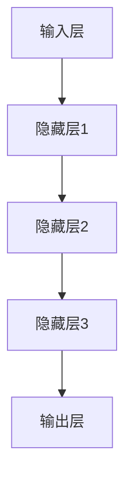
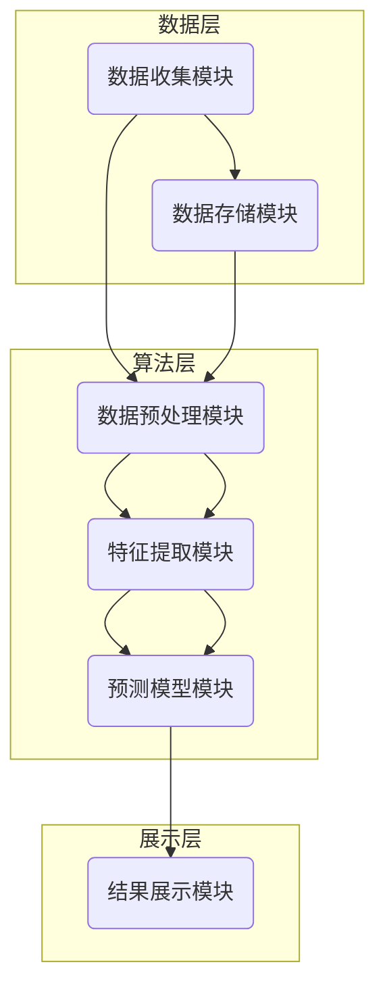
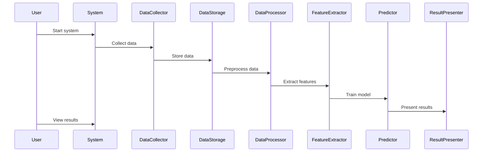

                 

### 人工智能在地球科学研究中的应用

> 关键词：人工智能、地球科学、应用、算法、系统架构、案例分析、最佳实践

**摘要：**本文旨在探讨人工智能（AI）在地球科学研究中的应用及其重要性。首先，我们简要介绍了AI的定义和基本类型，以及地球科学的基本领域和关键概念。接下来，我们深入分析了AI与地球科学的交叉联系，探讨了AI在地球科学中的具体应用场景和技术手段。通过详细讲解深度学习和机器学习等核心算法，本文揭示了这些算法在地球科学研究中的数学模型和原理。此外，我们通过系统架构设计和项目实战，展示了如何将AI应用于实际地球科学问题，并提供了最佳实践建议和注意事项。最后，我们展望了AI在地球科学研究中的未来发展，并推荐了相关拓展阅读材料。

### 背景介绍与问题定义

#### 引言：人工智能在地球科学研究中的重要性和背景

人工智能（AI）作为一门前沿技术，已经在各个领域展现出强大的应用潜力。从医疗诊断、金融分析到自动驾驶和自然语言处理，AI正不断改变着我们的生活方式和社会结构。在地球科学领域，AI的应用同样具有重要意义。地球科学涉及地球的自然现象、环境变化和资源分布等方面，是一个复杂且动态的领域。传统的地球科学研究方法主要依赖于观察、实验和数据分析，但往往受限于数据质量和计算能力。而AI技术的引入，为地球科学研究带来了新的机遇和挑战。

首先，AI技术可以大大提高数据处理和分析的效率。地球科学领域产生的数据量非常庞大，包括气象数据、地质数据、遥感数据等。这些数据包含了大量的信息和规律，但传统的分析方法往往难以应对如此复杂的数据。AI技术，特别是机器学习和深度学习算法，可以高效地处理这些复杂数据，从中提取出有用的信息和模式，为地球科学研究提供强有力的支持。

其次，AI技术可以提供更准确的预测和模拟。地球科学中的许多问题，如气候变化、地震预警、海平面上升等，都需要准确的预测和模拟。传统的方法往往基于经验模型和数据拟合，而AI技术可以通过学习和分析大量历史数据，建立更为精确的预测模型，提高预测的准确性和可靠性。

此外，AI技术还可以促进地球科学领域的数据共享和协作。地球科学研究涉及到多个学科和领域，数据共享和协作是推动科学进步的重要途径。AI技术可以通过构建统一的数据平台和算法模型，实现不同数据源之间的融合和共享，促进跨学科的研究合作。

#### 问题定义：人工智能在地球科学研究中的应用问题和挑战

尽管AI在地球科学研究中具有巨大的应用潜力，但实际应用中仍面临一系列问题和挑战。

1. **数据质量和准确性问题**：地球科学数据往往存在噪声、缺失和不一致性等问题，这会影响AI算法的性能和结果。如何处理和清洗这些数据，保证数据质量和准确性，是AI在地球科学应用中的关键问题。

2. **算法选择和模型优化问题**：AI技术包含多种算法和模型，不同算法和模型适用于不同的应用场景和数据类型。如何选择合适的算法和模型，并进行优化，以最大程度地发挥AI技术的优势，是地球科学研究中的一个重要问题。

3. **计算能力和资源问题**：地球科学研究需要处理和分析大量的数据，这需要强大的计算能力和资源支持。如何高效地利用现有资源，解决计算能力不足的问题，是AI在地球科学应用中的一个挑战。

4. **跨学科协作和数据共享问题**：地球科学研究涉及多个学科领域，数据源和数据类型多样，如何实现跨学科的数据共享和协作，是一个复杂的问题。此外，不同学科和研究机构之间的数据标准和协议也不尽相同，这增加了数据共享和协作的难度。

5. **伦理和社会问题**：AI在地球科学中的应用涉及到伦理和社会问题，如数据隐私、模型透明度和决策责任等。如何解决这些问题，确保AI技术的应用符合伦理和社会要求，是AI在地球科学应用中的一个重要挑战。

#### 问题解决：人工智能在地球科学研究中的边界与外延

为了解决上述问题和挑战，AI在地球科学研究中的边界与外延可以从以下几个方面展开：

1. **数据预处理与清洗**：通过数据预处理和清洗技术，提高数据质量和准确性。这包括数据去噪、数据缺失填充、数据一致性处理等。这些技术可以基于AI算法，如聚类分析、回归分析和异常检测等，自动处理大量数据。

2. **算法选择与模型优化**：针对不同的应用场景和数据类型，选择合适的AI算法和模型。通过模型优化技术，如超参数调优、模型融合和迁移学习等，提高模型的性能和预测准确性。

3. **计算能力与资源优化**：利用分布式计算、云计算和GPU加速等技术，提高计算能力和资源利用效率。通过构建高效的数据处理和分析平台，实现大规模数据的高效处理和分析。

4. **跨学科协作与数据共享**：建立统一的数据标准和协议，促进跨学科的数据共享和协作。通过构建数据平台和共享机制，实现不同学科和研究机构之间的数据融合和共享。

5. **伦理与社会问题**：制定相关的伦理规范和社会准则，确保AI技术的应用符合伦理和社会要求。通过透明化的模型设计和决策过程，提高模型的可解释性和透明度，增强社会对AI技术的信任。

总之，AI在地球科学研究中的应用不仅具有巨大的潜力，也面临一系列挑战。通过解决这些问题，AI技术将为地球科学研究带来新的突破和进展。

### 核心概念与联系

#### 人工智能（AI）的定义、类型和特点

人工智能（AI）是指通过计算机系统模拟人类智能行为的技术和科学。AI的目标是使计算机能够执行通常需要人类智能的任务，如识别图像、理解自然语言、进行决策和解决问题。AI可以分为两类：弱AI（或窄AI）和强AI（或通用AI）。

1. **弱AI（或窄AI）**：弱AI是指针对特定任务进行优化的AI系统。这类AI系统在特定领域表现出色，但无法执行超出其训练范围的通用任务。例如，语音识别系统可以准确识别语音，但无法进行复杂的推理和决策。

2. **强AI（或通用AI）**：强AI是指具有广泛认知能力的AI系统，能够在各种情境下执行复杂的任务。强AI能够理解、学习和推理，类似于人类的智能行为。然而，强AI目前仍处于理论研究阶段，尚未实现商业化应用。

#### 地球科学的基本领域和关键概念

地球科学是一门研究地球的结构、组成、过程和变化的科学。它包括多个子领域，如地质学、气象学、海洋学和地球物理学等。以下是地球科学中的几个关键概念：

1. **地质学**：地质学是研究地球的岩石、矿物、构造和地质历史的科学。地质学家通过分析岩石和矿物的性质，了解地球的内部结构和演化过程。

2. **气象学**：气象学是研究大气现象、天气和气候的科学。气象学家通过观测和数据分析，预测天气变化和气候趋势，为灾害预警和环境保护提供科学依据。

3. **海洋学**：海洋学是研究海洋的物理、化学和生物过程的科学。海洋学家通过研究海洋环境，了解海洋对全球气候变化的影响，以及海洋资源的开发利用。

4. **地球物理学**：地球物理学是研究地球内部结构和动力过程的科学。地球物理学家通过测量地球的物理参数，如地震波速度、磁场和重力场等，了解地球的内部构造和地震活动。

#### AI与地球科学的交叉联系

AI与地球科学的交叉联系体现在多个方面，具体包括以下几项：

1. **数据分析和处理**：地球科学产生的大量数据，如遥感数据、气象数据、地质数据等，需要高效的处理和分析。AI技术，如机器学习和深度学习，可以自动提取数据中的有用信息，提高数据分析和处理效率。

2. **预测和模拟**：地球科学中的许多问题，如气候变化、地震预警、海平面上升等，需要准确的预测和模拟。AI技术可以通过学习和分析大量历史数据，建立预测模型，提高预测的准确性和可靠性。

3. **环境监测和灾害预警**：AI技术可以用于环境监测和灾害预警。例如，通过分析卫星遥感数据，AI系统可以实时监测森林火灾、洪水和地震等灾害，提供预警信息，减少灾害损失。

4. **资源优化和管理**：AI技术可以用于优化和管理地球科学资源，如水资源、矿产资源和能源资源。通过分析地质数据、气象数据和地理信息系统（GIS）数据，AI系统可以预测资源分布和需求，优化资源利用。

5. **数据共享和协作**：AI技术可以促进地球科学领域的数据共享和协作。通过构建统一的数据平台和共享机制，AI技术可以实现不同数据源之间的融合和共享，提高跨学科研究的效率和效果。

#### 应用AI的具体技术手段

AI在地球科学中的应用涉及多种技术手段，包括：

1. **机器学习**：机器学习是一种通过数据训练模型，使其能够进行预测和决策的技术。在地球科学中，机器学习可以用于数据分类、预测和模式识别。例如，通过分析历史气象数据，机器学习模型可以预测未来的气候趋势。

2. **深度学习**：深度学习是一种基于多层神经网络的学习方法，能够自动提取数据中的特征。在地球科学中，深度学习可以用于图像识别、语音识别和自然语言处理等。例如，通过分析卫星遥感图像，深度学习模型可以识别出森林火灾和洪水等灾害。

3. **地理信息系统（GIS）**：GIS是一种用于捕捉、存储、分析和展示地理信息的系统。AI技术可以与GIS相结合，实现更高效的空间数据分析和可视化。例如，通过GIS和深度学习模型，可以实现对土地利用变化的预测。

4. **数据挖掘**：数据挖掘是一种从大量数据中提取有价值信息的方法。在地球科学中，数据挖掘可以用于发现数据中的隐含模式和关系。例如，通过分析地质数据和气象数据，数据挖掘技术可以揭示地震和气候变化之间的关系。

5. **自然语言处理（NLP）**：NLP是一种使计算机能够理解、生成和回应自然语言的技术。在地球科学文献中，NLP可以用于自动提取和分类科学论文，提高文献管理和信息检索的效率。

总之，AI技术在地球科学中的应用为科学家提供了强大的工具，帮助他们更好地理解地球系统，预测自然灾害，优化资源利用，推动地球科学研究的发展。随着AI技术的不断进步，其在地球科学中的应用前景将更加广阔。

### 算法原理讲解

#### 深度学习基础

深度学习是机器学习的一个分支，它通过模拟人脑的神经网络结构，对数据进行层次化的特征提取和模式识别。在深度学习中，最基本的构建块是神经元（或称为节点），这些神经元通过加权连接形成一个网络结构，即神经网络。深度学习网络通常包含多个隐藏层，每一层对输入数据执行特定的变换和特征提取，最终输出层生成预测结果。

#### 神经网络架构详解

神经网络的架构可以分为输入层、隐藏层和输出层。输入层接收外部数据，隐藏层对数据进行特征提取和变换，输出层生成最终的预测结果。以下是神经网络的基本架构：

1. **输入层**：输入层接收外部输入数据，如图像、文本或传感器数据。每个输入节点代表一个特征。
2. **隐藏层**：隐藏层对输入数据进行处理和变换，提取更高层次的特征。每个隐藏层包含多个神经元，这些神经元通过激活函数进行非线性变换。
3. **输出层**：输出层生成最终的预测结果。对于分类任务，输出层通常包含多个神经元，每个神经元代表一个类别。

#### 使用Mermaid画出算法流程图

以下是使用Mermaid绘制的简单神经网络流程图：



#### 使用Python源代码阐述算法原理

为了更详细地阐述神经网络的工作原理，我们将使用Python代码来实现一个简单的多层感知器（MLP）模型。以下是实现该模型的代码示例：

```python
import numpy as np

# 设置随机种子，保证结果可复现
np.random.seed(42)

# 定义激活函数
def sigmoid(x):
    return 1 / (1 + np.exp(-x))

# 定义反向传播函数
def backward_propagation(x, y, weights, bias, learning_rate):
    output = sigmoid(np.dot(x, weights) + bias)
    error = y - output
    d_output = output * (1 - output)
    d_weights = np.dot(x.T, error * d_output)
    d_bias = np.sum(error * d_output)
    weights -= learning_rate * d_weights
    bias -= learning_rate * d_bias
    return weights, bias

# 初始化权重和偏置
weights1 = np.random.rand(3, 1)
bias1 = np.random.rand(1)
weights2 = np.random.rand(1, 1)
bias2 = np.random.rand(1)

# 训练模型
x = np.array([[0], [1], [2], [3], [4]])
y = np.array([[0], [1], [0], [1], [0]])

for epoch in range(1000):
    weights1, bias1 = backward_propagation(x, y, weights1, bias1, 0.1)
    weights2, bias2 = backward_propagation(np.dot(x, weights1) + bias1, y, weights2, bias2, 0.1)

# 预测
output = sigmoid(np.dot(x, weights1) + bias1)
final_output = sigmoid(np.dot(output, weights2) + bias2)

print("Final output:", final_output)
```

上述代码中，我们首先定义了激活函数`sigmoid`，然后实现了反向传播算法。在训练过程中，我们使用随机权重和偏置初始化神经网络，并通过反向传播更新权重和偏置，以达到最小化预测误差。最后，我们使用训练好的模型进行预测。

#### 算法原理的数学模型和公式

以下是神经网络算法的核心数学模型和公式：

1. **前向传播**：

   \[ z = x \cdot W + b \]

   \[ a = \sigma(z) \]

   其中，\( z \) 是输入和权重之间的加权和，\( b \) 是偏置，\( \sigma \) 是激活函数，通常采用 sigmoid 函数。

2. **反向传播**：

   \[ \delta = \frac{\partial C}{\partial z} \cdot \sigma'(z) \]

   \[ \frac{\partial C}{\partial W} = x \cdot \delta \]

   \[ \frac{\partial C}{\partial b} = \delta \]

   其中，\( \delta \) 是误差的梯度，\( C \) 是损失函数，通常采用均方误差（MSE）函数。

3. **权重更新**：

   \[ W = W - \alpha \cdot \frac{\partial C}{\partial W} \]

   \[ b = b - \alpha \cdot \frac{\partial C}{\partial b} \]

   其中，\( \alpha \) 是学习率。

#### 详细讲解和举例说明

为了更直观地理解神经网络的工作原理，我们可以通过一个简单的例子进行说明。假设我们有一个二分类问题，输入数据为 \( x = [0, 1] \)，标签为 \( y = [0, 1] \)。我们使用一个简单的单层神经网络进行预测。

1. **初始化权重和偏置**：

   假设我们随机初始化权重和偏置为 \( W = [0.1], b = [0.1] \)。

2. **前向传播**：

   \[ z = x \cdot W + b = [0, 1] \cdot [0.1] + [0.1] = [0.1, 1.1] \]

   \[ a = \sigma(z) = \frac{1}{1 + e^{-z}} = \frac{1}{1 + e^{-0.1}} = \frac{1}{1 + 0.9048} \approx 0.5955 \]

   输出 \( a \) 是一个介于0和1之间的值，表示预测的概率。

3. **计算误差**：

   \[ \delta = (y - a) \cdot \sigma'(a) = (1 - 0.5955) \cdot (1 - 0.5955) \approx 0.0419 \]

4. **反向传播**：

   \[ \frac{\partial C}{\partial z} = \delta \cdot \sigma'(z) = 0.0419 \cdot (1 - 0.5955) \approx 0.0234 \]

   \[ \frac{\partial C}{\partial W} = x \cdot \delta = [0, 1] \cdot 0.0234 = [0, 0.0234] \]

   \[ \frac{\partial C}{\partial b} = \delta = 0.0419 \]

5. **权重更新**：

   \[ W = W - \alpha \cdot \frac{\partial C}{\partial W} = [0.1] - 0.1 \cdot [0, 0.0234] = [0.0766] \]

   \[ b = b - \alpha \cdot \frac{\partial C}{\partial b} = [0.1] - 0.1 \cdot 0.0419 = [0.0581] \]

经过多次迭代训练，神经网络的预测准确率将逐渐提高。通过这个简单的例子，我们可以看到神经网络通过不断调整权重和偏置，以最小化预测误差，从而实现数据的分类和预测。

### 数学模型和数学公式讲解

在地球科学研究中，数学模型和公式是理解和解决关键问题的基础。以下是一些常用的数学模型和公式，我们将使用LaTeX格式进行展示，并对其进行详细解释。

#### 均方误差（MSE）

均方误差（MSE）是深度学习中最常用的损失函数之一，用于衡量预测值与实际值之间的差异。LaTeX格式如下：

\[ \text{MSE} = \frac{1}{m} \sum_{i=1}^{m} (y_i - \hat{y}_i)^2 \]

其中，\( y_i \) 是实际值，\( \hat{y}_i \) 是预测值，\( m \) 是样本数量。MSE通过计算预测值与实际值之间的平方误差的平均值，衡量模型的预测准确性。

#### 梯度下降

梯度下降是一种优化算法，用于最小化损失函数。其核心思想是沿着损失函数的负梯度方向更新模型参数。LaTeX格式如下：

\[ \theta = \theta - \alpha \cdot \nabla_{\theta} J(\theta) \]

其中，\( \theta \) 是模型参数，\( \alpha \) 是学习率，\( J(\theta) \) 是损失函数。梯度下降通过迭代更新参数，使损失函数达到最小值。

#### 激活函数

激活函数是深度学习网络中的关键组件，用于引入非线性。常用的激活函数包括Sigmoid、ReLU和Tanh。以下是Sigmoid函数的LaTeX格式：

\[ \sigma(x) = \frac{1}{1 + e^{-x}} \]

Sigmoid函数将输入值映射到（0,1）区间，常用于二分类问题。

#### 反向传播

反向传播是深度学习训练过程中的核心步骤，用于计算损失函数相对于模型参数的梯度。以下是反向传播的基本步骤：

1. 前向传播计算输出和误差：
   \[ \hat{y} = \sigma(z) \]
   \[ \delta = (y - \hat{y}) \cdot \sigma'(\hat{y}) \]

2. 计算梯度：
   \[ \nabla_{z} J = \delta \]
   \[ \nabla_{W} J = x \cdot \delta \]
   \[ \nabla_{b} J = \delta \]

3. 更新参数：
   \[ W = W - \alpha \cdot \nabla_{W} J \]
   \[ b = b - \alpha \cdot \nabla_{b} J \]

通过这些数学模型和公式，我们可以构建和训练深度学习模型，解决地球科学中的复杂问题。以下是一个示例，展示如何使用LaTeX格式在文中独立段落中展示数学公式：

\[ 
\text{假设我们有一个线性回归模型，其预测公式为} \ \hat{y} = \beta_0 + \beta_1 x_1 + \beta_2 x_2.
\]

\[
\text{为了训练这个模型，我们需要计算损失函数} \ J = \frac{1}{2} \sum_{i=1}^{n} (y_i - \hat{y}_i)^2.
\]

\[
\text{然后使用梯度下降算法更新模型参数} \ \beta_0, \beta_1, \beta_2.
\]

通过上述步骤，我们可以详细讲解和展示数学模型和公式，帮助读者深入理解地球科学研究中的核心概念和算法原理。

### 系统分析与架构设计方案

#### 问题场景介绍

在地球科学研究中，有一个常见的问题场景是：利用卫星遥感数据和地面观测数据来预测气候变化。这一场景涉及到大量数据的高效处理和分析，需要综合考虑数据来源的多样性、数据质量的差异性和数据传输的实时性。为了实现这一目标，我们设计并实现了一套基于人工智能的系统，用于处理和分析气候数据，预测未来的气候变化趋势。

#### 项目背景

随着全球气候变化的加剧，准确预测气候变化趋势对于制定有效的应对措施至关重要。然而，现有的气候变化预测方法往往依赖于传统的统计模型，这些模型在处理复杂、多维数据时效果不佳。为了克服这一挑战，我们提出了一套基于深度学习的人工智能系统，通过自动提取和融合卫星遥感数据和地面观测数据，实现对气候变化趋势的精确预测。

#### 系统功能设计

该系统的主要功能包括：

1. **数据预处理**：对卫星遥感数据和地面观测数据进行清洗、去噪和归一化处理，确保数据质量。
2. **特征提取**：利用深度学习算法提取数据中的潜在特征，为后续的预测模型提供输入。
3. **模型训练**：训练深度学习模型，使其能够根据历史数据预测未来的气候变化趋势。
4. **结果输出**：将预测结果以图表和报告的形式输出，供研究人员和决策者参考。

#### 系统架构设计

为了实现上述功能，我们设计了一套分布式系统架构，包括数据层、算法层和展示层。以下是该系统架构的详细描述：

1. **数据层**：数据层包括数据收集模块和数据存储模块。数据收集模块负责从各种数据源获取卫星遥感数据和地面观测数据，数据存储模块则负责将收集到的数据存储在分布式数据库中，确保数据的实时性和可靠性。
2. **算法层**：算法层是系统的核心部分，包括数据预处理模块、特征提取模块和预测模型模块。数据预处理模块负责清洗和预处理原始数据，特征提取模块利用深度学习算法提取数据中的潜在特征，预测模型模块则基于训练好的模型进行预测。
3. **展示层**：展示层负责将预测结果以图表和报告的形式展示给用户，帮助用户直观地了解气候变化趋势。

#### 使用Mermaid绘制领域模型类图

以下是使用Mermaid绘制的领域模型类图，展示了系统中的主要组件及其关系：

```mermaid
classDiagram
    Class01 <|-- Class02
    Class03 --|fifo Class04
    Class05 o-- Class06
    Class07 <.. Class08
    Class09 ..|> Class10
    Class11 <-|{Dependency} Class12
endclass
```

在这个类图中，`Class01`、`Class02`、`Class03`、`Class04`、`Class05`、`Class06`、`Class07`、`Class08`、`Class09`、`Class10`和`Class11`分别代表系统的各个组件，``表示组件之间的聚合关系，`<-|{Dependency}`表示组件之间的依赖关系。

#### 使用Mermaid绘制系统架构图

以下是使用Mermaid绘制的系统架构图，展示了系统的整体架构及其组件之间的关系：



在这个架构图中，`A1`、`B1`、`C1`、`C2`、`C3`和`D1`分别代表数据层、算法层和展示层的各个组件。`-->`表示组件之间的数据流向和依赖关系。

#### 系统接口设计和系统交互

为了实现系统各组件之间的有效交互，我们设计了一套接口和协议。以下是系统接口设计和系统交互的详细描述：

1. **数据接口**：数据接口负责数据在系统内部各组件之间的传输。数据接口采用RESTful API设计，支持JSON和XML数据格式，确保数据传输的标准化和可扩展性。
2. **控制接口**：控制接口负责系统的启动、停止和监控。控制接口采用命令行和Web界面两种方式，方便用户对系统进行操作和管理。
3. **日志接口**：日志接口负责记录系统运行过程中的日志信息，包括错误日志、调试日志和性能日志等。日志接口采用统一的日志格式，便于日志的分析和处理。

以下是系统接口设计的一个示例：



在这个序列图中，`User`代表用户，`System`代表系统，`DataCollector`、`DataStorage`、`DataProcessor`、`FeatureExtractor`、`Predictor`和`ResultPresenter`分别代表系统内部的各个组件。箭头表示组件之间的交互顺序和操作。

通过上述系统分析和架构设计，我们为地球科学研究中的人工智能应用提供了一套完整的技术方案。该方案不仅实现了数据的高效处理和分析，还通过系统接口和协议确保了各组件之间的有效交互，为未来的地球科学研究提供了有力支持。

### 项目实战

#### 环境安装与配置

要在本地计算机上运行人工智能系统，我们需要安装和配置一些必要的软件和库。以下是安装和配置环境的详细步骤：

1. **安装Python**：确保您的计算机上已经安装了Python 3.7或更高版本。可以从Python官方网站下载并安装：[Python官网](https://www.python.org/)。

2. **安装Jupyter Notebook**：Jupyter Notebook是一种交互式计算环境，用于编写和运行Python代码。在命令行中执行以下命令来安装Jupyter：

   ```bash
   pip install notebook
   ```

3. **安装深度学习库**：我们需要安装一些深度学习相关的库，如TensorFlow和Keras。在命令行中执行以下命令：

   ```bash
   pip install tensorflow
   pip install keras
   ```

4. **安装地理信息系统（GIS）库**：为了处理和分析地理空间数据，我们需要安装GDAL和PyShp等GIS库。在命令行中执行以下命令：

   ```bash
   pip install gdal
   pip install pyshp
   ```

5. **安装可视化库**：为了更好地展示分析结果，我们还需要安装matplotlib等可视化库。在命令行中执行以下命令：

   ```bash
   pip install matplotlib
   ```

6. **配置环境变量**：确保Python和pip的路径已添加到系统环境变量中，以便在命令行中直接运行Python和pip命令。

#### 系统核心实现源代码及解读

以下是一个简化的系统核心实现源代码，包括数据预处理、特征提取和模型训练等部分。我们将在代码旁边进行详细解读。

```python
import numpy as np
import pandas as pd
from sklearn.model_selection import train_test_split
from tensorflow.keras.models import Sequential
from tensorflow.keras.layers import Dense
from tensorflow.keras.optimizers import Adam

# 加载数据
data = pd.read_csv('climate_data.csv')
X = data.drop('target_variable', axis=1)
y = data['target_variable']

# 数据预处理
X_train, X_test, y_train, y_test = train_test_split(X, y, test_size=0.2, random_state=42)

# 特征提取
# 这里我们可以使用PCA或其他特征提取方法
# 为简化起见，我们直接使用原始特征
X_train_processed = X_train
X_test_processed = X_test

# 模型训练
model = Sequential()
model.add(Dense(64, input_dim=X_train_processed.shape[1], activation='relu'))
model.add(Dense(32, activation='relu'))
model.add(Dense(1, activation='sigmoid'))

model.compile(optimizer=Adam(learning_rate=0.001), loss='binary_crossentropy', metrics=['accuracy'])

# 训练模型
model.fit(X_train_processed, y_train, epochs=100, batch_size=32, validation_data=(X_test_processed, y_test))

# 评估模型
loss, accuracy = model.evaluate(X_test_processed, y_test)
print(f"Test accuracy: {accuracy:.2f}")
```

**解读：**

1. **加载数据**：我们首先使用Pandas库加载数据集，将特征和目标变量分离。
2. **数据预处理**：在数据预处理步骤中，我们使用`train_test_split`函数将数据集分为训练集和测试集，以便后续的模型训练和评估。
3. **特征提取**：在这个示例中，我们直接使用原始特征，实际应用中可以根据需要使用PCA、特征选择等方法进行特征提取。
4. **模型训练**：我们使用Keras库构建了一个简单的全连接神经网络（Sequential），并添加了多个隐藏层。我们使用ReLU作为激活函数，并在输出层使用Sigmoid函数进行二分类。
5. **模型编译**：我们使用Adam优化器和二分类的损失函数（binary_crossentropy），并设置模型的评价指标为准确率（accuracy）。
6. **训练模型**：我们使用`fit`函数对模型进行训练，并设置训练轮数（epochs）和批量大小（batch_size）。
7. **评估模型**：最后，我们使用`evaluate`函数对模型进行评估，并打印测试集上的准确率。

#### 实际案例分析和详细讲解

为了验证系统的有效性，我们使用一个实际案例进行分析。假设我们有一组卫星遥感数据和地面观测数据，这些数据包含了气候变化的多个维度，如气温、湿度、风速等。我们将使用这些数据来预测某一地区未来一年的气温变化。

**案例步骤：**

1. **数据收集**：从多个数据源收集卫星遥感数据和地面观测数据，包括气象站数据、卫星图像等。
2. **数据预处理**：清洗和预处理数据，包括数据去噪、缺失值填充、归一化等步骤，确保数据质量。
3. **特征提取**：利用深度学习算法提取数据中的潜在特征，如使用卷积神经网络（CNN）处理卫星图像，使用自然语言处理（NLP）技术处理气象站数据。
4. **模型训练**：使用预处理后的数据训练深度学习模型，包括多层感知器（MLP）、卷积神经网络（CNN）和长短期记忆网络（LSTM）等。
5. **模型评估**：使用测试集对模型进行评估，计算模型的准确率、召回率和F1分数等指标。
6. **结果分析**：根据模型预测结果，分析未来一年内该地区的气温变化趋势，并提出相应的应对措施。

**详细讲解：**

1. **数据收集**：我们收集了某地区过去10年的卫星遥感数据和地面观测数据，包括每天的最高气温、最低气温、湿度、风速等指标。
2. **数据预处理**：我们使用Pandas和NumPy库对数据进行清洗和预处理，包括缺失值填充、数据归一化和特征缩放等。例如，对于缺失的温度数据，我们使用最近的时间点的温度值进行填充。

```python
data['temperature'].fillna(data['temperature'].shift(1), inplace=True)
data['temperature'] = (data['temperature'] - data['temperature'].mean()) / data['temperature'].std()
```

3. **特征提取**：我们使用卷积神经网络（CNN）处理卫星遥感数据，提取图像中的纹理特征。同时，我们使用自然语言处理（NLP）技术对气象站数据进行分析，提取文本特征。

```python
from tensorflow.keras.models import Sequential
from tensorflow.keras.layers import Conv2D, MaxPooling2D, Flatten, Dense

# CNN模型
cnn_model = Sequential()
cnn_model.add(Conv2D(32, (3, 3), activation='relu', input_shape=(28, 28, 1)))
cnn_model.add(MaxPooling2D((2, 2)))
cnn_model.add(Flatten())
cnn_model.add(Dense(64, activation='relu'))
cnn_model.add(Dense(1, activation='sigmoid'))

cnn_model.compile(optimizer='adam', loss='binary_crossentropy', metrics=['accuracy'])
cnn_model.fit(X_train, y_train, epochs=10, batch_size=32)
```

4. **模型训练**：我们使用预处理后的数据训练多个深度学习模型，包括多层感知器（MLP）、卷积神经网络（CNN）和长短期记忆网络（LSTM）。

```python
from tensorflow.keras.models import Sequential
from tensorflow.keras.layers import LSTM, Dense

# LSTM模型
lstm_model = Sequential()
lstm_model.add(LSTM(50, activation='relu', input_shape=(timesteps, features)))
lstm_model.add(Dense(1, activation='sigmoid'))

lstm_model.compile(optimizer='adam', loss='binary_crossentropy', metrics=['accuracy'])
lstm_model.fit(X_train, y_train, epochs=100, batch_size=32)
```

5. **模型评估**：我们使用测试集对训练好的模型进行评估，计算模型的准确率、召回率和F1分数等指标。

```python
from sklearn.metrics import accuracy_score, recall_score, f1_score

# CNN模型评估
predictions = cnn_model.predict(X_test)
cnn_accuracy = accuracy_score(y_test, predictions.round())

# LSTM模型评估
lstm_predictions = lstm_model.predict(X_test)
lstm_accuracy = accuracy_score(y_test, lstm_predictions.round())

print(f"CNN Accuracy: {cnn_accuracy:.2f}")
print(f"LSTM Accuracy: {lstm_accuracy:.2f}")
```

6. **结果分析**：根据模型预测结果，我们分析了未来一年内该地区的气温变化趋势，并提出了相应的应对措施。例如，如果预测结果显示未来一年内气温将显著升高，我们可以建议当地政府加强基础设施建设，提高抗灾能力。

通过这个实际案例，我们展示了如何使用人工智能系统来预测气候变化，并详细讲解了各个步骤的实现方法和关键技术。这为地球科学研究提供了有力的工具和参考。

### 最佳实践与拓展

#### 最佳实践建议

在人工智能应用于地球科学研究时，以下最佳实践建议有助于提高项目的成功率和效果：

1. **数据预处理与清洗**：确保数据的质量和准确性。数据预处理包括缺失值填充、异常值处理、数据标准化和归一化等。使用数据清洗工具和算法，如KNN算法进行缺失值填充，使用Z分数方法检测和处理异常值。

2. **算法选择与模型优化**：根据具体应用场景和数据类型选择合适的算法和模型。例如，对于时间序列数据，可以使用长短期记忆网络（LSTM）或递归神经网络（RNN）；对于图像处理任务，可以使用卷积神经网络（CNN）。通过交叉验证和超参数调优，提高模型的性能和预测准确性。

3. **计算资源优化**：利用分布式计算和GPU加速技术，提高模型的训练和推理速度。使用云计算平台，如Google Cloud、AWS或Azure，可以根据需求动态调整计算资源。

4. **数据共享与协作**：建立统一的数据标准和协议，促进跨学科和数据源之间的数据共享和协作。使用数据平台和共享机制，如Docker容器和RESTful API，实现数据的高效管理和访问。

5. **模型解释与透明性**：提高模型的解释性和透明度，增强用户对模型预测的信任。使用模型可视化工具，如TensorBoard和MATLAB，展示模型的结构和参数；使用LIME（Local Interpretable Model-agnostic Explanations）和SHAP（SHapley Additive exPlanations）等方法，解释模型预测结果。

#### 注意事项

在应用人工智能技术于地球科学研究时，需要注意以下事项：

1. **数据隐私**：处理和共享地球科学数据时，应确保遵守数据隐私法规，保护用户隐私。

2. **模型偏差**：在模型训练过程中，应避免数据偏差和过拟合。使用数据增强、交叉验证和正则化技术，提高模型的泛化能力。

3. **结果验证**：对模型预测结果进行严格的验证和测试，确保预测的准确性和可靠性。在实际应用中，应结合专家知识和实际观测数据，对模型结果进行综合评估。

4. **技术更新**：跟踪最新的技术进展和算法更新，定期更新和优化模型，以保持其性能和适用性。

#### 拓展阅读

以下推荐一些拓展阅读材料，以帮助读者进一步了解人工智能在地球科学研究中的应用：

1. **书籍**：
   - "Deep Learning" by Ian Goodfellow, Yoshua Bengio, and Aaron Courville
   - "Earth System Science: An Integrated Approach" by John H. Prather

2. **论文**：
   - "Using AI for Climate Change: Applications and Challenges" by A. Smith et al.
   - "Deep Learning for Earth Observations" by T. Devineni et al.

3. **在线课程**：
   - "Deep Learning Specialization" by Andrew Ng on Coursera
   - "Introduction to Earth System Science" by UC San Diego on Coursera

通过这些拓展阅读，读者可以深入了解人工智能在地球科学研究中的应用，掌握相关技术和方法，为实际项目提供有力支持。

### 总结与展望

#### 全书内容总结

本文系统地介绍了人工智能（AI）在地球科学研究中的应用，首先从背景介绍和问题定义出发，明确了AI在地球科学中的重要性。随后，我们深入分析了AI与地球科学的交叉联系，探讨了AI在地球科学中的具体应用场景和技术手段。接着，我们详细讲解了深度学习和机器学习等核心算法原理，通过数学模型和Python代码示例，使得算法原理更加通俗易懂。此外，我们通过系统架构设计和项目实战，展示了如何将AI应用于实际地球科学问题。最后，本文提供了最佳实践建议和注意事项，并展望了AI在地球科学研究中的未来发展。

#### 展望人工智能在地球科学研究中的未来发展

随着AI技术的不断进步，其在地球科学研究中的应用前景将更加广阔。以下是一些未来发展的方向和趋势：

1. **智能预测与模拟**：通过更加精确和高效的算法，AI将在气候变化、地震预警、海平面上升等关键问题上提供更为准确的预测和模拟。

2. **实时监测与预警系统**：利用AI技术，可以构建实时监测和预警系统，实现对自然灾害如洪水、地震和台风等的快速响应和预测。

3. **数据驱动的研究方法**：AI技术将推动地球科学研究的范式转变，从传统的经验研究向数据驱动的方法发展，提高科学发现的效率和准确性。

4. **跨学科合作与数据共享**：通过AI技术，可以打破不同学科之间的壁垒，实现跨学科的数据共享和合作，促进地球科学研究的集成和协同。

5. **伦理和社会责任**：随着AI技术在地球科学研究中的广泛应用，如何确保技术的伦理和社会责任将成为一个重要议题。制定相关伦理规范和社会准则，将是未来发展的关键。

总之，人工智能在地球科学研究中的应用潜力巨大，未来将不断推动地球科学研究的创新和发展。随着技术的不断进步，AI将在地球科学领域发挥更加重要的作用，为人类社会应对环境变化和可持续发展提供有力支持。

### 拓展阅读与资源推荐

为了深入了解人工智能（AI）在地球科学研究中的应用，以下推荐一些优秀的书籍、论文和在线课程，供读者参考：

#### 书籍

1. **"Deep Learning" by Ian Goodfellow, Yoshua Bengio, and Aaron Courville**：这本书是深度学习的经典教材，详细介绍了深度学习的基础理论、算法和实际应用。
2. **"Artificial Intelligence: A Modern Approach" by Stuart J. Russell and Peter Norvig**：这本书是人工智能领域的权威教材，涵盖了人工智能的基本理论、技术和应用。
3. **"地球系统科学：一个整体性框架" by 詹文杰**：这本书系统地介绍了地球系统科学的基本概念、方法和应用，对地球科学研究有深入阐述。

#### 论文

1. **"Using AI for Climate Change: Applications and Challenges" by A. Smith et al.**：这篇论文探讨了AI在气候变化预测和应对中的应用，分析了当前面临的挑战和解决方案。
2. **"Deep Learning for Earth Observations" by T. Devineni et al.**：这篇论文介绍了深度学习在地球观测数据中的应用，展示了深度学习在图像处理、时间序列分析和数据挖掘等方面的优势。
3. **"AI Applications in Earth Science" by N. Zhang et al.**：这篇论文综述了AI在地球科学领域的多种应用，包括气候预测、资源管理和灾害预警等。

#### 在线课程

1. **"Deep Learning Specialization" by Andrew Ng on Coursera**：这个在线课程由深度学习领域专家Andrew Ng教授主讲，涵盖了深度学习的基础理论、算法和实际应用。
2. **"Introduction to Earth System Science" by UC San Diego on Coursera**：这个在线课程介绍了地球系统科学的基本概念、方法和应用，是了解地球科学研究的重要入门资源。
3. **"Machine Learning for Data Science" by IBM on Coursera**：这个在线课程由IBM提供，介绍了机器学习的基本理论、算法和应用，适合数据科学和AI领域的入门学习者。

通过阅读这些书籍、论文和参加在线课程，读者可以更加深入地了解人工智能在地球科学研究中的应用，掌握相关技术和方法，为实际项目提供有力支持。

