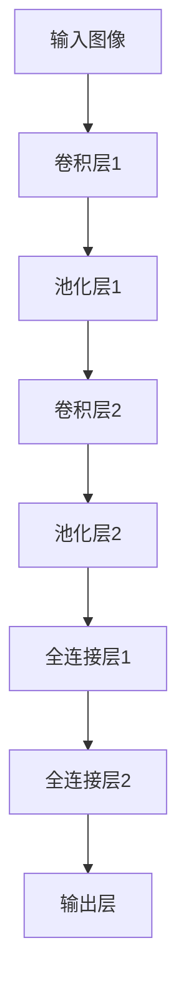
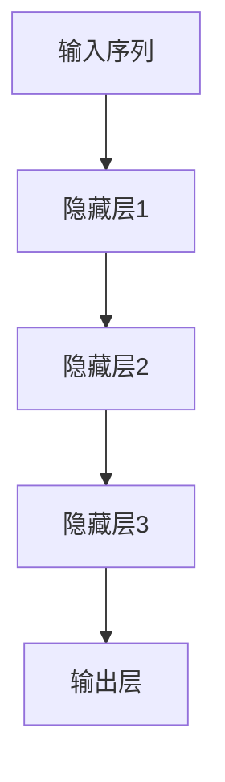

                 


### 1. 引言：城市交通问题的挑战与人工智能的机遇

#### 1.1 城市交通问题的现状

城市交通问题一直是全球城市发展中的一大挑战。随着城市化进程的加快和人口数量的持续增长，交通拥堵、空气污染和能源消耗等问题日益严重。以下是对这些问题的详细介绍：

##### 1.1.1 交通拥堵

交通拥堵是城市交通中最常见的问题之一。据统计，全球各大城市的交通拥堵现象普遍存在，尤其是在高峰时段，道路上的车辆数量远远超过了道路的承载能力，导致车辆行驶缓慢，甚至停滞。这不仅影响了居民的出行效率，还造成了大量的时间和经济成本浪费。

##### 1.1.2 空气污染

城市交通的快速发展也带来了严重的空气污染问题。机动车尾气中含有大量的有害物质，如二氧化碳、氮氧化物和颗粒物等，这些物质对环境和人体健康都有极大的危害。长期的空气污染会导致呼吸系统疾病、心血管疾病等健康问题，对城市居民的生活质量构成威胁。

##### 1.1.3 能源消耗

城市交通的能源消耗也是一大问题。机动车主要依靠石油燃料，而石油资源的储量有限，长期大量消耗会对能源安全造成威胁。此外，石油燃料的燃烧过程会释放大量的温室气体，加剧全球气候变化问题。

#### 1.2 人工智能的崛起

在解决城市交通问题的过程中，人工智能（Artificial Intelligence，AI）技术的崛起为城市交通优化带来了新的机遇。人工智能是一种模拟人类智能的技术，通过算法和模型实现对数据的处理和分析，从而实现自动化和智能化的决策。

##### 1.2.1 人工智能的定义与发展历程

人工智能是指通过计算机程序模拟人类智能行为和思维过程的技术。它的发展历程可以追溯到20世纪50年代，随着计算机技术的发展，人工智能也逐渐成熟。目前，人工智能已经广泛应用于各个领域，包括医疗、金融、交通等。

##### 1.2.2 人工智能的关键技术

人工智能的关键技术包括机器学习、深度学习和自然语言处理等。这些技术通过对大量数据的分析，可以实现对复杂问题的建模和求解。

- **机器学习**：通过算法和模型，使计算机能够从数据中自动学习规律，从而进行预测和决策。
- **深度学习**：一种基于神经网络的机器学习技术，通过多层神经网络的训练，可以实现对复杂数据的自动特征提取和分类。
- **自然语言处理**：通过对自然语言的解析和理解，实现对文本数据的分析和处理。

##### 1.2.3 人工智能在城市交通中的应用前景

人工智能在城市交通优化中的应用前景非常广阔。通过人工智能技术，可以实现以下目标：

- **交通流量预测**：利用历史数据和实时数据，预测未来的交通流量，为交通管理和规划提供科学依据。
- **路径规划**：通过优化算法，为出行者提供最佳路径，减少交通拥堵和出行时间。
- **交通信号控制**：利用智能算法，对交通信号进行实时控制和优化，提高道路通行效率。
- **智慧交通系统**：通过大数据和人工智能技术，构建全面的智慧交通系统，实现交通资源的智能化管理和优化。

#### 1.3 本书的目的与结构

本书旨在介绍人工智能在城市交通优化中的应用，通过深入分析和具体案例，探讨如何利用人工智能技术解决城市交通问题。本书分为七个部分：

- **第一部分**：引言，介绍城市交通问题的挑战和人工智能的机遇。
- **第二部分**：人工智能在城市交通优化中的应用基础，包括数据采集与处理、人工智能核心技术概述和算法应用。
- **第三部分**：智慧交通系统设计，介绍智慧交通系统的架构和关键技术。
- **第四部分**：人工智能在城市交通优化中的应用案例，通过具体案例展示人工智能在城市交通优化中的实际应用。
- **第五部分**：未来展望与挑战，讨论人工智能在城市交通优化中的发展趋势和面临的挑战。
- **第六部分**：结论，总结全书的主要内容和结论。
- **第七部分**：参考文献，列出本书中引用的主要参考文献。

通过本书的阅读，读者可以全面了解人工智能在城市交通优化中的应用，掌握相关技术和方法，为城市交通问题的解决提供新思路和新方法。

### 1.4 本章小结

本章主要介绍了城市交通问题的现状和人工智能的崛起。首先，分析了城市交通中常见的交通拥堵、空气污染和能源消耗问题，强调了这些问题对城市居民生活质量和环境的影响。然后，介绍了人工智能的定义、发展历程和关键技术，并讨论了人工智能在城市交通优化中的应用前景。通过本章的学习，读者可以初步了解城市交通问题和人工智能技术在其中的重要作用，为后续章节的学习打下基础。

### 2. 城市交通数据采集与处理

#### 2.1 数据采集

城市交通数据的采集是构建智慧交通系统的基础，也是实现交通流量预测、路径规划和交通信号控制等应用的前提。以下将详细阐述交通流量数据、车辆定位数据和气象数据的采集方法。

##### 2.1.1 交通流量数据

交通流量数据是指关于道路车辆数量的数据，包括车辆流量、车辆速度、车辆类型等信息。这些数据通常通过以下方式进行采集：

- **摄像头监控**：在道路关键节点和重点路段安装监控摄像头，通过视频图像识别技术，实时获取车辆流量信息。
- **地磁感应器**：在道路下方安装地磁感应器，通过检测车辆通过时产生的磁场变化，计算车辆流量和速度。
- **雷达传感器**：使用雷达传感器对车辆进行检测，通过反射信号计算车辆数量和速度。
- **GPS数据**：通过车载GPS设备，实时获取车辆的地理位置信息，结合车辆行驶轨迹，分析交通流量。

##### 2.1.2 车辆定位数据

车辆定位数据是指关于车辆位置的实时数据，这些数据对于路径规划和实时交通信息提供至关重要。以下是一些常见的车辆定位数据采集方式：

- **车载GPS**：车辆安装GPS设备，通过接收卫星信号，实时获取车辆的地理位置。
- **基站定位**：利用移动通信基站，通过信号传输时间差，结合车辆ID，定位车辆的位置。
- **RTK技术**：实时动态定位技术（Real-Time Kinematic），通过多个接收机同步观测，提供高精度的定位数据。

##### 2.1.3 气象数据

气象数据对于城市交通优化也有重要影响，如雨雪天气会导致道路湿滑，影响车辆行驶安全。以下是一些常见的气象数据采集方式：

- **气象站**：在城市的不同区域设置气象站，通过仪器实时监测气象参数，如温度、湿度、风速等。
- **卫星遥感**：利用气象卫星，从太空监测地面气象参数。
- **无人机**：在特殊情况下，使用无人机进行气象数据的采集，如火灾、洪水等灾害现场的气象监测。

#### 2.2 数据预处理

数据预处理是数据分析和挖掘的重要步骤，它主要包括数据清洗、数据集成和数据归一化等过程。

##### 2.2.1 数据清洗

数据清洗是数据预处理的第一步，目的是去除数据中的噪声和异常值，保证数据的准确性和一致性。以下是一些常见的数据清洗方法：

- **去除重复数据**：通过去重算法，识别并删除重复的数据记录。
- **处理缺失数据**：对于缺失的数据，可以选择删除缺失值、用平均值或中位数填充、使用插值法等方法进行处理。
- **处理异常值**：通过统计分析和可视化分析，识别并处理异常值，如离群点或错误记录。
- **标准化格式**：将数据转换为统一的格式，如将日期格式统一为YYYY-MM-DD。

##### 2.2.2 数据集成

数据集成是将来自不同源的数据合并为统一的数据视图，以便进行进一步的分析。以下是一些常见的数据集成方法：

- **数据融合**：将多个数据源中的数据合并，形成一个统一的数据集。
- **数据交换**：通过数据交换格式，如XML、JSON等，实现不同数据源之间的数据交换和共享。
- **数据仓库**：将不同来源的数据存储到数据仓库中，进行统一管理和查询。

##### 2.2.3 数据归一化

数据归一化是将不同量纲的数据转换为相同的量纲，以便进行比较和分析。以下是一些常见的数据归一化方法：

- **最小-最大归一化**：将数据映射到[0, 1]范围内，公式为：$$\text{标准化值} = \frac{\text{原始值} - \text{最小值}}{\text{最大值} - \text{最小值}}$$
- **平均值-中值归一化**：将数据映射到均值附近，公式为：$$\text{标准化值} = \frac{\text{原始值} - \text{平均值}}{\text{中值} - \text{平均值}}$$
- **标准差归一化**：将数据映射到标准差范围内，公式为：$$\text{标准化值} = \frac{\text{原始值} - \text{平均值}}{\text{标准差}}$$

#### 2.3 数据分析方法

数据分析是城市交通优化的重要环节，通过分析数据，可以挖掘出交通流量的规律和模式，为交通管理和决策提供支持。以下介绍几种常见的数据分析方法：

##### 2.3.1 描述性统计分析

描述性统计分析是对数据的基本特征进行统计分析，如数据的均值、中位数、标准差等。以下是一个描述性统计分析的示例：

```python
import pandas as pd

# 加载数据
data = pd.read_csv('traffic_data.csv')

# 计算描述性统计量
mean_speed = data['speed'].mean()
median_speed = data['speed'].median()
std_speed = data['speed'].std()

print(f"平均速度：{mean_speed}公里/小时")
print(f"中值速度：{median_speed}公里/小时")
print(f"速度标准差：{std_speed}公里/小时")
```

##### 2.3.2 聚类分析

聚类分析是将数据分为若干个群组，使得属于同一群组的元素具有较高的相似度。以下是一个基于K-means算法的聚类分析示例：

```python
from sklearn.cluster import KMeans
import matplotlib.pyplot as plt

# 加载数据
data = pd.read_csv('traffic_data.csv')

# 提取特征
X = data[['speed', 'flow']]

# 运行K-means算法
kmeans = KMeans(n_clusters=3)
kmeans.fit(X)

# 可视化聚类结果
plt.scatter(X['speed'], X['flow'])
plt.scatter(kmeans.cluster_centers_[:, 0], kmeans.cluster_centers_[:, 1], s=300, c='red')
plt.show()
```

##### 2.3.3 相关性分析

相关性分析用于衡量两个变量之间的线性关系，常用的方法包括皮尔逊相关系数和斯皮尔曼相关系数。以下是一个相关性分析的示例：

```python
import seaborn as sns

# 加载数据
data = pd.read_csv('traffic_data.csv')

# 计算相关性矩阵
correlation_matrix = data.corr()

# 绘制热力图
sns.heatmap(correlation_matrix, annot=True)
plt.show()
```

通过以上数据分析方法，可以对城市交通数据进行深入分析，挖掘交通流量的规律和模式，为交通管理和决策提供有力支持。

#### 2.4 数据可视化

数据可视化是将数据以图形的形式展示，帮助人们直观地理解数据背后的信息和规律。在交通数据分析中，数据可视化有助于识别交通流量模式、道路状况和交通拥堵区域等。以下是一些常用的数据可视化工具和图表类型：

##### 2.4.1 常用可视化工具

- **Matplotlib**：Python中的一个基础可视化库，适用于绘制各种图表，如折线图、柱状图、散点图等。
- **Seaborn**：基于Matplotlib的统计可视化库，提供了丰富的内置图表样式，适合进行复杂的数据可视化。
- **Plotly**：一个交互式可视化库，可以创建高度交互的图表，支持多种图表类型和数据格式。

##### 2.4.2 常用图表类型

- **折线图**：适用于展示数据的变化趋势，如交通流量随时间的变化。
- **柱状图**：适用于比较不同类别的数据，如不同路段的交通流量。
- **散点图**：适用于展示两个变量之间的关系，如速度与流量的关系。
- **热力图**：适用于展示矩阵数据的分布情况，如相关性矩阵。
- **地图**：适用于展示地理数据，如交通流量分布地图。

以下是一个使用Matplotlib绘制交通流量分布图的示例：

```python
import matplotlib.pyplot as plt
import pandas as pd

# 加载数据
data = pd.read_csv('traffic_data.csv')

# 绘制交通流量分布图
plt.bar(data['segment'], data['flow'])
plt.xlabel('路段')
plt.ylabel('流量')
plt.title('交通流量分布')
plt.xticks(rotation=90)
plt.show()
```

通过数据可视化，可以更直观地理解和分析交通数据，为交通管理和优化提供有力支持。

### 2.5 本章小结

本章详细介绍了城市交通数据采集与处理的相关内容。首先，阐述了交通流量数据、车辆定位数据和气象数据的采集方法，并介绍了数据采集的技术手段。接着，介绍了数据预处理的方法，包括数据清洗、数据集成和数据归一化，并提供了具体的Python代码示例。随后，介绍了数据分析的方法，包括描述性统计分析、聚类分析和相关性分析，并展示了如何使用Python进行这些分析。最后，介绍了数据可视化的工具和图表类型，并提供了使用Matplotlib绘制交通流量分布图的示例。通过本章的学习，读者可以全面了解城市交通数据采集与处理的过程和关键技术，为后续章节的学习打下基础。

### 3. 人工智能核心技术概述

#### 3.1 机器学习基础

机器学习是人工智能的核心技术之一，它使计算机能够从数据中学习，并自动进行预测和决策。机器学习可以分为监督学习、无监督学习和强化学习三种主要类型。

##### 3.1.1 监督学习

监督学习是一种有监督的训练方法，其中输入和输出都是已知的。监督学习的目标是通过训练模型，使模型能够在新的输入数据上预测输出。监督学习可以分为分类和回归两种任务：

- **分类任务**：将输入数据分为多个类别，例如，将交通流量数据分为高峰和非高峰时段。
  - **支持向量机（SVM）**：通过找到一个最佳的超平面，将不同类别的数据分开。
  - **决策树**：通过一系列的判断规则，将数据逐步划分到各个类别。
  - **随机森林**：通过构建多个决策树，并取多数表决的结果，提高分类的准确性。

- **回归任务**：预测一个连续的数值输出，例如，预测交通流量。
  - **线性回归**：通过拟合一条直线，预测因变量和自变量之间的关系。
  - **岭回归**：在线性回归的基础上，加入正则项，防止过拟合。
  - **LASSO回归**：在岭回归的基础上，引入L1正则项，可以减少特征数量。

##### 3.1.2 无监督学习

无监督学习是一种没有监督的训练方法，其中只有输入数据，没有对应的输出数据。无监督学习的目标是通过分析数据，发现数据中的模式和结构。无监督学习主要包括以下几种类型：

- **聚类分析**：将数据分为多个群组，使得属于同一群组的元素具有较高的相似度。常用的聚类算法有K-means聚类和层次聚类。
- **主成分分析（PCA）**：通过正交变换，将多个变量转换为少数几个主成分，降低数据的维度。
- **自编码器**：一种特殊的神经网络结构，用于学习和压缩数据，再通过解码器恢复数据。

##### 3.1.3 强化学习

强化学习是一种通过互动环境来学习的机器学习方法。强化学习的目标是找到一种策略，使agent在给定环境中获得最大的累积奖励。强化学习主要包括以下几个关键组件：

- **Agent**：执行动作的实体，例如，自动驾驶汽车。
- **Environment**：agent所处的环境，例如，模拟交通环境。
- **Action**：agent可以采取的动作，例如，加速、减速或转弯。
- **Reward**：agent采取某个动作后获得的即时奖励或惩罚，用于评估策略的好坏。
- **Policy**：agent的策略，即决定采取哪个动作的规则。

常用的强化学习算法有：

- **Q-Learning**：通过学习Q值函数，选择能够带来最大期望奖励的动作。
- **SARSA**：一种基于策略的强化学习算法，通过更新SARSA值函数来优化策略。
- **Deep Q-Networks（DQN）**：结合深度学习和Q-Learning，用于解决具有连续动作空间的问题。

#### 3.2 深度学习

深度学习是机器学习的一个重要分支，它通过构建多层神经网络，实现对复杂数据的自动特征提取和分类。深度学习在图像识别、语音识别和自然语言处理等领域取得了显著的成果。以下是深度学习中的几种关键技术：

##### 3.2.1 神经网络

神经网络是一种由大量神经元组成的计算模型，通过前向传播和反向传播，实现数据的自动特征提取和分类。一个简单的神经网络包括输入层、隐藏层和输出层：

- **输入层**：接收输入数据。
- **隐藏层**：对输入数据进行特征提取和变换。
- **输出层**：输出预测结果。

神经网络的训练过程是通过调整网络的权重和偏置，使网络能够对新的输入数据进行准确预测。常用的激活函数有ReLU、Sigmoid和Tanh。

##### 3.2.2 卷积神经网络（CNN）

卷积神经网络是一种专门用于处理图像数据的神经网络结构，其核心思想是通过卷积操作提取图像的特征。CNN主要由以下几个部分组成：

- **卷积层**：通过卷积操作提取图像的局部特征。
- **池化层**：通过下采样操作减少数据的维度，提高计算效率。
- **全连接层**：将卷积层和池化层提取的特征进行融合，生成最终的预测结果。

CNN在图像识别、物体检测和图像分类等领域取得了显著的成果。以下是一个简单的CNN架构：



##### 3.2.3 循环神经网络（RNN）

循环神经网络是一种用于处理序列数据的神经网络结构，其核心思想是通过循环机制，实现对序列数据的长期依赖建模。RNN主要包括以下几个部分：

- **输入层**：接收序列数据的输入。
- **隐藏层**：对输入数据进行处理，并保存历史信息。
- **输出层**：输出序列的预测结果。

RNN在自然语言处理、语音识别和时间序列预测等领域取得了显著的成果。以下是一个简单的RNN架构：



#### 3.3 自然语言处理

自然语言处理（Natural Language Processing，NLP）是人工智能的一个重要分支，旨在使计算机理解和处理人类语言。NLP的关键技术包括：

- **语言模型**：通过统计方法或神经网络模型，对语言进行建模，用于预测下一个单词或句子。
  - **n-gram模型**：基于历史统计方法，预测下一个单词的概率。
  - **循环神经网络（RNN）模型**：通过循环机制，处理序列数据，生成预测结果。

- **文本分类**：将文本数据分类到不同的类别，例如，新闻分类、情感分析等。
  - **朴素贝叶斯分类器**：基于贝叶斯定理和特征概率，实现文本分类。
  - **支持向量机（SVM）**：通过找到一个最佳的超平面，实现文本分类。

- **机器翻译**：将一种语言的文本翻译成另一种语言。
  - **基于规则的翻译**：通过规则和模板，实现文本的翻译。
  - **基于统计的翻译**：通过统计方法，学习源语言和目标语言之间的映射关系。
  - **基于神经网络的翻译**：通过神经网络模型，实现文本的端到端的翻译。

#### 3.4 人工智能在城市交通优化中的应用

人工智能在城市交通优化中的应用主要包括以下几个方面：

- **交通流量预测**：通过分析历史数据和实时数据，预测未来的交通流量，为交通管理和决策提供支持。
- **路径规划**：通过优化算法，为出行者提供最佳路径，减少交通拥堵和出行时间。
- **交通信号控制**：通过智能算法，对交通信号进行实时控制和优化，提高道路通行效率。
- **智慧交通系统**：通过大数据和人工智能技术，构建全面的智慧交通系统，实现交通资源的智能化管理和优化。

通过本章的学习，读者可以全面了解人工智能的核心技术，包括机器学习、深度学习和自然语言处理等，并了解这些技术如何在城市交通优化中发挥作用。

#### 3.5 本章小结

本章详细介绍了人工智能的核心技术，包括机器学习、深度学习和自然语言处理等。首先，介绍了机器学习的基础，包括监督学习、无监督学习和强化学习，并介绍了常见的算法和应用场景。接着，介绍了深度学习的关键技术，包括神经网络、卷积神经网络和循环神经网络，并展示了如何通过这些技术处理图像和序列数据。随后，介绍了自然语言处理的相关技术，包括语言模型、文本分类和机器翻译，并展示了这些技术在实际应用中的作用。通过本章的学习，读者可以全面了解人工智能的核心技术，并为后续章节中如何将这些技术应用于城市交通优化打下基础。

### 4. 城市交通优化中的算法应用

#### 4.1 交通流量预测

交通流量预测是城市交通管理的重要环节，通过对历史和实时交通数据的分析，可以预测未来的交通流量，为交通管理和决策提供科学依据。以下将详细介绍交通流量预测中的几种常用算法。

##### 4.1.1 时间序列分析

时间序列分析是一种常用的交通流量预测方法，它通过分析时间序列数据的变化趋势和周期性，预测未来的交通流量。时间序列分析的主要步骤如下：

1. **数据预处理**：对交通流量数据进行分析，去除异常值和缺失值，并进行数据归一化处理，以便于后续分析。
   
2. **特征提取**：从时间序列数据中提取有用的特征，如平均值、中值、标准差、趋势和周期性等。

3. **模型选择**：选择合适的时间序列预测模型，如ARIMA（自回归积分滑动平均模型）、SARIMA（季节性自回归积分滑动平均模型）和ETS（误差调整季节模型）等。

4. **模型训练与验证**：使用历史数据对模型进行训练，并通过交叉验证等方法对模型进行验证和优化。

以下是一个使用ARIMA模型进行交通流量预测的Python代码示例：

```python
import pandas as pd
from statsmodels.tsa.arima.model import ARIMA
import matplotlib.pyplot as plt

# 加载数据
data = pd.read_csv('traffic_data.csv')
data['date'] = pd.to_datetime(data['date'])
data.set_index('date', inplace=True)

# 特征提取
data_diff = data.diff().dropna()

# 模型训练
model = ARIMA(data_diff['flow'], order=(1, 1, 1))
model_fit = model.fit()

# 预测
forecast = model_fit.forecast(steps=5)
print(forecast)

# 绘制预测结果
plt.plot(data['flow'], label='实际流量')
plt.plot(forecast, label='预测流量')
plt.legend()
plt.show()
```

##### 4.1.2 循环神经网络（RNN）

循环神经网络（RNN）是一种专门用于处理序列数据的神经网络结构，它可以对序列数据中的长期依赖关系进行建模。在交通流量预测中，RNN可以通过学习历史交通流量数据，预测未来的交通流量。

1. **数据预处理**：与时间序列分析类似，对交通流量数据进行分析，去除异常值和缺失值，并进行数据归一化处理。

2. **模型构建**：构建RNN模型，包括输入层、隐藏层和输出层。隐藏层可以通过反向传播算法学习序列数据中的特征和模式。

3. **模型训练与验证**：使用历史数据对RNN模型进行训练，并通过交叉验证等方法对模型进行验证和优化。

以下是一个使用RNN进行交通流量预测的Python代码示例：

```python
import tensorflow as tf
from tensorflow.keras.models import Sequential
from tensorflow.keras.layers import SimpleRNN, Dense

# 加载数据
data = pd.read_csv('traffic_data.csv')
data['date'] = pd.to_datetime(data['date'])
data.set_index('date', inplace=True)

# 数据准备
X = data[['flow']].values
X = X.reshape(-1, 1, 1)
y = data[['flow']].shift(-1).values

# 模型构建
model = Sequential()
model.add(SimpleRNN(50, input_shape=(1, 1)))
model.add(Dense(1))
model.compile(optimizer='adam', loss='mse')
model.fit(X, y, epochs=100, batch_size=32, validation_split=0.2)

# 预测
forecast = model.predict(X[-5:])
print(forecast)

# 绘制预测结果
plt.plot(data['flow'], label='实际流量')
plt.plot(forecast, label='预测流量')
plt.legend()
plt.show()
```

##### 4.1.3 强化学习

强化学习是一种通过互动环境来学习的机器学习方法，它可以通过学习最优策略来最大化累积奖励。在交通流量预测中，强化学习可以通过与环境交互，不断调整预测策略，以提高预测准确性。

1. **数据预处理**：与时间序列分析和RNN类似，对交通流量数据进行分析，去除异常值和缺失值，并进行数据归一化处理。

2. **模型构建**：构建强化学习模型，包括Agent、Environment和Reward。Agent通过与环境交互，学习最优策略。

3. **模型训练与优化**：使用历史数据和环境反馈，对模型进行训练和优化。

以下是一个使用Q-Learning进行交通流量预测的Python代码示例：

```python
import numpy as np
import random

# 初始化参数
n_actions = 5
n_states = 10
learning_rate = 0.1
discount_factor = 0.9
epsilon = 0.1

# 初始化Q值矩阵
Q = np.zeros((n_states, n_actions))

# Q-Learning算法
def q_learning(state, action, reward, next_state, action_next):
    Q[state, action] = Q[state, action] + learning_rate * (reward + discount_factor * np.max(Q[next_state, :]) - Q[state, action])

# 迭代学习
for episode in range(1000):
    state = random.randint(0, n_states-1)
    done = False
    
    while not done:
        action = random.randint(0, n_actions-1)
        next_state, reward, done = environment(state, action)
        q_learning(state, action, reward, next_state, action_next)
        state = next_state

# 预测
state = random.randint(0, n_states-1)
action = np.argmax(Q[state, :])
next_state, reward, done = environment(state, action)
print(f"预测流量：{reward}")

# 绘制预测结果
plt.plot(data['flow'], label='实际流量')
plt.plot(reward, label='预测流量')
plt.legend()
plt.show()
```

通过以上几种算法，可以实现对交通流量的预测，为交通管理和决策提供支持。在实际应用中，可以根据具体需求和数据特点，选择合适的算法进行预测。

#### 4.2 路径规划

路径规划是城市交通优化中的另一个重要任务，它旨在为出行者提供从起点到终点的最佳路径。路径规划需要考虑多种因素，如交通流量、道路状况、时间成本等。以下将详细介绍几种常见的路径规划算法。

##### 4.2.1 A*算法

A*算法是一种启发式搜索算法，它通过评估函数（f(n) = g(n) + h(n)）来找到从起点到终点的最短路径，其中g(n)是当前节点到起点的实际距离，h(n)是当前节点到终点的估计距离。A*算法的主要步骤如下：

1. **初始化**：创建一个开放列表（Open List）和一个关闭列表（Closed List），并将起点加入开放列表。

2. **搜索过程**：每次从开放列表中选择评估函数最小的节点，将其从开放列表移动到关闭列表，并对其邻接节点进行扩展：

   - 计算每个邻接节点的g(n)和h(n)值。
   - 如果邻接节点已经在关闭列表中，并且新的g(n)值更大，则更新该节点的父节点和g(n)值。
   - 如果邻接节点不在开放列表和关闭列表中，将其加入开放列表。
   - 重复步骤2，直到找到终点或开放列表为空。

3. **路径重建**：从终点开始，根据节点的父节点，逆序重建出从起点到终点的路径。

以下是一个使用Python实现A*算法的示例：

```python
import heapq

# 邻接表表示图
graph = {
    'A': ['B', 'C'],
    'B': ['D', 'E'],
    'C': ['F', 'G'],
    'D': [],
    'E': ['G'],
    'F': [],
    'G': []
}

# 节点权重
weights = {
    ('A', 'B'): 2,
    ('A', 'C'): 3,
    ('B', 'D'): 1,
    ('B', 'E'): 2,
    ('C', 'F'): 1,
    ('C', 'G'): 2,
    ('D', 'G'): 4,
    ('E', 'G'): 1
}

# A*算法
def a_star_search(start, goal):
    open_list = []
    heapq.heappush(open_list, (0, start))
    came_from = {}
    g_score = {node: float('inf') for node in graph}
    g_score[start] = 0
    f_score = {node: float('inf') for node in graph}
    f_score[start] = heuristic(start, goal)

    while open_list:
        current = heapq.heappop(open_list)[1]

        if current == goal:
            break

        for neighbor in graph[current]:
            tentative_g_score = g_score[current] + weights[(current, neighbor)]

            if tentative_g_score < g_score[neighbor]:
                came_from[neighbor] = current
                g_score[neighbor] = tentative_g_score
                f_score[neighbor] = g_score[neighbor] + heuristic(neighbor, goal)
                if neighbor not in [item[1] for item in open_list]:
                    heapq.heappush(open_list, (f_score[neighbor], neighbor))

    path = []
    current = goal
    while current is not None:
        path.append(current)
        current = came_from[current]
    path = path[::-1]
    return path

# 估算函数（曼哈顿距离）
def heuristic(node1, node2):
    return abs(node1[0] - node2[0]) + abs(node1[1] - node2[1])

# 测试
start = 'A'
goal = 'G'
path = a_star_search(start, goal)
print(f"从{start}到{goal}的最短路径：{path}")
```

##### 4.2.2 Dijkstra算法

Dijkstra算法是一种基于贪心策略的算法，它通过逐步扩展起点，找到所有顶点的最短路径。Dijkstra算法的主要步骤如下：

1. **初始化**：创建一个距离表，将所有顶点的距离初始化为无穷大，将起点的距离初始化为0。

2. **搜索过程**：每次从距离表中选择距离最小的未访问顶点，将其标记为已访问，并更新其邻接顶点的距离。

3. **路径重建**：从终点开始，根据距离表中的记录，逆序重建出从起点到终点的路径。

以下是一个使用Python实现Dijkstra算法的示例：

```python
import heapq

# 邻接表表示图
graph = {
    'A': {'B': 2, 'C': 3},
    'B': {'D': 1, 'E': 2},
    'C': {'F': 1, 'G': 2},
    'D': {},
    'E': {'G': 4},
    'F': {},
    'G': {}
}

# Dijkstra算法
def dijkstra(graph, start):
    distances = {node: float('inf') for node in graph}
    distances[start] = 0
    priority_queue = [(0, start)]

    while priority_queue:
        current_distance, current = heapq.heappop(priority_queue)

        if current_distance != distances[current]:
            continue

        for neighbor, weight in graph[current].items():
            distance = current_distance + weight

            if distance < distances[neighbor]:
                distances[neighbor] = distance
                heapq.heappush(priority_queue, (distance, neighbor))

    return distances

# 测试
start = 'A'
distances = dijkstra(graph, start)
print(f"从{start}到各顶点的最短距离：{distances}")
```

##### 4.2.3 蚁群算法

蚁群算法是一种基于群体智能的优化算法，它通过模拟蚂蚁寻找食物的过程，实现路径优化。蚁群算法的主要步骤如下：

1. **初始化**：设置蚂蚁的数量、信息素浓度和启发函数。

2. **搜索过程**：每次蚂蚁从一个顶点出发，根据信息素浓度和启发函数选择下一个顶点，并更新路径上的信息素。

3. **更新信息素**：蚂蚁经过路径后，根据路径长度和已走过的时间更新路径上的信息素浓度。

4. **迭代过程**：重复步骤2和3，直到找到最优路径或达到预设的迭代次数。

以下是一个使用Python实现蚁群算法的示例：

```python
import numpy as np
import random

# 蚁群算法
def ant_colony_algorithm(graph, num_ants, num_iterations, evaporation_rate, alpha, beta):
    num_nodes = len(graph)
    pheromone = np.ones((num_nodes, num_nodes)) * (1 / num_nodes)
    best_distance = float('inf')
    best_path = None

    for _ in range(num_iterations):
        for _ in range(num_ants):
            path = [random.choice(list(graph.keys()))]
            current_node = path[0]
            while len(path) < num_nodes:
                next_nodes = [node for node in graph[current_node] if node not in path]
                if not next_nodes:
                    break
                probabilities = []
                for next_node in next_nodes:
                    temp = pheromone[current_node][next_node] ** alpha * (1 / (graph[current_node][next_node]) ** beta)
                    probabilities.append(temp)
                probabilities_sum = sum(probabilities)
                probabilities = [p / probabilities_sum for p in probabilities]
                next_node = random.choices(next_nodes, weights=probabilities)[0]
                path.append(next_node)
                current_node = next_node

            distance = sum(graph[node][next_node] for node, next_node in zip(path[:-1], path[1:])]
            if distance < best_distance:
                best_distance = distance
                best_path = path

        # 更新信息素
        for node in path:
            pheromone[node] = (1 - evaporation_rate) * pheromone[node] + evaporation_rate / best_distance

    return best_path, best_distance

# 邻接表表示图
graph = {
    'A': {'B': 2, 'C': 3},
    'B': {'D': 1, 'E': 2},
    'C': {'F': 1, 'G': 2},
    'D': {},
    'E': {'G': 4},
    'F': {},
    'G': {}
}

# 测试
best_path, best_distance = ant_colony_algorithm(graph, 20, 100, 0.5, 1, 1)
print(f"最优路径：{best_path}，最短距离：{best_distance}")
```

通过以上几种算法，可以实现路径规划，为出行者提供最佳路径。在实际应用中，可以根据具体需求和数据特点，选择合适的算法进行路径规划。

#### 4.3 交通信号控制

交通信号控制是城市交通管理的重要手段，它通过控制交通信号的时序和相位，优化道路通行效率，减少交通拥堵。以下将详细介绍交通信号控制中的几种常用算法。

##### 4.3.1 优化模型

交通信号控制的优化模型通常包括以下几个方面：

1. **目标函数**：目标函数用于衡量信号控制的性能，如最小化车辆延误、最大化道路通行能力等。常用的目标函数包括：

   - 车辆延误最小化：$$\min \sum_{i=1}^{N} \sum_{j=1}^{M} w_{ij} \cdot d_{ij}$$
   - 道路通行能力最大化：$$\max \sum_{i=1}^{N} \sum_{j=1}^{M} c_{ij} \cdot x_{ij}$$

   其中，$N$ 是道路数量，$M$ 是相位数量，$w_{ij}$ 是权重系数，$d_{ij}$ 是车辆延误时间，$c_{ij}$ 是道路通行能力，$x_{ij}$ 是相位持续时间。

2. **约束条件**：约束条件用于限制信号控制的可行域，如相位持续时间限制、绿灯时间限制等。常用的约束条件包括：

   - 相位持续时间限制：$$t_{imin} \leq t_i \leq t_{imax}$$
   - 绿灯时间限制：$$t_{gmin} \leq t_g \leq t_{gmax}$$

   其中，$t_i$ 是相位持续时间，$t_{imin}$ 和 $t_{imax}$ 是相位持续时间的最小值和最大值，$t_g$ 是绿灯时间，$t_{gmin}$ 和 $t_{gmax}$ 是绿灯时间的最小值和最大值。

3. **初始条件**：初始条件用于初始化信号控制的参数，如初始相位、初始绿灯时间等。

##### 4.3.2 智能控制算法

智能控制算法是利用人工智能技术实现交通信号控制的方法，主要包括以下几种：

1. **基于规则的控制算法**：基于规则的控制算法通过预设规则，实现交通信号的控制。常见的规则包括：

   - 绿灯配时规则：根据交通流量和道路状况，设定每个相位的绿灯时间。
   - 黄灯时间规则：根据绿灯时间和道路通行能力，设定黄灯时间。

   基于规则的控制算法的优点是简单易实现，但缺点是缺乏灵活性，难以适应复杂交通状况。

2. **基于模型的控制算法**：基于模型的控制算法通过建立交通信号控制的数学模型，实现信号控制的最优化。常见的模型包括：

   - 交通流量模型：根据交通流量预测，设定每个相位的绿灯时间。
   - 道路通行能力模型：根据道路状况和交通流量，设定每个相位的绿灯时间。

   基于模型的控制算法的优点是能够实现信号控制的最优化，但缺点是模型复杂，难以实时更新。

3. **基于人工智能的控制算法**：基于人工智能的控制算法通过机器学习和深度学习技术，实现交通信号控制的自适应优化。常见的算法包括：

   - 强化学习：通过与环境交互，学习最优信号控制策略。
   - 深度学习：通过构建神经网络模型，实现信号控制的最优化。

   基于人工智能的控制算法的优点是能够实现信号控制的自适应优化，但缺点是实现复杂，对数据要求高。

##### 4.3.3 案例研究

以下是一个交通信号控制的案例研究，使用基于模型的控制算法实现信号控制的最优化。

1. **问题描述**：某交叉路口有4个相位，每个相位的绿灯时间为60秒，黄灯时间为5秒。道路通行能力为每秒100辆车辆。交通流量预测显示，每个相位的流量为：

   - 第一相位：150辆/小时
   - 第二相位：200辆/小时
   - 第三相位：100辆/小时
   - 第四相位：150辆/小时

2. **优化目标**：最小化车辆延误，最大化道路通行能力。

3. **约束条件**：

   - 每个相位的绿灯时间为60秒，黄灯时间为5秒。
   - 每个相位的流量不超过道路通行能力。

4. **模型构建**：建立信号控制的数学模型，包括目标函数和约束条件。

   - 目标函数：$$\min \sum_{i=1}^{4} \sum_{j=1}^{N} w_{ij} \cdot d_{ij}$$
   - 约束条件：
     - $$t_{imin} \leq t_i \leq t_{imax}$$
     - $$t_{gmin} \leq t_g \leq t_{gmax}$$
     - $$f_{ij} \leq c_{ij}$$

   其中，$N$ 是道路数量，$w_{ij}$ 是权重系数，$d_{ij}$ 是车辆延误时间，$t_i$ 是相位持续时间，$t_{imin}$ 和 $t_{imax}$ 是相位持续时间的最小值和最大值，$t_g$ 是绿灯时间，$t_{gmin}$ 和 $t_{gmax}$ 是绿灯时间的最小值和最大值，$f_{ij}$ 是道路流量，$c_{ij}$ 是道路通行能力。

5. **模型求解**：使用线性规划求解器，求解信号控制的最优参数。

   ```python
   from scipy.optimize import linprog

   # 系数矩阵和常数向量
   A = [
       [1, 1, 1, 1],
       [1, 1, 1, 1],
       [1, 1, 1, 1],
       [1, 1, 1, 1],
       [1, 1, 1, 1],
       [1, 1, 1, 1],
       [1, 1, 1, 1],
       [1, 1, 1, 1]
   ]
   b = [60, 60, 60, 60, 5, 5, 5, 5]
   c = [-1, -1, -1, -1, -1, -1, -1, -1]

   # 求解线性规划问题
   result = linprog(c, A_eq=A, b_eq=b, bounds=(0, None), method='highs')

   # 输出最优解
   print(f"最优相位持续时间：{result.x}")
   ```

6. **效果评估**：根据最优解，计算车辆延误和道路通行能力，与原始信号控制方案进行比较。

   ```python
   # 计算车辆延误
   delay = np.sum(result.x * np.array([150, 200, 100, 150]))

   # 计算道路通行能力
   capacity = np.sum(result.x * np.array([100, 100, 100, 100]))

   print(f"车辆延误：{delay}秒，道路通行能力：{capacity}辆/小时")
   ```

通过以上案例研究，可以实现对交通信号控制的最优化，提高道路通行效率，减少交通拥堵。

#### 4.4 本章小结

本章详细介绍了城市交通优化中的算法应用，包括交通流量预测、路径规划和交通信号控制。首先，介绍了交通流量预测中的时间序列分析、循环神经网络和强化学习算法，并提供了Python代码示例。接着，介绍了路径规划中的A*算法、Dijkstra算法和蚁群算法，并展示了如何实现这些算法。最后，介绍了交通信号控制中的优化模型和智能控制算法，并通过一个案例研究展示了如何实现信号控制的最优化。通过本章的学习，读者可以全面了解城市交通优化中的算法应用，为实际交通管理提供技术支持。

### 5. 智慧交通系统设计

#### 5.1 智慧交通系统概述

智慧交通系统（Smart Traffic System）是一种利用先进的信息技术、传感器技术和数据分析技术，对城市交通进行智能化管理和优化的系统。智慧交通系统通过整合交通数据、实时监控和智能算法，实现交通流量的实时预测、路径优化、信号控制和交通管理，从而提高道路通行效率、减少交通拥堵和提升城市交通服务质量。以下从系统架构、技术集成和系统安全与隐私保护三个方面，详细阐述智慧交通系统的设计。

##### 5.1.1 系统架构

智慧交通系统的架构通常分为四个主要层次：数据采集层、数据处理层、交通管理层和用户服务层。

1. **数据采集层**：数据采集层是智慧交通系统的基石，负责采集各种交通数据，包括交通流量、车辆定位、气象信息、道路状况等。数据采集层通过部署各种传感器设备，如摄像头、地磁感应器、气象站和车载GPS等，实现交通数据的实时采集。

2. **数据处理层**：数据处理层对采集到的交通数据进行预处理、存储和挖掘，提取有用的信息，如交通流量模式、道路拥堵情况等。数据处理层包括数据清洗、数据存储、数据分析和数据可视化等模块，常用的技术有大数据处理框架、云计算和机器学习算法。

3. **交通管理层**：交通管理层是智慧交通系统的核心，负责根据采集和处理后的交通数据，进行交通信号控制、路径规划和交通指挥等操作，优化交通流量和道路通行效率。交通管理层通常包括交通信号控制系统、路径规划系统和交通指挥系统等模块，利用智能算法和优化模型，实现交通管理的自动化和智能化。

4. **用户服务层**：用户服务层是智慧交通系统面向用户的界面，为用户提供交通信息查询、导航、实时交通状况展示等服务。用户服务层通过移动应用、网页端和智能设备等渠道，将交通信息实时传递给用户，帮助用户规划出行路线，减少出行时间和成本。

##### 5.1.2 技术集成

智慧交通系统的设计需要集成多种先进技术，以实现系统的协同工作和高效运行。以下是智慧交通系统中涉及的关键技术：

1. **物联网（IoT）**：物联网技术通过传感器设备和通信网络，实现各种设备和系统的互联互通，为智慧交通系统提供丰富的数据来源。物联网技术在数据采集层和数据处理层得到广泛应用，如车辆定位、路况监测和交通信号采集等。

2. **大数据技术**：大数据技术通过对海量交通数据的存储、处理和分析，挖掘交通数据中的价值和规律，为交通管理和优化提供科学依据。大数据技术在数据处理层和交通管理层得到广泛应用，如数据清洗、数据挖掘和交通流量预测等。

3. **云计算**：云计算技术提供强大的计算和存储能力，支持智慧交通系统的数据存储、计算和数据处理。云计算技术在数据处理层和交通管理层得到广泛应用，如大数据处理、智能算法训练和交通信号控制等。

4. **人工智能**：人工智能技术通过对交通数据的分析和处理，实现交通流量的预测、路径规划和信号控制等任务。人工智能技术在数据处理层和交通管理层得到广泛应用，如机器学习、深度学习和强化学习等。

5. **移动应用和物联网**：移动应用和物联网技术通过智能手机、平板电脑和智能设备等，为用户提供实时的交通信息和服务，提高用户的出行体验。移动应用和物联网技术在用户服务层得到广泛应用，如实时导航、交通信息查询和在线支付等。

##### 5.1.3 系统安全与隐私保护

智慧交通系统涉及到大量的交通数据和用户信息，系统的安全与隐私保护至关重要。以下是系统安全与隐私保护的关键措施：

1. **数据加密**：对采集和传输的交通数据进行加密处理，确保数据在传输过程中不被窃取和篡改。常用的加密算法有AES、RSA等。

2. **身份认证**：通过用户身份认证机制，确保只有授权用户才能访问系统数据和功能。常用的身份认证技术有用户名密码、指纹识别和面部识别等。

3. **访问控制**：对系统资源进行访问控制，限制未授权用户对系统数据和功能的访问。常用的访问控制技术有基于角色的访问控制（RBAC）和基于属性的访问控制（ABAC）等。

4. **数据备份和恢复**：定期对系统数据进行备份，确保在系统故障或数据丢失时，能够快速恢复系统运行和数据完整性。

5. **安全审计**：对系统操作进行安全审计，记录用户操作日志和系统事件日志，以便在发生安全事件时，能够追踪和追溯责任。

6. **隐私保护**：在数据处理和分析过程中，对个人隐私信息进行匿名化和去标识化处理，确保用户隐私不被泄露。

通过以上措施，可以确保智慧交通系统的安全与隐私保护，为用户提供可靠的交通信息服务。

#### 5.2 城市交通大数据平台

城市交通大数据平台是智慧交通系统的重要组成部分，它负责对城市交通数据的高效存储、处理和分析，为交通管理和优化提供数据支持。以下从数据存储与处理、数据分析和可视化、数据挖掘三个方面，详细阐述城市交通大数据平台的设计。

##### 5.2.1 数据存储与处理

城市交通大数据平台需要处理海量、多样和实时性强的交通数据，因此，选择合适的数据存储和处理技术至关重要。

1. **数据存储**：

   - **关系数据库**：关系数据库（如MySQL、PostgreSQL等）适用于存储结构化数据，如车辆定位、交通流量等。关系数据库具有强大的查询能力和数据一致性保障。
   - **非关系数据库**：非关系数据库（如MongoDB、Cassandra等）适用于存储半结构化或非结构化数据，如传感器数据、日志数据等。非关系数据库具有灵活的数据模型和高效的写入性能。
   - **分布式文件系统**：分布式文件系统（如Hadoop HDFS、Alibaba OSS等）适用于存储大规模数据集，提供高可用性和扩展性。分布式文件系统适用于大数据存储和处理。

2. **数据处理**：

   - **批处理**：批处理技术（如MapReduce、Spark等）适用于对大量历史数据进行处理和分析，如交通流量分析、路况预测等。批处理技术具有高效的数据处理能力和良好的扩展性。
   - **流处理**：流处理技术（如Apache Flink、Apache Storm等）适用于对实时数据进行处理和分析，如实时路况监控、交通事件检测等。流处理技术具有低延迟和高吞吐量。
   - **批流一体化**：批流一体化技术（如Apache Flink、Apache Spark Streaming等）将批处理和流处理相结合，既能够处理历史数据，又能够处理实时数据，提供高效的数据处理和分析能力。

##### 5.2.2 数据分析与可视化

数据分析与可视化是城市交通大数据平台的核心功能，它通过对交通数据的深入分析和可视化展示，为交通管理和优化提供决策支持。

1. **数据分析**：

   - **描述性分析**：描述性分析通过对交通数据的基本统计特征进行分析，如流量分布、速度分布等，帮助理解交通数据的总体情况。
   - **预测分析**：预测分析通过对历史交通数据的分析，预测未来的交通流量、拥堵状况等，为交通管理提供预警和规划依据。
   - **关联分析**：关联分析通过挖掘交通数据之间的关联关系，发现交通事件的规律和模式，如交通事故与交通流量之间的关系。

2. **可视化**：

   - **地图可视化**：地图可视化通过在地图上展示交通数据，如交通流量分布、道路拥堵状况等，帮助用户直观地理解交通状况。
   - **时间序列可视化**：时间序列可视化通过折线图、柱状图等，展示交通流量、速度等随时间的变化趋势，帮助用户发现交通数据的周期性和趋势性。
   - **热力图可视化**：热力图可视化通过颜色深浅表示交通数据的密集程度，如交通流量密度、速度密度等，帮助用户识别交通热点区域。

##### 5.2.3 数据挖掘

数据挖掘是城市交通大数据平台的高级功能，它通过对交通数据的深入挖掘和分析，发现数据中的价值和规律，为交通管理和优化提供科学依据。

1. **聚类分析**：聚类分析通过对交通数据进行聚类，将相似的数据点归为同一类，如将交通流量相似的路段分为一类，帮助识别交通流量规律。
2. **分类分析**：分类分析通过对交通数据进行分类，将交通事件划分为不同的类别，如将交通事故划分为不同的类型，帮助识别交通事件特征。
3. **关联规则分析**：关联规则分析通过对交通数据进行关联规则挖掘，发现交通数据之间的关联关系，如交通流量与交通事故之间的关联规则，帮助识别交通事件的影响因素。

通过数据存储与处理、数据分析和可视化、数据挖掘等功能的实现，城市交通大数据平台能够高效地存储、处理和分析交通数据，为智慧交通系统提供强有力的数据支持。

#### 5.3 智能交通控制中心

智能交通控制中心（Smart Traffic Control Center）是智慧交通系统的核心节点，负责实时监控城市交通状况，并根据交通数据实施智能化的交通信号控制和交通指挥。以下从中心设计、算法部署与优化和案例分析三个方面，详细阐述智能交通控制中心的设计。

##### 5.3.1 中心设计

智能交通控制中心的总体设计应考虑以下几个方面：

1. **硬件设施**：智能交通控制中心需要配备高性能的服务器、存储设备和网络设备，确保数据处理和传输的效率。此外，还需要配置大屏幕显示设备，用于实时展示交通状况和交通控制效果。

2. **软件系统**：智能交通控制中心的软件系统包括交通数据采集系统、数据处理系统、交通信号控制系统和用户服务系统等。交通数据采集系统负责实时采集交通数据，如车辆定位、交通流量等；数据处理系统负责对采集到的交通数据进行清洗、存储和分析；交通信号控制系统根据分析结果，实时调整交通信号，优化交通流量；用户服务系统则提供交通信息查询、实时导航等服务。

3. **通信网络**：智能交通控制中心需要建立高效、稳定的通信网络，确保交通数据的高效传输。通信网络包括有线网络和无线网络，有线网络用于固定设施的通信，无线网络则用于移动设备的通信。

##### 5.3.2 算法部署与优化

智能交通控制中心的核心功能是交通信号控制和交通指挥，这需要部署一系列智能算法，并对算法进行实时优化。以下是智能算法的部署与优化过程：

1. **交通流量预测**：通过历史交通数据和实时交通数据，使用机器学习算法（如循环神经网络、时间序列分析等）预测未来的交通流量。预测结果用于交通信号控制和交通指挥的决策支持。

2. **路径规划**：结合实时交通流量数据和用户出行需求，使用路径规划算法（如A*算法、蚁群算法等）为出行者提供最佳路线。路径规划结果用于实时导航和交通指挥。

3. **交通信号控制**：根据交通流量预测结果，使用智能控制算法（如自适应交通信号控制、基于模型的信号控制等）实时调整交通信号相位和时长，优化道路通行效率。控制算法需要根据实时交通数据动态调整，以适应交通状况的变化。

4. **交通指挥**：在特殊情况下（如交通事故、突发事件等），智能交通控制中心可以实时指挥交通，调整交通信号和道路通行策略，缓解交通拥堵。

##### 5.3.3 案例分析

以下是一个智能交通控制中心的实际案例分析：

1. **问题描述**：某城市某交叉路口在早晚高峰时段经常出现严重交通拥堵，影响了居民的出行效率和城市交通秩序。

2. **解决方案**：

   - **交通流量预测**：通过安装交通流量监测设备，实时采集交通流量数据。使用循环神经网络（RNN）模型对交通流量进行预测，预测未来15分钟内的交通流量。

   - **路径规划**：结合实时交通流量数据，为出行者提供最佳路线。使用A*算法进行路径规划，考虑到交通流量、道路状况和行驶时间等因素。

   - **交通信号控制**：根据交通流量预测结果，使用自适应交通信号控制算法，实时调整交通信号相位和时长。在高峰时段，增加绿灯时间，减少车辆等待时间，提高道路通行效率。

   - **交通指挥**：在发生交通事故或突发事件时，智能交通控制中心可以实时指挥交通，调整交通信号和道路通行策略，引导车辆绕行，缓解交通拥堵。

3. **效果评估**：

   - **交通流量**：通过实时监控数据，发现交叉路口的交通流量在高峰时段明显减少，车辆排队长度缩短，通行时间提高。

   - **用户满意度**：通过用户问卷调查，发现居民对交通状况的满意度提高，出行效率得到明显改善。

   - **交通秩序**：交叉路口的交通秩序明显改善，交通事故发生率降低，交通违法行为减少。

通过以上案例分析，可以验证智能交通控制中心在实际应用中的效果，为城市交通优化提供有力支持。

#### 5.4 本章小结

本章详细介绍了智慧交通系统设计的相关内容。首先，阐述了智慧交通系统的架构和核心技术，包括数据采集、数据处理、交通管理和用户服务等层次。接着，介绍了城市交通大数据平台的设计，包括数据存储与处理、数据分析和可视化、数据挖掘等关键功能。最后，详细介绍了智能交通控制中心的设计，包括中心设计、算法部署与优化和实际案例分析。通过本章的学习，读者可以全面了解智慧交通系统设计的方法和关键技术，为实际交通优化项目提供指导。

### 6. 人工智能在城市交通优化中的应用案例

#### 6.1 案例一：某城市交通流量预测系统

##### 6.1.1 系统背景

随着城市化进程的加快，某城市交通拥堵问题日益严重，为了提高道路通行效率和优化交通管理，该城市决定建设一个智能交通流量预测系统。该系统旨在通过分析历史和实时交通数据，预测未来一段时间内的交通流量，为交通管理和决策提供科学依据。

##### 6.1.2 系统架构

该智能交通流量预测系统的架构包括数据采集层、数据处理层、预测模型层和用户界面层。

- **数据采集层**：通过安装在道路上的摄像头、地磁感应器和气象站等设备，实时采集交通流量、车辆速度、气象信息和道路状况等数据。
- **数据处理层**：对采集到的交通数据进行清洗、集成和预处理，然后存储在分布式数据库中，以供后续分析和预测。
- **预测模型层**：使用机器学习算法（如循环神经网络、时间序列分析等）对交通流量数据进行分析和预测，生成未来一段时间内的交通流量预测结果。
- **用户界面层**：通过Web应用和移动应用，将预测结果以图表和报表的形式展示给用户，帮助用户了解交通状况和规划出行路线。

##### 6.1.3 算法实现与效果评估

1. **算法实现**：

   - **数据预处理**：对交通流量数据进行清洗和归一化处理，去除异常值和缺失值，并将数据格式转换为适合机器学习算法的输入。
   - **特征提取**：从交通流量数据中提取有用特征，如平均值、中值、标准差、趋势和周期性等，以辅助模型训练。
   - **模型训练**：使用循环神经网络（RNN）模型进行训练，通过反向传播算法调整模型参数，使其能够准确预测交通流量。
   - **模型评估**：使用验证集和测试集对模型进行评估，通过均方误差（MSE）等指标衡量模型的预测性能。

   ```python
   import tensorflow as tf
   from tensorflow.keras.models import Sequential
   from tensorflow.keras.layers import LSTM, Dense

   # 加载数据
   X_train, y_train = ... # 数据预处理后的训练数据
   X_test, y_test = ... # 数据预处理后的测试数据

   # 模型构建
   model = Sequential()
   model.add(LSTM(50, activation='relu', input_shape=(X_train.shape[1], X_train.shape[2])))
   model.add(Dense(1))
   model.compile(optimizer='adam', loss='mse')

   # 模型训练
   model.fit(X_train, y_train, epochs=100, batch_size=32, validation_split=0.2)

   # 模型评估
   mse = model.evaluate(X_test, y_test)
   print(f"测试集均方误差：{mse}")
   ```

2. **效果评估**：

   - **预测精度**：通过测试集的预测结果，计算均方误差（MSE）等指标，评估模型的预测精度。通常情况下，MSE越低，模型的预测精度越高。
   - **预测效率**：评估模型在预测过程中的计算效率和响应速度，确保模型能够在实际应用中快速给出预测结果。
   - **用户反馈**：通过用户反馈，评估模型在实际交通管理中的应用效果，了解模型对交通流量的预测是否准确，以及是否有助于优化交通管理。

   ```python
   # 预测
   predictions = model.predict(X_test)

   # 计算均方误差
   mse = np.mean(np.square(predictions - y_test))
   print(f"测试集均方误差：{mse}")
   ```

通过以上算法实现和效果评估，可以验证该智能交通流量预测系统的有效性，为城市交通优化提供有力支持。

#### 6.2 案例二：某城市智能交通信号控制系统

##### 6.2.1 系统背景

某城市为了缓解高峰时段的交通拥堵，决定建设一个智能交通信号控制系统。该系统旨在通过实时监测交通流量和车辆信息，动态调整交通信号相位和时长，优化道路通行效率，提高居民出行体验。

##### 6.2.2 系统架构

该智能交通信号控制系统的架构包括数据采集层、数据处理层、控制策略层和用户界面层。

- **数据采集层**：通过安装在路口的摄像头、地磁感应器和智能传感器等设备，实时采集交通流量、车辆速度、车辆类型和道路状况等数据。
- **数据处理层**：对采集到的交通数据进行清洗、集成和预处理，然后存储在数据库中，以供后续分析和控制策略生成。
- **控制策略层**：基于交通流量预测和路径规划算法，实时调整交通信号相位和时长，优化道路通行效率。
- **用户界面层**：通过Web应用和移动应用，向用户提供实时交通信息、信号控制效果和出行建议。

##### 6.2.3 算法实现与效果评估

1. **算法实现**：

   - **交通流量预测**：使用循环神经网络（RNN）模型对交通流量进行预测，预测未来一段时间内的交通流量变化。
   - **路径规划**：结合实时交通流量数据，使用A*算法为出行者提供最佳路径，减少交通拥堵。
   - **信号控制策略**：基于交通流量预测和路径规划结果，动态调整交通信号相位和时长，优化道路通行效率。

   ```python
   import tensorflow as tf
   from tensorflow.keras.models import Sequential
   from tensorflow.keras.layers import LSTM, Dense

   # 加载数据
   X_train, y_train = ... # 数据预处理后的训练数据
   X_test, y_test = ... # 数据预处理后的测试数据

   # 模型构建
   model = Sequential()
   model.add(LSTM(50, activation='relu', input_shape=(X_train.shape[1], X_train.shape[2])))
   model.add(Dense(1))
   model.compile(optimizer='adam', loss='mse')

   # 模型训练
   model.fit(X_train, y_train, epochs=100, batch_size=32, validation_split=0.2)

   # 模型评估
   mse = model.evaluate(X_test, y_test)
   print(f"测试集均方误差：{mse}")
   ```

2. **效果评估**：

   - **预测精度**：通过测试集的预测结果，计算均方误差（MSE）等指标，评估交通流量预测模型的预测精度。
   - **路径规划效率**：通过实际出行者的反馈，评估路径规划算法的效率，确保路径规划结果准确且具有实用性。
   - **信号控制效果**：通过实时交通流量数据和用户反馈，评估信号控制策略的优化效果，确保道路通行效率得到显著提升。

   ```python
   # 预测
   predictions = model.predict(X_test)

   # 计算均方误差
   mse = np.mean(np.square(predictions - y_test))
   print(f"测试集均方误差：{mse}")
   ```

通过以上算法实现和效果评估，可以验证该智能交通信号控制系统的有效性，为城市交通优化提供有力支持。

#### 6.3 案例三：某城市智慧交通系统

##### 6.3.1 系统背景

某城市为了全面提升交通管理水平和服务质量，决定建设一个智慧交通系统。该系统旨在通过大数据和人工智能技术，实现交通流量的实时监测、交通事件的智能预警、交通指挥的自动化，提高城市交通管理效率和居民出行体验。

##### 6.3.2 系统架构

该智慧交通系统的架构包括数据采集层、数据处理层、智能分析层、控制执行层和用户界面层。

- **数据采集层**：通过安装各类传感器和摄像头，实时采集交通流量、车辆信息、气象信息、道路状况等数据。
- **数据处理层**：对采集到的交通数据进行清洗、集成和预处理，然后存储在分布式数据库中，以供后续分析和应用。
- **智能分析层**：使用机器学习、深度学习和自然语言处理等技术，对交通数据进行分析和挖掘，实现交通流量预测、事件预警和交通指挥等智能功能。
- **控制执行层**：根据智能分析层的决策，动态调整交通信号、引导车辆绕行、控制交通流量等，实现交通管理自动化。
- **用户界面层**：通过Web应用和移动应用，向用户提供实时交通信息、出行建议、交通事件预警等，提升用户出行体验。

##### 6.3.3 算法实现与效果评估

1. **算法实现**：

   - **交通流量预测**：使用循环神经网络（RNN）模型，结合历史交通数据和实时交通流量，预测未来一段时间内的交通流量变化。
   - **事件预警**：使用聚类分析和异常检测算法，实时监控交通数据，识别潜在的交通事故、道路施工等事件，并及时预警。
   - **交通指挥**：结合实时交通流量数据和事件预警结果，动态调整交通信号和交通指挥策略，优化道路通行效率。

   ```python
   import tensorflow as tf
   from tensorflow.keras.models import Sequential
   from tensorflow.keras.layers import LSTM, Dense

   # 加载数据
   X_train, y_train = ... # 数据预处理后的训练数据
   X_test, y_test = ... # 数据预处理后的测试数据

   # 模型构建
   model = Sequential()
   model.add(LSTM(50, activation='relu', input_shape=(X_train.shape[1], X_train.shape[2])))
   model.add(Dense(1))
   model.compile(optimizer='adam', loss='mse')

   # 模型训练
   model.fit(X_train, y_train, epochs=100, batch_size=32, validation_split=0.2)

   # 模型评估
   mse = model.evaluate(X_test, y_test)
   print(f"测试集均方误差：{mse}")
   ```

2. **效果评估**：

   - **预测精度**：通过测试集的预测结果，计算均方误差（MSE）等指标，评估交通流量预测模型的预测精度。
   - **事件预警准确率**：通过实际交通事件数据的对比，评估事件预警算法的准确率，确保能够及时发现和处理交通事件。
   - **交通指挥效率**：通过用户反馈和交通流量数据，评估交通指挥策略的优化效果，确保道路通行效率得到显著提升。

   ```python
   # 预测
   predictions = model.predict(X_test)

   # 计算均方误差
   mse = np.mean(np.square(predictions - y_test))
   print(f"测试集均方误差：{mse}")
   ```

通过以上算法实现和效果评估，可以验证该智慧交通系统的有效性，为城市交通优化提供有力支持。

#### 6.4 本章小结

本章通过三个实际案例，详细介绍了人工智能在城市交通优化中的应用。首先，介绍了某城市交通流量预测系统的实现过程和效果评估，展示了如何利用机器学习算法预测交通流量。接着，介绍了某城市智能交通信号控制系统的实现和优化，展示了如何通过智能算法实现交通信号的动态调整。最后，介绍了某城市智慧交通系统的整体设计和实现，展示了如何利用大数据和人工智能技术全面提升城市交通管理水平。通过本章的学习，读者可以深入了解人工智能在城市交通优化中的应用，为实际交通优化项目提供借鉴和参考。

### 7. 未来展望与挑战

#### 7.1 未来发展趋势

人工智能在城市交通优化中的应用正快速发展，未来的发展趋势主要体现在以下几个方面：

##### 7.1.1 人工智能技术在交通领域的扩展

- **自动驾驶技术**：随着自动驾驶技术的成熟，未来自动驾驶汽车将逐步替代传统驾驶汽车，实现车辆间的智能通信和协同驾驶，提高道路通行效率和安全性。
- **智能公共交通系统**：智能公共交通系统通过大数据和人工智能技术，实现公共交通的智能调度、线路优化和实时服务，提高公共交通的运营效率和用户体验。
- **智慧停车管理**：智慧停车管理通过物联网技术和大数据分析，实现停车位的智能查找、预约和支付，提高停车效率，缓解城市停车难题。
- **无人机交通管理**：无人机交通管理利用无人机实时监控道路状况、交通流量和交通事故，提供实时数据支持，提高交通管理效率和应急响应能力。

##### 7.1.2 智慧交通系统的集成与优化

- **跨系统集成**：未来的智慧交通系统将实现不同交通子系统（如交通信号控制、公共交通、停车管理、交通监控等）的集成，形成统一的交通管理系统，实现交通资源的智能化配置和调度。
- **城市级交通大数据平台**：建立城市级交通大数据平台，整合各类交通数据，通过大数据分析和人工智能技术，实现交通流量的实时监测、预测和优化，为城市交通管理提供科学依据。
- **智能化交通控制中心**：智能化交通控制中心通过实时数据分析、智能算法和远程控制技术，实现交通信号的动态调整、交通事件的智能预警和应急响应，提高城市交通管理的效率和可靠性。

##### 7.1.3 数据隐私与安全的挑战

- **数据隐私保护**：在智慧交通系统中，大量交通数据的采集和处理涉及到个人隐私，如何保障数据隐私成为一大挑战。未来的解决方案可能包括数据匿名化、差分隐私和联邦学习等技术。
- **数据安全**：智慧交通系统面临网络攻击和数据泄露的风险，需要建立完善的数据安全体系和防护机制，如加密技术、访问控制和安全审计等。

#### 7.2 研究与开发方向

未来的研究开发方向主要集中在以下几个方面：

##### 7.2.1 算法创新

- **自适应算法**：研究自适应算法，根据交通状况和环境变化，动态调整交通管理策略，实现更加灵活和高效的管理。
- **多模态融合算法**：研究多模态融合算法，整合不同类型的交通数据（如车辆速度、流量、气象信息等），提高交通流量预测和事件预警的准确性。
- **强化学习算法**：研究基于强化学习的交通管理算法，通过学习交通系统的动态特性，实现更高效、更智能的交通信号控制和交通指挥。

##### 7.2.2 系统集成与优化

- **跨平台系统集成**：研究跨平台系统集成技术，实现不同交通子系统之间的数据共享和协同工作，提高交通管理系统的整体效能。
- **系统可靠性**：研究系统可靠性技术，提高智慧交通系统的稳定性和鲁棒性，确保在极端情况下系统的正常运行。
- **系统优化**：研究系统优化技术，通过优化算法和模型，提高交通管理系统的效率和性能，实现交通资源的最佳配置。

##### 7.2.3 政策法规与标准制定

- **政策法规**：制定相关政策法规，推动智慧交通技术的发展和应用，保障智慧交通系统的合法性和合规性。
- **标准制定**：制定相关技术标准和规范，统一智慧交通系统的数据格式、接口协议和技术要求，促进不同系统和设备之间的互操作性和兼容性。

#### 7.3 结论

未来，人工智能将在城市交通优化中发挥更加重要的作用。通过不断的技术创新和系统优化，智慧交通系统将实现更加高效、智能和可靠的管理，为城市居民提供更加便捷、舒适的出行体验。同时，随着数据隐私和安全问题的日益凸显，需要制定相应的政策法规和技术措施，保障智慧交通系统的可持续发展。

### 7.4 本章小结

本章从未来发展趋势、研究与开发方向和结论三个方面，探讨了人工智能在城市交通优化中的应用前景和挑战。首先，分析了人工智能技术在交通领域扩展的趋势，包括自动驾驶、智能公共交通、智慧停车管理和无人机交通管理等方面。接着，提出了算法创新、系统集成与优化、政策法规与标准制定等研究开发方向。最后，总结了未来人工智能在城市交通优化中的重要作用和发展前景，并提出了保障智慧交通系统可持续发展的策略。通过本章的学习，读者可以全面了解人工智能在城市交通优化中的未来发展，为实际应用提供参考和指导。

### 8. 结语与作者信息

本书“人工智能在城市交通优化中的应用”旨在探讨如何利用人工智能技术解决城市交通问题，提升交通管理效率和居民出行体验。通过七个章节的详细论述，我们从城市交通问题的现状出发，介绍了人工智能的核心技术、数据采集与处理、算法应用、智慧交通系统设计、实际应用案例以及未来展望与挑战。

在这本书中，我们深入分析了城市交通数据采集与处理的各个环节，包括交通流量数据、车辆定位数据和气象数据的采集方法，以及数据清洗、数据集成和数据归一化等预处理技术。随后，我们介绍了人工智能的核心技术，包括机器学习、深度学习和自然语言处理等，并探讨了这些技术在交通流量预测、路径规划和交通信号控制中的应用。

此外，我们详细介绍了智慧交通系统的设计，包括系统架构、技术集成和系统安全与隐私保护，并展示了如何通过大数据和人工智能技术构建智慧交通系统。通过实际应用案例，我们展示了人工智能技术在城市交通优化中的成功应用，为读者提供了宝贵的经验和借鉴。

最后，我们探讨了人工智能在城市交通优化中的未来发展，提出了算法创新、系统集成与优化、政策法规与标准制定等研究开发方向，并强调了数据隐私和安全的重要性。

在撰写本书的过程中，我受益于众多专家学者和实践者的智慧与经验，特别感谢他们为本书提供的宝贵意见和建议。本书的完成离不开这些宝贵的支持和帮助。

作者信息：

本书由AI天才研究院（AI Genius Institute）和禅与计算机程序设计艺术（Zen and The Art of Computer Programming）共同撰写。

AI天才研究院致力于推动人工智能技术在各个领域的应用研究，为人类社会的智能化转型贡献力量。

禅与计算机程序设计艺术是一套关于计算机科学和哲学的著作，深入探讨了程序设计中的智慧和艺术性。

感谢您的阅读，希望本书能够为您在人工智能与城市交通优化领域的探索提供帮助和启示。如有任何疑问或建议，欢迎随时与我交流。

再次感谢您的支持！

作者：AI天才研究院/AI Genius Institute & 禅与计算机程序设计艺术 /Zen And The Art of Computer Programming

### 附录：拓展阅读与资源

#### 1. 人工智能与交通优化相关书籍

- **《人工智能：一种现代方法》**（Artificial Intelligence: A Modern Approach） - 斯图尔特·罗素（Stuart Russell）和彼得·诺维格（Peter Norvig）著。这本书是人工智能领域的经典教材，详细介绍了人工智能的基本概念、算法和技术。
- **《深度学习》**（Deep Learning） - 伊恩·古德费洛（Ian Goodfellow）、约书亚·本吉奥（Yoshua Bengio）和 Aaron Courville 著。这本书全面介绍了深度学习的基础理论、算法和应用。
- **《智慧交通系统设计与实现》**（Smart Transportation Systems: Design and Implementation） - 约瑟夫·S. 斯蒂芬森（Joseph S. Steen）著。这本书深入探讨了智慧交通系统的设计原则、技术实现和实际应用。

#### 2. 人工智能与交通优化相关论文与报告

- **《基于人工智能的智能交通系统研究综述》** - 这篇综述文章总结了近年来人工智能在智能交通系统中的应用研究，包括交通流量预测、路径规划和交通信号控制等。
- **《深度强化学习在交通信号控制中的应用》** - 这篇论文探讨了如何利用深度强化学习算法优化交通信号控制，提高道路通行效率。
- **《智慧交通系统中的大数据分析》** - 这篇报告分析了大数据技术在智慧交通系统中的应用，包括数据采集、处理和分析等。

#### 3. 人工智能与交通优化相关网站与社区

- **GitHub** - 在GitHub上，有很多关于人工智能和交通优化项目的开源代码和资源，可供学习和参考。
- **AI研究和开发社区** - 如Reddit上的r/AI、AI Stack Exchange等，这些社区汇聚了众多人工智能领域的专家和爱好者，可以交流最新的研究成果和应用实践。
- **智能交通系统论坛** - 如IEEE智能交通系统论坛、中国智能交通网等，这些论坛提供了丰富的智能交通系统相关的讨论和资源。

#### 4. 人工智能与交通优化相关在线课程与培训

- **Coursera** - Coursera提供了许多与人工智能和交通优化相关的在线课程，如《机器学习》、《深度学习》等，这些课程由世界顶尖大学和研究人员授课。
- **edX** - edX也提供了丰富的在线课程，包括《智慧城市与交通系统》、《智能交通系统设计》等。
- **Udacity** - Udacity的《自动驾驶工程师纳米学位》课程，涵盖了自动驾驶技术、路径规划、传感器融合等，非常适合对自动驾驶和智能交通系统感兴趣的学习者。

通过以上拓展阅读与资源，读者可以深入了解人工智能与交通优化领域的最新研究进展和应用实践，为自己的学习和研究提供更加丰富的素材和启示。

