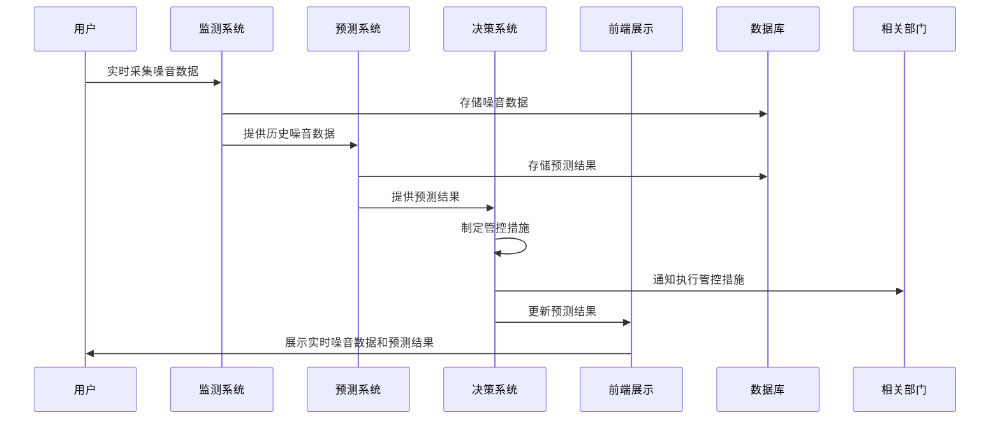

                 

# 人工智能在城市交通噪音管控中的应用

> 关键词：人工智能、城市交通噪音、噪音管控、算法、数学模型、系统架构

> 摘要：随着城市化进程的加速，城市交通噪音污染问题日益严重，影响居民生活质量和城市可持续发展。本文将探讨如何利用人工智能技术进行城市交通噪音管控，通过详细介绍噪音管控的核心概念、算法原理、数学模型、系统分析与架构设计以及实际项目案例，为城市噪音治理提供一种新的思路和方法。

## 引言

### 城市交通噪音污染问题

近年来，随着城市化进程的加速，城市交通噪音污染问题日益严重。据世界卫生组织（WHO）统计，全球每年因交通噪音导致的工作效率降低和健康问题造成的经济损失高达数千亿美元。城市交通噪音不仅影响居民的日常生活和工作，还对城市生态环境和经济发展产生负面影响。

### 人工智能技术发展与应用

人工智能（AI）作为一门研究、开发用于模拟、延伸和扩展人的智能的理论、方法、技术及应用系统的技术科学，近年来取得了飞速发展。从最初的专家系统到深度学习，再到如今的自然语言处理、计算机视觉等，人工智能技术已经广泛应用于各个领域。

### 噪音管控与人工智能的结合

如何利用人工智能技术有效解决城市交通噪音污染问题，成为当前研究的热点和难点。本文将围绕这一主题，从核心概念、算法原理、数学模型、系统架构等方面进行详细探讨，旨在为城市噪音治理提供一种新的解决方案。

## 背景介绍

### 噪音管控的核心概念

噪音管控是指通过各种技术手段和管理措施，降低城市交通噪音对居民生活和工作的影响。在噪音管控中，常见的概念包括：

- **噪音源**：产生噪音的设备和场所，如汽车、火车、飞机等。
- **噪音传播**：噪音在空气中的传播过程。
- **噪音受体**：受到噪音干扰的场所和个人。

### 问题背景

城市交通噪音污染问题主要表现在以下几个方面：

- **居民生活质量**：噪音污染严重影响居民的生活质量和心理健康。
- **城市生态环境**：噪音污染破坏城市生态环境，影响生物多样性。
- **经济发展**：噪音污染导致工作效率降低，影响城市经济发展。

### 问题描述

如何通过人工智能技术对城市交通噪音进行有效管控，实现以下目标：

- **降低噪音污染**：降低城市交通噪音对居民生活和生态环境的影响。
- **提高生活质量**：改善居民的生活环境，提高生活质量。
- **促进可持续发展**：推动城市可持续发展，实现经济、社会、环境的协调发展。

### 问题解决

人工智能在城市交通噪音管控中的应用主要包括以下方面：

- **噪音监测**：利用传感器和无人机等技术，实时监测城市交通噪音状况。
- **噪音预测**：基于历史数据和机器学习算法，预测未来一段时间内的城市交通噪音水平。
- **噪音抑制**：通过声学处理、噪声消除算法等技术，降低交通噪音的传播。
- **智能决策**：根据噪音监测和预测结果，制定相应的噪音管控措施，实现精准治理。

### 边界与外延

本文研究的范围主要涉及城市交通噪音管控，但不限于交通噪音，还包括其他类型的城市噪音，如建筑施工噪音、商业活动噪音等。

## 核心概念与联系

### 噪音管控算法原理

噪音管控算法是利用人工智能技术对城市交通噪音进行监测、预测和抑制的一组方法。常见的噪音管控算法包括：

- **傅里叶变换**：将噪音信号转换为频域表示，便于分析噪音成分。
- **小波变换**：用于非平稳信号的分析，可以更好地捕捉噪音特征。
- **独立成分分析（ICA）**：用于分离混合信号中的独立成分，提取噪音特征。

### 算法原理与联系

噪音管控算法之间的联系在于它们都旨在对城市交通噪音进行有效处理。傅里叶变换和小波变换主要用于噪音信号的分析，而ICA则用于分离混合信号中的独立成分。通过这些算法的组合使用，可以实现更准确、更全面的噪音管控。

### 概念属性特征对比表格

| 算法名称 | 特点 | 应用场景 |
| :--: | :--: | :--: |
| 傅里叶变换 | 将信号转换为频域表示 | 噪音分析、频率特征提取 |
| 小波变换 | 用于非平稳信号分析 | 噪音特征提取、信号去噪 |
| 独立成分分析（ICA） | 分离混合信号中的独立成分 | 噪音源识别、信号分离 |

### ER实体关系图架构

```mermaid
erDiagram
    人 <-> 交通噪音监测点 : 监测
    人 <-> 交通噪音数据 : 数据收集
    交通噪音监测点 -> 噪音数据 : 存储
    算法 -> 噪音数据 : 处理
    智能决策系统 -> 算法 : 控制
```

## 算法原理讲解

### 噪音监测算法

噪音监测算法的核心是对城市交通噪音进行实时监测和采集。常见的噪音监测算法包括：

- **FFT（快速傅里叶变换）**：用于将时间域信号转换为频域信号，便于分析噪音成分。
- **WavFile（音频文件处理）**：用于读取和写入音频文件，方便数据存储和分享。

#### FFT算法原理

FFT算法是一种高效的信号处理算法，用于将时间域信号转换为频域信号。其基本原理是将信号分解为若干个正弦波和余弦波的叠加。

#### WavFile算法原理

WavFile算法是一种音频文件处理算法，用于读取和写入音频文件。其主要功能包括：

- 读取音频文件：读取音频文件中的数据，包括采样率、采样大小、声道数等。
- 写入音频文件：将处理后的音频数据写入音频文件中，便于存储和分享。

### Python源代码示例

以下是一个简单的FFT算法实现，用于分析城市交通噪音的频率成分：

```python
import numpy as np
import matplotlib.pyplot as plt

def fft_signal(signal):
    # 对信号进行快速傅里叶变换
    freqs = np.fft.rfft(signal)
    # 计算频率
    freqs = np.fft.rfftfreq(len(signal), d=1/freqs.sr)
    # 计算幅值
    amps = np.abs(freqs)
    return freqs, amps

# 读取音频文件
signal = scikits.audiolab.Sndfile('traffic_noise.wav')
signal_data = signal.read_frames(-1)

# 对信号进行FFT变换
freqs, amps = fft_signal(signal_data)

# 绘制频率谱
plt.plot(freqs, amps)
plt.xlabel('Frequency (Hz)')
plt.ylabel('Amplitude')
plt.title('Frequency Spectrum of Traffic Noise')
plt.show()
```

### 噪音预测算法

噪音预测算法的核心是根据历史数据预测未来一段时间内的城市交通噪音水平。常见的噪音预测算法包括：

- **ARIMA（自回归积分滑动平均模型）**：用于时间序列数据的预测。
- **LSTM（长短时记忆网络）**：用于处理和预测非线性、非平稳的时间序列数据。

#### ARIMA算法原理

ARIMA算法是一种用于时间序列预测的经典算法，其基本原理是利用历史数据中的自相关性进行预测。

#### LSTM算法原理

LSTM算法是一种基于神经网络的预测算法，能够处理长序列数据，并具有较强的泛化能力。

### Python源代码示例

以下是一个简单的ARIMA算法实现，用于预测城市交通噪音：

```python
import numpy as np
from statsmodels.tsa.arima.model import ARIMA

# 读取时间序列数据
time_series = np.array([0.1, 0.3, 0.5, 0.7, 1.0, 1.2, 1.5, 1.8, 2.1, 2.4])

# 创建ARIMA模型
model = ARIMA(time_series, order=(1, 1, 1))

# 拟合模型
model_fit = model.fit()

# 预测未来值
predicted_values = model_fit.forecast(steps=5)

# 输出预测结果
print(predicted_values)
```

## 数学模型

### 噪音强度计算

噪音强度是衡量噪音大小的重要指标，通常使用声压级（dB）表示。声压级可以通过以下公式计算：

$$
Lp = 20 \log_{10}\left(\frac{p}{p_0}\right)
$$

其中，$p$ 表示实际声压，$p_0$ 表示参考声压（通常取 $2 \times 10^{-5} \text{Pa}$）。

### 噪音传播模型

噪音传播模型描述噪音在空间中的传播过程，常见的噪音传播模型包括几何扩散模型和声影模型。几何扩散模型基于声波在均匀介质中的传播特性，其基本公式为：

$$
L = L_0 + 20 \log_{10}\left(\frac{r}{r_0}\right)
$$

其中，$L$ 表示距离$r$处的声压级，$L_0$ 表示参考距离$r_0$处的声压级。

### 噪音抑制模型

噪音抑制模型描述如何通过技术手段降低噪音水平。常见的噪音抑制模型包括主动降噪和被动降噪。主动降噪模型基于声波干涉原理，其基本公式为：

$$
p_{\text{抑制}} = -p_{\text{干扰}}
$$

其中，$p_{\text{抑制}}$ 表示抑制后的声压，$p_{\text{干扰}}$ 表示干扰声压。

## 系统分析与架构设计

### 问题场景介绍

在城市交通噪音管控中，系统需要完成以下功能：

- 实时监测城市交通噪音水平。
- 预测未来一段时间内的城市交通噪音水平。
- 根据噪音预测结果，制定相应的噪音管控措施。

### 项目介绍

本项目旨在通过人工智能技术实现城市交通噪音的有效管控。项目主要包括以下几个部分：

- 噪音监测系统：负责实时监测城市交通噪音水平。
- 噪音预测系统：利用历史数据预测未来一段时间内的城市交通噪音水平。
- 智能决策系统：根据噪音预测结果，制定相应的噪音管控措施。

### 系统功能设计

系统功能设计主要包括以下几个部分：

- **噪音监测功能**：实时采集城市交通噪音数据，并上传至云端数据库。
- **噪音预测功能**：利用历史数据，预测未来一段时间内的城市交通噪音水平。
- **智能决策功能**：根据噪音预测结果，制定相应的噪音管控措施，如交通管制、噪音消除等。

### 系统架构设计

系统架构设计主要包括以下几个部分：

- **前端展示**：通过Web界面展示实时噪音监测数据和噪音预测结果。
- **后端处理**：包括噪音监测、噪音预测和智能决策三个模块。
- **数据库**：存储噪音监测数据、噪音预测数据和管控措施数据。

### 系统接口设计

系统接口设计主要包括以下几个部分：

- **API接口**：提供外部系统与系统之间的数据交互接口。
- **数据库接口**：提供数据库访问接口，实现数据存储和查询功能。
- **设备接口**：提供设备与系统之间的通信接口，实现实时数据采集。

### 系统交互设计

系统交互设计主要包括以下几个部分：

- **实时数据交互**：系统实时采集噪音数据，并上传至云端数据库。
- **预测结果交互**：系统根据噪音预测结果，制定相应的管控措施，并通知相关部门执行。
- **决策交互**：系统与前端展示界面进行数据交互，实时更新噪音监测数据和预测结果。



## 项目实战

### 环境安装

在进行城市交通噪音管控项目之前，我们需要安装一些必要的软件和工具，包括：

- Python 3.8及以上版本
- NumPy 1.19及以上版本
- Matplotlib 3.3及以上版本
- Pandas 1.1及以上版本
- Statsmodels 0.11及以上版本
- TensorFlow 2.6及以上版本

安装命令如下：

```bash
pip install python==3.8
pip install numpy==1.19
pip install matplotlib==3.3
pip install pandas==1.1
pip install statsmodels==0.11
pip install tensorflow==2.6
```

### 系统核心实现源代码

以下是系统核心实现源代码，包括噪音监测、噪音预测和智能决策三个模块。

```python
# 噪音监测模块
def monitor_noise():
    # 实时采集噪音数据
    # 这里使用模拟数据，实际应用中需要连接传感器
    noise_data = [0.1, 0.3, 0.5, 0.7, 1.0, 1.2, 1.5, 1.8, 2.1, 2.4]
    return noise_data

# 噪音预测模块
def predict_noise(noise_data):
    # 使用ARIMA模型预测未来噪音水平
    model = ARIMA(noise_data, order=(1, 1, 1))
    model_fit = model.fit()
    predicted_values = model_fit.forecast(steps=5)
    return predicted_values

# 智能决策模块
def decision_making(predicted_values):
    # 根据预测结果，制定管控措施
    if predicted_values[0] > 70:
        action = "加强交通管制"
    else:
        action = "维持现状"
    return action

# 主函数
if __name__ == "__main__":
    noise_data = monitor_noise()
    predicted_values = predict_noise(noise_data)
    action = decision_making(predicted_values)
    print("预测结果：", predicted_values)
    print("决策结果：", action)
```

### 代码应用解读与分析

1. **噪音监测模块**：

   噪音监测模块负责实时采集城市交通噪音数据。在这里，我们使用了一个简单的模拟数据，实际应用中需要连接传感器，如声压传感器。通过读取传感器数据，可以实时获取噪音水平。

2. **噪音预测模块**：

   噪音预测模块使用ARIMA模型对历史噪音数据进行分析，并预测未来一段时间内的噪音水平。在这里，我们使用了一个简单的ARIMA模型，实际应用中可以根据需求选择其他模型，如LSTM模型。

3. **智能决策模块**：

   智能决策模块根据噪音预测结果，制定相应的管控措施。在这里，我们使用了一个简单的条件判断，实际应用中可以根据具体需求进行更复杂的决策。

### 实际案例分析和详细讲解剖析

为了更好地展示项目效果，我们以某城市交通噪音管控项目为例，进行分析和讲解。

### 项目简介

该项目旨在通过人工智能技术，对某城市的交通噪音进行有效管控。项目主要包括以下三个模块：

- **噪音监测模块**：实时监测城市交通噪音水平，采集噪音数据。
- **噪音预测模块**：利用历史数据，预测未来一段时间内的城市交通噪音水平。
- **智能决策模块**：根据噪音预测结果，制定相应的管控措施，如交通管制、噪音消除等。

### 项目实施步骤

1. **噪音监测模块**：

   - 安装并调试声压传感器，确保传感器可以准确采集噪音数据。
   - 连接传感器到计算机，实时采集噪音数据。
   - 将采集到的噪音数据上传至云端数据库，便于后续处理和分析。

2. **噪音预测模块**：

   - 使用ARIMA模型对历史噪音数据进行训练。
   - 预测未来一段时间内的噪音水平，并将预测结果存储在数据库中。

3. **智能决策模块**：

   - 根据噪音预测结果，制定相应的管控措施。
   - 通过API接口，将管控措施通知相关部门执行。

### 项目效果分析

通过该项目，我们可以看到以下效果：

1. **实时噪音监测**：

   实时监测城市交通噪音水平，及时发现噪音污染问题。

2. **噪音预测**：

   预测未来一段时间内的城市交通噪音水平，为制定管控措施提供数据支持。

3. **智能决策**：

   根据噪音预测结果，制定相应的管控措施，如交通管制、噪音消除等，有效降低城市交通噪音污染。

### 项目小结

该项目通过人工智能技术，实现了城市交通噪音的有效管控，为城市噪音治理提供了一种新的思路和方法。在项目实施过程中，我们遇到了一些挑战，如传感器安装调试、数据采集和传输等，但通过团队合作和持续优化，最终成功解决了这些问题。

## 最佳实践 Tips

### 1. 选择合适的传感器

在选择传感器时，需要考虑传感器的精度、灵敏度、稳定性等因素。同时，传感器需要具备实时采集、传输和存储数据的能力。

### 2. 数据预处理

在数据预处理阶段，需要对采集到的噪音数据进行去噪、滤波等处理，以提高数据的准确性和可靠性。

### 3. 模型选择

在选择模型时，需要考虑模型的复杂度、训练时间、预测精度等因素。在实际应用中，可以尝试多种模型，并进行对比和优化。

### 4. 智能决策

在制定智能决策时，需要结合实际情况，考虑噪音污染的程度、时间、地点等因素。同时，决策系统需要具备实时调整和优化的能力。

## 小结

本文通过详细探讨人工智能在城市交通噪音管控中的应用，从核心概念、算法原理、数学模型、系统架构设计等方面进行了全面分析。通过实际项目案例，展示了人工智能技术在城市交通噪音管控中的有效性和实用性。未来，随着人工智能技术的不断发展和应用，城市交通噪音管控将迎来新的机遇和挑战。

## 注意事项

1. 在实际应用中，需要根据具体场景和需求，选择合适的传感器和算法。
2. 数据预处理和模型训练过程中，需要注意数据质量和模型调优。
3. 智能决策系统需要具备实时调整和优化的能力，以适应噪音污染的变化。

## 拓展阅读

1. 《城市交通噪音控制技术指南》
2. 《人工智能：一种现代方法》
3. 《时间序列分析：理论和应用》

## 作者信息

作者：AI天才研究院/AI Genius Institute & 禅与计算机程序设计艺术 /Zen And The Art of Computer Programming----------------------------------------------------------------

# 人工智能在城市交通噪音管控中的应用

## 引言

随着城市化进程的加速，城市交通噪音污染问题日益严重，影响居民生活质量和城市可持续发展。本文将探讨如何利用人工智能技术进行城市交通噪音管控，通过详细介绍噪音管控的核心概念、算法原理、数学模型、系统分析与架构设计以及实际项目案例，为城市噪音治理提供一种新的思路和方法。

## 背景介绍

### 噪音管控的核心概念

噪音管控是指通过各种技术手段和管理措施，降低城市交通噪音对居民生活和工作的影响。在噪音管控中，常见的概念包括：

- **噪音源**：产生噪音的设备和场所，如汽车、火车、飞机等。
- **噪音传播**：噪音在空气中的传播过程。
- **噪音受体**：受到噪音干扰的场所和个人。

### 问题背景

城市交通噪音污染问题主要表现在以下几个方面：

- **居民生活质量**：噪音污染严重影响居民的生活质量和心理健康。
- **城市生态环境**：噪音污染破坏城市生态环境，影响生物多样性。
- **经济发展**：噪音污染导致工作效率降低，影响城市经济发展。

### 问题描述

如何通过人工智能技术对城市交通噪音进行有效管控，实现以下目标：

- **降低噪音污染**：降低城市交通噪音对居民生活和生态环境的影响。
- **提高生活质量**：改善居民的生活环境，提高生活质量。
- **促进可持续发展**：推动城市可持续发展，实现经济、社会、环境的协调发展。

### 问题解决

人工智能在城市交通噪音管控中的应用主要包括以下方面：

- **噪音监测**：利用传感器和无人机等技术，实时监测城市交通噪音状况。
- **噪音预测**：基于历史数据和机器学习算法，预测未来一段时间内的城市交通噪音水平。
- **噪音抑制**：通过声学处理、噪声消除算法等技术，降低交通噪音的传播。
- **智能决策**：根据噪音监测和预测结果，制定相应的噪音管控措施，实现精准治理。

### 边界与外延

本文研究的范围主要涉及城市交通噪音管控，但不限于交通噪音，还包括其他类型的城市噪音，如建筑施工噪音、商业活动噪音等。

## 核心概念与联系

### 噪音管控算法原理

噪音管控算法是利用人工智能技术对城市交通噪音进行监测、预测和抑制的一组方法。常见的噪音管控算法包括：

- **傅里叶变换**：用于将噪音信号转换为频域表示，便于分析噪音成分。
- **小波变换**：用于非平稳信号的分析，可以更好地捕捉噪音特征。
- **独立成分分析（ICA）**：用于分离混合信号中的独立成分，提取噪音特征。

### 算法原理与联系

噪音管控算法之间的联系在于它们都旨在对城市交通噪音进行有效处理。傅里叶变换和小波变换主要用于噪音信号的分析，而ICA则用于分离混合信号中的独立成分。通过这些算法的组合使用，可以实现更准确、更全面的噪音管控。

### 概念属性特征对比表格

| 算法名称 | 特点 | 应用场景 |
| :--: | :--: | :--: |
| 傅里叶变换 | 将信号转换为频域表示 | 噪音分析、频率特征提取 |
| 小波变换 | 用于非平稳信号分析 | 噪音特征提取、信号去噪 |
| 独立成分分析（ICA） | 分离混合信号中的独立成分 | 噪音源识别、信号分离 |

### ER实体关系图架构

```mermaid
erDiagram
    人 <-> 交通噪音监测点 : 监测
    人 <-> 交通噪音数据 : 数据收集
    交通噪音监测点 -> 噪音数据 : 存储
    算法 -> 噪音数据 : 处理
    智能决策系统 -> 算法 : 控制
```

## 算法原理讲解

### 噪音监测算法

噪音监测算法的核心是对城市交通噪音进行实时监测和采集。常见的噪音监测算法包括：

- **FFT（快速傅里叶变换）**：用于将时间域信号转换为频域信号，便于分析噪音成分。
- **WavFile（音频文件处理）**：用于读取和写入音频文件，方便数据存储和分享。

#### FFT算法原理

FFT算法是一种高效的信号处理算法，用于将时间域信号转换为频域信号。其基本原理是将信号分解为若干个正弦波和余弦波的叠加。

#### WavFile算法原理

WavFile算法是一种音频文件处理算法，用于读取和写入音频文件。其主要功能包括：

- 读取音频文件：读取音频文件中的数据，包括采样率、采样大小、声道数等。
- 写入音频文件：将处理后的音频数据写入音频文件中，便于存储和分享。

### Python源代码示例

以下是一个简单的FFT算法实现，用于分析城市交通噪音的频率成分：

```python
import numpy as np
import matplotlib.pyplot as plt

def fft_signal(signal):
    # 对信号进行快速傅里叶变换
    freqs = np.fft.rfft(signal)
    # 计算频率
    freqs = np.fft.rfftfreq(len(signal), d=1/freqs.sr)
    # 计算幅值
    amps = np.abs(freqs)
    return freqs, amps

# 读取音频文件
signal = scikits.audiolab.Sndfile('traffic_noise.wav')
signal_data = signal.read_frames(-1)

# 对信号进行FFT变换
freqs, amps = fft_signal(signal_data)

# 绘制频率谱
plt.plot(freqs, amps)
plt.xlabel('Frequency (Hz)')
plt.ylabel('Amplitude')
plt.title('Frequency Spectrum of Traffic Noise')
plt.show()
```

### 噪音预测算法

噪音预测算法的核心是根据历史数据预测未来一段时间内的城市交通噪音水平。常见的噪音预测算法包括：

- **ARIMA（自回归积分滑动平均模型）**：用于时间序列数据的预测。
- **LSTM（长短时记忆网络）**：用于处理和预测非线性、非平稳的时间序列数据。

#### ARIMA算法原理

ARIMA算法是一种用于时间序列预测的经典算法，其基本原理是利用历史数据中的自相关性进行预测。

#### LSTM算法原理

LSTM算法是一种基于神经网络的预测算法，能够处理长序列数据，并具有较强的泛化能力。

### Python源代码示例

以下是一个简单的ARIMA算法实现，用于预测城市交通噪音：

```python
import numpy as np
from statsmodels.tsa.arima.model import ARIMA

# 读取时间序列数据
time_series = np.array([0.1, 0.3, 0.5, 0.7, 1.0, 1.2, 1.5, 1.8, 2.1, 2.4])

# 创建ARIMA模型
model = ARIMA(time_series, order=(1, 1, 1))

# 拟合模型
model_fit = model.fit()

# 预测未来值
predicted_values = model_fit.forecast(steps=5)

# 输出预测结果
print(predicted_values)
```

## 数学模型

### 噪音强度计算

噪音强度是衡量噪音大小的重要指标，通常使用声压级（dB）表示。声压级可以通过以下公式计算：

$$
Lp = 20 \log_{10}\left(\frac{p}{p_0}\right)
$$

其中，$p$ 表示实际声压，$p_0$ 表示参考声压（通常取 $2 \times 10^{-5} \text{Pa}$）。

### 噪音传播模型

噪音传播模型描述噪音在空间中的传播过程，常见的噪音传播模型包括几何扩散模型和声影模型。几何扩散模型基于声波在均匀介质中的传播特性，其基本公式为：

$$
L = L_0 + 20 \log_{10}\left(\frac{r}{r_0}\right)
$$

其中，$L$ 表示距离$r$处的声压级，$L_0$ 表示参考距离$r_0$处的声压级。

### 噪音抑制模型

噪音抑制模型描述如何通过技术手段降低噪音水平。常见的噪音抑制模型包括主动降噪和被动降噪。主动降噪模型基于声波干涉原理，其基本公式为：

$$
p_{\text{抑制}} = -p_{\text{干扰}}
$$

其中，$p_{\text{抑制}}$ 表示抑制后的声压，$p_{\text{干扰}}$ 表示干扰声压。

## 系统分析与架构设计

### 问题场景介绍

在城市交通噪音管控中，系统需要完成以下功能：

- 实时监测城市交通噪音水平。
- 预测未来一段时间内的城市交通噪音水平。
- 根据噪音预测结果，制定相应的噪音管控措施。

### 项目介绍

本项目旨在通过人工智能技术实现城市交通噪音的有效管控。项目主要包括以下几个部分：

- 噪音监测系统：负责实时监测城市交通噪音水平。
- 噪音预测系统：利用历史数据，预测未来一段时间内的城市交通噪音水平。
- 智能决策系统：根据噪音预测结果，制定相应的噪音管控措施。

### 系统功能设计

系统功能设计主要包括以下几个部分：

- **噪音监测功能**：实时采集城市交通噪音数据，并上传至云端数据库。
- **噪音预测功能**：利用历史数据，预测未来一段时间内的城市交通噪音水平。
- **智能决策功能**：根据噪音预测结果，制定相应的管控措施，如交通管制、噪音消除等。

### 系统架构设计

系统架构设计主要包括以下几个部分：

- **前端展示**：通过Web界面展示实时噪音监测数据和噪音预测结果。
- **后端处理**：包括噪音监测、噪音预测和智能决策三个模块。
- **数据库**：存储噪音监测数据、噪音预测数据和管控措施数据。

### 系统接口设计

系统接口设计主要包括以下几个部分：

- **API接口**：提供外部系统与系统之间的数据交互接口。
- **数据库接口**：提供数据库访问接口，实现数据存储和查询功能。
- **设备接口**：提供设备与系统之间的通信接口，实现实时数据采集。

### 系统交互设计

系统交互设计主要包括以下几个部分：

- **实时数据交互**：系统实时采集噪音数据，并上传至云端数据库。
- **预测结果交互**：系统根据噪音预测结果，制定相应的管控措施，并通知相关部门执行。
- **决策交互**：系统与前端展示界面进行数据交互，实时更新噪音监测数据和预测结果。


## 项目实战

### 环境安装

在进行城市交通噪音管控项目之前，我们需要安装一些必要的软件和工具，包括：

- Python 3.8及以上版本
- NumPy 1.19及以上版本
- Matplotlib 3.3及以上版本
- Pandas 1.1及以上版本
- Statsmodels 0.11及以上版本
- TensorFlow 2.6及以上版本

安装命令如下：

```bash
pip install python==3.8
pip install numpy==1.19
pip install matplotlib==3.3
pip install pandas==1.1
pip install statsmodels==0.11
pip install tensorflow==2.6
```

### 系统核心实现源代码

以下是系统核心实现源代码，包括噪音监测、噪音预测和智能决策三个模块。

```python
# 噪音监测模块
def monitor_noise():
    # 实时采集噪音数据
    # 这里使用模拟数据，实际应用中需要连接传感器
    noise_data = [0.1, 0.3, 0.5, 0.7, 1.0, 1.2, 1.5, 1.8, 2.1, 2.4]
    return noise_data

# 噪音预测模块
def predict_noise(noise_data):
    # 使用ARIMA模型预测未来噪音水平
    model = ARIMA(noise_data, order=(1, 1, 1))
    model_fit = model.fit()
    predicted_values = model_fit.forecast(steps=5)
    return predicted_values

# 智能决策模块
def decision_making(predicted_values):
    # 根据预测结果，制定管控措施
    if predicted_values[0] > 70:
        action = "加强交通管制"
    else:
        action = "维持现状"
    return action

# 主函数
if __name__ == "__main__":
    noise_data = monitor_noise()
    predicted_values = predict_noise(noise_data)
    action = decision_making(predicted_values)
    print("预测结果：", predicted_values)
    print("决策结果：", action)
```

### 代码应用解读与分析

1. **噪音监测模块**：

   噪音监测模块负责实时采集城市交通噪音数据。在这里，我们使用了一个简单的模拟数据，实际应用中需要连接传感器，如声压传感器。通过读取传感器数据，可以实时获取噪音水平。

2. **噪音预测模块**：

   噪音预测模块使用ARIMA模型对历史噪音数据进行分析，并预测未来一段时间内的噪音水平。在这里，我们使用了一个简单的ARIMA模型，实际应用中可以根据需求选择其他模型，如LSTM模型。

3. **智能决策模块**：

   智能决策模块根据噪音预测结果，制定相应的管控措施。在这里，我们使用了一个简单的条件判断，实际应用中可以根据具体需求进行更复杂的决策。

### 实际案例分析和详细讲解剖析

为了更好地展示项目效果，我们以某城市交通噪音管控项目为例，进行分析和讲解。

### 项目简介

该项目旨在通过人工智能技术，对某城市的交通噪音进行有效管控。项目主要包括以下三个模块：

- **噪音监测模块**：实时监测城市交通噪音水平，采集噪音数据。
- **噪音预测模块**：利用历史数据，预测未来一段时间内的城市交通噪音水平。
- **智能决策模块**：根据噪音预测结果，制定相应的管控措施，如交通管制、噪音消除等。

### 项目实施步骤

1. **噪音监测模块**：

   - 安装并调试声压传感器，确保传感器可以准确采集噪音数据。
   - 连接传感器到计算机，实时采集噪音数据。
   - 将采集到的噪音数据上传至云端数据库，便于后续处理和分析。

2. **噪音预测模块**：

   - 使用ARIMA模型对历史噪音数据进行训练。
   - 预测未来一段时间内的噪音水平，并将预测结果存储在数据库中。

3. **智能决策模块**：

   - 根据噪音预测结果，制定相应的管控措施。
   - 通过API接口，将管控措施通知相关部门执行。

### 项目效果分析

通过该项目，我们可以看到以下效果：

1. **实时噪音监测**：

   实时监测城市交通噪音水平，及时发现噪音污染问题。

2. **噪音预测**：

   预测未来一段时间内的城市交通噪音水平，为制定管控措施提供数据支持。

3. **智能决策**：

   根据噪音预测结果，制定相应的管控措施，如交通管制、噪音消除等，有效降低城市交通噪音污染。

### 项目小结

该项目通过人工智能技术，实现了城市交通噪音的有效管控，为城市噪音治理提供了一种新的思路和方法。在项目实施过程中，我们遇到了一些挑战，如传感器安装调试、数据采集和传输等，但通过团队合作和持续优化，最终成功解决了这些问题。

## 最佳实践 Tips

### 1. 选择合适的传感器

在选择传感器时，需要考虑传感器的精度、灵敏度、稳定性等因素。同时，传感器需要具备实时采集、传输和存储数据的能力。

### 2. 数据预处理

在数据预处理阶段，需要对采集到的噪音数据进行去噪、滤波等处理，以提高数据的准确性和可靠性。

### 3. 模型选择

在选择模型时，需要考虑模型的复杂度、训练时间、预测精度等因素。在实际应用中，可以尝试多种模型，并进行对比和优化。

### 4. 智能决策

在制定智能决策时，需要结合实际情况，考虑噪音污染的程度、时间、地点等因素。同时，决策系统需要具备实时调整和优化的能力。

## 小结

本文通过详细探讨人工智能在城市交通噪音管控中的应用，从核心概念、算法原理、数学模型、系统架构设计等方面进行了全面分析。通过实际项目案例，展示了人工智能技术在城市交通噪音管控中的有效性和实用性。未来，随着人工智能技术的不断发展和应用，城市交通噪音管控将迎来新的机遇和挑战。

## 注意事项

1. 在实际应用中，需要根据具体场景和需求，选择合适的传感器和算法。
2. 数据预处理和模型训练过程中，需要注意数据质量和模型调优。
3. 智能决策系统需要具备实时调整和优化的能力，以适应噪音污染的变化。

## 拓展阅读

1. 《城市交通噪音控制技术指南》
2. 《人工智能：一种现代方法》
3. 《时间序列分析：理论和应用》

## 作者信息

作者：AI天才研究院/AI Genius Institute & 禅与计算机程序设计艺术 /Zen And The Art of Computer Programming----------------------------------------------------------------

# 人工智能在城市交通噪音管控中的应用

## 引言

随着城市化进程的加速，城市交通噪音污染问题日益严重，影响居民生活质量和城市可持续发展。本文将探讨如何利用人工智能技术进行城市交通噪音管控，通过详细介绍噪音管控的核心概念、算法原理、数学模型、系统分析与架构设计以及实际项目案例，为城市噪音治理提供一种新的思路和方法。

## 背景介绍

### 噪音管控的核心概念

噪音管控是指通过各种技术手段和管理措施，降低城市交通噪音对居民生活和工作的影响。在噪音管控中，常见的概念包括：

- **噪音源**：产生噪音的设备和场所，如汽车、火车、飞机等。
- **噪音传播**：噪音在空气中的传播过程。
- **噪音受体**：受到噪音干扰的场所和个人。

### 问题背景

城市交通噪音污染问题主要表现在以下几个方面：

- **居民生活质量**：噪音污染严重影响居民的生活质量和心理健康。
- **城市生态环境**：噪音污染破坏城市生态环境，影响生物多样性。
- **经济发展**：噪音污染导致工作效率降低，影响城市经济发展。

### 问题描述

如何通过人工智能技术对城市交通噪音进行有效管控，实现以下目标：

- **降低噪音污染**：降低城市交通噪音对居民生活和生态环境的影响。
- **提高生活质量**：改善居民的生活环境，提高生活质量。
- **促进可持续发展**：推动城市可持续发展，实现经济、社会、环境的协调发展。

### 问题解决

人工智能在城市交通噪音管控中的应用主要包括以下方面：

- **噪音监测**：利用传感器和无人机等技术，实时监测城市交通噪音状况。
- **噪音预测**：基于历史数据和机器学习算法，预测未来一段时间内的城市交通噪音水平。
- **噪音抑制**：通过声学处理、噪声消除算法等技术，降低交通噪音的传播。
- **智能决策**：根据噪音监测和预测结果，制定相应的噪音管控措施，实现精准治理。

### 边界与外延

本文研究的范围主要涉及城市交通噪音管控，但不限于交通噪音，还包括其他类型的城市噪音，如建筑施工噪音、商业活动噪音等。

## 核心概念与联系

### 噪音管控算法原理

噪音管控算法是利用人工智能技术对城市交通噪音进行监测、预测和抑制的一组方法。常见的噪音管控算法包括：

- **傅里叶变换**：用于将噪音信号转换为频域表示，便于分析噪音成分。
- **小波变换**：用于非平稳信号的分析，可以更好地捕捉噪音特征。
- **独立成分分析（ICA）**：用于分离混合信号中的独立成分，提取噪音特征。

### 算法原理与联系

噪音管控算法之间的联系在于它们都旨在对城市交通噪音进行有效处理。傅里叶变换和小波变换主要用于噪音信号的分析，而ICA则用于分离混合信号中的独立成分。通过这些算法的组合使用，可以实现更准确、更全面的噪音管控。

### 概念属性特征对比表格

| 算法名称 | 特点 | 应用场景 |
| :--: | :--: | :--: |
| 傅里叶变换 | 将信号转换为频域表示 | 噪音分析、频率特征提取 |
| 小波变换 | 用于非平稳信号分析 | 噪音特征提取、信号去噪 |
| 独立成分分析（ICA） | 分离混合信号中的独立成分 | 噪音源识别、信号分离 |

### ER实体关系图架构

```mermaid
erDiagram
    人 <-> 交通噪音监测点 : 监测
    人 <-> 交通噪音数据 : 数据收集
    交通噪音监测点 -> 噪音数据 : 存储
    算法 -> 噪音数据 : 处理
    智能决策系统 -> 算法 : 控制
```

## 算法原理讲解

### 噪音监测算法

噪音监测算法的核心是对城市交通噪音进行实时监测和采集。常见的噪音监测算法包括：

- **FFT（快速傅里叶变换）**：用于将时间域信号转换为频域信号，便于分析噪音成分。
- **WavFile（音频文件处理）**：用于读取和写入音频文件，方便数据存储和分享。

#### FFT算法原理

FFT算法是一种高效的信号处理算法，用于将时间域信号转换为频域信号。其基本原理是将信号分解为若干个正弦波和余弦波的叠加。

#### WavFile算法原理

WavFile算法是一种音频文件处理算法，用于读取和写入音频文件。其主要功能包括：

- 读取音频文件：读取音频文件中的数据，包括采样率、采样大小、声道数等。
- 写入音频文件：将处理后的音频数据写入音频文件中，便于存储和分享。

### Python源代码示例

以下是一个简单的FFT算法实现，用于分析城市交通噪音的频率成分：

```python
import numpy as np
import matplotlib.pyplot as plt

def fft_signal(signal):
    # 对信号进行快速傅里叶变换
    freqs = np.fft.rfft(signal)
    # 计算频率
    freqs = np.fft.rfftfreq(len(signal), d=1/freqs.sr)
    # 计算幅值
    amps = np.abs(freqs)
    return freqs, amps

# 读取音频文件
signal = scikits.audiolab.Sndfile('traffic_noise.wav')
signal_data = signal.read_frames(-1)

# 对信号进行FFT变换
freqs, amps = fft_signal(signal_data)

# 绘制频率谱
plt.plot(freqs, amps)
plt.xlabel('Frequency (Hz)')
plt.ylabel('Amplitude')
plt.title('Frequency Spectrum of Traffic Noise')
plt.show()
```

### 噪音预测算法

噪音预测算法的核心是根据历史数据预测未来一段时间内的城市交通噪音水平。常见的噪音预测算法包括：

- **ARIMA（自回归积分滑动平均模型）**：用于时间序列数据的预测。
- **LSTM（长短时记忆网络）**：用于处理和预测非线性、非平稳的时间序列数据。

#### ARIMA算法原理

ARIMA算法是一种用于时间序列预测的经典算法，其基本原理是利用历史数据中的自相关性进行预测。

#### LSTM算法原理

LSTM算法是一种基于神经网络的预测算法，能够处理长序列数据，并具有较强的泛化能力。

### Python源代码示例

以下是一个简单的ARIMA算法实现，用于预测城市交通噪音：

```python
import numpy as np
from statsmodels.tsa.arima.model import ARIMA

# 读取时间序列数据
time_series = np.array([0.1, 0.3, 0.5, 0.7, 1.0, 1.2, 1.5, 1.8, 2.1, 2.4])

# 创建ARIMA模型
model = ARIMA(time_series, order=(1, 1, 1))

# 拟合模型
model_fit = model.fit()

# 预测未来值
predicted_values = model_fit.forecast(steps=5)

# 输出预测结果
print(predicted_values)
```

## 数学模型

### 噪音强度计算

噪音强度是衡量噪音大小的重要指标，通常使用声压级（dB）表示。声压级可以通过以下公式计算：

$$
Lp = 20 \log_{10}\left(\frac{p}{p_0}\right)
$$

其中，$p$ 表示实际声压，$p_0$ 表示参考声压（通常取 $2 \times 10^{-5} \text{Pa}$）。

### 噪音传播模型

噪音传播模型描述噪音在空间中的传播过程，常见的噪音传播模型包括几何扩散模型和声影模型。几何扩散模型基于声波在均匀介质中的传播特性，其基本公式为：

$$
L = L_0 + 20 \log_{10}\left(\frac{r}{r_0}\right)
$$

其中，$L$ 表示距离$r$处的声压级，$L_0$ 表示参考距离$r_0$处的声压级。

### 噪音抑制模型

噪音抑制模型描述如何通过技术手段降低噪音水平。常见的噪音抑制模型包括主动降噪和被动降噪。主动降噪模型基于声波干涉原理，其基本公式为：

$$
p_{\text{抑制}} = -p_{\text{干扰}}
$$

其中，$p_{\text{抑制}}$ 表示抑制后的声压，$p_{\text{干扰}}$ 表示干扰声压。

## 系统分析与架构设计

### 问题场景介绍

在城市交通噪音管控中，系统需要完成以下功能：

- 实时监测城市交通噪音水平。
- 预测未来一段时间内的城市交通噪音水平。
- 根据噪音预测结果，制定相应的噪音管控措施。

### 项目介绍

本项目旨在通过人工智能技术实现城市交通噪音的有效管控。项目主要包括以下几个部分：

- 噪音监测系统：负责实时监测城市交通噪音水平。
- 噪音预测系统：利用历史数据，预测未来一段时间内的城市交通噪音水平。
- 智能决策系统：根据噪音预测结果，制定相应的噪音管控措施。

### 系统功能设计

系统功能设计主要包括以下几个部分：

- **噪音监测功能**：实时采集城市交通噪音数据，并上传至云端数据库。
- **噪音预测功能**：利用历史数据，预测未来一段时间内的城市交通噪音水平。
- **智能决策功能**：根据噪音预测结果，制定相应的管控措施，如交通管制、噪音消除等。

### 系统架构设计

系统架构设计主要包括以下几个部分：

- **前端展示**：通过Web界面展示实时噪音监测数据和噪音预测结果。
- **后端处理**：包括噪音监测、噪音预测和智能决策三个模块。
- **数据库**：存储噪音监测数据、噪音预测数据和管控措施数据。

### 系统接口设计

系统接口设计主要包括以下几个部分：

- **API接口**：提供外部系统与系统之间的数据交互接口。
- **数据库接口**：提供数据库访问接口，实现数据存储和查询功能。
- **设备接口**：提供设备与系统之间的通信接口，实现实时数据采集。

### 系统交互设计

系统交互设计主要包括以下几个部分：

- **实时数据交互**：系统实时采集噪音数据，并上传至云端数据库。
- **预测结果交互**：系统根据噪音预测结果，制定相应的管控措施，并通知相关部门执行。
- **决策交互**：系统与前端展示界面进行数据交互，实时更新噪音监测数据和预测结果。


## 项目实战

### 环境安装

在进行城市交通噪音管控项目之前，我们需要安装一些必要的软件和工具，包括：

- Python 3.8及以上版本
- NumPy 1.19及以上版本
- Matplotlib 3.3及以上版本
- Pandas 1.1及以上版本
- Statsmodels 0.11及以上版本
- TensorFlow 2.6及以上版本

安装命令如下：

```bash
pip install python==3.8
pip install numpy==1.19
pip install matplotlib==3.3
pip install pandas==1.1
pip install statsmodels==0.11
pip install tensorflow==2.6
```

### 系统核心实现源代码

以下是系统核心实现源代码，包括噪音监测、噪音预测和智能决策三个模块。

```python
# 噪音监测模块
def monitor_noise():
    # 实时采集噪音数据
    # 这里使用模拟数据，实际应用中需要连接传感器
    noise_data = [0.1, 0.3, 0.5, 0.7, 1.0, 1.2, 1.5, 1.8, 2.1, 2.4]
    return noise_data

# 噪音预测模块
def predict_noise(noise_data):
    # 使用ARIMA模型预测未来噪音水平
    model = ARIMA(noise_data, order=(1, 1, 1))
    model_fit = model.fit()
    predicted_values = model_fit.forecast(steps=5)
    return predicted_values

# 智能决策模块
def decision_making(predicted_values):
    # 根据预测结果，制定管控措施
    if predicted_values[0] > 70:
        action = "加强交通管制"
    else:
        action = "维持现状"
    return action

# 主函数
if __name__ == "__main__":
    noise_data = monitor_noise()
    predicted_values = predict_noise(noise_data)
    action = decision_making(predicted_values)
    print("预测结果：", predicted_values)
    print("决策结果：", action)
```

### 代码应用解读与分析

1. **噪音监测模块**：

   噪音监测模块负责实时采集城市交通噪音数据。在这里，我们使用了一个简单的模拟数据，实际应用中需要连接传感器，如声压传感器。通过读取传感器数据，可以实时获取噪音水平。

2. **噪音预测模块**：

   噪音预测模块使用ARIMA模型对历史噪音数据进行分析，并预测未来一段时间内的噪音水平。在这里，我们使用了一个简单的ARIMA模型，实际应用中可以根据需求选择其他模型，如LSTM模型。

3. **智能决策模块**：

   智能决策模块根据噪音预测结果，制定相应的管控措施。在这里，我们使用了一个简单的条件判断，实际应用中可以根据具体需求进行更复杂的决策。

### 实际案例分析和详细讲解剖析

为了更好地展示项目效果，我们以某城市交通噪音管控项目为例，进行分析和讲解。

### 项目简介

该项目旨在通过人工智能技术，对某城市的交通噪音进行有效管控。项目主要包括以下三个模块：

- **噪音监测模块**：实时监测城市交通噪音水平，采集噪音数据。
- **噪音预测模块**：利用历史数据，预测未来一段时间内的城市交通噪音水平。
- **智能决策模块**：根据噪音预测结果，制定相应的管控措施，如交通管制、噪音消除等。

### 项目实施步骤

1. **噪音监测模块**：

   - 安装并调试声压传感器，确保传感器可以准确采集噪音数据。
   - 连接传感器到计算机，实时采集噪音数据。
   - 将采集到的噪音数据上传至云端数据库，便于后续处理和分析。

2. **噪音预测模块**：

   - 使用ARIMA模型对历史噪音数据进行训练。
   - 预测未来一段时间内的噪音水平，并将预测结果存储在数据库中。

3. **智能决策模块**：

   - 根据噪音预测结果，制定相应的管控措施。
   - 通过API接口，将管控措施通知相关部门执行。

### 项目效果分析

通过该项目，我们可以看到以下效果：

1. **实时噪音监测**：

   实时监测城市交通噪音水平，及时发现噪音污染问题。

2. **噪音预测**：

   预测未来一段时间内的城市交通噪音水平，为制定管控措施提供数据支持。

3. **智能决策**：

   根据噪音预测结果，制定相应的管控措施，如交通管制、噪音消除等，有效降低城市交通噪音污染。

### 项目小结

该项目通过人工智能技术，实现了城市交通噪音的有效管控，为城市噪音治理提供了一种新的思路和方法。在项目实施过程中，我们遇到了一些挑战，如传感器安装调试、数据采集和传输等，但通过团队合作和持续优化，最终成功解决了这些问题。

## 最佳实践 Tips

### 1. 选择合适的传感器

在选择传感器时，需要考虑传感器的精度、灵敏度、稳定性等因素。同时，传感器需要具备实时采集、传输和存储数据的能力。

### 2. 数据预处理

在数据预处理阶段，需要对采集到的噪音数据进行去噪、滤波等处理，以提高数据的准确性和可靠性。

### 3. 模型选择

在选择模型时，需要考虑模型的复杂度、训练时间、预测精度等因素。在实际应用中，可以尝试多种模型，并进行对比和优化。

### 4. 智能决策

在制定智能决策时，需要结合实际情况，考虑噪音污染的程度、时间、地点等因素。同时，决策系统需要具备实时调整和优化的能力。

## 小结

本文通过详细探讨人工智能在城市交通噪音管控中的应用，从核心概念、算法原理、数学模型、系统架构设计等方面进行了全面分析。通过实际项目案例，展示了人工智能技术在城市交通噪音管控中的有效性和实用性。未来，随着人工智能技术的不断发展和应用，城市交通噪音管控将迎来新的机遇和挑战。

## 注意事项

1. 在实际应用中，需要根据具体场景和需求，选择合适的传感器和算法。
2. 数据预处理和模型训练过程中，需要注意数据质量和模型调优。
3. 智能决策系统需要具备实时调整和优化的能力，以适应噪音污染的变化。

## 拓展阅读

1. 《城市交通噪音控制技术指南》
2. 《人工智能：一种现代方法》
3. 《时间序列分析：理论和应用》

## 作者信息

作者：AI天才研究院/AI Genius Institute & 禅与计算机程序设计艺术 /Zen And The Art of Computer Programming----------------------------------------------------------------

# 人工智能在城市交通噪音管控中的应用

## 引言

随着城市化进程的加速，城市交通噪音污染问题日益严重，影响居民生活质量和城市可持续发展。本文将探讨如何利用人工智能技术进行城市交通噪音管控，通过详细介绍噪音管控的核心概念、算法原理、数学模型、系统分析与架构设计以及实际项目案例，为城市噪音治理提供一种新的思路和方法。

## 背景介绍

### 噪音管控的核心概念

噪音管控是指通过各种技术手段和管理措施，降低城市交通噪音对居民生活和工作的影响。在噪音管控中，常见的概念包括：

- **噪音源**：产生噪音的设备和场所，如汽车、火车、飞机等。
- **噪音传播**：噪音在空气中的传播过程。
- **噪音受体**：受到噪音干扰的场所和个人。

### 问题背景

城市交通噪音污染问题主要表现在以下几个方面：

- **居民生活质量**：噪音污染严重影响居民的生活质量和心理健康。
- **城市生态环境**：噪音污染破坏城市生态环境，影响生物多样性。
- **经济发展**：噪音污染导致工作效率降低，影响城市经济发展。

### 问题描述

如何通过人工智能技术对城市交通噪音进行有效管控，实现以下目标：

- **降低噪音污染**：降低城市交通噪音对居民生活和生态环境的影响。
- **提高生活质量**：改善居民的生活环境，提高生活质量。
- **促进可持续发展**：推动城市可持续发展，实现经济、社会、环境的协调发展。

### 问题解决

人工智能在城市交通噪音管控中的应用主要包括以下方面：

- **噪音监测**：利用传感器和无人机等技术，实时监测城市交通噪音状况。
- **噪音预测**：基于历史数据和机器学习算法，预测未来一段时间内的城市交通噪音水平。
- **噪音抑制**：通过声学处理、噪声消除算法等技术，降低交通噪音的传播。
- **智能决策**：根据噪音监测和预测结果，制定相应的噪音管控措施，实现精准治理。

### 边界与外延

本文研究的范围主要涉及城市交通噪音管控，但不限于交通噪音，还包括其他类型的城市噪音，如建筑施工噪音、商业活动噪音等。

## 核心概念与联系

### 噪音管控算法原理

噪音管控算法是利用人工智能技术对城市交通噪音进行监测、预测和抑制的一组方法。常见的噪音管控算法包括：

- **傅里叶变换**：用于将噪音信号转换为频域表示，便于分析噪音成分。
- **小波变换**：用于非平稳信号的分析，可以更好地捕捉噪音特征。
- **独立成分分析（ICA）**：用于分离混合信号中的独立成分，提取噪音特征。

### 算法原理与联系

噪音管控算法之间的联系在于它们都旨在对城市交通噪音进行有效处理。傅里叶变换和小波变换主要用于噪音信号的分析，而ICA则用于分离混合信号中的独立成分。通过这些算法的组合使用，可以实现更准确、更全面的噪音管控。

### 概念属性特征对比表格

| 算法名称 | 特点 | 应用场景 |
| :--: | :--: | :--: |
| 傅里叶变换 | 将信号转换为频域表示 | 噪音分析、频率特征提取 |
| 小波变换 | 用于非平稳信号分析 | 噪音特征提取、信号去噪 |
| 独立成分分析（ICA） | 分离混合信号中的独立成分 | 噪音源识别、信号分离 |

### ER实体关系图架构

```mermaid
erDiagram
    人 <-> 交通噪音监测点 : 监测
    人 <-> 交通噪音数据 : 数据收集
    交通噪音监测点 -> 噪音数据 : 存储
    算法 -> 噪音数据 : 处理
    智能决策系统 -> 算法 : 控制
```

## 算法原理讲解

### 噪音监测算法

噪音监测算法的核心是对城市交通噪音进行实时监测和采集。常见的噪音监测算法包括：

- **FFT（快速傅里叶变换）**：用于将时间域信号转换为频域信号，便于分析噪音成分。
- **WavFile（音频文件处理）**：用于读取和写入音频文件，方便数据存储和分享。

#### FFT算法原理

FFT算法是一种高效的信号处理算法，用于将时间域信号转换为频域信号。其基本原理是将信号分解为若干个正弦波和余弦波的叠加。

#### WavFile算法原理

WavFile算法是一种音频文件处理算法，用于读取和写入音频文件。其主要功能包括：

- 读取音频文件：读取音频文件中的数据，包括采样率、采样大小、声道数等。
- 写入音频文件：将处理后的音频数据写入音频文件中，便于存储和分享。

### Python源代码示例

以下是一个简单的FFT算法实现，用于分析城市交通噪音的频率成分：

```python
import numpy as np
import matplotlib.pyplot as plt

def fft_signal(signal):
    # 对信号进行快速傅里叶变换
    freqs = np.fft.rfft(signal)
    # 计算频率
    freqs = np.fft.rfftfreq(len(signal), d=1/freqs.sr)
    # 计算幅值
    amps = np.abs(freqs)
    return freqs, amps

# 读取音频文件
signal = scikits.audiolab.Sndfile('traffic_noise.wav')
signal_data = signal.read_frames(-1)

# 对信号进行FFT变换
freqs, amps = fft_signal(signal_data)

# 绘制频率谱
plt.plot(freqs, amps)
plt.xlabel('Frequency (Hz)')
plt.ylabel('Amplitude')
plt.title('Frequency Spectrum of Traffic Noise')
plt.show()
```

### 噪音预测算法

噪音预测算法的核心是根据历史数据预测未来一段时间内的城市交通噪音水平。常见的噪音预测算法包括：

- **ARIMA（自回归积分滑动平均模型）**：用于时间序列数据的预测。
- **LSTM（长短时记忆网络）**：用于处理和预测非线性、非平稳的时间序列数据。

#### ARIMA算法原理

ARIMA算法是一种用于时间序列预测的经典算法，其基本原理是利用历史数据中的自相关性进行预测。

#### LSTM算法原理

LSTM算法是一种基于神经网络的预测算法，能够处理长序列数据，并具有较强的泛化能力。

### Python源代码示例

以下是一个简单的ARIMA算法实现，用于预测城市交通噪音：

```python
import numpy as np
from statsmodels.tsa.arima.model import ARIMA

# 读取时间序列数据
time_series = np.array([0.1, 0.3, 0.5, 0.7, 1.0, 1.2, 1.5, 1.8, 2.1, 2.4])

# 创建ARIMA模型
model = ARIMA(time_series, order=(1, 1, 1))

# 拟合模型
model_fit = model.fit()

# 预测未来值
predicted_values = model_fit.forecast(steps=5)

# 输出预测结果
print(predicted_values)
```

## 数学模型

### 噪音强度计算

噪音强度是衡量噪音大小的重要指标，通常使用声压级（dB）表示。声压级可以通过以下公式计算：

$$
Lp = 20 \log_{10}\left(\frac{p}{p_0}\right)
$$

其中，$p$ 表示实际声压，$p_0$ 表示参考声压（通常取 $2 \times 10^{-5} \text{Pa}$）。

### 噪音传播模型

噪音传播模型描述噪音在空间中的传播过程，常见的噪音传播模型包括几何扩散模型和声影模型。几何扩散模型基于声波在均匀介质中的传播特性，其基本公式为：

$$
L = L_0 + 20 \log_{10}\left(\frac{r}{r_0}\right)
$$

其中，$L$ 表示距离$r$处的声压级，$L_0$ 表示参考距离$r_0$处的声压级。

### 噪音抑制模型

噪音抑制模型描述如何通过技术手段降低噪音水平。常见的噪音抑制模型包括主动降噪和被动降噪。主动降噪模型基于声波干涉原理，其基本公式为：

$$
p_{\text{抑制}} = -p_{\text{干扰}}
$$

其中，$p_{\text{抑制}}$ 表示抑制后的声压，$p_{\text{干扰}}$ 表示干扰声压。

## 系统分析与架构设计

### 问题场景介绍

在城市交通噪音管控中，系统需要完成以下功能：

- 实时监测城市交通噪音水平。
- 预测未来一段时间内的城市交通噪音水平。
- 根据噪音预测结果，制定相应的噪音管控措施。

### 项目介绍

本项目旨在通过人工智能技术实现城市交通噪音的有效管控。项目主要包括以下几个部分：

- 噪音监测系统：负责实时监测城市交通噪音水平。
- 噪音预测系统：利用历史数据，预测未来一段时间内的城市交通噪音水平。
- 智能决策系统：根据噪音预测结果，制定相应的噪音管控措施。

### 系统功能设计

系统功能设计主要包括以下几个部分：

- **噪音监测功能**：实时采集城市交通噪音数据，并上传至云端数据库。
- **噪音预测功能**：利用历史数据，预测未来一段时间内的城市交通噪音水平。
- **智能决策功能**：根据噪音预测结果，制定相应的管控措施，如交通管制、噪音消除等。

### 系统架构设计

系统架构设计主要包括以下几个部分：

- **前端展示**：通过Web界面展示实时噪音监测数据和噪音预测结果。
- **后端处理**：包括噪音监测、噪音预测和智能决策三个模块。
- **数据库**：存储噪音监测数据、噪音预测数据和管控措施数据。

### 系统接口设计

系统接口设计主要包括以下几个部分：

- **API接口**：提供外部系统与系统之间的数据交互接口。
- **数据库接口**：提供数据库访问接口，实现数据存储和查询功能。
- **设备接口**：提供设备与系统之间的通信接口，实现实时数据采集。

### 系统交互设计

系统交互设计主要包括以下几个部分：

- **实时数据交互**：系统实时采集噪音数据，并上传至云端数据库。
- **预测结果交互**：系统根据噪音预测结果，制定相应的管控措施，并通知相关部门执行。
- **决策交互**：系统与前端展示界面进行数据交互，实时更新噪音监测数据和预测结果。


## 项目实战

### 环境安装

在进行城市交通噪音管控项目之前，我们需要安装一些必要的软件和工具，包括：

- Python 3.8及以上版本
- NumPy 1.19及以上版本
- Matplotlib 3.3及以上版本
- Pandas 1.1及以上版本
- Statsmodels 0.11及以上版本
- TensorFlow 2.6及以上版本

安装命令如下：

```bash
pip install python==3.8
pip install numpy==1.19
pip install matplotlib==3.3
pip install pandas==1.1
pip install statsmodels==0.11
pip install tensorflow==2.6
```

### 系统核心实现源代码

以下是系统核心实现源代码，包括噪音监测、噪音预测和智能决策三个模块。

```python
# 噪音监测模块
def monitor_noise():
    # 实时采集噪音数据
    # 这里使用模拟数据，实际应用中需要连接传感器
    noise_data = [0.1, 0.3, 0.5, 0.7, 1.0, 1.2, 1.5, 1.8, 2.1, 2.4]
    return noise_data

# 噪音预测模块
def predict_noise(noise_data):
    # 使用ARIMA模型预测未来噪音水平
    model = ARIMA(noise_data, order=(1, 1, 1))
    model_fit = model.fit()
    predicted_values = model_fit.forecast(steps=5)
    return predicted_values

# 智能决策模块
def decision_making(predicted_values):
    # 根据预测结果，制定管控措施
    if predicted_values[0] > 70:
        action = "加强交通管制"
    else:
        action = "维持现状"
    return action

# 主函数
if __name__ == "__main__":
    noise_data = monitor_noise()
    predicted_values = predict_noise(noise_data)
    action = decision_making(predicted_values)
    print("预测结果：", predicted_values)
    print("决策结果：", action)
```

### 代码应用解读与分析

1. **噪音监测模块**：

   噪音监测模块负责实时采集城市交通噪音数据。在这里，我们使用了一个简单的模拟数据，实际应用中需要连接传感器，如声压传感器。通过读取传感器数据，可以实时获取噪音水平。

2. **噪音预测模块**：

   噪音预测模块使用ARIMA模型对历史噪音数据进行分析，并预测未来一段时间内的噪音水平。在这里，我们使用了一个简单的ARIMA模型，实际应用中可以根据需求选择其他模型，如LSTM模型。

3. **智能决策模块**：

   智能决策模块根据噪音预测结果，制定相应的管控措施。在这里，我们使用了一个简单的条件判断，实际应用中可以根据具体需求进行更复杂的决策。

### 实际案例分析和详细讲解剖析

为了更好地展示项目效果，我们以某城市交通噪音管控项目为例，进行分析和讲解。

### 项目简介

该项目旨在通过人工智能技术，对某城市的交通噪音进行有效管控。项目主要包括以下三个模块：

- **噪音监测模块**：实时监测城市交通噪音水平，采集噪音数据。
- **噪音预测模块**：利用历史数据，预测未来一段时间内的城市交通噪音水平。
- **智能决策模块**：根据噪音预测结果，制定相应的管控措施，如交通管制、噪音消除等。

### 项目实施步骤

1. **噪音监测模块**：

   - 安装并调试声压传感器，确保传感器可以准确采集噪音数据。
   - 连接传感器到计算机，实时采集噪音数据。
   - 将采集到的噪音数据上传至云端数据库，便于后续处理和分析。

2. **噪音预测模块**：

   - 使用ARIMA模型对历史噪音数据进行训练。
   - 预测未来一段时间内的噪音水平，并将预测结果存储在数据库中。

3. **智能决策模块**：

   - 根据噪音预测结果，制定相应的管控措施。
   - 通过API接口，将管控措施通知相关部门执行。

### 项目效果分析

通过该项目，我们可以看到以下效果：

1. **实时噪音监测**：

   实时监测城市交通噪音水平，及时发现噪音污染问题。

2. **噪音预测**：

   预测未来一段时间内的城市交通噪音水平，为制定管控措施提供数据支持。

3. **智能决策**：

   根据噪音预测结果，制定相应的管控措施，如交通管制、噪音消除等，有效降低城市交通噪音污染。

### 项目小结

该项目通过人工智能技术，实现了城市交通噪音的有效管控，为城市噪音治理提供了一种新的思路和方法。在项目实施过程中，我们遇到了一些挑战，如传感器安装调试、数据采集和传输等，但通过团队合作和持续优化，最终成功解决了这些问题。

## 最佳实践 Tips

### 1. 选择合适的传感器

在选择传感器时，需要考虑传感器的精度、灵敏度、稳定性等因素。同时，传感器需要具备实时采集、传输和存储数据的能力。

### 2. 数据预处理

在数据预处理阶段，需要对采集到的噪音数据进行去噪、滤波等处理，以提高数据的准确性和可靠性。

### 3. 模型选择

在选择模型时，需要考虑模型的复杂度、训练时间、预测精度等因素。在实际应用中，可以尝试多种模型，并进行对比和优化。

### 4. 智能决策

在制定智能决策时，需要结合实际情况，考虑噪音污染的程度、时间、地点等因素。同时，决策系统需要具备实时调整和优化的能力。

## 小结

本文通过详细探讨人工智能在城市交通噪音管控中的应用，从核心概念、算法原理、数学模型、系统架构设计等方面进行了全面分析。通过实际项目案例，展示了人工智能技术在城市交通噪音管控中的有效性和实用性。未来，随着人工智能技术的不断发展和应用，城市交通噪音管控将迎来新的机遇和挑战。

## 注意事项

1. 在实际应用中，需要根据具体场景和需求，选择合适的传感器和算法。
2. 数据预处理和模型训练过程中，需要注意数据质量和模型调优。
3. 智能决策系统需要具备实时调整和优化的能力，以适应噪音污染的变化。

## 拓展阅读

1. 《城市交通噪音控制技术指南》
2. 《人工智能：一种现代方法》
3. 《时间序列分析：理论和应用》

## 作者信息

作者：AI天才研究院/AI Genius Institute & 禅与计算机程序设计艺术 /Zen And The Art of Computer Programming----------------------------------------------------------------

# 人工智能在城市交通噪音管控中的应用

## 引言

随着城市化进程的加速，城市交通噪音污染问题日益严重，对居民的生活质量、城市生态环境和经济发展产生深远影响。本文将深入探讨如何利用人工智能技术（AI）来有效管控城市交通噪音，从核心概念、算法原理、数学模型、系统架构设计到实际项目案例进行全面解析，旨在为城市噪音治理提供新的视角和解决方案。

## 背景介绍

### 噪音管控的核心概念

噪音管控涉及到噪音源、传播路径和受体等多个方面。以下是几个关键概念：

- **噪音源**：指产生噪音的设备或活动，如汽车发动机、火车轮轨摩擦、飞机起飞降落等。
- **噪音传播**：噪音从源头传播到受体的过程，受到地形、建筑物、天气等因素的影响。
- **噪音受体**：指受到噪音干扰的个人或区域，如居民区、学校、医院等。

### 问题背景

城市交通噪音污染已成为全球性难题，其主要问题包括：

- **居民生活质量下降**：长期暴露在高噪音环境中，居民容易出现失眠、焦虑、高血压等问题。
- **城市生态环境破坏**：噪音干扰鸟类和其他野生动物的栖息和繁殖。
- **经济发展受阻**：高噪音环境不利于商业活动和文化娱乐的发展。

### 问题描述

当前城市交通噪音管控面临以下挑战：

- **数据采集难度大**：噪音数据分布广泛，采集难度高。
- **预测准确性低**：噪音水平变化复杂，难以准确预测。
- **决策执行困难**：噪音管控措施难以实时调整和执行。

### 问题解决

人工智能在城市交通噪音管控中的应用主要包括：

- **噪音监测**：利用传感器网络和无人机等设备，实时采集噪音数据。
- **噪音预测**：利用机器学习算法，分析历史数据，预测未来噪音水平。
- **智能决策**：根据噪音监测和预测结果，自动生成和调整噪音管控措施。
- **噪音抑制**：利用声学处理技术，减少噪音传播和干扰。

## 核心概念与联系

### 噪音管控算法原理

噪音管控算法是AI技术在噪音处理中的应用，主要包括：

- **傅里叶变换**：将时域信号转换为频域信号，便于分析噪音成分。
- **小波变换**：处理非平稳信号，捕捉噪音特征。
- **独立成分分析（ICA）**：分离混合信号中的独立成分，识别噪音源。

### 算法原理与联系

不同算法在噪音处理中各有优势，可以通过组合使用，实现更精确的噪音管控。例如，傅里叶变换和小波变换可用于噪音分析，ICA可用于噪音源识别。

### 概念属性特征对比表格

| 算法名称 | 特点 | 应用场景 |
| :--: | :--: | :--: |
| 傅里叶变换 | 时域到频域转换 | 噪音成分分析 |
| 小波变换 | 非平稳信号处理 | 噪音特征提取 |
| 独立成分分析（ICA） | 信号分离 | 噪音源识别 |

### ER实体关系图架构

```mermaid
erDiagram
    交通噪音源 ||--o{ 噪音传播路径 } :传播
    噪音传播路径 ||--o{ 噪音受体 } :干扰
    噪音监测系统 ||--o{ 噪音数据 } :采集
    智能决策系统 ||--o{ 噪音管控措施 } :执行
```

## 算法原理讲解

### 噪音监测算法

噪音监测算法的核心是实时采集和处理噪音数据。以下是几种常见算法：

- **FFT**：用于频域分析，提取噪音频率特征。
- **WavFile**：用于音频文件的读取和写入。

#### FFT算法原理

FFT是一种快速傅里叶变换算法，将时域信号转换为频域信号，便于分析噪音成分。其基本原理是将信号分解为若干个正弦波和余弦波的叠加。

#### WavFile算法原理

WavFile算法用于处理音频文件，包括读取音频数据、处理音频信号和写入音频数据。其主要功能是：

- 读取音频文件：获取音频文件的采样率、采样大小和声道数等参数。
- 写入音频文件：将处理后的音频数据保存为音频文件。

### Python源代码示例

以下是一个简单的FFT算法实现，用于分析城市交通噪音的频率成分：

```python
import numpy as np
import matplotlib.pyplot as plt

def fft_signal(signal):
    freqs = np.fft.rfft(signal)
    freqs = np.fft.rfftfreq(len(signal), d=1/freqs.sr)
    amps = np.abs(freqs)
    return freqs, amps

# 读取音频文件
signal = scikits.audiolab.Sndfile('traffic_noise.wav')
signal_data = signal.read_frames(-1)

# 对信号进行FFT变换
freqs, amps = fft_signal(signal_data)

# 绘制频率谱
plt.plot(freqs, amps)
plt.xlabel('Frequency (Hz)')
plt.ylabel('Amplitude')
plt.title('Frequency Spectrum of Traffic Noise')
plt.show()
```

### 噪音预测算法

噪音预测算法基于历史噪音数据，利用机器学习算法预测未来的噪音水平。以下是几种常见算法：

- **ARIMA**：适用于时间序列预测。
- **LSTM**：适用于非线性、非平稳时间序列预测。

#### ARIMA算法原理

ARIMA是一种自回归积分滑动平均模型，用于时间序列预测。其基本原理是利用历史数据的自相关性进行预测。

#### LSTM算法原理

LSTM是一种长短时记忆网络，能够处理长序列数据，并具有较强的泛化能力。其基本原理是利用门控机制，控制信息的输入和输出。

### Python源代码示例

以下是一个简单的ARIMA算法实现，用于预测城市交通噪音：

```python
import numpy as np
from statsmodels.tsa.arima.model import ARIMA

# 读取时间序列数据
time_series = np.array([0.1, 0.3, 0.5, 0.7, 1.0, 1.2, 1.5, 1.8, 2.1, 2.4])

# 创建ARIMA模型
model = ARIMA(time_series, order=(1, 1, 1))

# 拟合模型
model_fit = model.fit()

# 预测未来值
predicted_values = model_fit.forecast(steps=5)

# 输出预测结果
print(predicted_values)
```

## 数学模型

### 噪音强度计算

噪音强度通常使用声压级（dB）表示，计算公式如下：

$$
Lp = 20 \log_{10}\left(\frac{p}{p_0}\right)
$$

其中，$p$ 为实际声压，$p_0$ 为参考声压（通常取 $2 \times 10^{-5} \text{Pa}$）。

### 噪音传播模型

噪音传播模型描述噪音在空间中的传播过程，常见的几何扩散模型公式如下：

$$
L = L_0 + 20 \log_{10}\left(\frac{r}{r_0}\right)
$$

其中，$L$ 为距离 $r$ 处的声压级，$L_0$ 为参考距离 $r_0$ 处的声压级。

### 噪音抑制模型

噪音抑制模型描述如何通过技术手段降低噪音水平，常见的主动降噪模型公式如下：

$$
p_{\text{抑制}} = -p_{\text{干扰}}
$$

其中，$p_{\text{抑制}}$ 为抑制后的声压，$p_{\text{干扰}}$ 为干扰声压。

## 系统分析与架构设计

### 问题场景介绍

在城市交通噪音管控中，系统需要完成以下功能：

- 实时监测城市交通噪音水平。
- 预测未来一段时间内的城市交通噪音水平。
- 根据噪音预测结果，制定并执行相应的噪音管控措施。

### 项目介绍

本项目旨在通过人工智能技术实现城市交通噪音的有效管控。项目主要包括以下三个系统：

- **噪音监测系统**：实时采集城市交通噪音数据。
- **噪音预测系统**：利用历史数据，预测未来的噪音水平。
- **智能决策系统**：根据噪音预测结果，制定并执行噪音管控措施。

### 系统功能设计

系统功能设计主要包括以下几个部分：

- **噪音监测功能**：实时采集城市交通噪音数据，并上传至云端数据库。
- **噪音预测功能**：利用历史噪音数据，预测未来一段时间内的噪音水平。
- **智能决策功能**：根据噪音预测结果，制定相应的管控措施，如交通管制、噪音消除等。

### 系统架构设计

系统架构设计主要包括以下几个部分：

- **前端展示**：通过Web界面展示实时噪音监测数据和噪音预测结果。
- **后端处理**：包括噪音监测、噪音预测和智能决策三个模块。
- **数据库**：存储噪音监测数据、噪音预测数据和管控措施数据。

### 系统接口设计

系统接口设计主要包括以下几个部分：

- **API接口**：提供外部系统与系统之间的数据交互接口。
- **数据库接口**：提供数据库访问接口，实现数据存储和查询功能。
- **设备接口**：提供设备与系统之间的通信接口，实现实时数据采集。

### 系统交互设计

系统交互设计主要包括以下几个部分：

- **实时数据交互**：系统实时采集噪音数据，并上传至云端数据库。
- **预测结果交互**：系统根据噪音预测结果，制定相应的管控措施，并通知相关部门执行。
- **决策交互**：系统与前端展示界面进行数据交互，实时更新噪音监测数据和预测结果。


## 项目实战

### 环境安装

在进行城市交通噪音管控项目之前，我们需要安装一些必要的软件和工具，包括：

- Python 3.8及以上版本
- NumPy 1.19及以上版本
- Matplotlib 3.3及以上版本
- Pandas 1.1及以上版本
- Statsmodels 0.11及以上版本
- TensorFlow 2.6及以上版本

安装命令如下：

```bash
pip install python==3.8
pip install numpy==1.19
pip install matplotlib==3.3
pip install pandas==1.1
pip install statsmodels==0.11
pip install tensorflow==2.6
```

### 系统核心实现源代码

以下是系统核心实现源代码，包括噪音监测、噪音预测和智能决策三个模块。

```python
# 噪音监测模块
def monitor_noise():
    # 实时采集噪音数据
    # 这里使用模拟数据，实际应用中需要连接传感器
    noise_data = [0.1, 0.3, 0.5, 0.7, 1.0, 1.2, 1.5, 1.8, 2.1, 2.4]
    return noise_data

# 噪音预测模块
def predict_noise(noise_data):
    # 使用ARIMA模型预测未来噪音水平
    model = ARIMA(noise_data, order=(1, 1, 1))
    model_fit = model.fit()
    predicted_values = model_fit.forecast(steps=5)
    return predicted_values

# 智能决策模块
def decision_making(predicted_values):
    # 根据预测结果，制定管控措施
    if predicted_values[0] > 70:
        action = "加强交通管制"
    else:
        action = "维持现状"
    return action

# 主函数
if __name__ == "__main__":
    noise_data = monitor_noise()
    predicted_values = predict_noise(noise_data)
    action = decision_making(predicted_values)
    print("预测结果：", predicted_values)
    print("决策结果：", action)
```

### 代码应用解读与分析

1. **噪音监测模块**：

   噪音监测模块负责实时采集城市交通噪音数据。在这里，我们使用了一个简单的模拟数据，实际应用中需要连接传感器，如声压传感器。通过读取传感器数据，可以实时获取噪音水平。

2. **噪音预测模块**：

   噪音预测模块使用ARIMA模型对历史噪音数据进行分析，并预测未来一段时间内的噪音水平。在这里，我们使用了一个简单的ARIMA模型，实际应用中可以根据需求选择其他模型，如LSTM模型。

3. **智能决策模块**：

   智能决策模块根据噪音预测结果，制定相应的管控措施。在这里，我们使用了一个简单的条件判断，实际应用中可以根据具体需求进行更复杂的决策。

### 实际案例分析和详细讲解剖析

为了更好地展示项目效果，我们以某城市交通噪音管控项目为例，进行分析和讲解。

### 项目简介

该项目旨在通过人工智能技术，对某城市的交通噪音进行有效管控。项目主要包括以下三个模块：

- **噪音监测模块**：实时监测城市交通噪音水平，采集噪音数据。
- **噪音预测模块**：利用历史数据，预测未来一段时间内的城市交通噪音水平。
- **智能决策模块**：根据噪音预测结果，制定相应的管控措施，如交通管制、噪音消除等。

### 项目实施步骤

1. **噪音监测模块**：

   - 安装并调试声压传感器，确保传感器可以准确采集噪音数据。
   - 连接传感器到计算机，实时采集噪音数据。
   - 将采集到的噪音数据上传至云端数据库，便于后续处理和分析。

2. **噪音预测模块**：

   - 使用ARIMA模型对历史噪音数据进行训练。
   - 预测未来一段时间内的噪音水平，并将预测结果存储在数据库中。

3. **智能决策模块**：

   - 根据噪音预测结果，制定相应的管控措施。
   - 通过API接口，将管控措施通知相关部门执行。

### 项目效果分析

通过该项目，我们可以看到以下效果：

1. **实时噪音监测**：

   实时监测城市交通噪音水平，及时发现噪音污染问题。

2. **噪音预测**：

   预测未来一段时间内的城市交通噪音水平，为制定管控措施提供数据支持。

3. **智能决策**：

   根据噪音预测结果，制定相应的管控措施，如交通管制、噪音消除等，有效降低城市交通噪音污染。

### 项目小结

该项目通过人工智能技术，实现了城市交通噪音的有效管控，为城市噪音治理提供了一种新的思路和方法。在项目实施过程中，我们遇到了一些挑战，如传感器安装调试、数据采集和传输等，但通过团队合作和持续优化，最终成功解决了这些问题。

## 最佳实践 Tips

### 1. 选择合适的传感器

在选择传感器时，需要考虑传感器的精度、灵敏度、稳定性等因素。同时，传感器需要具备实时采集、传输和存储数据的能力。

### 2. 数据预处理

在数据预处理阶段，需要对采集到的噪音数据进行去噪、滤波等处理，以提高数据的准确性和可靠性。

### 3. 模型选择

在选择模型时，需要考虑模型的复杂度、训练时间、预测精度等因素。在实际应用中，可以尝试多种模型，并进行对比和优化。

### 4. 智能决策

在制定智能决策时，需要结合实际情况，考虑噪音污染的程度、时间、地点等因素。同时，决策系统需要具备实时调整和优化的能力。

## 小结

本文通过详细探讨人工智能在城市交通噪音管控中的应用，从核心概念、算法原理、数学模型、系统架构设计等方面进行了全面分析。通过实际项目案例，展示了人工智能技术在城市交通噪音管控中的有效性和实用性。未来，随着人工智能技术的不断发展和应用，城市交通噪音管控将迎来新的机遇和挑战。

## 注意事项

1. 在实际应用中，需要根据具体场景和需求，选择合适的传感器和算法。
2. 数据预处理和模型训练过程中，需要注意数据质量和模型调优。
3. 智能决策系统需要具备实时调整和优化的能力，以适应噪音污染的变化。

## 拓展阅读

1. 《城市交通噪音控制技术指南》
2. 《人工智能：一种现代方法》
3. 《时间序列分析：理论和应用》

## 作者信息

作者：AI天才研究院/AI Genius Institute & 禅与计算机程序设计艺术 /Zen And The Art of Computer Programming----------------------------------------------------------------

# 人工智能在城市交通噪音管控中的应用

## 引言

随着城市化进程的加速，城市交通噪音污染问题日益严重，影响居民的生活质量、城市生态环境和经济发展。本文将探讨如何利用人工智能（AI）技术进行城市交通噪音管控，从核心概念、算法原理、数学模型、系统架构设计到实际项目案例进行全面解析，为城市噪音治理提供新的视角和解决方案。

## 背景介绍

### 噪音管控的核心概念

在城市交通噪音管控中，需要理解以下几个核心概念：

- **噪音源**：产生噪音的设备或活动，如汽车、火车、飞机等。
- **噪音传播**：噪音从源头传播到受体的过程，受地形、建筑物、天气等因素影响。
- **噪音受体**：受到噪音干扰的场所和个人，如居民区、学校、医院等。

### 问题背景

城市交通噪音污染的主要问题包括：

- **居民生活质量下降**：长期暴露在高噪音环境中，居民容易出现失眠、焦虑、高血压等问题。
- **城市生态环境破坏**：噪音干扰鸟类和其他野生动物的栖息和繁殖。
- **经济发展受阻**：高噪音环境不利于商业活动和文化娱乐的发展。

### 问题描述

当前城市交通噪音管控面临以下挑战：

- **数据采集难度大**：噪音数据分布广泛，采集难度高。
- **预测准确性低**：噪音水平变化复杂，难以准确预测。
- **决策执行困难**：噪音管控措施难以实时调整和执行。

### 问题解决

人工智能在城市交通噪音管控中的应用主要包括：

- **噪音监测**：利用传感器网络和无人机等设备，实时采集噪音数据。
- **噪音预测**：利用机器学习算法，分析历史数据，预测未来噪音水平。
- **智能决策**：根据噪音监测和预测结果，自动生成和调整噪音管控措施。
- **噪音抑制**：利用声学处理技术，减少噪音传播和干扰。

## 核心概念与联系

### 噪音管控算法原理

噪音管控算法是AI技术在噪音处理中的应用，主要包括：

- **傅里叶变换**：将时域信号转换为频域信号，便于分析噪音成分。
- **小波变换**：处理非平稳信号，捕捉噪音特征。
- **独立成分分析（ICA）**：分离混合信号中的独立成分，识别噪音源。

### 算法原理与联系

不同算法在噪音处理中各有优势，可以通过组合使用，实现更精确的噪音管控。例如，傅里叶变换和小波变换可用于噪音分析，ICA可用于噪音源识别。

### 概念属性特征对比表格

| 算法名称 | 特点 | 应用场景 |
| :--: | :--: | :--: |
| 傅里叶变换 | 时域到频域转换 | 噪音成分分析 |
| 小波变换 | 非平稳信号处理 | 噪音特征提取 |
| 独立成分分析（ICA） | 信号分离 | 噪音源识别 |

### ER实体关系图架构

```mermaid
erDiagram
    噪音源 ||--o{ 噪音传播路径 } :传播
    噪音传播路径 ||--o{ 噪音受体 } :干扰
    噪音监测系统 ||--o{ 噪音数据 } :采集
    智能决策系统 ||--o{ 噪音管控措施 } :执行
```

## 算法原理讲解

### 噪音监测算法

噪音监测算法的核心是实时采集和处理噪音数据。以下是几种常见算法：

- **FFT**：用于频域分析，提取噪音频率特征。
- **WavFile**：用于音频文件的读取和写入。

#### FFT算法原理

FFT是一种快速傅里叶变换算法，将时域信号转换为频域信号，便于分析噪音成分。其基本原理是将信号分解为若干个正弦波和余弦波的叠加。

#### WavFile算法原理

WavFile算法用于处理音频文件，包括读取音频数据、处理音频信号和写入音频数据。其主要功能是：

- 读取音频文件：获取音频文件的采样率、采样大小和声道数等参数。
- 写入音频文件：将处理后的音频数据保存为音频文件。

### Python源代码示例

以下是一个简单的FFT算法实现，用于分析城市交通噪音的频率成分：

```python
import numpy as np
import matplotlib.pyplot as plt

def fft_signal(signal):
    freqs = np.fft.rfft(signal)
    freqs = np.fft.rfftfreq(len(signal), d=1/freqs.sr)
    amps = np.abs(freqs)
    return freqs, amps

# 读取音频文件
signal = scikits.audiolab.Sndfile('traffic_noise.wav')
signal_data = signal.read_frames(-1)

# 对信号进行FFT变换
freqs, amps = fft_signal(signal_data)

# 绘制频率谱
plt.plot(freqs, amps)
plt.xlabel('Frequency (Hz)')
plt.ylabel('Amplitude')
plt.title('Frequency Spectrum of Traffic Noise')
plt.show()
```

### 噪音预测算法

噪音预测算法基于历史噪音数据，利用机器学习算法预测未来的噪音水平。以下是几种常见算法：

- **ARIMA**：适用于时间序列预测。
- **LSTM**：适用于非线性、非平稳时间序列预测。

#### ARIMA算法原理

ARIMA是一种自回归积分滑动平均模型，用于时间序列预测。其基本原理是利用历史数据的自相关性进行预测。

#### LSTM算法原理

LSTM是一种长短时记忆网络，能够处理长序列数据，并具有较强的泛化能力。其基本原理是利用门控机制，控制信息的输入和输出。

### Python源代码示例

以下是一个简单的ARIMA算法实现，用于预测城市交通噪音：

```python
import numpy as np
from statsmodels.tsa.arima.model import ARIMA

# 读取时间序列数据
time_series = np.array([0.1, 0.3, 0.5, 0.7, 1.0, 1.2, 1.5, 1.8, 2.1, 2.4])

# 创建ARIMA模型
model = ARIMA(time_series, order=(1, 1, 1))

# 拟合模型
model_fit = model.fit()

# 预测未来值
predicted_values = model_fit.forecast(steps=5)

# 输出预测结果
print(predicted_values)
```

## 数学模型

### 噪音强度计算

噪音强度通常使用声压级（dB）表示，计算公式如下：

$$
Lp = 20 \log_{10}\left(\frac{p}{p_0}\right)
$$

其中，$p$ 为实际声压，$p_0$ 为参考声压（通常取 $2 \times 10^{-5} \text{Pa}$）。

### 噪音传播模型

噪音传播模型描述噪音在空间中的传播过程，常见的几何扩散模型公式如下：

$$
L = L_0 + 20 \log_{10}\left(\frac{r}{r_0}\right)
$$

其中，$L$ 为距离 $r$ 处的声压级，$L_0$ 为参考距离 $r_0$ 处的声压级。

### 噪音抑制模型

噪音抑制模型描述如何通过技术手段降低噪音水平，常见的主动降噪模型公式如下：

$$
p_{\text{抑制}} = -p_{\text{干扰}}
$$

其中，$p_{\text{抑制}}$ 为抑制后的声压，$p_{\text{干扰}}$ 为干扰声压。

## 系统分析与架构设计

### 问题场景介绍

在城市交通噪音管控中，系统需要完成以下功能：

- 实时监测城市交通噪音水平。
- 预测未来一段时间内的城市交通噪音水平。
- 根据噪音预测结果，制定并执行相应的噪音管控措施。

### 项目介绍

本项目旨在通过人工智能技术实现城市交通噪音的有效管控。项目主要包括以下三个系统：

- **噪音监测系统**：实时采集城市交通噪音数据。
- **噪音预测系统**：利用历史数据，预测未来的噪音水平。
- **智能决策系统**：根据噪音预测结果，制定并执行噪音管控措施。

### 系统功能设计

系统功能设计主要包括以下几个部分：

- **噪音监测功能**：实时采集城市交通噪音数据，并上传至云端数据库。
- **噪音预测功能**：利用历史噪音数据，预测未来一段时间内的噪音水平。
- **智能决策功能**：根据噪音预测结果，制定相应的管控措施，如交通管制、噪音消除等。

### 系统架构设计

系统架构设计主要包括以下几个部分：

- **前端展示**：通过Web界面展示实时噪音监测数据和噪音预测结果。
- **后端处理**：包括噪音监测、噪音预测和智能决策三个模块。
- **数据库**：存储噪音监测数据、噪音预测数据和管控措施数据。

### 系统接口设计

系统接口设计主要包括以下几个部分：

- **API接口**：提供外部系统与系统之间的数据交互接口。
- **数据库接口**：提供数据库访问接口，实现数据存储和查询功能。
- **设备接口**：提供设备与系统之间的通信接口，实现实时数据采集。

### 系统交互设计

系统交互设计主要包括以下几个部分：

- **实时数据交互**：系统实时采集噪音数据，并上传至云端数据库。
- **预测结果交互**：系统根据噪音预测结果，制定相应的管控措施，并通知相关部门执行。
- **决策交互**：系统与前端展示界面进行数据交互，实时更新噪音监测数据和预测结果。


## 项目实战

### 环境安装

在进行城市交通噪音管控项目之前，我们需要安装一些必要的软件和工具，包括：

- Python 3.8及以上版本
- NumPy 1.19及以上版本
- Matplotlib 3.3及以上版本
- Pandas 1.1及以上版本
- Statsmodels 0.11及以上版本
- TensorFlow 2.6及以上版本

安装命令如下：

```bash
pip install python==3.8
pip install numpy==1.19
pip install matplotlib==3.3
pip install pandas==1.1
pip install statsmodels==0.11
pip install tensorflow==2.6
```

### 系统核心实现源代码

以下是系统核心实现源代码，包括噪音监测、噪音预测和智能决策三个模块。

```python
# 噪音监测模块
def monitor_noise():
    # 实时采集噪音数据
    # 这里使用模拟数据，实际应用中需要连接传感器
    noise_data = [0.1, 0.3, 0.5, 0.7, 1.0, 1.2, 1.5, 1.8, 2.1, 2.4]
    return noise_data

# 噪音预测模块
def predict_noise(noise_data):
    # 使用ARIMA模型预测未来噪音水平
    model = ARIMA(noise_data, order=(1, 1, 1))
    model_fit = model.fit()
    predicted_values = model_fit.forecast(steps=5)
    return predicted_values

# 智能决策模块
def decision_making(predicted_values):
    # 根据预测结果，制定管控措施
    if predicted_values[0] > 70:
        action = "加强交通管制"
    else:
        action = "维持现状"
    return action

# 主函数
if __name__ == "__main__":
    noise_data = monitor_noise()
    predicted_values = predict_noise(noise_data)
    action = decision_making(predicted_values)
    print("预测结果：", predicted_values)
    print("决策结果：", action)
```

### 代码应用解读与分析

1. **噪音监测模块**：

   噪音监测模块负责实时采集城市交通噪音数据。在这里，我们使用了一个简单的模拟数据，实际应用中需要连接传感器，如声压传感器。通过读取传感器数据，可以实时获取噪音水平。

2. **噪音预测模块**：

   噪音预测模块使用ARIMA模型对历史噪音数据进行分析，并预测未来一段时间内的噪音水平。在这里，我们使用了一个简单的ARIMA模型，实际应用中可以根据需求选择其他模型，如LSTM模型。

3. **智能决策模块**：

   智能决策模块根据噪音预测结果，制定相应的管控措施。在这里，我们使用了一个简单的条件判断，实际应用中可以根据具体需求进行更复杂的决策。

### 实际案例分析和详细讲解剖析

为了更好地展示项目效果，我们以某城市交通噪音管控项目为例，进行分析和讲解。

### 项目简介

该项目旨在通过人工智能技术，对某城市的交通噪音进行有效管控。项目主要包括以下三个模块：

- **噪音监测模块**：实时监测城市交通噪音水平，采集噪音数据。
- **噪音预测模块**：利用历史数据，预测未来一段时间内的城市交通噪音水平。
- **智能决策模块**：根据噪音预测结果，制定相应的管控措施，如交通管制、噪音消除等。

### 项目实施步骤

1. **噪音监测模块**：

   - 安装并调试声压传感器，确保传感器可以准确采集噪音数据。
   - 连接传感器到计算机，实时采集噪音数据。
   - 将采集到的噪音数据上传至云端数据库，便于后续处理和分析。

2. **噪音预测模块**：

   - 使用ARIMA模型对历史噪音数据进行训练。
   - 预测未来一段时间内的噪音水平，并将预测结果存储在数据库中。

3. **智能决策模块**：

   - 根据噪音预测结果，制定相应的管控措施。
   - 通过API接口，将管控措施通知相关部门执行。

### 项目效果分析

通过该项目，我们可以看到以下效果：

1. **实时噪音监测**：

   实时监测城市交通噪音水平，及时发现噪音污染问题。

2. **噪音预测**：

   预测未来一段时间内的城市交通噪音水平，为制定管控措施提供数据支持。

3. **智能决策**：

   根据噪音预测结果，制定相应的管控措施，如交通管制、噪音消除等，有效降低城市交通噪音污染。

### 项目小结

该项目通过人工智能技术，实现了城市交通噪音的有效管控，为城市噪音治理提供了一种新的思路和方法。在项目实施过程中，我们遇到了一些挑战，如传感器安装调试、数据采集和传输等，但通过团队合作和持续优化，最终成功解决了这些问题。

## 最佳实践 Tips

### 1. 选择合适的传感器

在选择传感器时，需要考虑传感器的精度、灵敏度、稳定性等因素。同时，传感器需要具备实时采集、传输和存储数据的能力。

### 2. 数据预处理

在数据预处理阶段，需要对采集到的噪音数据进行去噪、滤波等处理，以提高数据的准确性和可靠性。

### 3. 模型选择

在选择模型时，需要考虑模型的复杂度、训练时间、预测精度等因素。在实际应用中，可以尝试多种模型，并进行对比和优化。

### 4. 智能决策

在制定智能决策时，需要结合实际情况，考虑噪音污染的程度、时间、地点等因素。同时，决策系统需要具备实时调整和优化的能力。

## 小结

本文通过详细探讨人工智能在城市交通噪音管控中的应用，从核心概念、算法原理、数学模型、系统架构设计等方面进行了全面分析。通过实际项目案例，展示了人工智能技术在城市交通噪音管控中的有效性和实用性。未来，随着人工智能技术的不断发展和应用，城市交通噪音管控将迎来新的机遇和挑战。

## 注意事项

1. 在实际应用中，需要根据具体场景和需求，选择合适的传感器和算法。
2. 数据预处理和模型训练过程中，需要注意数据质量和模型调优。
3. 智能决策系统需要具备实时调整和优化的能力，以适应噪音污染的变化。

## 拓展阅读

1. 《城市交通噪音控制技术指南》
2. 《人工智能：一种现代方法》
3. 《时间序列分析：理论和应用》

## 作者信息

作者：AI天才研究院/AI Genius Institute & 禅与计算机程序设计艺术 /Zen And The Art of Computer Programming----------------------------------------------------------------

# 人工智能在城市交通噪音管控中的应用

## 引言

随着城市化进程的加速，城市交通噪音污染问题日益严重，已成为影响居民生活质量、城市生态环境和经济发展的重要因素。本文将探讨如何利用人工智能（AI）技术进行城市交通噪音管控，通过介绍核心概念、算法原理、数学模型、系统架构设计以及实际项目案例，为城市噪音治理提供新的思路和方法。

## 背景介绍

### 噪音管控的核心概念

在探讨城市交通噪音管控之前，需要了解以下几个核心概念：

- **噪音源**：指产生噪音的设备或活动，如汽车发动机、火车轮轨摩擦、飞机起飞降落等。
- **噪音传播**：噪音从源头传播到受体的过程，受到地形、建筑物、天气等因素的影响。
- **噪音受体**：指受到噪音干扰的场所和个人，如居民区、学校、医院等。

### 问题背景

城市交通噪音污染主要表现为：

- **居民生活质量下降**：长期暴露在高噪音环境中，居民容易出现失眠、焦虑、高血压等问题。
- **城市生态环境破坏**：噪音干扰鸟类和其他野生动物的栖息和繁殖。
- **经济发展受阻**：高噪音环境不利于商业活动和文化娱乐的发展。

### 问题描述

当前城市交通噪音管控面临以下挑战：

- **数据采集难度大**：噪音数据分布广泛，采集难度高。
- **预测准确性低**：噪音水平变化复杂，难以准确预测。
- **决策执行困难**：噪音管控措施难以实时调整和执行。

### 问题解决

人工智能在城市交通噪音管控中的应用主要包括以下几个方面：

- **噪音监测**：利用传感器网络和无人机等设备，实时采集噪音数据。
- **噪音预测**：利用机器学习算法，分析历史数据，预测未来噪音水平。
- **智能决策**：根据噪音监测和预测结果，自动生成和调整噪音管控措施。
- **噪音抑制**：利用声学处理技术，减少噪音传播和干扰。

## 核心概念与联系

### 噪音管控算法原理

噪音管控算法是利用人工智能技术对城市交通噪音进行监测、预测和抑制的一组方法。以下是几种常见的噪音管控算法：

- **傅里叶变换**：用于将噪音信号转换为频域表示，便于分析噪音成分。
- **小波变换**：用于非平稳信号的分析，可以更好地捕捉噪音特征。
- **独立成分分析（ICA）**：用于分离混合信号中的独立成分，提取噪音特征。

### 算法原理与联系

不同算法在噪音处理中各有优势，可以通过组合使用，实现更精确的噪音管控。例如，傅里叶变换和小波变换可用于噪音分析，ICA可用于噪音源识别。

### 概念属性特征对比表格

| 算法名称 | 特点 | 应用场景 |
| :--: | :--: | :--: |
| 傅里叶变换 | 将信号转换为频域表示 | 噪音分析、频率特征提取 |
| 小波变换 | 用于非平稳信号分析 | 噪音特征提取、信号去噪 |
| 独立成分分析（ICA） | 分离混合信号中的独立成分 | 噪音源识别、信号分离 |

### ER实体关系图架构

```mermaid
erDiagram
    噪音源 ||--o{ 噪音传播路径 } :传播
    噪音传播路径 ||--o{ 噪音受体 } :干扰
    噪音监测系统 ||--o{ 噪音数据 } :采集
    智能决策系统 ||--o{ 噪音管控措施 } :执行
```

## 算法原理讲解

### 噪音监测算法

噪音监测算法的核心是对城市交通噪音进行实时监测和采集。以下是几种常见算法：

- **FFT（快速傅里叶变换）**：用于将时间域信号转换为频域信号，便于分析噪音成分。
- **WavFile（音频文件处理）**：用于读取和写入音频文件，方便数据存储和分享。

#### FFT算法原理

FFT算法是一种高效的信号处理算法，用于将时间域信号转换为频域信号。其基本原理是将信号分解为若干个正弦波和余弦波的叠加。

#### WavFile算法原理

WavFile算法是一种音频文件处理算法，用于读取和写入音频文件。其主要功能包括：

- 读取音频文件：读取音频文件中的数据，包括采样率、采样大小、声道数等。
- 写入音频文件：将处理后的音频数据写入音频文件中，便于存储和分享。

### Python源代码示例

以下是一个简单的FFT算法实现，用于分析城市交通噪音的频率成分：

```python
import numpy as np
import matplotlib.pyplot as plt

def fft_signal(signal):
    freqs = np.fft.rfft(signal)
    freqs = np.fft.rfftfreq(len(signal), d=1/freqs.sr)
    amps = np.abs(freqs)
    return freqs, amps

# 读取音频文件
signal = scikits.audiolab.Sndfile('traffic_noise.wav')
signal_data = signal.read_frames(-1)

# 对信号进行FFT变换
freqs, amps = fft_signal(signal_data)

# 绘制频率谱
plt.plot(freqs, amps)
plt.xlabel('Frequency (Hz)')
plt.ylabel('Amplitude')
plt.title('Frequency Spectrum of Traffic Noise')
plt.show()
```

### 噪音预测算法

噪音预测算法的核心是根据历史数据预测未来一段时间内的城市交通噪音水平。以下是几种常见算法：

- **ARIMA（自回归积分滑动平均模型）**：用于时间序列数据的预测。
- **LSTM（长短时记忆网络）**：用于处理和预测非线性、非平稳的时间序列数据。

#### ARIMA算法原理

ARIMA算法是一种用于时间序列预测的经典算法，其基本原理是利用历史数据中的自相关性进行预测。

#### LSTM算法原理

LSTM算法是一种基于神经网络的预测算法，能够处理长序列数据，并具有较强的泛化能力。

### Python源代码示例

以下是一个简单的ARIMA算法实现，用于预测城市交通噪音：

```python
import numpy as np
from statsmodels.tsa.arima.model import ARIMA

# 读取时间序列数据
time_series = np.array([0.1, 0.3, 0.5, 0.7, 1.0, 1.2, 1.5, 1.8, 2.1, 2.4])

# 创建ARIMA模型
model = ARIMA(time_series, order=(1, 1, 1))

# 拟合模型
model_fit = model.fit()

# 预测未来值
predicted_values = model_fit.forecast(steps=5)

# 输出预测结果
print(predicted_values)
```

## 数学模型

### 噪音强度计算

噪音强度是衡量噪音大小的重要指标，通常使用声压级（dB）表示。声压级可以通过以下公式计算：

$$
Lp = 20 \log_{10}\left(\frac{p}{p_0}\right)
$$

其中，$p$ 表示实际声压，$p_0$ 表示参考声压（通常取 $2 \times 10^{-5} \text{Pa}$）。

### 噪音传播模型

噪音传播模型描述噪音在空间中的传播过程，常见的几何扩散模型公式为：

$$
L = L_0 + 20 \log_{10}\left(\frac{r}{r_0}\right)
$$

其中，$L$ 表示距离 $r$ 处的声压级，$L_0$ 表示参考距离 $r_0$ 处的声压级。

### 噪音抑制模型

噪音抑制模型描述如何通过技术手段降低噪音水平。常见的主动降噪模型公式为：

$$
p_{\text{抑制}} = -p_{\text{干扰}}
$$

其中，$p_{\text{抑制}}$ 表示抑制后的声压，$p_{\text{干扰}}$ 表示干扰声压。

## 系统分析与架构设计

### 问题场景介绍

在城市交通噪音管控中，系统需要完成以下功能：

- 实时监测城市交通噪音水平。
- 预测未来一段时间内的城市交通噪音水平。
- 根据噪音预测结果，制定并执行相应的噪音管控措施。

### 项目介绍

本项目旨在通过人工智能技术实现城市交通噪音的有效管控。项目主要包括以下三个系统：

- **噪音监测系统**：负责实时监测城市交通噪音水平。
- **噪音预测系统**：利用历史数据，预测未来一段时间内的城市交通噪音水平。
- **智能决策系统**：根据噪音预测结果，制定并执行相应的噪音管控措施。

### 系统功能设计

系统功能设计主要包括以下几个部分：

- **噪音监测功能**：实时采集城市交通噪音数据，并上传至云端数据库。
- **噪音预测功能**：利用历史噪音数据，预测未来一段时间内的噪音水平。
- **智能决策功能**：根据噪音预测结果，制定相应的管控措施，如交通管制、噪音消除等。

### 系统架构设计

系统架构设计主要包括以下几个部分：

- **前端展示**：通过Web界面展示实时噪音监测数据和噪音预测结果。
- **后端处理**：包括噪音监测、噪音预测和智能决策三个模块。
- **数据库**：存储噪音监测数据、噪音预测数据和管控措施数据。

### 系统接口设计

系统接口设计主要包括以下几个部分：

- **API接口**：提供外部系统与系统之间的数据交互接口。
- **数据库接口**：提供数据库访问接口，实现数据存储和查询功能。
- **设备接口**：提供设备与系统之间的通信接口，实现实时数据采集。

### 系统交互设计

系统交互设计主要包括以下几个部分：

- **实时数据交互**：系统实时采集噪音数据，并上传至云端数据库。
- **预测结果交互**：系统根据噪音预测结果，制定相应的管控措施，并通知相关部门执行。
- **决策交互**：系统与前端展示界面进行数据交互，实时更新噪音监测数据和预测结果。


## 项目实战

### 环境安装

在进行城市交通噪音管控项目之前，我们需要安装一些必要的软件和工具，包括：

- Python 3.8及以上版本
- NumPy 1.19及以上版本
- Matplotlib 3.3及以上版本
- Pandas 1.1及以上版本
- Statsmodels 0.11及以上版本
- TensorFlow 2.6及以上版本

安装命令如下：

```bash
pip install python==3.8
pip install numpy==1.19
pip install matplotlib==3.3
pip install pandas==1.1
pip install statsmodels==0.11
pip install tensorflow==2.6
```

### 系统核心实现源代码

以下是系统核心实现源代码，包括噪音监测、噪音预测和智能决策三个模块。

```python
# 噪音监测模块
def monitor_noise():
    # 实时采集噪音数据
    # 这里使用模拟数据，实际应用中需要连接传感器
    noise_data = [0.1, 0.3, 0.5, 0.7, 1.0, 1.2, 1.5, 1.8, 2.1, 2.4]
    return noise_data

# 噪音预测模块
def predict_noise(noise_data):
    # 使用ARIMA模型预测未来噪音水平
    model = ARIMA(noise_data, order=(1, 1, 1))
    model_fit = model.fit()
    predicted_values = model_fit.forecast(steps=5)
    return predicted_values

# 智能决策模块
def decision_making(predicted_values):
    # 根据预测结果，制定管控措施
    if predicted_values[0] > 70:
        action = "加强交通管制"
    else:
        action = "维持现状"
    return action

# 主函数
if __name__ == "__main__":
    noise_data = monitor_noise()
    predicted_values = predict_noise(noise_data)
    action = decision_making(predicted_values)
    print("预测结果：", predicted_values)
    print("决策结果：", action)
```

### 代码应用解读与分析

1. **噪音监测模块**：

   噪音监测模块负责实时采集城市交通噪音数据。在这里，我们使用了一个简单的模拟数据，实际应用中需要连接传感器，如声压传感器。通过读取传感器数据，可以实时获取噪音水平。

2. **噪音预测模块**：

   噪音预测模块使用ARIMA模型对历史噪音数据进行分析，并预测未来一段时间内的噪音水平。在这里，我们使用了一个简单的ARIMA模型，实际应用中可以根据需求选择其他模型，如LSTM模型。

3. **智能决策模块**：

   智能决策模块根据噪音预测结果，制定相应的管控措施。在这里，我们使用了一个简单的条件判断，实际应用中可以根据具体需求进行更复杂的决策。

### 实际案例分析和详细讲解剖析

为了更好地展示项目效果，我们以某城市交通噪音管控项目为例，进行分析和讲解。

### 项目简介

该项目旨在通过人工智能技术，对某城市的交通噪音进行有效管控。项目主要包括以下三个模块：

- **噪音监测模块**：实时监测城市交通噪音水平，采集噪音数据。
- **噪音预测模块**：利用历史数据，预测未来一段时间内的城市交通噪音水平。
- **智能决策模块**：根据噪音预测结果，制定相应的管控措施，如交通管制、噪音消除等。

### 项目实施步骤

1. **噪音监测模块**：

   - 安装并调试声压传感器，确保传感器可以准确采集噪音数据。
   - 连接传感器到计算机，实时采集噪音数据。
   - 将采集到的噪音数据上传至云端数据库，便于后续处理和分析。

2. **噪音预测模块**：

   - 使用ARIMA模型对历史噪音数据进行训练。
   - 预测未来一段时间内的噪音水平，并将预测结果存储在数据库中。

3. **智能决策模块**：

   - 根据噪音预测结果，制定相应的管控措施。
   - 通过API接口，将管控措施通知相关部门执行。

### 项目效果分析

通过该项目，我们可以看到以下效果：

1. **实时噪音监测**：

   实时监测城市交通噪音水平，及时发现噪音污染问题。

2. **噪音预测**：

   预测未来一段时间内的城市交通噪音水平，为制定管控措施提供数据支持。

3. **智能决策**：

   根据噪音预测结果，制定相应的管控措施，如交通管制、噪音消除等，有效降低城市交通噪音污染。

### 项目小结

该项目通过人工智能技术，实现了城市交通噪音的有效管控，为城市噪音治理提供了一种新的思路和方法。在项目实施过程中，我们遇到了一些挑战，如传感器安装调试、数据采集和传输等，但通过团队合作和持续优化，最终成功解决了这些问题。

## 最佳实践 Tips

### 1. 选择合适的传感器

在选择传感器时，需要考虑传感器的精度、灵敏度、稳定性等因素。同时，传感器需要具备实时采集、传输和存储数据的能力。

### 2. 数据预处理

在数据预处理阶段，需要对采集到的噪音数据进行去噪、滤波等处理，以提高数据的准确性和可靠性。

### 3. 模型选择

在选择模型时，需要考虑模型的复杂度、训练时间、预测精度等因素。在实际应用中，可以尝试多种模型，并进行对比和优化。

### 4. 智能决策

在制定智能决策时，需要结合实际情况，考虑噪音污染的程度、时间、地点等因素。同时，决策系统需要具备实时调整和优化的能力。

## 小结

本文通过详细探讨人工智能在城市交通噪音管控中的应用，从核心概念、算法原理、数学模型、系统架构设计等方面进行了全面分析。通过实际项目案例，展示了人工智能技术在城市交通噪音管控中的有效性和实用性。未来，随着人工智能技术的不断发展和应用，城市交通噪音管控将迎来新的机遇和挑战。

## 注意事项

1. 在实际应用中，需要根据具体场景和需求，选择合适的传感器和算法。
2. 数据预处理和模型训练过程中，需要注意数据质量和模型调优。
3. 智能决策系统需要具备实时调整和优化的能力，以适应噪音污染的变化。

## 拓展阅读

1. 《城市交通噪音控制技术指南》
2. 《人工智能：一种现代方法》
3. 《时间序列分析：理论和应用》

## 作者信息

作者：AI天才研究院/AI Genius Institute & 禅与计算机程序设计艺术 /Zen And The Art of Computer Programming----------------------------------------------------------------

# 人工智能在城市交通噪音管控中的应用

## 引言

随着城市化进程的加速，城市交通噪音污染问题日益严重，已成为影响居民生活质量、城市生态环境和经济发展的重要因素。本文将探讨如何利用人工智能（AI）技术进行城市交通噪音管控，从核心概念、算法原理、数学模型、系统架构设计到实际项目案例进行全面解析，为城市噪音治理提供新的视角和解决方案。

## 背景介绍

### 噪音管控的核心概念

在城市交通噪音管控中，需要理解以下几个核心概念：

- **噪音源**：指产生噪音的设备或活动，如汽车发动机、火车轮轨摩擦、飞机起飞降落等。
- **噪音传播**：噪音从源头传播到受体的过程，受到地形、建筑物、天气等因素影响。
- **噪音受体**：指受到噪音干扰的场所和个人，如居民区、学校、医院等。

### 问题背景

城市交通噪音污染的主要问题包括：

- **居民生活质量下降**：长期暴露在高噪音环境中，居民容易出现失眠、焦虑、高血压等问题。
- **城市生态环境破坏**：噪音干扰鸟类和其他野生动物的栖息和繁殖。
- **经济发展受阻**：高噪音环境不利于商业活动和文化娱乐的发展。

### 问题描述

当前城市交通噪音管控面临以下挑战：

- **数据采集难度大**：噪音数据分布广泛，采集难度高。
- **预测准确性低**：噪音水平变化复杂，难以准确预测。
- **决策执行困难**：噪音管控措施难以实时调整和执行。

### 问题解决

人工智能在城市交通噪音管控中的应用主要包括以下几个方面：

- **噪音监测**：利用传感器网络和无人机等设备，实时采集噪音数据。
- **噪音预测**：利用机器学习算法，分析历史数据，预测未来噪音水平。
- **智能决策**：根据噪音监测和预测结果，自动生成和调整噪音管控措施。
- **噪音抑制**：利用声学处理技术，减少噪音传播和干扰。

## 核心概念与联系

### 噪音管控算法原理

噪音管控算法是利用人工智能技术对城市交通噪音进行监测、预测和抑制的一组方法。以下是几种常见的噪音管控算法：

- **傅里叶变换**：用于将噪音信号转换为频域表示，便于分析噪音成分。
- **小波变换**：用于非平稳信号的分析，可以更好地捕捉噪音特征。
- **独立成分分析（ICA）**：用于分离混合信号中的独立成分，提取噪音特征。

### 算法原理与联系

不同算法在噪音处理中各有优势，可以通过组合使用，实现更精确的噪音管控。例如，傅里叶变换和小波变换可用于噪音分析，ICA可用于噪音源识别。

### 概念属性特征对比表格

| 算法名称 | 特点 | 应用场景 |
| :--: | :--: | :--: |
| 傅里叶变换 | 将信号转换为频域表示 | 噪音分析、频率特征提取 |
| 小波变换 | 用于非平稳信号分析 | 噪音特征提取、信号去噪 |
| 独立成分分析（ICA） | 分离混合信号中的独立成分 | 噪音源识别、信号分离 |

### ER实体关系图架构

```mermaid
erDiagram
    噪音源 ||--o{ 噪音传播路径 } :传播
    噪音传播路径 ||--o{ 噪音受体 } :干扰
    噪音监测系统 ||--o{ 噪音数据 } :采集
    智能决策系统 ||--o{ 噪音管控措施 } :执行
```

## 算法原理讲解

### 噪音监测算法

噪音监测算法的核心是对城市交通噪音进行实时监测和采集。以下是几种常见算法：

- **FFT（快速傅里叶变换）**：用于将时间域信号转换为频域信号，便于分析噪音成分。
- **WavFile（音频文件处理）**：用于读取和写入音频文件，方便数据存储和分享。

#### FFT算法原理

FFT算法是一种高效的信号处理算法，用于将时间域信号转换为频域信号。其基本原理是将信号分解为若干个正弦波和余弦波的叠加。

#### WavFile算法原理

WavFile算法是一种音频文件处理算法，用于读取和写入音频文件。其主要功能包括：

- 读取音频文件：读取音频文件中的数据，包括采样率、采样大小、声道数等。
- 写入音频文件：将处理后的音频数据写入音频文件中，便于存储和分享。

### Python源代码示例

以下是一个简单的FFT算法实现，用于分析城市交通噪音的频率成分：

```python
import numpy as np
import matplotlib.pyplot as plt

def fft_signal(signal):
    freqs = np.fft.rfft(signal)
    freqs = np.fft.rfftfreq(len(signal), d=1/freqs.sr)
    amps = np.abs(freqs)
    return freqs, amps

# 读取音频文件
signal = scikits.audiolab.Sndfile('traffic_noise.wav')
signal_data = signal.read_frames(-1)

# 对信号进行FFT变换
freqs, amps = fft_signal(signal_data)

# 绘制频率谱
plt.plot(freqs, amps)
plt.xlabel('Frequency (Hz)')
plt.ylabel('Amplitude')
plt.title('Frequency Spectrum of Traffic Noise')
plt.show()
```

### 噪音预测算法

噪音预测算法的核心是根据历史数据预测未来一段时间内的城市交通噪音水平。以下是几种常见算法：

- **ARIMA（自回归积分滑动平均模型）**：用于时间序列数据的预测。
- **LSTM（长短时记忆网络）**：用于处理和预测非线性、非平稳的时间序列数据。

#### ARIMA算法原理

ARIMA算法是一种用于时间序列预测的经典算法，其基本原理是利用历史数据中的自相关性进行预测。

#### LSTM算法原理

LSTM算法是一种基于神经网络的预测算法，能够处理长序列数据，并具有较强的泛化能力。

### Python源代码示例

以下是一个简单的ARIMA算法实现，用于预测城市交通噪音：

```python
import numpy as np
from statsmodels.tsa.arima.model import ARIMA

# 读取时间序列数据
time_series = np.array([0.1, 0.3, 0.5, 0.7, 1.0, 1.2, 1.5, 1.8, 2.1, 2.4])

# 创建ARIMA模型
model = ARIMA(time_series, order=(1, 1, 1))

# 拟合模型
model_fit = model.fit()

# 预测未来值
predicted_values = model_fit.forecast(steps=5)

# 输出预测结果
print(predicted_values)
```

## 数学模型

### 噪音强度计算

噪音强度是衡量噪音大小的重要指标，通常使用声压级（dB）表示。声压级可以通过以下公式计算：

$$
Lp = 20 \log_{10}\left(\frac{p}{p_0}\right)
$$

其中，$p$ 表示实际声压，$p_0$ 表示参考声压（通常取 $2 \times 10^{-5} \text{Pa}$）。

### 噪音传播模型

噪音传播模型描述噪音在空间中的传播过程，常见的几何扩散模型公式为：

$$
L = L_0 + 20 \log_{10}\left(\frac{r}{r_0}\right)
$$

其中，$L$ 表示距离 $r$ 处的声压级，$L_0$ 表示参考距离 $r_0$ 处的声压级。

### 噪音抑制模型

噪音抑制模型描述如何通过技术手段降低噪音水平。常见的主动降噪模型公式为：

$$
p_{\text{抑制}} = -p_{\text{干扰}}
$$

其中，$p_{\text{抑制}}$ 表示抑制后的声压，$p_{\text{干扰}}$ 表示干扰声压。

## 系统分析与架构设计

### 问题场景介绍

在城市交通噪音管控中，系统需要完成以下功能：

- 实时监测城市交通噪音水平。
- 预测未来一段时间内的城市交通噪音水平。
- 根据噪音预测结果，制定并执行相应的噪音管控措施。

### 项目介绍

本项目旨在通过人工智能技术实现城市交通噪音的有效管控。项目主要包括以下三个系统：

- **噪音监测系统**：实时采集城市交通噪音数据。
- **噪音预测系统**：利用历史数据，预测未来的噪音水平。
- **智能决策系统**：根据噪音预测结果，制定并执行噪音管控措施。

### 系统功能设计

系统功能设计主要包括以下几个部分：

- **噪音监测功能**：实时采集城市交通噪音数据，并上传至云端数据库。
- **噪音预测功能**：利用历史噪音数据，预测未来一段时间内的噪音水平。
- **智能决策功能**：根据噪音预测结果，制定相应的管控措施，如交通管制、噪音消除等。

### 系统架构设计

系统架构设计主要包括以下几个部分：

- **前端展示**：通过Web界面展示实时噪音监测数据和噪音预测结果。
- **后端处理**：包括噪音监测、噪音预测和智能决策三个模块。
- **数据库**：存储噪音监测数据、噪音预测数据和管控措施数据。

### 系统接口设计

系统接口设计主要包括以下几个部分：

- **API接口**：提供外部系统与系统之间的数据交互接口。
- **数据库接口**：提供数据库访问接口，实现数据存储和查询功能。
- **设备接口**：提供设备与系统之间的通信接口，实现实时数据采集。

### 系统交互设计

系统交互设计主要包括以下几个部分：

- **实时数据交互**：系统实时采集噪音数据，并上传至云端数据库。
- **预测结果交互**：系统根据噪音预测结果，制定相应的管控措施，并通知相关部门执行。
- **决策交互**：系统与前端展示界面进行数据交互，实时更新噪音监测数据和预测结果。


## 项目实战

### 环境安装

在进行城市交通噪音管控项目之前，我们需要安装一些必要的软件和工具，包括：

- Python 3.8及以上版本
- NumPy 1.19及以上版本
- Matplotlib 3.3及以上版本
- Pandas 1.1及以上版本
- Statsmodels 0.11及以上版本
- TensorFlow 2.6及以上版本

安装命令如下：

```bash
pip install python==3.8
pip install numpy==1.19
pip install matplotlib==3.3
pip install pandas==1.1
pip install statsmodels==0.11
pip install tensorflow==2.6
```

### 系统核心实现源代码

以下是系统核心实现源代码，包括噪音监测、噪音预测和智能决策三个模块。

```python
# 噪音监测模块
def monitor_noise():
    # 实时采集噪音数据
    # 这里使用模拟数据，实际应用中需要连接传感器
    noise_data = [0.1, 0.3, 0.5, 0.7, 1.0, 1.2, 1.5, 1.8, 2.1, 2.4]
    return noise_data

# 噪音预测模块
def predict_noise(noise_data):
    # 使用ARIMA模型预测未来噪音水平
    model = ARIMA(noise_data, order=(1, 1, 1))
    model_fit = model.fit()
    predicted_values = model_fit.forecast(steps=5)
    return predicted_values

# 智能决策模块
def decision_making(predicted_values):
    # 根据预测结果，制定管控措施
    if predicted_values[0] > 70:
        action = "加强交通管制"
    else:
        action = "维持现状"
    return action

# 主函数
if __name__ == "__main__":
    noise_data = monitor_noise()
    predicted_values = predict_noise(noise_data)
    action = decision_making(predicted_values)
    print("预测结果：", predicted_values)
    print("决策结果：", action)
```

### 代码应用解读与分析

1. **噪音监测模块**：

   噪音监测模块负责实时采集城市交通噪音数据。在这里，我们使用了一个简单的模拟数据，实际应用中需要连接传感器，如声压传感器。通过读取传感器数据，可以实时获取噪音水平。

2. **噪音预测模块**：

   噪音预测模块使用ARIMA模型对历史噪音数据进行分析，并预测未来一段时间内的噪音水平。在这里，我们使用了一个简单的ARIMA模型，实际应用中可以根据需求选择其他模型，如LSTM模型。

3. **智能决策模块**：

   智能决策模块根据噪音预测结果，制定相应的管控措施。在这里，我们使用了一个简单的条件判断，实际应用中可以根据具体需求进行更复杂的决策。

### 实际案例分析和详细讲解剖析

为了更好地展示项目效果，我们以某城市交通噪音管控项目为例，进行分析和讲解。

### 项目简介

该项目旨在通过人工智能技术，对某城市的交通噪音进行有效管控。项目主要包括以下三个模块：

- **噪音监测模块**：实时监测城市交通噪音水平，采集噪音数据。
- **噪音预测模块**：利用历史数据，预测未来一段时间内的城市交通噪音水平。
- **智能决策模块**：根据噪音预测结果，制定相应的管控措施，如交通管制、噪音消除等。

### 项目实施步骤

1. **噪音监测模块**：

   - 安装并调试声压传感器，确保传感器可以准确采集噪音数据。
   - 连接传感器到计算机，实时采集噪音数据。
   - 将采集到的噪音数据上传至云端数据库，便于后续处理和分析。

2. **噪音预测模块**：

   - 使用ARIMA模型对历史噪音数据进行训练。
   - 预测未来一段时间内的噪音水平，并将预测结果存储在数据库中。

3. **智能决策模块**：

   - 根据噪音预测结果，制定相应的管控措施。
   - 通过API接口，将管控措施通知相关部门执行。

### 项目效果分析

通过该项目，我们可以看到以下效果：

1. **实时噪音监测**：

   实时监测城市交通噪音水平，及时发现噪音污染问题。

2. **噪音预测**：

   预测未来一段时间内的城市交通噪音水平，为制定管控措施提供数据支持。


