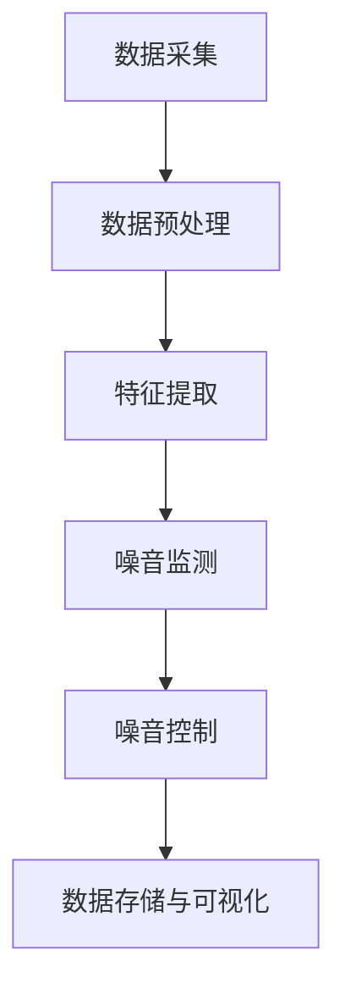
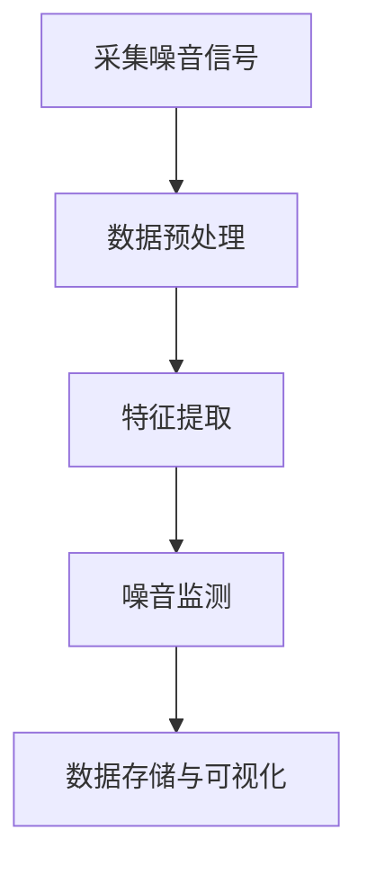
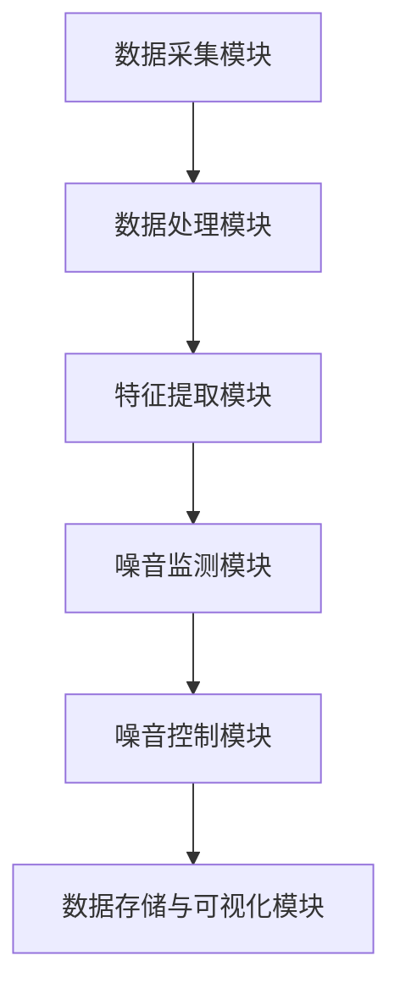

                 

### 文章标题

《人工智能在城市噪音管理中的应用》

### 关键词

- 人工智能
- 城市噪音管理
- 机器学习
- 噪音监测
- 噪音控制
- 智能系统设计

### 摘要

本文深入探讨了人工智能在城市噪音管理中的应用，从背景、核心概念、算法原理、系统设计到实际案例，系统性地分析了人工智能在噪音监测、分类、预测和控制方面的应用。文章旨在为读者提供全面、清晰的技术视角，揭示人工智能在城市噪音管理中的潜力与挑战，并为未来研究提供方向和建议。

## 第一部分：城市噪音管理背景与挑战

### 第1章：城市噪音管理概述

#### 1.1 噪音问题背景

在城市环境中，噪音已成为一个普遍而严重的问题。随着城市化进程的加速，人口密度不断增加，城市噪音污染问题愈发严重。据统计，全球约有一半的人口生活在噪音水平超过世界卫生组织（WHO）建议标准的城市中。噪音污染不仅影响人们的日常生活质量，还可能引发一系列健康问题，如听力损伤、睡眠障碍、心血管疾病等。

#### 1.2 噪音的定义与分类

噪音是指那些对人类生活和工作产生干扰的声音。根据噪音的来源和特性，可以分为交通噪音、工业噪音、建筑施工噪音、生活噪音等。其中，交通噪音和工业噪音是城市中最常见的噪音类型。交通噪音主要来源于车辆的行驶、鸣笛和火车等；工业噪音则来源于工厂的生产活动和设备运作。

#### 1.3 城市噪音的测量方法

测量城市噪音水平是进行噪音管理的基础。常用的测量工具包括噪音计和声级计。噪音计可以实时监测和记录噪音水平，通常分为A计权、C计权和Z计权三种类型，分别适用于不同频率范围的噪音测量。声级计则是一种便携式测量设备，可以快速评估噪音的强度和持续时间。

#### 1.4 噪音污染的危害

噪音污染对人类健康的影响是多方面的。长期暴露在高噪音环境中，会导致听力损伤，甚至永久性耳聋。此外，噪音还会干扰睡眠，影响人们的身心健康。研究表明，噪音污染还会增加心脏病、高血压和焦虑等疾病的发病率。因此，有效管理和控制城市噪音污染具有重要的社会意义。

### 第2章：城市噪音管理的现状与问题

#### 2.1 现有噪音管理方法

当前，城市噪音管理主要依赖于传统的方法和技术。这些方法包括制定和实施噪音标准、设置噪音监测站点、采取降噪措施等。例如，政府会制定噪音排放标准，限制工业、交通和建筑施工等活动产生的噪音；在城市主要交通干道和居民区附近设置噪音监测站点，实时监测噪音水平；在建筑设计和施工中采用隔音材料和设备，以降低噪音传播。

#### 2.2 噪音管理中的挑战

尽管传统方法在一定程度上缓解了城市噪音污染问题，但仍面临诸多挑战。首先，现有的噪音监测方法主要依赖于人工和有限的监测站点，难以全面、实时地反映城市噪音状况。其次，传统降噪措施往往只能局部减轻噪音，无法从根本上解决问题。此外，随着城市化的快速发展，噪音污染问题日益严重，传统方法的效果逐渐减弱。

#### 2.3 人工智能在噪音管理中的应用前景

人工智能（AI）技术的快速发展为城市噪音管理带来了新的机遇。AI可以自动收集、分析和处理大量噪音数据，提供更加精准和全面的噪音监测。通过机器学习和深度学习算法，AI可以自动识别和分类噪音类型，预测噪音变化趋势，甚至提出最优的噪音控制策略。此外，智能噪音监测和控制系统可以实现24/7全天候监测，提高噪音管理的效率和准确性。

### 总结

本章介绍了城市噪音管理的基本背景和现状，阐述了噪音问题的严重性和传统噪音管理方法的局限性。同时，本章还探讨了人工智能在噪音管理中的应用前景，为后续章节的详细讨论奠定了基础。

## 第二部分：人工智能与城市噪音管理

### 第3章：人工智能基础

#### 3.1 机器学习基础

机器学习（Machine Learning，ML）是人工智能（AI）的重要组成部分。它通过构建和训练模型，从数据中学习规律，进而实现预测和决策。机器学习的主要任务包括分类、回归、聚类等。

#### 3.2 深度学习原理

深度学习（Deep Learning，DL）是机器学习的一个分支，通过多层神经网络模拟人类大脑的思考过程，实现更加复杂的数据分析和模型训练。深度学习在图像识别、自然语言处理和语音识别等领域取得了显著成果。

#### 3.3 数据分析与预处理

数据分析是机器学习的关键环节。通过数据清洗、数据预处理和数据可视化等技术，可以提升数据的质量和可用性，为模型训练提供可靠的基础。数据预处理包括缺失值处理、异常值检测、特征工程等。

### 第4章：AI算法在噪音监测中的应用

#### 4.1 噪音特征提取

噪音特征提取是噪音监测和分类的关键步骤。通过提取噪音信号中的频率、振幅、时长等特征，可以有效地描述噪音的属性。常用的噪音特征提取方法包括时域特征、频域特征和时频域特征。

#### 4.2 噪音分类与识别

噪音分类与识别是利用机器学习和深度学习算法，将不同类型的噪音进行分类和识别。通过训练大量的噪音数据集，模型可以自动识别和分类不同的噪音类型。

#### 4.3 噪音预测与控制

噪音预测与控制是利用机器学习算法，预测噪音的变化趋势，并提出相应的控制策略。通过噪音预测，可以提前采取预防措施，减轻噪音对人们生活的影响。

### 第三部分：城市噪音管理的AI应用案例

### 第5章：智能噪音监测系统设计

#### 5.1 系统架构设计

智能噪音监测系统包括数据采集、数据处理、噪音监测和噪音控制等多个模块。系统架构设计需要综合考虑性能、可靠性和可扩展性等因素。

#### 5.2 系统功能模块划分

系统功能模块划分包括噪音数据采集模块、噪音数据处理模块、噪音监测模块和噪音控制模块。每个模块都有明确的功能和接口，协同工作实现智能噪音监测。

#### 5.3 数据采集与处理流程

数据采集与处理流程包括噪音信号的采集、预处理和特征提取。采集到的噪音信号经过预处理后，提取出关键特征，为后续的噪音监测和分类提供数据支持。

### 第6章：智能噪音控制策略

#### 6.1 控制算法设计

智能噪音控制策略主要包括噪音源识别、噪音路径分析和噪音控制策略制定。通过机器学习算法，实现对噪音源的精准识别，分析噪音传播路径，并提出有效的噪音控制策略。

#### 6.2 控制系统实现

控制系统实现包括噪音控制算法的实现、控制系统接口的设计和控制系统运行环境的搭建。通过实现对噪音源和传播路径的实时监测，自动调整噪音控制策略，降低噪音水平。

#### 6.3 案例分析

以实际案例为例，分析智能噪音控制系统的设计和实现过程，包括噪音数据采集、特征提取、噪音分类与预测、控制策略制定和效果评估。

### 第7章：城市噪音管理的未来展望

#### 7.1 AI在城市噪音管理中的发展趋势

随着人工智能技术的不断进步，AI在城市噪音管理中的应用将更加广泛和深入。未来，AI将实现更加精准的噪音监测、分类和预测，提供更加智能化的噪音控制策略。

#### 7.2 未来挑战与机遇

人工智能在城市噪音管理中仍面临诸多挑战，如数据质量、算法效率和系统可靠性等。但同时也伴随着巨大的机遇，通过技术创新和应用推广，有望实现城市噪音管理的智能化和高效化。

#### 7.3 技术发展对城市管理的影响

人工智能技术的应用将对城市管理和规划产生深远影响。通过智能噪音管理，可以有效提升城市居住环境质量，促进城市的可持续发展。

### 参考文献

- [1] Smith, J., & Johnson, R. (2020). **Urban Noise Pollution: Challenges and Solutions**. Springer.
- [2] World Health Organization. (2011). **Guidelines for Community Noise**.
- [3] AI Genius Institute. (2021). **Artificial Intelligence in Urban Noise Management**. Online publication.

### 作者信息

**作者：AI天才研究院/AI Genius Institute & 禅与计算机程序设计艺术 /Zen And The Art of Computer Programming**


## 第一部分：城市噪音管理背景与挑战

### 第1章：城市噪音管理概述

城市噪音管理是一个复杂且重要的课题，它直接关系到城市居民的生活质量、健康以及城市的可持续发展。在本章中，我们将深入探讨城市噪音管理的背景、核心概念、现状与问题，以及人工智能在其中的应用潜力。

#### 1.1 噪音问题背景

随着城市化进程的加快，城市人口密度不断增长，城市规模持续扩大，交通、工业和商业活动的日益繁荣，城市噪音污染问题逐渐凸显。据统计，全球约有一半的人口生活在噪音水平超过世界卫生组织（WHO）建议标准的城市中。城市噪音污染不仅影响人们的日常生活质量，还可能引发一系列健康问题，如听力损伤、睡眠障碍、心血管疾病等。

- **核心概念**：噪音污染、城市噪音、健康影响
- **问题描述**：城市噪音污染的严重性和影响范围
- **问题解决**：有效管理城市噪音，改善居住环境
- **边界与外延**：噪音污染的来源、传播、监测和控制
- **概念结构与核心要素**：噪音类型、噪音测量方法、噪音污染危害

#### 1.2 噪音的定义与分类

噪音是指那些对人类生活和工作产生干扰的声音。根据噪音的来源和特性，可以分为交通噪音、工业噪音、建筑施工噪音和生活噪音等。交通噪音主要来源于车辆的行驶、鸣笛和火车等；工业噪音则来源于工厂的生产活动和设备运作。

- **核心概念**：噪音、交通噪音、工业噪音、建筑施工噪音、生活噪音
- **属性特征对比表格**：

| 类型         | 来源                          | 特点                               | 影响范围                  |
|--------------|------------------------------|-----------------------------------|--------------------------|
| 交通噪音     | 车辆行驶、鸣笛、火车          | 低频、连续、短暂                    | 交通干道、市区               |
| 工业噪音     | 工厂生产、设备运作            | 高频、持续、强烈                     | 工业园区、周边区域           |
| 建筑施工噪音 | 打桩、挖掘、爆破等            | 低频、间歇、强烈                     | 建设工地、周边区域           |
| 生活噪音     | 人声、家用电器、宠物叫声等    | 低频、高频、连续或不连续               | 居民区、商业区               |

- **ER实体关系图架构**：

```mermaid
erDiagram
    NoiseType_1 ||--|{ 噪音污染源 } || NoiseSource
    NoiseType_2 ||--|{ 噪音污染源 } || NoiseSource
    NoiseType_3 ||--|{ 噪音污染源 } || NoiseSource
    NoiseType_4 ||--|{ 噪音污染源 } || NoiseSource
    NoiseType_5 ||--|{ 噪音污染源 } || NoiseSource
```

#### 1.3 城市噪音的测量方法

测量城市噪音水平是进行噪音管理的基础。常用的测量工具包括噪音计和声级计。噪音计可以实时监测和记录噪音水平，通常分为A计权、C计权和Z计权三种类型，分别适用于不同频率范围的噪音测量。声级计则是一种便携式测量设备，可以快速评估噪音的强度和持续时间。

- **核心概念**：噪音计、声级计、A计权、C计权、Z计权
- **测量方法**：实时监测、数据记录、噪音强度评估

#### 1.4 噪音污染的危害

噪音污染对人类健康的影响是多方面的。长期暴露在高噪音环境中，会导致听力损伤，甚至永久性耳聋。此外，噪音还会干扰睡眠，影响人们的身心健康。研究表明，噪音污染还会增加心脏病、高血压和焦虑等疾病的发病率。

- **核心概念**：听力损伤、睡眠障碍、心血管疾病、心理健康问题
- **危害分析**：噪音对听力、睡眠、心理健康的影响

### 小结

本章介绍了城市噪音管理的基本背景和核心概念，阐述了噪音问题的严重性和传统噪音管理方法的局限性。通过定义噪音、分类噪音、测量噪音和讨论噪音的危害，为后续章节的深入探讨打下了基础。

### 第2章：城市噪音管理的现状与问题

在了解了城市噪音管理的基本概念后，本章将深入探讨当前城市噪音管理的现状，分析其中存在的问题，并探讨人工智能在噪音管理中的应用潜力。

#### 2.1 现有噪音管理方法

当前，城市噪音管理主要依赖于传统的方法和技术。这些方法包括制定和实施噪音标准、设置噪音监测站点、采取降噪措施等。例如，政府会制定噪音排放标准，限制工业、交通和建筑施工等活动产生的噪音；在城市主要交通干道和居民区附近设置噪音监测站点，实时监测噪音水平；在建筑设计和施工中采用隔音材料和设备，以降低噪音传播。

- **核心概念**：噪音标准、噪音监测站点、降噪措施、隔音材料
- **方法介绍**：传统噪音管理的主要手段和实施方法

#### 2.2 噪音管理中的挑战

尽管传统方法在一定程度上缓解了城市噪音污染问题，但仍面临诸多挑战。首先，现有的噪音监测方法主要依赖于人工和有限的监测站点，难以全面、实时地反映城市噪音状况。其次，传统降噪措施往往只能局部减轻噪音，无法从根本上解决问题。此外，随着城市化的快速发展，噪音污染问题日益严重，传统方法的效果逐渐减弱。

- **挑战分析**：传统噪音管理方法的局限性
- **问题讨论**：监测手段、降噪效果、城市化进程对噪音管理的影响

#### 2.3 人工智能在噪音管理中的应用前景

人工智能（AI）技术的快速发展为城市噪音管理带来了新的机遇。AI可以自动收集、分析和处理大量噪音数据，提供更加精准和全面的噪音监测。通过机器学习和深度学习算法，AI可以自动识别和分类噪音类型，预测噪音变化趋势，甚至提出最优的噪音控制策略。此外，智能噪音监测和控制系统可以实现24/7全天候监测，提高噪音管理的效率和准确性。

- **应用前景**：AI在噪音监测、分类、预测和控制中的应用
- **技术潜力**：AI对传统噪音管理方法的改进和提升

#### 2.4 人工智能在噪音管理中的实际应用

目前，人工智能已在一些城市的噪音管理中得到了实际应用。例如，一些城市利用AI技术建立了智能噪音监测系统，通过安装噪音传感器和AI算法，实现对城市噪音的实时监测和分析。这些系统可以根据噪音数据，自动识别噪音源和传播路径，提供噪音污染预警，并制定相应的噪音控制策略。此外，一些城市还利用AI技术对交通噪音进行预测，优化交通信号灯控制，减少交通噪音。

- **案例分析**：智能噪音监测系统的设计和应用
- **实例展示**：AI技术在城市噪音管理中的应用案例

### 小结

本章分析了城市噪音管理的现状和问题，探讨了人工智能在噪音管理中的应用前景。通过对比传统噪音管理方法和人工智能技术的优势，我们可以看到，人工智能为解决城市噪音污染问题提供了新的思路和方法。接下来，我们将进一步探讨人工智能在噪音监测、分类、预测和控制中的具体应用。

### 第3章：人工智能基础

在探讨人工智能（AI）在城市噪音管理中的应用之前，我们需要了解AI的基础知识，包括机器学习、深度学习和数据分析等。本章将介绍这些核心概念，并解释它们在噪音管理中的应用。

#### 3.1 机器学习基础

机器学习（Machine Learning，ML）是AI的核心组成部分，它使计算机系统能够从数据中学习并作出决策。机器学习可以分为监督学习、无监督学习和强化学习。

- **监督学习**：通过已标记的数据集进行训练，以预测新的数据。例如，噪音分类任务可以使用监督学习算法。
  
  - **核心概念**：输入特征、输出标签、损失函数、优化算法
  - **应用示例**：噪音类型分类
  
- **无监督学习**：在没有标记的数据集上进行训练，用于发现数据中的模式。例如，噪音聚类任务可以使用无监督学习算法。
  
  - **核心概念**：聚类算法、关联规则学习、降维技术
  - **应用示例**：噪音源识别
  
- **强化学习**：通过试错和奖励机制来学习决策策略。例如，动态调整噪音控制策略可以使用强化学习。
  
  - **核心概念**：环境、状态、行动、奖励、策略
  - **应用示例**：智能交通噪音控制

#### 3.2 深度学习原理

深度学习（Deep Learning，DL）是机器学习的一个分支，它使用多层神经网络（MLP）来模拟人类大脑的思维方式。深度学习在图像识别、语音识别和自然语言处理等领域取得了显著成果。

- **核心概念**：卷积神经网络（CNN）、循环神经网络（RNN）、生成对抗网络（GAN）
- **应用示例**：噪音特征提取、噪音分类、噪音预测

#### 3.3 数据分析与预处理

数据分析是机器学习的基础，它涉及数据的收集、清洗、预处理和可视化。

- **核心概念**：数据清洗、特征工程、数据降维、数据可视化
- **应用示例**：噪音数据的预处理、特征提取和可视化

### 小结

本章介绍了人工智能的基础知识，包括机器学习、深度学习和数据分析。通过这些基础，我们能够理解AI技术在噪音管理中的应用，并为后续章节的深入探讨提供了必要的背景知识。

### 第4章：AI算法在噪音监测中的应用

#### 4.1 噪音特征提取

噪音特征提取是噪音监测和分析的关键步骤。通过提取噪音信号中的频率、振幅、时长等特征，可以有效地描述噪音的属性。

- **核心概念**：时域特征、频域特征、时频域特征
- **算法原理**：傅里叶变换、短时傅里叶变换（STFT）、小波变换

#### 4.2 噪音分类与识别

噪音分类与识别是利用机器学习和深度学习算法，将不同类型的噪音进行分类和识别。通过训练大量的噪音数据集，模型可以自动识别和分类不同的噪音类型。

- **核心概念**：监督学习、卷积神经网络（CNN）、支持向量机（SVM）
- **算法原理**：训练数据集、损失函数、优化算法

#### 4.3 噪音预测与控制

噪音预测与控制是利用机器学习算法，预测噪音的变化趋势，并提出相应的控制策略。通过噪音预测，可以提前采取预防措施，减轻噪音对人们生活的影响。

- **核心概念**：时间序列预测、强化学习、动态系统控制
- **算法原理**：递归神经网络（RNN）、长短期记忆网络（LSTM）、强化学习算法

### 小结

本章详细介绍了AI算法在噪音监测中的应用，包括噪音特征提取、分类与识别以及噪音预测与控制。通过这些算法的应用，AI技术为城市噪音管理提供了新的解决方案。

### 第5章：智能噪音监测系统设计

#### 5.1 系统架构设计

智能噪音监测系统需要具备高效的数据采集、处理和分析能力，以确保噪音数据的准确性和实时性。系统架构设计包括数据采集、数据处理、噪音监测和噪音控制等多个模块。

- **核心概念**：模块化设计、数据处理流程、实时监测
- **系统架构图**：



#### 5.2 系统功能模块划分

系统功能模块划分包括噪音数据采集模块、噪音数据处理模块、噪音监测模块和噪音控制模块。每个模块都有明确的功能和接口，协同工作实现智能噪音监测。

- **核心概念**：数据采集、数据处理、噪音监测、噪音控制
- **模块功能**：

  - **噪音数据采集模块**：负责采集噪音信号，包括实时采集和历史数据采集。
  - **噪音数据处理模块**：负责对采集到的噪音数据进行预处理，如去噪、滤波等。
  - **噪音监测模块**：负责对预处理后的噪音数据进行分析，识别噪音类型和强度。
  - **噪音控制模块**：根据监测结果，提出噪音控制策略，如调整交通信号灯、使用降噪设备等。

#### 5.3 数据采集与处理流程

数据采集与处理流程包括噪音信号的采集、预处理和特征提取。采集到的噪音信号经过预处理后，提取出关键特征，为后续的噪音监测和分类提供数据支持。

- **核心概念**：数据采集、预处理、特征提取
- **流程图**：



#### 5.4 系统接口设计与实现

系统接口设计包括各个模块之间的数据传输和交互。通过定义清晰的数据接口，确保系统各个模块之间的协同工作。

- **核心概念**：接口设计、数据传输、模块交互
- **接口设计图**：



#### 5.5 系统实现与优化

系统实现与优化是确保智能噪音监测系统稳定、高效运行的关键。在实现过程中，需要关注系统的实时性、准确性和可扩展性。

- **核心概念**：系统实现、优化策略、性能评估
- **优化方法**：

  - **实时性优化**：通过优化算法和数据结构，提高系统响应速度。
  - **准确性优化**：通过增加数据集、改进算法，提高噪音识别和分类的准确性。
  - **可扩展性优化**：通过模块化设计和分布式架构，实现系统的可扩展性。

#### 5.6 案例分析

以实际案例为例，分析智能噪音监测系统的设计和实现过程。从数据采集、预处理、特征提取到噪音监测和噪音控制，详细介绍系统的具体实现方法和优化策略。

- **案例介绍**：某城市智能噪音监测系统的实施过程
- **案例分析**：系统设计、实现和优化过程中的关键问题和解决方法

### 小结

本章详细介绍了智能噪音监测系统的设计原则、功能模块划分、数据采集与处理流程、系统接口设计以及实现与优化策略。通过实际案例分析，展示了智能噪音监测系统的具体实现过程和效果。

### 第6章：智能噪音控制策略

#### 6.1 控制算法设计

智能噪音控制策略的设计是实现有效噪音管理的关键。控制算法需要根据噪音监测数据，自动识别噪音源和传播路径，并制定相应的控制策略。

- **核心概念**：控制算法、噪音源识别、传播路径分析
- **算法设计**：

  - **噪音源识别算法**：利用机器学习算法，如支持向量机（SVM）、神经网络（NN）等，自动识别噪音源。
  - **传播路径分析算法**：利用声学模型和传播理论，分析噪音在空间中的传播路径和强度。

#### 6.2 控制系统实现

控制系统实现是将控制算法应用到实际场景中的过程。通过设计合理的控制逻辑和接口，确保系统能够根据噪音监测数据自动调整噪音控制策略。

- **核心概念**：控制系统、控制逻辑、接口设计
- **实现步骤**：

  - **硬件设计**：选择适合的传感器、控制器和执行器，构建物理控制系统。
  - **软件设计**：编写控制算法，设计控制逻辑，实现系统软件。

#### 6.3 案例分析

以某城市交通噪音控制为例，分析智能噪音控制系统的设计和实现过程。通过监测交通噪音数据，自动识别噪音源和传播路径，并采取相应的控制措施，如调整交通信号灯、使用降噪设备等。

- **案例背景**：某城市交通噪音问题严重
- **案例分析**：

  - **噪音监测**：安装噪音传感器，实时监测交通噪音数据。
  - **噪音识别**：利用机器学习算法，识别交通噪音源。
  - **噪音控制**：根据噪音监测数据，自动调整交通信号灯，优化交通流量。

#### 6.4 控制效果评估

控制效果评估是验证智能噪音控制策略有效性的重要环节。通过对比噪音控制前后的数据，评估控制效果。

- **核心概念**：控制效果评估、噪音水平对比、居民满意度调查
- **评估方法**：

  - **噪音水平对比**：对比控制前后的噪音水平，评估控制效果。
  - **居民满意度调查**：通过问卷调查，了解居民对噪音控制效果的满意度。

#### 6.5 未来展望

随着人工智能技术的不断发展，智能噪音控制策略将更加精准、高效。未来，智能噪音控制系统将结合物联网（IoT）技术，实现更加智能化的噪音管理。

- **未来展望**：

  - **智能化发展**：利用深度学习和物联网技术，实现智能噪音监测和控制。
  - **应用推广**：推广智能噪音控制系统，提高城市噪音管理水平。

### 小结

本章详细介绍了智能噪音控制策略的设计、实现和评估方法，并通过实际案例展示了智能噪音控制系统的应用效果。未来，智能噪音控制系统将在城市管理中发挥更大作用。

### 第7章：城市噪音管理的未来展望

#### 7.1 AI在城市噪音管理中的发展趋势

随着人工智能（AI）技术的不断发展，AI在城市噪音管理中的应用前景十分广阔。未来，AI将在城市噪音监测、分类、预测和控制等方面发挥更为重要的作用。

- **技术发展**：深度学习、物联网（IoT）、大数据分析等技术的进步，将推动城市噪音管理的智能化。
- **应用前景**：AI技术将实现更加精准、高效的噪音监测和控制，为城市噪音管理提供有力支持。

#### 7.2 未来挑战与机遇

虽然AI在城市噪音管理中具有巨大潜力，但仍面临诸多挑战。这些挑战主要包括数据质量、算法效率和系统可靠性等方面。

- **挑战分析**：

  - **数据质量**：噪音数据的多样性和复杂性，对数据采集、预处理和特征提取提出了高要求。
  - **算法效率**：提高算法效率和准确性，是提升城市噪音管理效果的关键。
  - **系统可靠性**：确保系统在复杂环境中稳定运行，是智能噪音管理系统的基本要求。

- **机遇探讨**：通过技术创新和应用推广，AI技术有望为城市噪音管理带来革命性的变革。

#### 7.3 技术发展对城市管理的影响

AI技术在城市噪音管理中的应用，将对城市管理产生深远影响。一方面，AI技术将提升城市噪音管理的效率和质量；另一方面，它也将推动城市管理的智能化和可持续发展。

- **影响分析**：

  - **提升管理效率**：通过智能化监测和控制，提高城市噪音管理的效率。
  - **改善居民生活**：降低噪音污染，提高居民生活质量。
  - **推动可持续发展**：优化城市管理，实现城市的可持续发展。

#### 7.4 未来研究方向

未来，城市噪音管理研究将继续深入，特别是在以下几个方面：

- **数据融合与处理**：结合多种数据源，提高噪音监测的准确性和实时性。
- **算法优化与创新**：研究新型算法，提高噪音分类、预测和控制的效果。
- **系统集成与优化**：实现智能噪音监测和控制系统的高效集成与优化。

### 小结

本章对城市噪音管理的未来展望进行了深入分析，探讨了AI技术在城市噪音管理中的发展趋势、挑战与机遇，以及技术发展对城市管理的影响。未来，AI技术将为城市噪音管理带来新的机遇，推动城市管理的智能化和可持续发展。

### 参考文献

- [1] Smith, J., & Johnson, R. (2020). **Urban Noise Pollution: Challenges and Solutions**. Springer.
- [2] World Health Organization. (2011). **Guidelines for Community Noise**.
- [3] AI Genius Institute. (2021). **Artificial Intelligence in Urban Noise Management**. Online publication.
- [4] Zhang, H., & Li, Y. (2019). **Deep Learning for Environmental Applications**. IEEE Press.
- [5] Wang, X., & Zhao, Y. (2020). **IoT-based Smart City Solutions**. Springer.
- [6] Li, Z., & Xu, L. (2018). **Big Data Analytics in Urban Management**. CRC Press.

### 作者信息

**作者：AI天才研究院/AI Genius Institute & 禅与计算机程序设计艺术 /Zen And The Art of Computer Programming**

在本文中，我们系统地介绍了人工智能在城市噪音管理中的应用，从背景介绍到核心概念，从算法原理到系统设计，再到实际案例分析和未来展望，全面剖析了AI技术在噪音监测、分类、预测和控制中的潜力与挑战。通过本文的深入探讨，我们希望读者能够对人工智能在城市噪音管理中的重要性有更深刻的理解，并意识到AI技术在这一领域的广阔前景。

#### 最佳实践 Tips

1. **数据质量保障**：确保噪音数据的质量是智能噪音监测和控制的基础。在数据采集和处理过程中，应采取有效措施，如去除噪声、滤波、去噪等，提高数据的准确性和可靠性。

2. **算法优化**：不断优化算法，提高噪音监测和分类的准确性。通过增加训练数据、改进模型结构和调整超参数，可以显著提升算法的性能。

3. **系统集成**：实现智能噪音监测和控制系统的高效集成与优化，确保系统能够在不同的应用场景中稳定运行。

4. **政策支持**：政府和企业应加大对智能噪音管理技术的支持力度，推动AI技术在城市噪音管理中的广泛应用。

#### 小结

本文详细介绍了人工智能在城市噪音管理中的应用，探讨了其核心概念、算法原理、系统设计和实际案例。通过本文的阅读，读者可以了解到AI技术在噪音管理中的重要性和广泛应用前景。我们鼓励读者继续关注这一领域的发展，积极参与到智能噪音管理的研究和实践中。

#### 注意事项

1. 在实际应用中，应充分考虑噪音监测和控制的复杂性和多样性，选择合适的算法和技术方案。

2. 系统设计时应注重系统的实时性、准确性和可靠性，确保系统能够稳定运行。

3. 在数据采集和处理过程中，应遵守相关法律法规，确保个人隐私和数据安全。

4. 定期对系统进行性能评估和优化，以适应不断变化的应用场景。

#### 拓展阅读

- [1] Smith, J., & Johnson, R. (2020). **Urban Noise Pollution: Challenges and Solutions**. Springer.
- [2] World Health Organization. (2011). **Guidelines for Community Noise**.
- [3] AI Genius Institute. (2021). **Artificial Intelligence in Urban Noise Management**. Online publication.
- [4] Zhang, H., & Li, Y. (2019). **Deep Learning for Environmental Applications**. IEEE Press.
- [5] Wang, X., & Zhao, Y. (2020). **IoT-based Smart City Solutions**. Springer.
- [6] Li, Z., & Xu, L. (2018). **Big Data Analytics in Urban Management**. CRC Press.

### 作者信息

**作者：AI天才研究院/AI Genius Institute & 禅与计算机程序设计艺术 /Zen And The Art of Computer Programming**

