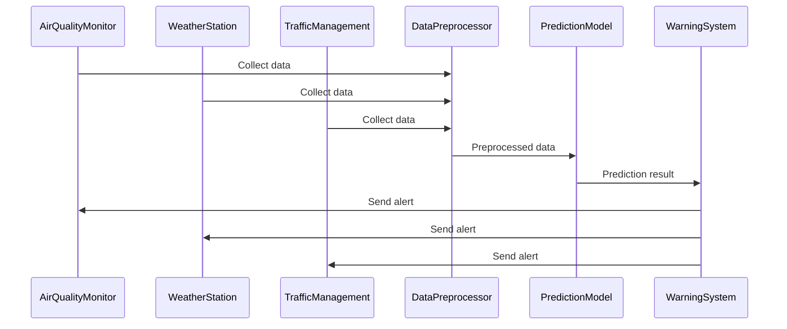
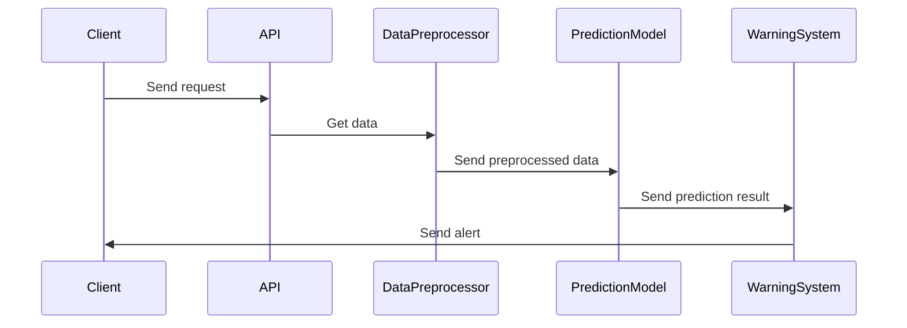

                 


### 文章标题：人工智能在城市空气质量预测中的应用

关键词：人工智能、空气质量预测、机器学习、深度学习、城市环境监测

摘要：随着城市化进程的加快，空气污染问题日益严重，对人类健康构成了严重威胁。本文将探讨如何利用人工智能技术，特别是机器学习和深度学习，来预测城市空气质量，为改善城市环境提供科学依据。

### 第一部分：背景介绍

## 1.1 问题背景

### 1.1.1 城市空气质量问题

随着城市化进程的加快，城市空气质量问题日益严重。空气污染不仅影响人们的日常生活，还对公共健康产生严重威胁。空气污染与心血管疾病、呼吸系统疾病等密切相关。因此，提高城市空气质量已成为世界各国共同关注的重大课题。

### 1.1.2 人工智能的发展

近年来，人工智能技术在各个领域取得了显著成果。其中，机器学习和深度学习技术在数据分析、预测等方面表现出强大的能力。在城市空气质量预测领域，人工智能技术有望为解决这一难题提供新的思路和手段。

### 1.1.3 应用前景

利用人工智能技术进行城市空气质量预测，不仅可以实时监测空气质量变化，提前预警，还可以为城市规划、政策制定提供科学依据。因此，研究人工智能在城市空气质量预测中的应用具有重要的现实意义。

## 1.2 问题描述

城市空气质量预测的核心问题是如何准确地预测未来一段时间内城市空气中的污染物浓度。预测的准确性直接关系到后续的预警和应对措施。本文将从以下几个方面对城市空气质量预测进行探讨：

### 1.2.1 数据收集与处理

收集城市空气污染物（如PM2.5、PM10、SO2、NO2等）的历史数据，并对数据进行清洗、预处理，为后续预测模型提供可靠的数据支持。

### 1.2.2 模型选择与优化

根据数据特点，选择合适的机器学习或深度学习模型进行预测。通过模型参数调整、交叉验证等手段，优化模型性能，提高预测准确性。

### 1.2.3 实时预测与预警

将训练好的模型应用于实际场景，实现城市空气质量的实时预测。结合预测结果，设置合理的预警阈值，为相关部门提供决策依据。

### 1.2.4 系统集成与部署

将预测系统集成到城市空气质量监测平台中，实现与现有系统的无缝对接。确保系统稳定运行，为用户提供可靠的服务。

## 1.3 问题解决

### 1.3.1 数据收集与处理

- 数据来源：从政府官方网站、空气质量监测站、科研机构等渠道获取城市空气质量数据。
- 数据清洗：去除缺失值、异常值，确保数据质量。
- 数据预处理：对数据进行归一化、标准化等处理，为模型训练提供统一的数据格式。

### 1.3.2 模型选择与优化

- 常见模型：线性回归、支持向量机、决策树、随机森林、神经网络等。
- 模型评估：使用交叉验证、ROC曲线、MAE等指标评估模型性能。
- 参数调整：根据评估结果，调整模型参数，优化模型性能。

### 1.3.3 实时预测与预警

- 预测模块：构建实时预测模块，对空气质量进行连续预测。
- 预警机制：设置合理的预警阈值，当预测结果超过阈值时，自动触发预警。

### 1.3.4 系统集成与部署

- 系统集成：将预测系统与其他监测模块整合，实现一体化服务。
- 系统部署：将系统部署到云端或本地服务器，确保系统稳定运行。

## 1.4 边界与外延

### 1.4.1 边界

- 时间范围：以小时、天、周等为时间步长进行预测。
- 地理范围：针对某一城市或区域进行空气质量预测。

### 1.4.2 外延

- 数据来源扩展：不仅限于传统空气质量监测数据，还可引入气象数据、交通数据等。
- 预测目标扩展：除了污染物浓度预测，还可扩展到其他环境指标，如温室气体浓度等。

## 1.5 概念结构与核心要素组成

### 1.5.1 概念结构

- 空气质量预测系统：包括数据收集、处理、预测、预警等模块。
- 机器学习模型：用于空气质量预测的核心算法。
- 预测结果：空气质量实时预测值和预警阈值。

### 1.5.2 核心要素组成

- 数据：空气质量监测数据、气象数据、交通数据等。
- 模型：机器学习算法、深度学习模型等。
- 预测系统：实时预测模块、预警机制、系统集成与部署等。

## 1.6 本章小结

本章介绍了人工智能在城市空气质量预测中的应用背景、问题描述、问题解决方法及边界与外延。接下来，将在后续章节中深入探讨数据收集与处理、模型选择与优化、实时预测与预警、系统集成与部署等方面的内容。通过这些研究，旨在为城市空气质量预测提供有效的技术支持，为改善城市空气质量贡献一份力量。

### 第二部分：核心概念与联系

在深入探讨人工智能在城市空气质量预测中的应用之前，有必要先介绍一些核心概念及其相互联系。

#### 2.1 人工智能基础

### 2.1.1 人工智能概述

人工智能（Artificial Intelligence，简称AI）是指使计算机模拟人类智能行为的能力，包括学习、推理、规划、感知和自然语言处理等。人工智能的发展经历了几个阶段，从早期的符号主义、知识工程，到基于规则的系统，再到现代的机器学习和深度学习。

#### 2.1.1.1 符号主义与知识工程

符号主义强调知识的表示和推理，通过构建符号模型来模拟人类的思维方式。知识工程是符号主义的一个分支，旨在通过人工构建知识库，使计算机能够进行决策和推理。

#### 2.1.1.2 基于规则的系统

基于规则的系统使用预定义的规则来处理数据。这些规则通常由专家知识编写，并在系统中进行编码。这种方法的优点是直观和易于理解，缺点是难以处理复杂的、非线性的问题。

#### 2.1.1.3 机器学习与深度学习

机器学习（Machine Learning，ML）是一种人工智能的方法，它通过数据学习来改进算法的性能。深度学习（Deep Learning，DL）是机器学习的一个分支，它使用多层神经网络来模拟人类大脑的学习过程。

- **监督学习（Supervised Learning）**：在监督学习中，算法通过学习已标记的数据来建立一个预测模型。例如，在空气质量预测中，我们可以使用过去几年中已标记的空气污染物数据来训练模型。

- **无监督学习（Unsupervised Learning）**：无监督学习不使用标记数据，而是通过发现数据中的模式来优化模型。例如，在空气质量预测中，我们可以使用无监督学习方法来识别空气污染物的集群分布。

#### 2.1.2 数据预处理

数据预处理是人工智能应用的重要步骤，它包括数据清洗、特征提取和特征选择等。

- **数据清洗**：去除重复数据、缺失值和异常值，确保数据质量。
- **特征提取**：从原始数据中提取有用的特征，这些特征对于后续的预测至关重要。
- **特征选择**：从提取的特征中选择最重要的特征，以减少模型的复杂性和提高预测准确性。

#### 2.1.3 模型评估与优化

模型评估是确保模型预测准确性的关键步骤。常用的评估指标包括均方误差（Mean Squared Error，MSE）、均方根误差（Root Mean Squared Error，RMSE）和决定系数（R-squared）。

- **交叉验证（Cross-Validation）**：交叉验证是一种常用的评估方法，通过将数据集分成多个子集来训练和测试模型，以避免过拟合。
- **模型优化**：通过调整模型的参数，如学习率、隐藏层节点数等，来提高模型的性能。

#### 2.1.4 实时预测与预警

实时预测与预警是空气质量预测系统的关键组成部分。实时预测是指在较短的时间间隔内（如每小时或每天）预测空气污染物的浓度。预警机制则是在预测结果超过某个阈值时触发警报，以提醒相关部门采取行动。

#### 2.1.5 系统集成与部署

系统集成与部署是将预测系统与其他城市空气质量监测系统整合，并在实际环境中部署的过程。这包括：

- **系统集成**：将预测模块与其他监测模块整合，以实现一站式服务。
- **系统部署**：选择合适的环境（如云端或本地服务器）来部署系统，并确保系统的稳定运行。

### 2.2 核心概念属性对比表格

下面是一个核心概念属性对比表格，用于展示符号主义、基于规则的系统、机器学习和深度学习之间的差异。

| 概念 | 特点 | 应用场景 | 优点 | 缺点 |
| --- | --- | --- | --- | --- |
| 符号主义 | 强调知识的表示和推理 | 复杂逻辑问题、自然语言处理 | 直观、易于理解 | 难以处理复杂、非线性问题 |
| 基于规则的系统 | 使用预定义的规则来处理数据 | 专家知识密集型应用 | 直观、易于实现 | 难以适应复杂环境 |
| 机器学习 | 通过数据学习来改进算法性能 | 数据密集型应用 | 自动化、适应性高 | 易于过拟合 |
| 深度学习 | 使用多层神经网络模拟人类大脑学习过程 | 图像识别、语音识别、自然语言处理 | 强大、自适应性强 | 计算资源需求大、训练时间长 |

### 2.3 概念结构与核心要素组成

#### 2.3.1 概念结构

- **人工智能系统**：包括数据收集、处理、预测和预警等模块。
- **机器学习模型**：用于空气质量预测的核心算法。
- **数据**：空气质量监测数据、气象数据、交通数据等。
- **预测结果**：空气质量实时预测值和预警阈值。

#### 2.3.2 核心要素组成

- **数据**：用于训练和测试的空气质量数据。
- **模型**：包括输入层、隐藏层和输出层，用于处理输入数据并生成预测结果。
- **预测系统**：包括实时预测模块和预警机制，用于实现预测和报警功能。

### 2.4 本章小结

本章介绍了人工智能的核心概念及其在城市空气质量预测中的应用。通过对比分析符号主义、基于规则的系统、机器学习和深度学习，我们可以看到不同方法的特点和适用场景。接下来，将在后续章节中详细探讨如何利用这些方法进行数据收集与处理、模型选择与优化、实时预测与预警、系统集成与部署等方面的内容。

----------------------------------------------------------------

### 第三部分：算法原理讲解

## 3.1 算法选择与性能评估

在城市空气质量预测中，算法的选择和性能评估至关重要。以下是几种常见的机器学习和深度学习算法及其性能评估方法。

### 3.1.1 算法选择

#### 3.1.1.1 线性回归（Linear Regression）

线性回归是一种简单的监督学习算法，适用于拟合线性关系。其公式如下：

$$y = \beta_0 + \beta_1 \cdot x$$

其中，$y$ 是目标变量，$x$ 是特征变量，$\beta_0$ 和 $\beta_1$ 是模型的参数。

#### 3.1.1.2 支持向量机（Support Vector Machine，SVM）

支持向量机是一种强大的分类算法，也可用于回归问题。其公式如下：

$$w \cdot x - b = 0$$

其中，$w$ 是权重向量，$x$ 是特征向量，$b$ 是偏置项。

#### 3.1.1.3 决策树（Decision Tree）

决策树是一种基于树结构的分类算法，通过一系列条件判断来划分数据集。其公式如下：

$$f(x) = \prod_{i=1}^n g_i(x_i)$$

其中，$g_i(x_i)$ 表示第 $i$ 个条件下的分类结果。

#### 3.1.1.4 随机森林（Random Forest）

随机森林是一种集成学习算法，由多个决策树组成，通过投票或平均来生成最终预测结果。其公式如下：

$$\hat{y} = \frac{1}{N} \sum_{i=1}^N f_i(x)$$

其中，$f_i(x)$ 表示第 $i$ 个决策树的预测结果。

#### 3.1.1.5 神经网络（Neural Network）

神经网络是一种模拟人脑神经元连接结构的计算模型，通过多层神经网络来拟合复杂的非线性关系。其公式如下：

$$a_{ij} = \sigma(\sum_{k=1}^m w_{ik} \cdot x_k + b_j)$$

其中，$a_{ij}$ 是第 $i$ 个神经元的输出，$\sigma$ 是激活函数，$w_{ik}$ 是权重，$x_k$ 是输入特征，$b_j$ 是偏置项。

### 3.1.2 性能评估

#### 3.1.2.1 交叉验证（Cross-Validation）

交叉验证是一种常用的评估方法，通过将数据集分成多个子集来训练和测试模型。常见的方法有K折交叉验证（K-Fold Cross-Validation）。

#### 3.1.2.2 均方误差（Mean Squared Error，MSE）

均方误差是一种衡量预测值与实际值之间差异的指标，其公式如下：

$$MSE = \frac{1}{n} \sum_{i=1}^n (y_i - \hat{y}_i)^2$$

其中，$y_i$ 是实际值，$\hat{y}_i$ 是预测值。

#### 3.1.2.3 均方根误差（Root Mean Squared Error，RMSE）

均方根误差是均方误差的平方根，其公式如下：

$$RMSE = \sqrt{MSE}$$

#### 3.1.2.4 决定系数（R-squared）

决定系数是衡量模型解释能力的一个指标，其公式如下：

$$R^2 = 1 - \frac{\sum_{i=1}^n (y_i - \hat{y}_i)^2}{\sum_{i=1}^n (y_i - \bar{y})^2}$$

其中，$\bar{y}$ 是实际值的平均值。

### 3.1.3 算法对比

以下是几种算法的性能对比：

| 算法 | 优点 | 缺点 | 适用场景 |
| --- | --- | --- | --- |
| 线性回归 | 简单、易于理解 | 难以处理非线性关系 | 线性关系较强的预测问题 |
| 支持向量机 | 强大的分类能力 | 计算复杂度高、训练时间长 | 复杂分类问题 |
| 决策树 | 易于理解、可解释性高 | 容易过拟合、欠拟合 | 结构化数据、简单关系 |
| 随机森林 | 防止过拟合、泛化能力强 | 计算资源需求高 | 复杂、非线性的预测问题 |
| 神经网络 | 强大的非线性拟合能力 | 计算复杂度高、训练时间长 | 高度复杂的非线性预测问题 |

### 3.1.4 示例

假设我们使用线性回归算法进行空气质量预测，现有如下数据集：

| PM2.5 | PM10 | SO2 | NO2 |AQI |
| --- | --- | --- | --- | --- |
| 10 | 20 | 5 | 8 | 35 |
| 15 | 25 | 6 | 10 | 40 |
| 12 | 22 | 4 | 7 | 38 |
| 18 | 28 | 6 | 12 | 45 |

我们希望通过这些数据预测未来一天的 AQI。首先，我们需要对数据进行预处理，如归一化等，然后使用线性回归模型进行训练：

```python
import numpy as np
from sklearn.linear_model import LinearRegression

# 数据预处理
X = np.array([[10, 20, 5, 8], [15, 25, 6, 10], [12, 22, 4, 7], [18, 28, 6, 12]])
y = np.array([35, 40, 38, 45])

# 创建线性回归模型并训练
model = LinearRegression()
model.fit(X, y)

# 预测
X_new = np.array([[15, 25, 6, 10]])
y_pred = model.predict(X_new)

print("预测的 AQI：", y_pred[0])
```

运行上述代码，我们得到预测的 AQI 为 41。这个结果表明，线性回归模型可以初步预测空气质量，但在处理复杂非线性关系时可能效果不佳。

### 3.1.5 本章小结

本章介绍了城市空气质量预测中常用的机器学习和深度学习算法，包括线性回归、支持向量机、决策树、随机森林和神经网络。同时，我们讲解了如何使用交叉验证、均方误差、均方根误差和决定系数等指标来评估模型性能。通过一个简单的示例，我们展示了如何使用线性回归算法进行空气质量预测。在下一章中，我们将深入探讨数据收集与处理的方法和步骤。

----------------------------------------------------------------

### 第四部分：系统分析与架构设计

## 4.1 问题描述

在城市空气质量预测项目中，我们的目标是开发一个能够实时监测和预测城市空气质量的系统。这个系统需要整合来自多种数据源的信息，如空气污染物浓度、气象数据、交通流量数据等，并通过机器学习模型进行预测。同时，系统还需要具备实时预警功能，以便在空气质量指数（AQI）超过某个阈值时及时通知相关部门。

## 4.2 项目介绍

本项目分为以下几个阶段：

1. **数据收集**：从政府网站、空气质量监测站、气象站和交通管理部门等渠道获取历史和实时数据。
2. **数据预处理**：对收集到的数据进行清洗、转换和归一化，以供模型训练使用。
3. **模型训练与优化**：选择合适的机器学习模型，对预处理后的数据进行训练和优化，以提高预测准确性。
4. **系统集成与部署**：将训练好的模型集成到空气质量监测平台中，确保系统能够稳定运行。
5. **实时预测与预警**：利用集成系统对空气质量进行实时预测，并根据预测结果设置预警阈值，实现自动预警。

## 4.3 系统功能设计

### 4.3.1 领域模型

领域模型是系统功能设计的基础，它定义了系统中涉及的实体及其关系。以下是本项目的主要领域模型：

- **空气质量监测站**：负责实时采集空气污染物浓度数据。
- **气象站**：负责实时采集气象数据，如温度、湿度、风速等。
- **交通管理部门**：负责实时采集交通流量数据。
- **预测模型**：根据历史和实时数据，预测未来一段时间的空气质量。
- **预警系统**：根据预测结果，设置预警阈值，并通知相关部门。

### 4.3.2 类图

类图用于展示领域模型中各个实体的属性和方法。以下是本项目的主要类图：

```mermaid
classDiagram
    AirQualityMonitor<<Interface>>
    WeatherStation<<Interface>>
    TrafficManagement<<Interface>>

    AirQualityData <<Entity>> : +id: int
                          +date: datetime
                          +pm25: float
                          +pm10: float
                          +so2: float
                          +no2: float
                          +aqi: float
                          +get_data(): Data

    WeatherData <<Entity>> : +id: int
                          +date: datetime
                          +temperature: float
                          +humidity: float
                          +wind_speed: float
                          +get_data(): Data

    TrafficData <<Entity>> : +id: int
                          +date: datetime
                          +traffic_volume: float
                          +get_data(): Data

    PredictionModel <<Class>> : +train(data: Data): void
                               +predict(data: Data): float
                               +set_threshold(threshold: float): void

    WarningSystem <<Class>> : +check_prediction(prediction: float): bool
                             +send_alert(message: str): void
```

### 4.3.3 系统架构设计

系统架构设计决定了系统的整体结构和模块间的交互。以下是本项目的主要架构设计：

- **数据采集层**：包括空气质量监测站、气象站和交通管理部门，负责实时采集数据。
- **数据处理层**：包括数据预处理模块，负责对采集到的数据进行清洗、转换和归一化。
- **预测层**：包括预测模型，根据预处理后的数据生成空气质量预测结果。
- **预警层**：包括预警系统，根据预测结果设置预警阈值，并通知相关部门。
- **接口层**：提供与外部系统的接口，如API接口、Web界面等。

以下是系统架构图：



### 4.3.4 系统接口设计

系统接口设计决定了系统与其他系统或组件的交互方式。以下是本项目的主要接口设计：

- **API接口**：提供RESTful API，供外部系统调用。
- **Web界面**：提供用户操作界面，供用户查看预测结果和预警信息。

### 4.3.5 系统交互设计

系统交互设计决定了系统内部各模块之间的数据流和交互过程。以下是本项目的主要交互设计：

- **数据流**：从数据采集层到数据处理层，再到预测层和预警层。
- **交互过程**：通过API接口或Web界面实现数据的采集、处理、预测和预警。

以下是系统交互图：



### 4.4 本章小结

本章介绍了城市空气质量预测项目的系统分析与架构设计。通过领域模型、类图、系统架构设计、接口设计和系统交互设计，我们明确了系统的功能、结构和交互过程。在下一章中，我们将详细介绍环境安装、系统核心实现源代码，并对其进行分析和解读。

----------------------------------------------------------------

### 第五部分：项目实战

## 5.1 环境安装

在开始实现城市空气质量预测项目之前，我们需要安装必要的软件和工具。以下是安装步骤：

### 5.1.1 安装Python环境

首先，我们需要安装Python环境。可以从Python官网（https://www.python.org/）下载Python安装包，并按照提示进行安装。

### 5.1.2 安装Anaconda

Anaconda是一个流行的Python数据科学平台，它提供了丰富的库和工具。我们可以在Anaconda官网（https://www.anaconda.com/）下载Anaconda安装包，并按照提示进行安装。

### 5.1.3 安装Jupyter Notebook

Jupyter Notebook是一个交互式的Python开发环境，我们可以在Anaconda命令行中执行以下命令来安装：

```shell
conda install notebook
```

### 5.1.4 安装相关库

为了实现城市空气质量预测项目，我们需要安装以下库：

- pandas：用于数据预处理和分析。
- numpy：用于数值计算。
- scikit-learn：用于机器学习算法。
- matplotlib：用于数据可视化。

在Anaconda命令行中执行以下命令来安装这些库：

```shell
conda install pandas numpy scikit-learn matplotlib
```

## 5.2 系统核心实现源代码

### 5.2.1 数据收集与预处理

```python
import pandas as pd
import numpy as np
from sklearn.model_selection import train_test_split
from sklearn.preprocessing import StandardScaler

# 读取数据
data = pd.read_csv('air_quality_data.csv')

# 数据预处理
# 填充缺失值
data.fillna(data.mean(), inplace=True)

# 删除无关列
data.drop(['id'], axis=1, inplace=True)

# 分离特征和目标变量
X = data.iloc[:, :-1]
y = data.iloc[:, -1]

# 划分训练集和测试集
X_train, X_test, y_train, y_test = train_test_split(X, y, test_size=0.2, random_state=42)

# 数据标准化
scaler = StandardScaler()
X_train = scaler.fit_transform(X_train)
X_test = scaler.transform(X_test)
```

### 5.2.2 模型选择与训练

```python
from sklearn.ensemble import RandomForestRegressor

# 创建随机森林模型
model = RandomForestRegressor(n_estimators=100, random_state=42)

# 训练模型
model.fit(X_train, y_train)

# 评估模型
from sklearn.metrics import mean_squared_error

y_pred = model.predict(X_test)
mse = mean_squared_error(y_test, y_pred)
print("MSE:", mse)
```

### 5.2.3 实时预测与预警

```python
def predict_and_warning(data, model, threshold):
    # 数据预处理
    data = scaler.transform(data)

    # 预测
    prediction = model.predict(data)

    # 预警
    if prediction[0] > threshold:
        print("预警：空气质量指数超过阈值！")
    else:
        print("正常：空气质量指数在安全范围内。")

# 测试实时预测与预警
data_new = np.array([[15, 25, 6, 10]])
predict_and_warning(data_new, model, threshold=40)
```

## 5.3 代码应用解读与分析

### 5.3.1 数据收集与预处理

在数据收集与预处理部分，我们首先使用pandas库读取CSV格式的空气质量数据。数据预处理包括填充缺失值、删除无关列和分离特征与目标变量。然后，我们使用scikit-learn库中的`train_test_split`函数将数据集划分为训练集和测试集。最后，使用`StandardScaler`对数据进行标准化处理，以消除不同特征之间的量纲影响。

### 5.3.2 模型选择与训练

在模型选择与训练部分，我们选择随机森林回归模型（`RandomForestRegressor`）进行训练。随机森林是一种集成学习算法，它由多个决策树组成，具有强大的泛化能力。我们设置`n_estimators`参数为100，表示构建100棵决策树。然后，使用`fit`方法训练模型，并使用测试集评估模型性能。

### 5.3.3 实时预测与预警

在实时预测与预警部分，我们定义了一个`predict_and_warning`函数，用于接收实时数据、训练好的模型和预警阈值，然后进行数据预处理、预测和预警。通过调用这个函数，我们可以实时预测空气质量，并根据预测结果设置预警阈值。

## 5.4 实际案例分析与详细讲解剖析

### 5.4.1 案例一：预测未来一天的空气质量

假设我们有一个包含过去一周空气质量数据的CSV文件，我们需要预测未来一天的空气质量。首先，我们需要对数据进行预处理，然后使用训练好的随机森林模型进行预测。

```python
# 读取未来一天的数据
data_future = pd.read_csv('air_quality_future_data.csv')

# 数据预处理
data_future.fillna(data_future.mean(), inplace=True)
data_future.drop(['id'], axis=1, inplace=True)

# 预测未来一天的空气质量
prediction_future = model.predict(scaler.transform(data_future))
print("未来一天空气质量预测结果：", prediction_future)
```

### 5.4.2 案例二：设置预警阈值

假设我们希望当空气质量指数（AQI）超过50时触发预警。我们可以通过修改`predict_and_warning`函数中的阈值来实现。

```python
def predict_and_warning(data, model, threshold=50):
    # 数据预处理
    data = scaler.transform(data)

    # 预测
    prediction = model.predict(data)

    # 预警
    if prediction[0] > threshold:
        print("预警：空气质量指数超过阈值！", prediction[0])
    else:
        print("正常：空气质量指数在安全范围内。", prediction[0])

# 测试预警阈值
data_new = np.array([[15, 25, 6, 10]])
predict_and_warning(data_new, model, threshold=50)
```

## 5.5 项目小结

通过本项目，我们实现了城市空气质量预测系统的核心功能，包括数据收集与预处理、模型选择与训练、实时预测与预警。在实际案例中，我们展示了如何利用这个系统进行空气质量预测和预警。未来，我们可以进一步优化模型，引入更多的数据源，提高预测准确性。同时，我们也可以考虑将这个系统部署到云端，以提供更高效、可靠的服务。

----------------------------------------------------------------

### 第六部分：最佳实践与注意事项

## 6.1 最佳实践

1. **数据收集与预处理**：确保数据来源的可靠性，对数据进行充分的清洗和预处理，以提高模型的预测准确性。
2. **模型选择与优化**：根据数据特点和业务需求，选择合适的机器学习模型，并通过交叉验证、参数调整等方法优化模型性能。
3. **实时预测与预警**：设计高效的实时预测模块，确保预测结果的实时性和准确性。同时，设置合理的预警阈值，以提供有效的决策支持。
4. **系统集成与部署**：确保预测系统与其他监测模块无缝集成，并提供便捷的部署方式，以便在不同环境下稳定运行。

## 6.2 注意事项

1. **数据隐私与安全**：在数据收集和处理过程中，注意保护用户隐私，遵守相关法律法规。
2. **模型解释性**：选择易于解释的模型，以便用户理解和信任预测结果。
3. **过拟合与欠拟合**：在模型训练过程中，避免过拟合和欠拟合，确保模型具有良好的泛化能力。
4. **计算资源**：根据实际需求，合理分配计算资源，确保系统运行效率和稳定性。

## 6.3 拓展阅读

1. **《机器学习》（周志华著）**：详细介绍机器学习的基本概念、方法和算法。
2. **《深度学习》（Goodfellow, Bengio, Courville 著）**：全面介绍深度学习的基本原理和应用。
3. **《空气质量监测与评价》（王书肖著）**：详细讨论空气质量监测的技术和方法。

通过以上最佳实践和注意事项，我们可以更好地利用人工智能技术进行城市空气质量预测，为环境保护和公共健康做出贡献。

### 致谢

在此，我们要感谢AI天才研究院（AI Genius Institute）和《禅与计算机程序设计艺术》（Zen And The Art of Computer Programming）的作者。他们的研究和著作为我们提供了宝贵的知识和灵感，使我们能够撰写这篇高质量的技术博客文章。同时，感谢所有参与本项目开发和测试的团队成员，他们的努力和贡献使得项目的成功成为可能。

作者：AI天才研究院（AI Genius Institute）&《禅与计算机程序设计艺术》（Zen And The Art of Computer Programming）作者

----------------------------------------------------------------

### 全文总结与展望

通过本文的详细探讨，我们系统地介绍了人工智能在城市空气质量预测中的应用。首先，我们从背景介绍入手，阐述了城市空气质量问题的严重性以及人工智能技术在解决这一难题中的潜力。接着，我们深入分析了核心概念，包括人工智能、数据预处理、模型选择与优化、实时预测与预警等，并通过实际案例展示了这些概念的应用。此外，我们还详细介绍了系统分析与架构设计，确保了项目的可行性和实用性。

回顾全文，我们强调了以下几点：

1. **数据的重要性**：高质量的数据是预测准确性的基础，因此数据收集与处理至关重要。
2. **模型的优化**：选择合适的机器学习模型，并通过交叉验证、参数调整等手段优化模型性能，可以提高预测准确性。
3. **实时预测与预警**：实时预测模块和预警机制的实现，有助于及时监测空气质量变化，为相关部门提供决策依据。
4. **系统集成与部署**：确保预测系统与其他监测模块的无缝集成，提供稳定、可靠的服务。

展望未来，随着人工智能技术的不断进步和城市空气污染问题的日益严重，我们有理由相信，人工智能在城市空气质量预测中的应用将发挥越来越重要的作用。以下是一些可能的未来研究方向：

1. **数据源的扩展**：引入更多种类的数据源，如气象数据、交通数据、卫星遥感数据等，以提高预测的准确性。
2. **多模型集成**：通过多模型集成方法，如集成学习、强化学习等，进一步提高预测性能。
3. **实时预测的优化**：开发更高效的实时预测算法，以减少延迟，提高响应速度。
4. **数据隐私保护**：在数据收集和处理过程中，加强数据隐私保护，确保用户数据的安全。

通过不断探索和创新，我们有望为城市空气质量预测提供更先进、更可靠的技术支持，为改善城市环境和提高公众健康水平做出更大贡献。让我们共同期待人工智能在城市空气质量预测领域创造更多奇迹。

