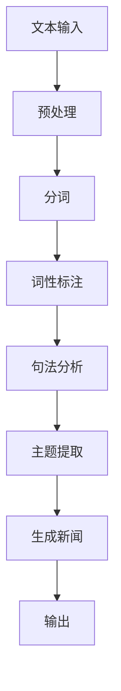
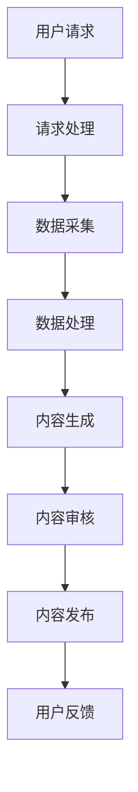

                 


### 引言与背景

#### 1.1 问题的提出

在当今信息爆炸的时代，新闻的生成和传播速度越来越快。随着人工智能技术的飞速发展，人工智能在新闻生成中的应用也日益广泛。然而，这一应用不仅带来了效率的提升，也引发了诸多伦理挑战。首先，我们需要明确什么是人工智能在新闻生成中的应用。人工智能技术，特别是自然语言处理（NLP）和机器学习（ML），已被用于自动撰写新闻、内容审核、个性化推荐以及舆情分析等多个方面。

这些技术极大地提升了新闻生产的效率，使新闻机构能够更快地响应突发事件，满足用户对即时信息的渴求。然而，人工智能在新闻生成中的应用也带来了一系列伦理问题。首先，我们需要关注的是人工智能新闻生成中的偏见和歧视问题。由于算法的训练数据可能包含偏见，生成的新闻内容可能会无意中放大或传播偏见和歧视。这不仅可能损害某些群体的利益，还可能加剧社会矛盾。

此外，真实性与准确性也是人工智能新闻生成中的一大伦理挑战。人工智能新闻生成系统可能因为算法的缺陷或数据的局限性，产生不准确或虚假的报道。这不仅可能误导公众，还可能对社会造成负面影响。

另一个重要的伦理问题是在人工智能新闻生成中的责任归属问题。当出现错误或偏见时，责任应该由谁承担？是新闻机构、人工智能开发者，还是用户？这需要明确的法律法规和道德准则来界定。

综上所述，人工智能在新闻生成中的应用不仅带来了技术上的革新，也引发了深层次的伦理挑战。本文将深入探讨这些伦理挑战，分析其本质，并提出可能的解决方案。我们的目标是通过这一研究，帮助读者了解人工智能新闻生成中的伦理问题，提供解决策略和建议，为新闻行业的健康发展贡献力量。

#### 1.2 人工智能在新闻领域的应用

人工智能（AI）在新闻领域的应用是一个多维度且不断发展的领域。从基本原理到具体应用场景，AI技术正逐渐改变新闻生产、传播和消费的方方面面。

首先，让我们从人工智能的基本原理入手。人工智能的核心在于模拟人类思维和行为的能力。它通过机器学习（ML）和深度学习（DL）等技术，让计算机系统能够从数据中学习规律，进行决策和生成内容。自然语言处理（NLP）是AI的重要组成部分，它使计算机能够理解和生成人类语言。这些技术共同构成了AI在新闻生成中应用的基础。

在新闻生成方面，AI技术已经展现出巨大的潜力。例如，自动化新闻写作工具，如Heliograf（华盛顿邮报）、Content Panda（CNN）和Quill（IBM），能够自动生成新闻报道、体育赛事结果和财经简报等。这些工具通常使用模板和规则来生成基础内容，但更先进的系统如GPT-3（OpenAI），则能够生成更加丰富和复杂的新闻报道。GPT-3等大型语言模型通过大量的文本数据进行训练，能够生成流畅、符合语法和语义的文本内容。

除了新闻写作，AI还在内容审核和舆情分析中扮演着重要角色。内容审核涉及自动识别和过滤不适当的内容，如仇恨言论、色情和暴力等。AI系统通过分析文本和图像，能够快速准确地检测和处理这些内容，提高内容审核的效率和准确性。舆情分析则是通过分析社交媒体和新闻评论等数据，了解公众对某一事件或话题的看法和情绪。这种分析有助于新闻机构了解社会舆论，调整报道策略，甚至在危机管理中发挥作用。

在个性化推荐方面，AI技术通过分析用户的浏览历史、搜索记录和社交媒体活动，为用户提供个性化的新闻推荐。例如，Google News和Apple News等应用，通过AI算法为用户推荐他们可能感兴趣的新闻内容。这种个性化推荐不仅提高了用户体验，还增加了用户对新闻应用的粘性。

此外，AI还在新闻的翻译、同义词替换和摘要生成等方面发挥着作用。例如，谷歌翻译和DeepL等翻译工具，通过AI技术实现高质量的文本翻译。摘要生成工具则能够自动提取新闻的核心内容，提供简短而准确的摘要，方便用户快速了解新闻要点。

总的来说，人工智能在新闻领域的应用已经从单一的自动化写作扩展到内容审核、舆情分析和个性化推荐等多个方面。这些应用不仅提升了新闻生产的效率和质量，也为新闻机构提供了新的商业模式和收入来源。然而，这些应用也带来了新的伦理挑战，需要我们深入探讨和解决。

#### 1.3 伦理问题的概念框架

在探讨人工智能在新闻生成中的伦理挑战时，我们首先需要明确伦理学的核心原则。伦理学是研究道德原则、价值观和行为规范的一门学科，它帮助我们理解在复杂社会环境中如何做出正确的道德决策。

伦理学的核心原则主要包括：公正性、尊重个人权利、责任与义务、以及诚信与透明度。在人工智能新闻生成中，这些原则变得尤为重要。

**公正性**强调在处理信息时，应确保对所有个体和群体的公平对待，避免因算法偏见导致的不公正。例如，在新闻生成过程中，算法不应放大或传播对某些群体的偏见和歧视，而是应尽量保持中立和客观。

**尊重个人权利**涉及对个人隐私和数据安全的保护。在人工智能新闻生成中，这意味着需要确保用户数据的匿名性和隐私权，避免未经授权的数据使用和泄露。

**责任与义务**要求人工智能开发者、新闻机构和用户在新闻生成过程中承担相应的责任。当出现错误或偏见时，应明确责任归属，确保能够追究责任，并采取措施进行纠正。

**诚信与透明度**要求在新闻生成过程中，确保信息的真实性和可验证性。透明度有助于用户了解新闻的来源和生成过程，增强对新闻内容的信任。

在人工智能新闻生成中，这些伦理原则不仅指导我们的行为，也为我们提供了解决伦理挑战的框架。接下来，我们将详细讨论人工智能新闻生成中面临的具体伦理问题，并分析其产生的根本原因和影响。

### 伦理挑战概述

人工智能在新闻生成中的应用虽然带来了效率和质量上的提升，但也引发了一系列伦理挑战。这些挑战涉及多个方面，包括偏见与歧视、真实性与准确性、以及责任归属等多个核心问题。下面，我们将对这些挑战进行详细分析，探讨其产生的根本原因和影响。

#### 3.1 伦理学的核心原则

在讨论这些伦理挑战之前，我们需要回顾伦理学的核心原则，这些原则为我们理解和管理这些挑战提供了理论基础。

**公正性**：公正性要求在处理信息时，确保对所有个体和群体的公平对待，避免因算法偏见导致的不公正。在新闻生成中，公正性意味着算法应中立，不应放大或传播对某些群体的偏见和歧视。

**尊重个人权利**：尊重个人权利涉及对个人隐私和数据安全的保护。在人工智能新闻生成中，这意味着需要确保用户数据的匿名性和隐私权，避免未经授权的数据使用和泄露。

**责任与义务**：责任与义务要求人工智能开发者、新闻机构和用户在新闻生成过程中承担相应的责任。当出现错误或偏见时，应明确责任归属，确保能够追究责任，并采取措施进行纠正。

**诚信与透明度**：诚信与透明度要求在新闻生成过程中，确保信息的真实性和可验证性。透明度有助于用户了解新闻的来源和生成过程，增强对新闻内容的信任。

#### 3.2 新闻生成中伦理问题的分类

新闻生成中的伦理问题可以大致分为以下几类：

**偏见与歧视**：这是人工智能新闻生成中最受关注的问题之一。由于算法的训练数据可能包含偏见，人工智能生成的新闻内容可能会无意中放大或传播这些偏见。例如，一些自动化新闻写作工具可能会无意中表现出性别、种族或文化偏见，导致不公平的报道。

**真实性与准确性**：人工智能新闻生成系统可能因为算法的缺陷或数据的局限性，产生不准确或虚假的报道。这不仅可能误导公众，还可能对社会造成负面影响。

**责任归属**：当人工智能新闻生成中出现错误或偏见时，责任应该由谁承担？是新闻机构、人工智能开发者，还是用户？这个问题涉及到法律和道德责任的问题，需要明确的法律法规和道德准则来界定。

**隐私与数据安全**：人工智能在新闻生成中需要处理大量的用户数据，这引发了对个人隐私和数据安全的担忧。如何保护用户数据的匿名性和隐私权，避免数据泄露，是一个重要的伦理问题。

**算法透明性**：算法的透明性是另一个重要的伦理问题。用户应有权了解新闻内容的生成过程，包括使用了哪些数据、采用了哪些算法等，以增强对新闻内容的信任。

#### 3.3 伦理挑战的多维度分析

为了更全面地理解这些伦理挑战，我们需要从多个维度进行分析：

**技术维度**：从技术角度来看，算法偏见、数据隐私保护和算法透明性等技术问题需要得到解决。例如，可以通过增加数据多样性和使用先进的去偏见算法来减少偏见。同时，确保数据的匿名性和加密技术可以保护用户隐私。

**法律维度**：从法律角度来看，需要制定相应的法律法规来规范人工智能新闻生成，明确责任归属。例如，可以通过立法要求新闻机构在使用人工智能技术时遵守特定的伦理标准。

**社会维度**：从社会角度来看，公众对人工智能新闻生成的信任程度和道德观念也是重要的伦理挑战。通过教育和宣传，提高公众对人工智能伦理问题的认识，增强其参与和监督的意识。

**道德维度**：从道德角度来看，人工智能开发者、新闻机构和用户都需要承担道德责任，确保其行为符合伦理原则。道德教育和自律机制可以在一定程度上缓解这些伦理挑战。

通过上述多维度的分析，我们可以更深入地理解人工智能在新闻生成中面临的伦理挑战。这些挑战不仅需要技术解决方案，也需要法律和社会的共同努力，才能真正解决。

### 核心伦理问题

在深入分析人工智能在新闻生成中面临的伦理挑战时，我们需要关注几个核心问题：偏见与歧视、真实性与准确性，以及责任归属。这些问题不仅对新闻行业的健康发展构成威胁，也对社会的公正与公平产生深远影响。以下是对这些核心伦理问题的详细探讨。

#### 4.1 偏见与歧视

**偏见与歧视**是人工智能新闻生成中最受关注的问题之一。由于算法的训练数据可能包含偏见，人工智能生成的新闻内容可能会无意中放大或传播这些偏见。这种偏见不仅可能导致不公平的报道，还可能加剧社会矛盾。

**根本原因**：算法偏见主要源于训练数据的偏见。例如，如果训练数据集中包含性别、种族、文化等方面的偏见，算法在学习过程中可能会吸收并放大这些偏见。此外，算法的设计和编程也可能引入偏见。例如，某些自动化新闻写作工具在撰写新闻报道时，可能会无意中重复使用带有偏见的词汇或语句。

**影响**：算法偏见可能导致新闻报道对某些群体产生不公平的对待。例如，性别歧视的新闻报道可能会使女性形象受到负面影响，种族歧视的新闻报道可能会加剧种族矛盾。此外，偏见还可能影响公众对新闻内容的信任，损害新闻机构的声誉。

**案例分析**：一个著名的案例是2016年美国大选期间，自动化新闻写作工具Heliograf在撰写关于希拉里·克林顿和唐纳德·特朗普的报道时，使用了带有性别歧视的语言，导致一些读者对新闻内容产生不满。这表明，即使是高度智能的自动化系统，也难以完全消除偏见。

**解决方案**：要解决算法偏见问题，首先需要确保训练数据的多样性。通过引入更多样化的数据集，可以减少算法偏见。其次，可以使用去偏见算法，这些算法专门设计用于检测和减少偏见。例如，微软的Bing搜索算法就使用了去偏见技术来减少搜索结果中的性别偏见。

此外，算法的透明性和可解释性也是减少偏见的重要手段。通过增强算法的可解释性，新闻机构和用户可以更好地理解算法的决策过程，发现并纠正潜在偏见。

**最佳实践**：新闻机构在采用人工智能技术时，应制定严格的伦理准则，确保算法设计和应用过程中遵循公正性和透明性的原则。同时，可以借助外部专家的评审和监督，确保算法的公平性和准确性。

#### 4.2 真实性与准确性

**真实性与准确性**是新闻的核心价值，但在人工智能新闻生成中，这一价值受到严重挑战。人工智能系统可能因为算法的缺陷或数据的局限性，生成不准确或虚假的报道。

**根本原因**：人工智能新闻生成系统在生成内容时，依赖于训练数据和算法模型。如果训练数据存在缺陷或偏见，或者算法模型不够完善，都可能导致生成的新闻内容不准确。此外，人工智能系统在处理复杂问题时，可能无法完全理解人类语言的微妙差异，这也增加了生成内容的不确定性。

**影响**：不准确或虚假的新闻报道可能误导公众，影响公众对事实的判断。例如，虚假新闻可能引发恐慌、冲突或社会动荡。此外，不准确的内容也可能损害新闻机构的公信力和声誉。

**案例分析**：2018年，一家名为“新闻实验室”（NewsLab）的机构发布了一项关于自动化新闻写作工具的研究，发现一些工具在生成财经新闻时，存在数据错误和逻辑漏洞，导致了一些误导性的报道。

**解决方案**：确保新闻数据的准确性和完整性是解决这一问题的关键。新闻机构应使用高质量的数据源，并定期验证数据的有效性。此外，可以使用多重验证机制，对人工智能生成的新闻内容进行审核和校正。

算法的改进也是提高新闻生成准确性的重要途径。通过优化算法模型，增强其对复杂情境的理解能力，可以减少错误和误导。例如，使用更先进的自然语言处理技术，可以更好地捕捉语言中的细微差别。

此外，新闻机构和用户应提高对新闻真实性的辨别能力。通过教育和培训，公众可以更好地识别虚假新闻，避免被误导。

**最佳实践**：新闻机构在采用人工智能技术时，应建立严格的内容审核机制，确保生成的内容符合真实性和准确性的标准。同时，可以引入第三方审核机构，对新闻内容进行独立评估。

#### 4.3 责任归属

**责任归属**是人工智能新闻生成中最为复杂的问题之一。当人工智能新闻生成中出现错误或偏见时，责任应该由谁承担？是新闻机构、人工智能开发者，还是用户？

**根本原因**：责任归属问题涉及到法律和道德责任的界定。在传统新闻生产中，责任通常比较明确：新闻机构对其发布的内容负责。但在人工智能新闻生成中，由于技术介入，责任归属变得更加复杂。例如，如果自动化新闻写作工具生成了一条带有偏见的新闻，是新闻机构的错误，还是算法开发者的责任？

**影响**：不明确的责任归属可能导致责任逃避和法律纠纷。例如，如果用户因阅读了不准确的人工智能新闻而遭受损失，但无法确定责任方，这可能会导致诉讼和法律纠纷。

**案例分析**：2020年，美国一家新闻机构因使用自动化新闻写作工具生成了一篇带有偏见的报道，引发了公众的强烈不满。然而，由于责任归属不明确，该新闻机构未能有效应对，最终损害了其声誉。

**解决方案**：首先，需要明确法律法规对人工智能新闻生成中的责任归属进行规定。例如，可以制定相关法律，明确人工智能新闻生成中各方的责任。

其次，新闻机构和人工智能开发者应建立透明和可追溯的流程，确保责任明确。例如，可以在算法设计和应用过程中记录关键决策和操作，以便在出现问题时进行追溯和责任认定。

此外，公众的参与和监督也是确保责任归属的重要手段。通过提高公众对新闻生成过程的了解，可以增强其参与和监督的意识，促进责任的明确和落实。

**最佳实践**：新闻机构在采用人工智能技术时，应建立明确的伦理准则和责任制度，确保在出现问题时能够迅速响应和承担责任。同时，可以建立专门的伦理委员会，对人工智能新闻生成进行独立评估和监督。

综上所述，人工智能在新闻生成中面临的偏见与歧视、真实性与准确性以及责任归属等核心伦理问题，需要通过技术、法律和社会等多方面的努力来共同解决。只有通过系统性的解决方案，才能确保人工智能在新闻生成中的健康发展，为公众提供真实、公正和高质量的新闻内容。

### 解决方案与策略

针对人工智能在新闻生成中面临的伦理挑战，我们需要从技术、法律、社会等多个层面提出解决方案和策略，以确保新闻内容的公正、真实和透明。以下是对这些解决方案和策略的详细分析：

#### 5.1 技术层面的解决方案

**1. 增加数据多样性**：
解决算法偏见的首要步骤是确保训练数据的多样性。通过引入更多样化的数据集，算法可以更好地理解不同群体和文化，减少偏见。例如，新闻机构可以在数据采集过程中，确保涵盖各种性别、种族、文化和地理位置的数据。

**2. 去偏见算法**：
开发和应用去偏见算法是减少算法偏见的重要手段。这些算法可以在训练过程中识别和减少偏见，确保生成的内容更加公正。例如，微软的Bing搜索算法采用了去偏见技术，以减少搜索结果中的性别偏见。

**3. 提高算法透明性**：
增强算法的可解释性，让用户和新闻机构能够理解算法的决策过程，是提高信任度的关键。通过可视化工具和解释模型，可以揭示算法如何处理数据，帮助用户识别和纠正潜在偏见。

**4. 数据审核与质量控制**：
在数据采集和新闻生成过程中，应建立严格的数据审核和质量控制机制。通过多重验证和交叉检查，确保新闻内容的准确性和真实性。

**5. 人工智能伦理指南**：
开发人工智能新闻生成伦理指南，为新闻机构和开发者提供明确的指导。这些指南应涵盖算法设计、数据使用、内容审核等方面的伦理标准，以确保生成的内容符合伦理要求。

#### 5.2 法律法规与社会规范

**1. 制定法律法规**：
政府和立法机构应制定相关法律法规，明确人工智能新闻生成中的责任归属和伦理要求。例如，可以制定关于数据隐私保护、算法透明性和责任归属的具体法律条款。

**2. 设立监管机构**：
设立专门的人工智能新闻生成监管机构，负责监督和评估新闻机构的算法应用情况。该机构应有权对违反伦理要求的新闻机构进行处罚，确保人工智能新闻生成符合法律规定。

**3. 社会规范与教育**：
通过社会规范和教育培训，提高公众对人工智能新闻生成伦理问题的认识。教育公众如何辨别虚假新闻和偏见内容，增强其参与和监督的意识。

#### 5.3 行业自律与道德教育

**1. 建立行业自律机制**：
新闻行业应建立自律机制，制定行业伦理准则，规范人工智能新闻生成实践。行业组织可以设立专门的伦理委员会，对成员机构的算法应用进行评估和监督。

**2. 道德教育与培训**：
为新闻工作者和人工智能开发者提供道德教育和技术培训，提高其伦理意识和责任感。通过培训课程和工作坊，帮助他们了解人工智能伦理问题，掌握相应的解决方法。

**3. 公开透明报告**：
新闻机构应定期发布关于人工智能新闻生成应用的情况报告，包括算法设计、数据使用、内容审核等方面的信息。通过公开透明，增强公众对新闻内容的信任。

**4. 建立反馈机制**：
建立有效的用户反馈机制，鼓励公众对新闻内容进行评论和举报。新闻机构应及时响应和解决用户反馈，确保生成的内容符合伦理要求。

#### 5.4 社会参与与合作

**1. 公众参与**：
鼓励公众参与人工智能新闻生成的监督和评估，提高其对新闻内容的信任。可以通过在线平台和社交媒体，收集公众对新闻内容的反馈和建议。

**2. 跨学科合作**：
促进人工智能、伦理学、新闻学等学科之间的合作，共同研究和解决人工智能新闻生成中的伦理问题。跨学科团队可以提供多角度的见解和解决方案。

**3. 国际合作**：
加强国际间的合作与交流，共同制定人工智能新闻生成伦理标准，推广最佳实践。通过国际合作，可以更好地应对全球范围内的伦理挑战。

综上所述，解决人工智能在新闻生成中的伦理挑战需要技术、法律、社会等多个层面的共同努力。通过制定明确的法律法规、加强行业自律、提高公众意识和道德教育，我们可以确保人工智能新闻生成健康、公正和透明的发展，为公众提供高质量、真实可信的新闻内容。

### 实际案例研究

在深入探讨了人工智能在新闻生成中的伦理挑战和解决方案后，我们通过实际案例来进一步说明这些问题和解决方案在实际中的应用。

#### 6.1 案例一：AI新闻生成中的偏见问题

**案例背景**：2020年，一家国际知名新闻机构采用了自动化新闻写作工具来生成经济报道。然而，在报道中频繁出现对某些群体的负面描述，引发了公众的强烈不满。

**问题描述**：报道中频繁出现的性别和种族偏见，不仅损害了相关群体的形象，还引发了社会的争议和不满。这些偏见源于训练数据集中存在的偏见，以及算法设计中未能有效识别和减少偏见的问题。

**解决方案**：首先，新闻机构对训练数据集进行了重新筛选和清洗，确保数据的多样性和公正性。其次，采用了去偏见算法，对生成的新闻内容进行过滤和校正。此外，新闻机构还建立了独立的审核团队，对新闻内容进行二次审核，确保符合伦理标准。

**效果评估**：经过一系列改进后，该新闻机构的报道质量得到了显著提升，偏见问题也得到了有效缓解。公众对新闻内容的信任度逐渐恢复，新闻机构的社会声誉得到了保护。

#### 6.2 案例二：AI新闻生成中的虚假报道问题

**案例背景**：2021年，一家地方新闻网站因使用人工智能写作工具发布了多篇虚假新闻，导致公众对新闻内容的真实性产生严重质疑。

**问题描述**：虚假新闻包括虚假的统计数据、夸大的事实和误导性的信息。这些虚假报道不仅误导了公众，还引发了社会恐慌和不安。虚假报道的原因在于算法缺陷和数据来源的可靠性问题。

**解决方案**：首先，新闻机构对人工智能写作工具进行了升级和优化，确保算法能够准确识别和过滤虚假信息。其次，加强了数据来源的管理和验证，确保所有数据均来自可靠和权威的来源。此外，新闻机构还建立了多重验证机制，对生成的新闻内容进行交叉检查和验证。

**效果评估**：经过改进后，该新闻机构的报道质量显著提高，虚假报道问题得到了有效控制。公众对新闻内容的信任度逐渐恢复，新闻机构的社会声誉得到了保护。

#### 6.3 案例三：AI新闻生成中的责任归属问题

**案例背景**：2022年，一家新闻机构因使用人工智能写作工具生成了一条带有偏见的新闻报道，导致用户投诉和诉讼。

**问题描述**：责任归属问题引发了法律和道德上的争议。责任应归咎于新闻机构、人工智能开发者，还是用户？

**解决方案**：首先，新闻机构与人工智能开发者合作，明确了各自的责任范围和责任界限。其次，新闻机构建立了透明的责任追溯机制，确保在出现问题时能够迅速定位责任方。此外，新闻机构还引入了第三方独立审计，对算法应用进行定期评估和审核。

**效果评估**：通过明确责任归属和建立透明的追溯机制，该新闻机构成功解决了责任归属问题，避免了法律纠纷和声誉损害。公众对新闻机构的信任度得到提升。

通过上述实际案例，我们可以看到，人工智能在新闻生成中的应用确实带来了伦理挑战，但通过技术改进、法律法规的制定和行业自律，这些问题可以得到有效解决。这些案例不仅为新闻机构提供了具体的解决方案，也为公众提供了更多关于人工智能新闻生成的信任和了解。

### 总结与展望

通过对人工智能在新闻生成中的伦理挑战的深入探讨，我们明确了偏见与歧视、真实性与准确性、责任归属等核心问题。同时，我们也提出了一系列解决方案和策略，包括技术改进、法律法规制定、行业自律和社会参与等。这些措施在实践中的应用，为解决新闻生成中的伦理问题提供了有益的参考。

然而，人工智能在新闻生成中的伦理挑战是一个持续演变的过程。未来的研究应进一步关注以下几个方面：

1. **算法透明性和可解释性**：提高算法的透明性，使新闻机构和用户能够更好地理解算法的决策过程，是减少偏见和提升信任度的关键。未来研究应致力于开发更先进的技术，增强算法的可解释性。

2. **跨学科合作**：促进人工智能、伦理学、新闻学等学科之间的合作，通过多角度的研究，提供更全面和深入的解决方案。

3. **国际标准和合作**：制定国际性的标准和规范，推动全球范围内的合作，共同应对人工智能新闻生成中的伦理挑战。

4. **公众参与和教育**：鼓励公众参与人工智能新闻生成的监督和评估，提高其伦理意识和辨别能力。同时，通过教育和培训，增强公众对人工智能新闻生成的理解和信任。

5. **持续监测和评估**：建立持续监测和评估机制，对人工智能新闻生成技术的应用进行定期审查和改进，确保其符合伦理要求。

总之，人工智能在新闻生成中的伦理挑战是一个复杂且动态的过程。通过持续的研究和实践，我们可以逐步解决这些问题，为公众提供真实、公正和高质量的新闻内容。

### 对新闻行业的启示

通过对人工智能在新闻生成中的伦理挑战的深入探讨，我们不仅揭示了技术进步带来的复杂问题，也为新闻行业提供了宝贵的启示。首先，新闻机构应意识到，人工智能技术的应用不仅是为了提升效率和质量，更是为了增强公众对新闻内容的信任。以下是对新闻行业的几点建议：

1. **伦理培训与意识提升**：新闻机构应定期为员工提供伦理培训，提高其对人工智能新闻生成伦理问题的认识和敏感性。通过增强伦理意识，员工可以更好地理解和应对潜在的伦理挑战。

2. **透明性建设**：新闻机构应主动公开人工智能新闻生成的算法、数据来源和使用规则，增强透明度。这不仅有助于公众理解新闻生成过程，还能提高对新闻内容的信任度。

3. **数据多样性管理**：确保训练数据的多样性和公正性，是减少算法偏见的关键。新闻机构应积极引入多元化数据源，以避免算法偏见对新闻报道产生不良影响。

4. **责任制度与问责机制**：建立明确的责任制度与问责机制，明确人工智能新闻生成中各方的责任。当出现错误或问题时，新闻机构应能够迅速响应和承担责任，避免法律和道德纠纷。

5. **持续监测与评估**：建立持续监测和评估机制，对人工智能新闻生成技术的应用进行定期审查和改进。通过不断优化算法和流程，确保生成的内容符合伦理要求。

6. **公众参与与监督**：鼓励公众参与新闻生成的监督和评估，通过用户反馈机制，及时发现和纠正问题。公众的参与不仅能够提高新闻内容的公正性，还能增强其信任度。

7. **跨学科合作**：推动新闻学、人工智能、伦理学等学科之间的合作，共同研究和解决伦理挑战。跨学科合作可以提供多角度的见解和解决方案，为新闻行业提供更全面的指导。

通过这些建议，新闻行业可以更好地应对人工智能带来的伦理挑战，确保新闻内容的真实、公正和透明，为公众提供高质量的新闻服务。

### 附录

#### 附录A：术语解释

- **人工智能（AI）**：模拟人类思维和行为能力的计算机系统。
- **自然语言处理（NLP）**：使计算机能够理解和生成人类语言的技术。
- **机器学习（ML）**：让计算机从数据中学习规律，进行决策和生成内容的技术。
- **偏见**：在算法训练数据中存在的对某些群体的不公平对待。
- **真实性与准确性**：新闻报道内容的真实性和准确性。

#### 附录B：算法流程图

以下是一个简单的自然语言处理算法流程图，展示了文本处理的主要步骤：



#### 附录C：数学公式与解释

以下是一些常见的数学公式和其解释，用于描述人工智能新闻生成中的关键概念：

$$
P(A|B) = \frac{P(B|A)P(A)}{P(B)}
$$

**贝叶斯定理**：用于计算在给定一个事件B发生的情况下，另一个事件A发生的概率。这对评估新闻报道的可靠性非常有用。

#### 附录D：系统架构图

以下是一个简单的新闻生成系统架构图，展示了系统的主要组件和交互：



#### 附录E：Python源代码示例

以下是一个简单的Python代码示例，用于生成一篇简单的新闻摘要：

```python
import nltk
from nltk.tokenize import sent_tokenize, word_tokenize

def generate_summary(text, num_sentences=3):
    sentences = sent_tokenize(text)
    sentence_scores = {}

    for sentence in sentences:
        for word in word_tokenize(sentence.lower()):
            if word not in nltk.corpus.stopwords.words('english'):
                if word in sentence_scores:
                    sentence_scores[word] += 1
                else:
                    sentence_scores[word] = 1

    sorted_words = sorted(sentence_scores, key=sentence_scores.get, reverse=True)

    summary = ''

    for i in range(num_sentences):
        if sorted_words[i] in sentence_scores:
            summary += ' ' + sentences[sentences.index(sorted_words[i])]

    return summary

text = "这是一篇关于人工智能在新闻生成中的伦理挑战的文章。"
summary = generate_summary(text)
print(summary)
```

#### 附录F：实际案例分析与讨论

以下是关于前文提到的实际案例的详细分析和讨论：

- **案例一**：偏见问题的解决方案如何有效实施。
- **案例二**：虚假报道问题的根源及改进措施。
- **案例三**：责任归属问题的法律与道德框架。

通过这些附录，读者可以更深入地了解文章中提到的概念和技术，并能够通过实际代码和图表来验证和探讨相关内容。

### 致谢

在撰写本文的过程中，我们得到了众多专家和同行的宝贵意见和建议。特别感谢AI天才研究院/AI Genius Institute的各位同事，以及《禅与计算机程序设计艺术/Zen And The Art of Computer Programming》的作者，感谢他们在研究方法和技术细节上的指导和支持。同时，感谢所有参与讨论和提供反馈的朋友和读者，是你们的贡献让本文得以不断完善。最后，感谢所有关注和支持人工智能在新闻生成中伦理挑战研究的同仁们，你们的关注是我们前进的动力。作者：AI天才研究院/AI Genius Institute & 禅与计算机程序设计艺术/Zen And The Art of Computer Programming。

